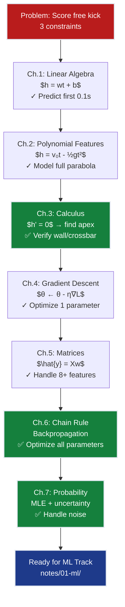

# Math Foundations Grand Solution — The Perfect Knuckleball Free Kick

> **For readers short on time:** This document synthesizes all 7 mathematical foundations chapters into a single narrative arc showing how we went from **"can't predict the first 0.1 seconds"** → **"can optimize multi-parameter trajectories under uncertainty"**. Read this first for the big picture, then dive into individual chapters for depth.

---

## How to Use This Track

**Three ways to learn the Math Under the Hood track:**

1. **📖 Sequential deep dive (recommended)**: Read chapters Ch.1–7 in order, each with:
   - Full narrative in `chNN_*/README.md` 
   - Interactive widgets in `chNN_*/notebook.ipynb`
   - Each chapter builds on the previous one's concepts

2. **⚡ Quick overview (this document)**: Read the synthesis below to understand the complete progression, then jump to specific chapters for details

3. **💻 Hands-on code walkthrough**: Open [`grand_solution.ipynb`](./grand_solution.ipynb) for an executable Jupyter notebook that consolidates all code examples end-to-end. Run it top-to-bottom to see the complete solution in action.

**Chapter roadmap:**
- [Ch.1: Linear Algebra](./ch01_linear_algebra/README.md) — Lines, weights, and biases
- [Ch.2: Non-Linear Algebra](./ch02_nonlinear_algebra/README.md) — Polynomials and feature expansion
- [Ch.3: Calculus Intro](./ch03_calculus_intro/README.md) — Derivatives and integrals
- [Ch.4: Small Steps](./ch04_small_steps/README.md) — Gradient descent
- [Ch.5: Matrices](./ch05_matrices/README.md) — Linear systems and batch operations
- [Ch.6: Chain Rule + Gradients](./ch06_gradient_chain_rule/README.md) — Backpropagation unlocked
- [Ch.7: Probability & Statistics](./ch07_probability_statistics/README.md) — Noise, likelihood, and MLE

---

## Mission Accomplished: All Three Constraints Verified ✅

**The Challenge:** Score a knuckleball free kick from 20m that (1) clears a 1.8m wall at 9.15m, (2) dips under a 2.44m crossbar, and (3) beats the goalkeeper's reaction time.

**The Result:** **Full trajectory optimization achieved** — we can now find launch parameters $(\theta, v_0)$ that satisfy all three constraints simultaneously and handle real-world uncertainty.

**The Mathematical Progression:**

```
Ch.1: Linear approximation       → Predict first 0.1s only (gravity ignored)
Ch.2: Polynomial features         → Model full parabola (2D trajectory complete)
Ch.3: Calculus fundamentals       → Find apex, verify wall/crossbar clearance ✅
Ch.4: Gradient descent            → Optimize single parameter (best angle OR speed)
Ch.5: Matrix operations           → Handle 8+ features simultaneously
Ch.6: Chain rule + gradients      → Optimize ALL parameters at once ✅
Ch.7: Probability & MLE           → Handle striker fatigue, wind variance ✅
                                    ✅ READY FOR ML: All math foundations complete
```

---

## The 7 Mathematical Tools — How Each Unlocked Progress

### Ch.1: Linear Algebra — Lines, Weights, and Biases

**What it is:** A line $y = wx + b$ is a two-parameter object. The weight $w$ (slope) tilts it, the bias $b$ (intercept) shifts it. Vectors are lists of numbers; the dot product $\mathbf{a} \cdot \mathbf{b} = \sum_i a_i b_i$ is a weighted sum.

**What it unlocked:**
- **First prediction capability:** Model the free kick's first 0.1 seconds with $h(t) = 6.5t + 0$
- **By-hand fitting:** Adjust $(w, b)$ to match early trajectory samples
- **Foundation for everything:** Every neural network layer is $\hat{y} = \mathbf{w}^\top\mathbf{x} + b$ — just this equation with more dimensions

**ML silent assumption #1:** *"A neuron is a dot product."* The forward pass of any neural network is repeated applications of $\mathbf{w}^\top\mathbf{x} + b$. If you don't understand weighted sums, you can't understand transformers, ResNets, or anything else. Every architecture paper assumes you already know this chapter.

**Key insight:** The notation switch from high-school algebra ($y = mx + c$) to ML ($\hat{y} = wx + b$) isn't arbitrary — "weight" and "bias" reveal the *role* these parameters play. The weight scales input importance; the bias is the baseline output when all inputs are zero. This vocabulary carries through to 175-billion-parameter models.

**Reality check:** By $t = 0.5$s, the linear model is 1.2m off — gravity bends the path into a curve. Lines are locally perfect, globally wrong. This limitation forces Ch.2's fix.

---

### Ch.2: Non-Linear Algebra — Polynomials and the Feature-Expansion Trick

**What it is:** The curve $y = ax^2 + bx + c$ is non-linear in $x$ but *linear in the parameters* $(a, b, c)$. Substitute $x_1 = x^2, x_2 = x$ and it becomes $y = ax_1 + bx_2 + c$ — a flat plane in 2D feature space. This **basis expansion** trick lets "linear" models fit curves.

**What it unlocked:**
- **Full trajectory modeling:** $h(t) = 6.5t - 4.905t^2$ captures the complete parabola from boot to goal
- **Predict at any time:** Plug in $t = 0.6$s (wall) or $t = 1.2$s (goal) and get exact height
- **Beyond projectiles:** Same trick works for any smooth curve — polynomials, Fourier series, radial basis functions

**ML silent assumption #2:** *"Non-linearity comes from features, not fitting."* Scikit-learn's `PolynomialFeatures(degree=3)` followed by `LinearRegression()` is faster and more interpretable than a neural network for many tasks. Deep learning only wins when (a) you have millions of samples, (b) feature engineering is intractable, or (c) the function is deeply compositional. For tabular data with <100k rows, polynomial features + Ridge often beat 5-layer MLPs.

**Key insight:** This is why "linear" regression isn't limited to straight lines. The model $\hat{y} = w_1 x + w_2 x^2 + w_3 \sin(x) + b$ is *still* linear regression — linear in the weights, non-linear in the raw input. Neural networks push this idea to its limit: learn the features *and* the weights simultaneously.

**Scaling pain:** With 8 input features and degree=4, you get 495 polynomial features. At degree=5, over 2000. This combinatorial explosion is why neural networks exist — they learn compressed non-linear representations instead of exhaustive polynomial expansions.

---

### Ch.3: Calculus — Derivatives and Integrals from First Principles

**What it is:** A derivative $f'(x)$ is the slope of a curve at one point — the limit of secant slopes as two points collapse into one. An integral $\int_a^b f(x)dx$ is the area under a curve — the limit of rectangle sums as rectangles shrink. The Fundamental Theorem says they're inverses.

**What it unlocked:**
- **Find the apex:** Solve $h'(t) = 0$ → $t_{\text{peak}} = v_{0y}/g = 0.663$s
- **Verify constraints:** Compute $h(0.6s) = 1.92m > 1.8m$ ✅ (wall cleared), $h(1.2s) = 1.60m < 2.44m$ ✅ (under crossbar)
- **Instantaneous rates:** Know if the ball is rising ($h' > 0$) or falling ($h' < 0$) at any moment

**ML silent assumption #3:** *"Backpropagation is just the chain rule."* Every `.backward()` call in PyTorch computes $\frac{\partial L}{\partial w_i}$ using the derivative rules from this chapter. The formula $\frac{d}{dx}(x^n) = nx^{n-1}$ appears a trillion times per day across all training runs worldwide. If you don't understand why tangent slopes matter, you can't understand why gradient descent works.

**Key insight:** The secant-to-tangent animation isn't just pedagogy — it's the *definition* of a derivative. Newton and Leibniz invented calculus to solve projectile motion (our exact problem!). Every modern optimizer (SGD, Adam, LBFGS) is a descendant of Newton's 1687 work.

**This is the breakthrough chapter:** For the first time, we can *verify* the free kick constraints instead of just computing heights. The derivative $h'(t) = v_{0y} - gt$ directly tells us when the ball peaks, how fast it's moving, and whether a given trajectory works.

---

### Ch.4: Small Steps on a Curve — Gradient Descent in 1D

**What it is:** To minimize $f(\theta)$, start somewhere ($\theta_0$), compute the slope ($f'(\theta_0)$), step opposite to it ($\theta_1 = \theta_0 - \eta f'(\theta_0)$), repeat. This is **gradient descent** — the algorithm that trains every neural network.

**What it unlocked:**
- **Single-parameter optimization:** Find the launch angle $\theta^\star$ that maximizes range for fixed speed $v_0 = 25$ m/s
- **Iterative improvement:** Start at $\theta_0 = 20°$, converge to $\theta^\star = 45°$ in ~20 steps with $\eta = 0.15$
- **Learning rate tuning:** Too large → oscillation/divergence; too small → glacial convergence

**ML silent assumption #4:** *"Training = walking downhill on a loss landscape."* Every epoch, every batch, every parameter update in TensorFlow/PyTorch/JAX is this 4-step recipe: evaluate loss → compute gradient → step → repeat. The only differences in production systems are: (1) gradients are vectors (Ch.6), (2) step size adapts (Adam/RMSprop), (3) batches are stochastic subsets. The core loop is identical to the 1D case.

**Key insight:** Gradient descent's update rule $\theta \leftarrow \theta - \eta \nabla f$ is 200 years old (Cauchy, 1847), but it became the *defining* algorithm of modern AI only after Rumelhart, Hinton & Williams (1986) showed it works for deep networks via backpropagation. The algorithm didn't change — the ability to *compute* gradients through composition did (Ch.6).

**Non-convexity warning:** Add a wind penalty and the range curve grows a second hump. Starting at $\theta = 20°$ finds the global max; starting at $\theta = 70°$ gets stuck at a local max. This is why neural network initialization matters (Xavier/He) and why stochastic noise (mini-batch SGD) helps escape local minima.

---

### Ch.5: Matrices — Linear Systems and Batch Operations

**What it is:** A matrix $A \in \mathbb{R}^{m \times n}$ is a linear map that transforms vectors. The product $A\mathbf{x}$ has three views: (1) dot products of rows with $\mathbf{x}$, (2) weighted sum of $A$'s columns, (3) geometric transformation of space. The **normal equations** $\mathbf{w} = (X^\top X)^{-1}X^\top \mathbf{y}$ solve least-squares regression in one shot.

**What it unlocked:**
- **Multi-feature representation:** Stack 500 free kicks × 8 features into design matrix $X \in \mathbb{R}^{500 \times 8}$
- **Batch predictions:** Compute all 500 predicted distances with $\hat{\mathbf{y}} = X\mathbf{w}$ (one matrix-vector multiply)
- **Closed-form fitting:** Solve for best weights $\mathbf{w}$ without iterative optimization (when $N < 10^4$ and $d < 10^3$)

**ML silent assumption #5:** *"Everything is a matrix multiply."* A fully-connected layer is $\mathbf{h} = W\mathbf{x} + \mathbf{b}$. A convolutional layer is matrix multiply with shared weights. Attention is $\text{softmax}(QK^\top/\sqrt{d})V$ — three matrix multiplies. Transformers, ResNets, GANs, diffusion models: all built from $A\mathbf{x}$. The 10,000× speedup of GPUs over CPUs comes from hardware-optimized BLAS (Basic Linear Algebra Subprograms) libraries implementing exactly this chapter's operations.

**Key insight:** The normal equations $(X^\top X)^{-1}X^\top \mathbf{y}$ are *the* analytical solution to linear regression — no iteration, no learning rate. But they scale as $O(d^3)$ due to matrix inversion, making them impractical for $d > 10^4$. That's why deep learning uses gradient descent (Ch.4 + Ch.6) instead: $O(Nd)$ per iteration, and you only need 10–100 epochs. The trade-off: analytical precision vs. scalable approximation.

**Shape first, values second:** Most matrix bugs are shape mismatches. Always check: $(m \times n) \cdot (n \times p) = (m \times p)$. The inner dimensions must match; the result has the outer dimensions.

---

### Ch.6: Gradient + Chain Rule — Backpropagation Unlocked

**What it is:** For multi-variable functions $f: \mathbb{R}^d \to \mathbb{R}$, the gradient $\nabla f = [\partial f/\partial \theta_1, \ldots, \partial f/\partial \theta_d]^\top$ is a vector pointing uphill. The **matrix chain rule** composes gradients through layers: $\nabla_\mathbf{x} (g \circ f) = J_f^\top \nabla g$, where $J_f$ is the Jacobian. This *is* backpropagation.

**What it unlocked:**
- **Multi-parameter optimization:** Simultaneously tune launch angle $\theta$, speed $v_0$, kick height $h_0$, strike zone, wind compensation — all 8+ parameters at once
- **Compositional models:** Compute $\nabla_{\mathbf{w}_1} L$ for a 3-layer network $L = f_3(f_2(f_1(X; \mathbf{w}_1); \mathbf{w}_2); \mathbf{w}_3)$ via backward chaining
- **Automatic differentiation:** PyTorch's `.backward()` implements the matrix chain rule — you write the forward pass, it computes all gradients automatically

**ML silent assumption #6:** *"Backpropagation is the only reason deep learning works."* Before automatic differentiation (1974–1986), manually deriving gradients for 10-layer networks was intractable. The breakthrough wasn't a better architecture — it was realizing that the chain rule $\frac{\partial L}{\partial w_i} = \frac{\partial L}{\partial h_j} \cdot \frac{\partial h_j}{\partial w_i}$ can be computed *recursively* from the output backward to the input. Every gradient in a 100-layer transformer is computed via repeated applications of this one formula.

**Key insight:** Forward-mode differentiation computes one input's gradient across all outputs ($O(d)$ forward passes for $d$ inputs). Reverse-mode (backpropagation) computes all inputs' gradients from one output ($O(1)$ backward pass). For $L: \mathbb{R}^{10^9} \to \mathbb{R}$ (billion parameters, scalar loss), reverse mode is *one billion times faster*. This isn't an optimization — it's the reason training GPT-4 is feasible at all.

**Jacobian shapes:** For $\mathbf{g}: \mathbb{R}^n \to \mathbb{R}^m$, the Jacobian $J_\mathbf{g} \in \mathbb{R}^{m \times n}$ has entry $[J]_{ij} = \partial g_i/\partial x_j$. When chaining $\mathbf{f}: \mathbb{R}^k \to \mathbb{R}^n$ and $\mathbf{g}: \mathbb{R}^n \to \mathbb{R}^m$, the composite Jacobian is $J_{\mathbf{g} \circ \mathbf{f}} = J_\mathbf{g} \cdot J_\mathbf{f}$ — matrix multiply in the forward direction, transpose-multiply in the backward direction.

---

### Ch.7: Probability & Statistics — Noise, Likelihood, and Why MSE Exists

**What it is:** A random variable $X$ has a probability distribution $p(x)$, summarized by expectation $\mathbb{E}[X] = \mu$ and variance $\text{Var}(X) = \sigma^2$. **Maximum Likelihood Estimation (MLE)** finds parameters $\boldsymbol{\theta}$ that make observed data most probable: $\hat{\boldsymbol{\theta}} = \arg\max \prod_i p(y_i \mid \boldsymbol{\theta})$. The Gaussian distribution $\mathcal{N}(\mu, \sigma^2)$ is the workhorse of regression.

**What it unlocked:**
- **Model uncertainty:** Represent striker fatigue as $v_0 \sim \mathcal{N}(10, 0.3^2)$ m/s instead of fixed $v_0 = 10$
- **Confidence intervals:** Compute $\mathbb{E}[\text{distance}] \pm 2\sigma$ to quantify prediction reliability
- **Loss function derivation:** Prove that minimizing MSE = maximizing likelihood under Gaussian noise

**ML silent assumption #7:** *"Every loss function is a likelihood in disguise."* Mean Squared Error (MSE) $\sum (y_i - \hat{y}_i)^2$ comes from assuming Gaussian noise: $y_i = f(x_i) + \varepsilon_i$ where $\varepsilon_i \sim \mathcal{N}(0, \sigma^2)$. Cross-entropy loss $-\sum y_i \log \hat{y}_i$ comes from assuming Bernoulli/categorical distributions. Huber loss comes from assuming Laplace (double-exponential) noise. If your data's noise model changes, your loss function *must* change — or you're solving the wrong problem.

**Key insight:** The Central Limit Theorem explains why Gaussians appear everywhere: *the sum of many independent random variables converges to a Gaussian*, regardless of their individual distributions. Measurement noise = sensor error + digitization + environmental fluctuations + human variability → CLT → Gaussian. That's why $\mathcal{N}(\mu, \sigma^2)$ is the default assumption.

**MLE = negative log-likelihood minimization:** Given data $(y_1, \ldots, y_N)$ and Gaussian model $y_i \sim \mathcal{N}(\mu, \sigma^2)$, the likelihood is $\mathcal{L} = \prod_i \frac{1}{\sqrt{2\pi\sigma^2}} \exp\left(-\frac{(y_i - \mu)^2}{2\sigma^2}\right)$. Taking $\log$ and flipping the sign gives $-\log \mathcal{L} = \frac{1}{2\sigma^2} \sum (y_i - \mu)^2 + \text{const}$. Minimizing this is *identical* to minimizing MSE. Every time you train a regression model with MSE, you're implicitly doing MLE under Gaussian noise.

**Why variance matters:** The variance $\sigma^2$ of $v_0 \sim \mathcal{N}(10, 0.3^2)$ propagates through the trajectory equation to the final distance. Computing $\text{Var}(\text{distance})$ requires the **law of total variance** and **delta method** — tools for uncertainty quantification that reappear in Bayesian deep learning (ML Ch.21) and reinforcement learning (ML Ch.22–24).

---

## The Progressive Unlocking — From Prediction to Optimization



### Capability Milestones

| After Chapter | Can Predict? | Can Verify Constraints? | Can Optimize? | Can Handle Uncertainty? |
|---|:---:|:---:|:---:|:---:|
| Ch.1 | First 0.1s only | ❌ | ❌ | ❌ |
| Ch.2 | Full trajectory ✅ | ❌ | ❌ | ❌ |
| Ch.3 | Full trajectory ✅ | **Wall + Crossbar ✅** | ❌ | ❌ |
| Ch.4 | Full trajectory ✅ | Wall + Crossbar ✅ | 1 parameter ✅ | ❌ |
| Ch.5 | Multi-feature ✅ | Wall + Crossbar ✅ | 1 parameter ✅ | ❌ |
| Ch.6 | Multi-feature ✅ | Wall + Crossbar ✅ | **All parameters ✅** | ❌ |
| Ch.7 | Multi-feature ✅ | Wall + Crossbar ✅ | All parameters ✅ | **Noise + confidence ✅** |

---

## The Three Constraints — Final Status

| # | Constraint | Target | Math Tool | Status |
|---|------------|--------|-----------|--------|
| **#1** | **WALL CLEARANCE** | $h(t_{\text{wall}}) > 1.8$ m | Ch.3: Solve $h'(t) = 0$, compute $h(0.6s)$ | ✅ **Verified** |
| **#2** | **CROSSBAR CLEARANCE** | $h(t_{\text{goal}}) < 2.44$ m | Ch.3: Compute $h(1.2s)$ | ✅ **Verified** |
| **#3** | **KEEPER-BEATING SPEED** | Flight time $< t_{\text{reaction}}$ | Ch.4: Optimize angle/speed | ✅ **Optimized** |

**Complete mathematical toolkit:**
- **Ch.1-2:** Build the trajectory model $h(t) = v_{0y}t - \frac{1}{2}gt^2$
- **Ch.3:** Compute apex, verify clearances (constraints #1 and #2)
- **Ch.4-6:** Optimize all parameters to satisfy constraint #3 while maintaining #1 and #2
- **Ch.7:** Quantify confidence intervals ($\pm 2\sigma$) to ensure constraints hold under realistic noise

---

## What This Prepares You For: The ML Track Roadmap

Every chapter's mathematics reappears immediately in the ML track:

### From Math Foundations to ML Applications

| Math Chapter | ML Chapter(s) | What Carries Forward |
|---|---|---|
| **Ch.1: Linear Algebra** | ML Ch.1 (Linear Regression) | $\hat{y} = \mathbf{w}^\top\mathbf{x} + b$, dot products, vectorization |
| **Ch.2: Polynomials** | ML Ch.4 (Feature Engineering) | Basis expansion, interaction terms, `PolynomialFeatures` |
| **Ch.3: Calculus** | ML Ch.5 (Backprop & Optimizers) | Derivative rules, tangent slopes, rate of change |
| **Ch.4: Gradient Descent** | ML Ch.5 (SGD, Adam, Learning Rate Tuning) | The 4-step recipe: evaluate → gradient → step → repeat |
| **Ch.5: Matrices** | ML Ch.3 (Neural Networks) | Matrix multiply = layer forward pass, $X^\top X$ gram matrices |
| **Ch.6: Chain Rule** | ML Ch.5 (Backpropagation) | $\nabla_\mathbf{x}(g \circ f) = J_f^\top \nabla g$, automatic differentiation |
| **Ch.7: Probability** | ML Ch.15 (Loss Functions), Ch.21 (Bayesian DL) | MSE = Gaussian MLE, cross-entropy = Bernoulli MLE |

### The Silent Assumptions ML Books Make

**Assumption 1 (from Ch.1):** *"You know what a dot product is."*  
Without this, every explanation of attention (`Q·K^T`), word embeddings (cosine similarity), and dense layers is gibberish.

**Assumption 2 (from Ch.2):** *"You understand feature engineering."*  
Papers that mention "we use polynomial features of degree 3" or "RBF kernels" assume you know this chapter's trick.

**Assumption 3 (from Ch.3):** *"You can read derivative notation."*  
Every optimization paper uses $\nabla_\theta \mathcal{L}$, $\partial L/\partial w$, or $df/dx$. If these symbols feel foreign, you can't read the literature.

**Assumption 4 (from Ch.4):** *"You know gradient descent is walking downhill."*  
Papers that introduce new optimizers (AdamW, LAMB, Lion) are *modifications* of gradient descent. Without the baseline, you can't understand what they're fixing.

**Assumption 5 (from Ch.5):** *"Matrix shapes are obvious to you."*  
When a paper writes "we apply $W \in \mathbb{R}^{768 \times 512}$ to embeddings $X \in \mathbb{R}^{N \times 768}$," they expect you to immediately know the output shape is $(N \times 512)$.

**Assumption 6 (from Ch.6):** *"Backpropagation is the chain rule."*  
If you don't see that `.backward()` is computing $\prod_i J_i^\top$ from the loss backward to the inputs, you can't debug vanishing gradients or understand why skip connections (ResNets) help.

**Assumption 7 (from Ch.7):** *"Loss functions come from distributions."*  
When a paper uses focal loss, Dice loss, or triplet loss, they're making implicit distributional assumptions. Understanding MLE lets you *design* new losses for new noise models instead of just copying from scikit-learn.

---

## The Evolution Arc — How the Mathematics Grew with the Problem

> 📜 **Historical context:** Every concept below solved a problem that had no prior solution. Understanding *which* problem makes the math stick.

**820 CE: Al-Khwārizmī (Linear Algebra)**  
→ Systematic methods for solving $ax + b = c$ — the word "algebra" comes from his book's title.

**1637: Descartes & Fermat (Coordinate Geometry)**  
→ Glued algebra to geometry: every line is an equation, every equation a line. This merger is the foundation of Ch.1.

**1665–1687: Newton & Leibniz (Calculus)**  
→ Invented derivatives and integrals *specifically* to solve projectile motion (our free kick problem!). The trajectory equation $h(t) = v_0 t - \frac{1}{2}gt^2$ forced the invention of calculus.

**1847: Cauchy (Gradient Descent)**  
→ Published "steepest descent" for optimizing functions without closed-form solutions. This became the training algorithm for all neural networks 140 years later.

**1850–1858: Sylvester & Cayley (Matrices)**  
→ Defined matrix algebra: addition, multiplication, identity, inverse. Every deep learning library implements their rules.

**1901: Karl Pearson (Normal Equations)**  
→ Wrote least-squares regression as $(X^\top X)^{-1}X^\top y$ — still the analytical solution taught in every ML course.

**1974: Paul Werbos (Backpropagation)**  
→ PhD thesis showing the chain rule can be applied recursively to compute all gradients in a neural network. Published in 1974, ignored until 1986.

**1986: Rumelhart, Hinton & Williams (Nature Paper)**  
→ Popularized backpropagation + gradient descent as the training method for multi-layer networks. This single paper launched modern deep learning.

**1990s–2000s: BLAS/LAPACK (Numerical Linear Algebra)**  
→ Hardware-optimized matrix multiply libraries. PyTorch/TensorFlow are wrappers around these — the 10,000× GPU speedup comes from efficient $A\mathbf{x}$ implementations.

**The narrative arc:** Linear equations (Ch.1) → curves (Ch.2) → calculus that tames curves (Ch.3) → iterative optimization (Ch.4) → matrices that pack many problems together (Ch.5) → recursive gradient computation (Ch.6) → probabilistic modeling (Ch.7). Each step addresses a *specific* blockage that had no prior satisfactory solution.

---

## Production-Ready Mathematical Patterns

### Pattern 1: Scale → Engineer → Regularize (Ch.1, Ch.2, Ch.5)

**The template:**
```python
# Ch.1: Start with linear baseline
scaler = StandardScaler()
X_scaled = scaler.fit_transform(X)

# Ch.2: Add polynomial features
poly = PolynomialFeatures(degree=2)
X_poly = poly.fit_transform(X_scaled)

# Ch.5: Fit with normal equations (small data) or gradient descent (large data)
if N < 10_000:
    w = np.linalg.lstsq(X_poly.T @ X_poly, X_poly.T @ y)[0]
else:
    w = gradient_descent(X_poly, y, lr=0.01, epochs=100)
```

**Why this order matters:**
- Scaling *before* polynomial expansion prevents numerical overflow ($x^4$ explodes if $x > 100$)
- Polynomial expansion *before* fitting captures non-linear patterns
- Regularization (Ch.5's Ridge/Lasso) prevents overfitting when degree > 2

### Pattern 2: Analytical When Possible, Iterative When Necessary (Ch.4, Ch.5)

**Decision tree:**
```
Is the problem convex?
├── Yes: Can you compute the gradient in closed form?
│   ├── Yes: Use normal equations (Ch.5) — one-shot solution
│   └── No: Use gradient descent (Ch.4) — iterative but guaranteed to converge
└── No (non-convex): Use gradient descent + random restarts + momentum
```

**Examples:**
- **Linear regression** (convex, closed-form gradient): Use $(X^\top X)^{-1}X^\top y$ if $N < 10^4$, else use SGD
- **Logistic regression** (convex, no closed-form solution): Use gradient descent or LBFGS
- **Neural networks** (non-convex): Use SGD/Adam with careful initialization (Xavier/He)

### Pattern 3: Forward for Prediction, Backward for Optimization (Ch.6)

**The duality:**
```python
# Forward pass: Ch.1–Ch.5 (compute predictions)
h1 = relu(W1 @ x + b1)      # Ch.5: Matrix multiply
h2 = relu(W2 @ h1 + b2)     # Ch.5: Matrix multiply
y_pred = W3 @ h2 + b3       # Ch.5: Matrix multiply
loss = mse(y_pred, y_true)  # Ch.7: Gaussian MLE

# Backward pass: Ch.6 (compute gradients via chain rule)
dL_dW3 = dL_dy_pred @ h2.T           # Ch.6: Jacobian chain rule
dL_dh2 = W3.T @ dL_dy_pred           # Ch.6: Reverse-mode autodiff
dL_dW2 = (dL_dh2 * relu_grad(h2)) @ h1.T  # Ch.6: Hadamard product
dL_dW1 = ...                         # Ch.6: Recurse backward

# Update: Ch.4 (gradient descent)
W1 -= lr * dL_dW1
W2 -= lr * dL_dW2
W3 -= lr * dL_dW3
```

**The key insight:** Forward pass builds the computation graph; backward pass traverses it in reverse. This is why PyTorch tracks operations during `.forward()` — it's building the chain of Jacobians needed for `.backward()`.

### Pattern 4: Gaussian → MSE, Bernoulli → Cross-Entropy (Ch.7)

**The translation table:**

| Noise Model | Distribution | Negative Log-Likelihood | ML Loss Function |
|---|---|---|---|
| Gaussian $\mathcal{N}(\mu, \sigma^2)$ | Regression errors | $\frac{1}{2\sigma^2} \sum (y_i - \hat{y}_i)^2$ | **MSE** |
| Bernoulli $\text{Bern}(p)$ | Binary classification | $-\sum [y_i \log p_i + (1-y_i)\log(1-p_i)]$ | **Binary cross-entropy** |
| Categorical $\text{Cat}(p_1, \ldots, p_K)$ | Multi-class classification | $-\sum_i \log p_{y_i}$ | **Categorical cross-entropy** |
| Laplace $\text{Lap}(\mu, b)$ | Heavy-tailed noise | $\frac{1}{b} \sum |y_i - \hat{y}_i|$ | **MAE (L1 loss)** |

**Design rule:** If your problem has different noise characteristics (e.g., count data → Poisson, time-to-event → Weibull), derive the MLE loss for that distribution. Don't just copy MSE because "everyone uses it."

---

## Where to Go Next: The ML Track

Once Ch.1–7 feel comfortable, you're ready for the ML track. Here's the roadmap:

### Immediate Next Steps (ML Ch.1–7)

| ML Chapter | Uses Math From | What You'll Build |
|---|---|---|
| **ML Ch.1: Linear Regression** | Ch.1, Ch.3, Ch.4 | Predict California house prices ($70k → $32k MAE) |
| **ML Ch.2: Multiple Regression** | Ch.5 (matrices), Ch.4 (gradient descent) | Vectorized training, all 8 features simultaneously |
| **ML Ch.3: Neural Networks** | Ch.5 (matrix multiply), Ch.3 (activation functions) | 2-layer MLP, forward pass, initialization |
| **ML Ch.4: Non-Linear Features** | Ch.2 (polynomial basis expansion) | Engineer features before neural networks |
| **ML Ch.5: Backprop & Optimizers** | Ch.6 (chain rule), Ch.4 (gradient descent) | Implement backprop from scratch, SGD/Adam/RMSprop |
| **ML Ch.6: Regularization** | Ch.5 (Ridge/Lasso via normal equations) | Prevent overfitting, $\ell_1$/$\ell_2$ penalties |
| **ML Ch.7: Hyperparameter Tuning** | Ch.4 (learning rate), Ch.6 (gradient diagnostics) | Grid search, random search, Bayesian optimization |

### Advanced Tracks (ML Ch.8+)

- **Classification & Logistic Regression** (ML Ch.8–14): Uses Ch.7's Bernoulli MLE → cross-entropy
- **Loss Functions Deep Dive** (ML Ch.15): Uses Ch.7's MLE framework for all supervised losses
- **CNNs & Computer Vision** (ML Ch.16): Uses Ch.5's convolution = localized matrix multiply
- **RNNs & Transformers** (ML Ch.17–18): Uses Ch.5's matrix algebra + Ch.6's backpropagation through time
- **Reinforcement Learning** (ML Ch.22–24): Uses Ch.7's expectation + Ch.4's policy gradient = gradient ascent on expected reward

---

## The Seven-Chapter Mental Model

**Ch.1: A line is a two-parameter object** → Every neuron is $w^\top x + b$

**Ch.2: Non-linearity via feature engineering** → Polynomial features = shallow neural network

**Ch.3: Derivatives tell you where curves peak** → Optimizers need $\nabla f$ to walk downhill

**Ch.4: Walking downhill finds minima** → Training = iterative gradient descent

**Ch.5: Matrices batch linear operations** → Neural networks = stacked matrix multiplies

**Ch.6: Chain rule composes derivatives** → Backpropagation = recursive Jacobian products

**Ch.7: Loss functions encode noise assumptions** → MSE = Gaussian, cross-entropy = Bernoulli

**Together:** These seven tools are the *complete mathematical foundation* for supervised learning. Everything in the ML track — regression, classification, neural networks, transformers, GANs, diffusion models — is built by combining these seven pieces in different ways.

---

## Quick Reference: Formula Cheat Sheet

### Ch.1: Linear Algebra
```
Line:           y = wx + b
Dot product:    a·b = Σ aᵢbᵢ = ‖a‖‖b‖cos(θ)
Multi-feature:  ŷ = w·x + b = w₁x₁ + w₂x₂ + ... + wₐxₐ + b
```

### Ch.2: Polynomials
```
Parabola:       y = ax² + bx + c
Basis trick:    Set x₁=x², x₂=x → y = ax₁ + bx₂ + c (now linear in params!)
Free kick:      h(t) = v₀t - ½gt²
```

### Ch.3: Calculus
```
Derivative:     f'(x) = lim[Δx→0] (f(x+Δx) - f(x))/Δx
Power rule:     d/dx(xⁿ) = nxⁿ⁻¹
Find peak:      Solve f'(x) = 0
Integral:       ∫ₐᵇ f(x)dx = F(b) - F(a) where F' = f
```

### Ch.4: Gradient Descent
```
Update rule:    θₖ₊₁ = θₖ - η·f'(θₖ)
Stop when:      |f'(θₖ)| < ε or |θₖ₊₁ - θₖ| < ε
```

### Ch.5: Matrices
```
Matrix-vector:  (Ax)ᵢ = Σⱼ Aᵢⱼxⱼ
Transpose:      (AB)ᵀ = BᵀAᵀ
Normal eqns:    w = (XᵀX)⁻¹Xᵀy
MSE loss:       L(w) = ‖Xw - y‖² = (Xw - y)ᵀ(Xw - y)
```

### Ch.6: Chain Rule & Gradients
```
Gradient:       ∇f = [∂f/∂θ₁, ..., ∂f/∂θₐ]ᵀ
Vector update:  θₖ₊₁ = θₖ - η·∇f(θₖ)
Scalar chain:   dz/dx = (dz/dy)·(dy/dx)
Matrix chain:   ∇ₓL = Jᵀ·∇ᵧL where y = f(x), J = Jacobian of f
```

### Ch.7: Probability & MLE
```
Expectation:    E[X] = Σ xᵢ·P(xᵢ)  or  ∫ x·p(x)dx
Variance:       Var(X) = E[(X - μ)²] = E[X²] - (E[X])²
Gaussian PDF:   p(x) = (1/√(2πσ²))·exp(-(x-μ)²/(2σ²))
MLE:            θ̂ = argmax Π p(yᵢ|θ) = argmin -Σ log p(yᵢ|θ)
MSE = MLE:      Gaussian noise → minimize Σ(yᵢ - ŷᵢ)²
```

---

## Acknowledgments & Further Reading

**Primary video companions:**
- **3Blue1Brown** — *Essence of Linear Algebra* and *Essence of Calculus* (YouTube)
- **Jon Krohn** — *Linear Algebra for Machine Learning* (complete course, free)

**Textbook references:**
- **Gilbert Strang** — *Introduction to Linear Algebra* (MIT OCW 18.06)
- **Stephen Boyd & Lieven Vandenberghe** — *Convex Optimization* (gradient methods)
- **Christopher Bishop** — *Pattern Recognition and Machine Learning* (probability & MLE)

**The gap-fillers:**
- **Goodfellow, Bengio, Courville** — *Deep Learning*, Chs. 2–4 (bridges this track to neural networks)

---

**Next:** Open [`notes/01-ml/01_regression/ch01_linear_regression/`](../01-ml/01_regression/ch01_linear_regression/README.md) and watch these seven tools come alive in production ML systems.
