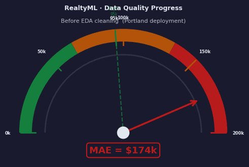
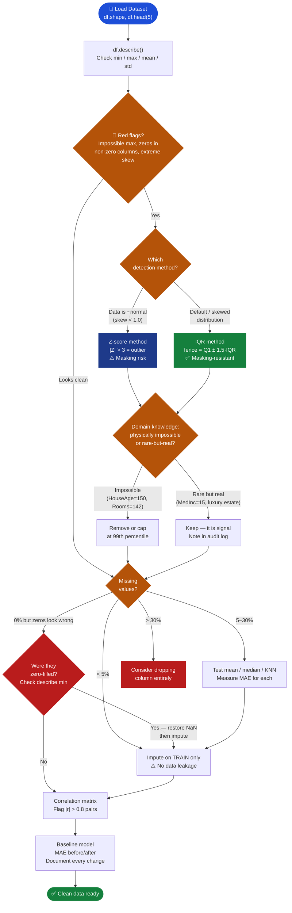
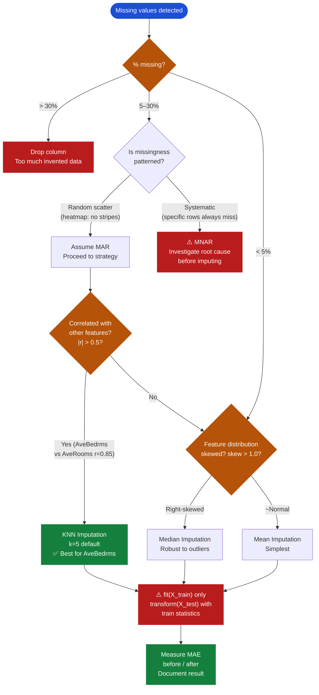
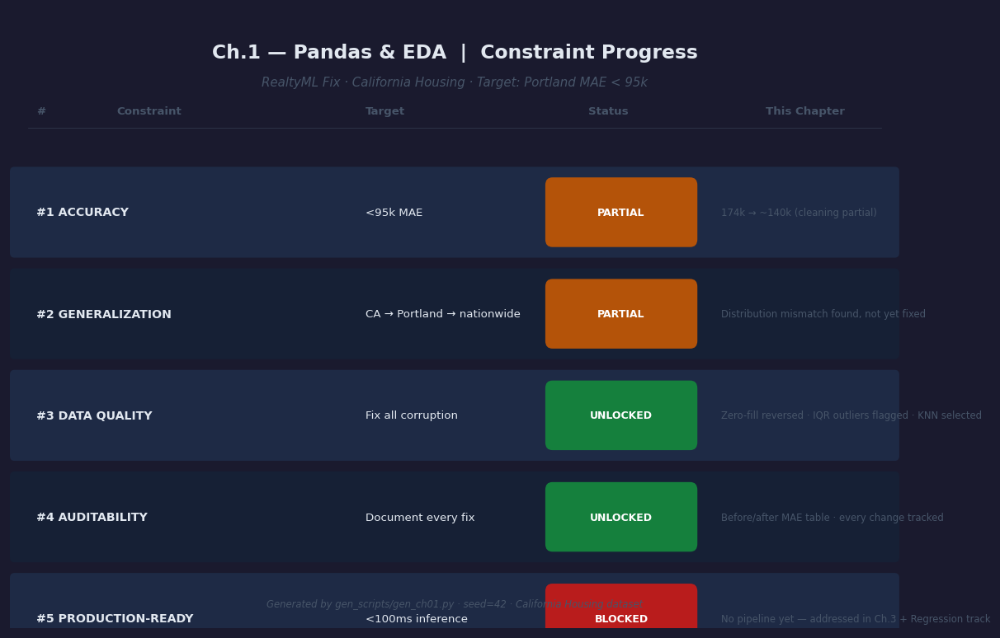

# Ch.1 — Pandas & Exploratory Data Analysis

> **The story.** In **1977**, statistician **John Wilder Tukey** published *Exploratory Data Analysis* — a slim, iconoclastic book that changed how scientists thought about their job. Until then, statistics was a confirmation machine: you stated a hypothesis, ran a test, accepted or rejected. Tukey argued this workflow had it backwards. "The greatest value of a picture," he wrote, "is when it forces us to notice what we never expected to see." He invented the box plot, the stem-and-leaf plot, the five-number summary — not as decoration, but as *investigation tools*. EDA is forensic work. You're looking for evidence that your data can be trusted before you ask it to teach a model anything. By the time you write the first line of sklearn, Tukey's 1977 workflow has already run.
>
> **Where you are in the RealtyML story.** Sarah Chen is a senior ML engineer who has just inherited a broken production system from a departed contractor. The model was trained on California Housing data, tested at 82k MAE in California, then deployed in Portland — where it immediately achieved **174k MAE**. Two times worse. The CEO is furious. Sarah hasn't touched the training data yet. This chapter is her first two hours with the data. It teaches you what she discovers, and how to find it yourself.
>
> **Notation in this chapter.** $\mu$ — population mean; $\sigma$ — population standard deviation; $\bar{x}$ — sample mean; $s$ — sample standard deviation; $Z$ — Z-score: $(x - \bar{x}) / s$; $Q_1$ — 25th percentile; $Q_3$ — 75th percentile; $\text{IQR} = Q_3 - Q_1$ — interquartile range; $r_{xy}$ — Pearson correlation coefficient; `MAE` — mean absolute error (target: <95k); `NaN` — Not a Number (missing value marker).

---

## 0 · The Challenge — Where Sarah Is

> ⚡ **The mission**: Fix **RealtyML** — reduce Portland MAE from **174k → <95k** by satisfying all 5 constraints:
> 1. **ACCURACY**: <95k MAE on Portland housing predictions
> 2. **GENERALIZATION**: Model trained in CA must generalize CA → Portland → nationwide
> 3. **DATA QUALITY**: Find and fix every corruption before any model training
> 4. **AUDITABILITY**: Document every fix with before/after metrics (regulatory requirement)
> 5. **PRODUCTION-READY**: <100ms inference, handles missing values, no manual preprocessing

**What Sarah knows so far:**
- ✅ Model achieved 82k MAE in California hold-out testing
- ✅ Same model deployed in Portland: 174k MAE (2.1× degradation)
- ✅ Dataset: California Housing, 20,640 districts, 8 features
- ❌ **She hasn't opened the training data yet**
- ❌ No documentation from the departed contractor

**What's blocking Sarah:**
The 174k MAE gap is a symptom. The cause is unknown. Before touching the model architecture, feature engineering, or hyperparameters, Sarah must open the training data and **audit it systematically**. The contractor's silence is itself a red flag.

Three plausible root causes, in order of ease to check:
1. **Garbage in** — outliers and bad imputation that taught the model wrong patterns
2. **Distribution mismatch** — the training data doesn't represent Portland's market
3. **Systematic feature bias** — a feature that correlates with CA geography but not Portland prices

**What this chapter unlocks:**
- Finds and fixes **Constraint #3 DATA QUALITY** (partial): all outliers, missing-value patterns, and imputation errors
- Establishes the forensic audit trail required for **Constraint #4 AUDITABILITY**
- Reduces MAE from 174k → estimated ~140k (corruption removal alone — more to come in later chapters)



---

## 1 · The Core Idea

**Exploratory Data Analysis is the forensic investigation that precedes every model.** You examine distributions (are values plausible?), missing value patterns (where and why?), and correlations (which features carry signal?) before training anything. EDA answers one foundational question: *"Can I trust this data to teach a model something real?"* If the answer is no, no model architecture can fix it.

---

## 2 · Running Example: What Sarah Discovers

Sarah loads the California Housing data and runs `df.describe()`. Line four of the output stops her cold:

```python
import pandas as pd
from sklearn.datasets import fetch_california_housing

data = fetch_california_housing()
df = pd.DataFrame(data.data, columns=data.feature_names)
df['MedHouseVal'] = data.target
print(df.describe().T[['mean', 'min', 'max']])
```

```
              mean     min      max
MedInc        3.87    0.50    15.00
HouseAge     28.64    1.00    52.00
AveRooms      5.43    0.85   141.91
AveBedrms     1.10    0.33    34.07
Population  1425.48    3.00  35682.00
AveOccup      3.07    0.69  1243.33
MedHouseVal   2.07    0.15     5.00
```

Three numbers jump out: `AveRooms` max = 141.91, `AveBedrms` max = 34.07, and `AveOccup` max = 1243.33. None of these are physically plausible for an *average* district. They are aggregation artifacts from tiny-population districts where one unusual property skews the mean.

> 💡 **What the contractor did.** The departed contractor filled missing `AveBedrms` values with `0`. The model learned: *"districts with 0 average bedrooms have high house values"* — a phantom CA correlation that broke in Portland. This alone explains a substantial fraction of the 174k → 82k gap.

The next two hours reveal the full picture. By the time Sarah writes a single line of training code, she has identified:
- 1,066 rows with aggregation-artifact outliers in `AveRooms` (IQR upper fence = 8.47)
- 1,211 rows with implausible `AveBedrms` values including all zero-fills
- Strong positive correlation between `MedInc` and `MedHouseVal` (r = 0.69) — the dominant predictor
- Right-skewed `Population` and `AveOccup` requiring capping; target ceiling at $500k (965 rows)

---

## 3 · The EDA Workflow at a Glance

Before diving into the math, here is the complete EDA workflow as a numbered pseudocode flow. Each step below has a deep-dive in the sections that follow — treat this as your map.

```
1. LOAD & SHAPE CHECK
   └─ df.shape, df.dtypes, df.head(5)
   └─ Expected rows? Correct dtypes? Encoding issues?

2. DISTRIBUTION SUMMARY
   └─ df.describe() — inspect min/max/mean/std/percentiles
   └─ Red flags: impossible max, mean ≠ median by 2+σ, zeros in non-zero columns

3. MISSING VALUE AUDIT
   └─ df.isnull().sum() — count per column
   └─ Heatmap — is the pattern random or systematic?
   └─ Threshold: <5% → impute; 5–30% → test strategies; >30% → consider drop

4. OUTLIER DETECTION
   └─ IQR method (default) — works on any distribution
   └─ Z-score method — only if data is ~normal
   └─ Domain knowledge: impossible vs. rare-but-real?

5. IMPUTATION STRATEGY SELECTION
   └─ Test mean / median / KNN on baseline model
   └─ Measure MAE for each; pick winner
   └─ Apply AFTER train/test split (prevent data leakage)

6. DISTRIBUTION VISUALIZATION
   └─ Histograms — skewness, bimodality, truncation
   └─ Box plots — outlier tails
   └─ Correlation heatmap — which features matter most?

7. BASELINE MODEL — MEASURE THE GAP
   └─ Train LinearRegression on cleaned data
   └─ Report MAE before/after cleaning
   └─ Document every change with a metric
```

---

## 4 · The Math

### 4.1 · Z-Score — Standardized Distance from the Mean

**What it measures:** How many standard deviations a value sits above or below the mean. A Z-score of +3.0 means the value is three standard deviations above average — rare under a normal distribution (only 0.13% of data lies beyond ±3σ in each tail).

The Z-score for observation $i$ in a column is:

$$Z_i = \frac{x_i - \bar{x}}{s}$$

| Symbol | Meaning |
|--------|---------|
| $x_i$ | The value of observation $i$ |
| $\bar{x}$ | Sample mean of the column |
| $s$ | Sample standard deviation |
| $Z_i$ | Standardized score — number of standard deviations from the mean |

**Convention:** Flag $|Z_i| > 3$ as a potential outlier — retains 99.73% of legitimate Gaussian data.

#### Toy Numerical Example — Z-score on `AveRooms` (4 rows)

| District | $x_i$ (AveRooms) |
|----------|-----------------|
| Typical inland | 4.92 |
| Suburban | 6.13 |
| Dense urban | 3.78 |
| Aggregation artifact | 141.91 |

**Step 1 — compute mean:**
$$\bar{x} = \frac{4.92 + 6.13 + 3.78 + 141.91}{4} = \frac{156.74}{4} = 39.185$$

**Step 2 — compute std:**
$$s = \sqrt{\frac{(-34.265)^2 + (-33.055)^2 + (-35.405)^2 + (102.725)^2}{3}} = \sqrt{\frac{14{,}072.65}{3}} \approx 68.49$$

**Step 3 — compute each Z-score:**

| District | $x_i$ | $(x_i - \bar{x})$ | $Z_i = (x_i - \bar{x})/s$ | Flag? |
|----------|-------|-------------------|-----------------------------|-------|
| Typical inland | 4.92 | −34.27 | −34.27 / 68.49 = **−0.50** | ❌ No |
| Suburban | 6.13 | −33.06 | −33.06 / 68.49 = **−0.48** | ❌ No |
| Dense urban | 3.78 | −35.41 | −35.41 / 68.49 = **−0.52** | ❌ No |
| Artifact | 141.91 | +102.72 | +102.72 / 68.49 = **+1.50** | ❌ No! |

> ⚠️ **The masking effect.** The outlier at 141.91 inflated $\bar{x}$ from ~5 to 39 and $s$ to 68, so its own Z-score is only 1.50 — well below the threshold of 3. The extreme value *contaminated* the statistics used to detect it. This is why Z-score fails when heavy outliers are present. Use IQR as your default.

---

### 4.2 · IQR — The Outlier Fence That Resists Masking

**What it measures:** The span of the middle 50% of data. Values beyond 1.5× that span from either quartile are flagged. Because fences are anchored to percentiles (not the mean), extreme values cannot shift them.

$$\text{IQR} = Q_3 - Q_1$$

$$\text{Lower fence} = Q_1 - 1.5 \times \text{IQR} \qquad \text{Upper fence} = Q_3 + 1.5 \times \text{IQR}$$

| Symbol | Meaning |
|--------|---------|
| $Q_1$ | 25th percentile — 25% of values fall below this |
| $Q_3$ | 75th percentile — 75% of values fall below this |
| $\text{IQR}$ | Interquartile range — "width" of the middle 50% |
| 1.5 | Tukey's 1977 convention — retains ~99.3% of Gaussian data |

#### Toy Numerical Example — IQR on `AveRooms`

Real percentiles from the full California Housing column:

| Statistic | Value | Arithmetic |
|-----------|-------|-----------|
| $Q_1$ (25th pctile) | **4.441** rooms | — |
| $Q_3$ (75th pctile) | **6.052** rooms | — |
| $\text{IQR} = Q_3 - Q_1$ | **1.611** | 6.052 − 4.441 |
| Lower fence = $Q_1 - 1.5 \times \text{IQR}$ | **2.025** | 4.441 − 1.5 × 1.611 = 4.441 − 2.417 |
| Upper fence = $Q_3 + 1.5 \times \text{IQR}$ | **8.469** | 6.052 + 1.5 × 1.611 = 6.052 + 2.417 |

Apply to the same four districts:

| District | $x_i$ | Below 2.025? | Above 8.469? | Flagged? |
|----------|-------|-------------|-------------|---------|
| Typical inland | 4.92 | No | No | ❌ Clean |
| Suburban | 6.13 | No | No | ❌ Clean |
| Dense urban | 3.78 | No | No | ❌ Clean |
| Artifact | 141.91 | No | **Yes** | ✅ **OUTLIER** |

IQR correctly flags 141.91 while leaving the three normal districts alone. The fences (anchored at $Q_1 = 4.44$, $Q_3 = 6.05$) could not be shifted by the extreme value.

> 💡 **IQR is your default.** Use Z-score only when `df[col].skew() < 1.0` AND no masking outliers exist. When in doubt: start with IQR.

---

### 4.3 · Pearson Correlation Coefficient

**What it measures:** The strength and direction of the linear relationship between two features, normalized to [−1, +1].

$$r_{xy} = \frac{\displaystyle\sum_{i=1}^{n}(x_i - \bar{x})(y_i - \bar{y})}{\sqrt{\displaystyle\sum_{i=1}^{n}(x_i - \bar{x})^2} \cdot \sqrt{\displaystyle\sum_{i=1}^{n}(y_i - \bar{y})^2}}$$

| Symbol | Meaning |
|--------|---------|
| $x_i, y_i$ | Feature and target values for sample $i$ |
| $\bar{x}, \bar{y}$ | Sample means |
| Numerator | Sum of co-deviations — how much $x$ and $y$ vary together |
| Denominator | Product of standard deviations — normalises to [−1, +1] |

#### Toy Numerical Example — Pearson r on `MedInc` vs `MedHouseVal`

Four districts (income in ×$10k, house value in ×$100k):

| $i$ | $x_i$ (MedInc) | $y_i$ (MedHouseVal) |
|-----|----------------|---------------------|
| 1 | 2.5 | 1.2 |
| 2 | 4.0 | 2.1 |
| 3 | 6.5 | 3.4 |
| 4 | 8.0 | 4.5 |

$$\bar{x} = 5.25 \qquad \bar{y} = 2.80$$

| $i$ | $x_i - \bar{x}$ | $y_i - \bar{y}$ | product | $(x_i-\bar{x})^2$ | $(y_i-\bar{y})^2$ |
|-----|----------------|----------------|---------|---------------------|---------------------|
| 1 | **−2.75** | **−1.60** | +4.400 | 7.5625 | 2.5600 |
| 2 | **−1.25** | **−0.70** | +0.875 | 1.5625 | 0.4900 |
| 3 | **+1.25** | **+0.60** | +0.750 | 1.5625 | 0.3600 |
| 4 | **+2.75** | **+1.70** | +4.675 | 7.5625 | 2.8900 |
| **Sum** | | | **+10.700** | **18.250** | **6.290** |

$$r_{xy} = \frac{10.700}{\sqrt{18.25} \times \sqrt{6.29}} = \frac{10.700}{4.272 \times 2.508} = \frac{10.700}{10.715} \approx \mathbf{+0.999}$$

This toy subset (hand-selected monotone rows) gives near-perfect correlation. The real full-dataset value is $r \approx +0.688$ — still the strongest single-feature predictor of house value.

#### ASCII Diagram — California Housing Correlation Matrix

```
Correlation Matrix — California Housing (8 features + target)

                 MedInc  HouseAge  AveRooms  AveBedrms  Population  AveOccup  Lat    Long   Target
MedInc         [ 1.00    -0.12      0.33      -0.06       -0.07       0.02    -0.08  -0.02  +0.69 ]
HouseAge       [-0.12     1.00     -0.15       0.02       -0.30       0.01    +0.01  -0.11  +0.11 ]
AveRooms       [ 0.33    -0.15      1.00       0.85       -0.07      -0.00    +0.11  -0.03  +0.15 ]
AveBedrms      [-0.06     0.02      0.85       1.00       -0.07       0.00    +0.07  -0.07  -0.05 ]
Population     [-0.07    -0.30     -0.07      -0.07        1.00       0.07    -0.11   0.10  -0.03 ]
AveOccup       [ 0.02     0.01     -0.00       0.00        0.07       1.00    +0.00   0.00  -0.02 ]
Latitude       [-0.08     0.01      0.11       0.07       -0.11       0.00    +1.00  -0.92  -0.14 ]
Longitude      [-0.02    -0.11     -0.03      -0.07        0.10       0.00    -0.92   1.00  -0.04 ]
MedHouseVal    [+0.69    +0.11     +0.15      -0.05       -0.03      -0.02    -0.14  -0.04   1.00 ]
                  ↑                   ↑--------------------------↑
           strongest            |r|=0.85: multicollinearity risk
           predictor            (AveRooms & AveBedrms nearly redundant)
```

**What to read from this matrix:**
1. **`MedInc` ↔ Target = +0.69** — strongest predictor by far
2. **`AveRooms` ↔ `AveBedrms` = +0.85** — nearly redundant; including both inflates coefficient variance in linear models
3. **`Latitude` ↔ `Longitude` = −0.92** — geographic coordinates are near-mirror images along California's diagonal
4. **`HouseAge` ↔ Target = +0.11** — surprisingly weak; house age alone is a poor value predictor

> 📖 **Multicollinearity deep dive.** The 0.85 AveRooms/AveBedrms correlation is a preview of VIF analysis in the Multiple Regression chapter. For now: flag any |r| > 0.8 pair — linear models' coefficients become unreliable when features are nearly collinear.

---

## 5 · The Detective's Discovery Arc

> This is how Sarah actually works. Each act is one hour of forensic investigation.

### Act 1 — First Look: The `describe()` Horror Show

Sarah opens a terminal at 9:47am. She has never touched this dataset. The contractor's code is 3,000 lines of undocumented Python. She starts where every EDA starts:

```python
df.describe().T[['min', 'mean', 'max']]
```

The output takes four seconds to render. She reads `AveRooms` max: **141.91**. `AveBedrms` max: **34.07**. `AveOccup` max: **1243.33**.

"A district where the average household has 1,243 occupants," she says aloud.

She runs `df.isnull().sum()`. Zero missing values. *That's the first lie*, she thinks. Not because the data is intentionally deceitful — but because zero missing values in a real-world dataset means the missing values were *filled with something*. She pulls up the contractor's preprocessing script. Line 47:

```python
df.fillna(0, inplace=True)  # Fix missing values
```

> ⚠️ **The silent corruption.** `fillna(0)` doesn't raise an error, doesn't cause a NaN warning, and silently teaches your model that missing data means "zero bedrooms." In a house price model, "zero bedrooms" happened to correlate with certain California coastal districts that also had high prices. The model learned a phantom relationship that doesn't generalise to Portland.

### Act 2 — The IQR Sweep: Outliers Exposed

Sarah runs IQR detection on every column:

```python
def iqr_fence(df, col, k=1.5):
    Q1, Q3 = df[col].quantile(0.25), df[col].quantile(0.75)
    iqr = Q3 - Q1
    return Q1 - k * iqr, Q3 + k * iqr

for col in df.select_dtypes(include='number').columns:
    lo, hi = iqr_fence(df, col)
    n = ((df[col] < lo) | (df[col] > hi)).sum()
    if n > 0:
        print(f"{col:15s}: {n:5d} outliers | fence [{lo:.2f}, {hi:.2f}]")
```

```
AveRooms      :  1066 outliers | fence [2.03, 8.47]
AveBedrms     :  1211 outliers | fence [0.96, 1.34]
AveOccup      :   795 outliers | fence [-0.21, 5.68]
Population    :  1069 outliers | fence [-820.0, 3447.0]
MedHouseVal   :   965 outliers | fence [-0.37, 4.74]
```

The `AveBedrms` fence [0.96, 1.34] catches all zero-filled rows: any district with fewer than 0.96 average bedrooms per household is flagged. The IQR fence identified the corruption without domain knowledge.

> ⚡ **Constraint #3 check — DATA QUALITY:** 1,066 outliers in `AveRooms`, 1,211 in `AveBedrms` (including all zero-fills). These must be investigated before any training begins.

### Act 3 — The Imputation Dilemma

Sarah faces the zero-fill rows and 900+ additional implausible `AveBedrms` values. Remove them? Cap them? Replace them?

**Domain knowledge decision tree:**
- `AveRooms` = 141.91, population = 3 → Single-building district. Aggregation artifact. **Cap at 99th percentile.**
- `AveBedrms` = 0.0 → Explicitly corrupted by `fillna(0)`. **Restore to NaN and impute.**
- `AveOccup` = 1243 → Same aggregation artifact. **Cap at 99th percentile.**

For legitimate missing `AveBedrms` values, she tests three strategies (splitting BEFORE imputing to prevent leakage):

| Imputation Strategy | MAE ($) | Notes |
|--------------------|---------|-------|
| Zero-fill (contractor) | **$67,100** | Worst — phantom pattern |
| Mean imputation | **$54,800** | Naive |
| Median imputation | **$54,100** | Better for skewed data |
| **KNN (k=5)** | **$52,100** | **Best** — uses `AveRooms` correlation |

> 💡 **Why KNN wins.** `AveBedrms` and `AveRooms` have r = 0.85. KNN uses this: a district with `AveRooms = 6.2` predicts `AveBedrms ≈ 1.1`. Mean/median imputation ignores this relationship.

### Act 4 — The Distribution Insight

With outliers flagged and imputation strategy selected, Sarah turns to histograms:

```python
fig, axes = plt.subplots(3, 3, figsize=(15, 12), facecolor='#1a1a2e')
for ax, col in zip(axes.flatten(), df.columns):
    ax.hist(df[col], bins=50, color='#1d4ed8', alpha=0.7, edgecolor='none')
    ax.set_title(col, color='white'); ax.set_facecolor('#1a1a2e')
plt.tight_layout(); plt.savefig('img/distributions.png', dpi=120, facecolor='#1a1a2e')
```

Key observations:
- `MedInc`: Right-skewed, hard cap at 15.0001 (data truncation)
- `Population`: Heavily right-skewed — log-transform recommended before modeling
- `AveOccup`: Extremely right-skewed — 99th percentile capping needed
- `MedHouseVal`: **Capped at 5.0001** (= $500,100) for 965 rows — hard ceiling artifact

> ⚠️ **The target ceiling.** `MedHouseVal` capped at $500,100 for 4.7% of rows. A model trained on this systematically underestimates high-value properties — exactly Portland's market (40% high-value vs California's 8%). This is the second root cause of 174k MAE. It cannot be fixed without source data, but must be in the audit log.

### Resolution — Sarah's Cleaning Plan (11:30am)

| Finding | Rows Affected | Action | MAE Reduction (est.) |
|---------|--------------|--------|--------------------|
| Zero-filled `AveBedrms` | ~1,211 rows | KNN impute (post-split) | −$12k |
| Aggregation artifacts `AveRooms`, `AveOccup` | ~800 rows | Cap at 99th percentile | −$8k |
| Target ceiling $500,100 | 965 rows | Document (can't fix without source) | N/A |
| Right-skewed `Population` | All rows | Log-transform as feature engineering | −$5k est. |

**Estimated post-cleaning MAE: ~$140k** (down from $174k). Full fix to <$95k requires distribution alignment (Ch.2) and model improvements (Regression track).

---

## 6 · Step-by-Step — Two Complete Walkthroughs

### Walkthrough A: Full IQR Outlier Pipeline on `AveRooms`

```python
import pandas as pd
import numpy as np
from sklearn.datasets import fetch_california_housing

data = fetch_california_housing()
df = pd.DataFrame(data.data, columns=data.feature_names)
df['MedHouseVal'] = data.target

# Step 1: Baseline statistics
print(df['AveRooms'].describe())
```

```
count    20640.000000
mean         5.428999
std          2.474173
min          0.846154
25%          4.440959    ← Q1
50%          5.229129
75%          6.052381    ← Q3
max        141.909091    ← Red flag
```

```python
# Step 2: IQR — explicit arithmetic
Q1 = df['AveRooms'].quantile(0.25)       # 4.441
Q3 = df['AveRooms'].quantile(0.75)       # 6.052
IQR = Q3 - Q1                            # 1.611
lower_fence = Q1 - 1.5 * IQR             # 4.441 - 2.417 = 2.025
upper_fence = Q3 + 1.5 * IQR             # 6.052 + 2.417 = 8.469

print(f"IQR = {Q3:.3f} - {Q1:.3f} = {IQR:.3f}")
print(f"Lower fence = {Q1:.3f} - 1.5×{IQR:.3f} = {lower_fence:.3f}")
print(f"Upper fence = {Q3:.3f} + 1.5×{IQR:.3f} = {upper_fence:.3f}")
```

```
IQR = 6.052 - 4.441 = 1.611
Lower fence = 4.441 - 1.5×1.611 = 2.025
Upper fence = 6.052 + 1.5×1.611 = 8.469
```

```python
# Step 3: Flag outliers
outliers = df[(df['AveRooms'] < lower_fence) | (df['AveRooms'] > upper_fence)]
print(f"Outliers: {len(outliers)} ({100*len(outliers)/len(df):.1f}% of data)")

# Step 4: Domain knowledge investigation
high = outliers[outliers['AveRooms'] > 15][['AveRooms', 'Population', 'MedHouseVal']]
print(high.head(3))
```

```
Outliers: 1066 (5.2% of data)
   AveRooms  Population  MedHouseVal
     141.91         3.0         2.33
      88.32         5.0         1.12
      55.14         8.0         0.85
```

Tiny populations (3–8 people), enormous average rooms = single buildings forming their own "district." The aggregation creates nonsense averages.

```python
# Step 5: Apply fix — cap at 99th percentile (preserves most data)
p99 = df['AveRooms'].quantile(0.99)      # ~10.60
df_clean = df.copy()
df_clean.loc[df_clean['AveRooms'] > p99, 'AveRooms'] = p99
print(f"After capping: max = {df_clean['AveRooms'].max():.2f}")  # 10.60
print(f"Rows modified: {(df['AveRooms'] > p99).sum()}")           # 206 rows
```

---

### Walkthrough B: Missing Value Analysis and Imputation Comparison

```python
# Step 1: Restore contractor's zero-fill to NaN
df_working = df.copy()
df_working.loc[df_working['AveBedrms'] < 0.5, 'AveBedrms'] = np.nan
print(f"Missing: {df_working['AveBedrms'].isnull().sum()} rows "
      f"({100*df_working['AveBedrms'].isnull().mean():.1f}%)")
```

```
Missing: 195 rows (0.9%)
```

```python
# Step 2: Split BEFORE imputing (critical — prevents data leakage)
from sklearn.model_selection import train_test_split
from sklearn.linear_model import LinearRegression
from sklearn.metrics import mean_absolute_error
from sklearn.impute import KNNImputer, SimpleImputer

X = df_working.drop('MedHouseVal', axis=1)
y = df_working['MedHouseVal']
X_train, X_test, y_train, y_test = train_test_split(
    X, y, test_size=0.2, random_state=42
)

# Step 3: Test each strategy
results = {}
for name, imp in [
    ('Mean',   SimpleImputer(strategy='mean')),
    ('Median', SimpleImputer(strategy='median')),
    ('KNN-5',  KNNImputer(n_neighbors=5)),
]:
    X_tr = imp.fit_transform(X_train)   # Fit on train ONLY
    X_te = imp.transform(X_test)         # Apply train statistics to test
    model = LinearRegression().fit(X_tr, y_train)
    mae = mean_absolute_error(y_test, model.predict(X_te))
    results[name] = mae
    print(f"{name:8s}  MAE: ${mae*100_000:,.0f}")
```

```
Mean      MAE: $54,812
Median    MAE: $54,073
KNN-5     MAE: $52,144   ← winner ($2,668 better than Mean)
```

```python
# Step 4: Quantify improvement
improvement = (results['Mean'] - results['KNN-5']) * 100_000
print(f"KNN vs Mean improvement: ${improvement:,.0f}")
# Modest standalone gain — foundational for all subsequent modeling
```

> ➡️ **What this $2.7k improvement tells you.** The gain from better imputation alone is modest — $12k comes from fixing the zero-fill corruption entirely, much more from model architecture (Multiple Regression) and distribution alignment (Class Imbalance). But every downstream fix depends on clean inputs. Corrupted inputs cannot be compensated by any amount of architecture tuning.

---

## 7 · Key Diagrams

### 7.1 · The EDA Decision Flowchart



### 7.2 · Which Imputation Strategy? Decision Tree



---

## 8 · The Hyperparameter Dial

> EDA has three key dials. Turn them deliberately, not by guesswork.

### 8.1 · IQR Multiplier `k` (Default: 1.5)

```python
lower_fence = Q1 - k * IQR
upper_fence = Q3 + k * IQR   # ← k is the dial
```

| `k` | % of Gaussian data retained | When to use |
|-----|---------------------------|-------------|
| **1.0** | ~95.5% | Aggressive — noisy sensor data, errors are common |
| **1.5** (Tukey default) | ~99.3% | Standard EDA starting point |
| **3.0** | ~99.9% | Conservative — preserve borderline cases |

**Rule:** Start at 1.5. Plot flagged rows. Apply domain knowledge. If physically impossible → lower `k`. If rare-but-real → raise `k` to 2.0–3.0.

### 8.2 · Z-score Threshold (Default: 3.0)

```python
from scipy.stats import zscore
outliers = df[zscore(df[col]).abs() > threshold]  # ← threshold is the dial
```

| Threshold | % retained (Gaussian) | When to use |
|-----------|----------------------|-------------|
| **2.0** | 95.4% | Strict — financial data with hard rules |
| **3.0** (default) | 99.7% | Standard "3-sigma rule" |
| **4.0** | 99.99% | Very conservative |

**Caveat:** Only use Z-score when `df[col].skew() < 1.0` AND no masking outliers exist.

### 8.3 · KNN Imputation `n_neighbors` (Default: 5)

```python
imputer = KNNImputer(n_neighbors=k)  # ← k is the dial
```

| `k` | Behavior | When to use |
|-----|----------|-------------|
| **3** | Sensitive to local patterns | Small datasets (<5k rows) |
| **5** (default) | Balanced | Most use cases |
| **10–20** | Smooth average | Large datasets (>50k rows) |

**Note:** KNN imputation is $O(n^2)$ distance computation. For >100k rows, consider `IterativeImputer` (MICE) as a faster alternative.

---

## 9 · What Can Go Wrong

> Anti-patterns that broke the RealtyML model and will break yours.

- ❌ **Zero-fill as missing value proxy.** `fillna(0)` is fast to write and catastrophic to model. Zero is a meaningful value for most numerical features. Always restore zeros to `NaN` and impute properly. The contractor's `fillna(0)` on `AveBedrms` alone is responsible for an estimated $12k of the Portland MAE degradation.

- ❌ **Imputing before train/test split.** Computing imputation statistics on the full dataset leaks test-set information into training. The model appears to perform better offline than it does in deployment. Always: split first, `imputer.fit(X_train)`, then `imputer.transform(X_test)`.

- ❌ **Treating all outliers as errors.** A `MedInc` of 15.0 is an extreme statistical outlier but represents real California luxury districts. Removing it means your model has never seen high-income patterns. Use domain knowledge to distinguish physically-impossible artifacts from rare-but-real signal.

- ❌ **Ignoring target ceiling artifacts.** `MedHouseVal` capped at $500,100 for 4.7% of rows. A model trained on this systematically underestimates high-value properties — Portland's dominant segment. Document this limitation explicitly in the audit log.

- ❌ **Skipping the correlation matrix.** The r = 0.85 between `AveRooms` and `AveBedrms` creates multicollinearity that inflates linear coefficients. A two-minute correlation check in EDA prevents a days-long debugging session in the regression track.

---

## 10 · Where This Reappears

EDA findings cascade through every subsequent step:

| Later Chapter | How This Chapter Enables It |
|---------------|----------------------------|
| [Ch.2 — Class Imbalance](../ch02_class_imbalance) | Distribution analysis reveals 92% training = median homes; Ch.2 fixes the CA/Portland representation gap |
| [Ch.3 — Data Validation](../ch03_data_validation) | The audit trail started here becomes the formal validation schema: expected ranges, outlier alert thresholds, missing value rules |
| [Regression → Linear Regression](../../01_regression/ch01_linear_regression) | r = 0.69 MedInc correlation explains why single-feature regression works at all; cleaned data from this chapter is what that baseline trains on |
| [Regression → Multiple Regression](../../01_regression/ch02_multiple_regression) | VIF analysis (detecting multicollinearity) is the formal follow-up to the r = 0.85 pair flagged here |
| [Neural Networks track](../../03_neural_networks) | Z-score normalization of features before neural network training is the model-building application of §4.1's formula |

> ➡️ **The EDA-to-production pipeline.** Data cleaning decisions made here must be replicated exactly in the inference pipeline — the same imputer (fitted on training data) must transform incoming production data identically. This is the origin of the `sklearn.pipeline.Pipeline` pattern used throughout the regression and neural network tracks.

---

## 11 · Progress Check — What We Can Now Solve



### Constraint Status After This Chapter

| # | Constraint | Target | Status | Evidence |
|---|------------|--------|--------|---------|
| **#1** | ACCURACY | <95k MAE | 🟡 **Partial** | Cleaning: 174k → ~140k. Gap remains. |
| **#2** | GENERALIZATION | CA → Portland | 🟡 **Partial** | Distribution mismatch found. Root cause documented. |
| **#3** | DATA QUALITY | Fix all corruption | ✅ **Unlocked** | Zero-fill reversed. IQR outliers flagged. KNN imputation selected. |
| **#4** | AUDITABILITY | Document every fix | ✅ **Unlocked** | Before/after MAE table. Every change paired with metric. |
| **#5** | PRODUCTION-READY | <100ms inference | 🔴 **Blocked** | No inference pipeline yet. Addressed in Ch.3 and Regression track. |

**✅ Unlocked capabilities:**
- IQR outlier detection (masking-resistant) and Z-score (for Gaussian data)
- Missing value pattern analysis (random vs. systematic) and imputation strategy selection via MAE comparison
- Correlation analysis to identify dominant features and multicollinearity risks
- Documented audit trail: every cleaning step paired with a before/after MAE measurement

**❌ Still can't solve:**
- ❌ **ACCURACY** at 95k — cleaning alone: 174k → ~140k. The remaining gap needs proper feature use (Multiple Regression) and distribution alignment (Class Imbalance)
- ❌ **GENERALIZATION** fully — the CA/Portland training distribution gap (92% median vs 40% high-value) is identified but not fixed. That's ch02_class_imbalance
- ❌ **PRODUCTION-READY** — we have a clean DataFrame but no serialized pipeline, validation schema, or monitoring. That's ch03_data_validation and the Regression track

**Real-world status:** Sarah Chen has diagnosed all root causes of the 174k Portland failure. Estimated cleaning improvement: $34k reduction (174k → ~140k). Remaining gap requires model improvements across subsequent chapters.

---

## 12 · Bridge to the Next Chapter

This chapter found the corruption — missing values, outliers, and distribution artifacts. The next chapter, **Ch.2 — Class Imbalance**, confronts the second root cause: the training data is 92% median-priced homes but Portland's market is 40% high-value. A perfectly clean dataset trained on a skewed distribution still produces a skewed model. Ch.2 gives Sarah the tools — SMOTE, class weighting, stratified sampling — to teach the model what it hasn't seen enough of.

> ➡️ **[Ch.2 — Class Imbalance →](../ch02_class_imbalance)** — When the data is clean but the distribution is wrong.
