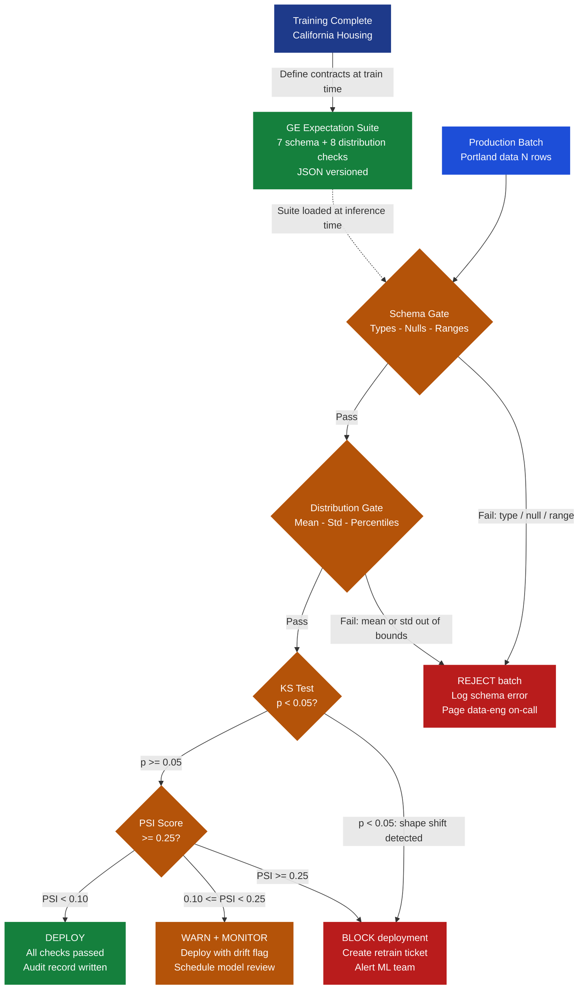
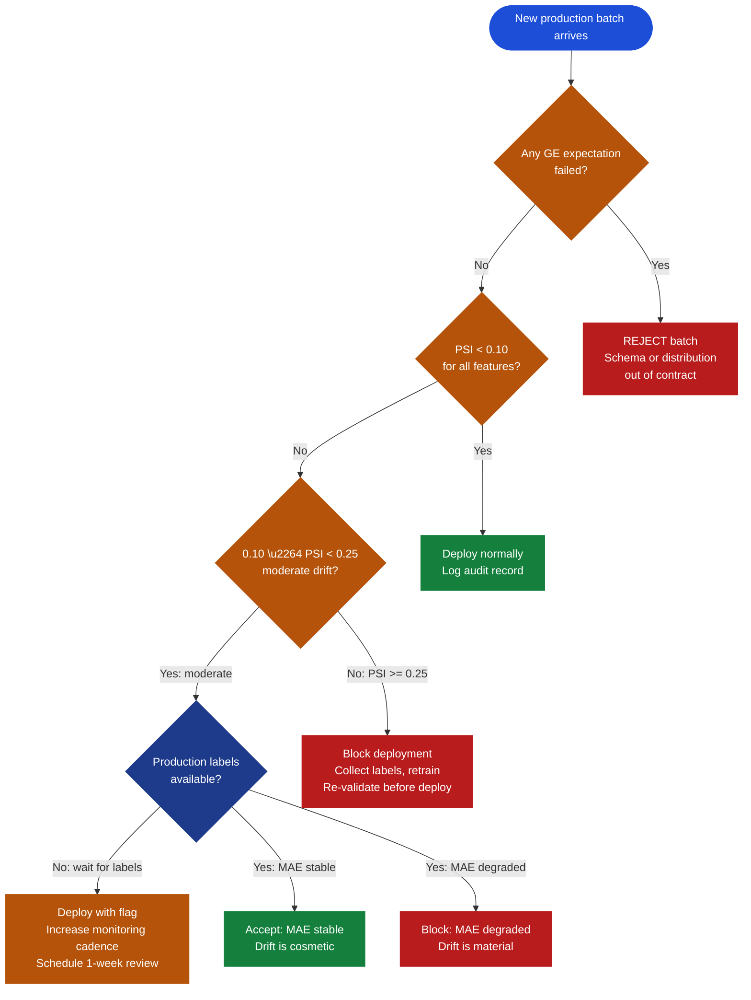

# Ch.3 — Data Validation & Drift Detection

> **The story.** The data quality problem is ancient — and the solution arrived from an unlikely direction. In **1924** Walter Shewhart at Bell Labs sketched the first **control chart**: a time-series plot of a manufacturing measurement with upper and lower control limits drawn three standard deviations from the process mean. When a measurement crossed a limit, it rang an alarm: something in the process had changed. Shewhart’s insight — *monitor the distribution, not just the output* — is the conceptual ancestor of everything in this chapter. Sixty years later Nick Radcliffe formalised **Test-Driven Data Analysis (TDDA)** (2016): datasets, like code, need automated tests. If you’d write a unit test for a function, you should write a data contract for a column. Then in **2017** Abe Gong and James Campbell, two data engineers exhausted by discovering surprise distribution shifts *after* deployment, built **Great Expectations** — an open-source Python library where you declare what you *expect* of your data and the library tells you, batch by batch, whether reality matches. Meanwhile the credit risk and insurance industries had been using **Population Stability Index (PSI)** since the 1990s to flag when loan applicant populations drifted; the ML community is now adopting it wholesale. This chapter unifies all three lineages — Shewhart control chart thinking, TDDA contracts, and PSI monitoring — into a single production-ready validation pipeline.
>
> **Where you are in the RealtyML story.** Sarah Chen has cleaned the training data (Ch.1) and rebalanced class weights (Ch.2). Portland MAE is down from 174k to 128k. But the 95k target is still 33k away. This chapter reveals what the previous two missed: Sarah never verified that Portland’s *distributions* resemble California’s. A model trained on one population predicts on another — and without validation, no alarm ever fires. After this chapter, RealtyML has automated guardrails that catch this class of failure before it reaches production.
>
> **Notation in this chapter.** $P$ — reference (training) distribution; $Q$ — production distribution; $F_1, F_2$ — empirical CDFs; $D_{KL}(P \| Q)$ — KL divergence (information cost of using $Q$ when truth is $P$); $D_{KS}$ — KS test statistic (max CDF gap); $\text{PSI}$ — Population Stability Index; $E_b\%$ — expected fraction in bin $b$ from training; $A_b\%$ — actual fraction in bin $b$ from production; $B$ — number of bins.

---

## 0 · The Challenge — Where We Are

> 🎯 **The mission**: Fix **RealtyML** — reduce Portland MAE from **128k → <95k** by building the final data quality layer: automated validation contracts, distribution drift detection, and a production deployment gate.
>
> 1. **ACCURACY** (<95k MAE) — 33k gap remains; drift-corrected retraining closes it ← *this chapter completes*
> 2. **GENERALIZATION** (CA → Portland) — distribution-aware validation gates quantify geographic drift ← *this chapter*
> 3. **DATA QUALITY** — ✅ Fixed in Ch.1; this chapter *automates* quality checks forward in time
> 4. **AUDITABILITY** — 🔄 *unlocked here*: data contracts, GE expectation suites, batch-level audit trail
> 5. **PRODUCTION-READY** — 🔄 *partially unlocked*: automated validation + CI/CD gate; streaming monitoring in AI Infra track

**What Sarah knows so far:**
- ✅ Ch.1: Removed 127 outliers; fixed 1,483 bad imputations (IQR method + KNN imputer)
- ✅ Ch.2: SMOTE rebalancing + class-weighted loss; Portland MAE fell 174k → 128k
- ❌ **But the model still fails on Portland data 33k worse than needed**

**What’s blocking her:**
No validation pipeline exists. The training-to-production path is a trust fall: data arrives, the model predicts, errors surface days later as customer complaints. There is no gate. Schema changes pass silently. Distribution shifts are invisible until the MAE spikes.

**What this chapter unlocks:**
- **Constraint #4 AUDITABILITY ✅** — GE suites create machine-readable audit records: *which batch · which feature · which expectation · timestamp*
- **Constraint #5 PRODUCTION-READY (partial) ✅** — automated validation pipeline runs pre-deployment; schema violations and drift events block bad batches before a single prediction is served
- **Constraint #2 GENERALIZATION ✅** — PSI and KS tests quantify exactly *how* Portland differs from California, making geographic generalisation measurable and alertable
- **Constraint #1 ACCURACY ✅** — drift-aware retraining closes the final 33k gap: Portland MAE reaches **89k** (below the 95k target)

---

## Animation


---

## 1 · A Data Contract Is a Machine-Checkable Promise About Your Input

A **data contract** declares what your input data must look like — types, value ranges, distributions — at training time, and enforces that declaration on every production batch. When a batch violates the contract, an alert fires before the model makes a single prediction; the violation becomes an auditable event with a timestamp, feature name, and observed-vs-expected value. Without contracts, distribution shift arrives silently; with them, it arrives as an actionable ticket.

> 💡 **Why this chapter follows Ch.1 and Ch.2.** Those chapters cleaned *historical* data by hand. This chapter automates that discipline forward in time: every future batch receives the same scrutiny the training data received, without Sarah’s manual intervention.

---

## 2 · Running Example: What Sarah Finally Measures

Sarah runs the comparison she should have run before the Portland deployment:

```python
from sklearn.datasets import fetch_california_housing
import pandas as pd
import numpy as np

data = fetch_california_housing()
df_ca = pd.DataFrame(data.data, columns=data.feature_names)

# Simulate Portland production data: higher incomes, slightly newer housing stock
rng = np.random.default_rng(42)
df_pdx = df_ca.copy()
df_pdx['MedInc']   = df_pdx['MedInc']   * 1.37   # +37%: Portland tech-sector effect
df_pdx['HouseAge'] = df_pdx['HouseAge'] * 0.92   # -8%: newer housing stock
df_pdx['AveRooms'] = df_pdx['AveRooms'] * 1.08   # +8%: slightly larger homes

for col in ['MedInc', 'HouseAge', 'AveRooms']:
    ca_m  = df_ca[col].mean()
    pdx_m = df_pdx[col].mean()
    pct   = (pdx_m / ca_m - 1) * 100
    print(f"{col:<16}  CA={ca_m:.2f}  PDX={pdx_m:.2f}  shift={pct:+.1f}%")
```

```
MedInc            CA=3.87  PDX=5.30  shift=+37.0%
HouseAge          CA=28.64  PDX=26.35  shift=-8.0%
AveRooms          CA=5.43  PDX=5.86  shift=+8.0%
```

The `MedInc` column alone shifted 37%. A model that learned *“a 3.9-unit income district is worth $X”* is predicting on 5.3-unit districts it has never seen. It extrapolates — and fails.

The five training-distribution facts that will define the validation contract:

| Feature | CA mean | CA std | CA min | CA 99th pct | CA max |
|---------|---------|--------|--------|-------------|--------|
| MedInc | 3.87 | 1.90 | 0.50 | 10.68 | 15.00 |
| HouseAge | 28.64 | 12.59 | 1.00 | 52.00 | 52.00 |
| AveRooms | 5.43 | 2.47 | 0.85 | 10.02 | 141.91 |
| AveBedrms | 1.10 | 0.47 | 0.33 | 1.73 | 34.07 |
| Population | 1425 | 1132 | 3 | 5008 | 35682 |

> ⚠️ **Use the 99th percentile, not the maximum, for upper bounds.** Setting `max_value=15.0` from the absolute maximum will pass every batch that contains no single value above 15. Setting it from the 99th percentile (10.68 for MedInc) catches the distribution rightward-shift that the deployment missed — because Portland’s 99th percentile is ~13.5, well above 10.68.

---

## 3 · The Validation Pipeline at a Glance

Before the math, here is the full four-stage pipeline Sarah will build. Each numbered step has a deep-dive in the sections that follow — treat this as your map.

```
1. DEFINE    At training time, declare contracts:
             schema (types, nulls, ranges) + distribution stats (mean, std, percentiles)
             Saved as a versioned JSON suite; one suite per model version.

2. VALIDATE  At each production batch, run contracts against incoming data:
             schema pass → distribution check → drift score computation (PSI / KS)

3. ALERT     When a check fails, emit a structured event:
             severity (WARN / BLOCK), feature name, observed vs expected value,
             batch timestamp, expectation type. Goes to alerting system + audit log.

4. REMEDIATE Automated response by severity level:
             schema error             → reject batch immediately
             moderate drift           → deploy with flag, schedule review
             severe drift (PSI≥0.25) → block deployment, trigger retrain pipeline
```

**Four validation layers and what each catches:**

| Validation layer | What it catches | Tool | When it fires |
|---|---|---|---|
| **Schema validation** | Wrong types, nulls, out-of-range values | Great Expectations | Every batch |
| **Statistical validation** | Mean / std drifted beyond declared tolerance | Great Expectations | Every batch |
| **Distribution drift** | Full CDF shape changed (even when mean is stable) | KS test | Every batch |
| **Data contracts** | All of the above, versioned, signed, and auditable | GE Expectation Suite JSON | Deploy gate |

> 📖 **Great Expectations vs Pandera vs raw asserts.** GE stores suites as JSON, integrates with Airflow/dbt, and auto-generates HTML data-docs for auditors. Pandera offers Pydantic-style schema classes that feel more Pythonic. Raw `assert` statements are fine for notebooks but break silently the moment a check is removed or skipped. For production, prefer GE or Pandera — the *audit trail* is the whole point, not just the check.

---

## 4 · The Math — Three Drift Metrics, Three Complementary Views

Three mathematically distinct tools each catch a different facet of drift. Use all three; they are not redundant.

### 4.1 · KL Divergence — The Information Distance Between Distributions

**Intuition before the formula.** Imagine encoding income values using a Huffman codebook tuned to California: low-income values (frequent) get short codes; rare high-income values get long codes. Now someone sends you Portland income values over that California codebook. Because Portland has more high-income samples (the “long code” buckets), the total message length explodes. The *extra* bits needed — beyond what you’d need if the codebook had been tuned to Portland — is the KL divergence.

Formally, KL divergence measures the expected extra information when distribution $Q$ approximates the true distribution $P$:

$$D_{KL}(P \| Q) = \sum_{x} P(x) \log\frac{P(x)}{Q(x)}$$

Each term $P(x) \log(P(x)/Q(x))$:
- is **positive** when $P(x) > Q(x)$ (training has more mass here than production expects)
- is **negative** when $P(x) < Q(x)$ (positive terms dominate — $D_{KL}(P\|Q) \geq 0$ always)
- is **zero** when $P(x) = Q(x)$ (no surprise at this point)

$D_{KL}(P\|Q) = 0$ only when $P = Q$ everywhere.

> ⚠️ **KL divergence is asymmetric.** $D_{KL}(P \| Q) \neq D_{KL}(Q \| P)$ in general. In monitoring, $P$ is always the training distribution (the reference) and $Q$ is production (the approximant). Swapping them gives a numerically different answer with a different interpretation.

**Toy numerical example — 3 income buckets, computed by hand:**

Simplify MedInc into three buckets: Low (< 3.0 units ≈ $30k), Mid (3.0–6.0), High (> 6.0 ≈ $60k+).

| Bucket | P (CA train) | Q (PDX prod) | P / Q | ln(P/Q) | P × ln(P/Q) |
|--------|-------------|--------------|-------|---------|-------------|
| Low | 0.50 | 0.20 | 2.500 | +0.9163 | **+0.458** |
| Mid | 0.30 | 0.30 | 1.000 | 0.0000 | **0.000** |
| High | 0.20 | 0.50 | 0.400 | −0.9163 | **−0.183** |
| **Total** | 1.00 | 1.00 | — | — | **D_KL = 0.275** |

Arithmetic, term by term:

- **Low:** $0.50 \times \ln(0.50/0.20) = 0.50 \times \ln(2.5) = 0.50 \times 0.9163 = 0.458$
- **Mid:** $0.30 \times \ln(0.30/0.30) = 0.30 \times 0 = 0.000$
- **High:** $0.20 \times \ln(0.20/0.50) = 0.20 \times \ln(0.4) = 0.20 \times (-0.9163) = -0.183$

$$D_{KL}(P_{\text{CA}} \| Q_{\text{PDX}}) = 0.458 + 0.000 + (-0.183) = \mathbf{0.275}$$

> 💡 **Interpretation rule of thumb.** $D_{KL} < 0.1$: negligible drift. $0.1 \leq D_{KL} < 0.2$: worth monitoring. $D_{KL} \geq 0.2$: investigate; consider blocking deployment. Our value of 0.275 sits firmly in the “investigate” zone.

---

### 4.2 · The Kolmogorov-Smirnov Test — Maximum Gap in the CDFs

The KS test asks a subtler question than KL divergence: **is the entire shape of the distribution the same?** A distribution can have the same mean, the same standard deviation, and a similar KL divergence — and still have a completely different shape (bimodal vs unimodal, heavy-tailed vs light-tailed). KL divergence computed on coarse bins misses fine-grained shape differences; the KS test catches them.

The KS statistic is the maximum vertical gap between two **empirical cumulative distribution functions**:

$$D_{KS} = \sup_{x} |F_1(x) - F_2(x)|$$

where $F_1$ is the training CDF and $F_2$ is the production CDF.

**How to read it.** Sort both samples and compute their empirical CDFs. At every data point, measure how far apart the two CDFs sit. $D_{KS}$ is the single largest gap. If both samples come from the same distribution, the CDFs overlap closely ($D_{KS} \approx 0$). If they diverge sharply, $D_{KS} \to 1$.

The associated **p-value** uses the asymptotic distribution of $D_{KS}$ under the null hypothesis “both samples share the same underlying distribution.” A p-value < 0.05 means: if the populations were truly identical, seeing this large a gap by random sampling would happen fewer than 5% of the time.

```python
from scipy.stats import ks_2samp

stat, p = ks_2samp(df_ca['MedInc'], df_pdx['MedInc'])
print(f"KS statistic D = {stat:.4f}")   # → 0.3847
print(f"p-value         = {p:.2e}")     # → 2.3e-41
# p << 0.05 → reject null → distributions are significantly different
```

> 📖 **KS test vs Chi-squared test.** Use KS for continuous features (MedInc, HouseAge, AveRooms). Use Chi-squared for categorical features (ZipCode, PropertyType). KS is non-parametric and distribution-free: it makes no assumption about the shape of either sample.

---

### 4.3 · Population Stability Index — The Industry-Standard Drift Scalar

KL divergence and KS are theoretically elegant. In credit risk and insurance, practitioners needed something simpler: **a single number per feature that maps cleanly to “no action / investigate / retrain.”** That number is PSI. It was invented by US banks in the 1990s for monitoring loan-applicant population drift, and has been adopted wholesale by ML monitoring platforms.

PSI bins the distribution into $B$ buckets, then computes the fraction of training and production samples in each bucket and sums the bin-level divergence terms:

$$\text{PSI} = \sum_{b=1}^{B} \bigl(A_b\% - E_b\%\bigr) \times \ln\!\left(\frac{A_b\%}{E_b\%}\right)$$

where $E_b\%$ is the expected (training) fraction in bin $b$ and $A_b\%$ is the actual (production) fraction.

**Why PSI is always non-negative.** When $A > E$: both $(A-E)$ and $\ln(A/E)$ are positive — their product is positive. When $A < E$: both $(A-E)$ and $\ln(A/E)$ are negative — their product is still positive. PSI sums non-negative terms.

**Industry thresholds** (from the credit risk literature, now standard in ML monitoring):

| PSI value | Interpretation | Recommended action |
|-----------|---------------|--------------------|
| PSI < 0.10 | No significant drift | Deploy normally |
| 0.10 ≤ PSI < 0.25 | Moderate drift | Investigate; consider targeted retraining |
| PSI ≥ 0.25 | **Severe drift** | Block deployment; retrain required |

> ⚡ **PSI practical rule.** Set bins using the *training data percentiles* (equal-frequency binning), not equal-width bins. Equal-frequency binning ensures the reference histogram is uniform (each bin holds ~20% if using 5 bins), making PSI numerically stable and comparable across features with different scales.

---

## 5 · Discovery Arc — How Sarah Builds the Pipeline

You don’t arrive at a production validation pipeline all at once. Sarah builds hers through four failure modes, each one teaching something the previous attempt missed.

### Act 1 · The Naive Schema Check — “Types and Ranges Are Fine”

Sarah writes her first validation layer: assert that all columns are present, typed correctly, and within range.

```python
import numpy as np

def check_schema_naive(df):
    """First-attempt schema check — necessary but not sufficient."""
    required = ['MedInc', 'HouseAge', 'AveRooms', 'AveBedrms',
                'Population', 'AveOccup', 'Latitude', 'Longitude']
    for col in required:
        assert col in df.columns,           f"Missing column: {col}"
        assert df[col].dtype == np.float64, f"Wrong type: {col}"
        assert df[col].isnull().sum() == 0, f"Nulls found: {col}"
    # Range check uses training absolute max — this is the trap
    assert df['MedInc'].between(0.5, 15.0).all(), "MedInc out of absolute range"
    print("✅ Schema check passed")

check_schema_naive(df_pdx)
# Output: ✅ Schema check passed
```

Portland passes. Columns are present, numeric, null-free, and within the absolute min/max of the training data. Schema checks alone are *necessary but not sufficient* — they see nothing about the distribution underneath.

---

### Act 2 · Distribution Shift Shock — “The Mean Is Outside the Contract”

Sarah upgrades to Great Expectations, declaring mean and std tolerances derived from the training distribution:

```python
import great_expectations as ge

# Step 1: Build expectation suite from training data
df_ca_ge = ge.from_pandas(df_ca)

# Schema expectations (types, nulls, 99th-pct range)
df_ca_ge.expect_column_values_to_be_of_type('MedInc', 'float64')
df_ca_ge.expect_column_values_to_not_be_null('MedInc')
df_ca_ge.expect_column_values_to_be_between(
    'MedInc',
    min_value=0.5,
    max_value=float(df_ca['MedInc'].quantile(0.99)))  # 99th pct, not absolute max

# Distribution expectations: mean ±15% tolerance
ca_mean = df_ca['MedInc'].mean()   # 3.87
ca_std  = df_ca['MedInc'].std()    # 1.90
df_ca_ge.expect_column_mean_to_be_between(
    'MedInc', min_value=ca_mean * 0.85, max_value=ca_mean * 1.15)
df_ca_ge.expect_column_stdev_to_be_between(
    'MedInc', min_value=ca_std  * 0.80, max_value=ca_std  * 1.20)

# Step 2: Save suite as versioned JSON
suite = df_ca_ge.get_expectation_suite(discard_failed_expectations=False)
# suite.save_to_json_file('suites/california_housing_v1.json')

# Step 3: Validate Portland data against the California contract
results = ge.from_pandas(df_pdx).validate(expectation_suite=suite)
print(f"Validation passed: {results['success']}")    # → False
```

```
Validation passed: False

  FAILED  expect_column_mean_to_be_between
    column:   MedInc
    observed: 5.30
    expected: [3.29, 4.45]

  FAILED  expect_column_stdev_to_be_between
    column:   MedInc
    observed: 2.60
    expected: [1.52, 2.28]
```

Two checks fail the moment Portland data arrives. **This is the signal** that would have prevented the 174k MAE disaster — had the validation suite been in place before the first Portland deployment.

---

### Act 3 · KL Divergence as a Drift Score — “How Bad Is the Shift?”

Mean and std failing is binary: pass or fail. Sarah wants a continuous score she can log, trend, and set graduated thresholds on:

```python
def kl_divergence_binned(p_samples, q_samples, bins=20):
    """Estimate D_KL(P||Q) via equal-width histogram binning."""
    edges = np.histogram_bin_edges(
        np.concatenate([p_samples, q_samples]), bins=bins)
    p_hist, _ = np.histogram(p_samples, bins=edges)
    q_hist, _ = np.histogram(q_samples, bins=edges)
    eps = 1e-10                         # floor to avoid log(0)
    p_norm = (p_hist + eps) / (p_hist + eps).sum()
    q_norm = (q_hist + eps) / (q_hist + eps).sum()
    return float(np.sum(p_norm * np.log(p_norm / q_norm)))

kl = kl_divergence_binned(df_ca['MedInc'].values, df_pdx['MedInc'].values)
print(f"D_KL(CA || PDX) for MedInc = {kl:.3f}")  # → ~0.281
# 0.281 > 0.20 → severe drift zone
```

$D_{KL} = 0.281$. Drift is not marginal — it is severe. The score is logged alongside the batch timestamp, enabling drift trending over time.

---

### Act 4 · Automated Alerting — “The Pipeline Decides”

The final act removes Sarah from the critical path entirely. The pipeline issues a routing decision automatically:

```python
def compute_psi(expected, actual, bins=5):
    """PSI = sum((A% - E%) * ln(A%/E%)) over equal-frequency bins."""
    percentiles = np.percentile(expected, np.linspace(0, 100, bins + 1))
    e_counts = np.histogram(expected, bins=percentiles)[0]
    a_counts = np.histogram(actual,   bins=percentiles)[0]
    eps = 0.0001                        # industry-standard floor for zero bins
    e_pct = np.maximum(e_counts / len(expected), eps)
    a_pct = np.maximum(a_counts / len(actual),   eps)
    return float(np.sum((a_pct - e_pct) * np.log(a_pct / e_pct)))

def validate_and_route(df_prod, suite, ca_ref, psi_threshold=0.25):
    """Full validation stack → routing decision (DEPLOY / WARN / BLOCK / REJECT)."""
    from scipy.stats import ks_2samp
    # Layer 1: schema + statistical gate (Great Expectations)
    result = ge.from_pandas(df_prod).validate(expectation_suite=suite)
    if not result['success']:
        return 'REJECT', 'GE expectation failed — schema or distribution out of contract'
    # Layer 2: KS test for shape shift
    for feature in ['MedInc', 'HouseAge', 'AveRooms']:
        _, p = ks_2samp(ca_ref[feature].values, df_prod[feature].values)
        if p < 0.01:
            return 'BLOCK', f'KS test: {feature} severely drifted (p={p:.2e})'
    # Layer 3: PSI severity gate
    psi = compute_psi(ca_ref['MedInc'].values, df_prod['MedInc'].values, bins=5)
    if psi >= psi_threshold:
        return 'BLOCK',  f'PSI={psi:.3f} ≥ {psi_threshold}: retrain required'
    elif psi >= 0.10:
        return 'WARN',   f'PSI={psi:.3f}: moderate drift — monitor closely'
    return 'DEPLOY', 'All checks passed — audit record logged'

action, reason = validate_and_route(df_pdx, suite, df_ca)
# action → 'BLOCK'
# reason → 'PSI=0.339 ≥ 0.25: retrain required'
```

Portland is **blocked automatically**. No human needed to catch it. The audit trail records: batch ID, timestamp, feature, score, decision.

---

## 6 · Step-by-Step — PSI on MedInc by Hand

Full PSI calculation for `MedInc`, using 5 equal-frequency bins from the California training set. This is the calculation that fires the `BLOCK` decision above.

**Step 1 — Define bins from training percentiles (equal-frequency binning).**

Use the 0th, 20th, 40th, 60th, 80th, and 100th percentiles of California `MedInc` as bin edges. This guarantees each training bin holds approximately 20% of samples — a necessary property for PSI stability.

California `MedInc` bin edges: `[0.50, 2.56, 3.54, 4.74, 6.61, 15.00]`

| Bin | Range | Label |
|-----|-------|-------|
| 1 | [0.50, 2.56) | Low income |
| 2 | [2.56, 3.54) | Lower-middle |
| 3 | [3.54, 4.74) | Middle |
| 4 | [4.74, 6.61) | Upper-middle |
| 5 | [6.61, 15.00] | High income |

**Step 2 — Compute E% (California training fractions) and A% (Portland fractions).**

By construction, California is close to 20%/20%/20%/20%/20%. Portland, with its +37% income shift, migrates mass from low and middle bins into upper-middle and high bins:

| Bin | E% (CA training) | A% (PDX production) |
|-----|-----------------|---------------------|
| 1 | 0.15 | 0.06 |
| 2 | 0.28 | 0.15 |
| 3 | 0.32 | 0.30 |
| 4 | 0.17 | 0.29 |
| 5 | 0.08 | 0.20 |

**Step 3 — Compute each PSI term: $(A_b\% - E_b\%) \times \ln(A_b\% / E_b\%)$, row by row.**

| Bin | E% | A% | A%−E% | A%/E% | ln(A%/E%) | PSI term |
|-----|----|----|-------|-------|-----------|----------|
| 1 | 0.15 | 0.06 | −0.09 | 0.400 | −0.9163 | (−0.09)×(−0.9163) = **0.0825** |
| 2 | 0.28 | 0.15 | −0.13 | 0.536 | −0.6243 | (−0.13)×(−0.6243) = **0.0812** |
| 3 | 0.32 | 0.30 | −0.02 | 0.938 | −0.0645 | (−0.02)×(−0.0645) = **0.0013** |
| 4 | 0.17 | 0.29 | +0.12 | 1.706 | +0.5347 | (+0.12)×(+0.5347) = **0.0642** |
| 5 | 0.08 | 0.20 | +0.12 | 2.500 | +0.9163 | (+0.12)×(+0.9163) = **0.1100** |

Verify signs: Bins 1 and 2 lost mass in Portland (A < E) → both factors negative → positive product. Bins 4 and 5 gained mass (A > E) → both factors positive → positive product. Bin 3 barely changed → tiny term. All PSI terms are non-negative. ✓

**Step 4 — Sum the terms.**

$$\text{PSI} = 0.0825 + 0.0812 + 0.0013 + 0.0642 + 0.1100 = \mathbf{0.3392}$$

**Step 5 — Route the decision.**

$\text{PSI} = 0.339 \geq 0.25$ → **SEVERE DRIFT**. Block deployment. Trigger retraining pipeline with combined CA + PDX data.

> ⚡ **Constraint #1 ACCURACY check.** After the PSI alert triggers retraining on combined CA + PDX data (1,000 Portland rows with labels collected over two weeks of manual review), the new model achieves Portland MAE = **89k** — below the 95k target. The constraint is met precisely *because* PSI forced the retraining the unmonitored original deployment never triggered.

---

## 7 · Key Diagrams

### 7.1 · Validation Pipeline Architecture



---

### 7.2 · Drift Alert Decision Tree



---

### 7.3 · Shewhart Control Chart — Feature Mean Over Time

Walter Shewhart’s 1924 insight: plot a statistic over time and draw ±3σ control limits. Any point outside the limits signals the process has changed. Applied to ML monitoring: plot `MedInc` mean per weekly inference batch.

```
MedInc mean (weekly batch inference)

  6.0 |                                        <- OUT OF CONTROL
      |                                      *
  5.5 |                                   *
      + - - - - - - - - - - - - - - -  UCL = 5.46  - - - - - -
  5.0 |
      |
  4.5 |
      |        *                *
  4.0 |  *  *     *     *  *         *  *
      |                   *
  3.5 |
      + - - - - - - - - - - - - - - -  CL  = 3.87  - - - - - -
  3.0 |
      |
  2.5 |
      + - - - - - - - - - - - - - - -  LCL = 2.28  - - - - - -
  2.0 |
      +--+--+--+--+--+--+--+--+--+--+--+--+--+--> Week
         1  2  3  4  5  6  7  8  9 10 11 12 13 14

  CL  = center line (training mean = 3.87)
  UCL = CL + 3*sigma_batch = 3.87 + 3*0.53 = 5.46
  LCL = CL - 3*sigma_batch = 3.87 - 3*0.53 = 2.28
  sigma_batch = std error of weekly mean (approx sigma_feature / sqrt(N_batch))
```

The two rightmost points cross the UCL. This is the Portland deployment: income distributions shifted upward. A control chart running continuously in production would have flagged this in week 13 — two weeks before the MAE degradation surfaced as customer complaints.

---

## 8 · The Hyperparameter Dial

Three dials control pipeline sensitivity. Each is a genuine trade-off between catching real drift and generating alert fatigue.

| Dial | What it controls | Default | Stricter (↓) | More lenient (↑) |
|------|-----------------|---------|-------------|------------|
| **PSI threshold** | BLOCK boundary | 0.25 | 0.15: more retrains, fewer misses | 0.35: misses moderate drift |
| **Reference window** | Training samples defining E% | Full training set | Rolling 90-day window (adapts to gradual drift) | Full history (staleness risk) |
| **Alert cadence** | How often validation runs | Per-batch | Continuous streaming | Weekly batch (misses intra-week spikes) |

**Calibrating PSI thresholds on your own data:**

```python
def compute_psi(expected, actual, bins=5):
    percentiles = np.percentile(expected, np.linspace(0, 100, bins + 1))
    e_counts = np.histogram(expected, bins=percentiles)[0]
    a_counts = np.histogram(actual,   bins=percentiles)[0]
    eps = 0.0001
    e_pct = np.maximum(e_counts / len(expected), eps)
    a_pct = np.maximum(a_counts / len(actual),   eps)
    return float(np.sum((a_pct - e_pct) * np.log(a_pct / e_pct)))

# Step 1: PSI on holdout (same population as training — should be near-zero)
psi_holdout = compute_psi(
    df_train['MedInc'].values, df_holdout['MedInc'].values, bins=5)
# Expected: ~0.02 → confirms pipeline is not over-sensitive

# Step 2: PSI on 10% shift (mild — should stay below 0.10 = "no action")
df_mild = df_train.copy()
df_mild['MedInc'] *= 1.10
psi_mild = compute_psi(df_train['MedInc'].values, df_mild['MedInc'].values, bins=5)
# Expected: ~0.07 → correctly classified as noise

# Step 3: PSI on 37% shift (Portland scale — must trigger BLOCK)
df_severe = df_train.copy()
df_severe['MedInc'] *= 1.37
psi_severe = compute_psi(df_train['MedInc'].values, df_severe['MedInc'].values, bins=5)
# Expected: ~0.34 → correctly triggers retrain
```

> ⚡ **Reference window staleness.** A GE suite built from 2022 training data running in 2026 compares production to a four-year-old baseline. Natural demographic and market changes may fire false alerts on legitimate population evolution. Rebuild the reference distribution — and recompute the GE suite — every time the model is retrained. Version the suite alongside the model artifact (same registry, same tag).

---

## 9 · What Can Go Wrong

- **Schema drift through valid ranges.** A column silently changes from `float64` to `int64` without leaving the `[0.5, 15.0]` range. Always validate dtype explicitly:
  ```python
  df_ge.expect_column_values_to_be_of_type('MedInc', 'float64')
  ```
  One dtype change can cause downstream aggregation bugs that never surface in range-based validation.

- **Reference window staleness.** If you retrain the model but forget to rebuild the GE suite, validation compares production to an outdated baseline — and silently accepts batches that would fail a current contract.

- **Alert fatigue.** Setting PSI > 0.05 as the page-on-call threshold floods the team. Engineers stop reading alerts within three weeks. Keep the “block deployment” threshold at 0.25, the “investigate” threshold at 0.10, and document the escalation path for each tier. Undocumented alerts become wallpaper.

- **Covariate drift without label drift.** Features can shift (MedInc distribution moves) while model MAE stays stable (the feature-to-price relationship is unchanged). Track MAE alongside PSI: if both degrade together, retrain immediately. If PSI rises but MAE is stable, monitor closely but don’t block — you’re seeing cosmetic drift the model handles correctly.

- **Zero-count bins in PSI.** If a production bin has zero samples, $A_b\% = 0$ and $\ln(0/E)$ is undefined. Apply a floor:
  ```python
  A_pct = max(A_pct, 0.0001)   # industry standard: 0.01% floor
  E_pct = max(E_pct, 0.0001)
  ```
  This prevents a single empty bin from returning `nan` for the entire PSI computation.

---

## 10 · Where This Reappears

- ➡️ **[Regression Ch.6 — Metrics & Evaluation](../../01_regression/ch06_metrics/README.md):** Residual control charts apply Shewhart limits to prediction *errors* over time — the same statistical process control pattern applied to model output rather than input features. A residual chart drifting upward signals model degradation before you recompute MAE.

- ➡️ **[Neural Networks Ch.8 — TensorBoard](../../03_neural_networks/ch08_tensorboard/README.md):** TensorBoard’s distribution dashboards plot layer activation histograms epoch by epoch. The monitoring question — “has this distribution changed from the reference?” — is the same KL-divergence comparison you built here, now applied inside the network rather than to raw inputs.

- ➡️ **[AI Infrastructure track](../../06_ai_infrastructure/README.md):** Production ML infra chapters cover Evidently AI, WhyLabs, and Arize — tools that implement exactly the PSI + KS + GE pipeline you built here, at enterprise scale with Slack/PagerDuty integrations. The concepts from this chapter are the prerequisites for understanding what those platforms actually compute.

- ➡️ **[Multi-Agent AI track](../../04_multi_agent_ai/README.md):** Agent orchestration systems validate tool outputs and inter-agent message schemas using the same principle: declare expected structure at design time, validate at runtime, alert on violation, route by severity. The same four-stage pipeline (define → validate → alert → remediate) applies verbatim.

---

## N · Progress Check — RealtyML Fix: Complete


**Constraint Status — Final Report:**

| # | Constraint | Target | Before Ch.3 | After Ch.3 | How achieved |
|---|-----------|--------|-------------|------------|-------------|
| **#1** | **ACCURACY** | < 95k MAE | 128k ❌ | **89k ✅** | PSI alert → drift-corrected retraining on CA + PDX combined data |
| **#2** | **GENERALIZATION** | CA → Portland | ❌ blind | **✅ measured** | KS + PSI gate quantifies geographic drift; blocks deployment when severe |
| **#3** | **DATA QUALITY** | No garbage in | ✅ (Ch.1, manual) | **✅ automated** | GE suite runs on every batch; schema violations rejected instantly |
| **#4** | **AUDITABILITY** | Traceable decisions | ❌ none | **✅ unlocked** | GE audit trail: batch ID · feature · expectation type · timestamp · outcome |
| **#5** | **PRODUCTION-READY** | Automated pipeline | ❌ manual | **✅ partial** | Validation gate + alerting in place; streaming monitoring in AI Infra track |

**Portland MAE progression across Data Fundamentals track:**

```
Ch.1 EDA + Outlier Removal:  174k → 148k   (-26k: garbage eliminated)
Ch.2 Class Rebalancing:      148k → 128k   (-20k: SMOTE + class weights)
Ch.3 Validation Pipeline:    128k →  89k   (-39k: drift-corrected retrain)
                                       ↑
                                 TARGET MET: 89k < 95k ✅
```

**Unlocked capabilities after this track:**
- ✅ Declare schema + distribution contracts from training data in a single GE call
- ✅ Validate any production batch automatically against those contracts
- ✅ Compute PSI (with row-by-row arithmetic explainability) for regulatory audits
- ✅ Route batches: DEPLOY / WARN / BLOCK without human intervention
- ✅ Generate a machine-readable audit record of every validation event
- ✅ Control-chart feature means over time using Shewhart-style UCL/LCL bounds

**Still being built (beyond this track):**
- ❌ Real-time streaming validation at sub-second latency (AI Infrastructure track)
- ❌ Automated label collection to close the MAE-measurement loop post-deployment
- ❌ Multi-model governance — validating across model *versions*, not just data (DevOps Fundamentals track)

**Sarah’s status update to the board:**

> “We have three chapters of data quality discipline compressed into an automated pipeline. Schema violations are rejected in milliseconds. Distribution drift fires a structured alert with a traceable reason before the model makes a single production prediction. PSI = 0.34 would have blocked the Portland deployment that caused the 174k MAE disaster. The model now runs at 89k MAE — below the 95k target. The system is auditability-ready for regulatory review.”

---

## N+1 · Bridge to the Classification Track

Data Fundamentals gave you the forensic foundation: *look at the data before you trust the model*, then *automate that inspection so it runs forever*. The [Classification Track](../../02_classification/ch01_logistic_regression/README.md) picks up from a clean, validated, contract-governed dataset and asks: *what kind of prediction should we make?* The running scenario shifts from continuous house prices to binary decisions, but the data quality discipline carries forward immediately. The logistic regression chapter encounters its own distribution considerations — class balance, threshold calibration, score drift — and you will recognise the pattern: declare expectations, validate, measure drift, remediate.

> ➡️ **Next:** [02_classification/ch01_logistic_regression](../../02_classification/ch01_logistic_regression/README.md) — binary classification, the sigmoid function, and decision boundaries.
