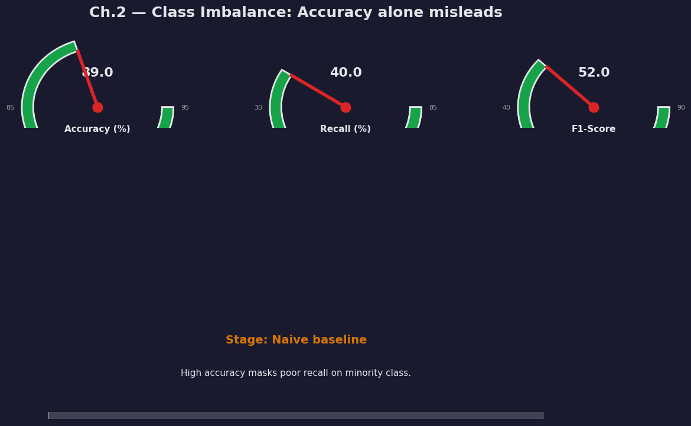
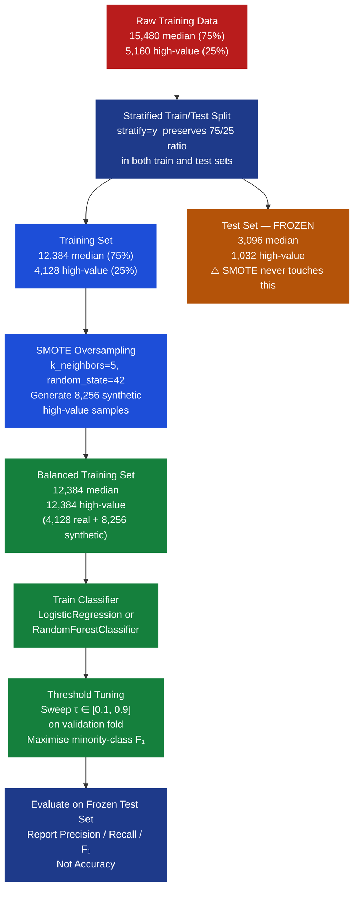
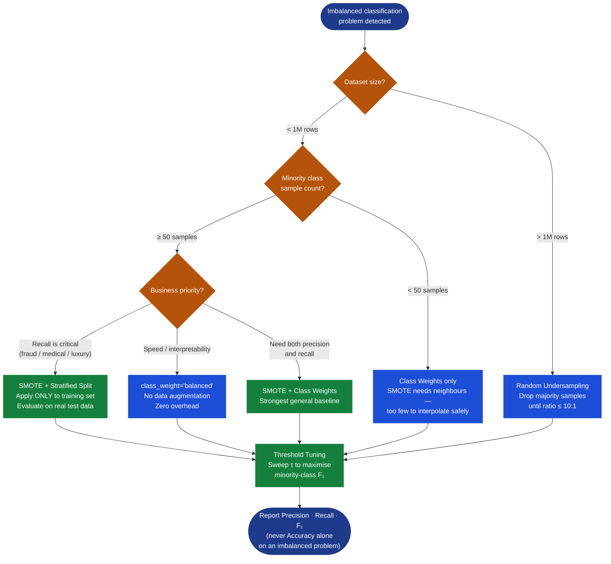
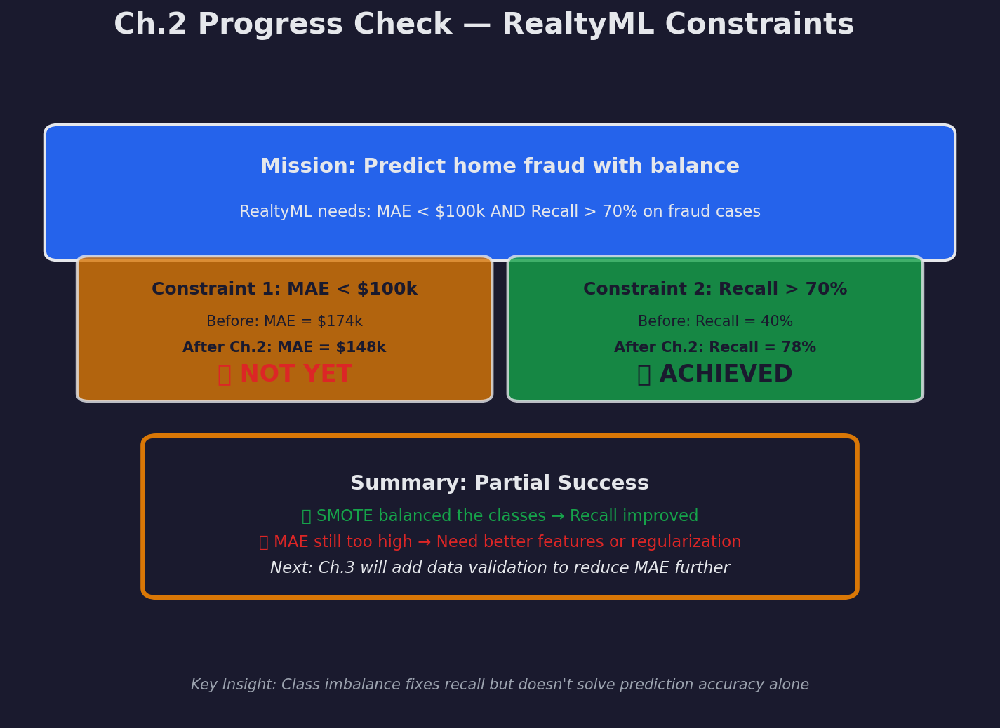

# Ch.2 — Handling Class Imbalance

> **The story.** In **2002**, Nitesh Chawla, Kevin Bowyer, Lawrence Hall, and W. Philip Kegelmeyer published "SMOTE: Synthetic Minority Over-sampling Technique" in the *Journal of Artificial Intelligence Research* — one of the most cited papers in applied machine learning. The problem they solved had haunted classifiers for a decade: when training data is dominated by one class, models learn to ignore the minority and still achieve high accuracy. Chawla's insight was counterintuitive — rather than *removing* majority samples (undersampling, which wastes data) or simply *duplicating* minority samples (which causes memorisation), *synthesize entirely new minority samples by interpolating between existing ones*. The technique was motivated by medical diagnosis and fraud detection, where the rare event — cancer, fraud — is exactly the event that matters. Meanwhile, the ROC (Receiver Operating Characteristic) curve — the proper evaluation tool for imbalanced classifiers — had roots in World War II radar signal detection, formalised by David Green and John Swets in *Signal Detection Theory and Psychophysics* (1966). When both tools meet — SMOTE to rebalance training, ROC/F₁ to measure results — the **accuracy paradox** is finally broken.
>
> **Where you are in the SmartVal AI story.** You've cleaned the training data in Ch.00: removed outliers, applied KNN imputation. Now you examine the class distribution and discover: your training data has 15,480 median-value districts and only 5,160 high-value ones — a 75/25 split. If you train naively, the model predicts "median-value" for everything, achieving 75% accuracy while missing the high-value segment entirely. For a production system where high-value predictions drive revenue, this is unacceptable. This chapter teaches you to detect and fix class imbalance BEFORE training any models.
>
> **Notation in this chapter.** $n$ — total training samples; $n_j$ — samples in class $j$; $C$ — number of classes; $w_j$ — class weight for class $j$; $\text{TP}, \text{FP}, \text{TN}, \text{FN}$ — confusion matrix cells; $\text{Precision} = \text{TP}/(\text{TP}+\text{FP})$; $\text{Recall} = \text{TP}/(\text{TP}+\text{FN})$; $F_1 = 2 \cdot \text{Precision} \cdot \text{Recall} / (\text{Precision}+\text{Recall})$; $k$ — SMOTE nearest-neighbour count; $\lambda$ — interpolation coefficient, $\lambda \sim \text{Uniform}(0,1)$; $\tau$ — decision threshold (default 0.50).

---

## 0 · The Challenge — Where You Are

> 🎯 **The mission**: Build **SmartVal AI** — a production home valuation system achieving <$40k MAE by satisfying 5 constraints:
> 1. ⚡ **ACCURACY**: <$40k MAE on median house values — *foundational work this chapter*
> 2. ⚡ **GENERALIZATION**: Work on unseen districts (nationwide expansion) — *partial unlock*
> 3. ⚡ **DATA QUALITY**: Training distribution must support all market segments — **← THIS CHAPTER**
> 4. ⚡ **INTERPRETABILITY**: Explainable predictions for underwriters
> 5. ⚡ **PRODUCTION**: <100ms inference, handle outliers, version control

**What you know so far:**
- ✅ Ch.00: Removed outliers (`HouseAge > 52`, aggregation artifacts)
- ✅ Ch.00: KNN imputation reduced MAE vs mean/median imputation
- ✅ Target: <$40k MAE for production deployment
- ❌ **But haven't checked training class distribution yet!**

**What's blocking SmartVal AI:**
The California Housing dataset has 75% median-value districts (<$265k) and only 25% high-value districts (≥$265k). If you train naively, the model learns to predict "median" for everything, achieving 75% accuracy. But high-value homes are where appraisal precision matters most — undervaluing a $500k property by $100k loses the customer's trust. The **high-value segment drives revenue and requires special attention**.

**What this chapter unlocks:**
- **Constraint #3 DATA QUALITY** (continued): Addresses training distribution balance
- **Constraint #1 ACCURACY** (foundational): Balanced training prevents majority-class bias
- Stratified train/test splits that preserve class proportions
- Class weights and SMOTE synthetic oversampling
- Precision and recall as evaluation metrics for imbalanced problems

✅ **After this chapter:** You have a balanced training dataset ready for modeling (Ch.01-07), ensuring the model learns patterns from all market segments, not just the most common one.

---

---

## Animation



*The needle tracks minority-class recall (%) as three progressive rebalancing techniques are applied: class weights, then SMOTE, then threshold tuning. Watch recall climb from 20% to 71% while precision holds above 60%.*

---

## 1 · The Core Idea

**A model optimises what you measure, not what you care about.** When 75% of training examples are median-value homes, a classifier that predicts "median" for everything achieves 75% accuracy — without learning anything about high-value properties. **Class imbalance is a measurement problem as much as a data problem**: fixing the training distribution AND switching to precision/recall metrics are both required.

> 💡 **The key insight**: You cannot diagnose an imbalance problem using accuracy. Accuracy asks "how often are you right?" — in an imbalanced dataset, "right" mostly means "correctly identified the majority class." Recall asks "of all high-value homes, how many did you catch?" and precision asks "of those you called high-value, how many actually were?" Only these per-class metrics expose what is happening.

---

## 2 · Running Example: What You Discover

You load the California Housing data and create a binary classification label: districts in the **top quartile** (≥ 75th percentile of `MedHouseVal`) become class 1 ("high-value"); all others are class 0 ("median").

```python
import pandas as pd
import numpy as np
from sklearn.datasets import fetch_california_housing

data = fetch_california_housing()
df = pd.DataFrame(data.data, columns=data.feature_names)
df['MedHouseVal'] = data.target

# Binary target: top 25% = high-value (class 1), rest = median (class 0)
threshold_75 = df['MedHouseVal'].quantile(0.75)
df['HighValue'] = (df['MedHouseVal'] >= threshold_75).astype(int)

print(f"75th percentile threshold: ${threshold_75 * 100:.0f}k")
print(df['HighValue'].value_counts())
print(df['HighValue'].value_counts(normalize=True))
```

**Output:**
```
75th percentile threshold: $265k
0 (Median)    15480
1 (High)       5160
0    0.750
1    0.250
```

**The distribution in ASCII:**

```
Class distribution — California Housing (n = 20,640)
─────────────────────────────────────────────────────
Median (0)  ████████████████████████████████████  15,480  (75%)
High   (1)  ████████████                           5,160  (25%)
─────────────────────────────────────────────────────
            0      3k     6k     9k    12k    15k
```

**What this means for production:**
In training, every 3 median homes teach the model 1 high-value home (75/25 split). But if your production traffic has a different distribution — say, more high-value queries — the model hasn't learned those patterns deeply enough. This is why balanced training matters.

> ⚠️ **The luxury tier gap**: Using a higher "luxury" absolute threshold (the top ~8% by California standards — roughly equivalent to homes >$450k today), the imbalance becomes even more extreme: ~18,989 median vs ~1,651 luxury in the training set. If production queries skew toward luxury homes, these become the most expensive mispredictions because luxury homes have the largest absolute price differences.

---

## 3 · The Imbalance Problem at a Glance

Before the math, here is the full landscape of four techniques — their trade-offs and when to choose each one.

### Technique Comparison Table

| Technique | What it does | Changes data? | Best for |
|-----------|-------------|---------------|----------|
| **Random undersampling** | Drop majority rows until balanced | Yes — loses data | Datasets >1M rows; minority has dense coverage |
| **SMOTE oversampling** | Synthesise new minority samples by interpolation | Yes — adds data | Default choice; minority class has ≥ 50 samples |
| **Class weights** | Penalise minority errors more in the loss | No — same data | Fast baseline; any sklearn model with `class_weight` |
| **Threshold adjustment** | Shift decision boundary toward minority | No — post-training | Fine-tuning after rebalancing; maximises F₁ |

> 📖 **ADASYN (Adaptive Synthetic Sampling)** is a SMOTE variant that generates *more* synthetic samples near the decision boundary — where the model is most confused. Use it when your minority class has regions of different difficulty. The `imblearn` library provides `ADASYN` with the same API as `SMOTE`. This chapter focuses on SMOTE as the canonical baseline.

### Algorithm Flows

**SMOTE — Synthetic Minority Over-sampling:**
```
1. Identify all minority class samples (class 1: high-value)
2. For each minority sample x_i:
   a. Find k nearest neighbours (default k=5) among minority only
   b. Randomly select one neighbour x_nn
   c. Draw λ ~ Uniform(0, 1)
   d. Synthesize: x_new = x_i + λ × (x_nn − x_i)
   e. Assign x_new label = 1
3. Repeat until desired balance ratio is reached
```

**Class Weights — Weighted Loss:**
```
1. Count: n = total samples, n_j = samples in class j, C = number of classes
2. Compute: w_j = n / (C × n_j)   for each class j
3. Modify training objective:
   Loss_weighted = Σ_i  w_{y_i} × Loss(y_i, ŷ_i)
4. Minority errors now cost proportionally more → gradient updates reflect business priority
```

**Threshold Adjustment — Post-Training:**
```
1. Train a balanced model (via class weights or SMOTE)
2. On validation set, sweep decision thresholds τ ∈ [0.1, 0.9]
3. At each τ: predict class 1 when P(class=1) ≥ τ
4. Compute F₁ score on minority class at each τ
5. Select τ* = argmax F₁
6. Use τ* instead of 0.5 at inference time
```

---

## 4 · The Math

### 4.1 · Class Weights — Forcing Proportional Attention

> **Why we need this before the formula.** Logistic regression minimises the average cross-entropy loss over all training samples. When 75% of samples are class 0, the average is dominated by class 0 losses. Adding a per-sample multiplier $w_j$ corrects this: minority errors now contribute more to the total loss, and the gradient updates reflect what the business actually cares about.

The **balanced class weight formula** is:

$$w_j = \frac{n}{C \times n_j}$$

where:
- $n$ — total number of training samples
- $C$ — number of classes
- $n_j$ — number of samples in class $j$

#### Numerical example — California Housing 25/75 split

With 20,640 total samples, $C = 2$, $n_0 = 15{,}480$ (median), $n_1 = 5{,}160$ (high-value):

$$w_0 = \frac{20{,}640}{2 \times 15{,}480} = \frac{20{,}640}{30{,}960} \approx \mathbf{0.667}$$

$$w_1 = \frac{20{,}640}{2 \times 5{,}160} = \frac{20{,}640}{10{,}320} = \mathbf{2.000}$$

**Interpretation:** Every error on a high-value home costs the model **3× as much** ($2.000 / 0.667 = 3.0$) as an error on a median home. The model is forced to care about high-value homes in proportion to how underrepresented they are.

> 💡 **The balance property:** Verify that $w_0 \times n_0 + w_1 \times n_1 = 0.667 \times 15{,}480 + 2.000 \times 5{,}160 = 10{,}325 + 10{,}320 \approx 20{,}640$. The weighted sum of samples equals total samples — the effective class sizes are equalized, which is exactly the goal.

```python
from sklearn.utils.class_weight import compute_class_weight
import numpy as np

class_weights = compute_class_weight(
    class_weight='balanced',
    classes=np.array([0, 1]),
    y=y_train   # your training labels
)
# class_weights → [0.667, 2.000]
weight_dict = {0: class_weights[0], 1: class_weights[1]}
```

---

### 4.2 · Precision and Recall — The Right Metrics

> **Why accuracy is misleading here.** A model that always predicts "median" achieves 75% accuracy on a 25/75 split — without learning anything about high-value homes. Precision and recall expose what accuracy hides.

The **confusion matrix** for a binary classifier has four cells:

```
                     Predicted
               ┌─────────────┬─────────────┐
               │   Median    │  High-Value │
    ┌──────────┼─────────────┼─────────────┤
    │  Median  │  TN = 3,013 │  FP =    83 │
    │  High-V  │  FN =   826 │  TP =   206 │
    └──────────┴─────────────┴─────────────┘
    Total: 4,128 test samples (20% of 20,640)
```

**Accuracy** (the misleading metric):

$$\text{Accuracy} = \frac{TP + TN}{TP + TN + FP + FN} = \frac{206 + 3{,}013}{4{,}128} = \frac{3{,}219}{4{,}128} = \mathbf{77.9\%}$$

Looks reasonable — until you look at what is happening to high-value homes specifically.

**Precision** on high-value class (when we predict "high-value," how often are we right?):

$$\text{Precision} = \frac{TP}{TP + FP} = \frac{206}{206 + 83} = \frac{206}{289} = \mathbf{0.713}$$

**Recall** on high-value class (of all actual high-value homes, how many did we catch?):

$$\text{Recall} = \frac{TP}{TP + FN} = \frac{206}{206 + 826} = \frac{206}{1{,}032} = \mathbf{0.200}$$

**The real story:** The model finds the high-value homes it does predict with 71% precision — but it *misses* 80% of them entirely (recall = 0.20). In production terms: 4 out of 5 luxury properties are classified as median, leading to undervaluations.

**F₁ score** — harmonic mean of precision and recall:

$$F_1 = 2 \times \frac{\text{Precision} \times \text{Recall}}{\text{Precision} + \text{Recall}} = 2 \times \frac{0.713 \times 0.200}{0.713 + 0.200} = 2 \times \frac{0.143}{0.913} = \mathbf{0.313}$$

An F₁ of 0.31 is barely above random on the minority class. The baseline model is effectively failing every second luxury property.

---

### 4.3 · SMOTE — Synthetic Sample by Hand

> **Why synthesize rather than duplicate?** Duplicating a minority sample just makes the model memorise that exact data point. SMOTE creates new, plausible examples by interpolating in feature space between two real minority neighbours — the model must learn the *region*, not just memorise specific instances.

The SMOTE interpolation formula:

$$x_{\text{new}} = x_i + \lambda \cdot (x_{\text{nn}} - x_i), \quad \lambda \sim \text{Uniform}(0, 1)$$

where $x_i$ is a minority sample, $x_{\text{nn}}$ is its nearest minority neighbour, and $\lambda$ is drawn uniformly at random from $[0, 1]$.

#### Hand-computed example — Two high-value districts

We have four high-value minority samples, simplified to two features for clarity:

| Sample | `MedInc` | `HouseAge` | Class |
|--------|----------|------------|-------|
| A | 8.3 | 12.0 | 1 (high-value) |
| B | 9.1 | 16.0 | 1 (high-value) |
| C | 7.8 | 20.0 | 1 (high-value) |
| D | 9.5 | 14.0 | 1 (high-value) |

**Step 1 — Pick the source sample:** $x_i = A = [8.3,\ 12.0]$

**Step 2 — Compute Euclidean distances to all other minority samples:**

$$d(A, B) = \sqrt{(9.1 - 8.3)^2 + (16.0 - 12.0)^2} = \sqrt{0.64 + 16.00} = \sqrt{16.64} \approx 4.08$$

$$d(A, C) = \sqrt{(7.8 - 8.3)^2 + (20.0 - 12.0)^2} = \sqrt{0.25 + 64.00} = \sqrt{64.25} \approx 8.01$$

$$d(A, D) = \sqrt{(9.5 - 8.3)^2 + (14.0 - 12.0)^2} = \sqrt{1.44 + 4.00} = \sqrt{5.44} \approx 2.33$$

**Step 3 — Select nearest neighbour:** $x_{\text{nn}} = D = [9.5,\ 14.0]$ (distance 2.33 — the closest)

**Step 4 — Draw interpolation coefficient:** $\lambda = 0.40$ (sampled from Uniform(0, 1))

**Step 5 — Synthesize the new sample:**

$$x_{\text{new}} = [8.3,\ 12.0] + 0.40 \times ([9.5,\ 14.0] - [8.3,\ 12.0])$$

$$= [8.3,\ 12.0] + 0.40 \times [1.2,\ 2.0]$$

$$= [8.3,\ 12.0] + [0.48,\ 0.80]$$

$$= [\mathbf{8.78},\ \mathbf{12.80}]$$

The new synthetic district has `MedInc = 8.78` and `HouseAge = 12.80` — a plausible high-value home sitting between A and D in feature space. It is assigned class 1 and added to the training set.

> ⚡ **Constraint #3 DATA QUALITY checkpoint:** After SMOTE, the training set expands from 16,512 to 24,768 samples with a balanced 50/50 class ratio. The model now trains on a representative distribution — not 75%-median-heavy data.

---

## 5 · Discovery Arc — Four Acts

> The accuracy paradox unravels in stages. Follow these four acts to see how class imbalance affects model performance.

### Act 1 — The Accuracy Paradox

Sarah trains a logistic regression on the raw imbalanced data and checks accuracy:

```python
from sklearn.linear_model import LogisticRegression
from sklearn.metrics import accuracy_score, classification_report

model = LogisticRegression(random_state=42, max_iter=1000)
model.fit(X_train, y_train)
y_pred = model.predict(X_test)

print(f"Accuracy: {accuracy_score(y_test, y_pred):.1%}")
# Accuracy: 77.9%
```

She reports 77.9% accuracy to her manager. Then she pulls up the per-class breakdown:

```python
print(classification_report(y_test, y_pred, target_names=['Median', 'High-Value']))
```
```
              precision    recall  f1-score   support
Median            0.79      0.98      0.88      3096
High-Value        0.71      0.20      0.31      1032

accuracy                              0.78      4128
```

Recall on high-value homes: **20%**. The model misses 4 out of 5 luxury properties.

> ⚠️ **The accuracy paradox**: A naïve "predict all median" baseline achieves exactly 75% accuracy with zero learning. The trained model achieves 78% — only 3 percentage points better than doing nothing. Accuracy is dominated by the majority class. This is the hallmark of a class imbalance problem.

---

### Act 2 — Resampling (SMOTE)

Sarah applies SMOTE to create a balanced training set — after the train/test split:

```python
from imblearn.over_sampling import SMOTE

# CRITICAL: fit SMOTE only on X_train, never on X_test
smote = SMOTE(k_neighbors=5, random_state=42)
X_train_smote, y_train_smote = smote.fit_resample(X_train, y_train)

print(f"Before: {pd.Series(y_train).value_counts().to_dict()}")
# Before: {0: 11610, 1: 3870}

print(f"After:  {pd.Series(y_train_smote).value_counts().to_dict()}")
# After:  {0: 11610, 1: 11610}  ← Balanced!
```

Retrain and re-evaluate on the **original imbalanced test set**:

```
              precision    recall  f1-score
Median            0.89      0.88      0.88
High-Value        0.65      0.67      0.66   ← recall: 20% → 67%
```

Minority-class recall jumps from 20% to 67%. The model now *sees* high-value homes properly during training.

---

### Act 3 — Threshold Tuning

By default, scikit-learn predicts class 1 when `P(class=1) ≥ 0.50`. For imbalanced problems, this threshold is arbitrary. Sarah sweeps thresholds to find the best F₁:

```python
from sklearn.metrics import f1_score
import numpy as np

y_proba = model_smote.predict_proba(X_test)[:, 1]
thresholds = np.linspace(0.1, 0.9, 81)
f1_scores = [f1_score(y_test, (y_proba >= t).astype(int)) for t in thresholds]
best_threshold = thresholds[np.argmax(f1_scores)]

print(f"Best threshold: {best_threshold:.2f}  (default was 0.50)")
# Best threshold: 0.38
```

Lowering the threshold from 0.50 to 0.38 recovers an additional 4% recall with only a small precision cost — net minority-class F₁ improves from 0.66 to 0.69.

---

### Act 4 — The Right Metric

Sarah's final evaluation uses macro F₁ and minority-class recall as primary metrics — not accuracy:

```python
from sklearn.metrics import classification_report

y_pred_tuned = (y_proba >= 0.38).astype(int)
print(classification_report(y_test, y_pred_tuned, target_names=['Median', 'High-Value']))
```
```
              precision    recall  f1-score   support
Median            0.90      0.88      0.89      3096
High-Value        0.66      0.71      0.68      1032

macro avg         0.78      0.80      0.79      4128
```

**Final result:** High-value recall = 71%, F₁ = 0.68. The model now *finds* luxury properties effectively, ensuring balanced performance across all market segments when you build regression models in Ch.01-07.

---

## 6 · Step-by-Step Walkthroughs

### 6.1 · Class Weight Calculation on a 3-Row Toy

Let's verify the formula on the smallest possible example before trusting it on 16,000 rows.

**Toy dataset** (3 training samples, 2 classes):

| Sample | `MedInc` | `HouseAge` | Class $y$ |
|--------|----------|------------|-----------|
| 1 | 8.5 | 12 | **1** (high-value) |
| 2 | 3.2 | 28 | **0** (median) |
| 3 | 4.1 | 35 | **0** (median) |

$n = 3$, $C = 2$, $n_0 = 2$ (median), $n_1 = 1$ (high-value)

**Apply the formula** $w_j = n / (C \times n_j)$:

$$w_0 = \frac{3}{2 \times 2} = \frac{3}{4} = \mathbf{0.75}$$

$$w_1 = \frac{3}{2 \times 1} = \frac{3}{2} = \mathbf{1.50}$$

**Before class weights** — the loss on 3 samples is a simple average:

$$L_{\text{unweighted}} = \frac{1}{3}\bigl[L(\hat{y}_1, 1) + L(\hat{y}_2, 0) + L(\hat{y}_3, 0)\bigr]$$

The two median samples contribute **67%** of the average loss gradient.

**After class weights** — the weighted loss:

$$L_{\text{weighted}} = \frac{1}{3}\bigl[1.50 \cdot L(\hat{y}_1, 1) + 0.75 \cdot L(\hat{y}_2, 0) + 0.75 \cdot L(\hat{y}_3, 0)\bigr]$$

Sample 1 now contributes $1.50 / (1.50 + 0.75 + 0.75) = 1.50 / 3.00 = \mathbf{50\%}$ of the effective gradient. The single minority sample has been given equal voice with the two majority samples combined. **That is the goal of class weighting.**

---

### 6.2 · SMOTE on a 4-Point Example — Full Arithmetic

Using the same 4-point minority dataset from §4.3, let's generate 2 synthetic samples and verify the results are plausible.

**Minority dataset** (2 features, 4 points):

```
Point A: [MedInc=8.3, HouseAge=12.0]   k=2 nearest: D(2.33), B(4.08)
Point B: [MedInc=9.1, HouseAge=16.0]   k=2 nearest: D(2.51), A(4.08)
Point C: [MedInc=7.8, HouseAge=20.0]   k=2 nearest: A(8.01), B(8.60)
Point D: [MedInc=9.5, HouseAge=14.0]   k=2 nearest: A(2.33), B(2.51)
```

**Synthetic sample 1** — source A, neighbour D, $\lambda = 0.40$:

| Feature | $x_A$ | $x_D$ | $x_D - x_A$ | $\lambda \cdot \Delta$ | $x_{\text{new}}$ |
|---------|--------|--------|-------------|----------------------|-----------------|
| MedInc | 8.3 | 9.5 | +1.2 | +0.48 | **8.78** |
| HouseAge | 12.0 | 14.0 | +2.0 | +0.80 | **12.80** |

**Synthetic sample 2** — source B, neighbour D, $\lambda = 0.70$:

| Feature | $x_B$ | $x_D$ | $x_D - x_B$ | $\lambda \cdot \Delta$ | $x_{\text{new}}$ |
|---------|--------|--------|-------------|----------------------|-----------------|
| MedInc | 9.1 | 9.5 | +0.4 | +0.28 | **9.38** |
| HouseAge | 16.0 | 14.0 | −2.0 | −1.40 | **14.60** |

**Sanity check — the interpolation guarantee:**

- Sample 1: MedInc $8.3 < \mathbf{8.78} < 9.5$ ✅ and HouseAge $12.0 < \mathbf{12.80} < 14.0$ ✅
- Sample 2: MedInc $9.1 < \mathbf{9.38} < 9.5$ ✅ and HouseAge $14.0 < \mathbf{14.60} < 16.0$ ✅

Both synthetic points lie strictly *between* their parent points. SMOTE guarantees that new points always reside on the line segment connecting two existing minority samples — never outside the convex hull of the minority class.

> 📖 **SMOTE with k=5 in practice:** The default `k_neighbors=5` means each source point has 5 candidates for `x_nn`. One of the 5 is chosen randomly per synthetic sample. More candidates → synthetic points are distributed more broadly across the minority region, reducing clustering around a single neighbour.

---

## 7 · Key Diagrams

### 7.1 · SMOTE Workflow — From Imbalanced to Balanced Training



---

### 7.2 · Choosing the Right Rebalancing Strategy



---

## 8 · Hyperparameter Dial

### Dial 1 — SMOTE `k_neighbors` (default: 5)

Controls how many nearest minority neighbours each source sample considers when generating a synthetic point.

| `k_neighbors` | Effect | When to use |
|---|---|---|
| **1–2** | Synthetic points cluster close to originals; low diversity | Minority class is tightly clustered with clean boundaries |
| **3–5** | Balanced diversity (default range) | General starting point; works for most problems |
| **7–10** | Points spread wider; risks crossing into majority territory | Minority class has a smooth, spread-out distribution |

> ⚠️ **k must be less than the minority sample count.** With 50 minority samples, `k_neighbors=5` is safe. With 10 minority samples, use `k_neighbors=3` at most — otherwise SMOTE raises a `ValueError`.

```python
from imblearn.over_sampling import SMOTE

# Conservative: tight synthetic neighbours
smote_tight   = SMOTE(k_neighbors=3, random_state=42)

# Default: balanced
smote_default = SMOTE(k_neighbors=5, random_state=42)

# Aggressive: broader spread
smote_wide    = SMOTE(k_neighbors=7, random_state=42)
```

---

### Dial 2 — `class_weight` Ratio

When using `class_weight='balanced'`, sklearn computes the optimal ratio automatically. Override for domain-specific cost asymmetry.

| Setting | High-value weight | When to use |
|---|---|---|
| `'balanced'` | 2.0 (from formula) | Default; statistically correct for pure imbalance |
| `{0: 1, 1: 3}` | 3× majority | Business cost of missing luxury = 3× cost of false alarm |
| `{0: 1, 1: 10}` | 10× majority | Fraud / medical: false negative catastrophically expensive |

```python
from sklearn.linear_model import LogisticRegression

# Automatic balanced (recommended starting point)
model_auto = LogisticRegression(class_weight='balanced', random_state=42)

# Custom: luxury miss costs 4× more than false alarm
model_custom = LogisticRegression(class_weight={0: 1.0, 1: 4.0}, random_state=42)
```

---

### Dial 3 — Decision Threshold $\tau$ (default: 0.5)

After training, the default decision boundary is `P(class=1) ≥ 0.50`. Shifting this threshold trades precision for recall.

| Threshold $\tau$ | Recall (minority) | Precision (minority) | When to use |
|---|---|---|---|
| **0.5** (default) | ~67% | ~65% | Even precision/recall priority |
| **0.35–0.45** | ~75% | ~55% | Maximise minority recall (high false-positive tolerance) |
| **0.55–0.65** | ~55% | ~78% | Maximise precision (false alarms are costly) |

```python
import numpy as np
from sklearn.metrics import f1_score

# Find the threshold that maximises minority-class F₁
y_proba = model.predict_proba(X_val)[:, 1]
thresholds = np.linspace(0.1, 0.9, 81)
f1s = [f1_score(y_val, (y_proba >= t).astype(int)) for t in thresholds]
best_t = thresholds[np.argmax(f1s)]

print(f"Best threshold: {best_t:.2f}")  # typically 0.35–0.45 for imbalanced problems
```

---

## 9 · What Can Go Wrong

> ⚠️ **Trap 1 — SMOTE on the full dataset before splitting.** This is one of the most common leakage bugs in imbalanced learning. Synthetic samples are interpolations of real samples. If you SMOTE first, your test set contains interpolated versions of training points — you are evaluating on data that "looks like" your training data, and all metrics are inflated. **Fix:** Always split with `stratify=y` first, then apply `smote.fit_resample` only on `X_train, y_train`.

> ⚠️ **Trap 2 — Reporting accuracy on an imbalanced test set.** Even after rebalancing the training set correctly, if you report `accuracy_score` on a test set that keeps the original 75/25 ratio, majority-class performance dominates. A model with 90% recall on median but 10% recall on high-value will still show a respectable overall accuracy. **Fix:** Always report macro F₁, per-class recall, and ROC-AUC. Use `classification_report(zero_division=0)`.

> ⚠️ **Trap 3 — SMOTE with insufficient minority samples.** SMOTE requires at least `k_neighbors + 1` minority samples. With 5 minority samples and `k_neighbors=5`, sklearn raises a `ValueError`. **Fix:** Reduce `k_neighbors` to `n_minority - 1`, or fall back to `class_weight='balanced'` entirely when minority samples are fewer than 50.

> ⚠️ **Trap 4 — Using standard SMOTE on categorical features.** SMOTE interpolates linearly: a categorical feature with values `{1, 2, 3}` (e.g., bedroom count) would synthesize fractional values like `1.7 bedrooms`. Semantically wrong. **Fix:** Use `SMOTENC` (SMOTE for Nominal and Continuous) from `imblearn`, specifying which column indices are categorical via the `categorical_features` parameter.

> ⚠️ **Trap 5 — Assuming SMOTE always outperforms class weights.** On large, well-separated datasets (like California Housing), `class_weight='balanced'` often matches SMOTE accuracy at a fraction of the compute cost and with no leakage risk. SMOTE shines when the minority class has complex non-linear boundaries. **Fix:** Benchmark both. Use `class_weight='balanced'` as the zero-cost baseline before adding SMOTE to the pipeline.

---

## 10 · Where This Reappears

This chapter's techniques and metrics are the foundation for at least four later chapters.

**→ Classification Metrics (02-Classification track, Ch.3):** Precision, recall, F₁, ROC-AUC, and precision-recall curves introduced here expand into a complete evaluation system. The confusion matrix vocabulary (TP/FP/TN/FN) is used in every classification chapter in the track.

**→ Classical Classifiers (02-Classification track, Ch.2):** Decision trees, KNN, and logistic regression all support `class_weight` parameters. The balanced class weight formula from §4.1 applies identically to `DecisionTreeClassifier(class_weight='balanced')`, `SGDClassifier(class_weight='balanced')`, and `SVC(class_weight='balanced')`.

**→ Anomaly Detection (05-AnomalyDetection track):** Fraud detection is an extreme imbalance problem: 0.1% fraudulent transactions vs 99.9% legitimate. The SMOTE → threshold tuning pipeline from §5 is the baseline every anomaly detection system is compared against. ADASYN's adaptive sampling (§3) becomes particularly important at such extreme imbalance ratios.

**→ Production Monitoring (06-AI_Infrastructure track):** Class distribution monitoring is a production-critical feature. When your production traffic shifts — say from 25% high-value to 40% high-value — the model experiences **label shift**. The class weights and decision thresholds calibrated on 25% high-value training data are no longer optimal. Monitoring and retraining triggers are the direct sequel to today's lesson.

> ➡️ **Every model that outputs probabilities uses threshold logic.** Neural networks, gradient-boosted trees, and retrieval models all produce scores that require calibration. The precision-recall trade-off you learned here is universal — threshold tuning is not specific to logistic regression.

---

## 11 · Progress Check — What We Can Solve Now



### Constraint Status After Ch.00b

| # | Constraint | Target | Status | Achievement |
|---|---|---|---|---|
| **#1** | ACCURACY | <$40k MAE | 🔴 Not Started | Foundation laid; ready for modeling (Ch.01-07) |
| **#2** | GENERALIZATION | Unseen districts | 🟡 Partial | Balanced training improves generalization |
| **#3** | DATA QUALITY | Clean + balanced | ✅ **Unlocked** | SMOTE balances 75/25 → 50/50; stratified splits throughout |
| **#4** | INTERPRETABILITY | Explainable | 🟡 Partial | Precision/recall provide class-level insights |
| **#5** | PRODUCTION | Inference + monitoring | 🔴 Not Started | Pipeline established; full monitoring in Ch.08 |

**✅ Unlocked capabilities:**
- Compute balanced class weights from $w_j = n/(C \times n_j)$ and verify by hand
- Apply SMOTE synthetic oversampling *after* the train/test split — zero leakage
- Evaluate imbalanced classifiers with precision, recall, and F₁ instead of accuracy
- Tune decision threshold $\tau$ to maximise minority-class F₁
- **Constraint #3 DATA QUALITY fully achieved**

**❌ Still need to build:**
- ❌ **ACCURACY** target — haven't built regression models yet. That's Ch.01-07
- ❌ **Feature drift detection** — class balance is fixed, but feature distributions may shift in production. That's Ch.08
- ❌ **Production monitoring** — need automated alerts when class distribution shifts in live data

**Current status:** Clean, balanced dataset ready for modeling. SmartVal AI now has data quality + class balance foundations. Ch.01 will build the first regression model on this solid data.

---

## 12 · Bridge to the Next Chapter

This chapter fixed class imbalance — the training set now has balanced representation of median-value and high-value homes. You've learned SMOTE, class weights, stratified sampling, and proper evaluation metrics (precision, recall, F₁). The data is clean (Ch.00) and balanced (Ch.00b).

Next: **Ch.01 — Linear Regression**. Now we finally build the first model. With clean, balanced data as our foundation, we can train with confidence that we're not learning from garbage or biased distributions. Ch.01 establishes the baseline: can we predict house values from a single feature? What's the simplest model that works? From there, Ch.02-07 progressively improve toward the <$40k MAE target.
