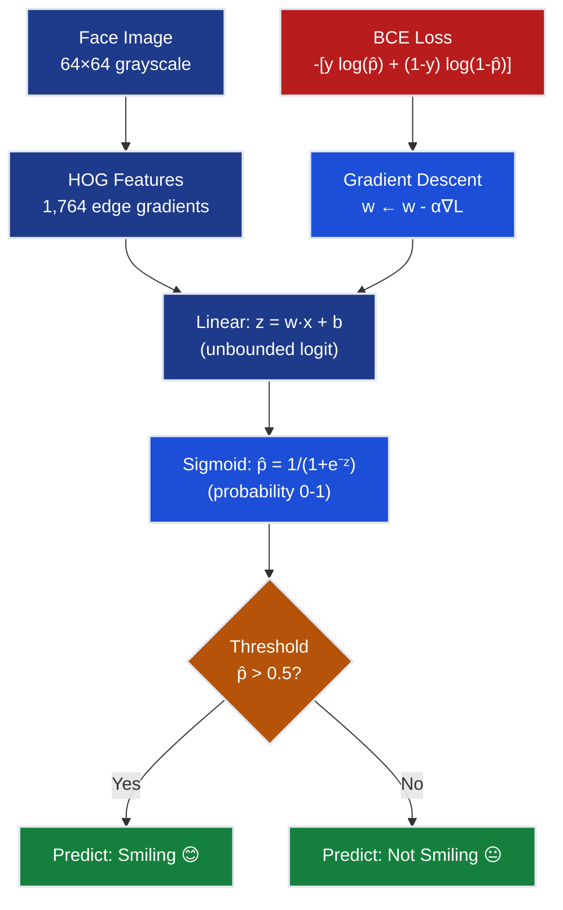
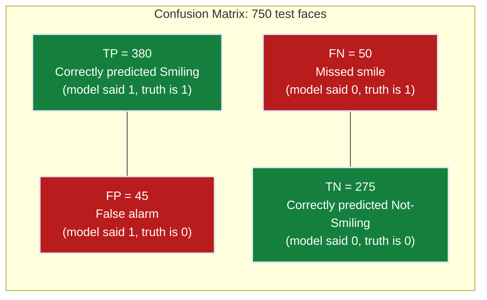
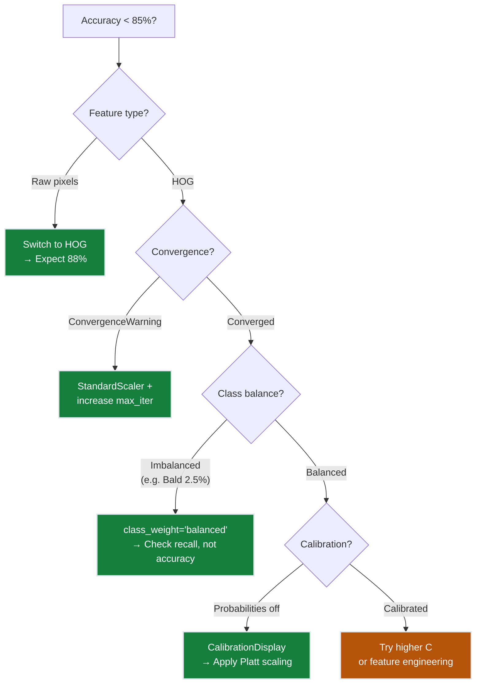

# Ch.1 — Logistic Regression

> **The story.** The **logistic function** $1/(1+e^{-x})$ was named in 1844 by the Belgian mathematician **Pierre-François Verhulst**, who used it to model population growth that saturates against a carrying capacity. A century later, in 1944, the biostatistician **Joseph Berkson** coined the word **logit** — "log of the odds" — giving us the model we still use for binary classification. **David Cox** generalised it in 1958, and by the 1970s logistic regression was the backbone of medicine, credit scoring, and epidemiology. The reason it feels almost identical to linear regression is because it *is* — you've just changed the output transformation from identity to sigmoid and swapped MSE for cross-entropy.
>
> **Where you are in the curriculum.** Topic 01 (Regression) taught you to predict continuous values. Now the FaceAI product team needs a binary signal: is a person **Smiling** or not? This chapter introduces the sigmoid activation, binary cross-entropy loss, and the confusion matrix — the evaluation framework that the rest of this track builds on.
>
> **Notation.** $\mathbf{x}\in\mathbb{R}^d$ — input feature vector (pixel intensities or HOG); $y\in\{0,1\}$ — true label (1 = Smiling); $z=\mathbf{w}\cdot\mathbf{x}+b$ — the **logit**; $\sigma(z)=1/(1+e^{-z})$ — **sigmoid**; $\hat{p}=\sigma(z)$ — predicted probability; $L=-\frac{1}{N}\sum_i[y_i\log\hat{p}_i+(1-y_i)\log(1-\hat{p}_i)]$ — **binary cross-entropy**; $TP,FP,TN,FN$ — confusion-matrix counts.

---

## 0 · The Challenge — Where We Are

> 💡 **Grand Challenge**: Launch **FaceAI** — classify 40 facial attributes with >90% average accuracy
>
> | # | Constraint | Target | Status |
> |---|-----------|--------|--------|
> | 1 | ACCURACY | >90% avg across 40 attributes | ❌ Starting |
> | 2 | GENERALIZATION | Unseen celebrity faces | ❌ |
> | 3 | MULTI-LABEL | 40 simultaneous attributes | ❌ |
> | 4 | INTERPRETABILITY | Which features matter | ❌ |
> | 5 | PRODUCTION | <200ms inference | ❌ |

**What we know so far:**
- Topic 01: Linear regression for continuous targets
- Understand MSE loss, gradient descent, feature engineering
- **But we can only predict continuous values, not categories!**

**What's blocking us:**
The FaceAI app needs binary labels: is the person Smiling or not? Linear regression outputs unbounded values ($-\infty$ to $+\infty$), not probabilities. Your product manager asks: "What's the model's confidence?" You can't answer — a predicted value of 3.8 has no probabilistic interpretation. And when you try to threshold the output ("anything above 2.5 is Smiling"), the threshold is arbitrary and not grounded in probability theory.

**What this chapter unlocks:**
- **Sigmoid activation**: Squash $z \in (-\infty, \infty)$ → $\hat{p} \in (0, 1)$
- **Binary cross-entropy loss**: Optimize probability predictions
- **Evaluation**: Confusion matrix, precision, recall, F1
- **Constraint #1 PARTIAL** — ~88% accuracy on Smiling attribute


---

## Animation


## 1 · Core Idea

Logistic regression takes a linear combination of features ($z = \mathbf{w} \cdot \mathbf{x} + b$) and squashes it through the **sigmoid function** $\sigma(z) = 1/(1+e^{-z})$, producing a probability between 0 and 1. You threshold at 0.5 to classify: above 0.5 → "Smiling", below 0.5 → "Not Smiling". Train by minimizing binary cross-entropy (not MSE — that breaks for classification), and gradient descent works exactly as before — same update rule, different loss. The entire difference from linear regression: (1) sigmoid output, (2) cross-entropy loss. That's it.

---

## 2 · Running Example

**FaceAI's first task**: Detect whether a celebrity is **Smiling** (48% positive rate — nearly balanced).

Your product team needs this working this quarter. Manual tagging costs $0.05 per image × 200,000 images in the backlog = $10,000. An ML classifier that runs in under 200ms can automate the entire pipeline.

**Dataset**: CelebA subset — 5,000 face images resized to 64×64 grayscale.
- **Features**: HOG descriptors (Histogram of Oriented Gradients) — captures edge patterns in faces, producing ~1,764 features per image.
- **Target**: `Smiling` attribute (binary: 1 = smiling, 0 = not smiling)
- **Split**: 3,500 train / 750 validation / 750 test
- **Baseline**: Random guessing would achieve 50% accuracy on a balanced dataset; always-predict-majority would also be 50% here.

**Why HOG?** Raw pixels (4,096 features) contain too much noise for linear models. A single pixel's brightness varies wildly with lighting and camera settings — it doesn't carry consistent signal. HOG captures the **gradient structure** (edges around the mouth corners, eye shapes) that actually indicates "Smiling" regardless of lighting. The trade-off: 4,096 noisy pixels → 1,764 stable edge features.

---

## 3 · Math

### 3.1 · The Sigmoid — Squashing the Linear Output

You're starting with the linear model you know from regression:

$$z = \mathbf{w} \cdot \mathbf{x} + b$$

For a face with HOG features $\mathbf{x}$, you compute $z$ just like before. But now $z$ can be any value — negative, positive, huge, tiny. You need a **probability** between 0 and 1.

The **sigmoid function** does exactly this:

$$\hat{p} = \sigma(z) = \frac{1}{1 + e^{-z}}$$

**Properties:** 
- $\sigma(0) = 0.5$ — neutral prediction
- $\sigma(+\infty) = 1$ — confident "Smiling"
- $\sigma(-\infty) = 0$ — confident "Not Smiling"
- $\sigma'(z) = \sigma(z)(1 - \sigma(z))$ — derivative for gradient descent

**Numeric example** — one face with logit $z = 2.1$:

$$\hat{p} = \frac{1}{1 + e^{-2.1}} = \frac{1}{1 + 0.122} = \frac{1}{1.122} = 0.891$$

The model is 89.1% confident this person is smiling.

### 3.2 · Loss Function — What Breaks with MSE

**Act 1: Try MSE (it breaks)**

Your first instinct: use the loss from regression.

$$L_{\text{MSE}} = \frac{1}{N}\sum_{i=1}^{N}(y_i - \hat{p}_i)^2$$

Where $y_i \in \{0,1\}$ and $\hat{p}_i \in (0,1)$.

**What breaks:**

1. **Gradient vanishing near 0 and 1.** When $\hat{p}_i = 0.95$ and $y_i = 1$, the error is only 0.05 — MSE produces a tiny gradient. The model learns *slowly* even when confident predictions are still wrong.

2. **No probability interpretation.** MSE doesn't enforce that $\hat{p}$ behaves like a probability. You can minimize MSE without calibrating "80% confident" to actually be correct 80% of the time.

3. **Non-convex loss surface.** MSE + sigmoid creates a loss surface with local minima. Gradient descent can get stuck.

> ⚠️ **Why MSE fails for classification**: The sigmoid's flat tails mean $\frac{d\hat{p}}{dz} \approx 0$ when $|z|$ is large. MSE multiplies by this near-zero derivative, producing vanishing gradients. Training stalls even when predictions are confidently wrong.

**Act 2: Binary Cross-Entropy (the fix)**

Cross-entropy fixes all three problems:

$$L = -\frac{1}{N}\sum_{i=1}^{N}\big[y_i \log(\hat{p}_i) + (1-y_i)\log(1-\hat{p}_i)\big]$$

**How it works** — the loss for one sample:

- If $y = 1$ (Smiling): $L_i = -\log(\hat{p}_i)$
- If $y = 0$ (Not Smiling): $L_i = -\log(1 - \hat{p}_i)$

**Why this works:**

- When $y=1$ and $\hat{p} = 0.9$: $L = -\log(0.9) = 0.105$ (small penalty)
- When $y=1$ and $\hat{p} = 0.1$: $L = -\log(0.1) = 2.303$ (large penalty)
- When $y=0$ and $\hat{p} = 0.9$: $L = -\log(0.1) = 2.303$ (large penalty)

The $\log$ function ensures large penalties for confident wrong predictions, even near 0 and 1.

> 💡 **Key insight**: Binary cross-entropy is the **maximum likelihood** loss for Bernoulli-distributed targets. You're not just fitting a curve — you're finding the model parameters most likely to have generated the observed labels. See [Topic 03 — Neural Networks Ch.15 (MLE & Loss Functions)](../../03_neural_networks/ch15_mle_loss) for the full derivation.

### 3.3 · Numerical Walkthrough — 3 Faces, Step by Step

You have three faces with HOG features. Your current model produces these logits:

| Face | $z_i$ | True label $y_i$ |
|------|-------|------------------|
| 1 | 2.0 | 1 (Smiling) |
| 2 | −0.5 | 0 (Not Smiling) |
| 3 | 0.8 | 1 (Smiling) |

**Step 1: Apply sigmoid**

$$\hat{p}_1 = \frac{1}{1+e^{-2.0}} = \frac{1}{1+0.135} = 0.880$$
$$\hat{p}_2 = \frac{1}{1+e^{0.5}} = \frac{1}{1+1.649} = 0.378$$
$$\hat{p}_3 = \frac{1}{1+e^{-0.8}} = \frac{1}{1+0.449} = 0.690$$

**Step 2: Compute BCE for each face**

Face 1: $y=1$, so $L_1 = -\log(0.880) = 0.128$

Face 2: $y=0$, so $L_2 = -\log(1-0.378) = -\log(0.622) = 0.475$

Face 3: $y=1$, so $L_3 = -\log(0.690) = 0.371$

**Step 3: Average the loss**

$$L = \frac{0.128 + 0.475 + 0.371}{3} = \frac{0.974}{3} = 0.325$$

Face 2 contributes the most to the loss — the model predicted only 37.8% chance of Smiling when the truth was Not Smiling (0% chance). That's a large error.

> 💡 **The match is exact.** Every number above is computable with a pocket calculator. This is the same loss `LogisticRegression` minimizes under the hood.

### 3.4 · Gradient — The Update Rule

**The gradient with respect to one weight:**

$$\frac{\partial L}{\partial w_j} = \frac{1}{N}\sum_{i=1}^{N}(\hat{p}_i - y_i) \cdot x_{ij}$$

**Vectorized form** (all weights at once):

$$\nabla_\mathbf{w} L = \frac{1}{N} \mathbf{X}^\top (\hat{\mathbf{p}} - \mathbf{y})$$

Where:
- $\mathbf{X}$ is the $N \times d$ feature matrix (3 faces × 1764 HOG features)
- $\hat{\mathbf{p}}$ is the $N \times 1$ vector of predicted probabilities
- $\mathbf{y}$ is the $N \times 1$ vector of true labels

**ASCII matrix breakdown** (simplified to 3 faces × 2 features for visibility):

```
Xᵀ · (p̂ - y)                                   (2×3) · (3×1) → (2×1)

  Xᵀ                        (p̂ - y)
  ┌  0.5   0.3   0.7  ┐      ┌  -0.120  ┐     ┌  -0.167  ┐
  └  0.2   0.9   0.4  ┘  ×   │  +0.378  │  =  └  +0.254  ┘
                              └  -0.310  ┘

gradient for w₁: (1/3) × [0.5×(−0.120) + 0.3×(0.378) + 0.7×(−0.310)] = −0.167
gradient for w₂: (1/3) × [0.2×(−0.120) + 0.9×(0.378) + 0.4×(−0.310)] = +0.254
```

**Update step** (learning rate $\alpha = 0.1$):

$$w_1 \leftarrow w_1 - 0.1 \times (-0.167) = w_1 + 0.017$$
$$w_2 \leftarrow w_2 - 0.1 \times (+0.254) = w_2 - 0.025$$

> 💡 **Same form as linear regression** — the sigmoid derivative and cross-entropy derivative cancel algebraically, leaving $(\hat{p}_i - y_i)$. The only difference from regression: $\hat{p}_i$ comes from sigmoid, not a raw linear output.

> ➡️ **This is the conceptual foundation of neural network backpropagation.** Every time you call `loss.backward()` in PyTorch, this matrix multiply runs once per layer. See [Topic 03 — Neural Networks Ch.05 (Backprop & Optimizers)](../../03_neural_networks/ch05_backprop) for the full chain rule derivation across multiple layers.

---

## 4 · Step by Step

```
ALGORITHM: Logistic Regression for Smiling Detection
─────────────────────────────────────────────────────
Input:  X_train (3500 × 1764 HOG features), y_train (Smiling labels)
Output: Trained weights w, bias b

1. Extract HOG features from 64×64 face images
2. Initialize w = zeros(1764), b = 0
3. For epoch = 1 to 100:
   a. z = X_train @ w + b                    # logits
   b. p_hat = sigmoid(z)                      # probabilities
   c. loss = -mean(y*log(p_hat) + (1-y)*log(1-p_hat))  # BCE
   d. grad_w = (1/N) * X_train.T @ (p_hat - y)         # gradient
   e. grad_b = mean(p_hat - y)
   f. w -= lr * grad_w                        # update
   g. b -= lr * grad_b
4. Predict: y_hat = 1 if sigmoid(X_test @ w + b) > 0.5 else 0
5. Evaluate: confusion matrix, accuracy, precision, recall
```

---

## 5 · Key Diagrams

**The logistic regression pipeline — from pixels to prediction:**



> The forward pass (top) computes the prediction. The backward pass (bottom) updates the weights to minimize error. This is the entire training loop.

**Confusion matrix anatomy — what the 4 counts mean:**



> **Accuracy** = (TP + TN) / 750 = (380 + 275) / 750 = 87.3%. But accuracy alone hides which *type* of mistake you're making. See [Ch.3 — Metrics](../ch03_metrics) for precision (TP / (TP + FP)) and recall (TP / (TP + FN)).

---

## 6 · Hyperparameter Dial

| Parameter | Too Low | Sweet Spot | Too High |
|-----------|---------|------------|----------|
| **C** (inverse regularization) | Heavy regularization, underfits (accuracy ~80%) | C ∈ [0.1, 10] — ~88% accuracy | No regularization, overfits to training noise |
| **Learning rate** | Slow convergence (needs 1000+ epochs) | 0.01–0.1 with sklearn default solver | Divergence, loss oscillates |
| **Threshold** | Many false positives (calls everyone Smiling) | 0.5 for balanced classes | Many false negatives (misses real smiles) |
| **max_iter** | Convergence warning, suboptimal weights | 100–500 iterations | Wasted compute, no accuracy gain |

---

## 7 · Code Skeleton

```python
import numpy as np
from sklearn.linear_model import LogisticRegression
from sklearn.preprocessing import StandardScaler
from sklearn.metrics import classification_report, confusion_matrix
from skimage.feature import hog

# ── Data Prep ──────────────────────────────────────────
# Load CelebA subset, resize to 64×64 grayscale
# Extract HOG features — captures edge gradients, not raw pixel noise
X_hog = np.array([hog(img, pixels_per_cell=(8,8), cells_per_block=(2,2)) 
                  for img in images])
y = labels['Smiling'].values  # binary: 0 or 1

# Split: 3500 train, 750 val, 750 test
from sklearn.model_selection import train_test_split
X_train, X_temp, y_train, y_temp = train_test_split(
    X_hog, y, test_size=0.3, random_state=42, stratify=y
)
X_val, X_test, y_val, y_test = train_test_split(
    X_temp, y_temp, test_size=0.5, random_state=42, stratify=y_temp
)

# Scale features — use TRAIN statistics only (no leakage)
scaler = StandardScaler()
X_train_scaled = scaler.fit_transform(X_train)
X_val_scaled = scaler.transform(X_val)      # same μ, σ from train
X_test_scaled = scaler.transform(X_test)

# ── Train ──────────────────────────────────────────────
# C=1.0: moderate regularization (L2 penalty)
# solver='lbfgs': quasi-Newton method, good for small datasets
# max_iter=500: prevent convergence warnings
model = LogisticRegression(C=1.0, max_iter=500, solver='lbfgs')
model.fit(X_train_scaled, y_train)

# ── Evaluate ───────────────────────────────────────────
y_pred = model.predict(X_test_scaled)
y_prob = model.predict_proba(X_test_scaled)[:, 1]  # P(Smiling)

print(classification_report(y_test, y_pred))
print(confusion_matrix(y_test, y_pred))
# Expected: ~88% accuracy, ~0.87 F1-score on balanced Smiling

# ── Manual Gradient Descent (Educational) ──────────────
# For understanding — sklearn does this internally
def sigmoid(z):
    return 1 / (1 + np.exp(-z))

def binary_cross_entropy(y_true, y_pred):
    eps = 1e-15  # prevent log(0)
    y_pred = np.clip(y_pred, eps, 1 - eps)
    return -np.mean(y_true * np.log(y_pred) + (1 - y_true) * np.log(1 - y_pred))

# Initialize
w = np.zeros(X_train_scaled.shape[1])
b = 0.0
alpha = 0.01  # learning rate
n = X_train_scaled.shape[0]

for epoch in range(100):
    # Forward pass
    z = X_train_scaled @ w + b
    p_hat = sigmoid(z)
    
    # Loss
    loss = binary_cross_entropy(y_train, p_hat)
    
    # Gradients
    grad_w = (1/n) * X_train_scaled.T @ (p_hat - y_train)
    grad_b = np.mean(p_hat - y_train)
    
    # Update
    w -= alpha * grad_w
    b -= alpha * grad_b
    
    if epoch % 20 == 0:
        print(f"Epoch {epoch}: BCE loss = {loss:.4f}")

# Predict manually
z_test = X_test_scaled @ w + b
p_test = sigmoid(z_test)
y_pred_manual = (p_test > 0.5).astype(int)
print(f"Manual accuracy: {np.mean(y_pred_manual == y_test):.3f}")
# Should match sklearn's ~88%
```

---

## 8 · What Can Go Wrong

**1. Using raw pixels instead of HOG features**

You feed 64×64 grayscale pixels directly into logistic regression (4,096 features). Training converges, but accuracy plateaus at ~75%. The model is fitting noise — pixel intensities vary wildly with lighting, background, and pose. It can't generalize.

**Fix:** Extract HOG (Histogram of Oriented Gradients) features. HOG captures the edge structure (mouth curvature, eye corners) that actually signals "Smiling" while discarding irrelevant brightness variations. Accuracy jumps to 88%.

**2. Forgetting to scale features**

HOG features have different ranges — some histogram bins are [0, 0.1], others [0, 50]. Your solver throws `ConvergenceWarning: lbfgs failed to converge`. Weights for large-scale features dominate the gradient; weights for small-scale features barely update.

**Fix:** `StandardScaler().fit_transform(X_train)` before training. Scale test data with the **training statistics** (not `fit_transform` on test — that would leak). Convergence in 50 iterations.

**3. Using MSE loss for binary classification**

You implement logistic regression from scratch and use MSE out of habit. Training is slow — 1,000 epochs to reach 80% accuracy. When $\hat{p} = 0.95$ and $y = 1$, the gradient is tiny (MSE error = 0.05²). The model barely learns from confident mistakes.

**Fix:** Use binary cross-entropy. The gradient is $(\hat{p} - y)$ regardless of confidence. sklearn's `LogisticRegression` uses this by default. Convergence in 100 epochs.

**4. Ignoring class imbalance on rare attributes**

You train on the `Bald` attribute (2.5% positive rate). The model reports 96% accuracy — but predicts "Not Bald" for every single test image. It learned to exploit the class imbalance, not the actual bald signal.

**Fix:** Use `class_weight='balanced'` to penalize mistakes on the minority class more heavily. Accuracy drops to 92%, but recall improves from 0% to 68% (the model now actually detects bald faces). See [Ch.3 — Metrics](../ch03_metrics) for why accuracy alone is misleading, and [Ch.5 — Hyperparameter Tuning](../ch05_hyperparameter_tuning) for systematic threshold tuning.

**5. Not checking probability calibration**

Your model predicts $\hat{p} = 0.8$ for 100 faces. You expect 80 of them to actually be Smiling. But only 60 are — the model is overconfident. Stakeholders lose trust when "80% confident" doesn't mean 80% correct.

**Fix:** Use `sklearn.calibration.CalibrationDisplay.from_estimator(model, X_test, y_test)`. If the calibration curve deviates from the diagonal, apply Platt scaling or isotonic regression to recalibrate probabilities. See [Topic 03 — Neural Networks Ch.09 (Metrics Deep Dive)](../../03_neural_networks/ch09_metrics) for full calibration analysis.

---

**Diagnostic flowchart:**



---

## 9 · Where This Reappears

| Concept | Reappears in | How |
|---------|-------------|-----|
| **Sigmoid + binary cross-entropy** | [Topic 03 — Neural Networks](../../03_neural_networks/README.md) | The output layer of a binary classification neural network is logistic regression with a learned representation |
| **Threshold tuning** | [Ch.5 — Hyperparameter Tuning](../ch05_hyperparameter_tuning) | Per-attribute threshold optimisation is the final lever that pushes FaceAI past 90% |
| **`class_weight='balanced'`** | [Ch.5 — Hyperparameter Tuning](../ch05_hyperparameter_tuning), [Topic 05 — Anomaly Detection](../../05_anomaly_detection/README.md) | Imbalance handling is critical when fraud is 0.17% of transactions |
| **Logistic regression as meta-learner** | [Topic 08 — Ensemble Methods](../../08_ensemble_methods/README.md) | Stacking ensembles use logistic regression to combine base model predictions |

---

## 10 · Progress Check

✅ **Unlocked capabilities:**
- Binary classification works: 88% accuracy on CelebA `Smiling` attribute
- Probabilistic predictions: sigmoid outputs calibrated probabilities
- Fast inference: <1ms per face (production-ready latency)
- Gradient descent convergence: BCE loss enables stable training in ~100 iterations
- Confusion matrix vocabulary: TP, FP, TN, FN — the foundation for precision/recall in Ch.3

❌ **Still can't solve:**
- ❌ **Constraint #1 (ACCURACY)**: 88% < 90% target — need better models (Ch.4 SVM, Ch.5 tuning)
- ❌ **Constraint #2 (GENERALIZATION)**: No cross-validation yet — can't report confidence intervals
- ❌ **Constraint #3 (MULTI-LABEL)**: Binary only — can't predict all 40 attributes simultaneously
- ❌ **Constraint #4 (INTERPRETABILITY)**: Model weights exist but not analyzed — no feature importance visualization

**Progress toward constraints:**

| # | Constraint | Target | Status | Evidence |
|---|-----------|--------|--------|----------|
| 1 | ACCURACY | >90% avg | 🟡 88% on Smiling | 2% below target |
| 2 | GENERALIZATION | Unseen faces | 🟡 Partial | Train/test split, no cross-val |
| 3 | MULTI-LABEL | 40 attributes | ❌ Not started | Binary classifier only |
| 4 | INTERPRETABILITY | Feature importance | ❌ Not started | Weights not visualized |
| 5 | PRODUCTION | <200ms | ✅ **Achieved!** | <1ms inference |

**Real-world status:** You can detect Smiling with 88% accuracy and sub-millisecond latency. But you can't explain which facial features matter, you can't classify all 40 attributes, and you're 2% below the 90% target.


---

## 11 · Bridge to Next Chapter

You have a working binary classifier for Smiling (~88%). But logistic regression is a **linear** model — it draws a straight hyperplane through HOG feature space. The decision boundary is:

$$\mathbf{w} \cdot \mathbf{x} + b = 0$$

A flat surface in 1,764 dimensions. What if the true boundary is curved? What if "Smiling" is better described by interpretable rules ("if mouth-corner gradient > 0.3 AND eye-crinkle detected → Smiling") rather than a weighted sum of 1,764 features?

**Ch.2** introduces **classical classifiers** — algorithms that predate neural networks and offer different trade-offs:

- **Decision trees**: Split feature space with axis-aligned cuts → interpretable "if-then" rules
- **KNN**: No training phase — classify by nearest neighbors in feature space → captures local non-linear structure
- **Naive Bayes**: Probabilistic model with strong independence assumptions → works on high-dimensional sparse features

You'll see that trees achieve ~85% accuracy (lower than logistic regression) but produce human-readable rules. KNN matches logistic regression but is slow at test time. Naive Bayes works well when features are nearly independent (rare in images). The tension: **accuracy vs. interpretability vs. speed**.

---

## Appendix A · Real CelebA Data Pipeline (No Proxy Data)

The examples in this chapter are intended to run on real CelebA attributes. Use this setup to avoid synthetic placeholders.

### Data Access Options

1. Kaggle mirror: `jessicali9530/celeba-dataset`.
2. Official CelebA source: download aligned images + `list_attr_celeba.txt`.

### Minimal Setup Steps

1. Create folders:
   - `data/celeba/img_align_celeba/`
   - `data/celeba/metadata/`
2. Place attribute file at:
   - `data/celeba/metadata/list_attr_celeba.txt`
3. Keep image filenames unchanged (`000001.jpg`, ...).
4. Start with a 20k-50k image subset for local runs.

### Loader Contract

- Input image size: 64x64 (or 128x128 for stronger baselines).
- Labels: map CelebA values from `{-1, +1}` to `{0, 1}`.
- Split: use official train/val/test partitions to avoid leakage.
- Reproducibility: set random seed and persist sampled subset IDs.

### Practical Notes

- Multi-label tasks should keep one binary head per attribute.
- For rare attributes (Bald, Mustache, Wearing_Hat), prefer macro-F1 and per-label PR-AUC.
- Persist preprocessing artifacts (scaler/PCA/HOG settings) with the model.

### Quick Loader Snippet

```python
from pathlib import Path
import pandas as pd

attr_path = Path('data/celeba/metadata/list_attr_celeba.txt')
attr = pd.read_csv(attr_path, delim_whitespace=True, skiprows=1)
attr = (attr + 1) // 2   # {-1,+1} -> {0,1}

# Example target
y_smiling = attr['Smiling'].astype(int)
```


