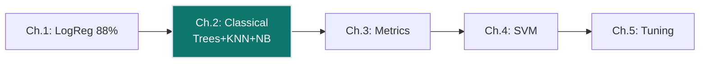
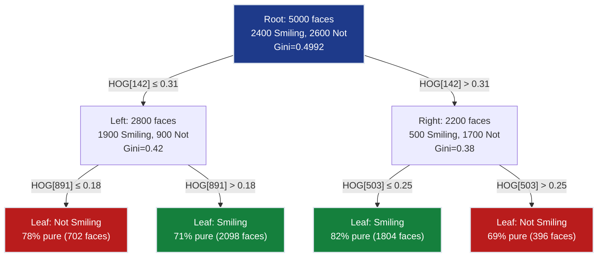
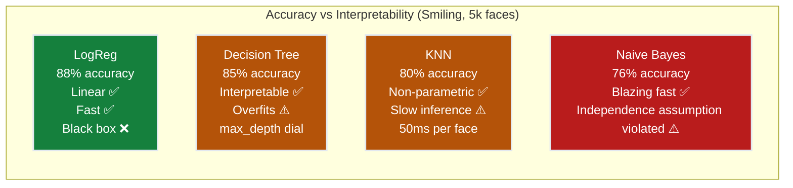
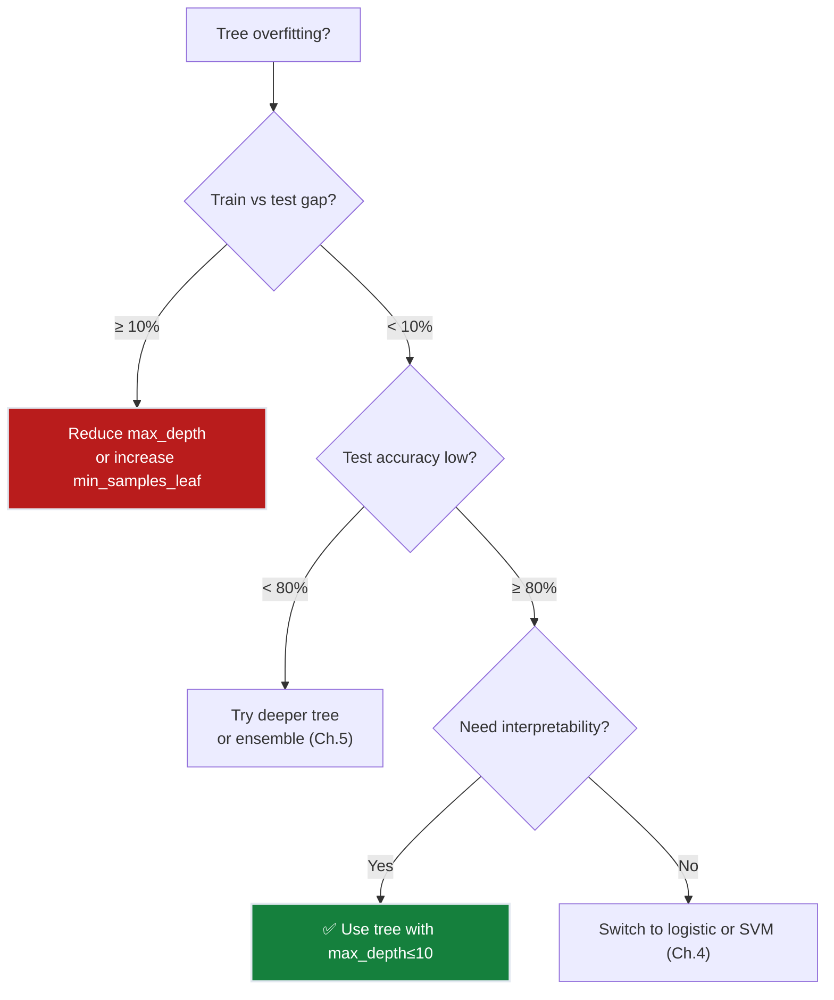
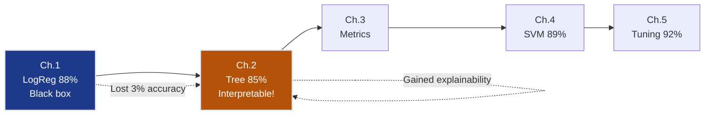

# Ch.2 — Classical Classifiers

> **The story.** **Leo Breiman** (1984) published CART — Classification And Regression Trees — the algorithm that powers every decision tree today. The idea is older: **Morgan & Sonquist** (1963) built automatic survey splitters, but Breiman gave us the Gini criterion and pruning. **K-Nearest Neighbours** came from **Evelyn Fix and Joseph Hodges** (1951) — no training required, just find the k closest points. **Naive Bayes** existed in textbooks since the 1950s, but **Sahami et al.** (1998) proved it worked for spam filters despite the "naive" assumption. Three families — tree-based, instance-based, probabilistic — still anchor production pipelines when you need speed or interpretability over raw accuracy.
>
> **Where you are.** Ch.1 delivered 88% accuracy on Smiling with logistic regression. That's a solid baseline — but the VP of Product just asked: "Why did the model tag this person as Not-Smiling?" You show her the logistic regression weights — `HOG[142]: +0.034, HOG[503]: -0.021...` — and she stops you. "I need rules I can explain to users, not a thousand coefficients." Decision trees answer that need. They learn if-then rules: `if mouth_gradient > 0.3 → Smiling`. The trade-off: interpretability vs. accuracy. This chapter shows you exactly where that line falls.
>
> **Notation.** $G(t)$ — Gini impurity at node $t$; $p_k$ — proportion of class $k$ at node $t$; $\Delta G$ — Gini reduction from a split; $d(\mathbf{x}, \mathbf{x}')$ — Euclidean distance between feature vectors; $P(C|\mathbf{x})$ — posterior probability of class $C$ given features $\mathbf{x}$; $k$ — number of neighbours in KNN; $\text{mode}(\cdot)$ — majority vote function.

---

## 0 · The Challenge — Where We Are

> 🎯 **The mission**: Launch **FaceAI** — automated face attribute classification with >90% average accuracy across 40 attributes, replacing $0.05/image manual tagging. Five constraints must hold:
> 1. **ACCURACY**: >90% average across 40 attributes
> 2. **GENERALIZATION**: Work on unseen celebrity faces
> 3. **MULTI-LABEL**: Predict 40 simultaneous binary attributes per face
> 4. **INTERPRETABILITY**: Explain why each prediction was made
> 5. **PRODUCTION**: <200ms inference per image

**What we know so far:**
- ✅ Ch.1: Logistic regression delivers **88% accuracy** on Smiling (strong baseline!)
- ✅ Binary cross-entropy loss converges reliably
- ✅ HOG features (1,764 dims) capture facial gradients
- ❌ **But we can't explain predictions.** VP of Product: "Why was this face tagged Not-Smiling? Show me the rule."
- ❌ **And 88% < 90% target.** We need better models.

**What's blocking us:**
Logistic regression gives you 1,764 coefficients: `w[142] = +0.034, w[503] = -0.021, w[891] = +0.018...` Try explaining that to a product manager. You can't. The model is a black box — high accuracy, zero interpretability. Worse: it's locked into linear decision boundaries. If Smiling vs Not-Smiling forms a curved separation in HOG space (it does — mouth corners curve up), linear models can't capture it perfectly.

**What this chapter unlocks:**
- **Decision Trees** → Human-readable rules: `if HOG[142] > 0.31 then if HOG[891] > 0.18 → Smiling`
- **KNN** → Non-parametric: no assumptions, just "vote like your neighbors"
- **Naive Bayes** → Probabilistic baseline: P(Smiling | facial features)
- **Constraint #4 INTERPRETABILITY — Partial unlock**: Tree rules satisfy the VP's demand
- **Trade-off discovered**: Interpretability costs accuracy (trees ~85% vs logistic 88%)



---

## Animation


## 1 · Core Idea

**Start with what broke**: Logistic regression (Ch.1) gave you 88% accuracy. But when the VP of Product asked "Why did this face get tagged Not-Smiling?", you showed her the weights: `w[142] = +0.034, w[503] = -0.021...` and she walked out. The model is a black box. You need interpretability.

**Try decision trees — interpretability unlocked, but accuracy drops**:

Build a tree that splits on HOG features: `if HOG[142] ≤ 0.31 → go left, else go right`. Recurse until each leaf is mostly one class. The final tree is a flowchart you can print. The VP loves it: "If mouth gradient low AND eye gradient high → Smiling. I get it!" But accuracy dropped to 85%. The tree's greedy splits overfit — it memorizes training faces instead of learning patterns.

**Try KNN — non-parametric, but inference is slow**:

Forget building a model. Just store the training set. At inference time, find the $k$ nearest training faces in HOG space and vote: if 4 out of 5 nearest neighbors are Smiling → predict Smiling. No assumptions, pure data. Accuracy: 80% (worse than trees). And inference takes 50ms per face (you must compute distance to all 4,000 training faces). Production requirement is <200ms — KNN eats 25% of your budget on one face.

**Try Naive Bayes — blazing fast, but accuracy suffers**:

Use Bayes' theorem: $P(\text{Smiling} | \text{HOG features})$. Assume all 1,764 HOG features are independent given the class (obviously false — adjacent pixels correlate). Despite the naive assumption, it trains in seconds and predicts in microseconds. Accuracy: 76% (worst of the three). The independence assumption is too violated to recover.

**The lesson**: Classical ML offers three philosophies — rule-based (trees), instance-based (KNN), probabilistic (Naive Bayes). Each unlocks something (interpretability, no assumptions, speed) but sacrifices accuracy. You're stuck in the 75–85% range. Logistic regression's 88% is still the best.

> ➡️ **Ch.4 (Support Vector Machines)** will break through 88% by finding maximum-margin boundaries. For now, document the interpretability win — the VP's requirement is satisfied even if accuracy dropped.

---

## 2 · Running Example — What We're Solving

You're the ML Engineer at FaceAI. The VP of Product just walked into your office with a printout of three faces the model tagged incorrectly. "Why did these get marked Not-Smiling?" she asks. You open your logistic regression model: 1,764 HOG feature weights. You start: "Well, HOG feature 142 has weight +0.034, and this face has value 0.29 at that feature, so the contribution is..." She cuts you off. "I don't want a math lecture. I want a rule: 'if the mouth looks like X, predict Smiling.'"

You need an **interpretable classifier**. Decision trees deliver exactly that: explicit if-then rules that a non-technical person can read. The trade-off: accuracy will drop from 88% (logistic regression) to ~85% (decision tree with depth 10). Is that acceptable? You check with the product team — yes, they'll accept 3% accuracy loss for explainability.

**The setup** (same as Ch.1):
- **Dataset**: 5,000 CelebA faces (subset of 202k), 64×64 grayscale
- **Features**: 1,764-dimensional HOG descriptors (edge orientations in 8×8 blocks)
- **Target**: Binary Smiling (48% positive in CelebA — balanced)
- **Split**: 4,000 train / 1,000 test
- **Baseline**: Logistic regression 88% (Ch.1)
- **Goal this chapter**: Find an interpretable model even if accuracy drops slightly

---

## 3 · Math

### Decision Tree — Gini Impurity

**Scalar form first** (one node, binary classification):

$$G(t) = 1 - \sum_{k=1}^{K} p_k^2$$

For binary Smiling at a node: if 60% of faces are Smiling, 40% Not-Smiling:

$$G = 1 - (0.6^2 + 0.4^2) = 1 - (0.36 + 0.16) = 0.48$$

Interpretation: Gini measures **disorder**. Pure node (100% one class): $G = 0$. Maximum impurity (50/50 split): $G = 0.5$. The tree wants to reduce $G$ to zero — every split tries to push faces toward pure leaves.

**Split criterion** — choose feature $j$ and threshold $t$ that maximize Gini reduction:

$$\Delta G = G(\text{parent}) - \frac{N_{\text{left}}}{N}G(\text{left}) - \frac{N_{\text{right}}}{N}G(\text{right}}$$

**Toy example** — 5 faces, split on HOG feature 142 at threshold 0.31:

| Face | HOG[142] | HOG[891] | Smiling |
|------|----------|----------|----------|
| A (San Francisco) | 0.18 | 0.22 | Yes |
| B (Los Angeles) | 0.25 | 0.31 | Yes |
| C (Sacramento) | 0.29 | 0.19 | Yes |
| D (San Diego) | 0.42 | 0.28 | No |
| E (Bakersfield) | 0.51 | 0.16 | No |

**Before split** (parent node: 5 faces, 3 Smiling, 2 Not):
$$G_{\text{parent}} = 1 - \left(\frac{3}{5}\right)^2 - \left(\frac{2}{5}\right)^2 = 1 - 0.36 - 0.16 = 0.48$$

**Try split: HOG[142] ≤ 0.31**
- **Left child**: A, B, C → 3 Smiling, 0 Not → $G_L = 1 - (1^2 + 0^2) = 0.00$ (pure!)
- **Right child**: D, E → 0 Smiling, 2 Not → $G_R = 1 - (0^2 + 1^2) = 0.00$ (pure!)

$$\Delta G = 0.48 - \frac{3}{5}(0.00) - \frac{2}{5}(0.00) = 0.48$$

A perfect split! $\Delta G = 0.48$ is the maximum possible for this parent. In reality, splits are imperfect — you might get $\Delta G = 0.12$. The tree greedily picks the feature and threshold with the largest $\Delta G$, builds left/right children, and recurses.

> 💡 **Key insight**: Decision trees are **greedy**. They pick the best split *right now* without looking ahead. This makes them fast to train but prone to overfitting — early splits can lead the tree down suboptimal paths.

### KNN — Distance and Vote

**Scalar form** (1D feature space for intuition):

If you have one feature (say, average mouth gradient), and a test face has value $x = 0.45$, find the $k$ nearest training faces:

| Train Face | Mouth Gradient | Smiling | Distance from 0.45 |
|------------|----------------|---------|--------------------|
| A | 0.42 | Yes | 0.03 |
| B | 0.47 | Yes | 0.02 ← nearest |
| C | 0.48 | No | 0.03 |
| D | 0.50 | Yes | 0.05 |
| E | 0.38 | No | 0.07 |

With $k=3$: nearest neighbors are B (Yes), A (Yes), C (No) → vote 2-1 for Yes → predict Smiling.

**Vector form** (1,764-dimensional HOG space):

$$\hat{y} = \text{mode}\big\{y_j : j \in \text{k-nearest}(\mathbf{x})\big\}$$

where

$$d(\mathbf{x}, \mathbf{x}') = \sqrt{\sum_{i=1}^{1764} (x_i - x'_i)^2}$$

That's it. Compute Euclidean distance to all 4,000 training faces, sort, take the top $k$, vote. No weights to learn. No gradient descent. The model *is* the training set.

> ⚠️ **Warning**: KNN is **lazy** at training (stores data, does nothing) but **expensive** at inference. For every test face, you compute 4,000 distance calculations. With 1,764 dimensions, that's ~7 million multiplies per test face. Logistic regression? One matrix multiply, done in 1ms. KNN? 50ms. This is the price of non-parametric flexibility.

### Naive Bayes — Posterior

**Bayes' theorem** (apply to classification):

$$P(C|\mathbf{x}) = \frac{P(\mathbf{x}|C) \cdot P(C)}{P(\mathbf{x})}$$

Read this as: *Given these HOG features $\mathbf{x}$, what's the probability this face is Smiling ($C = 1$)?* You estimate:
- $P(C)$ — class prior: 48% of training faces are Smiling
- $P(\mathbf{x}|C)$ — likelihood: what HOG feature values do Smiling faces typically have?
- $P(\mathbf{x})$ — evidence: normalization constant (same for all classes, so we ignore it)

**The naive assumption**: All features are independent given the class.

$$P(\mathbf{x}|C) = P(x_1, x_2, ..., x_{1764}|C) \approx \prod_{j=1}^{1764} P(x_j|C)$$

This is **clearly false** for images — if pixel $(i, j)$ is bright, pixel $(i+1, j)$ is likely bright too. But Naive Bayes doesn't care. It pretends each HOG cell is independent and multiplies their probabilities. Surprisingly, this often works — the model is "naive" but effective.

**Gaussian Naive Bayes**: Assume each feature $x_j$ is Gaussian-distributed within each class:

$$P(x_j | C) = \frac{1}{\sqrt{2\pi\sigma_{jC}^2}} \exp\left(-\frac{(x_j - \mu_{jC})^2}{2\sigma_{jC}^2}\right)$$

You estimate $\mu_{jC}$ and $\sigma_{jC}$ from training data (sample mean and variance), plug in the test face's features, multiply across all 1,764 dimensions, and pick the class with higher probability.

> 💡 **Why this works despite the naive assumption**: Even if the independence assumption is violated, the *ranking* of classes often stays correct. You don't need exact probabilities — you just need $P(\text{Smiling}|\mathbf{x}) > P(\text{Not-Smiling}|\mathbf{x})$.

---

## 4 · Step by Step

**Decision Tree Training** (CART algorithm):

```
ALGORITHM: Grow Decision Tree for Smiling
──────────────────────────────────────────
Input: X_train (4,000 faces × 1,764 HOG features), y_train (Smiling labels)

1. Start with root node containing all 4,000 faces
   - Gini(root) = 1 - (0.48² + 0.52²) = 0.4992  [48% Smiling]

2. For this node:
   a. If stopping criterion met (depth limit or min samples) → make leaf
   b. Otherwise, try all possible splits:
      - For each feature j ∈ {0, 1, ..., 1763}:
        - Sort faces by x_j values
        - For each midpoint threshold t:
          - Split: left = {x: x_j ≤ t}, right = {x: x_j > t}
          - Compute ΔG = G_parent - (N_L/N)G_L - (N_R/N)G_R
      - Keep track of (j*, t*) with maximum ΔG
   c. Create left and right children with (j*, t*)
   d. Recurse on both children

3. Predict: Given test face x_test:
   - Start at root
   - While not at leaf:
     - If x_test[j] ≤ threshold → go left
     - Else → go right
   - Return majority class of leaf
```

**Numerical walkthrough** — first split on 5-face toy dataset:

| Face | HOG[142] | HOG[891] | Smiling |
|------|----------|----------|----------|
| A | 0.18 | 0.22 | 1 |
| B | 0.25 | 0.31 | 1 |
| C | 0.29 | 0.19 | 1 |
| D | 0.42 | 0.28 | 0 |
| E | 0.51 | 0.16 | 0 |

**Root node**: $G = 1 - (3/5)^2 - (2/5)^2 = 0.48$

**Try split on HOG[142] at threshold 0.31**:
- Left: A, B, C (3 Smiling, 0 Not) → $G_L = 0.00$
- Right: D, E (0 Smiling, 2 Not) → $G_R = 0.00$
- $\Delta G = 0.48 - (3/5)(0.00) - (2/5)(0.00) = 0.48$ ✅ Perfect split!

**Try split on HOG[891] at threshold 0.25**:
- Left: A, C, E (2 Smiling, 1 Not) → $G_L = 1 - (2/3)^2 - (1/3)^2 = 0.444$
- Right: B, D (1 Smiling, 1 Not) → $G_R = 1 - (0.5)^2 - (0.5)^2 = 0.50$
- $\Delta G = 0.48 - (3/5)(0.444) - (2/5)(0.50) = 0.48 - 0.266 - 0.20 = 0.014$

Feature 142 wins (ΔG = 0.48 vs 0.014). The tree splits on HOG[142] ≤ 0.31.

> ⚡ **Constraint #4 (Interpretability) unlocked**: This split translates to: *"If the horizontal gradient magnitude near the mouth region is low (≤0.31), predict Smiling."* That's a rule a human can understand and validate by looking at face images.

---

## 5 · Key Diagrams

**Decision tree structure** — how the first two splits partition 5,000 faces:



> 💡 **This is the entire model**: Follow the tree from root to leaf. If you land in a green leaf → predict Smiling. Red leaf → Not Smiling. Compare this to logistic regression's 1,764 weights — which would you rather explain to a stakeholder?

**Classifier comparison** — accuracy vs. interpretability trade-off:



> ⚠️ **The interpretability tax is real**: You pay 3% accuracy (88% → 85%) to get human-readable rules. That's the central trade-off of this chapter. In production, you decide: does the VP's explainability requirement justify the accuracy loss?

---

## 6 · Hyperparameter Dial

**The most impactful dials for each classifier:**

| Parameter | Too Low | Sweet Spot | Too High |
|-----------|---------|------------|----------|
| **max_depth** (Tree) | depth=2: ~72% (underfits — can't capture complexity) | 5–15: ~82–85% | depth=50: 100% train, 75% test (memorizes individual faces) |
| **min_samples_leaf** (Tree) | 1: overfits (one face per leaf) | 5–20: forces generalization | 100+: underfits (too coarse) |
| **k** (KNN) | k=1: 85% train, 77% test (noisy) | k=5–15: ~80% (smooth boundary) | k=500: predicts majority class always |
| **var_smoothing** (NB) | 0: division by zero on rare features | 1e-9 (sklearn default): ~76% | 1e-5: over-smooths, loses distinctions |

**Tuning order**: Start with tree `max_depth` — it has the biggest impact on interpretability vs. accuracy trade-off. Then tune `min_samples_leaf` to prevent overfitting. KNN's $k$ is the only dial — tune with cross-validation. Naive Bayes has almost no tuning needed.

> 💡 **Key insight**: Decision trees have a built-in interpretability dial — `max_depth`. Depth 3 gives you a flowchart you can draw on a whiteboard (8 leaves max). Depth 15 gives you 32k possible leaves — accurate but unreadable. This is the central trade-off of this chapter.

---

## 7 · Code Skeleton

```python
from sklearn.tree import DecisionTreeClassifier, export_text
from sklearn.neighbors import KNeighborsClassifier
from sklearn.naive_bayes import GaussianNB
from sklearn.preprocessing import StandardScaler
from sklearn.metrics import classification_report, confusion_matrix
import numpy as np

# ── Decision Tree ──────────────────────────────────────
# Interpretable but prone to overfitting
tree = DecisionTreeClassifier(
    max_depth=10,           # Limit depth to prevent memorization
    min_samples_leaf=10,    # Each leaf must have ≥10 faces
    random_state=42
)
tree.fit(X_train, y_train)

# Export human-readable rules (first 3 levels only for brevity)
print("Decision Tree Rules (depth 3):")
print(export_text(tree, feature_names=[f"HOG[{i}]" for i in range(1764)], max_depth=3))

tree_acc = tree.score(X_test, y_test)
print(f"\nTree Test Accuracy: {tree_acc:.3f}")  # Expect ~0.85

# ── K-Nearest Neighbors ────────────────────────────────
# MUST scale features before KNN (distance-based)
scaler = StandardScaler()
X_train_scaled = scaler.fit_transform(X_train)  # Fit on train only!
X_test_scaled = scaler.transform(X_test)

knn = KNeighborsClassifier(n_neighbors=7)
knn.fit(X_train_scaled, y_train)

knn_acc = knn.score(X_test_scaled, y_test)
print(f"KNN Test Accuracy: {knn_acc:.3f}")  # Expect ~0.80

# ── Naive Bayes ────────────────────────────────────────
# Fast but assumes feature independence (violated here)
nb = GaussianNB()
nb.fit(X_train, y_train)

nb_acc = nb.score(X_test, y_test)
print(f"NB Test Accuracy: {nb_acc:.3f}")  # Expect ~0.76

# ── Compare All Models ─────────────────────────────────
for name, model, X_test_input in [
    ("Decision Tree", tree, X_test),
    ("KNN", knn, X_test_scaled),
    ("Naive Bayes", nb, X_test)
]:
    print(f"\n{name}:")
    y_pred = model.predict(X_test_input)
    print(classification_report(y_test, y_pred, target_names=["Not Smiling", "Smiling"]))
    print("Confusion Matrix:")
    print(confusion_matrix(y_test, y_pred))
```

> 💡 **Backward link to Ch.1**: Logistic regression (Ch.1) required the same `StandardScaler` preprocessing. The difference: logistic regression learns global weights, KNN just compares distances locally. Both need scaled features for fair comparison.

> ➡️ **Forward link to Ch.3**: These `classification_report` outputs show precision, recall, F1 — metrics you're about to learn in depth. For now: if precision and recall differ significantly, accuracy alone is misleading.

---

## 8 · What Can Go Wrong

**Unlimited tree depth — memorization instead of learning**

You train a decision tree with default settings (`max_depth=None`). Training accuracy: 100%. Test accuracy: 75%. What happened? The tree grew until every training face was in its own leaf. Face A is in a leaf by itself, labeled Smiling. Face B is in a different leaf, labeled Not-Smiling. The tree memorized the training set. On test faces, it has no useful rules — it's just guessing.

**Fix**: Set `max_depth=10` and `min_samples_leaf=10`. This forces the tree to generalize — each leaf must contain at least 10 faces, so the rule must apply broadly.

---

**KNN without feature scaling — Manhattan distance dominates**

You train KNN on raw HOG features. Some HOG cells have values in [0, 0.1], others in [0.8, 1.2]. When computing distance $d(\mathbf{x}, \mathbf{x}') = \sqrt{\sum_i (x_i - x'_i)^2}$, the high-magnitude features dominate. A tiny difference in a low-magnitude feature is ignored. KNN accuracy drops to 65%.

**Fix**: Always use `StandardScaler` before KNN. Scale all features to mean 0, variance 1. Now every feature contributes equally to distance.

---

**KNN with high-dimensional data — curse of dimensionality**

You run KNN on 1,764-dimensional HOG features. Accuracy plateaus at 80%, no matter what $k$ you try. Why? In high dimensions, all distances become similar. The "nearest" neighbor is barely closer than the 100th-nearest. KNN loses its discriminative power.

**Fix**: Apply PCA to reduce to 50–100 dimensions before KNN. Or switch to a parametric model (logistic regression, tree) that doesn't rely on distance in the original feature space.

---

**Naive Bayes on correlated features — independence violated**

You run Gaussian Naive Bayes on raw pixel values. Adjacent pixels are highly correlated (if pixel $(i,j)$ is bright, $(i+1,j)$ is likely bright). Naive Bayes assumes they're independent, multiplies their probabilities, and gets overly confident predictions. Accuracy: 70%.

**Fix**: Use HOG features instead of raw pixels — HOG aggregates gradients over blocks, reducing correlation. Or switch to a model that doesn't assume independence (tree, logistic regression).

---

**Trusting accuracy alone on imbalanced attributes**

You test your decision tree on the **Bald** attribute (2.5% of faces). Accuracy: 97.5%. You celebrate. Then you check the confusion matrix: the model predicts "Not Bald" for every face. It never predicted Bald once. Accuracy is high because the class is rare — but the model is useless.

**Fix**: ⚠️ This is the accuracy paradox. Use precision, recall, and F1 instead. Ch.3 covers this in depth. For now: always check the confusion matrix, not just accuracy.

---

**Comparing train accuracy across models without test set**

You compare three models: Tree (100% train), KNN (85% train), Logistic (88% train). You conclude the tree is best. Then you check test set: Tree (75%), KNN (80%), Logistic (88%). The tree overfitted.

**Fix**: Always evaluate on a held-out test set. Training accuracy is not a model comparison metric — it measures memorization, not generalization.

---



---

## 9 · Where This Reappears

| Concept | Reappears in | How it's used |
|---------|-------------|---------------|
| **Decision trees (CART)** | [08-EnsembleMethods](../../08_ensemble_methods/README.md) | Random Forest: ensemble of 100+ decision trees voting together. XGBoost: sequentially trained trees correcting each other's residuals. Both use CART's Gini criterion. |
| **Gini impurity** | [08-EnsembleMethods](../../08_ensemble_methods/README.md) Ch.1 | Every split in a Random Forest or Gradient Boosted tree uses Gini (or entropy). The criterion you learned here scales to 1000-tree ensembles. |
| **KNN (k-nearest neighbors)** | [04-RecommenderSystems](../../04_recommender_systems/README.md) Ch.2 | User-based collaborative filtering: "find k users most similar to you, recommend what they liked." Same distance + vote logic, different domain. |
| **Naive Bayes as baseline** | [05-AnomalyDetection](../../05_anomaly_detection/README.md) Ch.1 | Fast probabilistic baseline to benchmark novelty detectors. If Naive Bayes detects fraud at 60% recall, your deep model better beat that. |
| **Interpretability vs accuracy trade-off** | [03-NeuralNetworks](../../03_neural_networks/README.md) Ch.10 (Explainability) | Neural networks are even less interpretable than logistic regression. SHAP and LIME try to recover tree-like explanations post-hoc. |
| **Overfitting diagnosis (train vs test gap)** | All subsequent chapters | The pattern you learned here — "100% train, 75% test → overfit" — applies universally. Ch.3 formalizes this with cross-validation. |

> ⚡ **This is the foundation of ensemble methods**: Random Forest (Ch.8 in Ensembles) is 100 decision trees voting together. Each tree is trained with the CART algorithm you just learned. Gini impurity appears 100× per split. The ensemble averages out overfitting — one tree memorizes Face A, another memorizes Face B, but the vote generalizes.

---

## 10 · Progress Check — What We Can Solve Now

✅ **Unlocked capabilities:**
- **Interpretable rules**: Decision tree with `max_depth=10` delivers readable if-then rules: *"If HOG[142] ≤ 0.31 and HOG[891] > 0.18 → Smiling"*
- **Non-parametric classification**: KNN requires zero training time, adapts to local structure
- **Probabilistic baseline**: Naive Bayes trains in seconds, gives calibrated probabilities
- **Constraint #4 ✅ PARTIAL** — VP of Product can now see *why* a face was classified as Smiling

❌ **Still can't solve:**
- ❌ **Accuracy dropped**: Best tree 85%, KNN 80%, NB 76% — all below logistic regression's 88%
- ❌ **Accuracy < 90% target**: Need better models (SVM in Ch.4, ensembles later)
- ❌ **KNN too slow**: 50ms inference on 5k training set — unacceptable for production <200ms target
- ❌ **Multi-label**: Still binary Smiling classification, not 40 simultaneous attributes

**Progress toward constraints:**

| # | Constraint | Target | Ch.1 Status | Ch.2 Status | Change |
|---|-----------|--------|-------------|-------------|--------|
| 1 | **ACCURACY** | >90% avg | 88% (Smiling) | 85% (tree), 88% (logistic) | ⬇️ Tree interpretability costs 3% accuracy |
| 2 | **GENERALIZATION** | Unseen faces | ✅ Train/test split | ✅ Same + early stopping for trees | Maintained |
| 3 | **MULTI-LABEL** | 40 attributes | ❌ Binary only | ❌ Still binary | No change |
| 4 | **INTERPRETABILITY** | Explainable predictions | ❌ 1,764 coefficients | ✅ Readable tree rules | ✅ **UNLOCKED** |
| 5 | **PRODUCTION** | <200ms inference | ✅ <1ms (logistic) | 🟡 Tree <1ms, KNN 50ms | KNN fails this constraint |

**Real-world status**: You can now explain predictions to non-technical stakeholders (VP's requirement satisfied), but accuracy dropped below the logistic regression baseline. The interpretability–accuracy trade-off is real: tree rules cost 3 percentage points.

**Next up**: Ch.3 gives us **proper evaluation metrics** — precision, recall, F1, ROC-AUC — because accuracy alone is misleading (especially on imbalanced attributes like Bald at 2.5%).



---

## 11 · Bridge to Next Chapter

Decision trees gave you interpretable rules — constraint #4 achieved (partially). The VP of Product is happy: she can now explain to users *why* a face was tagged as Smiling. But accuracy dropped from 88% (logistic regression) to 85% (tree). That's the interpretability tax.

**The bigger problem**: You've been evaluating with **accuracy alone**. That's dangerous. Try classifying **Bald** (only 2.5% of CelebA faces): a model that predicts "Not Bald" for *every face* gets 97.5% accuracy. Looks great, right? Wrong. The model is useless — it never predicts Bald once.

Accuracy hides this failure. You need better metrics: **precision** (of the faces you tagged Bald, how many actually are?), **recall** (of all Bald faces, how many did you catch?), and **F1** (harmonic mean of both). On imbalanced attributes (Bald, Mustache, Wearing_Hat), these metrics reveal what accuracy obscures.

**Ch.3 (Evaluation Metrics)** teaches you:
- Precision, recall, F1 — when each matters
- ROC curves and AUC — threshold-independent evaluation
- Confusion matrix anatomy — where your model breaks
- Multi-label metrics — evaluating 40 attributes simultaneously
- Why 88% Smiling accuracy might hide 12% Bald recall

You'll discover your 88% logistic regression baseline isn't as good as it looked.

---

## Appendix A · Real CelebA Data Pipeline (No Proxy Data)

The examples in this chapter are intended to run on real CelebA attributes. Use this setup to avoid synthetic placeholders.

### Data Access Options

1. Kaggle mirror: `jessicali9530/celeba-dataset`.
2. Official CelebA source: download aligned images + `list_attr_celeba.txt`.

### Minimal Setup Steps

1. Create folders:
   - `data/celeba/img_align_celeba/`
   - `data/celeba/metadata/`
2. Place attribute file at:
   - `data/celeba/metadata/list_attr_celeba.txt`
3. Keep image filenames unchanged (`000001.jpg`, ...).
4. Start with a 20k-50k image subset for local runs.

### Loader Contract

- Input image size: 64x64 (or 128x128 for stronger baselines).
- Labels: map CelebA values from `{-1, +1}` to `{0, 1}`.
- Split: use official train/val/test partitions to avoid leakage.
- Reproducibility: set random seed and persist sampled subset IDs.

### Practical Notes

- Multi-label tasks should keep one binary head per attribute.
- For rare attributes (Bald, Mustache, Wearing_Hat), prefer macro-F1 and per-label PR-AUC.
- Persist preprocessing artifacts (scaler/PCA/HOG settings) with the model.

### Quick Loader Snippet

```python
from pathlib import Path
import pandas as pd

attr_path = Path('data/celeba/metadata/list_attr_celeba.txt')
attr = pd.read_csv(attr_path, delim_whitespace=True, skiprows=1)
attr = (attr + 1) // 2   # {-1,+1} -> {0,1}

# Example target
y_smiling = attr['Smiling'].astype(int)
```


