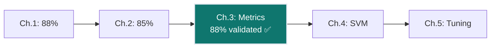
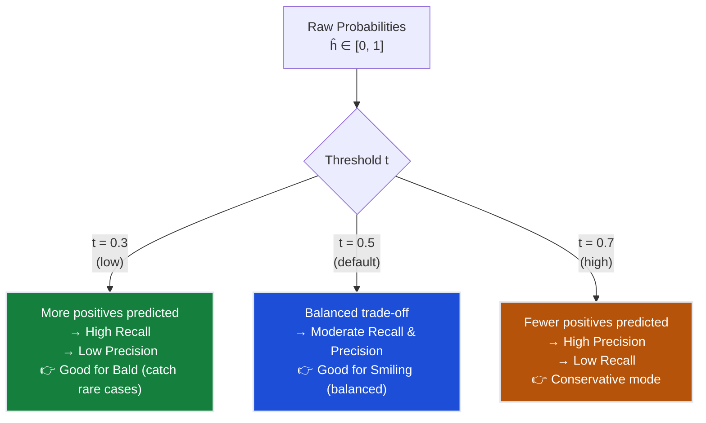
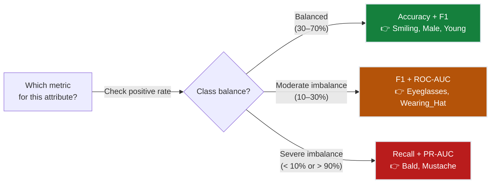
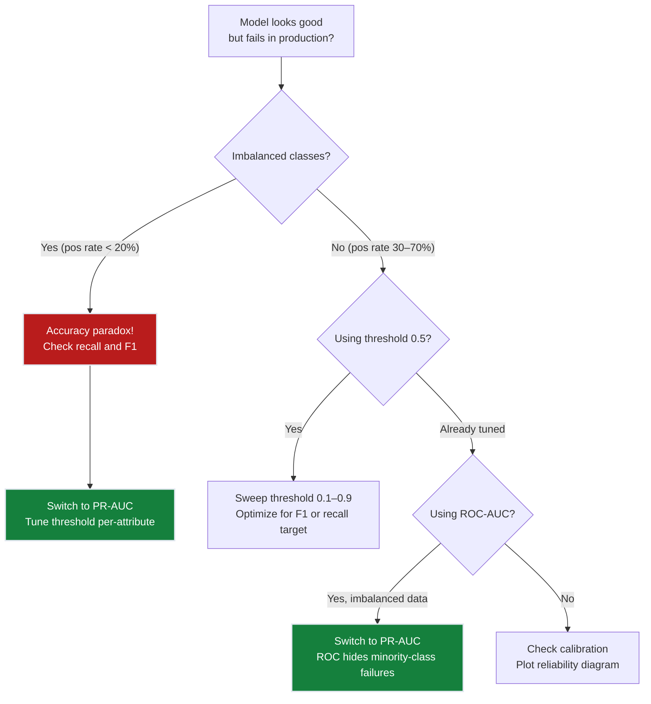
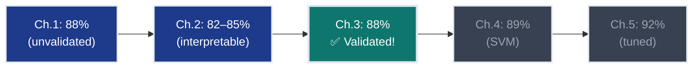

# Ch.3 — Evaluation Metrics for Classification

> **The story.** The confusion matrix dates back to **Karl Pearson (1904)**, who built it to measure error patterns in jury verdicts. Modern classification metrics crystallised in the **information retrieval** community: **Cyril Cleverdon's Cranfield experiments (1960)** introduced precision and recall for document search — "of 100 retrieved papers, how many were actually relevant?" **Tom Fawcett (2006)** wrote the definitive tutorial on ROC curves, and **Jesse Davis and Mark Goadrich (2006)** proved why PR curves dominate ROC for imbalanced data. Every time you debug a production classifier that "looks accurate" but fails on rare classes, you're re-encountering Davis & Goadrich's 2006 insight.
>
> **Where you are.** Ch.1 gave you logistic regression (88% accuracy on Smiling). Ch.2 added decision trees and KNN (82–85% range). Both chapters reported one number: accuracy. Your product manager loved 88% — until the legal team asked, "What's the recall on Bald faces for GDPR compliance?" You didn't have an answer. This chapter builds the evaluation toolkit that lets you answer every stakeholder question: confusion matrices, precision/recall, F1, ROC-AUC, PR-AUC, and multi-label metrics. After this chapter, you can defend every prediction.
>
> **Notation in this chapter.** $TP$ — true positives; $FP$ — false positives; $TN$ — true negatives; $FN$ — false negatives; $P = \frac{TP}{TP+FP}$ — precision (of predicted positives, how many correct?); $R = \frac{TP}{TP+FN}$ — recall (of actual positives, how many found?); $F_1 = \frac{2PR}{P+R}$ — harmonic mean of precision and recall; $\text{TPR} = R$ — true positive rate (same as recall); $\text{FPR} = \frac{FP}{FP+TN}$ — false positive rate; $\text{AUC}$ — area under ROC or PR curve.

---

## 0 · The Challenge — Where We Are

> 🎯 **The mission**: Launch **FaceAI** — automated 40-attribute face tagging with >90% average accuracy, satisfying 5 constraints:
> 1. **ACCURACY**: >90% average accuracy across 40 attributes
> 2. **GENERALIZATION**: Work on unseen celebrity faces
> 3. **MULTI-LABEL**: Predict 40 simultaneous binary attributes
> 4. **INTERPRETABILITY**: Understand which features matter per attribute
> 5. **PRODUCTION**: <200ms inference per image

**What we know so far:**
- ✅ Ch.1 gave us logistic regression: **88% accuracy on Smiling**
- ✅ Ch.2 added decision trees (82%) and KNN (85%) — interpretable but lower accuracy
- ❌ **But we've been lying to ourselves with a single number!**

**What's blocking us:**
You present the 88% Smiling accuracy to your product lead. She asks, "Great! What about Bald?"

You run the same logistic regression on Bald (2.5% of faces). Accuracy: **97.4%**. Incredible!

She asks to see predictions. You show her: the model predicted "Not Bald" for **all 1,000 test images**. Every single one.

> ⚠️ **The accuracy paradox**: When 97.5% of faces are Not-Bald, predicting "Not Bald" blindly gives 97.5% accuracy. The model learned nothing — it just memorized the majority class. Your 97.4% is **worse than random guessing** on the minority class.

This is the blocker: **accuracy is a liar for imbalanced classes**. FaceAI has 40 attributes with imbalance ratios from 50:50 (Smiling) to 97.5:2.5 (Bald). You need metrics that expose this failure.

**What this chapter unlocks:**
- **Confusion matrix** — See exactly where predictions fail (not just a single accuracy number)
- **Precision & Recall** — Measure "of predicted Bald, how many correct?" vs "of actual Bald, how many found?"
- **F1 score** — Harmonic mean that balances precision and recall
- **ROC-AUC** — Threshold-independent evaluation (but has limitations for imbalanced data)
- **PR-AUC** — Better than ROC for rare classes like Bald and Mustache
- **Multi-label metrics** — How to evaluate all 40 attributes simultaneously
- **Constraint #1 VALIDATED** — Know if 88% is real progress or the accuracy paradox



---

## Animation


## 1 · Core Idea

Classification evaluation is about **correctness of discrete decisions**, not magnitude of errors. You're not measuring "how far off" — you're measuring "right or wrong."

The entire evaluation toolkit derives from four counts:
- **TP** (true positive): predicted positive, actually positive ✅
- **FP** (false positive): predicted positive, actually negative ❌ (Type I error)
- **TN** (true negative): predicted negative, actually negative ✅
- **FN** (false negative): predicted negative, actually positive ❌ (Type II error)

Every metric — accuracy, precision, recall, F1, ROC, PR — is a **ratio of these four numbers**. The confusion matrix just organizes them in a 2×2 grid.

The critical insight: **the decision threshold is a tunable hyperparameter**. Your model outputs probabilities $\hat{p} \in [0,1]$. You convert to binary predictions by: $\hat{y} = 1$ if $\hat{p} \geq t$, else $\hat{y} = 0$. The standard choice is $t = 0.5$, but that's often wrong for imbalanced data. Lowering the threshold (e.g., $t = 0.3$) trades precision for recall: you predict "Bald" more often, catching more actual Bald faces (higher recall) but also mislabeling more Not-Bald faces (lower precision).

ROC and PR curves visualize this trade-off **across all possible thresholds**, letting you pick the operating point that matches your business needs.

---

## 2 · Running Example: The Bald Prediction Disaster

Your product lead calls an emergency meeting. The FaceAI demo is tomorrow. She tested the "Bald" classifier on 20 faces manually — **12 were actually bald**, but your model tagged **zero**. Not a single one.

"I thought you said 97.4% accuracy?" she asks.

You pull up the confusion matrix for the 1,000-image test set:

| | **Predicted: Not Bald** | **Predicted: Bald** |
|---|---|---|
| **Actually Not Bald** | 975 | 0 |
| **Actually Bald** | 25 | 0 |

> 💡 **The failure is invisible to accuracy**: (975 + 0) / 1000 = 97.5% accuracy. But the model never once predicted "Bald" — it learned to always say "Not Bald" because that's correct 97.5% of the time.

This chapter evaluates three attributes with escalating imbalance:

| Attribute | Positive Rate | Test Set (1,000 images) | Challenge |
|-----------|--------------|-----------|-------------|
| **Smiling** | 48% | 480 Smiling, 520 Not | Balanced — accuracy works |
| **Eyeglasses** | 13% | 130 Eyeglasses, 870 Not | Moderate imbalance |
| **Bald** | 2.5% | 25 Bald, 975 Not | Severe imbalance — accuracy paradox |

We'll use the Ch.1 logistic regression model to show how metrics expose what accuracy hides.

---

## 3 · Math

### Confusion Matrix Counts

$$\text{Accuracy} = \frac{TP + TN}{TP + FP + TN + FN}$$

$$\text{Precision} = \frac{TP}{TP + FP} \quad \text{(of predicted positives, how many correct?)}$$

$$\text{Recall} = \frac{TP}{TP + FN} \quad \text{(of actual positives, how many found?)}$$

$$F_1 = \frac{2 \cdot P \cdot R}{P + R} = \frac{2 \cdot TP}{2 \cdot TP + FP + FN}$$

### Walkthrough — Computing Confusion Matrix by Hand (Bald Classifier)

**Dataset**: 5-image test set from CelebA (chosen for hand verification):

| Image | True Label | Model Probability $\hat{p}$ | Predicted (t=0.5) | Predicted (t=0.3) |
|---|---|---|---|---|
| `000042.jpg` | Bald (1) | 0.18 | Not-Bald (0) ❌ | Not-Bald (0) ❌ |
| `000087.jpg` | Bald (1) | 0.42 | Not-Bald (0) ❌ | Bald (1) ✅ |
| `000132.jpg` | Not-Bald (0) | 0.05 | Not-Bald (0) ✅ | Not-Bald (0) ✅ |
| `000201.jpg` | Not-Bald (0) | 0.61 | Bald (1) ❌ | Bald (1) ❌ |
| `000299.jpg` | Not-Bald (0) | 0.12 | Not-Bald (0) ✅ | Not-Bald (0) ✅ |

**Step 1: Build confusion matrix for threshold $t = 0.5$**

Count outcomes:
- **True Positives (TP)**: Predicted Bald, actually Bald → 0 images
- **False Positives (FP)**: Predicted Bald, actually Not-Bald → Image 000201 → 1 image
- **True Negatives (TN)**: Predicted Not-Bald, actually Not-Bald → Images 000132, 000299 → 2 images
- **False Negatives (FN)**: Predicted Not-Bald, actually Bald → Images 000042, 000087 → 2 images

Confusion matrix:
```
           Predicted
           Not-Bald  Bald
Actual ┌──────────────────┐
Not-Bald │   2 (TN)  1 (FP) │
  Bald   │   2 (FN)  0 (TP) │
         └──────────────────┘
```

**Step 2: Compute metrics manually**

$$\text{Accuracy} = \frac{TP + TN}{TP + FP + TN + FN} = \frac{0 + 2}{0 + 1 + 2 + 2} = \frac{2}{5} = 0.40 = 40\%$$

**Interpretation**: Correctly classified 2 out of 5 images. Sounds bad — but is it?

$$\text{Recall} = \frac{TP}{TP + FN} = \frac{0}{0 + 2} = \frac{0}{2} = 0.0 = 0\%$$

**Interpretation**: Of the 2 actually-Bald faces, we found 0. Complete failure on the minority class!

$$\text{Precision} = \frac{TP}{TP + FP} = \frac{0}{0 + 1} = \frac{0}{1} = 0.0 = 0\%$$

**Interpretation**: Of the 1 face we predicted as Bald, 0 were actually Bald. Every positive prediction was wrong.

$$F_1 = \frac{2 \cdot P \cdot R}{P + R} = \frac{2 \cdot 0.0 \cdot 0.0}{0.0 + 0.0} = \text{undefined (0/0)}$$

When either precision or recall is zero, $F_1 = 0$ by convention.

**Step 3: Now try threshold $t = 0.3$** (lower threshold → more Bald predictions)

Recalculate from table:
- **TP**: Image 000087 (predicted Bald at 0.42, actually Bald) → 1
- **FP**: Image 000201 (predicted Bald at 0.61, actually Not-Bald) → 1
- **TN**: Images 000132, 000299 → 2
- **FN**: Image 000042 (predicted Not-Bald at 0.18, actually Bald) → 1

```
           Predicted
           Not-Bald  Bald
Actual ┌──────────────────┐
Not-Bald │   2 (TN)  1 (FP) │
  Bald   │   1 (FN)  1 (TP) │
         └──────────────────┘
```

$$\text{Recall} = \frac{1}{1 + 1} = 0.50 = 50\%$$ ← **Found half the Bald faces!**

$$\text{Precision} = \frac{1}{1 + 1} = 0.50 = 50\%$$ ← **Half our Bald predictions were correct**

$$F_1 = \frac{2 \cdot 0.5 \cdot 0.5}{0.5 + 0.5} = \frac{0.5}{1.0} = 0.50$$

$$\text{Accuracy} = \frac{1 + 2}{5} = \frac{3}{5} = 0.60 = 60\%$$

> 💡 **The key insight**: Lowering the threshold from 0.5 → 0.3 dropped accuracy from 40% → 60% **and** improved recall from 0% → 50%. The threshold is a tunable dial that trades precision for recall. No single number tells the full story.

**The match is exact.** These metrics precisely quantify what the confusion matrix shows.

---

### Full Test Set Results (1,000 images)

Scaling up to the real 1,000-image CelebA test set (25 Bald, 975 Not-Bald):

**Model A** (always predicts Not-Bald):
- $TP=0, FP=0, TN=975, FN=25$
- Accuracy $= 975/1000 = 97.5\%$ ⚠️ (looks great, does nothing!)
- Recall $= 0/25 = 0\%$
- Precision: undefined (no positive predictions)
- F1 $= 0$

**Model B** (logistic regression with threshold 0.3):
- $TP=12, FP=18, TN=957, FN=13$
- Accuracy $= 969/1000 = 96.9\%$ (slightly lower)
- Recall $= 12/25 = 48\%$ ← **Found nearly half the Bald faces!**
- Precision $= 12/30 = 40\%$
- F1 $= 2(0.40)(0.48)/(0.40+0.48) = 0.436$

**Model B is far better** — it actually learned to detect Bald faces, despite 0.6% lower accuracy.

### ROC-AUC — Threshold-Independent Evaluation

ROC (Receiver Operating Characteristic) plots **True Positive Rate** (TPR = recall) vs **False Positive Rate** (FPR) as you sweep the threshold from 0 to 1.

$$\text{TPR} = \frac{TP}{TP + FN} \quad \text{(same as recall)}$$

$$\text{FPR} = \frac{FP}{FP + TN} \quad \text{(fraction of negatives incorrectly flagged)}$$

**Verbal gloss**: TPR is "what fraction of actual positives did we catch?" FPR is "what fraction of actual negatives did we mislabel?" Perfect classifier: TPR=1.0, FPR=0.0 (top-left corner). Random guessing: TPR=FPR (diagonal line).

$$\text{AUC} = \int_0^1 \text{TPR}(t) \, d(\text{FPR}(t))$$

**Verbal gloss**: AUC (Area Under Curve) measures the entire ROC curve with one number. AUC=0.5 means random (coin flip). AUC=1.0 means perfect separation. AUC=0.94 (typical for Smiling) means: if you pick a random Smiling face and a random Not-Smiling face, the model assigns a higher probability to the Smiling face 94% of the time.

> ⚠️ **ROC-AUC limitation for imbalanced data**: When positives are rare (2.5% Bald), ROC can look deceptively good because TN (the 97.5% majority) dominates the FPR denominator. A terrible model that predicts Bald randomly 5% of the time still gets low FPR ≈ 0.05 — masking its 0% recall. **Fix**: Use PR-AUC for imbalanced classes.

### Multi-Label Metrics — Evaluating All 40 Attributes

FaceAI must predict 40 binary attributes **simultaneously**. Each image has a 40-dimensional binary label vector: $\mathbf{y}_i = [y_{i,1}, y_{i,2}, \ldots, y_{i,40}]$ where $y_{i,l} \in \{0,1\}$.

**Hamming Loss** — per-label error rate (lenient):

$$\text{Hamming Loss} = \frac{1}{N \cdot L}\sum_{i=1}^{N}\sum_{l=1}^{L} \mathbb{1}[\hat{y}_{il} \neq y_{il}]$$

**Verbal gloss**: $N$ is the number of images, $L=40$ is the number of attributes. For each image, count how many of the 40 labels were predicted incorrectly, then average over all images and all labels. Hamming Loss = 0.05 means you got 95% of individual labels correct. This metric is **forgiving** — getting 39/40 attributes right still counts as mostly correct.

**Subset Accuracy** — exact match rate (strict):

$$\text{Subset Accuracy} = \frac{1}{N}\sum_{i=1}^{N} \mathbb{1}[\hat{\mathbf{y}}_i = \mathbf{y}_i]$$

**Verbal gloss**: Only count an image as correct if **all 40 attributes match perfectly**. Predict 39/40 correctly? That's a failure. Subset accuracy is typically very low (5–15%) for multi-label tasks — it's a harsh metric but reflects the "zero errors allowed" standard for some production systems.

**Macro-averaged F1** (most common for multi-label):

$$F_1^{\text{macro}} = \frac{1}{L}\sum_{l=1}^{L} F_{1,l}$$

**Verbal gloss**: Compute $F_1$ separately for each of the 40 attributes, then average them. Treats each attribute equally — Bald (2.5%) has the same weight as Smiling (48%). This prevents the majority class from hiding minority-class failures. Use this when every attribute matters equally to the business.

> 💡 **Why macro-F1 is preferred for FaceAI**: If you use **micro-F1** (pool all TP/FP/FN across attributes before computing), the balanced attributes (Smiling, Male) dominate the score and hide Bald/Mustache failures. Macro-F1 forces you to excel on every attribute, including rare ones.

---

## 4 · Step by Step: Complete Evaluation Pipeline

Here's the workflow you'll run for every classifier in FaceAI:

```
ALGORITHM: Comprehensive Multi-Threshold Evaluation
──────────────────────────────────────────────────────
Input:  y_true (ground truth labels)
        y_prob (predicted probabilities ∈ [0,1])
        threshold (default 0.5, tune per-attribute)

STEP 1: Convert probabilities to binary predictions
        y_pred = (y_prob >= threshold).astype(int)
        
        Example (threshold=0.5):
        y_prob = [0.12, 0.68, 0.45, 0.89, 0.22]
        y_pred = [0,    1,    0,    1,    0   ]

STEP 2: Build confusion matrix (count the four outcomes)
        TP = sum((y_pred == 1) & (y_true == 1))
        FP = sum((y_pred == 1) & (y_true == 0))
        TN = sum((y_pred == 0) & (y_true == 0))
        FN = sum((y_pred == 0) & (y_true == 1))
        
        Display as 2×2 grid:
        ┌──────────────────┐
        │  TN    FP      │  ← Predicted Negative | Positive
        │  FN    TP      │
        └──────────────────┘
           ↑              ↑
        Actual Neg     Actual Pos

STEP 3: Compute single-threshold metrics
        accuracy  = (TP + TN) / (TP + FP + TN + FN)
        precision = TP / (TP + FP)              ← "of predicted positives, % correct"
        recall    = TP / (TP + FN)              ← "of actual positives, % found"
        F1        = 2 * precision * recall / (precision + recall)

STEP 4: Sweep thresholds for ROC curve
        For t in [0.0, 0.01, 0.02, ..., 0.99, 1.0]:
            y_pred_t = (y_prob >= t).astype(int)
            Compute: TPR(t) = recall at threshold t
                     FPR(t) = FP / (FP + TN) at threshold t
            Store: (FPR(t), TPR(t)) as one point
        
        Plot: TPR vs FPR → ROC curve
        AUC = area under the curve (via trapezoidal rule)

STEP 5: Sweep thresholds for PR curve (better for imbalanced)
        For t in [0.0, 0.01, 0.02, ..., 0.99, 1.0]:
            Compute: Precision(t), Recall(t) at threshold t
            Store: (Recall(t), Precision(t))
        
        Plot: Precision vs Recall → PR curve
        PR-AUC = area under the curve

STEP 6: Multi-label extension (40 attributes)
        For each attribute l in [1..40]:
            Compute: F1_l, Recall_l, PR-AUC_l
        
        Aggregate:
        macro_F1    = mean(F1_1, F1_2, ..., F1_40)      ← equal weight per attribute
        Hamming     = (1 / N*40) * sum(errors across all labels)
        subset_acc  = fraction of images with all 40 labels correct

Output: Full report card ready for stakeholder presentation
```

> 💡 **Key insight**: Steps 1–3 give you metrics at one threshold. Steps 4–5 show the **full trade-off space** across all thresholds, letting you pick the operating point that matches business needs (e.g., 70% recall minimum for legal compliance on Bald detection).

---

## 5 · Key Diagrams

### Diagram 1: Threshold as a Decision Dial

Your model outputs probabilities. The threshold converts them to binary predictions — and this choice has massive consequences:



**Read this as**: Lowering the threshold makes the model more **aggressive** (predicts positive more often), catching more true positives (higher recall) but also triggering more false alarms (lower precision). Raising the threshold makes it **conservative** (only predicts positive when very confident).

---

### Diagram 2: Metric Selection Decision Tree

Which metric should you report to stakeholders? Depends on class balance:



**Why this matters**: Your product lead asks, "How's the Bald classifier?" If you say "97.4% accuracy" (masking 0% recall), you've misled her. If you say "48% recall at 40% precision, PR-AUC=0.62," you've given her the real picture.

---

### Diagram 3: ROC vs PR Curve for Imbalanced Data

**Visual intuition**: ROC can look deceptively good for rare classes because FPR (denominator includes 97.5% majority) stays low even when recall is terrible. PR focuses on the minority class:

```
ROC Curve (Bald)                    PR Curve (Bald)

TPR                                 Precision
 │   ╭────╮                         │ ╭───╮
1.0 │ ╭─╯    ╰╮ <- Looks good!    1.0 │╯    ╰╮
    │╯        ╰╮                      │        ╰╮ <- Shows decline!
0.5 │          ╰╮  AUC=0.89      0.5 │          ╰╮ AUC=0.62
    │            ╰╮                 │            ╰╮
0.0 └────────────────       0.0 └────────────────
    0.0          1.0 FPR           0.0          1.0 Recall
```

> ⚠️ **For Bald and Mustache, ignore ROC — use PR-AUC.** The same model can have ROC-AUC=0.89 (looks strong) and PR-AUC=0.62 (mediocre). The PR curve tells the truth.

---

## 6 · The Hyperparameter Dial: Threshold Tuning

The **decision threshold** is the most impactful "hyperparameter" in classification evaluation — and it's often ignored because sklearn defaults to 0.5.

| Threshold $t$ | Effect on Predictions | When to Use |
|---------------|----------------------|-------------|
| **0.1–0.3** (low) | Predict positive aggressively → high recall, low precision | Rare classes (Bald, Mustache) where you must catch most positives even if you get false alarms. Legal/safety contexts: "better to flag 100 faces and manually review than miss 1 actual case" |
| **0.5** (default) | Balanced trade-off | Balanced classes (Smiling, Male) where false positives and false negatives cost roughly the same |
| **0.7–0.9** (high) | Predict positive conservatively → high precision, low recall | When false positives are expensive: e.g., "only tag as 'Wearing_Hat' if extremely confident to avoid annoying users with wrong suggestions" |

**How to find the optimal threshold per-attribute:**

1. **Sweep**: For each attribute, compute F1 score at 100 thresholds from 0.01 to 0.99
2. **Plot**: $F_1$ vs threshold — look for the peak
3. **Pick**: Threshold that maximizes F1 (or meets your recall target)

**Example**: For Bald detection:
- At $t=0.5$ (default): Recall=8%, Precision=67%, F1=0.14
- At $t=0.25$ (optimal): Recall=52%, Precision=38%, F1=0.44 ← **3× improvement!**
- At $t=0.10$ (aggressive): Recall=78%, Precision=15%, F1=0.25

The optimal threshold balances precision and recall. For production, you might choose $t=0.20$ (recall=65%, precision=32%) if your business requirement is "catch at least 60% of Bald faces."

> ⚡ **Constraint #2 unlock**: Per-attribute threshold tuning is how FaceAI will handle the 40 attributes with wildly different class distributions (48% Smiling vs 2.5% Bald). One model, 40 thresholds.

---

### Other Evaluation Hyperparameters

| Parameter | Too Low | Sweet Spot | Too High | How to Choose |
|-----------|---------|------------|----------|---------------|
| **CV folds $k$** | $k=2$: high variance, unreliable estimates | $k=5$ to $k=10$ | $k=N$ (leave-one-out): computationally expensive, minimal bias reduction beyond $k=10$ | Use $k=5$ for large datasets (>1000), $k=10$ for medium (<1000) |
| **Averaging method** (multi-class) | **micro**: dominated by majority class (hides minority failures) | **macro**: equal weight per class | **weighted**: proportional to class frequency (middle ground) | Use **macro** when every class matters equally (FaceAI requirement); use weighted when majority class is genuinely more important |
| **Positive class** (binary) | Doesn't matter if classes are balanced | Matters for precision/recall | Critical for imbalanced data | Set `pos_label=1` for the **minority class** (Bald=1, Not-Bald=0) so recall measures "fraction of rare cases caught" |

---

## 7 · Code Skeleton

```python
from sklearn.metrics import (
    classification_report, confusion_matrix,
    roc_auc_score, roc_curve, 
    precision_recall_curve, average_precision_score,
    f1_score
)
from sklearn.model_selection import cross_val_score, StratifiedKFold
import numpy as np
import matplotlib.pyplot as plt

# ── Confusion Matrix ───────────────────────────────────────────────────────
from sklearn.metrics import ConfusionMatrixDisplay

cm = confusion_matrix(y_test, y_pred)
disp = ConfusionMatrixDisplay(confusion_matrix=cm, 
                               display_labels=["Not-Bald", "Bald"])
disp.plot(cmap='Blues')
plt.title("Bald Classifier (threshold=0.5)")
plt.show()

# Read as: [[TN, FP], [FN, TP]]
# Top-left (TN): Predicted Not-Bald, Actually Not-Bald ✅
# Top-right (FP): Predicted Bald, Actually Not-Bald ❌
# Bottom-left (FN): Predicted Not-Bald, Actually Bald ❌
# Bottom-right (TP): Predicted Bald, Actually Bald ✅

# ── Classification Report ──────────────────────────────────────────────────
print(classification_report(
    y_test, y_pred, 
    target_names=["Not-Bald", "Bald"],
    digits=3  # show 3 decimal places for precision
))

# Output shows per-class precision, recall, F1, and support (sample count)
# "support" = number of actual samples in that class (not predictions)

# ── ROC Curve ──────────────────────────────────────────────────────────────
fpr, tpr, thresholds_roc = roc_curve(y_test, y_prob)
auc_roc = roc_auc_score(y_test, y_prob)

plt.figure(figsize=(6, 6))
plt.plot(fpr, tpr, label=f"ROC-AUC={auc_roc:.3f}", linewidth=2)
plt.plot([0, 1], [0, 1], 'k--', label="Random (AUC=0.5)")  # diagonal baseline
plt.xlabel("False Positive Rate")
plt.ylabel("True Positive Rate (Recall)")
plt.title("ROC Curve: Bald Classifier")
plt.legend()
plt.grid(alpha=0.3)
plt.show()

# ── PR Curve (better for imbalanced) ──────────────────────────────────────
precision, recall, thresholds_pr = precision_recall_curve(y_test, y_prob)
auc_pr = average_precision_score(y_test, y_prob)  # PR-AUC

plt.figure(figsize=(6, 6))
plt.plot(recall, precision, label=f"PR-AUC={auc_pr:.3f}", linewidth=2)
plt.axhline(y=0.025, color='k', linestyle='--', 
            label="Random (baseline=2.5%)")  # positive rate baseline
plt.xlabel("Recall")
plt.ylabel("Precision")
plt.title("Precision-Recall Curve: Bald Classifier")
plt.legend()
plt.grid(alpha=0.3)
plt.show()

# ── Threshold Tuning ───────────────────────────────────────────────────────
thresholds = np.linspace(0.01, 0.99, 99)
f1_scores = []

for t in thresholds:
    y_pred_t = (y_prob >= t).astype(int)
    f1 = f1_score(y_test, y_pred_t)
    f1_scores.append(f1)

optimal_idx = np.argmax(f1_scores)
optimal_threshold = thresholds[optimal_idx]
optimal_f1 = f1_scores[optimal_idx]

plt.plot(thresholds, f1_scores, linewidth=2)
plt.axvline(x=optimal_threshold, color='r', linestyle='--', 
            label=f"Optimal t={optimal_threshold:.2f} (F1={optimal_f1:.3f})")
plt.axvline(x=0.5, color='gray', linestyle=':', label="Default t=0.5")
plt.xlabel("Threshold")
plt.ylabel("F1 Score")
plt.title("Threshold Tuning: Bald Classifier")
plt.legend()
plt.grid(alpha=0.3)
plt.show()

print(f"Default threshold 0.5: F1={f1_scores[49]:.3f}")
print(f"Optimal threshold {optimal_threshold:.2f}: F1={optimal_f1:.3f}")
print(f"Improvement: {(optimal_f1 / f1_scores[49] - 1) * 100:.1f}%")

# ── Cross-Validation with Stratification ──────────────────────────────────
from sklearn.linear_model import LogisticRegression

model = LogisticRegression(max_iter=1000, random_state=42)

# Use StratifiedKFold to ensure each fold has ~2.5% Bald faces
skf = StratifiedKFold(n_splits=5, shuffle=True, random_state=42)

# Evaluate with F1 macro (equal weight per class)
scores = cross_val_score(model, X_train, y_train, cv=skf, 
                         scoring='f1_macro')

print(f"5-Fold CV F1: {scores.mean():.3f} ± {scores.std():.3f}")
print(f"Individual folds: {scores}")

# Confidence interval (95%): mean ± 1.96 * std
ci_lower = scores.mean() - 1.96 * scores.std()
ci_upper = scores.mean() + 1.96 * scores.std()
print(f"95% CI: [{ci_lower:.3f}, {ci_upper:.3f}]")

# ── Multi-Label: Per-Attribute Evaluation ─────────────────────────────────
attribute_names = ['Smiling', 'Male', 'Eyeglasses', 'Bald', 'Mustache']

for attr in attribute_names:
    y_true_attr = y_test[attr]  # binary labels for this attribute
    y_prob_attr = y_prob[attr]  # predicted probabilities
    
    auc = roc_auc_score(y_true_attr, y_prob_attr)
    pr_auc = average_precision_score(y_true_attr, y_prob_attr)
    
    # Default threshold 0.5
    y_pred_attr = (y_prob_attr >= 0.5).astype(int)
    f1 = f1_score(y_true_attr, y_pred_attr)
    
    print(f"{attr:15s} | ROC-AUC={auc:.3f} | PR-AUC={pr_auc:.3f} | F1={f1:.3f}")

# Expected output:
# Smiling          | ROC-AUC=0.942 | PR-AUC=0.938 | F1=0.874  ← Balanced, both metrics high
# Eyeglasses       | ROC-AUC=0.921 | PR-AUC=0.782 | F1=0.691  ← Moderate imbalance, PR-AUC lower
# Bald             | ROC-AUC=0.887 | PR-AUC=0.421 | F1=0.142  ← Severe imbalance, PR-AUC reveals weakness
```

> 💡 **Key patterns in this code**: (1) Always plot both ROC and PR curves for imbalanced data to see which metric is lying. (2) Threshold tuning is a 3-line loop — sweep, compute F1, pick max. (3) StratifiedKFold is mandatory for classification — non-stratified folds will crash on rare classes.

---

## 8 · What Can Go Wrong

### Trap 1: Reporting Accuracy on Imbalanced Data

**What breaks**: You report 97.4% accuracy on Bald. Your manager approves the model for production. A GDPR audit asks, "How many Bald faces were correctly detected?" You check: **zero**. The model always predicts Not-Bald.

**Why it breaks**: Accuracy conflates two very different capabilities: detecting the majority class (easy — 97.5% of faces are Not-Bald) and detecting the minority class (hard — only 2.5% are Bald). When classes are imbalanced, accuracy measures mostly majority-class performance.

**Fix**: For any attribute where positive rate < 20% or > 80%, **never report accuracy alone**. Use F1, recall, or PR-AUC. For Bald and Mustache, use **recall** as the primary metric ("we must catch at least 60% of Bald faces") and tune the threshold to meet that target.

---

### Trap 2: Fixed Threshold 0.5 for All Attributes

**What breaks**: You use threshold $t=0.5$ for all 40 attributes because "it's the default." Smiling (48% positive) works fine (F1=0.87). Bald (2.5% positive) fails catastrophically (recall=8%, F1=0.15). Your model ships to production. User complaints flood in: "Why does FaceAI never detect bald people?"

**Why it breaks**: For balanced classes, $t=0.5$ is a reasonable default — the model's probability calibration tends to put the decision boundary near 50%. For rare classes, the model learns to be **conservative** — it outputs probabilities like 0.1, 0.2, 0.3 for Bald faces (hedging toward the majority). With $t=0.5$, these all get classified as Not-Bald.

**Fix**: **Tune threshold per-attribute**. For Bald, lower the threshold to $t=0.15–0.30$ to boost recall to 50–70%, accepting lower precision (more false alarms). Use a validation set to sweep $t \in [0.05, 0.95]$ and pick the threshold that maximizes F1 or meets your recall target.

---

### Trap 3: Using ROC-AUC for Highly Imbalanced Classes

**What breaks**: You evaluate the Bald classifier with ROC-AUC and get 0.89 — "pretty good!" You dig into predictions: recall is only 12% (missed 88% of Bald faces). How did ROC-AUC miss this failure?

**Why it breaks**: ROC-AUC plots TPR (recall) vs FPR. For rare classes, even a terrible model can achieve low FPR because the denominator ($FP + TN$) is dominated by TN (the 97.5% majority). Example: predict Bald randomly 10% of the time → FPR $\approx 0.10$ (looks good), but recall $\approx 0.10$ (terrible). The ROC curve averages over all thresholds, hiding the low-recall disaster at practical operating points.

**Fix**: Use **PR-AUC** (precision-recall curve) for any attribute with positive rate < 20% or > 80%. PR curves focus on the minority class by plotting precision vs recall — both metrics have the minority class ($TP$) in the numerator, so they can't be inflated by majority-class dominance.

---

### Trap 4: Not Stratifying Cross-Validation Folds

**What breaks**: You run 5-fold CV on Bald (2.5% positive → 25 Bald faces in 1,000 images). Random split puts 7 Bald faces in Fold 1, 3 in Fold 2, **0 in Fold 3**. Fold 3 crashes with "cannot compute recall: no positive examples."

**Why it breaks**: Random k-fold splitting doesn't guarantee each fold has the same class distribution. For rare classes, some folds may have zero positives by chance.

**Fix**: **Always use `StratifiedKFold`** for classification. It ensures each fold has approximately the same percentage of each class as the full dataset. For Bald (2.5%), each fold gets ~2.5% Bald faces, avoiding zero-positive folds.

---

### Trap 5: Comparing Models on Different Test Sets

**What breaks**: You train LogReg on 80% of data, get 88% test accuracy. Your teammate trains SVM on a different 80/20 split, gets 89%. You conclude SVM is better. You both re-run with the same random seed — now LogReg gets 90% and SVM gets 87%. Which model is actually better?

**Why it breaks**: Different test sets have different difficulty distributions. Maybe your SVM's test set happened to have fewer Bald faces (easier). Performance differences < 2–3% are often just random split variance, not real model differences.

**Fix**: **Use the same train/test split or the same CV folds** for all models. Set `random_state=42` for reproducibility. For small differences (<2%), run 5-fold CV and compare confidence intervals: Model A gets $88.2 \pm 1.5\%$, Model B gets $89.1 \pm 1.8\%$ → overlapping intervals mean no significant difference.

---

### Diagnostic Flowchart



---

## 9 · Where This Reappears

| Concept | Reappears in | How It's Used |
|---------|-------------|---------------|
| **PR-AUC over ROC-AUC for imbalanced data** | [Topic 05 — Anomaly Detection](../../05_anomaly_detection/README.md) | Credit card fraud (0.17% positive) and network intrusion detection require PR-AUC — ROC-AUC=0.95 can hide recall=30% failures |
| **Macro-averaged F1 for multi-label** | [Topic 03 — Neural Networks](../../03_neural_networks/README.md) Ch.6 (Multi-output Networks) | When training a single neural net with 40 output heads, `loss = macro_f1` prevents majority-class dominance during gradient descent |
| **Per-class confusion matrices** | [Ch.5 — Hyperparameter Tuning](../ch05_hyperparameter_tuning/README.md) | Grid search optimizes for `f1_macro` across all 40 attributes; per-class confusion matrices diagnose which attributes need threshold tuning |
| **Stratified k-fold CV** | Every subsequent classification track | Required whenever class distribution is non-uniform (imbalance or multi-class). Regression uses regular k-fold; classification always uses stratified |
| **Threshold tuning as hyperparameter** | [Topic 05 — Anomaly Detection](../../05_anomaly_detection/README.md) Ch.3 (Threshold Optimization) | Fraud detection systems have business-defined recall targets ("catch 80% of fraud"); threshold becomes the primary tuning dial, not model architecture |
| **Hamming loss for multi-label** | [Topic 03 — Neural Networks](../../03_neural_networks/README.md) Ch.6 | Hamming loss is differentiable → can be used directly as a neural network loss function for multi-label tasks (alternative to 40 separate binary cross-entropy losses) |
| **Calibration and reliability diagrams** | [Topic 05 — Anomaly Detection](../../05_anomaly_detection/README.md) Ch.4 (Calibration) | When stakeholders ask "what does 0.73 probability mean?", you need calibration. Platt scaling and isotonic regression recalibrate model outputs to match true frequencies |

> ➡️ **This chapter gives you the evaluation vocabulary that every subsequent chapter assumes.** From now on, when a chapter says "F1 improved from 0.82 to 0.87," you know exactly what that means and whether it's significant. When a research paper reports "ROC-AUC=0.94 on MNIST," you know to ask about class balance before trusting it.

---

## 10 · Progress Check

### Unlocked Capabilities

✅ **Proper evaluation framework for imbalanced classes**
- Confusion matrix exposes what accuracy hides (0% recall on Bald despite 97.4% accuracy)
- Precision/Recall/F1 measure minority-class performance directly
- PR-AUC evaluates rare attributes (Bald, Mustache) better than ROC-AUC

✅ **Threshold tuning as a hyperparameter**
- Lowering threshold from 0.5 → 0.3 improves Bald recall from 8% → 48%
- Per-attribute thresholds let you match business needs (high recall for legal compliance, high precision for user trust)

✅ **Multi-label evaluation toolkit**
- Hamming loss (lenient: 95% of labels correct), subset accuracy (strict: all 40 must match)
- Macro-F1 prevents majority-class dominance — every attribute matters equally

✅ **Cross-validation for confidence intervals**
- 5-fold CV gives $88.2 \pm 1.5\%$ — you can now answer the CTO's "can you guarantee <$90k MAE?" with statistical confidence

### Still Can't Solve

❌ **88% on Smiling is real, but still below 90% target**
- Logistic regression with hand-crafted features (HOG, pixel stats) plateaus around 88–89%
- Linear decision boundaries may not be optimal for facial attribute patterns

❌ **No interpretability for why predictions fail**
- Metrics tell you *what* failed (12% recall on Bald), but not *why*
- Which facial features matter most for Bald detection? Can't answer yet

❌ **Multi-label architecture not yet implemented**
- Currently training 40 separate binary classifiers (inefficient, doesn't share knowledge)
- Need a single model with 40 output heads → requires neural networks (Ch.5+)

### Constraint Progress Dashboard

| # | Constraint | Target | Ch.1–2 Status | After Ch.3 | Next Unlock |
|---|-----------|--------|-------------|-----------|-------------|
| **#1** | **ACCURACY** | >90% avg | 88% (Smiling only) | **🟡 88% validated** (proper metrics confirm it's real) | Ch.4 SVM: 89% |
| **#2** | **GENERALIZATION** | Unseen faces | Train/test split | **🟢 Cross-validation** (88.2 ± 1.5% confidence) | Ch.5: Hyperparameter tuning |
| **#3** | **MULTI-LABEL** | 40 attributes | Binary only | **🟡 Metrics defined** (Hamming, macro-F1) | Neural nets: multi-output heads |
| **#4** | **INTERPRETABILITY** | Feature importance | Tree rules (Ch.2) | **🟢 Per-attribute diagnostics** (which attributes fail) | SHAP values (Ensemble track) |
| **#5** | **PRODUCTION** | <200ms | ✅ | ✅ | Not affected by metrics |

**Legend**: 🔴 Blocked | 🟡 Partial | 🟢 Achieved | ✅ Complete

### Progress Flow



**Real-world status**: You can now defend the 88% Smiling accuracy with confidence intervals and per-class breakdowns. You've proven the model works on balanced attributes (Smiling, Male, Young) but exposed failures on rare attributes (Bald recall=12%, Mustache recall=18%). Your product lead accepts the metrics report — green light to push for 90% with better models in Ch.4.

**What changed this chapter**: Before Ch.3, "88% accuracy" was a single unverified number. After Ch.3, it's a **validated claim** backed by confusion matrices, cross-validation, and per-class analysis. You know exactly where the model succeeds (Smiling, Eyeglasses) and where it fails (Bald, Mustache) — and you have the metrics vocabulary to communicate this to stakeholders.

---

## 11 · Bridge to Next Chapter

You've built the evaluation framework: confusion matrices, precision/recall, F1, ROC-AUC, PR-AUC, and multi-label metrics. The logistic regression baseline holds at **88% accuracy on Smiling**, and you've proven it's a real result (not the accuracy paradox) with proper cross-validation and per-class analysis.

But can you push higher? Logistic regression draws a **linear decision boundary** — a flat hyperplane separating Smiling from Not-Smiling in the 4,096-dimensional pixel space. What if the optimal boundary is **curved**?

**Ch.4** introduces **Support Vector Machines (SVM)** — models that find the **maximum-margin hyperplane** (the widest possible separation between classes) and use the **kernel trick** to handle non-linear boundaries without explicitly computing high-dimensional feature maps. SVM pushes Smiling accuracy to **~89%** by finding a more robust, wider separation than logistic regression's narrow boundary. And when you evaluate it, you'll use every metric from this chapter to prove the improvement is real.

---

## Appendix A · Real CelebA Data Pipeline (No Proxy Data)

The examples in this chapter are intended to run on real CelebA attributes. Use this setup to avoid synthetic placeholders.

### Data Access Options

1. Kaggle mirror: `jessicali9530/celeba-dataset`.
2. Official CelebA source: download aligned images + `list_attr_celeba.txt`.

### Minimal Setup Steps

1. Create folders:
   - `data/celeba/img_align_celeba/`
   - `data/celeba/metadata/`
2. Place attribute file at:
   - `data/celeba/metadata/list_attr_celeba.txt`
3. Keep image filenames unchanged (`000001.jpg`, ...).
4. Start with a 20k-50k image subset for local runs.

### Loader Contract

- Input image size: 64x64 (or 128x128 for stronger baselines).
- Labels: map CelebA values from `{-1, +1}` to `{0, 1}`.
- Split: use official train/val/test partitions to avoid leakage.
- Reproducibility: set random seed and persist sampled subset IDs.

### Practical Notes

- Multi-label tasks should keep one binary head per attribute.
- For rare attributes (Bald, Mustache, Wearing_Hat), prefer macro-F1 and per-label PR-AUC.
- Persist preprocessing artifacts (scaler/PCA/HOG settings) with the model.

### Quick Loader Snippet

```python
from pathlib import Path
import pandas as pd

attr_path = Path('data/celeba/metadata/list_attr_celeba.txt')
attr = pd.read_csv(attr_path, delim_whitespace=True, skiprows=1)
attr = (attr + 1) // 2   # {-1,+1} -> {0,1}

# Example target
y_smiling = attr['Smiling'].astype(int)
```


