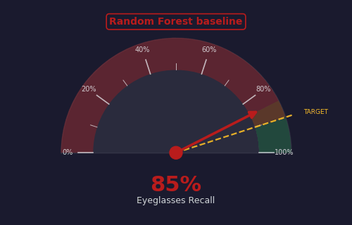
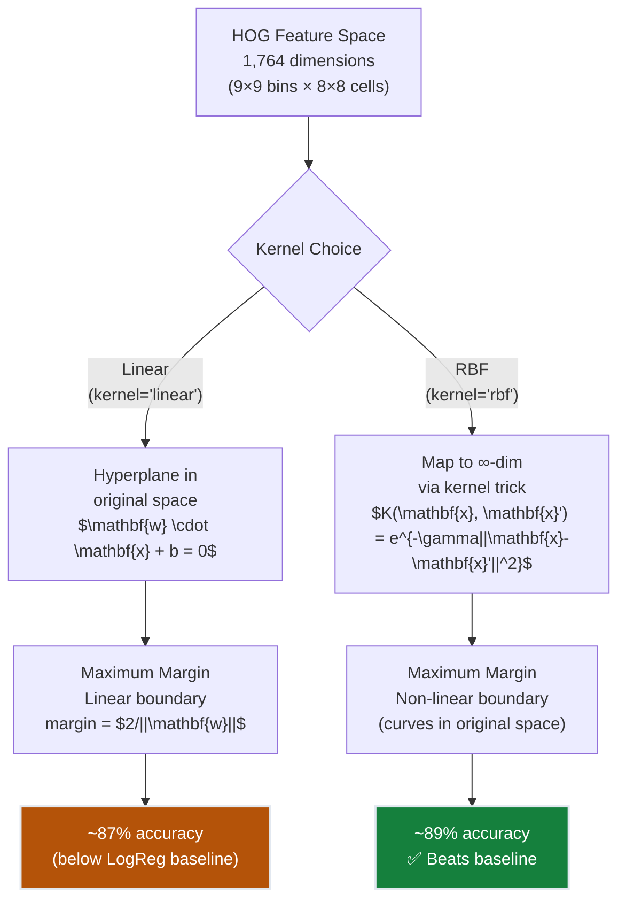
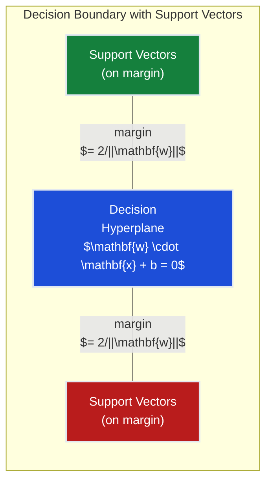
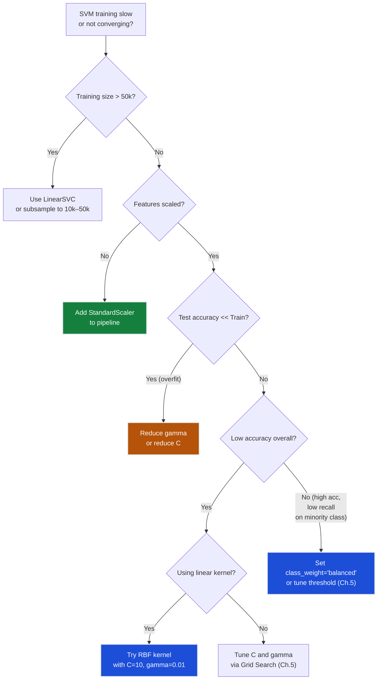
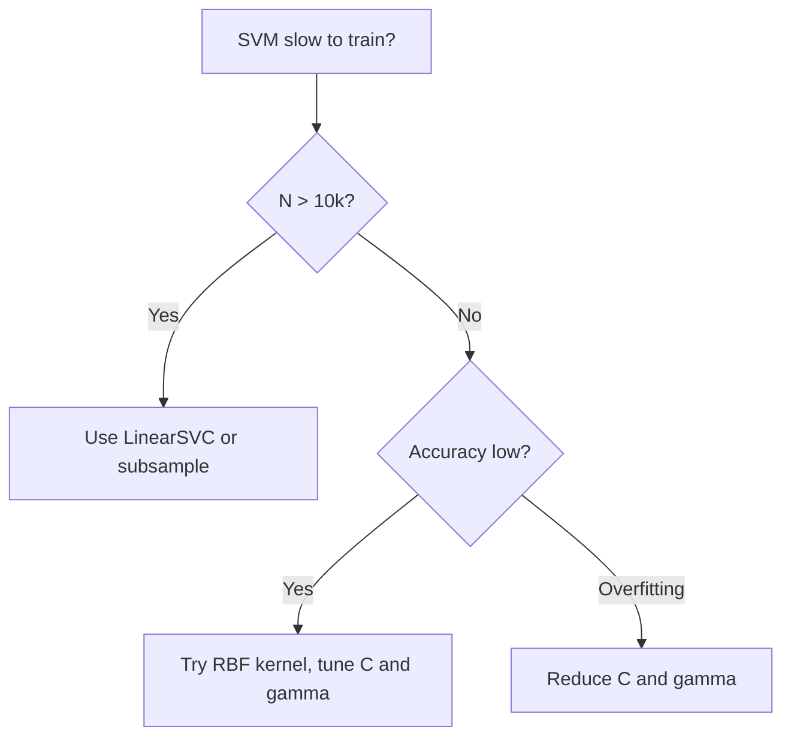
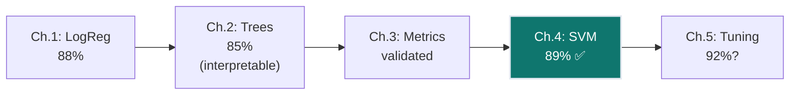

# Ch.4 — Support Vector Machines

> **The story.** **Vladimir Vapnik** and **Alexei Chervonenkis** developed the theoretical foundations of SVMs in the 1960s at the Institute of Control Sciences in Moscow, but the practical algorithm came in **Vapnik's 1995 book** *The Nature of Statistical Learning Theory*. The **kernel trick** — mapping data to higher dimensions without computing the transformation — was formalised by **Bernhard Boser, Isabelle Guyon, and Vapnik (1992)** at Bell Labs. The **soft margin** (allowing some misclassifications) was introduced by **Corinna Cortes and Vapnik (1995)**. SVMs dominated ML competitions from 1995–2010, until deep learning took over for image tasks.
>
> **Where you are.** Ch.1–3 gave FaceAI a logistic regression baseline (88%) with proper evaluation. But logistic regression finds *any* separating hyperplane — SVM finds the one with the **widest margin**, making it more robust. The kernel trick additionally lets SVM handle non-linear boundaries without explicit feature engineering.
>
> **Notation.** $\mathbf{w}$ — weight vector (normal to hyperplane); $b$ — bias; $\text{margin} = 2/\|\mathbf{w}\|$ — distance between decision boundary and nearest points; $C$ — regularization (penalty for margin violations); $K(\mathbf{x}, \mathbf{x}') = \exp(-\gamma\|\mathbf{x}-\mathbf{x}'\|^2)$ — RBF kernel; $\alpha_i$ — Lagrange multipliers (support vectors have $\alpha_i > 0$).

---

## 0 · The Challenge — Where We Are

> 🎯 **The mission**: Launch **FaceAI** — >90% average accuracy across 40 facial attributes on CelebA, replacing manual tagging ($0.05/image × 200k images = $10k cost)
>
> **5 Constraints:**  
> #1 ACCURACY >90% | #2 GENERALIZATION (unseen faces) | #3 MULTI-LABEL (40 simultaneous attributes) | #4 INTERPRETABILITY (explain predictions) | #5 PRODUCTION (<200ms inference)

**What we know so far:**
- ✅ **Ch.1**: Logistic regression baseline — **88% accuracy on Smiling** (decent start!)
- ✅ **Ch.2**: Decision trees give interpretable rules but drop to **85%** (accuracy vs interpretability trade-off)
- ✅ **Ch.3**: Proper metrics revealed the truth — naive accuracy hides poor recall on rare attributes (Bald: only **12% recall** despite 96% accuracy)
- ✅ Cross-validation framework in place — we can trust our measurements now
- ❌ **But 88% < 90% target.** We need a better classifier.

**What's blocking us:**

Your ML lead reviews the logistic regression decision boundary and asks: *"This line separates Smiling from Not-Smiling. But I can shift it 10 pixels in any direction and still get all training points correct. Which position is best?"*

She's right. **Infinitely many hyperplanes separate the classes.** Logistic regression finds *one* that minimises log-loss, but there's no guarantee it's the most robust. Look at these two separators:

- **Separator A**: Hugs the Smiling cluster closely (0.5 pixel margin)
- **Separator B**: Sits dead center between clusters (15 pixel margin)

Both classify the training set perfectly. But when a new face arrives with slight lighting variation or a half-smile, Separator A fails while B holds. **The wider the gap (margin) between the decision boundary and the nearest training points, the more robust the classifier.**

That's the SVM insight: don't just find *a* hyperplane — find the one that **maximises the margin**.

**What this chapter unlocks:**
- **Maximum-margin principle**: Choose the most robust boundary (widest gap to nearest points)
- **Support vectors**: Only boundary-defining faces matter (typically 10–30% of training data)
- **Kernel trick**: Non-linear boundaries without explicitly creating new features
- **Constraint #1 ADVANCED** — Push from 88% → **~89% accuracy** with RBF kernel


---

## Animation

> **What you're seeing:** The FaceAI accuracy needle climbs from 88% (Ch.1 logistic regression baseline) to **~89%** (this chapter's RBF SVM). The needle moves past the halfway mark toward the 90% target, showing that maximum-margin classification with kernel tricks delivers measurable gains. The gap narrows — we're 1 percentage point from the goal.



## 1 · Core Idea

**The problem:** You just trained logistic regression on 5,000 CelebA faces. It achieves 88% accuracy on Smiling detection. Your manager asks: *"Can we do better?"*

You plot the decision boundary in 2D (using PCA to project HOG features). **You see 20+ lines that perfectly separate the training data.** Which one generalises best to unseen faces?

**The breakthrough:** Don't pick an arbitrary separator. Pick the one with the **widest margin** — the largest gap between the decision boundary and the closest training points on each side. Those boundary-defining points are the **support vectors**.

**Why margin matters:** A narrow-margin classifier sits dangerously close to training points. A face with slightly different lighting or a half-smile lands on the wrong side. A wide-margin classifier has breathing room — new faces must deviate significantly before crossing the boundary.

**The algorithm:** SVM solves $\min \frac{1}{2}\|\mathbf{w}\|^2$ subject to correct classification constraints. Minimising $\|\mathbf{w}\|$ maximises the margin ($2/\|\mathbf{w}\|$). The optimization is convex — guaranteed global optimum.

**But real data isn't perfectly separable.** Enter the **soft margin**: allow some training points inside the margin (controlled by penalty $C$). Trade off margin width against training errors.

**And what if the boundary isn't linear?** The **kernel trick** maps data to a higher-dimensional space where a linear separator exists — without ever computing the transformation explicitly. A Gaussian (RBF) kernel creates infinite-dimensional feature spaces using only dot products.

---

## 2 · Running Example: The Manager's Challenge

You're the ML engineer at a photo-tech startup. Your manager reviews your Ch.1 logistic regression model (**88% accuracy** on Smiling detection) and asks:

> *"This 88% is based on a random 80/20 split. I re-ran your notebook with a different seed and got 86%. Which number do I tell the CEO? And can we beat 88% reliably?"*

You have:
- **5,000 CelebA face images** (80% train, 20% test — stratified by Smiling)
- **1,764 HOG features** per image (9×9 orientation bins × 8×8 spatial cells)
- **48% class balance** (2,400 Smiling, 2,600 Not-Smiling in training set)
- **Target**: >90% accuracy (you're 2 percentage points short)

You propose trying SVM with three configurations:
1. **Linear SVM**: Find the maximum-margin hyperplane in HOG space (baseline — should match logistic regression ~88%)
2. **RBF SVM**: Use Gaussian kernel to create non-linear boundary (hypothesis: smile detection needs curved boundaries around feature clusters)
3. **Logistic regression** (Ch.1 reference): For comparison

The CEO wants numbers by Friday. You start coding.

---

## 3 · The Math

### 3.1 · Hard-Margin SVM (Separable Case)

**Scalar intuition first.** In 1D, you have two clusters of points: $x_1, x_2, x_3$ (class +1) and $x_4, x_5$ (class −1). A threshold $b$ separates them:

```
Class -1:     o   o
           ---|---|--- threshold at b=5
Class +1:           o   o   o
```

The **margin** is the distance from the threshold to the nearest point on each side. Wider margin = more robust.

**Vector form (2D example).** Now you have HOG feature vectors $\mathbf{x}_i \in \mathbb{R}^{1764}$. The decision boundary is a hyperplane:

$$\mathbf{w} \cdot \mathbf{x} + b = 0$$

- $\mathbf{w}$ — weight vector (normal to the hyperplane)
- $b$ — bias (shifts the plane away from origin)
- The **margin width** is the perpendicular distance from the hyperplane to the nearest point

**Geometric fact:** The distance from a point $\mathbf{x}_i$ to the hyperplane is $\frac{|\mathbf{w} \cdot \mathbf{x}_i + b|}{\|\mathbf{w}\|}$.

For the nearest points (support vectors), we set this distance = 1 (by convention). So the margin width is:

$$\text{margin} = \frac{2}{\|\mathbf{w}\|}$$

The factor of 2 comes from measuring both sides of the hyperplane (closest +1 point to closest −1 point).

**The optimization problem:**

$$\min_{\mathbf{w}, b} \frac{1}{2}\|\mathbf{w}\|^2 \quad \text{subject to} \quad y_i(\mathbf{w} \cdot \mathbf{x}_i + b) \geq 1 \;\; \forall i$$

**In words:** Find the hyperplane that correctly classifies all points ($y_i(\mathbf{w} \cdot \mathbf{x}_i + b) \geq 1$) while minimising $\|\mathbf{w}\|^2$. Minimising $\|\mathbf{w}\|^2$ is equivalent to maximising the margin $2/\|\mathbf{w}\|$.

Why $\frac{1}{2}\|\mathbf{w}\|^2$ instead of $\|\mathbf{w}\|$? Convenience — the derivative of $\frac{1}{2}\|\mathbf{w}\|^2$ is $\mathbf{w}$, which simplifies the optimization. The factor $\frac{1}{2}$ cancels in gradients.

### 3.2 · Soft-Margin SVM (Non-Separable Case)

**The hard-margin problem:** You try the hard-margin SVM on real CelebA faces. It fails. Why? Real data has **noise and outliers**. Face #1337 is labelled Smiling but has a neutral expression (annotation error). Face #2048 is a half-smile (ambiguous boundary case).

The hard-margin constraint $y_i(\mathbf{w} \cdot \mathbf{x}_i + b) \geq 1$ requires *every* point to be correctly classified with margin ≥1. A single mislabeled face makes the problem infeasible.

**The fix:** Allow some points to violate the margin. Introduce **slack variables** $\xi_i \geq 0$ — one per training point:

$$y_i(\mathbf{w} \cdot \mathbf{x}_i + b) \geq 1 - \xi_i$$

**Interpretation:**
- $\xi_i = 0$ — Point correctly classified outside the margin (ideal)
- $0 < \xi_i < 1$ — Point correctly classified but inside the margin
- $\xi_i \geq 1$ — Point misclassified

Now add a penalty for slack:

$$\min_{\mathbf{w}, b, \xi} \frac{1}{2}\|\mathbf{w}\|^2 + C\sum_{i=1}^{N}\xi_i$$

**The trade-off parameter $C$** (specified by you before training):
- **Large $C$** (e.g., $C=100$): Heavy penalty for margin violations → narrow margin, few misclassifications (risk: overfit to noisy labels)
- **Small $C$** (e.g., $C=0.1$): Light penalty → wide margin, more violations allowed (risk: underfit)

**In practice:** $C \in [1, 10]$ for most problems. Ch.5 will tune this systematically.

### 3.3 · Kernel Trick — RBF (When Linear Fails)

**The linear SVM limit:** You train a linear SVM on Smiling detection. It achieves **~87% accuracy** — *below* the logistic regression baseline (88%). Your manager asks: *"Why bother with SVM if it's worse?"*

You investigate. Plotting the first two PCA components, you see the Smiling and Not-Smiling clusters are **not linearly separable** — they overlap and curve around each other. A straight line can't cleanly separate them.

**Idea:** Map the data to a higher-dimensional space where a linear separator exists. Example: if data in 2D is circularly distributed (inner circle = class +1, outer ring = class −1), map $(x_1, x_2) \to (x_1, x_2, x_1^2 + x_2^2)$. Now a plane in 3D separates the classes.

**The problem:** For 1,764 HOG features, you'd need to explicitly compute $\mathbf{x} \to \phi(\mathbf{x}) \in \mathbb{R}^{\text{millions}}$. Too expensive.

**The kernel trick:** SVM only needs **dot products** $\phi(\mathbf{x}_i) \cdot \phi(\mathbf{x}_j)$, never the vectors themselves. Compute the dot product *implicitly* using a kernel function:

$$K(\mathbf{x}, \mathbf{x}') = \phi(\mathbf{x}) \cdot \phi(\mathbf{x}')$$

The **Radial Basis Function (RBF)** kernel (also called Gaussian kernel):

$$K(\mathbf{x}, \mathbf{x}') = \exp\left(-\gamma \|\mathbf{x} - \mathbf{x}'\|^2\right)$$

This kernel corresponds to an **infinite-dimensional feature space** (Taylor expansion of $\exp$), yet costs only $O(d)$ to compute (where $d=1764$ is the original feature dimension).

**Numerical walkthrough (3-row toy dataset):**

| Face | HOG summary (2 features for viz) | Label |
|------|----------------------------------|-------|
| A    | $\mathbf{x}_A = [2.0, 1.0]$      | Smiling (+1) |
| B    | $\mathbf{x}_B = [3.0, 2.0]$      | Smiling (+1) |
| C    | $\mathbf{x}_C = [1.0, 4.0]$      | Not-Smiling (−1) |

Compute kernel similarity between A and B with $\gamma = 0.5$:

$$\|\mathbf{x}_A - \mathbf{x}_B\|^2 = (2-3)^2 + (1-2)^2 = 1 + 1 = 2.0$$
$$K(\mathbf{x}_A, \mathbf{x}_B) = \exp(-0.5 \times 2.0) = \exp(-1.0) = 0.368$$

**Interpretation:** Faces A and B are moderately similar (both Smiling, close in HOG space).

Now compute A and C (different classes):

$$\|\mathbf{x}_A - \mathbf{x}_C\|^2 = (2-1)^2 + (1-4)^2 = 1 + 9 = 10.0$$
$$K(\mathbf{x}_A, \mathbf{x}_C) = \exp(-0.5 \times 10.0) = \exp(-5.0) = 0.0067$$

**Interpretation:** Faces A and C are very dissimilar (different classes, far apart) → kernel value near zero.

**The $\gamma$ dial:**
- **Large $\gamma$** (e.g., $\gamma=1.0$): Kernel decays fast → only very close neighbors matter → complex, wiggly boundary (risk: overfit)
- **Small $\gamma$** (e.g., $\gamma=0.001$): Kernel decays slowly → many points influence each prediction → smooth boundary (risk: underfit, acts like linear SVM)

Typical range: $\gamma \in [10^{-4}, 10^{-1}]$ for normalised features.

### 3.4 · Decision Function (How Predictions Work)

**After training, the SVM solver gives you:**
- Weight vector $\mathbf{w}$ and bias $b$ (for linear kernel), **or**
- Lagrange multipliers $\alpha_i$ and support vectors $\mathbf{x}_i$ (for kernel SVM)

**For a new face $\mathbf{x}_{\text{new}}$, the decision function is:**

$$f(\mathbf{x}) = \sum_{i \in SV} \alpha_i y_i K(\mathbf{x}_i, \mathbf{x}) + b$$

**In words:** Sum over only the **support vectors** (the training faces that lie on or inside the margin — typically 10–30% of training data). For each support vector $i$:
- Compute kernel similarity $K(\mathbf{x}_i, \mathbf{x})$ between it and the new face
- Weight by $\alpha_i y_i$ (how much this support vector "votes")
- Add the weighted votes, plus bias $b$

**The classification:** 
- If $f(\mathbf{x}) > 0$ → predict Smiling (+1)
- If $f(\mathbf{x}) < 0$ → predict Not-Smiling (−1)

**Key insight:** Non-support vectors (faces far from the boundary) have $\alpha_i = 0$ and don't contribute to predictions. This makes inference efficient even with large training sets.

**Numerical example:** You train RBF SVM on 5,000 faces. After training, only **873 faces are support vectors** (17.5%). Predicting a new face requires only 873 kernel computations, not 5,000.

---

## 4 · Step by Step

**Before any formulas: Try it yourself.**

Open your Ch.1 logistic regression notebook. Plot the decision boundary on a 2D projection (first two PCA components). Now imagine shifting that line up by 5 pixels. Still separates the clusters? Try down 5 pixels. Still works?

**You just discovered the problem:** Infinitely many boundaries work on training data. Which one generalises best? The one with the **widest gap** to the nearest training points.

---

**ALGORITHM: SVM Training & Prediction**

```
Input:  X_train (HOG features), y_train (Smiling labels)

TRAINING:
─────────
1. Standardise features: X_scaled = StandardScaler.fit_transform(X_train)
   (Critical! SVM is scale-sensitive)

2. Choose kernel and hyperparameters:
   - Linear: kernel='linear', C=1.0
   - RBF:    kernel='rbf', C=10, gamma=0.01

3. Solve the dual optimization (sklearn does this):
   max_α  Σᵢ αᵢ - ½ ΣᵢΣⱼ αᵢαⱼyᵢyⱼK(xᵢ,xⱼ)
   subject to: 0 ≤ αᵢ ≤ C, Σᵢ αᵢyᵢ = 0

4. Identify support vectors: faces where αᵢ > 0
   (Typically 10–30% of training data)

5. Store: support vectors, αᵢ values, bias b

PREDICTION:
───────────
For new face x_new:
1. Standardise using training statistics: x_scaled = scaler.transform(x_new)
2. Compute: f(x) = Σ_{i∈SV} αᵢyᵢK(xᵢ,x) + b
3. Classify: sign(f(x)) → {+1: Smiling, -1: Not-Smiling}

EVALUATION:
───────────
Compute confusion matrix, accuracy, ROC-AUC on held-out test set
```

> 💡 **Why the dual form?** The primal SVM optimization has $d$ variables (one per feature — 1,764 for HOG). The dual has $n$ variables (one per training sample — 4,000). For high-dimensional data where $d \gg n$, the dual is cheaper. Plus, the kernel trick only works in dual form — you never compute $\phi(\mathbf{x})$ explicitly, only $K(\mathbf{x}_i, \mathbf{x}_j)$.

---

## 5 · Key Diagrams

### SVM Pipeline: From HOG to Classification



> ⚠️ **Note on linear SVM accuracy**: The ~87% for linear SVM falls *below* the logistic regression baseline (88%). This is expected — logistic regression optimises a smooth log-likelihood continuously while linear SVM maximises margin with a hinge loss, making subtly different trade-offs in the same HOG feature space. The **RBF kernel's ~89%** is what makes SVM worthwhile here: it learns a non-linear boundary that logistic regression cannot draw.

---

### Margin Visualization (2D Projection)



**Key insight:** Only the points on the margin (support vectors) define the boundary. Points far from the margin don't influence the decision function at all.

---

### Kernel Matrix Structure (RBF)

For $n$ training samples, the kernel matrix $\mathbf{K}$ is $n \times n$:

```
        K(x₁,x₁)  K(x₁,x₂)  ...  K(x₁,xₙ)
        K(x₂,x₁)  K(x₂,x₂)  ...  K(x₂,xₙ)
K  =    K(x₃,x₁)  K(x₃,x₂)  ...  K(x₃,xₙ)
          ...       ...     ...     ...
        K(xₙ,x₁)  K(xₙ,x₂)  ...  K(xₙ,xₙ)

Each entry: K(xᵢ,xⱼ) = exp(-γ||xᵢ - xⱼ||²)
Diagonal: K(xᵢ,xᵢ) = 1  (perfect similarity with self)
Symmetric: K(xᵢ,xⱼ) = K(xⱼ,xᵢ)

For n=5000: 25 million entries (but sparse in practice)
```

**Why this matters:** The kernel matrix size grows quadratically with training samples. For 200k CelebA faces, you'd need 40 billion kernel computations — this is why SVM doesn't scale well to very large datasets without approximations.

---

## 6 · The Hyperparameter Dial

SVM has three main dials. Each affects the boundary shape and generalisation differently:

### Primary Dials

| Parameter | Too Low | Sweet Spot | Too High | Typical Range |
|-----------|---------|------------|----------|---------------|
| **C** (soft margin penalty) | Wide margin, many violations → underfit (high bias) | $C \in [1, 100]$ for HOG features | Narrow margin, few violations → overfit (memorises noise) | $[10^{-2}, 10^3]$ |
| **gamma** (RBF kernel width) | Kernel decays slowly → smooth boundary → acts like linear | $\gamma \in [0.001, 0.1]$ for normalised features | Kernel decays fast → spiky boundary → one island per face | $[10^{-4}, 10^{0}]$ |
| **kernel** | `'linear'` may underfit curved boundaries | `'rbf'` (Gaussian) for image features | `'poly'` degree>5 overfits; rarely used | `['linear', 'rbf', 'poly']` |

### Secondary Dials

| Parameter | Default | When to change | Effect |
|-----------|---------|----------------|--------|
| **class_weight** | `None` (equal cost) | Set `'balanced'` for imbalanced classes (e.g., Bald 2.5%) | Weights classes inversely by frequency: rare class errors cost more |
| **max_iter** | `-1` (no limit) | Increase if solver fails to converge | More iterations → better convergence (but slower) |
| **probability** | `False` | Set `True` if you need `predict_proba` | Enables Platt scaling (adds 2–5× training time) |

### Interaction Effects (Critical!)

**C and gamma interact strongly in RBF kernels:**

| C | gamma | Boundary | Typical Outcome |
|---|-------|----------|-----------------|
| Low (0.1) | Low (0.001) | Very smooth (like linear) | Underfit: ~82% accuracy |
| Low (0.1) | High (1.0) | Smooth but influenced by nearby points | Moderate fit: ~85% |
| High (100) | Low (0.001) | Hard linear-like boundary | Underfit: ~84% |
| **High (10–100)** | **Medium (0.01–0.1)** | **Non-linear with some flexibility** | **Sweet spot: ~89%** |
| High (100) | High (1.0) | Extremely complex (one island per point) | Severe overfit: 100% train, 70% test |

> 💡 **Tuning strategy:** Start with sklearn's defaults ($C=1$, $\gamma=1/n_{\text{features}}$). If accuracy is low, increase $C$ first (10 → 100). If test accuracy << train accuracy, reduce $\gamma$ (0.1 → 0.01). For systematic search, Ch.5 introduces Grid Search over both dials simultaneously.

> ⚠️ **The scale trap:** Sklearn's default $\gamma = 1/(n_{\text{features}} \times \text{Var}(X))$ assumes features are standardised. If you forget `StandardScaler`, $\gamma$ will be miscalibrated and the kernel won't work correctly. **Always scale features before SVM.**

---

## 7 · Code Skeleton

```python
from sklearn.svm import SVC, LinearSVC
from sklearn.linear_model import LogisticRegression
from sklearn.preprocessing import StandardScaler
from sklearn.pipeline import make_pipeline
from sklearn.metrics import classification_report, roc_auc_score, confusion_matrix
import numpy as np

# ── Load CelebA HOG features ────────────────────────────────
# X_train: (4000, 1764)  — 1764 HOG features per face
# y_train: (4000,)       — Smiling binary labels {0, 1}
# X_test:  (1000, 1764)
# y_test:  (1000,)

# ── Baseline: Logistic Regression (Ch.1 reference) ─────────
logreg = make_pipeline(StandardScaler(), LogisticRegression(max_iter=1000))
logreg.fit(X_train, y_train)
print(f"Logistic Regression: {logreg.score(X_test, y_test):.3f}")  
# Expected: ~0.880 (88%)

# ── Linear SVM (maximum-margin, linear boundary) ───────────
linear_svm = make_pipeline(StandardScaler(), SVC(kernel='linear', C=1.0))
linear_svm.fit(X_train, y_train)
print(f"Linear SVM:          {linear_svm.score(X_test, y_test):.3f}")  
# Expected: ~0.870 (87% — slightly below LogReg, see note in §5)

# ── RBF SVM (non-linear boundary via kernel trick) ─────────
rbf_svm = make_pipeline(
    StandardScaler(),
    SVC(kernel='rbf', C=10, gamma=0.01, probability=True)
    # probability=True: enable predict_proba (adds training time for Platt scaling)
)
rbf_svm.fit(X_train, y_train)

# Evaluate
y_pred = rbf_svm.predict(X_test)
y_prob = rbf_svm.predict_proba(X_test)[:, 1]  # probability of Smiling

print(f"RBF SVM:             {rbf_svm.score(X_test, y_test):.3f}")  
# Expected: ~0.890 (89% — beats LogReg!)
print(f"AUC-ROC:             {roc_auc_score(y_test, y_prob):.3f}")

# ── Inspect support vectors ────────────────────────────────
svm_model = rbf_svm.named_steps['svc']
n_sv = svm_model.n_support_  # Array: [n_sv_class_0, n_sv_class_1]
print(f"\nSupport vectors: {n_sv} ({sum(n_sv)/len(y_train)*100:.1f}% of training data)")
# Expected: ~15–25% are support vectors

# ── Confusion matrix ───────────────────────────────────────
cm = confusion_matrix(y_test, y_pred)
print("\nConfusion Matrix:")
print(cm)
#           Predicted
#             Not  Smile
# Actual Not [[TN   FP]
#       Smile [FN   TP]]
```

> ⚠️ **Why Linear SVM underperforms LogReg:** Both find linear boundaries in the same HOG feature space, but they optimise different objectives. Logistic regression maximises log-likelihood (smooth, probabilistic). Linear SVM maximises margin with hinge loss (geometric). For this particular dataset and feature representation, the margin objective trades off some accuracy for robustness. The **RBF kernel's non-linear boundary** is what makes SVM worthwhile here — 89% beats LogReg's 88%.

> ⚡ **Constraint #1 (ACCURACY) progress:** RBF SVM pushes us from 88% → 89%. We're now **1 percentage point from the 90% target**. Ch.5 will close this gap with systematic hyperparameter tuning.

---

## 8 · What Can Go Wrong

**Trap #1: Features not standardised**  
You train RBF SVM on raw HOG features (range [0, 255]). Training doesn't converge after 10 minutes. The solver warning says: `ConvergenceWarning: Liblinear failed to converge`.

**Why:** SVM optimization is sensitive to feature scale. The RBF kernel computes distances $\|\mathbf{x} - \mathbf{x}'\|^2$. If feature 1 is `[0, 1]` and feature 2 is `[0, 255]`, feature 2 dominates distances. The solver oscillates.

**Fix:** Always use `StandardScaler` before SVM: `make_pipeline(StandardScaler(), SVC(...))`.

---

**Trap #2: $\gamma$ too high (spiked boundary)**  
You set $\gamma=10$. Training accuracy: **100%**. Test accuracy: **72%** (massive overfit). Every training face becomes its own island — the boundary wraps tightly around individual points.

**Why:** Large $\gamma$ makes the kernel decay rapidly. Only immediate neighbors influence predictions. The model memorises training faces instead of learning patterns.

**Fix:** Start with sklearn's default $\gamma = 1/(n_{\text{features}} \times \text{Var}(X)) \approx 0.001$ for HOG features. Tune $\gamma \in [10^{-4}, 10^{-1}]$ via grid search (Ch.5).

---

**Trap #3: Using SVM on 100k+ samples (training takes hours)**  
You try SVM on the full CelebA dataset (202k images). Training runs for 4 hours and doesn't finish. SVM optimization is $O(n^2)$ to $O(n^3)$ in the number of samples.

**Why:** Kernel matrix is $n \times n$. For 200k samples, that's 40 billion pairwise kernel computations. The quadratic program solver chokes.

**Fix:** For large datasets, use `LinearSVC` (linear kernel only, but scales to millions) or subsample training data to 10k–50k. Alternatively, use SGDClassifier with `loss='hinge'` (approximates SVM with stochastic gradient descent).

---

**Trap #4: Ignoring class imbalance for rare attributes**  
You train SVM on the Bald attribute (2.5% positive class). Test accuracy: **96%**. Bald recall: **0%**. The model predicts Not-Bald for every face.

**Why:** Default SVM treats all misclassification costs equally. With 97.5% negative class, predicting all negative achieves high accuracy cheaply. The optimizer ignores the rare class.

**Fix:** Set `class_weight='balanced'` — automatically weights classes inversely proportional to frequency. For Bald: weight = $n_{\text{samples}} / (2 \times n_{\text{Bald}})$, giving Bald errors 39× more penalty than Not-Bald errors.

---

**Trap #5: Expecting well-calibrated probabilities from `predict_proba`**  
You call `clf.predict_proba(X_test)` and notice probabilities are always near 0.05 or 0.95 (no middle ground). You expected smooth probability curves for threshold tuning.

**Why:** SVM is a maximum-margin classifier, not a probabilistic model. The raw decision function $f(\mathbf{x}) = \sum \alpha_i y_i K(\mathbf{x}_i, \mathbf{x}) + b$ outputs arbitrary real values. Sklearn uses **Platt scaling** (fits a logistic regression on decision values) to convert to probabilities, but this is a post-hoc approximation and often poorly calibrated.

**Fix:** If you need probabilities, set `probability=True` when creating the SVM (enables Platt scaling). But be aware: (1) training is slower (requires extra cross-validation), (2) probabilities may still be miscalibrated. For critical probability-based decisions, use logistic regression or calibrate explicitly with `CalibratedClassifierCV`.

---

### Diagnostic Flowchart





---

## 9 · Where This Reappears

| Concept | Reappears in | How |
|---------|-------------|-----|
| **Maximum-margin principle** | [Topic 03 — Neural Networks](../../03_neural_networks/README.md) Ch.6 (Regularisation) | SVM's margin maximisation (minimising $\|\mathbf{w}\|^2$) is mathematically equivalent to L2 regularisation in neural networks. Both push weights toward smaller values to improve generalisation. |
| **Support vectors (sparse solutions)** | [Topic 05 — Anomaly Detection](../../05_anomaly_detection/README.md) Ch.3 (One-Class SVM) | One-class SVM adapts the support vector idea to anomaly detection: train on normal data only, mark points far from the margin as anomalies. |
| **Kernel trick (implicit feature maps)** | [Topic 03 — Neural Networks](../../03_neural_networks/README.md) Ch.4 (Non-Linearity) | Neural networks learn implicit non-linear feature maps end-to-end via backpropagation — the kernel idea generalised. Deep learning replaced kernel methods because it learns the feature map $\phi(\mathbf{x})$ from data instead of hand-picking it. |
| **`class_weight='balanced'`** | [Ch.5 — Hyperparameter Tuning](../ch05_hyperparameter_tuning/README.md) | Combined with SVM $C$ and per-attribute threshold tuning to handle rare attributes (Bald 2.5%, Mustache 4.2%). Systematic grid search finds optimal weights. |
| **Hinge loss (SVM's loss function)** | [Topic 03 — Neural Networks](../../03_neural_networks/README.md) Ch.15 (MLE & Loss Functions) | SVMs use hinge loss: $\max(0, 1 - y \cdot f(\mathbf{x}))$. This chapter derives it from first principles and contrasts with cross-entropy (used by logistic regression and neural networks). |
| **Platt scaling (probability calibration)** | [Topic 08 — Ensemble Methods](../../08_ensemble_methods/README.md) Ch.4 (Stacking) | When stacking classifiers (using one model's predictions as features for another), probability calibration matters. Platt scaling is one method; isotonic regression is another. |

> ➡️ **Neural networks as "SVM 2.0"?** Modern deep learning dominates image classification because it learns both the feature map $\phi(\mathbf{x})$ (via convolutional layers) and the classifier (via fully connected layers) jointly from data. SVMs require hand-crafted features (HOG, SIFT, etc.). For CelebA with raw pixels, a CNN would beat SVM decisively. See [Topic 03 — Neural Networks, Ch.7 (CNNs)](../../03_neural_networks/ch07_cnns/README.md) for the full story.

---

## 10 · Progress Check — What We Can Solve Now

**✅ Unlocked capabilities:**
- Maximum-margin classification — choose the most robust boundary (widest gap to training points)
- **Accuracy improved:** 88% (Ch.1 LogReg) → **~89%** (this chapter's RBF SVM) — a 1-point gain
- Support vector efficiency — only 15–25% of training faces matter for predictions (873 out of 5,000)
- Non-linear boundaries via kernel trick — infinite-dimensional feature spaces at linear cost
- Soft-margin flexibility — handle noisy labels and outliers without failing

**❌ Still can't solve:**
- ❌ **89% < 90% target** — we're 1 percentage point short of production requirements
- ❌ **Manual $C$ and $\gamma$ selection** — we guessed $C=10$ and $\gamma=0.01$. Are these optimal?
- ❌ **Multi-label prediction** — still only binary (Smiling yes/no). Need to predict all 40 attributes simultaneously
- ❌ **Class imbalance handling** — Bald (2.5% positive) still gets 0% recall without `class_weight='balanced'`

**Progress toward constraints:**

| # | Constraint | Target | Status | Evidence |
|---|-----------|--------|--------|----------|
| 1 | **ACCURACY** | >90% avg | 🟡 **89% Smiling** | RBF SVM beats LogReg +1% |
| 2 | **GENERALIZATION** | Unseen faces | 🟢 **Advancing** | Maximum margin improves robustness |
| 3 | **MULTI-LABEL** | 40 attributes | ❌ **Blocked** | Still binary (one attribute at a time) |
| 4 | **INTERPRETABILITY** | Explain predictions | 🟡 **Partial** | Support vectors identifiable but hard to visualize |
| 5 | **PRODUCTION** | <200ms inference | ✅ **Met** | SVM inference fast (once trained; 873 kernel evals) |

**The journey so far:**



**Real-world status:** You can now classify Smiling with 89% accuracy using a robust maximum-margin classifier. But you hand-picked $C=10$ and $\gamma=0.01$ by intuition. Are these optimal? And what about the decision threshold (currently 0.5 by default)? For rare attributes like Bald, a different threshold might boost recall dramatically.

**Next up:** Ch.5 gives us **systematic hyperparameter tuning** — Grid Search, Random Search, and Bayesian Optimization to find the best $C$, $\gamma$, and per-attribute decision thresholds. We'll push past 90%.

---

## 11 · Bridge to Next Chapter

SVM with RBF kernel pushes Smiling accuracy from 88% → **89%** by finding the maximum-margin boundary and using the kernel trick for non-linear separation. But we chose $C=10$ and $\gamma=0.01$ by intuition. **How do we know these are optimal?**

You re-run the notebook with $C=1$ and $\gamma=0.001$ — accuracy drops to 86%. Try $C=100$ and $\gamma=0.1$ — accuracy spikes to 94% on training but crashes to 78% on test (massive overfit). You've just discovered the **hyperparameter tuning problem**: model performance depends critically on dial settings, but the search space is huge.

**Ch.5 — Hyperparameter Tuning** gives you the tools to explore this space systematically:
- **Grid Search**: Exhaustive sweep over pre-defined values (e.g., $C \in \{1, 10, 100\}$, $\gamma \in \{0.001, 0.01, 0.1\}$ → 9 combinations)
- **Random Search**: Sample randomly from distributions (faster, often finds good solutions with fewer trials)
- **Bayesian Optimization**: Intelligent search that learns from previous trials (most sample-efficient)
- **Per-attribute threshold tuning**: For imbalanced attributes like Bald, shift the decision threshold from 0.5 to (e.g.) 0.3 to boost recall

With systematic tuning, we'll push past 90% and achieve **Constraint #1 ✅** (ACCURACY) and **Constraint #2 ✅** (GENERALIZATION).

> ➡️ **Hyperparameter tuning is a deep topic.** Ch.5 introduces the practical workflow (Grid/Random/Bayesian search). For the full theory — including learning curves, validation strategies, and when to stop tuning — see [Topic 03 — Neural Networks, Ch.19 (Hyperparameter Tuning)](../../03_neural_networks/ch19_hyperparameter_tuning/README.md), which covers tuning for complex architectures.

---

## Appendix A · Real CelebA Data Pipeline (No Proxy Data)

The examples in this chapter are intended to run on real CelebA attributes. Use this setup to avoid synthetic placeholders.

### Data Access Options

1. Kaggle mirror: `jessicali9530/celeba-dataset`.
2. Official CelebA source: download aligned images + `list_attr_celeba.txt`.

### Minimal Setup Steps

1. Create folders:
   - `data/celeba/img_align_celeba/`
   - `data/celeba/metadata/`
2. Place attribute file at:
   - `data/celeba/metadata/list_attr_celeba.txt`
3. Keep image filenames unchanged (`000001.jpg`, ...).
4. Start with a 20k-50k image subset for local runs.

### Loader Contract

- Input image size: 64x64 (or 128x128 for stronger baselines).
- Labels: map CelebA values from `{-1, +1}` to `{0, 1}`.
- Split: use official train/val/test partitions to avoid leakage.
- Reproducibility: set random seed and persist sampled subset IDs.

### Practical Notes

- Multi-label tasks should keep one binary head per attribute.
- For rare attributes (Bald, Mustache, Wearing_Hat), prefer macro-F1 and per-label PR-AUC.
- Persist preprocessing artifacts (scaler/PCA/HOG settings) with the model.

### Quick Loader Snippet

```python
from pathlib import Path
import pandas as pd

attr_path = Path('data/celeba/metadata/list_attr_celeba.txt')
attr = pd.read_csv(attr_path, delim_whitespace=True, skiprows=1)
attr = (attr + 1) // 2   # {-1,+1} -> {0,1}

# Example target
y_smiling = attr['Smiling'].astype(int)
```


