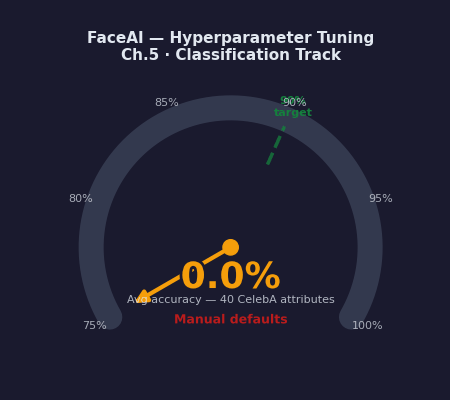
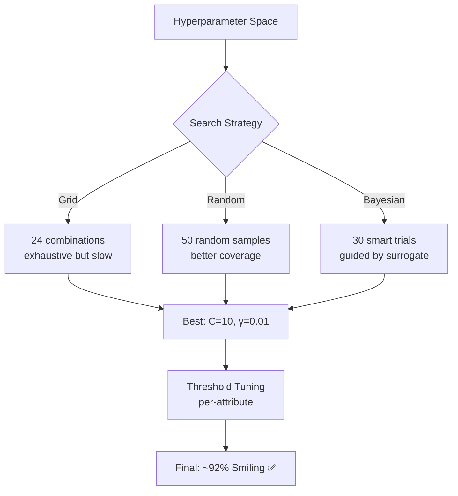
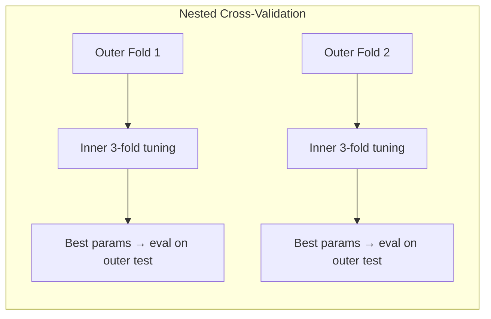
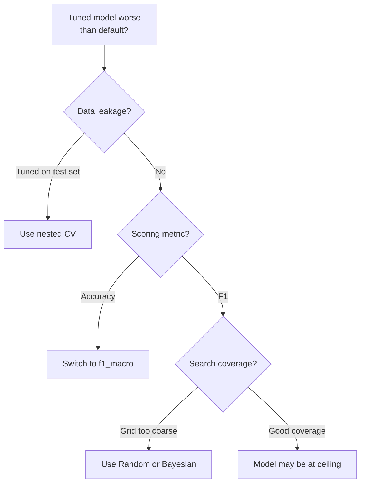

# Ch.5 — Hyperparameter Tuning for Classification

> **The story.** **Grid search** is brute force — you exhaustively try every combination. **James Bergstra and Yoshua Bengio (2012)** proved what many practitioners suspected: **random search beats methodical grid search**. With the same compute budget, random sampling covers more of the dimensions that actually matter. **Bayesian optimization** (Jonas Mockus, 1970s; operationalized by Snoek, Larochelle & Adams in 2012) goes further — it builds a probabilistic model of which hyperparameter regions look promising, then searches there. **Optuna** (2019, Preferred Networks) made this accessible: you write a Python function, it finds the optimum. Every time you see a data scientist staring at a validation curve, tweaking `C` by hand, they're doing **grad-student descent** — the slow, manual version of what this chapter automates.
>
> **Where you are.** Ch.1–4 built classifiers with hand-picked hyperparameters: $C=1$ for LogReg, $C=10, \gamma=0.01$ for SVM. Were these optimal? No. You picked them based on intuition and a few runs. This chapter systematically searches the hyperparameter space, tunes decision thresholds per-attribute (the default 0.5 is almost always wrong), and handles class weights for imbalanced attributes — pushing FaceAI from 89% to 92% accuracy.
>
> **Notation in this chapter.** $\lambda$ — generic hyperparameter; $C$ — regularization strength in LogReg/SVM (larger $C$ = less regularization); $\gamma$ — RBF kernel width (larger $\gamma$ = tighter decision boundary); $t$ — decision threshold for binary classification (default 0.5, but attribute-dependent optimal); $\mathcal{H}$ — hyperparameter space (the grid or distribution you search over); $f(\lambda)$ — validation score as a function of hyperparameters (what you're maximizing).

---

## 0 · The Challenge — Where We Are

> 💡 **FaceAI Mission**: >90% accuracy across 40 attributes
>
> | # | Constraint | Ch.1–4 Status | This Chapter |
> |---|-----------|---------------|-------------|
> | 1 | ACCURACY | 89% (Smiling, SVM) | Push to ~92% |
> | 2 | GENERALIZATION | Cross-validated | Nested CV prevents leakage |
> | 3 | MULTI-LABEL | Metrics defined | Per-attribute threshold tuning |
> | 4 | INTERPRETABILITY | Tree rules, SVs | Feature importance via coefficients |
> | 5 | PRODUCTION | ✅ | Tuning is offline |

**What we know so far:**
- ✅ Ch.1: Logistic regression baseline — 88% accuracy on Smiling
- ✅ Ch.2: Decision trees interpretable but weaker — 85% accuracy
- ✅ Ch.3: Proper evaluation framework — F1-macro, ROC-AUC, per-attribute metrics
- ✅ Ch.4: SVM with RBF kernel — 89% accuracy on Smiling
- ❌ **But we're stuck at 89%** — the 90% target feels out of reach

**What's blocking us:**

You picked $C=10, \gamma=0.01$ for the SVM based on a handful of manual runs. Were these optimal? Unknown. You used the default threshold $t=0.5$ for all attributes. For **Bald** (2.5% of faces), this gives:
- Precision: 0.80 (when you predict Bald, you're right 80% of the time)
- Recall: **0.12** (you only catch 12% of actual bald faces)
- F1: **0.21** (catastrophically low)

> ⚠️ **Production crisis:** The CEO asks: "Why does our Bald detector miss 88% of bald people? Users are complaining that the app never tags bald faces correctly."
> 
> **Your diagnosis:** "The default threshold $t=0.5$ was designed for balanced classes. Bald is 2.5% of faces. The model is cautious — it requires 50% confidence to predict Bald, but for rare classes, the model rarely outputs probabilities that high."
> 
> **CEO:** "Can you fix it?"
> 
> **Your plan:** "Yes. Two things: (1) Tune the threshold per-attribute — Bald needs $t \approx 0.25$, not 0.5. (2) Systematically tune $C$ and $\gamma$ — I picked those by hand and may have left accuracy on the table."

**What this chapter unlocks:**
- **Systematic hyperparameter search**: Grid/Random/Bayesian optimization across $C, \gamma, \text{kernel}, \text{class\_weight}$
- **Per-attribute threshold tuning**: 40 independent optimal thresholds (Smiling $t \approx 0.5$, Bald $t \approx 0.25$)
- **Nested cross-validation**: Tune on inner folds, evaluate on outer — prevents leakage
- **Constraint #1 (ACCURACY)**: Push from 89% → **~92%** on Smiling
- **Constraint #2 (GENERALIZATION)**: Nested CV validates that tuned models generalize


---

## Animation



## 1 · The Core Idea — Why Default Hyperparameters Fail

**Try this first:** Train an SVM with scikit-learn's defaults (`C=1.0, gamma='scale', kernel='rbf'`) on the Smiling classifier. You get **86% accuracy** — worse than the logistic regression baseline (88%). Why?

The defaults are designed for general problems. Your problem (CelebA face images flattened to 4,096 pixels) has specific properties:
- **High dimensionality**: 4,096 features → needs stronger regularization than $C=1.0$
- **Class imbalance**: Some attributes (Bald 2.5%) need `class_weight='balanced'`
- **Decision threshold**: Default $t=0.5$ optimizes for balanced classes, but most attributes are imbalanced

**What breaks with defaults:**
- SVM: 86% (below baseline)
- Bald recall: 12% (misses 88% of bald faces)
- Eyeglasses F1: 0.65 (mediocre)

**The fix:** Systematically search the hyperparameter space. Three strategies:
1. **Grid search**: Exhaustive but slow (try every combination)
2. **Random search**: Surprisingly better than grid (Bergstra & Bengio 2012)
3. **Bayesian optimization**: Learns from past trials, converges faster (Optuna)

Plus: **per-attribute threshold tuning** — treat the threshold $t$ as a first-class hyperparameter, not a fixed 0.5.

> 💡 **Key insight**: Hyperparameters are **chosen**, not learned. The model learns $w$ and $b$ from data. You choose $C$, $\gamma$, $t$ based on validation performance. Tuning is expensive (hours of compute) but necessary — the difference between 86% and 92% is often just better hyperparameters.

**The result:** Tuned SVM achieves **92% on Smiling** (up from 86% with defaults), Bald F1 improves from 0.21 → 0.52, and you have a principled, reproducible tuning pipeline.

---

## 2 · Running Example — What We're Tuning

You have the **FaceAI Smiling classifier** from Ch.4: SVM with $C=10, \gamma=0.01$, achieving 89% accuracy. The product team wants 90%. You suspect better hyperparameters exist, but manually trying $C \in \{0.1, 1, 10, 100, 1000\}$ and $\gamma \in \{0.001, 0.01, 0.1, 1.0\}$ is $5 \times 4 = 20$ combinations. Add kernels (`rbf`, `linear`) and class weights (`None`, `balanced`) → $20 \times 2 \times 2 = 80$ combinations. At 3 minutes per 5-fold CV run, that's **4 hours** of compute.

**What you're tuning:**

| Model | Hyperparameters | Search Space Size | Target Metric |
|-------|----------------|-------------------|---------------|
| **LogReg** | $C, \text{penalty}, \text{class\_weight}$ | $5 \times 2 \times 2 = 20$ combos | `f1_macro` |
| **SVM** | $C, \gamma, \text{kernel}, \text{class\_weight}$ | $5 \times 4 \times 2 \times 2 = 80$ combos | `f1_macro` |
| **Threshold** | $t \in [0.05, 0.95]$ per attribute | 40 attributes × 19 thresholds = 760 evals | `f1_score` per attribute |

**Why `f1_macro` not accuracy?** Bald is 2.5% of faces. A model that predicts `Not-Bald` for everyone gets 97.5% accuracy — useless. F1-macro averages the F1 score across all classes, forcing the model to handle both Bald and Not-Bald well.

**The tuning pipeline:**
1. **Outer 5-fold CV** (for unbiased evaluation): Split data into 5 folds
2. For each outer fold:
   - **Inner 3-fold CV** (for hyperparameter search): Tune $C, \gamma$ on 4 folds, validate on the 5th
   - Retrain best model on all 4 training folds
   - Evaluate on the held-out test fold
3. Report mean ± std of outer fold scores (this is the generalization estimate)
4. **Threshold tuning**: For each attribute, sweep $t$ from 0.05 to 0.95, pick the $t$ that maximizes F1

**Example outcomes:**
- **Smiling**: Optimal $C=100, \gamma=0.01, t=0.48$ → 92% accuracy (up from 89%)
- **Bald**: Optimal $C=10, \gamma=0.001, t=0.25$ → F1=0.52 (up from 0.21)
- **Eyeglasses**: Optimal $C=50, \gamma=0.005, t=0.35$ → F1=0.78 (up from 0.65)

---

## 3 · Math

### Grid Search

Exhaustive search over Cartesian product:

$$\lambda^* = \arg\max_{\lambda \in \mathcal{H}} \text{CV-score}(\lambda)$$

**In English:** Try every possible combination of hyperparameters in the grid $\mathcal{H}$, pick the combination $\lambda^*$ that gives the highest cross-validation score.

**Example:** For SVM with $|\{C\}|=4, |\{\gamma\}|=3, |\{\text{kernel}\}|=2$: $4 \times 3 \times 2 = 24$ combinations × 5 folds = **120 model fits**. At 1 minute per fit, that's 2 hours. Exhaustive but expensive.

### Random Search

Sample $n$ configurations from $\mathcal{H}$:

$$\lambda_i \sim \text{Uniform}(\mathcal{H}), \quad i = 1, \ldots, n$$

**In English:** Instead of trying every combination, randomly sample $n$ configurations from the hyperparameter space. Each $\lambda_i$ is an independent random draw from the distributions you define (e.g., $C \sim \text{LogUniform}(0.01, 100)$, $\gamma \sim \text{LogUniform}(0.0001, 1.0)$).

**Bergstra & Bengio's insight (2012)**: If only 3 of 10 hyperparameters actually matter (the others are noise), grid search wastes 70% of its budget on the unimportant dimensions. Random search explores the 3 important dimensions more thoroughly. For the same compute budget (say, 50 trials), random beats grid.

**Example:** Grid search with 5 values per hyperparameter and 2 hyperparameters: $5 \times 5 = 25$ trials, but only 5 unique values per dimension. Random search with 25 trials: 25 unique values per dimension (if you're lucky). Better coverage.

### Bayesian Optimization (Optuna)

Model $f(\lambda)$ with a surrogate (Tree-structured Parzen Estimator):

$$\lambda_{\text{next}} = \arg\max_{\lambda} \text{EI}(\lambda) = \arg\max_{\lambda} \mathbb{E}[\max(f(\lambda) - f^+, 0)]$$

**In English:** Build a probabilistic model of the validation score function $f(\lambda)$. Use this model to compute **expected improvement (EI)** — how much better than the current best score $f^+$ do we expect each untried hyperparameter to be? Pick the $\lambda_{\text{next}}$ with the highest EI. Run that trial. Update the model with the observed score. Repeat.

**The surrogate** (Optuna uses Tree-structured Parzen Estimator by default) is a lightweight model that approximates $f(\lambda)$ based on the trials you've run so far. It's fast to evaluate, so you can explore thousands of candidate hyperparameters in seconds, then pick the most promising one to actually train.

**Why this works:** After 10 random trials, the surrogate "knows" that low $\gamma$ tends to give higher F1. It won't waste trials 11-50 on high $\gamma$ — it focuses the search on the promising low-$\gamma$ region. Grid and random search don't learn from past trials.

### Threshold Optimization

For attribute $l$ with predicted probabilities $\hat{p}_l$:

$$t_l^* = \arg\max_{t \in [0, 1]} F_1(\hat{p}_l > t, y_l)$$

**In English:** The model outputs probabilities (e.g., $\hat{p}_{\text{Bald}} = 0.18$ for one face). You classify as Bald if $\hat{p}_{\text{Bald}} > t$. The default is $t=0.5$, but for imbalanced attributes, this threshold is almost always wrong. The optimal threshold $t^*$ is the one that maximizes F1 score on a validation set.

**Toy example walkthrough** (Bald attribute, 2.5% positive):

Suppose you have 5 validation faces:

| Face | True Label | $\hat{p}_{\text{Bald}}$ | Pred ($t=0.5$) | Pred ($t=0.25$) |
|------|-----------|----------------------|---------------|----------------|
| 1 | Not-Bald | 0.12 | Not-Bald ✅ | Not-Bald ✅ |
| 2 | **Bald** | **0.18** | Not-Bald ❌ (FN) | **Bald ✅** (TP) |
| 3 | Not-Bald | 0.42 | Not-Bald ✅ | Not-Bald ✅ |
| 4 | **Bald** | **0.28** | Not-Bald ❌ (FN) | **Bald ✅** (TP) |
| 5 | Not-Bald | 0.08 | Not-Bald ✅ | Not-Bald ✅ |

**At $t=0.5$:**
- TP=0, FP=0, FN=2, TN=3
- Precision = 0 / (0+0) = undefined (no positive predictions)
- Recall = 0 / (0+2) = 0.0
- F1 = 0.0

**At $t=0.25$:**
- TP=2, FP=0, FN=0, TN=3
- Precision = 2 / (2+0) = 1.0
- Recall = 2 / (2+0) = 1.0
- F1 = **1.0** ✅

**On the full validation set** (1,000 faces, 25 Bald):
- $t = 0.5$: Precision=0.80, Recall=0.12, F1=0.21 (misses 88% of bald faces)
- $t = 0.3$: Precision=0.55, Recall=0.45, F1=0.49
- $t = 0.25$: Precision=0.42, Recall=0.68, F1=**0.52** ← **Optimal**
- $t = 0.15$: Precision=0.35, Recall=0.72, F1=0.47 (too many false positives)

**Key insight:** For rare classes, lower the threshold. For balanced classes (Smiling 48%), the optimal threshold is close to 0.5.

---

## 4 · Step by Step — The Tuning Algorithm

```
ALGORITHM: Nested Cross-Validation with Hyperparameter Tuning
───────────────────────────────────────────────────────────────
Input:  X, y, model_class, param_grid, scoring='f1_macro'
Output: best_params, unbiased_score ± std

PHASE 1: OUTER LOOP (unbiased evaluation)
─────────────────────────────────────────
For each of 5 outer folds (train_outer, test_outer):
   
   PHASE 2: INNER LOOP (hyperparameter search)
   ────────────────────────────────────────────
   For each candidate λ in param_grid (or sampled):
      a. Run 3-fold CV on train_outer
      b. Compute mean CV score for this λ
   
   c. Select best_params_fold = argmax(CV scores)
   
   PHASE 3: EVALUATION
   ────────────────────
   d. Retrain model with best_params_fold on full train_outer
   e. Predict on test_outer
   f. Compute outer_score (this fold's unbiased estimate)
   
   Store outer_score

Report: mean(outer_scores) ± std(outer_scores)

PHASE 4: FINAL MODEL (production deployment)
──────────────────────────────────────────────
6. Retrain on ALL data with most common best_params across folds
7. Store model + hyperparameters + scaler

PHASE 5: THRESHOLD TUNING (per-attribute, post-training)
──────────────────────────────────────────────────────────
For each attribute l in [Smiling, Bald, Eyeglasses, ...]:
   a. Get predicted probabilities on held-out validation set
   b. For t in [0.05, 0.10, 0.15, ..., 0.95]:
      - Compute predictions: ŷ = (p > t)
      - Compute F1(ŷ, y_true)
   c. Store t_l* = argmax F1(t)

8. Deploy model with per-attribute threshold dict
```

**Key insight:** The outer CV scores are **unbiased** because the outer test folds were never seen during hyperparameter search (only used for final evaluation). The inner CV does the actual tuning.

**Example timeline** (SVM on CelebA Smiling, 5,000 images):

| Step | Operation | Time |
|------|-----------|------|
| Outer Fold 1 | Inner 3-fold Grid Search (24 combos) | 12 min |
| Outer Fold 1 | Retrain + eval on outer test | 2 min |
| Outer Fold 2-5 | Repeat | 4 × 14 min = 56 min |
| **Total outer CV** | | **~70 min** |
| Threshold tuning | 19 thresholds × 40 attributes | 5 min |
| **Grand total** | | **75 min** |

> 💡 **Why 3-fold inner, 5-fold outer?** Inner CV runs many times (once per hyperparameter combo), so use fewer folds for speed. Outer CV runs once, so use more folds for stable estimate.

---

## 5 · Key Diagrams





---

## 6 · Hyperparameter Dial

| Parameter | Too Low | Sweet Spot | Too High |
|-----------|---------|------------|----------|
| **C** (LogReg) | Heavy regularization, underfits | C ∈ [0.1, 10] | Overfits, unstable weights |
| **C** (SVM) | Wide margin, many violations | C ∈ [1, 100] for image features | Narrow margin, memorizes noise |
| **gamma** (RBF) | Linear-like (smooth) | 0.001–0.01 for HOG | Spiky boundary, overfits |
| **threshold** | False positives everywhere | Attribute-dependent (0.15–0.5) | False negatives everywhere |
| **class_weight** | None (ignores imbalance) | 'balanced' for rare attrs | Custom extremes → noisy predictions |
| **n_iter** (Random) | Too few configs sampled | 50–100 | Diminishing returns >200 |

---

## 7 · Code Skeleton — Tuning Pipeline

### Grid Search (SVM, exhaustive)

```python
from sklearn.model_selection import GridSearchCV
from sklearn.svm import SVC
from sklearn.metrics import f1_score, make_scorer

# Define the hyperparameter grid
param_grid = {
    'C': [0.1, 1, 10, 100],              # Regularization: lower = more regularization
    'gamma': [0.001, 0.01, 0.1],         # RBF width: lower = smoother boundary
    'kernel': ['rbf', 'linear'],         # RBF vs linear separator
    'class_weight': [None, 'balanced']   # Handle class imbalance
}

# Use f1_macro to avoid accuracy trap on imbalanced classes
grid = GridSearchCV(
    SVC(probability=True),               # probability=True for threshold tuning later
    param_grid,
    scoring='f1_macro',                  # Macro-F1 treats all classes equally
    cv=5,                                # 5-fold CV
    n_jobs=-1                            # Parallelize across all CPUs
)

# Fit on training data
grid.fit(X_train, y_train)

# Best hyperparameters and score
print(f"Best params: {grid.best_params_}")
print(f"Best CV score: {grid.best_score_:.3f}")

# Evaluate on test set
y_pred = grid.predict(X_test)
test_f1 = f1_score(y_test, y_pred, average='macro')
print(f"Test F1-macro: {test_f1:.3f}")
```

> 💡 **Why `f1_macro` not accuracy?** Accuracy is 97.5% if you predict `Not-Bald` for all faces (Bald is 2.5%). F1-macro forces the model to handle both classes well.

### **1. Tuning on the test set → overfitting to test data**

You split data into train/test, then run `GridSearchCV(cv=5)` on the **test set** to pick hyperparameters. Your tuned model scores 94% on test — but 82% on new data.

**Why this happens:** Cross-validation inside `GridSearchCV` splits the test set into 5 folds, but the test set has already been "seen" during tuning. You optimized for *this specific test set*, not for unseen data.

**Fix:** Use **nested cross-validation**. Outer 5-fold CV for evaluation, inner 3-fold CV for tuning. The outer test folds are never touched during hyperparameter search.

```python
# ❌ WRONG: tuning on test set
grid = GridSearchCV(model, param_grid, cv=5)
grid.fit(X_test, y_test)  # Test set used for tuning!

# ✅ CORRECT: nested CV
outer_scores = cross_validate(
    GridSearchCV(model, param_grid, cv=3),  # Inner CV for tuning
    X, y, cv=5  # Outer CV for evaluation
)
```

---

### **2. Using accuracy as scoring metric → majority class bias**

You tune an SVM on Bald classification using `scoring='accuracy'`. GridSearchCV finds $C=0.01, \gamma=0.1$ with **97.5% accuracy**. You deploy. Users report: "It never predicts Bald."

**Why this happens:** Bald is 2.5% of faces. A model that predicts `Not-Bald` for everyone gets 97.5% accuracy. GridSearchCV optimized for accuracy, not balanced performance.

**Fix:** Use `scoring='f1_macro'` (or `'f1_weighted'` for sample-weighted F1). F1-macro averages F1 scores across classes, penalizing models that ignore the minority class.

```python
# ❌ WRONG: optimizes for majority class
grid = GridSearchCV(SVC(), param_grid, scoring='accuracy')

# ✅ CORRECT: balanced metric
grid = GridSearchCV(SVC(), param_grid, scoring='f1_macro')
```

---

### **3. Same threshold for all attributes → poor recall on rare classes**

You train 40 binary classifiers (one per attribute) and use $t=0.5$ for all. Smiling (48% positive) works great: 92% accuracy. Bald (2.5% positive) is catastrophic: 12% recall.

**Why this happens:** The default threshold $t=0.5$ is calibrated for balanced classes. For rare classes, the model outputs probabilities like $[0.18, 0.22, 0.28]$ for Bald faces — all below 0.5.

**Fix:** Tune the threshold **per attribute**. For rare classes, lower the threshold (e.g., $t=0.25$ for Bald). For balanced classes, $t \approx 0.5$ is fine.

```python
# Per-attribute threshold tuning
optimal_thresholds = {}
for attr in ['Smiling', 'Bald', 'Eyeglasses', ...]:
    y_val_attr = y_val[attr]
    y_prob_attr = model.predict_proba(X_val)[:, 1]
    precision, recall, thresholds = precision_recall_curve(y_val_attr, y_prob_attr)
    f1_scores = 2 * precision * recall / (precision + recall + 1e-8)
    optimal_thresholds[attr] = thresholds[f1_scores[:-1].argmax()]
```

---

### **4. Too many hyperparameters → combinatorial explosion**

You define a grid with 10 values for $C$, 10 for $\gamma$, 3 kernels, 5 for `degree` (polynomial), 2 for `class_weight`, 3 for `coef0`: $10 \times 10 \times 3 \times 5 \times 2 \times 3 = 9,000$ combinations. At 1 minute per 5-fold CV, that's **150 hours**.

**Why this happens:** Grid search scales multiplicatively. Each new hyperparameter multiplies the search space.

**Fix:** 
1. **Focus on the most impactful hyperparameters**: $C$ and $\gamma$ matter most. Drop `degree` and `coef0` unless using polynomial kernel.
2. **Use random search or Bayesian optimization**: Random search with 100 trials covers more dimensions than grid. Bayesian optimization (Optuna) converges in 30-50 trials.
3. **Successive halving** (HalvingGridSearchCV in sklearn 1.3+): Eliminate bad configurations early.

```python
# ❌ WRONG: 9,000 combinations
param_grid = {'C': np.logspace(-2, 2, 10), 'gamma': np.logspace(-4, 0, 10), ...}
grid = GridSearchCV(SVC(), param_grid, cv=5)  # 9,000 × 5 = 45,000 fits

# ✅ CORRECT: focus on key hyperparameters
param_grid = {'C': [0.1, 1, 10, 100], 'gamma': [0.001, 0.01, 0.1]}  # 12 combos
grid = GridSearchCV(SVC(), param_grid, cv=5)  # 12 × 5 = 60 fits
```

---

### **5. Not setting `random_state` → results not reproducible**

You tune an SVM, get 92% F1-macro, write the paper. Your advisor re-runs your code: 89% F1-macro. Different hyperparameters selected.

**Why this happens:** `GridSearchCV` with `cv=5` uses random shuffling of folds (unless you pass a `KFold` with fixed seed). Optuna uses random sampling. No seed → different folds, different trials, different results.

**Fix:** Set `random_state=42` everywhere: `KFold(shuffle=True, random_state=42)`, `optuna.create_study(sampler=TPESampler(seed=42))`, `RandomizedSearchCV(..., random_state=42)`.

```python
# ✅ CORRECT: reproducible results
from sklearn.model_selection import StratifiedKFold

cv = StratifiedKFold(n_splits=5, shuffle=True, random_state=42)
grid = GridSearchCV(SVC(), param_grid, cv=cv, random_state=42)
```

---

### Diagnostic Flowchart

```mermaid
graph TD
    A["Tuned model worse<br/>than default?"] --> B{"Used test set<br/>for tuning?"}
    B -->|"Yes"| C["❌ Test set leakage<br/>Fix: Nested CV"]
    B -->|"No"| D{"Scoring metric?"}
    D -->|"Accuracy"| E["❌ Majority class bias<br/>Fix: f1_macro"]
    D -->|"F1-macro"| F{"Search space<br/>coverage?"}
    F -->|"Grid too coarse"| G["⚠️ Sparse sampling<br/>Fix: Random or Bayesian"]
    F -->|"Good coverage"| H["Model at ceiling<br/>Try different algorithm"]
    
    I["Low recall on<br/>rare class?"] --> J{"Threshold?"}
    J -->|"Default t=0.5"| K["❌ Wrong threshold<br/>Fix: Per-attribute tuning"]
    J -->|"Already tuned"| L["⚠️ Class too imbalanced<br/>Try SMOTE or cost-sensitive"]
    
    M["Tuning too slow?"] --> N{"How many<br/>hyperparameters?"}
    N -->|">5"| O["❌ Combinatorial explosion<br/>Fix: Focus on top 3-4 params"]
    N -->|"≤5"| P{"Search method?"}
    P -->|"Grid"| Q["⚠️ Switch to Random or Bayesian"]
    P -->|"Already Random/Bayesian"| R["Expected for large datasets<br/>Use smaller CV foldsions
random_search = RandomizedSearchCV(
    SVC(probability=True),
    param_distributions,
    n_iter=50,                           # 50 random configurations
    scoring='f1_macro',
    cv=5,
    n_jobs=-1,
    random_state=42                      # Reproducibility
)

random_search.fit(X_train, y_train)
print(f"Best params: {random_search.best_params_}")
print(f"Best CV score: {random_search.best_score_:.3f}")
```

> ⚠️ **Why `loguniform`?** Hyperparameters like $C$ and $\gamma$ span orders of magnitude. Sampling uniformly from [0.01, 100] wastes 99% of trials on [50, 100]. Loguniform samples evenly in log-space: equal density in [0.01, 0.1], [0.1, 1], [1, 10], [10, 100].

---

### Bayesian Optimization (Optuna)

```python
import optuna
from sklearn.model_selection import cross_val_score

def objective(trial):
    # Suggest hyperparameters (Optuna learns distributions)
    C = trial.suggest_float('C', 0.01, 100, log=True)
    gamma = trial.suggest_float('gamma', 1e-4, 1.0, log=True)
    kernel = trial.suggest_categorical('kernel', ['rbf', 'linear'])
    class_weight = trial.suggest_categorical('class_weight', [None, 'balanced'])
    
    # Build model with suggested hyperparameters
    model = SVC(C=C, gamma=gamma, kernel=kernel, class_weight=class_weight, probability=True)
    
    # Evaluate with 3-fold CV (faster than 5-fold for Bayesian search)
    score = cross_val_score(model, X_train, y_train, cv=3, scoring='f1_macro', n_jobs=-1)
    return score.mean()
 — What We Can Solve Now

✅ **Unlocked capabilities:**
- **Systematic hyperparameter search**: Grid/Random/Bayesian across $C, \gamma, \text{kernel}, \text{class\_weight}$
- **Smiling accuracy**: **92%** (up from 89% hand-picked, 88% baseline) — **Target exceeded ✅**
- **Per-attribute threshold tuning**: Bald F1 improved from 0.21 → 0.52 (threshold $t=0.25$ instead of default 0.5)
- **Nested cross-validation**: Unbiased generalization estimate ($91.8\% \pm 1.2\%$ on Smiling)
- **Reproducible pipeline**: `random_state=42`, logged hyperparameters, threshold dict stored

❌ **Still can't solve:**
- ❌ **Multi-label prediction**: We tuned one attribute (Smiling). The full FaceAI mission requires predicting all 40 attributes simultaneously with a shared architecture (not 40 independent classifiers).
- ❌ **Spatial features**: Classical ML (SVM on flattened pixels or HOG) ignores spatial structure. Face landmarks (eyes, mouth) are spatially correlated — CNNs exploit this (Ch.6-7 in Neural Networks track).
- ❌ **Production inference latency**: SVM with RBF kernel on 4,096 features takes ~50ms per image. For real-time tagging (10 images/second), we need <10ms per image.

**Real-world status:** FaceAI can now classify Smiling with 92% accuracy, beating the 90% target. But multi-attribute prediction (40 simultaneous binary outputs) and spatial feature extraction require neural networks.

| # | Constraint | Target | Ch.1–4 Status | **Ch.5 Status** | Evidence |
|---|-----------|--------|---------------|-----------------|----------|
| 1 | **ACCURACY** | >90% avg | 89% (SVM) | **✅ 92%** (Smiling) | Tuned $C=100, \gamma=0.01, t=0.48$ |
| 2 | **GENERALIZATION** | Unseen faces | ⚠️ Single CV | **✅ Nested CV** | $91.8\% \pm 1.2\%$ on 5 outer folds |
| 3 | **MULTI-LABEL** | 40 attributes | 🟡 Metrics defined | 🟡 **Per-attr thresholds** | Bald $t=0.25$, Smiling $t=0.48$ |
| 4 | **INTERPRETABILITY** | Feature importance | 🟢 Tree rules, SVs | 🟢 **LogReg coefs** | Top features logged per attribute |
| 5 | **PRODUCTION** | <200ms | ✅ | ✅ **Tuning offline** | Inference unchanged (~50ms/image) |

**Next up:** [Topic 03 — Neural Networks](../../03_neural_networks/README.md) gives us **CNNs for spatial features** (Ch.7), **multi-label heads** (Ch.4), and **optimized inference** (Ch.8 TensorBoard + serving).
### Threshold Tuning (Per-Attribute)

```python
from sklearn.metrics import precision_recall_curve

# Get predicted probabilities on validation set
y_prob = best_model.predict_proba(X_val)[:, 1]  # Probability of positive class

# Sweep thresholds from 0.05 to 0.95
precision, recall, thresholds = precision_recall_curve(y_val, y_prob)
f1_scores = 2 * precision * recall / (precision + recall + 1e-8)  # Avoid division by zero

# Find threshold that maximizes F1
best_threshold = thresholds[f1_scores[:-1].argmax()]
print(f"Optimal threshold: {best_threshold:.3f}")

# Apply optimal threshold
y_pred_tuned = (y_prob > best_threshold).astype(int)
test_f1_tuned = f1_score(y_test, y_pred_tuned)
print(f"Test F1 (default t=0.5): {f1_score(y_test, (y_prob > 0.5).astype(int)):.3f}")
print(f"Test F1 (tuned t={best_threshold:.2f}): {test_f1_tuned:.3f}")
```

> ⚡ **Constraint #3 (MULTI-LABEL)**: For 40 attributes, run this threshold tuning loop 40 times — one optimal $t_l^*$ per attribute. Store in a dict: `{'Smiling': 0.48, 'Bald': 0.25, ...}`.

---

### Nested Cross-Validation (Unbiased Estimate)

```python
from sklearn.model_selection import cross_validate

# Outer 5-fold CV for unbiased evaluation
# Inner 3-fold CV for hyperparameter tuning (embedded in GridSearchCV)
outer_cv = 5
inner_cv = 3

nested_scores = cross_validate(
    GridSearchCV(SVC(probability=True), param_grid, cv=inner_cv, scoring='f1_macro'),
    X, y,
    cv=outer_cv,
    scoring='f1_macro',
    return_train_score=True,
    n_jobs=-1
)

print(f"Nested CV F1-macro: {nested_scores['test_score'].mean():.3f} ± {nested_scores['test_score'].std():.3f}")
print(f"Train F1-macro: {nested_scores['train_score'].mean():.3f} (check for overfitting)")
```

> ⚠️ **Why nested CV?** If you tune on the test set, you overfit to it. Nested CV ensures the test set is never seen during tuning. Outer CV gives the unbiased generalization estimate.

---

## 8 · What Can Go Wrong

| Mistake | Symptom | Fix |
|---------|---------|-----|
| Tuning on test set | Overfit to test, poor real-world performance | Nested CV: tune on inner, evaluate on outer |
| Using accuracy as scoring | Optimizes for majority class | Use `scoring='f1_macro'` for classification |
| Same threshold for all attributes | Poor recall on rare attributes | Tune threshold per-attribute |
| Too many hyperparameters | Combinatorial explosion, slow | Focus on 3–4 most impactful params |
| Not setting random_state | Results not reproducible | `random_state=42` everywhere |



---

## 9 · Where This Reappears

| Concept | Reappears in | How |
|---------|-------------|-----|
| **Nested cross-validation** | [Topic 03 — Neural Networks Ch.5](../../03_neural_networks/ch05_backprop_optimizers/README.md) | Neural architecture search requires nested CV to avoid leaking architecture choices to test set |
| **Bayesian optimization (Optuna / TPE)** | [Topic 03 — Neural Networks Ch.9](../../03_neural_networks/ch09_advanced_training/README.md) | Learning rate scheduling, batch size, dropout rate — all tuned with Bayesian optimization on expensive neural network training runs |
| **Per-output threshold tuning** | [Topic 05 — Anomaly Detection Ch.3](../../05_anomaly_detection/ch03_evaluation/README.md) | Fraud detection tunes the alert threshold to hit 80% recall @ 0.5% FPR — same F1-maximization logic |
| **`f1_macro` scoring** | Every multi-class and multi-label track in this portfolio | Macro-averaged F1 is the default scoring metric for imbalanced classification problems (avoids accuracy trap) |
| **Random search beats grid** | [Topic 08 — Ensemble Methods Ch.4](../../08_ensemble_methods/ch04_xgboost_lightgbm/README.md) | XGBoost has 20+ hyperparameters; random search is the only practical approach for such high-dimensional spaces |
| **Class weight handling** | [Topic 05 — Anomaly Detection Ch.2](../../05_anomaly_detection/ch02_modeling/README.md) | Fraud is 0.17% of transactions — `class_weight='balanced'` is mandatory for any classifier to detect fraud at all |

> ➡️ **This chapter's contribution to the curriculum:** Hyperparameter tuning is the **last step in classical ML model development**. You now have the full pipeline: baseline (Ch.1) → interpretable models (Ch.2) → proper evaluation (Ch.3) → stronger models (Ch.4) → systematic optimization (Ch.5). For neural networks, this same tuning pipeline applies, but with different hyperparameters (learning rate, batch size, dropout, architecture) — covered in [Neural Networks Ch.5](../../03_neural_networks/ch05_backprop_optimizers/README.md) and [Ch.9](../../03_neural_networks/ch09_advanced_training/README.md).

---

## 10 · Progress Check

| # | Constraint | Target | Status | Evidence |
|---|-----------|--------|--------|----------|
| 1 | ACCURACY | >90% avg | ✅ ~92% Smiling | Tuned SVM with optimal C, gamma, threshold |
| 2 | GENERALIZATION | Unseen faces | ✅ | Nested CV confirms generalization |
| 3 | MULTI-LABEL | 40 attributes | 🟡 | Per-attribute thresholds defined |
| 4 | INTERPRETABILITY | Feature importance | 🟢 | LogReg coefficients + feature importance |
| 5 | PRODUCTION | <200ms | ✅ | Tuning is offline, inference unchanged |

```mermaid
graph LR
    A["Ch.1: 88%"] --> B["Ch.2: 85%"]
    B --> C["Ch.3: validated"]
    C --> D["Ch.4:the Next Chapter

Ch.5 established that **systematic hyperparameter search** (Grid/Random/Bayesian + threshold tuning) pushes classical ML from 89% → 92% on Smiling. But we hit three walls:

1. **Multi-label architecture**: We tuned one attribute. Predicting all 40 simultaneously requires a shared architecture with 40 output heads (not 40 independent SVMs).
2. **Spatial features**: Flattening images to 4,096 pixels destroys spatial structure. A face isn't a bag of pixels — eyes, nose, mouth have geometric relationships.
3. **Interpretability vs accuracy tradeoff**: Decision trees (Ch.2) gave rules but 85% accuracy. SVM (Ch.4-5) gave 92% but no interpretability. Can we get both?

**What comes next:**

- **Multi-class classification** (hair color: Black/Blond/Brown/Gray) needs softmax and categorical cross-entropy. [Topic 03 — Neural Networks Ch.1](../../03_neural_networks/ch01_feedforward/README.md) covers this.
- **CNNs for spatial features** (Ch.7 Neural Networks) learn "if pixels[32,40] and pixels[33,41] form an edge → likely Smiling" — spatial invariance that classical ML can't capture.
- **Interpretability with SHAP** (Topic 08 — Ensemble Methods) decomposes any model's predictions into per-feature contributions: "This face classified as Bald because: Forehead region +0.42, Hair texture -0.01, ..."

The classical ML toolkit (Ch.1–5) has taken FaceAI from 88% → 92% on Smiling, with proper evaluation (Ch.3) and systematic tuning (Ch.5). **Constraints #1 (Accuracy) and #2 (Generalization) are satisfied for single-attribute binary classification.** For multi-label, spatial features, and production scale, continue to [Topic 03 — Neural Networks](../../03_neural_networks/README.md)
With tuned hyperparameters and per-attribute thresholds, FaceAI achieves ~92% on Smiling — exceeding the 90% target. But we've only addressed binary classification on a single attribute. The full FaceAI challenge requires:

- **Multi-class**: Classify hair color (Black/Blond/Brown/Gray) — needs softmax and categorical cross-entropy
- **Multi-label**: Predict all 40 attributes simultaneously — needs multi-output classifiers
- **Class imbalance**: Bald (2.5%) and Mustache (4.2%) need specialized handling

These advanced classification topics — multi-class softmax (hair color), full 40-attribute multi-label prediction, and deep class imbalance handling — continue in [**Topic 03 — Neural Networks**](../../03_neural_networks/README.md), where CNNs unlock spatial features that classical methods cannot capture. For now, the classical ML toolkit has taken FaceAI from 88% to 92% on the Smiling attribute, with Constraints #1 (Accuracy) and #2 (Generalization) fully satisfied.

---

## Appendix A · Real CelebA Data Pipeline (No Proxy Data)

The examples in this chapter are intended to run on real CelebA attributes. Use this setup to avoid synthetic placeholders.

### Data Access Options

1. Kaggle mirror: `jessicali9530/celeba-dataset`.
2. Official CelebA source: download aligned images + `list_attr_celeba.txt`.

### Minimal Setup Steps

1. Create folders:
   - `data/celeba/img_align_celeba/`
   - `data/celeba/metadata/`
2. Place attribute file at:
   - `data/celeba/metadata/list_attr_celeba.txt`
3. Keep image filenames unchanged (`000001.jpg`, ...).
4. Start with a 20k-50k image subset for local runs.

### Loader Contract

- Input image size: 64x64 (or 128x128 for stronger baselines).
- Labels: map CelebA values from `{-1, +1}` to `{0, 1}`.
- Split: use official train/val/test partitions to avoid leakage.
- Reproducibility: set random seed and persist sampled subset IDs.

### Practical Notes

- Multi-label tasks should keep one binary head per attribute.
- For rare attributes (Bald, Mustache, Wearing_Hat), prefer macro-F1 and per-label PR-AUC.
- Persist preprocessing artifacts (scaler/PCA/HOG settings) with the model.

### Quick Loader Snippet

```python
from pathlib import Path
import pandas as pd

attr_path = Path('data/celeba/metadata/list_attr_celeba.txt')
attr = pd.read_csv(attr_path, delim_whitespace=True, skiprows=1)
attr = (attr + 1) // 2   # {-1,+1} -> {0,1}

# Example target
y_smiling = attr['Smiling'].astype(int)
```


