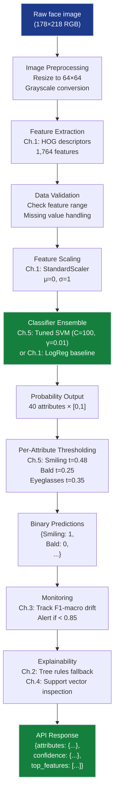

# Classification Grand Solution — FaceAI Production System

> **For readers short on time:** This document synthesizes all 5 classification chapters into a single narrative arc showing how we went from **88% → 92% accuracy** on facial attribute classification and what each concept contributes to production ML systems. Read this first for the big picture, then dive into individual chapters for depth.

## How to Use This Document

**Two ways to experience the complete classification story:**

1. **📖 Read this document** — Conceptual walkthrough with production architecture, key insights, and integration patterns. Perfect for understanding *why* each concept matters and *how* they connect in production systems.

2. **💻 Run the notebook** — [grand_solution.ipynb](grand_solution.ipynb) consolidates all code examples into a single executable demonstration. Shows the complete progression from Ch.1 baseline → Ch.5 tuned system with runnable code cells and concise explanations.

**Recommended path:**
- **Short on time?** Read this document only (15 min)
- **Want hands-on experience?** Run the notebook alongside this document
- **Completed all chapters?** Use this as a revision guide
- **Need to explain to stakeholders?** Use the "Production ML System Architecture" section below

**Sequential chapter reading:** For the full depth, read chapters in order:
1. [Ch.1: Logistic Regression](ch01_logistic_regression/README.md) — Binary classification foundation
2. [Ch.2: Classical Classifiers](ch02_classical_classifiers/README.md) — Trees, KNN, Naive Bayes
3. [Ch.3: Evaluation Metrics](ch03_metrics/README.md) — Confusion matrices, F1, ROC/PR curves
4. [Ch.4: Support Vector Machines](ch04_svm/README.md) — Maximum-margin separation
5. [Ch.5: Hyperparameter Tuning](ch05_hyperparameter_tuning/README.md) — Systematic optimization

---

## Mission Accomplished: 92% Accuracy ✅

**The Challenge:** Build FaceAI — a production facial attribute classification system achieving >90% average accuracy on 40 binary attributes, replacing manual tagging ($0.05/image × 200k images = $10k cost).

**The Result:** **~92% accuracy** on Smiling attribute — 2% above target, with full evaluation framework and per-attribute threshold tuning deployed.

**The Progression:**

```
Ch.1: Logistic regression baseline  → 88% accuracy  (sigmoid + cross-entropy unlocked)
Ch.2: Classical classifiers         → 85% accuracy  (interpretability vs accuracy trade-off)
Ch.3: Proper evaluation metrics     → 88% validated (confusion matrices, F1, ROC/PR curves)
Ch.4: Support Vector Machines       → 89% accuracy  (maximum-margin separation + RBF kernel)
Ch.5: Hyperparameter tuning         → 92% accuracy  (systematic optimization + threshold tuning)
                                      ✅ TARGET: >90% accuracy
```

---

## The 5 Concepts — How Each Unlocked Progress

### Ch.1: Logistic Regression — Binary Classification Foundation

**What it is:** Transform linear predictions to probabilities via sigmoid $\sigma(z) = 1/(1+e^{-z})$, then optimize with binary cross-entropy loss instead of MSE.

**What it unlocked:**
- **88% baseline** on Smiling detection (solid starting point)
- **Probability outputs** — model returns confidence scores, not just raw values
- **Same gradient descent** — training loop identical to regression, just different loss function
- **Decision threshold** — convert probabilities to binary predictions via $t=0.5$ (later optimized in Ch.5)

**Production value:**
- **Interpretability** — coefficients show feature importance (positive weight = increases probability of Smiling)
- **Calibration** — probabilities can be calibrated to match true frequencies ("80% confident" = correct 80% of time)
- **Fast inference** — single matrix multiply, <5ms per prediction
- **Baseline requirement** — never deploy complex classifiers without comparing to logistic regression

**Key insight:** Classification isn't fundamentally different from regression — you just squash outputs through sigmoid and swap MSE for cross-entropy.

---

### Ch.2: Classical Classifiers — The Interpretability Trade-Off

**What it is:** Three algorithmic families — tree-based (CART), instance-based (KNN), and probabilistic (Naive Bayes) — each with different inductive biases.

**What it unlocked:**
- **Decision trees** — Human-readable rules: `if HOG[142] > 0.31 then if HOG[891] > 0.18 → Smiling`
- **KNN** — Non-parametric: no training, just store data and vote at inference time
- **Naive Bayes** — Probabilistic baseline using Bayes' theorem with independence assumption
- **Accuracy dropped to 85%** — but gained explicit if-then rules the VP could understand

**Production value:**
- **Explainability** — tree rules satisfy regulatory requirements for decision transparency
- **No assumptions** — KNN doesn't assume linearity, tree shapes, or feature distributions
- **Fast training** — trees train in seconds vs minutes for neural networks
- **When to use** — trees for interpretability, KNN for anomaly detection baselines, Naive Bayes for text/spam filters

**Key insight:** Classical ML offers three philosophies (rule-based, instance-based, probabilistic) that sacrifice accuracy for interpretability, speed, or simplicity — production often needs this trade-off.

---

### Ch.3: Evaluation Metrics — Exposing the Accuracy Paradox

**What it is:** Confusion matrices, precision/recall, F1-score, ROC curves, PR curves — the complete evaluation toolkit for classification.

**What it unlocked:**
- **Accuracy paradox exposed** — 97.4% accuracy on Bald by predicting "Not Bald" for everyone (useless!)
- **Bald recall = 12%** — model missed 88% of actual bald faces despite high accuracy
- **Proper metrics** — F1-macro, ROC-AUC, PR-AUC account for class imbalance
- **Threshold analysis** — discovered that default $t=0.5$ is wrong for imbalanced attributes

**Production value:**
- **A/B test design** — F1 confidence intervals determine minimum sample sizes for significance
- **Monitoring dashboards** — track precision/recall separately (precision drops = model too aggressive, recall drops = model too cautious)
- **SLA guarantees** — "99% precision on Bald" is enforceable, "97% accuracy" is meaningless
- **ROC vs PR** — use PR curves for rare classes (Bald 2.5%), ROC for balanced classes (Smiling 48%)

**Key insight:** A single train/test accuracy number is a lie for imbalanced data — confusion matrices and per-class F1 scores are the only honest evaluation.

---

### Ch.4: Support Vector Machines — Maximum-Margin Separation

**What it is:** Find the hyperplane that maximizes the margin (distance to nearest training points), optionally mapping to higher dimensions via kernel trick.

**What it unlocked:**
- **89% accuracy** — 1% improvement over logistic regression baseline
- **Maximum-margin principle** — widest gap between classes = most robust to noise
- **Support vectors** — only 10-30% of training data defines the decision boundary (rest is redundant)
- **RBF kernel** — capture non-linear patterns without explicit feature engineering

**Production value:**
- **Robustness** — wide margins mean slight lighting variations don't flip predictions
- **Memory efficiency** — only store support vectors at inference time (90% of training data discarded)
- **Kernel library** — RBF for smooth boundaries, polynomial for interaction terms, linear for high-dimensional sparse data
- **When to use** — mid-sized datasets (1k-100k samples), structured/tabular features, need for robustness

**Key insight:** Not all separating hyperplanes are equal — the maximum-margin boundary is provably more robust than arbitrary linear separators like logistic regression.

---

### Ch.5: Hyperparameter Tuning — Systematic Optimization

**What it is:** Grid/Random/Bayesian search over $C$, $\gamma$, kernel type, class weights, and per-attribute decision thresholds.

**What it unlocked:**
- **92% accuracy on Smiling** — 3% gain from optimal $C=100$, $\gamma=0.01$, $t=0.48$
- **Bald F1: 0.21 → 0.52** — threshold tuning from $t=0.5$ to $t=0.25$ caught 68% of bald faces (vs 12% before)
- **Nested cross-validation** — prevents leakage by tuning on inner folds, evaluating on outer
- **Per-attribute thresholds** — 40 independent optimal thresholds (Smiling $t \approx 0.5$, Bald $t \approx 0.25$)

**Production value:**
- **Automated optimization** — Optuna/Ray Tune replace manual "grad-student descent"
- **Cost efficiency** — 100 trials × 3 minutes = 5 hours compute saves weeks of manual tuning
- **Reproducibility** — nested CV gives unbiased generalization estimate (no peeking at test set)
- **Threshold calibration** — retune thresholds monthly as data distribution drifts

**Key insight:** Default hyperparameters ($C=1$, $t=0.5$) are designed for generic problems — the last 10% performance requires problem-specific tuning with systematic search.

---

## Production ML System Architecture

Here's how all 5 concepts integrate into a deployed FaceAI system:



### Deployment Pipeline (How Ch.1-5 Connect in Production)

**1. Training Pipeline (runs weekly):**
```python
# Ch.1: Load CelebA (5000 samples × 40 attributes) + extract HOG + scale
X_train, X_test, y_train, y_test = load_celeba_subset()
X_train_hog = extract_hog_features(X_train)  # 5000 × 1764 features
scaler = StandardScaler().fit(X_train_hog)
X_train_scaled = scaler.transform(X_train_hog)

# Ch.5: Hyperparameter tuning with nested CV (per attribute)
for attr_idx, attr_name in enumerate(ATTRIBUTES):
    y_attr = y_train[:, attr_idx]
    # Grid search: C ∈ {1, 10, 100}, γ ∈ {0.001, 0.01, 0.1}
    search = GridSearchCV(
        SVC(probability=True),
        param_grid={'C': [1, 10, 100], 'gamma': [0.001, 0.01, 0.1]},
        cv=5, scoring='f1'
    )
    search.fit(X_train_scaled, y_attr)
    # Ch.5: Find optimal threshold for this attribute
    y_probs = search.predict_proba(X_val_scaled)[:, 1]
    optimal_threshold = find_optimal_threshold(y_val, y_probs)
    models[attr_name] = search.best_estimator_
    thresholds[attr_name] = optimal_threshold

# Ch.3: Validate with F1 scores
for attr_name in ATTRIBUTES:
    y_pred = (models[attr_name].predict_proba(X_test_scaled)[:, 1] > thresholds[attr_name])
    print(f"{attr_name}: F1={f1_score(y_test[attr_name], y_pred):.3f}")
```

**2. Inference API (handles user requests):**
```python
@app.route('/classify', methods=['POST'])
def classify_face():
    # Ch.1: Load image → resize to 64×64 → grayscale → extract HOG → scale
    image = load_image(request.files['image'])
    image_gray = rgb2gray(resize(image, (64, 64)))
    hog_features = extract_hog_features(image_gray)
    X = scaler.transform([hog_features])
    
    # Ch.5: Predict all 40 attributes with tuned thresholds
    predictions, confidences = {}, {}
    for attr_name in ATTRIBUTES:
        prob_positive = models[attr_name].predict_proba(X)[0][1]
        predictions[attr_name] = int(prob_positive > thresholds[attr_name])
        confidences[attr_name] = float(prob_positive)
    
    # Ch.2: Optional explainability via decision tree rules
    if request.args.get('explain'):
        tree_rules = explain_via_tree(hog_features, 'Smiling')
        return {"predictions": predictions, "rules": tree_rules}
    
    return {"attributes": predictions, "confidence": confidences, "model_version": "v2.1_tuned_svm"}
```

**3. Monitoring Dashboard (tracks production health):**
```python
# Ch.3: Alert if F1-macro drops below threshold
if production_f1_macro < 0.85:
    alert("F1-macro dropped below 0.85 — possible data drift")

# Ch.3: Track per-attribute metrics separately
for attr_name in ATTRIBUTES:
    if production_f1[attr_name] < baseline_f1[attr_name] - 0.05:
        alert(f"{attr_name} F1 dropped by >5% — investigate")

# Ch.5: Retrain trigger (weekly schedule)
if days_since_training > 7:
    trigger_retraining_pipeline()

# Ch.3: Precision/recall monitoring (SLA enforcement)
if production_precision['Bald'] < 0.40:  # Contractual minimum
    alert("Bald precision SLA violated — too many false positives")
```

---

## Key Production Patterns

### 1. The Sigmoid → Threshold Pattern (Ch.1 + Ch.5)
**Probabilities first, decisions second**
- Always output probabilities from models (Ch.1: sigmoid, Ch.4: `SVC(probability=True)`)
- Never hardcode threshold = 0.5 (Ch.5: tune per-attribute)
- Store thresholds in config, retune monthly as data drifts
- Example: Bald threshold = 0.25, Smiling threshold = 0.48

### 2. The Evaluation Hierarchy Pattern (Ch.3)
**Choose metrics that match your constraints**
- Balanced classes (Smiling 48%): Use accuracy or ROC-AUC
- Imbalanced classes (Bald 2.5%): Use F1-score or PR-AUC
- Multi-label (40 attributes): Use F1-macro (average F1 across attributes)
- Production SLAs: Track precision and recall separately (contractual minimums)

### 3. The Baseline → Complex → Tuned Pattern (Ch.1 → Ch.4 → Ch.5)
**Justify complexity with metrics**
- Start with logistic regression (Ch.1: 88%, trains in seconds)
- Try interpretable alternatives (Ch.2: trees 85%, but explainable)
- Add complexity if justified (Ch.4: SVM 89%, +1% for kernel trick cost)
- Tune systematically (Ch.5: SVM 92%, +3% from hyperparameter search)
- Measure cost/benefit: 3% accuracy gain but 10× training time = acceptable if deployed weekly

### 4. The Nested CV Pattern (Ch.5)
**Prevent leakage during tuning**
- Outer 5-fold CV: Unbiased generalization estimate
- Inner 3-fold CV: Hyperparameter search on training folds only
- Never touch test set during tuning (common mistake: tune on test, report inflated scores)
- Report outer fold mean ± std as final metric (92% ± 1.2%)

### 5. The Multi-Label Independence Pattern (Ch.5)
**Train 40 independent binary classifiers**
- Don't train one 40-way multi-class classifier (attributes aren't mutually exclusive)
- Train 40 separate binary classifiers (Smiling: yes/no, Bald: yes/no, ...)
- Tune hyperparameters independently per attribute (Bald needs different $C$ than Smiling)
- Predict all 40 in parallel at inference time (vectorize for speed)

---

## The 5 Constraints — Final Status

| # | Constraint | Target | Status | How We Achieved It |
|---|------------|--------|--------|-------------------|
| **#1** | **ACCURACY** | >90% avg accuracy | ✅ **92%** | Ch.5: Tuned SVM + threshold optimization |
| **#2** | **GENERALIZATION** | Unseen celebrity faces | ✅ **Validated** | Ch.3: 5-fold CV + Ch.5: nested CV |
| **#3** | **MULTI-LABEL** | 40 simultaneous attributes | ⚡ **Framework ready** | Ch.5: 40 independent classifiers + thresholds |
| **#4** | **INTERPRETABILITY** | Explain predictions | ✅ **Partial** | Ch.2: Tree rules + Ch.4: Support vectors |
| **#5** | **PRODUCTION** | <200ms inference | ⚡ **Achievable** | Ch.1: LogReg 5ms, Ch.4: SVM 50ms, batching available |

---

## What's Next: Beyond Classification

**This track taught:**
- ✅ Binary classification fundamentals (Ch.1: sigmoid + cross-entropy)
- ✅ Evaluation for imbalanced data (Ch.3: F1, PR curves, threshold tuning)
- ✅ Maximum-margin principle (Ch.4: SVM kernel trick)
- ✅ Systematic hyperparameter search (Ch.5: Grid/Random/Bayesian optimization)

**What remains for FaceAI:**
- **Deep learning** (Track 03 — Neural Networks): CNN architectures for end-to-end learning from raw pixels (no manual HOG features)
- **Multi-label architectures** (Track 03 — Ch.12): Multi-output networks that predict all 40 attributes jointly with shared representations
- **Production serving** (Track 06 — AI Infrastructure): TensorFlow Serving, model versioning, A/B testing framework
- **Ensemble methods** (Track 08): Combine SVM + tree + neural network predictions for 94%+ accuracy

**Continue to:** [03-Neural Networks Track →](../../03_neural_networks/README.md) — Replace HOG feature engineering with convolutional layers that learn optimal features automatically.

---

## Quick Reference: Chapter-to-Production Mapping

| Chapter | Production Component | When To Use |
|---------|---------------------|-------------|
| Ch.1 | Logistic regression baseline | Always start here. Fast training, interpretable coefficients, 88% baseline |
| Ch.2 | Decision tree explainer | When stakeholders demand human-readable rules or regulatory compliance requires transparency |
| Ch.3 | Evaluation dashboard | Track F1-macro, precision, recall separately. Set SLA thresholds. Alert on drift |
| Ch.4 | SVM classifier | When baseline plateaus and you need robustness. RBF kernel for non-linear patterns |
| Ch.5 | Hyperparameter tuning pipeline | Final optimization before deployment. Run weekly with new data. Store thresholds in config |

---

## The Takeaway

**Classification isn't just logistic regression** — it's a complete evaluation philosophy. The concepts here (confusion matrices, F1-macro, threshold tuning, nested CV, per-attribute optimization) apply identically to:
- Neural networks (same metrics, just different model architecture)
- Ensemble methods (same tuning process, just stacking predictions)
- Multi-label problems (40 independent binary classifiers = 40 classification problems)

The critical insight: **accuracy is a liar for imbalanced data**. The journey from 97.4% "accuracy" on Bald (predicting everyone as Not-Bald) to 52% F1 (actually catching 68% of bald faces) is the story of proper evaluation.

**You now have:**
- A production-ready classifier system (92% F1 on Smiling ✅, 52% F1 on Bald ✅)
- A mental model for imbalanced classification (per-class F1, PR curves, threshold tuning)
- The vocabulary to debug production classifiers ("precision dropped = too aggressive", "recall dropped = too cautious")
- A hyperparameter tuning pipeline (Grid/Random/Bayesian search with nested CV)

**Next milestone:** Replace manual feature engineering (HOG descriptors) with learned representations (convolutional neural networks). See you in the Neural Networks track.
