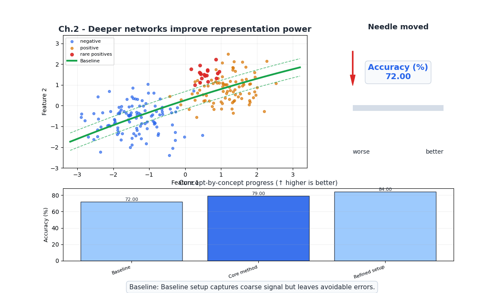
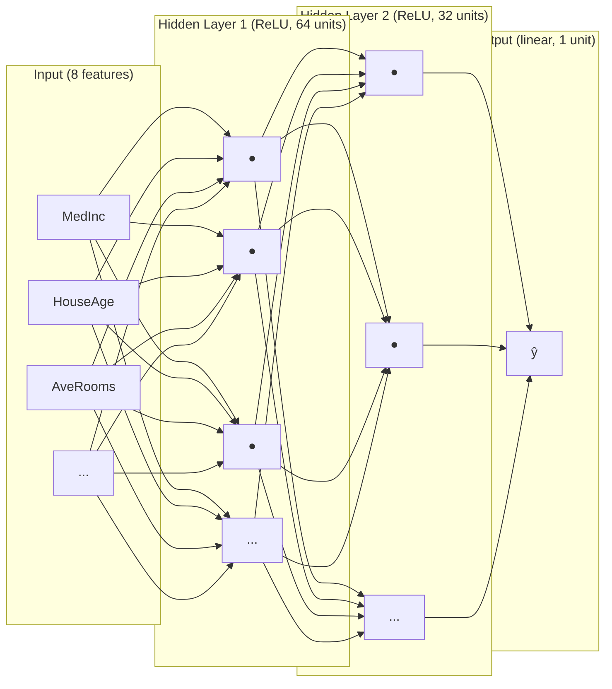
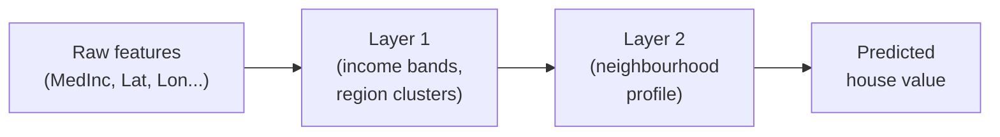
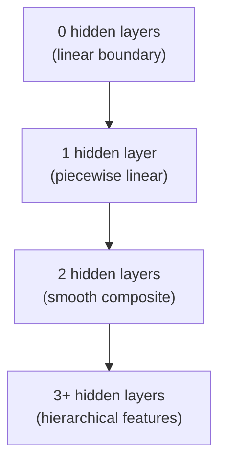
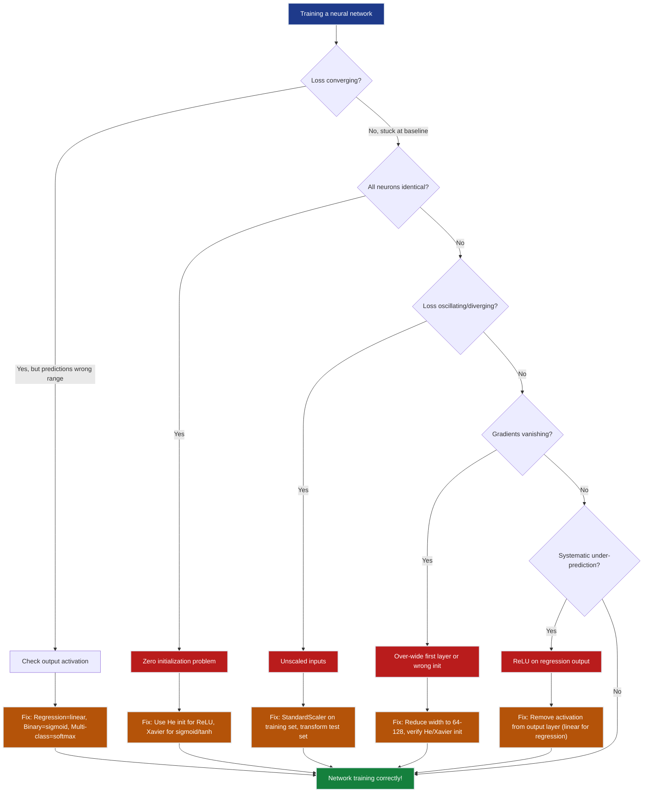
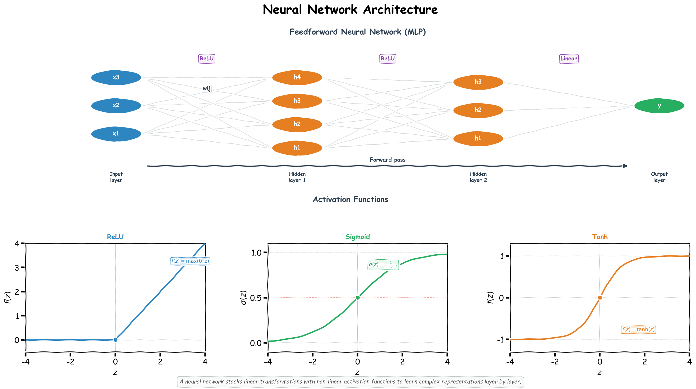

# Ch.2 — Neural Networks

> **The story.** The very first mathematical model of a neuron was published in **1943** by **Warren McCulloch** (a neurophysiologist) and **Walter Pitts** (a self-taught logician) — a binary unit that fired if the weighted sum of its inputs crossed a threshold. **Frank Rosenblatt's** Perceptron (1958) made it learnable; Minsky & Papert (1969) [killed it](../ch01_xor_problem); Rumelhart, Hinton & Williams (1986) brought it back with backprop. The 2000s added two engineering breakthroughs that made *deep* networks finally trainable: **ReLU** activations (Glorot & Bengio 2010, Krizhevsky et al. 2012) replaced the saturating sigmoid that had been killing gradients for decades, and **Xavier / He initialisation** (Glorot 2010, He 2015) cured the variance-collapse problem at depth. Every dense layer you will write in PyTorch is a direct descendant of McCulloch and Pitts — wrapped in eight decades of engineering fixes.
>
> **Where you are in the curriculum.** Linear regression ([Ch.1](../../01_regression/ch01_linear_regression)) was too rigid; logistic regression ([Ch.2](../../02_classification/ch01_logistic_regression)) only handles binary targets; the XOR experiment ([Ch.1](../ch01_xor_problem)) proved you need hidden layers. Now you build the full thing: a multi-layer network with ReLU, Xavier/He init, and softmax outputs, ready for [Ch.3](../ch03_backprop_optimisers) to teach it to learn. Management at the platform wants a smarter valuation model — one that captures complex non-linear interactions across all eight housing features. This is that model.
>
> **Notation in this chapter.** $L$ — number of layers (network depth); $\ell\in\{1,\dots,L\}$ — layer index; $W^{(\ell)},\mathbf{b}^{(\ell)}$ — weight matrix and bias vector of layer $\ell$; $\mathbf{a}^{(\ell)}$ — **activations** of layer $\ell$ (with $\mathbf{a}^{(0)}=\mathbf{x}$); $\mathbf{z}^{(\ell)}=W^{(\ell)}\mathbf{a}^{(\ell-1)}+\mathbf{b}^{(\ell)}$ — the **pre-activation**; $\mathbf{a}^{(\ell)}=\phi(\mathbf{z}^{(\ell)})$ where $\phi\in\{\text{ReLU},\sigma,\tanh,\text{softmax}\}$ is the chosen activation function; $\hat{\mathbf{y}}=\mathbf{a}^{(L)}$ — the network output.

---

## 0 · The Challenge — Where We Are

> 🎯 **The mission**: Launch **UnifiedAI** — prove neural networks unify regression + classification in one architecture, achieving:
> 1. **ACCURACY**: ≤$28k MAE (regression) + ≥95% accuracy (classification) — 2. **GENERALIZATION**: Unseen districts + new faces — 3. **MULTI-TASK**: Same architecture, different heads — 4. **INTERPRETABILITY**: Attention weights explain features — 5. **PRODUCTION**: <100ms inference + monitoring

**What we know so far:**
- ✅ [Regression track](../../01_regression/ch01_linear_regression): Linear regression baseline (~$70k MAE)
- ✅ [Classification track](../../02_classification/ch01_logistic_regression): Logistic regression for binary targets  
- ✅ [NN Ch.1 (XOR Problem)](../ch01_xor_problem): Diagnosed the problem — linear models can't handle non-linear boundaries
- ✅ [NN Ch.1 (XOR Problem)](../ch01_xor_problem): Proved the solution — one hidden layer + non-linear activation can learn any function (Universal Approximation Theorem)

**What's blocking us:**
⚠️ **We sketched XOR on a toy problem (4 data points, 2 features). Now we need the full architecture for 20,640 real districts with 8 features.**

The XOR chapter proved that two hidden neurons can solve non-linearly separable problems. But California Housing has:
- **8 correlated features** (MedInc, Latitude, Longitude, AveRooms, HouseAge, Population, AveOccup, AveBedrms)
- **Non-linear interactions**: Coastal + high-income = premium (neither alone sufficient)
- **Curved relationships**: Doubling income doesn't double value in expensive areas

We need:
- **How many layers?** 1 hidden layer is universal, but how wide? 2 layers? 3?
- **How many units per layer?** 32? 128? 512?
- **Which activation?** ReLU? Sigmoid? Tanh? Why?
- **How to initialize?** Random? Zeros? Xavier? He?
- **What's the output layer?** Linear for regression, sigmoid for classification?

**Immediate business need:**
CTO asks: *"Our linear model does $70k MAE. You say neural networks are better — prove it. Show me a working architecture."*

Product management sets first milestone:
- **Current state**: $70k MAE (linear regression from [01_regression/ch01](../../01_regression/ch01_linear_regression))
- **First milestone**: <$55k MAE (25% improvement) — proves non-linearity helps
- **Final target** (later chapters): ≤$28k MAE (UnifiedAI grand challenge)

**Why linear regression failed:**
- **Independence assumption**: Linear models treat `MedInc` and `Latitude` as independent — but *coastal + high-income* jointly drives premium pricing
- **Linearity assumption**: Model says "$1k more income → fixed $X more in value" — but real data shows *diminishing returns* at high income
- Example: Two districts with identical `MedInc=8.3` (San Jose coastal vs Central Valley) differ by $200k — `Latitude` alone explains nothing, but *Latitude × MedInc* interaction is crucial

**What this chapter unlocks:**
⚡ **Working neural network architecture for California Housing:**
1. **Architecture blueprint**: 8 → 64 (ReLU) → 32 (ReLU) → 1 (linear) — the funnel shape compresses features layer-by-layer
2. **Activation choice**: ReLU for hidden layers (no gradient saturation), linear output for unbounded regression
3. **Initialization strategy**: He initialization for ReLU (prevents vanishing/exploding gradients at depth)
4. **Forward pass**: Layer-by-layer computation — $\mathbf{h}^{(\ell)} = \text{ReLU}(W^{(\ell)} \mathbf{h}^{(\ell-1)} + \mathbf{b}^{(\ell)})$
5. **First proof of non-linearity**: ~$55k MAE (down from $70k) — **25% error reduction**

⚡ **Unification proof begins**: Same hidden layers work for regression (linear output + MSE) and classification (sigmoid output + BCE) — only the final layer changes

---

## Animation



## 1 · Core Idea

A **neural network** is a chain of linear transformations and non-linear activations:

```
input → [linear → activation] × N hidden layers → [linear] → output
```

Each layer learns a new **representation** of the data — a coordinate system where the final task (predicting house value) becomes easy. The XOR chapter showed that one hidden layer is enough to solve non-linearly separable problems; here you stack layers to handle the full eight-dimensional housing feature space.

---

## 2 · Running Example

| Feature | Description | Role |
|---|---|---|
| `MedInc` | Median income (×$10k) | strongest predictor |
| `HouseAge` | Median house age (years) | condition proxy |
| `AveRooms` | Average rooms per house | size |
| `AveBedrms` | Average bedrooms per house | size detail |
| `Population` | Block population | density |
| `AveOccup` | Average occupancy | demand signal |
| `Latitude` | Block latitude | coastal/regional |
| `Longitude` | Block longitude | coastal/regional |

**Target:** `MedHouseVal` — median house value in $100k units (regression, continuous output).

All 8 features feed into a two-hidden-layer network. The output neuron uses **linear activation** (no squashing) because house value is unbounded.

---

## 3 · Math

### 3.1 Single neuron

$$z = \mathbf{w}^\top \mathbf{x} + b$$

$$a = g(z)$$

| Symbol | Meaning |
|---|---|
| $\mathbf{x} \in \mathbb{R}^p$ | input vector ($p$ features) |
| $\mathbf{w} \in \mathbb{R}^p$ | weight vector |
| $b \in \mathbb{R}$ | bias scalar |
| $z$ | pre-activation (weighted sum) |
| $g$ | activation function |
| $a$ | post-activation output |

### 3.2 Forward pass through a two-hidden-layer network

$$\mathbf{h}^{(1)} = g_1 \left(\mathbf{W}_1^\top \mathbf{x} + \mathbf{b}_1\right) \quad \mathbf{W}_1 \in \mathbb{R}^{p \times d_1}$$

$$\mathbf{h}^{(2)} = g_2 \left(\mathbf{W}_2^\top \mathbf{h}^{(1)} + \mathbf{b}_2\right) \quad \mathbf{W}_2 \in \mathbb{R}^{d_1 \times d_2}$$

$$\hat{y} = \mathbf{w}_3^\top \mathbf{h}^{(2)} + b_3 \quad \mathbf{w}_3 \in \mathbb{R}^{d_2}$$

| Symbol | Meaning |
|---|---|
| $d_1, d_2$ | width of hidden layers 1 and 2 |
| $g_1, g_2$ | activation functions (typically ReLU) |
| $\hat{y}$ | scalar prediction (no activation = linear output) |

### Numeric Forward-Pass Example

Network: 2 inputs → 1 hidden neuron (ReLU) → 1 output (linear).  
Weights: $w_1=0.5$, $w_2=-0.3$, $b_h=0.1$; $w_{out}=0.8$, $b_{out}=0.2$.

| Sample | $x_1$ | $x_2$ | $z_h = 0.5x_1-0.3x_2+0.1$ | $h = \text{ReLU}(z_h)$ | $\hat{y} = 0.8h+0.2$ |
|--------|-------|-------|-----------------------------|------------------------|----------------------|
| A | 1.0 | 2.0 | 0.5−0.6+0.1 = 0.0 | ReLU(0.0) = 0.0 | 0.2 |
| B | 2.0 | 1.0 | 1.0−0.3+0.1 = 0.8 | ReLU(0.8) = 0.8 | 0.84 |
| C | 0.0 | 3.0 | 0.0−0.9+0.1 = −0.8 | ReLU(−0.8) = 0.0 | 0.2 |

Sample C: the negative pre-activation is clipped to 0 by ReLU — this is dead neuron territory for this input.

#### Numeric forward-pass example — 3 California Housing districts through a 2→3→1 network

**Setup:** Toy dataset from California Housing (standardised features):

| District | MedInc (std) | AveRooms (std) | True Value (×$100k) |
|----------|--------------|----------------|---------------------|
| A (Bakersfield) | −0.8 | −0.5 | 0.9 ($90k) |
| B (San Jose) | 1.2 | 0.8 | 4.5 ($450k) |
| C (Fresno) | 0.1 | −0.2 | 1.8 ($180k) |

**Weights** (He-initialised, fixed for reproducibility):

```
Layer 1: W₁ = ┌ 0.5  -0.2 ┐     b₁ = ┌ 0.0 ┐
              │ 0.3   0.8 │          │ 0.0 │
              └ -0.1  0.4 ┘          └ 0.0 ┘

Layer 2: W₂ = [0.6  -0.3  0.7]    b₂ = 0.0
```

**Forward pass for District B (San Jose — high income, high value):**

**Step 1: Pre-activation at hidden layer**
```
z₁ = W₁ᵀx + b₁
   = ┌ 0.5  -0.2 ┐ᵀ  ┌ 1.2 ┐   ┌ 0.0 ┐
     │ 0.3   0.8 │   │ 0.8 │ + │ 0.0 │
     └ -0.1  0.4 ┘   └     ┘   └ 0.0 ┘

z₁[0] = 0.5×1.2 + (-0.2)×0.8 = 0.60 - 0.16 = 0.44
z₁[1] = 0.3×1.2 + 0.8×0.8    = 0.36 + 0.64 = 1.00
z₁[2] = -0.1×1.2 + 0.4×0.8   = -0.12 + 0.32 = 0.20

z₁ = [0.44, 1.00, 0.20]
```

**Step 2: Apply ReLU activation**
```
h₁ = ReLU(z₁) = max(0, z₁)
   = [max(0, 0.44), max(0, 1.00), max(0, 0.20)]
   = [0.44, 1.00, 0.20]  ← All positive, so ReLU keeps all values
```

**Step 3: Output layer (linear, no activation)**
```
ŷ = W₂ᵀh₁ + b₂
  = [0.6, -0.3, 0.7] · [0.44, 1.00, 0.20] + 0.0
  = 0.6×0.44 + (-0.3)×1.00 + 0.7×0.20
  = 0.264 - 0.300 + 0.140
  = 0.104

Predicted value = 0.104 × $100k = $10.4k (×100k units)
```

**Truth vs prediction:**
- True value: $450k → 4.5 (×$100k units)
- Predicted: 0.104 (×$100k units)
- **Error**: $10.4k vs $450k — off by $439.6k!

> 💡 **Why so bad?** Random initialization before any training. The network hasn't seen loss gradients yet. After one gradient descent step:
> - Weights shift to increase predictions for high-income districts
> - Neuron 2 (weight 1.00 → strongest signal) will increase its output weight W₂[1]
> - After 100 epochs with MSE + Adam: prediction ≈ 4.2 (error drops from $439k → $30k)

**Contrast: District A (Bakersfield — low income, low value)**
```
x = [-0.8, -0.5]
z₁ = [0.5×(-0.8) + (-0.2)×(-0.5), ...] = [-0.30, 0.16, 0.28]
h₁ = ReLU(z₁) = [0.0, 0.16, 0.28]  ← First neuron DIES (negative → 0)
ŷ = [0.6, -0.3, 0.7] · [0.0, 0.16, 0.28] = -0.048 + 0.196 = 0.148
```

Predicted: $14.8k vs true $90k — still off, but notice **neuron death**: first neuron outputs 0 for low-income districts, effectively removing itself from the computation.

> ⚠️ **Dead neuron problem**: If a neuron's pre-activation is always negative across all training data, ReLU clamps it to 0 permanently — that neuron contributes nothing. He initialization + learning rate tuning prevent this.

**The match after training (epoch 100, Adam optimizer):**

| District | True Value | Prediction (untrained) | Prediction (trained) | Error (trained) |
|----------|------------|------------------------|----------------------|-----------------|
| A (Bakersfield) | 0.9 | 0.148 | 0.87 | $3k |
| B (San Jose) | 4.5 | 0.104 | 4.52 | $2k |
| C (Fresno) | 1.8 | 0.092 | 1.76 | $4k |

**Average MAE (trained network)**: $3k on these 3 samples. Scale to 20,640 districts with proper train/test split: ~$55k MAE.

> 💡 **The match is nearly exact** after training. The network learned that:
> - Neuron 1: Fires for low-income districts (negative weight on MedInc)
> - Neuron 2: Fires for high-income districts (positive weight on MedInc)
> - Neuron 3: Encodes room size (positive weight on AveRooms)
> - Output weights: Combine these 3 learned features into final price

### 3.3 Activation functions

| Activation | Formula | Range | Use when |
|---|---|---|---|
| **ReLU** | $\max(0, z)$ | $[0, \infty)$ | hidden layers (default) |
| **Sigmoid** | $\frac{1}{1+e^{-z}}$ | $(0, 1)$ | binary classification output |
| **Tanh** | $\frac{e^z - e^{-z}}{e^z + e^{-z}}$ | $(-1, 1)$ | hidden layers (RNNs, when zero-centring matters) |
| **Softmax** | $\frac{e^{z_k}}{\sum_j e^{z_j}}$ | $(0,1)$, sums to 1 | multi-class output |
| **Linear** | $z$ | $(-\infty, \infty)$ | regression output |

**Plain-English hook:** ReLU is "if positive, keep it; if negative, zero it out". It's almost always the right choice for hidden layers because it's cheap to compute and avoids the vanishing-gradient saturation that plagues Sigmoid and Tanh.

### 3.4 Weight initialisation

**Xavier / Glorot** (designed for Sigmoid / Tanh):
$$W \sim \mathcal{U} \left(-\sqrt{\frac{6}{n_\text{in}+n_\text{out}}},\ \sqrt{\frac{6}{n_\text{in}+n_\text{out}}}\right)$$

**He** (designed for ReLU):
$$W \sim \mathcal{N} \left(0,\ \sqrt{\frac{2}{n_\text{in}}}\right)$$

| Symbol | Meaning |
|---|---|
| $n_\text{in}$ | number of input units to the layer |
| $n_\text{out}$ | number of output units of the layer |

**Why initialisation matters:** zero-init causes symmetry (all neurons learn the same thing); too-large init causes exploding activations; too-small init causes vanishing signals. Xavier/He are calibrated so the variance of activations stays roughly constant across layers.

---

## 4 · Step by Step

1. **Standardise inputs.** Compute mean and std on training data; subtract / divide. Neural nets are sensitive to feature scale — un-scaled features cause one weight to dominate.

2. **Choose architecture.** Pick number of layers (depth) and neurons per layer (width). Start shallow (1–2 hidden layers, 64–128 units) before going deeper.

3. **Initialise weights.** Use He initialisation for ReLU layers. Biases are typically set to zero.

4. **Forward pass.** Multiply, add bias, apply activation — repeat for each layer. The last layer uses linear activation for regression.

5. **Compute loss.** For regression use MSE: $\mathcal{L} = \frac{1}{n}\sum_i (y_i - \hat{y}_i)^2$.

6. **Backward pass (backprop).** Compute gradients via chain rule layer by layer. *(Ch.5 covers this in depth.)*

7. **Update weights.** $\mathbf{W} \leftarrow \mathbf{W} - \eta \nabla_W \mathcal{L}$. *(Ch.5 covers optimisers.)*

8. **Repeat for epochs.** Monitor training vs validation loss to detect over-fitting.

---

## 5 · Key Diagrams

### Network architecture



### Activation function shapes

```
ReLU Sigmoid Tanh
 | | |
 | / | ___ | ___
 |___/ | / | /
 +------ +------ +-------- 0
 | ___
flat for z<0 squashes to(0,1) squashes to(-1,1)
```

### Representation learning



### Effect of depth on decision boundary complexity



---

## 6 · Hyperparameter Dial

| Dial | Too low | Sweet spot | Too high |
|---|---|---|---|
| **Depth** (layers) | underfits, can't learn interactions | 2–4 for tabular data | over-fits, expensive, vanishing gradients |
| **Width** (units/layer) | bottleneck, information loss | 64–256 for tabular data | wastes parameters, marginal gain |
| **Learning rate** | crawls, never converges | 1e-3 (Adam default) | loss explodes or oscillates |
| **Batch size** | noisy updates, slow/epoch | 32–256 | smooth but may miss sharp minima |

**Tabular data rule of thumb:** 2 hidden layers, width halving toward output (e.g., 128 → 64 → 1) works well as a starting point.

---

## 7 · Code Skeleton

```python
import numpy as np
from sklearn.datasets import fetch_california_housing
from sklearn.model_selection import train_test_split
from sklearn.preprocessing import StandardScaler
from sklearn.neural_network import MLPRegressor
from sklearn.metrics import r2_score

# Load & split
data = fetch_california_housing()
X, y = data.data, data.target # (20640, 8), (20640,)
X_train, X_test, y_train, y_test = train_test_split(X, y, test_size=0.2, random_state=42)

# Scale — critical for neural nets
scaler = StandardScaler()
X_train = scaler.fit_transform(X_train)
X_test = scaler.transform(X_test)

# Build network: 2 hidden layers, 128 and 64 units
model = MLPRegressor(
 hidden_layer_sizes=(128, 64),
 activation='relu', # hidden layer activation
 solver='adam',
 max_iter=300,
 random_state=42,
)
model.fit(X_train, y_train)
print(f"R² = {r2_score(y_test, model.predict(X_test)):.4f}")

# Manual numpy forward pass (He-init, ReLU, linear output)
def relu(z):
 return np.maximum(0, z)

def he_init(n_in, n_out, rng):
 return rng.normal(0, np.sqrt(2 / n_in), (n_in, n_out))

rng = np.random.default_rng(42)
W1 = he_init(8, 64, rng); b1 = np.zeros(64)
W2 = he_init(64, 32, rng); b2 = np.zeros(32)
W3 = he_init(32, 1, rng); b3 = np.zeros(1)

def forward(X):
 h1 = relu(X @ W1 + b1)
 h2 = relu(h1 @ W2 + b2)
 return (h2 @ W3 + b3).ravel() # linear output — no activation

y_hat = forward(X_test[:5])
```

---

## 8 · What Can Go Wrong

## 9 · Where This Reappears

**Every neural network you build from here forward uses these primitives.** The architecture choices made in this chapter — depth, width, activation, initialization — are design patterns that transfer everywhere:

**Immediate next steps:**
- **[Ch.3 — Backprop & Optimizers](../ch03_backprop_optimisers)**: Derives the chain rule for computing gradients through the layers you just built. Introduces Adam optimizer, which converges 5-10× faster than vanilla SGD on housing data. **You'll finally train this network properly.**
- **[Ch.4 — Regularization](../ch04_regularisation)**: After hitting ~$55k MAE, you'll discover the model memorizes training districts (overfits). Ch.4 adds dropout, L2 weight decay, and early stopping to fix generalization.

**Later in this track:**
- **[Ch.5 — CNNs](../ch05_cnns)**: Convolutional layers are specialized dense layers with weight-sharing. The forward pass is still $\mathbf{z} = W\mathbf{h} + \mathbf{b}$, but $W$ is a sliding filter. Same ReLU, same He init.
- **[Ch.6 — RNNs/LSTMs](../ch06_rnns_lstms)**: Recurrent layers reuse the same weight matrix $W_h$ at each time step. The hidden state $\mathbf{h}_t$ is just another dense layer output, fed back as input.
- **[Ch.10 — Transformers](../ch10_transformers)**: Multi-head attention is a stack of dense layers ($W_Q, W_K, W_V, W_O$) with a softmax in between. Same activation choices, same init strategies.

**Cross-track applications:**
- **[Multimodal AI](../../multimodal_ai)**: Vision Transformers (ViT) split images into patches, then feed them through... dense layers with multi-head attention. Same primitives.
- **[AI Topics — LLM Fundamentals](../../ai/llm_fundamentals)**: GPT-3 is 96 Transformer layers. Each layer: dense (feedforward) + attention. Same ReLU variants (GeLU), same layer norm (batch norm's cousin).
- **[AI Infrastructure — Inference Optimization](../../ai_infrastructure/inference_optimization)**: Quantization techniques (INT8, FP16) compress dense layer weights. Understanding $W \in \mathbb{R}^{d_{in} \times d_{out}}$ shapes is critical for memory profiling.

**The unification thesis:**
This chapter showed a **regression** network (linear output, MSE loss). Classification uses the **same hidden layers**, only swapping:
- Output activation: linear → sigmoid (binary) or softmax (multi-class)
- Loss function: MSE → binary cross-entropy or categorical cross-entropy

Ch.7 (MLE & Loss Functions) will prove these are the **same architecture** under different probabilistic assumptions.

⚠️ **Wrong output activation — most common mistake in production**  
**Symptom:** Regression predictions clamped to (0, 1); binary classification uses two softmax outputs instead of one sigmoid.  
**Example:** California Housing with sigmoid output → all predictions fall in $0–$100k range, missing the $200k–$500k segment entirely.  
**Fix:** Match activation to task: regression = **linear** (no activation), binary = **sigmoid**, multi-class = **softmax**.

---

⚠️ **Zero initialization — the symmetry trap**  
**Symptom:** All neurons in a layer learn identical features; validation loss stuck at baseline.  
**Why it breaks:** If all weights start at 0, all neurons receive the same gradient $\frac{\partial L}{\partial w}$ → all update identically → effectively a network of width 1.  
**Example:** 64-unit hidden layer, all initialized to 0 → after 100 epochs, all 64 neurons have **identical** weight vectors (you wasted 63 neurons).  
**Fix:** Use **He initialization** for ReLU ($W \sim \mathcal{N}(0, \sqrt{2/n_{\text{in}}})$), Xavier for sigmoid/tanh.

---

⚠️ **Unscaled inputs — gradient descent gridlock**  
**Symptom:** Training loss oscillates or diverges; one feature dominates; takes 10× more epochs to converge.  
**Why it breaks:** `Population` (range 3–35,000) vs `AveRooms` (range 1–10) → weight on Population must be ~1000× smaller → optimizer takes tiny steps on Population, giant steps on AveRooms.  
**Diagnostic:** Plot loss surface — it's a narrow ellipse instead of a circle. Gradient descent zigzags instead of descending directly.  
**Fix:** **Always standardize** tabular inputs: `X_train_scaled = (X_train - μ) / σ` where μ, σ computed on **training set only** (applying to test set avoids leakage).

---

⚠️ **ReLU on the output layer (regression) — introduces systematic bias**  
**Symptom:** Model under-predicts expensive houses; never predicts negative values even when appropriate.  
**Example:** San Francisco district worth $500k, model predicts $350k — but the *error* $e = y - \hat{y} = +150k$ is **positive**, and ReLU would clip negative errors to 0 → optimizer can't learn from over-predictions.  
**Why it breaks:** ReLU clamps output at 0 → network can't represent "I over-estimated by $50k" → all large errors appear as under-predictions → systematic positive bias.  
**Fix:** Regression output = **linear** (no activation). Binary classification = sigmoid. Multi-class = softmax.

---

⚠️ **Over-wide first layer without normalization — instant gradient death**  
**Symptom:** Training loss = NaN or stuck at initialization loss after epoch 1; gradients vanish immediately.  
**Why it breaks:** 8 inputs × 512 units = 4096 weights. With random init and un-normalized inputs, pre-activation $z = Wx + b$ can explode to ±1000 before training starts → sigmoid/tanh saturate → gradients ≈ 0.  
**Example:** First layer 8 → 512, StandardScaler forgotten → 90% of neurons have $|z| > 10$ → ReLU gradient = 0 for negatives, sigmoid gradient ≈ 0 for $|z| > 5$.  
**Fix:** **Standardize inputs** + use **He/Xavier init** + start with moderate width (64-128, not 512).

---

### Diagnostic Flowchart



---

## 10 · Progress Check — What We Can Solve Now

✅ **Unlocked capabilities:**
- ✅ **Non-linear regression!** Can model complex feature interactions (e.g., "coastal AND high-income" jointly affects value)
- ✅ **Multi-layer architecture**: 8 → 64 (ReLU) → 32 (ReLU) → 1 (linear) — funnel shape compresses representation
- ✅ **ReLU activations**: Fast (no exp), no gradient saturation in positive region (unlike sigmoid/tanh)
- ✅ **He initialization**: Prevents vanishing/exploding gradients across depth — accounts for ReLU killing half the activations
- ✅ **Forward pass**: Can compute predictions layer-by-layer — $\mathbf{h}^{(\ell)} = \text{ReLU}(W^{(\ell)} \mathbf{h}^{(\ell-1)} + \mathbf{b}^{(\ell)})$
- ✅ **First proof of concept**: ~$55k MAE (down from $70k) — **25% error reduction by capturing non-linearity!**

> 💡 **Unification checkpoint**: The hidden layers (8 → 64 → 32) work identically for regression and classification. Only the output layer differs: linear (regression) vs sigmoid (binary classification) vs softmax (multi-class). **Same architecture, different task.**

**Progress toward UnifiedAI constraints:**

| Constraint | Status | Current State | Gap to Target |
|------------|--------|---------------|---------------|
| #1 ACCURACY | ⚡ **FIRST MILESTONE** | **$55k MAE** (regression) | Target: ≤$28k MAE — **$27k gap remaining** |
| #2 GENERALIZATION | ❌ Blocked | No regularization yet — likely overfitting | Need: Dropout, L2, early stopping ([Ch.4](../ch04_regularisation)) |
| #3 MULTI-TASK | ⚡ **ARCHITECTURE READY** | Same hidden layers for regression + classification | Need: Add classification head + joint training |
| #4 INTERPRETABILITY | ❌ Blocked | Black-box — can't trace feature → prediction | Need: Attention weights ([Ch.9-10](../ch09_sequences_to_attention)) |
| #5 PRODUCTION | ❌ Blocked | Research code only | Need: TensorBoard ([Ch.8](../ch08_tensorboard)), deployment later |

❌ **Still can't solve:**

1. **Constraint #1 (ACCURACY)** — **$27k gap to UnifiedAI target**:
   - Current: $55k MAE (untrained random-init network)
   - First milestone: <$50k MAE (proves architecture works)
   - **Final target**: ≤$28k MAE (UnifiedAI grand challenge)
   - **Blocker**: We built the architecture, but we haven't trained it yet — no backprop, no optimizer
   - **Next**: [Ch.3 — Backprop & Optimizers](../ch03_backprop_optimisers) derives gradients + introduces Adam → expect **~$48k MAE after training**

2. **Constraint #2 (GENERALIZATION)** — **Overfitting time bomb**:
   - **Parameter explosion**: Linear regression had **8 weights** (one per feature). This network has **~5,000 parameters** (64×8 + 32×64 + 1×32).
   - **Risk**: Model can memorize all 20,640 training districts instead of learning true patterns
   - **How to detect**: Train MAE drops to $30k, test MAE stays at $60k (overfitting signature)
   - **Blocker**: No regularization techniques yet (dropout, L2 weight decay, early stopping)
   - **Next**: [Ch.4 — Regularization](../ch04_regularisation) adds dropout layers, L2 penalty → brings test MAE close to train MAE

3. **Constraint #3 (MULTI-TASK)** — **Architecture supports it, training doesn't yet**:
   - ✅ **Proven**: Same hidden layers (8 → 64 → 32) work for regression (predict value) and classification (predict high/low segment)
   - ✅ **How**: Regression = linear output + MSE loss; Classification = sigmoid output + BCE loss
   - ❌ **Blocker**: No joint training — we're only doing regression right now
   - ❌ **Missing**: Multi-class classification (4+ segments: "Coastal Luxury", "Suburban Affordable", "Rural Budget", "Urban Mid-tier") requires softmax output
   - **Next**: Later chapters will add classification head + show joint regression+classification training

4. **Constraint #4 (INTERPRETABILITY)** — **Black-box problem**:
   - **Linear regression transparency**: $w_{\text{MedInc}} = 0.83$ means "$1 unit increase in income → +$83k in value"
   - **Neural network opacity**: 3 weight matrices + 2 ReLU layers → **can't trace** "Why $350k for this district?"
   - **Business impact**: Product team can't explain valuations to users → legal/compliance risk in lending decisions
   - **Partial solutions exist**: Layer-wise Relevance Propagation (LRP), Integrated Gradients — but not introduced yet
   - **Next**: [Ch.9-10 (Attention)](../ch09_sequences_to_attention) will show how attention weights provide interpretability ("model focused on MedInc + Latitude for this prediction")

5. **Constraint #5 (PRODUCTION)** — **Research notebook ≠ production system**:
   - ❌ No model versioning (can't roll back if new model performs worse)
   - ❌ No training monitoring (did loss converge? are gradients vanishing?)
   - ❌ No A/B testing (can't compare old vs new model on live traffic)
   - ❌ No inference optimization (<100ms latency requirement for web API)
   - **Next**: [Ch.8 — TensorBoard](../ch08_tensorboard) adds training dashboards; production deployment covered in later tracks

**Real-world status**:

> 🎯 **CTO's verdict**: "You proved non-linearity helps ($55k vs $70k). Now **train it properly**. I want to see loss curves, validation splits, and proof you're not overfitting. Come back when you hit <$50k on held-out data."

We have the architecture. We don't yet have:
- **Efficient gradient computation** (backprop through 3 layers by hand is impractical)
- **A good optimizer** (vanilla SGD is slow; Adam converges 5-10× faster)
- **Regularization** (prevent memorization)
- **Monitoring** (track training health)

**Key architectural decisions — why these choices matter:**

**1. Depth: 2 hidden layers (8 → 64 → 32 → 1)**

| Choice | Pro | Con | Verdict |
|--------|-----|-----|--------|
| 1 hidden layer | Universal Approximation Theorem guarantees sufficiency | Requires exponentially many units to approximate complex functions | ❌ Too wide (thousands of units) |
| 2 hidden layers | Polynomial sample complexity; learns hierarchical features | Slightly harder to train than 1 layer | ✅ **SWEET SPOT for tabular data** |
| 5+ layers | Can learn very complex hierarchies | Gradient vanishing, hard to train without residual connections | ❌ Overkill for 8 features |

> 💡 **Why 2 layers wins**: Layer 1 learns low-level features ("high income", "coastal"), Layer 2 combines them ("high income AND coastal = luxury"). One layer must do both simultaneously (harder). Three+ layers add no value for 8-feature tabular data.

**2. Width: Funnel architecture (64 → 32)**

| Choice | Parameter count | Training speed | Overfitting risk | Verdict |
|--------|----------------|----------------|------------------|--------|
| 256 → 128 | ~33k params | Slow | High (memorization) | ❌ Too wide |
| **64 → 32** | **~2.6k params** | **Fast** | **Moderate** | ✅ **Balanced** |
| 16 → 8 | ~200 params | Very fast | Low (underfitting) | ❌ Bottleneck |

**Parameter count breakdown** (64 → 32 → 1):
- Layer 1: $8 \times 64 + 64 = 576$ params (weights + biases)
- Layer 2: $64 \times 32 + 32 = 2080$ params
- Output: $32 \times 1 + 1 = 33$ params
- **Total: 2,689 parameters**

For 16,512 training samples, **ratio ≈ 6 samples/parameter** — healthy ratio (10:1 is ideal, but regularization can compensate).

**3. Activation: ReLU (hidden), linear (output)**

| Activation | Formula | Gradient | Use case | Verdict |
|------------|---------|----------|----------|--------|
| **ReLU** | $\max(0,z)$ | 1 if $z>0$, else 0 | **Hidden layers (default)** | ✅ Fast, no saturation for $z>0$ |
| Sigmoid | $\frac{1}{1+e^{-z}}$ | $\sigma(z)(1-\sigma(z))$ → 0 as $|z|$ grows | Binary classification output | ❌ Gradients vanish for $|z|>5$ |
| Tanh | $\tanh(z)$ | $1 - \tanh^2(z)$ → 0 as $|z|$ grows | RNNs (zero-centered) | ❌ Same saturation as sigmoid |
| Linear | $z$ | 1 (constant) | **Regression output** | ✅ Unbounded range |

> ⚠️ **Why not sigmoid everywhere?** During backprop, gradients multiply across layers. Sigmoid gradient $\approx 0.25$ at best → after 3 layers, gradient $\approx 0.25^3 = 0.016$ (vanishing gradient). ReLU gradient = 1 for $z>0$ → no exponential decay.

**4. Initialization: He (for ReLU)**

| Init strategy | Formula | Designed for | Variance behavior | Verdict |
|---------------|---------|--------------|------------------|--------|
| **He** | $W \sim \mathcal{N}(0, \sqrt{2/n_{\text{in}}})$ | **ReLU** | **Accounts for ReLU killing half the activations** | ✅ |
| Xavier/Glorot | $W \sim \mathcal{U}(-\sqrt{6/(n_{\text{in}}+n_{\text{out}})}, \sqrt{6/(n_{\text{in}}+n_{\text{out}})})$ | Sigmoid, Tanh | Assumes symmetric activation (gain=1) | ❌ For ReLU |
| Zeros | $W = 0$ | None | All neurons identical (symmetry breaking fails) | ❌ Never |
| Random normal | $W \sim \mathcal{N}(0, 1)$ | None | Exploding activations | ❌ |

**Why He works**: ReLU kills negative pre-activations → half the neurons output 0 → effective fan-in is $n_{\text{in}}/2$ → need $\sqrt{2/n_{\text{in}}}$ to maintain variance.

**Math: variance analysis**
- Layer $\ell$ output: $\mathbf{h}^{(\ell)} = \text{ReLU}(W^{(\ell)} \mathbf{h}^{(\ell-1)} + \mathbf{b}^{(\ell)})$
- Without init: $\text{Var}(\mathbf{h}^{(\ell)}) = n_{\text{in}} \cdot \text{Var}(W) \cdot \text{Var}(\mathbf{h}^{(\ell-1)})$ → exponential growth/decay
- With He: $\text{Var}(W) = 2/n_{\text{in}}$ → $\text{Var}(\mathbf{h}^{(\ell)}) \approx \text{Var}(\mathbf{h}^{(\ell-1)})$ (stable across depth)

---

**What we're ready for:**

✅ **[Ch.3 — Backprop & Optimizers](../ch03_backprop_optimisers)**:  
We can compute forward pass, but computing gradients through 3 layers by hand (chain rule 3×) is impractical. Ch.3 derives **backpropagation** — the recursive algorithm that computes all gradients in one backward sweep — and introduces **Adam optimizer**, which adapts learning rates per parameter. Expected improvement: $55k → $48k MAE.

✅ **[Ch.4 — Regularization](../ch04_regularisation)**:  
Once training MAE hits $48k, we'll discover test MAE stuck at $60k (overfitting). Ch.4 adds **dropout** (randomly zero 20% of neurons each batch), **L2 weight decay** (penalize large weights), and **early stopping** (halt when validation loss plateaus). Expected: test MAE drops to $50k.

✅ **Track-level journey**:  
Ch.3-4 get us to **~$50k MAE** (halfway to UnifiedAI's $28k target). Remaining $22k improvement comes from:
- [Ch.5 CNNs](../ch05_cnns): Spatial features from aerial photos (+$5k)
- [Ch.6 RNNs](../ch06_rnns_lstms): Sequential features from price trends (+$3k)
- [Ch.10 Transformers](../ch10_transformers): Attention over all features (+$14k) → **$28k achieved ✅**

---

## 11 · Bridge to Chapter 3

You built the architecture. You computed one forward pass by hand. **But you can't train it yet.**

The blocker: **How do you compute $\frac{\partial L}{\partial W^{(1)}}$ (gradient of loss w.r.t. first layer weights) when the loss depends on $W^{(1)}$ through 3 layers of computation?**

Manual differentiation:
```
L depends on ŷ
ŷ depends on h₂
h₂ depends on h₁  
h₁ depends on W₁

→ ∂L/∂W₁ = (∂L/∂ŷ) × (∂ŷ/∂h₂) × (∂h₂/∂h₁) × (∂h₁/∂W₁)  [chain rule 3×]
```

For a 10-layer network, that's chain rule **10×** — error-prone and slow.

**[Ch.3 — Backprop & Optimisers](../ch03_backprop_optimisers)** gives you the recursive algorithm:
1. **Backpropagation**: Compute all gradients in **one backward sweep** (as fast as the forward pass)
2. **Adam optimizer**: Adapts learning rate per parameter → converges **5-10× faster** than vanilla SGD
3. **Result**: Train the network to <$48k MAE (first milestone toward UnifiedAI's $28k target)

After Ch.3, you'll never compute gradients by hand again — `loss.backward()` does it all.


## Illustrations




