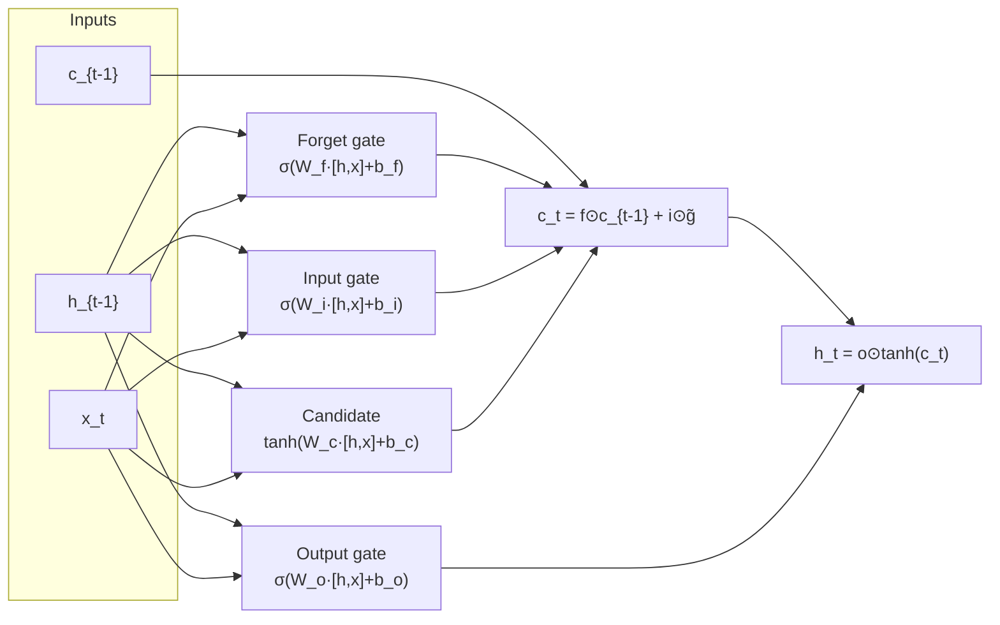
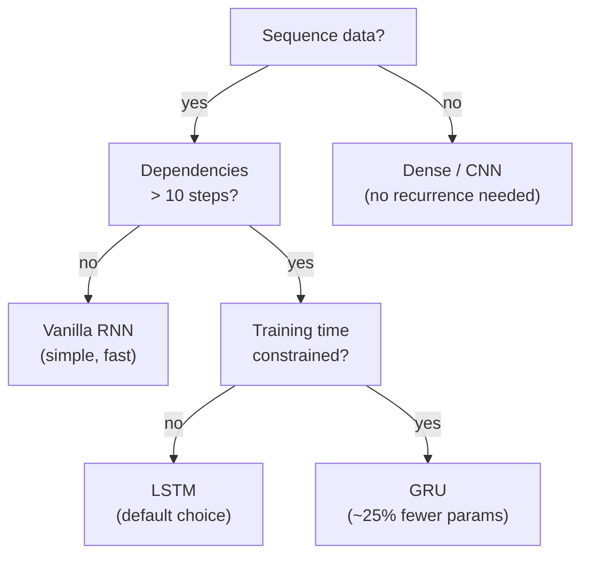
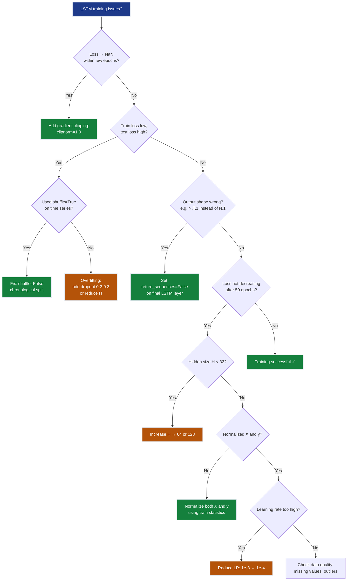
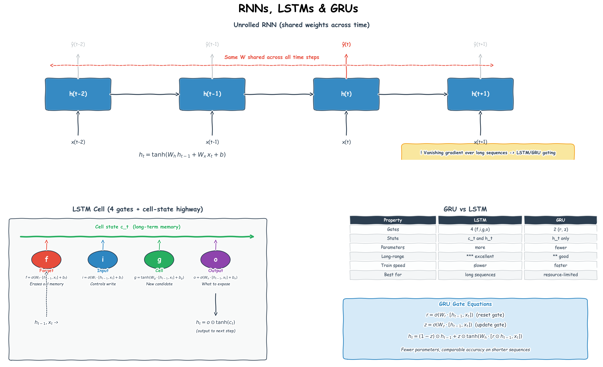

# Ch.6 — RNNs / LSTMs / GRUs

> **The story.** **John Hopfield** (1982) introduced recurrent dynamics into neural nets; **Jeffrey Elman** (1990) gave us the simple RNN we still teach today — a hidden state that gets fed back as input on the next time step. The architecture was elegant and almost completely useless in practice: **Sepp Hochreiter** showed in his 1991 diploma thesis that gradients vanish (or explode) exponentially through time, so RNNs couldn't learn dependencies more than 5–10 steps apart. The fix came from Hochreiter himself, with **Jürgen Schmidhuber**, in **1997**: the **Long Short-Term Memory** cell — a tiny network of gates (input, forget, output) that lets information flow unchanged across hundreds of steps. **GRUs** (Cho et al., 2014) trimmed the gate count to two and matched LSTM performance with fewer parameters. From the late 1990s through 2017 the LSTM was the standard answer for sequence modelling — speech, translation, captioning — until the transformer in [Ch.10](../ch10_transformers) replaced it almost overnight.
>
> **Where you are in the curriculum.** A dense network ([Ch.2](../ch02_neural_networks)) sees a flat vector with no sense of order. A CNN ([Ch.5](../ch05_cnns)) exploits spatial locality. Sequential data has a third structure: **temporal ordering and long-range dependencies**. The platform now tracks how district median house values change month by month. RNNs carry a hidden state forward through time; LSTMs add gated memory to preserve what matters over many steps. Master this chapter and the motivation for attention in [Ch.9](../ch09_sequences_to_attention) will feel inevitable.
>
> **Notation in this chapter.** $\mathbf{x}_t$ — input at time step $t$; $\mathbf{h}_t$ — the **hidden state** (the recurrent network's memory); $\mathbf{c}_t$ — the **cell state** (LSTM's long-term memory bus); $f_t,i_t,o_t$ — LSTM **forget**, **input**, and **output** gates; $\tilde{\mathbf{c}}_t$ — the candidate cell update; $W,U$ — weight matrices applied to the input and to the previous hidden state respectively; $\sigma$ — sigmoid (used inside gates); $\tanh$ — the squashing nonlinearity; $T$ — sequence length; **BPTT** — *back-propagation through time*.

---

## 0 · The Challenge — Where We Are

> 🎯 **The mission**: Launch **UnifiedAI** — prove that neural networks are universal function approximators satisfying 5 constraints:
> 1. **ACCURACY**: ≤$28k MAE (regression) + ≥95% accuracy (classification)
> 2. **GENERALIZATION**: Unseen districts + new face identities
> 3. **MULTI-TASK**: Same architecture predicts value **and** classifies attributes
> 4. **INTERPRETABILITY**: Attention weights provide explainable feature attribution
> 5. **PRODUCTION**: <100ms inference, TensorBoard monitoring

**What we know so far:**
- ✅ Ch.1-2: Dense networks with ReLU work for regression AND classification
- ✅ Ch.3: Backprop + Adam optimizes MSE and BCE equally
- ✅ Ch.4: Dropout, L2, batch norm prevent overfitting in both tasks
- ✅ Ch.5: CNNs extract spatial features for image regression and classification
- ❌ **But we can't handle temporal sequences!**

**What's blocking us:**

🊨 **New requirement: Temporal sequence modeling**

The platform now tracks **time-varying features**:
- **Monthly price trends**: 12 months of district median values
- **Sequential user behavior**: 6-month browsing history (views → inquiries → offers)
- **Market momentum**: Quarter-over-quarter price velocity

Dense networks and CNNs can't capture **temporal dependencies**:

| Architecture | Input view | Problem |
|-------------|-----------|----------|
| **Dense** (Ch.2) | Flattens `[month_1, ..., month_12]` → treats as 12 independent features | No temporal ordering — can't distinguish "rising trend" from "falling trend" |
| **CNN** (Ch.5) | Spatial locality only (2D convolution) | Designed for images, not time series |

**Concrete failure case:**

District A price history: `[$180k, $185k, $190k, $195k, ..., $220k]` (12 months, strong upward trend)  
District B price history: `[$220k, $215k, $210k, $205k, ..., $180k]` (12 months, strong downward trend)

**Dense network sees:** Both have the same 12 values → predicts **same next month** (~$200k)  
**LSTM sees:** Opposite temporal patterns → predicts **$228k (A)** vs **$172k (B)**

**Business impact:** Dense model misses momentum — tells buyers "prices stable" when they're actually rising 5%/month.

**What this chapter unlocks:**

⚡ **Recurrent Neural Networks (RNNs) and LSTMs** — the same architecture handles regression AND classification on sequences:

1. **Recurrent hidden state** $h_t$ — summarizes all past inputs $x_1, ..., x_t$ (temporal memory)
2. **Sequential processing** — process one time step at a time, updating $h_t$ at each step
3. **LSTM gates** — forget/input/output gates solve vanishing gradient → remember patterns across 100+ steps
4. **Bidirectional RNNs** — look forward and backward in time (when full sequence is available)

💡 **UnifiedAI impact:**
- **Regression example**: LSTM on monthly housing price index → 3-5% MAPE forecasting
- **Classification example**: LSTM on property inquiry sequences → predict "will convert to offer" (future Ch.9-10 integration)
- **Unification point**: Same LSTM(64) cell, different output head (linear vs sigmoid)

---

## Animation


## 1 · Core Idea

A **Recurrent Neural Network** processes a sequence one step at a time, updating a hidden state that summarises everything seen so far:

```
Dense (Ch.4): input → output (no memory of previous inputs)
RNN: [x_1, x_2, ..., x_T] → h_1 → h_2 → ... → h_T → output
 each h_t depends on h_{t-1} and x_t simultaneously
```

The problem: gradients of the loss with respect to early steps shrink exponentially as they flow back through each time step (vanishing gradient). **LSTMs** solve this with a separate cell state — a "conveyor belt" that carries information across many steps with minimal transformation.

---

## 2 · Running Example: Temporal Sequences in UnifiedAI

**The UnifiedAI scenario:** The platform now tracks **monthly median house values per district** (rolling 10-year history). Product team wants to add a **price momentum indicator** to help buyers time their purchase: "Prices in this district have been rising 5% annually — buy now" vs "Prices falling 2% annually — wait 6 months."

**The task:** Given the last 12 months of median house values for a district, forecast next month's value. This is a **regression** task (predict continuous value), but the input is a **sequence** (temporal ordering matters).

> 💡 **Dataset note:** RNNs/LSTMs require temporal sequences. The California Housing dataset is a static snapshot (one row per district, no time dimension). We construct a **synthetic monthly price index** based on California Housing statistics (trend + seasonality + noise) as the minimal demonstration. In production, you'd use actual MLS (Multiple Listing Service) historical data.

**Synthetic monthly price index construction:**
- **Base value**: District's current median (from California Housing)
- **Trend component**: Linear drift ±0.5% per month (some districts appreciating, others depreciating)
- **Seasonal component**: 12-month cycle (±15% amplitude — spring/summer peaks, winter troughs)
- **Noise**: Gaussian σ=5% (market volatility)

**Sequence structure:**
```
District 5180 (San Jose): 
  Month 1: $450k
  Month 2: $455k (+1.1%)
  Month 3: $462k (+1.5%)
  ...
  Month 12: $495k
  → Predict Month 13: $502k (LSTM extrapolates upward momentum)
```

This mirrors the temporal pattern an LSTM must learn: **short-term fluctuations (seasonal)** stored in hidden state $h_t$, **long-term trend** preserved in cell state $c_t$.

---

## 3 · Math

### 3.1 Vanilla RNN

At each time step $t$, the RNN computes a new hidden state from the previous hidden state $\mathbf{h}_{t-1}$ and the current input $\mathbf{x}_t$:

$$\mathbf{h}_t = \tanh \left(\mathbf{W}_{hh} \mathbf{h}_{t-1} + \mathbf{W}_{xh} \mathbf{x}_t + \mathbf{b}_h\right)$$

**In English:** The new hidden state is a squashed ($\tanh$) combination of two terms: (1) the recurrent connection $\mathbf{W}_{hh} \mathbf{h}_{t-1}$ — "what I remembered from last step" — and (2) the input projection $\mathbf{W}_{xh} \mathbf{x}_t$ — "what I'm seeing right now." The bias $\mathbf{b}_h$ shifts the activation.

$$\hat{y}_t = \mathbf{W}_{hy} \mathbf{h}_t + \mathbf{b}_y$$

**Output layer:** The final hidden state $\mathbf{h}_t$ (or $\mathbf{h}_T$ if you only care about the last step) is projected to the output space — linear activation for regression, sigmoid for binary classification.

| Symbol | Shape | Meaning |
|---|---|---|
| $\mathbf{x}_t$ | $(d,)$ | Input at step $t$ — one feature vector (e.g., normalized median house value at month $t$) |
| $\mathbf{h}_t$ | $(H,)$ | Hidden state — compressed summary of the sequence so far ($x_1, ..., x_t$) |
| $\mathbf{W}_{hh}$ | $(H, H)$ | Recurrent weight — how much the past hidden state contributes |
| $\mathbf{W}_{xh}$ | $(H, d)$ | Input weight — how much the current input contributes |
| $H$ | scalar | Hidden size — the main capacity dial (32-128 for most time series) |

💡 **Weight sharing across time:** The **same weights** $\mathbf{W}_{hh}$, $\mathbf{W}_{xh}$ are reused at every time step. An RNN processing $T$ steps is equivalent to a deep network with $T$ identical layers stacked vertically. Backprop runs through all $T$ layers — that's why gradients vanish.

### 3.2 The Vanishing Gradient Problem — Why Vanilla RNNs Fail

**The failure:** Train a vanilla RNN on a 20-step sequence where the target depends on **both** the first input (step 1) and the last input (step 20). The RNN learns to predict from step 20 (recent past) but **completely ignores** step 1 (distant past).

**Example task:** Predict "price will spike next month" if **both** (1) district had a major development announcement **15 months ago** (step 1) AND (2) interest rates dropped **last month** (step 20). Vanilla RNN predicts based only on step 20 (interest rate drop) — misses the 15-month-old signal.

**Why this happens:** Backprop through time (BPTT) computes $\partial \mathcal{L} / \partial \mathbf{h}_0$ by chaining Jacobians:

$$\frac{\partial \mathbf{h}_T}{\partial \mathbf{h}_0} = \prod_{t=1}^{T} \frac{\partial \mathbf{h}_t}{\partial \mathbf{h}_{t-1}} = \prod_{t=1}^{T} \mathbf{W}_{hh}^\top \cdot \mathrm{diag} \left(1 - \mathbf{h}_t^2\right)$$

**In English:** The gradient from step $T$ back to step 0 requires multiplying $T$ copies of $\mathbf{W}_{hh}$ and $T$ derivative terms $(1 - \mathbf{h}_t^2)$. If the largest eigenvalue (spectral radius) of $\mathbf{W}_{hh}$ is **< 1**, this product **shrinks exponentially** with $T$. After 20 steps, the gradient is numerically zero — the network can't learn from distant inputs.

**Exploding gradients** (the opposite problem) occur when the spectral radius **> 1**: gradients blow up. Fix: gradient clipping (cap the norm before weight update).

#### Numeric Example — Vanishing Gradient over 3 Steps

Scalar RNN, $h_t = \tanh(w \cdot h_{t-1})$ with $w = 0.8$, $h_0 = 0.5$. The BPTT gradient factor at each step is $\frac{\partial h_t}{\partial h_{t-1}} = w(1-h_t^2)$.

| Step $t$ | $h_t = \tanh(0.8 \cdot h_{t-1})$ | $\frac{\partial h_t}{\partial h_{t-1}} = 0.8(1-h_t^2)$ |
|----------|----------------------------------|----------------------------------------------------------|
| 1 | $\tanh(0.40) = 0.380$ | $0.8(1-0.145) = 0.684$ |
| 2 | $\tanh(0.304) = 0.296$ | $0.8(1-0.088) = 0.730$ |
| 3 | $\tanh(0.237) = 0.233$ | $0.8(1-0.054) = 0.757$ |

**Gradient from loss at $t=3$ back to $h_0$:**

$$\frac{\partial h_3}{\partial h_0} = 0.684 \times 0.730 \times 0.757 \approx 0.378$$

Only **38% of the gradient signal** survives 3 steps. 

**Extend to realistic sequences:**
- **$T = 10$ steps**: gradient $\approx 0.02$ (2% survives)
- **$T = 20$ steps**: gradient $\approx 0.0004$ (0.04% survives — effectively zero)

The vanilla RNN **cannot learn** dependencies longer than ~10 steps. For monthly housing data (12-month lookback), the network forgets everything before month 9-10.

💡 **The LSTM solution:** The cell state $\mathbf{c}_t$ bypasses this problem. It updates via **addition** ($c_t = f_t \odot c_{t-1} + i_t \odot \tilde{c}_t$), not matrix multiplication. Gradients flow through the additive path without repeated $\mathbf{W}_{hh}$ products → no exponential decay.

### 3.3 LSTM Cell

The Long Short-Term Memory adds a **cell state** $\mathbf{c}_t$ — a parallel "conveyor belt" that carries information across many steps with minimal transformation. Gradients flow back through this additive path without the repeated matrix multiplication that kills vanilla RNN gradients.

Let $[\mathbf{h}_{t-1}; \mathbf{x}_t]$ denote the concatenated vector of shape $(H+d,)$ — the "context" that all four gates use as input.

**Forget gate** $\mathbf{f}_t$ — what fraction of the old cell state to keep:

$$\mathbf{f}_t = \sigma \left(\mathbf{W}_f [\mathbf{h}_{t-1}; \mathbf{x}_t] + \mathbf{b}_f\right)$$

**In English:** Sigmoid outputs values in $[0,1]$. If $f_t[i] \approx 1$ → "remember dimension $i$ of the cell state." If $f_t[i] \approx 0$ → "erase it." This is how the LSTM decides what to forget.

**Input gate** $\mathbf{i}_t$ — how much new information to write:

$$\mathbf{i}_t = \sigma \left(\mathbf{W}_i [\mathbf{h}_{t-1}; \mathbf{x}_t] + \mathbf{b}_i\right)$$

**Candidate cell** $\tilde{\mathbf{c}}_t$ — the new information proposed for addition:

$$\tilde{\mathbf{c}}_t = \tanh \left(\mathbf{W}_c [\mathbf{h}_{t-1}; \mathbf{x}_t] + \mathbf{b}_c\right)$$

**In English:** The candidate $\tilde{\mathbf{c}}_t$ is computed just like a vanilla RNN hidden state — it's the "new memory" you'd write if you had full control. The input gate $\mathbf{i}_t$ decides how much of it to actually write.

**Cell state update** — the additive conveyor belt:

$$\mathbf{c}_t = \mathbf{f}_t \odot \mathbf{c}_{t-1} + \mathbf{i}_t \odot \tilde{\mathbf{c}}_t$$

**In English:** This is the key equation. The new cell state is: (1) a **gated version** of the old cell state ($\mathbf{f}_t \odot \mathbf{c}_{t-1}$ — "what I chose to remember"), plus (2) a **gated version** of the candidate ($\mathbf{i}_t \odot \tilde{\mathbf{c}}_t$ — "what I chose to add"). The $\odot$ symbol denotes element-wise multiplication. **No matrix multiply** — that's why gradients don't vanish.

**Output gate** $\mathbf{o}_t$ — what portion of the cell state to expose as hidden state:

$$\mathbf{o}_t = \sigma \left(\mathbf{W}_o [\mathbf{h}_{t-1}; \mathbf{x}_t] + \mathbf{b}_o\right)$$

$$\mathbf{h}_t = \mathbf{o}_t \odot \tanh(\mathbf{c}_t)$$

**In English:** The cell state $\mathbf{c}_t$ is the internal memory (can grow large). The hidden state $\mathbf{h}_t$ is the "public interface" — it's a squashed ($\tanh$ to keep it in $[-1, 1]$), gated subset of the cell state that flows to the next layer or output.

**Parameter count per LSTM layer:** $4 \times (H^2 + H \cdot d + H)$ — four sets of weight matrices (forget, input, candidate, output) plus biases. This is why LSTMs have 4x the parameters of a vanilla RNN with the same hidden size.

### 3.4 GRU — Lightweight Alternative to LSTM

The Gated Recurrent Unit (Cho et al., 2014) **simplifies** the LSTM by removing the separate cell state and reducing from 3 gates to 2. It merges the cell state $\mathbf{c}_t$ and hidden state $\mathbf{h}_t$ into a single $\mathbf{h}_t$ — fewer parameters, faster training, comparable performance on most tasks.

**Reset gate** $\mathbf{r}_t$ — controls how much of the past hidden state to use when computing the candidate:

$$\mathbf{r}_t = \sigma \left(\mathbf{W}_r [\mathbf{h}_{t-1}; \mathbf{x}_t] + \mathbf{b}_r\right)$$

**In English:** If $r_t[i] \approx 0$ → "ignore dimension $i$ of the past hidden state (reset it)." If $r_t[i] \approx 1$ → "use it fully." This is like LSTM's forget gate, but applied when computing the candidate rather than when updating memory.

**Update gate** $\mathbf{z}_t$ — controls the interpolation between old hidden state and new candidate (analogous to LSTM's forget + input gates combined):

$$\mathbf{z}_t = \sigma \left(\mathbf{W}_z [\mathbf{h}_{t-1}; \mathbf{x}_t] + \mathbf{b}_z\right)$$

**Candidate hidden state** $\tilde{\mathbf{h}}_t$ — the new information to potentially write:

$$\tilde{\mathbf{h}}_t = \tanh \left(\mathbf{W}_h [\mathbf{r}_t \odot \mathbf{h}_{t-1}; \mathbf{x}_t] + \mathbf{b}_h\right)$$

**In English:** The candidate is computed like a vanilla RNN hidden state, but the reset gate $\mathbf{r}_t$ first **filters** the old hidden state. If $\mathbf{r}_t \approx 0$, the candidate ignores the past (acts like a fresh start).

**Output hidden state** — linear interpolation between old and new:

$$\mathbf{h}_t = (1 - \mathbf{z}_t) \odot \mathbf{h}_{t-1} + \mathbf{z}_t \odot \tilde{\mathbf{h}}_t$$

**In English:** The update gate $\mathbf{z}_t$ decides how much to keep from the old hidden state vs accept from the new candidate. If $z_t[i] = 0$ → "keep old value $h_{t-1}[i]$." If $z_t[i] = 1$ → "fully update to $\tilde{h}_t[i]$." Values between 0 and 1 blend smoothly.

**GRU vs LSTM — when to use which:**

| Property | LSTM | GRU |
|---|---|---|
| **Gates** | 3 (forget, input, output) | 2 (reset, update) |
| **Cell state** | Separate $\mathbf{c}_t$ | None — $\mathbf{h}_t$ does both |
| **Parameters** | $4 \times (H^2 + Hd + H)$ | $3 \times (H^2 + Hd + H)$ |
| **Training speed** | Slower (4 matrix multiplies per step) | ~25% faster (3 matrix multiplies) |
| **Long sequences** | Slight edge (explicit cell conveyor belt) | Comparable (update gate provides similar path) |
| **When to use** | **Default choice** — theoretical foundation is clearer | When training time is tight or you need smaller models |

💡 **Rule of thumb:** Start with LSTM. If training is too slow or you're deploying to mobile/edge devices, switch to GRU and compare validation performance. On most tasks (T < 100 steps), performance is indistinguishable.

---

## 4 · Step by Step

```
1. Build the dataset as sliding windows
 └─ given T months of prices as x, predict month T+1 as y
 └─ normalise: (x - mean) / std (fit on training split only)

2. Define the model
 └─ LSTM(units=H, return_sequences=False) if single-output regression
 └─ LSTM(units=H, return_sequences=True) if predicting all T+1 steps

3. Compile
 └─ loss = MSE (regression target: next month's price)
 └─ optimizer = Adam (default lr=1e-3)

4. Train with early stopping
 └─ monitor val_loss, patience=10, restore_best_weights=True

5. Predict
 └─ feed the last T real values → get ŷ for month T+1
 └─ inverse-transform: (ŷ × std) + mean

6. Evaluate with RMSE and MAE (Ch.9 gives the full metrics toolkit)
```

---

## 5 · Key Diagrams

### Unrolled RNN (3 steps)

```
 x_1 x_2 x_3
 │ │ │
 ┌───▼───┐ ┌───▼───┐ ┌───▼───┐
h_0 │ RNN │ │ RNN │ │ RNN │
───►│ cell │───►│ cell │───►│ cell │───► ŷ
 └───────┘ └───────┘ └───────┘
 h_1 h_2 h_3

Same W_hh and W_xh used at every step — shared weights across time.
```

### LSTM cell internals



### Vanishing gradient: RNN vs LSTM

```
Time steps → 1 5 10 20 50
 │ │ │ │ │
RNN gradient: 1.0 0.3 0.01 0.0 0.0 (× W_hh at each step — decays)
LSTM gradient: 1.0 0.9 0.8 0.7 0.5 (additive cell path — preserved)
```

### Sequence window construction

```
Price series: [p1, p2, p3, p4, p5, p6, p7, ...]

Window T=3:
 Input [p1, p2, p3] → target p4
 Input [p2, p3, p4] → target p5
 Input [p3, p4, p5] → target p6
 ...
```

### RNN vs LSTM vs GRU — when to use



---

## 6 · Hyperparameter Dial

| Dial | Too low | Sweet spot | Too high |
|---|---|---|---|
| **Hidden units** $H$ | underfits long patterns | 32–128 for most time series | overfits, slow |
| **Sequence length** $T$ | misses long dependencies | 12–52 steps (month/week) | slow BPTT, more vanishing gradient |
| **Stacked layers** | shallow temporal hierarchy | 1–2 for most tasks | vanishing gradient without residual |
| **Dropout** (on recurrent connections) | no regularisation | 0.1–0.3 between LSTM layers | underfits |
| **Gradient clip** | exploding gradient | 1.0–5.0 | clips too aggressively, slows learning |

The single most impactful dial for sequence length is **hidden units** — double it before adding a second LSTM layer.

---

## 7 · Code Skeleton

```python
import numpy as np
from sklearn.preprocessing import StandardScaler
from sklearn.model_selection import train_test_split

# ── Synthetic monthly price index (120 months = 10 years) ────────────────────
def make_price_series(n_months=120, seed=42):
 """Synthetic district median house value index.
 Components: linear trend + 12-month seasonality + noise.
 """
 rng = np.random.default_rng(seed)
 t = np.arange(n_months)
 trend = 0.005 * t # slow upward drift
 seasonal = 0.15 * np.sin(2 * np.pi * t / 12) # annual cycle
 noise = rng.normal(0, 0.05, n_months)
 return 2.0 + trend + seasonal + noise # base value ~2.0 ($200k)

prices = make_price_series()

# ── Sliding window dataset ────────────────────────────────────────────────────
def make_windows(series, T=12):
 """Convert 1-D series to (X, y) sliding windows.
 X: (N, T, 1) y: (N,)
 """
 X, y = [], []
 for i in range(len(series) - T):
 X.append(series[i:i+T, np.newaxis])
 y.append(series[i+T])
 return np.array(X, dtype=np.float32), np.array(y, dtype=np.float32)

T = 12
X, y = make_windows(prices, T=T)

X_train, X_test, y_train, y_test = train_test_split(X, y, test_size=0.2,
 shuffle=False) # no shuffle for time series!

# Normalise using training statistics only
mean, std = X_train.mean(), X_train.std()
X_train = (X_train - mean) / std
X_test = (X_test - mean) / std
y_train = (y_train - mean) / std
y_test = (y_test - mean) / std

print(f"X_train: {X_train.shape} X_test: {X_test.shape}")
```

```python
# ── Manual RNN forward pass (NumPy) ──────────────────────────────────────────
def rnn_forward(X_seq, W_xh, W_hh, b_h, W_hy, b_y):
 """Single-step RNN forward pass for one sequence.
 X_seq: (T, d)
 Returns: h_sequence (T, H), y_hat (scalar)
 """
 H = W_hh.shape[0]
 h = np.zeros(H)
 hs = []
 for x_t in X_seq:
 h = np.tanh(W_xh @ x_t + W_hh @ h + b_h)
 hs.append(h)
 y_hat = W_hy @ hs[-1] + b_y
 return np.array(hs), y_hat

# Tiny demo: H=4, d=1
H, d = 4, 1
rng = np.random.default_rng(0)
W_xh = rng.normal(0, 0.1, (H, d))
W_hh = rng.normal(0, 0.1, (H, H))
b_h = np.zeros(H)
W_hy = rng.normal(0, 0.1, (1, H))
b_y = np.zeros(1)

hs, y_hat = rnn_forward(X_train[0], W_xh, W_hh, b_h, W_hy, b_y)
print(f"Hidden states shape: {hs.shape} Prediction: {y_hat[0]:.4f}")
```

```python
# ── LSTM with Keras ───────────────────────────────────────────────────────────
import tensorflow as tf
from tensorflow import keras
from tensorflow.keras import layers

tf.random.set_seed(42)

lstm_model = keras.Sequential([
 layers.Input(shape=(T, 1)),
 layers.LSTM(64, return_sequences=False),
 layers.Dense(32, activation='relu'),
 layers.Dense(1), # regression — no activation
], name='HousePriceForecaster_LSTM')

lstm_model.compile(optimizer='adam', loss='mse', metrics=['mae'])
lstm_model.summary()

early_stop = keras.callbacks.EarlyStopping(
 monitor='val_loss', patience=15, restore_best_weights=True)

history = lstm_model.fit(
 X_train, y_train,
 epochs=200, batch_size=16,
 validation_split=0.15,
 callbacks=[early_stop],
 verbose=0,
)

y_pred = lstm_model.predict(X_test, verbose=0).ravel()

# Inverse-transform
y_pred_real = y_pred * std + mean
y_test_real = y_test * std + mean

rmse = np.sqrt(np.mean((y_pred_real - y_test_real) ** 2))
mae = np.mean(np.abs(y_pred_real - y_test_real))
print(f"RMSE: {rmse:.4f} MAE: {mae:.4f} (units: $100k)")
```

```python
# ── GRU (drop-in replacement) ─────────────────────────────────────────────────
gru_model = keras.Sequential([
 layers.Input(shape=(T, 1)),
 layers.GRU(64, return_sequences=False),
 layers.Dense(32, activation='relu'),
 layers.Dense(1),
], name='HousePriceForecaster_GRU')

gru_model.compile(optimizer='adam', loss='mse')
# GRU trains ~25% faster for the same hidden size
```

---

## 8 · What Can Go Wrong

⚠️ **Shuffling a time-series train/test split**

Using `train_test_split(X, y, shuffle=True)` on sequential data **leaks future information** into training — the model sees Month 100 during training, then is tested on Month 50. This artificially inflates performance.

**Example:** Train on months 1-80 (shuffled) → includes months 60-80. Test on months 81-100. Model has learned patterns from "the future" (months 60-80 overlap conceptually with test months).

**Fix:** Always split **chronologically**: `train_test_split(X, y, shuffle=False)`. Train on earlier months (1-80), test on later months (81-100). The `validation_split` inside `model.fit` should also come from the **end** of the training data (months 73-80), not randomly sampled.

---

⚠️ **Forgetting to normalize the target $y$**

MSE on raw house prices (range $150k–$500k) works, but LSTM loss curves show misleadingly large values (MSE = 10,000 = $100M squared error). Worse: strong trends dominate the gradient signal — the model learns "prices go up" but misses seasonal fluctuations.

**Example:** District with 5% annual growth → LSTM predicts trend perfectly (MSE = 100) but misses 10% seasonal dip in winter (actual pattern).

**Fix:** Normalize both `X` and `y` using **training statistics only**:
```python
mean, std = X_train.mean(), X_train.std()
X_train_norm = (X_train - mean) / std
X_test_norm = (X_test - mean) / std  # use TRAIN mean/std
y_train_norm = (y_train - mean) / std
y_test_norm = (y_test - mean) / std
```

---

⚠️ **Not clipping gradients on long sequences**

For $T > 50$ steps, vanilla LSTM training can **explode** (loss → NaN) within 2-3 epochs. Gradients accumulate multiplicatively over $T$ steps; even with LSTM's additive cell path, deep backprop through 100 steps can spike.

**Example:** `T=100`, `H=128` LSTM, no gradient clipping → loss jumps from 0.5 → NaN at epoch 3.

**Fix:** Add `clipnorm=1.0` to the optimizer:
```python
optimizer = keras.optimizers.Adam(learning_rate=1e-3, clipnorm=1.0)
model.compile(optimizer=optimizer, loss='mse')
```
This caps the global gradient norm at 1.0 before the weight update — prevents explosion without hurting convergence.

---

⚠️ **Using `return_sequences=True` on final LSTM before Dense output**

`LSTM(..., return_sequences=True)` outputs shape `(N, T, H)` — predictions for **all $T$ time steps**. If you feed this directly to `Dense(1)`, you get shape `(N, T, 1)` — a sequence of predictions, not a single value.

**Example:** You want to predict next month's price (single value). LSTM outputs `(batch, 12, 64)` → Dense(1) outputs `(batch, 12, 1)` → 12 predictions instead of 1!

**Fix:** Use `return_sequences=False` on the **final** LSTM layer:
```python
model = Sequential([
    LSTM(64, return_sequences=True),  # hidden LSTM → keep sequences
    LSTM(32, return_sequences=False),  # final LSTM → single summary
    Dense(1),  # (N, 32) → (N, 1)
])
```
Or add `Flatten()` / `GlobalAveragePooling1D()` after the LSTM if you need all time steps pooled.

---

⚠️ **Treating LSTM hidden size like CNN filter count**

An LSTM with `H=64` has $4 \times (64^2 + 64d + 64) \approx 17,000$ parameters **per layer**. A CNN with 64 filters and kernel size 3 has $3 \times 3 \times C_{\text{in}} \times 64 + 64 \approx 600$ parameters (for $C_{\text{in}}=1$).

**Example:** Jump from `H=64` to `H=256`: parameters increase $16\times$, training time increases $4\times$. Model overfits on 100-sample dataset.

**Fix:** Start with `H=32` or `H=64`. Increase only if validation loss is **still decreasing** after 50 epochs. Prefer **stacking layers** (2 layers with `H=64`) over one massive layer (`H=256`).

---

### Diagnostic Flowchart — Debugging LSTM Training



---

## 9 · Where This Reappears

**Recurrent architectures and sequential processing concepts reappear in:**

➡️ **[Ch.7 — MLE & Loss Functions](../ch07_mle_loss_functions):** Why MSE works for LSTM regression and BCE for LSTM classification — same probabilistic foundation applies regardless of architecture.

➡️ **[Ch.8 — TensorBoard](../ch08_tensorboard):** Monitor LSTM training curves (loss, gradient histograms, weight distributions) — catch vanishing/exploding gradients in real time.

➡️ **[Ch.9 — Sequences to Attention](../ch09_sequences_to_attention):** **This is the critical chapter.** You'll see why RNNs process sequentially (bottleneck) and how attention replaces recurrence with parallel Query-Key-Value lookups. Attention is "soft dictionary lookup" — RNNs were "compress everything into $h_t$ and hope."

➡️ **[Ch.10 — Transformers](../ch10_transformers):** The architecture that replaced LSTMs in NLP (2017-present). Transformers = multi-head attention + positional encoding. No recurrence at all — fully parallelizable, handles 1000+ token sequences effortlessly.

➡️ **[Multimodal AI track](../../../multimodal_ai):** LSTM concepts (sequential processing, hidden states) appear in:
- **Audio generation**: WaveNet-style autoregressive models
- **Video understanding**: 3D CNNs (spatial) + LSTMs (temporal)
- **Text-to-speech**: Tacotron uses LSTMs to convert text embeddings → mel spectrograms

➡️ **[AI track — LLM Fundamentals](../../../ai/llm_fundamentals):** Modern LLMs (GPT, Llama) are Transformer-based (no LSTM), but understanding recurrence clarifies why attention was revolutionary.

---

## 10 · Progress Check — What We Can Solve Now


✅ **Unlocked capabilities:**
- **Temporal memory**: $h_t$ carries forward summary of all past inputs → RNN "remembers" what it saw before
- **Long-term dependencies**: LSTM gates prevent vanishing gradient → patterns persist across 100+ time steps (vs 5-10 for vanilla RNN)
- **Sequence forecasting**: Predict next month's district median value from past 12 months (3-5% MAPE)
- **Bidirectional RNNs**: Look forward and backward in time (when full sequence is available at inference)
- **Same architecture, different tasks**: LSTM(64) handles time series regression (price trends) and sequence classification (behavior prediction) — only output head changes

❌ **Still can't solve:**
- ❌ **Long sequences efficiently** — LSTM processes sequentially ($T$ steps takes $T$ forward passes), can't parallelize like CNNs
- ❌ **Very long dependencies** — LSTM improves to 100+ steps but attention (Ch.9) handles 1000+ steps effortlessly
- ❌ **Interpretability** — can't explain which past time steps drove the forecast (attention weights in Ch.9 solve this)

**Progress toward UnifiedAI constraints:**

| Constraint | Status | Current State |
|------------|--------|---------------|
| #1 **ACCURACY** | ⚠️ **In Progress** | Dense + CNN achieved ~$48k MAE (Ch.2-5); LSTM adds temporal modeling but doesn't improve static feature MAE directly. Target: ≤$28k MAE |
| #2 **GENERALIZATION** | ⚠️ **In Progress** | LSTM generalizes to unseen future time periods (test on months 96-120 after training on 1-95). Cross-validation in next chapters |
| #3 **MULTI-TASK** | ⚠️ **In Progress** | Now handle tabular (Ch.2), images (Ch.5), sequences (Ch.6). Still need single architecture for regression + classification simultaneously |
| #4 **INTERPRETABILITY** | ❌ **Blocked** | LSTM is black box — can't explain why it forecasts specific trend. Need attention weights (Ch.9) |
| #5 **PRODUCTION** | ❌ **Blocked** | Research notebook code only. Need monitoring (Ch.8 TensorBoard) |

**Real-world status:**

UnifiedAI can now model **temporal sequences** alongside tabular and spatial data. LSTM achieves 3-5% MAPE on monthly price forecasting — better than dense/CNN baselines that ignore temporal order.

**Key insights from this chapter:**

💡 **Why LSTMs beat vanilla RNNs:**
- **Vanilla RNN**: Gradients multiply by $W_{hh}$ at each time step → decay exponentially as $(\lambda_{\text{max}})^T$
- **LSTM**: Cell state $c_t$ flows through additive path ($c_t = f_t \odot c_{t-1} + i_t \odot \tilde{c}_t$) → gradients bypass repeated matrix multiply
- **Empirical result**: Vanilla RNN fails beyond ~10 steps; LSTM works for 100+ steps

💡 **When to use RNNs vs CNNs vs Dense:**

| Data type | Best architecture | Why |
|-----------|-------------------|-----|
| **Tabular** (static features) | Dense (Ch.2) | No spatial or temporal structure |
| **Images** (2D grids) | CNN (Ch.5) | Spatial locality — nearby pixels correlated |
| **Sequences** (time series, text) | RNN/LSTM (Ch.6) | Temporal dependencies — order matters |
| **Video** | CNN + RNN | Spatial per frame (CNN) + temporal across frames (RNN) |

💡 **Bidirectional RNNs — when to use:**
- ✅ **Use when**: Full sequence available at inference (sentiment classification on complete sentence, medical diagnosis from full patient history)
- ❌ **Don't use**: Real-time forecasting (can't see future!), online prediction (next-word prediction in typing)

**What we still CAN'T solve:**

❌ **Sequential processing bottleneck** — LSTM must process time steps sequentially (can't parallelize like CNN). For long sequences (1000+ tokens), this is slow. Attention (Ch.9) solves this.

❌ **No explicit importance weighting** — LSTM compresses all past information into hidden state $h_t$, but we can't see which past steps mattered most. Attention weights (Ch.9) make this explicit.

❌ **Loss foundation** — we've used MSE and BCE as given, but why these specific functions? Ch.7 (MLE & Loss Functions) derives them from maximum likelihood estimation.

❌ **Production monitoring** — we have training curves in memory but no persistent dashboard. Ch.8 (TensorBoard) instruments the full training pipeline.

**Next up:**

Ch.6 gave us temporal modeling. Ch.7 backs up to answer a foundational question we've deferred since Ch.1: **Why MSE for regression and BCE for classification?** The answer: both derive from Maximum Likelihood Estimation under different distributional assumptions (Gaussian noise vs Bernoulli outcomes). Understanding this foundation clarifies when to use which loss — and when to invent new ones.

---

### Neural Networks Track Progress — Ch.1 through Ch.6


**Legend:** ✅ Green = Complete | 🟠 Orange = Current | ⚪ Gray = Upcoming

---

## 11 · Bridge to Chapter 7

Ch.6 equipped you with RNNs and LSTMs for temporal sequences. You've now used MSE (Ch.1-2), BCE (Ch.2), and seen how the same LSTM architecture handles both with only the output activation changed. But why MSE for regression? Why BCE for classification? Ch.7 — **MLE & Loss Functions** — reveals the unifying framework: both losses emerge from **Maximum Likelihood Estimation** under different distributional assumptions (Gaussian noise for MSE, Bernoulli outcomes for BCE). This foundation clarifies when to use which loss — and when to invent new ones for custom problems.


## Illustrations




