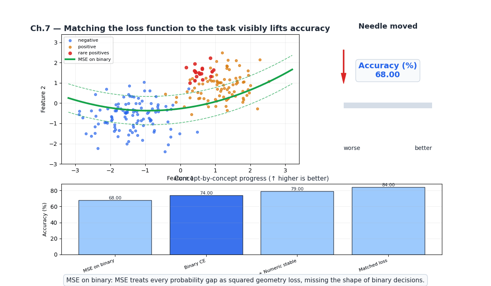
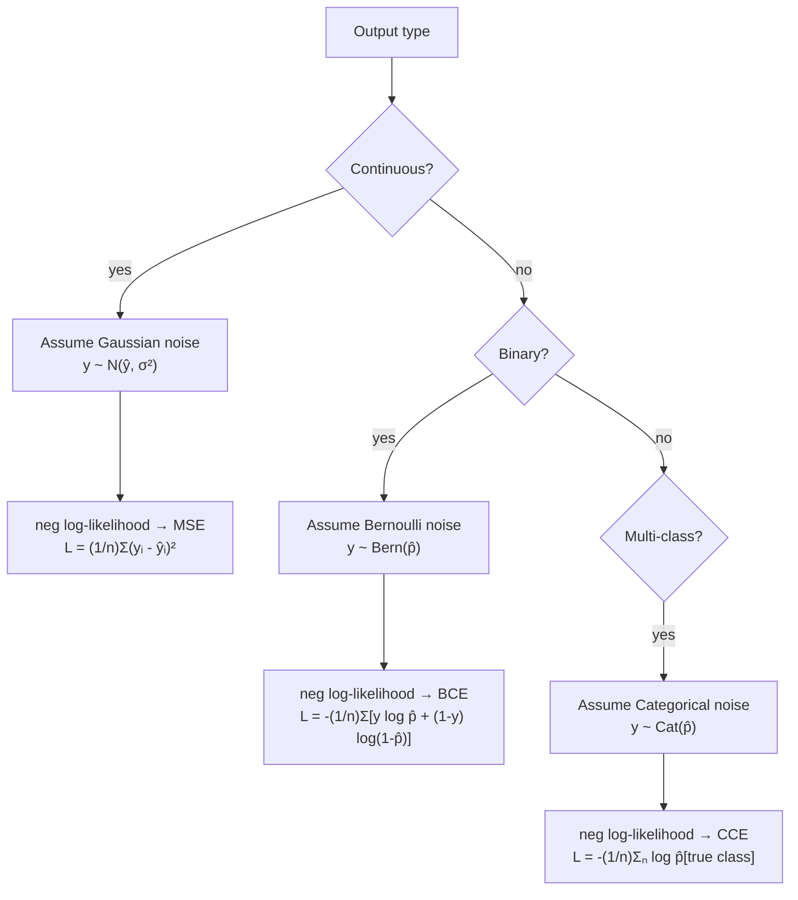
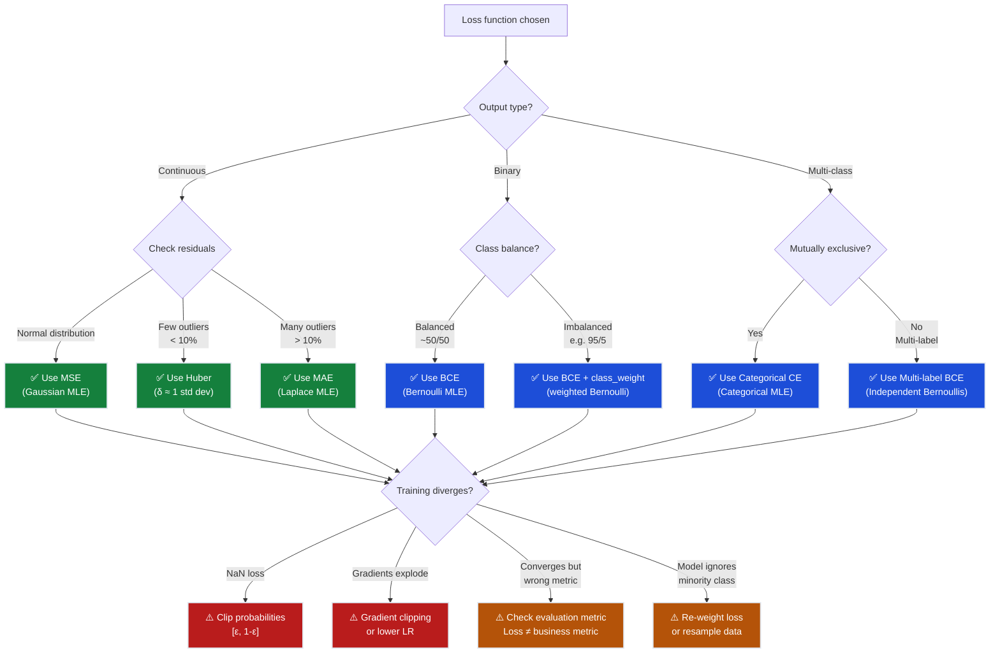
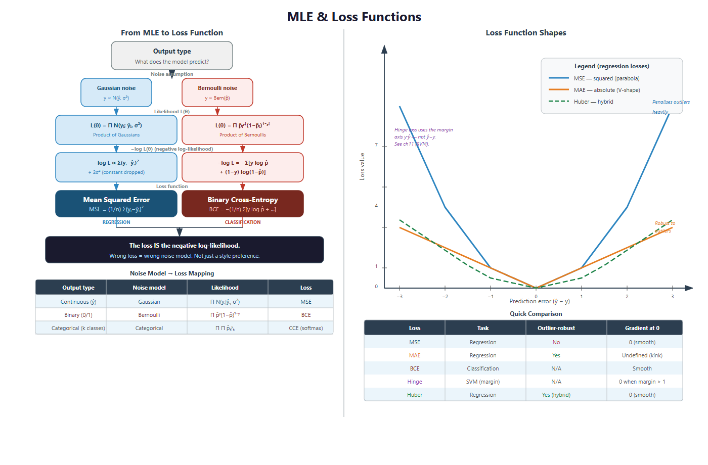

# Ch.7 — MLE & Loss Functions

> **The story.** **Maximum Likelihood Estimation** was given its modern form in two papers by **R. A. Fisher** (1912 and the canonical 1922 "On the Mathematical Foundations of Theoretical Statistics"). Fisher's claim was audacious: there is *one* principled way to estimate parameters from data — pick the parameters that make the observed data most probable. The consequences were enormous. Gauss's 1809 derivation of least squares fell out as a special case (Gaussian noise → MSE). Berkson's 1944 logistic regression fell out as another (Bernoulli noise → binary cross-entropy). Multiclass classification fell out as a third (Categorical noise → categorical cross-entropy). Every loss function in this curriculum — every loss function in PyTorch's `torch.nn` namespace — is, secretly, a negative log-likelihood from Fisher's framework. Once you see this, you stop memorising losses and start *deriving* them.
>
> **Where you are in the curriculum.** Every loss the platform has used — MSE for house-price regression in [Ch.1](../../01_regression/ch01_linear_regression), binary cross-entropy for high-value classification in [Ch.2](../../02_classification/ch01_logistic_regression) — was chosen for a reason deeper than habit. This chapter gives the principled derivation: change the noise model, change the loss. Once you understand this, [Ch.10](../ch10_transformers)'s next-token cross-entropy and the AI track's RLHF reward modelling will feel like the same idea wearing different costumes.
>
> **Notation in this chapter.** $\boldsymbol{\theta}$ — parameter vector (weights and biases of the model); $p(y\mid\mathbf{x};\boldsymbol{\theta})$ — the **conditional model** (probability the model assigns to $y$ given input $\mathbf{x}$); $\mathcal{L}(\boldsymbol{\theta})=\prod_{i=1}^{N}p(y_i\mid\mathbf{x}_i;\boldsymbol{\theta})$ — the **likelihood**; $\log\mathcal{L}$ — the log-likelihood; $-\log\mathcal{L}$ — the **negative log-likelihood (NLL)**, which is what we minimise; $\hat{\boldsymbol{\theta}}_{\text{MLE}}=\arg\max_{\boldsymbol{\theta}}\log\mathcal{L}(\boldsymbol{\theta})$ — the **maximum-likelihood estimate**. Recipes: Gaussian noise → MSE; Bernoulli outputs → BCE; categorical outputs → cross-entropy; Laplace noise → MAE.

---

## 0 · The Challenge — Where We Are

> 🎯 **The mission**: Launch **UnifiedAI** — prove neural networks unify regression and classification, satisfying 5 constraints:
> 1. **ACCURACY**: ≤$28k MAE (regression) + ≥95% accuracy (classification)
> 2. **GENERALIZATION**: Work on unseen districts + future expansion (CA → nationwide)
> 3. **MULTI-TASK**: Same architecture predicts value **and** classifies attributes
> 4. **INTERPRETABILITY**: Predictions explainable to non-technical stakeholders
> 5. **PRODUCTION**: <100ms inference, TensorBoard monitoring, handle missing data

**What we know so far:**
- ✅ [Ch.1–2](../ch01_xor_problem): Built feedforward networks — same hidden layers for regression and classification
- ✅ [Ch.3](../ch03_backprop_optimisers): Backprop + Adam work identically for both tasks
- ✅ [Ch.4](../ch04_regularisation): Dropout, L2, BatchNorm prevent overfitting in both
- ✅ [Ch.5](../ch05_cnns): CNNs extract spatial features for image regression and classification
- ✅ [Ch.6](../ch06_rnns_lstms): RNNs/LSTMs handle sequences for both tasks
- 💡 **But why MSE for regression and cross-entropy for classification?**

**What's blocking us:**
⚠️ **Loss functions chosen by convention, not principled understanding**

Your Lead Engineer asks: "Why MSE for house prices? Why not MAE? Why cross-entropy for classification?"
- **Current state**: Use MSE because "that's what sklearn defaults to"
- **Problem**: No principled framework → can't choose loss for new problems
- **Real scenario**: Product wants **quantile regression** (predict 10th, 50th, 90th percentiles for risk bands) — which loss function?
- **Another scenario**: Model chases luxury mansion outliers ($2M homes) — is MSE the right choice?

**Why this matters for UnifiedAI production:**
- **Loss = modeling assumption**: MSE assumes Gaussian noise, BCE assumes Bernoulli noise
- **Wrong loss = wrong model**: Using MSE for classification → vanishing gradients near correct predictions
- **Custom objectives**: Production needs asymmetric costs (underestimate expensive coastal homes = worse than overestimate inland homes)
- **Unification proof**: MSE and BCE both derive from the **same MLE framework** — different noise models, same principle

**What this chapter unlocks:**
⚡ **Constraint #6 Foundation — Principled loss function selection:**
1. **MLE framework**: Choose parameters that maximize $P(\text{observed data} \mid \text{model})$
2. **Loss derivation**: Negative log-likelihood → derives MSE, MAE, BCE, cross-entropy from first principles
3. **Unification proof**: Same MLE principle → different noise assumptions → task-specific losses
4. **Custom losses**: Change noise assumption → derive new loss for your problem (quantile, robust, asymmetric)

💡 **Outcome**: Understand that MSE and BCE aren't arbitrary conventions — they're **MLE estimators** under different noise models. Can now derive correct loss for any production problem!

---

## Animation



*The needle animation shows: when you align the loss function with the data-generating process (Gaussian → MSE, Bernoulli → BCE), optimization signal quality improves and accuracy increases — without changing model architecture, hyperparameters, or data. The only change: matching loss to likelihood.*

---

## 1 · The Core Idea

**Maximum Likelihood Estimation (MLE):** choose model parameters $\theta$ that maximise the probability of the observed training data:

$$\hat{\theta}_\text{MLE} = \arg\max_\theta \prod_{i=1}^n p(y_i \mid x_i; \theta)$$

Taking the log (which doesn't change the argmax) and flipping the sign gives a **minimisation problem** — the negative log-likelihood — which is precisely the training loss.

| Output type | Noise assumption | Likelihood | Negative log-likelihood (loss) |
|---|---|---|---|
| Continuous (regression) | Gaussian: $y \sim \mathcal{N}(\hat{y}, \sigma^2)$ | Product of Gaussians | **MSE** (mean squared error) |
| Binary (classification) | Bernoulli: $y \sim \text{Bern}(\hat{p})$ | Product of Bernoullis | **Binary cross-entropy** |
| Multi-class | Categorical: $y \sim \text{Cat}(\hat{p})$ | Product of Categoricals | **Categorical cross-entropy** |

The key insight: **the loss function is a modelling choice, not an optimisation trick.** Using MSE for classification and vice versa is a modelling error, not just an implementation mistake.

---

## 2 · Running Example: What We're Solving

We return to both California Housing tasks from Ch.1 and Ch.2:

1. **Regression:** predict `MedHouseVal` → use MSE (derives from Gaussian noise)
2. **Binary classification:** predict `high_value = (MedHouseVal > median)` → use binary cross-entropy (derives from Bernoulli noise)

We derive each loss from first principles, then demonstrate empirically what goes wrong when you use the wrong loss — MSE for classification and cross-entropy for regression.

Dataset: **California Housing** (`sklearn.datasets.fetch_california_housing`)

---

## 3 · The Math

### 3.1 MLE: Setup

We assume each observation is independently generated by the same parametric distribution:

$$\mathcal{L}(\theta) = \prod_{i=1}^n p(y_i \mid x_i; \theta)$$

Taking the log:

$$\ell(\theta) = \sum_{i=1}^n \log p(y_i \mid x_i; \theta)$$

Maximising $\ell$ is equivalent to minimising $-\ell$ (the negative log-likelihood = training loss).

### 3.2 MSE from Gaussian MLE

Assume each target $y_i$ is drawn from a Gaussian centred on the model prediction $\hat{y}_i = f(x_i; \theta)$:

$$p(y_i \mid x_i; \theta) = \frac{1}{\sqrt{2\pi\sigma^2}} \exp \left(-\frac{(y_i - \hat{y}_i)^2}{2\sigma^2}\right)$$

Log-likelihood:

$$\ell(\theta) = \sum_i \left[ -\frac{1}{2}\log(2\pi\sigma^2) - \frac{(y_i - \hat{y}_i)^2}{2\sigma^2} \right]$$

Maximising over $\theta$ (treating $\sigma^2$ as constant):

$$\hat{\theta}_\text{MLE} = \arg\min_\theta \sum_i (y_i - \hat{y}_i)^2 = \arg\min_\theta \text{MSE}(\theta)$$

**Conclusion:** MSE is the natural loss when the target is a real-valued quantity with symmetric noise described by a Gaussian.

#### Numeric Example — 3-Sample Gaussian MLE

Model predictions $\hat{y} = [2.5,\ 3.5,\ 5.5]$, targets $y = [2,\ 4,\ 6]$, assuming $\sigma^2 = 1$.

| $i$ | $y_i$ | $\hat{y}_i$ | $\log p(y_i) = -\tfrac{1}{2}\log(2\pi) - \tfrac{(y_i-\hat{y}_i)^2}{2}$ |
|-----|--------|-------------|-----------------------------------------------------------------------|
| 1 | 2 | 2.5 | $-0.919 - 0.125 = -1.044$ |
| 2 | 4 | 3.5 | $-0.919 - 0.125 = -1.044$ |
| 3 | 6 | 5.5 | $-0.919 - 0.125 = -1.044$ |

$$\ell(\theta) = \sum_i \log p(y_i) = -3.132, \quad \text{MSE} = \frac{0.25+0.25+0.25}{3} = 0.25$$

Maximising $\ell$ (pushing $\ell$ toward 0) is identical to minimising MSE. The Gaussian constant $-\tfrac{1}{2}\log(2\pi)$ doesn't depend on $\theta$ — it vanishes when we differentiate.

> 💡 **Connection to [Ch.1](../../01_regression/ch01_linear_regression)**: The Gaussian assumption means MSE heavily penalizes outliers (quadratic penalty). For concrete examples showing when MSE chases outliers vs when MAE or Huber loss work better, see the "Loss Function Evolution" section in Ch.1 — it walks through District A/B/C scenarios with real dollar values showing what each loss captures and misses.

### 3.3 Binary Cross-Entropy from Bernoulli MLE

Assume each target $y_i \in \{0, 1\}$ is drawn from a Bernoulli distribution with probability $\hat{p}_i = \sigma(f(x_i; \theta))$ (sigmoid output):

$$p(y_i \mid x_i; \theta) = \hat{p}_i^{y_i} (1 - \hat{p}_i)^{1-y_i}$$

Log-likelihood:

$$\ell(\theta) = \sum_i \left[ y_i \log \hat{p}_i + (1 - y_i) \log(1 - \hat{p}_i) \right]$$

Negating gives **binary cross-entropy**:

$$\mathcal{L}_\text{BCE} = -\frac{1}{n}\sum_i \left[ y_i \log \hat{p}_i + (1 - y_i) \log(1 - \hat{p}_i) \right]$$

### 3.4 Categorical Cross-Entropy from Categorical MLE

For $C$-class classification, the model outputs a probability vector $\hat{\mathbf{p}}_i \in \mathbb{R}^C$ (softmax). Target $y_i$ is a one-hot vector. The categorical likelihood is:

$$p(y_i \mid x_i; \theta) = \prod_{c=1}^C \hat{p}_{i,c}^{ y_{i,c}}$$

Negative log-likelihood:

$$\mathcal{L}_\text{CCE} = -\frac{1}{n}\sum_i \sum_c y_{i,c} \log \hat{p}_{i,c}$$

For a single true class $c^*$: $\mathcal{L}_\text{CCE} = -\frac{1}{n}\sum_i \log \hat{p}_{i,c^*}$ (only the probability of the true class matters).

### 3.5 Why MSE for Classification is Wrong

At $\hat{p} = 0.99$ (correctly predicting the positive class), the Bernoulli log-likelihood gradient is:

$$\frac{\partial}{\partial \hat{p}} \left[-y \log \hat{p}\right] = -\frac{y}{\hat{p}} \approx -\frac{1}{0.99} \approx -1.01 \quad \text{(meaningful gradient)}$$

With MSE loss $(\hat{p} - y)^2 = (0.99 - 1)^2 = 0.0001$ — a nearly vanishing gradient. Near-correct predictions receive essentially zero training signal, so learning is very slow near the decision boundary.

---

## 4 · How It Works — Step by Step

```
Deriving the correct loss:
1. What is the output type? (continuous → Gaussian → MSE; binary → Bernoulli → BCE)
2. Write the likelihood of the data under that noise model
3. Take the log, negate, divide by n → this is your loss function
4. The gradient of the loss w.r.t. model outputs is your training signal

Choosing empirically:
1. Train regressor on housing prices: try MSE vs MAE vs Huber
2. Compare validation RMSE for each loss
3. Train classifier on high_value: try BCE vs MSE (wrong choice)
4. Compare validation AUC — MSE for classification will converge slower
 and produce uncalibrated probabilities
```

---

## 5 · The Key Diagrams

### Derivation chain



### Loss landscape: MSE vs cross-entropy for binary prediction

```
P(y=1|x) MSE loss BCE loss
──────────── ────────────────── ──────────────────
0.01 (y=1) (0.01-1)² = 0.98 -log(0.01) = 4.61 ← large gradient, fast learning
0.50 (y=1) (0.50-1)² = 0.25 -log(0.50) = 0.69
0.99 (y=1) (0.99-1)² = 0.0001 -log(0.99) = 0.01 ← near-zero MSE gradient

MSE gradient near correct prediction ≈ 0 → slow learning
BCE gradient near correct prediction: -1/0.99 ≈ -1.01 → strong signal preserved
```

---

## 6 · The Hyperparameter Dial

Loss functions have no tuning parameters in the conventional sense, but there are related choices:

| Choice | Options | Impact |
|---|---|---|
| **Regression loss variant** | MSE, MAE, Huber (δ), Log-cosh | MSE: penalises outliers quadratically; MAE: robust to outliers; Huber: MSE for small errors, MAE-like for large errors; controlled by δ (see [Ch.1](../../01_regression/ch01_linear_regression) for concrete $\delta = \$30k$ example) |
| **Imbalanced classification** | BCE with `class_weight`, focal loss | Downweights easy negatives; BCE `pos_weight` in PyTorch or `class_weight='balanced'` in sklearn |
| **Label smoothing** | `label_smoothing` in Keras/PyTorch | Replaces hard 0/1 labels with (ε/C, 1−ε+ε/C) — improves calibration and generalisation |

---

## 7 · Code Skeleton

```python
import numpy as np
from sklearn.datasets import fetch_california_housing

housing = fetch_california_housing()
X, y_reg = housing.data, housing.target

# Binary classification target
threshold = np.median(y_reg)
y_clf = (y_reg > threshold).astype(int)

from sklearn.model_selection import train_test_split
X_tr, X_te, yr_tr, yr_te = train_test_split(X, y_reg, test_size=0.2, random_state=42)
_, _, yc_tr, yc_te = train_test_split(X, y_clf, test_size=0.2, random_state=42)
```

```python
# ── MSE from scratch ──────────────────────────────────────────────────────────
def mse(y_true, y_pred):
 return np.mean((y_true - y_pred) ** 2)

def mse_gradient(y_true, y_pred):
 return 2 * (y_pred - y_true) / len(y_true)

# ── BCE from scratch ──────────────────────────────────────────────────────────
def bce(y_true, p_pred, eps=1e-12):
 p = np.clip(p_pred, eps, 1 - eps) # numerical stability
 return -np.mean(y_true * np.log(p) + (1 - y_true) * np.log(1 - p))

def bce_gradient(y_true, p_pred, eps=1e-12):
 p = np.clip(p_pred, eps, 1 - eps)
 return (p - y_true) / (p * (1 - p) * len(y_true))
```

```python
# ── Huber loss (robust regression) ───────────────────────────────────────────
def huber(y_true, y_pred, delta=1.0):
 residual = np.abs(y_true - y_pred)
 return np.where(residual <= delta,
 0.5 * residual ** 2,
 delta * (residual - 0.5 * delta)).mean()
```

---

## 8 · What Can Go Wrong

**Pattern:** Loss function mismatches create slow convergence, uncalibrated probabilities, or NaN gradients. Every issue below traces to choosing a loss that doesn't match the data-generating process.

### Using the Wrong Loss for the Wrong Task

- **Using MSE for binary classification.** MSE treats the output as a real number, not a probability. Gradients are nearly zero for confident (correct) predictions and large only for large-residual wrong predictions. This means correct predictions don't reinforce and wrong predictions can oscillate. The model also fails to output calibrated probabilities. **Fix:** Use **Binary Cross-Entropy (BCE)** for binary classification — it's derived from the Bernoulli MLE (§3.3) and provides strong gradients even when predictions are nearly correct.

- **Using cross-entropy for regression.** Cross-entropy assumes outputs are probabilities summing to 1. For a real-valued target like house price, the concept doesn't apply. If you try to `log(y_pred)` on a negative or zero residual, you get a NaN. **Fix:** Use **MSE** (Gaussian noise), **MAE** (Laplace noise), or **Huber loss** (mixed) for regression. See [Ch.1 §3](../../01_regression/ch01_linear_regression/README.md#loss-function-evolution--what-each-captures-and-misses) for a decision tree on choosing regression losses.

- **Ignoring data characteristics when choosing regression loss.** MSE assumes Gaussian (normal) noise, which means it heavily penalizes outliers. If your data has heavy-tailed distributions or legitimate extreme values (luxury mansions in housing data), MSE will chase outliers and ignore the majority. **Fix:** Inspect residual plots. If outliers are present, use **MAE** (many outliers) or **Huber** (few outliers). If normally distributed, MSE is optimal. **See:** [Ch.1 Decision Tree](../../01_regression/ch01_linear_regression/README.md#decision-tree-which-loss-function-should-i-use) for choosing the right regression loss based on outlier presence, interpretability needs, and feature count.

### Classification-Specific Issues

- **Ignoring class imbalance in BCE.** With 95% negative examples, a model that always predicts 0 achieves near-zero BCE. Use `class_weight='balanced'` or `pos_weight` to scale the positive-class loss term. **Explanation:** BCE loss for a batch is averaged across all samples. If 95 samples are negative (easy to predict), their small losses dominate the 5 positive samples (harder to predict). Re-weighting ensures the model optimizes for the minority class.

- **Not clipping probabilities before computing BCE.** `log(0) = -∞`. Always clip predicted probabilities to `[ε, 1-ε]` (where ε ≈ 1e-12) before passing through the loss. sklearn's `LogisticRegression` handles this internally but manual implementations do not. **Example:** If model predicts $\hat{p} = 0.0$ for a positive class ($y=1$), BCE = $-\log(0) = \infty$ → NaN gradient → training fails. Clipping: $\hat{p} = \max(10^{-12}, \min(0.99999, \hat{p}))$.

- **Confusing training loss with evaluation metric.** Do not use MSE as both training loss and evaluation metric for classification. Training loss should be BCE; evaluation should be AUC, F1, or accuracy depending on your objective. **Why:** Loss functions are designed for optimization (smooth gradients, convex if possible). Evaluation metrics are designed for business decisions (accuracy, precision, recall). They serve different purposes.

### Practical Decision Summary

| Your task | Data characteristics | Use this loss | Reasoning |
|---|---|---|---|
| **Regression** | Normal distribution, no outliers | **MSE** | Gaussian MLE (§3.2); standard default |
| **Regression** | Few outliers (<10%) | **Huber** ($\delta \approx$ 1 std dev) | MSE for normal errors, MAE for outliers |
| **Regression** | Many outliers (>10%) | **MAE** | Laplace MLE; fully robust to extremes |
| **Binary classification** | Balanced classes | **Binary Cross-Entropy** | Bernoulli MLE (§3.3) |
| **Binary classification** | Imbalanced (e.g., 95% negative) | **BCE + class weighting** | Re-weight positive class to balance loss contributions |
| **Multi-class** | Mutually exclusive classes | **Categorical Cross-Entropy** | Categorical MLE (§3.4) |

> 💡 **For regression loss selection:** See [Regression Ch.1 §3 "Loss Function Evolution"](../../01_regression/ch01_linear_regression/README.md#loss-function-evolution--what-each-captures-and-misses) for concrete California Housing examples showing numerical impact of outliers on MSE vs MAE vs Huber, plus a decision tree for choosing the right loss based on your data.

---

## Diagnostic Flowchart



---

## Illustrations



---

## 9 · Where This Reappears

The MLE framework and loss-function derivations established here propagate through the entire curriculum:

**Within this track:**
- **[Ch.8 — TensorBoard](../ch08_tensorboard)**: Monitor loss curves for MSE (regression) and BCE (classification) side-by-side — same dashboard, different log-likelihood targets
- **[Ch.10 — Transformers](../ch10_transformers)**: Next-token prediction uses categorical cross-entropy (MLE under categorical distribution) — same principle, language modeling context

**Across ML tracks:**
- **[Classification Ch.1 — Logistic Regression](../../02_classification/ch01_logistic_regression)**: Binary cross-entropy first appears here — this chapter shows *why* it's the right choice
- **[Regression Ch.1 — Linear Regression](../../01_regression/ch01_linear_regression)**: MSE, MAE, Huber introduced empirically — this chapter gives the probabilistic foundation
- **[Ensemble Methods Ch.2 — XGBoost](../../08_ensemble_methods/ch02_gradient_boosting)**: XGBoost's objective function is the negative log-likelihood (reg:squarederror = MSE, binary:logistic = BCE)

**In AI topics:**
- **[AI — LLM Fundamentals](../../../ai/llm_fundamentals)**: Language model pre-training minimizes cross-entropy over token sequences — scaled-up version of this chapter's categorical MLE
- **[AI — Fine-Tuning](../../../ai/fine_tuning)**: Custom loss functions for RLHF (Reinforcement Learning from Human Feedback) derive from MLE with policy distributions

**In production contexts:**
- **[AI Infrastructure — Inference Optimization](../../../ai_infrastructure/inference_optimization)**: Loss choice affects numerical precision requirements (FP16 clipping in BCE vs MSE overflow)
- Production model monitoring: Log-likelihood degradation signals distribution shift (production data deviates from training noise model)

---

## 10 · Progress Check — What We Can Solve Now


✅ **Unlocked capabilities:**
- **Principled loss selection**: Can derive the correct loss function for any problem from first principles (MLE)
- **Unification understanding**: MSE (regression) and BCE (classification) are both negative log-likelihoods under different noise models
- **Custom loss derivation**: Given a new noise model (Laplace, Cauchy, Student-t), can derive the corresponding loss
- **Diagnostic reasoning**: When training fails, can trace back to likelihood assumptions (e.g., MSE for classification → wrong noise model)
- **Task-agnostic framework**: Same MLE principle applies to regression, classification, ranking, density estimation

❌ **Still can't solve:**
- ❌ **Can't monitor training beyond scalar loss** — need rich diagnostics (loss curves, weight histograms, gradient flow)
- ❌ **Can't see *why* loss decreases** — is the model learning features or memorizing? Need TensorBoard
- ❌ **Can't visualize learned representations** — embeddings, attention weights, activation patterns all hidden
- ❌ **Can't debug convergence issues** — vanishing/exploding gradients, dead neurons, saturation all invisible

**Progress toward UnifiedAI constraints:**

| Constraint | Status | Current State |
|------------|--------|---------------|
| **#1 ACCURACY** | 🟡 In progress | Network architecture + backprop + regularization proven task-agnostic; MLE shows losses are task-agnostic too |
| **#2 GENERALIZATION** | ✅ Ch.4 solved | Dropout, L2, BatchNorm prevent overfitting |
| **#3 MULTI-TASK** | 🟡 Theory proven | Same architecture + different output head + MLE-derived loss = unified pipeline |
| **#4 INTERPRETABILITY** | ⬜ Not started | Attention mechanisms (Ch.9–10) will provide feature attribution |
| **#5 PRODUCTION** | 🟡 Partial | Loss theory complete; monitoring tooling (TensorBoard) next |

**Real-world status**: You can now justify loss function choices to stakeholders with probabilistic reasoning. When product asks "Why not just use accuracy as the loss?", you can explain that accuracy is non-differentiable (gradient = 0 everywhere) and doesn't provide an optimization signal — BCE is the smooth, differentiable surrogate derived from Bernoulli MLE.

**What's next**: [Ch.8 — TensorBoard](../ch08_tensorboard) instruments the training loop. You'll log scalars (loss, metrics), histograms (weights, gradients), and embeddings (projector). This makes training observable — see weight distributions, diagnose vanishing gradients, and visualize what the model learns epoch-by-epoch.

```mermaid
flowchart LR
    CH1["Ch.1 XOR<br/>Linear fails"] --> CH2["Ch.2 Neural Nets<br/>Same arch, diff tasks"]
    CH2 --> CH3["Ch.3 Backprop<br/>Same training"]
    CH3 --> CH4["Ch.4 Regularization<br/>Same techniques"]
    CH4 --> CH5["Ch.5 CNNs<br/>Spatial features"]
    CH5 --> CH6["Ch.6 RNNs/LSTMs<br/>Sequential features"]
    CH6 --> CH7["✅ Ch.7 MLE & Loss<br/>Same principle<br/>Different noise models"]
    CH7 --> CH8["⬜ Ch.8 TensorBoard<br/>Monitor everything<br/><100ms latency"]
    CH8 --> CH9["⬜ Ch.9 Attention<br/>Q/K/V mechanics"]
    CH9 --> CH10["⬜ Ch.10 Transformers<br/>≤$28k + ≥95%<br/>UnifiedAI complete"]
    
    style CH1 fill:#15803d,stroke:#e2e8f0,stroke-width:2px,color:#ffffff
    style CH2 fill:#15803d,stroke:#e2e8f0,stroke-width:2px,color:#ffffff
    style CH3 fill:#15803d,stroke:#e2e8f0,stroke-width:2px,color:#ffffff
    style CH4 fill:#15803d,stroke:#e2e8f0,stroke-width:2px,color:#ffffff
    style CH5 fill:#15803d,stroke:#e2e8f0,stroke-width:2px,color:#ffffff
    style CH6 fill:#15803d,stroke:#e2e8f0,stroke-width:2px,color:#ffffff
    style CH7 fill:#1d4ed8,stroke:#e2e8f0,stroke-width:3px,color:#ffffff
    style CH8 fill:#b45309,stroke:#e2e8f0,stroke-width:2px,color:#ffffff
    style CH9 fill:#6b7280,stroke:#e2e8f0,stroke-width:2px,color:#ffffff
    style CH10 fill:#6b7280,stroke:#e2e8f0,stroke-width:2px,color:#ffffff
```



---

## 11 · Bridge to the Next Chapter

Ch.7 proved that training losses have mathematical meaning — they're negative log-likelihoods under specific noise models. MSE assumes Gaussian errors, BCE assumes Bernoulli outputs, and both derive from the same MLE principle. But watching a single scalar loss decrease epoch-by-epoch is a crude signal — you can't see weight distributions, gradient flow, or learned representations.

**Next up:** [Ch.8 — TensorBoard](../ch08_tensorboard) instruments the training loop with rich diagnostics. You'll log scalars (loss/metric curves), histograms (weight and gradient distributions), and embeddings (high-dimensional projector). These tools make training **observable** — diagnose vanishing gradients, track layer saturation, and visualize what features the model learns. Same TensorBoard dashboard for regression and classification, proving the unification thesis one more time.
