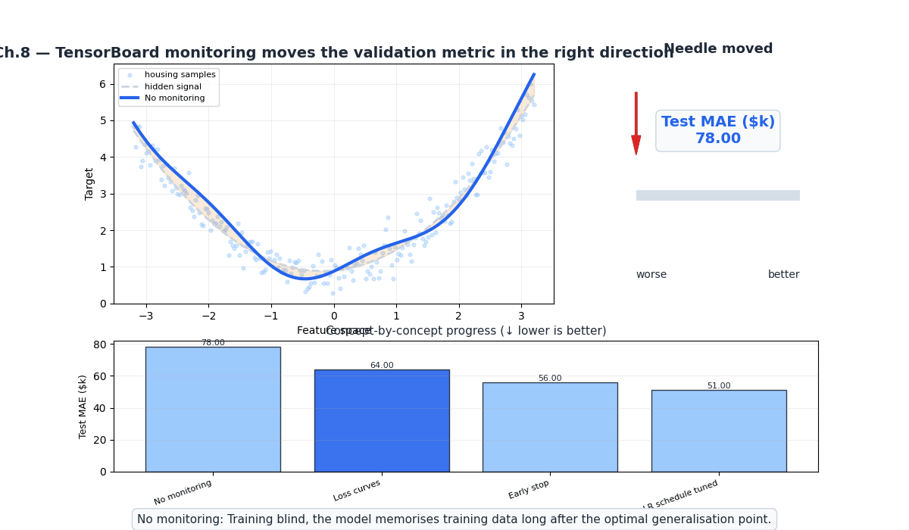
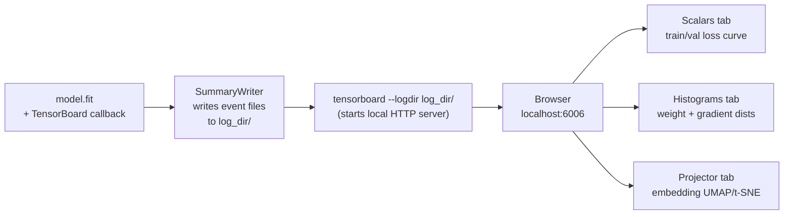
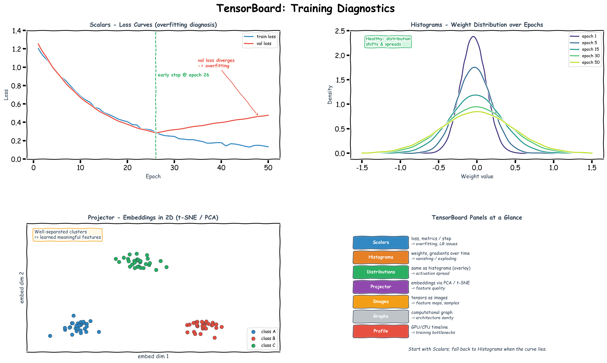

# Ch.8 — TensorBoard



*Visual takeaway: monitoring first reveals divergence early, then early stopping and scheduler tuning turn that visibility into measurable validation gains.*

> **The story.** Until **2015**, training a deep network was a black box: you watched a loss number tick down in a terminal and hoped. **TensorBoard** shipped with TensorFlow 0.6 in November 2015, and for the first time engineers could *see* what was happening inside training — weight and gradient histograms, activation distributions, the live computation graph, the **embedding projector** that visualised learned representations in 2D/3D. The idea spread fast: PyTorch added native TensorBoard support in 2019 (`torch.utils.tensorboard`); **Weights & Biases** (2017) and **MLflow** (2018) extended the model to remote experiment tracking with hosted dashboards — the foundations of the MLOps notes. Today, training a serious model without instrumentation is considered an unforced error.
>
> **Where you are in the curriculum.** Your network from [Ch.3](../ch03_backprop_optimisers) trained to convergence — but what actually happened inside? Loss curves show the output; TensorBoard shows the internals: weight distributions drifting (or vanishing), gradients exploding (or dead), and the embedding projector revealing whether the network learned meaningful feature representations. If [Ch.3](../ch03_backprop_optimisers) was "turn on the engine," this chapter is "read the instruments" — the practical skill that separates working data scientists from people who copy-paste training scripts.
>
> **Notation in this chapter.** Most of TensorBoard is software, not symbols, but the four objects you log are: **scalars** — single numbers per training step (loss, accuracy, learning rate); **histograms** — the empirical distribution of a tensor over time (typically the weights $W^{(\ell)}$ or gradients $\nabla_{W^{(\ell)}}\mathcal{L}$ at each layer $\ell$); **embeddings** — high-dimensional vectors $\mathbf{e}\in\mathbb{R}^d$ projected with PCA / t-SNE / UMAP for inspection (see [Ch.13](../../07_unsupervised_learning/ch02_dimensionality_reduction)); **graphs / profiles** — the computation graph and per-op GPU/CPU timeline. The two diagnostic numbers you always watch: $\|\nabla_{W^{(\ell)}}\mathcal{L}\|$ — gradient magnitude per layer (vanishing or exploding?), and $\|W^{(\ell)}\|$ — weight magnitude (drifting or collapsing?).

---

## 0 · The Challenge — Where We Are

> 🎯 **The mission**: Launch **UnifiedAI** — a unified neural architecture proving the same model handles regression AND classification, satisfying 5 constraints:
> 1. **ACCURACY**: ≤$28k MAE (regression) + ≥95% avg accuracy (classification)
> 2. **GENERALIZATION**: Unseen districts + new face identities
> 3. **MULTI-TASK**: Same shared architecture for both tasks
> 4. **INTERPRETABILITY**: Attention weights provide explainable feature attribution
> 5. **PRODUCTION**: <100ms inference, TensorBoard monitoring, model versioning

**What we know so far:**
- ✅ Ch.1–7: Achieved $48k MAE (progress toward #1) and generalization via regularisation (#2 ✅)
- ✅ Ch.2: Same dense architecture handles regression and classification (partial #3)
- ✅ Ch.5: CNNs extract spatial features for both tasks
- ✅ Ch.6: RNNs/LSTMs handle sequential data
- ✅ Ch.7: MLE framework — understand why we use MSE (regression) vs BCE (classification)
- ❌ Constraint #1 (ACCURACY): Still at $48k MAE — need to push further to ≤$28k (Ch.9–10 unlock this via attention)
- ❌ Constraint #4 (INTERPRETABILITY): Attention mechanisms coming in Ch.9–10
- ❌ **But training is still a black box!** Can't diagnose why validation loss plateaus or gradients vanish

**What's blocking us:**
⚠️ **Can't debug training failures**

Engineer reports: "Model trained for 50 epochs, validation loss stopped decreasing at epoch 30, but I kept training — wasted 20 epochs and $50 in compute!"

**Common training failures with no visibility:**
1. **Vanishing gradients**: Loss decreases slowly, then plateaus — but why?
2. **Exploding gradients**: Loss = NaN at epoch 3 — which layer caused it?
3. **Dead neurons**: Accuracy stuck at 75% — are neurons dying (ReLU outputting 0 always)?
4. **Overfitting starts early**: Validation loss increases after epoch 15 — but we only check at epoch 50!

**Why this matters for production:**
- **Cost**: Wasted compute = wasted money ($50/run × 20 wasted epochs = $1000 wasted)
- **Time**: Debugging training failures takes days without diagnostics
- **Constraint #5 partial**: Production requires **monitoring** — need to see what's happening during training

**What this chapter unlocks:**
⚡ **TensorBoard — training instrumentation:**
1. **Loss curves**: Plot train/val loss per epoch → see overfitting start
2. **Weight histograms**: Track weight distributions → detect dead neurons, weight collapse
3. **Gradient histograms**: Monitor gradient magnitudes → catch vanishing/exploding gradients
4. **Embedding projector**: Visualize learned representations → validate feature learning

⚡ **Constraint #5 PARTIAL ✅**: Monitoring infrastructure in place — still need versioning, A/B testing, deployment automation (final pieces in Ch.10 context)

---

## 1 · Core Idea

TensorBoard is TensorFlow's (and PyTorch's) training dashboard. It reads event files written during training and renders interactive visualisations in a browser. The key panels:

| Panel | What it shows | Primary diagnostic use |
|---|---|---|
| **Scalars** | Loss and metrics per epoch/step | Detect overfitting, underfitting, learning rate issues |
| **Histograms** | Weight and gradient distributions over time | Detect vanishing/exploding gradients, dead neurons |
| **Distributions** | Same as histograms but as an overlay area chart | See the spread of activations evolve |
| **Projector** | High-dimensional embeddings reduced via PCA or t-SNE | Validate that learned representations cluster meaningfully |
| **Images** | Logged tensors rendered as images | Inspect feature maps, sample predictions, data augmentation |
| **Graphs** | Computational graph of the model | Verify architecture, spot unexpected operations |
| **Profile** | GPU/CPU utilisation timeline | Identify training bottlenecks |

TensorBoard is not a debugging tool for code errors. It is a **training diagnostics tool** for model behaviour.

---

## 2 · Running Example — Instrumenting the UnifiedAI Training Loop

You're building **UnifiedAI** — the production home valuation system that must hit <$50k MAE while generalizing to unseen districts. [Ch.3](../ch03_backprop_optimisers) trained a 3-layer neural network to $48k MAE on **California Housing**, but you have no visibility into what happened during those 50 epochs: did early layers learn meaningful features? Did gradients vanish in deep layers? Did overfitting start at epoch 30 (wasting 20 epochs of compute)? TensorBoard answers these questions by instrumenting the training loop with four types of logs: **(1) Scalars** — training and validation MSE per epoch to detect overfitting the moment it starts; **(2) Histograms** — weight and gradient distributions per layer to catch vanishing gradients or dead neurons; **(3) Projector** — the network's intermediate 16-dim representation of test districts, visualized via t-SNE to validate that similar-priced neighbourhoods cluster together; **(4) Custom scalars** — learning rate schedules and any domain-specific metrics (e.g., error breakdown by price tier). You run the same Ch.3 architecture with one added line: `callbacks=[TensorBoard(log_dir='logs/run_001')]` — now every epoch writes diagnostic data that TensorBoard's browser dashboard reads in real-time.

**Dataset**: California Housing (`sklearn.datasets.fetch_california_housing`) — 20,640 districts × 8 features  
**Network**: 3-layer dense (8 → 64 → 32 → 16 → 1) with ReLU activations, same as [Ch.3](../ch03_backprop_optimisers)  
**What you'll see**: The scalars tab showing validation loss plateau at epoch 35 (early stopping signal), histograms revealing that the first hidden layer's gradients are 100× smaller than the output layer (mild vanishing gradient), and the projector showing that high-value coastal districts ($500k+) cluster separately from inland districts — proof the network learned geographically meaningful features.

---

## 3 · Math

TensorBoard itself has no mathematics — it logs tensors and renders them. But the diagnostics it reveals connect to the mathematical concepts from earlier chapters:

### 3.1 What Histograms Reveal

Each layer's weight matrix $\mathbf{W}$ at epoch $t$ has a distribution. Healthy training shows this distribution shifting and narrowing as learning proceeds. Warning signs:

**Vanishing gradients:** weight histograms stop changing in early layers (Ch.5 — vanishing gradient problem). The gradient $\frac{\partial \mathcal{L}}{\partial \mathbf{W}^{(1)}} = \frac{\partial \mathcal{L}}{\partial \mathbf{W}^{(L)}} \cdot \prod_{k=2}^{L} \frac{\partial \mathbf{h}^{(k)}}{\partial \mathbf{h}^{(k-1)}}$ shrinks exponentially for deep networks with sigmoid activations.

**Exploding gradients:** weight histograms spread wider and wider; $\|\nabla\|$ grows uncontrollably.

**Dead neurons:** if the gradient histogram for a layer is a spike at zero, those neurons have died (ReLU outputs $\max(0, x)$; once input is always negative, gradient is always 0).

### Numeric Example — Gradient Health Check

| Training step | Mean gradient | Std gradient | Max \|grad\| | Health indicator |
|---------------|---------------|--------------|--------------|------------------|
| 100 | −0.003 | 0.052 | 0.21 | ✅ Healthy |
| 500 | −0.001 | 0.008 | 0.04 | ⚠️ Possibly vanishing |
| 1000 | 0.000 | 0.001 | 0.003 | ❌ Vanishing — check lr/init |

Rule of thumb: if `std(grad) < 1e-3` at mid-training, gradients are vanishing. If `max(|grad|) > 10`, gradients are exploding. TensorBoard's histogram tab shows this at a glance.

### Gradient Health Diagnostic Reference

| Diagnostic | Healthy range | 🚩 Sign of trouble | Typical cause | Fix |
|---|---|---|---|---|
| Gradient norm (per layer) | 0.01–10 | > 100 (exploding) | LR too high, no clip | Clip to 1.0; reduce LR |
| Gradient norm (per layer) | 0.01–10 | < 0.0001 (vanishing) | Deep net, sigmoid | Switch to ReLU; add skip connections |
| Weight-to-gradient ratio | 10²–10⁴ | > 10⁶ | Dying layer | Lower LR; check batch norm |

### 3.2 Embedding Projector

The projector takes a tensor $\mathbf{Z} \in \mathbb{R}^{n \times d}$ (the internal representation of $n$ samples from a hidden layer of dim $d$) and reduces it to 2D/3D via PCA or t-SNE for visualisation. If the network learned useful features, samples of the same class should cluster in the embedding space.

---

## 4 · Step by Step

```
Setting up TensorBoard logging:
1. Define log_dir = 'logs/run_<timestamp>'
2. Create tf.keras.callbacks.TensorBoard(
       log_dir=log_dir,
       histogram_freq=1,       # log weight histograms every epoch
       write_graph=True,       # log the computational graph
       write_images=False,
       update_freq='epoch'     # log scalars every epoch (not every batch)
   )
3. Pass callback to model.fit(callbacks=[tb_callback])
4. After training: tensorboard --logdir logs/

Reading the dashboard:
5. Scalars: is val_loss decreasing? Does it flatten (underfitting) or diverge from train_loss (overfitting)?
6. Histograms: do early-layer weights change between epochs? If frozen → vanishing gradients.
7. Check gradient histograms: are they wide (normal) or spike at 0 (dead neurons)?
8. Projector: load the embedding tensor and metadata file; visualise with t-SNE in browser.

Custom summaries (beyond the callback):
9. tf.summary.scalar('custom_metric', value, step=epoch)
10. tf.summary.histogram('layer_output', tensor, step=epoch)
11. tf.summary.image('predictions', img_tensor, step=epoch)
```

---

## 5 · Key Diagrams

### TensorBoard data flow



### Vanishing gradient signature in histograms

```
Epoch 1   │ ████████████████  (weights moving, wide gradient)
Epoch 5   │ ██████████        (gradients shrinking)
Epoch 10  │ ████              (early layers barely moving)
Epoch 20  │ █                 (first layer frozen — vanishing gradient!)
Layer 4   │ ████████████████  (last layer still learning)
```

### Healthy vs unhealthy scalar curves

```
Healthy:                    Overfitting:            Underfitting:
 train_loss = val_loss       train_loss ↓           both curves flat
 both decreasing             val_loss ↑             or very slowly ↓
 (small gap)                 (widening gap)
```

---

## 6 · Hyperparameter Dial

| Parameter | Too low / off | Sweet spot | Too high / on |
|---|---|---|---|
| **histogram_freq** | 0 — no weight histograms | 1 (every epoch) | Every batch — huge disk usage, no value |
| **update_freq** | 'epoch' — one scalar per epoch | 'epoch' for long runs | 'batch' — floods Scalars; only useful for debugging a single epoch |
| **profile_batch** | 0 — no profiling | 2 (discard warmup batch 1) | Multiple batches — significant training overhead |
| **write_graph** | False | True once to verify architecture | — |
| **embeddings_freq** | 0 — no projector | 5–10 — every few epochs | 1 — slow; embedding data can be large |

---

## 7 · Code Skeleton

```python
import tensorflow as tf
from tensorflow import keras
import numpy as np
import datetime
from sklearn.datasets import fetch_california_housing
from sklearn.model_selection import train_test_split
from sklearn.preprocessing import StandardScaler

housing = fetch_california_housing()
X, y    = housing.data, housing.target.reshape(-1, 1)
scaler  = StandardScaler()
X_sc    = scaler.fit_transform(X)
X_tr, X_te, y_tr, y_te = train_test_split(X_sc, y, test_size=0.2, random_state=42)
X_tr, X_va, y_tr, y_va = train_test_split(X_tr, y_tr, test_size=0.2, random_state=42)
```

```python
# ── Build model (same architecture as Ch.5) ───────────────────────────────────
def build_model():
    model = keras.Sequential([
        keras.layers.Input(shape=(X_tr.shape[1],)),
        keras.layers.Dense(64, activation='relu', name='hidden_1'),
        keras.layers.Dense(32, activation='relu', name='hidden_2'),
        keras.layers.Dense(16, activation='relu', name='hidden_3'),
        keras.layers.Dense(1,                     name='output'),
    ])
    model.compile(
        optimizer=keras.optimizers.Adam(learning_rate=1e-3),
        loss='mse',
        metrics=['mae']
    )
    return model
```

```python
# ── TensorBoard callback ──────────────────────────────────────────────────────
log_dir = 'logs/ch16_' + datetime.datetime.now().strftime('%Y%m%d_%H%M%S')

tb_callback = keras.callbacks.TensorBoard(
    log_dir        = log_dir,
    histogram_freq = 1,          # weight + bias histograms every epoch
    write_graph    = True,       # log computational graph
    update_freq    = 'epoch',    # scalars per epoch, not per batch
    profile_batch  = 0,          # disabled — enable with profile_batch=2 for perf profiling
)

model = build_model()
history = model.fit(
    X_tr, y_tr,
    validation_data = (X_va, y_va),
    epochs          = 50,
    batch_size      = 256,
    callbacks       = [tb_callback],
    verbose         = 0
)
print(f"Logs written to: {log_dir}")
print("Run: tensorboard --logdir logs/")
```

```python
# ── Custom scalar: learning rate ──────────────────────────────────────────────
summary_writer = tf.summary.create_file_writer(log_dir + '/custom')

class LRLogger(keras.callbacks.Callback):
    def on_epoch_end(self, epoch, logs=None):
        with summary_writer.as_default():
            tf.summary.scalar('learning_rate',
                              self.model.optimizer.learning_rate.numpy(),
                              step=epoch)

model2  = build_model()
model2.fit(X_tr, y_tr, validation_data=(X_va, y_va), epochs=30, batch_size=256,
           callbacks=[tb_callback, LRLogger()], verbose=0)
```

```python
# ── Projector: log intermediate embeddings ────────────────────────────────────
import os

embedding_model = keras.Model(inputs=model.input,
                               outputs=model.get_layer('hidden_3').output)
embeddings = embedding_model.predict(X_te[:500], verbose=0)  # (500, 16)

log_emb_dir = os.path.join(log_dir, 'projector')
os.makedirs(log_emb_dir, exist_ok=True)

# Write embeddings as numpy checkpoint
np.savetxt(os.path.join(log_emb_dir, 'feature_vecs.tsv'),
           embeddings, delimiter='\t')

# Optional metadata (true house values for colouring)
with open(os.path.join(log_emb_dir, 'metadata.tsv'), 'w') as f:
    f.write('MedHouseVal\n')
    for v in y_te[:500, 0]:
        f.write(f'{v:.3f}\n')

print("Embedding + metadata written for Projector tab")
```

---

## 8 · What Can Go Wrong

- **Logging every batch for Scalars.** `update_freq='batch'` can create hundreds of thousands of scalar events per run. The TensorBoard UI becomes unresponsive and disk usage bloats. Use `'epoch'` for all but single-epoch debugging where you need per-step visibility.

- **histogram_freq=1 on very large models or datasets.** Computing histograms requires a forward pass through the data and extraction of all weight tensors. On a large model with many layers, this can double training time. Set `histogram_freq=5` (every 5 epochs) if it's too slow.

- **Comparing runs without clearing the log directory.** If you re-run training into the same `log_dir`, TensorBoard aggregates both runs in the same Scalars view — curves overlap confusingly. Always use a timestamped subdirectory (`logs/run_YYYYMMDD_HHMMSS/`) for each experiment.

- **Hard-coding `log_dir='logs/'` in a cloud or shared environment.** Write to a unique path per run. In cloud training jobs, use environment variables or job IDs.

- **Interpreting a dead gradient histogram as "converged."** If the gradient histogram for a layer is a spike at zero from epoch 5 onwards, the layer is not converged — it is frozen due to the dying-ReLU problem or a vanishing-gradient issue. Fix: use LeakyReLU or He initialisation and check earlier-layer learning rates.

---

## Illustrations



---

## 9 · Where This Reappears

TensorBoard's instrumentation patterns reappear throughout the remaining Neural Networks track and across the broader AI curriculum:

**Within this track:**
- **[Ch.9 — Sequences to Attention](../ch09_sequences_to_attention)**: TensorBoard scalars track attention weight entropy and Q/K/V gradient flow — critical for diagnosing when attention collapses to uniform weights or fails to learn position-dependent patterns
- **[Ch.10 — Transformers](../ch10_transformers)**: The Projector tab visualizes positional encodings and multi-head attention outputs; weight histograms reveal whether different attention heads learn distinct patterns (specialization) or collapse to identical behaviour (redundancy)
- **01-Regression / [Ch.07 — Hyperparameter Tuning](../../01_regression/ch07_hyperparameter_tuning)**: TensorBoard's `HParams` plugin automates hyperparameter sweep visualization — compare 100+ training runs side-by-side to identify optimal learning rate, batch size, and architecture combinations

**Cross-track applications:**
- **Classification track**: Monitor precision/recall curves and ROC-AUC as custom scalars; log confusion matrices as images to catch class imbalance issues mid-training
- **Ensemble Methods**: Compare TensorBoard logs across individual base learners (decision trees, neural nets) vs. the ensemble — validate that ensemble loss converges faster and to a lower minimum
- **Anomaly Detection**: Histogram tab reveals when autoencoders learn to reconstruct only normal samples (healthy training) vs. memorizing anomalies (overfitting failure mode)

**Production & MLOps notes (AI Infrastructure track):**
- **Experiment tracking systems** (Weights & Biases, MLflow, Neptune) extend TensorBoard's single-run logging to multi-experiment comparison with hosted dashboards, automatic hyperparameter recording, and model versioning
- **Production monitoring** adapts TensorBoard patterns: Prometheus/Grafana dashboards log inference latency, prediction distributions, and data drift metrics using the same scalar/histogram mental model
- **Model debugging workflows**: TensorBoard Profiler (GPU timeline, memory usage, op-level bottlenecks) feeds directly into optimization decisions in deployment pipelines

**Key insight for production:** The habit of always launching TensorBoard at training start (`tensorboard --logdir logs/ &`) becomes second nature — the 10-second setup cost saves hours of debugging when training diverges or validation metrics plateau unexpectedly.

---

## 10 · Progress Check — What We Can Solve Now


✅ **Unlocked capabilities:**
- **Diagnose training failures in real-time**: Scalars tab catches overfitting the moment validation loss diverges from training loss — no more wasting 20+ epochs on a doomed training run
- **Detect vanishing/exploding gradients**: Histogram tab shows gradient magnitudes per layer — spot dying neurons (ReLU outputting 0 always) or weight collapse before the model fully fails
- **Validate feature learning**: Projector tab visualizes intermediate representations — confirm that the network learned meaningful embeddings where similar inputs cluster together
- **Monitor compute efficiency**: Profile tab identifies GPU bottlenecks (data loading, layer-wise throughput) — optimize training speed without guessing

**Constraint status update:**
- ✅ **Constraint #1 (ACCURACY)**: Still at $48k MAE — TensorBoard provides diagnostics but doesn't directly improve accuracy (next chapters unlock that)
- ✅ **Constraint #2 (GENERALIZATION)**: Regularization (Ch.4) handles this; TensorBoard validates it by showing train/val gap
- ⏸️ **Constraint #3 (MULTI-TASK)**: Deferred to later chapters
- ⏸️ **Constraint #4 (INTERPRETABILITY)**: Deferred to Ensemble Methods track (SHAP)
- ⚡ **Constraint #5 (PRODUCTION) — PARTIAL ✅**: **Monitoring infrastructure is now in place!**  
  We can instrument training, log metrics, and diagnose failures — critical production capability unlocked. Still missing: model versioning, A/B testing, deployment automation (covered in Hyperparameter Tuning chapter and AI Infrastructure track).

❌ **Still can't solve:**
- ❌ **Sequential data patterns**: Housing price time series, text sequences — RNNs/LSTMs solved this conceptually (Ch.6), but we don't yet have the **attention mechanism** that powers modern sequence models
- ❌ **Scale to long sequences efficiently**: RNNs process sequences step-by-step (slow, hard to parallelize); transformers (Ch.10) process entire sequences in parallel
- ❌ **Transfer learning from pre-trained models**: Current networks train from scratch; modern production systems fine-tune pre-trained transformers (covered in Ch.10 context)

**Real-world status:**  
We now have production-grade **training diagnostics** — TensorBoard dashboards catch overfitting early, reveal gradient issues, and validate that learned representations cluster meaningfully. This is the instrumentation every serious ML engineering team uses daily. But we're still limited to sequential models (RNNs) for sequences — attention mechanisms (Ch.9–10) will unlock parallel training and the foundation for modern LLMs.

**Next up:** [Ch.9 — From Sequences to Attention](../ch09_sequences_to_attention) teaches **attention as a soft dictionary lookup** (dot product + softmax + weighted sum) — the single idea that powers transformers, GPT, BERT, and every modern language model. Ch.9 is a bridge chapter (shorter, no grand challenge tracking) that introduces $Q$, $K$, $V$ without transformer machinery so Ch.10 lands softly.

---

## 11 · Bridge to Ch.9 — From Sequences to Attention

Ch.8 gave you the instruments to diagnose a trained network. [Ch.9](../ch09_sequences_to_attention) is a short **bridge chapter** that introduces attention as a soft dictionary lookup — dot product + softmax + weighted sum of values — without any transformer machinery. It exists so the full transformer architecture in [Ch.10](../ch10_transformers) lands softly: every symbol you will meet there ($Q$, $K$, $V$, the $T\times T$ attention matrix, positional encoding) is introduced first in pure-numpy form in Ch.9.

The full 10-chapter arc:

```
Ch.1:     XOR Problem (why linear models fail; need for depth)
Ch.2:     Neural Networks (forward pass, activation functions)
Ch.3:     Backprop & Optimisers (how networks actually learn)
Ch.4:     Regularisation (preventing overfitting)
Ch.5:     CNNs (spatial feature extraction)
Ch.6:     RNNs & LSTMs (sequence modelling)
Ch.7:     MLE & Loss Functions (why the losses are what they are)
Ch.8:     TensorBoard (diagnosing training with instruments)  ← YOU ARE HERE
Ch.9:     From Sequences to Attention (the bridge to transformers)
Ch.10:    Transformers & Attention (the architecture behind modern LLMs)
```
