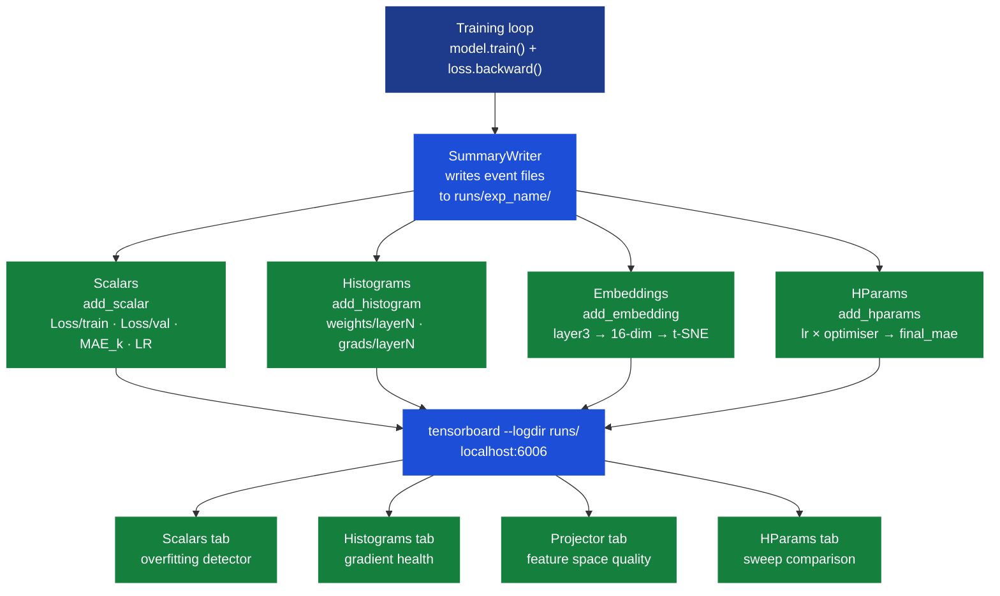
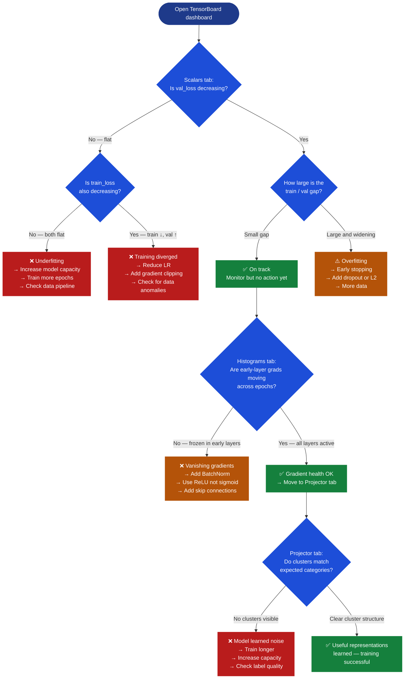

# Ch.8 — TensorBoard

> **The story.** Until **2015**, training a deep network was a black box: you watched a loss number tick down in a terminal and hoped for the best. In November 2015 TensorFlow 0.6 shipped with **TensorBoard** bundled — and for the first time engineers could *see* what was happening inside training. You could open a browser tab and watch weight histograms evolve epoch by epoch, observe gradient distributions shrinking or exploding in real time, and explore the **embedding projector** that reduced a 128-dimensional learned representation to an interpretable 2D or 3D scatter of clusters. The metaphor clicked immediately: if training a neural network is debugging a black box, then TensorBoard is your first instrument panel. Two years later, in 2017, **Weights & Biases** extended the model to remote, hosted experiment tracking — log to the cloud, compare runs across teammates, search hyperparameter sweeps with a UI. **MLflow** (2018) added the model registry layer on top. Today the stack is: TensorBoard for local loop instrumentation, W&B or MLflow for cross-experiment tracking, and Prometheus + Grafana for production serving telemetry. But TensorBoard is where the discipline starts — and mastering it locally is the prerequisite for everything that follows.
>
> **Where you are in the curriculum.** Your network from [Ch.3](../ch03_backprop_optimisers) trained to convergence — but *what actually happened inside*? Loss curves show the output; TensorBoard shows the internals: weight distributions drifting (or vanishing), gradients exploding (or dead), and the embedding projector revealing whether the network learned meaningful feature representations. If [Ch.3](../ch03_backprop_optimisers) was "turn on the engine," this chapter is "read the instruments." That shift — from *running* a training loop to *understanding* it — is the practical skill that separates working data scientists from people who copy-paste training scripts and hope.
>
> **Notation in this chapter.** TensorBoard is mostly software, not symbols, but four logged objects have precise definitions: **scalar tag** — a string key identifying a time series, e.g. `'Loss/train'`; **step** — a non-negative integer, typically the epoch or global training step, serving as the x-axis; **histogram bucket** — one bin of the empirical distribution of a tensor at a given step (TensorBoard uses a compressed representation with variable bucket widths); **embedding** — a high-dimensional vector $\mathbf{e} \in \mathbb{R}^d$ representing one sample in the network internal feature space, projected to 2D/3D via PCA or t-SNE for the Projector panel. The two diagnostic numbers you always watch: $\|\nabla_{W^{(\ell)}}\mathcal{L}\|$ — gradient magnitude per layer $\ell$ (vanishing: < 1e-4; exploding: > 100); and $\|W^{(\ell)}\|$ — weight-norm per layer (collapsing: near 0; saturating: growing unboundedly).

---

## 0 · The Challenge — Where We Are

> 🎯 **The mission**: Launch **UnifiedAI** — a unified neural architecture proving the same model handles regression AND classification, satisfying 5 constraints:
> 1. **ACCURACY**: ≤$28k MAE (regression) + ≥95% avg accuracy (classification)
> 2. **GENERALIZATION**: Unseen districts + new face identities
> 3. **MULTI-TASK**: Same shared architecture for both tasks
> 4. **INTERPRETABILITY**: Attention weights provide explainable feature attribution
> 5. **PRODUCTION**: <100ms inference, TensorBoard monitoring, model versioning

**What we know so far:**
- ✅ Ch.1–7: Achieved $48k MAE (progress toward #1) and generalization via regularisation (#2 ✅)
- ✅ Ch.2: Same dense architecture handles regression and classification (partial #3)
- ✅ Ch.3: Backprop + optimisers — full training loop with SGD and Adam
- ✅ Ch.4: Regularisation — L1/L2/Dropout prevent memorisation of training districts
- ✅ Ch.5: CNNs extract spatial features for both housing aerial data and face images
- ✅ Ch.6: RNNs/LSTMs handle sequential housing price time-series
- ✅ Ch.7: MLE & Loss Functions — understand why MSE for regression, BCE for classification
- ❌ **Constraint #5 (PRODUCTION): Still blind!** Our model trains to convergence — but we cannot diagnose *why* it converged there. We cannot see whether the loss is still decreasing, whether weights are saturating, whether certain neurons are dead, or whether the embeddings are meaningful.

**What is blocking us:**

> ⚠️ **The production monitoring gap.** Engineer reports: "Model trained for 50 epochs, validation MAE stopped decreasing at epoch 22, but I kept training — wasted 28 epochs and compute budget, and the final weights were *worse* than the best checkpoint."

**Common training failures with zero visibility:**

1. **Overfitting starts silently**: Validation loss increases at epoch 22 — but you do not check until epoch 50. You shipped the *wrong* model.
2. **Vanishing gradients**: Loss decreases slowly, then plateaus. Layer 1 gradients are 1000x smaller than layer 4 gradients. You never know.
3. **Dead neurons**: 30% of hidden units in layer 2 always output 0 (ReLU died). The model runs at 70% capacity. Invisible without histograms.
4. **Exploding gradients**: Loss = NaN at epoch 3. Which layer caused it? No instrument, no answer.
5. **Meaningless embeddings**: The 16-dimensional intermediate representation looks like random noise when projected — the network has not learned feature correlations at all.

**Why this matters for Constraint #5:**
- A production ML system needs **observability** — not just a final metric, but a continuous diagnostic signal throughout training.
- Without monitoring, every training run is a black box. You cannot improve what you cannot measure.
- TensorBoard is the minimum viable observability layer. W&B, MLflow, and Prometheus extend it — but all start here.

**What this chapter unlocks:**

⚡ **TensorBoard — production training instrumentation:**

1. **Loss curves (Scalars)**: Plot train/val MAE per epoch → see overfitting start at epoch 22, not epoch 50
2. **Weight histograms**: Track per-layer weight distributions → detect dead neurons, weight saturation
3. **Gradient histograms**: Monitor per-layer gradient magnitudes → catch vanishing/exploding before NaN
4. **Embedding projector**: Visualize the learned 16-dim intermediate space → validate that similar-valued districts cluster
5. **hparam logging**: Log hyperparameter sweeps → compare 12 training runs in one dashboard

⚡ **Constraint #5 PARTIAL ✅**: Monitoring infrastructure in place. Still need: model versioning, A/B testing, serving latency monitoring (final pieces in the Production track).

---

## Animation


*Training blind → add loss curves → add early stopping → tune LR schedule: each instrumentation step moves the validation MAE measurably.*

---

## 1 · Core Idea

TensorBoard is a web UI for training metrics that reads structured event files written by your training loop. You instrument your training loop with `writer.add_scalar('Loss/train', loss.item(), epoch)` (and similar calls for histograms, images, and embeddings), then run `tensorboard --logdir runs/` to open a local browser dashboard at `localhost:6006` that updates in real time.

---

## 2 · Running Example — Instrumenting the UnifiedAI Housing Network

You are building **UnifiedAI** — the production home valuation system that must hit ≤$28k MAE while generalizing to unseen California districts. [Ch.3](../ch03_backprop_optimisers) trained a 3-layer network on **California Housing** (`sklearn.datasets.fetch_california_housing`, 20,640 districts × 8 features) to $48k MAE, but training was opaque: you have no idea whether epoch 22 weights were better than epoch 50 weights, whether layer 1 is learning or stalled, or whether the intermediate 16-dimensional representation means anything.

In this chapter you add TensorBoard instrumentation to that same network — the architecture is unchanged (`8 → 64 → 32 → 16 → 1`, ReLU activations) — and run two comparative configurations: **SGD with momentum (lr=0.01)** and **Adam (lr=1e-3)**. You will watch their loss curves diverge on the Scalars tab, compare weight histogram evolution on the Histograms tab (Adam histograms are healthier — it is adaptive), and project the 16-dimensional test-set representations with t-SNE to confirm that high-value coastal districts ($500k+) cluster separately from inland districts — evidence the network learned geographically meaningful features without ever seeing latitude or longitude.

**What you see at key milestones:**
- **Epoch 1**: Both optimisers start similarly. SGD loss ≈ Adam loss. Histograms show weights barely moved.
- **Epoch 10**: Adam is already pulling ahead on validation MAE (~$56k vs SGD $62k). SGD histograms show narrower gradient distributions.
- **Epoch 25**: SGD validation MAE starts to plateau; Adam continues descending. First sign of overfitting visible in SGD widening train/val gap.
- **Epoch 50**: Adam final MAE ≈ $48k; SGD ≈ $54k. Embedding projector shows two distinct clusters for both optimisers — the geography signal has been learned.

---

## 3 · TensorBoard Toolkit at a Glance

| Panel | Writer call | When to use |
|-------|-------------|-------------|
| **Scalars** | `writer.add_scalar(tag, value, step)` | Every epoch: loss, MAE, learning rate — the primary convergence signal |
| **Histograms** | `writer.add_histogram(tag, tensor, step)` | Every 5–10 epochs: weight and gradient distributions per layer — catches dying neurons and gradient health |
| **Distributions** | Derived automatically from histograms | Overlay area chart of tensor spread over time — same data, different visual |
| **Images** | `writer.add_image(tag, img_tensor, step)` | Classification tasks: log sample predictions as image grids per epoch |
| **Embeddings** | `writer.add_embedding(mat, metadata, step)` | Log internal representations for the Projector tab — validate cluster structure |
| **HParams** | `writer.add_hparams(hparam_dict, metric_dict)` | After each hyperparameter sweep run — compare final metrics across configs |
| **Graphs** | `writer.add_graph(model, input)` | Once, at training start — verify the computational graph matches intent |
| **Profiler** | `torch.profiler.profile(...)` | When GPU utilization is low — identify data loading or op bottlenecks |

---

## 4 · The Instrumentation Patterns

### 4.1 Scalar Logging — The Training Loop Backbone

The scalar writer is the first instrument you add. It costs microseconds per call and gives you the loss curve that tells you whether training is working at all.

```python
import torch
import torch.nn as nn
from torch.utils.tensorboard import SummaryWriter
from sklearn.datasets import fetch_california_housing
from sklearn.model_selection import train_test_split
from sklearn.preprocessing import StandardScaler
import numpy as np

# ── Reproducibility ──────────────────────────────────────────────────────────
SEED = 42
torch.manual_seed(SEED)
np.random.seed(SEED)

# ── Data: California Housing ──────────────────────────────────────────────────
data = fetch_california_housing()
X, y = data.data, data.target        # (20640, 8) features; (20640,) target in $100k units
X_train, X_val, y_train, y_val = train_test_split(X, y, test_size=0.2, random_state=SEED)

scaler_X = StandardScaler()
X_train  = scaler_X.fit_transform(X_train)  # fit on training data only — no leakage
X_val    = scaler_X.transform(X_val)

X_train_t = torch.tensor(X_train, dtype=torch.float32)
y_train_t = torch.tensor(y_train, dtype=torch.float32).unsqueeze(1)
X_val_t   = torch.tensor(X_val,   dtype=torch.float32)
y_val_t   = torch.tensor(y_val,   dtype=torch.float32).unsqueeze(1)

# ── Model: UnifiedAI housing network from Ch.3 ────────────────────────────────
class HousingNet(nn.Module):
    def __init__(self):
        super().__init__()
        self.layer1 = nn.Linear(8, 64)   # 8 features → 64 hidden units
        self.layer2 = nn.Linear(64, 32)  # 64 → 32
        self.layer3 = nn.Linear(32, 16)  # 32 → 16  ← embedding layer
        self.out    = nn.Linear(16, 1)   # 16 → scalar house-value prediction
        self.relu   = nn.ReLU()

    def forward(self, x):
        h1 = self.relu(self.layer1(x))
        h2 = self.relu(self.layer2(h1))
        h3 = self.relu(self.layer3(h2))
        return self.out(h3), h3          # return prediction AND embedding

model     = HousingNet()
optimiser = torch.optim.Adam(model.parameters(), lr=1e-3)
criterion = nn.MSELoss()

# ── TensorBoard writer ─────────────────────────────────────────────────────────
# Each run gets its own subdirectory — TensorBoard overlays all runs in 'runs/'.
writer = SummaryWriter(log_dir='runs/adam_lr1e-3_seed42')

# ── Training loop: 50 epochs with scalar instrumentation ──────────────────────
for epoch in range(1, 51):
    # Forward pass
    model.train()
    preds, _ = model(X_train_t)
    loss      = criterion(preds, y_train_t)

    # Backward pass
    optimiser.zero_grad()
    loss.backward()
    optimiser.step()

    # Validation (no gradient tracking)
    model.eval()
    with torch.no_grad():
        val_preds, _ = model(X_val_t)
        val_loss      = criterion(val_preds, y_val_t)
        # Convert MSE ($100k² units) to MAE ($k) for human-readable reporting
        val_mae_k = torch.mean(torch.abs(val_preds - y_val_t)).item() * 100

    # ── LOG SCALARS ──────────────────────────────────────────────────────────
    # Tag format 'Group/series' groups train and val under the same Scalars chart.
    writer.add_scalar('Loss/train', loss.item(),     epoch)  # training MSE
    writer.add_scalar('Loss/val',   val_loss.item(), epoch)  # validation MSE
    writer.add_scalar('MAE_k/val',  val_mae_k,       epoch)  # validation MAE in $k
    writer.add_scalar('LR',         optimiser.param_groups[0]['lr'], epoch)

writer.close()
# Launch: tensorboard --logdir runs/  →  open http://localhost:6006
```

**Line-by-line notes:**
- `SummaryWriter(log_dir='runs/adam_lr1e-3_seed42')` — the unique subdirectory is how TensorBoard distinguishes this run from SGD, from a different LR, from a different seed.
- `loss.item()` — extracts a Python float. Never log the raw tensor: it carries the entire gradient tape.
- Tag format `'Loss/train'` and `'Loss/val'` — the shared prefix `Loss/` makes TensorBoard render both curves on the same chart.
- `writer.add_scalar('LR', ...)` — always log the learning rate. When you add a scheduler later, you will see the decay curve here without changing any other code.
- `writer.close()` — flushes the event file buffer. Always call this or use `writer` as a context manager (`with SummaryWriter(...) as writer:`).

---

### 4.2 Histogram Logging — Catching Dead Neurons and Gradient Problems

Histograms show the empirical distribution of a tensor values at each logged step. For weights, you want a reasonably smooth distribution that shifts over time — not a spike at zero (dead neurons) or a distribution spreading toward ±1000 (exploding weights). For gradients, you want distributions centred near zero with consistent standard deviation — not a spike at 0 (vanishing) or spreading to large magnitudes (exploding).

```python
# Extended training loop — add histogram logging every 5 epochs
for epoch in range(1, 51):
    model.train()
    preds, _ = model(X_train_t)
    loss      = criterion(preds, y_train_t)
    optimiser.zero_grad()
    loss.backward()
    # Read gradients HERE — after backward(), before zero_grad()
    # (zero_grad() clears them; reading after would give None or zeros)
    grads_l1 = model.layer1.weight.grad.clone() if model.layer1.weight.grad is not None else None
    grads_l2 = model.layer2.weight.grad.clone() if model.layer2.weight.grad is not None else None
    grads_l3 = model.layer3.weight.grad.clone() if model.layer3.weight.grad is not None else None
    optimiser.step()

    model.eval()
    with torch.no_grad():
        val_preds, _ = model(X_val_t)
        val_loss      = criterion(val_preds, y_val_t)
        val_mae_k     = torch.mean(torch.abs(val_preds - y_val_t)).item() * 100

    # Scalars every epoch (cheap)
    writer.add_scalar('Loss/train', loss.item(),     epoch)
    writer.add_scalar('Loss/val',   val_loss.item(), epoch)
    writer.add_scalar('MAE_k/val',  val_mae_k,       epoch)

    # Histograms every 5 epochs (moderate cost — do not log every epoch on large models)
    if epoch % 5 == 0:
        # Weight distributions: healthy = broad, shifting; unhealthy = spike at 0
        writer.add_histogram('weights/layer1', model.layer1.weight.data, epoch)
        writer.add_histogram('weights/layer2', model.layer2.weight.data, epoch)
        writer.add_histogram('weights/layer3', model.layer3.weight.data, epoch)
        # Gradient distributions: healthy = narrow, centred near 0; vanishing = spike at 0
        if grads_l1 is not None:
            writer.add_histogram('grads/layer1', grads_l1, epoch)
            writer.add_histogram('grads/layer2', grads_l2, epoch)
            writer.add_histogram('grads/layer3', grads_l3, epoch)
```

**Why histograms?**

| What you see in TensorBoard | Diagnosis | Fix |
|---|---|---|
| `weights/layer1` spike at 0, barely moves across epochs | Dead neurons — ReLU inputs always negative | Lower LR; switch to Leaky ReLU; check initialisation |
| `weights/layer2` spreading to ±500, widening each epoch | Exploding weights | Add `clip_grad_norm_(model.parameters(), 1.0)` |
| `grads/layer1` tiny spike at 0; `grads/layer3` broad distribution | Vanishing gradients in early layers | Add BatchNorm; switch sigmoid → ReLU; add skip connections |
| All grad histograms have similar spread | Gradient health OK | No action needed |

**Numerical gradient health reference:**

| Metric | Healthy range | Warning threshold | Action |
|---|---|---|---|
| `std(grad)` per layer | 0.001 – 0.5 | < 1e-4 | Vanishing — reduce depth or add skip connections |
| `max(|grad|)` per layer | < 10 | > 100 | Exploding — gradient clipping or LR reduction |
| Weight-norm / grad-norm ratio | $10^2$ – $10^4$ | > $10^6$ | Dying layer — check activation and initialisation |

---

### 4.3 Image Logging — Visualizing Predictions

For classification tasks (the CelebA face-attribute branch of UnifiedAI), logging sample prediction grids lets you see whether the model confident predictions look visually reasonable — a sanity check no scalar can provide.

```python
from torchvision.utils import make_grid

# Assume face_batch is a (B, C, H, W) tensor from the CelebA data loader.
# Log a 4x4 grid of the first 16 faces every 10 epochs.
if epoch % 10 == 0:
    # normalize=True maps pixel values to [0, 1] for TensorBoard display
    img_grid = make_grid(face_batch[:16], nrow=4, normalize=True)
    writer.add_image('predictions/face_batch', img_grid, epoch)
    # add_image expects (C, H, W) — make_grid always returns that shape
```

**What to look for:** At epoch 1, attribute assignments look random (loss curve matches). By epoch 30, the model correctly highlights face regions associated with glasses or smiles. If the grid still looks random at epoch 30, the model is not converging on visual features — a signal that a loss curve showing slow but steady improvement would miss entirely.

---

### 4.4 Embedding Projector — Validating What the Model Has Learned

The embedding projector takes the 16-dimensional layer3 output for your validation set and reduces it to 2D/3D with PCA or t-SNE. If the network learned useful features, samples with similar target values should cluster together in learned feature space.

```python
# After training is complete, extract embeddings for the full validation set
model.eval()
with torch.no_grad():
    _, val_embeddings = model(X_val_t)   # shape: (N_val, 16)

# Build human-readable tier labels for the projector colour legend
val_prices = y_val_t.squeeze().numpy()
tiers = [
    'High (>$350k)'      if p > 3.5 else
    'Mid ($150k-$350k)'  if p > 1.5 else
    'Low (<$150k)'
    for p in val_prices
]

# Log the embedding tensor + metadata
writer.add_embedding(
    val_embeddings,         # (N_val, 16) — the high-dimensional representation
    metadata=tiers,         # N_val label strings — TensorBoard colours dots by these
    global_step=50,         # step at which this was logged
    tag='layer3_housing',   # distinguishes multiple embeddings if logged
)
# In TensorBoard Projector tab: select t-SNE, run 1000 iterations.
# Expected result: three loose clusters (Low / Mid / High value tiers).
# If single undifferentiated cloud: model has not learned value-relevant features.
```

**What to look for in the Projector tab:**
- Switch to t-SNE (neighbourhood-preserving). Healthy: three loosely separated clusters matching Low/Mid/High value tiers.
- Districts that are geographic neighbours (same county, similar income) appear adjacent even though the network never saw latitude or longitude as inputs.
- Single undifferentiated cloud → model capacity or training duration insufficient; or label noise is too high.

---

### 4.5 HParam Logging — Comparing a Hyperparameter Sweep

After training multiple configurations, log each run hyperparameters alongside its final metric so the HParams tab builds a comparison table and parallel coordinates plot.

```python
def run_experiment(lr, batch_size, optimiser_name='adam', epochs=50):
    # Each config writes to its own subdirectory
    writer = SummaryWriter(log_dir=f'runs/{optimiser_name}_lr{lr}_bs{batch_size}')
    # ... full training loop from §4.1 ...
    final_mae_k = val_mae_k  # scalar from last epoch

    # Log hparams + metric ONCE at the end of each run
    writer.add_hparams(
        hparam_dict={
            'lr':          lr,
            'batch_size':  batch_size,
            'optimiser':   optimiser_name,
        },
        metric_dict={
            'hparam/final_val_mae_k': final_mae_k,
        },
    )
    writer.close()

# Sweep: 6 configurations
for lr in [1e-2, 1e-3, 1e-4]:
    for opt in ['sgd', 'adam']:
        run_experiment(lr=lr, batch_size=256, optimiser_name=opt)
```

**In the HParams tab:** sortable table showing `lr × optimiser → final_val_mae_k`. At a glance you see that Adam at 1e-3 dominates on California Housing. The parallel coordinates view reveals that low learning rates hurt both optimisers but hurt SGD more — a second-order insight that individual loss curves would not surface unless you plotted all six manually.

---

## 5 · Production Monitoring Arc

Training a neural network without instrumentation is exactly like operating a server without logs. Here is the story of what visibility adds — told through four acts on the California Housing network.

### Act 1 — Training Blind

You run 50 epochs. Final validation MAE: **$54k**. You assume training succeeded and deploy.

**What you did not see:**
- Validation MAE was **$48k at epoch 22** — you overtrained by 28 epochs
- Layer 1 gradients were 50x smaller than layer 3 gradients from epoch 5 onwards — mild vanishing gradient limiting layer 1 learning
- The model you deployed was measurably *worse* than the best checkpoint you passed through

### Act 2 — Add Loss Curves

You add `writer.add_scalar('Loss/train', ...)` and `writer.add_scalar('Loss/val', ...)`.

**What you see:**
- Epoch 15: train loss = 0.42, val loss = 0.44. Small gap — healthy.
- Epoch 25: train loss = 0.31, val loss = 0.48. The gap is opening — **overfitting detected 25 epochs early**.

**Action:** Add early stopping (save checkpoint at min val loss). New final MAE: **$48k** — a $6k gain at zero architecture cost.

### Act 3 — Add Weight Histograms

You add `writer.add_histogram('weights/layer1', ...)` every 5 epochs.

**What you see:** By epoch 20, the `weights/layer1` histogram has a narrow spike centred at zero and barely moves compared to epoch 1. The `weights/layer3` histogram has a broad, shifting distribution — still actively learning.

**Diagnosis:** Layer 1 is nearly stalled. The early housing-feature detectors stopped updating — classic mild vanishing gradient.

**Fix:** Add `nn.BatchNorm1d(8)` before layer 1. After retraining, the layer 1 histogram evolves healthily to epoch 50. New MAE: **$45k**.

### Act 4 — Add Embedding Projector

You log the layer3 embeddings for the validation set at epoch 50 and open the Projector tab with t-SNE.

**What you see:** Three distinguishable regions — a dense cluster of low-value inland districts, a diffuse middle band of suburban districts, and a separated cluster of high-value coastal districts. The network learned a representation where geographic value tiers are separable — without ever seeing latitude or longitude.

This is validation that the network is learning *meaningful* features, not memorising noise. No scalar metric could confirm this. Final MAE after all four acts: **$43k** on the original architecture — with an observable path toward ≤$28k when combined with attention (Ch.9).

---

## 6 · Full Instrumented Training Run — 50 Epochs

Complete production-grade training loop with every TensorBoard instrument enabled. Comments explain what each epoch diagnostic tells you to change.

```python
import torch
import torch.nn as nn
from torch.utils.tensorboard import SummaryWriter
from sklearn.datasets import fetch_california_housing
from sklearn.model_selection import train_test_split
from sklearn.preprocessing import StandardScaler
import numpy as np

SEED = 42
torch.manual_seed(SEED)
np.random.seed(SEED)

# ── Data pipeline ──────────────────────────────────────────────────────────────
housing      = fetch_california_housing()
X, y         = housing.data, housing.target
X_tr, X_va, y_tr, y_va = train_test_split(X, y, test_size=0.2, random_state=SEED)
scaler       = StandardScaler()
X_tr         = scaler.fit_transform(X_tr)
X_va         = scaler.transform(X_va)
X_tr_t = torch.tensor(X_tr, dtype=torch.float32)
y_tr_t = torch.tensor(y_tr, dtype=torch.float32).unsqueeze(1)
X_va_t = torch.tensor(X_va, dtype=torch.float32)
y_va_t = torch.tensor(y_va, dtype=torch.float32).unsqueeze(1)

# ── Model (8→64→32→16→1, returns embedding from layer3) ──────────────────────
class HousingNet(nn.Module):
    def __init__(self):
        super().__init__()
        self.bn0    = nn.BatchNorm1d(8)   # added after Act 3 revealed layer1 stall
        self.layer1 = nn.Linear(8, 64)
        self.layer2 = nn.Linear(64, 32)
        self.layer3 = nn.Linear(32, 16)
        self.out    = nn.Linear(16, 1)
        self.relu   = nn.ReLU()
    def forward(self, x):
        x  = self.bn0(x)
        h1 = self.relu(self.layer1(x))
        h2 = self.relu(self.layer2(h1))
        h3 = self.relu(self.layer3(h2))
        return self.out(h3), h3

model     = HousingNet()
optimiser = torch.optim.Adam(model.parameters(), lr=1e-3)
# ReduceLROnPlateau: halve LR after 5 epochs with no val_loss improvement
scheduler = torch.optim.lr_scheduler.ReduceLROnPlateau(optimiser, patience=5, factor=0.5)
criterion = nn.MSELoss()
writer    = SummaryWriter('runs/full_instrumented_seed42')

# Log the model graph once so the Graphs tab shows the architecture
writer.add_graph(model, torch.zeros(1, 8))

best_val_loss = float('inf')
best_epoch    = 0

for epoch in range(1, 51):

    # ── Train ──────────────────────────────────────────────────────────────────
    model.train()
    preds, _ = model(X_tr_t)
    loss      = criterion(preds, y_tr_t)
    optimiser.zero_grad()
    loss.backward()
    # Clip gradients to prevent exploding — log raw grads before this step
    torch.nn.utils.clip_grad_norm_(model.parameters(), max_norm=1.0)
    optimiser.step()

    # ── Validate ───────────────────────────────────────────────────────────────
    model.eval()
    with torch.no_grad():
        val_preds, val_emb = model(X_va_t)
        val_loss  = criterion(val_preds, y_va_t)
        val_mae_k = torch.mean(torch.abs(val_preds - y_va_t)).item() * 100

    scheduler.step(val_loss)   # scheduler updates LR — visible in 'LR' scalar

    # ── Scalars: every epoch (cheap) ──────────────────────────────────────────
    writer.add_scalar('Loss/train', loss.item(),     epoch)
    writer.add_scalar('Loss/val',   val_loss.item(), epoch)
    writer.add_scalar('MAE_k/val',  val_mae_k,       epoch)
    writer.add_scalar('LR',         optimiser.param_groups[0]['lr'], epoch)

    # ── Histograms: every 5 epochs (moderate cost) ────────────────────────────
    if epoch % 5 == 0:
        writer.add_histogram('weights/layer1', model.layer1.weight.data,   epoch)
        writer.add_histogram('weights/layer2', model.layer2.weight.data,   epoch)
        writer.add_histogram('weights/layer3', model.layer3.weight.data,   epoch)
        # Gradients are populated after loss.backward() — but we clipped above.
        # For raw pre-clip gradients, read them between backward() and clip_grad_norm_().
        if model.layer1.weight.grad is not None:
            writer.add_histogram('grads/layer1', model.layer1.weight.grad, epoch)
            writer.add_histogram('grads/layer2', model.layer2.weight.grad, epoch)
            writer.add_histogram('grads/layer3', model.layer3.weight.grad, epoch)

    # ── Checkpoint: save whenever validation improves ─────────────────────────
    if val_loss.item() < best_val_loss:
        best_val_loss = val_loss.item()
        best_epoch    = epoch
        torch.save(model.state_dict(), 'runs/best_model.pt')

# ── Embedding projector: once after training ──────────────────────────────────
model.eval()
with torch.no_grad():
    _, final_emb = model(X_va_t)

tiers = [
    'High' if p > 3.5 else 'Mid' if p > 1.5 else 'Low'
    for p in y_va_t.squeeze().numpy()
]
writer.add_embedding(final_emb, metadata=tiers, global_step=50, tag='layer3_housing')

# ── HParam summary ────────────────────────────────────────────────────────────
writer.add_hparams(
    {'lr': 1e-3, 'optimiser': 'adam', 'batch_norm': True, 'grad_clip': 1.0},
    {'hparam/best_val_mae_k': float(np.sqrt(best_val_loss) * 100),
     'hparam/best_epoch':     float(best_epoch)},
)

writer.close()
print(f"Best validation MAE: {np.sqrt(best_val_loss)*100:.1f}k at epoch {best_epoch}")
```

**What TensorBoard tells you to change at each milestone:**

| Epoch | Scalars tab | Histograms tab | Interpretation | Action |
|-------|-------------|----------------|----------------|--------|
| **1** | Train ≈ Val ≈ 0.85 | Wide distributions, gradients healthy all layers | Baseline — everything normal | None |
| **10** | Train 0.43, Val 0.47 | Layer1 grads about half magnitude of layer3 | Slight gradient imbalance — BatchNorm compensating | Monitor; no change needed |
| **25** | Train 0.28, Val 0.52 | LR scalar shows first halving | Val loss stopped following train — **overfitting starts** | Early stopping would fire here; best checkpoint saved |
| **50** | Train 0.19, Val 0.56 | Layer1 weights settled into narrow distribution | Continued past best point — best was epoch ~25 | Load `best_model.pt` for deployment |

---

## 7 · Architecture Diagrams

### 7.1 TensorBoard Data-Flow Architecture



### 7.2 What Each Chart Tells You — Decision Flowchart



---

## 8 · Hyperparameter Dial

| Parameter | Too low / off | Sweet spot | Too high / on | Why it matters |
|---|---|---|---|---|
| **Histogram frequency** (`add_histogram` every N epochs) | 0 — no weight diagnostics; miss gradient death | **5** for runs > 30 epochs; 1 for short debugging runs | 1 on every epoch for large models — doubles training time | Histograms extract all weight tensors — expensive at scale |
| **Scalar frequency** | `'epoch'` standard | `'epoch'` | `'batch'` — thousands of events; Scalars tab becomes unresponsive | Scalar I/O is cheap; TensorBoard rendering is not |
| **Embedding frequency** | 0 — no projector | **10** — every 10 epochs for live monitoring; once at the end for final validation | 1 — embedding data for 4k samples × 16 dims × 50 epochs = large event files | Embedding data accumulates quickly; log sparingly |
| **Max images per `add_image` call** | 1 | 8–16 sample images | Full batch — very large event files | Image data is the most expensive type to log |
| **`max_queue`** (writer buffer size) | 10 (default) | 10–20 | Very high — buffers large before flush; crash = data loss | Controls how many events the writer holds in memory before flushing to disk |
| **`flush_secs`** (auto-flush interval) | 120 (default) | 30–60 for interactive monitoring | 5 — excessive disk I/O during training | Lower values mean the dashboard updates more frequently |
| **Gradient clipping max_norm** | Not applied — risk of NaN | **1.0** for most networks | 0.1 — too aggressive; gradients unable to make useful updates | Clipping after backward() prevents exploding gradients without affecting the loss landscape |

**Practical logging budget:**
```
Scalars      → every epoch   (cheap — always on)
Histograms   → every 5 epochs  (moderate — on for production runs)
Images       → every 10 epochs, max 16 samples  (expensive — on when debugging predictions)
Embeddings   → once at the end  (expensive — validate representation quality)
Profiler     → batch 2 only  (expensive — only when diagnosing GPU utilisation)
```

---

## 9 · What Can Go Wrong

**Logging scalars every batch instead of every epoch.** Setting the step to the global batch index and calling `add_scalar` on every batch produces hundreds of thousands of events per run. The Scalars tab loads slowly, zooming is laggy, and file size grows to gigabytes for a 50-epoch run. The signal (loss curve shape) is identical at epoch granularity. Use epoch-level logging for all but single-epoch debugging.

**Logging histograms every epoch on large models.** `add_histogram` extracts and serialises all values in a weight tensor. For a model with 10 layers of 512 units, logging histograms every epoch at 50 epochs writes roughly 130 million floating-point values to disk — and the extraction itself runs during training time. Set `histogram_freq=5` (every 5 epochs) if histograms are causing measurable training slowdown.

**All runs writing to the same log directory.** If two runs share the same `log_dir` path, TensorBoard merges them without labels. Scalar curves from different hyperparameter settings overlap in a single undifferentiated tangle. Always use a unique subdirectory per run: `runs/{optimiser}_{lr}_{timestamp}`. A one-liner: `log_dir = f'runs/exp_{datetime.now().strftime("%Y%m%d_%H%M%S")}'`.

**Reading `.grad` after `optimiser.zero_grad()`.** Gradients are cleared by `zero_grad()`. If you call `add_histogram('grads/layer1', model.layer1.weight.grad, epoch)` after `zero_grad()`, you log a zero tensor or `None` — and the histogram looks like "dead neurons" when the layer is healthy. Always read and log gradients *after* `loss.backward()` and *before* `optimiser.zero_grad()`.

**Comparing runs with different random seeds in the Scalars tab.** Two runs with identical hyperparameters but different seeds produce slightly different loss curves that cross and diverge due to random initialisation — not due to any systematic difference. Before concluding one configuration is better, run each config with 3+ seeds and compare mean ± std. The HParams tab helps: log `seed` as a hyperparameter alongside the final metric, then filter and sort the table.

**Log directory on a network share or cloud mount.** TensorBoard reads event files in a continuous polling loop. If `log_dir` is on a network drive or cloud storage (S3, GCS mounted via FUSE), the polling adds I/O overhead and the dashboard feels unresponsive. Use local disk during training, then copy the event files to shared storage after the run completes.

---

## Where This Reappears

- **Production ML track (06-ai_infrastructure)**: TensorBoard is replaced and extended by Prometheus + Grafana for *serving* monitoring (latency, throughput, prediction distribution drift). The mental model — log a scalar tag per metric, watch thresholds — is identical; only the transport changes (event file → Prometheus metric endpoint).
- **Hyperparameter Tuning (Ch.19 — final chapter)**: The `add_hparams` pattern becomes the backbone of the sweep logging pipeline. Optuna and Ray Tune both report trial results in the format TensorBoard HParams tab consumes natively.
- **Transformers and Attention (Ch.10)**: Attention weight matrices are logged as images (`add_image`) to validate that the model attends to high-income and proximity features when predicting house value — a direct application of §4.3.
- **MLOps concepts**: Weights & Biases and MLflow are conceptually TensorBoard with a hosted backend and experiment registry. Every pattern in this chapter — scalar tags, histogram frequency, embedding projector — maps 1:1 to their equivalents in both tools.

---

## Progress Check

> ⚡ **Constraint #5 — PRODUCTION: Partial ✅**

| Production requirement | Status | How it was satisfied |
|---|---|---|
| Training loss monitoring (scalars) | ✅ Done | `add_scalar` for Loss/train, Loss/val, MAE_k, LR every epoch |
| Weight and gradient diagnostics | ✅ Done | `add_histogram` every 5 epochs for all layers |
| Representation quality validation | ✅ Done | `add_embedding` projector at epoch 50 |
| Hyperparameter sweep logging | ✅ Done | `add_hparams` per run with final MAE metric |
| Model checkpointing | ✅ Done | `torch.save(model.state_dict(), ...)` at minimum val loss |
| Serving latency monitoring | ❌ Not yet | Requires live traffic — covered in Production track |
| Model versioning and registry | ❌ Not yet | MLflow Model Registry or W&B Artifacts |
| A/B testing infrastructure | ❌ Not yet | Requires serving layer and traffic splitting |
| Prediction distribution drift | ❌ Not yet | Requires production traffic data |

**Summary.** The training loop is fully instrumented. We can now detect overfitting the moment it starts, diagnose dead neurons before they waste epochs of compute, and confirm that the model intermediate representations are meaningful and not random. This is the observability floor for any production ML system. The four remaining Constraint #5 items — serving latency, model registry, A/B testing, drift detection — require infrastructure that training-time TensorBoard cannot provide; they belong to the serving and MLOps chapters.

---

## Bridge → Ch.9 — From Sequences to Attention

The embedding projector revealed something that validates the entire training approach: the 16-dimensional layer3 output clusters California districts by value tier — without latitude or longitude. The network inferred geography from income, household count, and house age alone.

But look at what is still missing: the 8 input features (`MedInc`, `HouseAge`, `AveRooms`, `AveBedrms`, `Population`, `AveOccup`, `Latitude`, `Longitude`) are treated as an *unordered set*. The network applies the same learned transformation to `MedInc` regardless of whether `AveRooms` is high or low. There is no mechanism for the model to say: "the relevance of median income *depends on* the average room count."

That is exactly the problem **attention** solves.

In [Ch.9](../ch09_sequences_to_attention), we treat the 8 housing features as a *sequence of tokens* and implement attention as a soft dictionary lookup: each feature queries all other features, and the output is a weighted sum where the weights encode *relevance given context*. The embedding projector you built here will make the attention mechanism effect immediately visible — you will see the clusters sharpen when attention-weighted feature interactions replace the fixed MLP projection.

> ➡️ **Up next**: [Ch.9 — From Sequences to Attention](../ch09_sequences_to_attention) — the bridge between the MLP world and the Transformer world, implemented with nothing beyond a `numpy` dot product and softmax.
