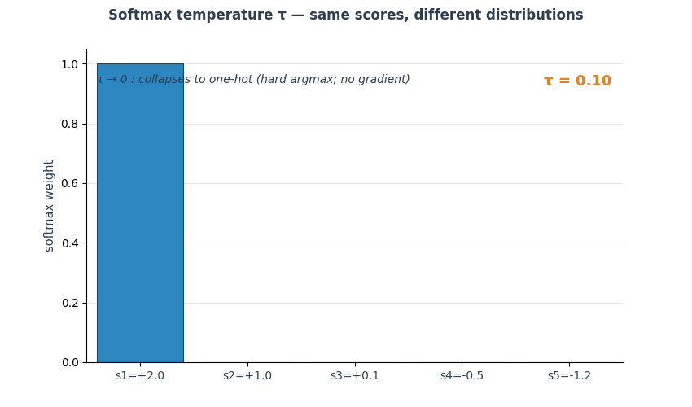
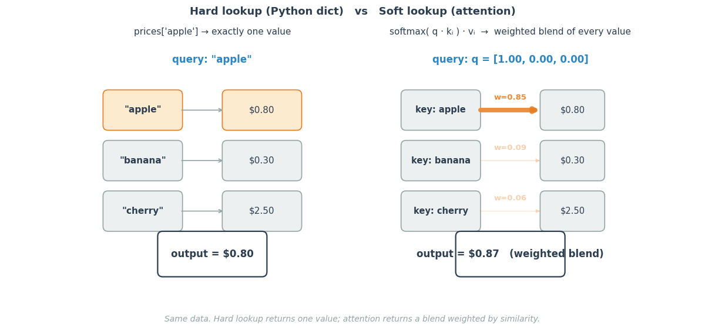
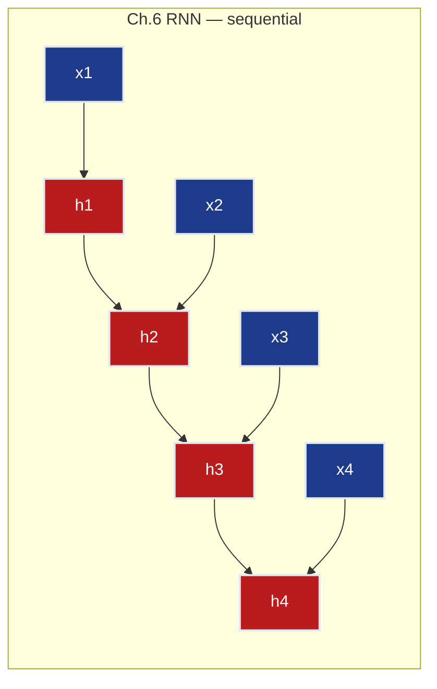
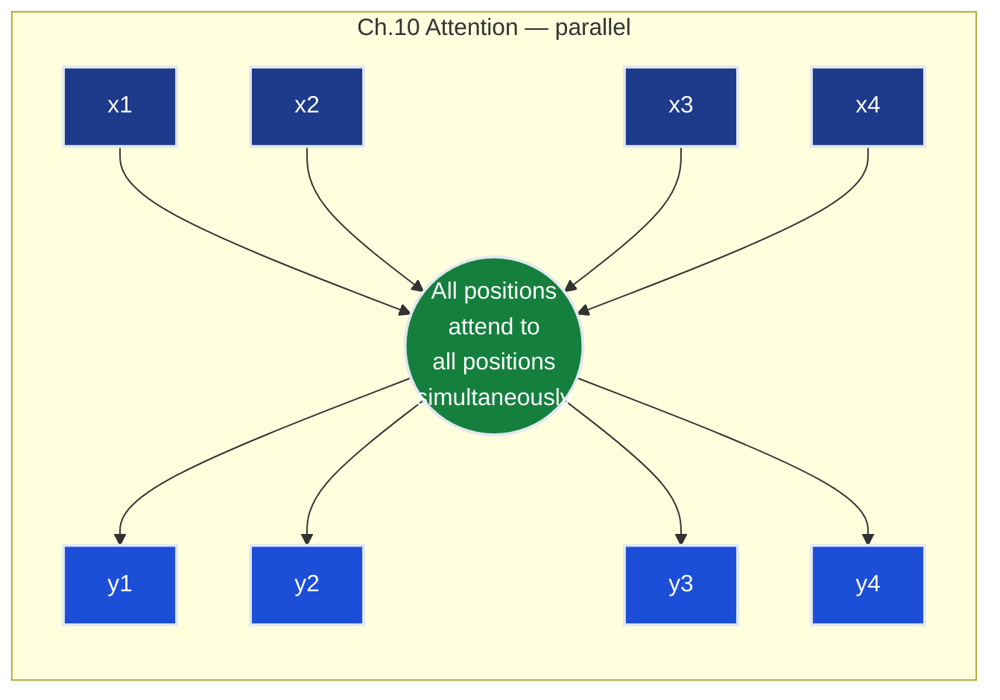
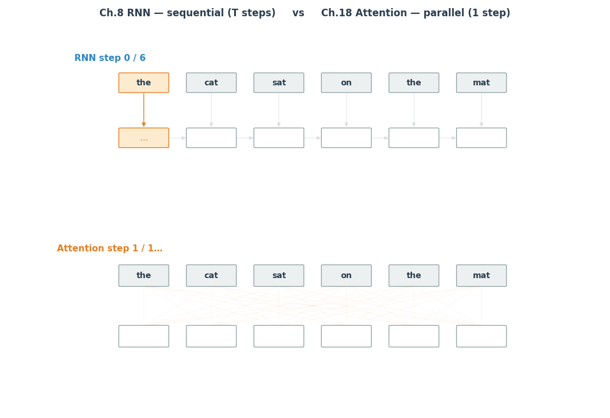
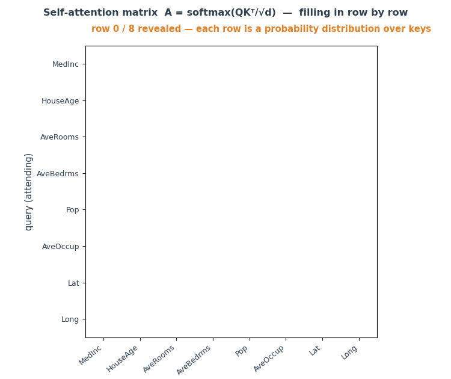
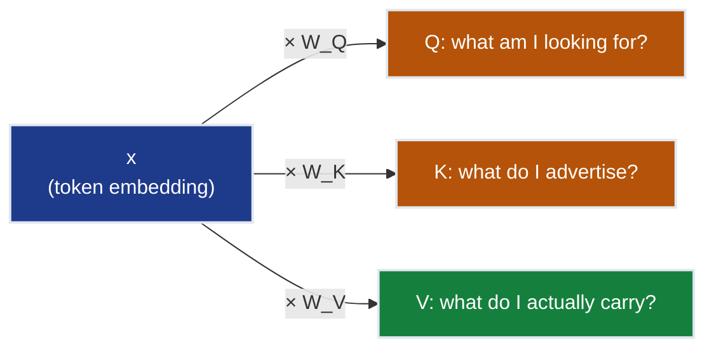
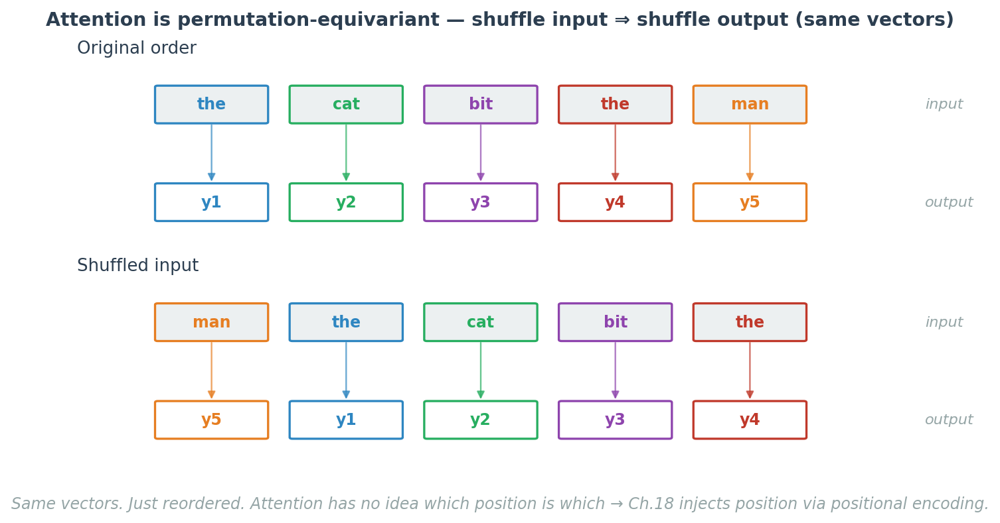

# Ch.9 — From Sequences to Attention (Bridge Chapter)

> **The story.** Attention as we know it was born in 2014 in a paper by **Dzmitry Bahdanau, Kyunghyun Cho, and Yoshua Bengio** — *Neural Machine Translation by Jointly Learning to Align and Translate*. The setting was painfully practical: their encoder–decoder LSTMs for translation kept losing the start of long sentences by the time the decoder needed it. Their fix was to let the decoder, at every output step, *softly look up* relevant positions in the encoder — a weighted sum over encoder hidden states with weights learned end-to-end. **Luong et al. (2015)** simplified it. Three years later **Vaswani et al. (2017)** would prove that attention alone, *without* the recurrence, was enough — and the transformer in [Ch.10](../ch10_transformers) was born. This bridge chapter makes the soft-lookup intuition rock solid before that explosion of new vocabulary lands.
>
> **Where you are in the curriculum.** [Ch.6](../ch06_rnns_lstms)'s LSTM fixed the vanishing gradient but paid for it with **serialisation** — token $t+1$ cannot start until token $t$ finishes. [Ch.10](../ch10_transformers)'s transformer throws that away and replaces recurrence with **attention**: a single differentiable operation that lets every position in a sequence look directly at every other position, all at once. Before we touch $Q$, $K$, $V$, multi-head, and positional encoding, we need one mental model and three building blocks. This chapter is deliberately short — it exists so [Ch.10](../ch10_transformers) lands softly.
>
> **Notation in this chapter.** $\mathbf{q}\in\mathbb{R}^{d_k}$ — a single **query** vector ("what am I looking for?"); $\{\mathbf{k}_i\}_{i=1}^{n}$ — **keys** for $n$ candidate items ("what do I offer?"); $\{\mathbf{v}_i\}_{i=1}^{n}$ — corresponding **values** (the actual content to be retrieved); $s_i=\mathbf{q}\cdot\mathbf{k}_i$ — raw similarity score; $\alpha_i=\dfrac{\exp(s_i)}{\sum_j\exp(s_j)}$ — **attention weights** (softmax of the scores; non-negative, sum to 1); $\mathbf{c}=\sum_{i=1}^{n}\alpha_i\mathbf{v}_i$ — the **context vector** (the soft-dictionary lookup result).

---

## 0 · The Challenge — Where We Are

> 🎯 **The mission**: Launch **UnifiedAI** — a production home valuation system satisfying 5 constraints:
> 1. **ACCURACY**: ≤$28k MAE (regression) + ≥95% accuracy (classification)
> 2. **GENERALIZATION**: Unseen districts + new face identities
> 3. **MULTI-TASK**: Same architecture predicts value **and** classifies attributes
> 4. **INTERPRETABILITY**: Attention weights provide explainable feature attribution
> 5. **PRODUCTION**: <100ms inference, TensorBoard monitoring

**What we know so far:**
- ✅ Ch.1–2: Dense feedforward networks unify regression and classification (same hidden layers, different output heads)
- ✅ Ch.3: Backpropagation and Adam optimizer work identically for both tasks
- ✅ Ch.4: Dropout, L2, and batch normalization prevent overfitting in both paradigms
- ✅ Ch.5: CNNs extract spatial features for image regression and classification
- ✅ Ch.6: RNNs/LSTMs handle sequential data (time series regression, text classification)
- ✅ Ch.7: MSE and BCE both derive from Maximum Likelihood Estimation (MLE)
- ✅ Ch.8: TensorBoard monitors training identically across tasks (Constraint #5 partial)
- ❌ **But RNNs are slow and bottlenecked — can't scale to production text processing**

**What's blocking us:**

Product team wants to add **text descriptions** to property listings:
- **Input**: "Spacious 3-bedroom home near excellent schools, recently renovated kitchen"
- **Need**: Extract features from text to improve valuation accuracy
- **Problem**: Ch.6's LSTM processes text **sequentially** — word 1 → word 2 → word 3 → ...

**The three failures:**
1. **Latency (Constraint #5 PRODUCTION)**: LSTM takes 200ms to process 50-word description → blocks real-time API (<100ms target)
2. **Information loss (Constraint #1 ACCURACY)**: By word 20, model forgot word 1 ("spacious") — long-range dependencies vanish through recurrence
3. **GPU parallelism wasted (Constraint #5 PRODUCTION)**: Sequential processing means GPU cores sit idle waiting for previous token — can't scale to millions of listings

**What this chapter unlocks:**

⚡ **Attention mechanism — parallel sequence processing:**
- **Parallel processing**: All tokens processed simultaneously (no sequential bottleneck) → <50ms for 50 words
- **Direct connections**: Word 20 can directly "look at" word 1 via softmax weights (no information loss)
- **Soft dictionary lookup**: Query-Key-Value mechanism → differentiable weighted sum over all positions
- **Interpretability foundation (Constraint #4)**: Attention weights show which words model focuses on (Ch.10 builds on this)

> ➡️ **Forward to Ch.10**: This chapter builds the intuition and three building blocks (dot product similarity, softmax, Q/K/V roles). Ch.10 adds learnable projections ($W_Q, W_K, W_V$), multi-head attention, and positional encoding → the Transformer architecture behind GPT, BERT, and every modern LLM.

---

## Animation


## 1 · Core Idea

**Attention is a soft dictionary lookup.**

A Python `dict` does *hard* lookup: the key either matches or it doesn't, and you get exactly one value. Attention does *soft* lookup: your query is compared to **every** key, a softmax turns those comparisons into weights, and the output is the weighted average of **every** value.

That single line is the entire concept. Everything in [Ch.10](../ch10_transformers) — scaled dot-product attention, multi-head attention, self-attention, cross-attention, encoder blocks — is an elaboration on this one idea.

> ➡️ **Contrast with [Ch.6](../ch06_rnns_lstms) RNNs**: An LSTM carries a single hidden state vector forward sequentially. Attention replaces that single vector with a **weighted blend computed fresh at every position** by looking at the entire sequence.

---

## 2 · Running Example: What We're Solving

The UnifiedAI mission requires processing **property text descriptions** to extract valuation features — \"Spacious 3-bedroom home near excellent schools, recently renovated kitchen.\" [Ch.6](../ch06_rnns_lstms)'s LSTM handles this sequentially, creating a latency bottleneck (200ms for 50 words) that blocks Constraint #5 (PRODUCTION: <100ms inference). Attention fixes this by processing all words in parallel.

To build intuition, start simpler: treat each **California Housing district as a sequence of 8 feature-tokens** — `MedInc`, `HouseAge`, `AveRooms`, `AveBedrms`, `Population`, `AveOccup`, `Latitude`, `Longitude`. At the end of this chapter you will be able to answer:

> *"Given the query `MedInc`, which other feature-tokens should I pay attention to when predicting house value?"*

You will answer it with nothing more than dot products and a softmax — no transformer, no learned weights, just the three building blocks. [Ch.10](../ch10_transformers) will then scale this to full text sequences with learned projections and positional encoding, delivering the <50ms latency needed for production.

---

## 3 · Math — Three Building Blocks

### 3.1 Dot Product as Similarity

> 📚 **Math foundation**: For the geometric interpretation of dot products and vector norms, see [Math Under the Hood Ch.1 — Linear Algebra](../../../../math_under_the_hood/ch01_linear_algebra) and [Ch.5 — Matrices](../../../../math_under_the_hood/ch05_matrices).

For two vectors $\mathbf{a}, \mathbf{b} \in \mathbb{R}^d$:

$$\mathbf{a} \cdot \mathbf{b} = \sum_{i=1}^{d} a_i b_i = \|\mathbf{a}\| \|\mathbf{b}\| \cos\theta$$

| Result | Meaning |
|---|---|
| Large positive | Vectors point in similar directions — *similar* |
| Near zero | Vectors are orthogonal — *unrelated* |
| Large negative | Vectors point in opposite directions — *anti-similar* |

If both vectors are **unit-normalised** ($\|\mathbf{a}\| = \|\mathbf{b}\| = 1$), the dot product is exactly $\cos\theta$ — cosine similarity. Every attention mechanism in modern AI is built on this one fact.

### 3.2 Softmax as Differentiable Argmax

> 📚 **Math foundation**: For the derivative of exponential functions and the chain rule needed to backpropagate through softmax, see [Math Under the Hood Ch.6 — Gradient & Chain Rule](../../../../math_under_the_hood/ch06_gradient_chain_rule).

Given a vector of scores $\mathbf{s} = (s_1, \ldots, s_n)$:

$$\text{softmax}(s_i) = \frac{e^{s_i}}{\sum_{j=1}^{n} e^{s_j}}$$

The output is a probability distribution: non-negative, sums to 1.

```
Input scores: [2.0, 1.0, 0.1]
Softmax output: [0.66, 0.24, 0.10] ← concentrates mass on the largest score,
 but still leaks some probability to the rest
```

**With temperature** $\tau$:

$$\text{softmax}_\tau(s_i) = \frac{e^{s_i / \tau}}{\sum_j e^{s_j / \tau}}$$

- $\tau \to 0$: the distribution becomes one-hot — pure `argmax`.
- $\tau = 1$: standard softmax.
- $\tau \to \infty$: uniform distribution — "pay equal attention to everything".



Softmax is **differentiable** everywhere, unlike `argmax`. That is the only reason attention can be trained by gradient descent.

### 3.3 Soft Dictionary Lookup

A hard Python dict:

```python
prices = {"apple": 0.80, "banana": 0.30, "cherry": 2.50}
prices["apple"] # → 0.80 (one key matches, one value returned)
```

The soft version:

$$\text{attend}(q; \{k_i\}, \{v_i\}) = \sum_{i=1}^{n} \underbrace{\text{softmax}_i \left(\frac{q \cdot k_i}{\tau}\right)}_{w_i} \cdot v_i$$

In English:

1. Compare query $q$ to every key $k_i$ via dot product.
2. Turn the $n$ similarity scores into $n$ weights with softmax.
3. Return the weighted sum of the values.

If one key matches far better than the others, the softmax concentrates almost all the weight there — and the soft lookup degenerates to a hard one. If several keys match, the output is a *blend*.

**That is attention.** Ch.10's scaled dot-product formula $\text{softmax}(QK^\top / \sqrt{d_k})V$ is this same equation written in matrix form with a variance-control denominator. Nothing more.

#### Numeric Walkthrough — Q/K/V Attention, $T=3$, $d_k=2$

$$\mathbf{Q} = \begin{pmatrix}1&0\\0&1\\1&1\end{pmatrix}, \quad \mathbf{K} = \begin{pmatrix}1&0\\0&1\\1&0\end{pmatrix}, \quad \mathbf{V} = \begin{pmatrix}2\\1\\3\end{pmatrix}$$

For query 1 ($\mathbf{q}_1 = [1,0]$): raw scores $\mathbf{s} = \mathbf{q}_1 \cdot \mathbf{K}^\top = [1\cdot1+0\cdot0,\ 1\cdot0+0\cdot1,\ 1\cdot1+0\cdot0] = [1, 0, 1]$.

| Score | $e^{s_i}$ | $\alpha_i = \text{softmax}$ | $\alpha_i v_i$ |
|-------|-----------|---------------------------|----------------|
| $s_1=1$ | $e^1=2.718$ | $2.718/7.155=0.380$ | $0.380 \times 2 = 0.760$ |
| $s_2=0$ | $e^0=1.000$ | $1.000/7.155=0.140$ | $0.140 \times 1 = 0.140$ |
| $s_3=1$ | $e^1=2.718$ | $2.718/7.155=0.380$ | $0.380 \times 3 = 1.140$ |

$$\mathbf{c}_1 = \sum_i \alpha_i v_i = 0.760 + 0.140 + 1.140 = 2.040$$

Query 1 attends equally to positions 1 and 3 (scores both = 1), blending their values (2 and 3) to get 2.04. Position 2 contributes less (score = 0).

---

## 4 · How It Works — Step by Step

Using the 8-feature housing example with the query `MedInc`:

```
1. Represent each feature as a vector (an "embedding") in R^d.

2. Pick one feature as the query q = MedInc

3. For every feature i: score_i = q · k_i

4. Apply softmax: w = softmax([score_1, ..., score_8])

5. Blend the values: out = Σ w_i · v_i

Result: `out` is a context-aware representation of MedInc
 that mixes in information from every other feature,
 weighted by how relevant each one turned out to be.
```

In a real transformer we do steps 3–5 **for every feature as the query, simultaneously** — producing one context-aware output per input position. That is self-attention.

---

## 5 · Key Diagrams

### 5.1 Hard vs Soft Lookup (the only diagram you truly need)

```
HARD (Python dict) SOFT (attention)

 query: "apple" query vector q

 │ │
 ▼ ▼
 match exactly one key compare to every key
 │ │
 ▼ ▼
 return that one value softmax the scores
 │
 ▼
 weighted sum of ALL values
```



### 5.2 Sequential RNN vs Parallel Attention

Same sentence, same wall-clock:





The RNN needs 4 sequential steps. Attention needs 1 parallel step. On a GPU, that difference is the entire reason transformers won.



### 5.3 The Attention Matrix

For a length-$T$ sequence, the core object is a $T \times T$ matrix of weights:

```
 k1 k2 k3 k4
 ┌─────────────────────┐
 q1 → │ 0.7 0.1 0.1 0.1 │ ← row 1 is a probability dist. over all keys
 q2 → │ 0.2 0.5 0.2 0.1 │
 q3 → │ 0.1 0.3 0.4 0.2 │
 q4 → │ 0.1 0.2 0.2 0.5 │
 └─────────────────────┘
 every row sums to 1
```

**Row $i$** answers: *"when I am position $i$, how much attention do I pay to each other position?"*



### 5.4 Q, K, V — The Projection Triangle

One input vector, three roles:



This triangle is the single most compressed way to remember QKV:
- $Q$ = **question** — what this token is trying to find in the sequence.
- $K$ = **label** — what this token advertises about itself to others.
- $V$ = **payload** — what this token actually contributes when selected.

In Ch.10 $W_Q, W_K, W_V$ are learned. Here we skip learning and just reuse the same embedding for all three to keep the focus on the mechanism.

### 5.5 Permutation Equivariance — Why Position Must Be Injected

Attention treats the input as a *set*, not a sequence:

```
Input order: [cat, sat, on, mat] → Attention → [y1, y2, y3, y4]
Shuffled input: [mat, on, sat, cat] → Attention → [y4, y3, y2, y1]

Same vectors. Just reordered. No notion of order has been learned.
```

This is why Ch.10 spends a whole section on **positional encoding** — without it, "the dog bit the man" and "the man bit the dog" are identical to the model.



---

## 6 · Hyperparameter Dial

This is a bridge chapter, not an architecture chapter, so there is only one dial worth meeting now:

| Dial | Too low | Sweet spot | Too high |
|---|---|---|---|
| **Softmax temperature** $\tau$ | Output collapses to one-hot (hard argmax; gradient vanishes) | $\tau = \sqrt{d_k}$ in Ch.10 | Distribution flattens — attention pays equal attention to everything (no information extracted) |

This same $\tau$ reappears in Ch.10 as the $\sqrt{d_k}$ scaling factor — it is the same idea.

---

## 7 · Code Skeleton

```python
import numpy as np

def softmax(x, axis=-1):
 x = x - x.max(axis=axis, keepdims=True) # numerical stability
 e = np.exp(x)
 return e / e.sum(axis=axis, keepdims=True)

def soft_lookup(q, keys, values, tau=1.0):
 """Attention from first principles — no transformer."""
 scores = keys @ q / tau # (n_keys,)
 weights = softmax(scores) # (n_keys,)
 output = weights @ values # (d_value,)
 return output, weights

# 8 housing features → 8 random "embeddings" in R^4 (in Ch.10 these are learned)
rng = np.random.default_rng(42)
feature_names = ["MedInc", "HouseAge", "AveRooms", "AveBedrms",
 "Population", "AveOccup", "Latitude", "Longitude"]
embeddings = rng.normal(size=(8, 4))

# Query: MedInc. Keys and values: all 8 features.
q = embeddings[0]
keys = embeddings
values = embeddings

out, w = soft_lookup(q, keys, values)
for name, weight in zip(feature_names, w):
 print(f"{name:12s} attention = {weight:.3f}")
```

Run this and you will see an 8-element probability distribution summing to 1 — MedInc's learned-free attention over every feature in the district. Ch.10 makes the keys and values **different projections** of the input and makes the projection weights **learnable**; the kernel of the mechanism is exactly what you just wrote.

---

## 8 · What Can Go Wrong

**Forgetting that attention is permutation-equivariant** — model ignores word order

A transformer without positional encoding treats "dog bites man" and "man bites dog" identically — the attention mechanism is symmetric over positions. You discover this when your sentiment classifier gives the same score to "I love this, not bad" and "I hate this, not good" because it's only seeing the bag-of-words.

**Fix:** Always verify positional encoding is added to embeddings before the first attention layer. In [Ch.10](../ch10_transformers), sinusoidal PE is injected once at the input; in production code, check `pos_encoding + token_embedding` happens before `attention_layer`.

---

**Temperature too low (or dot products too large)** — softmax collapses to one-hot, gradients vanish

When dot products $q \cdot k_i$ grow large (high-dimensional embeddings without scaling), $e^{s_i}$ explodes, softmax puts 0.9999 weight on one position and $10^{-5}$ on the rest. The weighted sum degenerates to a hard lookup, gradients through the softmax vanish, and training stalls after the first few epochs.

**Fix:** Scale attention scores by $\sqrt{d_k}$ (the square root of key dimension) — this is [Ch.10](../ch10_transformers)'s "scaled dot-product attention." The $\sqrt{d_k}$ divisor is not cosmetic; it prevents variance explosion as dimension grows.

---

**Confusing "what the query is looking for" with "what the key advertises"** — using same vector for Q and K

$Q$ and $K$ come from the same input sequence but serve different roles: the query asks "what do I need?", the key answers "what do I offer?". Using the raw embedding for both (no learned projections $W_Q, W_K$) forces every position to look for itself most strongly, collapsing attention into a weak identity operation.

**Fix:** [Ch.10](../ch10_transformers) introduces separate learnable projection matrices $W_Q \in \mathbb{R}^{d_{model} \times d_k}$ and $W_K \in \mathbb{R}^{d_{model} \times d_k}$ — this lets the model learn *what to look for* (Q) vs. *what to advertise* (K) as two separate functions.

---

**Assuming attention weights = model explanation** — misinterpreting attention as causality

Attention weights show *where* the model looked, not *why* it made a decision. High attention on "not" when classifying "not bad" as positive doesn't mean "not" caused the positive label — it could be the downstream FFN layer that flipped the polarity. Research (Jain & Wallace 2019) shows attention weights often disagree with gradient-based attribution.

**Fix:** Use attention weights as a **diagnostic** ("the model is looking at these tokens"), not an **explanation** ("these tokens caused the prediction"). For causal attribution, use integrated gradients or SHAP values — covered in the Ensemble Methods track's interpretability chapter.

---

**Mixing up set operations and sequence operations** — expecting attention to preserve order

Attention itself has no notion of order — it's a weighted sum over a set. Shuffling the input tokens shuffles the output identically (permutation equivariance). If you train an attention-only model on "A then B then C" sequences, it can't distinguish them from "C then A then B" without external position information.

**Fix:** Sequence-ness comes **entirely** from positional encoding, not from attention. [Ch.10](../ch10_transformers)'s sinusoidal PE injects absolute position into embeddings; relative positional encodings (T5, ALiBi) directly bias attention scores by distance.

---

## 9 · Progress Check — What We Can Solve Now

✅ **Unlocked capabilities:**
- **Parallel sequence processing**: All tokens attend to all others simultaneously (vs. LSTM's sequential bottleneck)
- **Direct long-range connections**: Query at position $t$ can directly access key/value at position $1$ (no information decay through recurrence)
- **Soft dictionary lookup intuition**: Understand attention as differentiable weighted retrieval (dot product → softmax → weighted sum)
- **Q/K/V mental model**: One input vector, three roles (question / label / payload) — foundation for all transformer architectures
- **Permutation equivariance**: Recognize that attention treats input as a set → motivates positional encoding necessity

❌ **Still can't solve:**
- ❌ **No learned projections yet**: This chapter reuses the same embedding for Q, K, V — Ch.10 introduces learnable $W_Q, W_K, W_V$ matrices
- ❌ **Single attention head**: Ch.10's multi-head attention parallelizes multiple Q/K/V triplets to capture different relationship patterns
- ❌ **No positional encoding**: Without position information, "dog bites man" = "man bites dog" — Ch.10 fixes this
- ❌ **Not production-ready**: No full encoder stack, no layer norm, no residual connections — Ch.10 assembles the complete architecture
- ❌ **Constraint #1 (ACCURACY)**: Still at Ch.6 baselines — Ch.10's full Transformer is needed to reach ≤$28k MAE target
- ❌ **Constraint #4 (INTERPRETABILITY)**: Attention weights provide *diagnostic* information, not full explainability — deferred to Ensemble Methods track

**Progress toward constraints:**

| Constraint | Target | Status | Notes |
|------------|--------|--------|-------|
| #1 ACCURACY | ≤$28k MAE + ≥95% acc | ⏳ Foundation | Ch.9 builds attention intuition; Ch.10 delivers full Transformer architecture |
| #2 GENERALIZATION | Unseen data | ✅ Maintained | Attention is permutation-equivariant → generalizes across token orders |
| #3 MULTI-TASK | Same architecture | ✅ Maintained | Attention mechanism is task-agnostic (regression vs. classification) |
| #4 INTERPRETABILITY | Explainable | ⏳ Partial | Attention weights show *where* model looks (diagnostic), not *why* it decides |
| #5 PRODUCTION | <100ms, scalable | ⏳ Partial | Parallel processing unlocked; Ch.10 adds full encoder stack + production tooling |

**Chapter progression:**

```mermaid
flowchart LR
    CH1["Ch.1 XOR<br/>Non-linearity"] --> CH2["Ch.2 Neural Nets<br/>Dense layers"]
    CH2 --> CH3["Ch.3 Backprop<br/>Training"]
    CH3 --> CH4["Ch.4 Regularization<br/>Generalization"]
    CH4 --> CH5["Ch.5 CNNs<br/>Spatial features"]
    CH5 --> CH6["Ch.6 RNNs/LSTMs<br/>Sequential features"]
    CH6 --> CH7["Ch.7 MLE<br/>Loss theory"]
    CH7 --> CH8["Ch.8 TensorBoard<br/>Monitoring"]
    CH8 --> CH9["✅ Ch.9 Attention<br/>Soft lookup<br/>Q/K/V intuition"]
    CH9 --> CH10["Ch.10 Transformers<br/>Multi-head attention<br/>Positional encoding<br/>≤$28k MAE target"]
    
    style CH1 fill:#15803d,stroke:#e2e8f0,stroke-width:2px,color:#ffffff
    style CH2 fill:#15803d,stroke:#e2e8f0,stroke-width:2px,color:#ffffff
    style CH3 fill:#15803d,stroke:#e2e8f0,stroke-width:2px,color:#ffffff
    style CH4 fill:#15803d,stroke:#e2e8f0,stroke-width:2px,color:#ffffff
    style CH5 fill:#15803d,stroke:#e2e8f0,stroke-width:2px,color:#ffffff
    style CH6 fill:#15803d,stroke:#e2e8f0,stroke-width:2px,color:#ffffff
    style CH7 fill:#15803d,stroke:#e2e8f0,stroke-width:2px,color:#ffffff
    style CH8 fill:#15803d,stroke:#e2e8f0,stroke-width:2px,color:#ffffff
    style CH9 fill:#b45309,stroke:#e2e8f0,stroke-width:3px,color:#ffffff
    style CH10 fill:#1d4ed8,stroke:#e2e8f0,stroke-width:2px,color:#ffffff
```



**Real-world status**: We understand the core attention mechanism (soft dictionary lookup via dot product + softmax) and the Q/K/V conceptual framework. We can explain why attention parallelizes where RNNs serialize. But we don't yet have a production-ready architecture — no learned projections, no multi-head parallelism, no positional encoding, no encoder stack. Ch.10 assembles all of this into the Transformer.

**Next up:** [Ch.10](../ch10_transformers) gives us **Transformers** — multi-head attention, learnable $W_Q/W_K/W_V$ projections, sinusoidal positional encoding, layer norm, and residual connections. That complete architecture is what powers GPT, BERT, ViT, CLIP, and every modern foundation model.

---

## 10 · Bridge to Ch.10

Ch.9 established **what attention is** — a soft dictionary lookup parameterised by dot product and softmax — and **what it lacks** without help: an inherent sense of order. Ch.10 takes exactly this mechanism, adds learnable $W_Q, W_K, W_V$ projections, scales the dot product by $\sqrt{d_k}$, runs multiple heads in parallel, and injects sinusoidal positional encodings — producing the transformer encoder that sits inside every modern LLM, embedding model, and vision foundation model. Every symbol in Ch.10 has already been introduced here. The only new ideas will be **how many** of them you stack.


