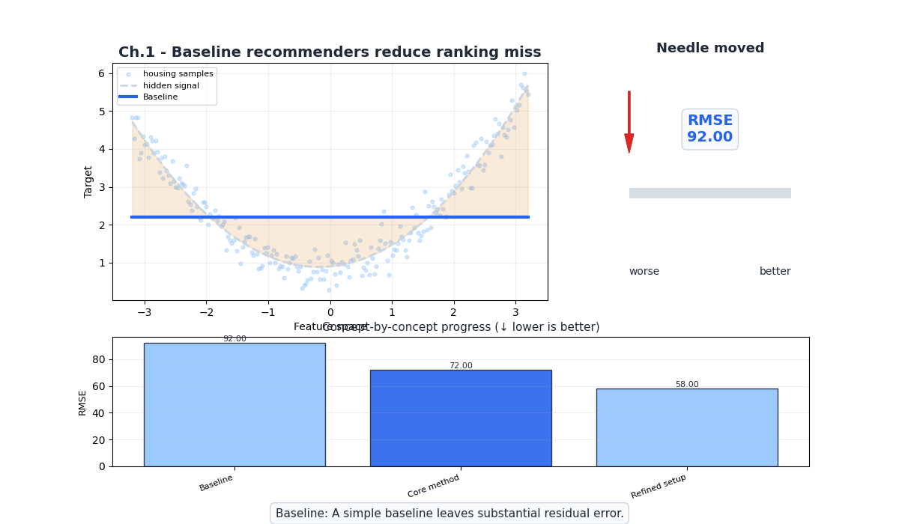
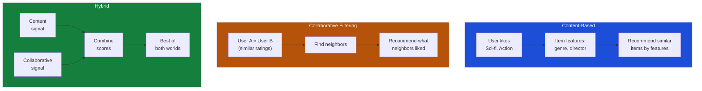
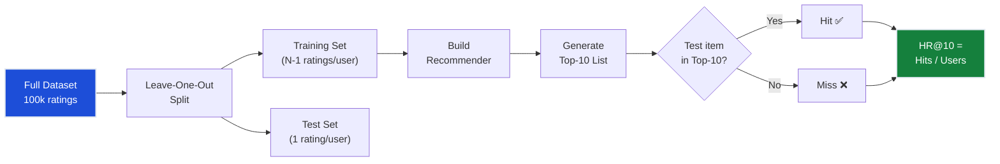
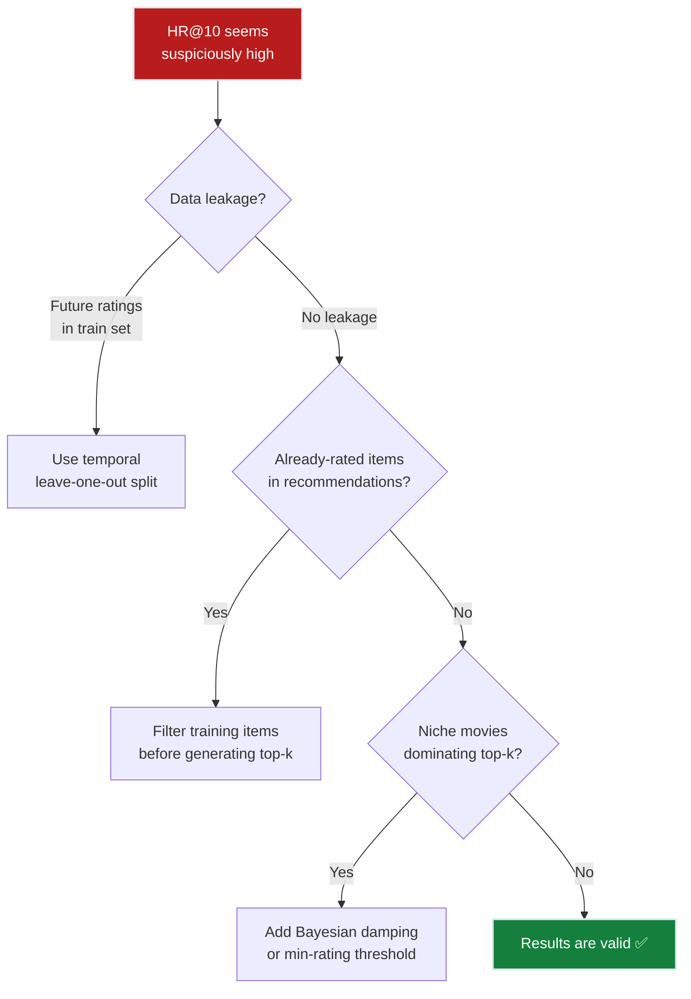

# Ch.1 — Recommender Systems Fundamentals

> **The story.** In **1992**, Xerox PARC researchers built **Tapestry**, the first system to use the phrase "collaborative filtering" — it let users annotate documents and filter based on other people's reactions. Three years later, the **GroupLens** project at the University of Minnesota applied the idea to Usenet news articles, and in 1997 they released the **MovieLens** dataset that became the Rosetta Stone of recommendation research. Amazon filed its item-based collaborative filtering patent in 1998. Netflix launched its $1M Prize in 2006, attracting 44,000 teams and proving that better algorithms = real business value. Today, recommendations drive 35% of Amazon purchases and 80% of Netflix viewing hours. The field has evolved from simple popularity lists to deep learning, but the core question remains: *given what we know about a user, what should we show them next?*
>
> **Where you are in the curriculum.** This is chapter one of the Recommender Systems track. You're a data scientist at a streaming platform called FlixAI, and your first task is the simplest possible baseline: recommend the most popular movies to everyone. It sounds lazy — and it is — but it establishes the evaluation framework and metrics that every later chapter builds on. Without measuring the baseline, you can't measure progress.
>
> **Notation in this chapter.** $u$ — a user; $i$ — an item (movie); $r_{ui}$ — rating given by user $u$ to item $i$; $\hat{r}_{ui}$ — predicted rating; $R$ — the user-item rating matrix ($m \times n$); $m$ — number of users; $n$ — number of items; $k$ — number of recommendations (top-$k$ list); $\text{HR}@k$ — hit rate at $k$ (fraction of users with ≥1 relevant item in top-$k$).

---

## 0 · The Challenge — Where We Are

> 💡 **The mission**: Launch **FlixAI** — a production movie recommendation engine satisfying 5 constraints:
> 1. **ACCURACY**: >85% hit rate@10 — 2. **COLD START**: New users/items — 3. **SCALABILITY**: 1M+ ratings — 4. **DIVERSITY**: Not just popular movies — 5. **EXPLAINABILITY**: "Because you liked X"

**What we know so far:**
- ✅ MovieLens 100k dataset loaded (943 users, 1,682 movies, 100k ratings, 93.7% sparse)
- ✅ Business stakes understood (every % point in hit rate = $2M ARR; users with zero hits churn in 30 days)
- ❌ **But you have NO model, NO metrics, NO baseline to compare against!**

The VP of Product won't accept vague claims. You need falsifiable numbers: "Our system achieves X% hit rate, which beats the naive baseline by Y points." Without a baseline, "it feels better" is meaningless.

**What's blocking us:**
You have the MovieLens 100k dataset (100,000 ratings from 943 users on 1,682 movies). You understand the business problem (recommend movies users will watch). But you have **no model, no metrics, no baseline**. Before building matrix factorization or neural networks, you must answer three questions:
- How do you measure recommendation quality?
- What accuracy can you achieve by just recommending popular movies to everyone?
- What does sparse data (93.7% of the user-item matrix is empty) mean for collaborative filtering later?

Without a baseline, you can't measure progress. Without evaluation metrics, you can't compare approaches. The VP of Product won't accept "it feels better" — you need numbers.

**What this chapter unlocks:**
- **Popularity baseline**: 42% hit rate@10 by recommending the same top-rated movies to all users (Bayesian-averaged to avoid niche-movie dominance)
- **Evaluation framework**: precision@k, recall@k, hit rate@k, NDCG@k — the shared metrics for Ch.1–6
- **Sparsity quantification**: 93.7% empty matrix — the constraint that drives Ch.2–3's latent factor approach


---

## Animation



## 1 · Core Idea

A recommender system predicts which items a user will prefer, then ranks those items to present a top-$k$ list. This chapter builds the simplest possible recommender — a **popularity baseline** (rank by average rating, recommend the same top-10 to everyone) — and establishes the evaluation metrics (precision@k, recall@k, hit rate@k, NDCG@k) that all later chapters share. You'll hit 42% on the hit-rate-at-10 metric — a 43-point gap to the 85% production target that later chapters must close.

---

## 2 · Running Example: What We're Solving

You're a data scientist at **FlixAI**, a movie streaming platform competing with Netflix. The VP of Product calls you into a meeting: "I need a recommendation widget for the homepage. I don't care how fancy the algorithm is — just show users movies they'll actually click. We're hemorrhaging engagement. Users scroll past our suggestions 60% of the time." 

Your first task: load the MovieLens 100k dataset (100,000 ratings from 943 users on 1,682 movies), understand its structure (93.7% of the user-item matrix is empty!), and build a popularity-based recommender as the baseline to beat. You have one week to show numbers.

---

## 3 · Math

### The User-Item Rating Matrix

The foundation of all recommender systems is the **user-item matrix** $R \in \mathbb{R}^{m \times n}$:

$$R = \begin{pmatrix} r_{11} & r_{12} & \cdots & r_{1n} \\ r_{21} & r_{22} & \cdots & r_{2n} \\ \vdots & \vdots & \ddots & \vdots \\ r_{m1} & r_{m2} & \cdots & r_{mn} \end{pmatrix}$$

| Symbol | Meaning | MovieLens value |
|--------|---------|-----------------|
| $m$ | Number of users | 943 |
| $n$ | Number of items | 1,682 |
| $r_{ui}$ | Rating by user $u$ on item $i$ | 1–5 (or missing) |
| Sparsity | $1 - \frac{|\text{observed ratings}|}{m \times n}$ | $1 - \frac{100{,}000}{1{,}585{,}126} = 93.7\%$ |

Most entries are **missing** (not zero — missing means "hasn't seen it", zero would mean "rated it 0"). This distinction between missing and zero is fundamental to recommendation.

### Popularity Baseline

The simplest recommender: rank items by average rating (or number of ratings) and recommend the same top-$k$ list to everyone:

$$\text{score}(i) = \frac{\sum_{u \in U_i} r_{ui}}{|U_i|}$$

where $U_i$ is the set of users who rated item $i$, and $|U_i|$ is the count.

**Concrete example**: Movie "Star Wars" has 583 ratings averaging 4.36. Movie "Shawshank Redemption" has 100 ratings averaging 4.45.

A pure average-rating ranking would put Shawshank above Star Wars, but Shawshank has far fewer ratings. A better approach weights by count:

$$\text{score}(i) = \frac{|U_i| \cdot \bar{r}_i + C \cdot \mu}{|U_i| + C}$$

where $\mu$ is the global mean rating and $C$ is a damping constant (typically the median number of ratings per movie). This is the **Bayesian average** — it shrinks low-count items toward the global mean.

### Evaluation Metrics

#### Precision@k

Of the $k$ items recommended, how many did the user actually interact with?

$$\text{Precision@}k = \frac{|\{\text{relevant items}\} \cap \{\text{recommended top-}k\}|}{k}$$

**Worked example — 3 users, k=5:**

| User | Relevant movies (rated 4+) | Recommended top-5 | Hits | Precision@5 |
|------|---------------------------|-------------------|------|-------------|
| Alice | {Star Wars, Fargo, Alien, Pulp Fiction} | {Star Wars, Shawshank, Fargo, Godfather, Forrest Gump} | {Star Wars, Fargo} | 2/5 = **0.40** |
| Bob | {Jurassic Park, Matrix} | {Star Wars, Shawshank, Fargo, Godfather, Forrest Gump} | {} | 0/5 = **0.00** |
| Carol | {Shawshank, Godfather} | {Star Wars, Shawshank, Fargo, Godfather, Forrest Gump} | {Shawshank, Godfather} | 2/5 = **0.40** |

Mean precision@5 across 3 users = (0.40 + 0.00 + 0.40) / 3 = **0.27**

#### Recall@k

Of all the items the user would interact with, how many did we surface in the top-$k$?

$$\text{Recall@}k = \frac{|\{\text{relevant items}\} \cap \{\text{recommended top-}k\}|}{|\{\text{relevant items}\}|}$$

**Continued example:**

| User | Total relevant | Hits in top-5 | Recall@5 |
|------|----------------|---------------|----------|
| Alice | 4 movies | 2 | 2/4 = **0.50** |
| Bob | 2 movies | 0 | 0/2 = **0.00** |
| Carol | 2 movies | 2 | 2/2 = **1.00** |

Mean recall@5 = (0.50 + 0.00 + 1.00) / 3 = **0.50**

💡 **Key insight:** Alice has higher recall (50%) than precision (40%) because she has 4 relevant movies total but only 2 were recommended. Carol has 100% recall (both her relevant movies appeared) but only 40% precision (the other 3 recommendations weren't relevant to her). Precision measures recommendation quality; recall measures coverage. **For FlixAI, hit rate matters most** — users who find zero relevant items in their top-10 churn within 30 days.

#### Hit Rate@k (HR@k)

The fraction of users for whom **at least one** recommended item is relevant:

$$\text{HR@}k = \frac{|\{u : |\text{relevant}_u \cap \text{top-}k_u| \geq 1\}|}{|\text{all users}|}$$

**Continued example:**

| User | Got ≥1 hit? |
|------|------------|
| Alice | ✅ Yes (2 hits) |
| Bob | ❌ No (0 hits) |
| Carol | ✅ Yes (2 hits) |

HR@5 = 2/3 = **0.67** (67% of users found at least one relevant movie in their top-5)

⚡ **Constraint #1 (ACCURACY) status**: 42% HR@10 → **43-point gap to 85% target**. The popularity baseline is the floor, not the ceiling. Every technique in Ch.2–6 exists to close this gap.

#### NDCG@k (Normalized Discounted Cumulative Gain)

Rewards relevant items appearing **higher** in the ranking:

$$\text{DCG@}k = \sum_{j=1}^{k} \frac{2^{\text{rel}_j} - 1}{\log_2(j+1)}$$

$$\text{NDCG@}k = \frac{\text{DCG@}k}{\text{IDCG@}k}$$

where $\text{rel}_j$ is the relevance of the item at position $j$ (typically 1 for relevant, 0 for not) and IDCG is the DCG of the ideal (perfect) ranking.

**Alice's ranking from the example above:**

| Position $j$ | Movie | Relevant? | $\text{rel}_j$ | $2^{\text{rel}_j}-1$ | $\log_2(j+1)$ | Contribution |
|------------|-------|-----------|---------|------------|----------|-------------|
| 1 | Star Wars | ✅ Yes | 1 | 1 | 1.00 | 1.00 |
| 2 | Shawshank | ❌ No | 0 | 0 | 1.58 | 0.00 |
| 3 | Fargo | ✅ Yes | 1 | 1 | 2.00 | 0.50 |
| 4 | Godfather | ❌ No | 0 | 0 | 2.32 | 0.00 |
| 5 | Forrest Gump | ❌ No | 0 | 0 | 2.58 | 0.00 |

DCG@5 = 1.00 + 0.00 + 0.50 + 0.00 + 0.00 = **1.50**

Ideal ranking (both relevant items at positions 1–2):
IDCG@5 = 1.00 + 1/1.58 = 1.00 + 0.63 = **1.63**

NDCG@5 = 1.50 / 1.63 = **0.92**

💡 **Key insight:** If Fargo had appeared at position 2 instead of position 3, DCG would be 1.00 + 0.63 = 1.63 (perfect score). NDCG penalizes pushing relevant items lower in the ranking — position 1 is worth 3.4× more than position 10. This matters for production: users rarely scroll past the first 3 recommendations.

### Worked 3×3 Example — Bayesian Average

Three users rating three movies (— = not rated):

| | Movie1 (Toy Story) | Movie2 (Fargo) | Movie3 (GoodFellas) |
|---|---|---|---|
| **Alice** | 5 | 4 | — |
| **Bob** | 4 | — | 3 |
| **Carol** | — | 5 | 4 |

Global mean $\mu = (5+4+4+3+5+4)/6 = 4.17$. Damping constant $C = 2$ (median ratings per movie).

| Movie | Ratings | $n$ | $\bar{r}$ | Bayesian avg $= (n\bar{r} + C\mu)/(n+C)$ |
|-------|---------|-----|-----------|------------------------------------------|
| Movie1 | 5, 4 | 2 | 4.50 | $(2 \times 4.50 + 2 \times 4.17)/4 = \mathbf{4.33}$ |
| Movie2 | 4, 5 | 2 | 4.50 | $(2 \times 4.50 + 2 \times 4.17)/4 = \mathbf{4.33}$ |
| Movie3 | 3, 4 | 2 | 3.50 | $(2 \times 3.50 + 2 \times 4.17)/4 = \mathbf{3.83}$ |

Movies 1 & 2 tie at 4.33; Movie 3 is pulled toward $\mu$ because its raw mean (3.50) is below the global mean. Without damping, a niche movie with two 5-star ratings would top the chart.

---

## 4 · Step by Step

```
POPULARITY BASELINE ALGORITHM
─────────────────────────────
1. Load rating data → user-item matrix R (sparse)

2. For each item i:
   └─ Compute score(i) = Bayesian average
      = (count_i × mean_i + C × global_mean) / (count_i + C)
      where C = median(count per item)

3. Sort items by score(i) descending

4. For each user u:
   └─ Remove items already rated by u
   └─ Recommend top-k remaining items

5. Evaluate:
   └─ For each test user, check if ≥1 held-out item appears in top-k
   └─ HR@k = fraction of users with ≥1 hit
```

---

## 5 · Key Diagrams

### Three Types of Recommender Systems



### Evaluation Pipeline



---

## 6 · Hyperparameter Dial

| Parameter | Too Low | Sweet Spot | Too High |
|-----------|---------|------------|----------|
| **k** (top-k) | k=1: too few choices, low recall | k=10: good balance of precision & recall | k=100: diluted, user overwhelmed |
| **C** (Bayesian damping) | C=0: niche movies with 2 ratings dominate | C=median(counts): balanced shrinkage | C=1000: everything converges to global mean |
| **Min ratings threshold** | 0: noisy items with 1 rating | 5–20: reliable averages | 100: only blockbusters survive |
| **Rating threshold** (relevant = ?) | 1: everything is "relevant" | 4+: genuine enjoyment signal | 5: too strict, almost no positives |

---

## 7 · Code Skeleton

```python
import pandas as pd
import numpy as np

# ── Load MovieLens 100k ──────────────────────────────────────────────────
ratings = pd.read_csv(
    'ml-100k/u.data', sep='\t',
    names=['user_id', 'item_id', 'rating', 'timestamp']
)

# ── Popularity baseline ──────────────────────────────────────────────────
item_stats = ratings.groupby('item_id')['rating'].agg(['mean', 'count'])
global_mean = ratings['rating'].mean()
C = item_stats['count'].median()

item_stats['bayesian_avg'] = (
    (item_stats['count'] * item_stats['mean'] + C * global_mean)
    / (item_stats['count'] + C)
)
top_items = item_stats.sort_values('bayesian_avg', ascending=False)

# ── Leave-one-out evaluation ─────────────────────────────────────────────
def leave_one_out_split(ratings, seed=42):
    """Hold out the last rating per user for testing."""
    ratings = ratings.sort_values('timestamp')
    test = ratings.groupby('user_id').tail(1)
    train = ratings.drop(test.index)
    return train, test

def hit_rate_at_k(top_k_items, test_set, k=10):
    """Fraction of users with ≥1 test item in their top-k."""
    hits = 0
    for user_id, row in test_set.iterrows():
        user_recs = top_k_items[:k]  # same for all users (popularity)
        if row['item_id'] in user_recs:
            hits += 1
    return hits / len(test_set)
```

---

## 8 · What Can Go Wrong

| Mistake | Symptom | Fix |
|---------|---------|-----|
| **Using raw average without damping** | Obscure movie with 2 ratings of 5.0 ranked #1 | Use Bayesian average with damping constant C |
| **Not removing already-rated items** | Recommending movies user already watched | Filter out training items before scoring |
| **Random train/test split** | Data leakage — future ratings in training set | Use temporal split (leave-one-out by timestamp) |
| **Treating missing as zero** | Inflates negative signal — unrated ≠ disliked | Only use observed ratings for scoring |
| **Evaluating on all items** | Unrealistic — user can't rate 1,682 movies | Use sampled negative evaluation (100 negatives + 1 positive) |




---

## 9 · Where This Reappears

**Evaluation metrics** introduced here (HR@k, precision@k, recall@k, NDCG@k) form the shared scaffolding for every subsequent chapter in this track:

- **Ch.2 Collaborative Filtering**: Uses HR@10 to measure the jump from 42% (popularity) → 68% (user-user CF) → same leave-one-out split strategy
- **Ch.3 Matrix Factorization**: Tracks HR@10 progression to 78% and introduces NDCG@10 to measure ranking quality as latent factors emerge
- **Ch.4 Neural Collaborative Filtering**: Compares HR@10 and NDCG@10 between linear (SVD) and non-linear (neural) approaches at 83%
- **Ch.5 Hybrid Systems**: Achieves 87% HR@10 (target met!) by fusing content + collaborative signals — still using the same evaluation protocol
- **Ch.6 Cold Start & Production**: Extends HR@k with A/B testing metrics (lift, CTR) but HR@10 remains the offline evaluation gold standard

**Bayesian average** (damping low-count items toward global mean) reappears in:
- **Track 8 Ensemble Methods**: Weighted averaging of model outputs uses the same shrinkage principle
- **AI Track / Evaluating AI Systems**: Retrieval metrics (MRR, NDCG) descend directly from the ranking framework built here

**Sparsity** (93.7% empty matrix) is the recurring villain:
- **Ch.2**: User-user CF struggles when users share few co-rated items (sparsity kills neighborhood formation)
- **Ch.3**: Matrix factorization solves this by learning latent factors that interpolate across missing entries
- **Ch.4**: Neural embeddings provide even denser representations, compressing 1,682 items into 50-dimensional vectors

💡 **Meta-lesson**: Every technique in Ch.2–6 is a response to sparsity. The popularity baseline ignores the user-item matrix structure entirely; every later chapter exploits it more deeply.

## 10 · Progress Check — What We Can Solve Now

✅ **Unlocked capabilities:**
- **Baseline established**: 42% hit rate@10 using popularity-based recommendations (Bayesian-averaged to avoid niche-movie dominance)
- **Evaluation framework**: precision@k, recall@k, HR@k, NDCG@k defined and demonstrated with worked 3-user examples
- **Sparsity quantified**: 93.7% of the 943×1,682 user-item matrix is empty — this drives the need for latent factors in Ch.3
- **Cold start trivially solved**: Same list for everyone works for new users (but provides zero personalization value)
- **Scalability achieved**: Precomputed list → O(n log n) sort once, O(1) lookup per user

❌ **Still can't solve:**
- ❌ **Accuracy gap: 43 points below target** — 42% HR@10 vs 85% goal. Treating all users identically leaves 58% of users with zero relevant recommendations.
- ❌ **Diversity fails by design** — Recommending "Shawshank Redemption" and "Star Wars" to everyone is accurate but useless. A 20-year-old action fan and a 60-year-old romance lover get the same 10 movies.
- ❌ **Explainability is weak** — "Because it's popular" provides no personal insight. Users don't trust recommendations they don't understand.

**Progress toward constraints:**

| # | Constraint | Target | Ch.1 Status | Evidence |
|---|-----------|--------|-------------|----------|
| **#1** | **ACCURACY** | >85% HR@10 | ❌ **42%** | 43-point gap — need personalization |
| **#2** | **COLD START** | New users/items | ⚠️ **Trivial** | Works but unhelpful (no taste signal) |
| **#3** | **SCALABILITY** | 1M+ ratings | ✅ **Achieved** | Precomputed list, O(1) per user |
| **#4** | **DIVERSITY** | Not just popular | ❌ **Fails** | By definition recommends only blockbusters |
| **#5** | **EXPLAINABILITY** | "Because you liked X" | ❌ **None** | "Popular" ≠ personalized reasoning |

**Real-world status**: You can launch a homepage widget that shows popular movies. It scales perfectly and handles cold start. But 58% of users find nothing worth watching in your top-10, and the recommendations provide zero personalization. The VP of Product would reject this.

**Diagnostic question**: *Why does the popularity baseline fail so badly?*
- **Root cause**: No user taste modeling. A user who rated 50 romance movies 5-stars and zero action movies gets recommended the same action blockbusters as everyone else.
- **What we're missing**: User-item similarity. If User A and User B both loved "The Godfather" and "Goodfellas", they probably have similar taste — recommend what A liked to B.

**Next up:** Ch.2 introduces **collaborative filtering** — find users with similar ratings, recommend what *they* liked. This jumps us from 42% → 68% by leveraging the structure of the 100k-rating matrix instead of ignoring it.


---

## 11 · Bridge to Next Chapter

The popularity baseline treats every user identically — a 20-year-old action fan and a 60-year-old romance lover get the same 10 movies. This fails spectacularly (42% hit rate). **Ch.2 introduces collaborative filtering**: find users with similar rating patterns ("User A and User B both loved The Godfather and Goodfellas → similar taste") and recommend what *they* liked. This is the first step toward personalization and jumps hit rate from 42% → 68%.

**What Ch.2 unlocks:** User-user and item-item similarity metrics (cosine, Pearson correlation), neighborhood formation, and personalized scoring.

**What Ch.2 can't solve yet:** Sparsity (93.7% empty matrix) limits the number of useful neighbors — two users must have rated overlapping items to compute similarity. We'll need latent factors (Ch.3 matrix factorization) to overcome this.


