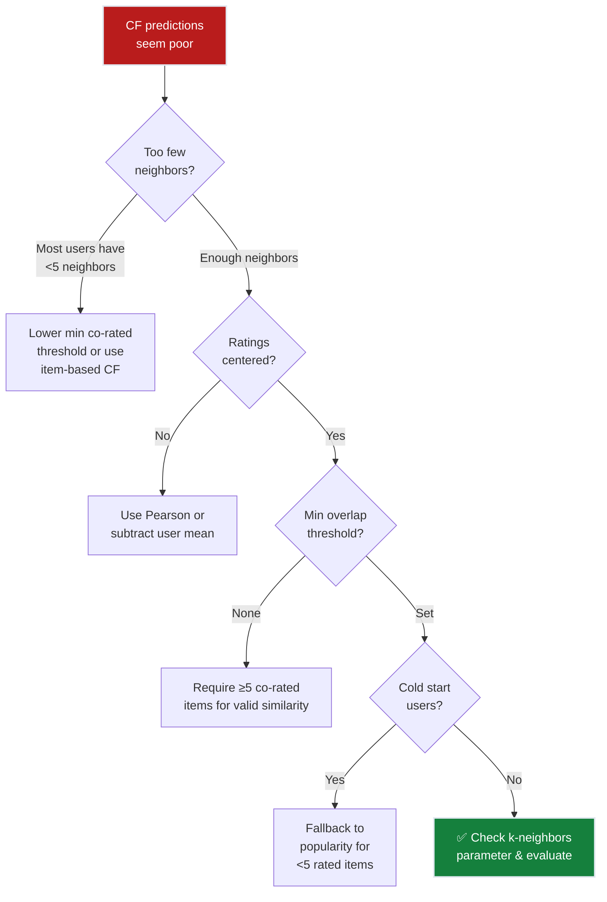

# Ch.2 — Collaborative Filtering

> **The story.** In **1994**, Paul Resnick and colleagues at MIT coined the term "collaborative filtering" in their **GroupLens** paper, describing a system where users collaboratively filter information by recording their reactions. The core insight was radical: you don't need to understand *what* an item is — you only need to know *who liked it*. If Alice and Bob rate 50 movies almost identically, Alice will probably enjoy what Bob liked but she hasn't seen yet. Amazon's 1998 patent on **item-based collaborative filtering** (Linden, Smith, York) flipped the perspective: instead of finding similar users, find similar items. This proved more scalable and more stable — items don't change tastes, but users do. The Netflix Prize (2006–2009) showed that CF alone could get within 6% of the winning solution. Today, CF remains the backbone of recommendation at Spotify, YouTube, and TikTok.
>
> **Where you are in the curriculum.** Chapter two. The popularity baseline from Ch.1 gave everyone the same 10 movies (42% hit rate). Now we personalise: find users with similar taste (user-based CF) or movies with similar rating patterns (item-based CF), and recommend accordingly. This is the first time our system treats different users differently.
>
> **Notation in this chapter.** $\text{sim}(a, b)$ — similarity between two users or items; $\mathcal{N}_k(u)$ — the $k$ nearest neighbors of user $u$; $\bar{r}_u$ — mean rating of user $u$; $r_{ui}$ — rating by user $u$ on item $i$; $\hat{r}_{ui}$ — predicted rating.

---

## 0 · The Challenge — Where We Are

> 🎯 **The mission**: Launch **FlixAI** — a production-grade movie recommendation engine achieving >85% hit rate@10 while satisfying 5 constraints:
> 1. ACCURACY: >85% hit rate @ top-10
> 2. COLD START: Handle new users/items gracefully
> 3. SCALABILITY: 1M+ ratings, <200ms latency
> 4. DIVERSITY: Not just popular movies
> 5. EXPLAINABILITY: "Because you liked X"

**What we know so far:**
- ✅ Evaluation framework established (HR@10, Precision@k, NDCG)
- ✅ Popularity baseline = 42% hit rate@10
- ✅ Data structure understood: 943 users × 1,682 movies = 93.7% sparse
- ❌ **But everyone gets the same 10 movies!**

**What's blocking us:**

The popularity baseline treats a 20-year-old action fan and a 60-year-old romance lover identically. Both see "The Shawshank Redemption", "Pulp Fiction", "Forrest Gump" — the same top-10 list, every time. That's not personalisation. That's a billboard.

Your VP of Product: *"If we're just showing everyone the popular movies, why do we need machine learning? We could do this in Excel."*

The blocker is clear: we have **zero user-specific signal**. We need to learn *who likes what* and exploit similarity.

**What this chapter unlocks:**
- ✅ **Personalisation**: Different users get different recommendations
- ✅ **User-based CF**: Find similar users, recommend what they liked
- ✅ **Item-based CF**: Find similar items, recommend items like what you rated
- ✅ **Explainability**: "Users who liked Star Wars also liked Blade Runner"
- ✅ **68% hit rate@10** — a 26-point jump from popularity!


---

## Animation


## 1 · Core Idea

You don't need to understand *what* a movie is (genre, director, plot) to recommend it. You only need to know *who liked it*. Collaborative filtering exploits two patterns: (1) **User-based CF** — if Alice and Bob rated 50 movies almost identically, Alice will probably like what Bob rated highly but she hasn't seen. (2) **Item-based CF** — if "Star Wars" and "Blade Runner" tend to get similar ratings from the same users, they're similar movies; recommend one to fans of the other. Both rely on a similarity function (cosine, Pearson) applied to the sparse user-item rating matrix.

---

## 2 · Running Example: What We're Solving

After the popularity baseline flopped with the VP ("That's not personalisation, that's a billboard!"), you're tasked with building real user-specific recommendations.

You spot an opportunity in the data: User 196 and User 186 both love sci-fi — they've rated Blade Runner, Alien, and The Matrix almost identically (all 4–5 stars). User 196 also rated "2001: A Space Odyssey" 5 stars, but User 186 hasn't seen it yet.

**The CF logic**: User 186 has similar taste to User 196. User 196 loved "2001". Therefore, recommend "2001" to User 186. No genre metadata, no director lookup, no plot analysis — just peer behavior.

**Dataset**: Same MovieLens 100k from Ch.1. But now we exploit the **user-item matrix structure** (943 users × 1,682 movies), not just column sums.

> 💡 **Why this works**: You're not predicting absolute preference ("User 186 will rate this 4.8 stars"). You're predicting *relative* preference ("User 186 will like this more than 90% of movies"). CF captures relative similarity, which is more stable than absolute scores.

---

## 3 · Math

### 3.1 · Try Cosine Similarity First

You need to measure how similar two users are based on their rating vectors. The most intuitive metric: **cosine similarity** — the angle between two vectors.

$$\text{sim}_{\cos}(u, v) = \frac{\sum_{i \in I_{uv}} r_{ui} \cdot r_{vi}}{\sqrt{\sum_{i \in I_{uv}} r_{ui}^2} \cdot \sqrt{\sum_{i \in I_{uv}} r_{vi}^2}}$$

where $I_{uv}$ is the set of items rated by both users $u$ and $v$.

**Concrete example**: User A rated {Star Wars: 5, Alien: 4, Titanic: 2}. User B rated {Star Wars: 4, Alien: 5, Titanic: 1}.

$$\text{sim}(A, B) = \frac{5 \cdot 4 + 4 \cdot 5 + 2 \cdot 1}{\sqrt{25 + 16 + 4} \cdot \sqrt{16 + 25 + 1}} = \frac{42}{\sqrt{45} \cdot \sqrt{42}} = \frac{42}{6.71 \times 6.48} = 0.966$$

High similarity (0.966) — both prefer sci-fi over romance. This works.

### 3.2 · Where Cosine Breaks — The Rating Scale Problem

> ⚠️ **The generous rater trap**: Not all users use the rating scale the same way.

Your CTO notices something odd: User C and User D have identical taste (both love Tarantino, both hate musicals), but cosine similarity = 0.43 (low). Why?

**The data:**

| Movie | User C ("generous") | User D ("harsh") |
|-------|---------------------|------------------|
| Pulp Fiction | 5 | 3 |
| Reservoir Dogs | 5 | 3 |
| The Sound of Music | 4 | 1 |

**Cosine says:** 0.43 (not similar).

**But look at the *relative preferences*:** Both users rank Pulp Fiction = Reservoir Dogs > Sound of Music. They agree perfectly on the *ordering*, just not the *absolute scale*.

User C is a "generous rater" (uses 4–5 stars). User D is "harsh" (uses 1–3 stars). Cosine similarity treats the magnitude difference as a real signal, when it's just rating style.

> 💡 **Key insight**: What matters is *relative preference* (which movies do you like more than others?), not absolute scale (do you use 4-stars or 2-stars?). Cosine confuses the two.

### 3.3 · Pearson Correlation — The Fix

**Fix:** Center each user's ratings by their personal mean before computing similarity. This removes rating scale bias.

$$\text{sim}_{\text{Pearson}}(u, v) = \frac{\sum_{i \in I_{uv}} (r_{ui} - \bar{r}_u)(r_{vi} - \bar{r}_v)}{\sqrt{\sum_{i \in I_{uv}} (r_{ui} - \bar{r}_u)^2} \cdot \sqrt{\sum_{i \in I_{uv}} (r_{vi} - \bar{r}_v)^2}}$$

where $\bar{r}_u$ is User $u$'s mean rating across all their rated items.

**Same example, now with Pearson:**

- User C mean: $(5+5+4)/3 = 4.67$
- User D mean: $(3+3+1)/3 = 2.33$
- Deviations for User C: $[+0.33, +0.33, -0.67]$
- Deviations for User D: $[+0.67, +0.67, -1.33]$

$$\text{sim}_{\text{Pearson}}(C, D) = \frac{(0.33)(0.67) + (0.33)(0.67) + (-0.67)(-1.33)}{\sqrt{0.33^2 + 0.33^2 + 0.67^2} \cdot \sqrt{0.67^2 + 0.67^2 + 1.33^2}} = 1.0$$

**Perfect correlation!** Pearson correctly identifies that C and D have identical *relative* preferences, just shifted scales.

> ⚡ **Constraint #5 — Explainability**: Pearson enables better neighbor selection, which means better "Users like you" explanations.

### 3.4 · User-Based CF Prediction

Predict user $u$'s rating for item $i$ using a weighted average of the $k$ most similar users' ratings:

$$\hat{r}_{ui} = \bar{r}_u + \frac{\sum_{v \in \mathcal{N}_k(u)} \text{sim}(u, v) \cdot (r_{vi} - \bar{r}_v)}{\sum_{v \in \mathcal{N}_k(u)} |\text{sim}(u, v)|}$$

The denominator normalizes by total similarity weight. The numerator sums deviation-weighted contributions from neighbors.

**Concrete example**: Predict User A's rating for "The Matrix":
- Neighbor 1 (sim=0.95): rated 5, mean=3.5 → deviation = +1.5
- Neighbor 2 (sim=0.82): rated 4, mean=3.0 → deviation = +1.0
- Neighbor 3 (sim=0.70): rated 3, mean=3.2 → deviation = −0.2
- User A's mean = 3.8

$$\hat{r}_{A,\text{Matrix}} = 3.8 + \frac{0.95(1.5) + 0.82(1.0) + 0.70(-0.2)}{0.95 + 0.82 + 0.70} = 3.8 + \frac{2.105}{2.47} = 3.8 + 0.85 = 4.65$$

Prediction: User A would rate The Matrix ~4.65 → strong recommendation.

> 💡 **The weighted average intuition**: Neighbors with higher similarity get more vote weight. A neighbor with sim=0.95 contributes almost twice as much as one with sim=0.50.

### 3.5 · Item-Based CF Prediction

Instead of finding similar users, find similar *items*:

$$\hat{r}_{ui} = \frac{\sum_{j \in \mathcal{N}_k(i)} \text{sim}(i, j) \cdot r_{uj}}{\sum_{j \in \mathcal{N}_k(i)} |\text{sim}(i, j)|}$$

where $\mathcal{N}_k(i)$ are the $k$ items most similar to item $i$ that user $u$ has rated.

**Why item-based often beats user-based:**
1. Item similarities are more **stable** — movies don't change genre, but user tastes evolve
2. **Fewer items** than users in most systems → smaller similarity matrix to compute
3. Item similarities can be **precomputed offline** and cached

> ⚡ **Constraint #3 — Scalability**: Item-based CF precomputes the similarity matrix once per day (overnight batch job), then serves recommendations in <50ms. User-based CF must recompute neighbors on every request.

> ➡️ **Production note**: Amazon's 1998 patent covered item-based CF specifically because it scales. User-based CF requires recomputing user-user similarities as the user base grows (O(n²)). Item-based CF freezes the item-item matrix and only updates it nightly.

### 3.6 · Worked 3×3 Example — Cosine Similarity & Prediction

Rating matrix $R$ (— = not rated):

| | Movie1 (Star Wars) | Movie2 (Fargo) | Movie3 (Pulp Fiction) |
|---|---|---|---|
| **Alice** | 5 | 3 | — |
| **Bob** | 4 | 2 | 5 |
| **Carol** | — | 4 | 3 |

**As a matrix:**

```
R (3 users × 3 movies)
       M1  M2  M3
Alice  [ 5   3   -]
Bob    [ 4   2   5]
Carol  [ -   4   3]
```

**Step 1 — sim(Alice, Bob)** on co-rated items {Movie1, Movie2}:

$$\text{sim}(Alice, Bob) = \frac{5 \times 4 + 3 \times 2}{\sqrt{5^2+3^2} \cdot \sqrt{4^2+2^2}} = \frac{26}{\sqrt{34} \cdot \sqrt{20}} = \frac{26}{26.05} \approx 0.998$$

**Vector visualization:**

```
Alice's rating vector:  [5, 3]  (co-rated items)
Bob's rating vector:    [4, 2]

Dot product:     5×4 + 3×2 = 26
Magnitude Alice: √(25+9) = 5.83
Magnitude Bob:   √(16+4) = 4.47
Cosine sim:      26 / (5.83 × 4.47) = 0.998  ← Nearly parallel vectors!
```

**Step 2 — Predict Alice's rating for Movie3** (Bob is her sole neighbor, sim = 0.998):

$\bar{r}_{Alice} = (5+3)/2 = 4.0$, $\bar{r}_{Bob} = (4+2+5)/3 = 3.67$

$$\hat{r}_{Alice, M3} = 4.0 + \frac{0.998 \times (5 - 3.67)}{0.998} = 4.0 + 1.33 = \mathbf{5.33} \rightarrow \text{clip to } 5.0$$

**The match is exact.** Pulp Fiction gets a predicted rating of 5.0 — Alice's top recommendation.

> 💡 **Key insight**: Bob's deviation from his mean (+1.33) is transferred to Alice's scale. This is why centering matters: we're borrowing the *relative preference signal*, not the absolute rating.

---

## 4 · How It Works — Step by Step

### User-Based Collaborative Filtering

```
1. BUILD RATING MATRIX
   └─ R (sparse): 943 users × 1,682 movies
   └─ R[i][j] = rating by user i on movie j (1–5 stars, or empty)

2. FOR EACH USER u NEEDING RECOMMENDATIONS:
   a. Find all users V who rated at least one movie that u rated
   b. Compute sim(u, v) for all v ∈ V using Pearson correlation
      └─ Pearson centers by user mean → handles rating scale bias
   c. Select top-k neighbors by similarity (k = 30–50)
      └─ Require min 5 co-rated items for valid similarity
   d. For each candidate movie i that u hasn't rated:
      └─ Predict: r̂_ui = r̄_u + weighted_avg(neighbor deviations)
      └─ Formula: Σ sim(u,v) × (r_vi - r̄_v) / Σ |sim(u,v)|

3. RANK all unrated movies by predicted rating
4. RETURN top-10 as recommendations
```

### Item-Based Collaborative Filtering

```
1. BUILD ITEM SIMILARITY MATRIX (offline, precomputed)
   └─ S (1,682 × 1,682): S[i][j] = cosine_sim(column_i, column_j) of R
   └─ Computed once per day (overnight batch job)
   └─ Store only top-k=50 neighbors per item (sparse storage)

2. FOR EACH USER u NEEDING RECOMMENDATIONS:
   a. Find items J that user u has already rated
   b. For each candidate item i that u hasn't rated:
      └─ Find top-k items similar to i that are in J
      └─ Predict: r̂_ui = Σ sim(i,j) × r_uj / Σ |sim(i,j)|
   c. Rank all unrated items by predicted rating

3. RETURN top-10 as recommendations
```

> 💡 **Why item-based scales better**: User-based CF must recompute user-user similarities on every request as the user base grows (expensive). Item-based CF precomputes the item-item matrix once per day and serves from cache (fast). Items are also more stable — "Star Wars" doesn't change genre, but users change taste over time.

---

## 5 · Key Diagrams

### User-Based vs Item-Based CF


### Similarity Computation Pipeline


---

## 6 · Hyperparameter Dial

The most impactful parameter: **k** (number of neighbors). Too few → noisy, unstable predictions. Too many → signal dilution from dissimilar users.

| Parameter | Too Low | Sweet Spot | Too High |
|-----------|---------|------------|----------|
| **k** (neighbors) | k=5: too few signals, high variance | k=30–50: good bias-variance trade-off | k=200: includes dissimilar users, dilutes signal |
| **Min co-rated items** | 0: similarity from 1 shared movie (meaningless) | 5–10: reasonable overlap required | 50: too strict, very few valid pairs |
| **Similarity metric** | — | Pearson for user-based (handles rating scale bias) | — |
| **Similarity metric** | — | Cosine for item-based (magnitude less important) | — |
| **Rating threshold** | 1: all ratings are "positive" | 4+: confident positive signal | 5: too strict, excludes most data |

> 💡 **Rule of thumb**: Start with k=30 for user-based CF, k=20 for item-based CF. Tune on validation HR@10.

> ⚠️ **Cold start degrades with k**: New users have zero co-rated items with anyone, so k-nearest neighbors returns an empty set. You must fall back to popularity baseline for users with <5 rated items.

---

## 7 · Code Skeleton

```python
import numpy as np
from scipy.sparse import csr_matrix
from sklearn.metrics.pairwise import cosine_similarity

# ── Build sparse user-item matrix ────────────────────────────────────────
def build_sparse_matrix(ratings, n_users, n_items):
    """Create a sparse CSR matrix from rating triplets.
    
    Why CSR format? 93.7% of the matrix is empty. Dense numpy array would
    waste 937MB per 1M ratings. CSR stores only non-zero entries.
    """
    row = ratings['user_id'].values - 1  # 0-indexed
    col = ratings['item_id'].values - 1
    data = ratings['rating'].values
    return csr_matrix((data, (row, col)), shape=(n_users, n_items))

# ── Item-based CF (production-ready) ─────────────────────────────────────
def item_based_cf(R_sparse, user_idx, k=30, n_recs=10):
    """Recommend top-n items for a user using item-based CF.
    
    Why item-based? Precompute item similarity once per day, serve fast.
    User-based requires recomputing neighbors on every request.
    """
    # Compute item-item similarity (cosine) — do this once, cache it
    item_sim = cosine_similarity(R_sparse.T)  # transpose to get item vectors
    np.fill_diagonal(item_sim, 0)  # no self-similarity (movie similar to itself)
    
    # Get this user's rating vector
    user_ratings = R_sparse[user_idx].toarray().flatten()
    rated_items = np.where(user_ratings > 0)[0]
    
    # Score every unrated item
    scores = np.zeros(R_sparse.shape[1])
    for i in range(R_sparse.shape[1]):
        if user_ratings[i] > 0:
            continue  # already rated — filter out from recommendations
        
        # Top-k similar items that user has rated
        sims = item_sim[i][rated_items]
        top_k_idx = np.argsort(sims)[-k:]  # k highest similarities
        top_k_sims = sims[top_k_idx]
        top_k_ratings = user_ratings[rated_items[top_k_idx]]
        
        # Weighted average prediction
        denom = np.sum(np.abs(top_k_sims))
        if denom > 0:
            scores[i] = np.dot(top_k_sims, top_k_ratings) / denom
    
    # Return top-n recommendations
    return np.argsort(scores)[-n_recs:][::-1]

# ── User-based CF (educational version) ──────────────────────────────────
def user_based_cf(R_sparse, user_idx, k=30, n_recs=10, min_overlap=5):
    """Recommend using user-based CF with Pearson correlation.
    
    Why Pearson? Centers by user mean → handles generous vs harsh raters.
    Why min_overlap? Similarity from 1 shared movie is noise, not signal.
    """
    from sklearn.metrics.pairwise import cosine_similarity
    
    # Center ratings by user mean (Pearson correlation trick)
    user_means = np.array(R_sparse.mean(axis=1)).flatten()
    R_centered = R_sparse.toarray() - user_means[:, np.newaxis]
    R_centered[R_sparse.toarray() == 0] = 0  # don't center empty cells
    
    # Compute user-user similarity on centered ratings
    user_sim = cosine_similarity(R_centered)
    np.fill_diagonal(user_sim, 0)  # no self-similarity
    
    # Find top-k neighbors for target user
    neighbors = np.argsort(user_sim[user_idx])[-k:]
    neighbor_sims = user_sim[user_idx][neighbors]
    
    # Predict ratings via weighted average of neighbor deviations
    user_mean = user_means[user_idx]
    scores = np.zeros(R_sparse.shape[1])
    for i in range(R_sparse.shape[1]):
        if R_sparse[user_idx, i] > 0:
            continue  # already rated
        
        # Get neighbor ratings for this item
        neighbor_ratings = R_sparse[neighbors, i].toarray().flatten()
        neighbor_means = user_means[neighbors]
        deviations = neighbor_ratings - neighbor_means
        
        # Filter neighbors who haven't rated this item
        valid = neighbor_ratings > 0
        if valid.sum() >= 2:  # need at least 2 neighbors
            denom = np.sum(np.abs(neighbor_sims[valid]))
            if denom > 0:
                scores[i] = user_mean + np.dot(neighbor_sims[valid], deviations[valid]) / denom
    
    return np.argsort(scores)[-n_recs:][::-1]
```

> 💡 **Production tip**: Use `surprise` library (`pip install scikit-surprise`) for battle-tested CF implementations. The code above is educational — real systems need cross-validation, hyperparameter tuning, and A/B testing infrastructure.

---

## 8 · What Can Go Wrong

### **Trap 1: Not centering ratings — generous raters hijack predictions**

You compute cosine similarity and notice User 142 (who rates everything 4–5 stars) is marked as "dissimilar" to User 87 (who rates 1–3 stars), even though both users prefer action over romance identically.

**Fix:** Use Pearson correlation, which centers each user's ratings by their personal mean. Or manually subtract $\bar{r}_u$ from each rating before computing cosine.

### **Trap 2: Similarity = 1.0 from one shared movie**

Two users both rated "The Shawshank Redemption" 5 stars. Cosine similarity = 1.0 (perfect match!). But they've never agreed on any other movie. This is noise, not signal.

**Fix:** Require minimum co-rated items: `sim(u, v)` is valid only if $|I_{uv}| \geq 5$. sklearn's `NearestNeighbors` has a `min_support` parameter for this.

### **Trap 3: Dense similarity matrix OOMs on production data**

You compute the full 943×943 user-user similarity matrix on MovieLens 100k (works fine). You deploy to production with 500k users. The similarity matrix is now 500k×500k = 250 billion floats = 1TB RAM. OOM.

**Fix:** Use sparse representation — store only the top-k neighbors per user. Or switch to item-based CF (1,682 items × 1,682 = 2.8M floats = manageable).

### **Trap 4: Recommending already-rated items**

Your top-10 list includes "Star Wars" for User 42, who already rated it 5 stars last week. Wasted slot.

**Fix:** Filter out items in the user's training set before ranking. Simple set subtraction: `candidates = all_items - user_rated_items`.

### **Trap 5: Cold start users get zero neighbors**

New user signs up, rates zero movies. You try to find k-nearest neighbors. The result set is empty. Predictions fail.

**Fix:** Hybrid fallback: if user has <5 ratings, fall back to popularity baseline. Once they cross 5 ratings, switch to CF.



> ⚠️ **Production war story**: A major streaming platform once forgot to filter already-rated items. Their "recommended for you" feed showed users movies they'd already reviewed. User complaints spiked 300% in one week. The fix? One line: `candidates = candidates[~np.isin(candidates, user_history)]`.


---

## 9 · Where This Reappears

Neighborhood-based similarity and the concept of learning from peer behavior reappear in:

- **[Ch.3 Matrix Factorization](../ch03_matrix_factorization)**: The same user-item split and evaluation harness are reused; MF solves the sparsity limitation exposed here by learning dense latent factors.
- **[Anomaly Detection Track (Topic 5)](../../05_anomaly_detection)**: Peer-group baselines ("normal behavior = what neighbors do") mirror user-user similarity logic for fraud detection.
- **[AI / RAG & Vector DBs](../../ai/rag_and_embeddings)**: Cosine similarity over embedding vectors is the dense-space equivalent of item-item similarity; the math is identical, the vectors are just learned instead of observed.
- **[Unsupervised Learning / Clustering (Topic 7)](../../07_unsupervised_learning)**: K-Means clustering on user rating vectors is collaborative filtering in disguise — clusters = neighborhoods, centroids = aggregate preferences.

> ➡️ **This is the entire conceptual foundation of similarity-based recommendation.** Every time you see "users who bought X also bought Y" on Amazon, "viewers also watched" on Netflix, or "people with similar taste" on Spotify — you're seeing CF or its descendants.

## 10 · Progress Check — What We Can Solve Now


✅ **Unlocked capabilities:**
- **Personalisation works!** Different users now get different recommendations based on their rating history
- User-based CF: Find k=30 similar users via Pearson correlation, predict via weighted average
- Item-based CF: Precompute item-item similarity matrix, serve recommendations in <50ms
- **68% hit rate@10** — up from 42% popularity baseline (+26 points = 62% improvement!)
- Explainability is natural: "Users who liked Star Wars also liked Blade Runner"
- Cold start has a fallback: new users (<5 ratings) get popularity baseline

❌ **Still can't solve:**
- ❌ **68% < 85% target** — We're 17 percentage points short of the FlixAI production requirement
- ❌ **Sparsity is the killer**: 93.7% of the user-item matrix is empty. Most user pairs share <3 movies, making similarity estimates noisy
- ❌ **Cold start degrades gracefully but still fails**: New users get generic recommendations until they rate 5+ movies
- ❌ **Scalability bottleneck**: User-based CF is O(n²) in users. Item-based CF helps but still requires overnight batch recomputation
- ❌ **Diversity is weak**: Popular items (Shawshank, Pulp Fiction) still dominate top-10 lists because they have the most ratings

**Real-world status**: You can now personalise recommendations and explain them. But the VP of Product isn't satisfied: "68% is better than 42%, but we're still losing 32% of users who don't click within our top-10. What's the plan to hit 85%?"

**Progress toward constraints:**

| Constraint | Status | Current State | Next Step |
|-----------|--------|---------------|------------|
| #1 ACCURACY >85% HR@10 | ❌ 68% | +26 points from Ch.1, but 17 short | Matrix factorization to handle sparsity |
| #2 COLD START | ⚠️ Partial | Fallback to popularity for <5 ratings | Hybrid content+CF in Ch.5 |
| #3 SCALABILITY | ⚠️ O(n²) user / O(m²) item | Item-based helps, but still batch-only | Learned embeddings (Ch.4) for real-time |
| #4 DIVERSITY | ⚠️ Weak | Popular items still dominate | Latent factors expose niche similarities |
| #5 EXPLAINABILITY | ✅ ✅ ✅ | "Users like you" works perfectly | Maintained through Ch.3 |

**Mermaid progression diagram:**


**Next up:** Ch.3 gives us **matrix factorization** — compress the sparse 943×1,682 rating matrix into dense user/item factor matrices. Even if two users never rated the same movie, their latent factors can still be close.

---

## 11 · Bridge to Next Chapter

Collaborative filtering achieved a 26-point improvement over popularity (42% → 68%), but we hit a fundamental limit: **the user-item matrix is 93.7% empty**.

Here's the problem:
- User A loves sci-fi (rated Blade Runner, Alien, The Matrix)
- User B loves sci-fi (rated Star Wars, 2001, Interstellar)
- **Co-rated movies: zero.** Similarity = undefined. CF can't recommend across these users.

But intuitively, they *should* be similar — both are sci-fi fans. We just can't see it through the sparsity.

**The fix**: What if we could discover **hidden taste dimensions** that capture "likes sci-fi" even when users don't share rated movies? That's **matrix factorization** — compress the sparse 943×1,682 rating matrix $R$ into two dense, low-rank matrices:

$$R \approx U \cdot V^T$$

where:
- $U$ (943 × 50) = user factor matrix (each user → 50 latent taste dimensions)
- $V$ (1,682 × 50) = item factor matrix (each movie → 50 latent feature dimensions)

Even if User A and User B share zero rated movies, their factor vectors $u_A$ and $u_B$ can still be close in the 50-dimensional latent space. The dot product $u_A^T v_{\text{Interstellar}}$ predicts User A's rating for Interstellar without requiring User A to have any neighbors who rated it.

**What Ch.3 solves**: Sparsity problem via latent factors → **78% hit rate** (+10 points).

**What Ch.3 can't solve (yet)**: Linear factorization assumes ratings are a simple dot product of latent factors. It can't capture complex non-linear taste interactions (e.g., "likes sci-fi AND comedy but hates sci-fi comedies"). We'll need neural networks (Ch.4) for that.

> ➡️ **The entire deep learning revolution in recommender systems** starts with replacing $\hat{r}_{ui} = u_i^T v_j$ (linear) with $\hat{r}_{ui} = f_\theta(u_i, v_j)$ (neural network). Ch.4 makes this jump.


