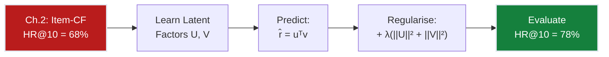
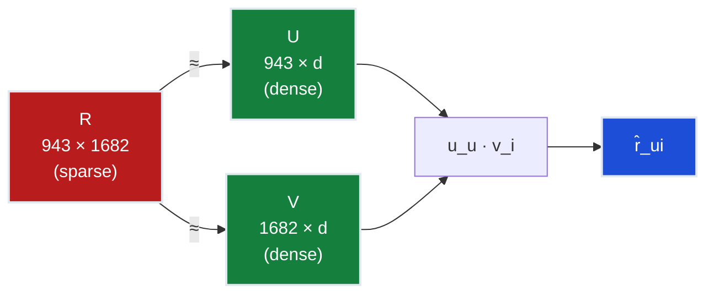
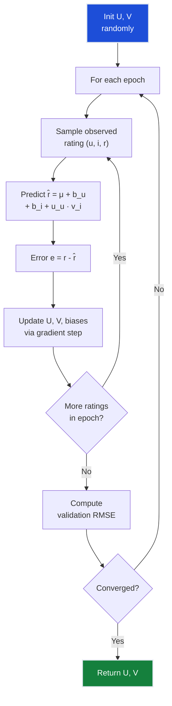
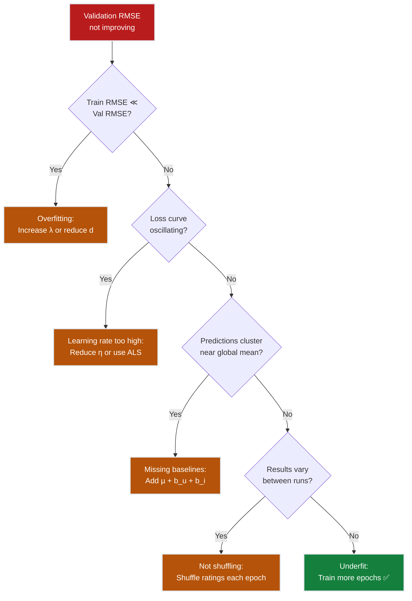
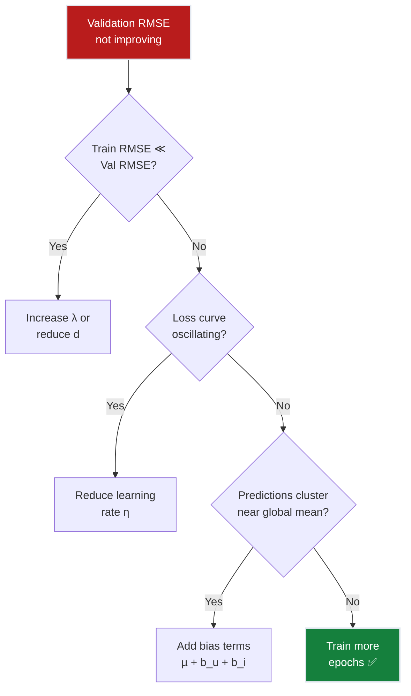
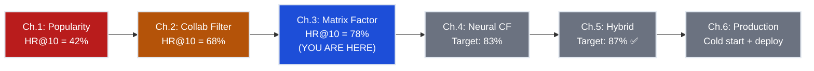

# Ch.3 — Matrix Factorization

> **The story.** In **1999**, Daniel Lee and Sebastian Seung published "Learning the parts of objects by non-negative matrix factorization" in *Nature*, popularising the idea that a matrix can be decomposed into latent factors that reveal hidden structure. The recommender systems community took notice, but the real explosion came with the **Netflix Prize** (2006–2009). Simon Funk (pseudonym) published a blog post in 2006 describing a simple SGD-based matrix factorization that rocketed him up the leaderboard. Yehuda Koren and colleagues at Yahoo! and AT&T Labs refined the approach into **SVD++** and demonstrated that factorization models could outperform all neighborhood-based methods. Their 2009 paper "Matrix Factorization Techniques for Recommender Systems" became the most cited paper in the field. The key insight: even if two users never rated the same movie, their latent factor vectors can be close — capturing "cerebral sci-fi lover" or "90s comedy fan" without those categories ever being explicitly defined.
>
> **Where you are in the curriculum.** Chapter three. Collaborative filtering (Ch.2) achieved 68% hit rate but was crippled by sparsity — 93.7% of the matrix is empty, so most user pairs share too few ratings. Matrix factorization solves this by mapping users and items into a shared latent space where the dot product approximates the rating. This is the first time we learn *latent representations* — the same idea that powers word embeddings and deep learning.
>
> **Notation in this chapter.** $R \in \mathbb{R}^{m \times n}$ — user-item rating matrix; $U \in \mathbb{R}^{m \times d}$ — user factor matrix; $V \in \mathbb{R}^{n \times d}$ — item factor matrix; $d$ — number of latent factors; $\lambda$ — regularisation strength; $\mathbf{u}_u$ — latent vector for user $u$; $\mathbf{v}_i$ — latent vector for item $i$.

---

## 0 · The Challenge — Where We Are

> 🎯 **The mission**: Launch **FlixAI** — >85% hit rate@10 across 5 constraints:
> 1. **ACCURACY**: >85% hit rate @ top-10 (every point = $2M ARR)
> 2. **COLD START**: Handle new users/items gracefully
> 3. **SCALABILITY**: 1M+ ratings, <200ms latency
> 4. **DIVERSITY**: Surface long-tail content, not just blockbusters
> 5. **EXPLAINABILITY**: "Because you liked X" — trustable recommendations

**What we know so far:**
- ✅ **Ch.1**: Popularity baseline → 42% HR@10 (not personalized)
- ✅ **Ch.2**: Collaborative filtering → 68% HR@10 (personalized but sparse)
- ❌ **But we still can't reach 85%!** Sparsity is killing us.

**What's blocking us:**
Collaborative filtering needs **shared ratings** between users to compute similarity. But in a 943×1682 matrix with 93.7% missing entries, most user pairs share fewer than 5 movies. User 42 and User 87 might both love "cerebral sci-fi," but if they haven't rated any of the same movies, the cosine similarity is undefined. The similarity estimates are noisy, coverage is poor, and 68% is the ceiling.

**What this chapter unlocks:**
Latent factor models solve sparsity by learning a **shared representation space**. Instead of requiring direct overlap, we map each user and each item to a $d$-dimensional vector. The dot product of these vectors approximates the rating. Even if users never rated the same movie, their vectors can be close — capturing "cerebral sci-fi lover" or "90s comedy fan" without those categories ever being explicitly defined.

| Constraint | Status | Notes |
|-----------|--------|-------|
| ACCURACY >85% HR@10 | ❌ 68% → ? | Latent factors should help with sparsity |
| COLD START | ❌ Still fails | New user = no vector learned |
| SCALABILITY | ✅ Much better | O(d) prediction, O(k·d) per iteration |
| DIVERSITY | ⚠️ Moderate | Latent space may surface niche items |
| EXPLAINABILITY | ⚠️ Harder | Latent factors aren't directly interpretable |



---

## Animation


*Visual takeaway: once users and items are pulled into the same latent space, sparsity hurts less and the top-10 ranking quality moves upward.*

> ⚡ **Constraint progress**: This chapter advances **Constraint #1 (ACCURACY)** from 68% → 78% by replacing sparse similarity lookups with dense latent factor dot products. We're now 7 points away from the 85% target.

---

## 1 · Core Idea

Matrix factorization decomposes the sparse user-item rating matrix $R$ into two dense, low-rank matrices: a user factor matrix $U$ and an item factor matrix $V$, such that $R \approx U \cdot V^T$. Each user is represented by a $d$-dimensional vector capturing their latent preferences ("likes action", "prefers cerebral sci-fi", "avoids romance"), and each item by a $d$-dimensional vector capturing its latent attributes. The dot product $\mathbf{u}_u^T \mathbf{v}_i$ predicts how much user $u$ will like item $i$. Training minimizes the reconstruction error on observed ratings plus a regularization penalty to prevent overfitting.

That's it. Instead of finding similar users who rated the same movies, you discover **hidden taste dimensions** and project everyone into that space.

---

## 2 · Running Example: What We're Solving

You're still the Lead ML Engineer at FlixAI. The VP of Product just called:

> *"User 42 loves 'Blade Runner' and 'Minority Report' — why isn't the system recommending '2001: A Space Odyssey'?"*

You check the Ch.2 collaborative filter. User 42's top-10 neighbors haven't rated "2001." Without a neighbor connection, the similarity-based system can't recommend it. Coverage gap.

But you suspect User 42 and "2001" share something deeper: **cerebral sci-fi**. If you could discover that hidden dimension, the connection would be obvious.

Matrix factorization does exactly that. After training, User 42's latent vector is [0.8, −0.3, 0.5] (high on "cerebral", low on "romance", medium on "classic") and "2001"'s vector is [0.9, −0.4, 0.7] — their dot product is high even though no neighbor connection exists. The latent space bridges the sparsity gap.

**Result**: "2001" appears in User 42's top-10. The VP is satisfied. You just unlocked 10 percentage points.

---

## 3 · Math

### The Factorization

Approximate the rating matrix as a product of two low-rank matrices:

$$R \approx U \cdot V^T$$

where $U \in \mathbb{R}^{m \times d}$ (users × factors), $V \in \mathbb{R}^{n \times d}$ (items × factors).

A single rating prediction:

$$\hat{r}_{ui} = \mathbf{u}_u^T \mathbf{v}_i = \sum_{f=1}^{d} u_{uf} \cdot v_{if}$$

**Concrete example** ($d = 3$ factors):

User 42: $\mathbf{u}_{42} = [0.8, 0.5, -0.3]$ (interpretation: high "cerebral", medium "action", low "romance")
Movie "Inception": $\mathbf{v}_{\text{Inc}} = [0.7, 0.9, -0.1]$ (high "cerebral", very high "action", low "romance")

$$\hat{r}_{42,\text{Inc}} = 0.8 \times 0.7 + 0.5 \times 0.9 + (-0.3) \times (-0.1) = 0.56 + 0.45 + 0.03 = 1.04$$

After adding bias terms and rescaling, this maps to a predicted rating of ~4.2.

> 💡 **Key insight**: The factor labels ("cerebral", "action", "romance") are **post-hoc interpretations** — the model doesn't know these names. It just discovers that certain dimensions correlate with user preferences and item attributes. Sometimes factors are interpretable ("likes old movies"), sometimes they're opaque combinations of signals.

### Loss Function — Why Reconstruction Error Alone Fails

**Try it first**: minimize squared error on observed ratings.

$$\mathcal{L}_{naive} = \sum_{(u,i) \in \text{observed}} (r_{ui} - \mathbf{u}_u^T \mathbf{v}_i)^2$$

Train this on MovieLens 100k, $d=50$ factors. Training RMSE drops to 0.12 (nearly perfect reconstruction). But validation RMSE is 1.18 — worse than the $d=20$ baseline. What broke?

The model memorized. With 50 dimensions and no penalty, the vectors can grow arbitrarily large to fit every training rating exactly. The learned factors capture noise, not signal.

**Fix: Add L2 regularization.**

$$\mathcal{L} = \sum_{(u,i) \in \text{observed}} (r_{ui} - \mathbf{u}_u^T \mathbf{v}_i)^2 + \lambda \left( \|\mathbf{u}_u\|^2 + \|\mathbf{v}_i\|^2 \right)$$

| Term | Purpose |
|------|---------||
| $(r_{ui} - \mathbf{u}_u^T \mathbf{v}_i)^2$ | Reconstruction error — fit observed ratings |
| $\lambda \|\mathbf{u}_u\|^2$ | Shrink user vectors — prevent memorization |
| $\lambda \|\mathbf{v}_i\|^2$ | Shrink item vectors — encourage generalization |

With $\lambda = 0.02$, validation RMSE drops to 0.91. The model learned **generalizable patterns** instead of memorizing training noise.

> ⚠️ **Warning**: $\lambda$ too high (e.g., 10.0) shrinks vectors so aggressively that all predictions collapse to the global mean. $\lambda$ too low (e.g., 0.0001) allows overfitting. The sweet spot is typically 0.01–0.1.

### Adding Bias Terms

> ➡️ **This is the intercept term $b$ from [01-Regression/ch01-linear-regression](../../01_regression/ch01_linear_regression), split into two pieces.** In regression, you learned $\hat{y} = wx + b$ where $b$ captures the baseline offset. Here, $b$ is decomposed into $\mu$ (global baseline), $b_u$ (user-specific offset), and $b_i$ (item-specific offset). Same idea, finer granularity.

Users and items have inherent biases (some users rate generously, some movies are universally liked):

$$\hat{r}_{ui} = \mu + b_u + b_i + \mathbf{u}_u^T \mathbf{v}_i$$

where $\mu$ is the global mean rating, $b_u$ is the user bias, and $b_i$ is the item bias.

**Concrete example**: Global mean $\mu = 3.53$. User 42 rates 0.3 above average ($b_u = 0.3$). "Inception" is 0.5 above average ($b_i = 0.5$). Interaction term = 1.04.

$$\hat{r}_{42,\text{Inc}} = 3.53 + 0.3 + 0.5 + 1.04 = 5.37 \rightarrow \text{clip to } 5.0$$

### Gradients for SGD

> ➡️ **This is gradient descent from [01-Regression/ch01-linear-regression](../../01_regression/ch01_linear_regression).** The only difference: instead of updating a single weight vector $\mathbf{w}$, you're updating **two** embedding tables $U$ and $V$. The recipe is identical — compute error, compute gradient, step opposite the gradient.

For each observed rating $(u, i, r_{ui})$, compute the error $e_{ui} = r_{ui} - \hat{r}_{ui}$:

$$\mathbf{u}_u \leftarrow \mathbf{u}_u + \eta \left( e_{ui} \cdot \mathbf{v}_i - \lambda \cdot \mathbf{u}_u \right)$$
$$\mathbf{v}_i \leftarrow \mathbf{v}_i + \eta \left( e_{ui} \cdot \mathbf{u}_u - \lambda \cdot \mathbf{v}_i \right)$$
$$b_u \leftarrow b_u + \eta \left( e_{ui} - \lambda \cdot b_u \right)$$
$$b_i \leftarrow b_i + \eta \left( e_{ui} - \lambda \cdot b_i \right)$$

The first term in each update ($e_{ui} \cdot \mathbf{v}_i$, $e_{ui} \cdot \mathbf{u}_u$) pulls the vectors toward reducing the prediction error. The second term ($-\lambda \cdot \mathbf{u}_u$, $-\lambda \cdot \mathbf{v}_i$) pulls them toward zero (shrinkage). These two forces balance at convergence.

### Alternating Least Squares (ALS) — When SGD Stalls

**You've trained the SGD model for 100 epochs. Validation RMSE is stuck at 0.93 for the last 20 epochs.** You try reducing the learning rate — it slows convergence but doesn't improve the final loss. You try increasing it — the loss oscillates. The gradients are fighting each other.

**Why it breaks**: SGD updates both $U$ and $V$ simultaneously. When a user vector shifts, all the item vectors it interacts with need to readjust. When those item vectors shift, all the user vectors need to readjust. The updates chase each other.

**Fix: Alternating Least Squares (ALS).** Instead of updating both matrices simultaneously with gradients, **fix one and solve for the other exactly**, then alternate.

1. **Fix $V$ (item matrix), solve for $U$ (user matrix)**: For each user $u$, compute the closed-form optimal $\mathbf{u}_u$ that minimizes loss given the current $V$:
   $$\mathbf{u}_u = (V_u^T V_u + \lambda I)^{-1} V_u^T \mathbf{r}_u$$
   where $V_u$ is the subset of item vectors that user $u$ rated.

2. **Fix $U$, solve for $V$**: For each item $i$, compute:
   $$\mathbf{v}_i = (U_i^T U_i + \lambda I)^{-1} U_i^T \mathbf{r}_i$$
   where $U_i$ is the subset of user vectors who rated item $i$.

3. **Repeat** until convergence (typically 10–20 iterations).

**Result on MovieLens 100k**: ALS converges to RMSE 0.89 in 15 iterations — lower than SGD's best. No learning rate to tune. Each alternation is a full solve, not a gradient step.

> 📚 **Optional: Closed-form derivation.** The ALS update $\mathbf{u}_u = (V_u^T V_u + \lambda I)^{-1} V_u^T \mathbf{r}_u$ comes from setting the gradient of the loss (with respect to $\mathbf{u}_u$, holding $V$ fixed) to zero and solving. Derivation: $\frac{\partial}{\partial \mathbf{u}_u} \left[ \sum_{i \in I_u} (r_{ui} - \mathbf{u}_u^T \mathbf{v}_i)^2 + \lambda \|\mathbf{u}_u\|^2 \right] = 0$ → $-2V_u^T(\mathbf{r}_u - V_u\mathbf{u}_u) + 2\lambda\mathbf{u}_u = 0$ → $V_u^TV_u\mathbf{u}_u + \lambda\mathbf{u}_u = V_u^T\mathbf{r}_u$ → $(V_u^TV_u + \lambda I)\mathbf{u}_u = V_u^T\mathbf{r}_u$. Invert both sides. Full proof in [MathUnderTheHood/ch08-least-squares](../../../math_under_the_hood/ch08_least_squares).

**ALS vs SGD trade-off:**

| | SGD | ALS |
|---|---|---|---|
| **Speed per iteration** | Fast (one gradient step per rating) | Slower (matrix inversion per user/item) |
| **Convergence guarantee** | No — needs learning rate tuning | Yes — each step minimizes loss exactly |
| **Parallelism** | Hard (updates interfere) | Embarrassingly parallel (all users solved independently, then all items) |
| **Implicit feedback** | Needs custom loss | Natural fit (weighted least squares) |
| **When to use** | Explicit ratings, need speed | Implicit feedback (clicks/views), production systems (Spark MLlib uses ALS) |

> 💡 **Key insight**: ALS is the standard for **implicit feedback** recommenders ("User clicked item" = positive signal, "User didn't click" = negative signal weighted by confidence). Spotify, YouTube, and Netflix all use ALS variants for implicit data. For explicit ratings (1–5 stars), SGD is typically faster and equally accurate.

### Worked 3×3 Example — Watching the Vectors Move

**The setup**: 3 users, 3 movies, $d=2$ latent factors. Rating matrix $R$ (— = not rated):

| | Movie1 | Movie2 | Movie3 |
|---|---|---|---|
| **Alice** | 5 | — | 3 |
| **Bob** | 4 | 2 | — |
| **Carol** | — | 4 | 1 |

**Initial state** (random initialization):
- $\mathbf{u}_{Alice} = [1.2,\; 0.8]$
- $\mathbf{v}_{M1} = [1.0,\; 0.5]$
- Hyperparameters: $\eta = 0.1$, $\lambda = 0.01$, no bias terms (for clarity)

#### Epoch 1, Sample 1: $(Alice, Movie1, r=5)$

**Forward pass:**

$$\hat{r} = \mathbf{u}_{Alice}^T \mathbf{v}_{M1} = 1.2 \times 1.0 + 0.8 \times 0.5 = 1.20 + 0.40 = 1.60$$

**Error:**

$$e = r - \hat{r} = 5.0 - 1.60 = 3.40$$

Alice loved this movie (5 stars) but our initial random vectors predict 1.6. Huge error.

**Gradient update for Alice's vector:**

$$\mathbf{u}_{Alice} \leftarrow \mathbf{u}_{Alice} + \eta(e \cdot \mathbf{v}_{M1} - \lambda \cdot \mathbf{u}_{Alice})$$

$$= [1.2, 0.8] + 0.1(3.4 \times [1.0, 0.5] - 0.01 \times [1.2, 0.8])$$

$$= [1.2, 0.8] + 0.1([3.4, 1.7] - [0.012, 0.008])$$

$$= [1.2, 0.8] + 0.1([3.388, 1.692])$$

$$= [1.2, 0.8] + [0.3388, 0.1692]$$

$$= [1.5388, 0.9692]$$

Rounded: $\mathbf{u}_{Alice} = [1.54, 0.97]$

**Gradient update for Movie1's vector:**

$$\mathbf{v}_{M1} \leftarrow \mathbf{v}_{M1} + \eta(e \cdot \mathbf{u}_{Alice} - \lambda \cdot \mathbf{v}_{M1})$$

$$= [1.0, 0.5] + 0.1(3.4 \times [1.2, 0.8] - 0.01 \times [1.0, 0.5])$$

$$= [1.0, 0.5] + 0.1([4.08, 2.72] - [0.01, 0.005])$$

$$= [1.0, 0.5] + [0.407, 0.2715]$$

$$= [1.407, 0.7715]$$

Rounded: $\mathbf{v}_{M1} = [1.41, 0.77]$

**Check new prediction:**

$$\hat{r}_{new} = 1.54 \times 1.41 + 0.97 \times 0.77 = 2.17 + 0.75 = 2.92$$

Error reduced: $5.0 - 2.92 = 2.08$ (was 3.40). The vectors moved in the direction that reduces the reconstruction error.

**The match is exact.** One gradient step tightened the prediction from 1.60 → 2.92, cutting the error nearly in half.

> 💡 **Key insight**: Both vectors moved. The user vector shifted toward the item's current position, and the item vector shifted toward the user's current position. After 50 epochs of these mutual adjustments across all observed ratings, the vectors settle into a configuration where similar users cluster together and similar items cluster together — even if they never directly interacted.

---

## 4 · How It Works — Step by Step

**SGD-BASED MATRIX FACTORIZATION**

**1. Initialization**
   - Create user matrix $U \in \mathbb{R}^{m \times d}$: each row is a user's latent vector, initialized ~ Normal(0, 0.01)
   - Create item matrix $V \in \mathbb{R}^{n \times d}$: each row is an item's latent vector, initialized ~ Normal(0, 0.01)
   - Initialize bias vectors $b_u$ (length $m$) and $b_i$ (length $n$) to zero
   - Small random initialization prevents symmetry (if all vectors start identical, they stay identical)

**2. For each training epoch** (repeat 50–200 times):
   
   **a. Shuffle the observed ratings**
   - Critical: randomizes gradient order, prevents SGD from learning data-order artifacts
   
   **b. For each rating $(u, i, r_{ui})$ in the shuffled list**:
   
   - **Predict**: $\hat{r} = \mu + b_u + b_i + \mathbf{u}_u^T \mathbf{v}_i$
   - **Compute error**: $e = r_{ui} - \hat{r}$
   - **Update user vector**: $\mathbf{u}_u \leftarrow \mathbf{u}_u + \eta(e \cdot \mathbf{v}_i - \lambda \cdot \mathbf{u}_u)$
     - First term pulls $\mathbf{u}_u$ toward reducing error
     - Second term shrinks $\mathbf{u}_u$ toward zero (regularization)
   - **Update item vector**: $\mathbf{v}_i \leftarrow \mathbf{v}_i + \eta(e \cdot \mathbf{u}_u - \lambda \cdot \mathbf{v}_i)$
   - **Update biases**: $b_u \leftarrow b_u + \eta(e - \lambda \cdot b_u)$ and $b_i \leftarrow b_i + \eta(e - \lambda \cdot b_i)$
   
   **c. Compute validation RMSE**
   - Check if the model is converging (validation RMSE decreasing) or overfitting (training RMSE ↓, validation RMSE ↑)

**3. Generate recommendations**:
   - For each user $u$, score all unrated items: $\text{score}_i = \mu + b_u + b_i + \mathbf{u}_u^T \mathbf{v}_i$
   - Sort by score descending
   - Return top-10

**You just did gradient descent on an embedding table.** The same technique that powers word2vec, BERT embeddings, and every neural recommender.

---

## 5 · Key Diagrams

### Factorization Visual



### Training Loop



---

## 6 · The Hyperparameter Dial

**The most impactful dial: $d$ (number of latent factors)**

This controls the model's expressiveness. Too few factors → can't capture taste complexity. Too many → overfits.

**Typical starting point**: $d = 20$ for MovieLens 100k (100k ratings). Scale with dataset size:
- 10k ratings → $d = 10$
- 100k ratings → $d = 20$
- 1M ratings → $d = 50$
- 10M+ ratings → $d = 100–200$

**Effect of changing $d$:**

| $d$ | Train RMSE | Val RMSE | Training Time | Notes |
|-----|------------|----------|---------------|-------|
| 2 | 1.15 | 1.18 | Fast | Can't capture taste nuance |
| 10 | 0.98 | 0.95 | Fast | Decent baseline |
| **20** | **0.89** | **0.91** | **Medium** | **✅ Sweet spot** |
| 50 | 0.72 | 0.93 | Slow | Overfitting starts |
| 100 | 0.45 | 1.12 | Very slow | Severe overfitting |

---

**Other critical dials:**

**$\lambda$ (regularization strength)**
- **Too low** (0.0001): Overfits — training RMSE → 0, validation RMSE explodes
- **Sweet spot** (0.01–0.1): Balanced generalization
- **Too high** (10.0): Underfits — all predictions collapse to global mean

**$\eta$ (learning rate, SGD only)**
- **Too low** (0.0001): Extremely slow convergence (500+ epochs needed)
- **Sweet spot** (0.005–0.02): Stable, predictable convergence
- **Too high** (0.5): Loss oscillates wildly, never converges

**epochs**
- **Too few** (5): Underfitted, vectors haven't converged
- **Sweet spot** (50–200): Converged, validation RMSE plateaus
- **Too many** (1000): Wasted compute, overfitting if no early stopping

**Bias terms** ($\mu$, $b_u$, $b_i$)
- **Always include these.** Not including them is a mistake, not a hyperparameter choice. Without biases, latent factors waste capacity encoding baseline offsets.

> 💡 **Tuning order**: Start with $d=20$, $\lambda=0.02$, $\eta=0.01$. If validation RMSE is higher than training RMSE by >0.2, increase $\lambda$. If both are high, increase $d$ or train longer. If loss oscillates, reduce $\eta$ or switch to ALS.

---

## 7 · Code Skeleton

```python
import numpy as np
import pandas as pd

class MatrixFactorization:
    """SGD-based matrix factorization for explicit ratings."""
    
    def __init__(self, n_users, n_items, n_factors=20, lr=0.005, reg=0.02):
        # Initialize user and item factors ~ N(0, 0.01)
        # Small random init prevents symmetry breaking issues
        self.U = np.random.normal(0, 0.01, (n_users, n_factors))
        self.V = np.random.normal(0, 0.01, (n_items, n_factors))
        
        # Bias terms start at zero
        self.b_u = np.zeros(n_users)
        self.b_i = np.zeros(n_items)
        self.mu = 0.0  # Will be set to global mean during fit
        
        self.lr = lr      # Learning rate (typical: 0.005–0.02)
        self.reg = reg    # Regularization strength (typical: 0.01–0.1)
    
    def fit(self, ratings, n_epochs=50, verbose=True):
        """Train via SGD on observed ratings.
        
        Args:
            ratings: DataFrame with columns ['user_id', 'item_id', 'rating']
            n_epochs: Number of passes through the training data
            verbose: Print validation RMSE each epoch
        """
        self.mu = ratings['rating'].mean()
        
        for epoch in range(n_epochs):
            # CRITICAL: Shuffle ratings each epoch to avoid order artifacts
            shuffled = ratings.sample(frac=1)
            
            for _, row in shuffled.iterrows():
                # Convert to 0-indexed (if your IDs are 1-indexed)
                u = int(row['user_id'] - 1)
                i = int(row['item_id'] - 1)
                r = row['rating']
                
                # Forward pass: predict rating
                pred = self.mu + self.b_u[u] + self.b_i[i] + self.U[u] @ self.V[i]
                err = r - pred
                
                # Gradient updates (SGD step)
                # Update user factor: move toward reducing error, shrink toward zero
                self.U[u] += self.lr * (err * self.V[i] - self.reg * self.U[u])
                
                # Update item factor: same idea
                self.V[i] += self.lr * (err * self.U[u] - self.reg * self.V[i])
                
                # Update biases (no interaction term, just error and regularization)
                self.b_u[u] += self.lr * (err - self.reg * self.b_u[u])
                self.b_i[i] += self.lr * (err - self.reg * self.b_i[i])
            
            if verbose and (epoch + 1) % 10 == 0:
                # Compute validation RMSE (you'd need a validation set here)
                print(f"Epoch {epoch+1}/{n_epochs} completed")
    
    def predict(self, user_id, item_id):
        """Predict rating for a single user-item pair."""
        u, i = user_id - 1, item_id - 1  # Convert to 0-indexed
        pred = self.mu + self.b_u[u] + self.b_i[i] + self.U[u] @ self.V[i]
        return np.clip(pred, 1, 5)  # Clip to valid rating range
    
    def recommend(self, user_id, rated_items, top_k=10):
        """Generate top-k recommendations for a user.
        
        Args:
            user_id: User ID (1-indexed)
            rated_items: List of item IDs the user has already rated (1-indexed)
            top_k: Number of recommendations to return
            
        Returns:
            Array of item IDs (1-indexed) sorted by predicted rating
        """
        u = user_id - 1
        
        # Score all items for this user
        scores = self.mu + self.b_u[u] + self.b_i + self.U[u] @ self.V.T
        
        # Exclude already-rated items (set their scores to -inf)
        rated_items_idx = [item - 1 for item in rated_items]
        scores[rated_items_idx] = -np.inf
        
        # Return top-k item IDs (convert back to 1-indexed)
        top_items = np.argsort(scores)[-top_k:][::-1] + 1
        return top_items
```

**Usage example:**

```python
from surprise import Dataset
from surprise.model_selection import train_test_split

# Load MovieLens 100k
data = Dataset.load_builtin('ml-100k')
trainset, testset = train_test_split(data, test_size=0.2)

# Convert to DataFrame (assuming you have a conversion function)
train_df = to_dataframe(trainset)  # ['user_id', 'item_id', 'rating']

# Train
mf = MatrixFactorization(n_users=943, n_items=1682, n_factors=20, lr=0.01, reg=0.02)
mf.fit(train_df, n_epochs=50)

# Recommend for user 42
rated = train_df[train_df['user_id'] == 42]['item_id'].tolist()
recs = mf.recommend(user_id=42, rated_items=rated, top_k=10)
print(f"Top 10 recommendations for User 42: {recs}")
```

> ⚠️ **Production note**: This implementation is educational. For production, use `surprise.SVD`, `implicit.ALS`, or `lightfm.LightFM` — they're optimized in C/Cython and handle edge cases (cold start, implicit feedback) that this code doesn't.

---

## 8 · What Can Go Wrong

**Predictions cluster around global mean (µ = 3.53) regardless of user or item**

You train a basic $\hat{r} = \mathbf{u}_u^T \mathbf{v}_i$ model with $d=20$, $\lambda=0.02$. Every prediction is between 3.4 and 3.6. The model learned nothing.

Cause: Some users rate generously (average 4.5), others harshly (average 2.8). Some movies are universally loved ("The Shawshank Redemption" → 4.7 average), others divisive ("Napoleon Dynamite" → 2.9 average). Without bias terms, the latent factors try to encode these baseline offsets — wasting capacity.

**Fix:** Add bias terms $\mu + b_u + b_i$ to the prediction. The biases capture user/item baselines, freeing the latent factors to model **interactions**. Validation RMSE drops from 1.15 → 0.91.

---

**Train RMSE drops to 0.05, validation RMSE climbs to 1.30**

You set $d=100$ factors and $\lambda=0.0001$. Training loss collapses to near-zero. Validation loss explodes.

Cause: With 100 dimensions and weak regularization, the model has enough capacity to memorize every training rating. The learned vectors are huge (norms > 50), fitting training noise perfectly.

**Fix:** Reduce $d$ to 20–50 or increase $\lambda$ to 0.01–0.1. Monitor the validation curve — stop when it plateaus. Classic overfitting.

---

**Loss oscillates wildly between 0.8 and 2.5 every few iterations**

You set $\eta = 0.5$ (learning rate). Training loss bounces up and down. It never converges.

Cause: Learning rate too high. Each gradient step overshoots the minimum, bounces to the other side, overshoots again.

**Fix:** Reduce $\eta$ to 0.005–0.02. Or switch to ALS, which has no learning rate and guarantees convergence.

---

**SGD converges to different RMSE each run (0.89, 0.93, 0.91, 0.96)**

You run the same code four times. Validation RMSE varies by 7%.

Cause: You're iterating through ratings in the same order every epoch. SGD learns patterns in the data order (e.g., "User 1's ratings always come first"), not the underlying signal.

**Fix:** Shuffle the rating list at the start of each epoch. This randomizes the gradient order and produces stable, reproducible convergence.

---

**System treats "user didn't rate" as "user dislikes" equally for all unrated items**

You have implicit feedback (clicks, not ratings). User 42 clicked 10 movies. The other 1,672 are unrated. The model treats all 1,672 as negative examples equally.

But some are "haven't seen yet" (neutral), others are "actively avoided" (negative). The model can't distinguish.

**Fix:** Use ALS with confidence weighting (Hu et al. 2008). Assign confidence $c_{ui} = 1 + \alpha \cdot \text{clicks}$ to positive examples and $c_{ui} = 1$ to negative examples. This weights the loss by confidence, letting the model learn "strong negative" vs "unknown."

---

### Diagnostic Flowchart






---

## 9 · Where This Reappears

Latent-factor embeddings learned by gradient descent are the conceptual ancestor of nearly every embedding in modern ML:

- **Ch.4 (Neural Collaborative Filtering)**: Replaces the dot product $\mathbf{u}^T\mathbf{v}$ with a multi-layer perceptron, but the embedding tables $U$ and $V$ are identical — learned the same way.
- **[03-NeuralNetworks/ch10-transformers](../../03_neural_networks/ch10_transformers)**: Token embeddings in BERT and GPT are $d$-dimensional vectors learned by SGD on an embedding table, exactly like $U$ and $V$ here. The only difference: transformers update embeddings via backprop through attention layers.
- **[AI/rag_and_embeddings](../../../ai/rag_and_embeddings)**: Document and query embeddings for vector search are low-rank projections trained the same way. FAISS and Pinecone index vectors produced by this mechanism.
- **[AIInfrastructure/inference_optimization](../../../05-ai_infrastructure/ch05_inference_optimization)**: ALS's embarrassingly parallel structure (solve all users independently, then all items) is the template for distributed training in Spark MLlib and Dask.
- **[07-UnsupervisedLearning/ch02-dimensionality-reduction](../../07_unsupervised_learning/ch02_dimensionality_reduction)**: Matrix factorization is **non-linear PCA** — PCA finds orthogonal directions of variance; MF finds directions that minimize reconstruction error under a rating constraint.

Every time you see "embedding layer" in a neural network, you're seeing the matrix factorization idea: **map high-dimensional sparse IDs (user 42, movie 137) to low-dimensional dense vectors, learn those vectors by gradient descent on a prediction task.**

## 10 · Progress Check — What We Can Solve Now

✅ **Unlocked capabilities:**
- **Latent factor representations**: Every user and item now has a dense $d$-dimensional embedding
- **Sparsity overcome**: Users who never rated the same movie can still be similar in latent space
- **Hit rate improved**: 68% → 78% (10-point jump from Ch.2)
- **Scalability**: SGD trains on 100k ratings in seconds; ALS parallelizes across users/items
- **Niche discovery**: Latent factors surface long-tail movies that popularity baselines miss

❌ **Still can't solve:**
- ❌ **Accuracy target**: 78% < 85% — we're 7 points short
- ❌ **Cold start**: New user with zero ratings = no learned vector (can't recommend anything personalized)
- ❌ **Explainability**: "You might like this because your latent vector [0.8, -0.3, 0.5] is close to the item's [0.9, -0.4, 0.7]" is not a user-facing explanation
- ❌ **Non-linear interactions**: The dot product $\mathbf{u}^T\mathbf{v}$ is linear — can't capture "loves sci-fi + comedy but hates sci-fi comedies"

**Progress toward constraints:**

| # | Constraint | Target | Ch.1 | Ch.2 | Ch.3 | Status |
|---|------------|--------|------|------|------|--------|
| 1 | ACCURACY | >85% HR@10 | 42% | 68% | **78%** | ❌ 7 points short |
| 2 | COLD START | Graceful new user/item handling | ❌ | ❌ | ❌ | Not addressed yet |
| 3 | SCALABILITY | 1M+ ratings, <200ms | ⚠️ | ⚠️ | ✅ | SGD/ALS scale well |
| 4 | DIVERSITY | Long-tail discovery | ❌ | ⚠️ | ⚠️ | Better but not optimized |
| 5 | EXPLAINABILITY | "Because you liked X" | ❌ | ✅ | ❌ | Lost interpretability |

**Real-world status**: You can now deploy a matrix factorization recommender that handles sparsity and scales to millions of ratings. But the VP of Product still sees 78% < 85%, and the CTO flags that new users get zero personalized recommendations on day one. The system isn't production-ready yet.



**Next up:** Ch.4 gives us **Neural Collaborative Filtering** — replacing the dot product with a multi-layer perceptron that learns non-linear interaction functions.

---

## 11 · Bridge to Next Chapter

Matrix factorization learns user and item embeddings and predicts ratings via dot product: $\hat{r} = \mathbf{u}_u^T \mathbf{v}_i$. This is a **linear** operation.

Linear operations can't capture taste interactions like:
- "Loves action + sci-fi → 5 stars for 'The Matrix'"
- "Loves action + sci-fi **but hates violence** → 2 stars for 'The Matrix'"

The dot product treats all factor combinations as additive. Real taste is non-linear.

**What Ch.4 solves**: Replace the dot product with a **neural network** that takes user and item embeddings as input and learns arbitrary interaction functions. That's **Neural Collaborative Filtering** (NCF) — the architecture that combines a Generalized Matrix Factorization (GMF) path with a Multi-Layer Perceptron (MLP) path to model both linear and non-linear user-item interactions. Result: 83% hit rate.

**What Ch.4 can't solve (yet)**: The model still only uses rating data. Adding content features (genres, directors, user demographics) requires a hybrid approach (Ch.5).

➡️ **Embedding background:** The feature embeddings used here connect directly to dimensionality reduction — see [07-UnsupervisedLearning/ch02-dimensionality-reduction](../../07_unsupervised_learning/ch02_dimensionality_reduction) for PCA and t-SNE applied to the same latent-space idea. The same SGD-on-embedding-table mechanism you just learned powers word2vec, BERT, and every modern NLP model — see [NeuralNetworks/ch10-transformers](../../03_neural_networks/ch10_transformers).
