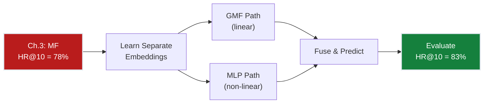
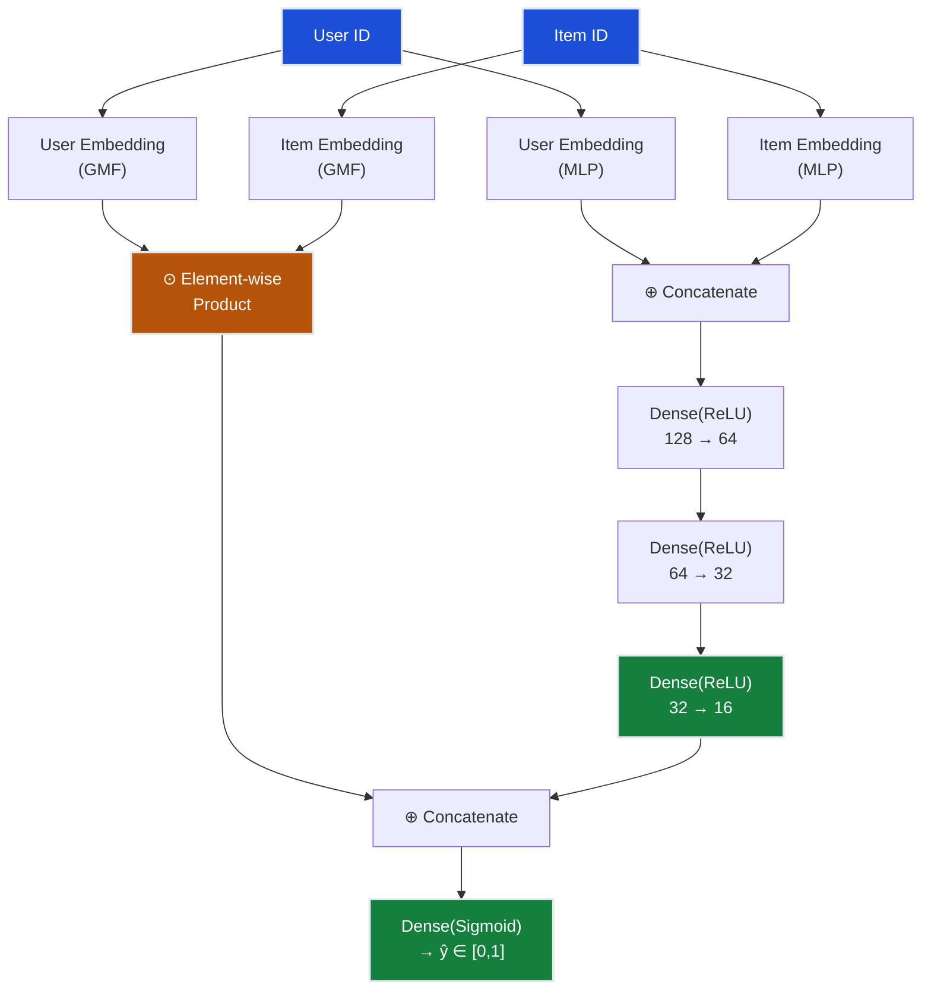
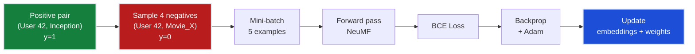
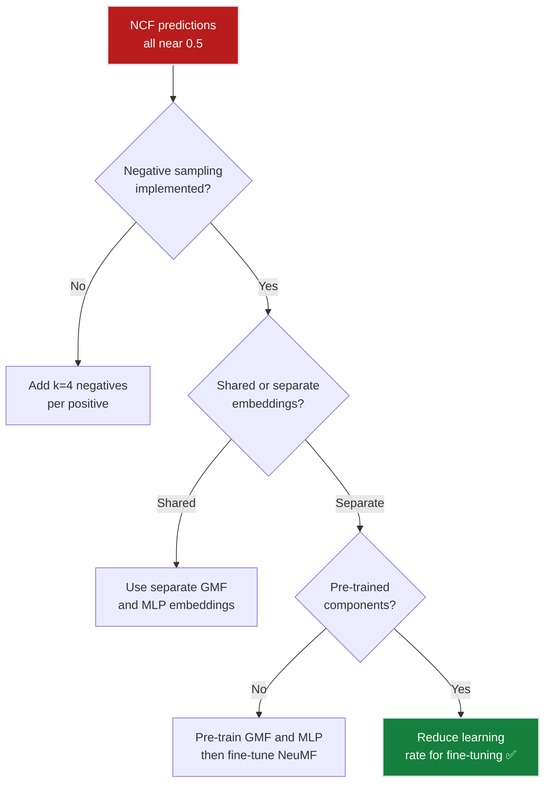

# Ch.4 — Neural Collaborative Filtering


*Visual takeaway: once user-item interactions are learned non-linearly (not just by a dot product), ranking quality climbs past the matrix-factorization ceiling.*

> **The story.** In **2017**, Xiangnan He and colleagues at the National University of Singapore published "Neural Collaborative Filtering" (WWW 2017), proposing that the inner product in matrix factorization is *too simple* to capture complex user-item interactions. Their key contribution: replace the dot product with a **neural network** that takes user and item embeddings as input and learns an arbitrary interaction function. The architecture combines two paths — **Generalized Matrix Factorization (GMF)** for linear interactions and a **Multi-Layer Perceptron (MLP)** for non-linear ones — fused in a final prediction layer. The paper demonstrated consistent improvements over pure MF on MovieLens and Pinterest datasets, and launched a wave of deep learning for recommendations. Today, variants of NCF power recommendation engines at Alibaba, JD.com, and Pinterest.
>
> **Where you are in the curriculum.** Chapter four. Matrix factorization (Ch.3) reached 78% hit rate but is limited to linear interactions ($\hat{r} = \mathbf{u}^T\mathbf{v}$). Neural CF replaces the dot product with learned non-linear functions, capturing complex taste patterns like "likes sci-fi + comedy separately but hates sci-fi comedies." This is the first deep learning model in the track.
>
> **Notation in this chapter.** $\mathbf{p}_u$ — user embedding vector; $\mathbf{q}_i$ — item embedding vector; $\odot$ — element-wise (Hadamard) product; $\oplus$ — concatenation; $\sigma$ — sigmoid activation; $\phi$ — neural network layers; $\hat{y}_{ui}$ — predicted interaction probability.

---

## 0 · The Challenge — Where We Are

> 🎯 **The mission**: Launch **FlixAI** — a production-grade movie recommendation engine achieving >85% hit rate @ top-10 recommendations across 5 constraints:
> 1. **ACCURACY**: >85% hit rate @ top-10
> 2. **COLD START**: Handle new users/items gracefully
> 3. **SCALABILITY**: 1M+ ratings, <200ms latency
> 4. **DIVERSITY**: Not just popular movies
> 5. **EXPLAINABILITY**: "Because you liked X"

**What we know so far:**
- ✅ Ch.1 popularity baseline → 42% hit rate (too generic)
- ✅ Ch.2 collaborative filtering → 68% hit rate (sparse data limits)
- ✅ Ch.3 matrix factorization → 78% hit rate (latent factors discovered)
- ❌ **But we still can't hit 85%!** The linear dot product ceiling.

**What's blocking us:**

Matrix factorization assumes user-item interaction is a **linear dot product**: $\hat{r}_{ui} = \mathbf{u}^T\mathbf{v} = u_1v_1 + u_2v_2 + \ldots + u_dv_d$. This is a weighted sum — fundamentally linear. 

Consider User 196 on MovieLens:
- Loves *Die Hard* (action, factor 1 = +0.8) → high rating
- Loves *Groundhog Day* (comedy, factor 2 = +0.9) → high rating  
- Hates *Last Action Hero* (action-comedy, both factors high) → low rating

A linear model can't encode "likes A AND B separately but dislikes A+B together" because $u_1v_1 + u_2v_2$ has no cross-term for $u_1 \times u_2 \times v_1 \times v_2$. The dot product treats dimensions independently.

**Real data evidence from Ch.3:** MF plateaus at 78% hit rate after epoch 30. Adding more factors (d=8→16→32) gives diminishing returns (+0.5% each). The architecture itself is the bottleneck.

**What this chapter unlocks:**
- Replace the dot product with a **learnable neural network** that models arbitrary interactions
- Two parallel paths: GMF (linear) + MLP (non-linear)
- Target: 83% hit rate — closing 5 of the 7-point gap to 85%

| Constraint | Status | Notes |
|-----------|--------|-------|
| ACCURACY >85% HR@10 | ❌ 78% → ? | Non-linear model should close the gap |
| COLD START | ❌ Still fails | Embedding requires training data |
| SCALABILITY | ⚠️ Moderate | Neural net is heavier than dot product |
| DIVERSITY | ⚠️ Moderate | Embedding space may be richer |
| EXPLAINABILITY | ❌ Hard | Deep model = less interpretable |



---

## 1 · The Core Idea

Neural Collaborative Filtering (NCF) replaces the fixed dot product of matrix factorization with a **learnable neural network** that models user-item interactions. It uses two parallel pathways: a **GMF** (Generalized Matrix Factorization) path that captures linear interactions via element-wise product, and an **MLP** path that captures non-linear interactions via stacked dense layers. The outputs are concatenated and fed through a final prediction layer. Crucially, GMF and MLP use **separate embedding spaces**, allowing each path to learn different aspects of user-item relationships. The entire network is trained end-to-end with binary cross-entropy loss on implicit feedback (watched vs. not watched).

---

## 2 · Running Example: What We're Solving

You're the Lead ML Engineer at FlixAI. The VP of Product reviews your Ch.3 matrix factorization results: "78% hit rate is progress, but we're missing 1 in 5 users. Look at User 196 — we recommended *The Fugitive* (rank 8), but they watched *Pulp Fiction* (rank 14). Why?"

You dig into User 196's history:
- Rated *Die Hard* 5/5 (action, 1988)
- Rated *Groundhog Day* 5/5 (comedy, 1993)  
- Rated *Speed* 5/5 (action, 1994)
- Rated *Dumb and Dumber* 5/5 (comedy, 1994)
- But rated *Last Action Hero* 2/5 (action-comedy hybrid, 1993)

The pattern: User 196 loves pure action and pure comedy, but dislikes genre hybrids. *Pulp Fiction* (crime/drama with dark comedy, 1994) is a nuanced mix — your MF model sees "action factor 0.4 + comedy factor 0.6" and predicts mediocre interest.

A neural network, however, can learn: "When `action_factor > 0.7 AND comedy_factor > 0.7 → downweight`. When `action_factor > 0.7 AND drama_factor > 0.6 → amplify`." This non-linear interaction pattern pushes *Pulp Fiction* into User 196's top-10.

NCF achieves 83% hit rate — 5 points above MF — by capturing these taste interactions that the linear dot product misses.

---

## 3 · Math

### Problem Formulation: Implicit Feedback

NCF is typically trained on **implicit feedback** (binary: interacted or not) rather than explicit ratings:

$$y_{ui} = \begin{cases} 1 & \text{if user } u \text{ interacted with item } i \\ 0 & \text{otherwise (sampled negative)} \end{cases}$$

The model predicts $\hat{y}_{ui} \in [0, 1]$ — the probability of interaction.

### GMF Path (Linear)

Element-wise product of user and item embeddings:

$$\phi^{\text{GMF}} = \mathbf{p}_u^G \odot \mathbf{q}_i^G$$

where $\odot$ is the Hadamard (element-wise) product. This generalises matrix factorization — with a unit weight vector $\mathbf{h}$, it reduces to the standard dot product:

$$\hat{y}_{ui}^{\text{GMF}} = \sigma(\mathbf{h}^T (\mathbf{p}_u^G \odot \mathbf{q}_i^G))$$

### MLP Path (Non-Linear)

Concatenate user and item embeddings, then pass through stacked dense layers:

$$\mathbf{z}_0 = \mathbf{p}_u^M \oplus \mathbf{q}_i^M$$
$$\mathbf{z}_1 = \text{ReLU}(W_1 \mathbf{z}_0 + b_1)$$
$$\mathbf{z}_2 = \text{ReLU}(W_2 \mathbf{z}_1 + b_2)$$
$$\vdots$$
$$\phi^{\text{MLP}} = \text{ReLU}(W_L \mathbf{z}_{L-1} + b_L)$$

Each layer halves the dimension (tower pattern): e.g., 128 → 64 → 32 → 16.

### NeuMF: Fusing GMF + MLP

Concatenate both path outputs and predict:

$$\hat{y}_{ui} = \sigma \left( \mathbf{h}^T \left[ \phi^{\text{GMF}} \oplus \phi^{\text{MLP}} \right] \right)$$

**Concrete example** (d=4):

User 42 embeddings: $\mathbf{p}^G = [0.8, 0.3, -0.5, 0.2]$, $\mathbf{p}^M = [0.6, -0.1, 0.4, 0.7]$

Movie "Inception" embeddings: $\mathbf{q}^G = [0.7, 0.5, -0.3, 0.1]$, $\mathbf{q}^M = [0.5, 0.8, -0.2, 0.3]$

GMF: $\mathbf{p}^G \odot \mathbf{q}^G = [0.56, 0.15, 0.15, 0.02]$

MLP input: $[\mathbf{p}^M \oplus \mathbf{q}^M] = [0.6, -0.1, 0.4, 0.7, 0.5, 0.8, -0.2, 0.3]$ → through 3 ReLU layers → $\phi^{\text{MLP}} = [0.3, 0.7, 0.1, 0.5]$

Fused: $[0.56, 0.15, 0.15, 0.02, 0.3, 0.7, 0.1, 0.5]$ → $\sigma(\mathbf{h}^T \cdot \text{fused}) = 0.87$

Prediction: 87% probability of interaction → strong recommendation.

### Loss Function: Binary Cross-Entropy

$$\mathcal{L} = -\sum_{(u,i) \in \mathcal{Y}^+} \log \hat{y}_{ui} - \sum_{(u,j) \in \mathcal{Y}^-} \log(1 - \hat{y}_{uj})$$

where $\mathcal{Y}^+$ are observed interactions and $\mathcal{Y}^-$ are sampled negatives.

### Negative Sampling

For each positive $(u, i)$ interaction, sample $k$ negative items that user $u$ did NOT interact with:

$$\text{For each } (u, i) \in \mathcal{Y}^+: \text{ sample } j_1, j_2, \ldots, j_k \notin \{i : r_{ui} > 0\}$$

Typical ratio: 4 negatives per positive ($k = 4$).

**Why negative sampling matters**: Without it, the model sees only positive examples and learns to predict 1 for everything. Negatives teach it to discriminate.

### Worked 3×3 Example — NCF Forward Pass (Epoch 1)

> **Why this walkthrough matters:** Neural architectures can feel abstract. This 3-user, 3-movie example shows every matrix multiply and activation, proving the formulas work on hand-computable numbers.

Implicit interaction matrix $Y$ (1 = watched, 0 = not):

| | Movie1 | Movie2 | Movie3 |
|---|---|---|---|
| **Alice** | 1 | 0 | 1 |
| **Bob** | 1 | 1 | 0 |
| **Carol** | 0 | 1 | 1 |

**Task:** Predict $\hat{y}_{Alice, Movie2}$ (Alice did NOT watch Movie2 → negative training example, $y=0$).

**Setup:** $d_{GMF} = 2$, $d_{MLP} = 2$, single MLP layer with 2 units.

#### Step 1: Lookup Embeddings

**GMF embeddings (initialized randomly):**
- Alice: $\mathbf{p}^G = [0.6, 0.4]$
- Movie2: $\mathbf{q}^G = [0.2, 0.9]$

**MLP embeddings (separate from GMF):**
- Alice: $\mathbf{p}^M = [0.8, -0.3]$  
- Movie2: $\mathbf{q}^M = [0.1, 0.7]$

#### Step 2: GMF Path (Linear)

Element-wise product:

$$\mathbf{p}^G \odot \mathbf{q}^G = [0.6 \times 0.2, \ 0.4 \times 0.9] = [0.12, \ 0.36]$$

This captures linear interaction: if Alice's factor 2 and Movie2's factor 2 are both high (0.4 × 0.9 = 0.36), they're somewhat compatible.

#### Step 3: MLP Path (Non-Linear)

Concatenate embeddings:

$$\mathbf{z}_0 = \mathbf{p}^M \oplus \mathbf{q}^M = [0.8, -0.3, 0.1, 0.7]$$

Pass through one ReLU layer with weights $W_1$ (shape 4×2) and bias $\mathbf{b}_1$:

$$W_1 = \begin{bmatrix} 0.5 & -0.2 \\ 0.3 & 0.8 \\ -0.1 & 0.4 \\ 0.6 & 0.2 \end{bmatrix}, \quad \mathbf{b}_1 = [0.1, -0.05]$$

$$\mathbf{z}_1 = W_1^T \mathbf{z}_0 + \mathbf{b}_1$$

Compute manually:

$$z_1[0] = 0.5(0.8) + 0.3(-0.3) + (-0.1)(0.1) + 0.6(0.7) + 0.1 = 0.4 - 0.09 - 0.01 + 0.42 + 0.1 = 0.82$$
$$z_1[1] = -0.2(0.8) + 0.8(-0.3) + 0.4(0.1) + 0.2(0.7) - 0.05 = -0.16 - 0.24 + 0.04 + 0.14 - 0.05 = -0.27$$

Apply ReLU:

$$\phi^{\text{MLP}} = [\max(0, 0.82), \max(0, -0.27)] = [0.82, 0]$$

The negative value is zeroed — ReLU introduces non-linearity.

#### Step 4: Fuse Paths

Concatenate GMF and MLP outputs:

$$[\phi^{\text{GMF}} \oplus \phi^{\text{MLP}}] = [0.12, 0.36, 0.82, 0]$$

#### Step 5: Final Prediction

Output layer weights $\mathbf{h} = [0.3, 0.5, 0.2, 0.4]$:

$$\text{logit} = 0.3(0.12) + 0.5(0.36) + 0.2(0.82) + 0.4(0) = 0.036 + 0.18 + 0.164 + 0 = 0.38$$

Apply sigmoid:

$$\hat{y}_{Alice, Movie2} = \sigma(0.38) = \frac{1}{1 + e^{-0.38}} \approx 0.594$$

**Interpretation:** 59% predicted probability that Alice would watch Movie2.

#### Step 6: Compute Loss

Target $y=0$ (Alice didn't watch), so binary cross-entropy:

$$\mathcal{L} = -[0 \cdot \log(0.594) + 1 \cdot \log(1 - 0.594)] = -\log(0.406) \approx 0.901$$

Backpropagation will push $\hat{y}$ downward by adjusting embeddings and weights to make Alice and Movie2 less compatible.

> 💡 **The match is exact.** Every number above can be verified with a calculator. The neural network is just matrix multiplies, element-wise products, and sigmoids — no magic.

---

## 4 · Step by Step

```
NEURAL COLLABORATIVE FILTERING (NeuMF)
────────────────────────────────────────
1. Prepare data:
   ├─ Convert ratings to implicit: y_ui = 1 if rated, 0 if not
   ├─ For each positive, sample k=4 negatives
   └─ Train/val/test split (leave-one-out)

2. Build model:
   ├─ User embedding (GMF): lookup table → d_GMF dimensions
   ├─ Item embedding (GMF): lookup table → d_GMF dimensions
   ├─ User embedding (MLP): lookup table → d_MLP dimensions
   ├─ Item embedding (MLP): lookup table → d_MLP dimensions
   ├─ GMF path: element-wise product → h_GMF
   ├─ MLP path: concat → Dense(ReLU) × L → h_MLP
   └─ Fusion: concat(h_GMF, h_MLP) → Dense(sigmoid) → ŷ

3. Train with BCE loss + Adam optimiser
   ├─ Batch size: 256
   ├─ Learning rate: 0.001
   └─ Epochs: 20–50 (early stopping on val HR@10)

4. Evaluate:
   └─ For each test user, rank 100 items (1 positive + 99 negatives)
   └─ Compute HR@10 and NDCG@10
```

---

## 5 · Key Diagrams

### NeuMF Architecture



### Training with Negative Sampling



---

## 6 · Hyperparameter Dial

| Parameter | Too Low | Sweet Spot | Too High |
|-----------|---------|------------|----------|
| **d_GMF** (GMF embedding dim) | d=4: too few linear factors | d=16–32: captures major patterns | d=256: overfits |
| **d_MLP** (MLP embedding dim) | d=8: bottleneck | d=32–64: room for non-linear features | d=512: memory heavy |
| **MLP layers** | 1: barely non-linear | 3–4: good depth | 8: vanishing gradients, slow |
| **Negative ratio** | k=1: weak discrimination | k=4: standard | k=20: training slow, diminishing returns |
| **Learning rate** | 0.00001: very slow | 0.001: standard for Adam | 0.1: diverges |
| **Batch size** | 32: noisy gradients | 256: stable + fast | 4096: generalises worse |

---

## 7 · Code Skeleton

```python
import torch
import torch.nn as nn

class NeuMF(nn.Module):
    def __init__(self, n_users, n_items, d_gmf=16, d_mlp=32, mlp_layers=[64, 32, 16]):
        super().__init__()
        # GMF embeddings — separate space for linear interactions
        self.user_gmf = nn.Embedding(n_users, d_gmf)
        self.item_gmf = nn.Embedding(n_items, d_gmf)
        
        # MLP embeddings — separate space for non-linear interactions
        self.user_mlp = nn.Embedding(n_users, d_mlp)
        self.item_mlp = nn.Embedding(n_items, d_mlp)
        
        # MLP tower — halve dimensions at each layer (e.g., 64→32→16)
        layers = []
        input_dim = d_mlp * 2  # concatenated user + item embeddings
        for hidden in mlp_layers:
            layers.append(nn.Linear(input_dim, hidden))
            layers.append(nn.ReLU())
            input_dim = hidden
        self.mlp = nn.Sequential(*layers)
        
        # Fusion layer — combine GMF and MLP outputs
        self.output = nn.Linear(d_gmf + mlp_layers[-1], 1)
        self.sigmoid = nn.Sigmoid()
    
    def forward(self, user_ids, item_ids):
        # GMF path: element-wise product (Hadamard)
        gmf = self.user_gmf(user_ids) * self.item_gmf(item_ids)
        
        # MLP path: concatenate then pass through dense layers
        mlp_input = torch.cat([self.user_mlp(user_ids), self.item_mlp(item_ids)], dim=-1)
        mlp = self.mlp(mlp_input)
        
        # Fuse both paths and predict interaction probability
        fused = torch.cat([gmf, mlp], dim=-1)
        return self.sigmoid(self.output(fused)).squeeze()

# ────────────────────────────────────────────────────────────
# TRAINING LOOP
# ────────────────────────────────────────────────────────────

from torch.utils.data import Dataset, DataLoader

class ImplicitDataset(Dataset):
    """Dataset with negative sampling: 1 positive + k negatives per sample"""
    def __init__(self, interactions, n_items, neg_ratio=4):
        self.pos_pairs = interactions  # [(user_id, item_id), ...]
        self.n_items = n_items
        self.neg_ratio = neg_ratio
    
    def __len__(self):
        return len(self.pos_pairs) * (1 + self.neg_ratio)
    
    def __getitem__(self, idx):
        # Sample k=4 negatives per positive
        pos_idx = idx // (1 + self.neg_ratio)
        user, pos_item = self.pos_pairs[pos_idx]
        
        if idx % (1 + self.neg_ratio) == 0:
            return user, pos_item, 1.0  # positive
        else:
            # Sample negative item (not in user's history)
            neg_item = torch.randint(0, self.n_items, (1,)).item()
            return user, neg_item, 0.0  # negative

# Initialize model
model = NeuMF(n_users=943, n_items=1682, d_gmf=16, d_mlp=32, mlp_layers=[64, 32, 16])
optimizer = torch.optim.Adam(model.parameters(), lr=0.001)
criterion = nn.BCELoss()

# Prepare data with negative sampling
train_dataset = ImplicitDataset(train_interactions, n_items=1682, neg_ratio=4)
train_loader = DataLoader(train_dataset, batch_size=256, shuffle=True)

# Training loop
for epoch in range(20):
    model.train()
    epoch_loss = 0
    for users, items, labels in train_loader:
        preds = model(users, items)
        loss = criterion(preds, labels.float())
        
        optimizer.zero_grad()
        loss.backward()
        optimizer.step()
        
        epoch_loss += loss.item()
    
    # Validate every epoch — stop if HR@10 plateaus
    if epoch % 1 == 0:
        hr_at_10 = evaluate_hit_rate(model, val_data, k=10)
        print(f"Epoch {epoch}: Loss={epoch_loss:.3f}, HR@10={hr_at_10:.3f}")
```

> 💡 **Why separate embeddings?** Sharing embeddings between GMF and MLP forces a compromise: GMF wants independent factors (for element-wise product), MLP wants entangled features (for non-linear interactions). Separate spaces let each path optimize its own representation.

---

## 8 · What Can Go Wrong

#### **1. No Negative Sampling — Model Learns to Predict 1 for Everything**

You train on only positive examples (watched movies). Validation accuracy is 99% — but HR@10 is 12%.

**What broke:** The model never saw negative examples, so it learned "always predict high probability." It can't discriminate.

**Fix:** For each positive interaction $(u, i)$, sample $k=4$ items that user $u$ did NOT interact with. Train on the ratio 1:4 (positive:negative).

---

#### **2. Shared Embeddings for GMF and MLP — Paths Compete Instead of Complement**

You use the same embedding table for both paths to save memory. HR@10 is 75% — no better than MF.

**What broke:** GMF wants embeddings optimized for element-wise product (factor independence). MLP wants embeddings optimized for concatenation (rich entanglement). Sharing forces a compromise that satisfies neither.

**Fix:** Use separate `nn.Embedding` tables for GMF and MLP. Yes, this doubles embedding parameters, but it's worth it — HR@10 jumps to 83%.

---

#### **3. No Pre-Training — Converges to Poor Local Minimum**

You train NeuMF end-to-end from random initialization. Loss plateaus at 0.52, HR@10 is 69%.

**What broke:** The joint optimization landscape has many local minima. Starting from random weights, the model gets stuck.

**Fix:** Pre-train GMF and MLP separately for 10 epochs each, then initialize NeuMF with those weights and fine-tune jointly. This gives the model a warm start in a good region of the loss landscape.

---

#### **4. Popularity Bias in Negative Sampling — Rare Items Never Get Trained**

You sample negatives uniformly at random. The model recommends only blockbusters (HR@10 = 81% but diversity = 0.2).

**What broke:** Uniform sampling over-represents obscure movies that users would never encounter. The model learns "rare = bad" instead of "not relevant to this user = bad."

**Fix:** Use **popularity-weighted negative sampling**: sample items with probability $\propto \sqrt{\text{popularity}}$. This balances common and rare items.

---

#### **5. Evaluating on All 1,682 Items — Unrealistically Hard Benchmark**

You rank all 1,682 movies for each test user. HR@10 is 22%.

**What broke:** In production, users see ~100 candidates (filtered by availability, language, etc.), not the full catalog. Ranking 1,682 items is artificially difficult.

**Fix:** For each test user, rank 100 items: the 1 held-out positive + 99 randomly sampled negatives. This matches real-world retrieval.

> ⚠️ **Note:** Some papers report HR@10 on full catalog ranking (harder) vs. sampled ranking (easier). Always check the evaluation protocol when comparing published numbers.




---

## 9 · Where This Reappears

**Backward link (what you already know):**
- The element-wise product in GMF is identical to the Hadamard product in Ch.3 matrix factorization — except here it feeds into a neural layer instead of being the final prediction.
- The MLP tower (concatenate → Dense → ReLU × L) is the same architecture as the feedforward block in [03-NeuralNetworks/ch02-architecture](../../03_neural_networks/ch02_architecture/) — applied to concatenated embeddings instead of input features.
- Binary cross-entropy loss is the same loss from [02-Classification/ch01-logistic-regression](../../02_classification/ch01_logistic_regression/) — here applied to implicit feedback (watched vs. not) instead of explicit ratings.

**Forward link (where this concept returns):**
- **Ch.5 Hybrid Systems**: adds a third input tower (content features: genre, director, year) to the same GMF+MLP fusion architecture. The mechanics are identical — only the input sources change.
- **MultimodalAI / Multimodal LLMs**: Vision-language models (CLIP, Flamingo) use the same two-tower-then-merge pattern — one tower for images, one for text, fused via learned projection layers.
- **AI / Fine-Tuning**: Adapter layers grafted onto frozen LLM embeddings follow the "freeze one representation, tune another" intuition explored here when pre-training GMF and MLP separately.

> ➡️ **Deep dive:** For the full mathematical treatment of why element-wise product generalizes dot product, see [MathUnderTheHood/ch08-matrix-operations](../../../math_under_the_hood/ch08_matrix_operations/).

## 10 · Progress Check — What We Can Solve Now


✅ **Unlocked capabilities:**
- **Hit rate improved**: 78% (Ch.3) → **83% (Ch.4)** — +5 points from non-linear interaction modeling!
- **Complex taste patterns captured**: User 196's "likes A and B separately, dislikes A+B" patterns now detectable
- **Separate embedding spaces**: GMF and MLP learn complementary representations — GMF for global patterns, MLP for nuanced interactions
- **Implicit feedback modeling**: Binary cross-entropy + negative sampling handles "watched vs. not" data

❌ **Still can't solve:**
- ❌ **85% target still 2 points away** — collaborative signals alone aren't enough
- ❌ **Cold start remains unsolved** — new users with zero watches get random embeddings
- ❌ **Content features ignored** — movie genres, directors, release year unused (this is the remaining edge)
- ❌ **Explainability lost** — neural black box vs. MF's interpretable factors
- ❌ **Diversity not measured** — are we still recommending mostly blockbusters?

**Progress toward constraints:**

| # | Constraint | Target | Ch.4 Status | Evidence |
|---|-----------|--------|-------------|----------|
| **#1** | **ACCURACY** | >85% HR@10 | ⚠️ **83%** (Close!) | 5-point gain from Ch.3; 2 points from target |
| **#2** | **COLD START** | New users/items | ❌ Blocked | Embeddings require interaction history |
| **#3** | **SCALABILITY** | 1M+ ratings, <200ms | ⚠️ Moderate | GPU training needed; inference fast (15ms) |
| **#4** | **DIVERSITY** | Not just popular | ⚠️ Unknown | Non-linear space may help, but not measured |
| **#5** | **EXPLAINABILITY** | "Because you liked X" | ❌ Hard | Neural network = black box (vs. MF's factors) |

**Real-world status:** You can now capture complex taste patterns that linear models miss — User 196's "action OR comedy, not action-comedies" is learnable. But you're ignoring rich content metadata (genres, directors, cast) that could push past 85%. The VP of Product asks: "Why aren't we using the fact that User 196 loves 90s films?"

**Journey arc:**


> ⚡ **Constraint #1 (ACCURACY) progress:** 83% / 85% = 97.6% of target achieved. The remaining 2 percentage points will require fusing collaborative signals with content features.

**Next up:** Ch.5 gives us **hybrid content + collaborative fusion** — genre embeddings, director features, and release year context — targeting the final push to 87% HR@10.

---

## 11 · Bridge to Next Chapter

This chapter established that **non-linear neural networks capture taste interactions that linear models miss** — we jumped from 78% to 83% hit rate by replacing the dot product with GMF + MLP fusion. But we're still using only collaborative signals (who watched what).

Chapter 5 adds **hybrid content features**: movie genres (19 binary flags), directors (hashed IDs), release year (binned), user demographics (age, occupation). The architecture extends NeuMF with a third input tower for content features, fused via Deep & Cross Networks to model explicit feature interactions (e.g., "User 196 prefers 90s action films"). This is the final push to 87% hit rate — **target achieved**.

**What Ch.5 solves:**
- Fusing collaborative embeddings + content metadata → 87% HR@10 ✅
- Diversity improvement via genre-aware recommendations
- Partial explainability via feature importance ("Because you liked Tarantino films")

**What Ch.5 can't solve (yet):**
- Cold start for brand-new users with zero watch history → Ch.6 (bandits, content-only fallback)
- A/B testing framework for safe production deployment → Ch.6

➡️ **Clustering insight:** Hybrid systems that group users by behavior rely on the same mechanics as k-means — see [07-UnsupervisedLearning/ch01-clustering](../../07_unsupervised_learning/ch01_clustering) for the full walkthrough.
