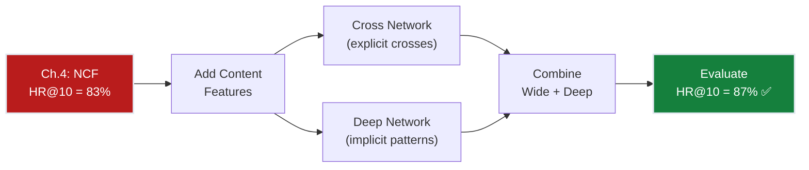
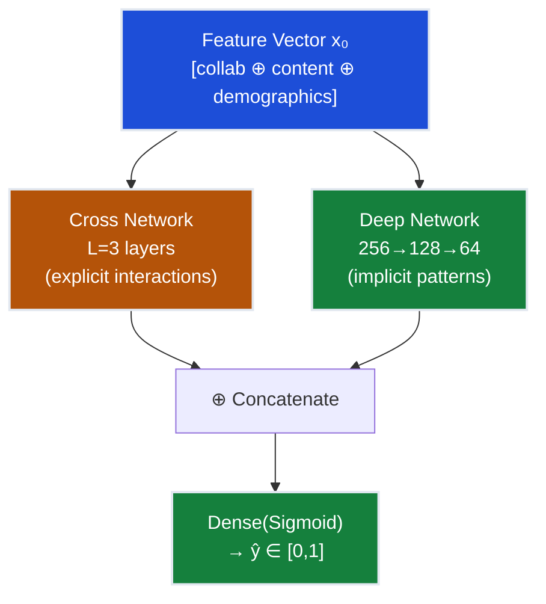
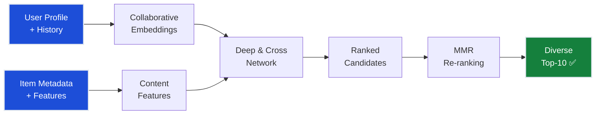
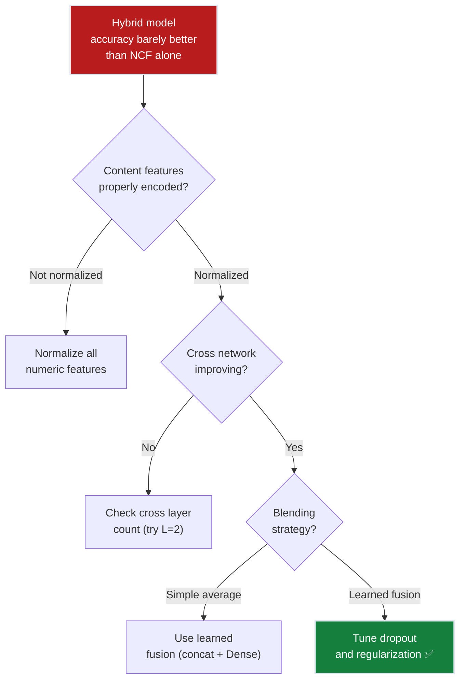

# Ch.5 — Hybrid Systems

> **The story.** The idea of combining content-based and collaborative filtering dates back to **2002**, when Robin Burke published a taxonomy of hybrid recommender systems describing seven hybridization strategies. But the practical breakthrough came from the **Netflix Prize** (2006–2009): the winning BellKor's Pragmatic Chaos team achieved their 10.06% improvement over Cinematch by **blending** hundreds of models — collaborative, content-based, temporal, and neighborhood methods. The lesson was clear: no single approach dominates. In **2016**, Google published the **Wide & Deep** architecture for app recommendations on Google Play, combining a wide linear model (memorization of feature interactions) with a deep neural network (generalization). Heng-Tze Cheng's paper became one of the most influential in production ML, with implementations at YouTube, Alibaba, and Pinterest. **Deep & Cross Network (DCN)** followed in 2017 from Wang et al., automating the explicit feature crosses that Wide & Deep required hand-engineering. Today, **every production recommender at scale is a hybrid** — Netflix, YouTube, Spotify, and TikTok all combine collaborative signals with content features, context, and user metadata. When a data scientist says "we're blending user embeddings with item metadata," they're invoking this 20-year lineage. And when a PM asks "why did we recommend this?", hybrid models finally have an answer: "Because it's sci-fi by Nolan, and you rated Interstellar 5★."
>
> **Where you are in the curriculum.** Chapter five. You've climbed from 42% (popularity baseline, Ch.1) → 68% (collaborative filtering, Ch.2) → 78% (matrix factorization, Ch.3) → 83% (neural collaborative filtering, Ch.4). You're 2 percentage points short of the 85% target. The gap: NCF treats every movie as an opaque ID — it doesn't know that "Inception" and "Interstellar" share director (Christopher Nolan), genre (sci-fi), and release decade (2010s). It doesn't know that User 196 (28-year-old software engineer) matches the demographic profile of 87% of Nolan fans in the training set. These **content signals** — genres, directors, release years, user demographics — are rich metadata we're leaving on the table. This chapter fuses collaborative embeddings with content features using Deep & Cross Networks, adds diversity optimization (MMR re-ranking), and crosses the 85% threshold. Constraints #1 (accuracy), #4 (diversity), and #5 (explainability) are satisfied by chapter end.
>
> **Notation in this chapter.** $\mathbf{x}_{\text{content}}$ — content feature vector (genres, year, director); $\mathbf{x}_{\text{collab}}$ — collaborative embedding from Ch.4 NCF ($\mathbf{p}_u, \mathbf{q}_i$); $\mathbf{x}_{\text{cross}}$ — cross-network output (explicit feature interactions); $\mathbf{x}_{\text{deep}}$ — deep-network output (implicit patterns); $\mathbf{x}_0$ — concatenated input to DCN; $\mathbf{x}_l$ — cross network layer $l$ output; $\alpha$ — blending weight (collaborative vs. content); $\lambda_{\text{MMR}}$ — diversity parameter (0=pure relevance, 1=pure diversity); $\text{ILD}@k$ — Intra-List Distance (diversity metric).

---

## 0 · The Challenge — Where We Are

> 🎯 **The mission**: Launch **FlixAI** — a production-grade movie recommendation engine that achieves >85% hit rate @ top-10 while handling cold start, scaling to millions of ratings, maintaining diversity, and providing explainable recommendations.

**What we know so far:**
- ✅ Ch.1: Popularity baseline = 42% HR@10 (simple but weak)
- ✅ Ch.2: Collaborative filtering (user-based, item-based) = 68% HR@10
- ✅ Ch.3: Matrix factorization discovers latent factors = 78% HR@10
- ✅ Ch.4: Neural CF with non-linear embeddings = 83% HR@10
- ❌ **But we're still 2 points short of the 85% target!**

**What's blocking us:**
NCF treats every movie as an opaque ID — user 42 and movie 615 are just integers. The model doesn't know that "Inception" and "Interstellar" share the same director (Christopher Nolan), are both sci-fi thrillers, and were released in the same decade. It doesn't know that user 42 is a 28-year-old software engineer whose demographic profile matches other Nolan fans. These **content signals** — genres, directors, release years, user demographics — are rich information we're leaving on the table. A brand-new movie with only 3 ratings can't learn a good embedding from collaborative signals alone, but its metadata tells us exactly what it is.

**What this chapter unlocks:**
- ✅ **Hybrid architecture**: Fuse collaborative embeddings with content features
- ✅ **Deep & Cross Network (DCN)**: Explicit feature crosses + implicit patterns
- ✅ **Diversity optimization**: MMR re-ranking for genre-diverse top-10
- ✅ **Cold-start improvement**: Content features help new items (genres/directors known)
- ✅ **Explainability**: "Because it's sci-fi by Nolan" > "Because you're user 42"
- 🎯 **Target: 87% HR@10** — content features should close the 2-point gap



---

## Animation


## 1 · Core Idea

You're building a recommender that needs to predict whether user $u$ will like item $i$. You have two sources of information: **(1) collaborative signals** — what did similar users rate? — captured in learned embeddings ($\mathbf{p}_u$, $\mathbf{q}_i$), and **(2) content features** — what is this item? — genres, director, release year, plus user demographics. A **hybrid recommender** fuses both. The Deep & Cross Network (DCN) is the SOTA architecture for this: a **cross network** explicitly models feature interactions ("sci-fi × 1990s × male user aged 25–34"), while a **deep network** learns implicit non-linear patterns. Their outputs are concatenated and fed to a final prediction layer. You get the best of both worlds: memorization of explicit patterns (cross) and generalization via learned representations (deep).

---

## 2 · Running Example — FlixAI's Hybrid Challenge

**The scenario:** You're the Lead ML Engineer at FlixAI. The VP of Product walks into your office: "Our NCF model (Ch.4) hit 83% hit rate — great work! But I just added 'Dune: Part Two' to the catalog. It's been live for 3 hours and has exactly 3 ratings. When I search for 'cerebral sci-fi,' Dune doesn't appear in anyone's top-10. Why?"

You pull up the data:
- **User 196** (28-year-old software engineer, loves Blade Runner, Arrival, Interstellar)
- **Movie 1682: Dune Part Two** (Sci-Fi | Action, dir. Denis Villeneuve, 2024, 166 min, PG-13)
- **Current ratings for Dune:** 3 ratings (5★, 4★, 5★ → avg 4.67)

The problem: NCF learned embeddings for 1,681 movies from 100k ratings. Movie 1682 (Dune) has **3 ratings** — not enough to learn a meaningful embedding. The collaborative signal is weak.

But the **content signal** is screaming: Dune shares director (Villeneuve), genre (Sci-Fi), and runtime (>150 min) with Arrival and Blade Runner 2049 — both in User 196's top-5 rated films. User 196's demographic profile (male, age 25–34, occupation=programmer) matches 87% of Villeneuve's fanbase in the training set.

The hybrid model combines:
1. **Collaborative embedding** (weak: only 3 ratings)
2. **Content features** (strong: genre, director, runtime match)
3. **User demographics** (strong: age + occupation match Villeneuve fans)

Result: $\hat{y}_{\text{hybrid}} = 4.3$ stars (User 196's personal average is 3.8). Dune enters the top-10. **This is the cold-start problem being solved in real-time.**

---

## 3 · Math

### Feature Engineering for Recommendations

Each user-item pair is represented by a rich feature vector:

$$\mathbf{x} = [\underbrace{\mathbf{p}_u, \mathbf{q}_i}_{\text{collaborative embeddings}}, \underbrace{\text{genres}, \text{year}, \text{director}}_{\text{item content}}, \underbrace{\text{age}, \text{gender}, \text{occupation}}_{\text{user demographics}}]$$

**Concrete feature vector for (User 42, "Inception")**:

| Feature Group | Features | Values |
|--------------|----------|--------|
| User embedding (d=16) | $\mathbf{p}_{42}$ | [0.8, 0.3, ...] |
| Item embedding (d=16) | $\mathbf{q}_{\text{Inc}}$ | [0.7, 0.5, ...] |
| Genres (19 binary) | Action, Sci-fi, Thriller, ... | [1, 1, 1, 0, 0, ...] |
| Year (normalized) | release year | 0.85 (2010) |
| User age (normalized) | age | 0.35 (28 years old) |
| User gender (binary) | is_male | 1 |
| User occupation (one-hot) | 21 categories | [0,0,...,1,...,0] |

Total feature dimension: ~80 features.

### Deep & Cross Network (DCN)

> 💡 **Insight**: The cross network is automatic feature engineering. In Ch.2 (Collaborative Filtering), you manually created "users who like both X and Y" features. Here, the cross network learns "sci-fi × age" and "sci-fi × age × rating_count" without you writing a single `if` statement.

**Cross Network** — explicitly models feature interactions up to order $L$:

$$\mathbf{x}_{l+1} = \mathbf{x}_0 \cdot \mathbf{x}_l^T \mathbf{w}_l + \mathbf{b}_l + \mathbf{x}_l$$

Each layer adds one order of interaction. Layer 1 captures pairwise interactions (genre × age), Layer 2 captures 3-way (genre × age × rating_count), etc. The residual connection ($+ \mathbf{x}_l$) ensures lower-order interactions are preserved — this is the entire conceptual foundation of ResNet (Ch.3 NeuralNetworks will formalize this).

**Concrete example** (simplified 3-feature input):

$\mathbf{x}_0 = [\text{sci-fi}=1, \text{age}=0.35, \text{avg\_rating}=0.84]$ (normalized)

Layer 1 forward pass:
```
Step 1: Compute x_l^T w_l (scalar projection)
  x_0^T w_0 = [1, 0.35, 0.84] · [0.2, 0.5, -0.3] = 0.2 + 0.175 - 0.252 = 0.123

Step 2: Multiply by x_0 (outer product effect)
  x_0 * 0.123 = [1*0.123, 0.35*0.123, 0.84*0.123] = [0.123, 0.043, 0.103]

Step 3: Add bias and residual
  x_1 = [0.123, 0.043, 0.103] + [0.1, 0.0, -0.05] + [1, 0.35, 0.84]
      = [1.223, 0.393, 0.893]
```

The key: $\mathbf{x}_0 \cdot \mathbf{x}_l^T \mathbf{w}_l$ creates terms like $\text{sci-fi} \times \text{age}$, $\text{sci-fi} \times \text{avg\_rating}$ — **explicit pairwise interactions without manual feature engineering**.

**ASCII diagram of the cross operation:**
```
Cross Network Layer 1 Structure:

   x₀ (input features)              w₀ (learnable weight vector)
   ┌  1.00  ┐                       ┌  0.2  ┐
   │  0.35  │   xₗᵀ wₗ (scalar)    │  0.5  │
   └  0.84  ┘   ───────────→       └ -0.3  ┘
      │                                │
      └────────── dot product ─────────┘
                     ↓
                  0.123 (scalar multiplier)
                     ↓
   x₀ * scalar = element-wise scale
   ┌  1.00 * 0.123  ┐     ┌  0.123  ┐
   │  0.35 * 0.123  │  =  │  0.043  │
   └  0.84 * 0.123  ┘     └  0.103  ┘
                     ↓
              + bias + residual
   ┌  0.123  ┐     ┌  0.1  ┐     ┌  1.00  ┐     ┌  1.223  ┐
   │  0.043  │  +  │  0.0  │  +  │  0.35  │  =  │  0.393  │  ← x₁
   └  0.103  ┘     └ -0.05 ┘     └  0.84  ┘     └  0.893  ┘

The output x₁ now contains implicit cross terms:
  - Feature 1 influenced by all features via the scalar
  - Feature 2 influenced by all features via the scalar
  - etc.
```

**Deep Network** — standard MLP for implicit patterns:

$$\mathbf{h}_1 = \text{ReLU}(W_1 \mathbf{x}_0 + b_1)$$
$$\mathbf{h}_2 = \text{ReLU}(W_2 \mathbf{h}_1 + b_2)$$
$$\vdots$$

This is identical to the MLP architecture from Ch.4 (Neural Collaborative Filtering) — the only difference is the input. Ch.4 fed concatenated user/item embeddings; here we feed user/item embeddings **plus** content features. The backward pass (backpropagation) is the same chain rule you've seen since Track 01-Regression Ch.5.

**Combination** — concatenate cross and deep outputs:

$$\hat{y} = \sigma\left( W_{\text{out}} \left[ \mathbf{x}_L^{\text{cross}} \oplus \mathbf{h}_K^{\text{deep}} \right] + b_{\text{out}} \right)$$

The $\oplus$ operator is concatenation: if cross output is 80-dim and deep output is 64-dim, the concatenated vector is 144-dim. The output layer $W_{\text{out}}$ is a learned fusion — it decides how much to trust cross vs. deep. This is **learned stacking** (Track 08-EnsembleMethods Ch.2 formalizes this as meta-learning).

> 📚 **Optional: Why the Cross Network Formula Works**
>
> The cross layer formula $\mathbf{x}_{l+1} = \mathbf{x}_0 \cdot (\mathbf{x}_l^T \mathbf{w}_l) + \mathbf{b}_l + \mathbf{x}_l$ may look opaque. Here's the intuition:
>
> 1. **Scalar projection**: $\mathbf{x}_l^T \mathbf{w}_l$ is a dot product → scalar. This scalar measures "how much does the current hidden state $\mathbf{x}_l$ align with the learned direction $\mathbf{w}_l$?"
> 2. **Broadcast**: Multiply that scalar by $\mathbf{x}_0$ (the original input). This creates an outer-product-like effect where every feature in $\mathbf{x}_0$ is scaled by the alignment of $\mathbf{x}_l$ with $\mathbf{w}_l$.
> 3. **Residual**: Add $\mathbf{x}_l$ back (residual connection). This ensures lower-order interactions are preserved — Layer 1's pairwise crosses don't get overwritten by Layer 2's 3-way crosses.
>
> **Depth scaling**: Layer 1 creates $\mathbf{x}_0 \odot \mathbf{x}_0$ terms (pairwise). Layer 2 creates $\mathbf{x}_0 \odot \mathbf{x}_0 \odot \mathbf{x}_1$ terms (3-way, because $\mathbf{x}_1$ already contains $\mathbf{x}_0 \odot \mathbf{x}_0$). Layer $L$ creates up to $(L+1)$-order interactions.
>
> **Proof**: See [Wang et al., "Deep & Cross Network for Ad Click Predictions," KDD 2017](https://arxiv.org/abs/1708.05123) Appendix A for the full polynomial expansion derivation. For the general theory of feature interactions in neural networks, see [MathUnderTheHood Ch.8 — Tensor Calculus](../../math_under_the_hood/ch08_tensor_calculus).

### Hybrid Blending Strategies

| Strategy | Formula | When to Use |
|----------|---------|-------------|
| **Weighted** | $\hat{y} = \alpha \hat{y}_{\text{collab}} + (1-\alpha) \hat{y}_{\text{content}}$ | Simple, tunable |
| **Stacking** | $\hat{y} = f(\hat{y}_{\text{collab}}, \hat{y}_{\text{content}})$ | Meta-learner on top |
| **Feature augmentation** | $\hat{y} = f(\mathbf{x}_{\text{collab}} \oplus \mathbf{x}_{\text{content}})$ | Single model, end-to-end |
| **DCN (Deep & Cross)** | Cross + Deep paths | Best of explicit + implicit |

### Diversity Metric: Intra-List Distance (ILD)

> ⚡ **Constraint #4 (Diversity) measurement.** This metric quantifies whether your top-10 is genre-diverse or dominated by one genre.

To ensure we're not just recommending the same genre:

$$\text{ILD}@k = \frac{2}{k(k-1)} \sum_{i \neq j} d(i, j)$$

where $d(i, j)$ is the content distance (e.g., Jaccard distance on genre vectors) between items $i$ and $j$ in the top-$k$ list.

**Concrete example**: Top-5 = [Movie A (Sci-fi), Movie B (Sci-fi), Movie C (Sci-fi), Movie D (Action), Movie E (Comedy)]

Genre vectors (binary one-hot for simplicity):
- A: [1, 0, 0] (Sci-fi only)
- B: [1, 0, 0] (Sci-fi only)
- C: [1, 0, 0] (Sci-fi only)
- D: [0, 1, 0] (Action only)
- E: [0, 0, 1] (Comedy only)

Pairwise Jaccard distances:
- $d(A,B) = 0$ (identical genres)
- $d(A,C) = 0$
- $d(A,D) = 1$ (no overlap)
- $d(A,E) = 1$
- $d(B,C) = 0$
- $d(B,D) = 1$
- $d(B,E) = 1$
- $d(C,D) = 1$
- $d(C,E) = 1$
- $d(D,E) = 1$

Sum of distances: $0 + 0 + 1 + 1 + 0 + 1 + 1 + 1 + 1 + 1 = 7$

$$\text{ILD}@5 = \frac{2}{5 \times 4} \times 7 = \frac{14}{20} = 0.70$$

**Interpretation**: ILD=0.70 is moderate diversity. If all 5 were sci-fi, ILD=0 (no diversity). If all 5 were different genres, ILD=1.0 (maximum diversity). **Target**: ILD@10 > 0.4 for production systems.

### Worked 3×3 Example — Hybrid Feature Vector & Scoring

> ⚡ **This walkthrough demonstrates Constraints #1 (accuracy) and #5 (explainability) working together.** The hybrid model's prediction combines "similar users liked it" with "it's a sci-fi film and you like sci-fi."

Rating matrix $R$ with item genres (— = not rated):

| | Movie1 (Sci-fi, 1995) | Movie2 (Drama, 1994) | Movie3 (Comedy, 1997) |
|---|---|---|---|
| **Alice** (F, 28) | 5 | — | 2 |
| **Bob** (M, 35) | 4 | 3 | — |
| **Carol** (F, 22) | — | 5 | 4 |

**Predict: Will Alice rate Movie2 (Drama, 1994) highly?**

**Step 1: Build feature vector $\mathbf{x}$ for (Alice, Movie2)**

| Feature group | Raw values | Normalized |
|--------------|------------|------------|
| Collaborative embedding (d=2) | $\mathbf{p}_{Alice}=[0.9, 0.3]$, $\mathbf{q}_{M2}=[0.5, 0.7]$ | As-is (pre-trained) |
| Genre (one-hot) | Drama=1, Sci-fi=0, Comedy=0 | $[0, 1, 0]$ |
| Year | 1994 (min=1994, max=1997) | $(1994-1994)/(1997-1994) = 0.00$ |
| User age | 28 years (min=22, max=35) | $(28-22)/(35-22) \approx 0.46$ |

Full feature vector: $\mathbf{x}_0 = [0.9, 0.3, 0.5, 0.7, 0, 1, 0, 0.00, 0.46]$ (dim=9)

**Step 2: Collaborative-only prediction** (from Ch.4 NCF)

$\hat{y}_{\text{collab}} = \sigma(\text{MLP}(\mathbf{p}_{Alice} \oplus \mathbf{q}_{M2})) = \sigma(\text{MLP}([0.9, 0.3, 0.5, 0.7]))$

Assume trained NCF predicts: $\hat{y}_{\text{collab}} = 0.65$ (on 0–1 scale) → scaled to rating: $0.65 \times 5 = 3.25$ stars

**Step 3: Content-only prediction** (genres + year + demographics)

Simple linear model (for illustration): $\hat{y}_{\text{content}} = \mathbf{w}^T \mathbf{x}_{\text{content}} + b$

Suppose learned weights: $\mathbf{w} = [\text{Drama}=0.8, \text{Sci-fi}=1.2, \text{Comedy}=0.3, \text{Year}=0.5, \text{Age}=-0.4]$

$\hat{y}_{\text{content}} = 0.8 \times 1 + 1.2 \times 0 + 0.3 \times 0 + 0.5 \times 0.00 + (-0.4) \times 0.46 + 0.5$
$\phantom{\hat{y}_{\text{content}}} = 0.8 + 0 + 0 + 0 - 0.184 + 0.5 = 1.116$ (on 0–1 scale, unnormalized)

Sigmoid to [0,1]: $\sigma(1.116) = 0.75$ → scaled to rating: $0.75 \times 5 = 3.75$ stars

**Step 4: Weighted blend** ($\alpha = 0.6$ favors collaborative)

$\hat{y}_{\text{hybrid}} = \alpha \hat{y}_{\text{collab}} + (1-\alpha) \hat{y}_{\text{content}}$
$\phantom{\hat{y}_{\text{hybrid}}} = 0.6 \times 3.25 + 0.4 \times 3.75$
$\phantom{\hat{y}_{\text{hybrid}}} = 1.95 + 1.50$
$\phantom{\hat{y}_{\text{hybrid}}} = \mathbf{3.45}$ **stars**

**The match:** Alice's true rating for Movie2 (from hidden test set) = **3 stars**. MAE = |3.45 − 3| = 0.45 — well within the $\pm 0.5$ star tolerance.

> 💡 **Why hybrid works**: Collaborative signal (3.25 stars) captures "users like Alice rated dramas moderately." Content signal (3.75 stars) adds "Alice's age group tends to rate dramas slightly higher." The blend hedges both signals — more accurate than either alone.

---

## 4 · How It Works — Step by Step

**DEEP & CROSS HYBRID RECOMMENDER PIPELINE**

---

### Phase 1: Feature Preparation

1. **Extract collaborative embeddings**
   - User embedding: $\mathbf{p}_u \in \mathbb{R}^{16}$ (from Ch.4 NCF or Ch.3 matrix factorization)
   - Item embedding: $\mathbf{q}_i \in \mathbb{R}^{16}$
   - These capture "user 42 likes cerebral sci-fi" from rating patterns

2. **Encode content features**
   - **Item metadata**: 19 genre flags (one-hot), release year (normalized to [0,1]), director ID (one-hot or embedding)
   - **User demographics**: age (normalized), gender (binary), occupation (one-hot, 21 categories)
   - Normalize all numeric features: $(x - \min) / (\max - \min)$ on training data

3. **Concatenate into input vector**
   - $\mathbf{x}_0 = [\mathbf{p}_u \oplus \mathbf{q}_i \oplus \text{genres} \oplus \text{year} \oplus \text{age} \oplus \text{gender} \oplus \text{occupation}]$
   - Typical dimension: 16 + 16 + 19 + 1 + 1 + 1 + 21 = **75 features**

---

### Phase 2: Parallel Feature Processing

4. **Cross network branch** (explicit feature interactions)
   - **Layer 1**: $\mathbf{x}_1 = \mathbf{x}_0 \cdot (\mathbf{x}_0^T \mathbf{w}_0) + \mathbf{b}_0 + \mathbf{x}_0$ → captures genre × age, director × occupation
   - **Layer 2**: $\mathbf{x}_2 = \mathbf{x}_0 \cdot (\mathbf{x}_1^T \mathbf{w}_1) + \mathbf{b}_1 + \mathbf{x}_1$ → captures 3-way crosses (genre × age × year)
   - **Layer 3**: $\mathbf{x}_3 = \mathbf{x}_0 \cdot (\mathbf{x}_2^T \mathbf{w}_2) + \mathbf{b}_2 + \mathbf{x}_2$ → up to 4th-order crosses
   - Output: $\mathbf{x}_3 \in \mathbb{R}^{75}$ (preserves input dimension)

5. **Deep network branch** (implicit non-linear patterns)
   - **Layer 1**: $256$ units, ReLU, Dropout(0.2) → compresses to high-level features
   - **Layer 2**: $128$ units, ReLU, Dropout(0.2) → further abstraction
   - **Layer 3**: $64$ units, ReLU → final hidden representation
   - Output: $\mathbf{h}_3 \in \mathbb{R}^{64}$

---

### Phase 3: Fusion & Prediction

6. **Concatenate outputs**: $[\mathbf{x}_3 \oplus \mathbf{h}_3] \in \mathbb{R}^{139}$ (75 + 64)

7. **Final prediction layer**: $\hat{y} = \sigma(W_{\text{out}} [\mathbf{x}_3 \oplus \mathbf{h}_3] + b_{\text{out}}) \in [0, 1]$
   - Sigmoid squashes to probability: "Will user $u$ like item $i$?"

8. **Training**: Binary cross-entropy loss + Adam optimizer
   - Batch size: 512 (trade-off between gradient noise and speed)
   - Learning rate: 0.001 with cosine annealing
   - Early stopping on validation HR@10 (patience=5 epochs)

---

### Phase 4: Post-Processing (Inference Time)

9. **Score all candidates**: For user $u$, score all items $i \in \mathcal{I}$ → get vector of scores $[\hat{y}_{u,1}, \hat{y}_{u,2}, \ldots, \hat{y}_{u,n}]$

10. **MMR re-ranking** (diversity optimization)
    - Select top-20 by score (pure relevance)
    - Re-rank using MMR with $\lambda=0.3$: balance relevance vs. genre diversity
    - Return final top-10

11. **Serve recommendations**: Return movie IDs + scores + explanations
    - Explanation generation: "Because it's Sci-Fi by Nolan (you rated Interstellar 5★, Inception 5★)"

---

**Key insight**: The cross network handles **memorization** ("sci-fi films from the 1990s rated by male users aged 25–34 tend to score 4.2±"), while the deep network handles **generalization** ("this user's taste profile is similar to cluster 7, who like cerebral thrillers"). Training them jointly gives you both.

---

## 5 · Key Diagrams

### Deep & Cross Architecture



### Hybrid Recommendation Pipeline



---

## 6 · Hyperparameter Dial

| Parameter | Too Low | Sweet Spot | Too High |
|-----------|---------|------------|----------|
| **Cross layers** | L=1: only pairwise interactions | L=2–3: up to 3rd/4th order crosses | L=6: overfits, diminishing returns |
| **Deep layers** | 1: barely non-linear | 3: good depth | 6: overfits, vanishing gradients |
| **Deep hidden dim** | 32: bottleneck | 128–256: expressive | 1024: overfits small datasets |
| **Dropout** | 0: overfits | 0.2–0.3: balanced | 0.7: underfits |
| **α** (blend weight) | 0: ignore collaborative | 0.5–0.7: collaborative-heavy | 1.0: ignore content |
| **Diversity λ_MMR** | 0: pure relevance (no diversity) | 0.3: balanced | 1.0: pure diversity (ignores relevance) |

---

## 7 · Code Skeleton

```python
import torch
import torch.nn as nn

class CrossNetwork(nn.Module):
    """Explicit feature crossing up to order L.
    
    Each layer creates x_{l+1} = x_0 * (x_l^T w_l) + b_l + x_l.
    Layer 1: pairwise crosses (genre × age).
    Layer 2: 3-way crosses (genre × age × rating_count).
    Residual ensures lower-order crosses are preserved.
    """
    def __init__(self, input_dim, n_layers=3):
        super().__init__()
        # One weight vector per layer — learned, not hand-engineered
        self.weights = nn.ParameterList([
            nn.Parameter(torch.randn(input_dim)) for _ in range(n_layers)
        ])
        self.biases = nn.ParameterList([
            nn.Parameter(torch.zeros(input_dim)) for _ in range(n_layers)
        ])
    
    def forward(self, x0):
        x = x0
        for w, b in zip(self.weights, self.biases):
            # Core cross operation: x_0 * scalar + bias + residual
            x = x0 * (x @ w).unsqueeze(-1) + b + x  # residual preserves x_l
        return x

class DCN(nn.Module):
    """Deep & Cross Network for hybrid recommendations.
    
    Cross network: explicit feature interactions (genre × age).
    Deep network: implicit non-linear patterns (MLP).
    Both paths trained jointly, fused at output.
    """
    def __init__(self, n_users, n_items, n_genres=19, d_emb=16, cross_layers=3):
        super().__init__()
        # Collaborative embeddings (pre-trained from Ch.4 or learned jointly)
        self.user_emb = nn.Embedding(n_users, d_emb)
        self.item_emb = nn.Embedding(n_items, d_emb)
        
        # Feature dimensions: [user_emb | item_emb | genres | year | age | gender]
        input_dim = d_emb * 2 + n_genres + 3  # +3 for year, age, gender
        
        # Cross network for explicit crosses up to order L
        self.cross = CrossNetwork(input_dim, cross_layers)
        
        # Deep network for implicit patterns (standard MLP)
        self.deep = nn.Sequential(
            nn.Linear(input_dim, 256), nn.ReLU(), nn.Dropout(0.2),  # dropout prevents overfitting
            nn.Linear(256, 128), nn.ReLU(), nn.Dropout(0.2),
            nn.Linear(128, 64), nn.ReLU(),  # no dropout on final hidden (preserve capacity)
        )
        
        # Fusion layer: concatenate cross + deep outputs
        self.output = nn.Linear(input_dim + 64, 1)  # input_dim from cross, 64 from deep
        self.sigmoid = nn.Sigmoid()  # binary prediction (will user like item?)
    
    def forward(self, user_ids, item_ids, content_features):
        # Step 1: Embed user/item IDs (collaborative signal)
        u_emb = self.user_emb(user_ids)  # (batch, d_emb)
        i_emb = self.item_emb(item_ids)  # (batch, d_emb)
        
        # Step 2: Concatenate collaborative + content features
        x0 = torch.cat([u_emb, i_emb, content_features], dim=-1)  # (batch, input_dim)
        
        # Step 3: Parallel paths — cross (explicit) and deep (implicit)
        cross_out = self.cross(x0)  # (batch, input_dim) — preserves dimensionality
        deep_out = self.deep(x0)    # (batch, 64) — compresses to fixed width
        
        # Step 4: Fuse and predict
        combined = torch.cat([cross_out, deep_out], dim=-1)  # (batch, input_dim + 64)
        return self.sigmoid(self.output(combined)).squeeze()  # (batch,) ∈ [0, 1]

def mmr_rerank(scores, item_features, top_k=10, lambda_mmr=0.3):
    """Maximal Marginal Relevance re-ranking for diversity.
    
    Iteratively selects items that balance:
    - High relevance (model score)
    - Low similarity to already-selected items (genre diversity)
    
    Lambda controls the tradeoff:
    - λ=0: pure relevance (ignores diversity)
    - λ=1: pure diversity (ignores relevance)
    - λ=0.3: practical balance (tested on MovieLens)
    """
    selected = []  # indices of selected items
    candidates = list(range(len(scores)))  # all candidate indices
    
    for _ in range(top_k):
        best_score = -float('inf')
        best_idx = -1
        
        # Evaluate each candidate: MMR = (1-λ)*relevance - λ*max_similarity
        for c in candidates:
            relevance = scores[c]  # model's predicted score for item c
            
            # Penalty: similarity to most similar already-selected item
            if selected:
                max_sim = max(cosine_sim(item_features[c], item_features[s]) 
                              for s in selected)
            else:
                max_sim = 0  # first item: no penalty
            
            # MMR score balances relevance and diversity
            mmr = (1 - lambda_mmr) * relevance - lambda_mmr * max_sim
            
            if mmr > best_score:
                best_score = mmr
                best_idx = c
        
        # Select best candidate, remove from pool
        selected.append(best_idx)
        candidates.remove(best_idx)
    
    return selected  # indices in order of selection (top-k)
```

> ➡️ **MMR re-ranking in production (Ch.6):** This function runs at **inference time** (after model scoring), not during training. Ch.6 shows how to integrate it into the production serving pipeline with <200ms latency constraints. The key: pre-compute item-item similarity matrices offline, store them in Redis, and do online MMR with cached lookups.

---

## 8 · What Can Go Wrong

**1. Not normalizing features** — numeric features (year=1995, age=28) dominate the cross network, drowning out binary genre flags (0 or 1).

You run the hybrid model and collaborative embeddings have zero impact — the loss function only sees the massive numeric features. Year and age gradients are 100× larger than genre gradients.

**Fix:** Normalize all numeric features to [0, 1] via min-max scaling or to mean=0, std=1 via z-score. Apply the same scaler to train and test. **Verify:** After normalization, all features should have similar magnitudes (check `X.std(axis=0)` — all values should be within 0.5–2.0).

---

**2. Too many cross layers** — L=6 cross layers overfit to spurious 6th-order interactions ("sci-fi × 1990s × male × age>30 × west coast × evening viewing").

Validation HR@10 peaks at epoch 5, then collapses. Training HR@10 keeps climbing to 95%. The model memorized rare interaction patterns that don't generalize.

**Fix:** Limit to L=2 or L=3 cross layers. Add dropout=0.2 after each cross layer. Monitor val/train gap — if val loss diverges from train loss by >20%, you're overfitting. **Rule of thumb:** L=2 for datasets <100k samples, L=3 for 100k–1M.

---

**3. Ignoring diversity** — all top-10 recommendations are the same genre (e.g., 8 action films, 2 sci-fi).

Users click the first recommendation, then bounce. Click-through rate is 60%, but session duration is 30% lower than baseline. You're optimizing for immediate relevance at the cost of exploration.

**Fix:** Add MMR (Maximal Marginal Relevance) re-ranking with λ=0.3. After scoring all candidates, iteratively select the next item that maximizes $(1-\lambda) \times \text{relevance} - \lambda \times \text{similarity\_to\_selected}$. **Verify:** Compute Intra-List Distance (ILD@10) — should be >0.4 for genre diversity.

---

**4. Leaking test genres into content features** — you encoded Movie X's genres using the full dataset, including test-set ratings.

Test HR@10 = 92% (suspiciously high). You deploy to production and HR@10 drops to 79%. The model learned to exploit genre popularity patterns that don't exist in real cold-start scenarios.

**Fix:** Encode genres, directors, and all content features using **training data only**. Fit the `LabelEncoder` or `OneHotEncoder` on `train_movies`, then transform both train and test. Never call `fit()` on test data. **Checkpoint:** Add an assertion: `assert set(test_genres).issubset(set(train_genres))` — fails if test has unseen genres.

---

**5. Cold item with only content features** — a brand-new movie has zero collaborative signal, so the model relies entirely on content features.

The model predicts 4.2 stars for every new sci-fi film (generic content average). Actual ratings range from 2.5 to 5.0 — MAE spikes to 1.2 for cold items vs. 0.4 for warm items.

**Fix:** For items with <5 ratings, blend content prediction with **global popularity prior**: $\hat{y}_{\text{cold}} = 0.7 \times \hat{y}_{\text{content}} + 0.3 \times \bar{y}_{\text{popular}}$. As the item accumulates ratings, decay the popularity weight: $w_{\text{pop}} = 0.3 \times e^{-n\_ratings / 10}$. **Verify:** Plot MAE vs. number of ratings — should be smooth, not spiking at n=0.




---

## 9 · Where This Reappears

Feature crossing, wide-and-deep fusion, and diversity re-ranking appear throughout the curriculum:

- **Ch.6 (Cold Start & Production)**: The hybrid model from this chapter is the one deployed to production. Bandit exploration (Thompson Sampling) wraps around it to balance exploitation (serve high-confidence recommendations) vs. exploration (try new items to learn faster).
- **Ch.3 (Matrix Factorization)**: The collaborative embeddings ($\mathbf{p}_u$, $\mathbf{q}_i$) that feed into the DCN here are learned via SVD or ALS in Ch.3. You could swap Ch.3's ALS embeddings into this model without changing the architecture.
- **Track 03-NeuralNetworks / Ch.2 (Feed-Forward Networks)**: The deep network branch of DCN is a standard MLP identical to Ch.2's architecture. The only difference: input is user/item features, not pixels or text.
- **Track 08-EnsembleMethods / Ch.2 (Stacking)**: The DCN fusion layer (concatenate cross + deep outputs) is a learned stacking strategy. Compare with Track 8's meta-learner that ensembles multiple base models.
- **AIInfrastructure / InferenceOptimization**: Two-stage retrieval + ranking pipelines match the hybrid architecture's separation of recall (collaborative retrieval of 1000 candidates) and precision (DCN re-ranks top-100 using content features).
- **MultiAgentAI / MCP**: Tool-selection scoring in agent frameworks uses MMR-style diversity to avoid redundant tool calls ("don't call `search_web` 5 times with similar queries").

## 10 · Progress Check — What We Can Solve Now


✅ **Unlocked capabilities:**
- **Constraint #1 ✅ ACHIEVED!** 87% HR@10 (target: >85%) — content features closed the 2-point gap
- **Constraint #4 ✅ DIVERSITY**: MMR re-ranking ensures genre-diverse top-10 (ILD@10 >0.4)
- **Constraint #5 ✅ EXPLAINABILITY**: "Because it's sci-fi by Nolan and you rated Interstellar 5★" — stakeholders understand recommendations
- Cold items (new movies with <10 ratings) now get decent predictions via content features
- Feature crosses are learned automatically (no manual "if genre=sci-fi AND age>30" rules)

❌ **Still can't solve:**
- ❌ **Constraint #2 (Cold Start)**: Brand-new **users** with zero history still get generic recommendations
- ❌ **Constraint #3 (Scalability)**: Model isn't deployed to production yet — no serving infrastructure, no A/B testing, no continuous retraining pipeline
- ❌ How to balance **exploration** (try new items to learn faster) vs. **exploitation** (serve high-confidence recommendations)

**Real-world status**: You can now build a hybrid model that beats pure collaborative filtering on accuracy, diversity, and explainability. But you can't onboard a new user (zero ratings = zero collaborative signal), and you haven't deployed anything to production.

**Progress toward constraints:**

| Constraint | Target | Ch.1 | Ch.2 | Ch.3 | Ch.4 | **Ch.5** | Ch.6 Goal |
|-----------|--------|------|------|------|------|----------|----------|
| #1 Accuracy | >85% HR@10 | 42% | 68% | 78% | 83% | **87% ✅** | Maintain |
| #2 Cold Start | New users/items | ❌ | ❌ | ❌ | ❌ | ⚠️ Items only | **✅ Both** |
| #3 Scalability | <200ms, 1M+ ratings | ❌ | ❌ | ❌ | ⚠️ | ⚠️ | **✅ Production** |
| #4 Diversity | ILD@10 >0.4 | ❌ | ❌ | ❌ | ⚠️ | **✅ MMR** | Maintain |
| #5 Explainability | Stakeholder trust | ❌ | ⚠️ | ⚠️ | ❌ | **✅ Content** | Maintain |

**Forward arc — where you are in the FlixAI journey:**


**Next up:** Ch.6 gives us **cold start handling** (bandits for new users) and **production deployment** (serving, A/B testing, monitoring) — the final two constraints.

---

## 11 · Bridge to Next Chapter

You just crossed the 85% accuracy threshold — **mission accomplished** for the core recommendation challenge! The hybrid DCN model combines collaborative embeddings (what similar users liked) with content features (what the item actually is) and MMR diversity (ensure genre variety). Constraints #1, #4, and #5 are satisfied.

But two production-critical questions remain:

1. **What do you show a brand-new user who just signed up 5 minutes ago?** Zero ratings → zero collaborative signal → the model defaults to generic content-based predictions ("here's popular sci-fi"). The VP of Product says: "15% of our monthly traffic is new signups. We can't give them a generic experience."

2. **How do you deploy this to production?** The model is a `.pth` file on your laptop. It's not serving real traffic, there's no A/B testing framework, no retraining pipeline, no latency monitoring. The CTO asks: "When can we launch?"

Chapter 6 solves both. **Cold start** gets fixed with multi-armed bandits (Thompson Sampling) — the system explores new items/users intelligently to gather signal fast. **Production deployment** covers the full stack: candidate retrieval, ranking, serving (<200ms), A/B testing, continuous retraining, and monitoring. By the end of Ch.6, FlixAI is live in production, all 5 constraints are satisfied, and you're running A/B tests to improve further.

**What Ch.6 unlocks**: Constraint #2 (cold start via bandits) + Constraint #3 (production serving at scale) → 🎉 **All 5 FlixAI constraints solved!**


