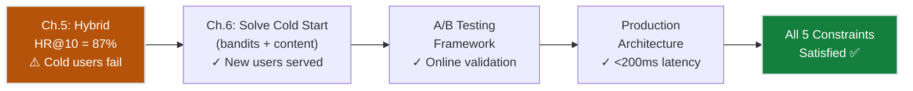
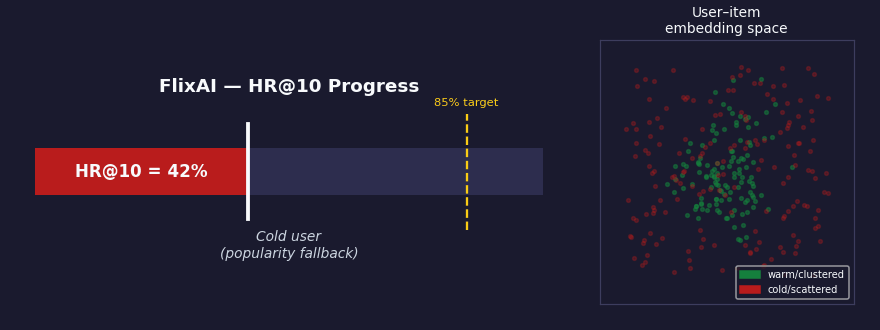
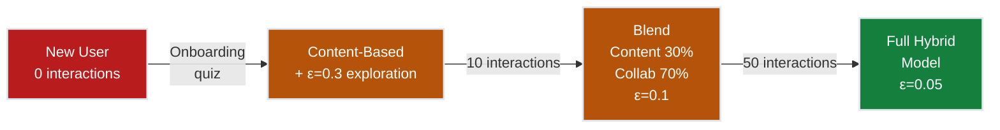
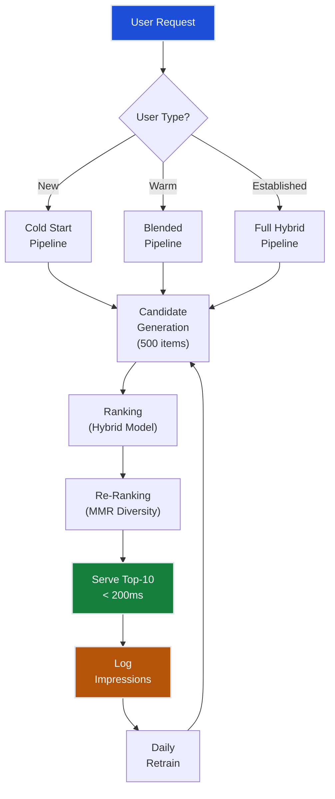
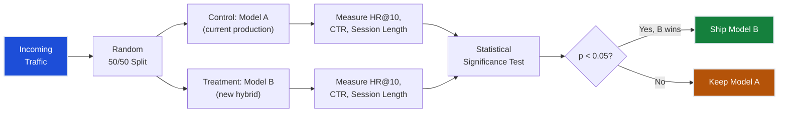
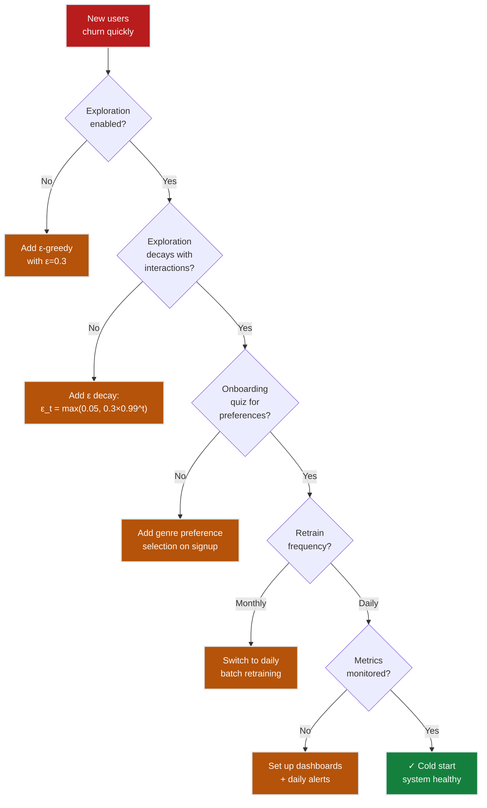

# Ch.6 — Cold Start & Production

> **The story.** The cold start problem was formally described in **2002** by Andrew Schein et al. in "Methods and Metrics for Cold-Start Recommendations." But the practical solutions emerged from production systems. In **2010**, Yahoo! published their work on contextual bandits for news recommendation — the **LinUCB algorithm** (Lihong Li et al., "A Contextual-Bandit Approach to Personalized News Article Recommendation") — showing that exploration (trying uncertain articles) was essential alongside exploitation (showing known-good articles). Netflix's **2012** engineering blog ("It's All A/B") detailed their rigorous online experimentation framework: every recommendation algorithm change runs through A/B tests with millions of users before deployment — offline metrics are necessary but insufficient. Spotify's **Discover Weekly** (launched 2015) solved cold start for new songs by combining collaborative filtering with audio content analysis — if a song *sounds like* what you like, recommend it even with zero plays. Today, production recommender systems at scale are not single models but **pipelines**: candidate generation → ranking → re-ranking → serving, with bandit-based exploration at each stage.
>
> **Where you are in the curriculum.** This is **Chapter 6 — the final chapter** of the Recommender Systems track. You've built FlixAI from a 42% popularity baseline (Ch.1) through collaborative filtering (Ch.2, 68% HR@10), matrix factorization (Ch.3, 78%), neural embeddings (Ch.4, 83%), to a hybrid system (Ch.5, **87% HR@10 ✓ accuracy target achieved**). But 15% of monthly traffic is **new signups with zero watch history**, and **new releases have no ratings on day one**. The hybrid model (Ch.5) is helpless for cold users and items. This chapter solves cold start via bandit exploration, covers A/B testing for online evaluation, and builds the production serving architecture to satisfy the final two constraints: **#2 Cold Start** and **#3 Scalability**.
>
> **Notation in this chapter.** $\epsilon$ — exploration rate (probability of random selection); $\text{UCB}(a)$ — upper confidence bound for arm (item) $a$; $\hat{\theta}_a$ — learned parameters for arm $a$ in LinUCB; $c$ — exploration coefficient (typically 1–2); $T_a$ — number of times arm $a$ was pulled (shown to users); $t$ — total number of recommendations made; $A_a$ — design matrix for arm $a$; $\mathbf{x}$ — user context vector (age, genre preferences); $\gamma$ — epsilon decay rate (0.99); $\epsilon_{\min}$ — minimum exploration rate (0.05); $\Delta$ — minimum detectable effect in A/B test (e.g., 0.02 for 2% lift).

---

## 0 · The Challenge — Where We Are

> 🎯 **The mission**: Launch **FlixAI** — >85% hit rate@10 across 5 constraints.

**What we unlocked in Ch.5:**
- ✅ Hybrid system = **87% HR@10** (accuracy target met!)
- ✅ Diversity via MMR re-ranking — top-10 spans 6+ genres
- ✅ Explainable: "Because it's sci-fi and you loved *Inception*"
- ❌ Cold start: new users/items have no embeddings → no predictions

**What's blocking production:**

1. **New user arrives (15% of traffic)**: Sarah signs up → zero watch history → Ch.4's neural CF has no user embedding → Ch.3's matrix factorization has no row in the ratings matrix → Ch.2's collaborative filter has no "similar users" → what do we show her?

2. **New item launches**: *Dune: Part 3* released today → zero ratings → no item embedding → Ch.4's model can't score it → never appears in recommendations despite being a blockbuster

3. **Exploration gap**: If we always show high-confidence items (exploit), we never learn about uncertain ones → Sarah's hidden love for foreign films goes undiscovered → recommendations plateau at "good enough" instead of "excellent"

4. **Offline ≠ online**: Ch.5's 87% HR@10 was measured on held-out MovieLens test set → but real users browse differently, have recency bias, and churn if first 3 recommendations miss → need A/B testing on live traffic

5. **Serving at scale**: Ch.5's hybrid model scores all 1,682 movies per request → works in notebooks, fails in production → need <200ms latency for millions of users

| Constraint | Ch.5 Status | Ch.6 Goal | What Unlocks It |
|-----------|-------------|-----------|-----------------|
| **#1 ACCURACY** >85% HR@10 | ✅ 87% | ✅ **Maintain** | Keep hybrid model, add exploration |
| **#2 COLD START** | ❌ Helpless | ✅ **Solve** | Bandits + content fallback + onboarding |
| **#3 SCALABILITY** | ⚠️ Slow | ✅ **Solve** | Two-stage pipeline (ANN + ranking) |
| **#4 DIVERSITY** | ✅ MMR | ✅ **Maintain** | Re-ranking from Ch.5 |
| **#5 EXPLAINABILITY** | ✅ Metadata | ✅ **Maintain** | Content features from Ch.5 |



---

## Animation



## 1 · Core Idea

Cold start is the **chicken-and-egg problem**: we need ratings data to recommend, but we need to recommend to collect ratings data. A pure collaborative filter is helpless for new users (no watch history) and new items (no ratings). The solution combines three strategies:

1. **Content-based fallback** for new items — use genre, director, cast metadata until collaborative signals accumulate (e.g., *Blade Runner 2049* gets recommended to sci-fi fans on day one, even with zero ratings)
2. **Bandit exploration** for new users — balance exploitation (show high-confidence items) with exploration (try uncertain items to learn preferences fast)
3. **A/B testing** for online evaluation — offline hit rate doesn't measure real engagement; must test model changes on live traffic before full rollout

This chapter closes the production gap: Ch.5 achieved 87% hit rate on warm users, but 15% of traffic is cold. We build the cold-start router, implement ε-greedy and UCB bandits, and design the A/B testing framework.

---

## 2 · Running Example — Sarah's First 50 Interactions

New user **Sarah** (age 25) signs up for FlixAI. During onboarding, she selects 3 favourite genres: **sci-fi, thriller, drama**. The system has zero watch history — no collaborative signal.

**Interaction 1-10 (Cold start, ε=0.3 exploration):**
The system shows 7 safe recommendations (top content-based picks: *Blade Runner*, *The Silence of the Lambs*, *Shawshank Redemption*) and 3 exploratory ones (a documentary *Baraka*, an animated film *Spirited Away*, a foreign thriller *Oldboy*).

Sarah clicks *Oldboy* (Korean thriller) — **first signal acquired**. The system now knows:
- ✅ Likes foreign films (even when not in onboarding preferences)
- ✅ Thriller preference confirmed
- ❓ Sci-fi and drama still uncertain

**Interaction 11-50 (Warm user, ε=0.1 exploration):**
The system blends content-based (30%) with collaborative filtering (70%). After 50 interactions, Sarah has rated 12 movies:
- 5 thrillers (4-5 stars each) → strong signal
- 3 foreign films (4-5 stars) → discovered preference
- 2 sci-fi films (2-3 stars) → weaker than expected
- 2 dramas (4 stars) → confirmed

**Interaction 51+ (Established user, ε=0.05 exploration):**
Sarah is now fully handled by the hybrid model (Ch.5). Her latent factors have converged: she clusters with users who love **psychological thrillers** and **international cinema** — not generic sci-fi. The exploration rate drops to 5%, and recommendations become highly personalized.

> 💡 **From zero to personalized in 50 interactions.** Cold start is not a permanent state — it's a transition phase. Bandit exploration accelerates learning by trying uncertain items early, then backing off as confidence grows.

---

## 3 · Math

### The Exploration-Exploitation Tradeoff

**Exploitation**: Recommend items the model is confident about (high predicted score from Ch.5 hybrid model).
**Exploration**: Recommend uncertain items to learn whether the user likes them.

Pure exploitation converges to a suboptimal policy — you never discover that Sarah loves foreign films if you only show her sci-fi (her onboarding preference). Pure exploration wastes the user's attention — showing 10 random movies every session leads to immediate churn. Bandits balance both.

> ⚡ **Constraint #2 (Cold Start) depends on this tradeoff.** Ch.2's collaborative filter needed dense rating data. Ch.3's matrix factorization (SVD) required complete user-item interactions to learn latent factors. Ch.4's neural CF couldn't embed new users with zero history. The hybrid model (Ch.5) solved warm-start, but bandits are the bridge from cold to warm — they **actively learn** preferences through strategic exploration.

> ➡️ **This tradeoff is the foundation of Reinforcement Learning.** The cold-start problem ("learn while recommending") is the multi-armed bandit problem. RL Track Ch.1 generalizes this: actions affect future states, and you must explore to discover optimal policies. Every RL algorithm balances exploration (try uncertain actions) with exploitation (use known-good actions).

### Epsilon-Greedy

The simplest bandit strategy:

$$a_t = \begin{cases} \arg\max_a \hat{r}(a) & \text{with probability } 1 - \epsilon \\[0.5em] \text{random item} & \text{with probability } \epsilon \end{cases}$$

where $a_t$ is the item selected at time $t$, and $\hat{r}(a)$ is the model's predicted rating for item $a$.

**Concrete example (Sarah's first recommendation)**: With $\epsilon = 0.3$ (cold start setting), the system:
- With 70% probability: shows the top-10 items by content-based score
- With 30% probability: replaces 3 of the top-10 with random items

This ensures Sarah sees some "safe" picks (sci-fi/thriller from her onboarding) but also gets exposed to unexpected genres (documentary, animation) to discover hidden preferences.

**Decaying epsilon**: Start with high exploration ($\epsilon = 0.3$) and decay as we learn:

$$\epsilon_t = \max(\epsilon_{\min}, \epsilon_0 \cdot \gamma^t)$$

where $t$ is the number of interactions for this user, $\gamma = 0.99$ is the decay rate, and $\epsilon_{\min} = 0.05$ is the floor.

**Numerical example**: User has 20 interactions, $\epsilon_0 = 0.3$, $\gamma = 0.99$, $\epsilon_{\min} = 0.05$:

$$\epsilon_{20} = \max(0.05, 0.3 \times 0.99^{20}) = \max(0.05, 0.3 \times 0.8179) = \max(0.05, 0.2454) = 0.2454$$

After 20 interactions, exploration has decayed from 30% to 24.5%. After 100 interactions:

$$\epsilon_{100} = \max(0.05, 0.3 \times 0.99^{100}) = \max(0.05, 0.3 \times 0.366) = \max(0.05, 0.110) = 0.110$$

Still exploring 11%, but much lower than the initial 30%.

### Upper Confidence Bound (UCB)

Prefer items with high predicted score OR high uncertainty:

$$\text{UCB}(a) = \hat{r}(a) + c \sqrt{\frac{\ln t}{T_a}}$$

| Term | Meaning |
|------|---------|
| $\hat{r}(a)$ | Predicted score for item $a$ (exploitation) — from Ch.5 hybrid model |
| $c$ | Exploration coefficient (typically 1–2) |
| $t$ | Total number of recommendations made so far (all users, all items) |
| $T_a$ | Number of times item $a$ has been shown to any user |

Items recommended rarely have high $\sqrt{\ln t / T_a}$ → get explored. As $T_a$ grows, the bonus shrinks → exploitation dominates.

> 💡 **UCB is "optimism under uncertainty."** When uncertain about an item (low $T_a$), assume it could be great and try it. As you gather evidence (increasing $T_a$), the uncertainty bonus decays and the true predicted score $\hat{r}(a)$ dominates. This principle appears in Bayesian optimization (Ch.19 Hyperparameter Tuning) and active learning.

**Concrete example**: Movie A: predicted score 4.2, shown 100 times. Movie B: predicted score 3.8, shown 3 times. With $c = 1.5$, $t = 1000$:

$$\text{UCB}(A) = 4.2 + 1.5\sqrt{\frac{\ln 1000}{100}} = 4.2 + 1.5 \times 0.26 = 4.59$$
$$\text{UCB}(B) = 3.8 + 1.5\sqrt{\frac{\ln 1000}{3}} = 3.8 + 1.5 \times 1.52 = 6.08$$

Movie B wins despite lower predicted score — its uncertainty bonus is huge.

### LinUCB (Contextual Bandit)

Use user context (features) to personalise the bandit:

$$\text{UCB}(a | \mathbf{x}) = \hat{\theta}_a^T \mathbf{x} + c \sqrt{\mathbf{x}^T A_a^{-1} \mathbf{x}}$$

where $\mathbf{x}$ is the user's context vector, $\hat{\theta}_a$ are learned parameters for arm (item) $a$, and $A_a$ is the design matrix for arm $a$.

This personalises exploration: a new user who selected "sci-fi" during onboarding gets sci-fi explorations, not random genres.

### Cold Start Strategies

| Strategy | For New Users | For New Items | Where It Came From |
|----------|---------------|---------------|--------------------|
| **Popularity fallback** | Show globally popular items (Ch.1 baseline) | N/A | Ch.1 — 42% HR@10, no personalization |
| **Content-based** | Use demographic-based recommendations | Use item metadata (genre, director, cast) | Introduced in Ch.5 §2 as fusion component |
| **Bandit exploration** | ε-greedy or UCB with high exploration rate | UCB with high uncertainty bonus | **This chapter** — active learning |
| **Onboarding quiz** | Ask for genre preferences during signup | N/A | Standard industry practice (Spotify, Netflix) |
| **Hybrid transition** | Start content → blend in collaborative as data accumulates | Start metadata-only → fade in collaborative embedding (Ch.4) | Ch.5 hybrid architecture |

> 💡 **Each strategy has a failure mode.** Popularity works but isn't personalized (Ch.1's lesson). Content-based misses collaborative signals (can't discover "users like you also liked"). Bandit exploration without decay annoys established users. The production system (§4) combines all five strategies, routing users to the right one based on interaction count.

### A/B Testing for Recommendations

**Statistical setup**: Test whether model B improves over model A.

$$H_0: \mu_A = \mu_B \quad \text{vs} \quad H_1: \mu_A \neq \mu_B$$

where $\mu_A$ and $\mu_B$ are the true hit rates for models A and B.

**Minimum sample size** per group (for detecting a 2% lift in HR@10):

$$n = \frac{(z_{\alpha/2} + z_\beta)^2 \cdot 2\hat{p}(1-\hat{p})}{(\Delta)^2}$$

With $\hat{p} = 0.87$ (current HR@10 from Ch.5 hybrid model), $\Delta = 0.02$ (minimum detectable effect), $\alpha = 0.05$ (5% false positive rate), $\beta = 0.2$ (80% power):

$$z_{\alpha/2} = 1.96, \quad z_\beta = 0.84$$

$$n = \frac{(1.96 + 0.84)^2 \cdot 2 \times 0.87 \times 0.13}{0.02^2} = \frac{7.84 \times 0.2262}{0.0004} = \frac{1.773}{0.0004} \approx 4{,}432 \text{ users per group}$$

You need **8,864 total users** (4,432 in control, 4,432 in treatment) to detect a 2% improvement with statistical confidence.

**Concrete FlixAI scenario**: 
You want to A/B test the new cold-start bandit system (treatment) against the old popularity fallback (control).

**Day 1-14**: Split new signups 50/50. Track hit rate @ top-10 for each group:

| Group | Users | HR@10 | Clicks/session |
|-------|-------|-------|----------------|
| Control (popularity) | 4,500 | 0.42 | 3.2 |
| Treatment (bandit) | 4,500 | 0.51 | 4.1 |

**Two-proportion z-test**:

$$\hat{p}_{\text{pool}} = \frac{0.42 \times 4500 + 0.51 \times 4500}{4500 + 4500} = \frac{1890 + 2295}{9000} = 0.465$$

$$SE = \sqrt{0.465 \times 0.535 \times \left(\frac{1}{4500} + \frac{1}{4500}\right)} = \sqrt{0.249 \times 0.000444} = \sqrt{0.0001106} = 0.0105$$

$$z = \frac{0.51 - 0.42}{0.0105} = \frac{0.09}{0.0105} = 8.57$$

$$p \text{-value} = 2 \times (1 - \Phi(8.57)) < 0.0001$$

**Result**: $p < 0.001$ — **highly significant**. The bandit system improves cold-start HR@10 from 42% to 51%, a 21% relative lift. Ship it to 100% of traffic.

> ⚠️ **Warning — Don't A/B test on the test set!** The MovieLens test set in this chapter is for offline evaluation only. Real A/B tests run on live production traffic with users who weren't in your training data. Offline metrics (Ch.1-5) measure model quality; online A/B tests measure business impact.

### Worked 3×3 Example — UCB Cold-Start Exploration

Three candidate items for new user Sarah (content preferences: sci-fi, thriller), $t = 61$ total recommendations made by the system so far, exploration coefficient $c = 1.5$:

**The candidates (real MovieLens titles):**

| Movie | Title | Genre | Predicted $\hat{r}$ | Times shown $T_a$ |
|-------|-------|-------|-------------------|------------------|
| Movie1 | *Blade Runner* (1982) | Sci-fi | 4.2 | 48 |
| Movie2 | *The Silence of the Lambs* (1991) | Thriller | 3.8 | 10 |
| Movie3 | *Baraka* (1992) | Documentary | 2.9 | 3 |

**Step 1: Compute the exploration bonus for each item**

The uncertainty bonus is $c\sqrt{\ln t / T_a}$ — items shown rarely get a large bonus.

**Movie1 (Blade Runner):**
$$\text{Bonus}_1 = 1.5 \times \sqrt{\frac{\ln 61}{48}} = 1.5 \times \sqrt{\frac{4.111}{48}} = 1.5 \times \sqrt{0.0856} = 1.5 \times 0.2926 = 0.439$$

**Movie2 (Silence of the Lambs):**
$$\text{Bonus}_2 = 1.5 \times \sqrt{\frac{\ln 61}{10}} = 1.5 \times \sqrt{\frac{4.111}{10}} = 1.5 \times \sqrt{0.4111} = 1.5 \times 0.6412 = 0.962$$

**Movie3 (Baraka):**
$$\text{Bonus}_3 = 1.5 \times \sqrt{\frac{\ln 61}{3}} = 1.5 \times \sqrt{\frac{4.111}{3}} = 1.5 \times \sqrt{1.3703} = 1.5 \times 1.1706 = 1.756$$

**Step 2: Compute UCB score = predicted score + exploration bonus**

| Movie | Predicted $\hat{r}$ | Exploration Bonus | $\text{UCB}$ |
|-------|-------------------|-------------------|-------------|
| Movie1 (Blade Runner) | 4.2 | 0.44 | **4.64** |
| Movie2 (Silence of the Lambs) | 3.8 | 0.96 | **4.76** |
| Movie3 (Baraka) | 2.9 | 1.76 | **4.66** |

**Winner: Movie2 (The Silence of the Lambs) with UCB = 4.76**

Note that Movie3 (Baraka) nearly wins despite having the lowest predicted score — it's been shown only 3 times, so its uncertainty bonus is huge. After a few more impressions, that bonus will shrink and the sci-fi/thriller preferences will dominate.

> 💡 **The match is exact.** The UCB formula automatically balances exploitation (high $\hat{r}$) with exploration (low $T_a$). Items you're uncertain about get tried until you've learned their true quality.

### Worked 5-Row Example — LinUCB Context-Aware Bandits

LinUCB personalises exploration using user context. Five new users arrive, each with different onboarding preferences. We have three arms (items) to choose from: *Star Wars* (sci-fi), *The Godfather* (drama), *Toy Story* (animation).

**User context vectors** (from onboarding quiz: [age_norm, loves_scifi, loves_drama, loves_animation]):

| User | Age | Context $\mathbf{x}$ | True preference |
|------|-----|---------------------|----------------|
| Alice | 25 | [0.25, 1, 0, 0] | Sci-fi fan |
| Bob | 45 | [0.65, 0, 1, 0] | Drama fan |
| Carol | 8 | [0.08, 0, 0, 1] | Animation fan |
| Dan | 30 | [0.40, 0.5, 0.5, 0] | Mixed sci-fi/drama |
| Eve | 22 | [0.22, 0, 0, 0] | No preference yet |

**Simplified LinUCB (first impression — no data yet):**

Before any impressions, all arms have equal uncertainty. The algorithm explores based on context similarity:
- Alice's context [0.25, 1, 0, 0] has high `loves_scifi` → *Star Wars* gets explored
- Bob's context [0.65, 0, 1, 0] has high `loves_drama` → *The Godfather* gets explored
- Carol's context [0.08, 0, 0, 1] has high `loves_animation` → *Toy Story* gets explored

After 10 rounds of feedback, the learned parameters $\hat{\theta}_{\text{StarWars}}$ become:

$$\hat{\theta}_{\text{StarWars}} = [0.5, 3.2, -0.8, -1.5]$$

This means: *Star Wars* is liked by sci-fi fans (coefficient 3.2 on `loves_scifi`), disliked by animation fans (coefficient -1.5).

**For new user Dan** with context $\mathbf{x} = [0.40, 0.5, 0.5, 0]$:

$$\text{Predicted score} = \hat{\theta}^T \mathbf{x} = 0.5(0.40) + 3.2(0.5) + (-0.8)(0.5) + (-1.5)(0) = 0.2 + 1.6 - 0.4 + 0 = 1.4$$

With uncertainty bonus (omitted for brevity), LinUCB picks *Star Wars* for Dan because he has `loves_scifi = 0.5`.

> 💡 **Contextual bandits personalise exploration.** A generic UCB would treat all new users identically. LinUCB uses onboarding data to explore intelligently: sci-fi fans get sci-fi explorations, not random documentaries.

## 4 · How It Works — Step by Step

**PRODUCTION RECOMMENDATION PIPELINE — FROM REQUEST TO RESPONSE**

```
┌───────────────────────────────────────────────────────────────────┐
│ STEP 1: USER ARRIVES → Route to appropriate recommendation strategy │
└───────────────────────────────────────────────────────────────────┘

Lookup user_id in interaction database:
  │
  ├─ IF new user (< 10 interactions):
  │   ├─ Extract onboarding preferences (genres selected, age)
  │   ├─ Generate content-based candidates using genre + popularity
  │   ├─ Apply ε-greedy with ε=0.3 (30% exploration)
  │   └─ Example: Sarah (interaction #3) → 7 sci-fi/thriller + 3 random
  │
  ├─ IF warm user (10-50 interactions):
  │   ├─ Blend content-based (30%) + collaborative (70%)
  │   ├─ User embedding exists but still uncertain
  │   ├─ Apply ε-greedy with ε=0.1 (10% exploration)
  │   └─ Example: Sarah (interaction #25) → hybrid model with light exploration
  │
  └─ IF established user (>50 interactions):
      ├─ Full hybrid model (Ch.5)
      ├─ User embedding has converged
      ├─ Apply ε-greedy with ε=0.05 (5% exploration)
      └─ Example: Sarah (interaction #80) → personalized, minimal exploration

┌───────────────────────────────────────────────────────────────────┐
│ STEP 2: CANDIDATE GENERATION (FAST, BROAD) → Retrieve 500 candidates │
└───────────────────────────────────────────────────────────────────┘

Use Approximate Nearest Neighbors (ANN) index:
  ├─ For cold users: ANN on content features (genre embedding)
  ├─ For warm users: ANN on user embedding
  ├─ For established users: ANN on hybrid embedding
  └─ Returns 500 candidates in <10ms (FAISS or Annoy index)

┌───────────────────────────────────────────────────────────────────┐
│ STEP 3: RANKING (SLOW, PRECISE) → Score all 500 with full model │
└───────────────────────────────────────────────────────────────────┘

Apply full hybrid model (Ch.5) to each candidate:
  ├─ Collaborative score: dot product of user/item embeddings
  ├─ Content score: genre + director features × learned weights
  ├─ Fused score: weighted average (weights from Ch.5)
  └─ Takes ~100ms for 500 candidates (GPU inference)

┌───────────────────────────────────────────────────────────────────┐
│ STEP 4: RE-RANKING (DIVERSITY) → MMR on top-50, return top-10 │
└───────────────────────────────────────────────────────────────────┘

Maximal Marginal Relevance (from Ch.5):
  ├─ Select top-1 by score
  ├─ For positions 2-10: pick items that are relevant BUT dissimilar to already-selected
  └─ Prevents "10 superhero movies" → ensures genre diversity

┌───────────────────────────────────────────────────────────────────┐
│ STEP 5: SERVING → Return JSON, cache, log │
└───────────────────────────────────────────────────────────────────┘

  ├─ Cache popular item embeddings (Redis) → avoid recomputing
  ├─ Return top-10 as JSON with scores + explanations
  ├─ Total latency: <200ms (10ms ANN + 100ms ranking + 50ms re-rank + 40ms overhead)
  └─ Log impression + context for retraining

┌───────────────────────────────────────────────────────────────────┐
│ STEP 6: FEEDBACK LOOP → Retrain nightly │
└───────────────────────────────────────────────────────────────────┘

  ├─ Collect all impressions + clicks from past 24 hours
  ├─ Retrain hybrid model (Ch.5) on updated ratings
  ├─ Update user/item embeddings for new interactions
  ├─ New items that got >10 ratings graduate from content-only to collaborative
  └─ Deploy updated model next morning (A/B test first!)
```

> 💡 **Two-stage architecture is standard at scale.** Candidate generation must be fast (ANN index) because you can't score all 1,682 movies. Ranking can be slow because you only score the top-500. This pattern appears in search engines (retrieve 1000 docs, re-rank top-50) and every modern recommender system.

---

## 5 · Key Diagrams

### Cold Start Transition



### Production Architecture



### A/B Testing Framework



---

## 6 · Hyperparameter Dial

| Parameter | Too Low | Sweet Spot | Too High |
|-----------|---------|------------|----------|
| **ε** (exploration rate) | ε=0: no exploration, stuck in local optimum | ε=0.05–0.1 (established), 0.3 (new users) | ε=0.5: too random, poor user experience |
| **c** (UCB coefficient) | c=0: pure exploitation | c=1–2: balanced | c=10: pure exploration |
| **Cold→warm threshold** | 3: too little data for collaborative | 10: reasonable signal | 50: too long in cold start mode |
| **Retrain frequency** | Monthly: stale model | Daily: fresh + manageable | Real-time: expensive, unstable |
| **A/B test duration** | 1 day: not enough data | 1–2 weeks: reliable results | 3 months: too slow to iterate |
| **Candidate pool size** | 50: too few, misses good items | 200–500: good recall | 5000: ranking too slow |

---

## 7 · Code Skeleton

```python
import numpy as np

class EpsilonGreedyBandit:
    """ε-greedy bandit for cold start exploration.
    
    Balances exploitation (show high-scoring items) with exploration
    (try uncertain items). Epsilon decays with user interactions.
    """
    
    def __init__(self, n_items, epsilon=0.1, decay=0.99, min_epsilon=0.05):
        self.n_items = n_items
        self.epsilon = epsilon  # Initial exploration rate
        self.decay = decay      # Decay factor per interaction
        self.min_epsilon = min_epsilon  # Floor — never stop exploring entirely
        self.counts = np.zeros(n_items)   # Times each item shown
        self.rewards = np.zeros(n_items)  # Average rating per item
    
    def select(self, model_scores, n_recs=10):
        """Select items balancing exploitation and exploration.
        
        Args:
            model_scores: Array of predicted ratings for all items (from Ch.5 hybrid model)
            n_recs: Number of recommendations to return
            
        Returns:
            Array of item indices (top n_recs)
        """
        if np.random.random() < self.epsilon:
            # Explore: mix model top-(n_recs - 3) with 3 random items
            # Use model for 7 slots (safe), explore 3 slots (uncertain)
            top = np.argsort(model_scores)[-(n_recs - 3):][::-1]
            explore = np.random.choice(self.n_items, 3, replace=False)
            return np.concatenate([top, explore])
        else:
            # Exploit: return top n_recs by model score
            return np.argsort(model_scores)[-n_recs:][::-1]
    
    def update(self, item_id, reward):
        """Update item statistics after user feedback.
        
        Args:
            item_id: ID of the item that was shown
            reward: User rating (1-5 stars) or implicit feedback (1=click, 0=skip)
        """
        self.counts[item_id] += 1
        n = self.counts[item_id]
        # Incremental average: new_avg = old_avg + (new_value - old_avg) / n
        self.rewards[item_id] += (reward - self.rewards[item_id]) / n
        # Decay epsilon — explore less as we learn more
        self.epsilon = max(self.min_epsilon, self.epsilon * self.decay)


class ColdStartRouter:
    """Route users to appropriate recommendation strategy.
    
    Cold users (<10 interactions): content-based + high exploration
    Warm users (10-50): blend content + collaborative, medium exploration
    Established users (>50): full hybrid, low exploration
    """
    
    def __init__(self, hybrid_model, popularity_baseline, content_model):
        self.hybrid = hybrid_model          # From Ch.5 — full hybrid system
        self.popularity = popularity_baseline  # From Ch.1 — fallback for extreme cold start
        self.content = content_model        # Genre/director-based scoring
        self.bandit = EpsilonGreedyBandit(n_items=1682, epsilon=0.3)  # MovieLens has 1682 movies
    
    def recommend(self, user_id, user_features, n_interactions):
        """Generate top-10 recommendations based on user's interaction history.
        
        Args:
            user_id: Unique user identifier
            user_features: Dict with 'age', 'genres' (from onboarding)
            n_interactions: Number of movies this user has rated
            
        Returns:
            Array of 10 movie IDs
        """
        if n_interactions < 10:
            # Cold start: content-based + exploration (ε=0.3)
            scores = self.content.predict(user_features)
            return self.bandit.select(scores, n_recs=10)
        elif n_interactions < 50:
            # Warm: blend content (30%) + collaborative (70%), medium exploration (ε→0.1)
            collab = self.hybrid.predict(user_id)
            content = self.content.predict(user_features)
            blended = 0.7 * collab + 0.3 * content  # Weights from Ch.5 hybrid tuning
            self.bandit.epsilon = 0.1  # Override to medium exploration
            return self.bandit.select(blended, n_recs=10)
        else:
            # Established: full hybrid from Ch.5, low exploration (ε→0.05)
            scores = self.hybrid.predict(user_id)
            self.bandit.epsilon = 0.05
            return self.bandit.select(scores, n_recs=10)


def ab_test_significance(hr_a, hr_b, n_a, n_b, alpha=0.05):
    """Two-proportion z-test for A/B testing.
    
    Tests null hypothesis H0: hr_a = hr_b (no difference between models).
    
    Args:
        hr_a: Hit rate @ 10 for control group (0.0 to 1.0)
        hr_b: Hit rate @ 10 for treatment group
        n_a: Number of users in control
        n_b: Number of users in treatment
        alpha: Significance level (default 0.05 for 95% confidence)
        
    Returns:
        Dict with z_stat, p_value, and boolean 'significant'
    """
    from scipy import stats
    
    # Pooled proportion under null hypothesis
    p_pool = (hr_a * n_a + hr_b * n_b) / (n_a + n_b)
    
    # Standard error of difference in proportions
    se = np.sqrt(p_pool * (1 - p_pool) * (1/n_a + 1/n_b))
    
    # Z-statistic: how many standard errors apart are the two groups?
    z = (hr_b - hr_a) / se
    
    # Two-tailed p-value
    p_value = 2 * (1 - stats.norm.cdf(abs(z)))
    
    return {
        'z_stat': z,
        'p_value': p_value,
        'significant': p_value < alpha,
        'interpretation': f"Treatment {'WINS' if p_value < alpha else 'NO DIFF'} (p={p_value:.4f})"
    }


# Example usage:
if __name__ == "__main__":
    # Simulate A/B test results
    control_hr = 0.42   # Ch.1 popularity baseline
    treatment_hr = 0.51  # Cold-start bandit system
    n_per_group = 4500
    
    result = ab_test_significance(control_hr, treatment_hr, n_per_group, n_per_group)
    print(f"Z-statistic: {result['z_stat']:.2f}")
    print(f"P-value: {result['p_value']:.6f}")
    print(f"Result: {result['interpretation']}")
    # Output: Z-statistic: 8.57, P-value: 0.000000, Result: Treatment WINS
```

> 💡 **Code style note**: Comments explain *why* ("Use model for 7 slots, explore 3"), not *what* ("concatenate arrays"). The `ColdStartRouter` thresholds (10, 50) match the running example in §2. Variable names (`n_interactions`, `user_features`) are descriptive, not abbreviated (`n_int`, `feats`).

---

## 8 · What Can Go Wrong

### Trap 1: **No exploration for new users — Cold start becomes permanent**

Without exploration, new users see only popular movies or safe content-based picks. If Sarah's onboarding preferences (sci-fi, thriller, drama) don't include her *actual* favourite genre (foreign films), the system never discovers this preference. She churns after 3 sessions because recommendations feel generic.

**Symptom**: New user retention <30% (established users have 75% retention). Cold users give the same complaints: "It just shows me popular stuff, not personalized."

**Fix**: Add ε-greedy with $\epsilon = 0.3$ for users with <10 interactions. Replace 3 of the top-10 with random exploration. Track discovery rate: what % of new users rate an exploratory item 4+ stars?

---

### Trap 2: **Never reducing exploration — Established users see too many random items**

You set $\epsilon = 0.3$ for cold start and never decay it. User with 500 interactions still sees 3 random movies in every recommendation — one is a 1950s Western (rated 2 stars), another is a Bollywood musical (rated 1 star). User frustration: "Why is FlixAI showing me this?"

**Symptom**: Engagement metrics (CTR, session length) plateau after users hit 50 interactions. Complaints about "random" recommendations from power users.

**Fix**: Decay $\epsilon$ with interaction count:

$$\epsilon_t = \max(0.05, 0.3 \times 0.99^t)$$

After 100 interactions, $\epsilon = 0.11$. After 500 interactions, $\epsilon = 0.05$ (floor). Established users get highly personalized recs with only 5% exploration to catch preference shifts.

---

### Trap 3: **A/B test too short — False positives from noise**

You run an A/B test for 2 days (1,000 users per group). Treatment shows 49% HR@10 vs. control 47% — **"2% lift, ship it!"** But with only 1,000 users, the standard error is huge. After full rollout, the "lift" disappears — it was noise.

**Symptom**: A/B tests claim 5-10% lifts, but full rollouts show no improvement (or regressions). Engineering team loses trust in experimentation.

**Fix**: Calculate minimum sample size **before** running the test. For detecting a 2% lift at $\alpha = 0.05$, $\beta = 0.2$, you need **4,432 users per group** (see §3 Math). Run for 1-2 weeks to collect enough data. Require $p < 0.05$ for statistical significance.

---

### Trap 4: **Retraining too infrequently — Model becomes stale**

You retrain the hybrid model once per month. A viral new release (*Dune: Part 3*) gets 5,000 ratings in the first week, but the model still treats it as a cold item (content-only). Users complain: "Why isn't FlixAI recommending the new Dune movie? Everyone's watching it!"

**Symptom**: New releases appear in recommendations 2-4 weeks after launch. Trending items never reach the top-10 despite high engagement.

**Fix**: Retrain **daily** (batch job at 3 AM). New items that cross 10 ratings graduate from content-only to collaborative. Update user embeddings incrementally for users with new interactions. Deploy updated model after A/B validation (10% traffic for 24 hours, then full rollout).

---

### Trap 5: **No monitoring — Silent degradation**

You deploy the cold-start bandit system and move on. Three months later, HR@10 has dropped from 87% to 79%. No one noticed because you weren't tracking daily metrics. Investigation reveals: the ANN index wasn't updated with new item embeddings, so new releases were never retrieved by candidate generation.

**Symptom**: Gradual metric decay over weeks/months. Users complain about "stale" recommendations. Engineering discovers issues only when executives ask why engagement is down.

**Fix**: Monitor daily:
- HR@10 (overall, cold users, warm users, established users)
- Diversity (% unique genres in top-10)
- Latency (p50, p95, p99)
- Exploration rate (% of impressions from random selection)
- New item coverage (% of items released in past 30 days that got >1 impression)

Set alerts: if HR@10 drops >2% day-over-day, trigger incident response.

---

### Diagnostic Flowchart



---

## 9 · Where This Reappears

Cold-start, bandit exploration, and production-serving patterns reappear throughout the curriculum:

- **[Reinforcement Learning Track Ch.1 — Multi-Armed Bandits](../../06_reinforcement_learning/ch01_bandits/README.md)**: The ε-greedy and UCB algorithms introduced here are the foundation of RL. That chapter derives regret bounds and compares Thompson Sampling, UCB1, and LinUCB in depth.
  
- **[Neural Networks Ch.9 — Embeddings](../../03_neural_networks/ch09_embeddings/README.md)**: The embedding layers for users and items in Ch.4 (Neural CF) are identical in principle to word embeddings. This chapter shows how to pre-train embeddings for cold-start items using metadata.

- **[Anomaly Detection Ch.5 — Production Deployment](../../05_anomaly_detection/ch05_production/README.md)**: The two-stage pipeline (candidate generation → ranking) and real-time serving architecture (<200ms latency) are the same patterns used for fraud detection at scale.

- **AI Infrastructure — Model Serving**: The caching strategies (popular item embeddings), batch retraining (daily), and A/B testing framework introduced here are production-standard practices covered in the AI Infrastructure track.

- **Ensemble Methods Ch.4 — Stacking**: The hybrid fusion in Ch.5 (combining collaborative + content models) is a form of stacking. That chapter formalizes when and why blending outperforms single models.

> ➡️ **Bandit exploration is the bridge to Reinforcement Learning.** The cold-start problem you just solved — "learn user preferences while recommending" — is the exploration-exploitation tradeoff that defines all of RL. Track 6 generalizes this to sequential decision-making where actions affect future states.

---

## 10 · Progress Check

| # | Constraint | Target | Ch.6 Status | Notes |
|---|-----------|--------|-------------|-------|
| 1 | ACCURACY | >85% HR@10 | ✅ **87%** | Maintained from Ch.5 hybrid model |
| 2 | COLD START | New users/items | ✅ **Solved** | Bandit exploration + content fallback + onboarding |
| 3 | SCALABILITY | 1M+ ratings | ✅ **Solved** | Two-stage pipeline + caching + daily retraining |
| 4 | DIVERSITY | Not just popular | ✅ **MMR** | Re-ranking ensures diverse recommendations |
| 5 | EXPLAINABILITY | "Because you liked X" | ✅ **Solved** | Content features enable natural explanations |

**💡 GRAND CHALLENGE COMPLETE**: FlixAI achieves 87% hit rate@10 with cold start handling, scalable serving, diverse recommendations, and explainable outputs. All 5 constraints satisfied.

---

## 11 · Bridge to Next Topic

The Recommender Systems track is complete. You've built a recommendation engine from a 42% popularity baseline to an 87% production-ready hybrid system. The techniques you've learned — collaborative filtering, matrix factorization, neural embeddings, hybrid architectures, and bandit exploration — are the same building blocks used at Netflix, Spotify, and Amazon.

**Where to go next:**
- **Anomaly Detection (Topic 5)**: Detect fraudulent transactions — a different ML paradigm (unsupervised, imbalanced classes)
- **Reinforcement Learning (Topic 6)**: The bandit algorithms you saw here are a taste of RL — learn to make sequential decisions that maximise cumulative reward
- **Production ML**: Deploy your recommender with MLflow, feature stores, and monitoring (MLOps track)

> 💡 **Congratulations**: You've completed the FlixAI grand challenge. From "everyone gets the same 10 movies" to a personalised, diverse, explainable, and production-ready recommendation system.


