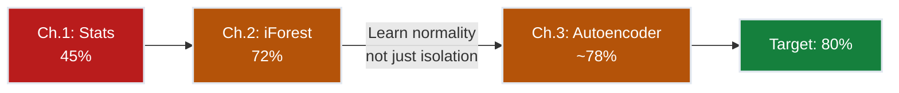
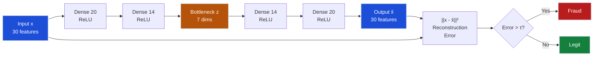
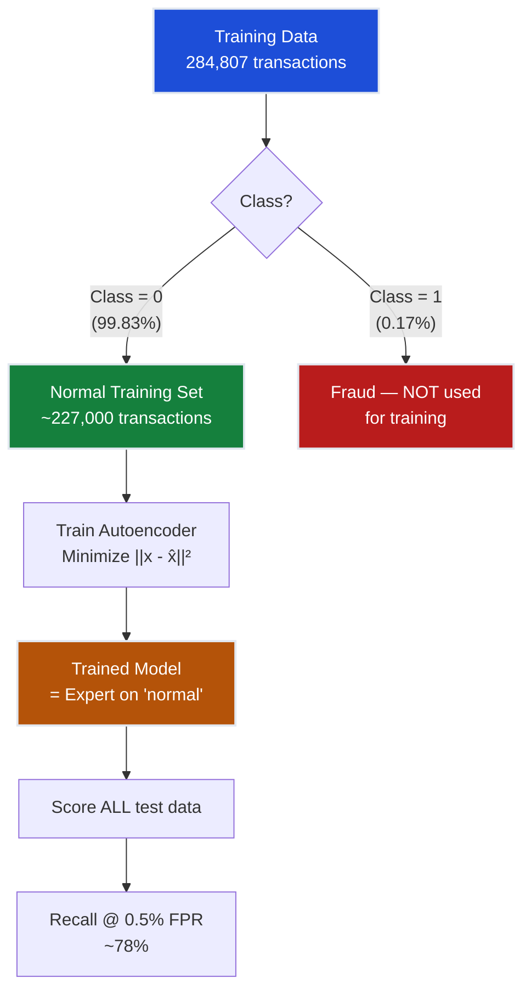
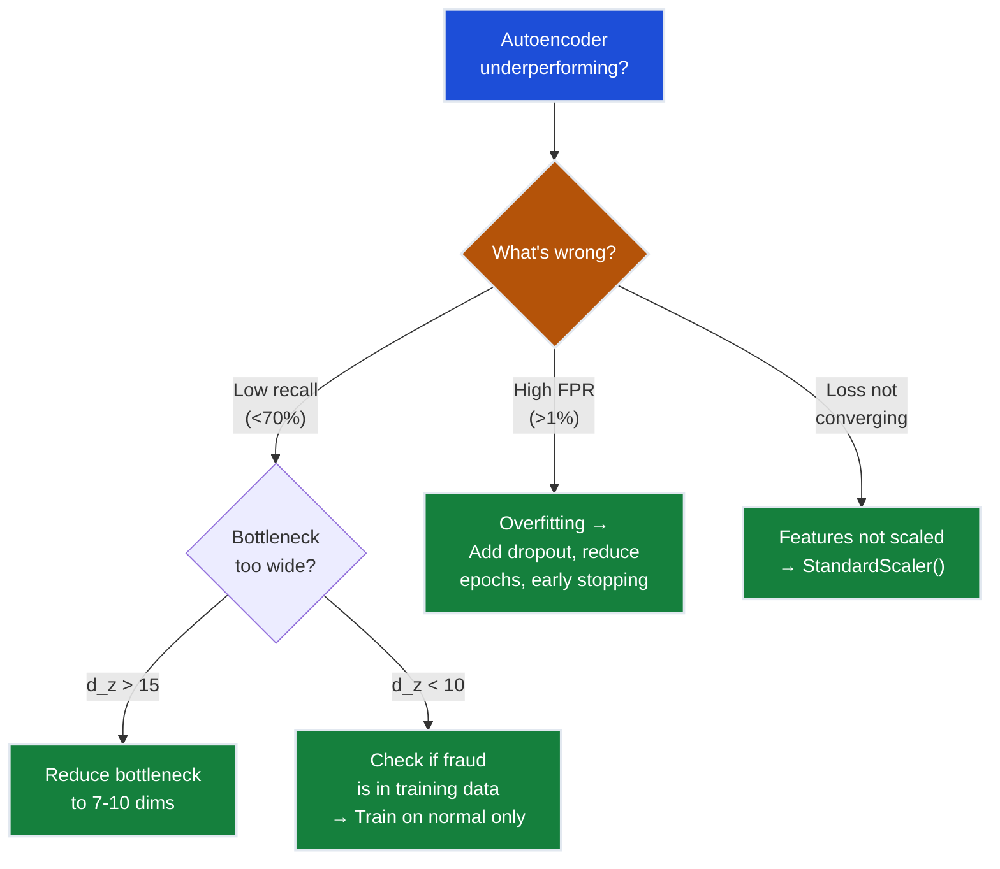

# Ch.3 — Autoencoders for Anomaly Detection

> **The story.** In **1986**, David Rumelhart, Geoffrey Hinton, and Ronald Williams published *"Learning representations by back-propagating errors"* — the paper that made training deep networks practical. Among many consequences, it enabled **autoencoders**: networks that learn to compress input into a bottleneck representation and then reconstruct it. The idea of using reconstruction error for anomaly detection came later, crystallized in the 2000s as deep learning matured. The logic is elegant: train a neural network to reconstruct *normal* data perfectly; when it encounters an anomaly, the reconstruction fails because the bottleneck never learned to encode that pattern. In **2014**, Kingma and Welling's Variational Autoencoder (VAE) added a probabilistic twist, and in **2016**, Sakurada and Yairi formally demonstrated autoencoders for industrial anomaly detection. Today, reconstruction-based detection is a pillar of deep anomaly detection — from fraud to manufacturing defects to medical imaging.
>
> **Where you are in the curriculum.** Ch.1 (statistics) caught 45% and Ch.2 (Isolation Forest) caught 72%. Both treat anomaly detection as a scoring/separation problem. This chapter introduces the first *representation learning* approach: the autoencoder learns **what normal looks like** by compressing and reconstructing it. Fraud, never seen during training on clean data, reconstructs poorly. This paradigm — learn normality, flag deviations — is the foundation of deep anomaly detection.
>
> **Notation in this chapter.** $\mathbf{x}$ — input transaction vector (30 features); $\mathbf{z} = f_\theta(\mathbf{x})$ — encoded representation (bottleneck); $\hat{\mathbf{x}} = g_\phi(\mathbf{z})$ — reconstructed transaction; $\mathcal{L} = \|\mathbf{x} - \hat{\mathbf{x}}\|^2$ — reconstruction loss (MSE); $d_z$ — bottleneck dimensionality; $\tau$ — anomaly threshold on reconstruction error.

---

## 0 · The Challenge — Where We Are

> 💡 **FraudShield status after Ch.2:**
> - ⚡ Z-score baseline: 45% recall
> - ⚡ Isolation Forest: 72% recall @ 0.5% FPR
> - **Still 8% short of the 80% target**

**What's blocking us:**
Isolation Forest captures geometric isolation but doesn't learn a *model* of normal behavior. It can tell you a point is isolated, but not *what normal transactions should look like*. We need a method that:
- Learns a compressed representation of normal transactions
- Flags anything that deviates from learned normality
- Captures non-linear feature interactions

**The imbalance advantage for autoencoders:**
With 99.83% legitimate transactions, we have abundant normal data to train on. We train the autoencoder **only on legitimate transactions** — it becomes an expert at reconstructing normal patterns. Fraud transactions, never seen during training, produce high reconstruction error.



---

## Animation


*Visual takeaway: learning normal transaction structure widens anomaly reconstruction error, pushing recall closer to the target.*

---

## 1 · Core Idea

An autoencoder is a neural network that learns to **compress** input data into a low-dimensional bottleneck and then **reconstruct** it. When trained only on normal transactions, it learns the manifold of legitimate behavior. Anomalies — which don't lie on this manifold — produce high **reconstruction error** ($\|\mathbf{x} - \hat{\mathbf{x}}\|^2$). The reconstruction error becomes the anomaly score: high error = anomaly, low error = normal.

---

## 2 · Running Example

Isolation Forest got you to 72%, but the Head of Risk wants more. "Can we teach a model what *normal* looks like, so anything different gets flagged?" You build an autoencoder that compresses 30-dimensional transactions into 7 dimensions and reconstructs them. Normal transactions compress and reconstruct cleanly; fraud doesn't.

Dataset: Same **Credit Card Fraud** dataset (284,807 transactions, 0.17% fraud).

**Training strategy**: Train **only on legitimate transactions** from the training set. The autoencoder never sees fraud during training — it becomes a "normal transaction expert." At inference, high reconstruction error = the model doesn't recognize this pattern = likely fraud.

**Why this works with 0.17% fraud:**
- 99.83% of training data is legitimate → massive training set for normality
- The bottleneck forces the network to learn compressed normal patterns
- Fraud patterns, never encoded, can't be reconstructed well
- Reconstruction error is a natural, continuous anomaly score

---

## 3 · Math

### Autoencoder Architecture

An autoencoder consists of two functions:

**Encoder** (compress):
$$\mathbf{z} = f_\theta(\mathbf{x}) = \sigma(W_e \mathbf{x} + b_e)$$

**Decoder** (reconstruct):
$$\hat{\mathbf{x}} = g_\phi(\mathbf{z}) = \sigma(W_d \mathbf{z} + b_d)$$

| Symbol | Meaning |
|--------|---------|
| $\mathbf{x} \in \mathbb{R}^{30}$ | Input transaction (V1-V28, Time, Amount) |
| $\mathbf{z} \in \mathbb{R}^{d_z}$ | Bottleneck representation ($d_z \ll 30$) |
| $\hat{\mathbf{x}} \in \mathbb{R}^{30}$ | Reconstructed transaction |
| $\theta, \phi$ | Encoder and decoder parameters |
| $\sigma$ | Activation function (ReLU, tanh) |

### Reconstruction Loss

The training objective minimizes the reconstruction error over normal transactions:

$$\mathcal{L}(\theta, \phi) = \frac{1}{N} \sum_{i=1}^{N} \|\mathbf{x}_i - g_\phi(f_\theta(\mathbf{x}_i))\|^2$$

**Concrete example:**
- Input transaction: $\mathbf{x} = [1.2, -0.3, 0.8, ..., 42.50]$ (30 features)
- Reconstructed: $\hat{\mathbf{x}} = [1.18, -0.28, 0.82, ..., 42.31]$ (close!)
- Reconstruction error: $\|\mathbf{x} - \hat{\mathbf{x}}\|^2 = 0.043$ → **low** → legitimate

- Fraud transaction: $\mathbf{x}_{\text{fraud}} = [-5.1, 3.2, -8.4, ..., 1250.00]$
- Reconstructed: $\hat{\mathbf{x}}_{\text{fraud}} = [-1.2, 0.8, -2.1, ..., 88.50]$ (far off!)
- Reconstruction error: $\|\mathbf{x} - \hat{\mathbf{x}}\|^2 = 147.3$ → **high** → anomaly!

**3-sample reconstruction error worked example** (threshold $\tau = 1.0$):

| Sample | $\mathbf{x}$ (Amount) | $\hat{\mathbf{x}}$ (Amount) | MSE error | Anomaly? |
|--------|-----------------------|-----------------------------|-----------|----------|
| Normal A | 42.50               | 42.31                       | 0.043     | No       |
| Normal B | 9.99                | 10.12                       | 0.071     | No       |
| Fraud C  | 1250.00             | 88.50                       | **147.3** | **Yes**  |

The autoencoder reconstructs normal amounts accurately (low MSE); the fraud amount of €1,250 — unseen during training — reconstructs as ~€88 (the training mean), yielding high error.

### Why the Bottleneck Matters

Without a bottleneck ($d_z = 30$, same as input), the network learns the identity function: $\hat{\mathbf{x}} = \mathbf{x}$ for ALL inputs, including fraud. The bottleneck ($d_z \ll 30$) forces **lossy compression**:

- **Too narrow** ($d_z = 2$): Can't represent normal patterns well → high error on everything
- **Sweet spot** ($d_z = 7$-$14$): Captures normal structure, fails on fraud
- **Too wide** ($d_z = 28$): Near-identity mapping → low error on fraud too (defeats the purpose)

> 💡 **Information bottleneck principle**: The optimal $d_z$ is the intrinsic dimensionality of the normal data manifold. Too wide → learns identity (fraud also reconstructs well). Too narrow → can't capture normal structure (high error on everything). For 30 PCA features with correlations, the sweet spot is typically $d_z = 7$-$14$.

### Denoising Autoencoder Extension

Add random noise to inputs during training:

$$\tilde{\mathbf{x}} = \mathbf{x} + \epsilon, \quad \epsilon \sim \mathcal{N}(0, \sigma_n^2 I)$$

Train to reconstruct the **clean** input from the **noisy** input:

$$\mathcal{L}_{\text{DAE}} = \frac{1}{N} \sum_{i=1}^{N} \|\mathbf{x}_i - g_\phi(f_\theta(\tilde{\mathbf{x}}_i))\|^2$$

**Why this helps**: Forces the network to learn robust features rather than memorizing exact values. The noise acts as regularization — the autoencoder must learn the *structure* of normal data, not surface-level patterns.

### Threshold Selection

The anomaly threshold $\tau$ is set on a validation set of normal transactions:

$$\tau = \text{percentile}_{99.5}\left(\{\mathcal{L}_i : y_i = 0\}\right)$$

This ensures FPR ≤ 0.5% on normal data. Alternatively, use the ROC curve:

$$\tau^* = \arg\min_\tau \{|\text{FPR}(\tau) - 0.005|\}$$

---

## 4 · Step by Step

```
AUTOENCODER ANOMALY DETECTION

Training (on legitimate transactions only):
1. Prepare data:
   └─ X_normal = X_train[y_train == 0]  (only legitimate)
   └─ Standardize features (zero mean, unit variance)

2. Define architecture:
   └─ Encoder: 30 → 20 → 14 → d_z (bottleneck)
   └─ Decoder: d_z → 14 → 20 → 30
   └─ Activation: ReLU (hidden), linear (output)

3. Train:
   └─ For each epoch:
       └─ For each mini-batch of normal transactions:
           └─ Forward: z = encoder(x), x̂ = decoder(z)
           └─ Loss: L = mean(||x - x̂||²)
           └─ Backward: compute gradients
           └─ Update: Adam optimizer step
   └─ Early stopping on validation reconstruction error

Scoring:
4. For each test transaction x:
   └─ x̂ = decoder(encoder(x))
   └─ anomaly_score = ||x - x̂||²

5. Set threshold τ from ROC curve at target FPR
6. Flag if anomaly_score > τ
```

---

## 5 · Key Diagrams

### Autoencoder Architecture



### Reconstruction Error Distribution

```
Reconstruction error distribution:

Normal transactions:           Fraud transactions:
count                          count
  │▄▄▄▄                         │
  │██████▄                       │         ▄
  │████████▄                     │       ▄██▄
  │██████████▄                   │     ▄██████▄
  ├────────────── error          ├────────────── error
  0   0.02  0.05                 0.05  0.5   2.0
       ↑                                ↑
   most normal                     fraud has
   errors small                    much higher
                                   recon error

                    ↕ threshold τ
```

### Training Only on Normal Data



---

## 6 · Hyperparameter Dial

| Dial | Too low | Sweet spot | Too high |
|------|---------|------------|----------|
| **Bottleneck dim $d_z$** | Can't reconstruct normal well (high error on everything) | `7`–`14` for 30 features | Near-identity mapping (low error on fraud too) |
| **Epochs** | Underfit (reconstruction too noisy) | `50`–`100` with early stopping | Overfit to training noise |
| **Learning rate** | Slow convergence | `1e-3` (Adam default) | Unstable training |
| **Noise level (DAE)** | No denoising benefit | `σ_n = 0.1`–`0.5` | Destroys signal, can't reconstruct anything |
| **Hidden layer width** | Bottleneck too abrupt (information loss) | `[20, 14, d_z, 14, 20]` | Overfitting, slow training |

**Critical for 0.17% fraud**: The bottleneck dimension is the most important hyperparameter. Too wide and fraud also reconstructs well; too narrow and normal data doesn't reconstruct either. Tune on a validation set with known fraud labels.

---

## 7 · Code Skeleton

```python
import numpy as np
import pandas as pd
import torch
import torch.nn as nn
from torch.utils.data import DataLoader, TensorDataset
from sklearn.preprocessing import StandardScaler
from sklearn.metrics import roc_curve, auc

# 1. Load and prepare
df = pd.read_csv("creditcard.csv")
X = df.drop("Class", axis=1).values
y = df["Class"].values

split_idx = int(0.8 * len(X))
X_train, X_test = X[:split_idx], X[split_idx:]
y_train, y_test = y[:split_idx], y[split_idx:]

# Train only on normal data!
X_normal = X_train[y_train == 0]
scaler = StandardScaler()
X_normal_s = scaler.fit_transform(X_normal)
X_test_s = scaler.transform(X_test)

# 2. Define autoencoder
class Autoencoder(nn.Module):
    def __init__(self, input_dim=30, bottleneck=7):
        super().__init__()
        self.encoder = nn.Sequential(
            nn.Linear(input_dim, 20), nn.ReLU(),
            nn.Linear(20, 14), nn.ReLU(),
            nn.Linear(14, bottleneck),
        )
        self.decoder = nn.Sequential(
            nn.Linear(bottleneck, 14), nn.ReLU(),
            nn.Linear(14, 20), nn.ReLU(),
            nn.Linear(20, input_dim),
        )

    def forward(self, x):
        z = self.encoder(x)
        return self.decoder(z)

# 3. Train
model = Autoencoder(input_dim=X_normal_s.shape[1], bottleneck=7)
optimizer = torch.optim.Adam(model.parameters(), lr=1e-3)
criterion = nn.MSELoss()

train_loader = DataLoader(
    TensorDataset(torch.FloatTensor(X_normal_s)),
    batch_size=256, shuffle=True,
)

for epoch in range(50):
    total_loss = 0
    for (batch,) in train_loader:
        x_hat = model(batch)
        loss = criterion(x_hat, batch)
        optimizer.zero_grad()
        loss.backward()
        optimizer.step()
        total_loss += loss.item()
    if epoch % 10 == 0:
        print(f"Epoch {epoch:3d} | Loss: {total_loss/len(train_loader):.6f}")

# 4. Score: reconstruction error
model.eval()
with torch.no_grad():
    x_test_t = torch.FloatTensor(X_test_s)
    x_hat = model(x_test_t)
    recon_error = ((x_test_t - x_hat) ** 2).mean(dim=1).numpy()

# 5. Evaluate
fpr, tpr, _ = roc_curve(y_test, recon_error)
idx_005 = np.where(fpr <= 0.005)[0][-1]
print(f"Recall @ 0.5% FPR: {tpr[idx_005]:.2%}")
print(f"AUC: {auc(fpr, tpr):.4f}")
```

---

## 8 · What Can Go Wrong

### Bottleneck Too Wide

- **$d_z$ too close to input dimension** — If $d_z = 25$ for 30-dimensional input, the network has almost no compression. It learns near-identity mapping and reconstructs fraud well too, producing low anomaly scores for everything. **Fix**: Start with $d_z = \lfloor \text{input\_dim} / 4 \rfloor$ and tune. For 30 features, try $d_z \in \{5, 7, 10, 14\}$.

### Training on Contaminated Data

> ⚠️ **Critical**: Always train **only on labeled legitimate transactions**. Even 0.17% fraud contamination degrades performance.

- **Including fraud in training data** — If even 0.17% of training data is fraud, the autoencoder partially learns fraud patterns. With 227k normal transactions and 400 fraud, the impact is small but measurable (~1-2% recall drop). **Fix**: **Always train only on labeled legitimate transactions**. If labels aren't available, use the most conservative contamination assumption.

### Overfitting to Training Distribution

- **Too many epochs without early stopping** — The autoencoder memorizes exact training patterns rather than learning generalizable normal structure. New legitimate transactions (slightly different from training) get high reconstruction error → false positives increase. **Fix**: Use **early stopping** on validation reconstruction error. Monitor validation loss and stop when it starts increasing.

### Feature Scale Mismatch

- **Amount feature dominates loss** — If `Amount` ranges 0-25,691 while V-features range ±5, reconstruction error is dominated by Amount mistakes. A small Amount error ($\Delta = 10$) matters more to the loss than a large V14 error ($\Delta = 0.5$). **Fix**: **Always standardize** all features to zero mean, unit variance before training.

### Quick Diagnostic Flowchart



---

## 9 · Progress Check — What We Can Solve Now

⚡ **Unlocked capabilities:**
- **Representation learning for anomaly detection!** Autoencoder learns normal transaction manifold
- **Improved recall**: ~78% at 0.5% FPR (+6% over Isolation Forest)
- **Continuous anomaly score**: Reconstruction error is a natural, interpretable metric
- **Flexible architecture**: Can add layers, dropout, denoising for further improvements

**Still can't solve:**
- **Constraint #1 (DETECTION)**: 78% recall < 80% target. Only 2% away!
- ✅ **Constraint #2 (PRECISION)**: <0.5% FPR achievable with ROC thresholding
- ⚡ **Constraint #3 (REAL-TIME)**: ~10ms inference (forward pass). Under 100ms but heavier than IF
- **Constraint #4 (ADAPTABILITY)**: Static model — must retrain for new fraud patterns
- ⚡ **Constraint #5 (EXPLAINABILITY)**: Per-feature reconstruction error shows *which features* reconstructed poorly — semi-interpretable

**Progress toward constraints:**

| Constraint | Status | Current State |
|------------|--------|---------------|
| **#1 DETECTION** | ❌ Very close | 78% recall (need >80%) |
| **#2 PRECISION** | ✅ Met | <0.5% FPR achievable |
| **#3 REAL-TIME** | ✅ Met | ~10ms inference |
| **#4 ADAPTABILITY** | ❌ Blocked | Static model |
| **#5 EXPLAINABILITY** | ⚡ Partial | Per-feature error decomposition |

---

## 10 · Bridge to Chapter 4

The autoencoder brought us to 78% by learning *what normal looks like* and flagging deviations. But it's a neural network — computationally heavier and harder to interpret than classical methods. Ch.4 (One-Class SVM) offers a kernel-based alternative: draw a **tight boundary** around normal data in a high-dimensional kernel space. It's mathematically principled (maximum-margin), requires no neural network training, and achieves ~75% recall. More importantly, it captures a different signal than the autoencoder — making it a valuable component for the ensemble in Ch.5.

> ➡️ **Completing the detector quartet**: We now have four complementary methods — [Ch.1](../ch01_statistical_methods) (statistical), [Ch.2](../ch02_isolation_forest) (tree-based), Ch.3 (neural), and [Ch.4](../ch04_one_class_svm) (kernel). Each peaks around 45-78% recall. [Ch.5](../ch05_ensemble_anomaly) fuses them to break 80%.
