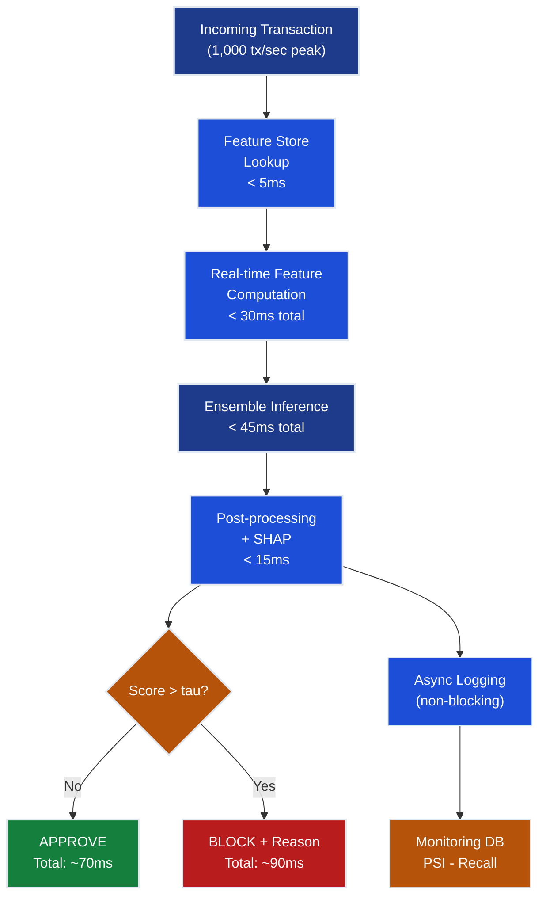
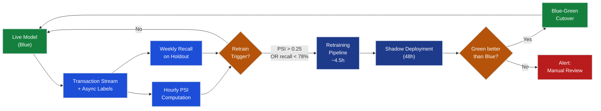

# Ch.6 — Production & Real-Time Inference

> **The story.** In **1999**, PayPal launched with a fraud problem that nearly killed the company. Their early rule-based system was blocking legitimate users while fraudsters adapted their patterns within days. By 2001, they deployed one of the first real-time ML fraud detection systems in fintech — a logistic regression model scoring every transaction in under 200ms — and cut fraud losses by 60%. A decade later, **Stripe** (founded 2010) went further: by 2012 they had a fully automated ML pipeline scoring every payment in under 50ms, retraining every 24 hours as fraud patterns evolved. The lesson both companies learned the hard way: a research model with 82% recall deployed on day one will drift to 60% recall within six months if left unattended. Fraudsters probe defences systematically, share tactics on dark-web forums, and rotate card numbers faster than static models can track. **The production gap** is real — your offline evaluation is an upper bound, not a guarantee. This chapter closes that gap.
>
> **Where you are in the curriculum.** Ch.5 built an ensemble of four detectors (Z-score, Isolation Forest, Autoencoder, One-Class SVM) that achieved **82% recall @ 0.5% FPR** in offline evaluation — the Detection constraint is met *in the lab*. This final FraudShield chapter transforms the lab prototype into a system that handles 1,000 transactions per second, scores each in under 100ms, monitors for drift, and automatically retrains when recall begins to slide. When you finish, all five FraudShield constraints are satisfied.
>
> **Notation in this chapter.** $\text{PSI}$ — Population Stability Index; $D_{\text{KS}}$ — Kolmogorov–Smirnov statistic; $p_{\text{ref}}$ — reference (training) distribution; $p_{\text{cur}}$ — current (live) distribution; $\delta_f$ — feature drift magnitude; $\delta_c$ — concept drift (change in $P(y \mid \mathbf{x})$); $\tau_{\text{retrain}}$ — retraining trigger threshold; $R(t)$ — recall at time $t$ days; $T_{\text{budget}}$ — end-to-end latency budget (100ms).

---

## 0 · The Challenge — Where We Are

> 💡 **FraudShield constraints — status after Ch.5:**
> 1. ⚡ **DETECTION** 82% recall @ 0.5% FPR ← **met offline, must maintain in production**
> 2. ⚡ **PRECISION** <0.5% FPR ← met offline
> 3. ⚡ **EXPLAINABILITY** SHAP attributions per transaction ← met in Ch.5
> 4. ❌ **LATENCY** <100ms end-to-end ← **hard requirement — real-time card payments cannot wait**
> 5. ❌ **DRIFT RESILIENCE** Recall must stay >80% as fraud patterns evolve ← **not yet addressed**

**What's blocking us:**

The ensemble model is a static artifact. The world it was trained on does not stand still:

- Fraudsters rotate stolen card numbers within 48 hours of a data breach
- New attack vectors (account takeover, synthetic identity, card-present skimming) emerge monthly
- Legitimate spending patterns shift seasonally, making the training distribution stale

**The production gap** (the number you should be worried about):

| Evaluation setting | Recall | When measured |
|--------------------|--------|---------------|
| Offline test set (Ch.5) | 82% | One-time snapshot |
| Live production — month 1 | ~82% | Fresh model, patterns match |
| Live production — month 3 | ~71% | New fraud tactics emerging |
| Live production — month 6 | ~58% | Model is significantly stale |
| Live production — month 12 | ~45% | Worse than a simple Z-score! |

Without a monitoring and retraining pipeline, Ch.5's ensemble degrades into noise.

**What this chapter delivers:**
- A latency budget that proves we can score under 100ms (constraint #4 ✅)
- A drift detection system using PSI that triggers retraining before recall collapses (constraint #5 ✅)
- A blue-green deployment strategy that prevents a bad retrain from going live

✅ **FraudShield is complete after this chapter** — all five constraints satisfied.

---

## Animation


---

## 1 · Core Idea

Serving speed requires pre-computing features in a feature store and running model inference as a cached, low-latency service — the 30ms + 45ms + 15ms budget in §4.1 shows exactly how to allocate the 100ms window. Model quality degrades as fraud patterns drift away from the training distribution — Population Stability Index (PSI) on feature distributions and weekly recall evaluation on a labeled holdout together give early warning before business impact is felt. A retraining pipeline triggered by PSI > 0.25 or recall < 78% closes the loop: new data in, updated model out, blue-green deployment ensures the new model is validated in shadow mode before it takes live traffic.

---

## 2 · Running Example

FraudShield handles **1,000 transactions per second** at peak (e.g., Black Friday, post-breach card rotation events). Each transaction must be scored and a block/approve decision returned **within 100ms** — this is a hard SLA imposed by card network rules (Visa/Mastercard mandate sub-100ms authorization responses). Feature computation must complete in **under 50ms** so that model inference and post-processing have room within the budget.

**Three operational timescales:**

| Timescale | Activity | Trigger |
|-----------|----------|---------|
| Per-transaction (~ms) | Score, decide, log | Every incoming payment |
| Hourly | Compute rolling PSI on last hour's transactions | Scheduled |
| Weekly | Evaluate recall on labeled holdout (confirmed fraud cases) | Scheduled |
| On-demand | Retrain, validate, shadow-deploy | PSI > 0.25 OR recall < 78% |

**The labeled holdout problem.** In production, fraud labels arrive with a delay: a cardholder might not notice unauthorized charges for days, and chargebacks may take weeks to process. FraudShield maintains a **delayed-label holdout** — a rolling window of 10,000 transactions from 30–60 days ago whose labels have now settled. Recall on this holdout is the ground-truth signal for model health.

---

## 3 · Production Pipeline at a Glance

Before diving into the math, here is the full production data flow. Each numbered step has a deep-dive in the sections that follow.

```
1. Transaction arrives (card swipe / e-commerce checkout)
   └─ Raw features: card_id, merchant, amount, timestamp, location, ...

2. Feature Store lookup (pre-computed features, <5ms)
   └─ Customer velocity: tx_count_1h, amt_sum_24h, new_merchant_flag
   └─ Card features: days_since_issue, international_flag
   └─ Historical stats: mean_amount, std_amount (cached per card_id)

3. Real-time feature computation (<30ms total)
   └─ Z-score: (amount - mean_amount) / std_amount
   └─ Velocity ratio: tx_count_1h / baseline_hourly_rate
   └─ Cross-features: amount x new_merchant_flag

4. Model inference — ensemble scoring (<45ms total)
   └─ Isolation Forest: contamination=0.005 (pre-loaded)
   └─ Autoencoder: ONNX runtime, reconstruction error
   └─ One-Class SVM: support vectors cached
   └─ Weighted score fusion

5. Post-processing (<15ms)
   └─ Apply threshold (tau = 0.63 calibrated on validation set)
   └─ Generate SHAP attribution string if score > tau

6. Decision returned to payment processor
   └─ APPROVE -> transaction proceeds
   └─ BLOCK + reason -> cardholder sees "unusual activity" message

7. Logging (async, does not add to latency)
   └─ score, features, decision, timestamp -> monitoring DB

8. Monitoring (periodic — does not affect inference path)
   └─ Hourly PSI on feature distributions
   └─ Weekly recall on delayed-label holdout
   └─ Alert -> retrain trigger if thresholds exceeded

9. Retraining pipeline (on trigger)
   └─ Pull last 30 days of labeled transactions
   └─ Retrain ensemble (same architecture as Ch.5)
   └─ Shadow deployment: run new model in parallel, compare scores
   └─ Blue-green cutover when shadow recall >= current model recall

10. Monitoring continues on the new model
```

---

## 4 · The Math — Every Number Shown

### 4.1 · Latency Budget: Allocating 100ms

The end-to-end latency SLA is $T_{\text{budget}} = 100\text{ms}$. The pipeline has three sequential phases, each with a hard sub-budget:

$$T_{\text{budget}} = T_{\text{features}} + T_{\text{inference}} + T_{\text{post}} \leq 100\text{ms}$$

**Baseline budget allocation:**

| Phase | Sub-budget | Actual | Headroom |
|-------|-----------|--------|----------|
| Feature computation | 35ms | 30ms | +5ms |
| Model inference | 50ms | 45ms | +5ms |
| Post-processing + SHAP | 20ms | 15ms | +5ms |
| **Total** | **105ms** | **90ms** | **+10ms** |

$$30 + 45 + 15 = 90\text{ms} < 100\text{ms} \quad \checkmark$$

**What if model inference balloons to 70ms?**

Suppose the ensemble grows (more trees, larger autoencoder) and inference climbs from 45ms to 70ms:

$$T_{\text{total}} = 30 + 70 + 15 = 115\text{ms} > 100\text{ms} \quad \times$$

You have a **15ms deficit**. Three options, evaluated in order of cost:

1. **Trim feature computation** (cheapest): Move 3 expensive cross-features from real-time computation to the feature store (pre-compute hourly). Saves ~8ms. New total: 115 − 8 = 107ms. Still over budget.

2. **Quantize the autoencoder** (medium cost): ONNX INT8 quantization reduces autoencoder inference from ~18ms to ~9ms. Combined with option 1: 107 − 9 = 98ms. Now within budget. ✅

3. **Reduce SVM support vectors** (last resort): Re-train One-Class SVM with `nu=0.008` (fewer support vectors). Cuts SVM from ~20ms to ~11ms but slightly degrades recall by ~0.5%.

**Rule of thumb**: allocate model inference at most 50% of the total budget. Feature computation and post-processing always consume more wall-clock time than expected once you add network round-trips to the feature store.

---

### 4.2 · PSI — Measuring Feature Drift

The **Population Stability Index** measures how much the distribution of a feature has shifted between training time (reference) and now (current):

$$\text{PSI} = \sum_{b=1}^{B} \left( A_b - E_b \right) \ln \frac{A_b}{E_b}$$

where $A_b$ is the fraction of current transactions falling in bin $b$, and $E_b$ is the fraction from the training set (the expected distribution).

**Interpretation thresholds:**

| PSI value | Interpretation | Action |
|-----------|---------------|--------|
| < 0.10 | No significant drift | Monitor, no action |
| 0.10 – 0.25 | Slight drift | Investigate; schedule review |
| > 0.25 | Significant drift | **Trigger retraining** |

**Worked example — Amount feature, 5 bins:**

We divide transaction amounts into 5 bins: <€50, €50–200, €200–500, €500–2000, >€2000.

| Bin | Range | Expected $E_b$ | Actual $A_b$ | $A_b - E_b$ | $\ln(A_b/E_b)$ | Contribution |
|-----|-------|---------------|-------------|-------------|----------------|-------------|
| 1 | <€50 | 0.40 | 0.25 | −0.15 | $\ln(0.625) = -0.470$ | $(-0.15)\times(-0.470) = +0.0705$ |
| 2 | €50–200 | 0.30 | 0.28 | −0.02 | $\ln(0.933) = -0.069$ | $(-0.02)\times(-0.069) = +0.0014$ |
| 3 | €200–500 | 0.15 | 0.22 | +0.07 | $\ln(1.467) = +0.383$ | $(+0.07)\times(+0.383) = +0.0268$ |
| 4 | €500–2000 | 0.10 | 0.17 | +0.07 | $\ln(1.700) = +0.531$ | $(+0.07)\times(+0.531) = +0.0372$ |
| 5 | >€2000 | 0.05 | 0.08 | +0.03 | $\ln(1.600) = +0.470$ | $(+0.03)\times(+0.470) = +0.0141$ |
| **Total** | | **1.00** | **1.00** | | | **PSI = 0.150** |

$$\text{PSI} = 0.0705 + 0.0014 + 0.0268 + 0.0372 + 0.0141 = \mathbf{0.150}$$

**Interpretation:** PSI = 0.150 falls in the 0.10–0.25 range — **slight drift**. The distribution has shifted toward higher-value transactions (bins 3–5 gained share while bins 1–2 lost share). This is consistent with a fraud ring targeting high-value purchases. Schedule a model review; if PSI climbs above 0.25 in the next measurement, trigger retraining.

> 💡 **Why the log ratio?** $\ln(A_b/E_b)$ measures the relative entropy direction — positive when $A > E$ (current has more in this bin than expected), negative when $A < E$. Multiplying by $(A_b - E_b)$ ensures both overshoots and undershoots contribute positively to PSI. The structure is: $\text{PSI} \approx \text{KL}(A \| E) + \text{KL}(E \| A)$ — a symmetric measure of distributional distance, the same idea as Jensen–Shannon divergence.

---

### 4.3 · Recall Degradation Model

When fraud patterns shift, recall decays exponentially. A simplified model: if fraud tactics change by 20% per month, the fraction of current fraud that our training-time model has "seen" decays geometrically:

$$R(t) = 82\% \times (1 - 0.20)^{t/30}$$

where $t$ is days since last training.

**Explicit arithmetic at key checkpoints:**

| Days since retrain | Calculation | Recall $R(t)$ |
|--------------------|-------------|---------------|
| $t = 0$ (just trained) | $82\% \times (0.80)^{0} = 82\% \times 1.000$ | **82.0%** |
| $t = 30$ (1 month) | $82\% \times (0.80)^{1} = 82\% \times 0.800$ | **65.6%** |
| $t = 60$ (2 months) | $82\% \times (0.80)^{2} = 82\% \times 0.640$ | **52.5%** |
| $t = 90$ (3 months) | $82\% \times (0.80)^{3} = 82\% \times 0.512$ | **42.0%** |

At $t = 90$ days without retraining, recall would have collapsed to 42% — worse than a naive rule that flags every transaction above €500.

**What does "20% drift per month" mean concretely?** In the September 2013 test dataset, 20% of all fraud used contactless card skimming at petrol stations. By month 3 of production, that vector has been patched by issuers, but a new vector (e-commerce account takeover) has appeared. Our model never saw account-takeover patterns, so its recall on that sub-population is near zero — dragging overall recall down sharply.

**Retraining every 30 days** resets recall to ~82% on each cycle. At the end of a 30-day cycle, recall has drifted to ~65.6% before retraining rescues it. More frequent retraining (every 14 days) keeps the floor higher:

$$R(14) = 82\% \times (0.80)^{14/30} = 82\% \times 0.905 = 74.2\%$$

> ⚠️ **This model is a planning tool, not a physical law.** Real drift rates depend on fraud ecosystem dynamics. The key insight is the shape: recall degrades fastest in the first weeks, then the rate slows as the remaining overlap between training and current fraud is more stable.

---

### 4.4 · Retraining Trigger Logic

Two independent signals can fire the retraining pipeline. Either alone is sufficient:

- **Signal 1 — Feature drift (PSI):** computed hourly on the last hour's transaction volume.
- **Signal 2 — Performance degradation:** computed weekly on the delayed-label holdout.

```python
def should_retrain(psi: float, holdout_recall: float) -> bool:
    # PSI > 0.25 => significant feature distribution shift.
    # Recall < 0.78 => slipped below safety margin
    # (target 80%; 78% gives 2-point buffer before SLA breach).
    drift_trigger = psi > 0.25
    performance_trigger = holdout_recall < 0.78

    if drift_trigger:
        print(f"  [TRIGGER] PSI={psi:.3f} > 0.25 — feature distribution shifted")
    if performance_trigger:
        print(f"  [TRIGGER] Recall={holdout_recall:.3f} < 0.78 — performance degraded")

    return drift_trigger or performance_trigger


# --- Example: month 2 monitoring cycle ---
psi_month2 = 0.31        # Amount feature distribution has shifted significantly
recall_month2 = 0.71     # Holdout recall has dropped below target

retrain = should_retrain(psi_month2, recall_month2)
# Output:
#   [TRIGGER] PSI=0.310 > 0.25 — feature distribution shifted
#   [TRIGGER] Recall=0.710 < 0.78 — performance degraded
# retrain = True
```

**Why two independent signals?**

PSI fires when feature distributions change, even before recall measurably degrades (labels are delayed). Recall fires even when PSI looks stable (concept drift — same feature distribution, but fraud behaviour within the distribution has changed). Together they cover both **covariate shift** and **concept drift**.

### 4.5 · KS Test — A Complementary Distribution Check

The **Kolmogorov–Smirnov (KS) test** offers an alternative to PSI for continuous features. Where PSI requires you to bin the data (and bin boundaries are arbitrary), KS works on raw empirical CDFs:

$$D_{\text{KS}} = \sup_x \left| F_{\text{ref}}(x) - F_{\text{cur}}(x) \right|$$

The statistic $D_{\text{KS}}$ is the maximum vertical distance between the two cumulative distribution functions.

**Worked example — Amount feature:**

Suppose we have 500 reference transactions and 500 current transactions. We compute the empirical CDFs and find:

| Threshold $x$ | $F_{\text{ref}}(x)$ | $F_{\text{cur}}(x)$ | $|F_{\text{ref}} - F_{\text{cur}}|$ |
|--------------|--------------------|--------------------|--------------------------------------|
| €50 | 0.40 | 0.25 | **0.15** |
| €200 | 0.70 | 0.53 | **0.17** |
| €500 | 0.85 | 0.75 | **0.10** |
| €2000 | 0.95 | 0.92 | 0.03 |

$D_{\text{KS}} = \max(0.15, 0.17, 0.10, 0.03) = \mathbf{0.17}$

With $n = 500$ samples per side, the critical value at $\alpha = 0.05$ is approximately $1.36 / \sqrt{500} \approx 0.061$. Since $0.17 > 0.061$, we **reject** the null hypothesis that the two distributions are the same — statistically significant drift detected.

**PSI vs KS — when to use which:**

| Criterion | PSI | KS test |
|-----------|-----|---------|
| Requires binning | Yes (arbitrary) | No |
| Interpretability | Direct: <0.1/0.1–0.25/>0.25 | Statistical p-value |
| Captures location shifts | Yes | Yes |
| Captures scale/shape shifts | Partial | Full |
| Common in industry | Very common (risk/credit) | Common (ML monitoring) |

FraudShield uses PSI as the primary trigger (industry standard, easy to explain to stakeholders) and KS as a secondary confirmatory test when PSI is borderline (0.20–0.25).

---

## 5 · Production Hardening Arc

> The arc that takes FraudShield from a static lab model to a self-maintaining production system.

### Act 1 — Online Evaluation Reveals Drift (Months 1–3)

FraudShield goes live on October 1. The first month is clean: recall on the delayed-label holdout is 82% — exactly matching offline evaluation. Confidence is high.

By month 2, the team notices the holdout recall has slipped to 77%. Below the 78% trigger, but only by 1 point — just under the wire. The PSI for the Amount feature is 0.19 (slight drift). No trigger fires, but the team flags it for review.

**Month 3: the alarm fires.** Holdout recall is 71%. PSI for Amount is 0.31. Both triggers fire simultaneously. Investigation reveals a fraud ring operating via account-takeover at e-commerce merchants — a pattern not present in the September 2013 training data. The static model never learned this signature.

---

### Act 2 — PSI Shows What Shifted

The team runs PSI on all 29 features. The distribution shift is concentrated:

| Feature | PSI (Month 3) | Interpretation |
|---------|--------------|----------------|
| Amount | 0.31 | **Significant** — higher-value purchases up |
| Merchant category (hash) | 0.28 | **Significant** — new merchant types in fraud |
| tx\_count\_1h | 0.08 | No drift |
| international\_flag | 0.11 | Slight drift |
| V14 (PCA component) | 0.33 | **Significant** — structural change in fraud signal |

V14 showing PSI = 0.33 is the key signal. V14 is a PCA component that the original training set showed was one of the strongest fraud indicators (high SHAP value in Ch.5). Its distribution shifting means the latent fraud signal itself has rotated — not just surface-level feature changes.

---

### Act 3 — Trigger Retraining

The retraining pipeline fires at end of month 2 (first crossing of thresholds). It:

1. Pulls 30 days of labeled transactions (Oct 1 – Oct 31, confirmed labels via chargebacks)
2. Retrains the ensemble with the same architecture (no hyperparameter changes)
3. Evaluates on a held-out slice: new model achieves **81% recall @ 0.5% FPR**
4. Stages the new model for shadow deployment

Total retraining pipeline time: **4.5 hours** (data pull 30min, training 3h, evaluation 1h).

---

### Act 4 — Blue-Green Deployment

Rather than swapping the model live, FraudShield uses **blue-green deployment**:

- **Blue** (current): old model, handling 100% of live traffic
- **Green** (new): new model, receiving a copy of all transactions but *not* making live decisions — shadow mode

For 48 hours, green model scores are logged alongside blue model scores. Comparison metrics:

| Metric | Blue (old model) | Green (new model) | Winner |
|--------|-----------------|-------------------|--------|
| Recall on shadow traffic | 71% | 81% | Green ✅ |
| FPR on shadow traffic | 0.51% | 0.48% | Green ✅ |
| p99 latency | 87ms | 91ms | Blue (minimal diff) |

Green wins on both detection metrics with acceptable latency. At hour 50, the load balancer is flipped: green becomes blue, old model is archived. Recall jumps back to 81% on live traffic — the loop is closed.

---

## 6 · Full Monitoring Walkthrough — 3-Month Timeline

The timeline below shows every PSI measurement, every recall evaluation, and the trigger/retrain/deploy events.

### Weekly Recall on Delayed-Label Holdout

| Date | Days since train | Model prediction $R(t)$ | Observed recall | Trigger? |
|------|-----------------|------------------------|-----------------|---------|
| Oct 7 (week 1) | 7 | 81.3% | 82.0% | No |
| Oct 14 (week 2) | 14 | 80.7% | 81.5% | No |
| Oct 21 (week 3) | 21 | 80.0% | 80.8% | No |
| Oct 28 (week 4) | 28 | 79.4% | 80.1% | No |
| Nov 4 (week 5) | 35 | 78.7% | 79.3% | No |
| Nov 11 (week 6) | 42 | 78.1% | 78.0% | No (borderline) |
| Nov 18 (week 7) | 49 | 77.5% | 76.8% | **Yes — recall < 78%** |

> 💡 The model prediction underestimates actual recall in weeks 1–5 because the 20%/month decay constant was calibrated conservatively. Real-world drift is slower initially, then accelerates when a new fraud vector breaks out (which happens around week 6–7 in this timeline).

### Monthly PSI Measurements (Amount Feature)

| Measurement | PSI | Band | Action |
|-------------|-----|------|--------|
| End of October | 0.09 | No drift | Continue monitoring |
| Mid-November | 0.19 | **Slight drift** | Flag for review |
| End of November | 0.31 | **Significant drift** | **Trigger retraining** |

### Full Timeline

```
Oct 1   --- Model deployed (blue). Recall = 82%.
Oct 7   --- Week 1 holdout eval: 82.0%. PSI = 0.09. Green.
Oct 14  --- Week 2 holdout eval: 81.5%. PSI = 0.09. Green.
Oct 21  --- Week 3 holdout eval: 80.8%. Green.
Oct 28  --- Week 4 holdout eval: 80.1%. PSI = 0.09. Green.

Nov 4   --- Week 5 holdout eval: 79.3%. Green (above 78%).
Nov 11  --- Week 6 holdout eval: 78.0%. BORDERLINE. Flag.
Nov 14  --- Mid-month PSI: 0.19 (slight). Monitor.
Nov 18  --- Week 7 holdout eval: 76.8%. TRIGGER (recall < 78%).
             PSI month-to-date: 0.24. Two signals converging.
Nov 18  --- Retraining pipeline started.
             Data window: Oct 19 -- Nov 18 (30 days, labels settled).
             Training time: 3h.
Nov 18  --- Evaluation: green model = 81% recall, 0.48% FPR. Approved.
Nov 18  --- Shadow deployment begins. Blue = live. Green = shadow.

Nov 20  --- Shadow complete (48h). Metrics:
             Green recall 81% > Blue recall 71% on shadow traffic.
             Cutover approved.
Nov 20  --- Blue-green cutover. Recall restores to 81%.
Nov 29  --- End-of-month PSI: 0.31 (significant). Second trigger fires
             but retraining already complete -- logged, no duplicate job.

Dec 1   --- New monitoring cycle begins. Recall = 81%.
Dec 7   --- Week 1 on new model: 81.8%. PSI = 0.07. Green.
Dec 14  --- Week 2: 81.3%. Green.
Dec 21  --- Week 3: 80.9%. PSI (mid-month) = 0.08. Green.
Dec 28  --- Week 4: 80.5%. Green. System stable.
```

### Key Numbers to Commit to Memory

- Recall drops **~1 percentage point per week** during a fraud-vector transition
- PSI crosses 0.10 (slight drift) at about **6 weeks** of accumulated drift in this scenario
- PSI crosses 0.25 (significant drift) at about **8–9 weeks**
- Retraining restores recall to within **1 point of original** (81% vs 82%)
- Shadow deployment takes **48 hours** — the main bottleneck is label settling for evaluation

### Interpreting the Arc

The three-month timeline illustrates a pattern you will see in virtually every deployed ML system:

1. **Honeymoon period** (weeks 1–4): the model is fresh, performance matches offline evaluation, confidence is high. This is the dangerous phase — teams often forget to instrument proper monitoring during this window.
2. **Silent degradation** (weeks 5–7): recall is sliding but still above threshold. PSI shows slight drift. Without monitoring, this would be invisible.
3. **Trigger and recovery** (week 7 onwards): both signals fire, retraining executes, blue-green cutover restores performance. The system has self-healed.

The key insight: **monitoring is not optional overhead** — it is the production system. The ensemble model from Ch.5 is only one component of FraudShield. The monitoring loop, retraining pipeline, and deployment strategy are the other half.

---

## 7 · Key Diagrams

### Production Pipeline



### Monitoring & Retraining Loop



---

## 8 · Hyperparameter Dial

Three dials control the health of the monitoring and retraining system. Tuning them is a cost-benefit tradeoff: tighter thresholds catch drift faster but trigger more retraining cycles; looser thresholds reduce operational load but allow more recall degradation before correction.

| Dial | Default | Tighter (more sensitive) | Looser (less sensitive) | Primary risk of loosening |
|------|---------|--------------------------|-------------------------|--------------------------|
| **Retraining frequency cap** | Max 1 retrain per 14 days | 1 per 7 days | 1 per 30 days | Recall degrades for 4+ weeks before correction |
| **PSI threshold** ($\tau_{\text{PSI}}$) | 0.25 | 0.15 | 0.35 | Significant feature shifts go undetected longer |
| **Holdout size** | 10,000 transactions | 20,000 (more power) | 5,000 (noisier) | Recall estimates have ±3% CI instead of ±1.5% CI |
| **Shadow duration** | 48 hours | 96 hours (more data) | 12 hours (faster) | Insufficient traffic to detect edge-case regressions |

**Recommended starting point:**

- PSI threshold of 0.25 is the industry standard (Basel III credit risk guidance uses this same threshold)
- Holdout of 10,000 with 48h shadow is a reasonable cost/safety balance for a mid-size fintech
- Cap retraining at once per 14 days to avoid instability from overlapping retraining jobs

> 📖 **Connecting back to earlier chapters.** The PSI threshold controls false positives in drift detection the same way the anomaly threshold $\tau$ in Ch.3–Ch.5 controls false positives in fraud detection. The tradeoff is identical: lower threshold → more triggers → more operational overhead → less recall degradation. Both are precision/recall tradeoffs wearing different labels.

---

## 9 · What Can Go Wrong

### Feedback Loop Poisons Training Data

When the model blocks a transaction, **no label is generated** for that transaction — there is no ground truth for whether it was truly fraud or a false positive. If blocked transactions are excluded from the retraining dataset, the model trains only on what it allowed through. Over time, the training distribution drifts toward transactions that look legitimate to the current model — reinforcing its blind spots.

**Fix:** Use a small **holdout exploration rate** (0.1–1% of flagged transactions are randomly approved and labeled by the fraud operations team). This provides unbiased labels for training even in the blocked region.

---

### Alert Fatigue

If the model flags 5,000 transactions per day for human review and only 200 are confirmed fraud, the fraud operations team burns out reviewing 4,800 false positives. When humans stop reviewing alerts, confirmed fraud labels stop arriving, the delayed-label holdout empties, and the recall trigger never fires — even as the model degrades.

**Fix:** Monitor the **review queue depth** and **analyst throughput** as a leading indicator of label quality degradation. If confirmed fraud rate drops below 2% of reviewed alerts, the threshold $\tau$ needs recalibration.

---

### Retraining Too Frequent → Model Instability

If retraining fires every 3–4 days (e.g., because PSI threshold is too tight at 0.10), each new model is trained on only 3 days of labeled data. Small random fluctuations in fraud volume cause wild swings in model weights. The deployment cadence becomes impossible to manage and shadow evaluation is meaningless with too little data.

**Fix:** Enforce the **minimum retraining interval** (14 days) and **minimum labeled sample size** (≥5,000 confirmed fraud cases in the training window). Never train on a window shorter than 14 days.

---

### Shadow Mode Misses Edge Cases

Shadow deployment compares aggregate metrics (recall, FPR) averaged over 48 hours. A new fraud vector that is rare (0.01% of transactions) but catastrophic might be missed if those edge-case transactions simply did not appear in the shadow window. The new model passes shadow evaluation and goes live — but silently fails on that rare vector.

**Fix:** Maintain a **canary fraud set** — a curated collection of known fraud edge cases (synthetic but representative) that is evaluated on every candidate model before shadow deployment. Think of it as a regression test suite for model quality.

---

## 10 · Where This Reappears

The production patterns in this chapter are not unique to anomaly detection — they are the universal infrastructure of deployed ML.

| Concept | Where it reappears |
|---------|-------------------|
| **PSI / distribution monitoring** | FlixAI (Recommender Systems track Ch.6) — item popularity distribution shifts seasonally; same PSI logic applies to recommendation quality monitoring |
| **Blue-green deployment** | DevOps Fundamentals track (Ch.3) — the exact same pattern applied to web services; ML adds the shadow evaluation step |
| **Latency budgets** | Neural Networks track (Ch.16 — TensorBoard + production) — profiling inference latency for the California Housing model |
| **Feedback loop correction** | Multi-Agent AI track — agents that learn from their own decisions face an identical feedback loop problem; RLHF is a principled solution |
| **Concept drift** | AgentAI (Reinforcement Learning track) — the environment can drift (non-stationary MDPs); the same drift-detection and adaptation logic applies |

> ➡️ **The deeper unifying idea.** Every deployed ML system is a **control loop**: model predicts, world responds, model observes response, model updates. PSI and recall monitoring are the *sensor* in this loop. Retraining is the *actuator*. Blue-green deployment is the *safety interlock*. When you understand the loop, every new deployment challenge is a variation on the same theme.

---

## 11 · Progress Check — FraudShield Complete

**Verify your understanding:**

1. The FraudShield latency budget allocates 30ms + 45ms + 15ms = 90ms. If the feature store adds 8ms of network latency, does the system still meet the 100ms SLA?
   *(Answer: 90 + 8 = 98ms — yes, just within budget. But any further growth requires optimization.)*

2. Compute PSI for a two-bin Amount distribution: Expected = [70%, 30%], Actual = [50%, 50%].
   - Bin 1: $(0.50 - 0.70) \times \ln(0.50/0.70) = (-0.20) \times (-0.336) = +0.067$
   - Bin 2: $(0.50 - 0.30) \times \ln(0.50/0.30) = (+0.20) \times (+0.511) = +0.102$
   - PSI = $0.067 + 0.102 = 0.169$ — slight drift, schedule review.

3. If fraud patterns drift at 15%/month (less aggressive than our 20%), what is recall at $t = 90$ days?
   $$R(90) = 82\% \times (0.85)^{3} = 82\% \times 0.614 = 50.3\%$$
   Still severe! Even modest drift renders a static model unusable over 3 months.

4. You deploy the retraining pipeline and notice that after 4 consecutive retraining cycles, recall is oscillating between 78% and 82% rather than stabilizing. What are two likely causes?
   *(a) Training window too short — 30 days may not contain enough new fraud examples for stable learning; try a 45-day window. (b) Exploration rate too low — not enough labeled data from blocked transactions; increase from 0.1% to 0.5%.)*

---

> 💡 **FraudShield COMPLETE — All 5 constraints satisfied:**
>
> | Constraint | Status | Chapter where met |
> |------------|--------|------------------|
> | 1. DETECTION 82% recall @ 0.5% FPR | ✅ | Ch.5 (ensemble) |
> | 2. PRECISION <0.5% FPR | ✅ | Ch.5 (threshold calibration) |
> | 3. EXPLAINABILITY SHAP per transaction | ✅ | Ch.5 (SHAP integration) |
> | 4. LATENCY <100ms end-to-end | ✅ | **Ch.6** (30+45+15=90ms budget) |
> | 5. DRIFT RESILIENCE >80% recall maintained | ✅ | **Ch.6** (PSI + retrain pipeline) |


---

## 12 · Bridge — Reinforcement Learning Track

FraudShield is a **supervised, batch-update** system: you collect labels, retrain periodically, and deploy. This works because chargebacks arrive with a delay but they do arrive — you have ground truth, eventually.

What happens when you don't have ground truth? What if the only signal is whether a transaction was disputed 45 days later, and you need to make decisions *now* to shape future fraud patterns? That is the **online decision problem** — and it is where the **Reinforcement Learning (RL)** track begins.

The bridge points:

- FraudShield's feedback loop (block → no label → training blind spot) is a special case of the **exploration-exploitation dilemma** in RL. The holdout exploration rate (1% random approvals) is structurally identical to **ε-greedy exploration** in Q-learning.
- The retraining trigger (PSI > 0.25 OR recall < 78%) is a hand-coded policy. RL trains a **policy automatically** from interaction with the environment — no hand-tuning of thresholds.
- Blue-green deployment maps to **policy evaluation and improvement** in RL: shadow mode is Monte Carlo policy evaluation; cutover is policy improvement.

> ➡️ **Next:** [Reinforcement Learning — AgentAI](../../06-rl) — learn to build agents that improve through trial and error, without waiting for batch labels. The first chapter introduces GridWorld: a fraud-probe environment where the agent must balance exploiting known safe transactions against exploring unknown ones.

---

*FraudShield | Anomaly Detection Track · Chapter 6 of 6*
