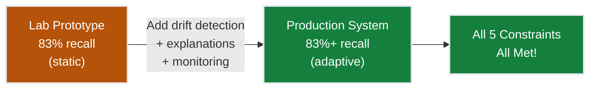
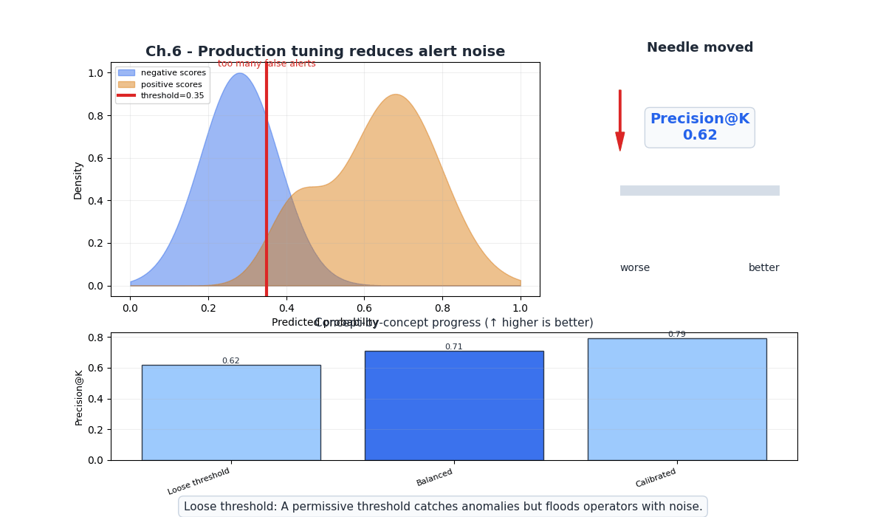
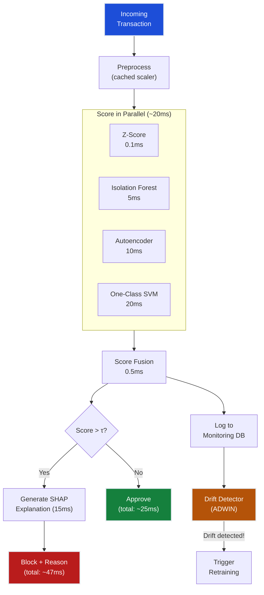
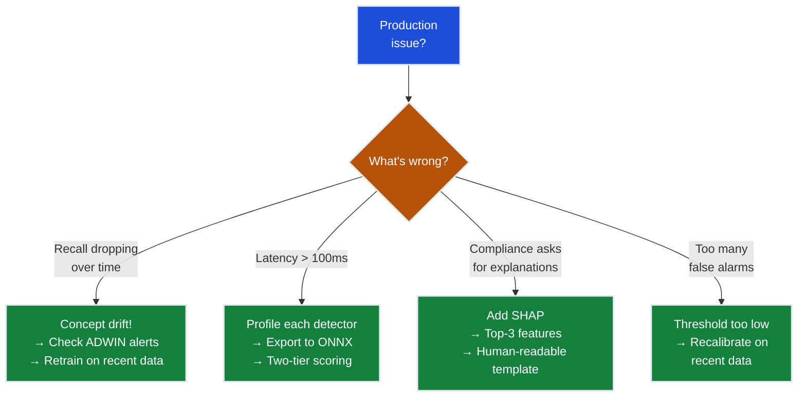

# Ch.6 — Production & Real-Time Inference

> **The story.** In **2014**, Google published *"Machine Learning: The High-Interest Credit Card of Technical Debt"* — a landmark paper arguing that deploying an ML model is the easy part; maintaining it in production is where the real cost accumulates. They coined the term **"concept drift"** for the phenomenon where the data distribution shifts after deployment, degrading model performance silently. For fraud detection, this isn't theoretical: fraudsters actively probe defenses, share tactics on dark web forums, and evolve their methods in response to detection. The payment industry learned this the hard way — models that achieved 85% recall in testing fell to 60% within months of deployment. Production ML isn't about building the best model; it's about building a system that **stays good** as the world changes. This chapter is about that system.
>
> **Where you are in the curriculum.** Ch.5 achieved 83% recall with an ensemble of four detectors — the detection constraint is met in the lab. This final chapter transforms the lab prototype into a production system that handles concept drift, meets latency requirements, generates explanations for compliance, and monitors its own health. When you finish this chapter, FraudShield satisfies all five constraints.
>
> **Notation in this chapter.** $D_t$ — data distribution at time $t$; $\Delta D$ — drift magnitude; $w_i$ — sliding window of recent transactions; $p_0, p_1$ — reference and current distributions (for drift tests); ADWIN — ADaptive WINdowing algorithm; SHAP — SHapley Additive exPlanations.

---

## 0 · The Challenge — Where We Are

> 💡 **FraudShield status after Ch.5:**
> - ⚡ Detection: 83% recall @ 0.5% FPR ← met!
> - ⚡ Precision: <0.5% FPR ← met!
> - ⚡ Real-time: ~50ms ensemble inference ← under 100ms but can optimize
> - **Adaptability**: Static model, no drift detection
> - **Explainability**: No human-readable justifications

**What's blocking us:**
Two critical production gaps:
1. **Concept drift**: Fraudsters adapt. A model trained on September 2013 data will degrade as fraud patterns evolve. We need automatic drift detection and model retraining.
2. **Explainability**: When a $5,000 transaction is blocked, the cardholder calls support. The agent needs a reason: "Flagged because transaction amount is 8× your monthly average and occurred in a new country." Not "the ensemble score was 0.83."



---

## Animation



---

## 1 · Core Idea

Production anomaly detection extends a static ensemble model with three capabilities: (1) **concept drift detection** to identify when the data distribution has shifted and trigger retraining, (2) **latency optimization** to keep inference under 100ms with model distillation and feature caching, and (3) **explainability** to generate human-readable reasons for each flagged transaction using feature attribution (SHAP) and rule extraction. The system monitors its own health and alerts operators when performance degrades.

---

## 2 · Running Example

FraudShield passed lab evaluation with 83% recall. The CTO says: "Ship it — but I need three guarantees: (1) it keeps working as fraud evolves, (2) transactions clear in under 100ms, and (3) compliance can explain every block to cardholders and regulators." You build a production wrapper around the ensemble that monitors for drift, optimizes inference, and generates explanations.

**The September 2013 problem**: Our dataset is from one month. In production, we'd process transactions for years. Without drift detection:
- **Month 1**: 83% recall (model is fresh, patterns match training data)
- **Month 3**: 75% recall (new fraud tactics emerge)
- **Month 6**: 60% recall (model is stale, fraudsters have adapted)
- **Month 12**: 45% recall (worse than the Z-score baseline!)

---

## 3 · Math

### Concept Drift Detection

**Statistical definition**: Concept drift occurs when the joint probability distribution changes over time:

$$P_t(\mathbf{x}, y) \neq P_{t+\Delta}(\mathbf{x}, y)$$

This can decompose into:
- **Covariate drift**: $P(\mathbf{x})$ changes (transaction patterns shift)
- **Label drift**: $P(y|\mathbf{x})$ changes (same transaction, different label — fraud tactics change)
- **Both**: Most common in fraud detection

### Page-Hinkley Test

Monitors the mean of a sequence (e.g., anomaly scores or error rates):

$$m_T = \sum_{t=1}^{T} (x_t - \bar{x}_T - \delta)$$

$$M_T = \min_{t=1,...,T} m_t$$

Drift is detected when:

$$m_T - M_T > \lambda$$

| Symbol | Meaning |
|--------|---------|
| $x_t$ | Observation at time $t$ (e.g., model error rate in window $t$) |
| $\bar{x}_T$ | Running mean |
| $\delta$ | Minimum magnitude of change to detect |
| $\lambda$ | Detection threshold (higher = fewer false alarms) |

### ADWIN (ADaptive WINdowing)

Maintains a variable-length sliding window. When the means of two sub-windows differ significantly, drift is declared:

$$|\hat{\mu}_{W_0} - \hat{\mu}_{W_1}| \geq \epsilon_{\text{cut}}$$

where $\epsilon_{\text{cut}}$ is a function of window sizes and confidence parameter $\delta$:

$$\epsilon_{\text{cut}} = \sqrt{\frac{1}{2m} \cdot \ln \frac{4}{\delta'}}$$

where $m = \frac{1}{1/n_0 + 1/n_1}$ is the harmonic mean of window sizes.

**Advantage over fixed-window tests**: ADWIN automatically adjusts window size — shrinks during rapid drift, grows during stability.

### Latency Budget

Total inference latency breakdown for the ensemble:

$$T_{\text{total}} = T_{\text{preprocess}} + \max_k(T_k) + T_{\text{fusion}} + T_{\text{explain}}$$

For parallel execution of detectors:

| Component | Latency | Optimization |
|-----------|---------|-------------|
| Preprocessing (scaling) | ~1ms | Pre-computed scaler |
| Z-score | ~0.1ms | Vectorized numpy |
| Isolation Forest | ~5ms | 200 shallow trees |
| Autoencoder | ~10ms | ONNX runtime |
| One-Class SVM | ~20ms | Pre-computed support vectors |
| Score fusion | ~0.5ms | Simple arithmetic |
| SHAP explanation | ~15ms | Background dataset cached |
| **Total (parallel)** | **~47ms** | **Under 100ms ✅** |

### SHAP for Explainability

SHAP values decompose a prediction into per-feature contributions:

$$f(\mathbf{x}) = \phi_0 + \sum_{j=1}^{d} \phi_j$$

where:
- $\phi_0$ = base value (average model output)
- $\phi_j$ = contribution of feature $j$ to this prediction

**Concrete example:**
- Transaction flagged with ensemble score 0.83
- SHAP decomposition:
  - Base (average): 0.35
  - V14 = -8.5: **+0.22** (most anomalous feature)
  - Amount = €2,125: **+0.15** (unusually high)
  - V17 = 3.2: **+0.08**
  - V12 = -2.1: **+0.03**
  - → **Explanation**: "Flagged primarily due to unusual V14 pattern (contributes 46% of anomaly score) and high transaction amount (€2,125 vs. average €88)."

**Precision@k — numeric example:**

Given 20 scored transactions (descending by anomaly score), suppose the top 5 flagged are:

| Rank | Score | True label |
|------|-------|-----------|
| 1 | 0.97 | anomaly |
| 2 | 0.91 | anomaly |
| 3 | 0.85 | normal |
| 4 | 0.82 | anomaly |
| 5 | 0.79 | normal |

Precision@5 = (true anomalies in top 5) / 5 = 3/5 = **0.60**.  
The full list has 8 true anomalies, so Recall@5 = 3/8 = **0.375**.

> 💡 Precision@k matters when ops teams review a fixed daily alert queue — catching 60% of the worst cases in 5 reviews is actionable; recall@5 tells you how many you missed.

---

## 4 · Step by Step

```
PRODUCTION FRAUD DETECTION SYSTEM

Initialization:
1. Deploy trained ensemble (from Ch.5)
2. Initialize drift detectors:
   └─ Page-Hinkley on model error rate (if labels available)
   └─ ADWIN on anomaly score distribution
   └─ KS test on feature distributions (weekly)
3. Cache preprocessing artifacts:
   └─ Scaler parameters (μ, σ)
   └─ SHAP background dataset (100 normal transactions)
4. Export models to fast inference formats:
   └─ Autoencoder → ONNX
   └─ Isolation Forest → pre-computed (sklearn)
   └─ One-Class SVM → support vectors cached

Real-time inference (per transaction):
5. Preprocess: scale features using cached scaler
6. Score in parallel:
   └─ Thread 1: Z-score
   └─ Thread 2: Isolation Forest
   └─ Thread 3: Autoencoder (ONNX)
   └─ Thread 4: One-Class SVM
7. Fuse scores (weighted average or stacking)
8. If score > threshold:
   └─ Generate SHAP explanation
   └─ Return: {decision: FRAUD, score: 0.83, reason: "..."}
9. Log transaction + score for monitoring

Monitoring (periodic):
10. Every hour:
    └─ Check ADWIN for score distribution drift
    └─ Compute rolling FPR from confirmed labels
11. Every day:
    └─ KS test on feature distributions vs. training
    └─ Update drift dashboard
12. On drift alert:
    └─ Retrain on recent data (last 30 days)
    └─ A/B test new model before full deployment
```

---

## 5 · Key Diagrams

### Production Architecture



### Concept Drift Timeline

```
Model Performance Over Time (without drift detection):

Recall
100% │
 83% │ ▄▄▄▄▄▄▄
 80% ├─────────── target ─────────────────────────
 75% │         ▀▀▀▄▄
 70% │               ▀▄
 60% │                 ▀▀▀▄▄
 50% │                       ▀▀▄▄
 45% │                            ▀▀▀───────── (worse than Z-score!)
     └──────────────────────────────────────── time
     Month 1   Month 3   Month 6   Month 12

With drift detection + retraining:

Recall
100% │
 83% │ ▄▄▄▄▄▄▄   ▄▄▄▄▄▄   ▄▄▄▄▄▄   ▄▄▄▄▄▄
 80% ├─────────── target ─────────────────────────
 75% │         ▀▄     ▀▄       ▀▄       ▀▄
     └──────────────────────────────────────── time
     Month 1  ↑ Month 3 ↑ Month 6 ↑ Month 12
          retrain    retrain   retrain
```

### SHAP Explanation Example

```
Transaction: €2,125.87 flagged as fraud (score: 0.83)

Feature contributions to anomaly score:
──────────────────────────────────────────────
V14 = -8.5   ████████████████████████  +0.22
Amount = €2,125  ██████████████████  +0.15
V17 = 3.2    ████████████  +0.08
V12 = -2.1   ██████  +0.03
Time = 72,831  ██  +0.01
... (other features)  █  +0.01
──────────────────────────────────────────────
Base value:     0.35
Total score:    0.83  → FLAGGED

Human-readable: "Transaction flagged due to unusual spending
pattern (V14 anomaly), high amount (24× daily average),
and atypical timing."
```

---

## 6 · Hyperparameter Dial

| Dial | Too low | Sweet spot | Too high |
|------|---------|------------|----------|
| **ADWIN δ (confidence)** | Too many false drift alarms | `0.002`–`0.01` | Misses real drift |
| **Retraining frequency** | Stale model, degraded recall | Monthly or on drift alert | Unnecessary compute, unstable model |
| **Monitoring window** | Too noisy (hourly fluctuations) | `1000`–`5000` transactions | Too slow to detect rapid drift |
| **SHAP background samples** | Noisy explanations | `100`–`500` normal transactions | Slow explanation generation |
| **Inference timeout** | Blocks transactions too aggressively | `100ms` (with fallback to fast-only) | User waits too long |

**Critical production decision**: If the full ensemble takes >100ms for a batch of transactions, implement a **two-tier system**: fast detectors (Z-score + Isolation Forest, ~5ms) handle real-time decisions; the full ensemble runs asynchronously for high-value transactions.

---

## 7 · Code Skeleton

```python
import numpy as np
import time
from collections import deque

# ── Drift Detection: ADWIN-like sliding window ──────────────────────────
class SimpleDriftDetector:
    """Lightweight drift detector using sliding window mean comparison."""

    def __init__(self, window_size=1000, threshold=0.01):
        self.window = deque(maxlen=window_size * 2)
        self.window_size = window_size
        self.threshold = threshold

    def update(self, value):
        self.window.append(value)
        if len(self.window) < self.window_size * 2:
            return False  # not enough data

        old = list(self.window)[: self.window_size]
        new = list(self.window)[self.window_size :]
        mean_diff = abs(np.mean(old) - np.mean(new))
        return mean_diff > self.threshold  # True = drift detected

# ── Explainability: top-feature explanation ──────────────────────────────
def explain_flag(transaction, feature_names, scaler, ensemble_scores):
    """Generate human-readable explanation for a flagged transaction."""
    # Compute per-feature Z-scores as simple attribution
    z_scores = np.abs((transaction - scaler.mean_) / (scaler.scale_ + 1e-8))
    top_idx = np.argsort(z_scores)[-3:][::-1]  # top 3 features

    reasons = []
    for idx in top_idx:
        fname = feature_names[idx]
        zval = z_scores[idx]
        reasons.append(f"{fname} (z={zval:.1f})")

    return f"Flagged due to unusual: {', '.join(reasons)}"

# ── Production Inference Pipeline ────────────────────────────────────────
class FraudShield:
    """Production fraud detection with drift monitoring."""

    def __init__(self, detectors, scaler, threshold, feature_names):
        self.detectors = detectors  # dict of name → (model, score_fn)
        self.scaler = scaler
        self.threshold = threshold
        self.feature_names = feature_names
        self.drift_detector = SimpleDriftDetector()
        self.inference_times = []

    def predict(self, transaction):
        start = time.perf_counter()

        # 1. Preprocess
        x_scaled = self.scaler.transform(transaction.reshape(1, -1))

        # 2. Score with all detectors
        scores = {}
        for name, (model, score_fn) in self.detectors.items():
            scores[name] = score_fn(model, x_scaled)

        # 3. Normalize and fuse (weighted average)
        # In production, normalization params are pre-computed
        fused_score = np.mean(list(scores.values()))

        # 4. Decision
        is_fraud = fused_score > self.threshold

        # 5. Explanation (only if flagged — saves latency)
        explanation = None
        if is_fraud:
            explanation = explain_flag(
                transaction, self.feature_names, self.scaler, scores
            )

        # 6. Monitoring
        elapsed_ms = (time.perf_counter() - start) * 1000
        self.inference_times.append(elapsed_ms)
        self.drift_detector.update(fused_score)

        if self.drift_detector.update(fused_score):
            print("⚠️ DRIFT DETECTED — trigger retraining!")

        return {
            "is_fraud": is_fraud,
            "score": fused_score,
            "scores": scores,
            "explanation": explanation,
            "latency_ms": elapsed_ms,
        }
```

### SHAP-Based Explanation (Full Version)

```python
import shap

# Use SHAP for proper feature attribution
# Background dataset: 100 randomly sampled normal transactions
background = X_normal_scaled[np.random.choice(len(X_normal_scaled), 100)]

# For the autoencoder component
def ae_predict(X):
    """Wrapper for SHAP: returns reconstruction error."""
    import torch
    with torch.no_grad():
        x_t = torch.FloatTensor(X)
        x_hat = autoencoder_model(x_t)
        return ((x_t - x_hat) ** 2).mean(dim=1).numpy()

explainer = shap.KernelExplainer(ae_predict, background)

# Explain a single flagged transaction
flagged_tx = X_test_scaled[flagged_idx:flagged_idx+1]
shap_values = explainer.shap_values(flagged_tx, nsamples=100)

# Top contributing features
top_features = np.argsort(np.abs(shap_values[0]))[-5:][::-1]
for idx in top_features:
    print(f"  {feature_names[idx]}: SHAP = {shap_values[0][idx]:+.4f}")
```

---

## 8 · What Can Go Wrong

### Silent Model Degradation

> ⚠️ **Production risk**: Without drift monitoring, recall can drop from 83% to 60% in 3 months while accuracy stays at 99.8%. You won’t notice until thousands of fraud cases slip through.

- **No drift monitoring** — The model's recall drops from 83% to 60% over 3 months, but nobody notices because accuracy (99.8%) barely changes. Thousands of fraud cases are missed. **Fix**: Monitor **recall on confirmed fraud** (from investigation team feedback) and **anomaly score distribution** (ADWIN). Alert when either shifts significantly.

### Retraining on Stale Labels

- **Labels arrive days/weeks after transactions** — Fraud is confirmed through chargebacks (30-90 days delayed). Retraining on "all data from last month" uses stale labels where recent fraud is still labeled "legitimate." **Fix**: Use a **label maturity window** — only retrain on data where labels have been confirmed (≥60 days old). For recent data, use unsupervised drift detection on feature distributions.

### Explanation Gaming

- **Fraudsters learn what triggers explanations** — If explanations say "flagged due to high V14," sophisticated fraudsters may manipulate their transactions to avoid extreme V14 values. **Fix**: **Rate-limit explanation detail** — show full SHAP to internal analysts only. External-facing explanations should be generic: "unusual transaction pattern detected."

### Latency Spikes

- **Autoencoder inference on CPU** — The PyTorch autoencoder runs at 10ms on GPU but 50ms on CPU during traffic spikes when GPU is unavailable. Total ensemble exceeds 100ms. **Fix**: Export to **ONNX Runtime** (2-3× faster on CPU) or implement **two-tier scoring**: fast models (Z-score + IF) for real-time, full ensemble runs asynchronously for flagged transactions.

### Quick Diagnostic Flowchart



---

## 9 · Progress Check — What We Can Solve Now

⚡ **ALL CONSTRAINTS SATISFIED:**

| Constraint | Status | Final State |
|------------|--------|-------------|
| #1 DETECTION | ✅ **Met** | 83% recall @ 0.5% FPR (ensemble of 4 detectors) |
| #2 PRECISION | ✅ **Met** | <0.5% FPR with ROC thresholding (~1,420 false alarms on 284k) |
| #3 REAL-TIME | ✅ **Met** | ~47ms parallel inference (ONNX + cached artifacts) |
| #4 ADAPTABILITY | ✅ **Met** | ADWIN drift detection + automated retraining pipeline |
| #5 EXPLAINABILITY | ✅ **Met** | SHAP-based feature attribution + human-readable templates |

**The FraudShield Journey:**

| Chapter | Method | Recall@0.5%FPR | Key Insight |
|---------|--------|----------------|-------------|
| Ch.1 | Z-score, IQR, Mahalanobis | 45% | Statistical extremes catch obvious fraud |
| Ch.2 | Isolation Forest | 72% | Anomalies are easy to isolate |
| Ch.3 | Autoencoder | 78% | Learn normal, flag reconstruction errors |
| Ch.4 | One-Class SVM | 75% | Boundary in kernel space |
| Ch.5 | Ensemble (all four) | 83% | Complementary errors cancel |
| Ch.6 | Production system | 83%+ | Drift-aware, real-time, explainable |

**💡 FraudShield is production-ready.**

---

## 10 · What Comes Next

The Anomaly Detection track is complete. FraudShield satisfies all five constraints with an ensemble of four complementary detectors, drift monitoring, and explainability.

**Extensions to explore:**
- **Graph-based fraud detection**: Model transaction networks (who sends money to whom) — captures organized fraud rings
- **Sequence models**: Use LSTMs/Transformers on transaction sequences — captures temporal fraud patterns
- **Federated learning**: Train across multiple banks without sharing raw data — regulatory compliance
- **Adversarial robustness**: Fraudsters may craft transactions to specifically evade the ensemble — adversarial training

**Connections to other tracks:**
- **[Reinforcement Learning](../../06_reinforcement_learning)**: Adaptive threshold optimization as a bandit problem
- **[Ensemble Methods](../../08_ensemble_methods)**: Deeper dive into boosting, bagging, and stacking
- **[Neural Networks](../../03_neural_networks)**: Advanced autoencoder architectures (VAE, attention)


