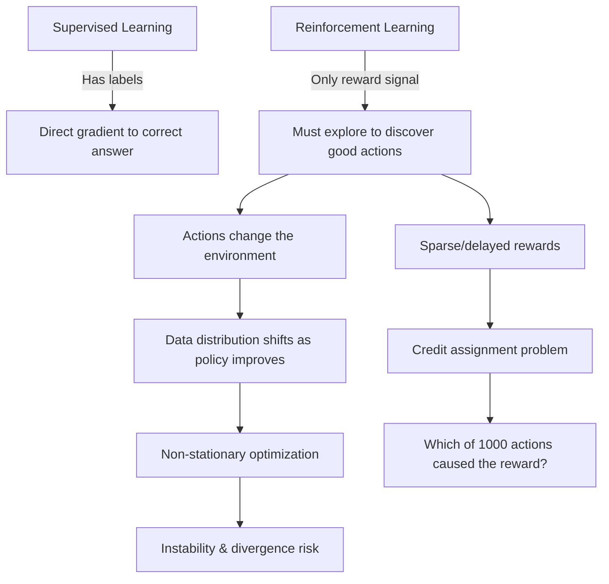

# Reinforcement Learning Track

> **The Mission**: Build **AgentAI** — train autonomous agents that learn optimal policies through trial-and-error interaction with environments, guided only by reward signals.

This is not supervised learning. There are no labels. There are no clusters. There is an **agent**, an **environment**, and a **reward signal** — and from that alone, the agent must learn to act optimally. Every chapter builds toward understanding how an agent goes from random flailing to purposeful, optimal behavior.

---

## The Paradigm Shift

Before RL, every ML method you've learned assumes one of two setups:

| Paradigm | Data | Goal | Learning Signal | Example |
|----------|------|------|----------------|---------|
| **Supervised** | $(x, y)$ pairs | Minimize error $f(x) \approx y$ | Labels (ground truth) | Predicting house prices |
| **Unsupervised** | $x$ (no labels) | Find hidden structure | None (self-organization) | Customer segmentation |
| **Reinforcement** | $(s_t, a_t, r_t, s_{t+1})$ sequences | Maximize cumulative reward $\sum \gamma^t r_t$ | **Delayed reward** | Agent navigating a maze |

**Why RL is fundamentally different:**

1. **No oracle.** Supervised learning asks "what's the right answer?" and someone provides it. RL asks "was that good?" — often *many steps later*.
2. **Sequential decisions.** Each action changes the world. The agent's data is generated by its own behavior — violating the i.i.d. assumption that all previous ML relied on.
3. **Exploration vs exploitation.** The agent must balance trying new things (exploration) with doing what it already knows works (exploitation). No other paradigm faces this dilemma.
4. **Credit assignment.** A chess player wins after 40 moves. Which move deserved credit? This temporal credit assignment problem has no analogue in supervised learning.

---

## The Grand Challenge: 5 AgentAI Constraints

| # | Constraint | Target | Why It Matters |
|---|-----------|--------|----------------|
| **#1** | **OPTIMALITY** | Find the optimal policy $\pi^*$ | A suboptimal agent leaves reward on the table. In robotics or trading, "almost optimal" can mean failure |
| **#2** | **EFFICIENCY** | Solve CartPole-v1 in <200 episodes (avg reward ≥195 over 100 consecutive episodes) | Real-world interactions are expensive. A robot can't fall 10,000 times to learn to walk |
| **#3** | **SCALABILITY** | Scale from GridWorld (16 states) to CartPole continuous state space (4D) → Atari pixel space | GridWorld has 16 states. Atari has $10^9$. Robotics has continuous dimensions |
| **#4** | **STABILITY** | Converge without divergence across 3 random seeds | RL is notoriously unstable. Small hyperparameter changes can cause catastrophic divergence |
| **#5** | **GENERALIZATION** | Transfer learned behaviour to new environment layouts | An agent trained in one maze should generalize, not memorize a single layout |

---

## Progressive Capability Unlock

| Ch | Title | What Unlocks | Constraints | Key Concept |
|----|-------|-------------|-------------|-------------|
| **1** | [Markov Decision Processes](ch01_mdps) | Formal RL framework — states, actions, rewards, policies | Foundation | Bellman equations |
| **2** | [Dynamic Programming](ch02_dynamic_programming) | Optimal policy when model is known | #1 Optimality ✅ | Value & policy iteration |
| **3** | [Q-Learning & TD Learning](ch03_q_learning) | Learn without knowing transition probabilities | #1 ✅ #2 Partial | Temporal difference, ε-greedy |
| **4** | [Deep Q-Networks](ch04_dqn) | Scale to large state spaces (Atari, CartPole) | #1 ✅ #3 ✅ | Experience replay, target networks |
| **5** | [Policy Gradients](ch05_policy_gradients) | Direct policy optimization, unlocks continuous action spaces (Pendulum-v1) | #1 ✅ #3 ✅ #4 Partial | REINFORCE, actor-critic |
| **6** | [Modern RL](ch06_modern_rl) | State-of-the-art stability & efficiency | #1 ✅ #2 ✅ #3 ✅ #4 ✅ #5 ⚠️ | PPO, SAC, A3C |

---

## Narrative Arc: From Random to Optimal

### Act 1: Foundations (Ch.1–2)
**Formalize the problem, solve it with perfect knowledge**

- **Ch.1**: What *is* the RL problem? → MDPs, Bellman equations, value functions
  - *"We can write down the math, but we can't solve it without knowing the environment's dynamics."*
- **Ch.2**: Given perfect knowledge of the environment → Value iteration and policy iteration find optimal policies guaranteed
  - *"Beautiful theory, but who gives us P(s'|s,a) in the real world? Nobody."*

**Status**: #1 Optimality ✅ (with perfect model). But useless in practice without known dynamics.

---

### Act 2: Model-Free Learning (Ch.3–4)
**Learn from experience alone, scale to real problems**

- **Ch.3**: Drop the model requirement → Q-learning and SARSA learn from trial-and-error
  - *"Now we're learning from experience! But a Q-table with 10⁹ entries for Atari? That's 4 GB per game."*
- **Ch.4**: Neural networks approximate Q-values → DQN plays Atari at superhuman level
  - *"Experience replay + target networks = stability. But what about continuous actions?"*

**Status**: #1 ✅ #2 Partial #3 ✅. Can handle large discrete action spaces.

---

### Act 3: Policy Optimization (Ch.5–6)
**Direct policy learning, modern algorithms**

- **Ch.5**: Optimize the policy directly → REINFORCE, actor-critic, advantage functions
  - *"Finally — continuous actions! But variance is killing us. We need better optimization."*
- **Ch.6**: Modern algorithms → PPO (stable), SAC (sample-efficient), A3C (parallel)
  - *"PPO is the workhorse of modern RL. Stable, general, and it just works."*

**Status**: **Constraints #1–#4 fully addressed.** Modern RL algorithms balance optimality, efficiency, scalability, and stability. #5 GENERALIZATION remains active research (sim-to-real transfer, meta-RL).

---

## The Environments

### GridWorld (4×4) — Chapters 1–3

```
┌─────┬─────┬─────┬─────┐
│  S  │     │     │     │
├─────┼─────┼─────┼─────┤
│     │  ██ │     │     │
├─────┼─────┼─────┼─────┤
│     │     │     │     │
├─────┼─────┼─────┼─────┤
│     │     │     │  G  │
└─────┴─────┴─────┴─────┘
S = Start, G = Goal (+10), ██ = Wall
Step cost: -1 per move
Actions: {Up, Down, Left, Right}
```

Simple, discrete, fully observable. Perfect for building intuition about MDPs, value iteration, and Q-learning.

### CartPole (OpenAI Gym) — Chapters 4–5

```
        ╱
       ╱  ← pole (keep upright!)
      ╱
  ┌──────┐
  │ cart │ ← push left/right
  └──┬┬──┘
═════╧╧══════ track
```

Continuous state space (position, velocity, angle, angular velocity). Perfect for demonstrating why function approximation is necessary.
### Pendulum-v1 (OpenAI Gym) — Chapter 5

```
     ║ pivot
      \
       \
        O  ← pendulum tip
```

Continuous state space (angle, angular velocity) **and** continuous action space (torque). Demonstrates why discrete argmax(Q) fails for continuous control and why policy gradients are required.
---

## What Makes RL Hard



---

## Prerequisites

Before starting this track, you should be comfortable with:
- **Linear algebra**: vectors, matrices, matrix multiplication (Ch.1–5 of MathUnderTheHood)
- **Probability**: conditional probability, expectation, Bayes' rule (Ch.7 of MathUnderTheHood)
- **Neural networks**: forward pass, backpropagation, loss functions (ML Track 03)
- **Gradient descent**: learning rate, convergence (ML Track 01, Ch.1)

---

## Format Note

This track is **currently theory-only** — README.md files with mathematical derivations, pseudocode, Mermaid diagrams, and ASCII art. The focus is on understanding algorithms conceptually before implementing them. Companion notebooks (deterministic toy environments with fixed RNG seeds, mirrored step-by-step outputs) are planned but not yet available. When ready, they will prepare you for hands-on RL libraries (Stable Baselines3, CleanRL).

For training instrumentation and monitoring, see [ML Track 03 — TensorBoard](../03_neural_networks/ch08_tensorboard/README.md).
