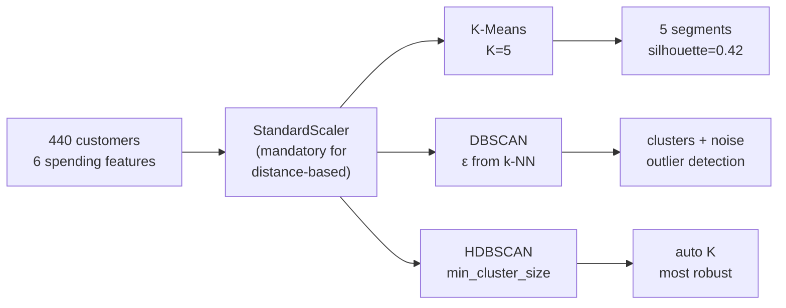
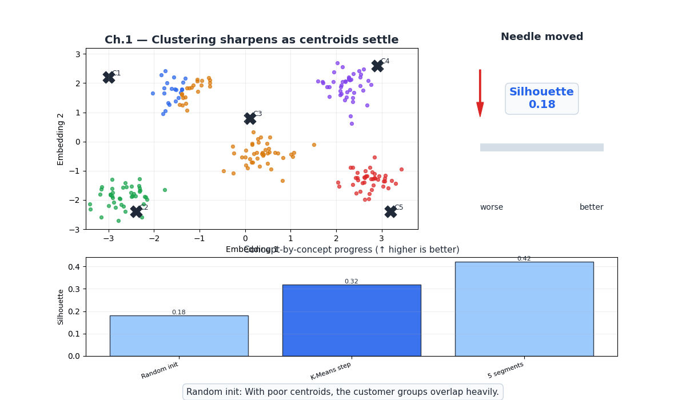
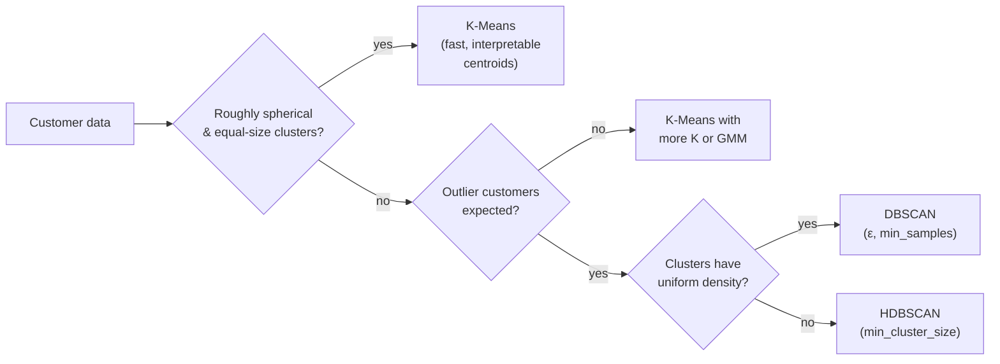
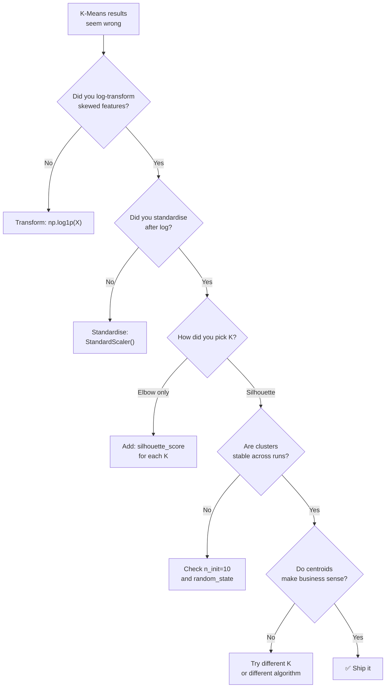
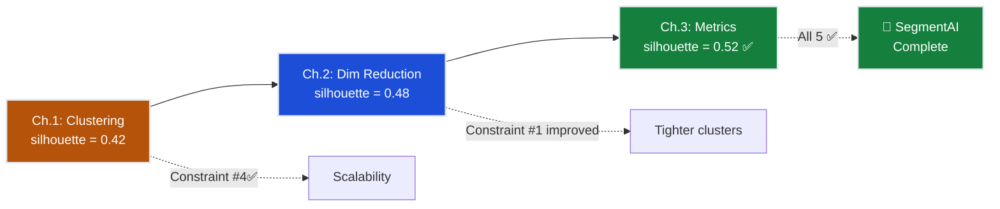

# Ch.1 — Clustering

> **The story.** **K-Means** has the strangest provenance in this curriculum: **Stuart Lloyd** invented it inside Bell Labs in **1957** while quantising telephone signals, but the report stayed unpublished for 25 years. **Hugo Steinhaus** had described essentially the same algorithm in 1956; **Edward Forgy** rediscovered it in 1965; **James MacQueen** finally named it "k-means" in 1967. By the time Lloyd's paper was finally published in 1982 the algorithm was already everywhere. The non-spherical, density-based alternative — **DBSCAN** — came from **Martin Ester, Hans-Peter Kriegel, Jörg Sander, and Xiaowei Xu** at KDD **1996**, and won the conference's 2014 Test-of-Time award. **HDBSCAN** (Campello, Moulavi, Sander 2013) added hierarchy and gave us a robust, parameter-light density clusterer that is the modern default. All three algorithms answer the same question — *which customers belong together?* — with three radically different definitions of "together."
>
> **Where you are in the curriculum.** This is the entry point to **unsupervised learning**. Unlike every chapter before this, there are no labels — no target variable, no ground truth. The retail business wants to discover natural customer segments from purchase behaviour alone. Clustering is the first tool: group similar customers automatically. It sets up the dimensionality-reduction work in [Ch.2](../ch02_dimensionality_reduction) and the metrics question in [Ch.3](../ch03_unsupervised_metrics) ("how do you score a clustering with no ground truth?").
>
> **Notation in this chapter.** $\mathbf{x}_i\in\mathbb{R}^d$ — a data point (one customer's spending vector); $K$ — number of clusters (a hyperparameter for K-Means); $\boldsymbol{\mu}_k$ — the **centroid** of cluster $k$; $C_k$ — the set of points assigned to cluster $k$; **inertia** $=\sum_{k}\sum_{\mathbf{x}_i\in C_k}\|\mathbf{x}_i-\boldsymbol{\mu}_k\|^2$ — the K-Means objective; $\epsilon$ — **DBSCAN** neighbourhood radius; $\text{minPts}$ — DBSCAN density threshold; **core / border / noise** — the three DBSCAN point types; $d(\mathbf{x}_i,\mathbf{x}_j)$ — distance metric (Euclidean unless stated).

---

## 0 · The Challenge — Where We Are

> 💡 **The mission**: Build **SegmentAI** — discover 5 actionable customer segments with silhouette >0.5
> 1. **SEGMENTATION**: 5 distinct segments — 2. **INTERPRETABILITY**: Business-actionable names — 3. **STABILITY**: Reproducible — 4. **SCALABILITY**: 10k+ customers — 5. **VALIDATION**: Silhouette >0.5

**What we know so far:**
- ⚡ Dataset: 440 wholesale customers, 6 spending features (Fresh, Milk, Grocery, Frozen, Detergents_Paper, Delicatessen)
- ⚡ Business goal: Targeted marketing instead of one-size-fits-all
- **No labels!** Nobody has classified these customers as "Loyalists" or "Price-sensitive"

**What's blocking us:**
⚠️ **No target variable — supervised learning is impossible**

The CMO asks: "What types of customers do we have?"
- **Supervised approach** would need: 440 hand-labelled records → too expensive, too subjective
- **Unsupervised approach**: Let the data speak — discover structure from purchase patterns alone

**What this chapter unlocks:**
⚡ **Three clustering algorithms to discover customer segments:**
1. **K-Means**: Fast, assumes spherical clusters, needs K upfront
2. **DBSCAN**: Arbitrary shapes, auto-detects noise customers, needs ε
3. **HDBSCAN**: Hierarchical density, auto-detects K, most robust

💡 **Outcome**: K-Means with K=5 discovers initial segments (silhouette = 0.42). DBSCAN reveals 23 outlier customers. First pass at Constraint #1 (SEGMENTATION).

| Constraint | Status | This Chapter |
|------------|--------|-------------|
| #1 SEGMENTATION | ⚡ Partial | 5 clusters found, but boundaries overlap |
| #2 INTERPRETABILITY | ⚡ Partial | Centroid profiles suggest segment names |
| #3 STABILITY | ❌ Not yet | Need bootstrap analysis (Ch.3) |
| #4 SCALABILITY | ✅ Done | K-Means is O(nKd), scales to millions |
| #5 VALIDATION | ❌ Not yet | Silhouette = 0.42 (below 0.5 target) |



---

## Animation



## 1 · Core Idea

Supervised learning has labels — you know the "right answer" for each customer. Unsupervised learning has no labels — you're discovering structure blind. **Clustering** is the first tool: group similar customers automatically, then name the segments afterward.

**K-Means:** partition $n$ customers into $K$ clusters by alternating two steps — assign each customer to its nearest centroid, then recompute centroids as cluster means. Repeat until assignments stop changing. Simple, fast, deterministic. But assumes spherical clusters of roughly equal size — and you must specify $K$ upfront.

**DBSCAN:** define clusters as dense regions of customers separated by sparse regions. Customers in low-density areas are labelled as **noise** — no cluster forced. Handles arbitrary shapes. No need to specify $K$ in advance. But requires choosing $\varepsilon$ (neighbourhood radius) and $\text{min\_samples}$ (density threshold).

**HDBSCAN:** hierarchical extension of DBSCAN. Builds a cluster tree across all density levels and extracts the most stable clusters. Tolerates clusters of varying density. Only one parameter: $\text{min\_cluster\_size}$ — the most intuitive of the three. The modern default.

```
K-Means: requires K, assumes spherical, no noise concept
DBSCAN:  requires ε + min_samples, handles arbitrary shapes, marks noise
HDBSCAN: requires only min_cluster_size, the most robust of the three
```

---

## 2 · Running Example

The CMO asks: "What types of customers do we have?" They give zero labels. We apply all three algorithms to the **6 spending features** of the UCI Wholesale Customers dataset and see what naturally emerges — high-value bulk buyers, grocery-focused retailers, specialty shops. Cluster labels can then drive targeted marketing campaigns without any manual annotation.

Dataset: **Wholesale Customers** (UCI) — 440 customers, 6 features
Features: Fresh, Milk, Grocery, Frozen, Detergents_Paper, Delicatessen (all log-transformed + standardised)
No target variable used during clustering

---

## 3 · Math

### 3.1 K-Means

**Objective:** minimise the total within-cluster variance (inertia):

$$J = \sum_{k=1}^{K} \sum_{\mathbf{x}_i \in C_k} \|\mathbf{x}_i - \boldsymbol{\mu}_k\|^2$$

where $\boldsymbol{\mu}_k = \frac{1}{|C_k|}\sum_{\mathbf{x}_i \in C_k} \mathbf{x}_i$ is the centroid of cluster $k$.

**Algorithm (Lloyd's):**

```
1. Initialise K centroids (K-Means++ samples them proportional to distance²)
2. Assignment step: each customer → nearest centroid (by Euclidean distance)
3. Update step: each centroid → mean of its assigned customers
4. Repeat 2–3 until assignments do not change (or max_iter reached)
```

**K-Means++** initialisation (sklearn default): choose the first centroid uniformly at random, then each subsequent centroid $\boldsymbol{\mu}_j$ with probability proportional to $d(\mathbf{x}, \text{nearest existing centroid})^2$. This spreads centroids and dramatically reduces the chance of a bad local minimum.

**Numeric example** (2 customers, 2 features — Fresh and Grocery spending in standardised units):

| Customer | Fresh | Grocery |
|----------|-------|---------||
| A | 8.5 | 9.2 |
| B | 10.1 | 7.8 |

**Centroid calculation:**

$$\boldsymbol{\mu} = \left(\frac{8.5+10.1}{2}, \frac{9.2+7.8}{2}\right) = (9.3, 8.5)$$

This is the cluster's **centre of mass** — the point that minimizes the sum of squared distances to all members.

**Inertia contribution of customer A:**

$$\|\mathbf{x}_A - \boldsymbol{\mu}\|^2 = (8.5-9.3)^2 + (9.2-8.5)^2 = 0.64 + 0.49 = 1.13$$

**Customer B's contribution:**

$$\|\mathbf{x}_B - \boldsymbol{\mu}\|^2 = (10.1-9.3)^2 + (7.8-8.5)^2 = 0.64 + 0.49 = 1.13$$

**Total inertia for this cluster:** $1.13 + 1.13 = 2.26$

💡 **Why this matters:** K-Means minimizes this total inertia across all clusters. Lower inertia = tighter clusters. But inertia *always* decreases as $K$ increases — at $K=n$ (one customer per cluster), inertia drops to zero. That's why we need silhouette and other metrics (Ch.3) to pick the right $K$.

### 3.2 DBSCAN

DBSCAN classifies each point as **core**, **border**, or **noise** based on two parameters:

- $\varepsilon$ (eps): neighbourhood radius
- $\text{MinPts}$ (min_samples): minimum neighbours within $\varepsilon$ to be a core point

| Term | Definition |
|------|------------|
| Core point | Has $\geq \text{MinPts}$ neighbours within $\varepsilon$ |
| Border point | Within $\varepsilon$ of a core point, but fewer than MinPts neighbours itself |
| Noise point | Not a core point and not within $\varepsilon$ of any core point; labelled $-1$ |

**Density-reachability:** $\mathbf{p}$ is density-reachable from $\mathbf{q}$ if there is a chain of core points $\mathbf{q} = \mathbf{p}_1, \mathbf{p}_2, \ldots, \mathbf{p}_n = \mathbf{p}$ where each consecutive pair is within $\varepsilon$.

**Complexity:** $O(n \log n)$ with a spatial index (ball tree / kd-tree). $O(n^2)$ brute force.

### 3.3 HDBSCAN

HDBSCAN extends DBSCAN by varying $\varepsilon$ continuously from $\infty$ downward, building a **cluster hierarchy**:

1. Compute the **mutual reachability distance**: $d_\text{mreach}(\mathbf{p}, \mathbf{q}) = \max(\text{core-dist}(\mathbf{p}), \text{core-dist}(\mathbf{q}), d(\mathbf{p}, \mathbf{q}))$
2. Build the **minimum spanning tree** on the mutual reachability graph
3. Extract the cluster hierarchy by removing edges from longest to shortest
4. Compute **cluster stability** and extract the most stable clusters

**Key parameter:** `min_cluster_size` — clusters smaller than this are absorbed into noise. Much more intuitive than DBSCAN's $(\varepsilon, \text{MinPts})$ pair.

---

## 4 · Step by Step

```
K-Means:
1. Log-transform features (spending data is heavily right-skewed)
2. Standardise features (K-Means uses Euclidean distance — scale matters)
3. Run with K=2,3,...,10; record inertia and silhouette score
4. Plot elbow curve → pick K at the bend
5. Refit with chosen K; inspect centroids (inverse-transform to original scale)
6. Name segments: examine centroid profiles → "Loyalists", "Price-sensitive", etc.

DBSCAN:
1. Log-transform + standardise
2. k-nearest-neighbour distance plot to estimate ε:
   sort customers by distance to k-th neighbour; ε ≈ the "knee"
3. Set min_samples ≈ 2 × n_features = 12
4. Inspect: how many clusters? How many noise customers?
5. Noise customers = outlier spenders worth separate analysis

HDBSCAN:
1. Log-transform + standardise
2. Set min_cluster_size = ~5% of n_samples ≈ 22
3. Train; inspect cluster labels and probabilities per customer
4. Customers with label=-1 are noise; check noise fraction
5. Compare number of clusters to K-Means result
```

---

## 5 · Key Diagrams

### 5.1 K-Means: assignment and update steps

```
Step 0 (init):        Step 1 (assign):      Step 2 (update):      Converged:
 ×  × ○  ○             × ×│○  ○              ×│× ○│○               ×│×│○│○
 × ○    ○ ×      →     × ○│   ○ ×     →      ×│○ ○│×        →     ×│○ ○│×
   ★        ★            ★│       ★             ★│    ★               ★│  ★

centroids ★ placed → assign each customer → recompute centroids → stable
```

### 5.2 K-Means vs DBSCAN decision



---

## 6 · Hyperparameter Dial

### 6.1 K-Means

| Dial | Too low | Sweet spot | Too high |
|------|---------|------------|----------|
| **K** | Coarse clusters (merges Loyalists with Occasional) | Elbow of inertia curve; validate with silhouette | Every customer its own cluster (K=n → inertia=0) |
| **n_init** | Single bad local minimum | 10 (sklearn default) | Diminishing returns |
| **max_iter** | Didn't converge | 300 | Rarely needed above 300 |

### 6.2 DBSCAN

| Dial | Too low | Sweet spot | Too high |
|------|---------|------------|----------|
| **ε** | Everything is noise | Use k-NN distance plot knee | One giant cluster |
| **min_samples** | Every customer is a core point | $2 \times d$ (d = features) = 12 | Only densest cores survive |

### 6.3 HDBSCAN

| Dial | Too low | Sweet spot | Too high |
|------|---------|------------|----------|
| **min_cluster_size** | Too many micro-segments | ~5% of dataset ≈ 22 | Only 1–2 large segments |

---

## 7 · Code Skeleton

```python
import numpy as np
import pandas as pd
from sklearn.preprocessing import StandardScaler
from sklearn.cluster import KMeans, DBSCAN
from sklearn.metrics import silhouette_score
from sklearn.neighbors import NearestNeighbors

# ── Data ──────────────────────────────────────────────────────────────────────
url = "https://archive.ics.uci.edu/ml/machine-learning-databases/00292/Wholesale%20customers%20data.csv"
df = pd.read_csv(url)
spend_cols = ['Fresh', 'Milk', 'Grocery', 'Frozen', 'Detergents_Paper', 'Delicatessen']
X = df[spend_cols].values  # 440 customers × 6 features

# Log-transform (spending is heavily right-skewed) + standardise
X_log = np.log1p(X)
scaler = StandardScaler()
X_sc = scaler.fit_transform(X_log)
```

```python
# ── K-Means elbow ─────────────────────────────────────────────────────────────
inertias, sil_scores = [], []
K_range = range(2, 11)

for k in K_range:
    km = KMeans(n_clusters=k, init='k-means++', n_init=10, random_state=42)
    km.fit(X_sc)
    inertias.append(km.inertia_)
    sil_scores.append(silhouette_score(X_sc, km.labels_))
```

```python
# ── Fit best K-Means ──────────────────────────────────────────────────────────
best_k = 5  # from elbow + business requirement
km_best = KMeans(n_clusters=best_k, init='k-means++', n_init=10, random_state=42)
km_best.fit(X_sc)
labels_km = km_best.labels_

# Centroid in original scale — interpretable
centroids_log = scaler.inverse_transform(km_best.cluster_centers_)
centroids_orig = np.expm1(centroids_log)  # undo log1p

segment_names = ["Loyalists", "Price-Sensitive", "Big Spenders",
                 "Occasional Buyers", "Deli Specialists"]
for i, c in enumerate(centroids_orig):
    print(f"Segment {i} — '{segment_names[i]}':")
    for col, val in zip(spend_cols, c):
        print(f"  {col}: {val:,.0f}")
```

```python
# ── DBSCAN ────────────────────────────────────────────────────────────────────
db = DBSCAN(eps=0.8, min_samples=12)  # min_samples = 2 × 6 features
db.fit(X_sc)
labels_db = db.labels_

n_clusters = len(set(labels_db)) - (1 if -1 in labels_db else 0)
n_noise = (labels_db == -1).sum()
print(f"DBSCAN: {n_clusters} clusters, {n_noise} noise customers ({n_noise/len(X_sc)*100:.1f}%)")
```

---

## 8 · What Can Go Wrong

**K-Means on raw (unskewed) spending data** — Fresh ranges 3–112k and Delicatessen ranges 3–48k. Without log-transform, a single high-Fresh customer dominates the distance calculation (Euclidean distance is scale-sensitive). A customer with Fresh=100k is 1000× more influential than one with Delicatessen=100 even though both might be equally "extreme" in their respective categories.

**Fix:** Always log-transform skewed spending data, then standardise. `X_log = np.log1p(X); X_sc = StandardScaler().fit_transform(X_log)`. Log squashes the range (3–112k → 1.1–11.6); StandardScaler equalizes variance.

---

**Choosing K from the elbow on inertia alone** — Inertia always decreases monotonically. It reaches zero at $K=n$ (one customer per cluster). The elbow is often ambiguous — for 440 customers, the curve bends gradually from K=2 to K=8 with no obvious knee.

**Fix:** Always confirm with silhouette score (Ch.3). The K with the highest mean silhouette is a better choice — but cross-check against business requirements. Marketing may need K=5 segments even if silhouette peaks at K=3.

---

**Running DBSCAN without an ε estimate** — Guessing $\varepsilon$ blindly produces either a single giant cluster ($\varepsilon$ too large) or all noise ($\varepsilon$ too small). For 440 customers with 6 features, $\varepsilon \in [0.5, 1.5]$ is the typical range after standardisation — but that's still a 3× span.

**Fix:** Produce the k-NN distance plot first. Sort customers by distance to their $k$-th nearest neighbour (k = min_samples). The "knee" of this curve is the optimal $\varepsilon$. sklearn: `NearestNeighbors(n_neighbors=12).fit(X_sc).kneighbors()` → plot sorted distances.

---

**Treating K-Means cluster labels as stable across runs** — With random initialisation, label integers (0,1,2,3,4) can swap between runs. Cluster 0 in run A might be cluster 3 in run B. If you hard-code "Cluster 0 = Loyalists", that name will break on the next run.

**Fix:** Always use `random_state` for reproducibility. Compare clusters by their centroid profiles (feature means), not by label integers. Name segments based on what the centroid represents, not its integer label.

---

**Ignoring initialisation sensitivity** — K-Means is sensitive to initial centroid placement. Even with K-Means++ (sklearn default), different random seeds can yield different local minima with $K=5$ on 440 points. Inertia can vary by 10–20% across seeds.

**Fix:** Use `n_init=10` (sklearn default) — fit 10 times with different initialisations, keep the run with lowest inertia. This dramatically reduces the chance of a bad local minimum.

---

### Diagnostic Flowchart




---

## 9 · Where This Reappears

Clustering, centroid geometry, and inertia appear throughout the curriculum:

- **[Ch.2 — Dimensionality Reduction](../ch02_dimensionality_reduction)**: Uses the same K=5 segmentation from this chapter to show cluster tightening in PCA space. The 0.42 silhouette from raw 6D here becomes 0.48 after PCA compression — proof that the curse of dimensionality was hurting us.
- **[Ch.3 — Unsupervised Metrics](../ch03_unsupervised_metrics)**: Silhouette score introduced informally here becomes the primary validation metric for the entire track. Bootstrap stability testing builds on the `random_state` reproducibility discussion here.
- **[03-NeuralNetworks / Ch.16 TensorBoard](../../03_neural_networks/ch16_tensorboard)**: The embedding projector uses PCA/t-SNE/UMAP (from Ch.2 here) to visualise high-dimensional hidden states — the same "compress 512D →2D" problem we solve here for 6D customer features.
- **[MultimodalAI / LatentDiffusion / VQ-VAE](../../../multimodal_ai/ch07_latent_diffusion)**: VQ-VAE codebook learning is K-Means on the latent space — centroids become the discrete codebook entries that the model learns to predict. Same $\arg\min_k \|\mathbf{z} - \boldsymbol{\mu}_k\|$ assignment step.
- **[04-RecommenderSystems / Ch.3 Collaborative Filtering](../../04_recommender_systems/ch03_collaborative_filtering)**: User segmentation for cold-start recommendations — cluster users by rating patterns, recommend based on cluster average for new users with no history.

## 10 · Progress Check — What We Can Solve Now


✅ **Unlocked capabilities:**
- **Discovered 5 customer segments** using K-Means (K=5) on 6 spending features
- **Identified 23 outlier customers** (5% of 440) using DBSCAN noise detection — extreme spenders worth separate VIP treatment
- **HDBSCAN auto-discovery** found K=4 without specifying K upfront — validates that our K=5 choice is reasonable (in the same ballpark)
- **Centroid interpretation** — can map cluster centres back to original spending units to profile each segment
- **Scalability unlocked:** K-Means is O(nKd) — 440 customers in <1 sec, scales to 10k+ customers with no algorithm changes

❌ **Still can't solve:**
- ❌ **Silhouette = 0.42 < 0.5 target** — Clusters overlap in 6D space. Euclidean distances are noisy in high dimensions (curse of dimensionality). Need dimensionality reduction to sharpen boundaries.
- ❌ **Can't visualise clusters** — Stakeholders ask "show me the segments" but we can't plot 6D on a 2D screen. Need PCA/t-SNE/UMAP to compress 6D →2D.
- ❌ **Is K=5 actually optimal?** — Elbow method is ambiguous, silhouette varies across K=2–10. Need quantitative validation (Ch.3).
- ❌ **Are segments stable?** — Different `random_state` values give slightly different clusterings. Need bootstrap stability testing (Ch.3).
- ❌ **No business names yet** — "Cluster 0" and "Cluster 3" are meaningless to marketing. Need centroid analysis + domain validation to assign names like "Loyalists" or "Price-Sensitive" (Ch.3).

**Progress toward constraints:**

| Constraint | Status | Current State | Blocker |
|------------|--------|---------------|----------|
| #1 SEGMENTATION | ⚡ Partial | 5 clusters found | Silhouette 0.42 shows overlap |
| #2 INTERPRETABILITY | ⚡ Partial | Centroids computed | No business names assigned |
| #3 STABILITY | ❌ Not started | K-Means runs, but stability untested | Need bootstrap analysis |
| #4 SCALABILITY | ✅ **ACHIEVED** | O(nKd) complexity | — |
| #5 VALIDATION | ❌ Below target | Silhouette = 0.42 | Target is >0.5 |

**Real-world status:** "We discovered 5 customer segments and 23 outliers, but the clusters overlap (silhouette=0.42) and we can't visualise them for stakeholders. Need dimensionality reduction next."

**Next up:** [Ch.2 — Dimensionality Reduction](../ch02_dimensionality_reduction) compresses 6D →2D using PCA (variance-preserving), t-SNE (topology-preserving), and UMAP (hybrid). This unlocks visualisation **and** may improve silhouette by reducing distance noise in high dimensions.



---

## 11 · Bridge to Next Chapter

We discovered 5 customer segments from 6 spending features. But the data lives in 6-dimensional space — we can't plot it to validate visually. And the 0.42 silhouette suggests cluster boundaries are fuzzy in this raw feature space. Maybe the problem isn't the algorithm — maybe it's the **space**.

Next up: [Ch.2 — Dimensionality Reduction](../ch02_dimensionality_reduction) uses PCA, t-SNE, and UMAP to compress 6D → 2D. The compressed space may sharpen cluster boundaries (curse of dimensionality), and the 2D plots let stakeholders **see** the segments.


