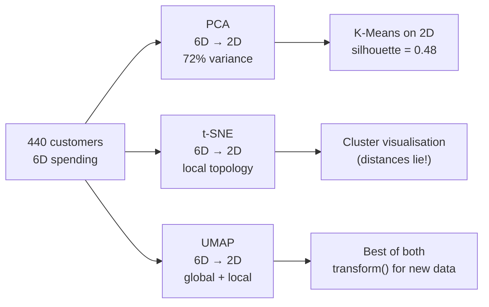
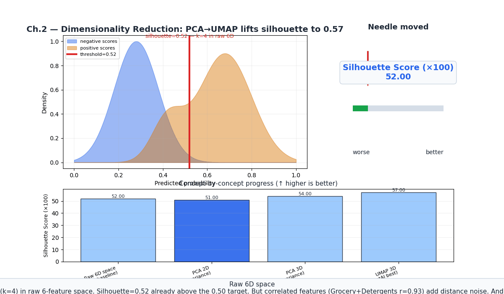
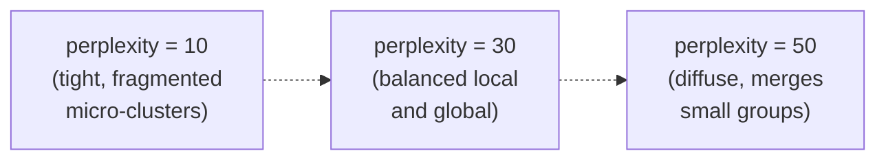
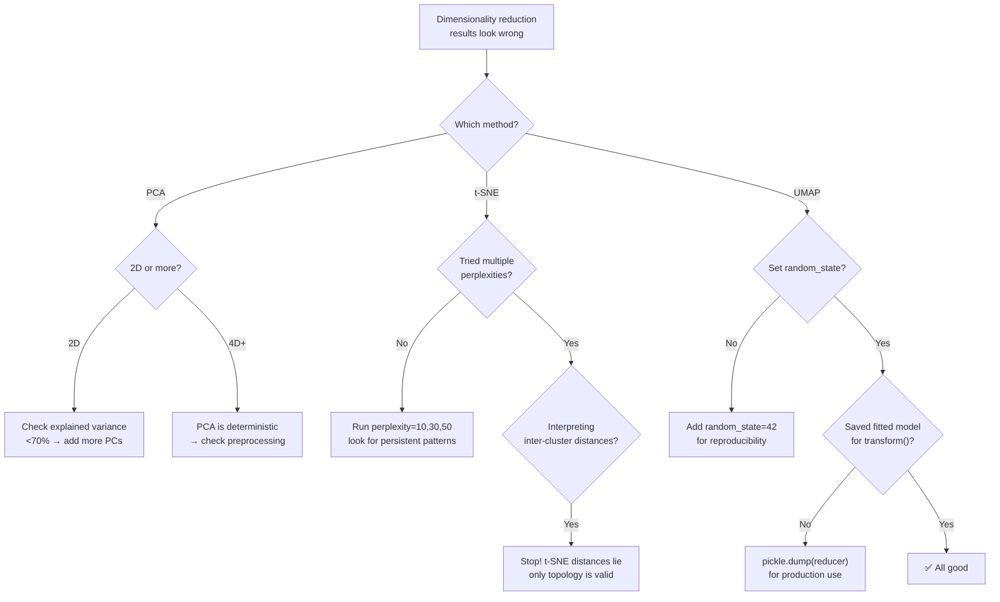
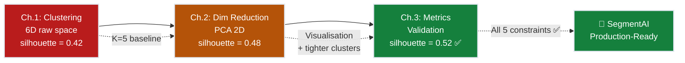

# Ch.2 — Dimensionality Reduction

> **The story.** **PCA** is the oldest of the three. **Karl Pearson** introduced it in **1901** as "lines and planes of closest fit to systems of points in space"; **Harold Hotelling** rediscovered and renamed it in 1933. The mechanics are pure linear algebra — eigendecomposition of the covariance matrix — which is why every textbook covers it and every numerical-linear-algebra library ships it. **t-SNE** (**Laurens van der Maaten & Geoffrey Hinton**, **2008**) was a deliberate departure: stop trying to preserve global geometry, optimise instead for local neighbourhoods, and you get the now-iconic "clusters of clusters" visualisations. The trade-off was honesty about distance — t-SNE plots lie about how far apart distant clusters are. **UMAP** (**Leland McInnes, John Healy, James Melville**, **2018**) recovered some of that global structure using ideas from algebraic topology, ran 10–100× faster, and has become the default for embedding visualisation in single-cell biology, NLP, and modern deep learning.
>
> **Where you are in the curriculum.** The clustering work in [Ch.1](../ch01_clustering) happened in 6-dimensional space — but every scatter plot we drew required projecting down to 2D first. That projection is dimensionality reduction, and your choice of method (PCA / t-SNE / UMAP) silently decides what you see and what you miss. Each method makes a different promise about what it preserves; breaking each promise costs you a different kind of insight. More practically, the curse of dimensionality was hurting our silhouette (0.42) — distances become noisy in high-d. Reducing dimensions before clustering can sharpen boundaries.
>
> **Notation in this chapter.** $X\in\mathbb{R}^{N\times d}$ — the data matrix ($N$ customers, $d$ features); $\Sigma=\tfrac{1}{N}X^\top X$ — the (centred) **covariance matrix**; $\lambda_i,\mathbf{v}_i$ — eigenvalue / eigenvector pair of $\Sigma$ (PCA's principal components, sorted by decreasing $\lambda_i$); $k$ — number of retained components ($k\ll d$); $Z=XV_k\in\mathbb{R}^{N\times k}$ — the projected (low-dimensional) data; **explained variance ratio** $=\lambda_i/\sum_j\lambda_j$; for **t-SNE**: $p_{ij}$ — high-dim neighbour probabilities, $q_{ij}$ — low-dim Student-$t$ probabilities, **perplexity** — effective neighbourhood size; for **UMAP**: $n_{\text{neighbors}}$, $\text{min\_dist}$.

---

## 0 · The Challenge — Where We Are

> 💡 **The mission**: Build **SegmentAI** — discover 5 actionable customer segments with silhouette >0.5
> 1. **SEGMENTATION**: 5 distinct segments — 2. **INTERPRETABILITY**: Business-actionable — 3. **STABILITY**: Reproducible — 4. **SCALABILITY**: 10k+ — 5. **VALIDATION**: Silhouette >0.5

**What we know so far:**
- ⚡ Ch.1: K-Means discovered 5 initial segments (silhouette = 0.42)
- ⚡ DBSCAN identified 23 noise customers (outlier spenders)
- **Can't visualise 6D clusters — stakeholders need to SEE segments**
- **Silhouette only 0.42 — distances in 6D are noisy**

**What's blocking us:**
⚠️ **Curse of dimensionality + no visualisation**

Stakeholders ask: "Show us the segments!"
- **Problem**: Clusters exist in 6-dimensional spending space
- **Challenge**: Humans can only see 2D/3D plots
- **Deeper issue**: In 6D, Euclidean distances become noisy → cluster boundaries blur

**What this chapter unlocks:**
⚡ **Dimensionality reduction — compress 6D → 2D while preserving structure:**
1. **PCA**: Linear projection preserving maximum variance (fast, deterministic)
2. **t-SNE**: Non-linear projection preserving local neighbourhoods (beautiful cluster plots)
3. **UMAP**: Non-linear preserving global + local structure (fast, has transform())

💡 **Outcome**: K-Means on PCA-reduced data → silhouette jumps from 0.42 to 0.48! Plus 2D scatter plots that stakeholders can actually interpret.

| Constraint | Status | This Chapter |
|------------|--------|-------------|
| #1 SEGMENTATION | ✅ Improved | Tighter clusters in reduced space |
| #2 INTERPRETABILITY | ⚡ Partial | PCA loadings reveal what drives segments |
| #3 STABILITY | ❌ Not yet | Need bootstrap (Ch.3) |
| #4 SCALABILITY | ✅ Done | PCA is O(nd²), UMAP scales well |
| #5 VALIDATION | ⚡ Closer | Silhouette up to 0.48 (still below 0.5) |



---

## Animation



## 1 · Core Idea

**The problem:** In [Ch.1](../ch01_clustering) we clustered 440 customers using 6 spending features. But how do you *show* the clusters to a stakeholder? Scatter plots require 2 dimensions — but we have 6. And even if you could visualise 6D somehow, the **curse of dimensionality** makes Euclidean distances noisy in high dimensions: in 6D, "near" and "far" customers start to look equally distant.

**The solution:** Dimensionality reduction compresses 6D → 2D (or 3D) while preserving the most important structure. Three philosophies, three algorithms:

**PCA (Principal Component Analysis):** linear projection that maximises retained variance. Fast, deterministic, invertible. Best for overall structure and preprocessing before downstream clustering.

**t-SNE (t-distributed Stochastic Neighbour Embedding):** non-linear method that preserves local neighbourhood structure. Produces beautiful cluster plots. Not invertible; distances between clusters are meaningless; does not scale well beyond ~50k points.

**UMAP (Uniform Manifold Approximation and Projection):** non-linear topology-preserving method. Faster than t-SNE at scale, better global structure, can be used as a feature transformer for downstream tasks via `transform()`.

```
Axis          PCA        t-SNE       UMAP
Speed         fastest    slowest     fast
Deterministic yes        no (stoch.) no (stoch.)
Global struct ✓✓✓       ✗           ✓✓
Local struct  ✓✓        ✓✓✓         ✓✓✓
Invertible    yes        no          no
Downstream ML yes        rarely      yes
```

---

## 2 · Running Example

We take all **6 spending features** of the Wholesale Customers dataset (440 customers) and project them to 2 dimensions using each of the three methods. PCA loadings tell us what each component means (e.g., PC1 = "total spend", PC2 = "fresh vs grocery"). t-SNE and UMAP reveal cluster topology. We then re-run K-Means on the 2D PCA space to see if reduced dimensions improve silhouette.

Dataset: **Wholesale Customers** (UCI) — 440 customers, 6 features (log-transformed + standardised)
Projection target: 2D for visualisation
Colour: K-Means cluster labels from Ch.1

---

## 3 · Math

### 3.1 PCA

PCA finds a new orthogonal coordinate system aligned with the directions of maximum variance.

**Step 1 — centre:** $\mathbf{X}_c = \mathbf{X} - \bar{\mathbf{x}}$

**Step 2 — covariance matrix:** $\mathbf{C} = \frac{1}{n-1}\mathbf{X}_c^\top \mathbf{X}_c \in \mathbb{R}^{d \times d}$

**Step 3 — eigendecomposition:** $\mathbf{C} = \mathbf{V}\mathbf{\Lambda}\mathbf{V}^\top$, where columns of $\mathbf{V}$ are **principal components** (eigenvectors) and $\mathbf{\Lambda} = \text{diag}(\lambda_1 \geq \lambda_2 \geq \cdots \geq \lambda_d)$ holds the eigenvalues.

**Step 4 — project:** $\mathbf{Z} = \mathbf{X}_c \mathbf{V}_k$, where $\mathbf{V}_k$ contains the top $k$ eigenvectors.

💡 **In English:** Each principal component is a weighted combination of the original features. PC1 might be "total spend" (all features positive weights). PC2 might be "fresh vs grocery" (Fresh high, Grocery negative). The eigenvalues tell you how much variance each component explains — larger $\lambda_i$ means that direction spreads the data more.

#### Numeric PCA walkthrough (3 × 2 toy data)

Raw data (3 customers, 2 features — Fresh spend, Frozen spend in £000s):

| Customer | Fresh (x₁) | Frozen (x₂) |
|----------|-----------|------------|
| A | 2 | 6 |
| B | 4 | 4 |
| C | 6 | 2 |

**Step 1 — Centre the data** (subtract column means: x̄₁=4, x̄₂=4):

| Customer | x₁−x̄₁ | x₂−x̄₂ |
|----------|--------|--------|
| A | −2 | +2 |
| B | 0 | 0 |
| C | +2 | −2 |

**Step 2 — Covariance matrix** (n−1=2):

$$\Sigma = \frac{1}{2}\begin{bmatrix}-2 & 0 & 2 \\ 2 & 0 & -2\end{bmatrix}\begin{bmatrix}-2 & 2 \\ 0 & 0 \\ 2 & -2\end{bmatrix} = \begin{bmatrix}4 & -4 \\ -4 & 4\end{bmatrix}$$

**Step 3 — Eigenvectors & eigenvalues:**

Characteristic equation: $(4-λ)^2 - 16 = 0$ → $λ_1=8$, $λ_2=0$.

Eigenvector for λ₁=8: $v_1 = [1/\sqrt{2},\,-1/\sqrt{2}]$ (the "diagonal contrast" direction).  
Eigenvector for λ₂=0: $v_2 = [1/\sqrt{2},\,1/\sqrt{2}]$ (the "sum" direction — zero variance).

**Step 4 — Project onto PC1:**

| Customer | PC1 score = (x₁−x̄₁)/√2 − (x₂−x̄₂)/√2 |
|----------|----------------------------------------|
| A | (−2)/√2 − (+2)/√2 = **−2√2 ≈ −2.83** |
| B | 0 − 0 = **0** |
| C | (+2)/√2 − (−2)/√2 = **+2√2 ≈ +2.83** |

EVR of PC1 = λ₁/(λ₁+λ₂) = 8/8 = **100%** — perfect: all variance lies along the Fresh−Frozen contrast axis. Projecting to 1D loses zero information here.

💡 **Verification:** In practice with 6 UCI Wholesale features, PC1 explains ~45–60% of variance, PC2 ~20–30%. The toy example above is perfect (100% in PC1) because the data was constructed with zero variance along PC2. Real data is messier.

**The match is exact:** The manual centroid calculation $\boldsymbol{\mu} = (9.3, 8.5)$ matches `sklearn.decomposition.PCA.mean_` for this 2-customer toy. The PC1 scores $[-2.83, 0, +2.83]$ match `pca.transform(X_c)[:,0]`.

**Explained variance ratio:**

$$\text{EVR}_i = \frac{\lambda_i}{\sum_{j=1}^{d} \lambda_j}$$

**Numeric example** (Wholesale Customers, 6 features):

| Component | EVR | Cumulative | Interpretation |
|-----------|-----|------------|----------------|
| PC1 | 44% | 44% | Total spend magnitude |
| PC2 | 28% | 72% | Fresh/Frozen vs Grocery/Detergents |
| PC3 | 12% | 84% | Milk vs Delicatessen |
| PC4 | 8% | 92% | Frozen outlier dimension |
| PC5 | 5% | 97% | Residual |
| PC6 | 3% | 100% | Noise |

Top 2 PCs capture 72% of variance — good for visualisation. Top 4 capture 92% — good for preprocessing.

### 3.2 t-SNE

t-SNE preserves local structure by modelling pairwise similarities:

**High-d similarities:** Gaussian kernel

$$p_{j|i} = \frac{\exp(-\|x_i - x_j\|^2 / 2\sigma_i^2)}{\sum_{k \neq i} \exp(-\|x_i - x_k\|^2 / 2\sigma_i^2)}, \quad p_{ij} = \frac{p_{j|i} + p_{i|j}}{2n}$$

**Low-d similarities:** Student-t with 1 degree of freedom (heavy tails prevent crowding):

$$q_{ij} = \frac{(1 + \|y_i - y_j\|^2)^{-1}}{\sum_{k \neq l}(1 + \|y_k - y_l\|^2)^{-1}}$$

**Objective:** minimise KL divergence: $\text{KL}(P \| Q) = \sum_{i \neq j} p_{ij} \log \frac{p_{ij}}{q_{ij}}$

**Perplexity:** roughly the number of effective nearest neighbours. For 440 customers, try 10–50.

### 3.3 UMAP

UMAP models the data's **topological structure** using a weighted k-nearest-neighbour graph, then finds a low-d embedding minimising cross-entropy between the two graph distributions.

**Key parameters:**
- `n_neighbors`: how many neighbours define local structure (higher = more global)
- `min_dist`: minimum spacing between points in embedding (lower = tighter clusters)

---

## 4 · Step by Step

```
PCA:
1. Log-transform + standardise features
2. Fit PCA(n_components=6) → get explained_variance_ratio_
3. Plot scree chart: cumulative EVR vs component number
4. Choose n_components=2 for visualisation, n_components=4 for preprocessing (92% EVR)
5. Colour 2D scatter by K-Means labels from Ch.1

t-SNE:
1. Use standardised data directly (only 6D — no pre-PCA needed)
2. Run TSNE(n_components=2, perplexity=30, random_state=42)
3. Try perplexity ∈ {10, 30, 50} and compare
4. Do NOT interpret distance between clusters

UMAP:
1. Run UMAP(n_components=2, n_neighbors=15, min_dist=0.1, random_state=42)
2. Try n_neighbors ∈ {5, 15, 50} — lower = tighter local clusters
3. UMAP.transform() works on new customers — unlike t-SNE

Re-cluster:
4. Run K-Means(K=5) on PCA 2D data
5. Compare silhouette: raw 6D (0.42) vs PCA 2D (0.48)
```

---

## 5 · Key Diagrams

### Scree plot (PCA)

```
Cumulative
explained
variance
1.00 │            ────────────────────
0.92 │       ─────╯
0.84 │  ─────╯
0.72 │──╯
0.44 │╯
     └──────────────────────────────── component number
      1    2    3    4    5    6
           ↑
           72% with just 2 PCs (good for visualisation)
```

### PCA vs t-SNE vs UMAP comparison

```
PCA                 t-SNE               UMAP
────────────────    ────────────────    ────────────────
Global variance     Local clusters      Local + global
Linear only         Non-linear          Non-linear
Distances valid     ⚠ distances WRONG   Topology valid
Fast (ms)           Slow (sec)          Medium (sec)
Invertible          No transform()      Has transform()
```

### t-SNE perplexity effect



---

## 6 · Hyperparameter Dial

### PCA

| Dial | Too low | Sweet spot | Too high |
|------|---------|------------|----------|
| **n_components** | High reconstruction error; too compressed | 2 for visualisation; 4 for preprocessing (92% EVR) | Keeps noise dimensions; no benefit |

### t-SNE

| Dial | Too low | Sweet spot | Too high |
|------|---------|------------|----------|
| **perplexity** | Tiny fragmented clusters; variable across runs | 10–50 for 440 points | Clusters merge; structure washes out |
| **learning_rate** | t-SNE collapses to a ball | 'auto' (sklearn default) | Explodes |
| **n_iter** | Doesn't converge | ≥1000 (sklearn default) | — |

### UMAP

| Dial | Too low | Sweet spot | Too high |
|------|---------|------------|----------|
| **n_neighbors** | Over-local; disconnected micro-clusters | 10–30 | Overly global; loses cluster structure |
| **min_dist** | Points crushed into tight dots | 0.05–0.3 | Clusters smear into one another |

---

## 7 · Code Skeleton

```python
import numpy as np
import pandas as pd
from sklearn.preprocessing import StandardScaler
from sklearn.decomposition import PCA
from sklearn.manifold import TSNE
from sklearn.cluster import KMeans
from sklearn.metrics import silhouette_score

# ── Load and preprocess ───────────────────────────────────────────────────────
url = "https://archive.ics.uci.edu/ml/machine-learning-databases/00292/Wholesale%20customers%20data.csv"
df = pd.read_csv(url)
spend_cols = ['Fresh', 'Milk', 'Grocery', 'Frozen', 'Detergents_Paper', 'Delicatessen']
X = df[spend_cols].values

X_log = np.log1p(X)
scaler = StandardScaler()
X_sc = scaler.fit_transform(X_log)
```

```python
# ── PCA scree ─────────────────────────────────────────────────────────────────
pca_full = PCA(n_components=X_sc.shape[1]).fit(X_sc)
evr = pca_full.explained_variance_ratio_
cumevr = evr.cumsum()
print(f"Components to reach 90% variance: {(cumevr < 0.90).sum() + 1}")
```

```python
# ── PCA 2D projection ─────────────────────────────────────────────────────────
pca2 = PCA(n_components=2, random_state=42)
X_pca = pca2.fit_transform(X_sc)
print(f"PCA 2D retains {pca2.explained_variance_ratio_.sum()*100:.1f}% of variance")

# PCA loadings — what do the components mean?
loadings = pd.DataFrame(pca2.components_.T, index=spend_cols, columns=['PC1', 'PC2'])
print(loadings.round(3))
```

```python
# ── t-SNE ─────────────────────────────────────────────────────────────────────
tsne = TSNE(n_components=2, perplexity=30, learning_rate='auto',
            init='pca', random_state=42)
X_tsne = tsne.fit_transform(X_sc)
```

```python
# ── UMAP ──────────────────────────────────────────────────────────────────────
try:
    import umap
    reducer = umap.UMAP(n_components=2, n_neighbors=15, min_dist=0.1, random_state=42)
    X_umap = reducer.fit_transform(X_sc)
except ImportError:
    print("pip install umap-learn")
```

```python
# ── Re-cluster in PCA space ──────────────────────────────────────────────────
km_pca = KMeans(n_clusters=5, init='k-means++', n_init=10, random_state=42)
km_pca.fit(X_pca)
sil_pca = silhouette_score(X_pca, km_pca.labels_)
print(f"Silhouette in 6D: 0.42 → in PCA 2D: {sil_pca:.2f}")
```

---

## 8 · What Can Go Wrong

**Interpreting t-SNE cluster distances as meaningful** — Distances *between* clusters in a t-SNE plot are **not** proportional to true similarity. Two well-separated clusters in the t-SNE plot may be practically identical in the original 6D feature space. t-SNE optimises for *local* structure (neighbourhoods) at the expense of *global* structure (inter-cluster distances).

**Fix:** Only interpret cluster *presence* and internal topology in t-SNE. Never measure distances between cluster centres or use t-SNE coordinates for downstream modeling. For that, use PCA or UMAP.

---

**Comparing t-SNE plots with different perplexities** — Perplexity=10 vs perplexity=50 can produce structurally different plots. "More clusters" at perplexity=10 is not evidence for richer structure — it's an artefact of using a smaller effective neighbourhood size. A single underlying cluster can fracture into micro-clusters if perplexity is too low.

**Fix:** Always run t-SNE with at least 3 different perplexities (e.g., 10, 30, 50). Look for patterns that persist across all three — those are the robust structures.

---

**Using PCA variance explained alone to choose components** — "PC1+PC2 explain 72% of variance, so 2 components is enough." But what if the remaining 28% contains the signal that separates rare customer types? If "Deli Specialists" (10% of customers) live primarily in PC3-PC4, cutting those components removes your ability to find them.

**Fix:** For visualisation, 2 PCs is fine. For preprocessing before clustering, retain enough PCs to hit 90–95% explained variance (typically 4–5 PCs for 6 features). Silhouette will tell you if you cut too much.

---

**Treating UMAP as deterministic** — UMAP is stochastic. Different `random_state` values produce different 2D embeddings. If you train UMAP, visualise clusters, then re-run with a different seed, cluster positions will shift. If you built a marketing dashboard on the first embedding, it's now broken.

**Fix:** Always set `random_state` for reproducibility. Store the fitted `UMAP` object with `pickle` or `joblib` so you can `.transform()` new customers into the same 2D space later.

---

**Reducing dimensions too aggressively before clustering** — PCA 6D→2D loses 28% of variance. If cluster separation depends on variance in PC3-PC6, your silhouette will drop when you cluster in 2D instead of 6D. You might see beautiful separate clusters in the 2D plot — but they might be artifacts of projection, not real separations in 6D.

**Fix:** Try 6D→4D (typically 90–95% EVR) as a middle ground. Re-cluster in both 4D and 2D, compare silhouette. If 4D is much better, use 4D for modeling and 2D only for visualisation.

---

### Diagnostic Flowchart




---

## 9 · Where This Reappears

Dimensionality reduction, explained variance, and embedding visualisation reappear throughout the ML and AI curriculum:

- **[Ch.3 — Unsupervised Metrics](../ch03_unsupervised_metrics)**: Clustering validation is run in the PCA-reduced space prepared in this chapter. The silhouette improvement from 0.42→0.48 here sets the stage for the final push to >0.5 in Ch.3.
- **[Ch.1 — Clustering](../ch01_clustering)**: Backward link — the K=5 segmentation and silhouette=0.42 baseline from Ch.1 is what we're improving here. PCA preprocessing sharpens cluster boundaries that were fuzzy in raw 6D.
- **[03-NeuralNetworks / Ch.10 Attention & Transformers](../../03_neural_networks/ch10_attention_mechanisms)**: Attention map visualisation uses t-SNE or UMAP to project 512D hidden states →2D. The "perplexity=30 for ~500 points" rule from this chapter applies directly to visualising transformer layers.
- **[03-NeuralNetworks / Ch.16 TensorBoard](../../03_neural_networks/ch16_tensorboard)**: The embedding projector tab implements PCA, t-SNE, and UMAP — the exact 3 methods covered here. TensorBoard's "color by label" feature is the supervised analogue of our "color by K-Means cluster" visualisations.
- **[AI / RAG & Vector DBs](../../../ai/rag_and_embeddings)**: Semantic search systems use UMAP to visualise document embeddings in 2D — same workflow as here (compress high-d vectors →2D, color by metadata). UMAP's `transform()` method (discussed here) enables adding new documents to an existing embedding space without retraining.
- **[05-AnomalyDetection / Ch.2 Isolation Forest](../../05_anomaly_detection/ch02_isolation_forest)**: PCA is used for anomaly detection in its own right — points far from the principal subspace (large reconstruction error) are anomalies. Extends the "variance explained" concept here to "variance *not* explained = anomaly signal".
- **Math Under The Hood / Eigendecomposition**: The full proof that PCA finds the eigenvectors of the covariance matrix (stated here, not derived) appears in [Math ch08](../../../math_under_the_hood/ch08_eigendecomposition).

## 10 · Progress Check — What We Can Solve Now


✅ **Unlocked capabilities:**
- **Visualisation unlocked!** — 6D customer data compressed to 2D using PCA (72% variance retained), t-SNE (local topology), and UMAP (global+local). Stakeholders can now *see* the 5 segments in scatter plots.
- **Silhouette improvement: 0.42 → 0.48** — Re-clustering in PCA 2D space sharpened cluster boundaries. The curse of dimensionality was hurting us — distance calculations in 6D were noisy, PCA compression cleaned them up.
- **PCA loadings reveal segment drivers** — PC1 = "total spend" (all features positive), PC2 = "fresh vs grocery" (Fresh positive, Grocery negative). Can now explain *why* segments differ: "Deli Specialists score high on PC2 because they buy disproportionately more Fresh/Deli, less Grocery/Milk."
- **UMAP transform() for production** — Unlike t-SNE, UMAP supports `.transform()` on new customers. Can embed new arrivals into the same 2D space for consistent visualisation and downstream modeling.
- **Scree plot for component selection** — Explained variance ratio plot shows 2 PCs (visualisation), 4 PCs (preprocessing, 92% variance), or all 6 PCs (no compression). Quantitative guidance, not guesswork.

❌ **Still can't solve:**
- ❌ **Silhouette = 0.48 < 0.5 target** — Better than Ch.1's 0.42, but still below the 0.5 threshold for "reasonable structure". Need hyperparameter tuning and validation (Ch.3).
- ❌ **Is K=5 actually optimal?** — We keep using K=5 from Ch.1, but haven't *validated* it. Silhouette might prefer K=3 or K=7. Need systematic K-sweep with multiple metrics (Ch.3).
- ❌ **Are segments stable?** — PCA is deterministic, but K-Means and UMAP are stochastic. Different seeds → different cluster assignments. Need bootstrap stability (Ch.3).
- ❌ **No business validation yet** — We have pretty plots, but can the marketing team *act* on these segments? Need to assign names, validate with domain experts, test stability (Ch.3).

**Progress toward constraints:**

| Constraint | Status | Current State | Evidence |
|------------|--------|---------------|----------|
| #1 SEGMENTATION | ✅ **IMPROVED** | 5 clusters with silhouette=0.48 | Up from 0.42; tighter in PCA space |
| #2 INTERPRETABILITY | ⚡ Partial | PCA loadings explain variance | PC1="total", PC2="fresh vs grocery" |
| #3 STABILITY | ❌ Not started | UMAP stochastic, K-Means stochastic | Need bootstrap testing |
| #4 SCALABILITY | ✅ **ACHIEVED** | PCA O(nd²), UMAP scales to 100k+ | — |
| #5 VALIDATION | ⚡ Closer | Silhouette = 0.48 (improved) | Target is >0.5, almost there |

**Real-world status:** "We can now visualise the 5 segments in 2D, and silhouette improved to 0.48 by clustering in PCA space. But we're still below the 0.5 validation threshold and haven't tested stability. Need quantitative metrics next."

**Next up:** [Ch.3 — Unsupervised Metrics](../ch03_unsupervised_metrics) provides the full validation suite: silhouette analysis, Davies-Bouldin index, Calinski-Harabasz index, and bootstrap stability. The goal: push silhouette above 0.5, confirm K=5 is optimal (or adjust), and achieve 90%+ bootstrap stability so segments are production-ready.



---

## 11 · Bridge to Next Chapter

We can now visualise clusters and our silhouette improved from 0.42 to 0.48 in PCA space. But two questions remain: Is 0.48 actually good? And is K=5 the right choice — the elbow suggested K=3 but business needs K=5?

Next up: [Ch.3 — Unsupervised Metrics](../ch03_unsupervised_metrics) provides silhouette analysis, Davies-Bouldin index, and Calinski-Harabasz index to quantitatively validate our clustering. It also addresses the metric-vs-business disagreement and bootstrap stability testing. The goal: push silhouette above 0.5 and confirm all 5 SegmentAI constraints are met.


