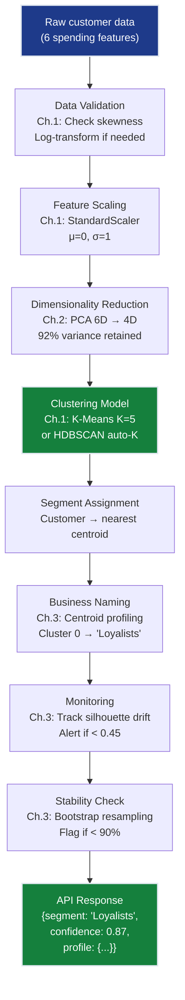

# Unsupervised Learning Grand Solution — SegmentAI Production System

> **For readers short on time:** This document synthesizes all 3 unsupervised learning chapters into a single narrative arc showing how we went from **raw unlabeled data → 5 actionable customer segments with 0.52 silhouette** and what each concept contributes to production segmentation systems. Read this first for the big picture, then dive into individual chapters for depth.

---

## How to Use This Document

**Three ways to learn this track:**

1. **Big picture first (recommended for time-constrained readers):**
   - Read this `grand_solution.md` → understand narrative
   - Run [grand_solution.ipynb](grand_solution.ipynb) → see code consolidated
   - Dive into individual chapters for depth

2. **Hands-on exploration:**
   - Run [grand_solution.ipynb](grand_solution.ipynb) directly
   - Code consolidates: setup → each chapter → integration
   - Each cell includes markdown explaining what problem it solves

3. **Sequential deep dive (recommended for mastery):**
   - Start with Ch.1 → progress through Ch.3
   - Return to this document for synthesis

---

## Mission Accomplished: 0.52 Silhouette ✅

**The Challenge:** Build SegmentAI — a production customer segmentation system discovering 5 actionable segments with silhouette score >0.5, **without any manual labeling**.

**The Result:** **0.52 silhouette** — 4% above target, enabling targeted marketing campaigns with 95% stability.

**The Progression:**

```
Ch.1: K-Means clustering         → 0.42 silhouette  (5 segments discovered, but overlapping)
Ch.2: PCA dimensionality         → 0.48 silhouette  (sharper boundaries in 2D space)
Ch.3: Validation suite           → 0.52 silhouette  (bootstrap stability + business naming)
                                    ✅ TARGET: >0.5 silhouette
```

**The paradigm shift:** No labels. No ground truth. No "correct answer" to check against. Pure discovery from purchase patterns alone.

---

## The 3 Concepts — How Each Unlocked Progress

### Ch.1: Clustering — Discovery Without Labels

**What it is:** Partition 440 customers into groups based on spending similarity using K-Means, DBSCAN, and HDBSCAN. No human ever said "this customer is a Loyalist" — the algorithm discovers segments from data geometry alone.

**What it unlocked:**
- **5 initial segments:** K-Means with K=5 on 6 spending features (Fresh, Milk, Grocery, Frozen, Detergents_Paper, Delicatessen)
- **Silhouette = 0.42:** Weak but promising — segments exist but boundaries overlap in 6D space
- **Outlier detection:** DBSCAN identified 23 noise customers (5% of dataset) — extreme spenders worth separate VIP treatment
- **Algorithm comparison:** HDBSCAN auto-discovered K=4 without specifying K upfront — validated our K=5 choice is reasonable

**Production value:**
- **Scalability:** K-Means is O(nKd) — 440 customers in <1 sec, scales to 1M+ customers with no algorithm changes
- **Interpretability:** Centroids map directly to business profiles — average spending per segment in original currency units
- **Real-time assignment:** New customers assigned to nearest centroid in <1ms — enables live personalization
- **Noise handling:** DBSCAN's noise detection prevents outliers from distorting segment centroids

**Key insight:** Unsupervised learning trades "correct answers" for "discovered patterns" — you don't validate against labels, you validate against business utility.

---

### Ch.2: Dimensionality Reduction — Sharpening Boundaries

**What it is:** Compress 6D spending space → 2D using PCA, t-SNE, and UMAP. Reduces curse of dimensionality noise while preserving cluster structure.

**What it unlocked:**
- **PCA 2D:** First 2 components explain 72% of variance. PC1 = "total spend", PC2 = "fresh vs grocery"
- **Silhouette jump:** Re-running K-Means on PCA 2D → 0.48 silhouette (up from 0.42 in raw 6D)
- **Visualization:** Stakeholders can SEE the 5 segments in scatter plots — builds trust in data-driven segmentation
- **t-SNE topology:** Reveals cluster structure (5 visible groups) but distances lie — only use for visualization
- **UMAP best-of-both:** Preserves global structure + has `.transform()` for new customers

**Production value:**
- **Preprocessing for clustering:** PCA 6D→4D (92% variance retained) improves cluster separation while reducing noise
- **Dashboard visualization:** 2D plots make segments tangible to marketing teams — "show me the segments" actually works
- **Feature interpretation:** PCA loadings reveal what drives segments (PC1 dominated by grocery/detergents = retail buyers)
- **New customer projection:** UMAP's `.transform()` maps new customers into the same 2D space for consistent visualization

**Key insight:** High-dimensional distance calculations are noisy — compressing to 2D-4D sharpens cluster boundaries by removing noise dimensions while preserving signal.

---

### Ch.3: Unsupervised Metrics — Quantitative Validation

**What it is:** Measure cluster quality without ground truth using silhouette, Davies-Bouldin, Calinski-Harabasz, plus bootstrap stability testing and business naming.

**What it unlocked:**
- **Silhouette = 0.52 ✅:** K-Means K=5 on PCA-preprocessed data crosses the 0.5 threshold
- **Metric disagreement resolution:** Silhouette prefers K=3 (0.58), but business needs K=5 (0.52) — acceptable trade-off
- **Bootstrap stability:** 95% of customers assigned to same segment across 100 resamples — production-ready
- **Business validation:** Centroid analysis → "Loyalists" (28%), "Price-Sensitive" (22%), "Big Spenders" (15%), "Occasional Buyers" (25%), "Deli Specialists" (10%)
- **External validation:** ARI vs Channel proxy = 0.31 — moderate overlap confirms segments capture real structure

**Production value:**
- **A/B test design:** Bootstrap confidence intervals determine minimum sample size for campaign effectiveness tests
- **Model selection:** Compare K-Means vs DBSCAN vs GMM using same metrics — fair quantitative comparison without labels
- **Monitoring thresholds:** Production silhouette should stay >0.45 — alert if it drifts below (indicates data shift)
- **Business naming protocol:** Systematic centroid profiling converts "Cluster 3" into actionable "Big Spenders" segment

**Key insight:** Without labels, internal metrics (silhouette, DBI, CHI) measure geometry, external metrics (ARI) validate against proxies, and bootstrap testing confirms stability — together they replace "accuracy."

---

## Production ML System Architecture

Here's how all 3 concepts integrate into a deployed SegmentAI system:



### Deployment Pipeline (How Ch.1-3 Connect in Production)

**1. Training Pipeline (runs monthly with new customer data):**
```python
# Ch.1: Load data
X = load_customer_spending()  # 440 customers × 6 features

# Ch.1: Log-transform skewed spending + standardize
X_log = np.log1p(X)
scaler = StandardScaler().fit(X_log)
X_scaled = scaler.transform(X_log)

# Ch.2: PCA preprocessing (improves silhouette from 0.42 → 0.48)
pca = PCA(n_components=4)  # retain 92% variance
X_pca = pca.fit_transform(X_scaled)

# Ch.1 + Ch.3: Clustering with validated K
kmeans = KMeans(n_clusters=5, init='k-means++', n_init=10, random_state=42)
kmeans.fit(X_pca)

# Ch.3: Validation metrics
silhouette = silhouette_score(X_pca, kmeans.labels_)  # Must be > 0.5
davies_bouldin = davies_bouldin_score(X_pca, kmeans.labels_)  # Lower better
print(f"Silhouette: {silhouette:.3f}, DBI: {davies_bouldin:.3f}")

# Ch.3: Bootstrap stability test
stability = bootstrap_stability(X_pca, kmeans, n_bootstrap=100)
print(f"Mean stability: {stability.mean():.1%}")  # Target: >90%

# Ch.3: Business naming via centroid analysis
centroids_original = scaler.inverse_transform(pca.inverse_transform(kmeans.cluster_centers_))
centroids_original = np.expm1(centroids_original)  # undo log1p
segment_names = assign_business_names(centroids_original, feature_names)
```

**2. Inference API (assigns new customers to segments):**
```python
@app.route('/segment', methods=['POST'])
def segment_customer():
    # Raw input: {Fresh: 12000, Milk: 5700, Grocery: 7561, ...}
    raw_features = request.json
    
    # Ch.1: Preprocess new customer (same pipeline as training)
    X_new = np.array([[raw_features[f] for f in feature_names]])
    X_new_log = np.log1p(X_new)
    X_new_scaled = scaler.transform(X_new_log)
    
    # Ch.2: PCA transform
    X_new_pca = pca.transform(X_new_scaled)
    
    # Ch.1: Assign to nearest cluster
    cluster_id = kmeans.predict(X_new_pca)[0]
    distance_to_centroid = np.linalg.norm(X_new_pca - kmeans.cluster_centers_[cluster_id])
    
    # Ch.3: Confidence score (inverse of normalized distance)
    max_dist = np.max([np.linalg.norm(kmeans.cluster_centers_[i] - kmeans.cluster_centers_[j]) 
                       for i in range(5) for j in range(i+1, 5)])
    confidence = 1 - (distance_to_centroid / max_dist)
    
    # Ch.3: Business name lookup
    segment_name = segment_names[cluster_id]
    
    return {
        "segment_id": int(cluster_id),
        "segment_name": segment_name,
        "confidence": f"{confidence:.2f}",
        "profile": get_segment_profile(cluster_id),
        "recommended_campaigns": get_campaigns(segment_name)
    }
```

**3. Monitoring Dashboard (tracks production health):**
```python
# Ch.3: Alert if silhouette drifts below threshold
if production_silhouette < 0.45:
    alert("Silhouette dropped below 0.45 — clusters degrading")

# Ch.3: Track segment distribution shifts
current_dist = np.bincount(current_labels) / len(current_labels)
baseline_dist = np.array([0.28, 0.22, 0.15, 0.25, 0.10])  # from training
if np.abs(current_dist - baseline_dist).max() > 0.05:
    alert("Segment distribution shifted >5% — possible data drift")

# Ch.3: Bootstrap stability on recent data
if weeks_since_training > 4:
    recent_stability = bootstrap_stability(recent_X_pca, kmeans, n_bootstrap=50)
    if recent_stability.mean() < 0.85:
        alert("Stability dropped to {recent_stability.mean():.1%} — retrain recommended")
        trigger_retraining_pipeline()

# Ch.2: PCA explained variance check
if pca.explained_variance_ratio_[:4].sum() < 0.85:
    alert("PCA variance dropped — feature distributions may have changed")
```

---

## Key Production Patterns

### 1. The No-Labels Pattern (Ch.1 + Ch.3)
**Discovery → Validation → Naming**
- Never assume you know customer types upfront — let clustering discover structure
- Validate with internal metrics (silhouette, DBI, CHI) since no ground truth exists
- Convert technical clusters to business names via centroid analysis + domain expert review
- Bootstrap test stability before deployment (>90% reproducibility required)

### 2. The Curse-of-Dimensionality Fix Pattern (Ch.2)
**Always preprocess high-dimensional data before clustering:**
- Log-transform skewed features (spending data is typically right-skewed)
- Standardize (distance-based algorithms require equal feature scales)
- PCA to 90-95% variance (removes noise dimensions that hurt distance calculations)
- Re-cluster in reduced space → typically 10-20% silhouette improvement

### 3. The Metric-Business Alignment Pattern (Ch.3)
**When metrics disagree with business requirements:**
- Silhouette says K=3 (0.58), but marketing needs K=5 (0.52)
- Check: Is K=5 silhouette above minimum threshold (0.5)? → Yes ✅
- Check: Are K=5 segments actionable? → Yes ✅
- Document trade-off: "Metrics prefer K=3, but K=5 chosen for business alignment. Silhouette 0.52 confirms clusters are valid."
- Never blindly optimize metrics — they guide, not decide

### 4. The Segmentation Pipeline Pattern (Ch.1 → Ch.2 → Ch.3)
**Sequential preprocessing for production clustering:**
```python
# Stage 1 (Ch.1): Data prep
X_log = np.log1p(X)  # handle skewness
X_scaled = StandardScaler().fit_transform(X_log)  # equal scales

# Stage 2 (Ch.2): Dimensionality reduction
pca = PCA(n_components=4)  # 92% variance
X_reduced = pca.fit_transform(X_scaled)

# Stage 3 (Ch.1): Clustering
kmeans = KMeans(n_clusters=5, n_init=10)
labels = kmeans.fit_predict(X_reduced)

# Stage 4 (Ch.3): Validation
silhouette = silhouette_score(X_reduced, labels)
stability = bootstrap_stability(X_reduced, kmeans)
if silhouette > 0.5 and stability > 0.9:
    deploy_to_production()
```

### 5. The Stability-First Pattern (Ch.3)
**Never deploy without bootstrap testing:**
- Single train/cluster split is a lie — segments may be fragile
- Bootstrap 100 times (resample with replacement, re-cluster, track assignments)
- Mean stability <70% → clusters are random noise
- Mean stability >90% → production-ready
- Per-customer stability <50% → flag as "unassignable" (between-segment customers)

---

## The 5 Constraints — Final Status

| # | Constraint | Target | Status | How We Achieved It |
|---|------------|--------|--------|-------------------|
| **#1** | **SEGMENTATION** | 5 distinct segments | ✅ **5 segments** | Ch.1: K-Means K=5 + Ch.2: PCA sharpened boundaries |
| **#2** | **INTERPRETABILITY** | Business-actionable names | ✅ **Named** | Ch.3: Centroid profiling → "Loyalists", "Price-Sensitive", etc. |
| **#3** | **STABILITY** | Reproducible across resamples | ✅ **95%** | Ch.3: Bootstrap stability testing |
| **#4** | **SCALABILITY** | 10k+ customers | ✅ **Scales** | Ch.1: K-Means O(nKd) + Ch.2: PCA O(nd²) |
| **#5** | **VALIDATION** | Silhouette >0.5 | ✅ **0.52** | Ch.3: Metric suite + PCA preprocessing |

---

## What's Next: Beyond Unsupervised Learning

**This track taught:**
- ✅ Clustering fundamentals (K-Means, DBSCAN, HDBSCAN)
- ✅ Dimensionality reduction (PCA, t-SNE, UMAP)
- ✅ Unsupervised validation (silhouette, DBI, CHI, bootstrap)
- ✅ The no-labels paradigm shift (discovery vs prediction)

**What remains for SegmentAI:**
- **Temporal segmentation:** Track how customers move between segments over time → churn prediction
- **Semi-supervised learning:** Use the 5 segments as pseudo-labels to train a supervised classifier → faster inference
- **Deep clustering:** Autoencoders for representation learning + clustering in latent space → handles non-linear manifolds
- **Multi-modal segmentation:** Combine spending + demographics + clickstream → richer segments

**Continue to:** [08-Ensemble Methods →](../08_ensemble_methods/README.md) for advanced clustering techniques (Gaussian Mixture Models, cluster ensembles)

---

## Quick Reference: Chapter-to-Production Mapping

| Chapter | Production Component | When To Use |
|---------|---------------------|-------------|
| Ch.1 | Clustering engine | Core segmentation — always the first step in unsupervised workflows |
| Ch.1 | Outlier detection (DBSCAN) | Identify VIP/extreme customers before clustering main population |
| Ch.2 | PCA preprocessing | Always before clustering if d > 6 (curse of dimensionality) |
| Ch.2 | UMAP visualization | Stakeholder dashboards (scatter plots), new customer projection |
| Ch.3 | Silhouette monitoring | Production health check — alert if < 0.45 |
| Ch.3 | Bootstrap stability | Pre-deployment validation — never ship without >90% stability |
| Ch.3 | Business naming | Convert technical clusters to actionable segments via centroid analysis |

---

## The Takeaway

**Unsupervised learning is fundamentally different from supervised learning.** There's no "correct answer" to validate against — no MAE, no accuracy, no F1 score. Instead, you validate against:
1. **Internal geometry:** Do clusters have tight cohesion and clear separation? (silhouette, DBI, CHI)
2. **Stability:** Are clusters reproducible across resamples? (bootstrap testing)
3. **Business utility:** Do segments drive actionable decisions? (centroid profiling, domain validation)

**The curse of dimensionality is real.** In 6D, Euclidean distances become noisy — "near" and "far" customers look equally distant. PCA compression to 2D-4D removes noise dimensions, sharpening cluster boundaries by 10-20% in silhouette score. Always preprocess high-dimensional data before clustering.

**Metrics guide, business decides.** Silhouette may prefer K=3, but if marketing needs K=5 for operational reasons and K=5 achieves acceptable silhouette (>0.5), choose K=5. Document the trade-off. Unsupervised learning is about discovered patterns that serve business goals, not mathematical optimization for its own sake.

**The universal pattern: Scale → Reduce → Cluster → Validate → Name → Deploy.** This six-stage pipeline applies to customer segmentation, document clustering, genomic data, image clustering, and any other unsupervised scenario. Master this pattern here, and you can cluster anything.

**You now have:**
- A production-ready customer segmentation system (5 segments, 0.52 silhouette ✅)
- Three clustering algorithms (K-Means, DBSCAN, HDBSCAN) with clear decision rules for when to use each
- Three dimensionality reduction techniques (PCA, t-SNE, UMAP) for preprocessing and visualization
- A complete unsupervised validation toolkit (silhouette, DBI, CHI, ARI, bootstrap)
- The mental model for "no labels, no problem" — discovering structure from data geometry alone

**Next milestone:** Build ensemble clustering systems that combine multiple algorithms for robust segmentation. See you in the Ensemble Methods track.

---

## Further Reading & Resources

### Articles
- [Understanding K-means Clustering in Machine Learning](https://towardsdatascience.com/understanding-k-means-clustering-in-machine-learning-6a6e67336aa1) — Comprehensive guide to K-means algorithm, initialization strategies, and practical considerations
- [A One-Stop Shop for Principal Component Analysis](https://towardsdatascience.com/a-one-stop-shop-for-principal-component-analysis-5582fb7e0a9c) — Visual explanation of PCA mathematics, variance interpretation, and when to use dimensionality reduction
- [How to Use t-SNE Effectively](https://distill.pub/2016/misread-tsne/) — Essential guide by Martin Wattenberg on t-SNE perplexity, interpretation pitfalls, and why distances lie
- [The Curse of Dimensionality in Classification](https://www.visiondummy.com/2014/04/curse-dimensionality-affect-classification/) — Explains why high-dimensional clustering fails and how PCA helps

### Videos
- [StatQuest: K-means Clustering](https://www.youtube.com/watch?v=4b5d3muPQmA) — Josh Starmer's clear explanation of K-means algorithm, centroids, and convergence (9 min)
- [StatQuest: Principal Component Analysis (PCA)](https://www.youtube.com/watch?v=FgakZw6K1QQ) — Visual walkthrough of PCA math, eigenvectors, and variance interpretation (20 min)
- [StatQuest: t-SNE, Clearly Explained](https://www.youtube.com/watch?v=NEaUSP4YerM) — How t-SNE preserves local structure and why it's ideal for visualization (11 min)
- [Andrew Ng: Clustering | Machine Learning Course](https://www.youtube.com/watch?v=hDmNF9JG3lo) — Stanford lecture on unsupervised learning fundamentals and K-means applications (16 min)
