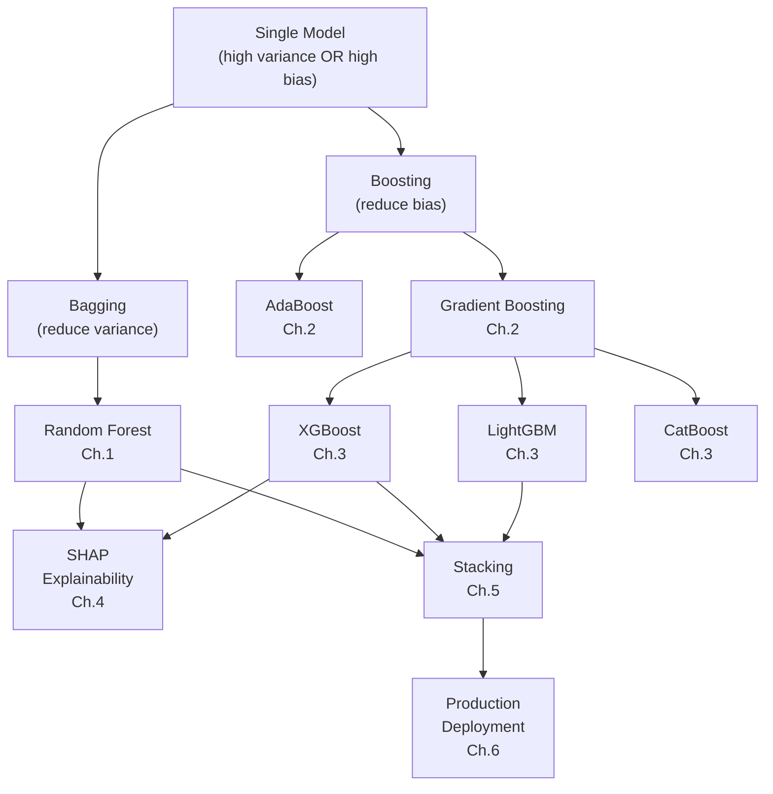

# Ensemble Methods Track

> **The Mission**: Build **EnsembleAI** — beat every single model by 5%+ accuracy/MAE by combining learners intelligently. Prove that the whole is greater than the sum of its parts.

Ensemble methods are the most consistent winners in production ML. Every Kaggle competition, every industry benchmark, every credit-scoring system — ensembles dominate. This track teaches you *why* and *how*.

---

## The Grand Challenge: 5 EnsembleAI Constraints

| # | Constraint | Target | Why It Matters |
|---|------------|--------|----------------|
| **#1** | **IMPROVEMENT** | >5% better than best single model (MAE or accuracy) | If the ensemble doesn't meaningfully beat the best member, the added complexity isn't justified |
| **#2** | **DIVERSITY** | Ensemble members must be sufficiently different | Correlated models average to the same answer — diversity is the engine of ensemble power |
| **#3** | **EFFICIENCY** | Ensemble latency < 5× single model | Production systems have SLA budgets. 1000 trees can't take 10 seconds per prediction |
| **#4** | **INTERPRETABILITY** | SHAP explains ensemble decisions | Black-box ensembles are unacceptable for regulated industries — must explain every prediction |
| **#5** | **ROBUSTNESS** | Ensemble more stable than any single model | Ensembles should reduce variance across seeds, folds, and data perturbations |

---

## Datasets

| Dataset | Task | Source | Usage |
|---------|------|--------|-------|
| **California Housing** | Regression | `sklearn.datasets.fetch_california_housing` | Predict median house value ($100k units) |
| **California Housing (binarized)** | Classification | `sklearn.datasets.fetch_california_housing` | Classify districts as high-value (above median) or low-value |

> ⚡ **Cross-cutting design**: Every chapter applies ensemble methods to **California Housing** (regression) and **California Housing binarized** (classification). Using one dataset for both tasks keeps the focus on the ensemble algorithms, not dataset context-switching.

---

## Progressive Capability Unlock

| Ch | Title | What Unlocks | Key Metric | Constraints | Status |
|----|-------|--------------|------------|-------------|--------|
| **1** | [Bagging & Random Forest](ch01_ensembles) | Variance reduction via bootstrap aggregation | RF RMSE < DT RMSE | #1 #2 #5 | ✅ |
| **2** | [Boosting: AdaBoost & Gradient Boosting](ch02_boosting) | Bias reduction via sequential error correction | GB beats RF on MAE | #1 #2 | 📋 |
| **3** | [XGBoost, LightGBM, CatBoost](ch03_xgboost_lightgbm) | Production-grade gradient boosting frameworks | XGB < $35k MAE | #1 #3 | 📋 |
| **4** | [SHAP Interpretability](ch04_shap) | Explain any ensemble's predictions | Per-prediction explanations | #4 | 📋 |
| **5** | [Stacking & Blending](ch05_stacking) | Meta-learner combines diverse base models | Stack beats best single | #1 #2 | 📋 |
| **6** | [Production Ensembles](ch06_production) | Deploy, version, prune, and monitor | Latency < 5× single | #3 #5 | 📋 |

---

## Narrative Arc: From Single Trees to Production Ensembles

### 🎬 Act 1: Foundations — Bagging & Boosting (Ch.1–2)
**Two strategies to combine weak learners**

- **Ch.1 — Bagging**: Train 200 independent trees on bootstrap samples, average their predictions. Variance drops as $\frac{1}{N}$ (if trees are decorrelated). Random Forest adds feature randomization to decorrelate.
  - *"One tree memorizes noise. Two hundred trees cancel each other's mistakes." — Leo Breiman*

- **Ch.2 — Boosting**: Train trees *sequentially*, each one correcting the previous ensemble's errors. AdaBoost reweights samples; Gradient Boosting fits residuals. Bias drops with each round.
  - *"Boosting focuses on what the ensemble still gets wrong — it's gradient descent in function space."*

**Status**: ✅✅❌❌❌ (Improvement + Diversity demonstrated)

---

### ⚡ Act 2: Production-Grade Frameworks (Ch.3–4)
**Industrial-strength boosting + explainability**

- **Ch.3 — XGBoost/LightGBM/CatBoost**: Regularized boosting, histogram-based splits, GPU acceleration. The models that win every tabular competition.
  - *"XGBoost is the AK-47 of machine learning — reliable, effective, everywhere."*

- **Ch.4 — SHAP**: Shapley values from game theory. Explain *any* model's prediction: "MedInc pushed this prediction +$35k." Both local (per-prediction) and global (feature importance).
  - *"If you can't explain it to the compliance team, you can't deploy it."*
  - > 💡 **Cross-track note**: TreeSHAP also retroactively satisfies **SmartVal Constraint #4** (Interpretability: predictions must be explainable to non-technical stakeholders) — the first point in the curriculum where you can show a compliance-ready explanation to a lending regulator.

**Status**: ✅✅✅✅❌ (Efficiency + Interpretability achieved!)

---

### 🚀 Act 3: Advanced Combinations & Deployment (Ch.5–6)
**Stacking, blending, and the production reality**

- **Ch.5 — Stacking & Blending**: Train a meta-learner on out-of-fold predictions from diverse base models. When stacking helps (diverse base learners) vs when it doesn't (diminishing returns).

- **Ch.6 — Production Ensembles**: Latency budgets, model pruning, A/B testing, when ensembles beat neural networks (spoiler: tabular data), and when they don't.
  - *"The best model is the one you can actually deploy."*

**Status**: ✅✅✅✅✅ (All constraints achieved!)

---

## Key Concepts Map

---

## When Ensembles Beat Neural Networks

| Scenario | Winner | Why |
|----------|--------|-----|
| Tabular data, <100k rows | **Ensembles** | Trees handle heterogeneous features natively |
| Tabular data, >1M rows | Tie / Ensembles | LightGBM scales; deep learning needs careful tuning |
| Images, text, audio | **Neural Networks** | Spatial/sequential structure requires learned representations |
| Need interpretability | **Ensembles + SHAP** | SHAP on trees is exact and fast (TreeSHAP is polynomial) |
| Small dataset (<1k rows) | **Ensembles** | Less prone to overfitting with proper regularization |
| Real-time inference (<10ms) | **Ensembles** | Single XGBoost prediction is microseconds |

---

---

## Cross-Track Synthesis

Ensemble Methods is the **capstone track** — every prior grand challenge is improved by applying what you learn here:

| Prior Track | Grand Challenge | How EnsembleAI Helps |
|---|---|---|
| 01-Regression | SmartVal AI | Random Forest + XGBoost push MAE below $35k; SHAP retroactively satisfies SmartVal Constraint #4 (Interpretability) |
| 02-Classification | FaceAI | Stacking diverse classifiers on facial attribute tasks improves accuracy on rare tail attributes (Bald, Mustache) |
| 05-AnomalyDetection | FraudShield | Ensemble detectors (Isolation Forest + autoencoder + OC-SVM) raise recall above any single model's ceiling |
| 04-RecommenderSystems | FlixAI | Stacked meta-learners blend collaborative filtering and content-based signals for better hybrid recommendations |
| 07-UnsupervisedLearning | SegmentAI | Ensemble features and cluster-downstream classification improve segment stability and downstream model quality |

---

## Prerequisites

- [**01-Regression**](../01_regression/README.md) Ch.1–6 (linear models, evaluation, tuning)
- [**02-Classification**](../02_classification/README.md) Ch.1–3 (logistic regression, decision trees, metrics)
- Basic familiarity with bias-variance tradeoff
