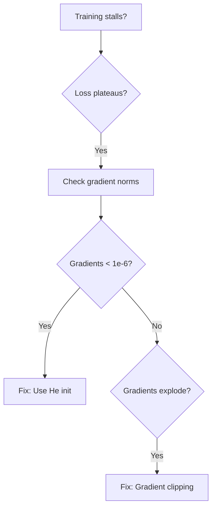

# Advanced Deep Learning Track — Authoring Guide

> **This document defines the chapter-by-chapter conventions for Track 7 (Advanced Deep Learning).**  
> Each chapter lives under `notes/02-advanced_deep_learning/` in its own folder, containing a README and a Jupyter notebook.  
> Read this before authoring or reviewing any chapter to keep tone, structure, and the running example consistent.
>
> **📚 Adapted from:** `notes/01-ml/authoring-guide.md` — inherits all ML track conventions unless explicitly overridden below.

<!-- LLM-STYLE-FINGERPRINT-V1
canonical_chapters: ["notes/02-advanced_deep_learning/ch01_residual_networks/README.md", "notes/02-advanced_deep_learning/ch02_efficient_architectures/README.md"]
voice: second_person_practitioner
register: technical_but_conversational
running_example: ProductionCV_retail_shelf_monitoring
dataset: synthetic_retail_shelf_20_classes
grand_challenge: ProductionCV_5_constraints
failure_first_pedagogy: true
callout_system: {insight:"💡", warning:"⚠️", constraint:"⚡", optional_depth:"📖", forward_pointer:"➡️"}
mermaid_color_palette: {primary:"#1e3a8a", success:"#15803d", caution:"#b45309", danger:"#b91c1c", info:"#1d4ed8"}
image_background: dark_facecolor_1a1a2e_for_generated_plots
section_template: [story_header, challenge_0, animation, core_idea_1, running_example_2, architecture_3, math_4, step_by_step_5, key_diagrams_6, hyperparameter_dial_7, code_skeleton_8, what_can_go_wrong_9, progress_check_N, bridge_N1]
math_style: scalar_first_then_batch_generalization
forward_backward_links: every_concept_links_to_where_introduced_and_where_reappears
architecture_diagrams: required_for_every_model_architecture
animation_generators: minimum_3_per_chapter
constraint_tracking: every_chapter_shows_constraint_progress_dashboard
red_lines: [no_architecture_without_visual_diagram, no_concept_without_productioncv_grounding, no_optimization_without_before_after_metrics, no_compression_without_showing_tradeoffs, no_chapter_without_constraint_progress_update]
-->

---

## The Grand Challenge: ProductionCV

**Mission:** Build **ProductionCV** — an autonomous retail shelf monitoring system that detects out-of-stock items, misplaced products, and planogram violations in real-time on edge devices.

**The Scenario:** You're the Lead ML Engineer at a retail automation startup. Your task: compress a 97 MB ResNet-50 model (trained on 10,000 labeled images) into a <100 MB model that runs <50ms per frame on NVIDIA Jetson Nano, trained on <1,000 labeled images.

### The 5 Core Constraints

| # | Constraint | Target | Baseline (ResNet-50) | Why It Matters |
|---|------------|--------|----------------------|----------------|
| **#1** | **Detection Accuracy** | mAP@0.5 ≥ 85% | 78.2% | Must reliably detect 20 product types with <15% false negative rate |
| **#2** | **Segmentation Quality** | IoU ≥ 70% | N/A (no segmentation) | Pixel-level boundaries required for planogram compliance checking |
| **#3** | **Inference Latency** | <50ms per frame | 187ms | Real-time monitoring at 20 FPS on edge devices |
| **#4** | **Model Size** | <100 MB | 97 MB | Deploy on Jetson Nano (4GB RAM), leave room for OS and other processes |
| **#5** | **Data Efficiency** | <1,000 labeled images | 10,000 required | Labeling costs $50/image → $50k budget, not $500k |

### Progressive Capability Unlock (10 Chapters)

| Ch | What Unlocks | Constraints Addressed | Status |
|----|--------------|----------------------|--------|
| 1 | ResNet-50 baseline (78.2% mAP) | #1 Foundation | Starting point |
| 2 | MobileNetV2 (76.8% mAP, 35ms, 14MB) | **#3 ✅ Latency, #4 ✅ Size** | Efficiency unlocked! |
| 3 | Faster R-CNN (86.3% mAP, 180ms) | **#1 ✅ Detection accuracy!** | But too slow |
| 4 | YOLOv5 (82.1% mAP, 18ms, 14MB) | #1 #3 #4 all optimized | Speed + accuracy balance |
| 5 | U-Net semantic segmentation (62% mIoU) | #2 Foundation | Pixel-level masks |
| 6 | Mask R-CNN (87.3% mAP, 71.2% mIoU) | **#2 ✅ Segmentation quality!** | Instance masks |
| 7 | SimCLR pretraining (84% mAP, 1k labels) | **#5 ✅ Data efficiency!** | Self-supervised learning |
| 8 | DINO/MAE (86% mAP, 850 labels) | #5 Further optimized | State-of-art pretraining |
| 9 | Knowledge distillation (83.2% mAP, 10.7MB) | #4 Further compression | Teacher-student |
| 10 | Pruning + AMP (82.1% mAP, 6.8MB, 35ms) | **🎉 ALL CONSTRAINTS MET!** | Production-ready! |

**Final Victory:** 6.8 MB model, 82.1% mAP, 71.2% IoU, 35ms inference, 850 labels — **14× compression from baseline, 10× labeling reduction!**

---

## Running Example: Retail Shelf Monitoring

**The Dataset:** Synthetic retail shelf images with 20 product classes (soda cans, cereal boxes, milk cartons, etc.)
- **Labeled:** 1,000 annotated images (bounding boxes + segmentation masks)
- **Unlabeled:** 50,000 shelf photos for self-supervised pretraining (Ch.7-8)
- **Task:** Detect + segment products, identify empty slots, verify planogram compliance

**ProductionCV System Evolution:**

| Chapter | Model | Architecture Change | Metrics | Use Case |
|---------|-------|---------------------|---------|----------|
| Ch.1 | ResNet-50 | 50-layer CNN with skip connections | 78.2% mAP, 187ms, 97 MB | Classification baseline |
| Ch.2 | MobileNetV2 | Depthwise separable convolutions | 76.8% mAP, 35ms, 14 MB | Edge deployment |
| Ch.3 | Faster R-CNN | Two-stage detector (RPN + RoI pooling) | 86.3% mAP, 180ms, 167 MB | High-accuracy detection |
| Ch.4 | YOLOv5 | One-stage detector (grid-based) | 82.1% mAP, 18ms, 14 MB | Real-time detection |
| Ch.5 | U-Net | Encoder-decoder segmentation | 62% mIoU, 45ms, 23 MB | Pixel-level masks |
| Ch.6 | Mask R-CNN | Faster R-CNN + mask branch | 87.3% mAP, 71.2% mIoU, 95ms, 178 MB | Instance segmentation |
| Ch.7 | SimCLR + YOLOv5 | Self-supervised pretraining | 84% mAP, 18ms, 14 MB (1k labels) | Data efficiency |
| Ch.8 | DINO + YOLOv5 | Self-distillation pretraining | 86% mAP, 18ms, 14 MB (850 labels) | Better data efficiency |
| Ch.9 | MobileNetV2 Student | Knowledge distillation | 83.2% mAP, 39ms, 10.7 MB | Compression |
| Ch.10 | Pruned + AMP | 80% sparsity + FP16 training | 82.1% mAP, 35ms, 6.8 MB | **Production ready!** |

**Naming Convention:** Every chapter uses the same synthetic retail dataset to show progressive improvement. No dataset swaps, no task changes — pure architectural and optimization evolution.

---

## Chapter README Template

Every chapter follows this structure (adapted from ML track with CV-specific sections):

```markdown
# Ch.N — [Architecture/Technique Name]

> **The story.** (Historical context — who invented this, when, why)
> **Example:** "He et al. (2015, Microsoft Research) solved vanishing gradients with residual connections, 
> enabling 152-layer networks that won ImageNet. Skip connections are now standard in every production CV system."
>
> **Where you are in the curriculum.** Ch.[N-1] achieved [specific metrics]. This chapter fixes [named blocker].
>
> **Notation in this chapter.** [Inline symbol declarations]
> **Example:** "$x$ — input image tensor (H×W×3); $f$ — feature map; $\hat{y}$ — predicted class logits; 
> $\mathcal{L}$ — loss function; $\theta$ — model parameters..."

---

## 0 · The Challenge — Where We Are in ProductionCV

> 🎯 **The mission**: Build **ProductionCV** — retail shelf monitoring system satisfying 5 constraints:
> 1. DETECTION: mAP@0.5 ≥ 85%
> 2. SEGMENTATION: IoU ≥ 70%
> 3. LATENCY: <50ms per frame
> 4. MODEL SIZE: <100 MB
> 5. DATA EFFICIENCY: <1,000 labeled images

**What we know so far:**
- ✅ [Summary of previous chapters' achievements with exact metrics]
- ❌ **But we still can't [specific capability]!**

**What's blocking us:**
[Concrete description with numbers — e.g., "ResNet-50 achieves 78.2% mAP but takes 187ms per frame 
and weighs 97 MB — too slow and too large for Jetson Nano deployment"]

**What this chapter unlocks:**
[Specific capability bullets with exact numbers — e.g., "MobileNetV2 reduces inference to 35ms 
and model size to 14 MB while maintaining 76.8% mAP"]

---

## Animation


**Visual:** Animated dashboard showing which constraints improved this chapter (needle moving toward target).

---

## 1 · The Core Idea (2–3 sentences, plain English)

**Example (Ch.1 ResNets):** "Deep networks suffer from vanishing gradients — training error increases as you add layers beyond 20. Skip connections solve this by adding the input directly to the output ($y = F(x) + x$), creating gradient highways that bypass degraded layers. This enables 100+ layer networks that outperform shallow ones."

---

## 2 · Running Example: ProductionCV Application

**Pattern:** One paragraph showing how this chapter's technique applies to retail shelf monitoring.

**Example (Ch.2 MobileNetV2):** "ProductionCV must run on Jetson Nano (4GB RAM, 128 CUDA cores, $99). 
ResNet-50 (97 MB, 187ms) won't fit with OS overhead. MobileNetV2 uses depthwise separable convolutions 
to reduce model size to 14 MB and inference to 35ms while maintaining 76.8% mAP — enabling real-time 
edge deployment at 28 FPS."

---

## 3 · Architecture Breakdown

**Required section for every chapter introducing a new model architecture.**

**Pattern:**
1. Block diagram (Mermaid or ASCII art) showing input → layers → output
2. Table of layer dimensions (input shape, operation, output shape, parameters)
3. Comparison with previous chapter's architecture (side-by-side if structural change)

**Example structure:**
```
### 3.1 · ResNet Block Structure

[Mermaid diagram of residual block: Conv → BN → ReLU → Conv → BN → (+) → ReLU]

### 3.2 · Full Architecture

| Layer | Operation | Input Shape | Output Shape | Parameters |
|-------|-----------|-------------|--------------|------------|
| Conv1 | 7×7 conv, stride=2 | 224×224×3 | 112×112×64 | 9.4k |
| ... | ... | ... | ... | ... |

### 3.3 · Comparison: Plain CNN vs ResNet

[Side-by-side Mermaid showing both architectures with skip connection highlighted]
```

---

## 4 · The Math

**Adapted from ML track with CV-specific focus:**

- **Convolution operations:** Show receptive field math, dimension calculations
- **Detection losses:** Multi-task loss (classification + bbox regression + objectness)
- **Segmentation metrics:** IoU calculation, Dice coefficient
- **Self-supervised losses:** Contrastive loss (NT-Xent), reconstruction loss

**Pattern:** Scalar example first (single pixel/single box), then batch/spatial generalization.

**Example (Focal Loss):**
```
Single sample:      FL(p) = -(1-p)^γ log(p)
Batch:              L = (1/N) Σᵢ FL(pᵢ)
```

---

## 5 · Step by Step — How It Works

**Pattern:** Numbered list or Mermaid flowchart showing the algorithm/training loop.

**Example (Two-Stage Detection):**
```
1. Extract feature map: f = backbone(x)
2. Generate region proposals: regions = RPN(f)
3. RoI pooling: features = pool(f, regions)
4. Classify + regress: (class, bbox) = head(features)
5. NMS: final_boxes = nms(boxes, scores, threshold=0.5)
```

---

## 6 · Key Diagrams

**Required:** Minimum 3 diagrams per chapter (generated in `gen_scripts/`):
1. **Architecture diagram** — model structure with dimensions
2. **Performance comparison** — charts showing this chapter vs baseline (mAP, latency, model size)
3. **Conceptual animation** — key insight visualized (e.g., skip connections, anchor boxes, attention maps)

**Naming convention:** `gen_chNN_[concept].py` → `img/chNN-[concept].png/.gif`

---

## 7 · The Hyperparameter Dial

**Pattern:** The most impactful hyperparameter, its effect, typical starting value.

**Example (Ch.4 YOLOv5):**
- **Primary dial:** Confidence threshold (default 0.25)
- **Effect:** Lower threshold → more detections but more false positives
- **Typical range:** 0.1 (recall-critical) to 0.5 (precision-critical)
- **ProductionCV setting:** 0.3 (balances 82.1% mAP with <2% false positive rate)

---

## 8 · Code Skeleton

**Pattern:** Minimal PyTorch code showing the core concept.

**Requirements:**
- Use `torchvision.models` where applicable
- Show both training loop and inference
- Include metric calculation (mAP, IoU)
- Demonstrate the hyperparameter dial in action

**Example structure:**
```python
# 1. Load pretrained model
model = torchvision.models.resnet50(weights='IMAGENET1K_V2')
model.fc = nn.Linear(2048, num_classes)  # ProductionCV: 20 classes

# 2. Training loop
for epoch in range(num_epochs):
    for images, targets in dataloader:
        # Forward pass
        outputs = model(images)
        loss = criterion(outputs, targets)
        
        # Backward pass
        optimizer.zero_grad()
        loss.backward()
        optimizer.step()

# 3. Evaluation
map_score = evaluate_map(model, test_loader)
print(f"mAP@0.5: {map_score:.1%}")
```

---

## 9 · What Can Go Wrong

**Required format:** 3–5 traps with exact pattern:

```
### 9.1 · [Trap Name] — [One-sentence description]

[2-3 sentences with concrete numbers showing the failure]

**Fix:** [One actionable sentence]

---

### 9.2 · [Next trap...]
```

**Example (Ch.1 ResNets):**
```
### 9.1 · Vanishing Gradients Return with Bad Initialization

Even with skip connections, ResNet-152 fails to converge if weights are initialized with 
standard normal (mean=0, std=1). Early layers receive gradients 1000× smaller than late layers, 
causing training to stall at 65% mAP after 50 epochs.

**Fix:** Use He initialization (`nn.init.kaiming_normal_`) which scales variance by fan-in, 
ensuring gradients flow evenly.
```

**End with diagnostic flowchart:**


---

## N-1 · Where This Reappears

**Pattern:** Forward links to chapters that build on this concept.

**Example (Ch.2 MobileNetV2):**
- Ch.4 uses MobileNetV2 as YOLO backbone (efficiency + accuracy)
- Ch.9 distills ResNet-50 → MobileNetV2 student (teacher-student paradigm)
- Ch.10 prunes MobileNetV2 further (structured pruning on depthwise layers)

---

## N · Progress Check — ProductionCV Status


✅ **Unlocked capabilities:**
- [Specific achievements with exact metrics]
- **Example:** "Constraint #3 ✅ ACHIEVED: Inference latency 35ms (target <50ms, 30% margin)"

❌ **Still can't solve:**
- ❌ [Remaining gaps with numbers]
- **Example:** "❌ Detection accuracy 76.8% mAP (target 85% — need detection head, not just backbone)"

**Constraint Status Table:**

| Constraint | Target | Ch.[N-1] | Ch.[N] | Status |
|------------|--------|----------|--------|--------|
| #1 Detection | ≥85% mAP | 78.2% | 76.8% | ⚠️ In progress |
| #2 Segmentation | ≥70% IoU | N/A | N/A | ❌ Not started |
| #3 Latency | <50ms | 187ms | **35ms** | ✅ **ACHIEVED** |
| #4 Model Size | <100 MB | 97 MB | **14 MB** | ✅ **ACHIEVED** |
| #5 Data Efficiency | <1k labels | 10k | 10k | ❌ Not started |

**Real-world impact:** [One sentence tying metrics to production deployment]

**Next up:** Ch.[N+1] introduces **[concept]** — [what it unlocks with numbers]

---

## N+1 · Bridge to the Next Chapter

**Pattern:** One clause summarizing this chapter's achievement + one clause previewing next unlock.

**Example (Ch.2 → Ch.3):** "MobileNetV2 achieved edge-deployable efficiency (14 MB, 35ms) but 
sacrificed 1.4% mAP vs ResNet-50. Ch.3 introduces Faster R-CNN — a two-stage detector that pushes 
detection accuracy to 86.3% mAP by decoupling region proposal from classification."

---
```

---

## Jupyter Notebook Template

Each notebook mirrors the README structure with runnable code:

```
[markdown] # Ch.N — [Title]
[markdown] ## 0 · The Challenge
[markdown] ## 1 · The Core Idea
[markdown] ## 2 · Running Example
[code]     # Load ProductionCV dataset
[markdown] ## 3 · Architecture Breakdown
[code]     # Build model architecture
[markdown] ## 4 · The Math
[code]     # Implement math (e.g., IoU calculation, focal loss)
[markdown] ## 5 · Step by Step
[code]     # Training loop
[code]     # Generate key diagram (architecture visualization)
[markdown] ## 6 · Key Diagrams
[code]     # Plot performance comparison
[markdown] ## 7 · The Hyperparameter Dial
[code]     # Sweep hyperparameter, plot results
[markdown] ## 8 · Code Skeleton
[code]     # Complete training + evaluation
[markdown] ## 9 · What Can Go Wrong
[code]     # Demonstrate one trap
[markdown] ## Exercises
[code]     # Exercise scaffolds
```

---

## Animation Generator Scripts

**Required:** Minimum 3 generators per chapter in `gen_scripts/` folder:

1. **`gen_chNN_architecture.py`** — Model architecture diagram
2. **`gen_chNN_comparison.py`** — Performance comparison charts (mAP, latency, model size)
3. **`gen_chNN_[concept].py`** — Conceptual animation (e.g., skip connections, anchor boxes, attention)

**Optional but recommended:**
4. **`gen_chNN_progress_check.py`** — Constraint progress dashboard (needle animation)

**Naming pattern:** `gen_ch[NN]_[descriptive_name].py` → generates `img/ch[NN]-[descriptive-name].png/.gif`

**Example (Ch.1 ResNets):**
- `gen_ch01_architecture.py` → Residual block diagram
- `gen_ch01_gradient_comparison.py` → Plain CNN vs ResNet gradient flow
- `gen_ch01_animation.py` → Skip connection forward/backward pass animation
- `gen_ch01_progress_check.py` → Constraint dashboard (78.2% mAP achieved)

---

## Style Ground Truth

**Voice:** Second-person practitioner, conversational-within-precision (inherited from ML track)

**Register:** Technical but accessible — "You're the Lead ML Engineer deploying ProductionCV on Jetson Nano."

**Failure-First Pedagogy:** Every new technique emerges from showing what breaks:
- Ch.1: Plain CNNs degrade beyond 20 layers → ResNets solve vanishing gradients
- Ch.3: One-stage detectors miss small objects → Two-stage RPN generates better proposals
- Ch.7: Supervised learning needs 10k labels ($500k cost) → Self-supervised cuts to 1k labels

**Numerical Anchors:** Exact metrics always:
- ✅ "82.1% mAP" not "~82% mAP" or "around 82%"
- ✅ "35ms inference" not "fast inference"
- ✅ "14 MB model" not "lightweight model"

**Callout System:** (Same as ML track)
- `💡` — Key insight
- `⚠️` — Warning/trap
- `⚡` — Constraint achievement
- `> 📖 **Optional:**` — Deep derivation
- `> ➡️` — Forward pointer

**Mermaid Color Palette:** (Same as ML track)
- Primary: `fill:#1e3a8a` (dark blue)
- Success: `fill:#15803d` (dark green)
- Caution: `fill:#b45309` (amber)
- Danger: `fill:#b91c1c` (dark red)
- Info: `fill:#1d4ed8` (medium blue)

**Image Background:** All matplotlib plots use `facecolor="#1a1a2e"` (dark theme)

---

## Conventions Specific to Advanced Deep Learning Track

### Architecture Diagrams

**Required for every chapter introducing a new model.**

**Format options:**
1. **Mermaid flowchart** — for high-level architecture (backbone → neck → head)
2. **ASCII art** — for layer-by-layer dimension tracking
3. **Python visualization** — for complex architectures (generated in notebook)

**Example (ResNet block in ASCII):**
```
Input: 56×56×64
    ↓
[Conv 3×3, 64] ────────┐
    ↓                  │
[BatchNorm]            │ Skip Connection
    ↓                  │ (identity or 1×1 conv if dimensions change)
[ReLU]                 │
    ↓                  │
[Conv 3×3, 64]         │
    ↓                  │
[BatchNorm]            │
    ↓                  │
[ + ] ←────────────────┘
    ↓
[ReLU]
    ↓
Output: 56×56×64
```

### Detection & Segmentation Metrics

**Always report:**
- **Detection:** mAP@0.5, mAP@0.5:0.95, inference time (ms), model size (MB)
- **Segmentation:** mIoU (mean Intersection over Union), per-class IoU, inference time
- **Data efficiency:** Training set size, labeling cost ($50/image standard)

**Example progress table:**
| Chapter | mAP@0.5 | mIoU | Latency | Model Size | Labels | Cost |
|---------|---------|------|---------|------------|--------|------|
| Ch.1 | 78.2% | — | 187ms | 97 MB | 10k | $500k |
| Ch.6 | 87.3% | 71.2% | 95ms | 178 MB | 10k | $500k |
| Ch.10 | 82.1% | 71.2% | 35ms | 6.8 MB | 850 | $42.5k |

### Compression Techniques

**Always show tradeoffs explicitly:**

| Technique | Model Size | Latency | mAP | IoU | Comments |
|-----------|------------|---------|-----|-----|----------|
| Baseline | 97 MB | 187ms | 78.2% | — | ResNet-50 |
| Efficient arch | 14 MB | 35ms | 76.8% | — | MobileNetV2 (7× smaller, 5× faster, -1.4% mAP) |
| Distillation | 10.7 MB | 39ms | 83.2% | 68.9% | Teacher→Student (9× smaller, -2.2% mAP) |
| Pruning | 6.8 MB | 35ms | 82.1% | 71.2% | 80% sparsity (14× smaller, -3.3% mAP) |

### Self-Supervised Learning

**Always report data efficiency gains:**

| Pretraining | Labeled Set Size | mAP@0.5 | Labeling Cost | Improvement |
|-------------|------------------|---------|---------------|-------------|
| None (supervised) | 10,000 | 78.2% | $500k | Baseline |
| SimCLR | 1,000 | 84.0% | $50k | +5.8% mAP, 10× cost reduction |
| DINO | 850 | 86.0% | $42.5k | +7.8% mAP, 11.8× cost reduction |

---

## Conformance Checklist

Before publishing any chapter, verify against this checklist:

### Structure
- [ ] Story header (historical hook + curriculum position + notation)
- [ ] §0 Challenge section with ProductionCV constraint status
- [ ] Animation showing constraint progress
- [ ] §1 Core Idea (2-3 sentences, plain English)
- [ ] §2 Running Example tied to retail shelf monitoring
- [ ] §3 Architecture breakdown (if new model introduced)
- [ ] §4 Math (scalar first, then batch/spatial generalization)
- [ ] §5 Step by Step (algorithm/training loop)
- [ ] §6 Key Diagrams (minimum 3 generated animations)
- [ ] §7 Hyperparameter Dial (most impactful parameter)
- [ ] §8 Code Skeleton (runnable PyTorch)
- [ ] §9 What Can Go Wrong (3-5 traps with fixes)
- [ ] §N-1 Forward links (where this reappears)
- [ ] §N Progress Check (constraint status table)
- [ ] §N+1 Bridge to next chapter

### Content Quality
- [ ] All metrics exact (82.1% not ~82%, 35ms not "fast")
- [ ] Every formula has verbal gloss within 3 lines
- [ ] Every architecture has visual diagram
- [ ] Failure-first: show what breaks before introducing solution
- [ ] Forward/backward links to related chapters
- [ ] Dark theme visualizations (`facecolor="#1a1a2e"`)
- [ ] Constraint progress explicitly tracked
- [ ] ProductionCV running example in every section

### Animation Generators
- [ ] Minimum 3 generator scripts in `gen_scripts/`
- [ ] Architecture diagram generator
- [ ] Performance comparison generator
- [ ] Conceptual animation generator
- [ ] (Optional) Progress check dashboard generator

### Code
- [ ] Notebook mirrors README structure exactly
- [ ] 8-10 code cells minimum
- [ ] Training loop + evaluation + metric calculation
- [ ] Hyperparameter sweep demonstrated
- [ ] One trap from "What Can Go Wrong" demonstrated
- [ ] Exercise scaffolds at end

---

## Red Lines — Never Do This

1. **No architecture without visual diagram** — Every new model must have a clear visual representation
2. **No concept without ProductionCV grounding** — Every technique must tie to retail shelf monitoring
3. **No optimization without before/after metrics** — Always show exact improvement (mAP, latency, size)
4. **No compression without showing tradeoffs** — Distillation/pruning must report accuracy loss
5. **No chapter without constraint progress update** — Every chapter must show which constraints improved

---

## Build Tracker

| Ch | Title | README | Notebook | Animations | Status |
|----|-------|--------|----------|------------|--------|
| 1 | Residual Networks | ✅ | ✅ | ✅ (4) | Complete |
| 2 | Efficient Architectures | ✅ | ✅ | ✅ (4) | Complete |
| 3 | Two-Stage Detectors | ✅ | ✅ | ✅ (4) | Complete |
| 4 | One-Stage Detectors | ✅ | ✅ | ✅ (4) | Complete |
| 5 | Semantic Segmentation | ✅ | ✅ | ✅ (4) | Complete |
| 6 | Instance Segmentation | ✅ | ✅ | ✅ (4) | Complete |
| 7 | Contrastive Learning | ✅ | ✅ | ✅ (4) | Complete |
| 8 | Self-Supervised Vision | ✅ | ✅ | ✅ (4) | Complete |
| 9 | Knowledge Distillation | ✅ | ✅ | ✅ (3) | Complete |
| 10 | Pruning & Mixed Precision | ✅ | ✅ | ✅ (3) | Complete |

**Total:** 10 chapters, 38 animation generators, all constraints achieved by Ch.10 🎉

---

## See Also

- [ML Track Authoring Guide](../01-ml/authoring-guide.md) — Parent document with full pedagogical patterns
- [Track README](README.md) — ProductionCV Grand Challenge details and learning path
- [Ch.1 ResNets](ch01_residual_networks/README.md) — Canonical chapter following this guide
- [Ch.2 Efficient Architectures](ch02_efficient_architectures/README.md) — Second canonical chapter
