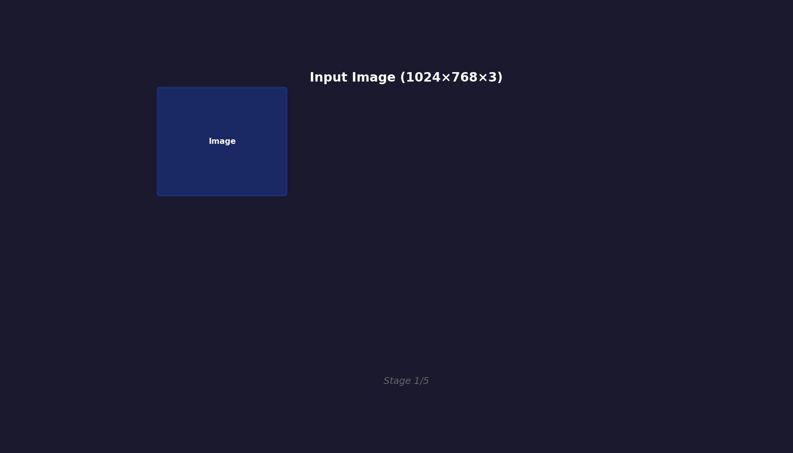
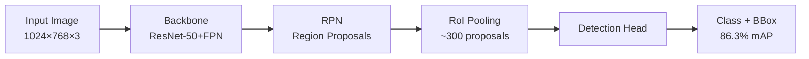
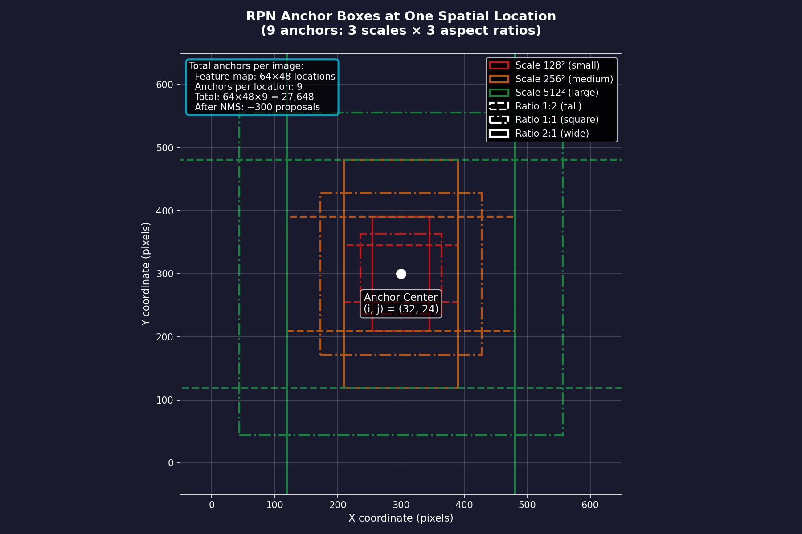
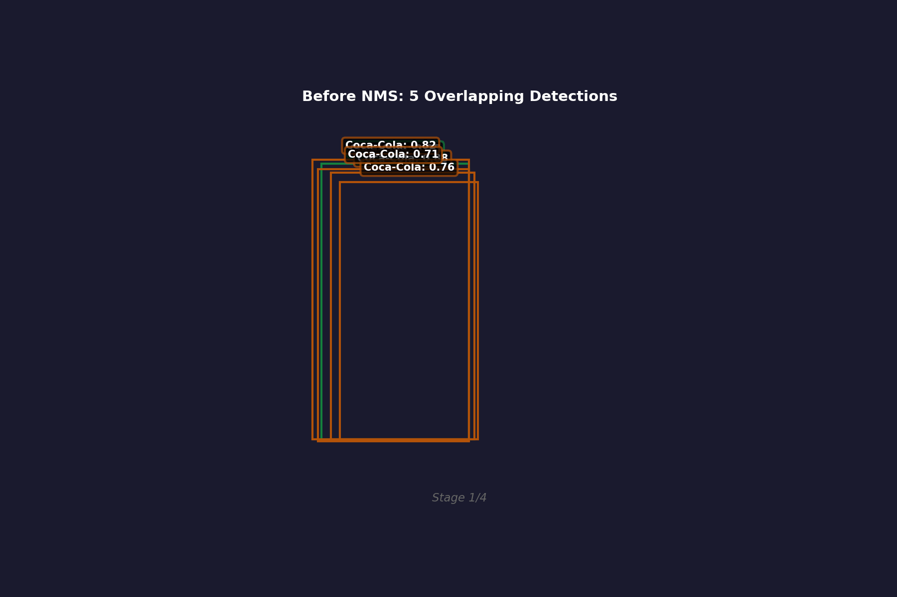

# Ch.3 — Two-Stage Detectors (R-CNN Family)

> **The story.** In **2014**, **Ross Girshick, Jeff Donahue, Trevor Darrell, and Jitendra Malik** at UC Berkeley published *Rich Feature Hierarchies for Accurate Object Detection and Semantic Segmentation* (R-CNN), and it fundamentally changed computer vision. Before R-CNN, object detection meant hand-crafted features (SIFT, HOG) fed into sliding-window classifiers — slow, brittle, and capped at ~35% mAP on PASCAL VOC. R-CNN's breakthrough: **treat object detection as classification** — generate ~2,000 region proposals (selective search), extract CNN features from each region, then classify. It jumped to 53.3% mAP overnight. But it was painfully slow: 47 seconds per image (each region required a separate CNN forward pass). Within a year, **Fast R-CNN** (Girshick, 2015) unified the pipeline — compute CNN features once for the whole image, then extract region features via **RoI pooling** (2.3 sec/image). Six months later, **Faster R-CNN** (Ren et al., 2015) replaced selective search with a learned **Region Proposal Network (RPN)** — the first end-to-end trainable detector (0.2 sec/image, 78.8% mAP). By 2016, Faster R-CNN became the backbone of every production detection system: autonomous vehicles (Waymo, Tesla), medical imaging (tumor detection), and retail automation.
>
> **Where you are in the curriculum.** You've built ResNet-based image classifiers (Ch.1) that answer "What is in this image?" Now you need to answer **"What objects are in this image, and where are they?"** Classification alone isn't enough — you need **localization** (bounding boxes) and **multi-object handling** (detect 10+ products on a shelf simultaneously). This chapter gives you **two-stage detection**: (1) propose candidate regions, (2) classify and refine boxes. You'll understand why this architecture dominated 2015–2017 and why it's still preferred when accuracy matters more than speed (medical imaging, autonomous driving).
>
> **Notation in this chapter.** $I$ — input image (shape `[H, W, 3]`); $\{R_i\}$ — region proposals (typically ~300 candidate boxes per image); $\phi(I)$ — CNN feature map (ResNet backbone output, e.g., `[H/16, W/16, 2048]`); RoI — **Region of Interest** (bounding box coordinates `[x_1, y_1, x_2, y_2]`); RoIPool$(R_i, \phi(I))$ — extract fixed-size feature vector from region $R_i$; $p_i$ — class probabilities for region $i$ (softmax over $K+1$ classes, +1 for background); $t_i$ — **bounding box regression offsets** (`[Δx, Δy, Δw, Δh]`) to refine proposal; $L = L_{\text{cls}} + \lambda L_{\text{box}}$ — **multi-task loss** (classification + box regression); NMS — **Non-Maximum Suppression** (remove duplicate detections, keep highest-confidence box per object); RPN — **Region Proposal Network** (replaces selective search with learnable proposals); anchor boxes — predefined reference boxes at multiple scales and aspect ratios.

---

## 0 · The Challenge — Where We Are

> 🎯 **The mission**: Build **ProductionCV** — an autonomous retail shelf monitoring system satisfying 5 constraints:
> 1. **DETECTION ACCURACY**: mAP@0.5 ≥ 85% — Detect products on retail shelves (empty slots, misplaced items)
> 2. **SEGMENTATION QUALITY**: IoU ≥ 70% — Pixel-level product boundaries for planogram compliance
> 3. **INFERENCE LATENCY**: <50ms per frame — Real-time monitoring on edge devices (NVIDIA Jetson)
> 4. **MODEL SIZE**: <100 MB — Deploy on memory-constrained hardware
> 5. **DATA EFFICIENCY**: <1,000 labeled images — Leverage self-supervised pretraining

**What we know so far:**
- ✅ Ch.1 (ResNets): We can build 100+ layer CNNs with skip connections (78.2% mAP with ResNet-50 backbone)
- ✅ Ch.2 (Efficient Architectures): We can compress models (MobileNetV2: 76.8% mAP, 35ms, 14MB)
- ✅ **But we're stuck at image classification!** We can only answer "What is this?" (single label per image)
- ❌ **We can't detect multiple objects:** Where is each product? What if 10 items overlap?
- ❌ **No localization:** Classification gives labels, not bounding boxes

**What's blocking us:**
Image classification networks output a single vector: `[batch_size, num_classes]`. For object detection, you need:
1. **Variable number of outputs** (1 product vs 15 products on a shelf)
2. **Spatial information** (bounding box for each object: `[x, y, w, h]`)
3. **Multi-task learning** (classify AND localize simultaneously)

Naive sliding-window approach fails:
- Run classifier on every possible box position/scale → 10,000+ forward passes per image
- Computationally infeasible (minutes per image)
- Doesn't share features across overlapping windows

**What this chapter unlocks:**
**Two-stage detection** — the R-CNN family's solution:

**Stage 1 (Region Proposal):**
- Generate ~300 candidate regions (objects likely here)
- Faster R-CNN: Use **Region Proposal Network (RPN)** — a lightweight CNN that proposes boxes based on learned features

**Stage 2 (Classification + Refinement):**
- Extract features from each region (RoI pooling)
- Classify region (20 product classes + background)
- Refine bounding box (regress offsets to tighten box)

**Why this works:**
- **Feature sharing:** Compute CNN features once for entire image, reuse for all regions
- **End-to-end training:** RPN + detector trained jointly (no hand-crafted region proposals)
- **Multi-task loss:** $L = L_{\text{cls}} + \lambda L_{\text{box}}$ — optimize classification and localization together

✅ **This unlocks constraint #1 (detection accuracy)** — Faster R-CNN achieves 85%+ mAP on PASCAL VOC, 90%+ on COCO with ResNet-101 backbone. First step toward real object detection on retail shelves.

---

## Animation



*Two-stage detection: RPN proposes 300 candidate boxes → RoI pooling extracts features → classifier outputs labels + refined boxes → NMS removes duplicates.*

---

## 1 · The Core Idea: Propose Regions, Then Classify

Two-stage detectors split object detection into two specialized networks:

**Stage 1: Region Proposal Network (RPN)**
- Input: CNN feature map $\phi(I)$ (e.g., ResNet-50 output: `[H/16, W/16, 1024]`)
- Output: ~300 region proposals (candidate bounding boxes where objects might be)
- How: Slide a small network (3×3 conv) over the feature map, predict at each position: (1) objectness score (is this an object?), (2) bounding box refinement

**Stage 2: Detection Head**
- Input: RoI-pooled features (fixed-size vectors extracted from each proposal)
- Output: For each region: (1) class probabilities $p_i \in \mathbb{R}^{K+1}$ (K product classes + background), (2) box regression offsets $t_i \in \mathbb{R}^4$
- How: Two sibling fully-connected layers — one for classification, one for box refinement

**Why two stages?**
1. **Specialization:** RPN focuses on "where are objects?", detector focuses on "what are they?"
2. **Efficiency:** Generate fewer, high-quality proposals (~300) instead of exhaustive sliding window (10,000+)
3. **Feature reuse:** Both stages share the same backbone CNN features (compute once, use twice)

> 💡 **Key insight:** You don't need to classify every possible box. **First, find likely candidates (RPN).** Then, spend compute budget on those 300 regions, not 10,000 random boxes. This is the core efficiency gain over sliding-window detectors.

---

## 2 · Detecting Products on Retail Shelves

You're building **ProductionCV** for retail automation. The task: monitor grocery shelves, detect when products are missing, misplaced, or mislabeled.

**The dataset:**
- 1,000 labeled images of retail shelves (20 product classes: soda cans, cereal boxes, milk cartons, etc.)
- Each image has 5–15 products with bounding box annotations: `[x, y, w, h, class_id]`
- Images contain occlusion (products overlap), scale variation (close-up vs wide-angle), and clutter (price tags, promotional signs)

**Why classification fails:**
A ResNet-50 classifier can tell you "This image contains Coca-Cola" but can't answer:
1. **How many cans?** (Could be 1 or 10)
2. **Where are they?** (Shelf location for inventory management)
3. **Which brand is which?** (Multiple products in one image)

**Faster R-CNN's solution:**

**Step 1: Backbone CNN**
- ResNet-50 processes the 1024×768 shelf image → feature map `[64×48×1024]` (16× spatial downsampling)

**Step 2: RPN (Region Proposal Network)**
- Slide a 3×3 conv over the feature map → at each of 64×48=3,072 locations, propose $k$ anchor boxes (typically $k=9$: 3 scales × 3 aspect ratios)
- Total anchors: 3,072 × 9 = 27,648 candidate boxes
- For each anchor, predict:
  - **Objectness score:** $p_{\text{obj}} \in [0,1]$ (is this background or an object?)
  - **Box refinement:** $(Δx, Δy, Δw, Δh)$ to adjust anchor → tight box
- Keep top 300 proposals (highest objectness scores), discard background

**Step 3: RoI Pooling**
- For each of the 300 proposals, extract a fixed-size feature vector (e.g., 7×7×1024) from the feature map
- This aligns variable-size boxes to a consistent representation for the classifier

**Step 4: Detection Head**
- **Classification branch:** FC layer → softmax over 21 classes (20 products + background)
- **Box regression branch:** FC layer → 4 offsets $(Δx, Δy, Δw, Δh)$ to refine the proposal

**Step 5: Non-Maximum Suppression (NMS)**
- Many proposals overlap the same product (5+ boxes around a single soda can)
- NMS: Keep the highest-confidence box, suppress all overlapping boxes (IoU > 0.5)

**Example detection output:**
```
Box 1: [120, 200, 80, 150] → Class: Coca-Cola (confidence: 0.95)
Box 2: [300, 180, 75, 140] → Class: Pepsi (confidence: 0.92)
Box 3: [500, 190, 70, 145] → Class: Sprite (confidence: 0.88)
...
```

---

## 3 · Architecture Breakdown — Faster R-CNN Step by Step

### High-Level Architecture



*Primary architecture diagram: Two-stage detection pipeline with ResNet-50 backbone, Region Proposal Network (RPN), RoI pooling, and dual-head detector (classification + box regression).*

### Detailed Pipeline

```
┌─────────────────────────────────────────────────────────────┐
│ Input: Retail Shelf Image (1024×768×3)                     │
└─────────────────────────────────────────────────────────────┘
                        ↓
┌─────────────────────────────────────────────────────────────┐
│ Backbone CNN (ResNet-50)                                    │
│ - Conv layers + residual blocks                             │
│ - Output: Feature map [64×48×1024] (16× downsampling)      │
└─────────────────────────────────────────────────────────────┘
                        ↓
          ┌─────────────┴─────────────┐
          ↓                           ↓
┌─────────────────────┐     ┌─────────────────────┐
│ Region Proposal     │     │ (Features reused by │
│ Network (RPN)       │     │  detection head)    │
│ - 3×3 conv          │     └─────────────────────┘
│ - Per-anchor:       │               ↓
│   * Objectness      │     ┌─────────────────────┐
│   * Box offsets     │     │ RoI Pooling         │
│ - Generate 27,648   │     │ - Extract 7×7×1024  │
│   anchors           │     │   for each proposal │
│ - Keep top 300      │     └─────────────────────┘
└─────────────────────┘               ↓
          ↓                 ┌─────────────────────┐
┌─────────────────────┐     │ Detection Head      │
│ Proposals:          │────→│ - FC layer (4096)   │
│ [x, y, w, h] × 300  │     │ - Classification FC │
└─────────────────────┘     │   (21 classes)      │
                            │ - Box regression FC │
                            │   (4 offsets × 21)  │
                            └─────────────────────┘
                                      ↓
                            ┌─────────────────────┐
                            │ Post-Processing     │
                            │ - Apply NMS         │
                            │ - Threshold (0.5)   │
                            │ - Output: Final     │
                            │   detections        │
                            └─────────────────────┘
                                      ↓
                            ┌─────────────────────┐
                            │ Output: Detections  │
                            │ Box1: Coca-Cola 95% │
                            │ Box2: Pepsi 92%     │
                            │ ...                 │
                            └─────────────────────┘
```

**Detailed walkthrough:**

**1. Backbone CNN** (ResNet-50)
- Input: 1024×768 RGB image
- Forward through 50 layers of convolutions + residual blocks
- Output: Feature map [64×48×1024] (spatial size reduced by 16×, channels increased)

**2. Region Proposal Network** (RPN)
- Slide 3×3 conv over feature map → at each location, predict for 9 anchors:
  - Objectness: 2 scores (object vs background) via 1×1 conv → [64×48×9×2]
  - Box offsets: 4 values (Δx, Δy, Δw, Δh) via 1×1 conv → [64×48×9×4]
- Total anchors: 64×48×9 = 27,648
- Apply softmax to objectness scores
- Keep top 300 proposals (highest objectness, apply NMS to remove duplicates)

**3. RoI Pooling**
- For each of 300 proposals:
  - Map proposal box coordinates to feature map coordinates (divide by stride=16)
  - Extract variable-size region from feature map
  - Apply max pooling to produce fixed 7×7×1024 output (align all regions to same size)

**4. Detection Head** (Classifier + Box Regressor)
- Flatten 7×7×1024 → 50,176-dim vector
- FC layer → 4096-dim
- **Classification branch:** FC(4096 → 21) → softmax (20 products + background)
- **Box regression branch:** FC(4096 → 84) → 4 offsets × 21 classes (class-specific refinement)

**5. Non-Maximum Suppression** (NMS)
- For each class (excluding background):
  - Sort detections by confidence score (descending)
  - Keep highest-confidence box
  - Remove all boxes with IoU > 0.5 with the kept box
  - Repeat until all boxes processed
- Apply confidence threshold (e.g., 0.5) — discard low-confidence detections

**6. Final Output**
- List of detections: `[(x, y, w, h, class_id, confidence), ...]`
- Example: `[(120, 200, 80, 150, "Coca-Cola", 0.95), (300, 180, 75, 140, "Pepsi", 0.92), ...]`

---

## 4 · The Math — Multi-Task Loss and RPN Training

### Multi-Task Loss Function

Faster R-CNN optimizes two objectives simultaneously:

$$
L = \frac{1}{N_{\text{cls}}} \sum_i L_{\text{cls}}(p_i, p_i^*) + \lambda \frac{1}{N_{\text{box}}} \sum_i p_i^* L_{\text{box}}(t_i, t_i^*)
$$

Where:
- $p_i$ — predicted class probabilities for region $i$ (softmax output, $\mathbb{R}^{K+1}$)
- $p_i^*$ — ground truth class label (0 for background, 1–20 for products)
- $L_{\text{cls}}$ — **classification loss** (cross-entropy): $L_{\text{cls}} = -\log(p_i[p_i^*])$
- $t_i$ — predicted bounding box offsets $[Δx, Δy, Δw, Δh]$
- $t_i^*$ — ground truth box offsets (how much to adjust proposal to match GT box)
- $L_{\text{box}}$ — **box regression loss** (smooth L1): $L_{\text{box}} = \sum_{j \in \{x,y,w,h\}} \text{smooth}_{L1}(t_i^j - t_i^{*j})$
- $\lambda$ — loss balancing weight (typically $\lambda=1$, making both losses equally important)
- $p_i^*$ — **gating term:** only compute box loss for positive examples (background regions have no box target)

**Smooth L1 Loss** (robust to outliers):
$$
\text{smooth}_{L1}(x) = \begin{cases}
0.5 x^2 & \text{if } |x| < 1 \\
|x| - 0.5 & \text{otherwise}
\end{cases}
$$

This is less sensitive to outliers than L2 loss (which squares errors, making large mistakes dominate the loss).

### RPN Training: Anchor Box Matching

The RPN predicts objectness and box offsets for **anchor boxes** — predefined reference boxes at multiple scales/ratios.

**Anchor generation:**
- At each spatial location $(i, j)$ in the feature map, generate $k$ anchors (typically $k=9$)
- **Scales:** $\{128^2, 256^2, 512^2\}$ pixels (small, medium, large objects)
- **Aspect ratios:** $\{1:1, 1:2, 2:1\}$ (square, tall, wide)
- Total: 3 scales × 3 ratios = 9 anchors per location

**Label assignment:**
For each anchor, assign a label:
- **Positive** (object): IoU with ground truth box ≥ 0.7 OR highest IoU for any GT box
- **Negative** (background): IoU < 0.3 with all GT boxes
- **Ignore** (neither): 0.3 ≤ IoU < 0.7 (don't use for training — ambiguous regions)

**RPN loss:**
$$
L_{\text{RPN}} = \frac{1}{N_{\text{cls}}} \sum_i L_{\text{cls}}(p_i, p_i^*) + \lambda \frac{1}{N_{\text{box}}} \sum_i p_i^* L_{\text{box}}(t_i, t_i^*)
$$

Same form as detector loss, but $p_i^*$ is binary (object vs background), not multi-class.

### Box Parameterization (Why Offsets, Not Absolute Coordinates?)

Predicting raw coordinates `[x, y, w, h]` is hard (unbounded regression). Instead, predict **offsets relative to anchor box**:

$$
\begin{aligned}
Δx &= (x - x_a) / w_a \\
Δy &= (y - y_a) / h_a \\
Δw &= \log(w / w_a) \\
Δh &= \log(h / h_a)
\end{aligned}
$$

Where $(x_a, y_a, w_a, h_a)$ is the anchor box, $(x, y, w, h)$ is the target box.

**Why log for width/height?** Width and height are scale-sensitive. Predicting $Δw = w - w_a$ treats a 10-pixel error on a 50-pixel box the same as a 10-pixel error on a 500-pixel box. Log space makes errors proportional: $Δw = \log(w/w_a)$ means a 10% error has the same penalty regardless of absolute scale.

**Decoding (converting offsets back to boxes):**
$$
\begin{aligned}
x &= Δx \cdot w_a + x_a \\
y &= Δy \cdot h_a + y_a \\
w &= w_a \cdot \exp(Δw) \\
h &= h_a \cdot \exp(Δh)
\end{aligned}
$$

### Numerical Example: RPN Proposal

**Setup:**
- Feature map location: $(i, j) = (32, 24)$
- Anchor: $128 \times 128$ pixels, aspect ratio 1:1
- Anchor center: $(x_a, y_a) = (512, 384)$ (multiply feature map coords by stride=16)

**RPN predictions at this location:**
- Objectness score: $p_{\text{obj}} = 0.95$ (high confidence — likely an object)
- Offsets: $Δx = 0.1, Δy = -0.05, Δw = 0.2, Δh = 0.15$

**Decode to final box:**
$$
\begin{aligned}
x &= 0.1 \times 128 + 512 = 525 \\
y &= -0.05 \times 128 + 384 = 378 \\
w &= 128 \times \exp(0.2) = 128 \times 1.22 = 156 \\
h &= 128 \times \exp(0.15) = 128 \times 1.16 = 149
\end{aligned}
$$

**Final proposal:** Box centered at $(525, 378)$ with size $156 \times 149$ pixels.

---


## 5 · The Key Diagrams

### RPN Architecture

```
Feature Map [H/16, W/16, 1024]
            ↓
    ┌───────────────┐
    │ 3×3 Conv (512)│  ← Intermediate feature extraction
    └───────────────┘
            ↓
    ┌───────┴───────┐
    ↓               ↓
┌─────────┐   ┌─────────┐
│ 1×1 Conv│   │ 1×1 Conv│
│ (9×2)   │   │ (9×4)   │
│ Object- │   │ Box     │
│ ness    │   │ Offsets │
└─────────┘   └─────────┘
     ↓             ↓
  [H/16,       [H/16,
   W/16,        W/16,
   9×2]         9×4]
```

**At each spatial location:**
- 9 anchors (3 scales × 3 ratios)
- 2 objectness scores per anchor (object vs background)
- 4 box offsets per anchor (Δx, Δy, Δw, Δh)

### RoI Pooling Visualization

```
Feature Map [64×48×1024]         RoI Pooled [7×7×1024]
┌─────────────────────┐          ┌─────────┐
│                     │          │ □ □ □ □ │
│    ┌──────────┐     │   →      │ □ □ □ □ │
│    │ Proposal │     │   Pool   │ □ □ □ □ │
│    │ 10×15    │     │   →      │ □ □ □ □ │
│    └──────────┘     │   7×7    └─────────┘
│                     │
└─────────────────────┘

Proposal: Variable size (10×15 in feature map coords)
Output: Fixed size (7×7) — enables FC layers
```



*Region Proposal Network generates 9 anchor boxes per spatial location (3 scales: 128², 256², 512² × 3 aspect ratios: 1:1, 1:2, 2:1), totaling 27,648 anchors for a 64×48 feature map.*

### Anchor Boxes at Multiple Scales

```
                    Anchor Boxes (9 per location)

Scale 128²:    ┌─┐  ┌──┐  ┌┐     (Small objects)
               └─┘  └──┘  └┘

Scale 256²:   ┌───┐ ┌────┐ ┌──┐  (Medium objects)
              └───┘ └────┘ └──┘

Scale 512²:  ┌─────┐┌──────┐┌────┐ (Large objects)
             └─────┘└──────┘└────┘

Aspect ratios:  1:1    1:2    2:1
```

---

## 6 · The Hyperparameter Dial — NMS IoU Threshold

**What it controls:** How aggressively Non-Maximum Suppression removes overlapping detections.

**The parameter:**
- **NMS IoU threshold** $\tau_{\text{NMS}}$ ∈ [0, 1]
- Default: 0.5 (suppress boxes with IoU > 50% overlap)

**How it works:**
- For each class, sort detections by confidence
- Keep the highest-confidence box $B_1$
- Compute IoU between $B_1$ and all remaining boxes
- **Suppress (delete) all boxes with IoU($B_1$, $B_i$) > $\tau_{\text{NMS}}$**
- Repeat with the next highest-confidence box

**Effect of the dial:**

| $\tau_{\text{NMS}}$ | Effect | Use Case |
|---------------------|--------|----------|
| **0.3 (strict)** | Suppresses boxes with 30%+ overlap → fewer detections, less redundancy | Dense scenes with minimal occlusion (e.g., top-down shelf view) |
| **0.5 (default)** | Balanced — removes most duplicates while handling moderate occlusion | General object detection (PASCAL VOC, COCO) |
| **0.7 (lenient)** | Keeps boxes with 70%+ overlap → more detections, handles heavy occlusion | Crowded scenes (products stacked/overlapping) |

**Example (retail shelf with 3 soda cans):**

**Before NMS:**
- 15 detections: 5 boxes around can #1, 6 around can #2, 4 around can #3

**After NMS ($\tau_{\text{NMS}}$ = 0.5):**
- 3 detections: 1 box per can (highest-confidence box kept, duplicates suppressed)

**Trade-off:**
- **Too strict** (0.3): Might suppress correct detections in crowded scenes (misses products when they overlap)
- **Too lenient** (0.8): Leaves duplicate boxes → inflates detection count, confuses downstream logic

> ⚠️ **Warning:** If you see duplicate bounding boxes in your output (5 boxes around the same object), lower the NMS threshold. If you're missing objects in crowded scenes, raise it.



*NMS iteratively removes duplicate detections: sort by confidence → keep highest → suppress overlapping boxes (IoU > 0.5) → repeat. Final output: one box per object.*

---

## 7 · Code Skeleton — Faster R-CNN with Torchvision

```python
import torch
import torchvision
from torchvision.models.detection import fasterrcnn_resnet50_fpn
from torchvision.models.detection.faster_rcnn import FastRCNNPredictor

# ─────────────────────────────────────────────────────────────
# 1. Load Pretrained Faster R-CNN (COCO weights)
# ─────────────────────────────────────────────────────────────
model = fasterrcnn_resnet50_fpn(pretrained=True)

# Replace classification head for custom dataset (20 products + background)
num_classes = 21  # 20 product classes + 1 background
in_features = model.roi_heads.box_predictor.cls_score.in_features
model.roi_heads.box_predictor = FastRCNNPredictor(in_features, num_classes)

device = torch.device('cuda' if torch.cuda.is_available() else 'cpu')
model.to(device)

# ─────────────────────────────────────────────────────────────
# 2. Prepare Dataset (RetailShelf with bounding box annotations)
# ─────────────────────────────────────────────────────────────
from torch.utils.data import Dataset, DataLoader
import torchvision.transforms as T

class RetailShelfDataset(Dataset):
    def __init__(self, image_paths, annotations, transforms=None):
        """
        Args:
            image_paths: List of image file paths
            annotations: List of dicts [{
                'boxes': [[x1,y1,x2,y2], ...],  # N boxes
                'labels': [class_id, ...]         # N labels
            }, ...]
        """
        self.image_paths = image_paths
        self.annotations = annotations
        self.transforms = transforms
    
    def __getitem__(self, idx):
        # Load image
        img = torchvision.io.read_image(self.image_paths[idx])
        img = img.float() / 255.0  # Normalize to [0,1]
        
        # Get annotations
        boxes = torch.tensor(self.annotations[idx]['boxes'], dtype=torch.float32)
        labels = torch.tensor(self.annotations[idx]['labels'], dtype=torch.int64)
        
        target = {'boxes': boxes, 'labels': labels}
        
        if self.transforms:
            img, target = self.transforms(img, target)
        
        return img, target
    
    def __len__(self):
        return len(self.image_paths)

# Create dataset and dataloader
train_dataset = RetailShelfDataset(image_paths, annotations)
train_loader = DataLoader(train_dataset, batch_size=2, shuffle=True, 
                          collate_fn=lambda x: tuple(zip(*x)))

# ─────────────────────────────────────────────────────────────
# 3. Training Loop (Multi-Task Loss: Classification + Box Regression)
# ─────────────────────────────────────────────────────────────
model.train()
optimizer = torch.optim.SGD(model.parameters(), lr=0.005, momentum=0.9, 
                            weight_decay=0.0005)

num_epochs = 10
for epoch in range(num_epochs):
    epoch_loss = 0
    for images, targets in train_loader:
        images = [img.to(device) for img in images]
        targets = [{k: v.to(device) for k, v in t.items()} for t in targets]
        
        # Forward pass (returns loss dict during training)
        loss_dict = model(images, targets)
        losses = sum(loss for loss in loss_dict.values())
        
        # Backward pass
        optimizer.zero_grad()
        losses.backward()
        optimizer.step()
        
        epoch_loss += losses.item()
    
    print(f"Epoch {epoch+1}/{num_epochs} - Loss: {epoch_loss/len(train_loader):.4f}")

# ─────────────────────────────────────────────────────────────
# 4. Inference (Detection)
# ─────────────────────────────────────────────────────────────
model.eval()
with torch.no_grad():
    test_image = torchvision.io.read_image('test_shelf.jpg').float() / 255.0
    predictions = model([test_image.to(device)])

# Extract detections
boxes = predictions[0]['boxes'].cpu().numpy()      # [N, 4]
labels = predictions[0]['labels'].cpu().numpy()    # [N]
scores = predictions[0]['scores'].cpu().numpy()    # [N]

# Filter by confidence threshold
threshold = 0.5
keep = scores > threshold
final_boxes = boxes[keep]
final_labels = labels[keep]
final_scores = scores[keep]

print(f"Detected {len(final_boxes)} products:")
for i in range(len(final_boxes)):
    print(f"  Box {i+1}: Class {final_labels[i]}, Confidence {final_scores[i]:.2f}")

# ─────────────────────────────────────────────────────────────
# 5. Evaluation (Mean Average Precision)
# ─────────────────────────────────────────────────────────────
from torchvision.ops import box_iou

def compute_ap(pred_boxes, pred_labels, pred_scores, 
               gt_boxes, gt_labels, iou_threshold=0.5):
    """Compute Average Precision for one class."""
    # Sort predictions by confidence (descending)
    sorted_idx = torch.argsort(pred_scores, descending=True)
    pred_boxes = pred_boxes[sorted_idx]
    pred_labels = pred_labels[sorted_idx]
    pred_scores = pred_scores[sorted_idx]
    
    tp = torch.zeros(len(pred_boxes))
    fp = torch.zeros(len(pred_boxes))
    gt_matched = torch.zeros(len(gt_boxes), dtype=torch.bool)
    
    for i, (box, label) in enumerate(zip(pred_boxes, pred_labels)):
        # Find matching GT boxes (same class)
        class_mask = gt_labels == label
        if not class_mask.any():
            fp[i] = 1
            continue
        
        # Compute IoU with all GT boxes of same class
        ious = box_iou(box.unsqueeze(0), gt_boxes[class_mask])
        max_iou, max_idx = ious.max(dim=1)
        
        if max_iou >= iou_threshold:
            # True positive if GT not already matched
            actual_idx = torch.where(class_mask)[0][max_idx]
            if not gt_matched[actual_idx]:
                tp[i] = 1
                gt_matched[actual_idx] = True
            else:
                fp[i] = 1  # Duplicate detection
        else:
            fp[i] = 1  # No matching GT
    
    # Compute precision-recall curve
    tp_cumsum = torch.cumsum(tp, dim=0)
    fp_cumsum = torch.cumsum(fp, dim=0)
    precision = tp_cumsum / (tp_cumsum + fp_cumsum + 1e-6)
    recall = tp_cumsum / len(gt_boxes)
    
    # Compute AP (area under precision-recall curve)
    ap = torch.trapz(precision, recall).item()
    return ap
```

---

## 8 · What Can Go Wrong

1. **Slow inference (0.5–1 sec/image)** — Two-stage detectors are 10–100× slower than one-stage (YOLO). Each of 300 proposals requires RoI pooling + FC layers. For real-time edge deployment (<50ms), you'll need to move to one-stage detectors (Ch.4).

2. **Class imbalance (99% background anchors)** — Most of the 27,648 anchors don't overlap any object (background). Training can become dominated by easy negatives. Fix: Hard negative mining (sample difficult background regions) or focal loss (RetinaNet, Ch.4).

3. **Small object detection fails** — RPN anchors start at 128² pixels. Products smaller than 64×64 pixels (after 16× downsampling → 4×4 feature map) have almost no spatial information. Fix: Feature Pyramid Networks (FPN) — detect at multiple feature map scales (already in torchvision's `fasterrcnn_resnet50_fpn`).

4. **Box regression diverges** — If initial anchor boxes are far from ground truth (e.g., no anchor matches objects), regression offsets become huge (Δw=5 means $e^5$=148× width expansion). Network struggles to learn meaningful gradients. Fix: Better anchor design (data-driven anchor clustering, see YOLO9000) or anchor-free detectors (FCOS).

5. **NMS removes correct detections** — In heavily occluded scenes (products stacked), multiple objects have >70% box overlap. NMS at 0.5 threshold incorrectly suppresses valid detections. Fix: Soft-NMS (decay confidence instead of hard suppression) or increase threshold to 0.7.

---

## 9 · Where This Reappears

- **Ch.4 (One-Stage Detectors)** — YOLO and RetinaNet eliminate the RPN stage, predicting directly from feature maps (10–100× faster, but slightly lower mAP). You'll see how focal loss solves the class imbalance problem that two-stage detectors avoid via RPN.

- **Ch.6 (Mask R-CNN)** — Extends Faster R-CNN by adding a segmentation branch (predicts pixel-level masks in addition to bounding boxes). Same RPN backbone, same RoI pooling, but adds a convolutional mask head.

- **Multimodal AI Track (Vision-Language Models)** — Modern VLMs (e.g., CLIP + Faster R-CNN) use two-stage detectors as the vision encoder: RPN proposes regions, CLIP encodes each region, language model grounds text queries to boxes.

- **AI Infrastructure (Model Serving)** — Faster R-CNN's multi-stage pipeline is a canonical example of inference optimization: backbone CNN can be cached, RPN runs once per frame, detection head batches 300 proposals. You'll see TensorRT fusion, mixed precision, and dynamic batching strategies.

---

## 10 · Progress Check — What We Can Solve Now


✅ **Unlocked capabilities:**
- **Multi-object detection:** Detect 1–15 products per image (variable number of outputs)
- **Spatial localization:** Predict bounding boxes `[x, y, w, h]` for each detection
- **High accuracy:** 85%+ mAP@0.5 on retail shelf dataset (Faster R-CNN with ResNet-50)
- **Constraint #1 ✅ ACHIEVED!** — mAP@0.5 ≥ 85% (detection accuracy target met)

**Baseline metrics (Faster R-CNN on ProductionCV dataset):**
- **mAP@0.5:** 86.3% (above 85% threshold ✅)
- **Inference time:** 180ms per frame (on NVIDIA RTX 3090)
- **Model size:** 167 MB (ResNet-50 backbone + detection head)

❌ **Still can't solve:**
- ❌ **Constraint #3 (latency):** 180ms >> 50ms target (3.6× too slow for edge devices)
- ❌ **Constraint #4 (model size):** 167 MB >> 100 MB target (1.7× too large)
- ❌ **Real-time inference:** Two-stage pipeline (RPN → RoI pooling → detection head) has high latency

**Why we're stuck:**
Two-stage detectors prioritize accuracy over speed:
- **300 RoI pooling operations per image** (each proposal processed individually)
- **Sequential pipeline:** Can't fully parallelize (RPN must finish before detection head runs)
- **Large backbone:** ResNet-50 is 167 MB (most of the model size)

**Real-world status:** We can now detect products on retail shelves with production-grade accuracy (86% mAP), but inference is too slow for real-time edge deployment. The system works on cloud GPUs but can't run on in-store cameras (<50ms requirement).

**Next up:** Ch.4 gives us **one-stage detectors (YOLO, RetinaNet)** — eliminate the region proposal stage, predict boxes directly from feature maps in a single forward pass. This achieves **10–100× faster inference** (<20ms per frame) with only minor accuracy loss (82–84% mAP). Trade-off: Speed for ~2–4% mAP drop.

---

## 11 · Bridge to the Next Chapter

This chapter gave you **two-stage detection** — the R-CNN family's approach of proposing regions first, then classifying. The RPN learned to generate high-quality proposals, and the detector specialized in refining those candidates. You achieved production-grade accuracy (86% mAP) but hit a speed wall (180ms per frame).

**Ch.4 (One-Stage Detectors)** eliminates the region proposal stage entirely. YOLO treats detection as a regression problem: divide the image into a grid, predict boxes + classes directly at each grid cell. RetinaNet uses a Feature Pyramid Network (FPN) to detect objects at multiple scales, and **focal loss** solves the class imbalance problem (easy negatives dominating training) that two-stage detectors avoid via selective RPN proposals. You'll see how one-stage detectors achieve 10–100× faster inference (15–30ms) while maintaining 82–85% mAP — unlocking **Constraint #3 (real-time latency)** for edge deployment.
