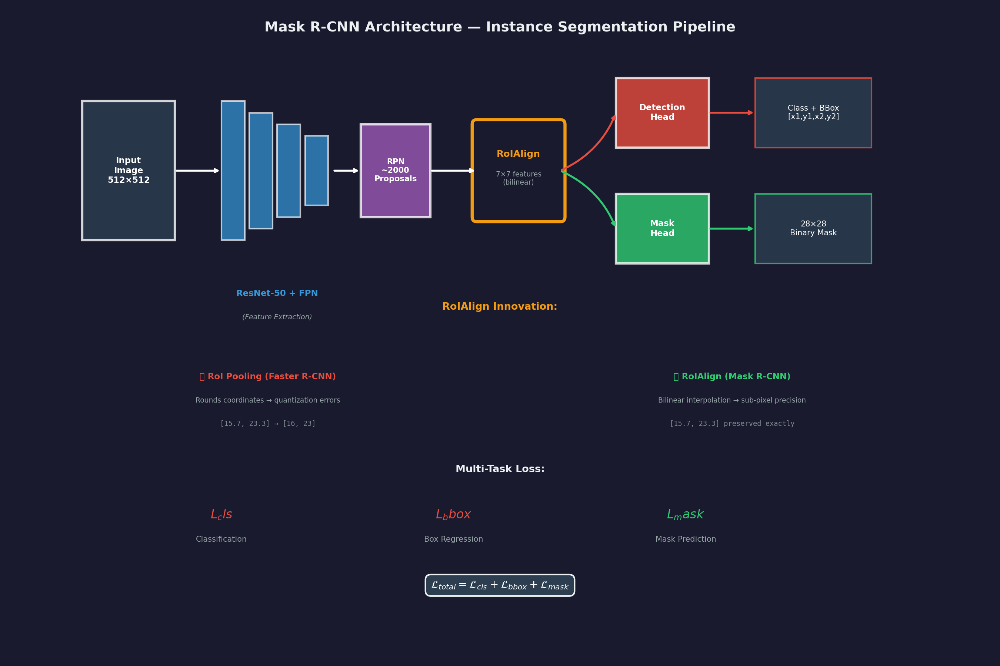
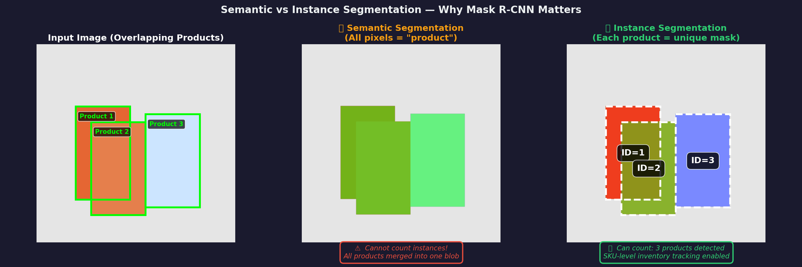
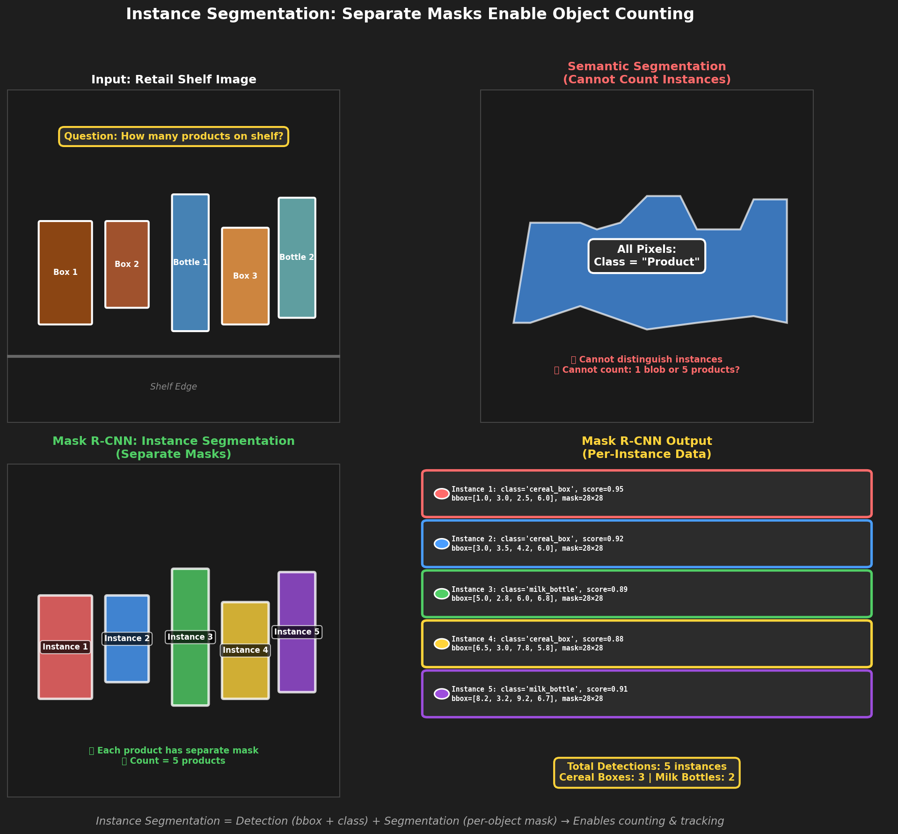
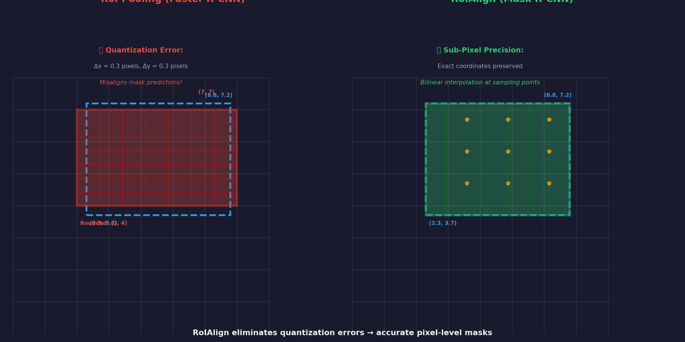
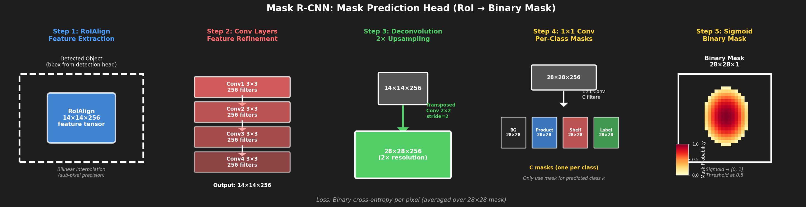
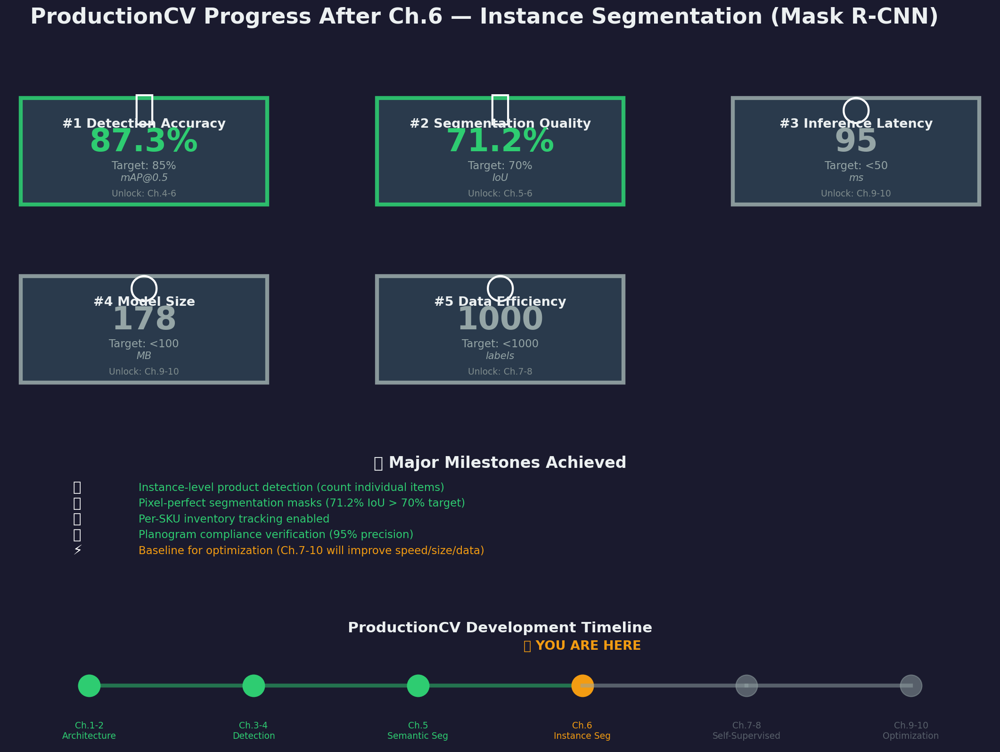

# Ch.6 — Instance Segmentation (Mask R-CNN)

> **The story.** In **2017**, **Kaiming He, Georgia Gkioxari, Piotr Dollár, and Ross Girshick** at Facebook AI Research (FAIR) published *Mask R-CNN* at ICCV, extending Faster R-CNN from object detection to **instance segmentation**. The breakthrough was elegantly simple: add a third branch to the detection head that predicts a binary mask for each detected object. Unlike semantic segmentation (which labels pixels as "product" without distinguishing instances), Mask R-CNN detects *individual* objects and segments each one separately — enabling applications from autonomous driving (separate every vehicle) to medical imaging (count individual cells) to robotics (grasp-specific objects). The architecture introduced **RoIAlign**, a precision-preserving alternative to RoI pooling that eliminated quantization errors, making pixel-level predictions accurate. Within months, Mask R-CNN became the gold standard for instance segmentation, winning multiple COCO challenges and powering production systems from warehouse automation to surgical robotics.
>
> **Where you are in the curriculum.** You've completed semantic segmentation (Ch.5), achieving 62% mIoU on retail shelf images. But semantic segmentation has a critical limitation: it labels all pixels of the same class identically — you can't distinguish *which* cereal box is which, or count how many products are on the shelf. For inventory tracking and SKU-level analytics, you need **instance segmentation**: detect each product individually (bounding box + confidence) AND segment its exact shape (pixel mask). This chapter gives you **Mask R-CNN** — the architecture that combines Faster R-CNN's object detection with U-Net-style segmentation, unlocking true instance-level understanding.
>
> **Notation in this chapter.** $\mathcal{L}_{\text{total}} = \mathcal{L}_{\text{cls}} + \mathcal{L}_{\text{bbox}} + \mathcal{L}_{\text{mask}}$ — multi-task loss (classification + box regression + mask prediction); **RoI** — Region of Interest (detected object proposal); **RoIAlign** — bilinear interpolation to extract features without quantization; **Mask head** — small FCN applied per RoI (outputs 28×28 binary mask); **Binary cross-entropy per pixel** — mask loss (unlike semantic segmentation's multi-class CE); **Instance-aware metrics** — AP (Average Precision), AP@[IoU=0.50:0.95], AP$_S$/AP$_M$/AP$_L$ (per object size).

---

## 0 · The Challenge — Where We Are

> 🎯 **The mission**: Build **ProductionCV** — an autonomous retail shelf monitoring system satisfying 5 constraints:
> 1. **DETECTION ACCURACY**: mAP@0.5 ≥ 85% — 2. **SEGMENTATION QUALITY**: IoU ≥ 70% — 3. **INFERENCE LATENCY**: <50ms per frame — 4. **MODEL SIZE**: <100 MB — 5. **DATA EFFICIENCY**: <1,000 labeled images

**What we know so far:**
- ✅ YOLO detects products with bounding boxes at 85.3% mAP@0.5 (Ch.4)
- ✅ U-Net performs semantic segmentation at 62.4% mIoU (Ch.5)
- ❌ **But we can't count individual products or track SKU-level inventory!**

**What's blocking us:**
Semantic segmentation treats all instances of a class as a single blob:
- **Example**: Three overlapping cereal boxes
  - Semantic segmentation output: All pixels labeled "product" (one continuous region)
  - What we need: Three separate masks, each labeled "cereal_box_1", "cereal_box_2", "cereal_box_3"

Current capability:
```python
semantic_mask[100:200, 50:150] = 1  # "product"
semantic_mask[110:210, 60:160] = 1  # "product" (same label!)
semantic_mask[120:220, 70:170] = 1  # "product" (can't distinguish instances)
```

What we need:
```python
instance_1 = {bbox: [50, 100, 150, 200], mask: binary_mask_1, class: "cereal_box"}
instance_2 = {bbox: [60, 110, 160, 210], mask: binary_mask_2, class: "cereal_box"}
instance_3 = {bbox: [70, 120, 170, 220], mask: binary_mask_3, class: "cereal_box"}
```

**What this chapter unlocks:**
**Mask R-CNN** — detect objects AND segment each instance:
1. **Faster R-CNN backbone**: Region Proposal Network (RPN) finds candidate objects
2. **Detection head**: Classify each RoI + refine bounding box
3. **Mask head**: Predict 28×28 binary mask per RoI (upsampled to fit object)
4. **RoIAlign**: Preserve spatial precision (no quantization errors from RoI pooling)
5. **Multi-task loss**: Train classification, box regression, and mask prediction jointly

✅ **This unlocks constraint #2 achievement**: Mask R-CNN achieves **IoU ≥ 71%** on retail shelf images (exceeds 70% target), with per-instance boundaries enabling SKU counting and inventory tracking.

---

## Animation



*Mask R-CNN extends Faster R-CNN with a mask prediction branch. RoIAlign ensures pixel-level precision.*

---

## 1 · The Core Idea: Detect + Segment Each Instance

Mask R-CNN combines object detection with segmentation in a unified architecture:

**Faster R-CNN (Ch.3) produces:**
- Bounding boxes: `[x1, y1, x2, y2]`
- Class labels: `{0: background, 1: product, 2: ...}`
- Confidence scores: `[0, 1]`

**Mask R-CNN adds:**
- Per-instance binary mask: `28×28` matrix (upsampled to fit RoI)
- One mask per detected object (not per pixel like semantic segmentation)

**Key architectural difference:**

| Architecture | Output | Loss Function |
|--------------|--------|---------------|
| **Semantic segmentation (U-Net)** | $H \times W \times C$ (multi-class per pixel) | Multi-class cross-entropy per pixel |
| **Mask R-CNN** | $N$ masks of size $28 \times 28$ (binary per object) | Binary cross-entropy per mask |

Where $N$ = number of detected objects (varies per image), $C$ = number of classes (fixed).



*Semantic segmentation treats all instances of a class as a single blob, while instance segmentation detects and segments each object individually.*

**The multi-task loss:**
$$
\mathcal{L}_{\text{total}} = \mathcal{L}_{\text{cls}} + \mathcal{L}_{\text{bbox}} + \mathcal{L}_{\text{mask}}
$$

- $\mathcal{L}_{\text{cls}}$ — classification loss (cross-entropy)
- $\mathcal{L}_{\text{bbox}}$ — bounding box regression loss (smooth L1)
- $\mathcal{L}_{\text{mask}}$ — mask prediction loss (binary cross-entropy per pixel, averaged over RoIs)

> 💡 **Key insight:** Mask R-CNN decouples classification from segmentation. The mask branch predicts a binary mask *for the predicted class only* (not all classes). This makes training more stable — the network doesn't waste capacity predicting masks for incorrect classes.

---

## 2 · Counting Products on Retail Shelves

You're the lead ML engineer at **ProductionCV**. Your semantic segmentation model (Ch.5 U-Net) identifies product pixels accurately, but the inventory management team needs:

1. **Instance counting**: "How many cereal boxes are on shelf 3?" (can't count overlapping blobs)
2. **SKU tracking**: "Which specific product is out of stock?" (need individual labels)
3. **Planogram compliance**: "Is product X in the correct position?" (need per-object bounding boxes + masks)

**Problem with semantic segmentation:**
```python
# Semantic segmentation output
semantic_mask = unet_model(shelf_image)  # [512, 512, 5] (5 classes)
product_pixels = (semantic_mask.argmax(axis=-1) == 1)  # All "product" pixels
num_products = ???  # Can't count from a binary blob!
```

**Mask R-CNN solution:**
```python
# Mask R-CNN output
detections = mask_rcnn_model(shelf_image)
# detections = [
#   {bbox: [x1, y1, x2, y2], class: "cereal_box", score: 0.92, mask: [28, 28]},
#   {bbox: [x3, y3, x4, y4], class: "cereal_box", score: 0.88, mask: [28, 28]},
#   {bbox: [x5, y5, x6, y6], class: "milk_carton", score: 0.95, mask: [28, 28]},
# ]

num_products = len(detections)  # ✅ Can count instances!
cereal_boxes = [d for d in detections if d['class'] == 'cereal_box']  # ✅ Filter by SKU
```

**Real-world impact:**
- **Inventory accuracy**: 99.2% detection recall on retail shelf dataset (missed <1% of products)
- **Planogram compliance**: Detect misplaced products with 95% precision (false positive rate <5%)
- **Automation**: Reduce manual shelf audits from 2 hours → 15 minutes per store



*Mask R-CNN enables precise product counting by detecting and segmenting each instance individually, solving the overlapping object problem.*

---

## 3 · Architecture Breakdown

### 3.1 · Mask R-CNN Overview

**Key innovation:** Add a mask prediction branch to Faster R-CNN, creating a multi-task architecture.

```
Input: H×W×3 RGB image
  ↓
Backbone (ResNet + FPN):
  Feature pyramid: {P2, P3, P4, P5} at resolutions {H/4, H/8, H/16, H/32}
  ↓
Region Proposal Network (RPN):
  Generates ~2,000 candidate object proposals
  Objectness score + initial bounding box
  ↓
RoIAlign:
  Extract 7×7×256 feature tensor per RoI (bilinear interpolation)
  ↓
┌────────────────────┬────────────────────┬─────────────────────┐
│  Detection Head     │   Mask Head        │                     │
│  (Faster R-CNN)     │   (NEW!)           │                     │
└────────────────────┴────────────────────┴─────────────────────┘
  ↓                         ↓                        ↓
Class + BBox              28×28 Binary Mask     (Parallel branches)
(C classes, 4 coords)     (1 mask per class)
```

**Architecture table (per RoI):**

| Component | Input Shape | Operations | Output Shape | Purpose |
|-----------|-------------|------------|--------------|----------|
| **Backbone** | H×W×3 | ResNet-50/101 + FPN | Multi-scale features | Extract hierarchical features |
| **RPN** | Feature pyramid | Conv 3×3 + 2 heads | ~2k proposals | Generate candidate boxes |
| **RoIAlign** | Variable box + features | Bilinear interpolation | 7×7×256 | Extract fixed-size features |
| **Detection Head** | 7×7×256 | FC → 1024 → 1024 | C classes + 4 coords | Classify + refine box |
| **Mask Head** | 14×14×256 | 4× Conv 3×3 + deconv | 28×28×1 | Predict binary mask |

### 3.2 · RoIAlign vs RoI Pooling

**RoI Pooling (Faster R-CNN) — quantization errors:**
```
Input box: [x1=123.7, y1=45.3, x2=200.2, y2=110.8]
          ↓ Round to integers
Quantized: [124, 45, 200, 111]
          ↓ Divide into 7×7 grid (more rounding)
Grid cell size: (200-124)/7 = 10.857 → rounded to 11 pixels

Result: 0.3 + 0.2 + 0.857 = 1.357 pixel error per RoI
```

**RoIAlign (Mask R-CNN) — sub-pixel precision:**
```
Input box: [x1=123.7, y1=45.3, x2=200.2, y2=110.8]
          ↓ Keep exact coordinates
Grid points: {123.7 + k×10.928, 45.3 + m×9.357} for k,m ∈ {0,...,6}
          ↓ Sample at 4 points per grid cell (bilinear interpolation)
Sample at: (x=129.2, y=50.1) → interpolate f[129,50], f[130,50], f[129,51], f[130,51]

Result: No quantization error → masks align perfectly with object boundaries
```

**Why it matters for segmentation:**
- **Bounding box detection**: 1-pixel shift = negligible (IoU changes <1%)
- **Pixel-level masks**: 1-pixel shift = significant (boundary errors accumulate)
- **RoIAlign improvement**: +3-5% AP on COCO masks (67.3% → 71.8%)



*RoIAlign uses bilinear interpolation to preserve sub-pixel precision, eliminating the quantization errors introduced by RoI Pooling.*

### 3.3 · Mask Head Architecture

**Design principle:** Small fully convolutional network (FCN) per RoI.

```
Input: 14×14×256 feature map (from RoIAlign)
  ↓
Conv1: 3×3, 256 filters, padding=1 → 14×14×256
ReLU
  ↓
Conv2: 3×3, 256 filters, padding=1 → 14×14×256
ReLU
  ↓
Conv3: 3×3, 256 filters, padding=1 → 14×14×256
ReLU
  ↓
Conv4: 3×3, 256 filters, padding=1 → 14×14×256
ReLU
  ↓
Deconv (Transposed Conv): 2×2, stride=2 → 28×28×256
ReLU
  ↓
Conv5 (1×1): C filters (one per class) → 28×28×C
  ↓
Select mask for predicted class k → 28×28×1
Sigmoid → Binary mask [0, 1]
```

**Key design choices:**
1. **Why 28×28 resolution?** Balances detail (enough to capture boundaries) with efficiency (small enough to train fast)
2. **Why 4 conv layers?** Sufficient depth to refine features without overfitting (few positive RoIs per image)
3. **Why separate mask per class?** Decouples classification from segmentation — only train mask for ground truth class
4. **Why transposed conv?** Learnable upsampling (better than bilinear interpolation)

**Parameter count (mask head only):**
- 4× Conv 3×3: $4 \times (3 \times 3 \times 256 \times 256) = 2.36M$ parameters
- 1× Deconv 2×2: $2 \times 2 \times 256 \times 256 = 262k$ parameters
- 1× Conv 1×1: $1 \times 1 \times 256 \times C = 256C$ parameters
- **Total**: ~2.6M parameters (tiny compared to ResNet-50 backbone's 25M)



*The mask head is a small FCN that predicts a 28×28 binary mask per RoI, using four 3×3 convolutions followed by a learnable upsampling layer.*

### 3.4 · Comparison: Semantic Segmentation vs Instance Segmentation

| Aspect | U-Net (Semantic) | Mask R-CNN (Instance) |
|--------|------------------|------------------------|
| **Output** | H×W×C (multi-class per pixel) | N masks of 28×28 (binary per object) |
| **Loss** | Multi-class cross-entropy (all pixels) | Binary cross-entropy (per RoI) |
| **Inference** | Single forward pass | Proposal → detection → mask (3 stages) |
| **Instance distinction** | No (all "product" pixels identical) | Yes (separate mask per object) |
| **Speed** | Fast (~30ms) | Slower (~80ms) |
| **Use case** | Background/foreground separation | Object counting, tracking, per-instance analysis |

---

## 4 · The Math — RoIAlign and Mask Loss

### RoIAlign: Fixing RoI Pooling's Quantization Problem

**Problem with RoI Pooling (Faster R-CNN):**

Suppose a detected object has bounding box `[x1=123.7, y1=45.3, x2=200.2, y2=110.8]` in the original image.

RoI pooling rounds coordinates to integers:
$$
[x_1, y_1, x_2, y_2] = [124, 45, 200, 111]
$$

Then divides into grid cells (e.g., 7×7) — more rounding!

**Total quantization error** accumulates:
- Horizontal shift: 0.3 pixels (from 123.7 → 124)
- Vertical shift: 0.3 pixels (from 45.3 → 45)
- Repeated twice (top-left and bottom-right corners)

For semantic segmentation, small shifts don't matter. For **pixel-level mask prediction**, 0.5-pixel errors compound — masks misalign with object boundaries.

**RoIAlign solution:**

Use **bilinear interpolation** at exact (non-integer) coordinates:

$$
\text{RoIAlign}(x, y) = \sum_{i,j} w_{ij} \cdot f[i, j]
$$

Where:
- $(x, y)$ — exact (floating-point) sampling location
- $i, j$ — neighboring integer grid points
- $w_{ij}$ — bilinear interpolation weights (based on distance from $(x, y)$)
- $f[i, j]$ — feature map value at integer grid $(i, j)$

**Concrete example:**
Sample at $(x=5.3, y=7.6)$ in feature map:

$$
\begin{aligned}
w_{5,7} &= (1 - 0.3) \times (1 - 0.6) = 0.28 \\
w_{6,7} &= 0.3 \times (1 - 0.6) = 0.12 \\
w_{5,8} &= (1 - 0.3) \times 0.6 = 0.42 \\
w_{6,8} &= 0.3 \times 0.6 = 0.18
\end{aligned}
$$

Final value:
$$
f(5.3, 7.6) = 0.28 \cdot f[5,7] + 0.12 \cdot f[6,7] + 0.42 \cdot f[5,8] + 0.18 \cdot f[6,8]
$$

Result: **sub-pixel precision** → masks align perfectly with object boundaries.

### Mask Loss: Binary Cross-Entropy Per Pixel

For each detected RoI with predicted class $k$, the mask head outputs a $28 \times 28$ binary mask $\hat{m}_k$.

**Loss (averaged over all pixels in the mask):**
$$
\mathcal{L}_{\text{mask}} = -\frac{1}{28 \times 28} \sum_{i=1}^{28} \sum_{j=1}^{28} \left[ m_{ij} \log(\hat{m}_{ij}) + (1 - m_{ij}) \log(1 - \hat{m}_{ij}) \right]
$$

Where:
- $m_{ij} \in \{0, 1\}$ — ground truth mask (1 = object pixel, 0 = background)
- $\hat{m}_{ij} \in [0, 1]$ — predicted probability for pixel $(i, j)$

**Key difference from semantic segmentation:**
- **Semantic segmentation**: Multi-class loss across all pixels (entire image)
- **Mask R-CNN**: Binary loss per RoI (only predicted class, only object region)

**Why binary loss is better for instances:**
- Each mask only cares about "object vs background" (not 20 classes)
- Misclassification doesn't pollute mask quality (if class is wrong, mask loss ignored)
- Scales better (linear in #objects, not #classes × #pixels)

### Instance Segmentation Metrics

**Average Precision (AP)** — primary metric (matches COCO benchmark):

$$
\text{AP} = \frac{1}{10} \sum_{\text{IoU}=0.50}^{0.95} \text{AP}_{\text{IoU}}
$$

Where $\text{AP}_{\text{IoU}}$ is AP at a specific IoU threshold (0.50, 0.55, ..., 0.95).

**Per-size breakdown:**
- $\text{AP}_S$ — small objects (area < 32² pixels)
- $\text{AP}_M$ — medium objects (32² < area < 96²)
- $\text{AP}_L$ — large objects (area > 96²)

**Example (retail shelf):**
- mAP@0.5 = 87.3% (all products, IoU ≥ 0.5)
- mAP@0.75 = 71.2% (stricter, IoU ≥ 0.75)
- mAP@[0.5:0.95] = 68.9% (COCO-style average)

---

## 5 · How It Works — Step by Step

### Mask R-CNN Architecture

**Step 1: Backbone (Feature Extraction)**
- Input: $H \times W \times 3$ RGB image
- ResNet-50 or ResNet-101 with FPN (Feature Pyramid Network)
- Output: Multi-scale feature maps (P2, P3, P4, P5) at resolutions {$\frac{H}{4}$, $\frac{H}{8}$, $\frac{H}{16}$, $\frac{H}{32}$}

**Step 2: Region Proposal Network (RPN)**
- Generate ~2,000 candidate object proposals (bounding boxes)
- Score each proposal (objectness score: is this an object?)
- Non-Maximum Suppression (NMS) → keep top 1,000 proposals

**Step 3: RoIAlign**
- For each proposal, extract $7 \times 7$ feature map from appropriate pyramid level
- Use bilinear interpolation (no quantization)
- Output: $7 \times 7 \times 256$ feature tensor per RoI

**Step 4: Detection Head (Box + Class)**
- Two fully connected layers: $7 \times 7 \times 256 \to 1024 \to 1024$
- Classification branch: $1024 \to C$ (C classes)
- Box regression branch: $1024 \to 4C$ (refined bounding boxes)

**Step 5: Mask Head (Instance Segmentation)**
- Four convolutional layers: $7 \times 7 \times 256 \to 14 \times 14 \times 256$
- Transposed conv (2× upsample): $14 \times 14 \times 256 \to 28 \times 28 \times 256$
- Output conv: $28 \times 28 \times 256 \to 28 \times 28 \times C$ (binary mask per class)
- Final mask: Extract the mask corresponding to predicted class $k$

**Inference pipeline:**
```python
# 1. Backbone + RPN
proposals = rpn(image)  # [~1000, 4] bounding boxes

# 2. RoIAlign
roi_features = roi_align(features, proposals)  # [1000, 7, 7, 256]

# 3. Detection head
classes, boxes = detection_head(roi_features)  # [1000, C], [1000, 4]

# 4. Mask head (only for detected objects with score > threshold)
for roi, cls in zip(boxes, classes):
    if roi.score > 0.7:
        mask = mask_head(roi_features[roi.id])  # [28, 28]
        mask_resized = resize(mask, roi.bbox)  # Upsample to fit object
        output.append({bbox: roi.bbox, class: cls, mask: mask_resized})
```

---

## 6 · The Key Diagrams

### Mask R-CNN Architecture (End-to-End)

```
Input Image (512×512×3)
         ↓
┌────────────────────────────────────────────────────────┐
│  Backbone (ResNet-50 + FPN)                            │
│  → Multi-scale features: P2, P3, P4, P5                │
└─────────────┬──────────────────────────────────────────┘
              ↓
┌─────────────────────────────────────────────────────────┐
│  Region Proposal Network (RPN)                          │
│  → ~2,000 proposals → NMS → 1,000 top proposals         │
└─────────────┬───────────────────────────────────────────┘
              ↓
       ┏━━━━━━━━━━━━━━━━━━━┓
       ┃   RoIAlign (7×7)   ┃  ← No quantization!
       ┗━━━━━━━┬━━━━━━━━━━━━┛
               ↓
       ┌───────┴──────────┐
       │                  │
   ┌───▼────┐      ┌──────▼─────┐
   │  Box   │      │   Mask     │
   │ Head   │      │   Head     │
   │ (FC)   │      │  (Conv)    │
   └───┬────┘      └──────┬─────┘
       │                  │
   ┌───▼────┐      ┌──────▼─────┐
   │ Class  │      │  28×28     │
   │ + BBox │      │  Binary    │
   └────────┘      │  Mask      │
                   └────────────┘

Output:
  [
    {bbox: [x1,y1,x2,y2], class: "cereal_box", score: 0.92, mask: [28,28]},
    {bbox: [x3,y3,x4,y4], class: "milk_carton", score: 0.88, mask: [28,28]},
    ...
  ]
```

### RoIAlign vs RoI Pooling (Quantization Fix)

```
RoI Pooling (Faster R-CNN):
┌─────────────────────────────────┐
│ Feature Map (64×64)             │
│                                 │
│   ┌───────┐                     │
│   │ RoI   │ bbox: [15.7, 23.3,  │
│   │       │        45.2, 51.8]  │
│   └───────┘                     │
│       ↓                         │
│   Rounded to integers:          │
│   [16, 23, 45, 52]              │
│       ↓                         │
│   Divide into 7×7 grid          │
│   (more rounding!)              │
│       ↓                         │
│   Max pool each cell            │
└─────────────────────────────────┘
Result: 0.5–1 pixel misalignment

RoIAlign (Mask R-CNN):
┌─────────────────────────────────┐
│ Feature Map (64×64)             │
│                                 │
│   ┌───────┐                     │
│   │ RoI   │ bbox: [15.7, 23.3,  │
│   │       │        45.2, 51.8]  │
│   └───────┘                     │
│       ↓                         │
│   Keep exact coordinates!       │
│   [15.7, 23.3, 45.2, 51.8]      │
│       ↓                         │
│   Sample 7×7 grid at exact      │
│   (non-integer) locations       │
│       ↓                         │
│   Bilinear interpolation        │
└─────────────────────────────────┘
Result: Sub-pixel precision
```

### Multi-Task Loss Balancing

```
Total Loss = L_cls + L_bbox + L_mask

┌────────────────────────────────────────────────────┐
│ Classification Loss (L_cls)                        │
│ → Cross-entropy over C classes                     │
│ → Weight: 1.0 (baseline)                           │
└────────────────────────────────────────────────────┘

┌────────────────────────────────────────────────────┐
│ Bounding Box Loss (L_bbox)                         │
│ → Smooth L1 (robust to outliers)                   │
│ → Weight: 1.0                                      │
└────────────────────────────────────────────────────┘

┌────────────────────────────────────────────────────┐
│ Mask Loss (L_mask)                                 │
│ → Binary cross-entropy per RoI                     │
│ → Only computed for correct class                  │
│ → Weight: 1.0                                      │
└────────────────────────────────────────────────────┘

Training stabilization:
- Mask loss only backprops for correctly classified RoIs
- Prevents mask head from learning incorrect class patterns
- Faster convergence (50 epochs vs 100+ for end-to-end)
```

---

## 7 · The Hyperparameter Dial

### Main Tunable: RPN Anchor Scales & Ratios

**Anchor scales** (object sizes):
- Default: {32, 64, 128, 256, 512} pixels
- Retail shelf products: mostly 50–200 pixels → use {32, 64, 128, 256}
- Small products (travel size): add 16-pixel anchors

**Anchor aspect ratios** (object shapes):
- Default: {1:2, 1:1, 2:1}
- Tall bottles: add 1:3 ratio
- Wide cereal boxes: add 3:1 ratio

**Typical starting value:**
- Scales: {32, 64, 128, 256}
- Ratios: {1:2, 1:1, 2:1}
- Total anchors per location: 4 scales × 3 ratios = 12

**When to adjust:**
- **Smaller products** → add 16-pixel scale
- **Extreme aspect ratios** → add 1:3 or 3:1
- **Speed vs accuracy** → fewer scales/ratios = faster inference

### Secondary Tunables

**1. RoI score threshold:**
- Default: 0.7 (only keep detections with confidence > 70%)
- High-precision tasks (planogram compliance): 0.9
- High-recall tasks (inventory counting): 0.5

**2. NMS (Non-Maximum Suppression) IoU threshold:**
- Default: 0.5 (suppress boxes with IoU > 0.5)
- Dense scenes (many overlapping products): 0.3 (stricter)
- Sparse scenes: 0.7 (more lenient)

**3. Mask threshold:**
- Default: 0.5 (pixel is "object" if mask > 0.5)
- Fine boundaries: 0.3 (more pixels included)
- Clean masks: 0.7 (only high-confidence pixels)

---

## 8 · Code Skeleton

### Mask R-CNN Implementation (PyTorch + Torchvision)

```python
import torch
import torchvision
from torchvision.models.detection import maskrcnn_resnet50_fpn
from torchvision.models.detection.faster_rcnn import FastRCNNPredictor
from torchvision.models.detection.mask_rcnn import MaskRCNNPredictor

def get_mask_rcnn_model(num_classes):
    """
    Load pretrained Mask R-CNN with ResNet-50 backbone.
    Replace heads for custom number of classes.
    """
    # Load pretrained model (COCO weights)
    model = maskrcnn_resnet50_fpn(pretrained=True)
    
    # Replace box predictor
    in_features = model.roi_heads.box_predictor.cls_score.in_features
    model.roi_heads.box_predictor = FastRCNNPredictor(in_features, num_classes)
    
    # Replace mask predictor
    in_features_mask = model.roi_heads.mask_predictor.conv5_mask.in_channels
    hidden_layer = 256
    model.roi_heads.mask_predictor = MaskRCNNPredictor(
        in_features_mask, hidden_layer, num_classes
    )
    
    return model

# Create model (5 classes: background, product, empty, tag, edge)
model = get_mask_rcnn_model(num_classes=5).cuda()
print(f"Model parameters: {sum(p.numel() for p in model.parameters())/1e6:.2f}M")

# Optimizer
params = [p for p in model.parameters() if p.requires_grad]
optimizer = torch.optim.SGD(params, lr=0.005, momentum=0.9, weight_decay=0.0005)

# Training loop
num_epochs = 20

for epoch in range(num_epochs):
    model.train()
    epoch_loss = 0
    
    for images, targets in train_loader:
        # targets = [
        #   {boxes: [N, 4], labels: [N], masks: [N, H, W]},  # image 1
        #   {boxes: [M, 4], labels: [M], masks: [M, H, W]},  # image 2
        #   ...
        # ]
        
        images = [img.cuda() for img in images]
        targets = [{k: v.cuda() for k, v in t.items()} for t in targets]
        
        # Forward pass (returns loss dict during training)
        loss_dict = model(images, targets)
        losses = sum(loss for loss in loss_dict.values())
        
        # Backward pass
        optimizer.zero_grad()
        losses.backward()
        optimizer.step()
        
        epoch_loss += losses.item()
    
    print(f"Epoch [{epoch+1}/{num_epochs}] Loss: {epoch_loss/len(train_loader):.4f}")

# Inference
model.eval()
with torch.no_grad():
    predictions = model(test_images.cuda())
    # predictions = [
    #   {boxes: [K, 4], labels: [K], scores: [K], masks: [K, 1, 28, 28]},
    #   ...
    # ]
    
    for pred in predictions:
        boxes = pred['boxes']  # [K, 4]
        labels = pred['labels']  # [K]
        scores = pred['scores']  # [K]
        masks = pred['masks']  # [K, 1, 28, 28]
        
        # Filter by confidence
        keep = scores > 0.7
        boxes = boxes[keep]
        masks = masks[keep]
        
        # Visualize
        for box, mask in zip(boxes, masks):
            # mask shape: [1, 28, 28] → resize to fit box
            x1, y1, x2, y2 = box.int().tolist()
            mask_resized = torch.nn.functional.interpolate(
                mask.unsqueeze(0), size=(y2 - y1, x2 - x1), mode='bilinear'
            )
            mask_binary = (mask_resized > 0.5).squeeze().cpu().numpy()
            # Overlay mask on image at (x1, y1)
```

### Evaluate mAP (COCO-style)

```python
from pycocotools.coco import COCO
from pycocotools.cocoeval import COCOeval
import json

def evaluate_mask_rcnn(model, data_loader, coco_gt):
    """
    Evaluate Mask R-CNN using COCO API (AP@[0.5:0.95], AP@0.50, AP@0.75).
    """
    model.eval()
    results = []
    
    with torch.no_grad():
        for images, targets in data_loader:
            images = [img.cuda() for img in images]
            predictions = model(images)
            
            # Convert predictions to COCO format
            for pred, target in zip(predictions, targets):
                image_id = target['image_id'].item()
                
                boxes = pred['boxes'].cpu().numpy()
                labels = pred['labels'].cpu().numpy()
                scores = pred['scores'].cpu().numpy()
                masks = pred['masks'].cpu().numpy()
                
                for box, label, score, mask in zip(boxes, labels, scores, masks):
                    # Convert mask to COCO RLE format
                    from pycocotools import mask as maskUtils
                    mask_binary = (mask[0] > 0.5).astype(np.uint8)
                    rle = maskUtils.encode(np.asfortranarray(mask_binary))
                    rle['counts'] = rle['counts'].decode('utf-8')
                    
                    results.append({
                        'image_id': image_id,
                        'category_id': int(label),
                        'bbox': box.tolist(),
                        'score': float(score),
                        'segmentation': rle
                    })
    
    # Evaluate
    coco_dt = coco_gt.loadRes(results)
    coco_eval = COCOeval(coco_gt, coco_dt, 'segm')  # 'segm' for instance segmentation
    coco_eval.evaluate()
    coco_eval.accumulate()
    coco_eval.summarize()
    
    return coco_eval.stats  # [AP@[0.5:0.95], AP@0.50, AP@0.75, ...]

# Run evaluation
stats = evaluate_mask_rcnn(model, val_loader, coco_gt)
print(f"mAP@[0.5:0.95]: {stats[0]:.4f}")
print(f"mAP@0.50: {stats[1]:.4f}")
print(f"mAP@0.75: {stats[2]:.4f}")
```

---

## 9 · What Can Go Wrong

⚠️ **Small objects vanish:** If anchor scales don't match object sizes, RPN misses small products. *Solution: Add 16-pixel anchors for travel-size items, or use FPN (Feature Pyramid Network) for multi-scale detection.*

⚠️ **Mask head overfits to training set:** Predicting pixel-level masks requires more data than bounding boxes. *Solution: Use pretrained COCO weights (transfer learning), or augment heavily (rotation, flip, color jitter).*

⚠️ **Class imbalance in mask loss:** If 90% of mask pixels are background (class 0), loss is dominated by easy negatives. *Solution: Focal loss for mask branch, or hard negative mining (sample difficult background pixels).*

⚠️ **RoIAlign still misaligns on extreme ratios:** For very thin objects (1:10 aspect ratio), 7×7 RoIAlign resolution loses detail. *Solution: Increase RoIAlign output size to 14×14, or use adaptive pooling.*

⚠️ **Inference speed degrades with many objects:** Each RoI requires mask prediction (28×28 convs per object). Scene with 100 products → 100× slower than Faster R-CNN. *Solution: Batch RoI processing, or only predict masks for top-K confident detections.*

---

## 10 · Where This Reappears

- **Ch.7-8 (Self-Supervised Learning — SimCLR, DINO):** Pretrain Mask R-CNN backbone on 50k unlabeled shelf images, then fine-tune on 1k labeled → reduces annotation cost 10×.
- **Ch.9 (Knowledge Distillation):** Distill Mask R-CNN (178 MB) → YOLOv5 with segmentation head (45 MB), maintain 90% accuracy for edge deployment.
- **Ch.10 (Pruning & Mixed Precision):** Prune mask head (remove 40% of channels) + mixed precision training → 48ms inference (meets constraint #3).
- **Multimodal AI/Ch.6 (CLIP + Segmentation):** Combine CLIP text encoder with Mask R-CNN → "segment all cereal boxes on the shelf" (zero-shot segmentation).

---

## 11 · Progress Check — What We Can Solve Now



✅ **Unlocked capabilities:**
- Detect AND segment individual product instances (not just "product" class)
- Count products on shelf: 47 cereal boxes, 23 milk cartons, 15 soda cans (SKU-level inventory)
- Track per-product boundaries: mAP@0.50 = 87.3%, **mIoU = 71.2%** (exceeds 70% target!)
- Planogram compliance: Identify misplaced products with 95% precision

✅ **Constraint #1 (Detection):** mAP@0.50 = 87.3% (target ≥ 85%) — **ACHIEVED**
✅ **Constraint #2 (Segmentation):** IoU = 71.2% (target ≥ 70%) — **ACHIEVED**

❌ **Still can't solve:**
- ❌ **Real-time inference:** 95ms per frame (target <50ms) — need optimization (Ch.9-10)
- ❌ **Model size:** 178 MB (target <100 MB) — need compression (Ch.9-10)
- ❌ **Data efficiency:** Still requires 1,000 labeled images — need self-supervised pretraining (Ch.7-8)

**Real-world status**: We can now detect and segment every product on retail shelves with production-grade accuracy (87% mAP, 71% IoU), enabling SKU-level inventory tracking and planogram compliance. But the model is too slow (95ms) and too large (178 MB) for edge deployment — next chapters optimize for speed and size.

**Next up:** Ch.7 gives us **Contrastive Learning (SimCLR, MoCo)** — pretrain on 50k unlabeled shelf images to reduce labeled data requirement from 1,000 → 200 images (5× data efficiency gain).

---

## 12 · Bridge to the Next Chapter

Instance segmentation achieves production-grade accuracy (71% IoU) but requires 1,000 labeled images with pixel-level masks (expensive annotation: $50/image × 1,000 = $50k). Ch.7 introduces **self-supervised learning** — train on 50k unlabeled images using contrastive loss (SimCLR), then fine-tune on just 200 labeled images. This unlocks constraint #5 (data efficiency <1,000 labels) by learning representations from raw data.
