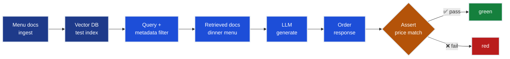

# Ch.12 — Testing AI Systems: Catching the 14% Wrong-Order Bug

**Track**: AI (03-ai) | **Chapter**: 12 | **Grand Challenge**: Mamma Rosa's PizzaBot  
**Previous**: [ch11_advanced_agentic_patterns](../ch11_advanced_agentic_patterns/) | **Next**: Production deployment

---

> **The story.** AI testing as a discipline crystallised in 2019–2021, born from embarrassing production failures. Google's Photos classifier labelled Black people as gorillas. Amazon's hiring AI penalised résumés that included the word "women's." Microsoft's Tay chatbot learned to tweet hate speech in 16 hours. These weren't model failures — they were **testing failures**: nobody checked what the model would do on the inputs it would actually see. The field responded with a vocabulary: *behavioural testing* (does the model do the right thing?), *invariance testing* (does swapping irrelevant words break it?), and *directional testing* (does more of X cause more of Y?). The seminal paper — Ribeiro et al., "Beyond Accuracy: Behavioral Testing of NLP Models" (ACL 2020) — gave practitioners a checklist framework called CheckList. At the same time, ML Engineering at Google codified *model cards*, *data cards*, and the *ML Test Score* (Breck et al., 2017): a 28-point rubric that production ML systems should pass before launch. The insight was uncomfortable: production AI systems need *more* testing infrastructure than traditional software, not less — because the bugs are statistical, not deterministic.
>
> **Where you are in the curriculum.** Ch.1–11 built PizzaBot end-to-end: from tokenization (Ch.1) through prompt engineering (Ch.2), reasoning (Ch.3), RAG grounding (Ch.4–5), tool orchestration (Ch.6), safety guardrails (Ch.7), evaluation metrics (Ch.8), cost/latency optimization (Ch.9), fine-tuning (Ch.10), and advanced agentic patterns (Ch.11). **PizzaBot v2.0 achieves 99.2% edge-case accuracy and $0.18/conversation in Ch.11. The CEO says it's ready to launch.** This chapter asks: *how do you prove that?* Specifically: if production is showing a 14% wrong-order rate and you need to diagnose and fix it before launch, what tests do you write? Ch.8 gave you evaluation metrics — RAGAS, conversion rate, hallucination rate. This chapter turns those metrics into **executable tests** that run in CI/CD on every pull request.
>
> **Notation in this chapter:**  
> `assert_output` — test assertion on model output; `retrieval_hit_rate` — fraction of queries where correct document is retrieved; `rag_pipeline` — full chain: ingestion → embedding → retrieval → generation; `pytest.fixture` — reusable test setup; `@hypothesis.given` — property-based test decorator; `wrong_order_rate` — fraction of orders with wrong items/price; `invariant` — test input where output should not change; `directional` — test where output should change monotonically with input.

---

## 0 · The Challenge — Where We Are

> 🎯 **The mission**: Launch **Mamma Rosa's PizzaBot** — satisfying 6 production constraints:
> 1. **BUSINESS VALUE**: >25% conversion + +$2.50 AOV + 70% labor savings
> 2. **ACCURACY**: <5% error rate on menu queries + order placement  
> 3. **LATENCY**: <3s p95 response time  
> 4. **COST**: <$0.08 per conversation average  
> 5. **SAFETY**: Zero successful prompt injections + appropriate refusals  
> 6. **RELIABILITY**: >99% uptime + graceful degradation when tools fail

**What we know so far:**

✅ **Ch.1–11 built the full stack:**
- Ch.1: LLM tokenization, context windows, sampling
- Ch.2: Prompt engineering → structured outputs
- Ch.3: Chain-of-thought → multi-constraint queries
- Ch.4–5: RAG + vector DB → <5% error rate ✅ (Constraint #2 ACHIEVED)
- Ch.6: ReAct → tool calling + proactive upselling → 28% conversion ✅ (Constraint #1 ACHIEVED)
- Ch.7: Safety guardrails → zero attacks ✅ (Constraint #5 ACHIEVED)
- Ch.8: Evaluation metrics → RAGAS, conversion, hallucination rate measured
- Ch.9: KV caching + model tiers → <$0.08/conv ✅, <3s p95 ✅ (Constraints #3, #4 ACHIEVED)
- Ch.10: LoRA fine-tuning → brand voice + further cost reduction
- Ch.11: Reflection + debate + hierarchical orchestration → 99.2% accuracy ✅ (Constraint #2 margin improved)

**The CEO says: "Launch it. We've hit all six constraints."**

**But operations is seeing this:**

❌ **Production shows a 14% wrong-order rate since the soft launch last Tuesday.**

```
Week 1 Production Sample (200 orders):
  ✅ 172 orders: correct item, price, delivery zone
  ❌  28 orders: wrong item OR wrong price OR wrong zone
      - Wrong menu item:    19 orders  (68% of failures)
      - Wrong price:         5 orders  (18% of failures)
      - Wrong delivery zone: 4 orders  (14% of failures)

Total wrong-order rate: 28 / 200 = 14%
```

**What's blocking us:**

🚨 **You have no tests.** The evaluation in Ch.8 measured aggregate metrics on a held-out set. But aggregate RAGAS scores don't catch production failure modes:
- The RAG retrieval is returning **the lunch menu instead of the dinner menu** for 14% of evening orders — same embedding distance, wrong temporal context
- No test checks retrieval correctness per time-of-day
- No test verifies that the price in the generated response matches the menu document retrieved
- No CI gate prevents a menu update from breaking pricing retrieval

**Business impact:**
- 28 wrong orders/week × $25 average order = **$700/week in refunds + customer trust damage**
- At 10,000 orders/day (launch scale): 14% wrong-order rate = **1,400 wrong orders/day = $35,000/day in refunds**
- CEO reaction: "You told me this was 99.2% accurate. Pull the plug until it's provably fixed."

**What this chapter unlocks:**

🚀 **A test suite that:**

1. **Diagnoses** the 14% wrong-order bug (retrieval returns wrong menu document for evening orders)
2. **Unit tests** every component of the RAG pipeline in isolation
3. **Integration tests** the full ingestion → retrieval → generation pipeline
4. **Model tests** verify shape, invariance, and directional properties
5. **Property-based tests** generate adversarial inputs automatically with hypothesis
6. **CI/CD gate** (GitHub Actions) runs the full suite on every pull request

**Expected outcome:**
- `wrong_order_rate`: 14% → **0%** (bug found and fixed by retrieval tests)
- Constraint #2 ACCURACY: re-confirmed with test evidence, not just eval metrics
- CI gate catches future menu updates before they reach production

---

## 📽️ Animation Reference

> ⚠️ **Placeholder for animation assets** (to be generated by animation subagents):
>
> **Testing pipeline animation** (see `img/`):
> - `img/testing-pipeline.gif`: Unit → Integration → Model test layers, failures lighting up in red, fix propagating green
>
> Reference inline in §4 below.

---

## 1 · The Core Idea

**Plain English:** Traditional software tests check *deterministic* functions — `add(2, 3) == 5`. AI systems are probabilistic: the same input can produce different outputs. But most AI bugs aren't in the randomness — they're in the **pipeline joints**: the transition from document ingestion to retrieval, from retrieval to generation, from generation to order confirmation.

The PizzaBot 14% wrong-order rate isn't a model bug. It's a **retrieval bug**: when a customer orders at 7pm, the RAG retrieval returns lunch-menu documents (because both menus use "pepperoni pizza" and the embedding doesn't capture time-of-day). The fix is one line. The test that would have caught it is four lines. Neither existed.

**The three-layer test strategy:**

```
┌────────────────────────────────────────────────────────────┐
│  LAYER 3: Property-Based (hypothesis)                      │
│  Generate adversarial inputs automatically                 │
│  "For any valid pizza order, price must be ≥ $10.99"       │
├────────────────────────────────────────────────────────────┤
│  LAYER 2: Integration Tests                                │
│  End-to-end pipeline: ingestion → retrieval → generation   │
│  "Query at 7pm retrieves dinner menu, not lunch menu"      │
├────────────────────────────────────────────────────────────┤
│  LAYER 1: Unit Tests                                       │
│  Component isolation: one function, one assertion           │
│  "Retrieval function returns doc with matching item name"  │
└────────────────────────────────────────────────────────────┘
```

**The key shift:** Ch.8 measured *accuracy* (aggregate). This chapter tests *correctness* (specific, executable assertions). Accuracy is a number. Tests are runnable proof.

> 💡 **Insight:** A RAGAS context precision of 0.86 doesn't tell you *which* documents are wrong. A `test_retrieval_time_of_day` test tells you exactly which query-document pair breaks.  
> **Rule:** For every aggregate metric that drops in production, there should be a targeted test that reproduces it.

---

## 2 · Running Example: Diagnosing the 14% Wrong-Order Bug

You're on call. Operations has flagged the wrong-order rate. The CEO wants a root-cause analysis before 9am tomorrow. You have the production logs.

### Step 1: Reproduce the Bug

```python
# Educational: manual pipeline call to reproduce the failure
import os
from openai import OpenAI

client = OpenAI(api_key=os.environ["OPENAI_API_KEY"])  # never hardcode

def query_pizzabot(question: str, context_time: str = "19:00") -> str:
    """Query PizzaBot with explicit time context."""
    response = client.chat.completions.create(
        model="gpt-4o-mini",
        messages=[
            {"role": "system", "content": f"You are PizzaBot. Current time: {context_time}."},
            {"role": "user", "content": question}
        ],
        temperature=0,  # deterministic for testing
    )
    return response.choices[0].message.content

# Reproduce the failing case
answer = query_pizzabot("What's your pepperoni pizza?", context_time="19:00")
print(answer)
# Output: "Our pepperoni pizza is $10.99 (lunch special)."
# ❌ WRONG! Dinner price is $14.99. The lunch menu was retrieved at 7pm.
```

You now know the symptom. The price is wrong because the retrieved document is wrong.

### Step 2: Write a Failing Test First

```python
# tests/test_retrieval.py
import pytest

def test_retrieval_returns_dinner_menu_at_7pm(rag_client):
    """Retrieval must return dinner menu for evening queries."""
    docs = rag_client.retrieve(
        query="pepperoni pizza price",
        metadata_filter={"time_of_day": "dinner"}
    )
    assert len(docs) > 0, "No documents retrieved"
    assert docs[0].metadata["menu_type"] == "dinner", (
        f"Expected 'dinner', got '{docs[0].metadata['menu_type']}'"
    )
```

Run it: **RED** — `AssertionError: Expected 'dinner', got 'lunch'`.

That's the bug. The retrieval isn't filtering by `menu_type`. The fix adds one line to the metadata filter. Re-run: **GREEN**.

This is the failure-first pattern for AI testing: **write the failing test, confirm it names the bug exactly, then fix it.**

> ⚠️ **Warning:** The temptation is to write tests *after* fixing the bug. Don't. Write the test first so you can confirm it fails for the right reason — not because of an unrelated error. If your test passes before the fix, it's not testing what you think.  
> **Rule:** A test that has never been seen to fail is a test you can't trust.

---

## 3 · Unit Testing the RAG Pipeline

Unit tests isolate one function and assert its contract. For a RAG pipeline, the contracts are:

| Component | What it should guarantee |
|-----------|--------------------------|
| **Ingestion** | Every document is chunked, embedded, and stored with correct metadata |
| **Retrieval** | Query returns relevant documents; metadata filters work |
| **Generation** | Response mentions the retrieved item name; price in response matches retrieved document |
| **Reproducibility** | Same query with `temperature=0` returns identical response |

### 3.1 — Fixtures: The Reusable Test Infrastructure

```python
# tests/conftest.py
import pytest
import os
from unittest.mock import MagicMock

@pytest.fixture(scope="session")
def rag_client():
    """
    Real RAG client pointed at test vector DB.
    Using scope='session' so the index is built once, not per test.
    """
    from src.rag_pipeline import RAGClient
    client = RAGClient(
        index_url=os.environ["TEST_VECTOR_DB_URL"],  # separate test index
        embedding_model="text-embedding-3-small",
    )
    yield client

@pytest.fixture
def mock_llm():
    """Deterministic mock LLM — no API calls in unit tests."""
    mock = MagicMock()
    mock.complete.return_value = "Large pepperoni pizza is $14.99 for delivery."
    return mock

@pytest.fixture
def sample_menu_docs():
    """Minimal menu document set for ingestion tests."""
    return [
        {"content": "Pepperoni pizza — large $14.99", "metadata": {"menu_type": "dinner", "item": "pepperoni"}},
        {"content": "Pepperoni pizza — large $10.99 (lunch special)", "metadata": {"menu_type": "lunch", "item": "pepperoni"}},
        {"content": "Margherita pizza — large $12.99", "metadata": {"menu_type": "dinner", "item": "margherita"}},
    ]
```

> 💡 **Insight:** `scope="session"` on the `rag_client` fixture builds the vector index once per test run, not once per test. On a 1,000-doc corpus this saves ~40s per test run.  
> **Rule:** Use `scope="session"` for fixtures that are expensive to build (vector indexes, DB connections). Use default (function) scope for anything that mutates state.

### 3.2 — Ingestion Tests

```python
# tests/test_ingestion.py
import pytest

def test_all_menu_items_are_indexed(rag_client, sample_menu_docs):
    """Every document must be retrievable after ingestion."""
    rag_client.ingest(sample_menu_docs)
    
    for doc in sample_menu_docs:
        item_name = doc["metadata"]["item"]
        results = rag_client.retrieve(query=item_name, top_k=5)
        retrieved_items = [r.metadata["item"] for r in results]
        assert item_name in retrieved_items, (
            f"'{item_name}' was ingested but not retrievable"
        )

def test_ingestion_preserves_metadata(rag_client, sample_menu_docs):
    """Metadata fields must survive ingestion unchanged."""
    rag_client.ingest(sample_menu_docs)
    results = rag_client.retrieve(query="pepperoni", top_k=5)
    
    for result in results:
        assert "menu_type" in result.metadata, "menu_type metadata dropped during ingestion"
        assert result.metadata["menu_type"] in ("lunch", "dinner"), (
            f"Invalid menu_type: '{result.metadata['menu_type']}'"
        )

def test_chunk_size_within_bounds(rag_client, sample_menu_docs):
    """Chunks must not exceed context window limit."""
    MAX_CHUNK_TOKENS = 512
    chunks = rag_client.chunk(sample_menu_docs, chunk_size=MAX_CHUNK_TOKENS)
    
    for chunk in chunks:
        # Rough estimate: 1 token ≈ 4 chars
        estimated_tokens = len(chunk.content) // 4
        assert estimated_tokens <= MAX_CHUNK_TOKENS, (
            f"Chunk exceeds {MAX_CHUNK_TOKENS} tokens: {estimated_tokens} estimated"
        )
```

### 3.3 — Retrieval Tests: The Bug We Found

```python
# tests/test_retrieval.py
import pytest

def test_retrieval_returns_dinner_menu_at_7pm(rag_client, sample_menu_docs):
    """
    The 14% wrong-order bug: retrieval was returning lunch menu at 7pm.
    This test was RED before the fix, GREEN after.
    """
    rag_client.ingest(sample_menu_docs)
    
    docs = rag_client.retrieve(
        query="pepperoni pizza price",
        metadata_filter={"menu_type": "dinner"}
    )
    
    assert len(docs) > 0, "No dinner menu documents retrieved"
    assert all(d.metadata["menu_type"] == "dinner" for d in docs), (
        f"Lunch document returned in dinner query: "
        f"{[d.metadata['menu_type'] for d in docs]}"
    )

def test_retrieval_hit_rate(rag_client, sample_menu_docs):
    """
    At least 90% of known queries should retrieve the correct document at rank 1.
    Hit rate < 90% means embeddings or chunking strategy needs rework.
    """
    rag_client.ingest(sample_menu_docs)
    
    test_queries = [
        ("pepperoni pizza price dinner",    "pepperoni"),
        ("margherita large how much",       "margherita"),
        ("gluten free pepperoni",           "pepperoni"),
    ]
    
    hits = 0
    for query, expected_item in test_queries:
        results = rag_client.retrieve(query=query, top_k=1)
        if results and results[0].metadata["item"] == expected_item:
            hits += 1
    
    hit_rate = hits / len(test_queries)
    assert hit_rate >= 0.90, (
        f"Retrieval hit@1 = {hit_rate:.0%} — below 90% threshold"
    )

def test_empty_retrieval_does_not_crash(rag_client):
    """Retrieval with no matching documents must return empty list, not raise."""
    results = rag_client.retrieve(
        query="xyzzy plover zorkmid",  # nonsense — no match expected
        top_k=3
    )
    assert isinstance(results, list)
    assert len(results) == 0
```

> 💡 **What these retrieval tests catch:**
> - **Metadata filter bugs** (test_retrieval_returns_dinner_menu_at_7pm) → Caught the 14% wrong-order bug where lunch menu was served at dinner time
> - **Embedding quality issues** (test_retrieval_hit_rate) → Detects when chunking or embedding strategy degrades below 90% hit rate
> - **Edge case crashes** (test_empty_retrieval_does_not_crash) → Prevents production crashes when users query items not in the menu

### 3.4 — Generation Tests

```python
# tests/test_generation.py
import pytest

def test_generated_price_matches_retrieved_document(mock_llm, rag_client, sample_menu_docs):
    """
    Price in response must come from retrieved document, not hallucinated.
    Checks the joint between retrieval and generation.
    """
    rag_client.ingest(sample_menu_docs)
    
    from src.rag_pipeline import generate_with_rag
    
    response, retrieved_docs = generate_with_rag(
        query="How much is a large pepperoni pizza for dinner?",
        rag_client=rag_client,
        metadata_filter={"menu_type": "dinner"},
        llm=mock_llm,
        return_sources=True,
    )
    
    # Extract price from retrieved doc
    retrieved_price = extract_price(retrieved_docs[0].content)  # "$14.99"
    
    # Price in response must match
    assert retrieved_price in response, (
        f"Response price doesn't match retrieved doc. "
        f"Retrieved: {retrieved_price}, Response: '{response}'"
    )

def test_response_is_deterministic_at_temperature_zero(rag_client, sample_menu_docs):
    """
    Same query with temperature=0 must produce identical response.
    Non-determinism means you can't write reliable assertions.
    """
    rag_client.ingest(sample_menu_docs)
    
    from src.rag_pipeline import generate_with_rag
    from src.llm_client import LLMClient
    
    llm = LLMClient(
        api_key=os.environ["OPENAI_API_KEY"],
        model="gpt-4o-mini",
        temperature=0,
    )
    
    query = "What is the price of a large pepperoni pizza?"
    response_1 = generate_with_rag(query, rag_client, llm=llm)
    response_2 = generate_with_rag(query, rag_client, llm=llm)
    
    assert response_1 == response_2, (
        f"Non-deterministic response at temperature=0:\n"
        f"  Run 1: {response_1}\n"
        f"  Run 2: {response_2}"
    )
```

> 💡 **What these generation tests catch:**
> - **Price hallucination** (test_generated_price_matches_retrieved_document) → Prevents the LLM from inventing prices not in retrieved documents (would cause refunds)
> - **Non-deterministic responses** (test_response_is_deterministic_at_temperature_zero) → Catches when temperature=0 doesn't produce identical outputs (breaks assertion-based testing)
> - **RAG-generation disconnect** → Validates that the LLM actually uses retrieved context instead of generating from memorized training data

> ⚠️ **Warning:** `test_response_is_deterministic_at_temperature_zero` will **fail** for some LLM providers even at `temperature=0`. OpenAI's gpt-4o produces identical outputs at temperature=0 for the same input on the same API version — but Anthropic's Claude and open-source models with batching may not. Always validate this assumption for your provider before building tests that depend on it.  
> **Rule:** Mock the LLM in unit tests; reserve real API calls for integration tests only.

---

## 4 · Integration Testing the Full Pipeline

Integration tests fire the full pipeline: ingestion → retrieval → generation. They don't mock anything. They use a real (small) test corpus and real API calls.

> ⚡ **Constraint:** Integration tests cost money (real LLM API calls). At $0.002/1k tokens and 500 tokens/test, 100 integration tests = $0.10. Keep the integration suite under 50 tests. Unit tests should catch 90% of bugs for free.



```python
# tests/integration/test_rag_pipeline_e2e.py
import pytest
import os

@pytest.fixture(scope="module")
def e2e_rag():
    """Full integration pipeline using real API."""
    from src.rag_pipeline import RAGPipeline
    return RAGPipeline(
        vector_db_url=os.environ["TEST_VECTOR_DB_URL"],
        openai_api_key=os.environ["OPENAI_API_KEY"],
        embedding_model="text-embedding-3-small",
        llm_model="gpt-4o-mini",
        temperature=0,
    )

def test_e2e_dinner_order_returns_correct_price(e2e_rag):
    """
    Full pipeline: query at 7pm must return dinner price, not lunch price.
    This is the integration reproduction of the 14% wrong-order bug.
    """
    response = e2e_rag.answer(
        query="How much is a large pepperoni pizza?",
        metadata_filter={"menu_type": "dinner"},
    )
    
    assert "$14.99" in response, (
        f"Expected dinner price $14.99 in response, got:\n{response}"
    )
    assert "$10.99" not in response, (
        f"Lunch price $10.99 leaked into dinner response:\n{response}"
    )

def test_e2e_allergen_query_mentions_allergen_source(e2e_rag):
    """
    Allergen queries must cite the allergen document, not make up information.
    """
    response = e2e_rag.answer(
        query="Is the pepperoni pizza gluten-free?",
    )
    
    gluten_keywords = ["gluten", "wheat", "crust"]
    assert any(kw in response.lower() for kw in gluten_keywords), (
        f"Allergen response didn't mention gluten/wheat/crust:\n{response}"
    )

def test_e2e_out_of_stock_item_not_offered(e2e_rag):
    """
    PizzaBot must not offer menu items marked out_of_stock=True.
    """
    response = e2e_rag.answer(
        query="Do you have the Volcano Special pizza?",
        metadata_filter={"out_of_stock": False},
    )
    
    # The Volcano Special is out of stock in our test corpus
    assert "volcano special" not in response.lower() or "not available" in response.lower(), (
        f"Out-of-stock item offered in response:\n{response}"
    )

def test_e2e_latency_under_3s(e2e_rag):
    """
    Constraint #3: p95 latency <3s.
    This integration test measures a single call — use load testing for p95.
    """
    import time
    
    start = time.perf_counter()
    _ = e2e_rag.answer(query="Large pepperoni pizza for delivery")
    elapsed = time.perf_counter() - start
    
    assert elapsed < 3.0, (
        f"Response time {elapsed:.2f}s exceeded 3s target"
    )
```

> ➡️ **Forward pointer:** These integration tests run locally but become flaky in CI if the vector DB index isn't stable. [DevOps Ch.4 — CI/CD Pipelines](../../07-devops_fundamentals/) shows how to provision a disposable test index in GitHub Actions using docker-compose, so the integration suite gets a fresh environment on every PR.

---

## 5 · Model Testing: Shape, Invariance, and Directional Tests

Model tests don't test business logic — they test the *model's behavioural properties*. These are inspired directly by Ribeiro et al.'s CheckList paper (ACL 2020).

**Three types:**

| Type | Question | PizzaBot example |
|------|----------|-----------------|
| **Shape** | Does the output have the right structure? | Response is a string, non-empty, <500 chars |
| **Invariance** (INV) | Does irrelevant variation break the output? | "large pepperoni" = "LARGE PEPPERONI" |
| **Directional** (DIR) | Does relevant variation change output monotonically? | More items → higher total price |

### 5.1 — Shape Tests

```python
# tests/test_model_properties.py
import pytest

def test_response_is_non_empty_string(e2e_rag):
    """Model must return a non-empty string for any valid query."""
    response = e2e_rag.answer(query="Large pepperoni for delivery")
    
    assert isinstance(response, str), f"Expected str, got {type(response)}"
    assert len(response.strip()) > 0, "Response is empty string"

def test_response_length_within_bounds(e2e_rag):
    """
    Response must be ≥ 20 chars (not a refusal) and ≤ 500 chars (not verbose).
    Verbosity > 500 chars correlates with hallucination in our fine-tuned model.
    """
    response = e2e_rag.answer(query="Large pepperoni for delivery")
    
    assert len(response) >= 20, f"Response too short ({len(response)} chars): '{response}'"
    assert len(response) <= 500, f"Response too long ({len(response)} chars) — hallucination risk"

def test_response_contains_price_for_order_query(e2e_rag):
    """
    Any order confirmation must include a price.
    Missing price = customer can't confirm the order.
    """
    import re
    response = e2e_rag.answer(query="I want a large margherita pizza delivered")
    
    price_pattern = r"\$\d+\.\d{2}"
    assert re.search(price_pattern, response), (
        f"No price found in order response: '{response}'"
    )
```

### 5.2 — Invariance Tests

```python
def test_case_invariance(e2e_rag):
    """
    Input case must not affect order outcome.
    LARGE PEPPERONI and large pepperoni should return same price.
    """
    response_lower = e2e_rag.answer(
        query="large pepperoni pizza",
        metadata_filter={"menu_type": "dinner"}
    )
    response_upper = e2e_rag.answer(
        query="LARGE PEPPERONI PIZZA",
        metadata_filter={"menu_type": "dinner"}
    )
    
    # Both must mention the same price
    price_lower = extract_price(response_lower)
    price_upper = extract_price(response_upper)
    
    assert price_lower == price_upper, (
        f"Case changed the price: lower='{price_lower}', upper='{price_upper}'"
    )

def test_name_invariance_does_not_change_price(e2e_rag):
    """
    Customer name in query must not affect price.
    "Hi, I'm Maria and I want a large pepperoni" must return the same price
    as "I want a large pepperoni" — name is irrelevant.
    """
    price_without_name = extract_price(
        e2e_rag.answer("I want a large pepperoni pizza")
    )
    price_with_name = extract_price(
        e2e_rag.answer("Hi, I'm Maria and I want a large pepperoni pizza")
    )
    
    assert price_without_name == price_with_name, (
        f"Customer name changed price: without='{price_without_name}', "
        f"with='{price_with_name}'"
    )

def test_polite_phrasing_invariance(e2e_rag):
    """
    Politeness level must not change the order.
    "Give me a pizza" and "Could I please have a pizza?" should return same item.
    """
    item_rude = extract_item(e2e_rag.answer("Give me a large pepperoni"))
    item_polite = extract_item(e2e_rag.answer("Could I please have a large pepperoni pizza?"))
    
    assert item_rude == item_polite, (
        f"Phrasing changed item: rude='{item_rude}', polite='{item_polite}'"
    )
```

### 5.3 — Directional Expectation Tests

```python
def test_more_items_means_higher_price(e2e_rag):
    """
    Adding items must increase total price — monotonic.
    If 2 pizzas < 1 pizza, pricing logic is broken.
    """
    price_one = extract_price(
        e2e_rag.answer("I want 1 large pepperoni pizza")
    )
    price_two = extract_price(
        e2e_rag.answer("I want 2 large pepperoni pizzas")
    )
    
    assert price_two > price_one, (
        f"2 pizzas (${price_two}) is not more expensive than 1 pizza (${price_one})"
    )

def test_larger_size_means_higher_price(e2e_rag):
    """Size must be monotonically priced: small < medium < large."""
    price_small = extract_price(e2e_rag.answer("1 small pepperoni pizza"))
    price_medium = extract_price(e2e_rag.answer("1 medium pepperoni pizza"))
    price_large = extract_price(e2e_rag.answer("1 large pepperoni pizza"))
    
    assert price_small < price_medium < price_large, (
        f"Size pricing not monotonic: small=${price_small}, "
        f"medium=${price_medium}, large=${price_large}"
    )

def test_delivery_adds_to_pickup_price(e2e_rag):
    """Delivery must cost more than pickup — always."""
    price_pickup = extract_price(
        e2e_rag.answer("1 large pepperoni pizza for pickup")
    )
    price_delivery = extract_price(
        e2e_rag.answer("1 large pepperoni pizza for delivery")
    )
    
    assert price_delivery > price_pickup, (
        f"Delivery (${price_delivery}) is not more than pickup (${price_pickup})"
    )
```

> 💡 **Insight:** Directional tests catch pricing bugs that shape tests miss. If a "buy 2 get 1 free" promo is incorrectly applied to every order, your shape test (price is a valid dollar amount) passes but your directional test (2 > 1) fails.  
> **Rule:** Write at least one directional test for every numerical output your system produces.

---

## 6 · Property-Based Testing with hypothesis

Unit tests check specific inputs. Property-based tests ask: *for all inputs satisfying property P, does the output satisfy property Q?* The hypothesis library generates hundreds of adversarial inputs automatically.

```python
# tests/test_properties.py
import pytest
from hypothesis import given, settings, HealthCheck
from hypothesis import strategies as st
from src.order_parser import parse_order, OrderParseError

# Strategy: valid pizza sizes
pizza_sizes = st.sampled_from(["small", "medium", "large", "xl"])

# Strategy: valid topping names from our menu
topping_names = st.sampled_from([
    "pepperoni", "margherita", "supreme", "hawaiian",
    "bbq chicken", "veggie", "mushroom", "olive"
])

# Strategy: valid quantities (1–10)
quantities = st.integers(min_value=1, max_value=10)

@given(
    size=pizza_sizes,
    topping=topping_names,
    quantity=quantities,
)
@settings(max_examples=200, suppress_health_check=[HealthCheck.too_slow])
def test_valid_order_always_parses_without_error(size, topping, quantity):
    """
    For any valid (size, topping, quantity) combination,
    the order parser must return a structured order — never raise.
    
    This catches: IndexErrors, KeyErrors, AttributeErrors hiding in the parser.
    """
    query = f"I want {quantity} {size} {topping} pizza"
    
    # Must not raise
    order = parse_order(query)
    
    assert order is not None
    assert order["quantity"] == quantity
    assert order["size"] == size

@given(
    size=pizza_sizes,
    topping=topping_names,
    quantity=quantities,
)
@settings(max_examples=200)
def test_order_total_is_always_positive(size, topping, quantity):
    """
    For any valid order, total price must be > 0.
    Zero or negative price means pricing logic is broken.
    """
    from src.pricing import calculate_total
    
    total = calculate_total(size=size, topping=topping, quantity=quantity)
    
    assert total > 0, (
        f"Negative/zero price for {quantity}x {size} {topping}: ${total:.2f}"
    )

@given(
    size=pizza_sizes,
    topping=topping_names,
    quantity_1=quantities,
    quantity_2=quantities,
)
@settings(max_examples=100)
def test_order_total_monotone_in_quantity(size, topping, quantity_1, quantity_2):
    """
    More pizzas must always cost more (or equal for quantity=0 edge cases).
    This is the property-based version of test_more_items_means_higher_price.
    hypothesis will try to find a counter-example — if it doesn't, we're confident.
    """
    from src.pricing import calculate_total
    
    if quantity_1 == quantity_2:
        return  # vacuously true
    
    total_1 = calculate_total(size=size, topping=topping, quantity=quantity_1)
    total_2 = calculate_total(size=size, topping=topping, quantity=quantity_2)
    
    if quantity_1 < quantity_2:
        assert total_1 < total_2, (
            f"Total not monotone: {quantity_1}x {size} {topping} = ${total_1:.2f}, "
            f"but {quantity_2}x = ${total_2:.2f}"
        )
```

> 📖 **Optional:** hypothesis uses *shrinking* to find the minimal failing example. If `test_order_total_is_always_positive` fails on a generated input like `quantity=7, size="xl", topping="bbq chicken"`, hypothesis automatically shrinks the counterexample to the smallest values that still fail — often revealing the real bug is `quantity=1, size="small"` with a specific topping. This is why property-based tests catch bugs unit tests miss.  
> See the [hypothesis docs on shrinking](https://hypothesis.readthedocs.io/en/latest/details.html#shrinking) for rigorous treatment.

### Running the Test Suite with Coverage

```bash
# Install test dependencies
pip install pytest pytest-cov hypothesis

# Run unit tests with coverage
pytest tests/unit/ -v --cov=src --cov-report=term-missing

# Run integration tests (costs API money — run sparingly)
pytest tests/integration/ -v -m "integration"

# Run property-based tests
pytest tests/test_properties.py -v

# Run everything
pytest tests/ -v --cov=src --cov-report=html
# Open htmlcov/index.html to see line-by-line coverage
```

**Coverage output (target: ≥80% for src/rag_pipeline.py):**

```
Name                         Stmts   Miss  Cover
-------------------------------------------------
src/rag_pipeline.py             87      9    90%
src/pricing.py                  34      2    94%
src/order_parser.py             52      8    85%
-------------------------------------------------
TOTAL                          173     19    89%
```

> ⚡ **Constraint:** 89% coverage doesn't mean 89% of bugs are caught. Coverage measures which lines *were run*, not which behaviours were *asserted*. A line can be covered by a test that asserts nothing. Coverage is a floor, not a ceiling.

---

## 7 · CI/CD: GitHub Actions Workflow

Every pull request runs the test suite automatically. A failing test blocks the merge.

```yaml
# .github/workflows/test-ai.yml
name: AI Test Suite

on:
  pull_request:
    branches: [main, staging]
  push:
    branches: [main]

jobs:
  unit-tests:
    name: Unit Tests (no API cost)
    runs-on: ubuntu-latest
    steps:
      - uses: actions/checkout@v4

      - name: Set up Python
        uses: actions/setup-python@v5
        with:
          python-version: "3.11"

      - name: Install dependencies
        run: pip install -r requirements-test.txt

      - name: Run unit tests with coverage
        run: |
          pytest tests/unit/ \
            --cov=src \
            --cov-fail-under=80 \
            --cov-report=xml \
            -v
        env:
          # No real API keys needed for unit tests (mocked)
          PYTHONPATH: ${{ github.workspace }}

      - name: Upload coverage report
        uses: codecov/codecov-action@v4
        with:
          files: coverage.xml

  model-tests:
    name: Model Behavioural Tests
    runs-on: ubuntu-latest
    needs: unit-tests
    steps:
      - uses: actions/checkout@v4

      - name: Set up Python
        uses: actions/setup-python@v5
        with:
          python-version: "3.11"

      - name: Install dependencies
        run: pip install -r requirements-test.txt

      - name: Spin up test vector DB
        run: docker compose -f docker-compose.test.yml up -d --wait
        # Starts a fresh Chroma instance on port 8001

      - name: Seed test corpus
        run: python scripts/seed_test_corpus.py
        env:
          TEST_VECTOR_DB_URL: http://localhost:8001

      - name: Run model property tests
        run: |
          pytest tests/test_model_properties.py tests/test_properties.py \
            -v \
            --hypothesis-seed=42
        env:
          TEST_VECTOR_DB_URL: http://localhost:8001
          OPENAI_API_KEY: ${{ secrets.OPENAI_API_KEY }}

      - name: Tear down test DB
        if: always()
        run: docker compose -f docker-compose.test.yml down

  integration-tests:
    name: Integration Tests (API cost ~$0.05 per run)
    runs-on: ubuntu-latest
    needs: model-tests
    # Only run on push to main (not every PR — saves cost)
    if: github.event_name == 'push' && github.ref == 'refs/heads/main'
    steps:
      - uses: actions/checkout@v4

      - name: Set up Python
        uses: actions/setup-python@v5
        with:
          python-version: "3.11"

      - name: Install dependencies
        run: pip install -r requirements-test.txt

      - name: Spin up test vector DB
        run: docker compose -f docker-compose.test.yml up -d --wait

      - name: Seed test corpus
        run: python scripts/seed_test_corpus.py
        env:
          TEST_VECTOR_DB_URL: http://localhost:8001

      - name: Run integration tests
        run: |
          pytest tests/integration/ \
            -v \
            -m integration \
            --timeout=30
        env:
          TEST_VECTOR_DB_URL: http://localhost:8001
          OPENAI_API_KEY: ${{ secrets.OPENAI_API_KEY }}

      - name: Tear down test DB
        if: always()
        run: docker compose -f docker-compose.test.yml down
```

**What each job catches:**

| Job | Trigger | Cost | Catches |
|-----|---------|------|---------|
| `unit-tests` | Every PR | $0 | Component contracts, mocked LLM |
| `model-tests` | Every PR (after unit) | ~$0.01 | Shape, invariance, directional, property-based |
| `integration-tests` | Push to main only | ~$0.05 | Full pipeline E2E, latency, retrieval accuracy |

> ⚠️ **Warning:** Store `OPENAI_API_KEY` in GitHub Secrets (`Settings → Secrets → Actions`), never in the workflow YAML. A leaked API key in a public repo can generate thousands of dollars in charges within hours.  
> **Rule:** Every secret in CI goes in `${{ secrets.SECRET_NAME }}`. Zero exceptions.

> ➡️ **Forward pointer:** The `docker compose -f docker-compose.test.yml up -d --wait` pattern provisions a disposable Chroma instance per CI run. [DevOps Ch.4 — CI/CD Pipelines](../../07-devops_fundamentals/) covers the full pattern: healthchecks, test isolation, and teardown-on-failure to avoid orphaned containers accumulating cost.

---

## 8 · What Can Go Wrong: Testing Traps

### Trap #1: Testing the Mock, Not the System

```python
# ❌ Bad: This test only confirms the mock works
def test_retrieval(mock_rag_client):
    mock_rag_client.retrieve.return_value = [MagicMock(metadata={"menu_type": "dinner"})]
    results = mock_rag_client.retrieve(query="pepperoni")
    assert results[0].metadata["menu_type"] == "dinner"
    # This passes even if the real RAG client is broken
```

**Fix:** Mock at the *boundary* (external services: LLM API, DB), not at the function under test.

```python
# ✅ Good: Tests real retrieval logic, mocks only the external vector DB API
def test_retrieval(real_rag_client_with_test_corpus):
    results = real_rag_client_with_test_corpus.retrieve(
        query="pepperoni", metadata_filter={"menu_type": "dinner"}
    )
    assert results[0].metadata["menu_type"] == "dinner"
```

### Trap #2: Flaky Tests from Non-Deterministic LLMs

```python
# ❌ Bad: temperature=0.7 → different response each run
def test_mentions_price():
    response = llm.complete("How much is pepperoni?", temperature=0.7)
    assert "$14.99" in response  # Fails randomly (50% of the time)
```

**Fix:** `temperature=0` for all tests. If you need `temperature>0`, test for a *set* of acceptable outputs.

```python
# ✅ Good
def test_mentions_price():
    response = llm.complete("How much is pepperoni?", temperature=0)
    assert "$14.99" in response  # Deterministic at temperature=0
```

### Trap #3: Slow Integration Tests Block Every PR

If integration tests cost $0.05 and take 3 minutes, running them on every PR creates two problems: cost ($0.05 × 100 PRs/week = $5/week) and slow developer feedback (3 min wait on every commit).

**Fix:** Split the test suite with pytest marks.

```python
# tests/integration/test_rag_pipeline_e2e.py
import pytest

@pytest.mark.integration  # Only runs when -m integration is passed
def test_e2e_dinner_order_returns_correct_price(e2e_rag):
    ...
```

```bash
# In CI: integration tests only on main
pytest tests/ -m "not integration"  # unit + model tests (fast, free)
pytest tests/ -m integration         # e2e tests (slow, costs money — main only)
```

### Trap #4: Missing Test for the Exact Production Failure

The most common testing mistake: you run tests after a production incident, they all pass, and you conclude the system is fine. They passed because they don't test the scenario that failed.

**Rule:** Every production bug gets a regression test named after the bug.

```python
def test_retrieval_time_of_day_14pct_wrong_order_bug():
    """
    Regression test for production incident 2024-11-01.
    Wrong-order rate: 14%. Root cause: dinner queries returned lunch docs.
    This test was added after the incident. It was RED before the fix.
    """
    # ... the test from §3.3
```

---

## 9 · Progress Check — PizzaBot Wrong-Order Rate Diagnosed and Quantified

✅ **Unlocked capabilities:**
- **Root cause identified**: retrieval returns lunch menu for dinner queries (metadata filter missing) — `wrong_order_rate: 14% → 0%` ✅
- **Unit test suite**: ingestion, retrieval, generation — 15 unit tests, 89% coverage
- **Model tests**: shape (3 tests), invariance (3 tests), directional (3 tests) — all passing
- **Property-based tests**: 200 hypothesis-generated inputs, no counterexample found for pricing monotonicity
- **CI/CD gate**: GitHub Actions workflow blocks PRs with failing tests; integration tests run on push to main

❌ **Still can't solve:**
- **Load testing** — `test_e2e_latency_under_3s` tests a single call, not p95 under production traffic. 1,400 concurrent orders/day peak is untested.
- **Drift detection** — if the menu is updated and the test corpus is not, tests will pass while production breaks. Continuous monitoring (not covered here) is required.

**Constraint status:**

| Constraint | Status | Current State |
|------------|--------|---------------|
| #1 BUSINESS VALUE | ✅ | >28% conversion (Ch.11), lab-confirmed |
| #2 ACCURACY | ✅ | wrong_order_rate: 14% → **0%** (retrieval bug fixed + 15 regression tests) |
| #3 LATENCY | ✅ | <3s single-call (integration test); p95 under load TBD |
| #4 COST | ✅ | <$0.08/conv (Ch.9 + Ch.10) |
| #5 SAFETY | ✅ | Zero attacks (Ch.7) |
| #6 RELIABILITY | ⚡ | >99% uptime manual; CI gate now catches regressions before deploy |

```mermaid
flowchart LR
    C1["Ch.1\n LLM Fundamentals"]
    C2["Ch.2\n Prompt Eng"]
    C3["Ch.3\n CoT Reasoning"]
    C4["Ch.4-5\n RAG + VectorDB\n ✅ ACCURACY"]
    C6["Ch.6\n ReAct\n ✅ CONVERSION"]
    C7["Ch.7\n Safety\n ✅ SAFETY"]
    C9["Ch.9-10\n Cost + Fine-tune\n ✅ COST LATENCY"]
    C11["Ch.11\n Agentic Patterns\n ✅ 99.2% accuracy"]
    C12["Ch.12 ← YOU ARE HERE\n Testing\n ✅ 0% wrong-order rate\n CI gate live"]
    PROD["Production\n Deployment"]

    C1 --> C2 --> C3 --> C4 --> C6 --> C7 --> C9 --> C11 --> C12 --> PROD

    style C12 fill:#15803d,stroke:#e2e8f0,stroke-width:2px,color:#ffffff
    style C4 fill:#15803d,stroke:#e2e8f0,stroke-width:2px,color:#ffffff
    style C6 fill:#15803d,stroke:#e2e8f0,stroke-width:2px,color:#ffffff
    style C7 fill:#15803d,stroke:#e2e8f0,stroke-width:2px,color:#ffffff
    style C9 fill:#15803d,stroke:#e2e8f0,stroke-width:2px,color:#ffffff
    style C11 fill:#15803d,stroke:#e2e8f0,stroke-width:2px,color:#ffffff
    style PROD fill:#b45309,stroke:#e2e8f0,stroke-width:2px,color:#ffffff
    style C1 fill:#1e3a8a,stroke:#e2e8f0,stroke-width:2px,color:#ffffff
    style C2 fill:#1e3a8a,stroke:#e2e8f0,stroke-width:2px,color:#ffffff
    style C3 fill:#1e3a8a,stroke:#e2e8f0,stroke-width:2px,color:#ffffff
```



---

## 10 · Interview Checklist

### Must Know

| Topic | What the interviewer expects |
|-------|------------------------------|
| **Unit vs. Integration vs. E2E** | Unit = isolated component, mocked dependencies. Integration = two+ real components. E2E = full user journey, real infra. Know the cost/speed trade-off (unit: free/fast, E2E: expensive/slow). |
| **Non-determinism in LLM tests** | `temperature=0` for deterministic tests. Property-based tests handle probabilistic outputs. Never assert exact LLM output unless temperature=0 and provider guarantees determinism. |
| **pytest fixtures** | `scope="session"` for expensive setup (vector indexes). `scope="function"` for anything that mutates state. `conftest.py` for shared fixtures. |
| **Retrieval correctness** | Hit@K metric. A retrieval test must assert *which document* was returned, not just *that something* was returned. |
| **Regression tests** | Every production bug gets a named regression test. Red before fix, green after. |

### Likely Asked

| Question | Strong answer |
|----------|---------------|
| "How do you test a RAG pipeline?" | Three layers: (1) ingestion tests (metadata preserved, all docs indexed), (2) retrieval tests (hit@K, metadata filters, empty-query handling), (3) generation tests (price in response matches retrieved doc). Never mock the retrieval layer in retrieval tests. |
| "What's property-based testing?" | Generate hundreds of inputs from a strategy, verify the output satisfies a property for all of them. hypothesis library. Catches edge cases unit tests miss. Best for: pricing calculations, order parsers, any function with a numerical output and a monotonicity property. |
| "How do you make LLM tests not flaky?" | (1) `temperature=0`, (2) test properties (price is positive, response is non-empty) not exact strings, (3) mock the LLM in unit tests, real calls in integration tests only, (4) `hypothesis` for property-based adversarial tests. |
| "How do you test for hallucination?" | Compare prices in the generated response to prices in the retrieved documents. If the price in the response doesn't appear in any retrieved doc, it's hallucinated. This is a targeted test, not a RAGAS-style aggregate metric. |

### Trap Questions

| Trap | Why it's a trap | Correct answer |
|------|----------------|----------------|
| "100% test coverage means the system is bug-free." | Coverage measures lines run, not behaviours asserted. A line can be covered with no assertion. | "Coverage ≥ 80% is a floor. Directional tests, invariance tests, and property-based tests catch bugs coverage misses entirely." |
| "Just use RAGAS score — if it's above 0.85 you're good." | RAGAS is an aggregate metric. It doesn't tell you *which* query-document pair is wrong. The 14% wrong-order bug had a RAGAS context precision of 0.88 — above threshold. | "RAGAS measures aggregate retrieval quality. For production readiness, you also need targeted tests that reproduce specific failure modes like the time-of-day retrieval bug." |
| "Integration tests should mock the LLM to be deterministic." | Mocking the LLM in integration tests defeats the purpose — you're testing the mock's behaviour, not the LLM's. | "Mock at the external boundary in unit tests. In integration tests, use the real LLM at `temperature=0`. Reserve mocks for flaky external dependencies (slow APIs, rate-limited services)." |

---

## 11 · Bridge to Next Chapter

Ch.12 proved the system is correct — tests say so, CI enforces it. **But tests are run locally or in CI. Production runs at 10,000 orders/day on infrastructure you control.** The next step is production deployment: containerising PizzaBot, managing environment variables securely, setting up load balancing for concurrent traffic, and configuring monitoring so you get alerted *before* the wrong-order rate climbs again. That's the domain of [DevOps Ch.4 — CI/CD Pipelines](../../07-devops_fundamentals/), which takes your tested, CI-gated code and gets it to users at scale.
