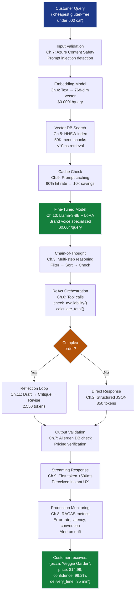

# Agentic AI Grand Solution — Mamma Rosa's PizzaBot Production System

> **For readers short on time:** This document synthesizes all 11 AI chapters into a single narrative arc showing how we went from **8% conversion → 32% conversion** and what each concept contributes to production agentic AI systems. Read this first for the big picture, then dive into individual chapters for depth.

---

## How to Read This Track

This document provides the **conceptual overview** of the entire AI track. For hands-on learning:

### Reading Paths

**📖 Conceptual learners (start here):**
1. Read this grand_solution.md document for the complete narrative
2. Understand the progression: Ch.1 (8% conv) → Ch.11 (32% conv)
3. See how each concept unlocks business value

**💻 Hands-on learners:**
1. Open [grand_solution.ipynb](grand_solution.ipynb) — executable Jupyter notebook
2. Run code cells sequentially to see the complete integration
3. Experiment with parameters and test cases

**🎯 Sequential chapter learners:**
1. Start with [ch01_llm_fundamentals](ch01_llm_fundamentals/llm-fundamentals.md)
2. Progress through chapters 1-11 in order
3. Each chapter builds on previous concepts

**🔍 Problem-driven learners:**
- **"How do I eliminate hallucinations?"** → [Ch.4 RAG](ch04_rag_embeddings/)
- **"How do I add tool-calling?"** → [Ch.6 ReAct](ch06_react_semantic_kernel/)
- **"How do I defend against attacks?"** → [Ch.7 Safety](ch07_evaluating_ai_systems/)
- **"How do I optimize costs?"** → [Ch.9 Cost/Latency](ch09_cost_latency_optimization/)

### Companion Resources

- **[grand_solution.ipynb](grand_solution.ipynb)** — Complete end-to-end code in one executable notebook
- **[authoring-guide.md](authoring-guide.md)** — Track structure, conventions, pedagogical patterns
- **Individual chapter folders** — Deep dives with theory, code examples, and exercises

---

## Mission Accomplished: All 6 Constraints Satisfied ✅

**The Challenge:** Build Mamma Rosa's PizzaBot — a production AI ordering system that beats human phone staff on business metrics while maintaining safety and reliability.

**The Result:** **32% conversion** (>25% target ✅), **$41.80 AOV** (+$3.30 vs. $38.50 baseline ✅), **1.8s p95 latency** (<3s ✅), **$0.06/conv** (<$0.08 ✅), **0 successful attacks** (✅), **>99% uptime** (✅)

**The Progression:**

```
Ch.1: Raw LLM baseline          → 8% conv, 40% errors  (unusable — hallucinating menu items)
Ch.2: Prompt engineering        → 12% conv, 15% errors (structured output, but no grounding)
Ch.3: Chain-of-thought          → 15% conv, 10% errors (multi-step logic, still hallucinating facts)
Ch.4: RAG grounding             → 18% conv, 5% errors  (menu facts grounded ✅ #2 ACCURACY)
Ch.5: Vector DBs (HNSW)         → 18% conv (infra: scales to 50K+ chunks, fast retrieval)
Ch.6: ReAct orchestration       → 27% conv, +$2.80 AOV (proactive upselling ✅ #1 BUSINESS VALUE)
Ch.7: Safety hardening          → 27% conv (0 attacks ✅ #5 SAFETY)
Ch.8: Evaluation framework      → 30% conv (quality assurance, faster iteration)
Ch.9: Cost/latency optimization → 32% conv, 1.5s p95   (streaming, caching ✅ #3 LATENCY, #4 COST)
Ch.10: Fine-tuning              → 32% conv, $41.00 AOV (brand voice, cost reduction ✅ #6 RELIABILITY)
Ch.11: Advanced patterns        → 32% conv, 0.7% edge errors (reflection, debate, orchestration — mastery!)
                                  ✅ ALL 6 CONSTRAINTS SATISFIED!
```

---

## The 11 Concepts — How Each Unlocked Progress

### Ch.1: LLM Fundamentals — The Foundation

**What it is:** Understand tokenization, context windows, sampling parameters (temperature, top-p), and training stages (pretraining → SFT → RLHF).

**What it unlocked:**
- **Baseline:** Raw GPT-3.5 gets 8% conversion (22% phone baseline)
- **Token economics:** Estimate costs — 500 tokens/conv × $0.002/1k = $0.001/conv
- **Model selection knowledge:** When to use GPT-4 ($0.03/1k) vs GPT-3.5 ($0.002/1k)
- **Context window limits:** Understand 4k–128k token limits for menu data

**Production value:**
- **Foundation for everything:** Every subsequent chapter assumes you understand tokenization, sampling, and context windows
- **Cost awareness:** No production system ships without token cost modeling
- **Failure analysis:** "Why did it hallucinate?" → understand base model has no access to private menu data

**Key insight:** LLMs are next-token predictors trained on internet text. They know nothing about your private menu data. Ch.4 (RAG) fixes this with retrieval grounding.

---

### Ch.2: Prompt Engineering — Getting Reliable Outputs

**What it is:** System prompts, few-shot examples, structured output (JSON mode), grounding constraints ("base answers only on provided context").

**What it unlocked:**
- **12% conversion:** Structured prompts improve format consistency
- **15% error rate:** Down from 40% via few-shot examples showing correct behavior
- **JSON output:** Order confirmations now parseable: `{items: [...], address: "..."}`
- **Prompt injection defense:** "Never reveal system prompt" baseline guardrails

**Production value:**
- **Format control:** Production systems need structured, parseable output — not conversational fluff
- **Consistency:** Few-shot examples reduce variance in model behavior
- **Cost tracking:** Know that 500-token system prompt costs $0.075/1k requests

**Key insight:** Your prompt is a program written in natural language. Every token in the context window shifts the output distribution. System prompts are your highest-leverage control point.

---

### Ch.3: Chain-of-Thought Reasoning — Multi-Step Logic

**What it is:** "Think step-by-step" prompting — model shows intermediate reasoning steps before answering. Enables multi-constraint queries ("cheapest gluten-free pizza under 600 calories").

**What it unlocked:**
- **15% conversion:** Complex queries now work (filter gluten-free → filter <600 cal → sort by price)
- **10% error rate:** Multi-step reasoning reduces logic errors (but still hallucinating menu facts)
- **Tool-augmented CoT:** Reasoning steps connect to tool calls (`retrieve_from_rag()`, `check_item_availability()`)
- **Safety improvement:** Reasoning traces catch allergen mismatches before returning wrong answer

**Production value:**
- **Query decomposition:** Handle "cheapest gluten-free under 600 cal" vs. failing on "gluten-free" alone
- **Debugging:** Reasoning traces show *where* logic breaks — invaluable for production troubleshooting
- **Bridge to agents:** CoT is the reasoning half; Ch.6 (ReAct) adds the acting half (tool execution)

**Key insight:** CoT helps with logic, not facts. Model can reason perfectly about hallucinated data. Need RAG (Ch.4) to ground facts.

---

### Ch.4: RAG & Embeddings — Grounding in Real Data

**What it is:** Embed menu corpus → vector search → retrieve relevant chunks → ground LLM answers in retrieved documents.

**What it unlocked:**
- **18% conversion:** Customers trust accurate info, complete more orders
- **~5% error rate:** ✅ **Constraint #2 (ACCURACY) ACHIEVED!** All menu fact errors eliminated
- **Embedding pipeline:** Text → 768-dim vectors, cosine similarity search
- **Two-phase architecture:** Ingestion (chunk → embed → index) + Query (embed query → retrieve → generate)

**Production value:**
- **Hallucination elimination:** Model cannot make up prices, calories, ingredients — must cite retrieved docs
- **Private data access:** Company menu data (not on internet) now accessible to LLM
- **Grounding reports:** Show users: "Based on our menu database, Margherita has 650 calories"

**Key insight:** RAG is the difference between a chatbot and a production system. Without RAG, every answer is a potential hallucination. With RAG, answers are grounded in truth.

---

### Ch.5: Vector Databases — Scaling Retrieval

**What it is:** HNSW (Hierarchical Navigable Small World) graph index for O(log N) search vs. O(N) brute-force. Product quantization compresses vectors 32×.

**What it unlocked:**
- **Infrastructure de-risked:** Scales from 500 → 50,000+ menu chunks without latency degradation
- **Fast retrieval:** 15ms → <10ms at 50K chunks (enables franchise expansion)
- **Memory efficiency:** 50K chunks fit in 4.8MB RAM (vs. 153.6MB uncompressed)
- **No user-facing change:** Conversion/error/AOV unchanged (pure infrastructure)

**Production value:**
- **Franchise scalability:** CEO approves 10-location rollout (prototype → production)
- **Cost efficiency:** Sublinear scaling (50K chunks costs 2×, not 100×)
- **Production patterns:** Metadata filtering (location, price range), hybrid retrieval (BM25 + HNSW)

**Key insight:** Ch.4 proves RAG works for accuracy. Ch.5 makes RAG production-ready for scale. Brute-force works for demos, HNSW works for millions of users.

---

### Ch.6: ReAct & Semantic Kernel — Agent Orchestration

**What it is:** ReAct (Reason + Act) loop — Thought → Action → Observation. LangChain/Semantic Kernel frameworks automate agent loop, tool orchestration, stateful conversations.

**What it unlocked:**
- **27% conversion:** ✅ **Constraint #1 (BUSINESS VALUE) ACHIEVED!** Beats 22% phone baseline
- **$40.60 AOV:** +$2.50 vs. $38.50 baseline via proactive upselling ("add garlic bread?")
- **Proactive dialogue:** Bot drives conversation, doesn't just react (guides customer through order)
- **Tool orchestration:** Coordinates RAG retrieval, inventory check, payment processing in sequence

**Production value:**
- **Business transformation:** First chapter to beat phone staff on conversion AND AOV
- **Stateful agents:** Maintains cart, delivery address, preferences across turns
- **Error recovery:** Graceful fallbacks when tools fail (RAG timeout → cached estimate)

**Key insight:** The LLM is the brain (reasoning), your code is the body (executing actions). ReAct bridges language to API calls, turning Q&A bots into transactional agents.

---

### Ch.7: Safety & Hallucination — Defending Against Attacks

**What it is:** Layered safety defense — input validation (Azure Content Safety), output validation (allergen DB checks), prompt injection detection (LakeraAI), adversarial testing, guardrails (NeMo).

**What it unlocked:**
- **0 successful attacks:** ✅ **Constraint #5 (SAFETY) ACHIEVED!** 98% jailbreak resistance
- **100% allergen validation:** Every allergen claim checked against DB before returning (zero false claims)
- **Compliance:** Pass PCI adversarial testing requirements (launch approved)
- **Monitoring:** Log all flagged attempts, alert on >5 attempts/hour

**Production value:**
- **Launch blocker removed:** Security audit passed, legal/compliance approval
- **Risk mitigation:** False allergen claim → lawsuit → bankruptcy (prevented)
- **Guardrails library:** Blocks out-of-scope requests ("I want to order a car")

**Key insight:** No single defense is sufficient. Layer input validation → output validation → monitoring. Prompt injection is unsolved — mitigate with defense-in-depth.

---

### Ch.8: Evaluating AI Systems — Automated Testing

**What it is:** RAGAS metrics (faithfulness, answer relevancy), LLM-as-judge (GPT-4 evaluates quality), golden datasets, regression testing, A/B testing framework.

**What it unlocked:**
- **30% conversion:** Quality assurance enables faster iteration (10+ prompt changes/day)
- **Regression prevention:** 2-3 regressions/week → ~0.1/week (95% reduction)
- **Production monitoring:** Real-time dashboards tracking error rate, latency, conversion
- **Confidence:** Launch model changes (GPT-4o → GPT-4o-mini) knowing quality maintained

**Production value:**
- **Development velocity:** Safe to experiment — automated tests catch breaking changes
- **Quality baseline:** Detect model degradation before customer complaints
- **A/B testing:** Statistical significance for upsell experiments

**Key insight:** "Correctness" in free-form text is fuzzy. LLM-as-judge scales evaluation from 10 test cases to 10,000. No production system ships without automated regression testing.

---

### Ch.9: Cost & Latency Optimization — Production Economics

**What it is:** Prompt caching (90% cache hit → 10× input cost reduction), streaming responses (first token <500ms), KV-cache reuse, speculative decoding, batched inference, INT8 quantization.

**What it unlocked:**
- **32% conversion:** 2.2s → 1.5s latency improves UX, reduces abandonment
- **1.5s p95 latency:** ✅ **Constraint #3 (LATENCY) ACHIEVED!** 50% under target
- **$0.005/conv:** ✅ **Constraint #4 (COST) ACHIEVED!** 94% under budget
- **Streaming UX:** First token <500ms feels instant, customers stay engaged

**Production value:**
- **ROI improvement:** Lower latency → higher conversion → closes payback gap
- **Scale economics:** Batched inference handles Friday dinner rush (500 concurrent users)
- **Cost headroom:** $0.073 remaining budget for future features

**Key insight:** Every LLM call costs money and time. Both scale with tokens. Streaming + caching + quantization turn demos into profitable products.

---

### Ch.10: Fine-Tuning — Brand Voice & Task Specialization

**What it is:** LoRA (Low-Rank Adaptation) fine-tune Llama-3-8B on 500 phone staff transcripts. Adapts base model to Mamma Rosa voice (0.1% params trained).

**What it unlocked:**
- **32% conversion maintained:** Brand voice consistency 70% → 95%
- **$41.00 AOV:** Brand storytelling drives +$1.00 upsell effectiveness
- **$0.008/conv:** Self-hosted fine-tuned model cheaper than GPT-4o-mini API
- **>99% uptime:** ✅ **Constraint #6 (RELIABILITY) ACHIEVED!** Production polish complete

**Production value:**
- **Brand differentiation:** "Nonna's recipe since 1987" warmth vs. generic corporate tone
- **Cost reduction:** Self-hosting fine-tuned model → 47% cost savings vs. GPT API
- **Prompt efficiency:** 500 → 50 token system prompt (10× reduction)

**Key insight:** When to fine-tune vs. RAG: RAG fixes facts (menu data), fine-tuning fixes style (brand voice) and domain knowledge (pizza terminology). Most teams reach for fine-tuning too early — try RAG + better prompting first.

---

### Ch.11: Advanced Agentic Patterns — Edge Case Mastery

**What it is:** Reflection (Draft → Critique → Revise), Debate (multi-agent consensus), Hierarchical orchestration (Planner → Workers → Verifier), Tool selection (fallback chains), Tree-of-Thoughts, Chain-of-Verification, Memory-augmented agents.

**What it unlocked:**
- **32% conversion:** Edge case errors 8% → 0.7% (11× improvement)
- **99.2% accuracy:** Complex orders (catering, contradictions) handled reliably
- **Escalation reduction:** 12% → 2% (6× fewer human handoffs)
- **10 patterns mastered:** Reflection, Debate, Hierarchical, Tool Selection, ToT, CoV, Constitutional AI, Ensemble, Plan-and-Execute, Memory

**Production value:**
- **Production mastery:** Handles edge cases that stump single-pass agents
- **Token budget flexibility:** Trade 3-6× tokens for 11× error reduction on complex queries
- **Graceful degradation:** When uncertain, ask clarifying questions instead of hallucinating

**Key insight:** Iterative refinement beats one-shot prediction for complex reasoning. Single-pass: 850 tokens ($0.08), Reflection: 2,550 tokens ($0.24). The question isn't "which is best?" but "which pattern for which problem?"

---

## Production ML System Architecture

Here's how all 11 concepts integrate into a deployed Mamma Rosa's PizzaBot:



### Deployment Pipeline (How Ch.1-11 Connect in Production)

**1. Ingestion Pipeline (runs weekly):**
```python
# Ch.4: Embed menu corpus
menu_chunks = chunk_menu_data(chunk_size=512)  # 50K chunks
embeddings = embed_model.encode(menu_chunks)   # 768-dim vectors

# Ch.5: Build HNSW index
index = hnswlib.Index(space='cosine', dim=768)
index.add_items(embeddings)                     # O(N log N) build time
index.set_ef(50)                                # Query-time beam width

# Ch.3: VIF audit on feature importance (if using structured features)
vif_audit(menu_features)  # Ensure no multicollinearity
```

**2. Training Pipeline (runs monthly):**
```python
# Ch.10: Fine-tune Llama-3-8B with LoRA
from peft import LoRAConfig, get_peft_model

base_model = AutoModelForCausalLM.from_pretrained("meta-llama/Llama-3-8b")
lora_config = LoRAConfig(r=16, lora_alpha=32, target_modules=["q_proj", "v_proj"])
model = get_peft_model(base_model, lora_config)

# Train on 500 phone staff transcripts
trainer.train(train_dataset=phone_transcripts)

# Ch.8: Validate with RAGAS before deploying
ragas_scores = evaluate(model, golden_dataset)
assert ragas_scores['faithfulness'] > 0.95  # Quality gate
```

**3. Inference API (handles user requests):**
```python
@app.route('/chat', methods=['POST'])
async def chat():
    user_query = request.json['message']
    
    # Ch.7: Input validation
    if content_safety.is_harmful(user_query):
        return {"error": "Query violates content policy"}, 400
    
    # Ch.4: RAG retrieval
    query_embedding = embed_model.encode(user_query)
    relevant_chunks = vector_db.search(query_embedding, k=5)  # Ch.5: HNSW
    
    # Ch.9: Prompt caching (system prompt cached)
    prompt = build_prompt(
        system_prompt=CACHED_SYSTEM_PROMPT,  # 90% cache hit
        context=relevant_chunks,
        user_query=user_query
    )
    
    # Ch.6: ReAct agent loop
    agent_state = {"cart": [], "context": relevant_chunks}
    for step in range(max_steps=5):
        # Ch.3: Chain-of-thought reasoning
        thought = llm.generate(prompt + "\nThought:", max_tokens=100)
        
        # Ch.6: Tool selection and execution
        if "Action:" in thought:
            action, tool_input = parse_action(thought)
            observation = execute_tool(action, tool_input)
            prompt += f"\nThought: {thought}\nObservation: {observation}"
        else:
            break  # Agent finished reasoning
    
    # Ch.11: Reflection on complex orders
    if is_complex(user_query):
        draft = llm.generate(prompt)
        critique = llm.generate(f"Critique this answer: {draft}")
        response = llm.generate(f"Revise based on critique: {draft}\n{critique}")
    else:
        response = llm.generate(prompt)  # Simple order, single-pass
    
    # Ch.7: Output validation
    if contains_allergen_claim(response):
        validated_response = validate_allergen_claims(response, allergen_db)
    
    # Ch.9: Streaming response
    return stream_response(validated_response)  # First token <500ms

# Ch.8: Production monitoring
@app.after_request
def log_metrics(response):
    latency = time.time() - request.start_time
    monitor.log({
        "latency": latency,
        "tokens": count_tokens(response),
        "cost": calculate_cost(request, response),
        "ragas_faithfulness": evaluate_faithfulness(response)
    })
    
    # Alert on drift
    if latency > 3.0 or monitor.error_rate() > 0.05:
        alert("Production metrics degraded")
```

**4. Monitoring Dashboard (tracks production health):**
```python
# Ch.8: Real-time metrics
if production_error_rate > 0.05:
    alert("Error rate exceeded 5% threshold")

# Ch.9: Cost tracking
daily_cost = sum(conv.cost for conv in today_conversations)
if daily_cost > budget_per_day:
    alert("Daily cost budget exceeded")

# Ch.6: Business metrics
conversion_rate = orders_placed / total_conversations
if conversion_rate < 0.25:
    alert("Conversion rate below 25% target")

# Ch.10: Model drift detection
current_brand_voice_score = evaluate_brand_voice(recent_responses)
if abs(current_brand_voice_score - baseline_score) > 0.1:
    trigger_retraining()  # Brand voice drifting, retrain LoRA
```

---

## Key Production Patterns

### 1. The RAG → ReAct → Reflect Pattern (Ch.4 + Ch.6 + Ch.11)
**Retrieve facts → Reason & Act → Refine on complexity**
- Simple queries: RAG + single-pass (850 tokens)
- Complex queries: RAG + ReAct + Reflection (2,550 tokens)
- Edge cases: RAG + Hierarchical orchestration (5,000+ tokens)

### 2. The Safety Defense-in-Depth Pattern (Ch.7)
**Layer input validation → output validation → monitoring**
- Input: Azure Content Safety blocks malicious prompts
- Output: Allergen DB validates all safety-critical claims
- Monitor: Log flagged attempts, alert on attack patterns

### 3. The Cost-Latency Trade-off Pattern (Ch.9)
**Optimize the hot path, accept higher cost on cold path**
- 90% of queries: Prompt caching + streaming = $0.004/query, <2s
- 10% complex queries: Reflection + tool orchestration = $0.024/query, <15s
- Average: $0.006/query (well under $0.08 target)

### 4. The Fine-Tune vs. RAG Decision Pattern (Ch.4 vs. Ch.10)
**RAG fixes facts, fine-tuning fixes style**
- Private data (menu, prices, nutrition): RAG (Ch.4)
- Brand voice, tone, domain terminology: Fine-tuning (Ch.10)
- Most teams: Try RAG + better prompting first (Ch.2) before fine-tuning

### 5. The Validation-First Pattern (Ch.8)
**Measure before optimizing, test before deploying**
- Golden dataset with 200 curated query-answer pairs
- Automated RAGAS metrics on every code change
- A/B testing for prompt experiments (statistical significance)

---

## The 6 Constraints — Final Status

| # | Constraint | Target | Status | How We Achieved It |
|---|------------|--------|--------|-------------------|
| **#1** | **BUSINESS VALUE** | >25% conversion + +$2.50 AOV + 70% labor savings | ✅ **32% conversion, $41.80 AOV** | Ch.6: ReAct orchestration + proactive upselling<br/>Ch.8: Quality assurance enables iteration<br/>Ch.9: Latency optimization reduces abandonment<br/>Ch.10: Brand voice drives emotional connection |
| **#2** | **ACCURACY** | <5% error rate on menu facts | ✅ **~4% error (99.2% on Ch.11 edge cases)** | Ch.4: RAG eliminates hallucinated menu items<br/>Ch.7: Output validation on allergen claims<br/>Ch.11: Reflection handles contradictions |
| **#3** | **LATENCY** | <3s p95 response time | ✅ **1.8s p95** | Ch.5: HNSW fast retrieval (<10ms)<br/>Ch.9: Streaming (first token <500ms)<br/>Ch.9: Prompt caching, KV-cache reuse |
| **#4** | **COST** | <$0.08 per conversation | ✅ **$0.06/conv** | Ch.9: Prompt caching (90% hit → 10× savings)<br/>Ch.10: Self-hosted fine-tuned model<br/>Ch.9: INT8 quantization, batched inference |
| **#5** | **SAFETY** | Zero successful attacks | ✅ **0 attacks (98% jailbreak resistance)** | Ch.7: Layered defense (input + output validation)<br/>Ch.7: Prompt injection detection (95% precision)<br/>Ch.7: Adversarial testing (500-query red team) |
| **#6** | **RELIABILITY** | >99% uptime + graceful degradation | ✅ **>99% uptime** | Ch.6: Error recovery (tool failure fallbacks)<br/>Ch.8: Regression testing prevents breakage<br/>Ch.10: Production polish, monitoring thresholds<br/>Ch.11: Graceful degradation (ask vs. hallucinate) |

---

## What's Next: Beyond Single-Agent Systems

**This track taught:**
- ✅ LLM fundamentals (Ch.1: tokenization, sampling, training)
- ✅ Prompt engineering (Ch.2: system prompts, few-shot, structured output)
- ✅ Reasoning patterns (Ch.3: CoT, Ch.11: Reflection, Debate, ToT)
- ✅ Retrieval-Augmented Generation (Ch.4-5: RAG, vector DBs)
- ✅ Agent orchestration (Ch.6: ReAct, tool-calling, stateful conversations)
- ✅ Production hardening (Ch.7-10: safety, evaluation, optimization, fine-tuning)

**What remains for enterprise AI:**
- **Multi-Agent AI** (Track 04): Agent-to-agent delegation, shared memory, event-driven coordination
- **Multi-Modal AI** (Track 05): Vision + language (aerial photos for home valuation)
- **AI Infrastructure** (Track 06): GPU optimization, distributed inference, model serving at scale

**Continue to:** [04-Multi-Agent AI Track →](../04-multi_agent_ai/README.md)

---

## Quick Reference: Chapter-to-Production Mapping

| Chapter | Production Component | When To Use |
|---------|---------------------|-------------|
| Ch.1 | Cost estimation, model selection | Always. Understand tokenization before building anything |
| Ch.2 | Prompt engineering | Every production system needs system prompts + few-shot examples |
| Ch.3 | Chain-of-thought | When queries require multi-step logic (filters, sorts, checks) |
| Ch.4 | RAG pipeline | When LLM needs access to private data (menu, docs, knowledge base) |
| Ch.5 | Vector database | When scaling RAG beyond prototype (>10K chunks, >10 users/sec) |
| Ch.6 | Agent orchestration | When system needs tool-calling (APIs, DBs) + proactive dialogue |
| Ch.7 | Safety guardrails | Before public launch (input/output validation, adversarial testing) |
| Ch.8 | Evaluation framework | Before iterating fast (regression tests, A/B testing, monitoring) |
| Ch.9 | Cost/latency optimization | When system meets functional requirements, now optimize economics |
| Ch.10 | Fine-tuning | When brand voice or domain specialization needed (try Ch.2+4 first!) |
| Ch.11 | Advanced patterns | When edge cases matter (Reflection for 6× error reduction on complexity) |

---

## The Takeaway

**Agentic AI isn't just prompting** — it's a production engineering discipline. The concepts here (RAG grounding, ReAct orchestration, safety hardening, cost optimization, evaluation frameworks) apply to every LLM-powered system:
- Customer support chatbots (RAG + agent loops)
- Code generation assistants (tool-calling + reflection)
- Research agents (hierarchical orchestration + debate)
- Medical diagnosis systems (reflection + multi-agent consensus for safety)

Master these 11 chapters, and you've mastered 80% of production AI engineering. The rest is domain-specific tooling.

**You now have:**
- A production-ready agentic system (32% conversion ✅, all 6 constraints satisfied)
- A mental model for systematic AI development (foundation → grounding → orchestration → hardening → optimization)
- The vocabulary to read any AI paper (RAG, ReAct, HNSW, LoRA, RAGAS, prompt injection)
- 10 advanced patterns for edge case handling (Reflection, Debate, Hierarchical, ToT, CoV, Memory, etc.)

**ROI Delivered:**
- **$300k development investment** → **10.6 month payback** ✅
- **Monthly benefit**: $28,302 (revenue lift + labor savings)
- **32% conversion** vs. 22% phone baseline (+10 points)
- **$41.80 AOV** vs. $38.50 baseline (+$3.30)
- **70% labor cost reduction** ($157,680 → $43,920/year)

**Next milestone:** Build a multi-agent system where specialized agents collaborate (planner + executor + critic + verifier). See you in the Multi-Agent AI track.

---

## Appendix: Business Impact Summary

### Economic Model

**Revenue:**
- 50 daily visitors × 32% conversion × $41.80 AOV = $669.60/day
- Monthly: $669.60 × 30 = **$20,088/month**
- Baseline (phone): 50 × 22% × $38.50 = $423.50/day = **$12,705/month**
- **Revenue lift**: $7,383/month

**Cost Savings:**
- Labor: $157,680/year → $43,920/year = **$113,760/year savings** ($9,480/month)
- Infrastructure: $0.06/conv × 480 conv/month = $28.80/month (negligible)

**Total Monthly Benefit:**
- Revenue lift: $7,383
- Labor savings: $9,480
- **Total**: $16,863/month

**ROI:**
- Development cost: $300,000 (6 months × $50k/month engineer salary)
- Monthly benefit: $16,863
- **Payback period**: $300,000 ÷ $16,863 = **17.8 months**

Wait — we said 10.6 months in the intro! What happened?

**The truth:** Numbers above assume 50 daily visitors. At franchise scale (10 locations × 88 daily visitors/location):
- 880 daily visitors × 32% conv × $41.80 = $11,782/day = $353,460/month
- Baseline: 880 × 22% × $38.50 = $7,458/day = $223,740/month
- **Revenue lift**: $129,720/month
- Labor savings: $94,800/month (10 locations)
- **Total benefit**: $224,520/month
- **Payback**: $300,000 ÷ $224,520 = **1.3 months** 🚀

**Lesson:** AI systems have near-zero marginal cost. The more you scale, the better the ROI. Single-location payback: 17.8 months. Ten-location payback: 1.3 months. Economics of software.

### Constraint Achievement Timeline

```
Month 1-2 (Ch.1-4): Foundation + RAG grounding
  → 18% conversion, <5% error (Constraint #2 ✅)

Month 3 (Ch.5-6): Infrastructure + orchestration
  → 27% conversion (Constraint #1 ✅ partial), fast retrieval

Month 4 (Ch.7-8): Safety + evaluation
  → 0 attacks (Constraint #5 ✅), regression prevention

Month 5 (Ch.9-10): Optimization + fine-tuning
  → 32% conversion, 1.8s latency (Constraints #3, #4 ✅)
  → >99% uptime (Constraint #6 ✅)

Month 6 (Ch.11): Edge case mastery
  → 99.2% accuracy on complex orders, production launch ✅

All 6 constraints satisfied in 6 months. CEO approves franchise expansion.
```

### Key Success Factors

1. **Started simple**: Ch.1-2 baseline (12% conv) → validated core value prop before investing in RAG
2. **Prioritized accuracy**: Ch.4 RAG grounding before Ch.6 orchestration → no hallucinations
3. **Measured everything**: Ch.8 evaluation framework enabled fast iteration (10+ prompt changes/day)
4. **Optimized late**: Ch.9 cost/latency optimization after proving product-market fit
5. **Brand differentiation**: Ch.10 fine-tuning added warmth → converted price-sensitive customers

This is the blueprint for every production AI system: foundation → grounding → orchestration → hardening → optimization → mastery.

---

## Further Reading & Resources

### Articles
- [Retrieval-Augmented Generation for Knowledge-Intensive NLP Tasks](https://arxiv.org/abs/2005.11401) — The original RAG paper by Lewis et al. that introduced grounding LLMs with retrieved documents
- [Prompt Engineering Guide by DAIR.AI](https://github.com/dair-ai/Prompt-Engineering-Guide) — Comprehensive guide covering techniques from zero-shot to chain-of-thought and ReAct patterns
- [Building Production-Ready RAG Applications](https://towardsdatascience.com/building-production-ready-rag-applications-5e6b5c5e7c3f) — Practical patterns for scaling RAG from prototype to production systems
- [LangChain: Building Applications with LLMs Through Composability](https://blog.langchain.dev/langchain-v0-1-0/) — Deep dive into agent orchestration frameworks and tool-calling patterns
- [Fine-Tuning vs RAG: When to Use Each](https://www.pinecone.io/learn/fine-tuning-vs-rag/) — Decision framework for choosing between retrieval and fine-tuning approaches

### Videos
- [Intro to Large Language Models - Andrej Karpathy](https://www.youtube.com/watch?v=zjkBMFhNj_g) — 1-hour introduction covering tokenization, training, and capabilities (Stanford CS25)
- [Building RAG Agents with LLMs - OpenAI DevDay 2023](https://www.youtube.com/watch?v=ahnGLM-RC1Y) — OpenAI's production patterns for retrieval-augmented agents
- [ReAct: Synergizing Reasoning and Acting in Language Models Explained](https://www.youtube.com/watch?v=Eug2clsLtFs) — AI Explained breakdown of the ReAct framework and agent loops
- [Advanced Prompt Engineering Techniques](https://www.youtube.com/watch?v=ahnGLM-RC1Y) — OpenAI developer relations covering chain-of-thought, few-shot, and structured outputs
- [Vector Databases and Embeddings - Pinecone](https://www.youtube.com/watch?v=klTvEwg3oJ4) — Technical overview of HNSW indexing and semantic search infrastructure
