# Multi-Agent AI Grand Solution — OrderFlow Production System

> **For readers short on time:** This document synthesizes all 7 chapters into a single narrative arc showing how we went from **manual procurement (50 POs/day) → production multi-agent system (1,200 POs/day, <4hr SLA, <2% error)** and what each concept contributes to production multi-agent systems. Read this first for the big picture, then dive into individual chapters for depth.

---

## 📖 How to Read This Track

### Two Learning Paths

**1. Quick Overview (30 minutes) — Start Here**
- Read this `grand_solution.md` document from top to bottom
- Get the complete narrative arc: manual baseline → production multi-agent system
- Understand how each chapter contributes to the final solution
- Use this to decide which chapters deserve deep study

**2. Hands-On Learning (2-4 hours) — Recommended**
- Open [**grand_solution.ipynb**](./grand_solution.ipynb) in Jupyter
- Run code cells top-to-bottom to see concepts in action
- Each section demonstrates a chapter's core pattern with executable Python
- Experiment by modifying parameters and observing behavior

### Sequential Chapter Reading

After the overview, read chapters in **strict order** — each builds on the previous:

```
Ch.1: Message Formats          → Foundation (agent communication contracts)
  ↓
Ch.2: MCP Protocol            → Integration layer (agents access tools)
  ↓
Ch.3: A2A Protocol            → Delegation layer (agents call other agents)
  ↓
Ch.4: Event-Driven Agents     → Coordination layer (async pub/sub messaging)
  ↓
Ch.5: Shared Memory           → Context layer (blackboard pattern)
  ↓
Ch.6: Trust & Sandboxing      → Security layer (prompt injection defense)
  ↓
Ch.7: Agent Frameworks        → Orchestration layer (production deployment)
```

**Why sequential matters:**
- Ch.2 (MCP) assumes you understand Ch.1 message envelopes
- Ch.4 (Events) uses Ch.1 messages + Ch.2 MCP servers + Ch.5 blackboard
- Ch.6 (Trust) secures the message formats from Ch.1 and protocols from Ch.2-3
- Ch.7 (Frameworks) orchestrates the entire stack from Ch.1-6

**Skip at your own risk:** Jumping to Ch.7 without Ch.1-6 foundations will leave you confused about *why* LangGraph state machines matter or *what* problem event-driven messaging solves.

### Resources

- **This document**: High-level synthesis + production metrics
- **[grand_solution.ipynb](./grand_solution.ipynb)**: Executable code demonstrating all concepts
- **Individual chapters**: Deep dives with extended examples, diagrams, production gotchas
- **[authoring-guide.md](./authoring-guide.md)**: Track conventions and patterns (for contributors)

---

## Mission Accomplished: OrderFlow Production System ✅

**The Challenge:** Build OrderFlow — a production B2B purchase order automation system handling 1,000 POs/day with <4hr SLA and <2% error rate.

**The Result:**
- **1,200 POs/day throughput** ✅ (120% of target, 24× improvement over manual baseline)
- **3.2hr p95 latency** ✅ (20% below <4hr SLA target, 11× faster than manual)
- **1.6% error rate** ✅ (20% below <2% target, 68% reduction from manual)
- **99.95% uptime** ✅ (exceeds 99.9% target)
- **Full audit trail** ✅ (every agent decision reconstructable)
- **Zero unauthorized >$100k commitments** ✅ (prompt injection defense + approval thresholds)

**The Progression:**

```
Ch.1: Message Formats          → Context overflow eliminated (single 16k agent → 8 × 3k agents)
Ch.2: MCP Protocol            → 160 integrations → 28 components (94% reduction)
Ch.3: A2A Protocol            → Distributed agents across 3 Kubernetes pods
Ch.4: Event-Driven            → 10 POs/day → 1,200 POs/day (120× improvement!)
Ch.5: Shared Memory           → 8hr latency → 4.5hr (eliminated cross-agent blocking)
Ch.6: Trust & Sandboxing      → 3.2% → 1.6% error (zero unauthorized commitments)
Ch.7: Agent Frameworks        → Production orchestration (LangGraph + observability)
                               ✅ ALL 8 CONSTRAINTS ACHIEVED
```

---

## The 7 Concepts — How Each Unlocked Progress

### Ch.1: Message Formats & Shared Context — The Foundation

**What it is:** Standardized OpenAI message envelope (`{role, content, tool_calls}`) + three handoff strategies (full history, structured payload, shared store).

**What it unlocked:**
- **Context decomposition:** Single 16k-token monolith → 8 specialized agents (3k tokens each)
- **Structured handoffs:** Prevented parsing failures (5% → 3.8% error reduction)
- **Agent specialization:** Intake, Pricing, Negotiation, Legal, Finance, Drafting, Sending, Reconciliation

**Production value:**
- **Wire format universality:** Every framework (AutoGen, LangGraph, Semantic Kernel) speaks this envelope
- **Context budget management:** Track token usage per agent to prevent overflow
- **Audit foundation:** Full history passthrough enables compliance tracing when required

**Key insight:** Multi-agent systems are just choreography over a single message format. Master the envelope, and every framework becomes legible.

---

### Ch.2: Model Context Protocol (MCP) — Tool Integration

**What it is:** JSON-RPC 2.0 protocol for agent-tool communication. Servers expose Resources (data), Tools (functions), Prompts (templates). Any compliant agent discovers capabilities at runtime.

**What it unlocked:**
- **Integration collapse:** N×M → N+M (8 agents × 20 tools = 160 integrations → 8 clients + 20 servers = 28 components, **94% reduction**)
- **Self-describing servers:** Agents discover tool schemas dynamically (no hardcoded APIs)
- **Real-time grounding:** 3.8% → 3.2% error (agents access live ERP data, no hallucinated pricing)

**Production value:**
- **Reusability:** Write each tool integration once as MCP server, any agent connects with zero custom code
- **Schema evolution:** Tool API changes don't break agents (servers self-describe at runtime)
- **Observability foundation:** MCP tool calls logged in standardized format

**Key insight:** Without MCP, every agent-tool integration is bespoke glue code. With MCP, integration scales linearly (N+M), not multiplicatively (N×M).

---

### Ch.3: Agent-to-Agent Protocol (A2A) — Delegation

**What it is:** Protocol for agent-to-agent delegation across service boundaries. Agent Cards (`/.well-known/agent.json`) declare capabilities. Tasks follow lifecycle (submitted → working → completed/failed). SSE streaming for progress updates.

**What it unlocked:**
- **Distributed topology:** Agents run on separate machines/clusters without tight coupling
- **Async task lifecycle:** Calling agent doesn't block on long-running tasks (can poll or stream)
- **Capability discovery:** Agents find each other via Agent Cards (no manual configuration)

**Production value:**
- **Service isolation:** Each agent team owns their service, exposes capabilities via Agent Card
- **Retry semantics:** Task IDs enable idempotent retry after crashes (reliability improvement)
- **Versioning:** Agent Cards declare version, calling agents validate compatibility

**Key insight:** Calling an agent ≠ calling a tool. Agents have state, reasoning loops, and can take minutes. A2A formalizes this difference.

---

### Ch.4: Event-Driven Agent Messaging — Scale

**What it is:** Async pub/sub messaging (Azure Service Bus, Kafka, NATS). Agents subscribe to topics, process events asynchronously. Orchestrator disappears — replaced by message bus topology. Correlation IDs link events to workflows. Dead-letter queues (DLQ) capture failures.

**What it unlocked:**
- **Throughput breakthrough:** 10 POs/day (synchronous blocking) → **1,200 POs/day** (async pub/sub) — **120× improvement!**
- **Independent scaling:** 3× Inventory agents, 8× Negotiation agents (bottleneck), 2× Approval agents — scale to load
- **Graceful degradation:** DLQ captures 0.2% failures without blocking pipeline

**Production value:**
- **No orchestrator bottleneck:** Synchronous orchestrator = 3 threads × 8hr = 24 POs/day. Async bus = thousands of concurrent tasks.
- **Decoupled agents:** Producer doesn't wait for consumer — publish and move on
- **Failure isolation:** One slow supplier API doesn't stall entire pipeline

**Key insight:** Synchronous request-response collapses at scale. Event-driven messaging is the only architecture that handles 1,000+ concurrent agent tasks.

---

### Ch.5: Shared Memory & Blackboard Architectures — Context Sharing

**What it is:** Shared Redis/DB store keyed by entity (`order:{po_id}:{section}`). Each agent writes its own section, reads any section. Event sourcing: every write appends to audit log. Optimistic locking (CAS) prevents race conditions.

**What it unlocked:**
- **Cross-agent visibility:** All agents see full PO context without passing history through every handoff
- **Latency reduction:** 8hr → **4.5hr median** (eliminated redundant work — agents read negotiation context instead of re-negotiating)
- **Audit trail:** Event log records every agent decision with timestamp + author

**Production value:**
- **Context efficiency:** Passing full conversation history = exponential token cost. Shared store = O(1) reads.
- **Concurrent updates:** Optimistic locking (Redis WATCH) detects conflicts, prevents overwrites
- **Queryable state:** Debug production issues by inspecting blackboard directly

**Key insight:** Single-agent systems keep context in one window. Multi-agent systems need external shared memory. The blackboard is the brain.

---

### Ch.6: Trust, Sandboxing & Authentication — Security

**What it is:** Prompt injection defense (all external content marked `<untrusted>`, injected as user-role, never system-role). HMAC message signing (agent-to-agent authentication). Structured output validation (Pydantic schemas reject malformed data). Sandboxed tool execution (Docker containers, no network). Infrastructure-enforced approval thresholds (>$100k blocked at gateway, agent cannot override).

**What it unlocked:**
- **Accuracy breakthrough:** 3.2% → **1.6% error rate** (**zero unauthorized >$100k commitments**)
- **Prompt injection defense:** Supplier emails with embedded instructions cannot override approval logic
- **Cascading failure prevention:** Sandboxed execution isolates bad tool calls

**Production value:**
- **Trust boundaries:** External content (supplier emails, API responses) never trusted as system instructions
- **Message authentication:** HMAC signatures prove message authenticity in audit trails
- **Deployment safety:** Sandboxed agents enable independent updates without system-wide risk

**Key insight:** In multi-agent systems, trust is not transitive. Just because Agent A trusts Agent B doesn't mean A should trust B's data sources.

---

### Ch.7: Agent Frameworks — Production Orchestration

**What it is:** Framework comparison — AutoGen (conversation-first, emergent flow), LangGraph (graph-first, explicit state machine), Semantic Kernel (enterprise plugins + telemetry). OrderFlow chose **LangGraph** for fixed workflow, auditable state machine, checkpointing.

**What it unlocked:**
- **Production orchestration:** Replaced 900-line custom Python with LangGraph state machine
- **Checkpointing:** Resume-on-failure eliminates retry overhead (4.5hr → **3.2hr p95 latency**)
- **Observability:** LangSmith distributed tracing + Grafana metrics + ELK logs + PagerDuty alerts
- **Deployability:** Docker/K8s + blue-green rollout + <5 min rollback + Terraform IaC

**Production value:**
- **Framework choice matters:** Fixed workflow = LangGraph. Emergent dialogue = AutoGen. Enterprise = Semantic Kernel.
- **Distributed tracing:** LangSmith reconstructs full agent decision chain across 8 agents
- **A/B testing:** Run alternate negotiation strategies in parallel, measure impact

**Key insight:** Frameworks have fundamentally different execution models. Picking wrong costs more to undo than learning the tradeoffs upfront.

---

## Production Multi-Agent System Architecture

Here's how all 7 concepts integrate into the deployed OrderFlow system:

```mermaid
flowchart TD
    subgraph "External Systems"
        EMAIL["📧 Email<br/>(requester POs)"]
        SUPPLIERS["🏢 Supplier APIs<br/>(TechFurnish, OfficeDepot)"]
        ERP["📊 ERP System<br/>(inventory, pricing)"]
    end
    
    subgraph "Message Bus (Ch.4 Event-Driven)"
        BUS["Azure Service Bus / Kafka<br/>Topics: order.received, pricing.complete, negotiation.complete, po.approved, po.sent"]
    end
    
    subgraph "Shared Memory (Ch.5 Blackboard)"
        REDIS["Redis Blackboard<br/>order:{po_id}:intake<br/>order:{po_id}:pricing<br/>order:{po_id}:negotiation<br/>order:{po_id}:approval"]
    end
    
    subgraph "Agents (Ch.1 Message Formats)"
        INTAKE["Intake Agent<br/>(parse email → structured PO)"]
        PRICING["Pricing Agent<br/>(query suppliers via MCP)"]
        NEGOTIATION["Negotiation Agent<br/>(A2A delegate to suppliers)"]
        LEGAL["Legal Agent<br/>(validate terms)"]
        FINANCE["Finance Agent<br/>(approval thresholds)"]
        DRAFTING["Drafting Agent<br/>(generate PO document)"]
        SENDING["Sending Agent<br/>(email supplier)"]
        RECONCILE["Reconciliation Agent<br/>(match confirmation)"]
    end
    
    subgraph "MCP Servers (Ch.2 Tool Integration)"
        MCP_ERP["MCP: ERP Server<br/>(inventory, pricing)"]
        MCP_EMAIL["MCP: Email Server<br/>(send/receive)"]
        MCP_SUPPLIERS["MCP: Supplier API Server<br/>(quotes, confirmations)"]
    end
    
    subgraph "Security (Ch.6 Trust & Sandboxing)"
        HMAC["HMAC Signer/Verifier<br/>(authenticate agent messages)"]
        SANDBOX["Docker Sandboxes<br/>(isolate tool execution)"]
        VALIDATOR["Pydantic Validators<br/>(structured output validation)"]
    end
    
    subgraph "Orchestration (Ch.7 LangGraph)"
        LANGGRAPH["LangGraph State Machine<br/>(workflow definition + checkpointing)"]
        LANGSMITH["LangSmith Tracing<br/>(distributed observability)"]
    end
    
    EMAIL -->|1. PO request| INTAKE
    INTAKE -->|2. publish order.received| BUS
    INTAKE -->|3. write intake section| REDIS
    
    BUS -->|4. consume order.received| PRICING
    PRICING -->|5. read intake section| REDIS
    PRICING -->|6. query quotes| MCP_ERP
    PRICING -->|6. query quotes| MCP_SUPPLIERS
    PRICING -->|7. write pricing section| REDIS
    PRICING -->|8. publish pricing.complete| BUS
    
    BUS -->|9. consume pricing.complete| NEGOTIATION
    NEGOTIATION -->|10. A2A delegate| MCP_SUPPLIERS
    NEGOTIATION -->|11. write negotiation section| REDIS
    NEGOTIATION -->|12. publish negotiation.complete| BUS
    
    BUS -->|13. consume negotiation.complete| FINANCE
    FINANCE -->|14. read all sections| REDIS
    FINANCE -->|15. check thresholds| VALIDATOR
    FINANCE -->|16. write approval section| REDIS
    FINANCE -->|17. publish po.approved| BUS
    
    BUS -->|18. consume po.approved| DRAFTING
    DRAFTING -->|19. read all sections| REDIS
    DRAFTING -->|20. generate PO doc| MCP_ERP
    DRAFTING -->|21. publish po.drafted| BUS
    
    BUS -->|22. consume po.drafted| SENDING
    SENDING -->|23. send PO via email| MCP_EMAIL
    SENDING -->|24. publish po.sent| BUS
    
    SUPPLIERS -->|25. confirmation email| RECONCILE
    RECONCILE -->|26. match to PO| REDIS
    RECONCILE -->|27. publish po.reconciled| BUS
    
    LANGGRAPH -.->|orchestrate state transitions| BUS
    LANGSMITH -.->|trace all agent calls| INTAKE
    LANGSMITH -.->|trace all agent calls| PRICING
    LANGSMITH -.->|trace all agent calls| NEGOTIATION
    LANGSMITH -.->|trace all agent calls| FINANCE
    
    HMAC -.->|sign/verify| BUS
    SANDBOX -.->|isolate execution| PRICING
    SANDBOX -.->|isolate execution| NEGOTIATION
    
    style EMAIL fill:#1e3a8a,stroke:#e2e8f0,stroke-width:2px,color:#ffffff
    style BUS fill:#b45309,stroke:#e2e8f0,stroke-width:2px,color:#ffffff
    style REDIS fill:#15803d,stroke:#e2e8f0,stroke-width:2px,color:#ffffff
    style LANGGRAPH fill:#1d4ed8,stroke:#e2e8f0,stroke-width:2px,color:#ffffff
```



### System Flow Walkthrough (PO #2024-1847)

**Sarah Chen requests 10 standing desks at 09:15:**

1. **Ch.1 (Intake):** Email → Intake Agent → structured message `{"po_id": "2024-1847", "items": [...], "quantity": 10}`
2. **Ch.4 (Event-Driven):** Intake publishes `order.received` event to Azure Service Bus
3. **Ch.5 (Blackboard):** Intake writes `order:2024-1847:intake` to Redis
4. **Ch.4 + Ch.2:** Pricing Agent consumes `order.received`, reads blackboard, queries TechFurnish + OfficeDepot via **MCP** servers
5. **Ch.5:** Pricing writes `order:2024-1847:pricing` → publishes `pricing.complete`
6. **Ch.3 (A2A):** Negotiation Agent delegates to TechFurnish via A2A protocol (47 min async task — doesn't block pipeline)
7. **Ch.5:** Negotiation writes `order:2024-1847:negotiation` → publishes `negotiation.complete`
8. **Ch.6 (Trust):** Finance Agent validates structured output (Pydantic schema), checks approval threshold ($7,490 < $10k auto-approve), signs approval with HMAC
9. **Ch.5:** Finance writes `order:2024-1847:approval` → publishes `po.approved`
10. **Ch.2 + Ch.4:** Drafting Agent generates PO document via MCP ERP server → Sending Agent emails supplier via MCP Email server
11. **Ch.7 (LangGraph):** Entire workflow orchestrated by LangGraph state machine, checkpointed at each state transition, traced by LangSmith

**Total elapsed time:** 3.2 hours (from email receipt → PO sent) ✅

---

## The 8 Constraints — Final Status

| # | Constraint | Target | Status | How We Achieved It |
|---|------------|--------|--------|-------------------|
| **#1** | **THROUGHPUT** | 1,000 POs/day | ✅ **1,200 POs/day** | Ch.4: Event-driven async pub/sub (50 concurrent POs × 20 POs/hr) |
| **#2** | **LATENCY** | <4hr SLA | ✅ **3.2hr p95** | Ch.4: Async eliminates queue buildup + Ch.5: Shared memory eliminates redundant work + Ch.7: Checkpointing eliminates retry overhead |
| **#3** | **ACCURACY** | <2% error | ✅ **1.6% error** | Ch.2: MCP grounds agents in real-time ERP data + Ch.6: Prompt injection defense + approval thresholds |
| **#4** | **SCALABILITY** | 10 agents/PO | ✅ **8 agents/PO** | Ch.1: Context decomposition (16k monolith → 8 × 3k specialists) + Ch.3: Distributed topology (3 Kubernetes pods) |
| **#5** | **RELIABILITY** | >99.9% uptime | ✅ **99.95% uptime** | Ch.4: DLQ captures failures (0.2% failure rate, all recoverable) + Ch.7: Checkpointing + graceful degradation |
| **#6** | **AUDITABILITY** | Full traceability | ✅ **Complete audit trail** | Ch.5: Event sourcing (every blackboard write logged) + Ch.6: HMAC signatures prove message authenticity + Ch.7: LangSmith traces reconstruct decision chain |
| **#7** | **OBSERVABILITY** | Real-time monitoring | ✅ **Production-grade observability** | Ch.2: MCP tool calls logged + Ch.4: Message bus metrics (throughput, lag) + Ch.5: Queryable blackboard state + Ch.7: LangSmith distributed tracing + Grafana + ELK + PagerDuty |
| **#8** | **DEPLOYABILITY** | Zero-downtime updates | ✅ **Blue-green deployment** | Ch.3: Agent Cards enable versioning + Ch.6: Sandboxed agents enable independent updates + Ch.7: Docker/K8s + Terraform IaC + <5 min rollback |

---

## Key Production Patterns

### 1. The Layered Protocol Stack Pattern (Ch.1 + Ch.2 + Ch.3)
**Message Formats → MCP → A2A**
- **Ch.1:** All agents speak OpenAI message envelope (universal wire format)
- **Ch.2:** Agents access tools via MCP (collapses N×M to N+M)
- **Ch.3:** Agents delegate to other agents via A2A (lifecycle + SSE streaming)
- Stack upward: MCP = tool layer, A2A = agent-delegation layer, both compose over Ch.1 message format

### 2. The Async Pub/Sub Pattern (Ch.4)
**Eliminate orchestrator bottleneck:**
- Synchronous orchestrator = 3 threads × 8hr = 24 POs/day (2.4% of target)
- Async message bus = 1,200 POs/day (120% of target) — **50× improvement**
- Use correlation IDs to link events across agent pipeline
- Dead-letter queues (DLQ) capture failures without blocking pipeline

### 3. The Shared Memory Pattern (Ch.5)
**Blackboard for cross-agent visibility:**
- Key by entity + section: `order:{po_id}:intake`, `order:{po_id}:pricing`, `order:{po_id}:negotiation`
- Each agent writes only its own section (prevents overwrites)
- Any agent reads any section (full visibility without passing history)
- Event sourcing: append-only log records every write (audit trail)
- Optimistic locking (Redis WATCH) detects race conditions

### 4. The Trust Boundaries Pattern (Ch.6)
**External content is untrusted:**
- All supplier emails, API responses marked `<untrusted>`
- Inject as user-role messages (never system-role)
- Structured output validation (Pydantic schemas reject malformed data)
- HMAC signatures authenticate agent-to-agent messages
- Infrastructure-enforced approval thresholds (agent cannot override via prompt injection)

### 5. The Framework Selection Pattern (Ch.7)
**Match execution model to control flow:**
- **Fixed workflow** (OrderFlow, deterministic compliance) → **LangGraph** (explicit state machine)
- **Emergent dialogue** (research assistant, open-ended discovery) → **AutoGen** (conversation-first)
- **Enterprise pipeline** (compliance hooks, telemetry) → **Semantic Kernel** (plugin filters + observability)
- Picking wrong costs more to undo than learning the tradeoffs upfront

---

## What's Next: Beyond OrderFlow

**This track taught:**
- ✅ Multi-agent message formats (Ch.1: OpenAI envelope, handoff strategies)
- ✅ Open protocols (Ch.2: MCP, Ch.3: A2A)
- ✅ Coordination patterns (Ch.4: event-driven, Ch.5: shared memory)
- ✅ Security (Ch.6: trust boundaries, prompt injection defense)
- ✅ Production frameworks (Ch.7: AutoGen, LangGraph, Semantic Kernel)

**What remains for production AI systems:**
- **Advanced Agent Patterns:** Multi-agent debate (critic-proposer), swarm intelligence, hierarchical planning
- **Cross-Domain Integration:** Connect multi-agent systems to RAG pipelines, vector stores, knowledge graphs
- **Multimodal Agents:** Agents that process images, audio, video (not just text)
- **Cost Optimization:** Token budgeting, model routing (GPT-4 for planning, GPT-3.5 for execution), caching strategies

**Continue to:** [05-Multimodal AI Track →](../../05-multimodal_ai/README.md)

---

## Quick Reference: Chapter-to-Production Mapping

| Chapter | Production Component | When To Use |
|---------|---------------------|-------------|
| Ch.1 | Message envelope design | Always start here. Defines agent communication contracts |
| Ch.2 | Tool integration (MCP) | Every time you need agents to access external data/tools (ERP, APIs, DBs) |
| Ch.3 | Agent-to-agent delegation (A2A) | When agents need to delegate tasks across service boundaries |
| Ch.4 | Event-driven messaging | When throughput > 100 tasks/day or tasks take minutes/hours (async required) |
| Ch.5 | Shared memory (blackboard) | When pipeline has >3 agents or accumulated context approaches limit |
| Ch.6 | Trust & sandboxing | Before production deployment — mandatory for any system handling money/PII |
| Ch.7 | Framework orchestration | Final production integration — picks framework matching control flow requirements |

---

## The Takeaway

**Multi-agent AI isn't about replacing single agents** — it's about decomposing the ceiling when one agent can't scale. The patterns here (message formats, protocols, async coordination, shared memory, trust boundaries) apply identically to:
- Microservices (same patterns: API contracts, service mesh, event bus, distributed cache, mTLS auth)
- Distributed systems (same patterns: RPC, pub/sub, consensus, CAP theorem, Byzantine fault tolerance)
- Enterprise integration (same patterns: ESB, message queue, data lake, RBAC, audit logging)

Master multi-agent coordination, and you've mastered distributed systems architecture — just with LLM agents instead of stateless services.

**You now have:**
- A production-ready multi-agent system (1,200 POs/day, <4hr SLA, <2% error ✅)
- A mental model for systematic multi-agent design (protocols → coordination → security → frameworks)
- The vocabulary to architect any multi-agent system (MCP, A2A, blackboard, HMAC, state machine)

**Next milestone:** Build production systems that understand images, audio, video — not just text. See you in the Multimodal AI track.
