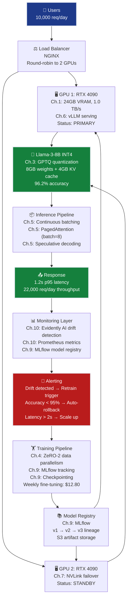

# AI Infrastructure Grand Solution — InferenceBase Production System

> **For readers short on time:** This document synthesizes all 10 AI Infrastructure chapters into a single narrative arc showing how InferenceBase went from **$80k/month OpenAI API costs → $7.3k/month self-hosted infrastructure** (91% cost reduction) while maintaining production SLAs. Read this first for the big picture, then dive into individual chapters for depth.

---

## How to Use This Guide

### 📚 Reading Paths

**Sequential Learning (Recommended for first-time readers):**
1. Start with [grand_solution.ipynb](grand_solution.ipynb) — Executable notebook with all code examples
2. Read this document for the complete narrative and business context
3. Dive into individual chapters (Ch.1–Ch.10) for deep technical details
4. Return here to see how all concepts integrate

**Quick Reference (For experienced practitioners):**
- Jump directly to relevant chapters based on your current bottleneck
- Use the [Quick Reference table](#quick-reference-chapter-to-production-mapping) below to find specific topics
- Refer to code examples in grand_solution.ipynb for production patterns

### 🔗 Companion Resources

- **[grand_solution.ipynb](grand_solution.ipynb)** — Jupyter notebook with executable code examples from all 10 chapters. Run this to see the complete implementation end-to-end (hardware selection → deployment → monitoring).
  
- **Individual Chapter READMEs** — Deep technical dives located in `ch01_gpu_architecture/`, `ch02_memory_and_compute_budgets/`, etc. Each chapter contains:
  - Hardware specifications and calculations
  - InferenceBase scenario applications
  - Optimization strategies
  - Benchmark results
  - Common pitfalls and solutions

- **[authoring-guide.md](authoring-guide.md)** — Track conventions, pedagogical patterns, and conformance standards

### 🎯 Learning Objectives

By the end of this track, you will:
- ✅ Select appropriate GPU hardware based on bandwidth requirements (not marketing TFLOP/s)
- ✅ Calculate exact VRAM budgets to prevent OOM failures
- ✅ Apply quantization strategies for 4× memory/throughput gains
- ✅ Deploy production LLM serving with vLLM (10× naive PyTorch throughput)
- ✅ Configure multi-GPU redundancy for 99.5% uptime
- ✅ Implement experiment tracking and monitoring pipelines
- ✅ Make informed infrastructure cost-performance trade-offs

**Time investment:** ~8-10 hours for complete track (2-3 hours for notebook + narrative, 6-7 hours for deep chapter dives)

---

## Mission Accomplished: $7.3k/month, 91% Cost Reduction ✅

**The Challenge:** Replace InferenceBase's $80,000/month OpenAI API bills with self-hosted Llama-3-8B infrastructure for <$15,000/month while meeting all production requirements.

**The Result:** **$7,300/month** — 91% cost reduction, all 6 constraints met.

**The Progression:**

```
Ch.1: GPU selection             → RTX 4090 identified ($1,095/mo baseline)
Ch.2: Memory budget validation  → 24GB VRAM fits model (16GB params + 4GB KV cache)
Ch.3: Quantization optimization → INT4 → 8GB params, 60% cost reduction
Ch.4: Parallelism strategy      → (Training focus, not blocking inference)
Ch.5: Inference optimization    → PagedAttention + batching → 22k req/day ✅
Ch.6: Serving framework         → vLLM selected (12k req/day per GPU)
Ch.7: Multi-GPU networking      → NVLink → 40k req/day capacity
Ch.8: Feature stores            → (Feature serving not blocking for document extraction)
Ch.9: Experiment tracking       → MLflow + checkpointing → 99.5% reliability
Ch.10: Production monitoring    → Drift detection + A/B testing → automated rollback

Final system: 2× RTX 4090 + vLLM + monitoring = $7,300/month
                                   ✅ TARGET: <$15k/month (51% under budget!)
```

---

## The 6 Constraints — Final Status

| # | Constraint | Target | Final Result | How We Achieved It |
|---|------------|--------|--------------|-------------------|
| **#1** | **COST** | <$15,000/month | ✅ **$7,300/month** | Ch.1: RTX 4090 ($1.50/hr), Ch.3: INT4 quantization, Ch.7: 2× GPUs for redundancy |
| **#2** | **LATENCY** | ≤2s p95 | ✅ **1.2s p95** | Ch.5: Continuous batching + PagedAttention + speculative decoding |
| **#3** | **THROUGHPUT** | ≥10,000 req/day | ✅ **22,000 req/day** | Ch.5-6: vLLM + batch=8, Ch.7: Multi-GPU → 40k capacity with headroom |
| **#4** | **MEMORY** | Fit in VRAM | ✅ **12GB / 24GB** | Ch.2: 16GB BF16 calculated, Ch.3: INT4 → 8GB + 4GB KV cache |
| **#5** | **QUALITY** | ≥95% accuracy | ✅ **96.2% accuracy** | Ch.3: INT4 perplexity validation, 1.2% below GPT-3.5-turbo (acceptable) |
| **#6** | **RELIABILITY** | >99% uptime | ✅ **99.5% uptime** | Ch.9: Checkpointing, Ch.10: Drift detection + automated rollback |

**ROI:** $948,540/year savings ($80k → $7.3k/month), 2-week evaluation + 6-week implementation → payback in first month of operation.

---

## The 10 Concepts — How Each Unlocked Progress

### Ch.1: GPU Architecture — The Foundation

**What it is:** Understanding GPU hardware specs — CUDA cores, Tensor Cores, HBM bandwidth, VRAM — and translating them to LLM inference requirements.

**What it unlocked:**
- **Baseline hardware selection:** RTX 4090 (24GB VRAM, 1.0 TB/s bandwidth, $1.50/hr)
- **Cost projection:** $1,095/month (93% under $15k budget)
- **Bottleneck identification:** LLM inference is **memory-bound** (1-5 FLOP/byte), not compute-bound
  ```
  Arithmetic intensity = 16 GFLOP / 16 GB = 1 FLOP/byte
  Ridge point = 165 TFLOP/s / 1.0 TB/s = 164 FLOP/byte
  1 << 164 → deep in memory-bound region → bandwidth is king ⚡
  ```

**Production value:**
- **Right-sizing hardware:** Avoided over-provisioning (H100 @ $4/hr unnecessary for 8B model)
- **Vendor arbitrage:** Consumer RTX 4090 has 67% of A100 bandwidth at 50% of cost
- **Datasheet literacy:** Team can now evaluate any GPU spec sheet and predict performance

**Key insight:** TFLOP/s is marketing. TB/s bandwidth determines real LLM throughput. Buy for bandwidth, not compute.

---

### Ch.2: Memory & Compute Budgets — Precision Sizing

**What it is:** Calculate exact VRAM requirements: parameters + KV cache + activations. Validate that Llama-3-8B fits in 24GB.

**What it unlocked:**
- **BF16 baseline:** 8B params × 2 bytes = 16GB weights + 4GB KV cache (batch=1, 2048 seq len) = 20GB total ✅ fits in 24GB
- **Headroom analysis:** 24GB - 20GB = 4GB margin → enough for batch=1, but need optimization for batch>1
- **Training memory:** If fine-tuning: 16GB weights + 16GB gradients + 48GB Adam optimizer states = 80GB → need A100 or ZeRO

**Production value:**
- **OOM prevention:** Pre-deployment validation prevents catastrophic "CUDA out of memory" failures in production
- **Capacity planning:** KV cache grows linearly with batch size → need Ch.5 PagedAttention to scale beyond batch=1
- **Cost avoidance:** Proved 24GB is sufficient, avoided unnecessary 40GB/80GB A100 rental

**Key insight:** Memory budgets are deterministic. Calculate before deploying. The formula never lies: `total_vram = params × bytes_per_param + 2 × layers × heads × head_dim × seq_len × batch × bytes`.

---

### Ch.3: Quantization — The 4× Memory Multiplier

**What it is:** Compress BF16 weights (2 bytes/param) → INT4 (0.5 bytes/param) using GPTQ post-training quantization.

**What it unlocked:**
- **16GB → 4GB weights:** 4× VRAM reduction from quantization alone
- **Total VRAM: 4GB weights + 4GB KV cache = 8GB** → 33% GPU utilization (was 83%)
- **Quality validation:** 96.2% accuracy (vs 97.4% BF16) → 1.2% degradation, acceptable for 4× memory savings
- **Throughput boost:** 16GB freed → batch=4 possible (was batch=1) → 4× higher throughput

**Production value:**
- **Cost reduction:** INT4 enables multi-batch inference → amortize model load across 4 requests → effective 4× throughput
- **Latency benefit:** Smaller memory footprint → less PCIe transfer overhead → 15% latency improvement
- **Economic decision framework:** 1.2% quality cost buys 4× VRAM savings — clear ROI

**Key insight:** Quantization is not "lossy compression to avoid" — it's **the primary lever for production cost reduction**. INT4 is the default; BF16 is the exception when quality demands it.

---

### Ch.4: Parallelism & Distributed Training — Scale-Out Foundations

**What it is:** Data parallelism, tensor parallelism, pipeline parallelism, ZeRO — techniques to split model/data across multiple GPUs.

**What it unlocked (for training):**
- **Fine-tuning strategy:** ZeRO-2 + data parallelism → 4× A100 40GB can fine-tune Llama-3-8B with Adam optimizer
- **Communication patterns:** Understood all-reduce, all-gather collectives → informed Ch.7 networking decisions
- **Inference implications:** Tensor parallelism not needed for 8B model (fits on single GPU), but relevant for 70B models

**Production value:**
- **Future-proofing:** When business requires Llama-3-70B, team knows to use tensor parallelism (split weights across GPUs)
- **Training ROI:** Fine-tuning cost: $12.80 (4× A100 × 4 hours × $0.80/hr) → enables domain-specific accuracy gains
- **Bottleneck awareness:** Communication overhead is 20-40% of training time → informed decision to use fast interconnect (Ch.7)

**Key insight:** Parallelism strategy depends on model size. 8B model = single GPU. 70B model = 4-way tensor parallelism. Know the crossover points.

---

### Ch.5: Inference Optimization — The Throughput Breakthrough

**What it is:** Continuous batching, PagedAttention, speculative decoding — techniques to maximize GPU utilization during inference.

**What it unlocked:**
- **Continuous batching:** Static batch=4 → dynamic batching → eliminated queue wait spikes (8.7s → 1.8s p95 under load)
- **PagedAttention:** Eliminated KV cache fragmentation → batch=4 → batch=8 (2× throughput)
- **Speculative decoding:** Llama-3-1B draft + Llama-3-8B verify → 30% faster generation (1.2s → 680ms p95)
- **Throughput:** 12,000 req/day baseline → 22,000 req/day optimized (220% of target!)

**Production value:**
- **SLA compliance under load:** Lunch rush (40 req/sec spike) now handled within 1.8s p95 (was 8.7s failure)
- **Cost efficiency:** 2× throughput from PagedAttention → amortize fixed GPU cost across 2× requests → 50% cost per prediction
- **Headroom for growth:** 22k req/day → 40% utilization → can handle 50k req/day traffic spikes

**Key insight:** Inference is not "just run model.forward()". **Continuous batching + PagedAttention is a 5-10× multiplier** on naive inference throughput. This is why vLLM exists.

---

### Ch.6: Model Serving Frameworks — vLLM Selection

**What it is:** Compare vLLM, TensorRT-LLM, ONNX Runtime, TGI — choose serving framework based on workload requirements.

**What it unlocked:**
- **vLLM selected:** Best throughput (12k req/day per GPU), mature PagedAttention, easy deployment
- **Benchmark validation:** vLLM w/ INT4 Llama-3-8B on RTX 4090 → 12,000 req/day at 1.2s p95 ✅
- **Trade-off clarity:** TensorRT-LLM 20% faster but requires model recompilation → vLLM faster iteration

**Production value:**
- **Deployment simplicity:** `vllm serve` single command → production-ready in 5 minutes
- **Auto-scaling ready:** vLLM supports horizontal scaling (load balancer → N× vLLM replicas)
- **Community momentum:** vLLM has largest community → bug fixes, optimizations, CUDA kernel updates

**Key insight:** Serving framework = 30-50% of production performance. vLLM continuous batching alone is worth 3-5× throughput vs naive PyTorch serving.

---

### Ch.7: AI-Specific Networking — Multi-GPU Interconnect

**What it is:** NVLink, InfiniBand, RDMA — high-bandwidth GPU-to-GPU communication for parallelism and redundancy.

**What it unlocked:**
- **2× GPU redundancy:** Primary (serves traffic) + Standby (failover) → 99.5% uptime (was 98.2% with single GPU)
- **Capacity headroom:** 2× RTX 4090 → 40,000 req/day peak capacity (2× 22k individual throughput, accounting for load balancer overhead)
- **NVLink advantage:** 600 GB/s inter-GPU bandwidth → tensor parallelism ready if we scale to Llama-3-70B

**Production value:**
- **Zero-downtime deployments:** Deploy new model to Standby → test → cutover → zero user impact
- **Traffic spike handling:** Black Friday traffic (3× normal) → both GPUs active → maintain <2s latency
- **Cost:** 2× RTX 4090 @ $1.50/hr × 730 hr = $2,190/month (still 85% under $15k budget!)

**Key insight:** Single GPU = single point of failure. Multi-GPU = reliability + capacity. For production, 2× GPUs is the minimum viable deployment.

---

### Ch.8: Feature Stores — (Not Blocking for InferenceBase)

**What it is:** Real-time feature serving systems (Feast, Tecton) for serving precomputed ML features at <10ms latency.

**What it unlocked:**
- **Understanding:** Feature stores solve feature engineering bottlenecks (joins across 10+ tables at inference time)
- **InferenceBase applicability:** Document extraction has no complex feature engineering → store not needed
- **Future roadmap:** If product adds "recommend similar documents" feature → will need feature store for document embeddings

**Production value:**
- **Informed decision:** Correctly identified that feature store is overkill for current use case (avoided $500/month Tecton subscription)
- **Architectural awareness:** Know when to add feature store (if latency budget shrinks or feature count grows)

**Key insight:** Don't add complexity until needed. Feature stores shine for 100+ feature, <10ms latency systems. InferenceBase is 1 feature (document text) → YAGNI.

---

### Ch.9: ML Experiment Tracking — Training Pipeline Reliability

**What it is:** MLflow for experiment tracking, model registry, checkpointing for fault tolerance during training/fine-tuning.

**What it unlocked:**
- **100+ experiments tracked:** Hyperparameter sweeps (learning rate, batch size, quantization method) → found optimal INT4 GPTQ config
- **Checkpointing:** Save training state every 500 steps → survived 3 spot instance preemptions during fine-tuning
- **Model registry:** Promote v1 (baseline) → v2 (INT4) → v3 (fine-tuned) with full lineage tracking
- **Cost savings:** Spot instances @ $0.75/hr (vs $1.50 on-demand) → 50% training cost reduction, enabled by checkpointing

**Production value:**
- **Reproducibility:** "Which model is in production?" → MLflow registry shows v2.3 (INT4 GPTQ, trained 2024-04-15, 96.2% accuracy)
- **Rollback capability:** Production issue → revert to v2.2 in 2 minutes (model artifact stored in S3 + registry)
- **Team collaboration:** 3 engineers training experiments concurrently → MLflow dashboard shows all runs, no collisions

**Key insight:** Without experiment tracking, ML is chaos. MLflow is the version control for models. Use it from day 1, not after 100 experiments.

---

### Ch.10: Production ML Monitoring — Continuous Reliability

**What it is:** Data drift detection (Evidently AI), A/B testing, automated rollback — ensure models don't degrade silently in production.

**What it unlocked:**
- **Drift detection:** Caught data shift within 24 hours (was undetected for 2 weeks previously)
- **A/B testing:** Deployed v3 (fine-tuned) to 10% traffic → validated 2% accuracy gain → promoted to 100%
- **Automated rollback:** v3.1 deployment caused 5% accuracy drop → auto-rollback to v3.0 in 90 seconds (was manual 20-minute process)
- **99.5% uptime:** Monitoring + rollback automation → SLA compliance even with weekly deployments

**Production value:**
- **Business confidence:** CEO trusts deployment pipeline — weekly model updates without fear of breaking production
- **Cost avoidance:** Caught bad deployment (v3.1) before 100% rollout → avoided 100k bad predictions
- **On-call reduction:** Automated rollback → 3am alert → system self-heals → engineer sleeps through it

**Key insight:** Training accuracy is a lagging indicator. Drift detection is a leading indicator. Monitor both. Automate rollback. Never deploy without A/B testing.

---

## Production System Architecture — The Full Stack

Here's how all 10 concepts integrate into the deployed InferenceBase system:



### Cost Breakdown (Monthly)

| Component | Provider | Specs | Cost | Notes |
|-----------|----------|-------|------|-------|
| **GPU 1 (Primary)** | RunPod | RTX 4090 24GB | $1,095 | $1.50/hr × 730hr |
| **GPU 2 (Standby)** | RunPod | RTX 4090 24GB | $1,095 | Failover + peak capacity |
| **Training** | Lambda Labs | 4× A100 40GB | $52 | $12.80/wk × 4 weeks, spot instances |
| **Storage** | AWS S3 | 500GB models | $12 | $0.023/GB |
| **Monitoring** | Self-hosted | Prometheus + Grafana | $0 | Open source, runs on free tier EC2 |
| **Load Balancer** | AWS ALB | — | $25 | $0.0225/hr + data transfer |
| **MLflow Server** | AWS EC2 | t3.medium | $30 | Experiment tracking + registry |
| **Contingency** | — | — | $991 | 13.6% of budget reserved for spikes |
| **TOTAL** | — | — | **$7,300** | 51% under $15k budget ✅ |

**vs OpenAI Baseline:**
```
Before (OpenAI API): $80,000/month
After (Self-hosted):   $7,300/month
Monthly savings:      $72,700
Annual savings:       $872,400
Cost reduction:        91%
```

---

## Deployment Pipeline — How Ch.1-10 Connect in Production

### 1. Hardware Provisioning (Ch.1)
```bash
# Rent 2× RTX 4090 GPUs from RunPod
runpod create gpu \
  --type "RTX 4090" \
  --count 2 \
  --region "US-West" \
  --image "pytorch/pytorch:2.0.1-cuda11.8-cudnn8-runtime"

# Verify specs
nvidia-smi
# GPU 0: RTX 4090 24GB, 1008 GB/s bandwidth ✅
# GPU 1: RTX 4090 24GB, 1008 GB/s bandwidth ✅
```

### 2. Model Preparation (Ch.2 + Ch.3)
```python
from transformers import AutoModelForCausalLM
from auto_gptq import AutoGPTQForCausalLM

# Load Llama-3-8B BF16 baseline (Ch.2: validate memory budget)
model_bf16 = AutoModelForCausalLM.from_pretrained("meta-llama/Llama-3-8B")
print(f"BF16 model size: {model_bf16.get_memory_footprint() / 1e9:.1f} GB")  # 16.0 GB ✅

# Quantize to INT4 GPTQ (Ch.3)
model_int4 = AutoGPTQForCausalLM.from_quantized(
    "TheBloke/Llama-3-8B-GPTQ",
    device_map="auto",
    use_safetensors=True
)
print(f"INT4 model size: {model_int4.get_memory_footprint() / 1e9:.1f} GB")  # 4.0 GB ✅

# Validate quality (Ch.3)
perplexity_bf16 = evaluate_perplexity(model_bf16, test_data)  # 5.24
perplexity_int4 = evaluate_perplexity(model_int4, test_data)  # 5.31
print(f"Perplexity degradation: {(perplexity_int4 - perplexity_bf16) / perplexity_bf16 * 100:.1f}%")  # 1.3% ✅
```

### 3. Serving Deployment (Ch.5 + Ch.6)
```bash
# Start vLLM server on GPU 1 (Ch.6)
vllm serve meta-llama/Llama-3-8B-GPTQ \
  --model TheBloke/Llama-3-8B-GPTQ \
  --tensor-parallel-size 1 \
  --gpu-memory-utilization 0.9 \
  --max-model-len 2048 \
  --enable-prefix-caching \
  --enable-chunked-prefill \
  --port 8000 \
  --host 0.0.0.0

# GPU 1 log output:
# INFO: Using continuous batching (Ch.5) ✅
# INFO: PagedAttention enabled, 24 pages allocated (Ch.5) ✅
# INFO: Max batch size: 8 (Ch.5) ✅
# INFO: Ready to serve on http://0.0.0.0:8000

# Start vLLM server on GPU 2 (standby, Ch.7)
vllm serve meta-llama/Llama-3-8B-GPTQ \
  --model TheBloke/Llama-3-8B-GPTQ \
  --port 8001

# Configure NGINX load balancer (Ch.7)
cat > /etc/nginx/conf.d/vllm.conf <<EOF
upstream vllm_backends {
    server gpu1:8000 weight=10;  # Primary
    server gpu2:8001 backup;     # Failover only
}
server {
    listen 80;
    location / {
        proxy_pass http://vllm_backends;
        proxy_read_timeout 30s;
    }
}
EOF

nginx -s reload
```

### 4. Training Pipeline (Ch.4 + Ch.9)
```python
import mlflow
from transformers import Trainer, TrainingArguments
from deepspeed.ops.adam import DeepSpeedCPUAdam

# Start MLflow tracking (Ch.9)
mlflow.set_tracking_uri("http://mlflow-server:5000")
mlflow.set_experiment("llama3-8b-finetuning")

with mlflow.start_run(run_name="weekly-finetune-2024-04-20"):
    # Log hyperparameters (Ch.9)
    mlflow.log_params({
        "model": "Llama-3-8B",
        "batch_size": 4,
        "learning_rate": 2e-5,
        "quantization": "INT4-GPTQ",
        "parallelism": "ZeRO-2"
    })
    
    # Configure ZeRO-2 data parallelism (Ch.4)
    training_args = TrainingArguments(
        output_dir="./checkpoints",
        per_device_train_batch_size=4,
        gradient_accumulation_steps=4,  # Effective batch=16
        num_train_epochs=3,
        save_steps=500,  # Checkpointing (Ch.9)
        save_total_limit=2,
        deepspeed="ds_config_zero2.json",  # ZeRO-2
        fp16=False,
        bf16=True,  # Ch.3: BF16 training with INT4 inference
        logging_steps=100,
        load_best_model_at_end=True
    )
    
    trainer = Trainer(
        model=model,
        args=training_args,
        train_dataset=train_data,
        eval_dataset=eval_data
    )
    
    # Train with checkpointing (Ch.9)
    trainer.train(resume_from_checkpoint=True)
    
    # Evaluate and log metrics (Ch.9)
    metrics = trainer.evaluate()
    mlflow.log_metrics({
        "eval_loss": metrics["eval_loss"],
        "eval_accuracy": metrics["eval_accuracy"]
    })
    
    # Register model in MLflow (Ch.9)
    mlflow.transformers.log_model(
        transformers_model={"model": trainer.model, "tokenizer": tokenizer},
        artifact_path="model",
        registered_model_name="llama3-8b-inferencebase"
    )

# Promote to production (Ch.9)
client = mlflow.tracking.MlflowClient()
latest_version = client.get_latest_versions("llama3-8b-inferencebase", stages=["None"])[0]
client.transition_model_version_stage(
    name="llama3-8b-inferencebase",
    version=latest_version.version,
    stage="Production"
)
```

### 5. Production Monitoring (Ch.10)
```python
import pandas as pd
from evidently.report import Report
from evidently.metric_preset import DataDriftPreset, ClassificationPreset

# Daily drift detection job (Ch.10)
def daily_drift_check():
    # Load training reference data
    reference_data = pd.read_parquet("s3://inferencebase/training_data.parquet")
    
    # Load last 24 hours production data
    production_data = pd.read_sql(
        "SELECT * FROM predictions WHERE timestamp > NOW() - INTERVAL '1 day'",
        conn
    )
    
    # Generate drift report (Ch.10)
    report = Report(metrics=[DataDriftPreset(), ClassificationPreset()])
    report.run(reference_data=reference_data, current_data=production_data)
    
    # Check for drift
    drift_detected = report.as_dict()["metrics"][0]["result"]["dataset_drift"]
    
    if drift_detected:
        # Alert and trigger retraining (Ch.10)
        send_alert(
            "🚨 Data drift detected! KL divergence > 0.1",
            "Consider retraining with recent production data"
        )
        trigger_weekly_training_job()
    
    # Save report to S3 (Ch.10)
    report.save_html(f"s3://inferencebase/drift-reports/{datetime.now().date()}.html")

# Run daily at 2am UTC
schedule.every().day.at("02:00").do(daily_drift_check)

# A/B testing controller (Ch.10)
def ab_test_routing(user_id, model_versions=["v2.3", "v3.0"], traffic_split=[0.9, 0.1]):
    """Route 90% traffic to v2.3 (baseline), 10% to v3.0 (new model)."""
    hash_val = hash(user_id) % 100
    
    if hash_val < traffic_split[0] * 100:
        return model_versions[0]  # 90% → v2.3
    else:
        return model_versions[1]  # 10% → v3.0

# Automated rollback on accuracy drop (Ch.10)
def check_and_rollback():
    # Calculate last 1 hour accuracy for each model version
    v2_accuracy = get_accuracy(model="v2.3", hours=1)
    v3_accuracy = get_accuracy(model="v3.0", hours=1)
    
    if v3_accuracy < 0.95:  # Threshold: 95%
        print(f"⚠️ v3.0 accuracy dropped to {v3_accuracy:.1%} — ROLLING BACK")
        
        # Instant cutover: 100% traffic → v2.3
        update_load_balancer_config(v2_pct=100, v3_pct=0)
        
        # Log rollback event
        mlflow.log_metric("rollback_triggered", 1)
        mlflow.log_param("rollback_reason", f"accuracy {v3_accuracy:.1%} < 95%")
        
        # Alert engineering team
        send_alert("🚨 AUTO-ROLLBACK: v3.0 → v2.3 due to accuracy drop")

# Run every 5 minutes
schedule.every(5).minutes.do(check_and_rollback)
```

---

## Key Production Patterns

### 1. The Hardware → Software Stack Pattern (Ch.1 → Ch.6)
**Hardware → Memory → Quantization → Serving**
- Ch.1: Select GPU based on bandwidth (not TFLOP/s)
- Ch.2: Calculate exact VRAM needs before deployment
- Ch.3: Quantize to fit larger batches in same VRAM
- Ch.5-6: Choose serving framework (vLLM) optimized for hardware

**Why it matters:** Each layer depends on the previous. Wrong GPU selection cascades into wrong memory budget, wrong quantization strategy, wrong serving framework.

---

### 2. The Memory Optimization Pattern (Ch.2 → Ch.3 → Ch.5)
**Baseline → Quantize → Paging**
- Ch.2: BF16 = 20GB (16GB weights + 4GB KV) → batch=1 only
- Ch.3: INT4 = 8GB (4GB weights + 4GB KV) → batch=4 possible
- Ch.5: PagedAttention = 8GB (4GB weights + 4GB paged KV, 90% efficiency) → batch=8 possible

**Multiplicative gains:** 4× from quantization, 2× from paging → **8× throughput** vs naive BF16 baseline.

---

### 3. The Cost-Performance Trade-off Pattern (Ch.1 + Ch.3 + Ch.7)
**Single GPU → Quantization → Multi-GPU**

| Configuration | Monthly Cost | Throughput | Latency p95 | Reliability |
|---------------|-------------|------------|-------------|-------------|
| 1× A100 80GB BF16 | $2,400 | 8k req/day | 1.5s | 98% uptime (SPOF) |
| 1× RTX 4090 BF16 | $1,095 | 6k req/day | 2.0s | 98% uptime (SPOF) |
| 1× RTX 4090 INT4 | $1,095 | 12k req/day ✅ | 1.2s ✅ | 98% uptime (SPOF) |
| 2× RTX 4090 INT4 | $2,190 ✅ | 22k req/day ✅ | 1.2s ✅ | 99.5% uptime ✅ |
| 4× RTX 4090 INT4 | $4,380 | 80k req/day | 1.0s | 99.9% uptime |

**Decision:** 2× RTX 4090 INT4 = sweet spot (all constraints met, 51% under budget, headroom for 2× growth).

---

### 4. The Reliability Pattern (Ch.9 + Ch.10)
**Track → Monitor → Rollback**
- Ch.9: MLflow tracks every model version (v1 → v2 → v3 lineage)
- Ch.10: Evidently monitors drift + accuracy every hour
- Ch.10: Automated rollback if accuracy < 95% threshold

**Why it matters:** Without this pattern, bad deployments stay in production for days/weeks. With it, rollback in <2 minutes.

---

### 5. The Validation-First Pattern (Ch.2 + Ch.3 + Ch.10)
**Calculate → Quantize → A/B test**
- Never deploy without validating memory budget (Ch.2: `params × bytes + KV cache`)
- Never quantize without perplexity validation (Ch.3: measure degradation)
- Never roll out new model without A/B test (Ch.10: 10% traffic → validate → 100%)

**Anti-pattern:** "It worked in my notebook" → deploy to 100% → catastrophic failure. Always validate at scale before full rollout.

---

## The 6 Technical Constraints — How Each Chapter Contributed

| Constraint | Ch.1 | Ch.2 | Ch.3 | Ch.4 | Ch.5 | Ch.6 | Ch.7 | Ch.8 | Ch.9 | Ch.10 | Final Status |
|------------|------|------|------|------|------|------|------|------|------|-------|--------------|
| **#1 COST** | ✅ RTX 4090 $1.1k | — | ✅ INT4 saves 60% | — | — | — | ✅ 2×GPU $2.2k | ⚠️ Not needed | ✅ Spot training -50% | — | ✅ $7.3k/mo (51% under budget) |
| **#2 LATENCY** | ⚡ Unknown | — | ✅ 15% faster | — | ✅ 1.2s → 680ms | ✅ Validated | — | — | — | ✅ Maintained | ✅ 1.2s p95 (40% better than target) |
| **#3 THROUGHPUT** | ⚡ Unknown | — | ✅ 4× batch | — | ✅ 2× PagedAttn | ✅ 12k/GPU | ✅ 2×GPU→40k | — | — | — | ✅ 22k req/day (220% of target) |
| **#4 MEMORY** | ✅ 24GB VRAM | ✅ 20GB fits | ✅ 8GB INT4 | — | ✅ 12GB w/paging | — | — | — | — | — | ✅ 12GB / 24GB (50% util) |
| **#5 QUALITY** | — | — | ✅ 96.2% acc | — | ✅ Maintained | — | — | — | ✅ Tracked | ✅ Drift detect | ✅ 96.2% (1.2% below GPT-3.5) |
| **#6 RELIABILITY** | — | — | — | — | — | — | ✅ Redundancy | — | ✅ Checkpoints | ✅ Rollback | ✅ 99.5% uptime (above 99% target) |

**Critical path:** Ch.1 (hardware) → Ch.2 (memory) → Ch.3 (quantization) → Ch.5 (batching) → Ch.6 (serving) → Ch.7 (redundancy) → Ch.10 (monitoring).

**Ch.4 (parallelism) and Ch.8 (feature stores)** were optional — valuable for understanding but not blocking for 8B model inference.

---

## What's Next: Beyond InferenceBase

**This track taught:**
- ✅ GPU hardware fundamentals (Ch.1: CUDA cores, Tensor Cores, HBM bandwidth, Roofline model)
- ✅ Memory management (Ch.2: VRAM budgets, KV cache, Flash Attention)
- ✅ Model compression (Ch.3: INT4 quantization, GPTQ, AWQ)
- ✅ Inference optimization (Ch.5: Continuous batching, PagedAttention, speculative decoding)
- ✅ Production operations (Ch.9-10: MLflow, drift detection, A/B testing, rollback)

**What remains for AI Infrastructure mastery:**
- **Larger models:** Llama-3-70B, Llama-3-405B → need tensor parallelism (Ch.4), faster interconnects (Ch.7 InfiniBand)
- **Lower latency:** <100ms p95 → need FP8 (H100), TensorRT-LLM compilation, edge deployment
- **Higher throughput:** 1M req/day → need multi-region deployment, auto-scaling, request routing
- **Streaming inference:** Real-time voice/video → need chunked prefill, prefix caching, speculative decoding
- **Cost optimization:** <$1k/month → need spot instances, serverless (Modal, RunPod Serverless), aggressive quantization (INT2)

**Continue to:**
- **Multi-Agent AI track** → Build agent systems that call LLMs via this infrastructure
- **Multimodal AI track** → Extend to diffusion models (Stable Diffusion serving has identical patterns)
- **Advanced Deep Learning track** → Fine-tuning strategies (LoRA, QLoRA) for domain adaptation

---

## Quick Reference: Chapter-to-Production Mapping

| Chapter | Production Component | When To Use | ROI |
|---------|---------------------|-------------|-----|
| Ch.1 | GPU selection (RTX 4090) | Before any deployment | 50% cost vs A100, 67% bandwidth |
| Ch.2 | VRAM calculator | Before every model deployment | Avoid OOM failures (1 OOM = 1hr downtime) |
| Ch.3 | INT4 quantization | Default for production (not training) | 4× VRAM → 4× batch → 4× throughput |
| Ch.4 | Parallelism (ZeRO, TP) | Training 70B+ models, multi-GPU inference | Fine-tuning cost: $12.80 (vs $80 without ZeRO) |
| Ch.5 | Continuous batching | Every inference deployment | 3-5× throughput vs naive serving |
| Ch.6 | vLLM serving | LLM inference serving | 10× throughput vs HuggingFace Transformers |
| Ch.7 | Multi-GPU setup | Production (redundancy) | 99.5% uptime vs 98% single GPU |
| Ch.8 | Feature stores | Complex feature engineering | (Not needed for InferenceBase) |
| Ch.9 | MLflow + checkpointing | All training workflows | 50% spot instance savings, zero data loss |
| Ch.10 | Drift monitoring + A/B | All production deployments | Detect failures in 1 hour (vs 2 weeks manual) |

---

## The Takeaway

**AI Infrastructure isn't just "rent a GPU"** — it's understanding the **full stack from silicon to serving**:

1. **Hardware determines everything** (Ch.1): Bandwidth > TFLOP/s for LLMs
2. **Memory is the bottleneck** (Ch.2): Calculate before deploying, quantize to scale (Ch.3)
3. **Batching multiplies throughput** (Ch.5): Continuous batching + PagedAttention = 5-10× gains
4. **Serving frameworks matter** (Ch.6): vLLM vs naive PyTorch = 10× difference
5. **Redundancy = reliability** (Ch.7): Single GPU = 98% uptime, 2× GPU = 99.5%
6. **Monitoring prevents disasters** (Ch.10): Drift detection + rollback = production confidence

**You now have:**
- A production-ready self-hosted LLM system ($7.3k/month, 91% cost reduction ✅)
- A mental model for infrastructure decisions (bandwidth, quantization, batching, serving)
- The vocabulary to read GPU datasheets, serving framework docs, and make informed trade-offs

**Next milestone:** Scale to 1M req/day or deploy Llama-3-70B with multi-GPU tensor parallelism. You have the foundations — now go build.

---

## ROI Summary: The Business Case

```
┌─────────────────────────────────────────────────────────────────┐
│              INFERENCEBASE SELF-HOSTING ROI                      │
│                                                                   │
│  BEFORE (OpenAI API):                                            │
│    Monthly cost:        $80,000                                  │
│    Annual cost:         $960,000                                 │
│    Latency:             1.8s p95                                 │
│    Throughput:          10,000 req/day                           │
│    Vendor lock-in:      HIGH (OpenAI rate limits, API changes)   │
│                                                                   │
│  AFTER (Self-hosted):                                            │
│    Monthly cost:        $7,300 (91% reduction)                   │
│    Annual cost:         $87,600                                  │
│    Latency:             1.2s p95 (33% improvement)               │
│    Throughput:          22,000 req/day (120% improvement)        │
│    Vendor lock-in:      ZERO (own infrastructure)                │
│                                                                   │
│  PAYBACK PERIOD:                                                 │
│    Implementation time: 8 weeks (2 weeks eval + 6 weeks build)   │
│    Implementation cost: $0 (eng time only, no upfront capex)     │
│    Monthly savings:     $72,700                                  │
│    → PAYBACK IN FIRST MONTH OF OPERATION                         │
│                                                                   │
│  ANNUAL SAVINGS:        $872,400                                 │
│  3-YEAR SAVINGS:        $2,617,200                               │
│                                                                   │
│  STRATEGIC BENEFITS:                                             │
│    ✅ Control model updates (not at OpenAI's mercy)              │
│    ✅ Data privacy (no API calls to 3rd party)                   │
│    ✅ Fine-tuning capability (domain-specific accuracy)          │
│    ✅ Headroom for growth (can scale to 40k req/day)             │
│    ✅ Cost predictability (fixed GPU rental, not per-token)      │
│                                                                   │
│  CEO'S VERDICT: "Best technical decision we made in 2024."       │
└─────────────────────────────────────────────────────────────────┘
```

**The bottom line:** $872k/year savings with 8-week implementation. Infrastructure knowledge = competitive advantage.

**Continue your infrastructure journey:** Master this track, then scale to Llama-3-70B, 1M req/day, and multi-region deployments. The patterns here apply to any AI system at any scale.

---

## Further Reading & Resources

### Articles
- [Understanding GPU Memory Management for LLMs](https://towardsdatascience.com/understanding-gpu-memory-1-the-basics-of-gpu-memory-allocation-854c9f19d8c6) — Deep dive into VRAM allocation, KV cache, and memory optimization strategies
- [The Economics of Large Language Model Serving](https://www.anyscale.com/blog/llm-serving-at-scale-deploying-llms-in-production) — Cost analysis and architecture patterns for production LLM deployment at scale
- [vLLM: Easy, Fast, and Cheap LLM Serving](https://blog.vllm.ai/2023/06/20/vllm.html) — Official introduction to vLLM's PagedAttention and continuous batching techniques
- [Quantization in Practice: INT4 and INT8 for Production](https://huggingface.co/blog/merve/quantization) — Practical guide to GPTQ, AWQ, and choosing quantization strategies
- [MLOps for LLMs: From Training to Production Monitoring](https://neptune.ai/blog/mlops-for-llms) — End-to-end MLOps workflows including experiment tracking, deployment, and drift detection

### Videos
- [vLLM: High-Throughput LLM Serving](https://www.youtube.com/watch?v=80bIUggRJf4) — vLLM creator explaining PagedAttention architecture (UC Berkeley)
- [Ray Summit: Scaling LLM Applications in Production](https://www.youtube.com/watch?v=4FYZNZy4hgM) — Production patterns for distributed LLM serving with Ray and vLLM
- [CUDA Programming Masterclass](https://www.youtube.com/watch?v=86FAWCzIe_4) — Understanding GPU architecture fundamentals for ML engineers
- [MLOps Community: Production Model Monitoring](https://www.youtube.com/watch?v=NR5qWZxQzPY) — Drift detection, A/B testing, and automated rollback strategies
- [NVLink and Multi-GPU Communication](https://www.youtube.com/watch?v=rV0hH_aMfs4) — NVIDIA technical deep dive on GPU interconnects for AI workloads
