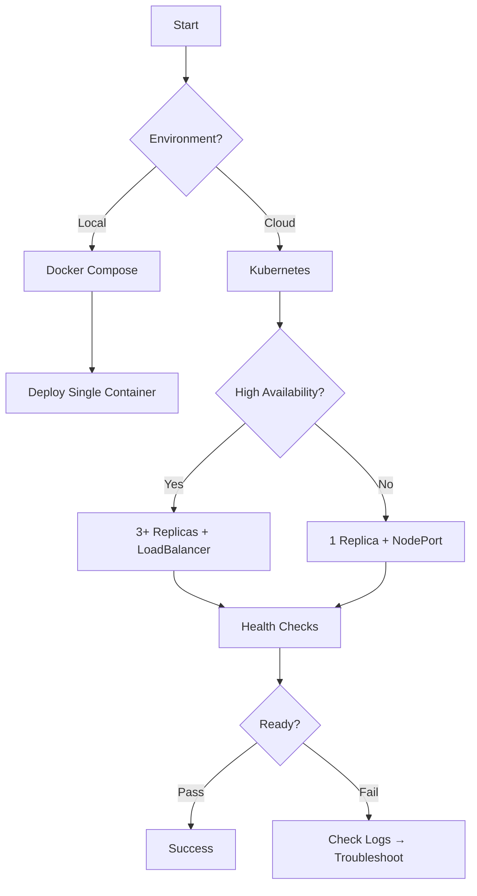

# DevOps Track Authoring Guide Update — Implementation Plan

**Target:** `notes/07-devops_fundamentals/authoring-guide.md`  
**Effort:** 4-6 hours  
**Status:** Ready for implementation (aligned with ML track workflow patterns)

---

## Executive Summary

DevOps track is **100% workflow-based** (all 8 chapters are procedural). This update plan codifies DevOps-specific workflow patterns extracted from ML track's authoring guide, adapted for infrastructure/deployment scenarios.

**Key Recognition:** Unlike ML (mix of concept + workflow chapters), DevOps has NO concept-based chapters. Every chapter teaches setup → configure → deploy → monitor → troubleshoot.

---

## Content Additions Required

### 1. Workflow-Based Chapter Pattern (ALL DevOps Chapters)

**Location:** After chapter template section

**Core principle:** DevOps practitioners need decision trees at each deployment phase, not just final troubleshooting.

#### 1.1 Identifying DevOps Workflow Characteristics

All DevOps chapters inherently:
- ✅ Teach **sequence of decisions** (tool selection, resource sizing, deployment strategy)
- ✅ Practitioner asks "what should I configure next?" after each phase
- ✅ Multiple tools chosen based on environment characteristics (local vs cloud, scale, compliance)
- ✅ Read like operational runbooks, not theoretical introductions

**Examples from track:**
- **Ch.1 Docker:** Build image → optimize layers → configure networking → deploy container → validate health
- **Ch.3 Kubernetes:** Create manifests → configure resources → deploy pods → expose services → monitor readiness
- **Ch.5 CI/CD:** Define pipeline → configure triggers → setup environments → deploy stages → validate rollout

#### 1.2 Modified Template for DevOps Workflow Chapters

```markdown
# Ch.N — [Topic Name]

[Same header: story, curriculum context, notation if applicable]

---

## 0 · The Challenge — Where We Are
[Context: Why this deployment/infrastructure problem matters]
[Grand Challenge connection: How this chapter advances deployment reliability/automation]

## 1 · Core Idea
[Brief overview of the tool/practice and its workflow purpose]

## 1.5 · The Practitioner Workflow — Your N-Phase Deployment

**Before diving into configuration, understand the workflow you'll follow for every deployment:**

> 🚀 **What you'll build by the end:** [Description of deployed system/pipeline]

```
Phase 1: SETUP              Phase 2: CONFIGURE          Phase 3: DEPLOY
──────────────────────────────────────────────────────────────────────────
[Tool installation]         [Resource definitions]      [Deployment execution]

→ DECISION:                 → DECISION:                 → DECISION:
  Local vs cloud?             CPU/memory limits?          Rolling vs blue-green?
  Dev vs prod config?         Replicas needed?            Health check strategy?
```

```
Phase 4: VALIDATE           Phase 5: TROUBLESHOOT
──────────────────────────────────────────────────────
[Health checks]             [Common failure modes]

→ DECISION:                 → DECISION:
  Readiness probe passed?     Logs show errors?
  Metrics within SLO?         Resource exhaustion?
```

**The workflow maps to this chapter:**
- **Phase 1 (Setup)** → §2 Environment Setup
- **Phase 2 (Configure)** → §3 Configuration Files  
- **Phase 3 (Deploy)** → §4 Deployment Execution
- **Phase 4 (Validate)** → §5 Health Verification
- **Phase 5 (Troubleshoot)** → §6 Common Issues

> 💡 **Usage note:** Phases 1-3 are sequential; Phase 4 runs after each deployment; Phase 5 is on-demand for failures.

---

## 2 · Running Example
[Real-world deployment scenario used throughout chapter]

## 3 · Implementation
[Configuration sections organized by phase]

### 3.X · [Phase Name] **[Phase N: ACTION]**
[Section content with phase marker in header]

[Configuration snippet showing phase implementation]

```dockerfile
# Phase 1: Setup — Multi-stage build for minimal production image
FROM python:3.11 AS builder
WORKDIR /build
COPY requirements.txt .
RUN pip install --no-cache-dir -r requirements.txt

FROM python:3.11-slim
WORKDIR /app
COPY --from=builder /build /app
COPY . .

# DECISION LOGIC (inline annotation)
# For development: Use full python image, mount volume for hot reload
# For production: Use slim image, copy files for immutable deployment
EXPOSE 8000
CMD ["gunicorn", "--bind", "0.0.0.0:8000", "app:app"]
```

> 💡 **Industry Standard:** Docker multi-stage builds (production baseline)
> ```dockerfile
> FROM python:3.11-slim AS final
> # Single-stage for simple apps, multi-stage for compiled languages or large deps
> ```
> **When to use:** Always for production. Single-stage acceptable for dev/test only.
> **Common alternatives:** `alpine` (smaller but compatibility issues), `distroless` (security-hardened)
> **See also:** [Docker best practices](https://docs.docker.com/develop/dev-best-practices/)

### 3.X.1 DECISION CHECKPOINT — Phase N Complete

**What you just saw:**
- [Observation 1: specific metric from deployment output, e.g., "Image size: 145MB → 87MB"]
- [Observation 2: specific behavior, e.g., "Container startup time: 3.2s"]
- [Observation 3: resource consumption, e.g., "Memory usage: 120MB under load"]

**What it means:**
- [Interpretation: "Multi-stage reduced size by 40%, faster pulls in CI/CD"]
- [Impact: "Lower egress costs, faster deployment cycles"]

**What to do next:**
→ **Local dev:** Use single-stage with volume mounts for hot reload
→ **Staging:** Use multi-stage, same image as production
→ **Production:** Use multi-stage + health checks (see Phase 4)
→ **For our scenario:** Choose multi-stage because we deploy to cloud with image pull latency

---

[Repeat pattern for all phases]

## N-1 · Putting It Together — The Complete Deployment Flow

[Mermaid flowchart showing all phases integrated with decision branches]



## N · Progress Check — What We Can Deploy Now
[Same as other tracks: capabilities gained, grand challenge progress]

## N+1 · Bridge to the Next Chapter
[How this deployment phase connects to next (e.g., Docker → Kubernetes, CI → CD)]
```

#### 1.3 Key Differences from ML Track Workflow Pattern

| Element | ML Workflow Chapters | DevOps Workflow Chapters |
|---------|---------------------|--------------------------|
| **All chapters?** | Only some (3-4 of 10+) | ALL chapters (8 of 8) |
| **Code focus** | Python snippets (sklearn, pandas) | Config files (YAML, HCL, Dockerfile, shell) |
| **Decision criteria** | Data characteristics (skew, VIF) | Environment constraints (scale, cost, compliance) |
| **Industry tools** | Optional (show manual first) | Required (no manual impl of Docker/K8s) |
| **Validation** | Statistical metrics | Deployment health (status, logs, metrics) |
| **Checkpoints** | After each analysis phase | After each deployment phase |

#### 1.4 Configuration Snippet Guidelines for DevOps Chapters

**Rule 1: Each phase ends with executable configuration showing that phase's workflow**

```yaml
# ✅ Good: Phase 2 config snippet (Kubernetes deployment with decision logic)
apiVersion: apps/v1
kind: Deployment
metadata:
  name: api-server
spec:
  # DECISION LOGIC: Replica count based on environment
  replicas: 3  # Production: 3+, Staging: 2, Dev: 1
  
  template:
    spec:
      containers:
      - name: api
        image: myapp:1.0
        resources:
          # DECISION LOGIC: Resource limits based on load testing
          requests:
            memory: "128Mi"  # Baseline from profiling
            cpu: "250m"
          limits:
            memory: "256Mi"  # 2x requests = buffer for spikes
            cpu: "500m"
        
        # DECISION LOGIC: Liveness checks deployment strategy
        livenessProbe:
          httpGet:
            path: /health
            port: 8000
          initialDelaySeconds: 15  # App cold start time from testing
          periodSeconds: 10
```

**Rule 2: Decision logic appears in inline comments, not just prose**

```dockerfile
# ✅ Good: Inline decision annotation for base image selection
FROM python:3.11-slim  # DECISION: slim (not alpine) for broad compatibility

# ❌ Alpine: Smaller (50MB) but breaks numpy/pandas (musl libc issues)
# ✅ Slim: Moderate (150MB), full glibc, production-tested
# ❌ Full: Large (900MB), unnecessary tools in production
```

**Rule 3: Configuration should be copy-paste deployable**
- Include all required fields (no placeholders like `<YOUR_VALUE_HERE>`)
- Use realistic values from actual deployments
- Add comments explaining non-obvious settings
- Include validation commands after config blocks

```bash
# After applying the above config:
kubectl apply -f deployment.yaml
kubectl rollout status deployment/api-server
# Expected: "deployment 'api-server' successfully rolled out"
```

**Rule 4: Show progressive building, not isolated configs**

```yaml
# ✅ Good: References earlier setup
# Using the Docker image built in Phase 1 (myapp:1.0)...
apiVersion: v1
kind: Service
metadata:
  name: api-service
spec:
  selector:
    app: api-server  # Matches Phase 2 deployment labels
```

#### 1.5 Decision Checkpoint Format (DevOps Adaptation)

Every checkpoint follows this **exact 3-part structure:**

```markdown
### N.M DECISION CHECKPOINT — Phase K Complete

**What you just deployed:**
- [Observation 1: specific deployment detail, e.g., "3 pods running across 2 nodes"]
- [Observation 2: health check result, e.g., "Readiness probe: 3/3 passed in 12s"]
- [Observation 3: resource usage, e.g., "CPU: 180m/500m, Memory: 145Mi/256Mi"]

**What it means:**
- [Interpretation: "Deployment is stable with 40% resource headroom"]
- [Impact: "Can handle 2x traffic spike before hitting limits"]

**What to do next:**
→ **Monitor:** Track these metrics in Prometheus (Ch.7)
→ **Scale test:** Increase load to validate autoscaling (Ch.4)
→ **For production:** Add HorizontalPodAutoscaler when CPU > 70% sustained
```

**Checkpoint placement:**
- After completing each deployment phase
- After health checks pass/fail
- Before promoting to next environment (dev → staging → prod)

#### 1.6 Industry Standard Tools Integration (DevOps)

**Core principle:** DevOps has NO manual implementation phase (unlike ML). Show tool best practices immediately, explain alternatives.

**Required callout box pattern:**

```markdown
> 💡 **Industry Standard:** Docker multi-stage builds
> 
> ```dockerfile
> FROM golang:1.21 AS builder
> WORKDIR /src
> COPY . .
> RUN go build -o app
> 
> FROM alpine:3.19
> COPY --from=builder /src/app /app
> CMD ["/app"]
> ```
> 
> **When to use:** Always for compiled languages (Go, Rust, Java). Optional for interpreted languages (Python, Node.js).
> **Common alternatives:** Single-stage (dev only), BuildKit buildx (cross-platform), Cloud Build (managed)
> **See also:** [Docker build best practices](https://docs.docker.com/develop/dev-best-practices/)
```

**Required callout boxes per chapter:**

| Chapter | Industry Tools to Show | When to Highlight |
|---------|------------------------|-------------------|
| Docker | Multi-stage builds, layer caching, `.dockerignore` | After first Dockerfile |
| Kubernetes | Resource requests/limits, health probes, ConfigMaps/Secrets | After first deployment |
| Terraform | Modules, remote state, workspaces | After first resource definition |
| CI/CD | Matrix builds, caching, secrets management | After first pipeline |
| Monitoring | PromQL queries, Grafana dashboards, alerting rules | After first metric collection |

#### 1.7 When to Add Extra Decision Branches (DevOps Context)

**Add explicit decision checkpoints for:**
- Environment selection (local vs cloud, dev vs prod)
- Tool selection with tradeoffs (Docker Compose vs K8s, Terraform vs Pulumi)
- Resource sizing (replica count, CPU/memory limits, storage class)
- Deployment strategy (rolling update vs blue-green vs canary)
- Security posture (RBAC policies, network policies, secrets management)
- Cost optimization (spot instances, autoscaling thresholds, resource right-sizing)

**Example decision tree structure:**

```markdown
### 3.4 DECISION CHECKPOINT — Choosing Deployment Strategy

**What you need to decide:** How to roll out new versions with minimal downtime

**Decision criteria:**
| Criterion | Rolling Update | Blue-Green | Canary |
|-----------|----------------|------------|--------|
| **Downtime** | None (gradual) | None (instant switch) | None (gradual) |
| **Rollback speed** | Slow (re-deploy) | Instant (route switch) | Instant (route adjust) |
| **Resource cost** | 1x (N → N pods) | 2x (2N pods) | 1.1-1.5x (N + canary) |
| **Risk** | Medium | Low (full test) | Very Low (gradual) |
| **Complexity** | Low | Medium | High |

**For our scenario (e-commerce API):**
→ **Choose Canary** because:
  - Revenue-critical (need low risk)
  - Can tolerate 1.2x cost during rollout
  - Have monitoring to detect issues (Prometheus alerts)
  - Traffic patterns allow 10% split testing

→ **Implementation:** See §3.4.1 for Kubernetes canary deployment manifest
```

---

### 2. Script/Notebook Exercise Pattern (DevOps Adaptation)

**Context:** DevOps exercises use mix of scripts (bash/PowerShell), config files (YAML/HCL), and validation notebooks (Python for testing).

#### 2.1 Exercise Structure

**Components:**
- Solution scripts: Fully working Dockerfiles, K8s manifests, Terraform modules
- Exercise templates: Stub files with `# TODO: Configure...` markers
- Validation notebooks: Python scripts to verify deployments

**Required enhancements:**

#### 2.2 Industry Standard Callout Boxes (DevOps Config Files)

Add to markdown/comment sections in exercise files:

```yaml
# deployment.yaml

# 💡 INDUSTRY STANDARD PATTERN: Always set resource limits
# 
# spec:
#   containers:
#   - name: app
#     resources:
#       requests:
#         memory: "128Mi"  # Scheduler uses this for placement
#         cpu: "250m"
#       limits:
#         memory: "256Mi"  # Hard limit, OOMKill if exceeded
#         cpu: "500m"
# 
# When to use: Always in production (prevents noisy neighbor issues)
# Common alternatives: LimitRanges (namespace-level), ResourceQuotas (team-level)
```

**Pattern frequency:** 3-5 callouts per exercise file

**Where to place:**
- After base image selection (Dockerfile)
- After resource definitions (Kubernetes)
- After provider configuration (Terraform)
- After pipeline stages (GitHub Actions)
- After metric queries (PromQL)

#### 2.3 Decision Logic Templates (DevOps Scenarios)

Add to exercise instructions (README or notebook markdown):

```markdown
**Decision Logic Template for Resource Sizing:**

When you configure resource requests/limits:

\```yaml
resources:
  requests:
    cpu: ???     # Start with load test results
    memory: ???  # Start with profiling baseline
  limits:
    cpu: ???     # 2x requests = burst capacity
    memory: ???  # 2x requests = buffer for spikes
\```

**Decision process:**
1. Profile app under normal load → set `requests`
2. Load test to failure → set `limits` at 2x normal
3. If OOMKilled → increase memory limit
4. If CPU throttled → increase CPU limit
5. If underutilized → decrease requests (save cost)

**Thresholds:**
- CPU utilization > 80% sustained → increase limits
- Memory utilization > 90% → increase limits (OOMKill risk)
- CPU/Memory < 30% for 7 days → decrease requests (overprovisioned)
```

#### 2.4 Validation Script Pattern

**Required in all exercises:** Python script to verify deployment health

```python
# validate_deployment.py
import requests
import time

def check_health(url, expected_status=200, timeout=30):
    """
    Validates deployment health endpoint.
    
    DECISION LOGIC:
    - Status 200 → ✅ Healthy
    - Status 503 → ⚠️ Starting (wait and retry)
    - Timeout → ❌ Failed (check logs)
    """
    start = time.time()
    while time.time() - start < timeout:
        try:
            resp = requests.get(f"{url}/health", timeout=5)
            if resp.status_code == expected_status:
                print(f"✅ Health check passed: {resp.status_code}")
                return True
            elif resp.status_code == 503:
                print(f"⚠️ Service starting, retrying...")
                time.sleep(2)
            else:
                print(f"❌ Unexpected status: {resp.status_code}")
                return False
        except requests.exceptions.RequestException as e:
            print(f"⚠️ Connection failed: {e}, retrying...")
            time.sleep(2)
    
    print(f"❌ Health check timeout after {timeout}s")
    return False

# TODO: Replace with your deployed service URL
SERVICE_URL = "http://localhost:8000"
check_health(SERVICE_URL)
```

#### 2.5 Visual Indicators (DevOps Status)

Use consistent indicators for deployment status:

| Indicator | Meaning | Use Case |
|-----------|---------|----------|
| ✅ | Healthy/Running/Passed | Deployment successful, health checks pass |
| ⚠️ | Degraded/Starting/Warning | Some pods not ready, high resource usage |
| ❌ | Failed/Crashed/Error | Deployment failed, pods in CrashLoopBackOff |
| 🚀 | Deploying/Rolling | Rollout in progress |
| 💡 | Best Practice | Production-ready pattern |
| 🔍 | Debug Required | Check logs/metrics for root cause |
| 🛑 | Blocked/Waiting | Pending resource availability |

#### 2.6 Implementation Checklist for DevOps Exercises

When creating/updating exercise files:

- [ ] **Industry callouts added** (3-5 per config file)
- [ ] **Decision logic templates added** (resource sizing, strategy selection, troubleshooting)
- [ ] **Visual indicators consistent** (✅ ❌ ⚠️ 🚀 💡)
- [ ] **Validation script included** (Python or shell script to verify deployment)
- [ ] **Specific thresholds documented** (CPU/memory limits, replica counts, timeout values)
- [ ] **TODO markers preserved** (exercise files remain templates)
- [ ] **Comments expanded** (guidance added, not replaced)
- [ ] **Real-world values** (no placeholder like `<YOUR_VALUE>`, use realistic defaults)

---

### 3. DevOps Grand Challenge Integration

**Track theme:** Deployment Reliability & Automation

**How each chapter advances the challenge:**

| Chapter | Workflow Phases | Grand Challenge Contribution |
|---------|----------------|------------------------------|
| Ch.0 Dev Environment | Setup → Configure → Validate | Foundation: Reproducible local environment |
| Ch.1 Docker | Build → Optimize → Deploy → Validate | Isolation: Consistent runtime across envs |
| Ch.2 Docker Compose | Define → Network → Volume → Orchestrate | Multi-service: Local microservices testing |
| Ch.3 Kubernetes | Manifest → Deploy → Scale → Monitor | Production orchestration: HA deployments |
| Ch.4 Scaling | HPA → Metrics → Test → Validate | Elasticity: Handle variable load |
| Ch.5 CI/CD | Pipeline → Test → Deploy → Rollback | Automation: Safe, repeatable deployments |
| Ch.6 IaC | Define → Plan → Apply → Destroy | Infrastructure: Version-controlled infra |
| Ch.7 Monitoring | Collect → Query → Visualize → Alert | Observability: Detect/diagnose issues |

**Each chapter's "Progress Check" should answer:**
- What deployment capability did we gain?
- How does this reduce manual toil?
- What failure mode can we now prevent/detect?

---

### 4. Industry Tools Reference (DevOps-Specific)

**Required tools per chapter (with alternatives):**

#### 4.1 Containerization (Ch.1-2)

| Category | Primary Tool | Alternatives | When to Use |
|----------|--------------|--------------|-------------|
| Runtime | Docker | Podman, containerd | Docker (dev/prod), Podman (rootless) |
| Multi-container | Docker Compose | Podman Compose | Docker Compose (local), K8s (prod) |
| Registry | Docker Hub | AWS ECR, GCR, ACR | Docker Hub (public), ECR (AWS prod) |

#### 4.2 Orchestration (Ch.3-4)

| Category | Primary Tool | Alternatives | When to Use |
|----------|--------------|--------------|-------------|
| Orchestrator | Kubernetes | Docker Swarm, Nomad | K8s (prod), Swarm (simple HA) |
| Local K8s | Minikube | Kind, k3s, Docker Desktop | Minikube (full K8s), Kind (CI testing) |
| Package Manager | Helm | Kustomize | Helm (templating), Kustomize (patching) |
| Autoscaling | HPA | VPA, KEDA | HPA (reactive), KEDA (event-driven) |

#### 4.3 CI/CD (Ch.5)

| Category | Primary Tool | Alternatives | When to Use |
|----------|--------------|--------------|-------------|
| GitHub | GitHub Actions | GitLab CI, Jenkins | Actions (GitHub repos), GitLab (self-hosted) |
| Cloud | Cloud Build | AWS CodePipeline, Azure Pipelines | Cloud Build (GCP), CodePipeline (AWS) |
| Deployment | ArgoCD | Flux, Spinnaker | ArgoCD (GitOps K8s), Spinnaker (multi-cloud) |

#### 4.4 Infrastructure (Ch.6)

| Category | Primary Tool | Alternatives | When to Use |
|----------|--------------|--------------|-------------|
| IaC | Terraform | Pulumi, CloudFormation | Terraform (multi-cloud), Pulumi (typed langs) |
| Config Mgmt | Ansible | Chef, Puppet | Ansible (agentless), Chef (audit/compliance) |
| Secrets | HashiCorp Vault | AWS Secrets Manager | Vault (multi-cloud), Secrets Manager (AWS-only) |

#### 4.5 Monitoring (Ch.7)

| Category | Primary Tool | Alternatives | When to Use |
|----------|--------------|--------------|-------------|
| Metrics | Prometheus | Datadog, New Relic | Prometheus (self-hosted), Datadog (SaaS) |
| Visualization | Grafana | Kibana | Grafana (metrics), Kibana (logs) |
| Logging | Loki | ELK Stack, Splunk | Loki (lightweight), ELK (full-text search) |
| Tracing | Jaeger | Zipkin, Tempo | Jaeger (mature), Tempo (Grafana Labs) |
| Alerts | Alertmanager | PagerDuty | Alertmanager (Prometheus), PagerDuty (incident mgmt) |

---

## Implementation Roadmap

### Phase 1: Core Authoring Guide Updates (4-6 hours)

**File:** `notes/07-devops_fundamentals/authoring-guide.md`

**Sections to add:**
1. ✅ Workflow-Based Chapter Pattern (ALL DevOps Chapters)
   - Identification criteria (all 8 chapters qualify)
   - Modified template with 5-phase structure
   - Key differences from ML track
   - Configuration snippet guidelines (4 rules)
   - Decision checkpoint format
   - Industry tools integration
   
2. ✅ Script/Notebook Exercise Pattern
   - Exercise structure (solution + template + validation)
   - Industry callout boxes for configs
   - Decision logic templates for infrastructure
   - Validation script pattern
   - Visual indicators for deployment status
   - Implementation checklist

3. ✅ Grand Challenge Integration
   - How each chapter advances deployment reliability
   - Progress check framework

4. ✅ Industry Tools Reference
   - Tools by chapter with alternatives
   - When-to-use guidance
   - Links to official docs

### Phase 2: Consistency Audit (2-3 hours)

Verify all 8 chapters follow documented patterns:

**Chapter audit checklist:**
- [ ] Ch.0 Dev Environment: 5-phase workflow documented?
- [ ] Ch.1 Docker: Decision checkpoints after each phase?
- [ ] Ch.2 Docker Compose: Industry callouts present?
- [ ] Ch.3 Kubernetes: Resource sizing decision logic?
- [ ] Ch.4 Scaling: HPA configuration thresholds?
- [ ] Ch.5 CI/CD: Pipeline stage decision tree?
- [ ] Ch.6 IaC: Terraform module best practices?
- [ ] Ch.7 Monitoring: PromQL query examples with thresholds?

**Exercise audit checklist:**
- [ ] All exercises have validation scripts?
- [ ] TODO markers consistent format?
- [ ] Industry callouts use standard format?
- [ ] Realistic default values (no `<YOUR_VALUE>`)?

### Phase 3: Cross-References (1 hour)

Add forward/backward links between chapters showing workflow progression:

- Ch.1 Docker → Ch.2 Docker Compose: "To orchestrate multiple containers..."
- Ch.2 Docker Compose → Ch.3 Kubernetes: "For production orchestration..."
- Ch.3 Kubernetes → Ch.4 Scaling: "To handle variable load..."
- Ch.5 CI/CD → Ch.6 IaC: "To version control infrastructure..."
- Ch.7 Monitoring → all chapters: "To observe [chapter tool] in production..."

---

## Success Criteria

### Authoring Guide Quality

1. ✅ **Workflow pattern fully documented** (template, examples, when to use)
2. ✅ **Decision checkpoints codified** (3-part format, placement rules)
3. ✅ **Industry tools cataloged** (primary + alternatives per chapter)
4. ✅ **Exercise pattern standardized** (validation scripts, callouts, templates)
5. ✅ **Grand challenge integration** (each chapter's contribution clear)

### Chapter Consistency

6. ✅ **All 8 chapters follow 5-phase workflow** (Setup → Configure → Deploy → Validate → Troubleshoot)
7. ✅ **Decision checkpoints present** (minimum 3 per chapter)
8. ✅ **Industry callouts standardized** (format, frequency, placement)
9. ✅ **Validation scripts included** (all exercises testable)

### Usability

10. ✅ **Authoring guide is reference, not tutorial** (patterns, not prose)
11. ✅ **Examples are DevOps-specific** (no generic ML analogies)
12. ✅ **Checklists actionable** (can audit chapters against criteria)

---

## Files Modified

**Primary:**
1. `notes/07-devops_fundamentals/authoring-guide.md` (new file, ~2000 lines)

**Secondary (during Phase 2 audit):**
- `notes/07-devops_fundamentals/ch0_dev_environment/README.md`
- `notes/07-devops_fundamentals/ch1_docker/README.md`
- `notes/07-devops_fundamentals/ch2_docker_compose/README.md`
- `notes/07-devops_fundamentals/ch3_kubernetes/README.md`
- `notes/07-devops_fundamentals/ch4_scaling/README.md`
- `notes/07-devops_fundamentals/ch5_cicd/README.md`
- `notes/07-devops_fundamentals/ch6_iac/README.md`
- `notes/07-devops_fundamentals/ch7_monitoring/README.md`

*(Modifications: Add missing decision checkpoints, standardize industry callouts)*

---

## Anti-Patterns to Avoid

❌ **Don't:**
- Copy-paste ML patterns without DevOps adaptation (e.g., "skewness thresholds" → "resource limits")
- Show manual implementations (no need to implement Docker from scratch)
- Use vague thresholds ("high CPU" → specify "CPU > 80% for 5min")
- Mix dev and prod patterns in same example (clearly label environment)
- Skip validation scripts (every exercise must be testable)

✅ **Do:**
- Adapt patterns to infrastructure context (data diagnostics → deployment health checks)
- Show industry tools immediately (Docker/K8s are the tools, not implementations)
- Use specific metrics (CPU millicores, memory MiB, replica counts)
- Clearly separate local/cloud, dev/staging/prod configurations
- Include validation commands after every config example

---

## Notes for Implementation

**LLM Context Window:**
- Authoring guide sections are modular (can be implemented one at a time)
- Each section ~300-500 lines
- Use ML authoring guide as reference, not copy source

**Testing Strategy:**
- After Phase 1: Review authoring guide against ML track for completeness
- After Phase 2: Audit 2-3 chapters against new patterns
- After Phase 3: Verify cross-references don't create circular dependencies

**Maintenance:**
- Update industry tools section when new tools become standard (e.g., new K8s features)
- Add new decision checkpoints as DevOps practices evolve
- Keep tool alternatives current (Docker alternatives, K8s distributions)
