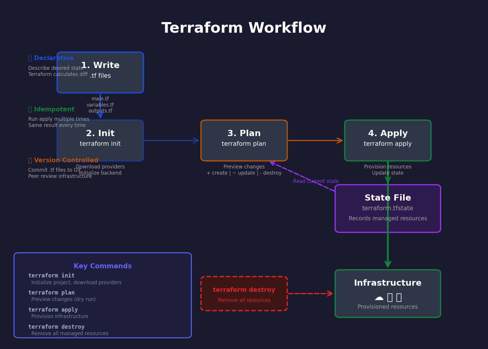

# Ch.6 — Infrastructure as Code

> **The story.** In **2006**, **Amazon Web Services** launched **EC2**, making server provisioning as simple as an API call — but engineers still managed infrastructure through web consoles, clicking through forms to configure load balancers and databases. The breakthrough came in **2010** when **Mitchell Hashimoto** (then a student at University of Washington) founded **HashiCorp** and released **Vagrant** to automate VM provisioning. But the tool that revolutionized infrastructure was **Terraform**, released in **2014** by Hashimoto's team as an open-source Infrastructure as Code (IaC) framework. Terraform introduced a *declarative* model — you describe the desired end state (5 web servers, 1 database, 2 load balancers), and Terraform calculates the diff and applies changes idempotently. Unlike imperative scripts that break if run twice, Terraform's state file tracks reality and makes infrastructure reproducible. By 2024, Terraform manages infrastructure for 90% of Fortune 500 companies — every Kubernetes cluster, S3 bucket, and VPC you provision likely started as a `.tf` file in a Git repo.
>
> **Where you are in the curriculum.** You've containerized apps with Docker (Ch.1), orchestrated multi-container stacks with Docker Compose (Ch.2), deployed to Kubernetes for auto-healing (Ch.3), automated CI/CD with GitHub Actions (Ch.4), and instrumented observability with Prometheus + Grafana (Ch.5). You can ship code to production — **but you're provisioning infrastructure manually**. If you need to spin up a new environment (staging, DR failover, customer demo), you're clicking through AWS consoles or running ad-hoc shell scripts. Changes drift over time — dev and prod environments diverge because someone forgot to document a security group rule. This chapter gives you **Infrastructure as Code** — the foundation for reproducible, version-controlled, peer-reviewed infrastructure deployments.
>
> **Notation in this chapter.** **Terraform** — open-source IaC tool; **HCL** — HashiCorp Configuration Language (the `.tf` syntax); **Provider** — plugin that talks to APIs (AWS, Azure, Docker, Kubernetes); **Resource** — infrastructure component (EC2 instance, S3 bucket, Docker container); **State** — Terraform's record of managed infrastructure (`terraform.tfstate`); **Plan** — preview of changes before applying them (`terraform plan`); **Apply** — execute changes to match desired state (`terraform apply`); **Drift** — when real infrastructure diverges from code (manual changes outside Terraform).

---

## 0 · The Challenge — Where We Are

> 🎯 **The mission**: Provision a Docker container running Nginx using Terraform — infrastructure defined as code, version-controlled, and reproducible across environments.

**What we know so far:**
- ✅ We can run containers with Docker (Ch.1)
- ✅ We can orchestrate multi-container apps with Docker Compose (Ch.2)
- ✅ We can deploy to Kubernetes for production (Ch.3)
- ❌ **But infrastructure provisioning is still manual and error-prone!**

**What's blocking us:**
We're managing infrastructure through ad-hoc scripts and manual steps:
- **No version control**: Infrastructure changes aren't tracked in Git
- **No peer review**: Can't review infrastructure changes like code PRs
- **No rollback**: Can't revert to a previous infrastructure state
- **No reproducibility**: Can't spin up identical environments (dev, staging, prod)
- **Drift**: Manual changes bypass documentation and cause config drift

Without Infrastructure as Code, you can't treat infrastructure with the same rigor as application code — no testing, no code reviews, no rollback safety nets.

**What this chapter unlocks:**
The **Terraform workflow** — define infrastructure as declarative `.tf` files, version-control them in Git, preview changes with `terraform plan`, apply changes with `terraform apply`, and destroy environments with `terraform destroy`.
- **Establishes the IaC foundation**: Resources, providers, state management
- **Provides concrete examples**: Provision Docker containers, networks, volumes
- **Teaches production workflows**: State backends, variable management, drift detection

✅ **This is the foundation** — every later chapter assumes infrastructure is version-controlled and reproducible.

---

## Animation



## 1 · Infrastructure as Code Means You Declare Desired State and Let Terraform Calculate the Diff

Traditional infrastructure scripts are *imperative* — they tell the system step-by-step what to do:
```bash
# Imperative approach — breaks if run twice!
aws ec2 run-instances --image-id ami-12345 --count 2
aws elb create-load-balancer --name my-lb
aws elb register-instances --lb my-lb --instances i-abc123 i-def456
```

If you run this script twice, you get 4 instances and 2 load balancers. You need custom logic to check "does this already exist?" before creating.

Infrastructure as Code is *declarative* — you describe the end state, and Terraform figures out how to get there:
```hcl
resource "aws_instance" "web" {
  count         = 2
  ami           = "ami-12345"
  instance_type = "t2.micro"
}

resource "aws_lb" "main" {
  name = "my-lb"
}
```

Run `terraform apply` once: creates 2 instances + 1 load balancer.  
Run `terraform apply` again: **no changes** (already matches desired state).  
Change `count = 3`: Terraform adds 1 instance (doesn't destroy and recreate everything).

**Key insight:** Terraform maintains a **state file** (`terraform.tfstate`) that records what it's managing. Every `terraform apply` compares *desired state* (your `.tf` files) against *current state* (the state file + reality check) and applies only the necessary changes.

---

## 2 · Provisioning Docker Containers with Terraform from Zero

You're a platform engineer at a SaaS startup. Your team needs reproducible environments for dev, staging, and prod — identical infrastructure defined as code. The CTO wants to start small: use Terraform to manage Docker containers locally before moving to cloud resources.

**The running example:**
- Provision an Nginx container with Terraform
- Map port 8080 → 80 for local access
- Mount a volume for custom HTML content
- Use variables for container name and port (reusable across environments)
- Output the container's IP address after provisioning

**Constraint:** Must run entirely locally (no cloud dependencies) — Terraform uses the Docker provider to manage containers on your local Docker daemon.

---

## 3 · The Terraform Workflow at a Glance

Before diving into `.tf` file syntax, here's the full workflow you'll follow. Each numbered step has a corresponding section below.

```
1. Write Terraform configuration files (.tf)
 └─ main.tf: define resources (Docker container)
 └─ variables.tf: parameterize values (container name, port)
 └─ outputs.tf: export values (container IP)

2. Initialize Terraform (terraform init)
 └─ Downloads provider plugins (Docker, AWS, Azure, etc.)
 └─ Creates .terraform/ directory with plugin cache
 └─ Initializes backend for state storage

3. Plan changes (terraform plan)
 └─ Compares desired state (code) vs. current state (tfstate + reality)
 └─ Shows preview: "+ create", "~ update", "- destroy"
 └─ NO side effects — safe to run repeatedly

4. Apply changes (terraform apply)
 └─ Executes the plan (provisions resources)
 └─ Updates state file (terraform.tfstate)
 └─ Displays outputs

5. Inspect state (terraform show)
 └─ View current managed resources
 └─ Useful for debugging and auditing

6. Update infrastructure (edit .tf → plan → apply)
 └─ Modify code (change container image, port, etc.)
 └─ Re-run plan to preview changes
 └─ Apply to update infrastructure

7. Destroy infrastructure (terraform destroy)
 └─ Removes all managed resources
 └─ Updates state file to empty
 └─ Useful for ephemeral environments (CI testing, demos)
```

**Notation:**
- **Resource block** — defines infrastructure component. Syntax: `resource "type" "name" { ... }`
- **Provider** — plugin that translates Terraform commands to API calls (Docker, AWS, etc.)
- **State file** — JSON file tracking managed infrastructure (`terraform.tfstate`)
- **Plan** — diff between desired and current state (shown before apply)
- **Drift** — when someone manually changes infrastructure outside Terraform

Sections 4–7 explain each component. Come back to this map when the detail feels overwhelming.

---

## 4 · The Math Defines State Reconciliation and Resource Dependencies

### 4.1 · Terraform Computes a Directed Acyclic Graph of Resource Dependencies

Terraform parses your `.tf` files and builds a dependency graph. Resources that don't depend on each other are provisioned in parallel.

Example:
```hcl
resource "docker_network" "private_network" {
  name = "my_network"
}

resource "docker_container" "web" {
  name  = "nginx"
  image = "nginx:latest"
  
  networks_advanced {
    name = docker_network.private_network.name  # Explicit dependency
  }
}
```

**Dependency graph:**
```
docker_network.private_network
    ↓
docker_container.web
```

Terraform ensures the network is created *before* the container. If you try to create them manually in the wrong order, the container creation fails (network doesn't exist yet). Terraform solves this automatically.

**What does the graph mean?** Each node is a resource. An edge from A → B means "B depends on A". Terraform uses topological sort to determine the creation order. Resources at the same level (no dependencies) are created in parallel.

### 4.2 · State Reconciliation Uses Set Difference to Compute Changes

Define:
- $D$ = desired state (resources in `.tf` files)
- $C$ = current state (resources in `terraform.tfstate`)
- $R$ = reality (actual infrastructure queried from provider APIs)

Terraform computes:

$$\text{Create} = D \setminus C \quad \text{(resources in desired but not current)}$$

$$\text{Destroy} = C \setminus D \quad \text{(resources in current but not desired)}$$

$$\text{Update} = \{r \in D \cap C \mid r_D \neq r_C\} \quad \text{(resources with config changes)}$$

**Example:** You have 2 containers in state (`web`, `db`). You remove `db` from your `.tf` files and add `cache`. Terraform computes:
- Create: `cache` (in $D$, not in $C$)
- Destroy: `db` (in $C$, not in $D$)
- Update: none (if `web` config unchanged)

**Why the state file exists:** Terraform can't rely solely on querying provider APIs (reality check) because:
1. Some resources don't have read APIs (e.g., one-time tokens)
2. Querying thousands of resources on every plan is slow
3. State file tracks metadata (e.g., dependencies) not stored in provider APIs

The state file is the **source of truth** for what Terraform manages. If you delete it, Terraform thinks all resources are new (tries to create duplicates, fails on name conflicts).

### 4.3 · Drift Detection Compares State File Against Reality

> 💡 **Intuition first:** **Terraform's state file prevents drift by acting as a single source of truth for your infrastructure**. Without state, Terraform would have to query every provider API ("does this container exist? what port is it using?") on every run — slow and error-prone. The state file caches this information and adds a **locking mechanism** (via remote backends like S3) to prevent two engineers from applying conflicting changes simultaneously. Think of state as **Terraform's memory**: it remembers what it built, compares it to what you want (your `.tf` files), and calculates the minimal diff. When someone makes manual changes outside Terraform, state detects **drift** — the gap between what Terraform thinks exists (state file) and what actually exists (reality).

**Drift** happens when someone manually changes infrastructure (AWS console, Docker CLI, etc.) *outside* Terraform. Example:
1. Terraform creates a container with port 8080
2. You manually change the port to 9090 using Docker CLI
3. State file still says port 8080
4. Reality (Docker daemon) says port 9090

When you run `terraform plan`, Terraform:
1. Reads state file: "port should be 8080"
2. Queries Docker API: "port is currently 9090"
3. Detects drift: "reality doesn't match state"
4. Plans to revert: "~ update port 9090 → 8080"

**Best practice:** Never manually change Terraform-managed resources. All changes should go through code → plan → apply. Use `terraform refresh` to sync state with reality if needed (but this doesn't fix drift — it just updates the state file to match reality).

---

## 5 · What Can Go Wrong — Production Pitfalls and How to Avoid Them

### 5.1 · State File Corruption

**Symptom:** `terraform apply` fails with "resource already exists" or tries to recreate everything.

**Cause:** State file got corrupted, deleted, or out of sync with reality.

**Fix:**
1. **Never edit state file manually** — use `terraform state` commands
2. **Use remote state backend** (S3, Azure Blob, Terraform Cloud) — enables locking and prevents concurrent modifications
3. **Backup state file** — commit to Git (if not sensitive) or use automated backups

**Prevention:**
```hcl
# Use remote backend (S3 example)
terraform {
  backend "s3" {
    bucket = "my-terraform-state"
    key    = "infrastructure/terraform.tfstate"
    region = "us-west-2"
  }
}
```

### 5.2 · Provider Version Conflicts

**Symptom:** `terraform init` fails with "no matching version" or code works on your machine but fails in CI.

**Cause:** Provider version not pinned — Terraform downloads different versions on different machines.

**Fix:** Always pin provider versions with `~>` constraint:
```hcl
terraform {
  required_providers {
    docker = {
      source  = "kreuzwerker/docker"
      version = "~> 3.0"  # Allow 3.x but not 4.0
    }
  }
  required_version = ">= 1.5"  # Require Terraform 1.5+
}
```

**Best practice:** Commit `.terraform.lock.hcl` to Git — locks exact provider versions across team.

### 5.3 · Drift Detection Ignored

**Symptom:** Infrastructure behaves differently than code suggests — manual changes not tracked.

**Cause:** Someone modified resources outside Terraform (AWS console, kubectl, Docker CLI).

**Fix:** Run `terraform plan` regularly to detect drift. If drift detected:
1. **Option A:** Let Terraform revert changes (`terraform apply` reverts to code)
2. **Option B:** Update code to match reality (`terraform refresh` + commit changes)

**Prevention:** Enforce policy — *all infrastructure changes go through Terraform*. Use CI checks to prevent manual changes:
```bash
# In CI pipeline
terraform plan -detailed-exitcode
# Exit code 2 = changes detected (drift or unmerged code)
```

### 5.4 · Secrets in State File

**Symptom:** `terraform.tfstate` contains database passwords, API keys in plaintext.

**Cause:** State file stores *all* resource attributes, including sensitive values.

**Fix:**
1. **Never commit state file to public repos**
2. **Use remote backend with encryption** (S3 with encryption, Azure with RBAC)
3. **Mark outputs as sensitive**:
```hcl
output "db_password" {
  value     = aws_db_instance.main.password
  sensitive = true  # Won't display in console output
}
```

**Best practice:** Use separate state files per environment (dev, prod) — limits blast radius if state leaks.

### 5.5 · Terraform Destroy in Production

**Symptom:** Someone runs `terraform destroy` in production by mistake — deletes all infrastructure.

**Cause:** No safeguards against destructive commands.

**Fix:**
1. **Use lifecycle rules** to prevent accidental deletion:
```hcl
resource "aws_db_instance" "main" {
  # ... config ...
  
  lifecycle {
    prevent_destroy = true  # Terraform will refuse to destroy this
  }
}
```

2. **Require approval for production applies** — use Terraform Cloud or GitHub Actions with manual approval step

3. **Separate workspaces** — dev, staging, prod use different state files

---

## 6 · Progress Check — Test Your Understanding

Before moving to Ch.7, verify you can:

1. **Predict plan output:** Given this diff:
   ```diff
   resource "docker_container" "app" {
     name  = "my_app"
   - image = "nginx:1.24"
   + image = "nginx:1.25"
     ports {
       internal = 80
       external = 8080
     }
   }
   ```
   What does `terraform plan` show?  
   **Answer:** `~ update in-place` (container image changed) — Terraform will recreate the container (can't update image on running container).

2. **Debug state mismatch:** You run `terraform plan` and see:
   ```
   ~ docker_container.app
     ~ ports[0].external: 8080 → 9090
   ```
   But your code shows `external = 8080`. What happened?  
   **Answer:** Drift — someone manually changed the port outside Terraform. Run `terraform apply` to revert, or update code to match reality.

3. **Identify dependency order:** Given these resources:
   ```hcl
   resource "docker_container" "db" { ... }
   resource "docker_network" "net" { ... }
   resource "docker_container" "app" {
     networks_advanced {
       name = docker_network.net.name
     }
     depends_on = [docker_container.db]
   }
   ```
   What's the creation order?  
   **Answer:** `docker_network.net` → `docker_container.db` → `docker_container.app` (network first, then db and app in parallel, but app explicitly waits for db).

**Common mistakes:**
- ❌ Running `terraform apply` without reviewing plan first
- ❌ Manually editing infrastructure then forgetting to update code
- ❌ Deleting state file to "start fresh" (loses track of existing resources)
- ❌ Not using version control for `.tf` files (defeats purpose of IaC)

---

## 7 · Bridge to Ch.7 — Networking Makes Services Discoverable

You've mastered Infrastructure as Code — you can provision Docker containers, networks, and volumes with Terraform. Changes are version-controlled, peer-reviewed, and reproducible. **But your services can't talk to each other yet.**

**What we've built:**
- ✅ Provision infrastructure declaratively (no manual steps)
- ✅ Track changes in Git (rollback, review, audit trail)
- ✅ Detect drift when infrastructure diverges from code

**What's still missing:**
Your containers are isolated. You can spin up 3 web servers and 1 database, but:
- How do web servers *discover* the database IP?
- How do you *load balance* traffic across the 3 web servers?
- How do you expose services to the internet while keeping internal services private?

**Ch.7 — Networking & Load Balancing** covers:
- **Service discovery**: How containers find each other (DNS, service names)
- **Load balancing**: Distribute traffic across replicas (Nginx, Traefik, cloud LBs)
- **Network segmentation**: Public vs. private networks, firewall rules
- **Reverse proxies**: SSL termination, routing by hostname/path

**The bridge:** Terraform provisions the infrastructure. Networking makes it functional.

**Before moving on:** Make sure you can:
1. Write `.tf` files to provision resources
2. Use `terraform plan` to preview changes
3. Apply changes and inspect state
4. Detect and resolve drift

You're ready when infrastructure provisioning is a *code commit*, not a manual checklist.
