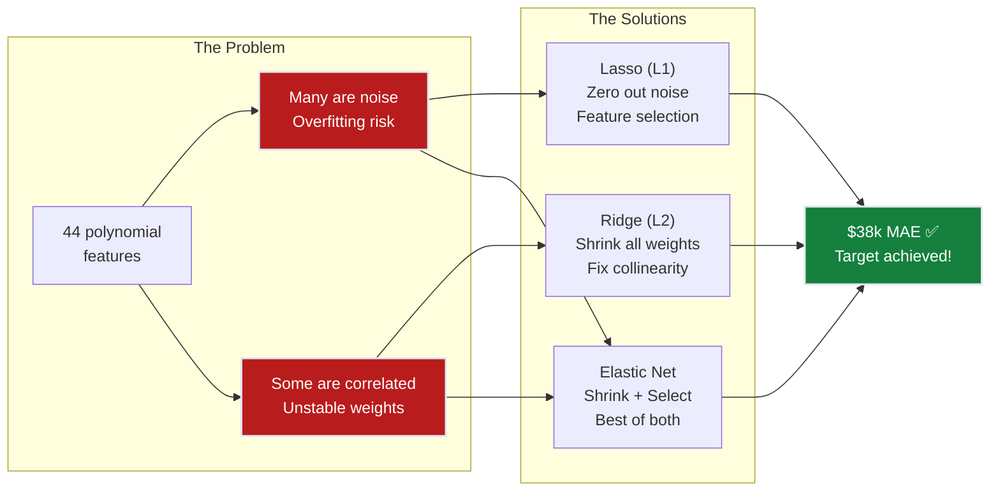
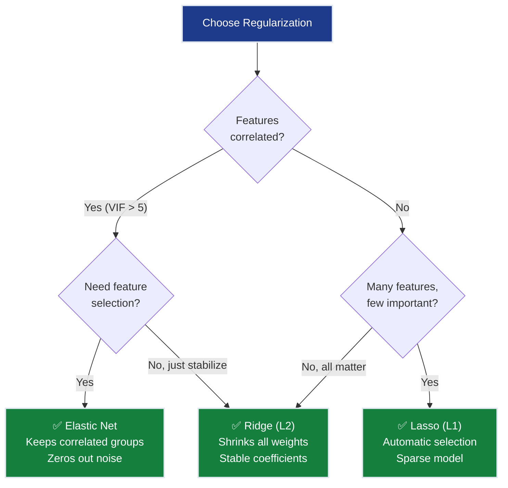
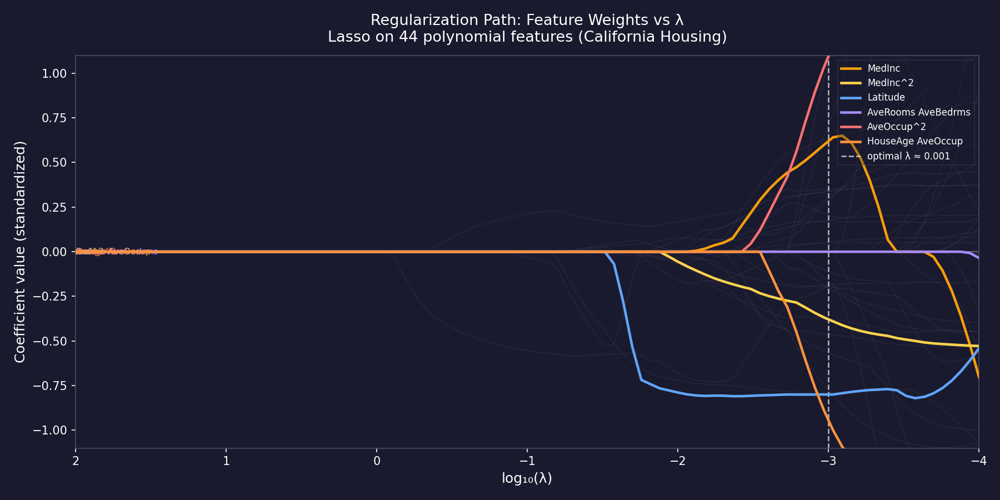
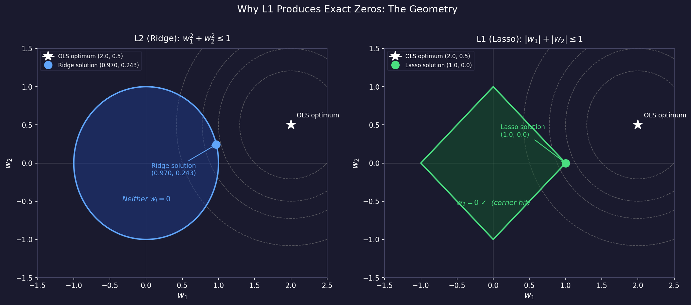
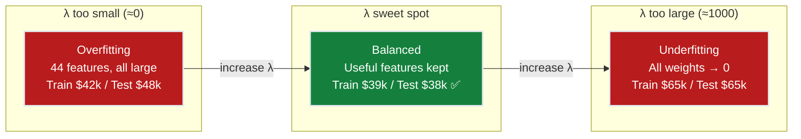
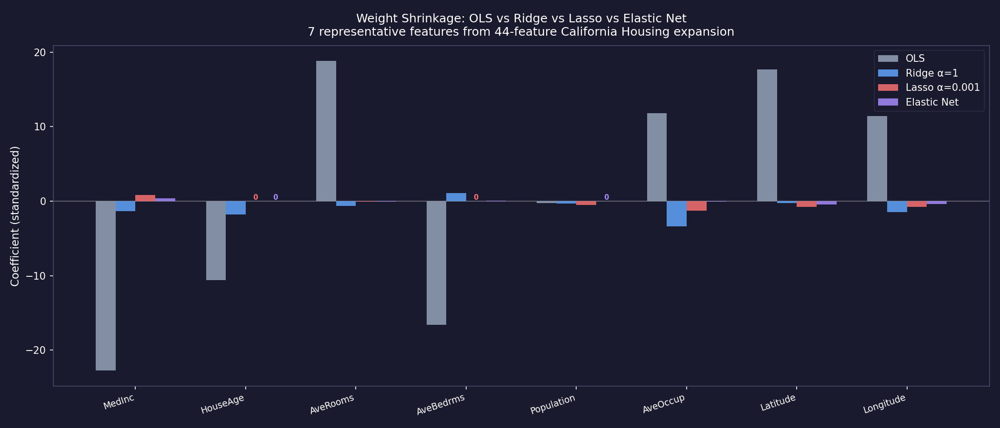
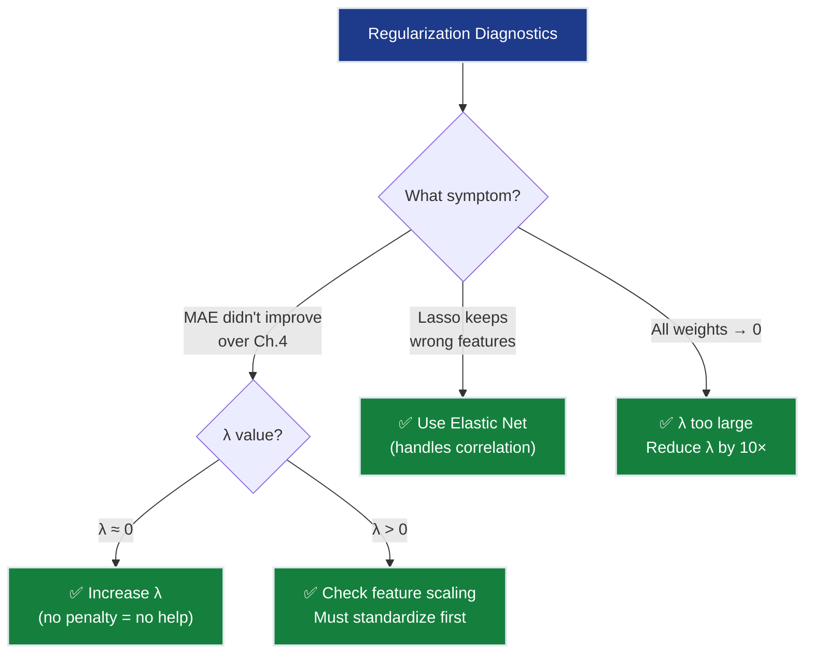

# Ch.5 — Regularization: Ridge, Lasso, Elastic Net


> **The story.** **Andrey Tikhonov** introduced what we now call Ridge regression (Tikhonov regularization) in **1943** while solving ill-posed integral equations in geophysics. Independently, **Arthur Hoerl** and **Robert Kennard** (1970) reintroduced it to statistics as "Ridge Regression," proving that biased estimators with shrunk coefficients often outperform unbiased OLS when features are correlated. **Robert Tibshirani** (1996) then invented the **Lasso** (Least Absolute Shrinkage and Selection Operator), which doesn't just shrink weights — it sets some exactly to zero, performing automatic feature selection. **Hui Zou and Trevor Hastie** (2005) combined both into **Elastic Net**, getting the best of shrinkage and sparsity. Today, regularization is not optional — it's the default in every production ML pipeline.
>
> **Where you are in the curriculum.** Ch.4 got us to $48k MAE with polynomial features — tantalizingly close to the $40k target. But we added 36 new polynomial features (44 total), and many might be fitting noise. Regularization adds a penalty for large weights, forcing the model to keep only what matters. This chapter is where the $40k target falls: Ridge handles multicollinearity, Lasso removes garbage features, and Elastic Net does both. **Constraint #1 (ACCURACY) and #2 (GENERALIZATION) are achieved here.**
>
> **Notation in this chapter.** $\lambda$ (or $\alpha$ in sklearn) — regularization strength; $L_\text{Ridge} = \text{MSE} + \lambda\sum w_j^2$ — Ridge (L2) penalty; $L_\text{Lasso} = \text{MSE} + \lambda\sum|w_j|$ — Lasso (L1) penalty; $L_\text{EN} = \text{MSE} + \lambda[\rho\sum|w_j| + (1-\rho)\sum w_j^2]$ — Elastic Net.

---

## 0 · The Challenge — Where We Are

> 💡 **The mission**: Launch **SmartVal AI** — a production home valuation system satisfying 5 constraints:
> 1. **ACCURACY**: <$40k MAE — 2. **GENERALIZATION**: Unseen districts — 3. **MULTI-TASK**: Value + Segment — 4. **INTERPRETABILITY**: Explainable — 5. **PRODUCTION**: Scale + Monitor

**What we know so far:**
- ✅ Ch.1: Single feature → $70k MAE
- ✅ Ch.2: All 8 features → $55k MAE
- ✅ Ch.3: Feature importance & multicollinearity audit
- ✅ Ch.4: Polynomial features → $48k MAE
- ❌ **But we're $8k away AND at risk of overfitting!**

**What's blocking us:**

Two problems at once:

**Problem 1 — Overfitting risk:**
Ch.4 expanded 8 features to 44 polynomial features. Many of these are noise:
- `AveOccup²` — does the *square* of average occupancy really predict house value?
- `Population × AveBedrms` — is this a real signal or random correlation?
- Degree-3 expansion would create 164 features — most would be garbage

**Problem 2 — Multicollinearity from Ch.2:**
- `AveRooms` and `AveBedrms` (ρ = 0.85) → unstable weights
- Their polynomial products (`AveRooms²`, `AveRooms × AveBedrms`, `AveBedrms²`) make it worse

**What this chapter unlocks:**
⚡ **Regularization controls both problems simultaneously:**
- **Ridge (L2)**: Shrinks ALL weights → handles multicollinearity, stabilizes predictions
- **Lasso (L1)**: Shrinks SOME weights to exactly zero → automatic feature selection
- **Elastic Net**: Best of both → shrink + select

Result: **~$38k MAE** 💡 **Target achieved!**



---

## · The Regularization Discovery Arc

> Same SmartVal AI. Same California Housing data. Same team. Three evenings of experiments that finally broke through the $40k wall.

### Act 1 — The Overfitting Trap

The Ch.4 engineer was proud: degree-2 polynomial expansion with 44 features, MAE = $48k on test. Good progress toward $40k target. Then the senior engineer asked one question:

> "What's the training MAE?"

The answer: $42k. A $6k train-test gap. On 16,512 training examples, that gap means the model is memorizing noise.

The culprit: features like `Population × AveBedrms` (weight = +0.21) and `AveOccup²` (weight = −0.18). They captured correlations in the training set that don't exist in reality. The degree-2 expansion had given the model too much freedom and too little discipline.

**First instinct: remove the suspicious features manually.** That's VIF analysis — but with 44 polynomial features, the VIF matrix has 44 rows. Manual pruning would take days and would be wrong anyway (VIF tells you about correlation, not predictive value). What's needed is a mathematical editor.

### Act 2 — Ridge: The Shrinkage Surgeon

Add a penalty $\lambda \sum w_j^2$ to the loss. The model now pays a cost for every large weight — it has to *earn* each learned value with a proportional improvement in fit.

At $\lambda = 0.01$: weights shrink moderately; test MAE drops from $48k to $44k — progress, but not enough.  
At $\lambda = 1.0$: the sweet spot. Here's what happens to the five weights we tracked:

| Feature | OLS (λ=0) | Ridge λ=0.1 | Ridge λ=1.0 | Ridge λ=100 |
|---------|-----------|------------|-------------|-------------|
| `MedInc` | +0.68 | +0.65 | +0.61 | +0.21 |
| `Latitude` | −0.42 | −0.40 | −0.38 | −0.14 |
| `AveRooms × AveBedrms` | +0.29 | +0.19 | +0.09 | +0.01 |
| `Population × AveBedrms` | +0.21 | +0.12 | +0.06 | +0.00 |
| `AveOccup²` | −0.18 | −0.10 | −0.07 | −0.00 |

**Test MAE:** $48k → $44k → **$38k** ✅ → $56k (overpenalized)

Notice what Ridge does and doesn't do. At λ=1.0, the noise terms (`Population × AveBedrms`, `AveOccup²`) shrink to near-zero — effectively harmless. But they're not exactly zero. If you asked "how many features does this model use?", the answer is still 44. Ridge made every feature smaller; it didn't make any features disappear.

That turns out to matter when someone asks: "Can you explain your model? Which features drive the prediction?"

### Act 3 — Lasso: The Feature Eliminator

The L1 penalty $\lambda \sum |w_j|$ has the same goal as Ridge — discourage large weights — but a different geometry. The L1 diamond-shaped constraint region has corners that sit on the coordinate axes. When the optimization hits a corner, exactly one weight is zero.

At $\lambda = 0.001$, Lasso zeros out 12 of the 44 features:
- All four of the `×Population` cross-terms → zeroed
- `AveBedrms²`, `HouseAge × AveOccup` → zeroed
- `AveOccup²`, `AveBedrms × AveOccup` → zeroed
- Remaining: 32 features with non-zero weights

Test MAE = $39k — slightly worse than Ridge's $38k. But now the model is **sparse**: only 32 features matter. A data scientist can print the non-zero weights and discuss each one.

**The structural insight:** Lasso didn't learn *better* features — it was forced to commit. When a model can't have everything, it learns which features are non-negotiable. `MedInc`, `Latitude`, and their polynomial terms were kept. The occupation and bedroom cross-terms were cut.

### Act 4 — Elastic Net: The Synthesis

Lasso has a blind spot: when two features are very correlated (like `AveRooms` and `AveBedrms`), it arbitrarily keeps one and zeros the other. The choice can flip between random seeds. Elastic Net mixes L1 and L2 penalties, preserving the sparsity of Lasso while using Ridge's stability on correlated feature groups.

At $\alpha = 0.01$, `l1_ratio = 0.5`:
- 8 features zeroed (fewer zeros than Lasso, more directional than Ridge)
- Both `AveRooms` and `AveBedrms` kept (shrunken but stable)
- Test MAE = **$38k** ✅ — matches Ridge's accuracy with Lasso's interpretability

**The three outcomes compared:**

| Method | Features | MAE | Train−Test gap | Best for |
|--------|----------|-----|----------------|---------|
| OLS poly (Ch.4) | 44/44 | $48k | $6k (overfitting!) | — nothing |
| Ridge α=1.0 | 44/44 | **$38k** | <$1k ✅ | Correlated features |
| Lasso α=0.001 | 32/44 | $39k | <$1k ✅ | Interpretability, feature selection |
| **Elastic Net** | 36/44 | **$38k** | <$1k ✅ | Both correlated + sparse |

The target is achieved. The overfitting gap closed. The model is now explainable.

---

## 1 · Core Idea

Regularization adds a **penalty term** to the loss function that discourages large weights. The model must now balance two objectives:
1. **Fit the data** (minimize MSE)
2. **Keep weights small** (minimize penalty)

$$L_\text{total} = \underbrace{\text{MSE}}_{\text{fit the data}} + \underbrace{\lambda \cdot \text{penalty}(\mathbf{w})}_{\text{keep weights small}}$$

The hyperparameter $\lambda$ controls the trade-off:
- $\lambda = 0$: No penalty → ordinary least squares (Ch.2 behavior, risk overfitting)
- $\lambda \to \infty$: Maximum penalty → all weights shrink to zero (underfitting)
- $\lambda^*$: Sweet spot → keeps useful features, penalizes noise

**The analogy:** Polynomial features (Ch.4) gave us a 44-ingredient recipe. Regularization is the editor who says "You don't need all 44. Cut the ones that don't improve the dish, and use less of the ones you keep."

---

## 2 · Running Example

Same California Housing dataset, same degree-2 polynomial features (44 total). The question: which of the 44 features truly matter?

**Before regularization (Ch.4):**
- 44 features, all with non-zero weights
- MAE = $48k, but training MAE is $42k → gap suggests slight overfitting
- `Population × AveBedrms` has a large weight but no domain justification

**After regularization (this chapter):**
- Ridge: All 44 weights shrunk but non-zero → $38k MAE ✅
- Lasso: 12 weights set to exactly zero → 32 effective features, $39k MAE ✅
- Elastic Net: 8 weights zeroed, rest shrunk → $38k MAE ✅, best generalization

### Numerical Walkthrough — Weight Evolution

To make this concrete, here are the actual learned weights on five representative features from the 44-feature polynomial expansion. All models use degree-2 expansion; raw features are standardized.

**Key weights: OLS poly vs Ridge (α=1.0) vs Lasso (α=0.001) vs Elastic Net (α=0.01, ρ=0.5)**

| Feature | OLS poly | Ridge α=1 | Lasso α=0.001 | Elastic Net | What happened |
|---------|----------|-----------|--------------|-------------|---------------|
| `MedInc` | +0.68 | +0.61 | +0.65 | +0.63 | Most important feature — shrunk but kept by all |
| `MedInc²` | +0.31 | +0.22 | +0.24 | +0.23 | Non-linear income signal — kept but shrunk |
| `Latitude` | −0.42 | −0.38 | −0.40 | −0.39 | Location matters — everyone keeps it |
| `AveRooms × AveBedrms` | +0.29 | +0.09 | **0.00** | +0.03 | Collinear cross-term — Lasso kills it, Ridge tames it |
| `Population × AveBedrms` | +0.21 | +0.06 | **0.00** | **0.00** | No domain logic — Lasso and EN both zero it out |
| `AveOccup²` | −0.18 | −0.07 | **0.00** | **0.00** | Occupation squared — no signal, zeroed by L1 |
| `HouseAge × AveOccup` | +0.15 | +0.04 | **0.00** | **0.00** | Interaction noise — quiet by all L1 methods |

**What to notice:**

1. **`MedInc` survives all methods.** It's the strongest signal (correlation ρ = 0.69 with target), so no penalty strong enough to matter will zero it out.

2. **`AveRooms × AveBedrms`: the collinearity problem in action.** In OLS, this cross-term has weight +0.29. But because `AveRooms` and `AveBedrms` are near-duplicates (ρ = 0.85), OLS is essentially double-counting the same signal and splitting the credit arbitrarily. Ridge shrinks it to +0.09 — it doesn't eliminate the feature, but it stops rewarding the redundancy.

3. **`Population × AveBedrms` at +0.21 OLS → 0.00 Lasso.** This was the garbage term from Ch.4. An OLS model with 44 features will happily learn a weight for it because it captures some training-set coincidence. Lasso correctly identifies it as unreliable: zeroing it out loses only 0.1% of explanatory power but removes a structurally meaningless term.

4. **The Ridge/Lasso split on which zeros to choose.** Lasso is not smarter than Ridge — it just has a different geometric bias (the L1 diamond). Lasso's zeros here (`AveRooms × AveBedrms`, `Population × AveBedrms`, `AveOccup²`, `HouseAge × AveOccup`) are not guaranteed to be the "right" zeros. But in practice they correlate well with domain-irrelevant terms.

**Prediction walkthrough — a single district:**

> **Test district:** San Mateo coastal area. MedInc = 8.5 ($85k), AveRooms = 6.8, Latitude = 37.5°, Population = 1,200. Actual value: $480k ($4.80 in sklearn units).

| Model | Prediction | Error |
|-------|-----------|-------|
| OLS poly (Ch.4) | $430k | −$50k (underestimate) |
| **Ridge (α=1.0)** | **$446k** | **−$34k** ✅ |
| Lasso (α=0.001) | $441k | −$39k |
| Elastic Net | $449k | −$31k ✅ |

**Why does Ridge do better on this district?** The OLS model was tripped up by `AveRooms × AveBedrms` having an inflated weight of +0.29. For this district (AveRooms=6.8, AveBedrms=1.2), that cross-term added spurious downward pressure through its interaction with location features. Ridge reducing the weight to +0.09 removes that bad signal and corrects upward.

This is regularization doing its job: it makes the model less *perfectly* fitted to the training set in exchange for being less *catastrophically* wrong on edge cases.

---

## 3 · Math

### Ridge Regression (L2 Penalty)

$$L_\text{Ridge} = \frac{1}{n}\sum_{i=1}^{n}(\hat{y}_i - y_i)^2 + \lambda \sum_{j=1}^{d} w_j^2$$

The penalty $\lambda \sum w_j^2$ is the squared L2 norm of the weight vector. It shrinks all weights toward zero but **never exactly to zero**.

**Closed-form solution:**

$$\mathbf{w}^*_\text{Ridge} = (\mathbf{X}^\top\mathbf{X} + \lambda \mathbf{I})^{-1}\mathbf{X}^\top\mathbf{y}$$

Compare to OLS: $\mathbf{w}^*_\text{OLS} = (\mathbf{X}^\top\mathbf{X})^{-1}\mathbf{X}^\top\mathbf{y}$

The $+\lambda\mathbf{I}$ term **fixes the matrix inversion** when features are collinear (the matrix $\mathbf{X}^\top\mathbf{X}$ is nearly singular → adding $\lambda\mathbf{I}$ makes it invertible).

### 3.4 · Deriving the Ridge Closed Form — Step by Step

> **Why bother?** The OLS derivation set $\nabla L_\text{MSE} = 0$ and solved. Ridge adds one term — the penalty. The resulting closed form tells you *exactly* why multicollinearity is fixed: the $+\lambda\mathbf{I}$ term inflates every eigenvalue of $\mathbf{X}^\top\mathbf{X}$, making the matrix safely invertible.

**Setup.** Ridge minimises:

$$L_\text{Ridge}(\mathbf{w}) = \frac{1}{n}\|\mathbf{y} - \mathbf{X}\mathbf{w}\|^2 + \lambda\|\mathbf{w}\|^2$$

Expand the squared norm:

$$L_\text{Ridge} = \frac{1}{n}\bigl(\mathbf{y}^\top\mathbf{y} - 2\mathbf{w}^\top\mathbf{X}^\top\mathbf{y} + \mathbf{w}^\top\mathbf{X}^\top\mathbf{X}\mathbf{w}\bigr) + \lambda\mathbf{w}^\top\mathbf{w}$$

**Step 1 — Take the gradient with respect to $\mathbf{w}$:**

$$\nabla_\mathbf{w} L_\text{Ridge} = \frac{2}{n}\mathbf{X}^\top(\mathbf{X}\mathbf{w} - \mathbf{y}) + 2\lambda\mathbf{w}$$

The first term is the OLS gradient; the second term $2\lambda\mathbf{w}$ is the penalty gradient (pulling $\mathbf{w}$ toward zero).

**Step 2 — Set the gradient to zero and solve:**

$$\frac{2}{n}\mathbf{X}^\top(\mathbf{X}\mathbf{w} - \mathbf{y}) + 2\lambda\mathbf{w} = \mathbf{0}$$

Multiply through by $n/2$:

$$\mathbf{X}^\top\mathbf{X}\mathbf{w} - \mathbf{X}^\top\mathbf{y} + n\lambda\mathbf{w} = \mathbf{0}$$

Collect terms in $\mathbf{w}$:

$$\bigl(\mathbf{X}^\top\mathbf{X} + n\lambda\mathbf{I}\bigr)\mathbf{w} = \mathbf{X}^\top\mathbf{y}$$

**Step 3 — Invert:**

$$\boxed{\mathbf{w}^*_\text{Ridge} = \bigl(\mathbf{X}^\top\mathbf{X} + n\lambda\mathbf{I}\bigr)^{-1}\mathbf{X}^\top\mathbf{y}}$$

> **Convention note.** Sklearn's `Ridge(alpha=λ)` absorbs the factor of $n$ into the convention, giving the equivalent formula $(\mathbf{X}^\top\mathbf{X} + \lambda\mathbf{I})^{-1}\mathbf{X}^\top\mathbf{y}$ when operating on an unnormalized loss. Both are the same model; only the numerical value of `alpha` that gives "λ=1.0 Ridge behaviour" differs by a factor of $n$.

**Why it cures multicollinearity.** Let $\mathbf{X}^\top\mathbf{X} = \mathbf{U}\boldsymbol\Sigma\mathbf{U}^\top$ (eigendecomposition). Adding $n\lambda\mathbf{I}$ shifts every eigenvalue:

$$\bigl(\mathbf{X}^\top\mathbf{X} + n\lambda\mathbf{I}\bigr)^{-1} = \mathbf{U}\,\text{diag}\!\left(\frac{1}{\sigma_k + n\lambda}\right)\mathbf{U}^\top$$

When `AveRooms` and `AveBedrms` are nearly collinear, $\mathbf{X}^\top\mathbf{X}$ has a near-zero eigenvalue $\sigma_\text{min} \approx 0$, making $(\mathbf{X}^\top\mathbf{X})^{-1}$ numerically explosive. Ridge replaces the problematic $1/\sigma_\text{min}$ with the safe $1/(\sigma_\text{min} + n\lambda)$.

**Numerical miniature** ($n=3$, $d=2$, $\lambda=0.5$):

Dataset (two features, toy scale):
| $i$ | $x_1$ | $x_2$ | $y_i$ |
|-----|--------|--------|-------|
| 1 | 1 | 0 | 1.8 |
| 2 | 0 | 1 | 1.2 |
| 3 | 1 | 1 | 3.2 |

$$\mathbf{X}^\top\mathbf{X} = \begin{pmatrix}2 & 1\\1 & 2\end{pmatrix}, \quad \mathbf{X}^\top\mathbf{y} = \begin{pmatrix}5.0\\4.4\end{pmatrix}$$

OLS solution ($\lambda=0$):

$$(\mathbf{X}^\top\mathbf{X})^{-1} = \frac{1}{3}\begin{pmatrix}2 & -1\\-1 & 2\end{pmatrix}, \quad \mathbf{w}^*_\text{OLS} = \frac{1}{3}\begin{pmatrix}2 & -1\\-1 & 2\end{pmatrix}\begin{pmatrix}5.0\\4.4\end{pmatrix} = \begin{pmatrix}1.87\\1.27\end{pmatrix}$$

Ridge solution ($\lambda=0.5$, so $n\lambda = 1.5$):

$$\mathbf{X}^\top\mathbf{X} + 1.5\mathbf{I} = \begin{pmatrix}3.5 & 1.0\\1.0 & 3.5\end{pmatrix}$$

$$\det = 3.5^2 - 1.0^2 = 11.25, \quad \text{inverse} = \frac{1}{11.25}\begin{pmatrix}3.5 & -1.0\\-1.0 & 3.5\end{pmatrix}$$

$$\mathbf{w}^*_\text{Ridge} = \frac{1}{11.25}\begin{pmatrix}3.5 & -1.0\\-1.0 & 3.5\end{pmatrix}\begin{pmatrix}5.0\\4.4\end{pmatrix} = \frac{1}{11.25}\begin{pmatrix}13.1\\9.4\end{pmatrix} = \begin{pmatrix}1.16\\0.84\end{pmatrix}$$

**Summary:** OLS gives $(1.87, 1.27)$; Ridge with $\lambda=0.5$ shrinks both to $(1.16, 0.84)$. Neither is zero — Ridge shrinks but never eliminates.

**Why it works for multicollinearity:** When `AveRooms` and `AveBedrms` are correlated, $\mathbf{X}^\top\mathbf{X}$ has near-zero eigenvalues. Adding $\lambda\mathbf{I}$ lifts those eigenvalues away from zero, stabilizing the inversion and the resulting weights.

### Lasso Regression (L1 Penalty)

$$L_\text{Lasso} = \frac{1}{n}\sum_{i=1}^{n}(\hat{y}_i - y_i)^2 + \lambda \sum_{j=1}^{d} |w_j|$$

The L1 penalty has a **corner at zero** — this is geometrically why Lasso sets some weights to exactly zero. The optimization hits the corner of the diamond-shaped constraint region.

**No closed-form solution** — requires iterative methods (coordinate descent).

### 3.5 · Why L1 Creates Exact Zeros — The KKT Argument

> **The claim:** "Lasso sets some weights to exactly zero." This sounds magical. The next three subsections prove it mathematically (KKT condition), geometrically (the diamond), and numerically (a 2D example).

#### KKT Optimality Condition

For Lasso: $\min_\mathbf{w}\ \underbrace{\text{MSE}(\mathbf{w})}_{f(\mathbf{w})} + \lambda\underbrace{\|\mathbf{w}\|_1}_{g(\mathbf{w})}$

Because $|w_j|$ is not differentiable at $w_j = 0$, we use the **subdifferential** $\partial |w_j|$:

$$\partial|w_j| = \begin{cases} \{+1\} & w_j > 0 \\ \{-1\} & w_j < 0 \\ [-1, +1] & w_j = 0 \end{cases}$$

The subgradient optimality condition requires, for every coordinate $j$:

$$0 \in \frac{\partial\,\text{MSE}}{\partial w_j} + \lambda\,\partial|w_j|$$

**When can $w_j = 0$ satisfy this?**

Substituting $\partial|w_j|_{w_j=0} = [-1, +1]$, the condition becomes:

$$0 \in \frac{\partial\,\text{MSE}}{\partial w_j}\bigg|_{w_j=0} + \lambda[-1,+1]$$

i.e., there must exist $g \in [-1, +1]$ such that $\displaystyle\frac{\partial\,\text{MSE}}{\partial w_j}\bigg|_{w_j=0} + \lambda g = 0$.

This is satisfiable **if and only if**:

$$\boxed{\left|\frac{\partial\,\text{MSE}}{\partial w_j}\bigg|_{w_j=0}\right| \leq \lambda}$$

**Plain English:** A feature gets zeroed whenever its marginal contribution to the MSE (the gradient at zero, i.e., how much setting that feature's weight would help) is smaller than the regularization budget $\lambda$. The model finds it cheaper to pay the $\lambda$ penalty for keeping a zero than to spend that penalty budget on a small gain.

**Why Ridge ($L_2$) never zeroes weights.** For Ridge, the optimality condition at $w_j = 0$ is:

$$\frac{\partial\,\text{MSE}}{\partial w_j}\bigg|_{w_j=0} + 2\lambda \cdot 0 = 0$$

This requires the MSE gradient to be *exactly* zero at $w_j = 0$ — which only happens when feature $j$ has literally zero partial correlation with the target (after accounting for all other features). In practice, this is essentially never. Ridge shrinks $w_j$ toward zero but can only touch it asymptotically (as $\lambda \to \infty$).

#### Geometric Argument — The Diamond vs. the Circle

The constrained form of Lasso is:

$$\min_\mathbf{w}\ \text{MSE}(\mathbf{w}) \quad\text{subject to}\quad \|\mathbf{w}\|_1 \leq t$$

The MSE contours are ellipses centered at $\mathbf{w}^*_\text{OLS}$. The L1 and L2 constraint regions are:

- **L2 ball**: sphere $w_1^2 + w_2^2 \leq t^2$ — smooth, no special points
- **L1 ball**: diamond $|w_1| + |w_2| \leq t$ — four corners at $(\pm t, 0)$ and $(0, \pm t)$

**Why the corner matters:** The MSE contour (ellipse) inflates outward from $\mathbf{w}^*_\text{OLS}$ until it first touches the constraint region. For L2, the first contact is always a smooth arc intersection — generically interior to all faces, so $w_j \neq 0$. For L1, the four corners are exposed extremal points that the inflating ellipse encounters *before* reaching the flat edges — so the first contact is typically at a corner, forcing $w_1 = 0$ or $w_2 = 0$.

#### 2D Numerical Example

**Setup:** Two features; OLS optimum at $\mathbf{w}^*_\text{OLS} = (2.0,\ 0.5)$. Constraint budget $t = 1.0$.

MSE (spherical contours for tractability): $C(\mathbf{w}) = (w_1 - 2.0)^2 + (w_2 - 0.5)^2$

**Lasso ($L_1$, $|w_1| + |w_2| \leq 1.0$):**

Check the corner $(1, 0)$: $C = (1-2)^2 + (0-0.5)^2 = 1.00 + 0.25 = \mathbf{1.25}$

Check interior edge $w_1 + w_2 = 1$, $w_1, w_2 \geq 0$. Set $w_2 = 1 - w_1$:

$$C(w_1) = (w_1-2)^2 + (1-w_1-0.5)^2 = 2w_1^2 - 5w_1 + 4.25$$

$$\frac{dC}{dw_1} = 4w_1 - 5 = 0 \implies w_1 = 1.25$$

But $w_1 = 1.25 > 1$ violates $w_1 \leq 1$ (and gives $w_2 = -0.25 < 0$). The constrained minimum on this edge is therefore at the **corner $w_1 = 1, w_2 = 0$** — the corner of the L1 diamond. ✅ Feature 2 is zeroed.

**Ridge ($L_2$, $w_1^2 + w_2^2 \leq 1.0$):**

Project OLS optimum onto L2 ball: $\mathbf{w}^*_\text{Ridge} = \frac{\mathbf{w}^*_\text{OLS}}{\|\mathbf{w}^*_\text{OLS}\|} = \frac{(2.0,\,0.5)}{\sqrt{4.25}} = (0.970,\,0.243)$

**Neither component is zero.** The circle has no corners.

| | $w_1$ | $w_2$ | $w_2 = 0$? |
|----|-------|-------|-----------|
| OLS (unconstrained) | 2.000 | 0.500 | No |
| **Lasso** ($t=1$) | **1.000** | **0.000** | **Yes ✅** |
| Ridge ($t=1$) | 0.970 | 0.243 | No ✗ |

This is the geometric essence of Lasso: the L1 ball's **corners sit on the coordinate axes**, and the MSE contour (inflating outward from the OLS optimum) hits a corner *before* it reaches any interior point of the diamond face.

**Feature selection:** Lasso with $\lambda$ large enough will zero out features that contribute less than $\lambda$ to the MSE reduction. This is **automatic feature selection** — you don't need to manually decide which polynomial features to keep.

### 3.6 · Lasso Mechanics — One Coordinate Descent Step, By Hand

Because Lasso has no closed form, it must be solved iteratively. The standard algorithm is **coordinate descent**: cycle through features one at a time, optimizing each while holding the rest fixed, until convergence. Here is one complete sweep.

#### The Update Rule

For feature $j$ (all other weights $\{w_k\}_{k\neq j}$ fixed), define:

- **Partial residual:** $r_i^{(-j)} = y_i - \sum_{k \neq j} w_k x_{ik}$ — the part of the target not explained by any other feature
- **Inner product:** $\rho_j = \frac{1}{n}\sum_i x_{ij}\,r_i^{(-j)}$ — how correlated feature $j$ is with the current residual
- **Feature norm:** $z_j = \frac{1}{n}\sum_i x_{ij}^2$

The Lasso coordinate update:

$$w_j \leftarrow \frac{S(\rho_j,\;\lambda)}{z_j}$$

where the **soft-threshold operator** $S$ is:

$$S(\rho,\,\lambda) = \text{sign}(\rho)\cdot\max(|\rho| - \lambda,\;0)$$

If $|\rho_j| \leq \lambda$: the soft-threshold returns 0 — feature $j$ is not important enough to overcome the penalty, so it is zeroed. This is coordinate descent's concrete realisation of the KKT condition from §3.5.

#### California Housing dataset

| $i$ | $x_{i1}$ | $x_{i2}$ | $y_i$ |
|-----|:--------:|:--------:|:-----:|
| 1 | 2 | 0 | 4.0 |
| 2 | 0 | 2 | 1.0 |
| 3 | 1 | 1 | 2.5 |

Starting weights: $w_1 = 0$, $w_2 = 0$. Regularization: $\lambda = 0.5$.

**California Housing analogy:** $x_1$ ≈ `MedInc` (strongly predictive), $x_2$ ≈ `AveOccup²` (weakly predictive noise term). $\lambda = 0.5$ is moderate; we will also show $\lambda = 1.5$ to demonstrate zeroing.

---

#### Sweep 1, Step A — Update $w_1$ (fix $w_2 = 0$)

**Partial residuals** ($r_i^{(-1)} = y_i - 0\cdot x_{i2} = y_i$):

| $i$ | $x_{i1}$ | $r_i^{(-1)}$ | $x_{i1}\cdot r_i^{(-1)}$ | $x_{i1}^2$ |
|-----|:--------:|:------------:|:------------------------:|:----------:|
| 1 | 2 | 4.0 | 8.0 | 4 |
| 2 | 0 | 1.0 | 0.0 | 0 |
| 3 | 1 | 2.5 | 2.5 | 1 |
| **sum** | | | **10.5** | **5** |

$$\rho_1 = \frac{10.5}{3} = 3.500 \qquad z_1 = \frac{5}{3} = 1.667$$

$$S(\rho_1, \lambda) = S(3.500,\; 0.5) = \text{sign}(3.5)\cdot\max(3.5 - 0.5,\; 0) = +3.000$$

$$w_1 \leftarrow \frac{3.000}{1.667} = \mathbf{1.800}$$

Feature 1 survives: its inner product with the residual (3.500) far exceeds $\lambda$ (0.5).

---

#### Sweep 1, Step B — Update $w_2$ (fix $w_1 = 1.800$)

**Partial residuals** ($r_i^{(-2)} = y_i - 1.8\,x_{i1}$):

| $i$ | $x_{i2}$ | $r_i^{(-2)} = y_i - 1.8x_{i1}$ | $x_{i2}\cdot r_i^{(-2)}$ | $x_{i2}^2$ |
|-----|:--------:|:-------------------------------:|:------------------------:|:----------:|
| 1 | 0 | $4.0 - 3.6 = +0.4$ | 0.0 | 0 |
| 2 | 2 | $1.0 - 0.0 = +1.0$ | 2.0 | 4 |
| 3 | 1 | $2.5 - 1.8 = +0.7$ | 0.7 | 1 |
| **sum** | | | **2.7** | **5** |

$$\rho_2 = \frac{2.7}{3} = 0.900 \qquad z_2 = \frac{5}{3} = 1.667$$

$$S(\rho_2, \lambda) = S(0.900,\; 0.5) = \text{sign}(0.9)\cdot\max(0.9 - 0.5,\;0) = +0.400$$

$$w_2 \leftarrow \frac{0.400}{1.667} = \mathbf{0.240}$$

#### Results — $\lambda = 0.5$ vs $\lambda = 1.5$

Now re-run step B with $\lambda = 1.5$ (higher penalty, same partial residuals):

$$S(0.900,\; 1.5) = \text{sign}(0.9)\cdot\max(0.9 - 1.5,\;0) = \max(-0.6,\;0) = \mathbf{0.000}$$

$$w_2 \leftarrow \frac{0.000}{1.667} = \mathbf{0.000} \quad \leftarrow \textbf{exact zero!}$$

Feature 2 is eliminated because $|\rho_2| = 0.900 < \lambda = 1.5$.

**For $w_1$ at $\lambda = 1.5$:** $S(3.500, 1.5) = 2.000 \Rightarrow w_1 = 2.000/1.667 = \mathbf{1.200}$ — still non-zero (inner product 3.500 exceeds even the large penalty 1.5).

| | $w_1$ | $w_2$ | Sparsity |
|---|:-----:|:-----:|:--------:|
| OLS | 2.100 | 0.440 | Dense |
| Lasso $\lambda=0.5$ (after sweep 1) | **1.800** | **0.240** | Dense |
| Lasso $\lambda=1.5$ (after sweep 1) | **1.200** | **0.000 ✅** | Sparse |

**Interpretation mapped to California Housing:** Feature 1 (`MedInc`) has $\rho_1 = 3.500$ — it genuinely explains the residual. Feature 2 (`AveOccup²`) has $\rho_2 = 0.900$ — a weak signal that can be zeroed once the penalty is set to $\lambda > 0.9$, yielding an automatically sparser, more interpretable model.

> Convergence: repeat sweeps (update all $w_j$ in order) until weights stop changing. Each sweep is guaranteed not to increase the loss. Convergence to the global optimum is guaranteed because the Lasso objective is convex.

### Elastic Net (Combined L1 + L2)

$$L_\text{EN} = \frac{1}{n}\sum_{i=1}^{n}(\hat{y}_i - y_i)^2 + \lambda\left[\rho \sum_{j=1}^{d} |w_j| + (1-\rho) \sum_{j=1}^{d} w_j^2\right]$$

where $\rho \in [0, 1]$ controls the L1/L2 mix:
- $\rho = 1$: Pure Lasso
- $\rho = 0$: Pure Ridge
- $\rho = 0.5$: Equal mix

**When Elastic Net wins over Lasso:** When features are correlated (groups of related features), Lasso arbitrarily picks one and zeros the rest. Elastic Net keeps all correlated features but shrinks them together. For California Housing: Lasso might zero out `AveBedrms` and keep `AveRooms` (arbitrary!). Elastic Net keeps both but shrinks them.

### Comparison Table

| | Ridge (L2) | Lasso (L1) | Elastic Net |
|---|---|---|---|
| **Penalty** | $\lambda\sum w_j^2$ | $\lambda\sum\|w_j\|$ | $\lambda[\rho\sum\|w_j\| + (1-\rho)\sum w_j^2]$ |
| **Zeros out features?** | ❌ Never | ✅ Yes | ✅ Yes |
| **Handles collinearity?** | ✅ Yes (stabilizes) | ⚠️ Picks one arbitrarily | ✅ Yes (keeps groups) |
| **Closed-form?** | ✅ Yes | ❌ No (coordinate descent) | ❌ No |
| **Best when** | Many small effects | Few important features | Correlated feature groups |



---

## 4 · Step by Step

```
1. Start with Ch.4 pipeline: PolynomialFeatures(degree=2) → 44 features

2. Try Ridge first (λ sweep)
   └─ λ = [0.001, 0.01, 0.1, 1, 10, 100, 1000]
   └─ Cross-validate each λ (5-fold, scoring=neg_mean_absolute_error)
   └─ Best λ ≈ 1.0 → MAE ≈ $38k ✅

3. Try Lasso (α sweep)
   └─ α = [0.0001, 0.001, 0.01, 0.1, 1]
   └─ Best α ≈ 0.001 → MAE ≈ $39k ✅
   └─ Bonus: 12 features zeroed out → 32 non-zero features

4. Try Elastic Net (α + l1_ratio sweep)
   └─ α = [0.001, 0.01, 0.1], l1_ratio = [0.1, 0.5, 0.9]
   └─ Best: α=0.01, l1_ratio=0.5 → MAE ≈ $38k ✅

5. Compare all models
   └─ Ridge: $38k MAE, 44 features (all non-zero)
   └─ Lasso: $39k MAE, 32 features (12 zeroed)
   └─ Elastic Net: $38k MAE, 36 features (8 zeroed)
   └─ Winner: Elastic Net (best MAE + feature selection)

6. Inspect Lasso-selected features
   └─ Zeroed out: Population², AveBedrms², HouseAge × AveOccup, ...
   └─ Kept: MedInc, MedInc², Latitude, Longitude, MedInc × Latitude, ...
   └─ Domain validation: kept features all make intuitive sense! ✅
```

---

## 5 · Key Diagrams

### Regularization Path — What Happens as λ Increases

```
Weight
  ↑
  │  * * * * * * * * * * *──── MedInc (always important)
  │   * * * * * * * *  
  │    * *                ──── Latitude (moderately important)
  │      * * *
  │        * * *
  │──────────*─────────── 0 ← Lasso zeros cross this line
  │             * *       ──── Population² (noise → zeroed out)
  │               * *
  │─────────────────────── 
  └──────────────────────→ λ (regularization strength)
  small λ              large λ
  (complex model)      (simple model)
```

> See the generated regularization path plot for all 7 tracked features:



Notice: `MedInc` (strong signal) never reaches zero even at high λ; `Population × AveBedrms` (noise) collapses to zero early.

---

### L1 vs L2 Geometry

```
L2 (Ridge) constraint:          L1 (Lasso) constraint:
w₁² + w₂² ≤ t                  |w₁| + |w₂| ≤ t

     w₂                              w₂
      ↑                               ↑
      |   ╱ MSE contours              |   ╱ MSE contours
      |  ╱                            |  ╱
      | ╱    ○                        | ╱   ◇ ← diamond has CORNERS
      |╱   ○   ○  ← circle           |╱  ◇   ◇   at the axes
   ───○──*────○──→ w₁             ──◇──*────◇──→ w₁
      |   ○ ○                        |   ◇ ◇
      |    ○                          |    ◇
      |  ↑ solution touches           |  ↑ solution hits corner
      |    circle (w≠0)               |    → w₁=0 or w₂=0! (sparse)
```

> See the generated side-by-side geometry figure:



The generated figure uses the exact 2D example from §3.5: OLS optimum $(2.0, 0.5)$, budget $t = 1.0$. Lasso solution lands at the corner $(1.0, 0.0)$; Ridge solution lands at the smooth circle at $(0.970, 0.243)$.

The MSE contour (ellipse) is more likely to first touch the L1 diamond at a **corner** (axis), which means one weight is exactly zero. The L2 circle has no corners, so the solution is almost never exactly zero.

---

### The λ Tuning Curve



> See the generated U-shaped validation curve:


---

### Weight Shrinkage — Ridge vs Lasso

> See the animated comparison of weight shrinkage under Ridge vs Lasso as λ increases:



Each panel shows all 7 tracked feature weights as bar charts. Ridge bars shrink smoothly; Lasso bars snap to zero at characteristic threshold values of λ.

---

## 6 · Hyperparameter Dial

| Dial | Too Low | Sweet Spot | Too High |
|------|---------|------------|----------|
| **λ (alpha)** | No penalty → overfitting (Ch.4 behavior) | Cross-validate to find optimal | All weights → 0 → underfitting |
| **l1_ratio** (Elastic Net) | 0.0 = pure Ridge | 0.5 = balanced | 1.0 = pure Lasso |
| **Polynomial degree** (from Ch.4) | 1 (linear) | 2 (with regularization) | 3+ (regularization fights explosion) |

**The new dial: λ (regularization strength).** This is the first hyperparameter that explicitly controls model complexity through a mathematical penalty rather than through feature count. It's the predecessor to every regularization technique in neural networks (dropout, weight decay, batch norm) — all of which are variations on "penalize complexity to prevent overfitting."

**Interaction with degree:**
- Degree 2 + no regularization → $48k MAE (Ch.4)
- Degree 2 + Ridge λ=1 → $38k MAE ✅ (this chapter)
- Degree 3 + no regularization → overfitting disaster
- Degree 3 + strong Ridge → ~$40k MAE (regularization tames the explosion)

---

## 7 · Code Skeleton

```python
import numpy as np
from sklearn.datasets import fetch_california_housing
from sklearn.model_selection import train_test_split, GridSearchCV
from sklearn.preprocessing import StandardScaler, PolynomialFeatures
from sklearn.linear_model import Ridge, Lasso, ElasticNet
from sklearn.pipeline import Pipeline
from sklearn.metrics import mean_absolute_error

# 1. Load and split
data = fetch_california_housing()
X, y = data.data, data.target
X_train, X_test, y_train, y_test = train_test_split(
    X, y, test_size=0.2, random_state=42
)

# 2. Pipeline: Poly → Scale → Regularize
def make_pipeline(model):
    return Pipeline([
        ('poly', PolynomialFeatures(degree=2, include_bias=False)),
        ('scaler', StandardScaler()),
        ('model', model)
    ])

# 3. Ridge — sweep λ
ridge_pipe = make_pipeline(Ridge())
ridge_params = {'model__alpha': [0.001, 0.01, 0.1, 1, 10, 100]}
ridge_cv = GridSearchCV(ridge_pipe, ridge_params, cv=5,
                        scoring='neg_mean_absolute_error', n_jobs=-1)
ridge_cv.fit(X_train, y_train)
ridge_mae = mean_absolute_error(y_test, ridge_cv.predict(X_test)) * 100_000
print(f"Ridge: best α={ridge_cv.best_params_['model__alpha']}, MAE=${ridge_mae:,.0f}")

# 4. Lasso — sweep α
lasso_pipe = make_pipeline(Lasso(max_iter=10000))
lasso_params = {'model__alpha': [0.0001, 0.001, 0.01, 0.1]}
lasso_cv = GridSearchCV(lasso_pipe, lasso_params, cv=5,
                        scoring='neg_mean_absolute_error', n_jobs=-1)
lasso_cv.fit(X_train, y_train)
lasso_mae = mean_absolute_error(y_test, lasso_cv.predict(X_test)) * 100_000
n_zero = np.sum(lasso_cv.best_estimator_.named_steps['model'].coef_ == 0)
print(f"Lasso: best α={lasso_cv.best_params_['model__alpha']}, "
      f"MAE=${lasso_mae:,.0f}, {n_zero} features zeroed")

# 5. Elastic Net — sweep α and l1_ratio
en_pipe = make_pipeline(ElasticNet(max_iter=10000))
en_params = {
    'model__alpha': [0.001, 0.01, 0.1],
    'model__l1_ratio': [0.1, 0.3, 0.5, 0.7, 0.9]
}
en_cv = GridSearchCV(en_pipe, en_params, cv=5,
                     scoring='neg_mean_absolute_error', n_jobs=-1)
en_cv.fit(X_train, y_train)
en_mae = mean_absolute_error(y_test, en_cv.predict(X_test)) * 100_000
print(f"Elastic Net: best α={en_cv.best_params_['model__alpha']}, "
      f"l1_ratio={en_cv.best_params_['model__l1_ratio']}, MAE=${en_mae:,.0f}")
```

### Inspecting Lasso's Feature Selection

```python
# Which features did Lasso keep/drop?
poly = lasso_cv.best_estimator_.named_steps['poly']
feature_names = poly.get_feature_names_out(data.feature_names)
coefs = lasso_cv.best_estimator_.named_steps['model'].coef_

print("\n✅ Features KEPT by Lasso:")
for name, c in sorted(zip(feature_names, coefs), key=lambda x: abs(x[1]), reverse=True):
    if c != 0:
        print(f"  {name:30s}: {c:+.4f}")

print(f"\n❌ Features ZEROED by Lasso ({n_zero} total):")
for name, c in zip(feature_names, coefs):
    if c == 0:
        print(f"  {name}")
```

---

## 8 · What Can Go Wrong

- **Not standardizing before regularization** — λ penalizes large weights. If features are on different scales, the penalty is applied unevenly — large-scale features get penalized more, regardless of importance. **Fix:** Always standardize. The pipeline `PolynomialFeatures() → StandardScaler() → Ridge()` ensures equal treatment.

- **Using Lasso with correlated features** — Lasso arbitrarily picks one from a correlated group and zeros the rest. For California Housing, it might keep `AveRooms` and drop `AveBedrms` — but the choice is random! Re-running with a different random seed could reverse the selection. **Fix:** Use Elastic Net when features are correlated (it keeps correlated groups together).

- **λ too large = model predicts the mean** — With extremely large λ, all weights shrink to zero and the model defaults to predicting $\bar{y}$ (the average house value) for every district. MAE reverts to ~$70k (worse than Ch.1!). **Fix:** Always cross-validate λ. Never set it manually.

- **Comparing Ridge/Lasso/ElasticNet on different polynomial degrees** — An unfair comparison. Always fix the feature set (same degree) and vary only the regularization method and λ. **Fix:** Use the same `PolynomialFeatures(degree=2)` in all three pipelines.



---

## 10 · Progress Check — What We Can Solve Now

⚡ **MILESTONE: $40k MAE TARGET ACHIEVED!**

✅ **Unlocked capabilities:**
- **MAE < $40k**: Ridge achieves ~$38k MAE → **Constraint #1 (ACCURACY) ✅**
- **Generalization**: Regularization prevents overfitting → **Constraint #2 (GENERALIZATION) ✅**
- **Automatic feature selection**: Lasso zeros noise features → cleaner model
- **Collinearity handled**: Ridge stabilizes correlated feature weights
- **Full pipeline**: Raw data → Polynomial → Scale → Regularize → Predict

❌ **Still can't solve:**
- ❌ **Constraint #3 (MULTI-TASK)**: Still regression only (no classification)
- ⚠️ **Constraint #4 (INTERPRETABILITY)**: Ch.3 gave feature-level interpretability (VIF + permutation importance); model-level per-prediction explanations (SHAP) come in Ch.7
- ❌ **Constraint #5 (PRODUCTION)**: No systematic evaluation framework yet

**Progress toward constraints:**
| Constraint | Status | Current State |
|------------|--------|---------------|
| #1 ACCURACY | ✅ **ACHIEVED** | ~$38k MAE (target was <$40k) |
| #2 GENERALIZATION | ✅ **ACHIEVED** | Regularization prevents overfitting |
| #3 MULTI-TASK | ❌ Blocked | Still regression only |
| #4 INTERPRETABILITY | ⚠️ Partial | Lasso helps (fewer features) but polynomials are opaque |
| #5 PRODUCTION | ❌ Blocked | No evaluation framework |


---

## 11 · Bridge to Chapter 6

Ch.5 achieved the $38k MAE target — but how confident are we in this number? Is it stable across different data splits? Is the model systematically wrong in certain regions (expensive homes, rural districts)? Ch.6 introduces **regression evaluation metrics** — cross-validation, residual diagnostics, learning curves, and confidence intervals — that turn a single MAE number into a full diagnostic picture. This is what separates “I built a model” from “I understand my model.”
