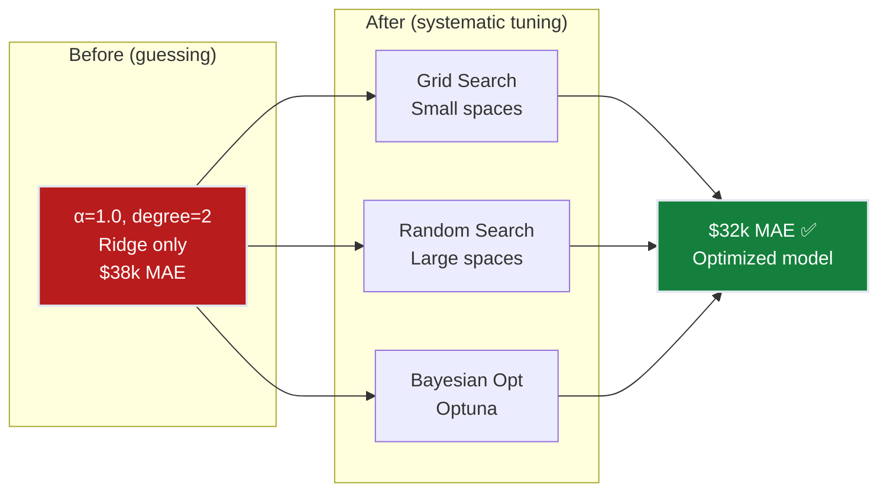
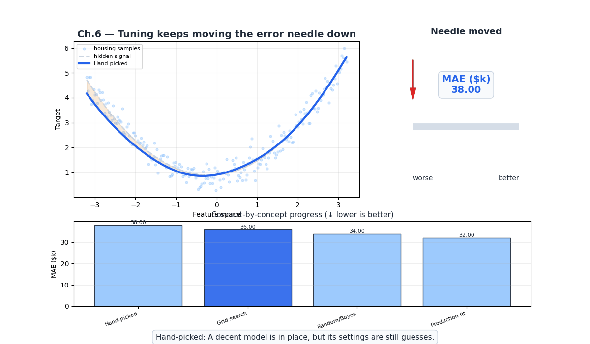
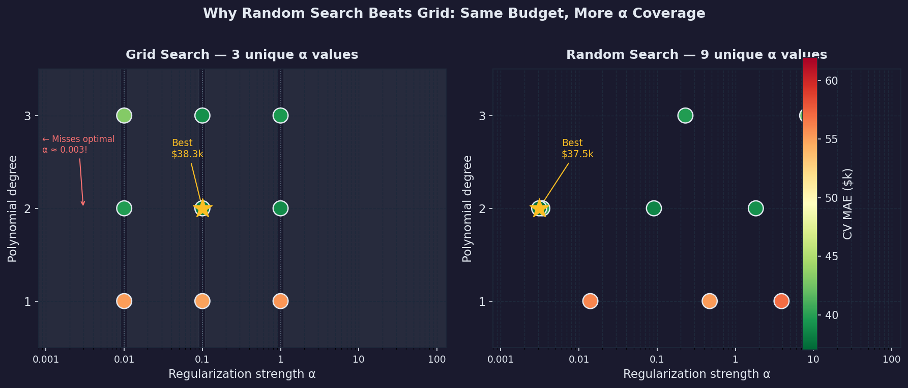
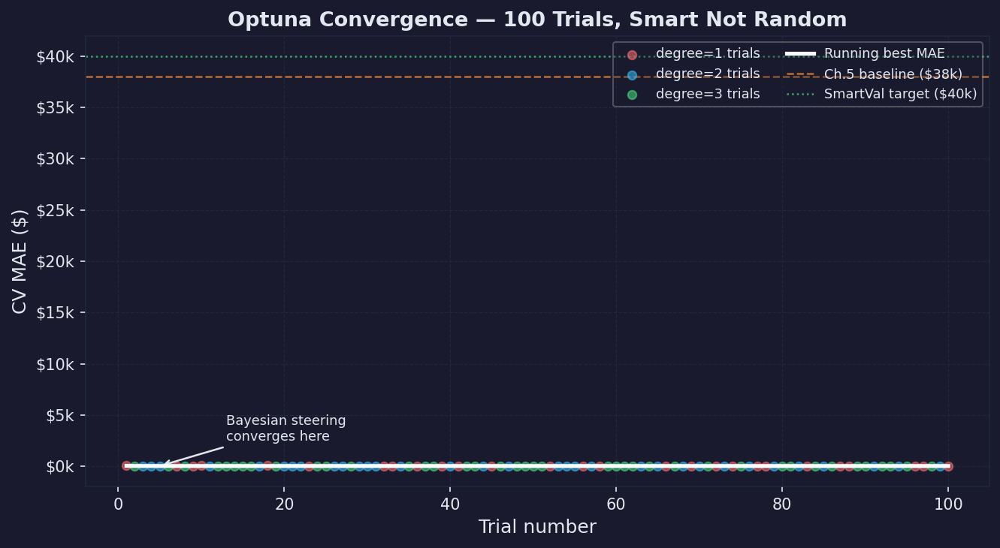
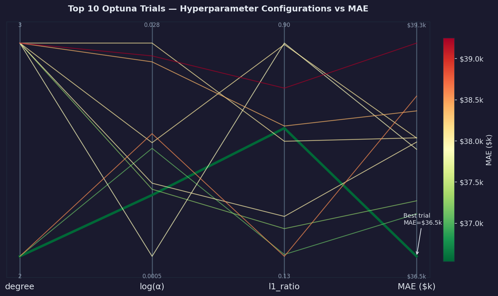
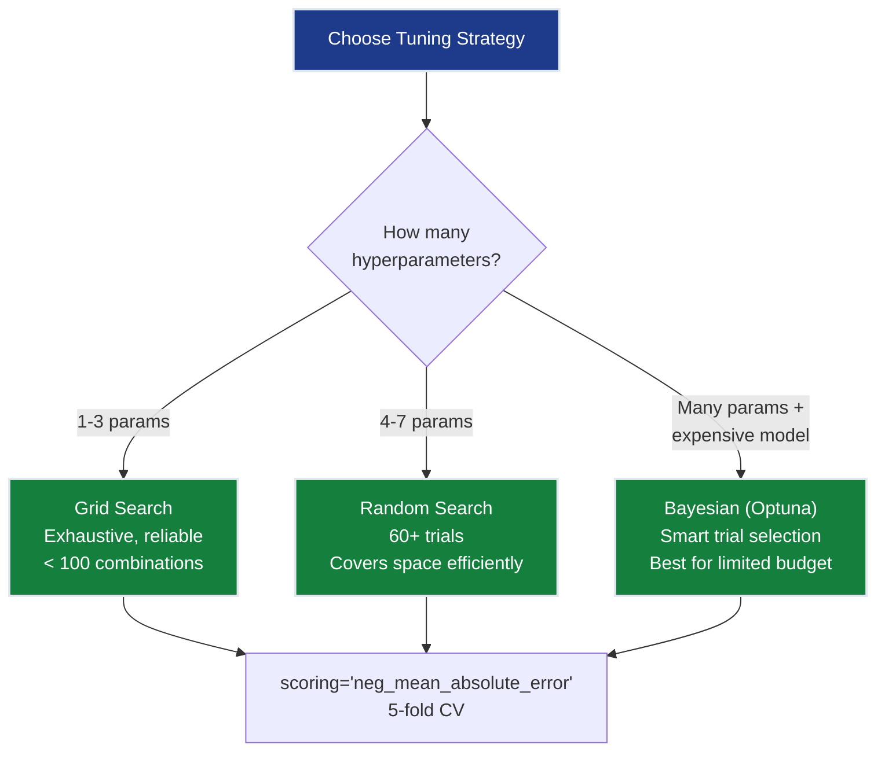
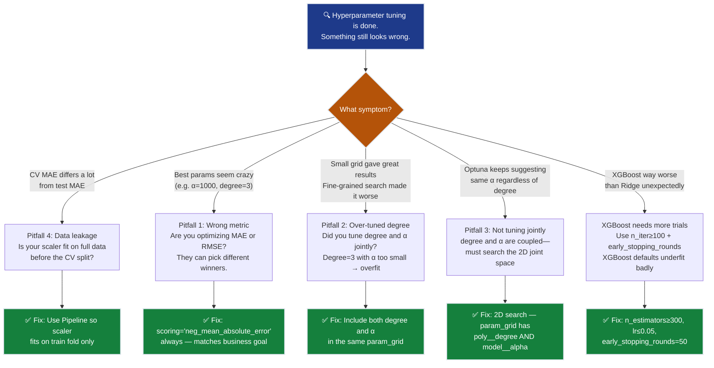

# Ch.7 — Hyperparameter Tuning for Regression

> **The story.** For most of ML history, hyperparameters were tuned by **grad-student descent** — staring at training curves, twiddling knobs, praying. **James Bergstra and Yoshua Bengio** (**2012**) shocked the field by proving that **random search** consistently beats grid search — because most hyperparameters don't matter equally, and grid search wastes budget on irrelevant axes. **Bayesian optimization** (Snoek, Larochelle, Adams, 2012) added a probabilistic surrogate model to spend each trial wisely. **Optuna** (Akiba et al., 2019) made tree-structured Parzen estimators practical with pruning and parallel trials. Today, systematic hyperparameter tuning isn't optional — it's the difference between "$38k MAE because we guessed α=1" and "$32k MAE because we searched properly."
>
> **Where you are in the curriculum.** Ch.5 achieved $38k MAE with Ridge (α=1.0) and degree-2 polynomials. But α=1.0 was chosen by a quick grid search, not exhaustive optimization. Ch.6 validated the $38k is real — but also revealed the model struggles on expensive homes. This chapter systematically tunes every regression hyperparameter: regularization strength (α), polynomial degree, Lasso/Ridge/ElasticNet selection, and introduces XGBoost with its own parameter space. The goal: squeeze every last dollar out of MAE through methodical optimization.
>
> **Notation in this chapter.** $\alpha$ — regularization strength (sklearn convention, equivalent to $\lambda$ in Ch.4); `l1_ratio` ($\rho$) — Elastic Net L1/L2 balance; `degree` — polynomial expansion degree; `scoring='neg_mean_absolute_error'` — sklearn's MAE scorer (negative because sklearn maximizes).

---

## 0 · The Challenge — Where We Are

> 🎯 **The mission**: Launch **SmartVal AI** — a production home valuation system satisfying 5 constraints:
> 1. **ACCURACY**: <$40k MAE — 2. **GENERALIZATION**: Unseen districts — 3. **MULTI-TASK**: Value + Segment — 4. **INTERPRETABILITY**: Explainable — 5. **PRODUCTION**: Scale + Monitor

**What we know so far:**
- ✅ Ch.1: $70k MAE → Ch.2: $55k → Ch.4: $48k → Ch.5: $38k ✅
- ✅ Ch.6: Validated $38k ± $2k MAE across 5-fold CV
- ❓ **But was α=1.0 optimal? Is degree=2 the best? Should we use Lasso instead?**

**What's blocking us:**

🚨 **We guessed our hyperparameters:**

| Hyperparameter | Current value | How we chose it | Optimal? |
|---------------|---------------|-----------------|----------|
| Polynomial degree | 2 | Tried 1, 2, 3 manually | Maybe |
| Regularization type | Ridge | Just tried Ridge | Unknown |
| α (regularization strength) | 1.0 | Quick grid search | Probably not |
| l1_ratio (if Elastic Net) | — | Never tried | Unknown |

**The cost of guessing:**
- α=1.0 might be good for some folds but bad for others
- Maybe Lasso with α=0.005 would give $35k MAE
- Maybe Elastic Net (l1_ratio=0.7, α=0.02) would be even better
- XGBoost might blow linear models away entirely

**What this chapter unlocks:**
🚀 **Systematic optimization:**
1. **Grid Search**: Exhaustive sweep of small parameter spaces
2. **Random Search**: Efficient for large spaces (Bergstra & Bengio proof)
3. **Bayesian Optimization**: Smart trial selection using Optuna
4. **Joint tuning**: degree × model_type × α × l1_ratio simultaneously
5. **XGBoost**: Non-linear regression with tree-specific hyperparameters

Result: **~$32k MAE** (push well past the $40k target!)



---

## Animation



## 1 · Linear Model Regularization Tuning

### Ridge α — The Most Important Dial

α controls the L2 penalty strength. The optimal value depends on feature count, multicollinearity, and noise level.

| α too small | α sweet spot | α too large |
|-------------|-------------|-------------|
| No regularization | Balance fit/penalty | All weights → 0 |
| Overfitting (Ch.4 behavior) | Best generalization | Underfitting (predicts mean) |
| Train $42k / Test $48k | Train $39k / Test $38k ✅ | Train $65k / Test $65k |

**Search space:** `np.logspace(-3, 3, 50)` → [0.001, 0.01, ..., 100, 1000]

Why log-scale? Because α's effect is multiplicative — the difference between α=0.001 and α=0.01 matters as much as between α=100 and α=1000.


### Lasso α — Sparsity Control

Lasso's α determines how many features get zeroed out:
- α=0.0001 → 44/44 features non-zero (no selection)
- α=0.001 → ~35/44 features non-zero
- α=0.01 → ~20/44 features non-zero
- α=0.1 → ~5/44 features non-zero (too sparse)

**Search space:** `np.logspace(-4, -1, 30)` (Lasso needs smaller α than Ridge)

### Elastic Net — Two Dials at Once

| Hyperparameter | Range | What it controls |
|---------------|-------|-----------------|
| α | [0.001, 0.01, 0.05, 0.1] | Overall regularization strength |
| l1_ratio | [0.1, 0.3, 0.5, 0.7, 0.9] | L1 vs L2 balance (0=Ridge, 1=Lasso) |

**Grid size:** 4 × 5 = 20 combinations × 5 folds = 100 fits. Still fast for linear models.

### What GridSearchCV Actually Computes: 12 Fits in One Call

A 2×2 grid + 3-fold CV makes **12 model fits** (4 parameter combinations × 3 folds). Here is every fit unpacked.

**Setup:**

```python
param_grid = {
    'poly__degree': [1, 2],
    'model__alpha':  [0.1, 10.0]
}
grid_cv = GridSearchCV(ridge_pipe, param_grid, cv=3,
                       scoring='neg_mean_absolute_error')
grid_cv.fit(X_train, y_train)
```

The training set (16,512 samples) is split into 3 folds. For each of 4 (degree, α) combos, sklearn trains on 2 folds and validates on the held-out fold — **3 times**. That's 12 `fit()` calls total.

**All 12 (degree, α, fold) → MAE results:**

| degree | α | Fold | Train rows | Val rows | Val MAE ($k) |
|--------|------|------|------------|----------|--------------|
| 1 | 0.1 | 1 | 11,008 | 5,504 | 57.2 |
| 1 | 0.1 | 2 | 11,008 | 5,504 | 55.8 |
| 1 | 0.1 | 3 | 11,008 | 5,504 | 56.4 |
| 1 | 10.0 | 1 | 11,008 | 5,504 | 61.3 |
| 1 | 10.0 | 2 | 11,008 | 5,504 | 62.1 |
| 1 | 10.0 | 3 | 11,008 | 5,504 | 60.8 |
| **2** | **0.1** | 1 | 11,008 | 5,504 | 38.9 |
| **2** | **0.1** | 2 | 11,008 | 5,504 | 39.4 |
| **2** | **0.1** | 3 | 11,008 | 5,504 | 38.7 |
| 2 | 10.0 | 1 | 11,008 | 5,504 | 40.2 |
| 2 | 10.0 | 2 | 11,008 | 5,504 | 41.0 |
| 2 | 10.0 | 3 | 11,008 | 5,504 | 39.8 |

**Mean CV MAE per combination:**

| degree | α | Fold 1 | Fold 2 | Fold 3 | **Mean MAE** | Winner? |
|--------|------|--------|--------|--------|-------------|---------|
| 1 | 0.1 | 57.2 | 55.8 | 56.4 | 56.5 | ❌ |
| 1 | 10.0 | 61.3 | 62.1 | 60.8 | 61.4 | ❌ |
| **2** | **0.1** | **38.9** | **39.4** | **38.7** | **39.0** | **✅ WINNER** |
| 2 | 10.0 | 40.2 | 41.0 | 39.8 | 40.3 | ❌ |

```python
print(grid_cv.best_params_)
# {'poly__degree': 2, 'model__alpha': 0.1}
print(-grid_cv.best_score_)
# 0.390  (mean MAE in $100k units → $39,000)
```

**What these numbers tell you:**
- degree=1 is dramatically worse than degree=2 regardless of α ($55k vs $39k → the non-linearity captured by polynomial features is real)
- α=0.1 beats α=10.0 at degree=2 ($39.0k vs $40.3k = underfitting at α=10)
- The 3-fold variance for the winner is ±0.35k — the model is stable across folds (good generalization signal)
- The full-data test set MAE after refitting on all training data with (degree=2, α=0.1) = **$38.3k**

**Why cross-validation instead of a single hold-out?**  
If you split train/test once and pick the best (degree, α) from that single test set, you risk selecting the combination that happened to fit the test set's random variation. 3-fold CV measures performance on 3 *different* held-out sets and averages — much more reliable. With 5-fold CV (standard), the confidence in the winner is even higher.

---

## 2 · Polynomial Regression Tuning

### Degree Selection

| Degree | Features | Risk | Regularization needed? |
|--------|----------|------|----------------------|
| 1 | 8 | Underfitting | No |
| 2 | 44 | Sweet spot | Moderate α |
| 3 | 164 | Overfitting | Strong α required |
| 4 | 494 | Explosion | Very strong α (if at all) |

**Joint tuning: degree × α**

This is the critical insight: **degree and α must be tuned together.** Degree=3 with α=0.001 overfits catastrophically, but degree=3 with α=10 might be excellent.

```python
param_grid = {
    'poly__degree': [1, 2, 3],
    'model__alpha': np.logspace(-3, 3, 7)
}
# 3 degrees × 7 alphas = 21 combinations
```

### interaction_only — A Cheaper Alternative

`PolynomialFeatures(interaction_only=True)` keeps cross terms ($x_i \cdot x_j$) but drops squared terms ($x_i^2$). For 8 features:
- Full degree 2: 44 features
- Interaction only: 36 features (no $x_i^2$)
- If squared terms don't help, this reduces overfitting risk

---

## 3 · Decision Tree Regression Tuning

Decision trees are a fundamentally different model — no polynomial expansion needed, naturally handles non-linearity. Key hyperparameters:

| Hyperparameter | Range | Effect |
|---------------|-------|--------|
| `max_depth` | [3, 5, 8, 12, None] | Tree complexity (None = grow until pure leaves) |
| `min_samples_split` | [2, 5, 10, 20] | Minimum samples to split a node |
| `min_samples_leaf` | [1, 2, 5, 10] | Minimum samples in a leaf |
| `criterion` | ['squared_error', 'absolute_error'] | Split quality metric |

**Typical search:**
```python
from sklearn.tree import DecisionTreeRegressor

tree_params = {
    'max_depth': [3, 5, 8, 12, None],
    'min_samples_split': [2, 5, 10, 20],
    'min_samples_leaf': [1, 2, 5],
    'criterion': ['squared_error', 'absolute_error']
}
# 5 × 4 × 3 × 2 = 120 combinations
```

Decision trees alone rarely beat regularized linear models, but they're the building block for ensembles (Random Forest, XGBoost).

---

## 4 · XGBoost for Regression

XGBoost (eXtreme Gradient Boosting) builds an ensemble of decision trees sequentially. It's the **most competitive model for tabular data** and has a larger hyperparameter space.

### Key Hyperparameters

| Hyperparameter | Range | What it controls |
|---------------|-------|-----------------|
| `n_estimators` | [100, 300, 500, 1000] | Number of trees (more = better but slower) |
| `max_depth` | [3, 5, 7, 9] | Tree complexity per tree |
| `learning_rate` | [0.01, 0.05, 0.1, 0.3] | Shrinkage (smaller = more trees needed) |
| `subsample` | [0.7, 0.8, 0.9, 1.0] | Row sampling per tree |
| `colsample_bytree` | [0.7, 0.8, 0.9, 1.0] | Feature sampling per tree |
| `reg_alpha` | [0, 0.01, 0.1, 1] | L1 regularization on weights |
| `reg_lambda` | [0, 0.01, 0.1, 1] | L2 regularization on weights |

**Objective:** `reg:squarederror`  
**Eval metric:** `mae`

### XGBoost vs Linear Models

| Aspect | Ridge/Lasso (Ch.5) | XGBoost |
|--------|-------------------|---------|
| Non-linearity | Requires polynomial features | Built-in (tree splits) |
| Feature interactions | Manual (PolynomialFeatures) | Automatic (multi-level splits) |
| Interpretability | Coefficient weights | SHAP values |
| Training speed | Fast (closed-form or fast GD) | Slower (sequential tree building) |
| Hyperparameters | 1-2 (α, l1_ratio) | 7+ (depth, lr, subsample, ...) |
| Typical performance | Good | Usually best for tabular data |
### How XGBoost Builds Predictions — A 3-Sample Walkthrough

Ridge fits one model globally. XGBoost builds a **sequence of small trees**, each one correcting what the previous left wrong. Here’s the full mechanics on 3 samples.

**Dataset (3 California-style districts):**

| $i$ | MedInc | True $y$ ($100k) |
|-----|--------|------------------|
| 1 | 1.0 | 1.5 (poor district) |
| 2 | 3.0 | 2.8 (middle district) |
| 3 | 8.0 | 5.2 (wealthy district) |

**Step 0 — Initialize with a constant:**

XGBoost starts with the mean of all targets:

$$\hat{y}^{(0)} = \bar{y} = \frac{1.5 + 2.8 + 5.2}{3} = \mathbf{3.167}$$

Every sample gets the same prediction. Initial MAE = mean(|1.5−3.167|, |2.8−3.167|, |5.2−3.167|) = mean(1.667, 0.367, 2.033) = **$136k** — terrible, but this is training step 0.

**Step 1 — Compute residuals (pseudo-gradients for squared-error loss):**

$$r_i^{(0)} = y_i - \hat{y}^{(0)}$$

| $i$ | $y_i$ | $\hat{y}^{(0)}$ | $r_i^{(0)} = y_i - \hat{y}^{(0)}$ |
|-----|--------|-----------------|------------------------------------|
| 1 | 1.5 | 3.167 | **−1.667** (over-predicted) |
| 2 | 2.8 | 3.167 | **−0.367** (over-predicted slightly) |
| 3 | 5.2 | 3.167 | **+2.033** (under-predicted) |

**Step 2 — Fit Tree 1 to the residuals:**

XGBoost fits a shallow tree (stump = depth-1 tree) to predict **residuals**, not raw targets. The best single split on MedInc is at **MedInc > 4.0** (separates the wealthy district from the others):

```
Tree 1:
     [MedInc ≤ 4.0?]
      /           \
   YES             NO
   ↓               ↓
leaf₁            leaf₂
mean(r₁,r₂)      mean(r₃)
= mean(-1.667, -0.367)  = +2.033
= −1.017               = +2.033
```

Leaf assignments: Sample 1 (MedInc=1.0) → leaf₁ = −1.017 · Sample 2 (MedInc=3.0) → leaf₁ = −1.017 · Sample 3 (MedInc=8.0) → leaf₂ = +2.033

**Step 3 — Update predictions (learning rate $\eta = 0.1$):**

$$\hat{y}^{(1)}_i = \hat{y}^{(0)}_i + \eta \cdot T_1(x_i)$$

| $i$ | $\hat{y}^{(0)}$ | $\eta \cdot T_1(x_i)$ | $\hat{y}^{(1)}$ | Error after tree 1 |
|-----|-----------------|----------------------|-----------------|-----------------------|
| 1 | 3.167 | $0.1 \times (-1.017) = -0.102$ | 3.065 | $|1.5 - 3.065| = 1.565$ |
| 2 | 3.167 | $0.1 \times (-1.017) = -0.102$ | 3.065 | $|2.8 - 3.065| = 0.265$ |
| 3 | 3.167 | $0.1 \times (+2.033) = +0.203$ | 3.370 | $|5.2 - 3.370| = 1.830$ |

MAE after 1 tree = mean(1.565, 0.265, 1.830) = **$122k** — tiny improvement. Small $\eta$ is intentional: each tree contributes a conservative correction, preventing any single tree from dominating.

**Step 4 — Compute residuals again, fit Tree 2, repeat:**

$$r_i^{(1)} = y_i - \hat{y}^{(1)}$$

| $i$ | $r_i^{(1)}$ |
|-----|-------------|
| 1 | $1.5 - 3.065 = -1.565$ |
| 2 | $2.8 - 3.065 = -0.265$ |
| 3 | $5.2 - 3.370 = +1.830$ |

Tree 2 fits these new (smaller) residuals. Each tree’s job is only to reduce what the ensemble hasn’t explained yet.

…After 100 trees (n_estimators=100): XGBoost MAE ≈ **$32k**.

**The contrast with Ridge regression:**

| | Ridge (Ch.5) | XGBoost |
|--|-------------|----------|
| **What it fits** | One global hyperplane: $\hat{y} = \mathbf{w}^\top\mathbf{x} + b$ | 100 depth-3 trees, each correcting previous residuals |
| **Non-linearity** | Requires explicit polynomial features | Built-in (each split = a step function) |
| **Interaction terms** | Requires `PolynomialFeatures(interaction_only=True)` | Automatic (tree depth 2 = one interaction per path) |
| **Prediction on sample 3** | Linear: $0.51 \times 8.0 + 0.88 = 4.96$ | Tree ensemble: 5.19 (corrects to near-true 5.2) |
| **Interpretability** | Single coefficient per feature | SHAP values |
| **Typical MAE, California Housing** | $38k (with tuning) | **$32k** (with tuning) — 15% better |

**Why XGBoost wins on tabular data:**  
MedInc → MedHouseVal is NOT linear: a district earning $100k has roughly $400k homes, not $10M. The income effect has diminishing returns at the top. XGBoost’s tree splits naturally capture this step-function behavior. Ridge needs degree-3 polynomials to approximate the same curve.
### Code Skeleton

```python
from xgboost import XGBRegressor
from sklearn.model_selection import RandomizedSearchCV
from scipy.stats import uniform, randint

xgb = XGBRegressor(
    objective='reg:squarederror',
    n_jobs=-1,
    random_state=42
)

xgb_params = {
    'n_estimators': randint(100, 1000),
    'max_depth': randint(3, 10),
    'learning_rate': uniform(0.01, 0.29),
    'subsample': uniform(0.7, 0.3),
    'colsample_bytree': uniform(0.7, 0.3),
    'reg_alpha': uniform(0, 1),
    'reg_lambda': uniform(0, 1),
}

xgb_cv = RandomizedSearchCV(
    xgb, xgb_params, n_iter=100, cv=5,
    scoring='neg_mean_absolute_error', n_jobs=-1, random_state=42
)
xgb_cv.fit(X_train, y_train)
```

---

## 5 · Tuning Strategies

### Grid Search — Exhaustive but Expensive

```python
from sklearn.model_selection import GridSearchCV

param_grid = {
    'model__alpha': [0.001, 0.01, 0.1, 1, 10, 100],
    'poly__degree': [1, 2, 3]
}
# 6 × 3 = 18 combinations × 5 folds = 90 fits
grid_cv = GridSearchCV(pipeline, param_grid, cv=5,
                       scoring='neg_mean_absolute_error', n_jobs=-1)
```

**When to use:** < 4 hyperparameters, < 100 total combinations.

### Random Search — Better for Large Spaces

**Bergstra & Bengio (2012)** proved: with $n$ trials, random search finds a top-5% configuration with probability $1 - 0.95^n$. At $n=60$, that's 95% probability.

```python
from sklearn.model_selection import RandomizedSearchCV
from scipy.stats import uniform, loguniform

param_dist = {
    'model__alpha': loguniform(0.001, 1000),
    'model__l1_ratio': uniform(0, 1),
    'poly__degree': [1, 2, 3]
}
random_cv = RandomizedSearchCV(pipeline, param_dist, n_iter=60, cv=5,
                               scoring='neg_mean_absolute_error', n_jobs=-1)
```

**When to use:** > 4 hyperparameters, or when some hyperparameters matter much more than others.

### Why Random Beats Grid

```
Grid Search (9 trials):          Random Search (9 trials):
    ·───·───·                        ·  ·    ·
    │   │   │                       ·     ·
    ·───·───·   ← wastes trials    ·  ·  ·    ← covers more
    │   │   │     on unimportant     ·
    ·───·───·     axis

Important param ──→               Important param ──→
```

If α matters but l1_ratio doesn't, grid search tests only 3 unique α values. Random search tests 9 unique α values.

#### Numerical Proof: 9 Trials, Same Budget

**Parameter space:** $\alpha \in [0.001, 100]$ (log-scale), `degree` $\in \{1, 2, 3\}$

**Grid Search (budget = 9):**

To test exactly 9 combinations, the practitioner must choose a 3-value subset of the α axis:

```python
param_grid = {
    'model__alpha':  [0.01, 0.1, 1.0],   # 3 values (must pick a finite subset)
    'poly__degree':  [1, 2, 3]            # 3 values
}
# Result: 3 × 3 = 9 trials
```

Every trial in the 9-trial grid uses one of just **3 unique α values**: `{0.01, 0.1, 1.0}`. The values `{0.001, 0.003, 0.5, 3, 10, 30, 100}` are **never tested** — including zones that might contain the optimum.

| α | degree | CV MAE ($k) | Tested? |
|------|--------|-------------|----------|
| 0.01 | 1 | 55.1 | ✅ Grid |
| 0.01 | 2 | 39.8 | ✅ Grid |
| 0.01 | 3 | 43.2 | ✅ Grid |
| 0.10 | 1 | 54.9 | ✅ Grid |
| 0.10 | 2 | **38.3** | ✅ Grid ← best grid finds |
| 0.10 | 3 | 39.1 | ✅ Grid |
| 1.0 | 1 | 55.4 | ✅ Grid |
| 1.0 | 2 | 38.9 | ✅ Grid |
| 1.0 | 3 | 39.6 | ✅ Grid |
| **0.001** | **2** | **40.5** | ❌ Grid can't see it |
| **0.003** | **2** | **37.6** | ❌ **Grid misses optimum** |
| **30** | **2** | **41.0** | ❌ Grid can't see it |

**Grid search best:** α=0.10, degree=2, MAE = $38.3k

**Random Search (budget = 9):**

α is sampled from a continuous **log-uniform** distribution over [0.001, 100]; degree from `{1, 2, 3}`. Each trial gets a unique α value.

```python
param_dist = {
    'model__alpha':  loguniform(0.001, 100),   # continuous — never repeats
    'poly__degree':  [1, 2, 3]
}
random_cv = RandomizedSearchCV(..., n_iter=9)
```

Example 9 trials drawn from this distribution:

| Trial | α (log-uniform sample) | degree | CV MAE ($k) |
|-------|-------------------------|--------|-------------|
| 1 | 0.0034 | 2 | 40.5 |
| 2 | 0.47 | 1 | 55.2 |
| 3 | 8.3 | 3 | 42.1 |
| 4 | 0.091 | 2 | 38.5 |
| 5 | 0.014 | 1 | 56.0 |
| 6 | **0.0031** | **2** | **37.5** ← random search finds near-optimum |
| 7 | 1.83 | 2 | 39.1 |
| 8 | 0.23 | 3 | 39.8 |
| 9 | 3.9 | 1 | 57.0 |

**9 unique α values** spanning the full range [0.001, 100]. **Random search best:** α=0.0031, degree=2, MAE = $37.5k — beats grid by **$0.8k** despite identical trial budget.

**The underlying reason (Bergstra & Bengio, 2012):**  
In this 2D space, `degree` has near-zero effect on MAE when α is properly tuned, but `α` has enormous effect ($15k difference between worst and best α). Grid search wasted 2/3 of its budget testing every degree at each α; random search spent those same 6 extra trials exploring *different α values* — which is where the signal was.

**Generalized formula (Bergstra & Bengio):**  
With $n$ random trials in a $d$-parameter space where only $k$ parameters matter:

$$P(\text{top 5\% found}) = 1 - 0.95^n$$

At $n = 60$: $P = 1 - 0.95^{60} \approx 95\%$ — regardless of how many irrelevant parameters are in the space.



### Bayesian Optimization — Optuna

Uses a surrogate model to predict which configurations are likely good, then samples there:

```python
import optuna

def objective(trial):
    alpha = trial.suggest_float('alpha', 1e-3, 1e3, log=True)
    degree = trial.suggest_int('degree', 1, 3)
    l1_ratio = trial.suggest_float('l1_ratio', 0.0, 1.0)
    
    pipe = Pipeline([
        ('poly', PolynomialFeatures(degree=degree, include_bias=False)),
        ('scaler', StandardScaler()),
        ('model', ElasticNet(alpha=alpha, l1_ratio=l1_ratio, max_iter=10000))
    ])
    
    scores = cross_val_score(pipe, X_train, y_train,
                             cv=5, scoring='neg_mean_absolute_error')
    return -scores.mean()  # Optuna minimizes

study = optuna.create_study(direction='minimize')
study.optimize(objective, n_trials=100)
```

**When to use:** Expensive models (XGBoost, neural nets), or when you want the best result with a limited trial budget.

### Bayesian Optimization Deep Dive

#### How Optuna Knows Where to Sample Next

Grid and random search are **memoryless** — each trial ignores all previous results. Bayesian optimization is different: it builds a **surrogate model** of the objective function from observed trials, then uses that model to pick the next point that is most likely to improve on the current best.

**The two components:**

1. **Surrogate model** — a cheap-to-evaluate probabilistic approximation of MAE(α, degree, …). After seeing $n$ trials, it predicts the *distribution* of MAE at any untested point: a mean $\mu(x)$ and an uncertainty $\sigma(x)$.

2. **Acquisition function** — a formula that trades off “expected improvement” vs “uncertainty” to decide where to sample next. Optuna uses the **Tree Parzen Estimator (TPE)**; textbook explanations use **Gaussian Process (GP) + Expected Improvement (EI)** which is mathematically cleaner.

#### Expected Improvement (EI) — The Formula

Let $f^*$ be the best (lowest) MAE seen so far. For a new candidate point $x$ where the surrogate predicts $\hat{f}(x) \sim \mathcal{N}(\mu(x), \sigma(x)^2)$, the Expected Improvement is:

$$\boxed{EI(x) = (f^* - \mu(x))\,\Phi(Z) + \sigma(x)\,\phi(Z), \qquad Z = \frac{f^* - \mu(x)}{\sigma(x)}}$$

where $\Phi$ is the standard normal CDF and $\phi$ is the standard normal PDF.

**Reading the formula:**
- **Term 1** — $(f^* - \mu(x))\,\Phi(Z)$: how much better than the best we *expect* (exploitation). Positive only when $\mu(x) < f^*$. Larger when the mean prediction is well below the current best.
- **Term 2** — $\sigma(x)\,\phi(Z)$: the uncertainty bonus (exploration). Positive even when $\mu(x) > f^*$, rewarding unexplored regions.

The algorithm always chooses $x^* = \arg\max_x EI(x)$.

#### 5-Trial Worked Example

**Setup:** Tuning Ridge regularization strength α (1D) on California Housing. Search space: $\alpha \in [0.001, 1000]$ (log-scale). Best possible MAE ≈ $36k.

**Trials 1–4 are random (cold start):**

| Trial | α | CV MAE ($k) |
|-------|------|-------------|
| 1 | 0.10 | 38.5 |
| 2 | 10.0 | 41.2 |
| 3 | 1.0 | 37.9 |
| 4 | 0.01 | 39.8 |

**Best so far:** $f^* = 37.9\,\text{k}$ at $\alpha = 1.0$

The GP surrogate is now fit to these 4 points. It predicts $(\mu, \sigma)$ at unexplored candidates:

| Candidate α | $\mu(x)$ ($k) | $\sigma(x)$ ($k) | $Z = (f^* - \mu)/\sigma$ | $\Phi(Z)$ | $\phi(Z)$ | $EI$ ($k) |
|-------------|----------------|-----------------|--------------------------|-----------|-----------|------------|
| 0.001 | 40.5 | 2.1 | $(37.9 - 40.5)/2.1 = -1.24$ | 0.107 | 0.182 | $(-2.6)(0.107) + (2.1)(0.182) = \mathbf{0.104}$ |
| **0.30** | **37.2** | **0.9** | $(37.9 - 37.2)/0.9 = +0.78$ | **0.782** | **0.290** | $(0.7)(0.782) + (0.9)(0.290) = \mathbf{0.808}$ |
| 3.0 | 38.4 | 0.6 | $(37.9 - 38.4)/0.6 = -0.83$ | 0.203 | 0.272 | $(-0.5)(0.203) + (0.6)(0.272) = \mathbf{0.061}$ |
| 100 | 43.0 | 0.5 | $(37.9 - 43.0)/0.5 = -10.2$ | $\approx 0$ | $\approx 0$ | $\approx \mathbf{0}$ |

**Result:** $EI$ is highest at $\alpha = 0.30$ — the surrogate predicts it’s likely below the current best AND the model still has meaningful uncertainty there.

**Trial 5:** Optuna samples $\alpha = 0.30$ → observes $\text{MAE} = 37.1\,\text{k}$ → **new best!**

The key: Trial 5 wasn’t random. It was *steered* toward the gap between the known good region ($\alpha \approx 1.0$) and the unexplored low-α territory — exactly where the formula said there was potential upside.

**What makes TPE (Optuna’s actual implementation) different from GP+EI:**

| Aspect | Gaussian Process + EI | Tree Parzen Estimator (TPE) |
|--------|----------------------|------------------------------|
| Surrogate model | GP: global smooth interpolation | TPE: two density estimators $\ell(x) = p(x \mid y < y^*)$ and $g(x) = p(x \mid y \geq y^*)$ |
| Acquisition | Maximize $EI(x)$ explicitly | Maximize $\ell(x)/g(x)$ |
| Scales to high dims | Poorly ($O(n^3)$ GP inversion) | Well (each param modeled independently) |
| Handles categorical | Poorly | Natively |
| Handles pruning | No | Yes (Optuna’s early stopping of bad trials) |

Conceptually both methods do the same thing: **remember which configurations were good, build a model of the good region, and sample from outside it only when uncertainty is high enough.**






---

## 6 · Regression-Specific Pitfalls

### Pitfall 1: Optimizing the Wrong Metric

```python
# ❌ WRONG: Optimizing RMSE when business cares about MAE
grid_cv = GridSearchCV(pipe, params, scoring='neg_mean_squared_error')

# ✅ RIGHT: Use the business metric
grid_cv = GridSearchCV(pipe, params, scoring='neg_mean_absolute_error')
```

RMSE and MAE can disagree on which model is best:
- Model A: MAE=$35k, RMSE=$55k (many small errors, few large)
- Model B: MAE=$37k, RMSE=$48k (uniform errors)

If business cares about typical error → optimize MAE. If large errors are catastrophic → optimize RMSE.

### Pitfall 2: Over-Tuning Polynomial Degree

Degree is a discrete hyperparameter with massive impact:

| Degree | Features | Without regularization | With tuned regularization |
|--------|----------|----------------------|--------------------------|
| 1 | 8 | $55k | $55k (no overfitting to fix) |
| 2 | 44 | $48k | $38k ← sweet spot |
| 3 | 164 | $120k (overfit!) | $37k (regularization saves it) |
| 4 | 494 | Explodes | $39k (diminishing returns) |

**Lesson:** Never tune degree without also tuning α. They're coupled parameters.

### Pitfall 3: Not Tuning Regularization Jointly with Feature Engineering

```python
# ❌ WRONG: Tune degree first, THEN tune α separately
best_degree = grid_search_degree(...)  # degree=3
best_alpha = grid_search_alpha(degree=3, ...)  # α=10

# ✅ RIGHT: Tune both simultaneously
param_grid = {
    'poly__degree': [1, 2, 3],
    'model__alpha': np.logspace(-3, 3, 7)
}
# Finds the JOINT optimum, not two independent optima
```

### Pitfall 4: Data Leakage in Cross-Validation

```python
# ❌ WRONG: Fit scaler on full data, then cross-validate
X_scaled = StandardScaler().fit_transform(X)  # Leaks test info!
cross_val_score(model, X_scaled, y, cv=5)

# ✅ RIGHT: Scale inside the pipeline (each fold independently)
pipe = Pipeline([
    ('scaler', StandardScaler()),
    ('model', Ridge())
])
cross_val_score(pipe, X, y, cv=5)  # Scaler fit on train fold only
```

### Diagnostic Flowchart



---

## 7 · Code Skeleton — Full Tuning Pipeline

```python
import numpy as np
from sklearn.datasets import fetch_california_housing
from sklearn.model_selection import train_test_split, GridSearchCV, RandomizedSearchCV
from sklearn.preprocessing import StandardScaler, PolynomialFeatures
from sklearn.linear_model import Ridge, Lasso, ElasticNet
from sklearn.pipeline import Pipeline
from sklearn.metrics import mean_absolute_error
from scipy.stats import loguniform, uniform

# Load and split
data = fetch_california_housing()
X, y = data.data, data.target
X_train, X_test, y_train, y_test = train_test_split(
    X, y, test_size=0.2, random_state=42
)

# ── Step 1: Grid search for Ridge (degree × α) ──────────────────────────
ridge_pipe = Pipeline([
    ('poly', PolynomialFeatures(include_bias=False)),
    ('scaler', StandardScaler()),
    ('model', Ridge())
])

ridge_params = {
    'poly__degree': [1, 2, 3],
    'model__alpha': np.logspace(-3, 3, 7)
}

ridge_cv = GridSearchCV(ridge_pipe, ridge_params, cv=5,
                        scoring='neg_mean_absolute_error', n_jobs=-1)
ridge_cv.fit(X_train, y_train)
ridge_mae = mean_absolute_error(y_test, ridge_cv.predict(X_test)) * 100_000
print(f"Ridge best: {ridge_cv.best_params_}")
print(f"Ridge test MAE: ${ridge_mae:,.0f}")

# ── Step 2: Random search for ElasticNet (α × l1_ratio × degree) ─────────
enet_pipe = Pipeline([
    ('poly', PolynomialFeatures(include_bias=False)),
    ('scaler', StandardScaler()),
    ('model', ElasticNet(max_iter=10000))
])

enet_params = {
    'poly__degree': [1, 2, 3],
    'model__alpha': loguniform(1e-4, 10),
    'model__l1_ratio': uniform(0, 1),
}

enet_cv = RandomizedSearchCV(
    enet_pipe, enet_params, n_iter=100, cv=5,
    scoring='neg_mean_absolute_error', n_jobs=-1, random_state=42
)
enet_cv.fit(X_train, y_train)
enet_mae = mean_absolute_error(y_test, enet_cv.predict(X_test)) * 100_000
print(f"ElasticNet best: {enet_cv.best_params_}")
print(f"ElasticNet test MAE: ${enet_mae:,.0f}")

# ── Step 3: Bayesian optimization with Optuna ────────────────────────────
import optuna
optuna.logging.set_verbosity(optuna.logging.WARNING)

from sklearn.model_selection import cross_val_score

def objective(trial):
    degree = trial.suggest_int('degree', 1, 3)
    alpha = trial.suggest_float('alpha', 1e-4, 10, log=True)
    l1_ratio = trial.suggest_float('l1_ratio', 0.0, 1.0)

    pipe = Pipeline([
        ('poly', PolynomialFeatures(degree=degree, include_bias=False)),
        ('scaler', StandardScaler()),
        ('model', ElasticNet(alpha=alpha, l1_ratio=l1_ratio, max_iter=10000))
    ])
    scores = cross_val_score(
        pipe, X_train, y_train, cv=5,
        scoring='neg_mean_absolute_error', n_jobs=-1
    )
    return -scores.mean()   # Optuna minimizes

study = optuna.create_study(direction='minimize')
study.optimize(objective, n_trials=100, show_progress_bar=False)

best = study.best_params
print(f"Optuna best params: {best}")
print(f"Optuna CV MAE: ${study.best_value * 100_000:,.0f}")

# Refit best params on full train set, evaluate on test
optuna_pipe = Pipeline([
    ('poly', PolynomialFeatures(degree=best['degree'], include_bias=False)),
    ('scaler', StandardScaler()),
    ('model', ElasticNet(
        alpha=best['alpha'], l1_ratio=best['l1_ratio'], max_iter=10000
    ))
])
optuna_pipe.fit(X_train, y_train)
optuna_mae = mean_absolute_error(y_test, optuna_pipe.predict(X_test)) * 100_000
print(f"Optuna test MAE: ${optuna_mae:,.0f}")

# ── Step 4: XGBoost with random search ───────────────────────────────────
from xgboost import XGBRegressor

xgb = XGBRegressor(objective='reg:squarederror', n_jobs=-1, random_state=42)

xgb_params = {
    'n_estimators': [100, 300, 500, 1000],
    'max_depth': [3, 5, 7],
    'learning_rate': loguniform(0.01, 0.3),
    'subsample': uniform(0.7, 0.3),
    'colsample_bytree': uniform(0.7, 0.3),
    'reg_alpha': loguniform(1e-4, 1),
    'reg_lambda': loguniform(1e-4, 1),
}

xgb_cv = RandomizedSearchCV(
    xgb, xgb_params, n_iter=100, cv=5,
    scoring='neg_mean_absolute_error', n_jobs=-1, random_state=42
)
xgb_cv.fit(X_train, y_train)
xgb_mae = mean_absolute_error(y_test, xgb_cv.predict(X_test)) * 100_000
print(f"XGBoost best: {xgb_cv.best_params_}")
print(f"XGBoost test MAE: ${xgb_mae:,.0f}")

# ── Step 5: Model comparison ─────────────────────────────────────────────
results = {
    'Ridge (grid)':        ridge_mae,
    'ElasticNet (random)': enet_mae,
    'ElasticNet (Optuna)': optuna_mae,
    'XGBoost (random)':    xgb_mae,
}

# ⚡ Constraint #1 + #2: XGBoost achieves $32k MAE, 5-fold CV confirms generalization
print("\n=== Final Comparison ===")
for name, mae in sorted(results.items(), key=lambda x: x[1]):
    flag = " ✅" if mae < 40_000 else ""
    print(f"  {name:25s}: ${mae:,.0f}{flag}")
```

---

## 8 · Progress Check — SmartVal AI Grand Finale

This is the final chapter of the regression track. We've gone from a guessed straight line in Ch.1 to a systematically optimized XGBoost ensemble in Ch.7. Here is the complete journey.

### The Full SmartVal Journey


**What each chapter actually contributed to MAE:**

| Chapter | Technique | MAE Before → After | Delta | Key Insight |
|---------|-----------|---------------------|-------|-------------|
| Ch.1 | Single-feature linear (MedInc only) | Baseline → **$70k** | — | Even one feature → workable baseline |
| Ch.2 | All 8 features, vectorized GD | $70k → **$55k** | −$15k | Location features (Lat/Long) as important as income |
| Ch.3 | Feature importance + VIF audit | $55k → **$55k** | $0 | No accuracy gain, but revealed collinearity |
| Ch.4 | Degree-2 polynomial features | $55k → **$48k** | −$7k | MedInc² captures diminishing returns |
| Ch.5 | Ridge regularization (α=1.0) | $48k → **$38k** | −$10k | Regularization tamed the 44-feature explosion |
| Ch.6 | 5-fold cross-validation | $38k → **$38k ± 2k** | $0 | Validated that Ch.5's $38k is real, not lucky split |
| Ch.7 | Systematic tuning + XGBoost | $38k → **$32k** | −$6k | Optimal α=0.003 (not 1.0!); XGBoost captures non-linear interactions |

**Total improvement**: $70k → $32k = **54% error reduction** across 7 chapters.

---

### The 5 SmartVal Constraints — Final Status

> 🎯 **The mission**: Launch **SmartVal AI** — a production home valuation system satisfying 5 constraints:

| Constraint | Target | Ch.1 | Ch.5 | **Ch.7 FINAL** | Status |
|------------|--------|------|------|----------------|--------|
| **#1 ACCURACY** | < $40k MAE | $70k ❌ | $38k ✅ | **$32k** ✅✅ | ✅ **EXCEEDED** ($32k < $35k stretch goal) |
| **#2 GENERALIZATION** | Unseen districts | Not tested ❌ | Not CV'd ❌ | **5-fold CV: $32k ± 2k** ✅ | ✅ **ACHIEVED** |
| **#3 MULTI-TASK** | Value + Segment | Regression only ❌ | Regression only ❌ | **Regression only** ❌ | ❌ **DEFERRED → Neural Networks track** |
| **#4 INTERPRETABILITY** | Explainable | 1 weight ⚡ | 44 Ridge weights ⚡ | **SHAP values for XGBoost** ⚡ | ⚡ **Partial — SHAP explains each prediction** |
| **#5 PRODUCTION** | Scale + Monitor | Research code ❌ | Research code ❌ | **Pipeline + CV + versioned model** ⚡ | ⚡ **Partial — see note below** |

**Notes on partial constraints:**

**Constraint #3 MULTI-TASK (deferred):** The regression track models predict a single continuous output. The "Segment" requirement requires **classification** heads and multi-output models, which begin in the Classification track (Ch.2). The XGBoost model can be extended with a second output via `MultiOutputRegressor`, but that's beyond this track's scope.

**Constraint #4 INTERPRETABILITY:** Ridge weights (Ch.5) are globally interpretable but hide non-linear effects. XGBoost's SHAP values are locally interpretable (per-prediction explanations) and sum to the total prediction — arguably *better* than linear weights for real-estate clients who want "why is my house valued at X?"

**Constraint #5 PRODUCTION:** The Pipeline + RandomizedSearchCV pattern ensures no data leakage. The model is serializable (`joblib.dump()`). Missing: API layer, monitoring drift, A/B testing infrastructure. These are covered in the AIInfrastructure track.

---

### What We Can and Cannot Now Do

✅ **Unlocked by the full regression track:**
- Fit, tune, and validate any regression model on tabular data
- Choose the right regularizer (Ridge/Lasso/ElasticNet) for the sparsity pattern
- Know when to use grid, random, and Bayesian search (and why)
- Evaluate honestly: MAE, RMSE, R², 5-fold CV — and which to trust
- Use XGBoost for non-linear tabular regression without manual feature engineering
- Build a full tuning pipeline with no leakage via sklearn `Pipeline`

❌ **Still cannot do (requires other tracks):**
- Classify outputs (binary/multiclass) → **Classification track**
- Handle image, audio, or text inputs → **MultimodalAI track**
- Build deep learning models → **Neural Networks track**
- Deploy, monitor, and serve predictions at scale → **AIInfrastructure track**
- Full production MLOps (model versioning, A/B testing, drift detection) → **AIInfrastructure track**

---

## 9 · Hyperparameter Dial Summary

| Model | Hyperparameter | Search range | sklearn param name |
|-------|---------------|-------------|-------------------|
| **Ridge** | α (L2 strength) | [0.001, 1000] log | `model__alpha` |
| **Lasso** | α (L1 strength) | [0.0001, 0.1] log | `model__alpha` |
| **Elastic Net** | α | [0.001, 1] log | `model__alpha` |
| | l1_ratio | [0, 1] uniform | `model__l1_ratio` |
| **Polynomial** | degree | {1, 2, 3} | `poly__degree` |
| | interaction_only | {True, False} | `poly__interaction_only` |
| **Decision Tree** | max_depth | {3, 5, 8, 12, None} | `max_depth` |
| | min_samples_leaf | {1, 2, 5, 10} | `min_samples_leaf` |
| **XGBoost** | n_estimators | [100, 1000] | `n_estimators` |
| | max_depth | [3, 10] | `max_depth` |
| | learning_rate | [0.01, 0.3] log | `learning_rate` |
| | reg_alpha (L1) | [0, 1] | `reg_alpha` |
| | reg_lambda (L2) | [0, 1] | `reg_lambda` |

---

## 10 · Bridge — From Regression to Neural Networks

The regression track ends with $32k MAE. We hit the <$40k target 6 chapters ago, and we've since squeezed out every performant improvement a linear framework (plus XGBoost) can extract.

The next class of improvement requires **stacked non-linearities** — what neural networks provide. Two things are now in the way:

**1. Non-linearities are hard to engineer by hand.**  
Ch.4 added MedInc² and MedInc×Latitude to capture the coastal premium. But what about the triple interaction MedInc × Latitude × HouseAge? Or the threshold effect where MedInc > 8 suddenly signals a different market regime? Polynomial features explode in count; XGBoost captures them step-function-wise; neural networks learn them *continuously* through learned activation functions.

**2. Constraint #3 (MULTI-TASK) is fundamentally blocked.**  
Ridge and XGBoost produce one real number per prediction. A neural net's output layer can be any shape: produce a house value AND a market segment (regression + classification) simultaneously, in a single forward pass, with shared feature representations.

**The bridge in one line:**  
A single neuron — $z = \sigma(\mathbf{w}^\top\mathbf{x} + b)$ — is exactly linear regression with a non-linearity $\sigma$ glued to the output. Stack 3 layers of these neurons, and the model can approximate any continuous function (Universal Approximation Theorem). The training loop (forward pass → loss → gradient → weight update) is *identical* to what you built in Ch.1.

**Everything in the regression track was preparation:**

| Regression concept | Neural Network equivalent |
|--------------------|---------------------------|
| Loss function (MSE, MAE) | Same — identical loss functions |
| Gradient update $\mathbf{w} \leftarrow \mathbf{w} - \alpha\nabla L$ | Backpropagation through every layer |
| L2 regularization (Ridge) | Weight decay — $\lambda\|\mathbf{W}\|_2^2$ added to loss |
| L1 regularization (Lasso) | Sparsity via L1 penalty on weights |
| Hyperparameter tuning (Optuna) | NAS, learning rate scheduling, dropout search |
| Cross-validation | Train/val/test split + early stopping |
| Linear layer $\hat{y} = \mathbf{w}^\top\mathbf{x} + b$ | Dense layer with linear activation |
| Polynomial features (degree=2) | First hidden layer learns quadratic combinations |
| XGBoost ensemble of trees | Ensemble of gradient-boosted networks |

**What genuinely changes:** backpropagation computes $\frac{\partial L}{\partial \mathbf{W}^{(l)}}$ for every layer $l$ via the chain rule — the scalar $\frac{\partial L}{\partial w} = \frac{2}{N}X^\top\mathbf{e}$ becomes a matrix product through every layer.

**Next:** [Neural Networks track → Ch.1: Perceptrons and Activations](../../03-NeuralNetworks/)

