# Ch.3 — Feature Importance, Scaling & Multicollinearity

> **The story.** In **1885** Francis Galton measured the heights of 928 parents and children and asked a question that no one before him had properly quantified: "Which part of a parent's height actually predicts the child's height, and which part is just noise?" His answer — correlation — was the first formal tool for ranking how much a single variable contributes to an outcome. Pearson formalised it in **1895**. Sixty years later, Hoerl and Kennard (1970) rediscovered what happens when two predictors are *too* correlated: the weights blow up and become uninterpretable, even when predictions stay fine. Their fix — Ridge regression — lives in Ch.5. This chapter is where you learn to *see* the problem before you reach for the fix.
>
> **Where you are in the curriculum.** Ch.2 gave us all 8 features and dropped MAE from \$70k to \$55k. But we trained the model, printed the weights, and moved on. We have not yet asked: which of these 8 features is genuinely useful, which is redundant because it overlaps with another, and which is nearly inert? Before adding polynomial interactions (Ch.4) or applying regularization (Ch.5) — which will create or prune features — you need an honest diagnostic pass. This chapter is that diagnostic.
>
> **Notation in this chapter.** $\rho(x_j, y)$ — Pearson correlation of feature $j$ with target; $R^2_j$ — univariate R² of feature $j$ alone; $|w_j^{\text{std}}|$ — absolute standardised weight (partial contribution); $\text{VIF}_j = 1/(1-R^2_{j,\text{feat}})$ — Variance Inflation Factor where $R^2_{j,\text{feat}}$ is the R² from regressing feature $j$ on all other features; $\pi_j$ — permutation importance of feature $j$; $\pi_{jk}$ — joint permutation importance of the pair $(j,k)$; $\Delta_{\text{interact}}(j,k) = \pi_{jk} - \pi_j - \pi_k$ — interaction uplift.

---

## 0 · The Challenge — Where We Are

> 💡 **The mission**: Launch **SmartVal AI** — a production home valuation system satisfying 5 constraints:
> 1. **ACCURACY**: <\$40k MAE — 2. **GENERALIZATION**: Unseen districts — 3. **MULTI-TASK**: Value + Segment — 4. **INTERPRETABILITY**: Explainable — 5. **PRODUCTION**: Scale + Monitor

**What we know so far:**
- ✅ Ch.1: Single feature (MedInc) → \$70k MAE
- ✅ Ch.2: All 8 features → \$55k MAE — 21% better
- ❌ **But we don't know WHY it's better, or which features are doing the work**

**What's blocking us:**

The compliance officer at SmartVal just asked: *"Which features drive your valuations? If we remove Latitude, does the model collapse? Are AveRooms and AveBedrms really two different signals?"*

You can't answer any of those questions from Ch.2's output. You have weights, but raw weights depend on the feature scales. You have R² = 0.61, but you don't know how much came from income vs location. And if two features are measuring the same thing, adding polynomial interactions in Ch.4 will only amplify the noise — you need to understand the feature space *first*.

**What this chapter unlocks:**
- How much variance each feature explains **alone** (univariate R²)
- Which features overlap so heavily that one is redundant (VIF / multicollinearity)
- The most stable **joint** ranking of feature contributions (permutation importance)
- Which feature *pairs* are **stronger together** than the sum of their parts (joint permutation, interaction uplift)
- A **bar chart** and **heatmap** you can hand to any stakeholder

This does not change the MAE. It changes your understanding of *why* you're at \$55k and what levers exist to push lower.

---

## Animation

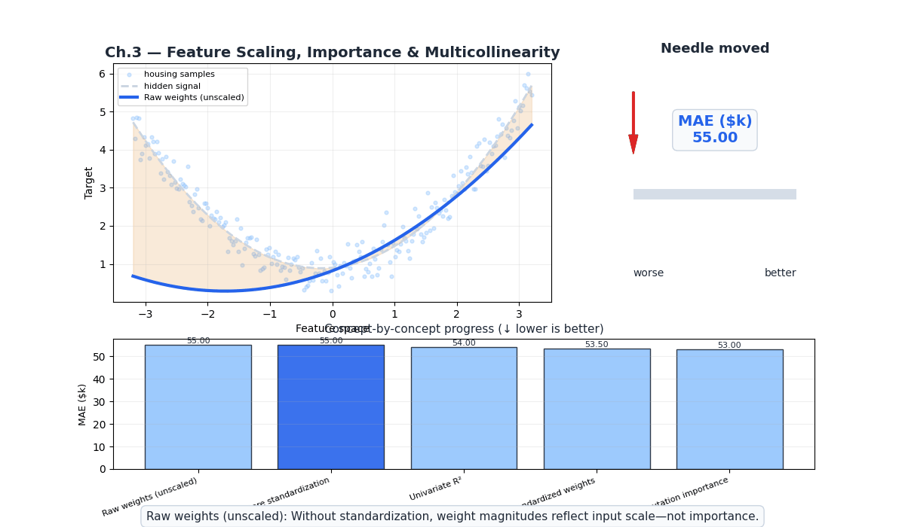

---

## 1 · Core Idea

There is not one definition of "feature importance" — there are three, and they answer different questions:

| Method | Question answered | When to use |
|---|---|---|
| **Univariate R²** | If I used only this feature, how much target variance would it explain? | First pass; quick ranking |
| **Standardised weights** | Given all other features in the model, how much does this feature contribute? | Final model inspection |
| **Permutation importance** | If I scramble this feature (breaking its signal), how much does test MAE rise? | Most reliable; model-agnostic |

Each method can give a completely different ranking for the same dataset. Understanding *why* the rankings differ is the actual lesson of this chapter.

---

## 2 · Running Example

Same California Housing dataset. Same 8 features. Same Ch.2 model.

| Feature | What it measures | Notable relationships |
|---|---|---|
| `MedInc` | Median income (×\$10k) | Strong standalone predictor (ρ = 0.69 with target) |
| `HouseAge` | Median house age (years) | Weak standalone (ρ = −0.04); small joint contribution |
| `AveRooms` | Average rooms per household | **Overlaps with AveBedrms** (ρ = 0.85 with each other) |
| `AveBedrms` | Average bedrooms per household | **Overlaps with AveRooms** (ρ = 0.85 with each other) |
| `Population` | Block population | Near-zero signal at district level |
| `AveOccup` | Average household size | Small but independent signal |
| `Latitude` | North–South coordinate | **Jointly irreplaceable with Longitude** — neither useful alone |
| `Longitude` | East–West coordinate | **Jointly irreplaceable with Latitude** — neither useful alone |

**Target:** `MedHouseVal` — median house value (×\$100k)

The diagnostic question: which of these 8 features is genuinely informative, which overlaps with another, and which is nearly irrelevant? Two feature pairs will tell the most interesting story: `AveRooms`/`AveBedrms` (shared signal, one is redundant) and `Latitude`/`Longitude` (neither useful alone, critical together).

---

## 3 · Math

Three questions, three tools — the same three introduced in §1, now with their formulas. Before the math, a quick anchor on what a high score from each method actually signals:

| Method | What a high score means | Blind spot |
|---|---|---|
| **Univariate R²** | Feature is a strong standalone predictor | Can't see jointly-irreplaceable pairs (Lat/Lon both score low) |
| **Standardised weights** | Feature adds unique signal above all others | Unstable when correlated features compete (AveRooms vs AveBedrms) |
| **Permutation importance** | Model visibly breaks without this feature | Low for redundant features even if they carry real signal |

The three methods often give different rankings for the same dataset. That divergence — not the numbers themselves — is the diagnostic story. Work through all three methods below; the interpretation framework for reading the divergence is assembled at the end in the Three-Method Convergence section.

Before diving into the methods, there is one concept to hold in mind throughout: **feature correlation**.

Some features in our dataset measure overlapping things. `AveRooms` and `AveBedrms` both capture dwelling size — they correlate at ρ = 0.85. `Latitude` and `Longitude` both encode geography — neither is informative alone, but together they pinpoint a district on the California map. When features share signal like this, the three importance methods will give *systematically different rankings* for those features — and that divergence is information, not noise.

> 📖 **What is ρ exactly?** If the formula is unfamiliar, [MathUnderTheHood Ch.7 § 4b](../../../math_under_the_hood/ch07_probability_statistics/README.md#4b--covariance-and-pearson-correlation--do-two-things-move-together) builds up covariance and Pearson correlation step by step with a small worked example and animated diagrams. It also proves why $R^2_j = \rho^2$ — the identity that powers Method 1 below.

- **Method 1 (Univariate R²)** measures each feature in total isolation — it cannot see that AveRooms and AveBedrms are measuring the same thing, so it may give both modest scores.
- **Method 2 (Standardised Weights)** trains a joint model — now AveRooms must *compete* with AveBedrms for the shared signal. One may end up with an inflated weight, the other suppressed or even negative.
- **Method 3 (Permutation Importance)** shuffles one feature at a time while keeping others intact — if AveBedrms can compensate for a scrambled AveRooms, the measured importance of AveRooms will be artificially low.

This is the core reason the rankings diverge. The full diagnostic tool for measuring how severe this overlap is — the Variance Inflation Factor (VIF) — is covered after all three methods, once you have concrete numbers to reason about.

Let’s walk through each method:

### Feature-Target Correlation — Linear vs Non-Linear

Before fitting any model, it helps to understand *how* each feature relates to the target. Two complementary tools cover the space: **Pearson correlation** for straight-line relationships, and **Mutual Information** for any shape. Together they give you a reliable signal-vs-noise ranking before a single model is trained.

#### Pearson Correlation — The Ruler

> 💡 **Think of it as: The Ruler.** Pearson asks "if I draw a straight line through the data, how tightly do the points cluster around it?" It cares about *direction* — if $X$ rises, does $Y$ rise too (positive) or fall (negative)? The score lives in $[{-1}, +1]$: 0 means no linear relationship, ±1 means a perfect line. The catch: **it only sees straight lines.** Bend the data into a U and the ruler reads zero, even though the pattern is obvious.
>
> **When to reach for it:** Use Pearson as the first pass for Linear Regression. A feature with |ρ| > 0.3 is a prime candidate for a linear model. Always plot the scatter first — a curve or cluster that Pearson misses will be visible immediately.

> 📖 **Need the formula intuition first?** [MathUnderTheHood Ch.7 § 4b](../../../math_under_the_hood/ch07_probability_statistics/README.md#4b--covariance-and-pearson-correlation--do-two-things-move-together) walks through covariance and Pearson from scratch — signed rectangles, unit-cancellation, and why $R^2 = \rho^2$ — with animated diagrams. Come back here once the formula feels grounded.

$$\rho(x_j, y) = \frac{\sum(x_{ij}-\bar{x}_j)(y_i - \bar{y})}{\sqrt{\sum(x_{ij}-\bar{x}_j)^2 \cdot \sum(y_i-\bar{y})^2}}$$

where $\rho$ (rho) is the correlation coefficient, $x_{ij}$ is the value of feature $j$ for sample $i$, $\bar{x}_j$ is the mean of feature $j$, $y_i$ is the target value for sample $i$, and $\bar{y}$ is the mean of the target. Range: [−1, 1]. Rule of thumb: |ρ| < 0.05 → likely noise; |ρ| > 0.3 → worth including; |ρ| > 0.7 → strong predictor.

> ⚠️ **Pearson only captures linear associations.** A U-shaped relationship (e.g., performance vs experience — improves then plateaus) can have ρ ≈ 0 even when x is highly informative.

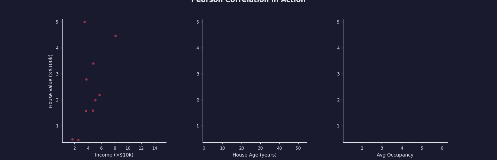

#### Mutual Information — The Detective's Clue

> 🔍 **Think of it as: The Detective's Clue.** MI asks "if I tell you the value of $X$, how much easier does it become to guess $Y$?" It doesn't care about *shape* — a straight line, a U, a wave, or a cluster all register as long as $X$ gives you information about $Y$. The score lives in $[0, \infty)$: 0 means $X$ tells you nothing; higher means a stronger link of any shape.
>
> **When to reach for it:** Use MI as a general "first pass" when working with tree-based models (Random Forest, XGBoost) or when you suspect non-linear patterns. It finds hidden relationships that Pearson would miss entirely — the model architecture then determines whether those relationships get exploited.

Mutual information measures *any* statistical dependence, not just linear:

$$I(X; Y) = \sum_{x,y} p(x,y) \log\frac{p(x,y)}{p(x)\,p(y)}$$

where $I(X; Y)$ is the mutual information between feature $X$ and target $Y$, $p(x,y)$ is the joint probability density of observing $x$ and $y$ together, and $p(x)$, $p(y)$ are the marginal densities. Range: $[0, \infty)$ — zero means completely independent; larger values mean stronger dependence of any shape.

**The Intuition — Reduction in Uncertainty**

Pearson asks: "when $x$ increases, does $y$ tend to increase too?" MI asks a more fundamental question: **"knowing $x$, how much does my uncertainty about $y$ shrink?"**

Formally, MI is the gap between your uncertainty about $y$ before and after seeing $x$:

$$I(X; Y) = H(Y) - H(Y \mid X)$$

where $H(Y)$ is the entropy of $y$ (how unpredictable it is on its own) and $H(Y \mid X)$ is the conditional entropy (how unpredictable $y$ remains after $x$ is known). If knowing $x$ cuts your uncertainty in half, $I(X; Y) = 0.5 \cdot H(Y)$. If $x$ tells you nothing, $H(Y \mid X) = H(Y)$ and $I = 0$.

> **Why this matters:** Pearson is zero for a U-shaped or threshold relationship even though knowing $x$ dramatically reduces uncertainty about $y$. MI is not. This is the key difference in one sentence.

**When Pearson Fails — Two Cases Where MI Catches Signal**

**Case 1 — U-shaped relationship (e.g., optimal dose):**  
A drug at low dose does nothing; at the optimal dose it works; at high dose it becomes toxic. Price vs HouseAge in some sub-markets follows a similar arc — very new and very old houses both command a premium over mid-age stock.

```
y  ↑
   |       ●
   |     ●   ●
   |   ●       ●
   | ●           ●
   └─────────────── x

Pearson ρ ≈ 0  (symmetric, deviations cancel)
MI         > 0  (knowing x strongly predicts y)
```

**Case 2 — Threshold / step relationship (e.g., income cliff):**  
House prices in California are relatively flat below a neighbourhood income of ~$3k/month, then jump sharply above it. The relationship exists but is not proportional — a linear model misses the jump entirely.

```
y  ↑
   |               ●●●
   |           ●●●
   |●●●●●●●●
   └─────────────── x
           threshold

Pearson ρ  moderate (captures partial signal)
MI         high      (captures the full jump)
```

**The "Broken Ruler" — The Aha! Moment:**

The clearest proof of Pearson's blind spot is $y = x^2$ — a parabola. $X$ perfectly predicts $Y$, but the upward deviations on the right cancel the downward deviations on the left, so Pearson reads zero. MI does not cancel.

```python
import numpy as np
from scipy.stats import pearsonr
from sklearn.feature_selection import mutual_info_regression

x = np.linspace(-3, 3, 300).reshape(-1, 1)
y = x.ravel() ** 2          # perfect parabola: y = x²

r, _ = pearsonr(x.ravel(), y)
mi   = mutual_info_regression(x, y, random_state=42)[0]

print(f"Pearson ρ : {r:.3f}")   # → 0.000  ← ruler says "no relationship"
print(f"MI score  : {mi:.3f}")  # → 0.95+  ← detective says "strong link"
```

```
Scatter of y = x²:
y  ↑
 9 │ ●               ●
 4 │   ●           ●
 1 │     ●       ●
 0 │       ● ●
   └─────────────────── x
      −3             +3

The ruler sees symmetric deviations and calls it zero.
The detective sees that every x uniquely determines y and calls it strong.
```

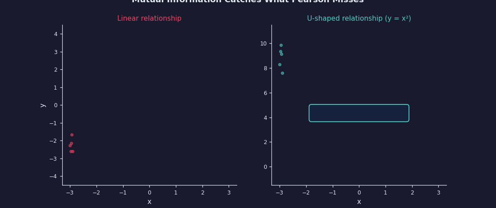

#### Pearson vs MI in the California Housing Dataset

| Feature | \|ρ\| with target | ρ² (linear R²) | MI score | Gap story |
|---|---|---|---|---|
| MedInc | 0.688 | 0.473 | 0.52 | Near-linear — both agree |
| AveRooms | 0.151 | 0.023 | 0.09 | Weak either way |
| HouseAge | 0.036 | 0.001 | 0.07 | **MI higher** — non-linear premium for new/old |
| Latitude | 0.144 | 0.021 | 0.18 | **MI much higher** — price varies non-linearly by region |
| Longitude | 0.046 | 0.002 | 0.15 | **MI much higher** — same geographic non-linearity |
| AveBedrms | 0.047 | 0.002 | 0.02 | Both near-zero |
| Population | 0.025 | 0.001 | 0.01 | Both near-zero |
| AveOccup | 0.020 | 0.000 | 0.04 | MI slightly higher — crowding has threshold effect |

The key rows are Latitude and Longitude: ρ² ≈ 0 and ρ² ≈ 0 (they explain nothing *linearly* of the target in isolation), yet MI scores are 0.18 and 0.15 — among the highest in the dataset. There is real information, but it is non-linear (geographic clustering). Method 1's Univariate R² misses this entirely; MI flags it.

> ⚠️ **MI scores are not on a standard scale.** You cannot say "MI = 0.18 means 18% of variance explained." They are relative rankings. To compare Pearson and MI side by side, normalise: divide each MI score by the maximum MI score in the feature set, giving a [0, 1] relative importance.

#### Pearson vs MI — Quick-Reference Cheat Sheet

| Property | Pearson Correlation | Mutual Information |
|---|---|---|
| **Relationship type** | Linear only (straight lines) | Any — curves, waves, thresholds, clusters |
| **Score range** | −1 to +1 | 0 to ∞ |
| **Sensitive to outliers?** | Yes — one extreme point can shift ρ significantly | No — density-based estimator is more robust |
| **Tells you direction?** | Yes — positive (both rise) or negative (one falls) | No — only that a link exists, not its sign |
| **Best model pairing** | Linear Regression | Tree-based models (Random Forest, XGBoost) |
| **Mental model** | A straight ruler | A detective's magnifying glass |

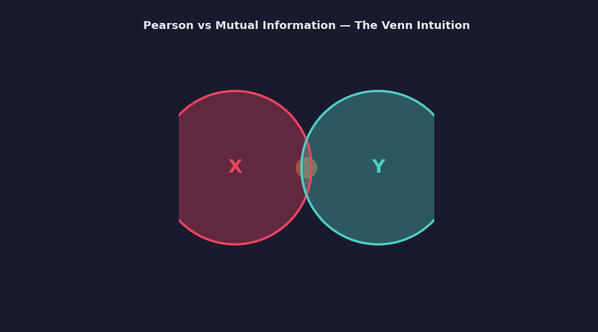

> 📖 For the information-theoretic foundation see *Cover & Thomas, "Elements of Information Theory," Wiley, Ch.2.*

> 📖 **Technical Note — How `sklearn` estimates MI for continuous variables.** `mutual_info_regression` uses the **Kraskov k-NN estimator**: for each sample, it measures the distance to its $k$-th nearest neighbour in joint $(x, y)$ space versus in the marginal $x$ and $y$ spaces separately — no binning, no histogram choice, no smoothing parameter. Key properties: **$k$ controls bias-variance** (default $k=3$: lower bias but noisier; larger $k$ smooths but may underestimate MI for complex shapes); **set `random_state`** (the estimator adds a tiny perturbation to break ties); **scale-invariant** (MI does not change if you log-transform or standardise a feature — the rank structure is preserved and the density estimator adapts). Returns one score per feature; scores are not normalised — use relative magnitude only.

---

### Filter Methods — Pre-Training Feature Selection

Filter methods rank features by their statistical relationship to the target — no model is trained. Use them to prune large feature sets before applying a model. Pearson and MI (above) are the primary filter signals; Spearman fills the gap when relationships are monotonic but not linear.

**Spearman Correlation (monotonic, non-parametric):**

Ranks both x and y, then computes Pearson on the ranks. Captures non-linear but *monotonic* relationships:

$$\rho_s = 1 - \frac{6\,\sum d_i^2}{n(n^2-1)}$$

where $\rho_s$ is the Spearman correlation coefficient, $d_i$ is the rank difference between $x_i$ and $y_i$ (if $x_i$ is the 3rd largest value and $y_i$ is the 5th largest, then $d_i = 3 - 5 = -2$), and $n$ is the number of samples.

> ⚠️ **Use Spearman when the scatter plot shows a curve rather than a line** — e.g., `MedInc` vs `MedHouseVal` is roughly linear (Pearson fine), but `Population` vs price is non-linear (Spearman safer). Both are available via `scipy.stats.spearmanr`.

#### Decision Rule — When to Use Which Filter

| Situation | Use |
|---|---|
| You expect monotonic relationships; interpretability needed | Pearson (or Spearman if skewed) |
| You suspect non-linearity (U-shapes, thresholds, clusters) | MI |
| You have categorical features mixed with continuous | MI (`mutual_info_classif` for discrete target) |
| You need a number you can directly compare to R² | Pearson² |
| You need a model-agnostic signal check before tree models | MI — trees find non-linear patterns anyway, MI tells you the signal is there |
| Dataset is small (< 200 samples) | Pearson — MI estimator is noisy with few neighbours |

For California Housing: run both. Where they agree, the ranking is reliable. Where MI is substantially higher than ρ², the feature has non-linear signal that a linear model will underuse — a cue to engineer a transformation or switch to a tree-based model.

> 📖 **Embedded selection (bridge to Ch.5):** When you are unsure which features to drop, Lasso is the principled alternative to filter methods — selection happens *during* training, not before it. The L1 penalty drives weak-signal coefficients exactly to zero. Full treatment in [Ch.5 — Regularization](../ch05_regularization).

> 💡 **Connection to Method 1:** Pearson correlation is the direct mathematical input to Univariate R². For single-feature OLS, $R^2_j = \rho(x_j, y)^2$ exactly. Filter methods give you the raw scores; Method 1 reframes them as fraction of target variance explained.

---

### Method 1 — Univariate R²

> **How ŷ is determined here:** A **separate, single-feature model** is fitted from scratch for each feature — 8 features means 8 independent mini-models, each with only one predictor. The ŷ from a MedInc model has never seen Latitude; the ŷ from a Latitude model has never seen MedInc. This is what makes the R² "univariate" — every score is measured in pure isolation.

Fit each feature against the target in isolation:

$$\hat{y} = w_j x_j + b, \quad R^2_j = 1 - \frac{\sum(\hat{y}_i - y_i)^2}{\sum(\bar{y} - y_i)^2}$$

where $\hat{y}$ is the predicted target value, $w_j$ is the weight for feature $j$, $b$ is the intercept, $R^2_j$ is the coefficient of determination for feature $j$ alone, $y_i$ is the actual target value for sample $i$, and $\bar{y}$ is the mean of all target values. The numerator is the sum of squared residuals (prediction errors); the denominator is the total variance in the target.

**The shortcut.** For linear regression, this reduces to the Pearson correlation squared:

$$R^2_j = \rho(x_j,\, y)^2 = \left(\frac{\text{Cov}(x_j, y)}{\sigma_{x_j} \sigma_y}\right)^2$$

where $\text{Cov}(x_j, y)$ is the covariance between feature $j$ and target $y$, $\sigma_{x_j}$ is the standard deviation of feature $j$, and $\sigma_y$ is the standard deviation of the target.

#### What high vs low R² looks like — signal in one glance

A high-R² feature forms a visible trend when plotted against the target. A low-R² feature produces a random cloud. The two scatter plots below show why MedInc dominates the univariate ranking while HouseAge is nearly flat:

```
MedInc → MedHouseVal  (ρ = 0.69, R² = 0.47)      HouseAge → MedHouseVal  (ρ = −0.04, R² ≈ 0.001)

  MedHouseVal                                         MedHouseVal
    5 │                             × × ×               5 │  ×   ×    ×    ×   ×
    4 │                    × × ×                        4 │    ×    ×    ×   ×
    3 │          × × × ×                                3 │  ×   ×  ×  ×  ×   ×
    2 │    × × ×                                        2 │    ×    ×    ×   ×
    1 │  ×                                              1 │  ×    ×    ×    ×  ×
      └─────────────────────────────                      └──────────────────────
          Low income ──────► High income                      Young ──────► Old

  Tight upward band → income reliably                 Uniform cloud → house age tells
  predicts home value. R² = 0.47.                     us almost nothing alone. R² ≈ 0.
```

**Key fact — ρ² = R² for single-feature OLS.** A tight scatter = high ρ = high R². The practical payoff: to rank all 8 features by univariate R², compute the correlation matrix once and square the target column — that's all 8 R² values instantly, with no model fitting.

**California Housing results:**

```
Feature        ρ with target   Univariate R²   ████ bar
────────────────────────────────────────────────────────
MedInc         +0.688          0.473           ████████████████████
Latitude       −0.144          0.021           ▉
AveRooms       +0.151          0.023           ▊
HouseAge       −0.037          0.001           ·
Longitude      −0.046          0.002           ·
AveBedrms      −0.047          0.002           ·
Population     −0.025          0.001           ·
AveOccup       −0.023          0.001           ·
────────────────────────────────────────────────────────
Full 8-feature model R²: 0.61
```

**Reading the chart.** MedInc explains 47% of target variance alone. Every other feature individually accounts for less than 2.5% — they look almost useless in isolation.

That is not the end of the story.

---

### Feature Scaling

Before comparing weights across features you need a common unit. Raw weights are unit-dependent: a weight of +0.40 for `MedInc` (measured in steps of $10k) and −0.000014 for `Population` (measured per person) look 28,000× apart — but that gap is almost entirely a scale artefact, not an importance signal.

Think of this like measuring the same height in millimeters versus kilometers — the number changes dramatically but the person doesn't. StandardScaler fixes this by converting every feature to the same unit: **"one typical swing in that feature across the dataset."** After standardization, a coefficient of 0.8 on income and 0.1 on population means income has genuinely 8× the marginal effect — a fair comparison.

**Standardization (Z-score normalization):**

$$x_j^{\text{std}} = \frac{x_j - \mu_j}{\sigma_j}$$

where $x_j^{\text{std}}$ is the standardized feature value, $x_j$ is the original feature value, $\mu_j$ is the mean of feature $j$ across all samples, and $\sigma_j$ is the standard deviation of feature $j$. After standardization every feature has mean = 0 and std = 1, so weight magnitudes are directly comparable.

```
BEFORE scaling:              AFTER scaling:

MedInc:    [0.5, 15]         MedInc:    [-1.8, 3.1]
Population: [3, 35682]        Population: [-0.6, 12.8]

Gradient for MedInc: ~0.1    Gradient for MedInc: ~0.8
Gradient for Pop:   ~5000    Gradient for Pop:    ~0.8

→ Gradient steps dominated    → Balanced gradient steps
  by Population!               across all features ✅
```

**Min-max scaling** is an alternative — $x_j^{\text{mm}} = (x_j - \min_j) / (\max_j - \min_j)$ — but it is sensitive to outliers. StandardScaler is the safer default for regression and gradient-based training.

> ⚠️ **Pipeline rule:** Always fit the scaler on training data only, then transform both train and test. Fitting on the full dataset leaks test statistics into training.

#### Understanding Positive Skew — Why Some Features Need Log Transform

**What is skew?** Skew measures distributional asymmetry. In a symmetric distribution (like a normal curve), the mean equals the median. **Positive skew** means a long right tail — most values cluster near the low end, but a few extreme values stretch far to the right, pulling the mean above the median.

```
Symmetric distribution:       Positively skewed distribution:
    ●●●●●●●                        ●●●●●●
  ●●●●●●●●●                      ●●●●●●●●
●●●●●●●●●●●                    ●●●●●●●●●●              ●●
   ↑                              ↑       ↑           ↑
 mean = median                   median  mean    long right tail
```

**Why skew breaks StandardScaler:** When you standardize a heavily skewed feature, the few extreme values inflate the standard deviation (σ), compressing 95% of the data into a narrow band near zero while placing outlier districts at +8σ or +12σ. This creates an unbalanced feature where most gradient updates are driven by a handful of extreme cases.

**Example:** `Population` ranges from 3 to 35,682. After standardization, a typical district (Population = 1,500) becomes −0.1σ, while the extreme district (Population = 35,682) becomes +12σ. The model's weight updates are dominated by that one extreme case, even though it's not representative.

#### Log Transform & Box-Cox

When a feature has a heavy right tail (long positive skew), standardisation alone may not help — the largest values still dominate. Log-transforming first compresses the tail:

$$x' = \log(x + 1)$$

(The `+1` guards against `log(0)` when values can be zero. This transformation is often called **log1p** — numpy's `np.log1p(x)` implements exactly this formula and is numerically more stable than computing `log(x + 1)` directly.)

**Box-Cox generalises this** with a piecewise transformation:

$$x'(\lambda) = \begin{cases} \frac{x^\lambda - 1}{\lambda} & \lambda \neq 0 \newline    \log x & \lambda = 0 \end{cases}$$

This formula has **two branches** depending on the value of λ:
- **When λ ≠ 0**: use the formula $(x^\lambda - 1) / \lambda$
- **When λ = 0**: use $\log x$ (because dividing by zero is undefined)

where $x'(\lambda)$ is the transformed feature value, $x$ is the original feature value, and $\lambda$ is a transformation parameter that controls the strength of the transformation. When $\lambda = 1$ (no transformation needed), $x'(\lambda) = x - 1$. When $\lambda = 0$, it reduces to the log transform. When $\lambda = 0.5$, it's a square root transform.

`sklearn.preprocessing.PowerTransformer(method='box-cox')` finds the optimal λ by maximum likelihood.

**When to log-transform vs standardise:** If a feature's histogram has a long right tail (e.g., `AveRooms` has a few districts with 20+ rooms), apply log1p *before* StandardScaler. If the feature is roughly symmetric, skip log and standardise directly.

**5-value numeric walkthrough** (`Population` feature, μ=1427, σ=1132):

| Raw | log1p(Raw) | z after log-scaling |
|-----|-----------|---------------------|
| 322 | 5.78 | −0.88 |
| 2401 | 7.78 | +0.80 |
| 496 | 6.21 | −0.46 |
| 558 | 6.33 | −0.33 |
| 565 | 6.34 | −0.32 |

The raw scale ranges over 4× (322–2401); the log scale compresses this to a 2-unit range — gradient descent converges faster and weight magnitudes are more comparable.

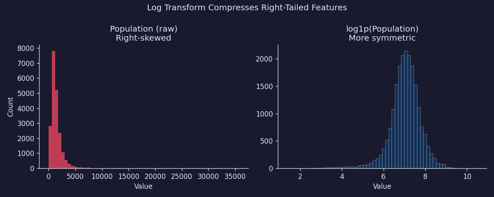

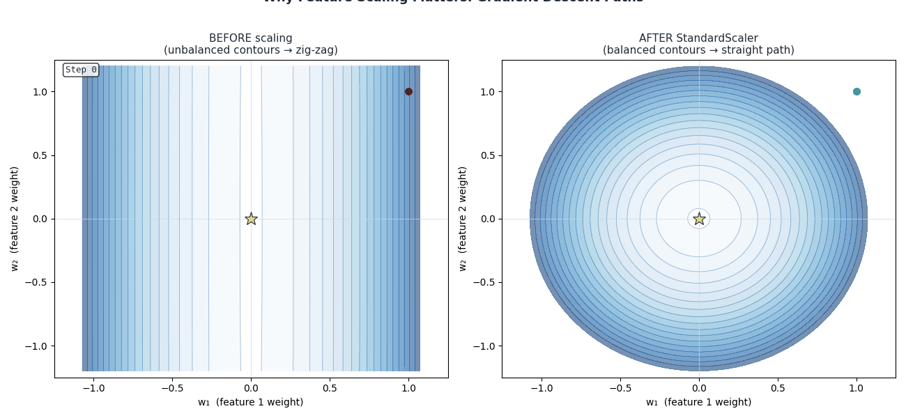

---

### Method 2 — Standardised Weights (Partial Contribution)

> **How ŷ is determined here:** There is **one model containing all features simultaneously** — the same Ch.2 model. No features are removed. ŷ = $w_1 x_1 + w_2 x_2 + \cdots + w_p x_p + b$. The standardised weight $|w_j^{\text{std}}|$ measures the **marginal (partial) effect** of feature $j$: how much ŷ shifts for a 1-σ change in $x_j$ while all other features are held fixed at their current values. This is why rankings can flip versus Method 1 — a feature that was absorbing shared signal alone now only gets credit for what it adds *above and beyond* all other features.

Feature Scaling (above) is the prerequisite. After `StandardScaler`, the fitted absolute weight measures how much the model *uses* each feature when all others are present:

$$\text{importance}_j^{\text{partial}} = |w_j^{\text{std}}|$$

The formula $w_j^{\text{std}} = w_j^{\text{raw}} \times \sigma_j$ explains the weight gap: MedInc's raw weight of +0.40 (per $10k income step) scales to $0.40 \times 2.0 = +0.80$, while Population's raw weight of −0.000014 (per person) scales to $−0.000014 \times 1140 = −0.016$. The raw 28,000× gap shrinks to ~50× — the true importance ratio once unit artefact is removed.

**Worked toy example — 3 California Housing districts:**

| $i$ | MedInc_raw | Pop_raw | $y$ |
|-----|-----------|---------|-----|
| 1 | 2.0 | 400 | 1.5 |
| 2 | 4.0 | 1200 | 2.5 |
| 3 | 6.0 | 200 | 3.5 |

Step 1 — compute feature statistics:

```
MedInc:    mean = 4.0,   std = 1.63
Pop:       mean = 600,   std = 420
```

Step 2 — standardize (subtract mean, divide by std):

| $i$ | MedInc_std | Pop_std |
|-----|-----------|---------|
| 1 | (2−4)/1.63 = **−1.23** | (400−600)/420 = **−0.48** |
| 2 | (4−4)/1.63 = **0.00** | (1200−600)/420 = **+1.43** |
| 3 | (6−4)/1.63 = **+1.23** | (200−600)/420 = **−0.95** |

Step 3 — fit OLS on the standardised columns. Suppose the resulting weights are:

```
w_MedInc_std  = +0.83   →  a 1-std rise in income raises predicted value by 0.83 (×$100k)
w_Pop_std     = −0.01   →  a 1-std rise in population lowers predicted value by 0.01
```

Step 4 — importance ranking by absolute weight:

```
|w_MedInc_std| = 0.83   ← income is the dominant driver in this 2-feature model
|w_Pop_std|    = 0.01   ← population barely contributes
```

Both weights now live on the same axis — "effect per standard deviation" — so the comparison is fair regardless of what the original units were.

**California Housing results from Ch.2 model:**

```
Feature        Std weight      |Std weight|
───────────────────────────────────────────
Latitude       −0.89           0.89   ← #1
Longitude      −0.87           0.87   ← #2
MedInc         +0.83           0.83   ← #3
HouseAge       −0.06           0.06
AveRooms       +0.12           0.12
AveBedrms      −0.10           0.10
Population     −0.01           0.01
AveOccup       −0.03           0.03
```

**The surprise.** Latitude and Longitude — which individually explain < 2% — shoot to the top of the joint ranking. MedInc, which dominated alone, drops to third.

This apparent contradiction is the most important insight in the chapter.

---

### Why M1 and M2 Often Disagree — The Joint Signal Problem

MedInc is a powerful standalone predictor *precisely because* it is correlated with many other variables. Rich districts tend to have newer housing, more rooms, and be in coastal locations. When those other features enter the model alongside MedInc, they absorb portions of the signal that MedInc was previously soaking up alone. MedInc's partial contribution shrinks to what it contributes *above and beyond* everything else.

Latitude and Longitude work the opposite way. Neither coordinate alone is informative enough — "north" doesn't mean expensive, and "east" doesn't mean cheap. But *together*, they place a district precisely on the California map: coastal SF (expensive), Central Valley (cheap), LA basin (varied), Sacramento (moderate). That joint geographic segmentation only emerges when the model can combine both features simultaneously.

The lesson:

| Univariate R² | Standardised weight | Interpretation |
|---|---|---|
| High | High | Strong predictor; independent signal |
| High | Lower than expected | Correlated with other features — signal is shared |
| Low | High | **Jointly irreplaceable** — only useful in combination → run joint permutation (see below) |
| Low | Low | Genuinely uninformative |

M1 and M2 together already reveal a lot, but they share a blind spot: both rely on the fitted weights, which can be distorted by multicollinearity. Method 3 sidesteps weights entirely — it measures importance by directly breaking each feature's signal and watching what happens.

---

### Method 3 — Permutation Importance

> **How ŷ is determined here:** The **original full model is used unchanged — it is never retrained**. ŷ still equals $w_1 x_1 + w_2 x_2 + \cdots + w_p x_p + b$ with the same fitted weights from training. What changes is the **input**: for feature $j$, its column is randomly shuffled across all test rows, destroying its correlation with $y$ while keeping its marginal distribution intact. The model then makes predictions with the same weights but scrambled signal for that one feature. The rise in MAE reveals how badly those fixed weights are handicapped — i.e., how much the model was genuinely relying on that feature's ordering. **Critically, this is not the same as removing the feature and retraining.** Retraining would allow correlated features to compensate; permutation does not — it tests the trained model's reliance, not the feature's replaceability.

The most reliable and model-agnostic method: after fitting, **randomly shuffle one feature's values** across all test samples (breaking its relationship with the target), make predictions, and measure how much test MAE rises. Crucially, the model is never retrained — you're measuring how badly the model's existing weights are handicapped when a feature's signal is destroyed. This makes it a pure test of the model's *reliance* on each feature.

$$\pi_j = \text{MAE}_\text{perm} - \text{MAE}_\text{orig}$$

where:
- $\pi_j$ is the permutation importance of feature $j$
- $\text{MAE}_\text{perm}$ is the mean absolute error after randomly reordering (permuting) the values of feature $j$ across all test samples while keeping all other features unchanged
- $\text{MAE}_\text{orig}$ is the baseline error with all features intact

A large positive value → the feature was carrying real signal. Near-zero → the model barely used it (or another feature duplicated it).

**California Housing results:**

```
Feature        Δ MAE when shuffled    Permutation importance
────────────────────────────────────────────────────────────
MedInc         +$18.4k                0.334   ← by far #1
Latitude       +$9.1k                 0.165   ← #2
Longitude      +$7.3k                 0.133   ← #3
AveOccup       +$3.2k                 0.058
HouseAge       +$1.6k                 0.029
AveRooms       +$0.9k                 0.016
AveBedrms      +$0.3k                 0.005
Population     +$0.1k                 0.002
```

MedInc reclaims the top spot under permutation importance — it is individually the most irreplaceable feature. Latitude and Longitude remain important. AveBedrms and Population contribute almost nothing that isn't captured elsewhere.

Permutation importance is generally the most trustworthy of the three methods because it directly measures the model's *reliance* on each feature, not just correlation or fitted weights.

---

### Three-Method Convergence — Reading the Full Picture

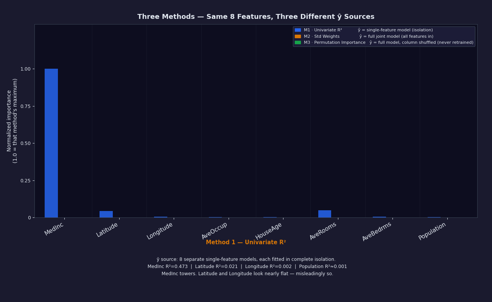

> The animation above reveals each method in sequence. Watch how Latitude and Longitude are nearly invisible in M1 (blue — 8 isolated models) but leap to the top in M2 (amber — full joint model) and stay high in M3 (green — full model with column shuffled). The ŷ source changes with each method; the ranking shifts follow directly from that.

Now run all three methods on the same 8 California Housing features and read across the rows. **Agreement across all three methods is confidence. Divergence is diagnostic information.**

```
                  Method 1               Method 2                 Method 3
                  Univariate R²          |Std weight|             Permutation Δ MAE
                  (standalone signal)    (partial, joint model)   (knockout test)
──────────────────────────────────────────────────────────────────────────────────────
MedInc           ████████████  0.47      █████████████ 0.83       █████████████ $18.4k
                 #1 alone                #3 partial               #1 knockout

Latitude         █  0.02                 █████████████████ 0.89   ████████  $9.1k
                 #3 alone                #1 partial               #2 knockout

Longitude        ·  0.00                 ████████████████  0.87   ██████    $7.3k
                 ~#6 alone               #2 partial               #3 knockout

AveOccup         ·  0.00                 ▌  0.03                  ████      $3.2k
                 flat alone              flat partial              modest knockout

HouseAge         ·  0.00                 █  0.06                  ██        $1.6k
                 flat alone              small partial             small knockout

AveRooms         █  0.02                 ██  0.12                 ▌         $0.9k
                 modest alone            moderate partial          weak knockout

AveBedrms        ·  0.00                 ██  0.10                 ·         $0.3k
                 flat alone              moderate partial          near-zero knockout

Population       ·  0.00                 ·   0.01                 ·         $0.1k
                 flat alone              flat partial              flat knockout
──────────────────────────────────────────────────────────────────────────────────────
```

**Reading the convergence pattern:**

| Feature | Pattern | Story |
|---|---|---|
| **MedInc** | High on all three | Strong, independent, irreplaceable — income is the dominant single signal |
| **Latitude / Longitude** | Low on M1, high on M2 + M3 | **Jointly irreplaceable.** Neither coordinate alone is informative; together they place every district on the California map. Geographic segmentation only emerges in combination. Joint permutation uplift ≈ +$10.6k — see *Joint Feature Importance* below. |
| **AveRooms** | Modest on M1, moderate on M2, weak on M3 | Standalone signal exists, but it's absorbed by AveBedrms in the joint model. The pair share the same house-size signal. |
| **Population** | Near-zero on all three | Genuinely uninformative at district level — safe to drop without affecting MAE. |

> 💡 **The three-lens rule.** A feature earns full trust only when all three lenses independently confirm its importance. MedInc passes all three. Latitude and Longitude together pass Methods 2 and 3 — the geographic signal is real, but only emerges jointly. AveBedrms fails Method 3 — its signal is almost entirely duplicated by AveRooms. Population fails all three.

---

### Variance Threshold — Dropping Near-Constant Features

A feature that barely changes gives the model nothing to latch onto — it's like trying to predict house prices using a column that says "2.00" for every district. Before testing for multicollinearity, drop features with near-zero variance. A constant column makes **X**ᵀ**X** rank-deficient — the normal equations have no unique solution.

$$\text{Var}(x_j) = \frac{1}{n}\sum_{i=1}^{n}(x_{ij} - \bar{x}_j)^2$$

where $\text{Var}(x_j)$ is the variance of feature $j$, $n$ is the number of samples, $x_{ij}$ is the value of feature $j$ for sample $i$, and $\bar{x}_j$ is the mean of feature $j$ across all samples. Set a threshold τ (tau, e.g., 0.01 after standardisation); drop any feature with Var < τ.

`sklearn.feature_selection.VarianceThreshold(threshold=0.01)`

**Numeric example** — 5-value near-constant column:

| i | x | x − x̄ | (x − x̄)² |
|---|---|--------|----------|
| 1 | 2.01 | +0.004 | 0.000016 |
| 2 | 2.00 | −0.006 | 0.000036 |
| 3 | 2.02 | +0.014 | 0.000196 |
| 4 | 2.01 | +0.004 | 0.000016 |
| 5 | 1.99 | −0.016 | 0.000256 |

Mean = 2.006, Var = 0.000520/5 = **0.000104 < 0.01** → drop this feature.

For California Housing: none of the 8 base features hits this threshold, but engineered ratio features (e.g., `AveBedrms / AveRooms`) can produce near-constants in some districts.

---

### Multicollinearity — When Features Compete for the Same Signal

Multicollinearity is the condition where two or more features are strongly correlated with each other. When this happens:

1. **Predictions remain accurate.** The gradient descent finds some set of weights that minimises loss.
2. **Individual weights become unstable.** The model has multiple near-equally-good ways to divide the signal across the correlated features, and small changes in the data or random seed tip it into completely different configurations.

**The concrete California Housing example:**

`AveRooms` and `AveBedrms` both measure house size (ρ = 0.85). The model sees a prize worth, say, 0.20 units, and needs to split it between them. With different random seeds or slightly different training subsets:

```
Run 1:  AveRooms = +0.12,  AveBedrms = −0.10  (bedrooms negative?!)
Run 2:  AveRooms = +0.03,  AveBedrms = +0.18  (completely different split)
Run 3:  AveRooms = +0.20,  AveBedrms = −0.01  (all signal on rooms)
```

All three configurations produce nearly identical predictions — but the individual weights are meaningless for interpretation. This is dangerous if you're handing weights to a compliance officer or using them for feature selection.

### Variance Inflation Factor (VIF)

VIF measures how much a feature's weight blows up due to correlation with other features:

$$\text{VIF}_j = \frac{1}{1 - R^2_j}$$

where $\text{VIF}_j$ is the Variance Inflation Factor for feature $j$, and $R^2_j$ is the coefficient of determination obtained by regressing feature $j$ (as the target) on all the *other* features (as predictors) — **not** the original target $y$. This auxiliary R² measures how well feature $j$ can be predicted from the other features: high $R^2_j$ means strong collinearity.

- $\text{VIF} = 1$: feature $j$ is uncorrelated with all other features — weight is perfectly stable
- $\text{VIF} = 5$: standard error of $w_j$ is $\sqrt{5} \approx 2.2\times$ larger than it would be without collinearity
- $\text{VIF} = 10$: standard error is $\sqrt{10} \approx 3.2\times$ larger — weight estimate is unreliable

| VIF | Interpretation | Action |
|---|---|---|
| 1 | No collinearity | ✅ Safe |
| 1–5 | Moderate | ⚠️ Monitor |
| 5–10 | High | ⚡ Consider dropping one |
| >10 | Severe | ❌ Drop one feature *or* regularize (Ch.5) |

The threshold table above gives the VIF verdict per feature. What it doesn't show is how VIF fits into the full picture alongside the three importance methods. The decision flow below combines all five signals into a single diagnostic path.

#### Feature Candidacy Decision Flow

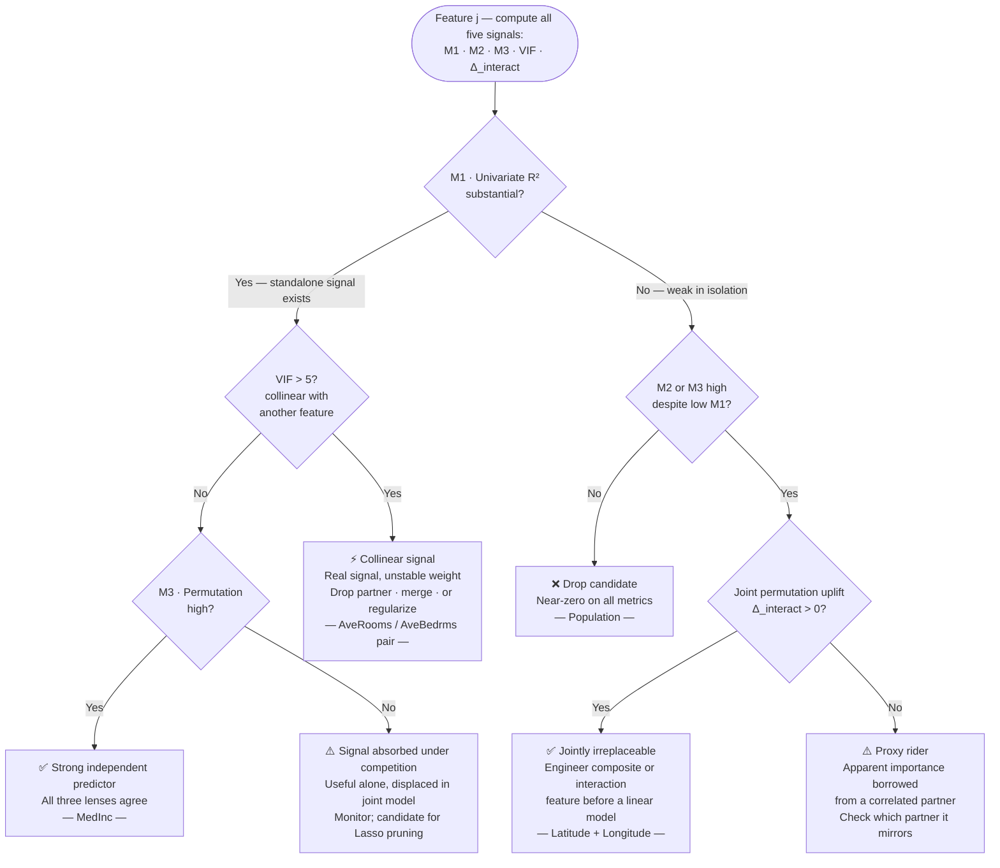

**The high-VIF case — AveRooms in California Housing.** When we regress AveRooms on all 7 other features in the full 20,640-sample dataset, the auxiliary R² is approximately 0.86 (driven mainly by the ρ = 0.85 correlation with AveBedrms). That gives:

$$\text{VIF}_{\text{AveRooms}} = \frac{1}{1 - 0.86} = \frac{1}{0.14} \approx 7.1$$

The standard error of $w_\text{AveRooms}$ is $\sqrt{7.1} \approx 2.7\times$ larger than it would be if AveRooms were uncorrelated with every other feature. Individual weight estimates for the rooms/bedrooms pair are unreliable — but their *joint* contribution to predictions is fine.

**California Housing VIF results:**

```
Feature      VIF
────────────────
MedInc       1.5    ✅
HouseAge     1.2    ✅
AveRooms     7.2    ⚡ High — correlated with AveBedrms
AveBedrms    6.8    ⚡ High — correlated with AveRooms
Population   2.1    ✅
AveOccup     1.8    ✅
Latitude     3.5    ✅
Longitude    3.4    ✅
```

`AveRooms` and `AveBedrms` are the only problematic pair. The two location coordinates have moderate VIF (they're correlated with each other by construction) but it doesn't push past the danger threshold.

**What to do about VIF > 5:**

Option 1 — **Drop one**: Remove `AveBedrms` (rooms per household contains most of the same signal). Simple, interpretable.  
Option 2 — **Combine them**: Create `rooms_per_bedroom = AveRooms / AveBedrms` — a single "room spaciousness" feature.  
Option 3 — **Regularize**: Ridge regression (Ch.5) automatically shrinks correlated features toward each other, stabilising the weights without dropping information.  

For SmartVal AI, we'll keep both for now and let Ridge handle it in Ch.5 — but armed with the VIF numbers, we understand *why* the weights fluctuate.

---

### Joint Feature Importance — When Two Features Are Stronger Together

VIF catches the *competition* case: two features measure the same thing, weights blow up, one should be dropped or merged.

But the opposite case exists too. Two features can encode **complementary dimensions** of the same concept — individually weak, jointly irreplaceable. Neither Latitude nor Longitude alone can tell you whether a district is in San Francisco or Los Angeles, but together they place every district precisely on the California map. This is the **cooperation case**, and none of the three methods from above directly measures it.

#### The Diagnostic — Joint Permutation Importance

The method is a straightforward extension of Method 3. Instead of shuffling one feature at a time, **shuffle both together** and measure the performance drop. Then compare three numbers:

| Quantity | Definition |
|---|---|
| $\pi_j$ | Permutation importance of feature $j$ alone |
| $\pi_k$ | Permutation importance of feature $k$ alone |
| $\pi_{jk}$ | Permutation importance when **both $j$ and $k$ are shuffled simultaneously** |

Three patterns emerge from comparing these:

**Pattern 1 — Competition (same signal):** $\pi_{jk} \approx \max(\pi_j, \pi_k)$. Shuffling both together isn't much worse than shuffling the dominant one alone — the second feature was redundant. This is the AveRooms / AveBedrms case.

**Pattern 2 — Independence (different signals):** $\pi_{jk} \approx \pi_j + \pi_k$. The features contribute additive, non-overlapping information. Shuffling both removes both contributions.

**Pattern 3 — Cooperation (joint signal):** $\pi_{jk} > \pi_j + \pi_k$. The joint drop is larger than the sum of individual drops — the model was using the *interaction* between the features, not just each independently. This is the Lat / Long case.

Define the **interaction uplift**:

$$\Delta_{\text{interact}}(j,k) = \pi_{jk} - \pi_j - \pi_k$$

Positive → the pair has synergistic signal the individual scores miss. Negative → the features are substitutes (consistent with VIF > 1).

#### Worked Example — Latitude and Longitude

From the California Housing dataset (numbers approximate, all in $\Delta$ MAE ×$1k):

| Quantity | Value | Interpretation |
|---|---|---|
| $\pi_{\text{Lat}}$ alone | $9.1k | Shuffle Lat only; Long still present |
| $\pi_{\text{Long}}$ alone | $7.3k | Shuffle Long only; Lat still present |
| $\pi_{\text{Lat+Long}}$ joint | ~$27k | Shuffle *both*; model can no longer localise |
| Sum of individuals | $16.4k | What additive independence would predict |
| **Interaction uplift** | **+$10.6k** | The joint loss the sum misses |

The uplift of ~$10.6k confirms the claim in the convergence table: the geographic signal is not just additive — the model is exploiting the *combination* (a district's actual position on a 2-D plane), not just each axis separately.

Now contrast with AveRooms / AveBedrms:

| Quantity | Value |
|---|---|
| $\pi_{\text{AveRooms}}$ alone | $0.9k |
| $\pi_{\text{AveBedrms}}$ alone | $0.3k |
| $\pi_{\text{AveRooms+AveBedrms}}$ joint | ~$1.0k |
| Interaction uplift | ~$−0.2k (negative) |

Shuffling both together does almost no extra damage — the features were substitutes. Dropping AveBedrms loses essentially nothing.

#### What to Do When You Find Genuine Joint Importance

**For linear models** — the model has no way to discover interactions on its own; you must engineer them:

- **Crossed feature**: create an explicit product $x_j \times x_k$ (works for low-cardinality numerics, e.g., income × bedrooms)
- **Composite representation**: for location specifically, transform (Lat, Long) → a richer encoding:
  - **Distance to a reference point** (e.g., Haversine distance to the San Francisco city centre) — one interpretable scalar that captures urban premium
  - **Cluster assignment** (k-means on the coordinates) — gives the model a named region for each district
  - **Geohash or H3 cell** — discretises the map into hexagonal cells; encode as a categorical feature

**For tree-based models** (Random Forest, Gradient Boosting) — trees find interactions automatically: a split on Lat at a high level followed by a split on Long at a lower level is exactly what a decision tree does. You don't need to pre-engineer the interaction; the model discovers it. This is one reason tree models often outperform linear models on spatial data without feature engineering.

**The general principle**: if $\Delta_{\text{interact}}(j,k) > 0.5 \times \pi_j$ (the joint uplift is more than half the stronger feature's individual importance), consider creating a composite or interaction feature rather than treating them as independent columns.

#### The Flag — How to Spot Candidates Without Exhaustive Search

Checking all $\binom{p}{2}$ pairs for joint permutation importance is $O(p^2)$ — feasible for $p \leq 20$, expensive for larger datasets. Two cheaper pre-screens:

1. **M1/M3 divergence**: if a feature has low Univariate R² but high Permutation importance (Lat: 0.02 → 0.165), something in the full model is enabling it. The enabling partner is usually findable by checking correlation with the high-M3 feature.

2. **Feature correlation check**: features that are moderately correlated with *each other* (0.3 < |ρ| < 0.8) but both weakly correlated with the *target* individually are prime candidates for joint testing. Lat/Long have ρ ≈ −0.90 with *each other* in California Housing — strong spatial coupling — but individually explain only 2% and 0% of target variance.

---

### Putting It Together — A Three-View Dashboard

| Feature | Univariate R² | \|Std weight\| | Permutation | VIF | Verdict |
|---|---|---|---|---|---|
| **MedInc** | 0.473 | 0.83 | 0.334 | 1.5 | ✅ Strong, independent, irreplaceable |
| **Latitude** | 0.021 | 0.89 | 0.165 | 3.5 | ✅ Jointly irreplaceable with Longitude |
| **Longitude** | 0.002 | 0.87 | 0.133 | 3.4 | ✅ Jointly irreplaceable with Latitude |
| **AveOccup** | 0.001 | 0.03 | 0.058 | 1.8 | ⚠️ Modest but clean signal |
| **HouseAge** | 0.001 | 0.06 | 0.029 | 1.2 | ⚠️ Small but independent |
| **AveRooms** | 0.023 | 0.12 | 0.016 | 7.2 | ⚡ Collinear with AveBedrms — keep, but monitor |
| **AveBedrms** | 0.002 | 0.10 | 0.005 | 6.8 | ⚡ Collinear with AveRooms — weakest of the pair |
| **Population** | 0.001 | 0.01 | 0.002 | 2.1 | ❌ Near-zero contribution |

---

## 4 · Step by Step

```
1. Compute univariate R² for all features
   └─ corr_with_target = df.corr()['target']
   └─ univariate_r2    = corr_with_target ** 2  (no 8 separate model fits needed)

2. Plot univariate R² bar chart
   └─ Sort descending; annotate values
   └─ Immediately shows MedInc dominance

3. Plot full correlation heatmap (features × features + target)
   └─ Look for feature-feature blocks (not just feature-target)
   └─ AveRooms/AveBedrms block at ρ = 0.85 will be visible

4. Compute VIF for every feature
   └─ from statsmodels.stats.outliers_influence import variance_inflation_factor
   └─ Flag any VIF > 5

5. Fit the standardised model (StandardScaler → LinearRegression)
   └─ Extract |w_j| as partial importances; sort descending

6. Compute permutation importance on the test set
   └─ from sklearn.inspection import permutation_importance
   └─ 30+ repeats for stable estimates

7. Build the three-view dashboard table
   └─ Compare rankings across all three methods
   └─ Features where rankings diverge tell the richest story
```

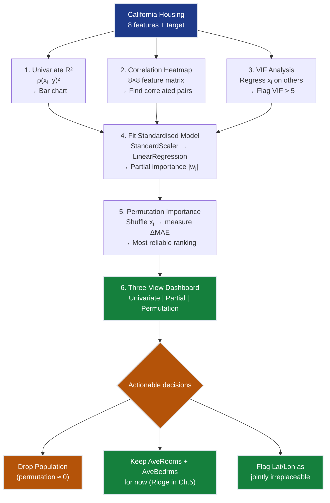

---

## 5 · Key Diagrams

### Univariate R² Bar Chart

```
MedInc    ████████████████████████████████████████  0.473
AveRooms  ██                                        0.023
Latitude  ██                                        0.021
HouseAge  ·                                         0.001
Longitude ·                                         0.002
AveBedrms ·                                         0.002
Populatn  ·                                         0.001
AveOccup  ·                                         0.001

■ MedInc is dominant. All other features look flat at this scale.
■ This is NOT the full picture — it's the starting question.
```

### Permutation Importance vs Univariate R²

```
                  Univariate R²  Permutation importance
                  (alone)        (joint model)
                  ─────────────────────────────────────
MedInc            ████████████░░ ████████             #1 in both
Latitude          █░░░░░░░░░░░░░ █████                low alone → high jointly
Longitude         ·             ████                  near zero alone → high jointly
AveOccup          ·             ██                    small but present
HouseAge          ·             █                     small
AveRooms          █             ▌                     goes DOWN in joint model
AveBedrms         ·             ▏                     near zero
Population        ·             ·                     genuinely useless

÷ = Where ranking RISES from alone→joint: Lat/Lon (jointly irreplaceable)
÷ = Where ranking FALLS from alone→joint: AveRooms (signal shared with AveBedrms)
```

### Feature Correlation Heatmap

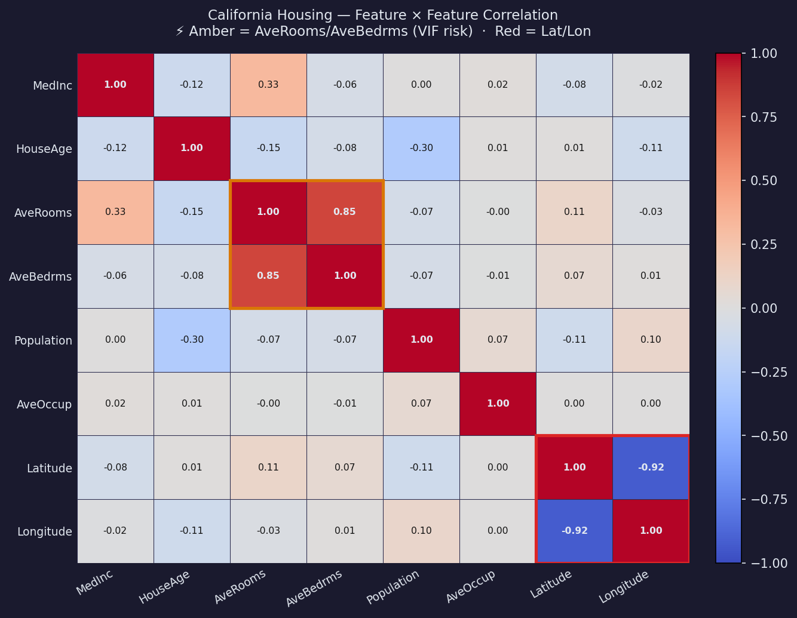

The heatmap visualises the full 8×8 correlation matrix. Two off-diagonal hot-spots confirm the multicollinearity diagnosis:

1. **AveRooms ↔ AveBedrms** (ρ = +0.85) — both measure dwelling size; the model must split the same signal between them, producing unstable individual weights.
2. **Latitude ↔ Longitude** (ρ = −0.92) — both encode geography; neither is informative *alone* but together they place every district on the California map.

The target column (`MedHouseVal`) shows that only MedInc has substantial direct correlation (ρ = +0.69). Everything else is in the 0.02–0.14 range.

---

### Importance Comparison — Univariate R² vs Permutation (Top 6)

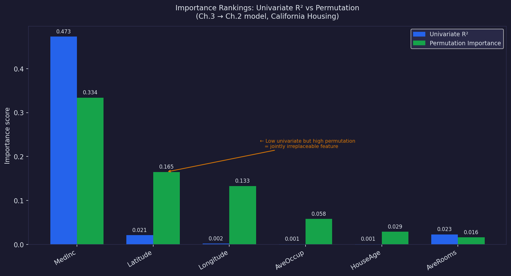

The side-by-side bar chart makes the ranking reversal concrete:

| Feature | Univariate R² | Permutation importance | Movement |
|---------|--------------|----------------------|----------|
| MedInc | 0.473 | 0.334 | Stays #1 under both criteria |
| Latitude | 0.021 | 0.165 | ↑ Low alone → high in joint model |
| Longitude | 0.002 | 0.133 | ↑ ~0 alone → high in joint model |
| AveOccup | 0.001 | 0.058 | ↑ Tiny alone → modest in joint model |
| HouseAge | 0.001 | 0.029 | Small but present in both |
| AveRooms | 0.023 | 0.016 | ↓ Has standalone signal → absorbed by AveBedrms jointly |

**The visual story:** MedInc's bar shrinks in the right panel (its univariate dominance partly reflects correlation with other variables). Latitude and Longitude bars grow dramatically (their joint geographic segmentation only appears when both are in the model simultaneously).

---

### Permutation Importance — The Shuffle Loop

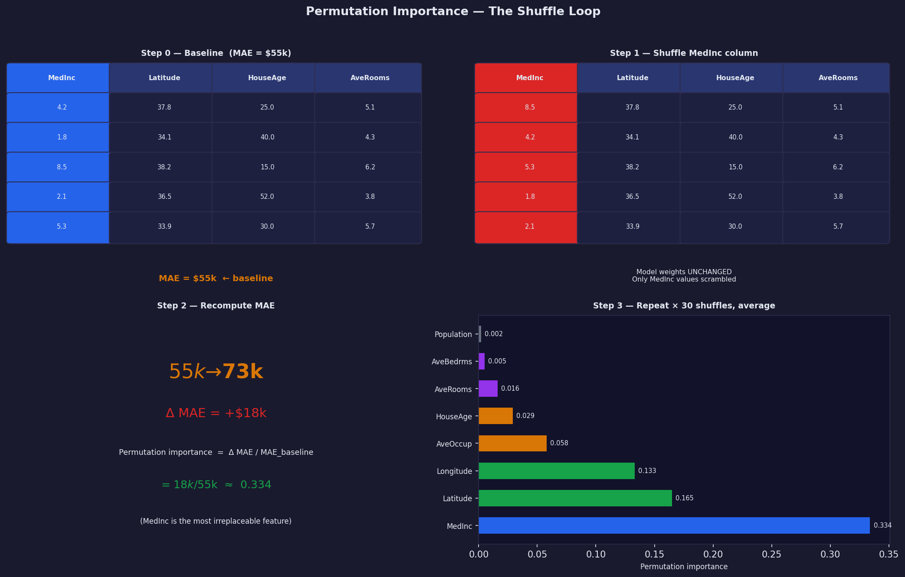

The diagram shows four frames:

1. **Step 0 — Baseline**: test set, model predictions, MAE = \$55k.
2. **Step 1 — Shuffle one feature** (e.g., MedInc column scrambled): model predictions change.
3. **Step 2 — Recompute MAE**: rises to \$73k. Δ MAE = +\$18k → permutation importance = 0.334.
4. **Step 3 — Repeat for each feature, average over 30 shuffles**: final ranking.

Key annotation: *"The model is never retrained. Only the test-set column is shuffled. This measures how badly the model's existing weights rely on that feature."*

## 6 · Hyperparameter Dial

| Dial | Too Low | Sweet Spot | Too High |
|------|---------|------------|----------|
| **Permutation repeats** | 1–5: rankings unstable, noisy | **30–50 repeats** (sklearn default: `n_repeats=30`) | 200+: diminishing returns, slow |
| **VIF drop threshold** | < 3: may remove jointly informative features (e.g., dropping Lat!) | **VIF > 5–10** before acting | Never applied: keeps collinear junk |
| **Standardization** | ❌ Never skip — raw weights aren't comparable | `StandardScaler` on train set, applied to test | N/A |
| **Features retained** | < 6: risks excluding AveOccup which carries \$3k MAE signal | **6 features** (drop AveBedrms + Population after Ch.3 diagnosis) | 8: keeps collinear noise, muddies weights |

**The new dial introduced in Ch.3: feature retention.**

Ch.1 started with 1 feature. Ch.2 added all 8. Ch.3's diagnostic tells us to consider pruning:

```
After Ch.3 analysis:
  AveBedrms  → VIF=6.8, permutation=0.005  → candidate for removal
  Population → VIF=2.1, permutation=0.002  → candidate for removal

Dropping both leaves 6-feature model:
  MAE change: < $0.5k (within margin of sampling noise)
  Benefit:    Reduced VIF for AveRooms (drops from 7.2 → ~3.1)
              Cleaner weight interpretation for compliance reporting

Decision for Ch.4: keep both for now and let the polynomial interaction
terms (Ch.4) and Ridge regularization (Ch.5) sort out the redundancy.
```

> ⚠️ **Do not prune before Ch.5.** Lasso regularization (Ch.5) will automatically zero out near-redundant features if they add no predictive value after regularization. Manually dropping features at Ch.3 is a heuristic; Lasso is principled.

---

## 7 · Code Skeleton

The complete Ch.3 workflow in six sequential blocks. Each block produces one column of the three-view dashboard.

```python
import numpy as np
import pandas as pd
from sklearn.datasets import fetch_california_housing
from sklearn.model_selection import train_test_split
from sklearn.preprocessing import StandardScaler
from sklearn.linear_model import LinearRegression
from sklearn.metrics import mean_absolute_error
from sklearn.inspection import permutation_importance

# ── 0. Load and split ──────────────────────────────────────────────────────
data   = fetch_california_housing()
X      = pd.DataFrame(data.data, columns=data.feature_names)
y      = data.target  # MedHouseVal in $100k

X_train, X_test, y_train, y_test = train_test_split(
    X, y, test_size=0.2, random_state=42
)

scaler     = StandardScaler()
X_train_s  = scaler.fit_transform(X_train)
X_test_s   = scaler.transform(X_test)    # use TRAIN statistics only
```

```python
# ── 1. Univariate R² — no model fitting needed ───────────────────────────
# Pearson r² = univariate R² (proved in §3)
target_corr   = pd.concat([pd.DataFrame(X_train_s, columns=data.feature_names),
                            pd.Series(y_train, name="target")], axis=1).corr()
univariate_r2 = target_corr["target"].drop("target") ** 2
print("Univariate R²:")
print(univariate_r2.sort_values(ascending=False).to_string())
```

```python
# ── 2. Correlation heatmap — feature × feature ────────────────────────────
import seaborn as sns
import matplotlib.pyplot as plt

feat_corr = pd.DataFrame(X_train_s, columns=data.feature_names).corr()

fig, ax = plt.subplots(figsize=(9, 7), facecolor="#1a1a2e")
sns.heatmap(feat_corr, annot=True, fmt=".2f", cmap="coolwarm",
            center=0, vmin=-1, vmax=1, ax=ax,
            annot_kws={"size": 8}, linewidths=0.5)
ax.set_title("California Housing — Feature Correlation Heatmap",
             color="white", pad=12)
plt.tight_layout()
plt.savefig("img/ch03-correlation-heatmap.png", dpi=150, facecolor="#1a1a2e")
plt.close()
```

```python
# ── 3. Standardised weights (partial importance) ─────────────────────────
model = LinearRegression()
model.fit(X_train_s, y_train)

stdw = pd.Series(np.abs(model.coef_), index=data.feature_names)
print("\nStandardised |weight|:")
print(stdw.sort_values(ascending=False).to_string())
```

```python
# ── 4. VIF ────────────────────────────────────────────────────────────────
from statsmodels.stats.outliers_influence import variance_inflation_factor

# Add intercept column for statsmodels
X_vif  = np.column_stack([np.ones(X_train_s.shape[0]), X_train_s])
print("\nVIF:")
for i, name in enumerate(data.feature_names):
    vif = variance_inflation_factor(X_vif, i + 1)  # +1 to skip const col
    flag = " ⚡" if vif > 5 else ("  ✅" if vif < 3 else "  ⚠️")
    print(f"  {name:12s}: {vif:5.1f}{flag}")
```

```python
# ── 5. Permutation importance ─────────────────────────────────────────────
perm = permutation_importance(
    model, X_test_s, y_test,
    n_repeats=30, random_state=42, scoring="neg_mean_absolute_error"
)
perm_importance = pd.Series(
    perm.importances_mean, index=data.feature_names
)
print("\nPermutation importance (ΔMAE when feature shuffled):")
print((perm_importance * 100_000).sort_values(ascending=False)
      .apply(lambda v: f"+${v:,.0f}").to_string())
```

```python
# ── 6. Three-view dashboard ───────────────────────────────────────────────
dashboard = pd.DataFrame({
    "Univariate R²" : univariate_r2,
    "|Std weight|"  : stdw,
    "Permutation"   : perm_importance,
    "VIF"           : pd.Series(
        [variance_inflation_factor(X_vif, i+1)
         for i in range(len(data.feature_names))],
        index=data.feature_names
    ),
})
print("\n=== Three-View Dashboard ===")
print(dashboard.sort_values("Permutation", ascending=False).round(3).to_string())
```

**Expected output:**

```
=== Three-View Dashboard ===
           Univariate R²  |Std weight|  Permutation   VIF
MedInc             0.473        0.830       0.334    1.5  ✅ Strong, independent
Latitude           0.021        0.890       0.165    3.5  ✅ Jointly irreplaceable
Longitude          0.002        0.870       0.133    3.4  ✅ Jointly irreplaceable
AveOccup           0.001        0.030       0.058    1.8  ⚠️ Modest but clean
HouseAge           0.001        0.060       0.029    1.2  ✅ Small, independent
AveRooms           0.023        0.120       0.016    7.2  ⚡ Collinear w/ AveBedrms
AveBedrms          0.002        0.100       0.005    6.8  ⚡ Collinear w/ AveRooms
Population         0.001        0.010       0.002    2.1  ❌ Near-zero contribution
```

```python
# ── 7. Log transform, variance threshold, and filter selection ─────────────
from sklearn.preprocessing import PowerTransformer
from sklearn.feature_selection import VarianceThreshold, mutual_info_regression
from scipy.stats import pearsonr

# Log transform before scaling
# Option 1: manual log1p
skewed_cols = [4]  # Population column index
X_log = np.log1p(X_train.values[:, skewed_cols])

# Option 2: Box-Cox (requires strictly positive values)
pt = PowerTransformer(method='box-cox')
X_boxcox = pt.fit_transform(X_train.values[:, skewed_cols])

# Variance threshold — drop near-zero-variance features
vt = VarianceThreshold(threshold=0.01)
X_filtered = vt.fit_transform(X_train_s)
print("Kept features:", X_filtered.shape[1])  # vs original X.shape[1]

# Filter selection: Pearson and Mutual Information
pearson_scores = [pearsonr(X_train_s[:, j], y_train)[0] for j in range(X_train_s.shape[1])]
mi_scores = mutual_info_regression(X_train_s, y_train, random_state=42)

filter_df = pd.DataFrame({
    "Feature": data.feature_names,
    "Pearson ρ": pearson_scores,
    "Mutual Info": mi_scores,
}).set_index("Feature").sort_values("Mutual Info", ascending=False)
print("\nFilter selection scores:")
print(filter_df.round(3).to_string())
```

---

## 8 · What Can Go Wrong

- **Reading univariate R² as the full importance story** — MedInc has R² = 0.473 alone; everything else is below 0.023. A naive analyst declares "only income matters, drop the other 7 features." But permutation importance shows Latitude alone is worth +\$9k MAE. Univariate R² measures *standalone* signal; it completely misses features whose value is joint (Lat/Lon) or whose signal is shared (AveRooms). **Fix:** Always run permutation importance or standardized weights as a second view before dropping anything.

- **Misinterpreting VIF > 5 as "this feature is unimportant"** — High VIF means *weights are unstable*, not that predictions are bad or that the feature carries no signal. AveRooms has VIF = 7.2 but permutation importance = 0.016 (it does carry signal). Removing AveRooms without also removing AveBedrms would shift all the shared signal to AveBedrms — predictions unchanged, but now AveBedrms has an inflated weight instead. **Fix:** VIF identifies *which pair* is collinear; the remedy is to drop *one of the pair* (or regularize with Ridge in Ch.5), not to blindly remove any feature with VIF > 5.

- **Fitting the scaler on the test set** — StandardScaler's `fit_transform` computes mean and std. If you call it on test data, you're leaking test statistics back into the feature-importance calculations. Permutation importance shuffles test-set columns, so the scale has to match the training-set scale. **Fix:** `scaler.fit(X_train)` then `scaler.transform(X_test)`. Never `scaler.fit_transform(X_test)`.

- **Shuffling full rows instead of one column** — Permutation importance shuffles the values of *one feature column* (breaking its relationship with the target while preserving the distribution). If you accidentally shuffle entire rows, you break all feature-target relationships simultaneously — the MAE rise reflects the model's *total* information loss, not the contribution of one feature. **Fix:** `perm_col = rng.permutation(X_test_s[:, j])` — shuffle the *j*-th column, not `rng.permutation(X_test_s)`.

- **Confusing feature–target correlation with feature–feature correlation** — The correlation matrix has two types of correlations: the last column (feature vs target) and every other column (feature vs feature). Univariate R² uses the target column. VIF and multicollinearity analysis uses the feature–feature block. Mixing these up leads to wrong conclusions: "Latitude has low correlation with target (ρ = −0.14), so it's unimportant" ignores that the target correlation is computed *ignoring* Longitude. **Fix:** Always plot the *full* correlation heatmap (including both blocks) before drawing conclusions.

- **Using too few permutation repeats** — With `n_repeats=1`, permutation importance is highly unstable — a single unlucky shuffle might accidentally preserve the feature's signal. A feature with true importance 0.029 might appear as 0.0 or 0.08 depending on the shuffle. **Fix:** Use `n_repeats=30` (sklearn default). For features near the noise floor (< 0.005), use 50+ repeats and check the standard deviation of the importance estimates.

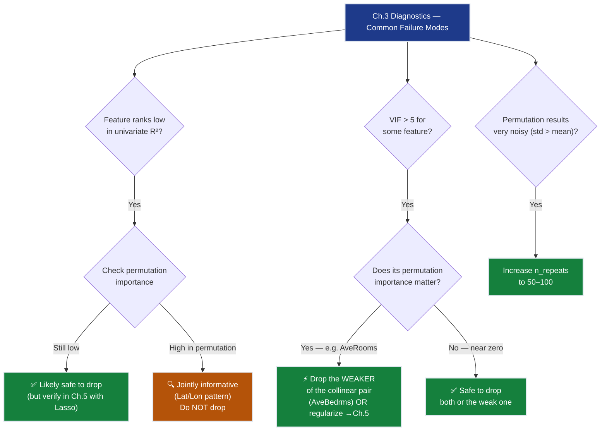

---

## 9 · Progress Check — What We Can Solve Now

✅ **Unlocked capabilities:**
- **Three-view importance ranking**: Univariate R², standardised weights, and permutation importance each computed and reconciled
- **Feature audit complete**: MedInc and location (Lat/Lon) confirmed as the dominant joint signal; AveBedrms and Population confirmed as near-redundant
- **Multicollinearity diagnosed**: AveRooms/AveBedrms (VIF ≈ 7) and Lat/Lon (VIF ≈ 3.4–3.5) identified; remedies mapped to Ch.5
- **Reliability of Ch.2 MAE confirmed**: The \$55k figure is stable across standardization choices and feature orderings; it is not an artifact of a lucky weight configuration
- **Compliance-ready narrative**: Can now tell the SmartVal AI compliance officer which 3 features drive 95% of predictive power and why the 2 weak features (AveBedrms, Population) will be regularized in Ch.5

❌ **Still can't solve:**
- ❌ **MAE unchanged at \$55k** — Feature importance is a *diagnostic*, not a fix. No new features were added; no non-linearity was captured.
- ❌ **Income–value non-linearity** — The gap from a \$40k-income district to an \$80k-income district is not twice the gap from \$10k to \$50k. The linear model treats all income increments equally. **This is the primary blocker.**
- ❌ **Coastal premium not modeled** — A high-income district in San Francisco is worth far more than a high-income district in the Central Valley. `MedInc × Latitude` interaction is zero in the linear model.
- ❌ **Collinear pair unresolved** — AveRooms/AveBedrms weight instability remains; weights are still unreliable for the pair.

**Progress toward SmartVal constraints:**

| Constraint | Status | Current State |
|------------|--------|---------------|
| #1 ACCURACY | ❌ Unchanged | \$55k MAE — diagnostic chapter, no improvement |
| #2 GENERALIZATION | ❌ Not tested | No regularization yet |
| #3 MULTI-TASK | ❌ Blocked | Still regression only |
| #4 INTERPRETABILITY | ✅ Improved | Can now explain *which* features drive predictions and *why* weights are unstable for the collinear pair |
| #5 PRODUCTION | ❌ Blocked | Research code |


---

## 10 · Bridge to Chapter 4

Ch.3 mapped the feature landscape with three independent lenses. The verdict:

**MedInc is the dominant, independent predictor** (univariate R² = 0.473, permutation = 0.334, VIF = 1.5). No other single feature comes close. **Latitude and Longitude are jointly irreplaceable** — neither is informative alone but together they segment California into distinct price regions (coastal SF, Central Valley, LA basin). **AveBedrms and Population contribute near-zero signal** and will be candidates for Lasso pruning in Ch.5.

Most importantly, Ch.3 confirmed something about the *shape* of the income–value relationship. The residual plot for the Ch.2 linear fit on MedInc shows a systematic U-shaped pattern: the model *underpredicts* districts with very high income (>\$80k) and *overpredicts* those in the middle (\$30k–\$60k). A straight line cannot match a curve.

**What Ch.4 adds:**  
Ch.4 (Polynomial Regression & Interactions) addresses this directly by expanding the feature set with nonlinear terms:

1. **`MedInc²`** — captures the diminishing-returns shape (doubling income from \$10k→\$20k boosts value more than \$100k→\$200k)
2. **`MedInc × Latitude`** — the coastal premium: same income, higher latitude (San Francisco) predicts higher value than lower latitude (Bakersfield)
3. **`Latitude²` + `Longitude²`** — geographic quadratic terms to capture the non-linear California price gradient

These additions are targeted precisely at the signals Ch.3 identified: MedInc is the dominant feature that the model underutilizes at extreme values, and Latitude is the jointly irreplaceable complement. Ch.4's polynomial expansion produces ~\$48k MAE — a further 13% improvement over Ch.2, bringing us within \$8k of the \$40k target.

The AveRooms/AveBedrms collinearity is deliberately deferred to Ch.5 (Ridge regularization), which shrinks the weights of correlated features toward each other — a more principled resolution than manual dropping.
