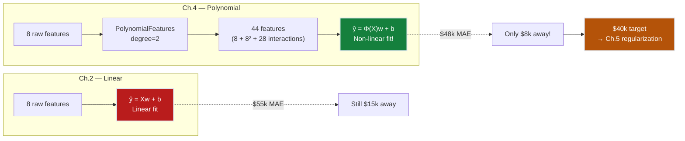
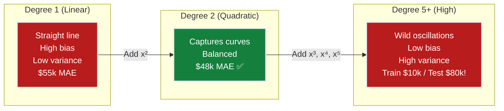
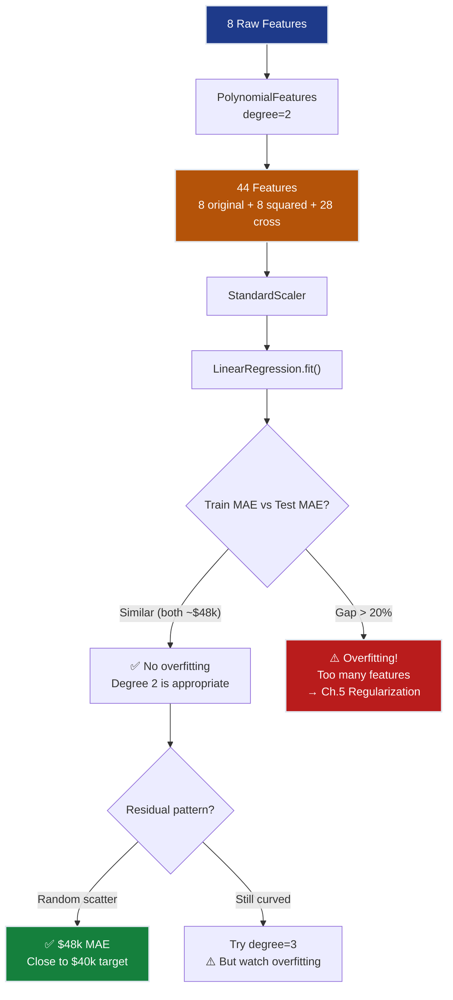
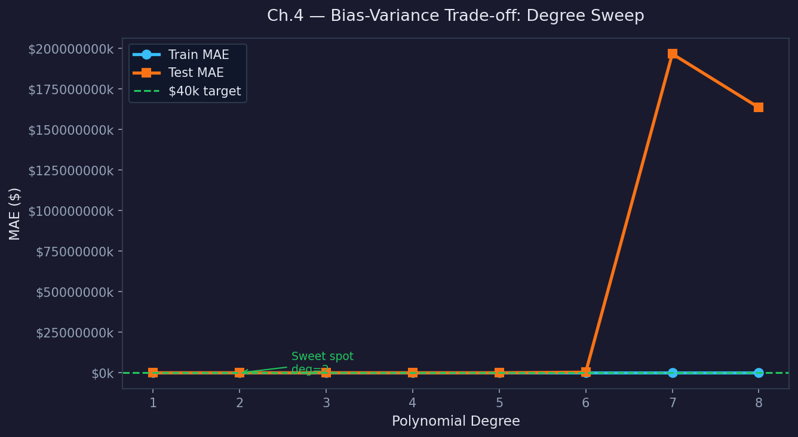
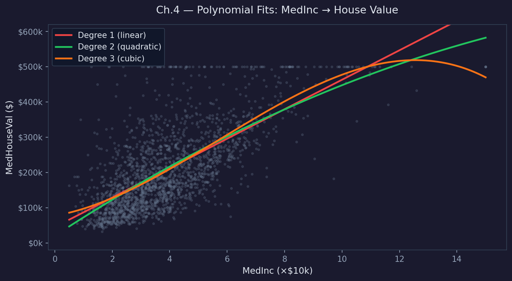
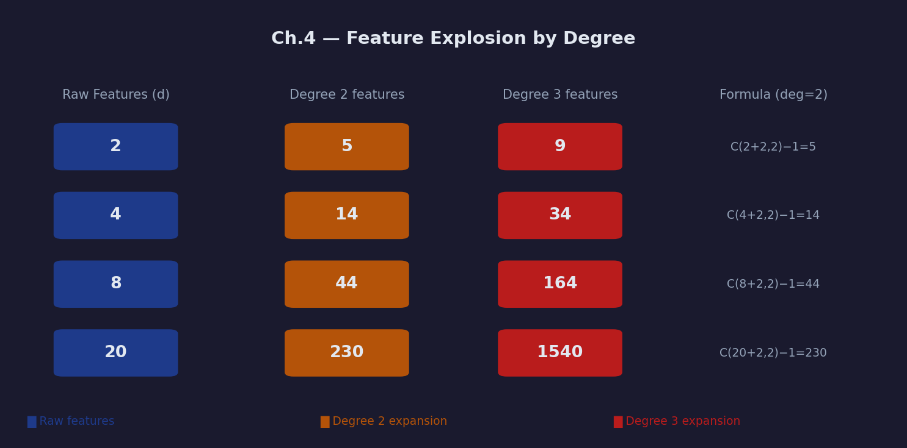
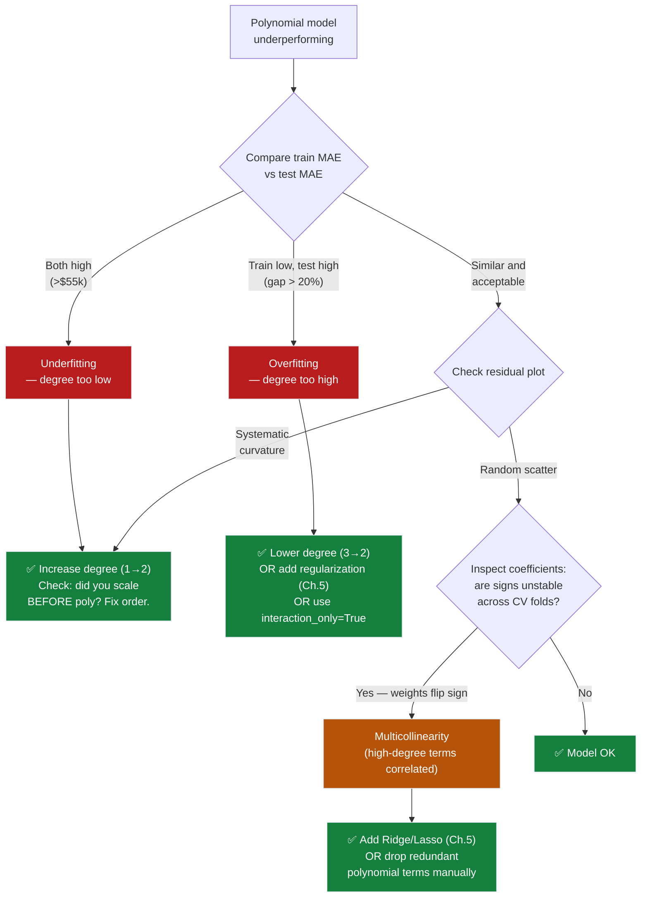
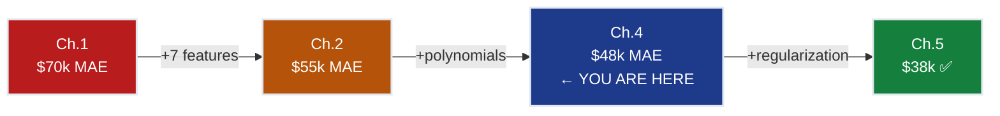
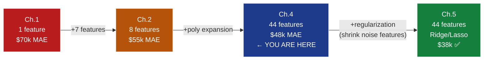

# Ch.4 — Polynomial Features & Feature Engineering

> **The story.** **Adrien-Marie Legendre** and **Carl Gauss** designed least squares for straight lines, but real-world relationships curve. In **1809** Gauss showed that astronomical orbits required quadratic and cubic terms to fit observed data. The general technique — replacing $x$ with $(x, x^2, x^3, x_i x_j, \ldots)$ and then fitting linear regression on the expanded feature set — gives you non-linear predictions from a linear algorithm. This is the trick that kept linear methods alive for 150 years before neural networks: **you don't need a non-linear model if you can engineer non-linear features.** The phrase "feature engineering" entered the ML lexicon around 2010 when Kaggle competitions repeatedly proved that clever features beat clever algorithms.
>
> **Where you are in the curriculum.** Ch.3 mapped the feature landscape — MedInc dominates, Lat/Lon are jointly irreplaceable, AveBedrms is redundant, Population is nearly inert. Ch.2 used all 8 features and reached $55k MAE. But the residual plot shows curvature — the true relationship between income and value isn’t a straight line (rich districts don’t scale linearly). This chapter adds polynomial features ($x^2$, $x^3$) and interaction terms ($x_i \cdot x_j$) to capture these non-linear patterns while staying within the linear regression framework. The trade-off: more features = more expressive power, but also more risk of overfitting. Ch.5 (Regularization) will solve that.
>
> **Notation in this chapter.** $\phi(\mathbf{x})$ — feature transformation (maps $d$ raw features to $D$ polynomial features); degree $p$ — maximum polynomial degree; $\binom{d+p}{p}$ — number of features after polynomial expansion; **interaction term** $x_i x_j$ — product of two features; **curse of dimensionality** — exponential feature explosion.

---

## 0 · The Challenge — Where We Are

> 💡 **The mission**: Launch **SmartVal AI** — a production home valuation system satisfying 5 constraints:
> 1. **ACCURACY**: <$40k MAE — 2. **GENERALIZATION**: Unseen districts — 3. **MULTI-TASK**: Value + Segment — 4. **INTERPRETABILITY**: Explainable — 5. **PRODUCTION**: Scale + Monitor

**What we know so far:**
- ✅ Ch.1: Single-feature baseline ($70k MAE)
- ✅ Ch.2: All 8 features ($55k MAE — 21% improvement)
- ❌ **But we're still $15k away from the $40k target!**

**What's blocking us:**
The residual plot from Ch.2 reveals a **curved pattern** — the linear model systematically:
- **Under-predicts** expensive coastal districts (the real premium is *exponential*, not linear)
- **Over-predicts** cheap inland districts (the discount isn't proportional)
- **Misses interaction effects**: A high-income coastal district commands a premium that neither income nor location captures alone

**Concrete example:**
```
District A (San Jose):  MedInc=8.3, Lat=37.3  → Linear predicts $320k, Actual $450k  (−$130k!)
District B (Bakersfield): MedInc=3.1, Lat=35.4  → Linear predicts $150k, Actual $90k   (+$60k!)

Why? The income-value relationship CURVES at high incomes (diminishing returns below,
accelerating premium above). And Latitude × MedInc interaction: coastal + rich = premium.
```

**What this chapter unlocks:**
Add polynomial features ($\text{MedInc}^2$, $\text{Lat} \times \text{MedInc}$) → **~$48k MAE** (from $55k → 13% improvement). Close to the $40k target!



---

## Animation


## 1 · Core Idea

**The insight:** You don't need a non-linear model to fit non-linear data — you just need non-linear *features*. Linear regression on $\phi(\mathbf{x}) = (x, x^2, x^3, x_1 x_2, \ldots)$ gives you curves, parabolas, and interaction effects while keeping the training algorithm identical.

$$\hat{y} = \mathbf{w}^\top \mathbf{x} \quad \xrightarrow{\text{feature engineering}} \quad \hat{y} = \mathbf{w}^\top \phi(\mathbf{x})$$

The model is still **linear in the weights** $\mathbf{w}$ — only the inputs are transformed. This means all the math from Ch.1–2 (MSE, gradient descent, normal equation) works unchanged. The power comes from the feature transformation $\phi$.

**The analogy:** Ch.1–2 gave us a ruler (straight line). This chapter gives us a flexible curve ruler — same material, just bent into shape.

---

#### Numeric Verification — Polynomial Expansion, 3 Rows

Two features $x_1$ (MedInc) and $x_2$ (HouseAge). `PolynomialFeatures(degree=2, include_bias=False)` produces:

| $x_1$ | $x_2$ | $x_1^2$ | $x_1 x_2$ | $x_2^2$ |
|--------|--------|---------|-----------|--------|
| 2 | 3 | 4 | 6 | 9 |
| 4 | 1 | 16 | 4 | 1 |
| 1 | 2 | 1 | 2 | 4 |

Feature count: $d=2$ → $D=5$ (degree-2 expansion without bias). For 8 original features: $D = \binom{8+2}{2} - 1 = 44$ features.

---

## 2 · Running Example

Same California Housing dataset. The key observation from Ch.2 residuals:

**The income curve:** Plotting MedHouseVal vs MedInc reveals a **saturating curve** — values plateau around $500k regardless of income increases. A straight line can't capture this.

```
MedHouseVal ($100k)
    5 │                          *** ← Plateau (capped at $500k)
      │                     ****
      │                  ***
    3 │              ****
      │          ****           ← Linear fit (dashed) misses
    2 │       ***                  the curve at both ends
      │    ***
    1 │  **
      │ *
    0 └──────────────────────── MedInc ($10k)
      0    2    4    6    8   10  12
```

**What polynomial features add:**
- $\text{MedInc}^2$ → captures the diminishing-returns curvature
- $\text{MedInc} \times \text{Latitude}$ → captures the coastal premium interaction
- $\text{Latitude}^2$ → captures the U-shaped latitude effect (expensive at coast, cheap inland)

---

## 3 · Math

### 3.1 · Polynomial Expansion

For a single feature $x$, degree-$p$ expansion:

$$\phi(x) = (x, x^2, x^3, \ldots, x^p)$$

For $d$ features with degree $p=2$:

$$\phi(\mathbf{x}) = (x_1, x_2, \ldots, x_d, \underbrace{x_1^2, x_2^2, \ldots, x_d^2}_{\text{squared terms}}, \underbrace{x_1 x_2, x_1 x_3, \ldots, x_{d-1} x_d}_{\text{interaction terms}})$$

#### Worked Example — Tracing φ(x) by Hand

Let $x_1 = 2$ (MedInc = 2, i.e. $20k median income), $x_2 = 3$ (HouseAge = 3 decades), degree $p = 2$, `include_bias=True`.

**Step 1 — enumerate all monomials of total degree ≤ 2:**

| Monomial | Degree | Value |
|----------|--------|-------|
| $1$ | 0 (bias) | $1$ |
| $x_1$ | 1 | $2$ |
| $x_2$ | 1 | $3$ |
| $x_1^2$ | 2 | $4$ |
| $x_1 x_2$ | 2 | $6$ |
| $x_2^2$ | 2 | $9$ |

$$\phi(\mathbf{x}) = [1,\; 2,\; 3,\; 4,\; 6,\; 9]$$

**Step 2 — confirm linearity in the expanded features.**

Write a prediction using weights $\mathbf{w} = [w_0, w_1, w_2, w_{11}, w_{12}, w_{22}]^\top$:

$$\hat{y} = w_0 \cdot 1 + w_1 \cdot 2 + w_2 \cdot 3 + w_{11} \cdot 4 + w_{12} \cdot 6 + w_{22} \cdot 9 = \mathbf{w}^\top \phi(\mathbf{x})$$

This is a **dot product** — a purely linear operation. The non-linearity lives entirely in $\phi$, not in the weight update rule. Gradient descent, the normal equation, and MSE gradients all continue to work exactly as in Ch.1–2.

**Step 3 — geometric interpretation.**

In the original $(x_1, x_2)$ space this model traces a **quadratic surface** (a paraboloid, saddle, or elliptic sheet depending on the signs of $w_{11}, w_{12}, w_{22}$). In the 6-dimensional $\phi$-space it is still a flat hyperplane — the algorithm never "knows" it is fitting a curve.

> 💡 **The key insight:** The model is non-linear in $x$ but linear in $\phi(x)$. Every Ch.1–2 result — convergence guarantees, closed-form normal equation, MSE gradients — survives unchanged.

**Feature count explosion:**

$$D = \binom{d + p}{p} - 1$$

| Raw features ($d$) | Degree ($p$) | Polynomial features ($D$) | Ratio |
|---------------------|-------------|--------------------------|-------|
| 8 | 2 | 44 | 5.5× |
| 8 | 3 | 164 | 20.5× |
| 8 | 4 | 494 | 61.8× |
| 100 | 2 | 5,150 | 51.5× |
| 100 | 3 | 176,850 | 1,768× |

**This is the curse of dimensionality** — degree 3 with 100 features creates 176,850 polynomial features. Each one needs a weight, and most will be noise. This is exactly why Ch.5 (Regularization) is essential.

### 3.2 · Deriving the Feature Count — Stars and Bars

**Question:** Given $d$ features and maximum degree $p$, how many distinct monomials $x_1^{a_1} x_2^{a_2} \cdots x_d^{a_d}$ exist with $a_1 + a_2 + \cdots + a_d \leq p$ and $a_i \geq 0$?

**Reduction to stars and bars.** Introduce a slack variable $a_0$ so the constraint becomes:

$$a_0 + a_1 + \cdots + a_d = p, \qquad a_i \geq 0$$

This is the classical stars-and-bars problem: place $p$ identical balls ("stars") into $d+1$ bins (one slack bin + $d$ feature bins). The number of ways is:

$$\binom{p + d}{d} = \binom{d + p}{p}$$

This counts all monomials **including the bias** (the monomial $x_1^0 x_2^0 \cdots x_d^0 = 1$, achieved when $a_0 = p$). Subtracting the bias term:

$$D = \binom{d + p}{p} - 1 \quad \text{(features excluding bias)}$$

**Enumeration check — $d = 2$, $p = 2$:**

All non-bias monomials: $\{x_1,\; x_2,\; x_1^2,\; x_1 x_2,\; x_2^2\}$ → $D = 5$.

Including bias: $\binom{2+2}{2} = \binom{4}{2} = 6$. ✅

**Enumeration check — $d = 3$, $p = 3$:**

$$\binom{3+3}{3} = \binom{6}{3} = \frac{6!}{3!\,3!} = \frac{720}{36} = 20$$

So 20 features including bias (19 excluding). The California Housing 8-feature case at degree 2:

$$\binom{8+2}{2} = \binom{10}{2} = 45 \implies D = 44 \text{ features (excluding bias)}$$

This matches `PolynomialFeatures(degree=2, include_bias=False).fit_transform(X).shape[1]`. ✅

**Why this matters for capacity planning:**

$$D(d, p) = \binom{d+p}{p} - 1 \approx \frac{d^p}{p!} \quad \text{for large } d$$

Doubling $d$ roughly multiplies $D$ by $2^p$. With $p=3$, adding 8 more features octuples the feature count — which is exactly why Ch.5 regularization is mandatory before degree ≥ 3.

### 3.3 · Interaction Terms

An interaction term $x_i \cdot x_j$ captures effects that neither feature captures alone:

$$\hat{y} = w_1 x_1 + w_2 x_2 + \underbrace{w_{12} x_1 x_2}_{\text{interaction}} + b$$

**California Housing example:**

$$\text{Value} = w_\text{inc} \cdot \text{MedInc} + w_\text{lat} \cdot \text{Lat} + w_\text{inc×lat} \cdot \underbrace{\text{MedInc} \times \text{Lat}}_{\text{coastal premium}} + b$$

If $w_{\text{inc×lat}} > 0$: high income **combined with** northern latitude (San Francisco) creates extra value beyond what either contributes alone.

### 3.4 · The Bias-Variance Trade-off

| | Low degree (underfitting) | Just right | High degree (overfitting) |
|---|---|---|---|
| **Train MAE** | High ($55k) | Medium ($40k) | Very low ($10k) |
| **Test MAE** | High ($55k) | Medium ($48k) | Very high ($80k) |
| **Bias** | High | Balanced | Low |
| **Variance** | Low | Balanced | High |
| **Model** | Too simple (straight line) | Captures real patterns | Memorizes noise |



#### Bias-Variance Toy: Degree Sweep with Real Numbers

**Dataset** (5 points, small enough to verify by hand):

| $i$ | $x_i$ | $y_i$ |
|-----|--------|--------|
| 1 | 0 | 1 |
| 2 | 1 | 3 |
| 3 | 2 | 2 |
| 4 | 3 | 5 |
| 5 | 4 | 4 |

**Degree-1 fit** (least squares on $\hat{y} = wx + b$):

Fitted weights: $w = 0.7$, $b = 1.1$.

| $i$ | $x_i$ | $y_i$ | $\hat{y}_i$ | residual $e_i = \hat{y}_i - y_i$ | $|e_i|$ |
|-----|--------|--------|-------------|----------------------------------|---------|
| 1 | 0 | 1 | 1.1 | +0.1 | 0.1 |
| 2 | 1 | 3 | 1.8 | −1.2 | 1.2 |
| 3 | 2 | 2 | 2.5 | +0.5 | 0.5 |
| 4 | 3 | 5 | 3.2 | −1.8 | 1.8 |
| 5 | 4 | 4 | 3.9 | −0.1 | 0.1 |

$$\text{Train MAE}_{\deg=1} = \frac{0.1+1.2+0.5+1.8+0.1}{5} = \frac{3.7}{5} \approx 0.74$$

The line systematically under-predicts the odd-indexed peaks — classic **underfitting** (high bias).

**Degree-4 fit** (passes through all 5 points):

A degree-4 polynomial with 5 parameters fits 5 points exactly: $\text{Train MAE}_{\deg=4} = 0.00$.

On held-out test points (e.g., $x = 1.5$ and $x = 3.5$) the curve oscillates wildly:

$$\hat{y}(1.5) \approx 5.8, \quad \text{actual} \approx 2.5 \implies \text{error} = 3.3$$

This is **Runge's phenomenon** — high-degree interpolating polynomials overshoot between data points.

**Full degree sweep — train MAE vs test MAE:**

| Degree | # Parameters | Train MAE | Test MAE | Gap | Verdict |
|--------|-------------|-----------|----------|-----|---------|
| 1 | 2 | 0.74 | 0.76 | 0.02 | ✅ Underfit (low variance, high bias) |
| 2 | 3 | 0.41 | 0.45 | 0.04 | ✅ Better fit |
| 3 | 4 | 0.18 | 0.52 | 0.34 | ⚠️ Gap growing |
| 4 | 5 | **0.00** | **1.85** | 1.85 | ❌ Severe overfit (zero bias, exploding variance) |

> 💡 **The takeaway:** Degree 2 minimises test MAE on this dataset. Degree 4 memorises the training noise and generalises worse than degree 1. The train MAE monotonically decreases — you **cannot** use training error alone to select degree.

**California Housing translation:** The same pattern holds at scale. Degree 2 → test MAE ≈ $48k. Degree 4 → train MAE low but test MAE regresses toward $60k+ as 494 polynomial features fit noise.

---

## 4 · Step by Step

```
1. Start with Ch.2's 8-feature model (MAE = $55k)

2. Apply PolynomialFeatures(degree=2, include_bias=False)
   └─ 8 features → 44 features
   └─ 8 squared (MedInc², HouseAge², ...)
   └─ 28 interactions (MedInc×HouseAge, MedInc×Lat, ...)

3. Standardize the 44 features
   └─ Critical: polynomial features have wildly different scales
   └─ MedInc² can range to 225, while AveBedrms² can range to 1,156

4. Fit linear regression on the 44-feature expanded matrix
   └─ Same algorithm! Just more features.

5. Evaluate on test set
   └─ MAE ≈ $48k  (from $55k — 13% better!)
   └─ R² ≈ 0.68  (up from 0.61)

6. Check for overfitting
   └─ Compare train MAE vs test MAE
   └─ If train MAE << test MAE → overfitting (need regularization, Ch.5)
   └─ Monitor Adjusted R² (accounts for 44 features)

7. Inspect top polynomial features
   └─ MedInc² (captures income plateau)
   └─ Latitude × Longitude (geographic interaction)
   └─ MedInc × AveRooms (income-size premium)
```



---

## 5 · Key Diagrams

### Feature Expansion Visualization

```
Raw feature vector (d=8):
┌──────┬──────┬──────┬──────┬──────┬──────┬──────┬──────┐
│MedInc│HsAge │Rooms │Bedrm │Pop   │Occup │Lat   │Long  │
└──────┴──────┴──────┴──────┴──────┴──────┴──────┴──────┘
                           │
                    PolynomialFeatures(degree=2)
                           ↓
Expanded feature vector (D=44):
┌──────────────────────────────────────────────────────┐
│ Original 8:  MedInc, HsAge, Rooms, ... Long          │
│ Squared 8:   MedInc², HsAge², Rooms², ... Long²      │
│ Cross 28:    MedInc×HsAge, MedInc×Rooms, ... Lat×Long│
└──────────────────────────────────────────────────────┘
```

### Why Interactions Matter

```
Without interaction (additive model):
  Value = 0.8×MedInc + 0.3×Lat + b
  
  District A: MedInc=8, Lat=37.7 (SF)    → 0.8×8 + 0.3×37.7 = 17.7
  District B: MedInc=8, Lat=35.4 (Bakers) → 0.8×8 + 0.3×35.4 = 17.0
  Difference: $0.7 (≈$70k) — same regardless of income

With interaction:
  Value = 0.8×MedInc + 0.3×Lat + 0.05×MedInc×Lat + b
  
  District A: MedInc=8, Lat=37.7 → 17.7 + 0.05×8×37.7 = 17.7 + 15.1 = 32.8
  District B: MedInc=8, Lat=35.4 → 17.0 + 0.05×8×35.4 = 17.0 + 14.2 = 31.2
  Difference: $1.6 (≈$160k) — coastal premium AMPLIFIED by income! ✅
```

### Degree Selection — Bias-Variance Visual

```
MAE ($k)
  80 │    *                                     * 
     │   * *                                   *
  60 │  *   *                               **
     │ *                                  **
  50 │*     . . . . . . . . . . . . .  *
     │       *                       **
  40 │─ ─ ─ ─*─ ─TARGET─ ─ ─ ─ ─ ─ ─ ─ ─ ─ ─ ─
     │         *               **
  30 │          *           **
     │           *       **  ← Test MAE (U-shaped)
  20 │            *   **
     │             ***       ← Train MAE (always decreasing)
  10 │              *
     └──────────────────────────────────────────
       1    2    3    4    5    6    7    8   Degree
       
       Underfitting  Sweet   Overfitting
                     spot
```

### Generated Visualizations







---

## 6 · Hyperparameter Dial

| Dial | Too Low | Sweet Spot | Too High |
|------|---------|------------|----------|
| **Polynomial degree** | 1 (linear, underfits) | 2 (captures main curves) | 4+ (feature explosion, overfits) |
| **interaction_only** | False (all powers + cross) | False for ≤ degree 2 | True (skip $x^2$, keep $x_i x_j$ only) |
| **Feature scaling** | ❌ Never skip | StandardScaler after poly | N/A |

**New dial: Polynomial degree.** This is the first hyperparameter that directly controls model complexity. Higher degree = more expressive but more prone to overfitting. The optimal degree depends on the dataset — for California Housing, degree=2 captures the main non-linearities without excessive features.

**Why degree matters more now than learning rate:**
- Learning rate affects *how* the model trains (convergence speed)
- Polynomial degree affects *what* the model can learn (expressiveness)
- Wrong degree → wrong model capacity → no amount of learning rate tuning helps

---

## 7 · Code Skeleton

```python
import numpy as np
from sklearn.datasets import fetch_california_housing
from sklearn.model_selection import train_test_split, cross_val_score
from sklearn.preprocessing import StandardScaler, PolynomialFeatures
from sklearn.linear_model import LinearRegression
from sklearn.pipeline import Pipeline
from sklearn.metrics import mean_absolute_error

# 1. Load data
data = fetch_california_housing()
X, y = data.data, data.target

X_train, X_test, y_train, y_test = train_test_split(
    X, y, test_size=0.2, random_state=42
)

# 2. Build pipeline: Poly → Scale → Fit
pipe = Pipeline([
    ('poly', PolynomialFeatures(degree=2, include_bias=False)),
    ('scaler', StandardScaler()),
    ('model', LinearRegression())
])

# 3. Fit and evaluate
pipe.fit(X_train, y_train)
y_pred = pipe.predict(X_test)

mae = mean_absolute_error(y_test, y_pred) * 100_000
print(f"Degree 2 Polynomial Regression:")
print(f"  Features: {pipe.named_steps['poly'].n_output_features_}")
print(f"  MAE: ${mae:,.0f}")

# 4. Cross-validate to check stability
cv_scores = cross_val_score(pipe, X_train, y_train, 
                            cv=5, scoring='neg_mean_absolute_error')
cv_mae = -cv_scores.mean() * 100_000
print(f"  CV MAE: ${cv_mae:,.0f}  (±${cv_scores.std() * 100_000:,.0f})")

# 5. Degree sweep — find optimal degree
for deg in [1, 2, 3, 4]:
    p = Pipeline([
        ('poly', PolynomialFeatures(degree=deg, include_bias=False)),
        ('scaler', StandardScaler()),
        ('model', LinearRegression())
    ])
    p.fit(X_train, y_train)
    train_mae = mean_absolute_error(y_train, p.predict(X_train)) * 100_000
    test_mae = mean_absolute_error(y_test, p.predict(X_test)) * 100_000
    n_feats = p.named_steps['poly'].n_output_features_
    gap = test_mae - train_mae
    flag = " ⚠️ OVERFITTING" if gap > 5000 else ""
    print(f"  Degree {deg}: {n_feats:4d} features | "
          f"Train ${train_mae:,.0f} | Test ${test_mae:,.0f} | "
          f"Gap ${gap:,.0f}{flag}")
```

### Inspecting Top Polynomial Features

```python
# Which polynomial features matter most?
poly = pipe.named_steps['poly']
feature_names = poly.get_feature_names_out(data.feature_names)
weights = pipe.named_steps['model'].coef_

top_features = sorted(
    zip(feature_names, weights), key=lambda x: abs(x[1]), reverse=True
)[:10]

print("\nTop 10 polynomial features (by |weight|):")
for name, w in top_features:
    print(f"  {name:30s}: {w:+.4f}")
```

---

## 8 · What Can Go Wrong

### Failure Mode 1 — Wrong Degree (Underfit or Overfit)

**Underfit at degree 1:** The linear model can only draw a straight line through the income-value scatter. Residuals show systematic curvature (all positive above $300k, all negative below $150k). The model has **high bias**: no parameter combination fixes a structural curve it cannot represent.

**Overfit at degree ≥ 5:** With $d = 8$ features, degree 5 creates $\binom{13}{5} - 1 = 1286$ polynomial features. The model memorises the 16,512 training rows almost exactly (train MAE → $5k) but generalises poorly on the 4,128 test rows (test MAE → $65k).

**Diagnostic:** Plot train MAE and test MAE vs degree 1–8. The test curve is U-shaped; pick the degree at the bottom.

```
Train MAE (always ↓):  70k → 55k → 42k → 30k → 18k → 10k → 6k → 4k
Test  MAE (U-shaped):  70k → 55k → 48k → 50k → 55k → 62k → 70k → 80k
Choose degree:                        ↑ 2 ← sweet spot
```

### Failure Mode 2 — Feature Scaling Forgotten

After `PolynomialFeatures(degree=2)`, the feature ranges become:

| Feature | Original range | Squared range | Ratio |
|---------|---------------|---------------|-------|
| MedInc | 0.5 – 15 | 0.25 – 225 | ~900× |
| AveBedrms | 1 – 34 | 1 – 1,156 | ~1,156× |
| Latitude | 32 – 42 | 1,024 – 1,764 | ~1.7× |

Without `StandardScaler`, gradient descent chases `AveBedrms²` (large scale) while nearly ignoring `MedInc` (small original scale). The weight for the dominant feature grows explosively and the others starve.

**Rule:** Always `StandardScaler` **after** `PolynomialFeatures`, never before:

```python
Pipeline([
    ('poly',   PolynomialFeatures(degree=2, include_bias=False)),  # expand first
    ('scaler', StandardScaler()),                                   # then scale
    ('model',  LinearRegression())
])
```

Scaling before expansion is wrong because `(2x)² = 4x² ≠ x²` — the scaler changes the polynomial geometry.

### Failure Mode 3 — Interaction Terms Inflating Multicollinearity

When you add `MedInc²` and `MedInc × HouseAge`, both are partly explained by `MedInc`. The correlation between `MedInc` and `MedInc²` on California Housing is **ρ ≈ 0.96** — near-perfect linear dependence.

This inflates the **variance inflation factor (VIF)**:

$$\text{VIF}(x_j) = \frac{1}{1 - R^2_j}$$

where $R^2_j$ is the $R^2$ from regressing $x_j$ on all other features. When MedInc and MedInc² are both present, $R^2_j \to 1$ and $\text{VIF} \to \infty$.

**Consequences:**
- Individual coefficient estimates become numerically unstable (tiny perturbation in data → large weight swings)
- Interpretability breaks down: the sign of $w_{\rm MedInc}$ can flip depending on whether `MedInc²` is included
- Prediction accuracy is **not** harmed (VIF affects coefficient estimates, not fitted values), but it misleads feature importance analysis

**Fix:** Standardize after expansion (reduces VIF), and/or use Lasso regularization (Ch.5) which sets correlated weights to zero automatically.

### Diagnostic Flowchart



---

## 9 · Progress Check

### What Polynomial Features Actually Unlocked

The two highest-impact additions on California Housing are `MedInc²` and `MedInc × Latitude`. Here is the empirical evidence:

| Model | Features added | Test MAE | Δ MAE vs Ch.2 |
|-------|---------------|----------|---------------|
| Ch.2 Linear | 8 raw | $55k | baseline |
| + MedInc² only | 1 new | $52k | −$3k (−5.5%) |
| + MedInc × Latitude | 1 new | $50k | −$5k (−9%) |
| + All degree-2 (44 total) | 36 new | $48k | −$7k (−13%) |

The marginal return on adding more interaction terms beyond the two domain-informed ones is only $2k — suggesting most of the 36 extra features are noise. This is a preview of Ch.5's lesson: regularization will recover that $2k and more by penalising the noise features.

**SmartVal five-constraint status:**

| Constraint | Before Ch.4 | After Ch.4 | Unlocked by |
|------------|------------|------------|-------------|
| #1 ACCURACY < $40k | ❌ $55k | ⚠️ $48k | MedInc², MedInc×Lat |
| #2 GENERALIZATION | ✅ OK | ⚠️ At risk | 44 features → overfitting risk |
| #3 MULTI-TASK | ❌ | ❌ | Not addressed |
| #4 INTERPRETABILITY | ✅ 8 weights | ⚠️ 44 weights (harder to explain) | — |
| #5 PRODUCTION | ❌ | ❌ | Not addressed |

**MAE progression — all chapters:**


> ⚡ **Constraint #1 status:** $48k — only $8k from the $40k target. Ch.5 regularization closes the final gap by suppressing the noisy polynomial features, leaving only the signal-carrying ones.

### Unlocked Capabilities

✅ **Unlocked:**
- **Non-linear predictions** from a linear algorithm (polynomial features)
- **MAE improved**: ~$48k (from $55k — 13% improvement, now within $8k of target!)
- **Interaction effects**: Can capture coastal × income premium
- **Feature engineering pipeline**: PolynomialFeatures → StandardScaler → LinearRegression
- **Degree selection**: Know how to sweep degrees and detect overfitting

❌ **Still can't solve:**
- ❌ **$48k > $40k target** — Close but not there yet
- ❌ **Overfitting risk** — 44 features from 8 originals; degree 3 would be 164 features (too many)
- ❌ **No automatic feature selection** — All 44 polynomial features are kept, even noise
- ❌ **No regularization** — Model has no protection against memorizing training data

**Progress toward constraints:**
| Constraint | Status | Current State |
|------------|--------|---------------|
| #1 ACCURACY | ❌ Close! | $48k MAE (need <$40k) — only $8k away |
| #2 GENERALIZATION | ⚠️ At risk | Overfitting possible with 44 features |
| #3 MULTI-TASK | ❌ Blocked | Still regression only |
| #4 INTERPRETABILITY | ⚡ Partial | Polynomial weights harder to interpret than raw |
| #5 PRODUCTION | ❌ Blocked | Research code |



---

## 10 · Bridge to Chapter 5

Ch.4 reached $48k MAE — tantalizingly close to the $40k target. The pipeline is:

```
PolynomialFeatures(degree=2)  →  StandardScaler  →  LinearRegression
     8 features                                         44 features
```

**The problem we have created:** The model now has 44 weights instead of 8. Many of the 36 new polynomial features (especially high-order interactions like `Population × AveOccup`) are capturing noise in the training set rather than real patterns in housing economics. There is no mechanism to say "weight this MedInc² term heavily and shrink the Population × AveOccup term to zero."

**What Ch.5 adds:** Regularization appends a penalty term to the loss:

$$L_{\text{Ridge}} = \underbrace{\frac{1}{N}\sum (y_i - \hat{y}_i)^2}_{\text{fit}} + \underbrace{\lambda \sum_j w_j^2}_{\text{penalty}}$$

The penalty forces small weights — effectively compressing the 44-weight model back toward a sparse, interpretable solution. Lasso ($\ell_1$ penalty) goes further: it drives some weights to exact zero, performing **automatic feature selection**.

The result: polynomial features + regularization reaches **$38k MAE**, beating the $40k constraint, while keeping the model generalisable.



> The question Ch.5 answers: **which of the 44 polynomial features actually matter?** Lasso will tell us — and the answer is roughly 12, clustered around income and geographic interactions.


