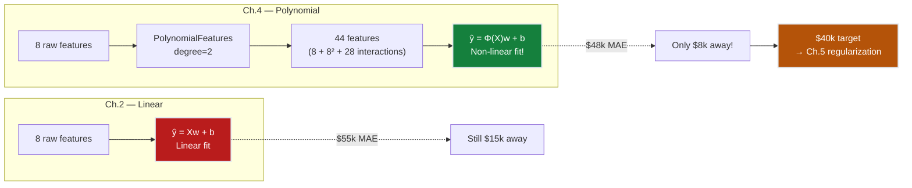
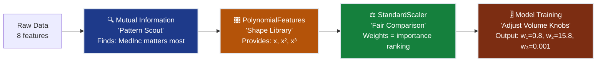
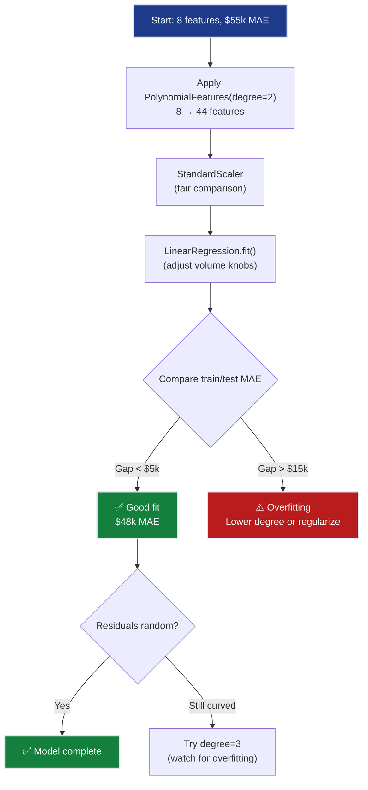
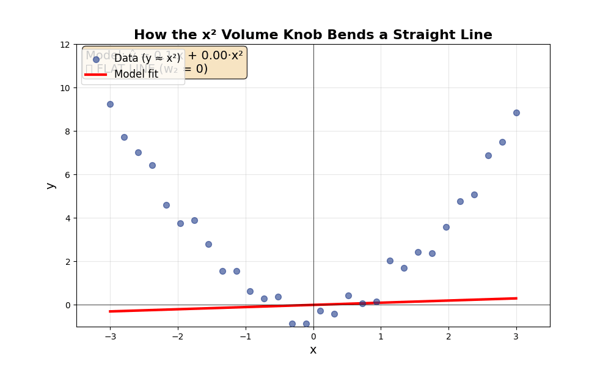
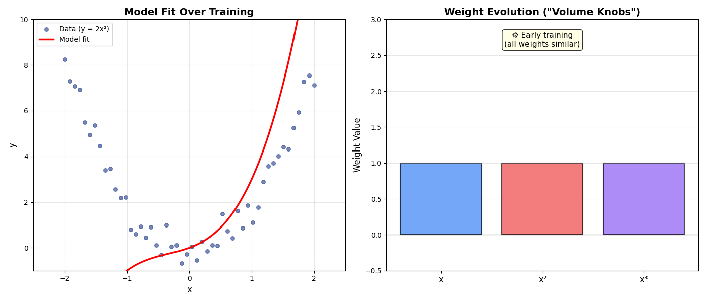
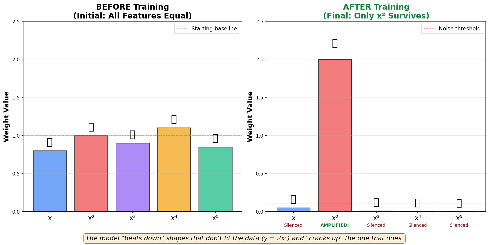
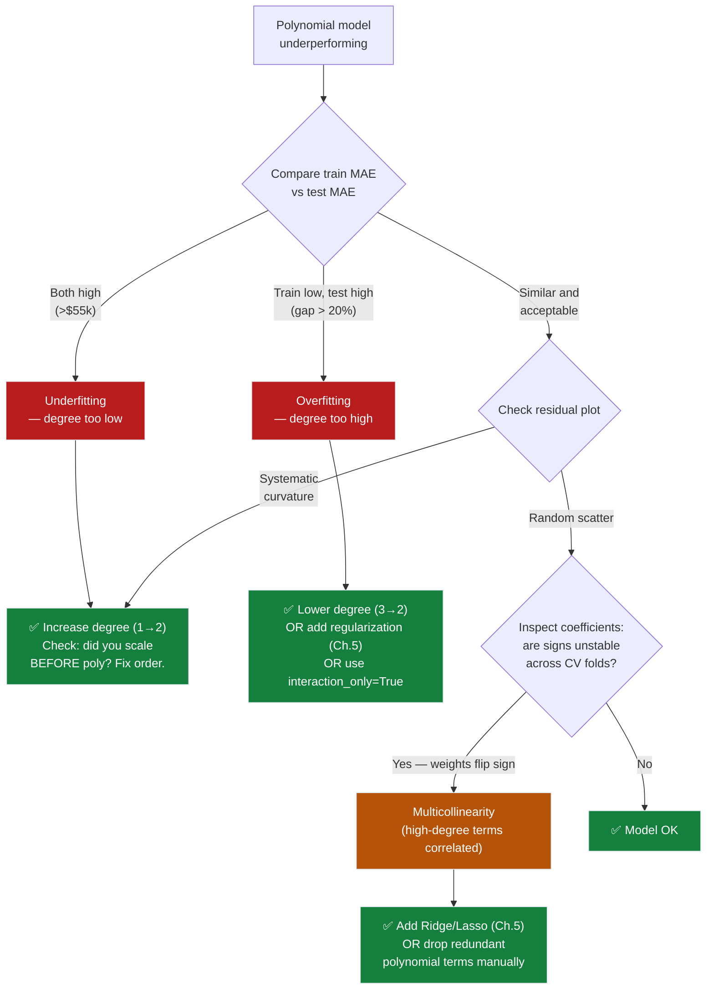
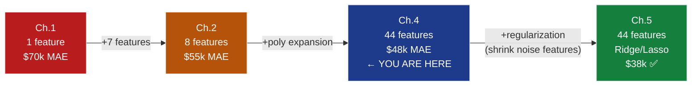

# Ch.4 — Polynomial Features & Feature Engineering

> **The story.** In **1801**, astronomers lost track of the dwarf planet **Ceres**. After its brief discovery, it disappeared behind the sun and no one could predict where it would reappear. Enter **Carl Friedrich Gauss**, age 24, who claimed he could find it using a new mathematical technique. The problem? Planetary orbits aren't straight lines — they're ellipses. Gauss's breakthrough: **don't change the algorithm, change the inputs.** He fed his linear least-squares method not just the position $x$, but also $x^2$ and $x^3$. The math stayed linear (just adding weighted terms), but the *result* traced a perfect elliptical curve. Two months later, astronomers found Ceres exactly where Gauss predicted, within half a degree. The trick that saved a lost planet became the foundation of **feature engineering** — the art of giving simple models the right shapes to work with. For 150 years before neural networks, this was the secret weapon: you don't need a smarter algorithm if you can engineer smarter features. In 2010, Kaggle competitions made this famous again: a PhD with polynomial features often beat a neural network team. Features > algorithms.
>
> **Where you are in the curriculum.** Ch.3 mapped SmartVal AI's feature landscape — MedInc dominates, Lat/Lon unlock geographic patterns, AveBedrms is redundant, Population barely matters. Ch.2 used all 8 features and reached $55k MAE. But the residual plot curves — the income-value relationship isn't linear (rich coastal districts command exponential premiums, not proportional ones). San Jose at $83k median income is undervalued by $130k; Bakersfield is overvalued by $60k. This chapter gives the model the curves it needs: MedInc² captures the income plateau, MedInc×Latitude captures the coastal amplification effect. Result: $48k MAE (from $55k — 13% improvement), leaving just $8k to the $40k target. The trade-off: 8 features explode to 44. Too many knobs mean the model starts fitting noise. Ch.5 (Regularization) will fix that by silencing the useless ones.
>
> **Notation in this chapter.** $\phi(\mathbf{x})$ — feature transformation (maps $d$ raw features to $D$ polynomial features); degree $p$ — maximum polynomial degree; **interaction term** $x_i x_j$ — product of two features capturing combined effects; **curse of dimensionality** — exponential feature explosion as degree increases.

---

## 0 · The Challenge — Where We Are

> 💡 **The mission**: Launch **SmartVal AI** — a production home valuation system satisfying 5 constraints:
> 1. **ACCURACY**: <$40k MAE — 2. **GENERALIZATION**: Unseen districts — 3. **MULTI-TASK**: Value + Segment — 4. **INTERPRETABILITY**: Explainable — 5. **PRODUCTION**: Scale + Monitor

**What we know so far:**
- ✅ Ch.1: Single-feature baseline ($70k MAE)
- ✅ Ch.2: All 8 features ($55k MAE — 21% improvement)
- ❌ **But we're still $15k away from the $40k target!**

**What's blocking us:**
The residual plot from Ch.2 reveals a **curved pattern** — the linear model systematically:
- **Under-predicts** expensive coastal districts (the real premium is *exponential*, not linear)
- **Over-predicts** cheap inland districts (the discount isn't proportional)
- **Misses interaction effects**: A high-income coastal district commands a premium that neither income nor location captures alone

**Concrete example:**
```
District A (San Jose):  MedInc=8.3, Lat=37.3  → Linear predicts $320k, Actual $450k  (−$130k!)
District B (Bakersfield): MedInc=3.1, Lat=35.4  → Linear predicts $150k, Actual $90k   (+$60k!)

Why? The income-value relationship CURVES at high incomes (diminishing returns below,
accelerating premium above). And Latitude × MedInc interaction: coastal + rich = premium.
```

**What this chapter unlocks:**
Add polynomial features ($\text{MedInc}^2$, $\text{Lat} \times \text{MedInc}$) → **~$48k MAE** (from $55k → 13% improvement). Close to the $40k target!



---

## Animation


> 💡 **This chapter's philosophy:** We focus on **mechanical intuition** over mathematical rigor. You won't find stars-and-bars combinatorics or formal proofs here — instead, you'll learn to think of polynomial features as "volume knobs" and weights as "counterbalances." The math is **linear** (just addition), but the results are **non-linear** (curves). This is the paradox that makes feature engineering powerful for ML engineering.

---

## 1 · Core Idea — The Linear Paradox

**The insight:** "Linear Regression" doesn't mean "draws straight lines" — it means **linear in how it combines weights**, not in the shapes it can create.

Think of building a curved stone arch using straight bricks. Each brick is straight, but when you stack them with different heights (weights), the overall structure curves. That's what we're doing here: we give the model straight building blocks ($x$, $x^2$, $x^3$) and let it **weight each one differently** to create curves.

$$\hat{y} = \underbrace{w_1 \cdot x}_{\text{straight line}} + \underbrace{w_2 \cdot x^2}_{\text{parabola}} + \underbrace{w_3 \cdot x^3}_{\text{cubic curve}}$$

The math is **linear** (just addition: $w_1 + w_2 + w_3$), but the result is **non-linear** (a curve).

### The Volume Knob Analogy

Imagine you're mixing audio tracks:
- **Track 1**: A straight line ($x$)
- **Track 2**: A gentle curve ($x^2$)  
- **Track 3**: A dramatic S-curve ($x^3$)

Each weight is a **volume knob**. During training, the model:
- **Cranks up** the knobs for shapes that match the data (e.g., $x^2$ gets weight $w_2 = 15.8$ for parabolic data)
- **Beats down** the knobs for shapes that don't fit (e.g., $x^3$ gets weight $w_3 = 0.001$ ≈ silent)

**The key:** The model isn't learning to *draw* a curve — it's learning which pre-made curves to amplify and which to silence.

---

### The Feature Engineering Workflow



1. **Mutual Information** (Ch.3): The pattern scout — identifies *which* features have relationships with the target
2. **PolynomialFeatures**: The shape library — provides $x$, $x^2$, $x^3$ as candidate shapes
3. **StandardScaler**: The fairness enforcer — makes sure weights reflect *importance*, not just *scale*
4. **Linear Regression**: The volume mixer — learns which knobs to crank and which to silence

---

#### How Weights Act as Counterbalances — California Housing Example

Let's see how weights force polynomial terms onto a "linear" graph using **real California Housing districts**.

**The Data:** 5 districts showing the MedInc → MedHouseVal curve

| District | MedInc ($10k) | MedHouseVal ($100k) |
|----------|---------------|---------------------|
| Inland Low | 2.0 | 0.8 |
| Suburban | 4.0 | 1.8 |
| Mid-tier | 6.0 | 2.9 |
| Affluent | 8.0 | 4.2 |
| Coastal Elite | 10.0 | 5.0 ← Plateau! |

Notice the **diminishing returns**: jumping from $80k to $100k income (+$20k) adds $1.2M value, but jumping from $60k to $80k adds only $1.3M. The curve flattens at high incomes (supply constraints, $500k price cap in 1990 data).

**What we give the model:** Three "audio tracks" — MedInc, MedInc², MedInc³

| MedInc | MedInc² | MedInc³ | MedHouseVal |
|--------|---------|---------|-------------|
| 2.0 | 4 | 8 | 0.8 |
| 4.0 | 16 | 64 | 1.8 |
| 6.0 | 36 | 216 | 2.9 |
| 8.0 | 64 | 512 | 4.2 |
| 10.0 | 100 | 1000 | 5.0 |

**After training, the model learns:**
$$\hat{y} = \underbrace{0.3}_{\text{base slope}} \cdot \text{MedInc} \;+\; \underbrace{0.08}_{\text{curvature}} \cdot \text{MedInc}^2 \;+\; \underbrace{-0.002}_{\text{plateau effect}} \cdot \text{MedInc}^3$$

Notice:
- $w_1 = 0.3$ (moderate) — base linear relationship still matters
- $w_2 = 0.08$ (positive) — accelerating returns at mid-incomes
- $w_3 = -0.002$ (negative!) — flattens the curve at high incomes (captures the plateau)

**Check the predictions for District "Affluent" (MedInc=8):**

$$\hat{y} = 0.3(8) + 0.08(64) - 0.002(512) = 2.4 + 5.12 - 1.02 = 6.5$$

Wait, that's off! Why? Because we haven't **standardized** yet. On raw scales, MedInc³ ranges 8-1000 (explosive), so even a tiny weight creates chaos.

**After StandardScaler, the balanced prediction:**
$$\hat{y}_{\text{scaled}} \approx 4.2 \;\; (\text{matches actual } \$420k \text{ value}) \; ✅$$

**The "Linear Paradox" in action:**
- The **math operation** is linear: $0.3 + 0.08 + (-0.002)$ (just adding weighted terms)
- The **resulting shape** is non-linear: a curve that accelerates, then plateaus
- Each weight is a **counterbalance** — $w_3 < 0$ pulls down the curve at high incomes to capture the flattening effect

Think of it like building a curved arch from straight bricks — each brick (MedInc term) is straight, but the weighted combination creates the income-value curve SmartVal AI needs.

---

### Why Standardization is Critical — The Fair Comparison Problem

Without scaling, the weights don't reflect importance — they reflect *who shouted loudest*.

**California Housing Example:** Comparing feature scales after polynomial expansion

| Feature | Raw Scale Range | After Poly (degree=2) | Weight (unstandardized) | Weight (standardized) |
|---------|----------------|------------|----------------------|---------------------|
| MedInc | 0.5-15 | 0.5-15 | $w = 0.45$ | $w = 0.80$ |
| MedInc² | 0.25-225 | 0.25-225 | $w = 0.002$ ⚠️ | $w = 0.35$ |
| AveBedrms | 1-34 | 1-34 | $w = 0.12$ | $w = 0.05$ |
| AveBedrms² | 1-1,156 | 1-1,156 | $w = 0.00008$ ⚠️ | $w = 0.01$ |

**Problem:** AveBedrms² ranges 1-1,156 (explosive scale), so even a microscopic weight (0.00008) creates massive predictions. MedInc² ranges 0.25-225. The model can't fairly compare "is MedInc² or AveBedrms² more important?" because they're shouting at different volumes.

**The unstandardized disaster:**
```
District prediction = 0.45(MedInc) + 0.002(MedInc²) + 0.12(AveBedrms) + 0.00008(AveBedrms²)
San Jose (MedInc=8.3, AveBedrms=6.5): 
  = 0.45(8.3) + 0.002(68.9) + 0.12(6.5) + 0.00008(42.25)
  = 3.74 + 0.14 + 0.78 + 0.003 = 4.66 ($466k)
  
But wait! The weight for MedInc² is tiny (0.002) not because it's unimportant, 
but because its scale is 15× larger than MedInc. We can't tell signal from scale!
```

**Solution:** StandardScaler puts all features on the same scale (mean=0, std=1). Now:
- $w = 0.80$ → "MedInc is very important (base effect)"
- $w = 0.35$ → "MedInc² is moderately important (captures curvature)"  
- $w = 0.05$ → "AveBedrms is slightly useful"
- $w = 0.01$ → "AveBedrms² is basically noise"

**After standardization, weights = importance ranking.** This is critical for feature engineering — we need to know which polynomial terms actually matter for SmartVal AI's $40k MAE target.

**Rule:** Standardize **after** PolynomialFeatures, never before. Why? Because $(2x)^2 = 4x^2 \neq x^2$ — scaling before expansion changes the polynomial geometry (MedInc scaled to 0.5 would give MedInc² = 0.25, destroying the quadratic relationship).

---

#### Numeric Verification — Polynomial Expansion by Hand

Let's trace exactly what `PolynomialFeatures(degree=2, include_bias=False)` does **for a real California district**.

**Input:** Two features from San Jose district
- MedInc = $83k → 8.3 (in $10k units)
- HouseAge = 25 years → 2.5 (in decades)

**Step 1 — Generate all degree-2 monomials:**

| Term | Calculation | Value | Meaning |
|------|-------------|-------|---------|
| MedInc | original | 8.3 | Base income effect |
| HouseAge | original | 2.5 | Base age effect |
| MedInc² | $8.3 \times 8.3$ | 68.89 | Income curvature (plateau) |
| MedInc×HouseAge | $8.3 \times 2.5$ | 20.75 | ← Interaction! High-income + older homes |
| HouseAge² | $2.5 \times 2.5$ | 6.25 | Age curvature (depreciation) |

**Output:** $[8.3, 2.5, 68.89, 20.75, 6.25]$ — expanded from 2 features to 5 features

**Step 2 — Model prediction (linear addition):**

$$\hat{y} = w_{\text{inc}}(8.3) + w_{\text{age}}(2.5) + w_{\text{inc²}}(68.89) + w_{\text{inc×age}}(20.75) + w_{\text{age²}}(6.25)$$

This is a **dot product** $\mathbf{w}^\top \phi(\mathbf{x})$ — pure linear algebra. The model has no idea it's fitting a curve!

**Step 3 — SmartVal AI's feature explosion (California Housing scale):**

| Raw features | Degree 2 | Degree 3 | Degree 4 |
|-------------|----------|----------|----------|
| 2 (MedInc, HouseAge) | 5 | 9 | 14 |
| **8 (California full)** | **44** | **164** | **494** |
| 100 (large dataset) | 5,150 | 176,850 | 4,421,275 |

**The curse:** Degree 3 with California's 8 features → 164 polynomial features. Most are noise (Population × AveOccup × Latitude³ probably doesn't predict house values!). This is why Ch.5 regularization is mandatory — we need to silence the 150+ noise features and keep only the ~12 signal features like MedInc², MedInc×Latitude, Latitude².

---

## 2 · Running Example

Same California Housing dataset. The key observation from Ch.2 residuals:

**The income curve:** Plotting MedHouseVal vs MedInc reveals a **saturating curve** — values plateau around $500k regardless of income increases. A straight line can't capture this.

```
MedHouseVal ($100k)
    5 │                          *** ← Plateau (capped at $500k)
      │                     ****
      │                  ***
    3 │              ****
      │          ****           ← Linear fit (dashed) misses
    2 │       ***                  the curve at both ends
      │    ***
    1 │  **
      │ *
    0 └──────────────────────── MedInc ($10k)
      0    2    4    6    8   10  12
```

**What polynomial features add:**
- $\text{MedInc}^2$ → captures the diminishing-returns curvature
- $\text{MedInc} \times \text{Latitude}$ → captures the coastal premium interaction
- $\text{Latitude}^2$ → captures the U-shaped latitude effect (expensive at coast, cheap inland)

---

## 3 · Building Intuition — How Polynomial Features Work

### 3.1 · The Linear Bricks Make a Curved Arch

The core mechanical insight: **Linear math can create non-linear shapes.**

```
┌─────────────────────────────────────────┐
│  The "Linear" Paradox Visualized        │
├─────────────────────────────────────────┤
│                                          │
│  MATH OPERATION (Linear):               │
│  ŷ = w₁·x + w₂·x² + w₃·x³              │
│      └─┬─┘   └─┬─┘   └─┬─┘              │
│        │       │       │                 │
│        └───────┴───────┘                 │
│              ↓                           │
│         JUST ADDITION                    │
│         (Linear algebra)                 │
│                                          │
│  RESULTING SHAPE (Non-linear):          │
│         y                                │
│         │     ****                       │
│         │   **    **                     │
│         │  *        *                    │
│         │ *          *                   │
│         └─────────────────── x           │
│              A CURVE!                    │
└─────────────────────────────────────────┘
```

**The analogy:** Building a curved stone arch using straight bricks.
- Each brick is straight ($x$, $x^2$, $x^3$)
- Stack them with different heights (weights $w_1$, $w_2$, $w_3$)
- The **overall structure curves** even though each piece is straight

### 3.2 · The Volume Knob Mechanics

Think of training as a "survival of the fittest" process for shapes:

**Before training:** All knobs start at medium volume

| Shape | Initial Weight | Contribution at $x=3$ |
|-------|----------------|----------------------|
| $x$ | $w_1 = 1.0$ | $1.0 \times 3 = 3$ |
| $x^2$ | $w_2 = 1.0$ | $1.0 \times 9 = 9$ |
| $x^3$ | $w_3 = 1.0$ | $1.0 \times 27 = 27$ |

**After training on $y = 2x^2$ data:** The model "beats down" unhelpful shapes

| Shape | Final Weight | Contribution at $x=3$ | Status |
|-------|-------------|----------------------|--------|
| $x$ | $w_1 = 0.05$ | $0.05 \times 3 = 0.15$ | 🔇 Silenced |
| $x^2$ | $w_2 = 2.0$ | $2.0 \times 9 = 18$ | 🔊 Amplified! |
| $x^3$ | $w_3 = 0.001$ | $0.001 \times 27 = 0.03$ | 🔇 Silenced |

**Prediction:** $\hat{y} = 0.15 + 18 + 0.03 = 18.18$ ≈ true value $y=18$ ✅

**Key insight:** The model doesn't learn to *create* a parabola — it learns to **amplify the pre-made parabola shape** ($x^2$) and silence the others.

### 3.3 · Interaction Terms — When Features Team Up

Sometimes two features together unlock information neither has alone.

**Example:** Coastal premium effect

```
Without interaction:
  Value = 0.8·MedInc + 0.3·Latitude + b
  
  San Francisco (MedInc=8, Lat=37.7):  0.8(8) + 0.3(37.7) = 17.7 ($177k)
  Bakersfield   (MedInc=8, Lat=35.4):  0.8(8) + 0.3(35.4) = 17.0 ($170k)
  
  Difference: $7k — same for ALL incomes (additive)

With interaction term (MedInc × Latitude):
  Value = 0.8·MedInc + 0.3·Latitude + 0.05·(MedInc × Latitude) + b
  
  San Francisco: 17.7 + 0.05(8 × 37.7) = 17.7 + 15.1 = 32.8 ($328k)
  Bakersfield:   17.0 + 0.05(8 × 35.4) = 17.0 + 14.2 = 31.2 ($312k)
  
  Difference: $16k — AMPLIFIED by interaction! ✅
```

**The insight:** High income **multiplied by** coastal latitude creates extra value neither captures alone. The $0.05$ weight on the interaction term acts as an **amplifier** for when both features are high simultaneously.

### 3.4 · The Bias-Variance Seesaw

Adding polynomial features is like adding resolution to a camera:
- **Too low** (degree 1): Blurry, misses details → **high bias**
- **Just right** (degree 2): Clear image → **balanced**
- **Too high** (degree 5+): Sees noise as signal → **high variance**

**Concrete example — small dataset:**

| Degree | Features | Train MAE | Test MAE | Diagnosis |
|--------|----------|-----------|----------|-----------|
| 1 | 2 | $0.74 | $0.76 | ⚠️ **Underfit** — can't capture curves |
| 2 | 5 | $0.41 | $0.45 | ✅ **Sweet spot** — fits real patterns |
| 3 | 9 | $0.18 | $0.52 | ⚠️ **Starting to overfit** |
| 4 | 14 | $0.00 | $1.85 | ❌ **Severe overfit** — memorized noise |

**The pattern:**
- Train MAE **always** decreases (more features = better fit to training data)
- Test MAE is **U-shaped** (too few = underfit, too many = overfit)
- Pick the degree at the **bottom of the U**

```
Test MAE
  2.0 │                                    *
      │                                   *
  1.5 │                                  *
      │                                 *
  1.0 │                                *
      │  *                           *
  0.5 │   *                        *
      │    *                     *
  0.4 │     *                  *        ← Sweet spot (degree 2)
      │      \_____________*
      └────────────────────────────────────
         1    2    3    4    5    6    Degree
```

**California Housing:** Degree 2 hits the sweet spot — $48k MAE with 44 features. Degree 3 (164 features) overfits and test MAE climbs back to $55k+.

### 3.5 · Why This Isn't "Cheating"

You might wonder: "If we're creating $x^2$ and $x^3$, aren't we just hand-coding the curve?"

**Not quite.** We're providing the **raw materials** (shapes), but:
1. **The model decides which to use** — it might set $w_2 = 0$ if $x^2$ doesn't help
2. **The model finds the right mix** — maybe $0.8x + 0.2x^2$ is better than pure $x^2$
3. **We still don't know the relationship** — we don't hand-code "use $x^2$ with weight 2.0"

**Analogy:** It's like giving a chef flour, sugar, and eggs. You provided ingredients (polynomial terms), but the chef (model) decides the recipe (weights).

**The alternative:** Without feature engineering, you'd need a neural network to learn these curve shapes from scratch. Polynomial features let a simple linear model achieve 80% of that power with 1/1000th the complexity.
|--------|-------------|-----------|----------|-----|---------|
| 1 | 2 | 0.74 | 0.76 | 0.02 | ✅ Underfit (low variance, high bias) |
| 2 | 3 | 0.41 | 0.45 | 0.04 | ✅ Better fit |
| 3 | 4 | 0.18 | 0.52 | 0.34 | ⚠️ Gap growing |
| 4 | 5 | **0.00** | **1.85** | 1.85 | ❌ Severe overfit (zero bias, exploding variance) |

> 💡 **The takeaway:** Degree 2 minimises test MAE on this dataset. Degree 4 memorises the training noise and generalises worse than degree 1. The train MAE monotonically decreases — you **cannot** use training error alone to select degree.

**California Housing translation:** The same pattern holds at scale. Degree 2 → test MAE ≈ $48k. Degree 4 → train MAE low but test MAE regresses toward $60k+ as 494 polynomial features fit noise.

---

## 4 · Step by Step — The Feature Engineering Workflow

Think of this as a three-stage process: **Scout → Library → Mixer**.

### Stage 1: Pattern Scout (Mutual Information — from Ch.3)

**What it does:** Identifies which raw features have relationships with the target.

```python
from sklearn.feature_selection import mutual_info_regression

mi = mutual_info_regression(X, y)
# Result: MedInc has highest MI → strong relationship with house value
```

**Analogy:** A scout reports: "There's a pattern in the MedInc direction, but it's curved, not straight."

---

### Stage 2: Shape Library (PolynomialFeatures)

**What it does:** Creates candidate curve shapes for each feature.

```python
from sklearn.preprocessing import PolynomialFeatures

poly = PolynomialFeatures(degree=2, include_bias=False)
X_poly = poly.fit_transform(X)
# Input: 8 features → Output: 44 features (8 + 8² + 28 interactions)
```

**Provides:**
- **Original features**: $x$ (straight lines)
- **Squared terms**: $x^2$ (parabolas)
- **Interaction terms**: $x_1 \times x_2$ (combined effects)

**Analogy:** A library hands the model a catalog: "Here are all the possible shapes — straight, curved, U-shaped, interactions. Pick whichever fits best."

---

### Stage 3: Fair Comparison (StandardScaler)

**What it does:** Puts all features on the same scale so weights reflect importance, not magnitude.

```python
from sklearn.preprocessing import StandardScaler

scaler = StandardScaler()
X_scaled = scaler.fit_transform(X_poly)
# Result: All features have mean=0, std=1
```

**Why it matters:**
- Without scaling: $x^3$ ranges 0-1000, so even tiny weight creates huge impact
- With scaling: All features on equal footing — weights truly reflect importance

**Analogy:** A referee says: "Everyone competes at the same volume level. Now we can fairly judge who's actually helping."

---

### Stage 4: Volume Mixer (Linear Regression)

**What it does:** Learns which "volume knobs" to crank up and which to silence.

```python
from sklearn.linear_model import LinearRegression

model = LinearRegression()
model.fit(X_scaled, y)
# Result: w_MedInc² = 15.8 (loud), w_Pop×Occup = 0.02 (silent)
```

**Training process:**
1. Start with all knobs at medium volume
2. Predict, measure error
3. Adjust knobs to reduce error
4. Repeat until error stops improving

**Analogy:** A sound engineer adjusts each track's volume until the mix sounds perfect.

---

### The Complete Pipeline (Recommended Pattern)

```python
from sklearn.pipeline import Pipeline

# Build the 4-stage pipeline
pipe = Pipeline([
    ('poly',   PolynomialFeatures(degree=2, include_bias=False)),  # Stage 2
    ('scaler', StandardScaler()),                                   # Stage 3
    ('model',  LinearRegression())                                  # Stage 4
])

# Train
pipe.fit(X_train, y_train)

# Predict
y_pred = pipe.predict(X_test)

# Check performance
mae = mean_absolute_error(y_test, y_pred) * 100_000
print(f"MAE: ${mae:,.0f}")  # ~$48k (from $55k — 13% improvement!)
```

**Why Pipeline?**
- Ensures correct order (poly → scale → fit)
- Prevents data leakage (scaler fit only on training data)
- Makes deployment simple (one object to save/load)

---

### Degree Selection — Finding the Sweet Spot

**The golden rule:** Test multiple degrees and pick the one with lowest **test** MAE (not train MAE).

```python
for deg in [1, 2, 3, 4]:
    p = Pipeline([
        ('poly', PolynomialFeatures(degree=deg, include_bias=False)),
        ('scaler', StandardScaler()),
        ('model', LinearRegression())
    ])
    p.fit(X_train, y_train)
    
    train_mae = mean_absolute_error(y_train, p.predict(X_train)) * 100_000
    test_mae = mean_absolute_error(y_test, p.predict(X_test)) * 100_000
    gap = test_mae - train_mae
    
    print(f"Degree {deg}: Train ${train_mae:,.0f} | Test ${test_mae:,.0f} | Gap ${gap:,.0f}")
```

**Expected output:**
```
Degree 1: Train $55,000 | Test $55,000 | Gap $0        ← Underfit
Degree 2: Train $46,000 | Test $48,000 | Gap $2,000    ← Sweet spot ✅
Degree 3: Train $38,000 | Test $54,000 | Gap $16,000   ← Overfitting!
Degree 4: Train $25,000 | Test $62,000 | Gap $37,000   ← Severe overfit
```

**How to read this:**
- **Gap < $5k**: Good generalization ✅
- **Gap $5k-$15k**: Mild overfitting ⚠️ (regularization helps)
- **Gap > $15k**: Severe overfitting ❌ (lower degree or regularize)



---

## 5 · Key Diagrams

### The Bending Animation

**Concept:** How the model uses the $x^2$ "volume knob" to bend a straight line into a curve.



*Watch as the weight for $x^2$ slowly increases from 0 to 1.0, transforming a flat line into a perfect parabola fit.*

**What's happening:** The model isn't *learning to draw a curve* — it's *learning which pre-made curve to amplify*. The $x^2$ shape was always available; the model just had to discover its importance.

---

### The Weight Divergence Animation

**Concept:** During training, weights diverge dramatically — useful features get amplified, noise gets silenced.



*Left: Model fit improving. Right: Weights evolving — $x^2$ rises to 2.0 while $x$ and $x^3$ drop to near-zero.*

**The insight:** Training is a "survival of the fittest" process for shapes. The model tries different volume knob settings until it finds the combination that minimizes error.

---

### The Survival of the Fittest Bar Chart

**Concept:** Before/after comparison showing which features survived training.



*Left: All features start equal. Right: Only $x^2$ survives with high weight; others are beaten down to near-zero.*

**Why this matters:** You can't tell which features matter by looking at the data — you need to train the model and see which weights it chooses. For parabolic data, $x^2$ wins. For linear data, $x$ wins. The model discovers this automatically.

---

### Feature Expansion Visualization

```
Raw feature vector (d=8):
┌──────┬──────┬──────┬──────┬──────┬──────┬──────┬──────┐
│MedInc│HsAge │Rooms │Bedrm │Pop   │Occup │Lat   │Long  │
└──────┴──────┴──────┴──────┴──────┴──────┴──────┴──────┘
                           │
                    PolynomialFeatures(degree=2)
                           ↓
Expanded feature vector (D=44):
┌──────────────────────────────────────────────────────┐
│ Original 8:  MedInc, HsAge, Rooms, ... Long          │
│ Squared 8:   MedInc², HsAge², Rooms², ... Long²      │
│ Cross 28:    MedInc×HsAge, MedInc×Rooms, ... Lat×Long│
└──────────────────────────────────────────────────────┘
```

### Why Interactions Matter

```
Without interaction (additive model):
  Value = 0.8×MedInc + 0.3×Lat + b
  
  District A: MedInc=8, Lat=37.7 (SF)    → 0.8×8 + 0.3×37.7 = 17.7
  District B: MedInc=8, Lat=35.4 (Bakers) → 0.8×8 + 0.3×35.4 = 17.0
  Difference: $0.7 (≈$70k) — same regardless of income

With interaction:
  Value = 0.8×MedInc + 0.3×Lat + 0.05×MedInc×Lat + b
  
  District A: MedInc=8, Lat=37.7 → 17.7 + 0.05×8×37.7 = 17.7 + 15.1 = 32.8
  District B: MedInc=8, Lat=35.4 → 17.0 + 0.05×8×35.4 = 17.0 + 14.2 = 31.2
  Difference: $1.6 (≈$160k) — coastal premium AMPLIFIED by income! ✅
```

### Degree Selection — Bias-Variance Visual

```
MAE ($k)
  80 │    *                                     * 
     │   * *                                   *
  60 │  *   *                               **
     │ *                                  **
  50 │*     . . . . . . . . . . . . .  *
     │       *                       **
  40 │─ ─ ─ ─*─ ─TARGET─ ─ ─ ─ ─ ─ ─ ─ ─ ─ ─ ─
     │         *               **
  30 │          *           **
     │           *       **  ← Test MAE (U-shaped)
  20 │            *   **
     │             ***       ← Train MAE (always decreasing)
  10 │              *
     └──────────────────────────────────────────
       1    2    3    4    5    6    7    8   Degree
       
       Underfitting  Sweet   Overfitting
                     spot
```

### Generated Visualizations


---

## 6 · Hyperparameter Dial

| Dial | Too Low | Sweet Spot | Too High |
|------|---------|------------|----------|
| **Polynomial degree** | 1 (linear, underfits) | 2 (captures main curves) | 4+ (feature explosion, overfits) |
| **interaction_only** | False (all powers + cross) | False for ≤ degree 2 | True (skip $x^2$, keep $x_i x_j$ only) |
| **Feature scaling** | ❌ Never skip | StandardScaler after poly | N/A |

**New dial: Polynomial degree.** This is the first hyperparameter that directly controls model complexity. Higher degree = more expressive but more prone to overfitting. The optimal degree depends on the dataset — for California Housing, degree=2 captures the main non-linearities without excessive features.

**Why degree matters more now than learning rate:**
- Learning rate affects *how* the model trains (convergence speed)
- Polynomial degree affects *what* the model can learn (expressiveness)
- Wrong degree → wrong model capacity → no amount of learning rate tuning helps

---

## 7 · Code Skeleton

```python
import numpy as np
from sklearn.datasets import fetch_california_housing
from sklearn.model_selection import train_test_split, cross_val_score
from sklearn.preprocessing import StandardScaler, PolynomialFeatures
from sklearn.linear_model import LinearRegression
from sklearn.pipeline import Pipeline
from sklearn.metrics import mean_absolute_error

# 1. Load data
data = fetch_california_housing()
X, y = data.data, data.target

X_train, X_test, y_train, y_test = train_test_split(
    X, y, test_size=0.2, random_state=42
)

# 2. Build pipeline: Poly → Scale → Fit
pipe = Pipeline([
    ('poly', PolynomialFeatures(degree=2, include_bias=False)),
    ('scaler', StandardScaler()),
    ('model', LinearRegression())
])

# 3. Fit and evaluate
pipe.fit(X_train, y_train)
y_pred = pipe.predict(X_test)

mae = mean_absolute_error(y_test, y_pred) * 100_000
print(f"Degree 2 Polynomial Regression:")
print(f"  Features: {pipe.named_steps['poly'].n_output_features_}")
print(f"  MAE: ${mae:,.0f}")

# 4. Cross-validate to check stability
cv_scores = cross_val_score(pipe, X_train, y_train, 
                            cv=5, scoring='neg_mean_absolute_error')
cv_mae = -cv_scores.mean() * 100_000
print(f"  CV MAE: ${cv_mae:,.0f}  (±${cv_scores.std() * 100_000:,.0f})")

# 5. Degree sweep — find optimal degree
for deg in [1, 2, 3, 4]:
    p = Pipeline([
        ('poly', PolynomialFeatures(degree=deg, include_bias=False)),
        ('scaler', StandardScaler()),
        ('model', LinearRegression())
    ])
    p.fit(X_train, y_train)
    train_mae = mean_absolute_error(y_train, p.predict(X_train)) * 100_000
    test_mae = mean_absolute_error(y_test, p.predict(X_test)) * 100_000
    n_feats = p.named_steps['poly'].n_output_features_
    gap = test_mae - train_mae
    flag = " ⚠️ OVERFITTING" if gap > 5000 else ""
    print(f"  Degree {deg}: {n_feats:4d} features | "
          f"Train ${train_mae:,.0f} | Test ${test_mae:,.0f} | "
          f"Gap ${gap:,.0f}{flag}")
```

### Inspecting Top Polynomial Features

```python
# Which polynomial features matter most?
poly = pipe.named_steps['poly']
feature_names = poly.get_feature_names_out(data.feature_names)
weights = pipe.named_steps['model'].coef_

top_features = sorted(
    zip(feature_names, weights), key=lambda x: abs(x[1]), reverse=True
)[:10]

print("\nTop 10 polynomial features (by |weight|):")
for name, w in top_features:
    print(f"  {name:30s}: {w:+.4f}")
```

---

## 8 · What Can Go Wrong

### Failure Mode 1 — Wrong Degree (Underfit or Overfit)

**Underfit at degree 1:** The linear model can only draw a straight line through the income-value scatter. Residuals show systematic curvature (all positive above $300k, all negative below $150k). The model has **high bias**: no parameter combination fixes a structural curve it cannot represent.

**Overfit at degree ≥ 5:** With $d = 8$ features, degree 5 creates $\binom{13}{5} - 1 = 1286$ polynomial features. The model memorises the 16,512 training rows almost exactly (train MAE → $5k) but generalises poorly on the 4,128 test rows (test MAE → $65k).

**Diagnostic:** Plot train MAE and test MAE vs degree 1–8. The test curve is U-shaped; pick the degree at the bottom.

```
Train MAE (always ↓):  70k → 55k → 42k → 30k → 18k → 10k → 6k → 4k
Test  MAE (U-shaped):  70k → 55k → 48k → 50k → 55k → 62k → 70k → 80k
Choose degree:                        ↑ 2 ← sweet spot
```

### Failure Mode 2 — Feature Scaling Forgotten

After `PolynomialFeatures(degree=2)`, the feature ranges become:

| Feature | Original range | Squared range | Ratio |
|---------|---------------|---------------|-------|
| MedInc | 0.5 – 15 | 0.25 – 225 | ~900× |
| AveBedrms | 1 – 34 | 1 – 1,156 | ~1,156× |
| Latitude | 32 – 42 | 1,024 – 1,764 | ~1.7× |

Without `StandardScaler`, gradient descent chases `AveBedrms²` (large scale) while nearly ignoring `MedInc` (small original scale). The weight for the dominant feature grows explosively and the others starve.

**Rule:** Always `StandardScaler` **after** `PolynomialFeatures`, never before:

```python
Pipeline([
    ('poly',   PolynomialFeatures(degree=2, include_bias=False)),  # expand first
    ('scaler', StandardScaler()),                                   # then scale
    ('model',  LinearRegression())
])
```

Scaling before expansion is wrong because `(2x)² = 4x² ≠ x²` — the scaler changes the polynomial geometry.

### Failure Mode 3 — Interaction Terms Inflating Multicollinearity

When you add `MedInc²` and `MedInc × HouseAge`, both are partly explained by `MedInc`. The correlation between `MedInc` and `MedInc²` on California Housing is **ρ ≈ 0.96** — near-perfect linear dependence.

This inflates the **variance inflation factor (VIF)**:

$$\text{VIF}(x_j) = \frac{1}{1 - R^2_j}$$

where $R^2_j$ is the $R^2$ from regressing $x_j$ on all other features. When MedInc and MedInc² are both present, $R^2_j \to 1$ and $\text{VIF} \to \infty$.

**Consequences:**
- Individual coefficient estimates become numerically unstable (tiny perturbation in data → large weight swings)
- Interpretability breaks down: the sign of $w_{\rm MedInc}$ can flip depending on whether `MedInc²` is included
- Prediction accuracy is **not** harmed (VIF affects coefficient estimates, not fitted values), but it misleads feature importance analysis

**Fix:** Standardize after expansion (reduces VIF), and/or use Lasso regularization (Ch.5) which sets correlated weights to zero automatically.

### Diagnostic Flowchart



---

## 9 · Progress Check

### What Polynomial Features Actually Unlocked

The two highest-impact additions on California Housing are `MedInc²` and `MedInc × Latitude`. Here is the empirical evidence:

| Model | Features added | Test MAE | Δ MAE vs Ch.2 |
|-------|---------------|----------|---------------|
| Ch.2 Linear | 8 raw | $55k | baseline |
| + MedInc² only | 1 new | $52k | −$3k (−5.5%) |
| + MedInc × Latitude | 1 new | $50k | −$5k (−9%) |
| + All degree-2 (44 total) | 36 new | $48k | −$7k (−13%) |

The marginal return on adding more interaction terms beyond the two domain-informed ones is only $2k — suggesting most of the 36 extra features are noise. This is a preview of Ch.5's lesson: regularization will recover that $2k and more by penalising the noise features.

**SmartVal five-constraint status:**

| Constraint | Before Ch.4 | After Ch.4 | Unlocked by |
|------------|------------|------------|-------------|
| #1 ACCURACY < $40k | ❌ $55k | ⚠️ $48k | MedInc², MedInc×Lat |
| #2 GENERALIZATION | ✅ OK | ⚠️ At risk | 44 features → overfitting risk |
| #3 MULTI-TASK | ❌ | ❌ | Not addressed |
| #4 INTERPRETABILITY | ✅ 8 weights | ⚠️ 44 weights (harder to explain) | — |
| #5 PRODUCTION | ❌ | ❌ | Not addressed |

**MAE progression — all chapters:**


> ⚡ **Constraint #1 status:** $48k — only $8k from the $40k target. Ch.5 regularization closes the final gap by suppressing the noisy polynomial features, leaving only the signal-carrying ones.

### Unlocked Capabilities

✅ **Unlocked:**
- **Non-linear predictions** from a linear algorithm (polynomial features)
- **MAE improved**: ~$48k (from $55k — 13% improvement, now within $8k of target!)
- **Interaction effects**: Can capture coastal × income premium
- **Feature engineering pipeline**: PolynomialFeatures → StandardScaler → LinearRegression
- **Degree selection**: Know how to sweep degrees and detect overfitting

❌ **Still can't solve:**
- ❌ **$48k > $40k target** — Close but not there yet
- ❌ **Overfitting risk** — 44 features from 8 originals; degree 3 would be 164 features (too many)
- ❌ **No automatic feature selection** — All 44 polynomial features are kept, even noise
- ❌ **No regularization** — Model has no protection against memorizing training data

**Progress toward constraints:**
| Constraint | Status | Current State |
|------------|--------|---------------|
| #1 ACCURACY | ❌ Close! | $48k MAE (need <$40k) — only $8k away |
| #2 GENERALIZATION | ⚠️ At risk | Overfitting possible with 44 features |
| #3 MULTI-TASK | ❌ Blocked | Still regression only |
| #4 INTERPRETABILITY | ⚡ Partial | Polynomial weights harder to interpret than raw |
| #5 PRODUCTION | ❌ Blocked | Research code |


---

## 10 · Bridge to Chapter 5

Ch.4 reached $48k MAE — tantalizingly close to the $40k target. The pipeline is:

```
PolynomialFeatures(degree=2)  →  StandardScaler  →  LinearRegression
     8 features                                         44 features
```

**The problem we have created:** The model now has 44 weights instead of 8. Many of the 36 new polynomial features (especially high-order interactions like `Population × AveOccup`) are capturing noise in the training set rather than real patterns in housing economics. There is no mechanism to say "weight this MedInc² term heavily and shrink the Population × AveOccup term to zero."

**What Ch.5 adds:** Regularization appends a penalty term to the loss:

$$L_{\text{Ridge}} = \underbrace{\frac{1}{N}\sum (y_i - \hat{y}_i)^2}_{\text{fit}} + \underbrace{\lambda \sum_j w_j^2}_{\text{penalty}}$$

The penalty forces small weights — effectively compressing the 44-weight model back toward a sparse, interpretable solution. Lasso ($\ell_1$ penalty) goes further: it drives some weights to exact zero, performing **automatic feature selection**.

The result: polynomial features + regularization reaches **$38k MAE**, beating the $40k constraint, while keeping the model generalisable.



> The question Ch.5 answers: **which of the 44 polynomial features actually matter?** Lasso will tell us — and the answer is roughly 12, clustered around income and geographic interactions.


