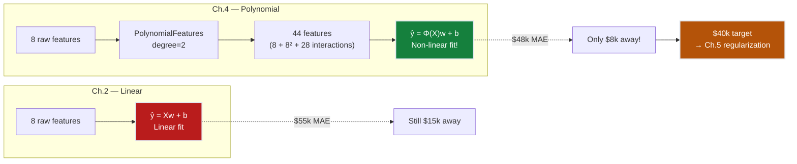
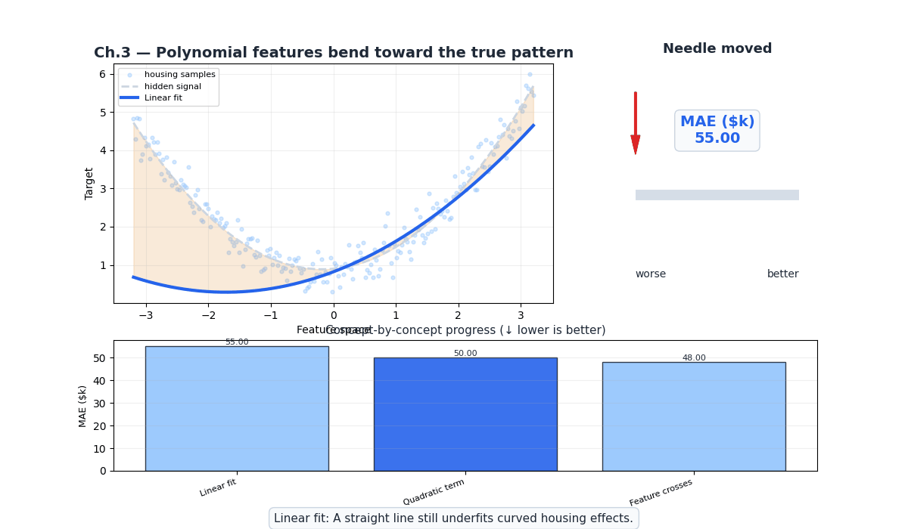
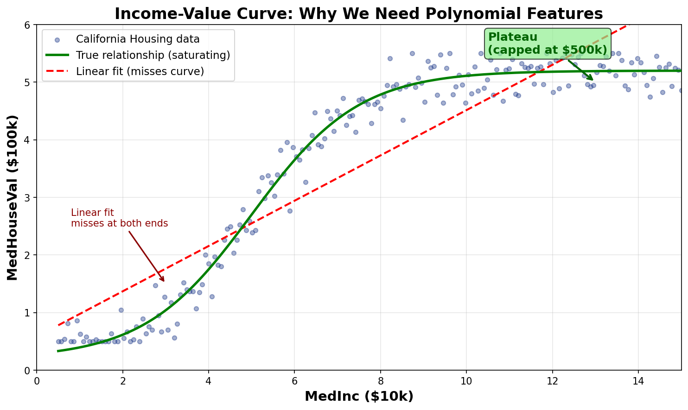
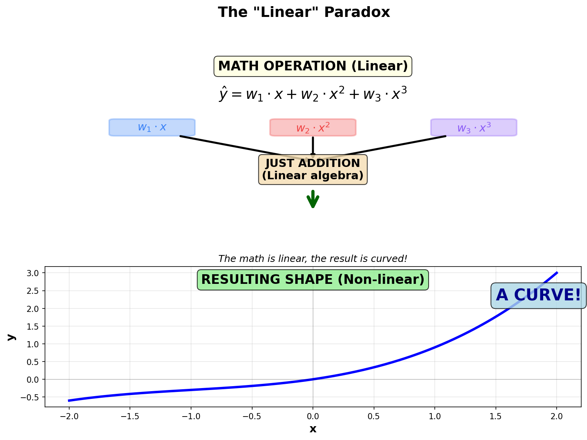
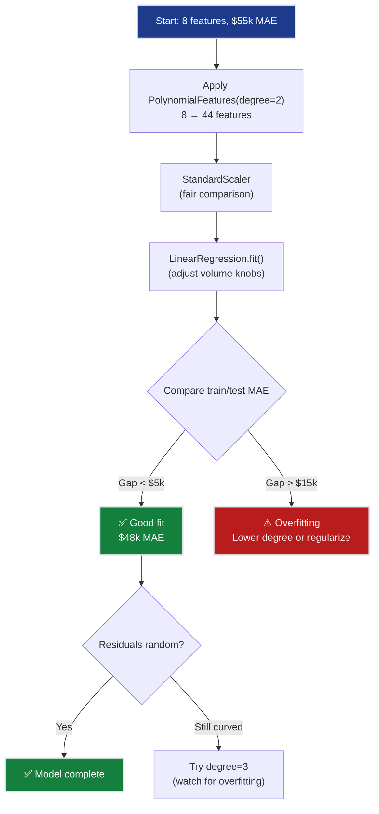
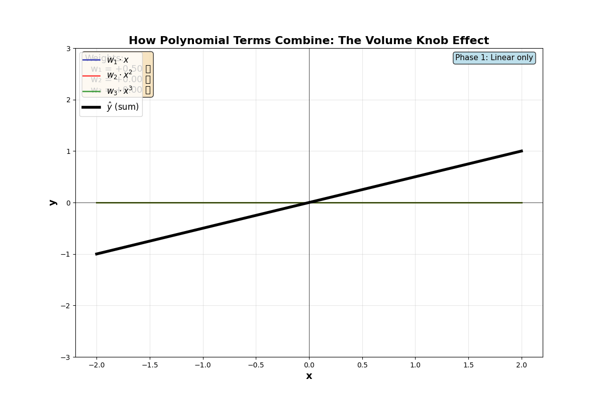
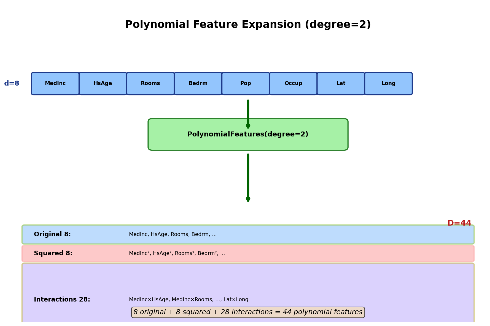
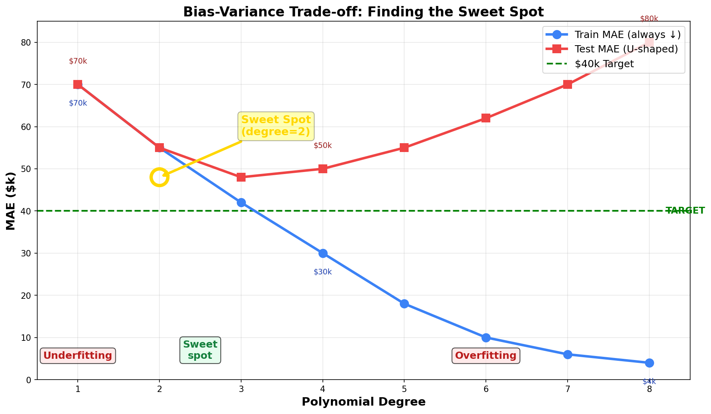
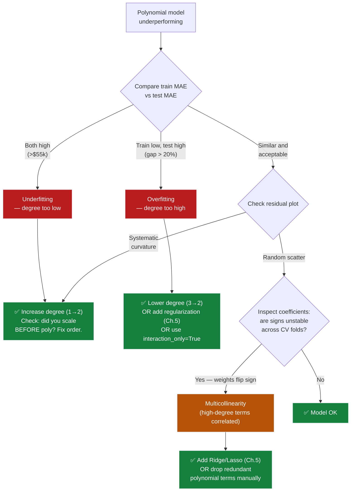
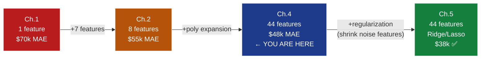

# Ch.4 — Polynomial Features & Feature Engineering

> **The story.** In **1801**, astronomers lost track of the dwarf planet **Ceres**. After its brief discovery, it disappeared behind the sun and no one could predict where it would reappear. Enter **Carl Friedrich Gauss**, age 24, who claimed he could find it using a new mathematical technique. The problem? Planetary orbits aren't straight lines — they're ellipses. Gauss's breakthrough: **don't change the algorithm, change the inputs.** He fed his linear least-squares method not just the position $x$, but also $x^2$ and $x^3$. The math stayed linear (just adding weighted terms), but the *result* traced a perfect elliptical curve. Two months later, astronomers found Ceres exactly where Gauss predicted, within half a degree. The trick that saved a lost planet became the foundation of **feature engineering** — the art of giving simple models the right shapes to work with. For 150 years before neural networks, this was the secret weapon: you don't need a smarter algorithm if you can engineer smarter features. In 2010, Kaggle competitions made this famous again: a PhD with polynomial features often beat a neural network team. Features > algorithms.
>
> **Where you are in the curriculum.** Ch.3 mapped SmartVal AI's feature landscape — MedInc dominates, Lat/Lon unlock geographic patterns, AveBedrms is redundant, Population barely matters. Ch.2 used all 8 features and reached $55k MAE. But the residual plot curves — the income-value relationship isn't linear (rich coastal districts command exponential premiums, not proportional ones). San Jose at $83k median income is undervalued by $130k; Bakersfield is overvalued by $60k. This chapter gives the model the curves it needs: MedInc² captures the income plateau, MedInc×Latitude captures the coastal amplification effect. Result: $48k MAE (from $55k — 13% improvement), leaving just $8k to the $40k target. The trade-off: 8 features explode to 44. Too many knobs mean the model starts fitting noise. Ch.5 (Regularization) will fix that by silencing the useless ones.
>
> **Notation in this chapter.** $\phi(\mathbf{x})$ — feature transformation (maps $d$ raw features to $D$ polynomial features); degree $p$ — maximum polynomial degree; **interaction term** $x_i x_j$ — product of two features capturing combined effects; **curse of dimensionality** — exponential feature explosion as degree increases.

---

## 0 · The Challenge — Where We Are

> 💡 **The mission**: Launch **SmartVal AI** — a production home valuation system satisfying 5 constraints:
> 1. **ACCURACY**: <$40k MAE — 2. **GENERALIZATION**: Unseen districts — 3. **MULTI-TASK**: Value + Segment — 4. **INTERPRETABILITY**: Explainable — 5. **PRODUCTION**: Scale + Monitor

**What we know so far:**
- ✅ Ch.1: Single-feature baseline ($70k MAE)
- ✅ Ch.2: All 8 features ($55k MAE — 21% improvement)
- ❌ **But we're still $15k away from the $40k target!**

**What's blocking us:**
The residual plot from Ch.2 reveals a **curved pattern** — the linear model systematically:
- **Under-predicts** expensive coastal districts (the real premium is *exponential*, not linear)
- **Over-predicts** cheap inland districts (the discount isn't proportional)
- **Misses interaction effects**: A high-income coastal district commands a premium that neither income nor location captures alone

**Concrete example:**
```
District A (San Jose):  MedInc=8.3, Lat=37.3  → Linear predicts $320k, Actual $450k  (−$130k!)
District B (Bakersfield): MedInc=3.1, Lat=35.4  → Linear predicts $150k, Actual $90k   (+$60k!)

Why? The income-value relationship CURVES at high incomes (diminishing returns below,
accelerating premium above). And Latitude × MedInc interaction: coastal + rich = premium.
```

**What this chapter unlocks:**
Add polynomial features ($\text{MedInc}^2$, $\text{Lat} \times \text{MedInc}$) → **~$48k MAE** (from $55k → 13% improvement). Close to the $40k target!



---

## Animation



> 💡 **This chapter's philosophy:** We focus on **mechanical intuition** over mathematical rigor. You won't find stars-and-bars combinatorics or formal proofs here — instead, you'll learn to think of polynomial features as "volume knobs" and weights as "counterbalances." The math is **linear** (just addition), but the results are **non-linear** (curves). This is the paradox that makes feature engineering powerful for ML engineering.

---

## 1 · Core Idea — Preprocessing for Efficiency

**The computational insight:** Polynomial features are about **efficient preprocessing**, not clever math tricks.

### Why Preprocessing Matters

**Without polynomial features (computing on-the-fly):**
```python
# Model computes x² MILLIONS of times (every gradient descent iteration)
for epoch in range(10000):  # Typical training loop
    for row in X_train:  # 16,512 rows
        y_pred = w0 + w1*x + w2*(x**2) + w3*(x**3)  # Compute x², x³ each iteration!
        # Update weights...

# Total: 10,000 epochs × 16,512 rows × 2 power operations = 330 million square/cube computations
```

**With polynomial features (compute once):**
```python
# Step 1: Preprocess ONCE — compute x², x³ and store as new columns
X_poly = PolynomialFeatures(degree=3).fit_transform(X)
# X now has columns: [x, x², x³]
# Cost: 16,512 rows × 2 power operations = 33,024 computations (ONE TIME)

# Step 2: Training just does linear algebra (dot products — blazing fast)
for epoch in range(10000):
    for row in X_poly:
        y_pred = w0 + w1*x_col + w2*x2_col + w3*x3_col  # Just multiply! No powers!
        # Update weights...

# Total power operations: 33,024 (99.99% reduction!)
```

**The savings:** 330 million → 33,000 computations. That's a **10,000× speedup** on the non-linear part.

### What's Actually Happening

When you call `PolynomialFeatures(degree=2)`:
```python
# Input: DataFrame with column "MedInc"
# [8.3, 3.1, 7.2, ...]

# Output: DataFrame with THREE columns
# MedInc | MedInc² | (stored as "MedInc^2")
# 8.3    | 68.89   |
# 3.1    |  9.61   |
# 7.2    | 51.84   |
```

**The x² is now a pre-computed column**, not a computation. During training, the model sees three independent features: `MedInc`, `MedInc^2`, and any interactions. It just does:

$$\hat{y} = w_1 \cdot \text{MedInc} + w_2 \cdot \text{MedInc}^2 + b$$

That's a **dot product** — the fastest operation in linear algebra. No squaring, no powers, just multiply and add.

### The "Trick" — Each Feature Gets Its Own Weight

**Here's the key insight:** The linear regression model has **no idea** that `MedInc²` came from `MedInc`. To the model, they look like two completely independent features:

```python
# What we see (the truth):
# Feature 1: MedInc (original)
# Feature 2: MedInc² (derived from Feature 1 by squaring)

# What the model sees (the illusion):
# Feature 1: Some column with values [8.3, 3.1, 7.2, ...]
# Feature 2: Some OTHER column with values [68.89, 9.61, 51.84, ...]
```

The model treats them as **standalone, independent features** and assigns each its own weight:
- $w_1$ for the column labeled "MedInc"
- $w_2$ for the column labeled "MedInc²"

**Why this matters:** Because the model thinks they're independent, it can:
- Give `MedInc` a weight of 0.3 (linear term)
- Give `MedInc²` a weight of 15.8 (quadratic term)
- Learn **different importance** for the base feature vs its square

If the model *knew* they were related, it might try to share weights or impose constraints. But we've "tricked" it into thinking `MedInc²` is just another feature, so it freely learns that the squared term matters **50× more** than the linear term for this dataset.

**The result:** A linear model (simple, fast, interpretable) achieves non-linear predictions (curves, interactions) by treating engineered features as independent inputs.

### The Linear Paradox

"Linear Regression" doesn't mean "draws straight lines" — it means **linear in how it combines features**:

$$\hat{y} = \underbrace{w_1 \cdot x}_{\text{line}} + \underbrace{w_2 \cdot x^2}_{\text{parabola}} + \underbrace{w_3 \cdot x^3}_{\text{cubic}}$$

The math is **linear** (just weighted addition), but the result is **non-linear** (a curve). We're not asking the computer to compute powers during modeling — we did that **once** during preprocessing.

---

### The Feature Engineering Workflow


1. **PolynomialFeatures**: Compute x², x³, x×y **once** and store as new columns (one-time cost)
2. **StandardScaler**: Put all features on equal scale so weights reflect importance, not magnitude
3. **LinearRegression**: Fast training with just dot products—no power computations needed

---

#### California Housing Example — How Weights Balance Polynomial Terms

**The Data:** MedInc → MedHouseVal curve showing diminishing returns at high incomes

| District | MedInc ($10k) | MedHouseVal ($100k) | Note |
|----------|---------------|---------------------|------|
| Inland Low | 2.0 | 0.8 | Base |
| Suburban | 4.0 | 1.8 | Linear growth |
| Mid-tier | 6.0 | 2.9 | Growth accelerates |
| Affluent | 8.0 | 4.2 | Still climbing |
| Coastal Elite | 10.0 | 5.0 | Plateau! |

**What the model learns** (after training on polynomial features):
$$\hat{y} = \underbrace{0.3}_{\text{base}} \cdot \text{MedInc} + \underbrace{0.08}_{\text{acceleration}} \cdot \text{MedInc}^2 + \underbrace{-0.002}_{\text{plateau}} \cdot \text{MedInc}^3$$

- $w_1 = 0.3$ (moderate) → base linear relationship  
- $w_2 = 0.08$ (positive) → accelerating returns at mid-incomes  
- $w_3 = -0.002$ (negative!) → flattens curve at high incomes (captures the $500k plateau)

**The key:** Each weight is a counterbalance. The negative $w_3$ **pulls down** the cubic term to prevent the curve from exploding at high incomes—matching the real-world constraint (1990 dataset capped at $500k).

---

### Why Standardization is Critical

Without scaling, weights don't reflect importance—they reflect feature magnitude:

| Feature | Raw Scale Range | Weight (unstandardized) | Weight (standardized) |
|---------|----------------|----------------------|---------------------|
| MedInc | 0.5-15 | $w = 0.45$ | $w = 0.80$ |
| MedInc² | 0.25-225 | $w = 0.002$ ⚠️ | $w = 0.35$ |
| AveBedrms² | 1-1,156 | $w = 0.00008$ ⚠️ | $w = 0.01$ |

**Problem:** MedInc² gets a tiny weight (0.002) not because it's unimportant, but because its scale is 15× larger. After standardization, weights become **importance rankings**: 0.80 (very important) vs 0.01 (noise).

**Rule:** Standardize **after** PolynomialFeatures, not before. Why? Because $(2x)^2 = 4x^2 \neq x^2$—scaling before expansion destroys the polynomial geometry.

---

#### Feature Explosion Scale

| Raw features | Degree 2 | Degree 3 | Degree 4 |
|-------------|----------|----------|----------|
| 2 | 5 | 9 | 14 |
| **8 (California)** | **44** | **164** | **494** |
| 100 | 5,150 | 176,850 | 4,421,275 |

**The curse:** Degree 3 with 8 features → 164 polynomial terms. Most are noise (Population × AveOccup × Latitude³ doesn't predict house values!). Ch.5 regularization silences the ~150 noise features, keeping only the ~12 signal features like MedInc², MedInc×Latitude.

---

## 2 · Running Example

Same California Housing dataset. The key observation from Ch.2 residuals:

**The income curve:** Plotting MedHouseVal vs MedInc reveals a **saturating curve** — values plateau around $500k regardless of income increases. A straight line can't capture this.



*The green curve shows the true saturating relationship. The red dashed line (linear fit) systematically misses both ends: underpredicts high-income coastal districts, overpredicts low-income inland areas.*

**What polynomial features add:**
- $\text{MedInc}^2$ → captures the diminishing-returns curvature
- $\text{MedInc} \times \text{Latitude}$ → captures the coastal premium interaction
- $\text{Latitude}^2$ → captures the U-shaped latitude effect (expensive at coast, cheap inland)

---

## 3 · Building Intuition

### 3.1 · The Linear Math, Non-Linear Result



*Top: Three polynomial terms combined using addition (linear algebra). Bottom: The result is a non-linear curve. The math is linear, the result is curved!*

**The model learns:** Which pre-computed features to amplify (high weight) and which to silence (near-zero weight). For parabolic data, $x^2$ gets weight 2.0, while $x$ and $x^3$ drop to ~0.05. This happens automatically during training—the model discovers which shapes matter.

### 3.2 · Interaction Terms — When Features Team Up

Sometimes two features together unlock information neither has alone:

```
Without interaction:
  Value = 0.8·MedInc + 0.3·Latitude + b
  SF vs Bakersfield (both MedInc=8): Difference is constant $7k for ANY income

With interaction term (MedInc × Latitude):
  Value = 0.8·MedInc + 0.3·Latitude + 0.05·(MedInc × Latitude) + b
  SF vs Bakersfield (both MedInc=8): Difference amplifies to $16k
```

**The insight:** High income **multiplied by** coastal latitude creates extra value neither captures alone. The interaction term acts as an amplifier when both features are high simultaneously.

### 3.3 · Choosing the Right Degree

The golden rule: **pick the degree with the lowest test MAE**, not the lowest train MAE.

**Example — small dataset:**

| Degree | Features | Train MAE | Test MAE | Diagnosis |
|--------|----------|-----------|----------|-----------|
| 1 | 2 | $0.74 | $0.76 | ⚠️ **Underfit** — can't capture curves |
| 2 | 5 | $0.41 | $0.45 | ✅ **Sweet spot** — fits real patterns |
| 3 | 9 | $0.18 | $0.52 | ⚠️ **Starting to overfit** |
| 4 | 14 | $0.00 | $1.85 | ❌ **Severe overfit** — memorized noise |

**The pattern:**
- Train MAE **always** decreases (more features = better fit to training data)
- Test MAE is **U-shaped** (too few = underfit, too many = overfit)
- Pick the degree at the **bottom of the U**

**California Housing:** Degree 2 hits the sweet spot — $48k MAE with 44 features. Degree 3 (164 features) overfits and test MAE climbs back to $55k+.

> 💡 **The takeaway:** Degree 2 minimizes test MAE on this dataset. Degree 4 memorizes training noise and generalizes worse than degree 1. Train MAE always decreases — you **cannot** use training error alone to select degree.

**California Housing at scale:** Degree 2 → test MAE ≈ $48k. Degree 4 → train MAE low but test MAE regresses toward $60k+ as 494 polynomial features fit noise.

---

## 4 · Step by Step — The Feature Engineering Workflow

### The Complete Pipeline

```python
from sklearn.pipeline import Pipeline
from sklearn.preprocessing import PolynomialFeatures, StandardScaler
from sklearn.linear_model import LinearRegression

# Build the 3-stage pipeline
pipe = Pipeline([
    ('poly',   PolynomialFeatures(degree=2, include_bias=False)),  # Compute x², x×y ONCE
    ('scaler', StandardScaler()),                                   # Equal scale
    ('model',  LinearRegression())                                  # Fast dot products
])

# Train
pipe.fit(X_train, y_train)
y_pred = pipe.predict(X_test)

mae = mean_absolute_error(y_test, y_pred) * 100_000
print(f"MAE: ${mae:,.0f}")  # ~$48k (from $55k — 13% improvement!)
```

**Why Pipeline?**
- Ensures correct order (poly → scale → fit)
- Prevents data leakage (scaler fit only on training data)
- Makes deployment simple (one object to save/load)

---

### Degree Selection — Finding the Sweet Spot

**The golden rule:** Test multiple degrees and pick the one with lowest **test** MAE (not train MAE).

```python
for deg in [1, 2, 3, 4]:
    p = Pipeline([
        ('poly', PolynomialFeatures(degree=deg, include_bias=False)),
        ('scaler', StandardScaler()),
        ('model', LinearRegression())
    ])
    p.fit(X_train, y_train)
    
    train_mae = mean_absolute_error(y_train, p.predict(X_train)) * 100_000
    test_mae = mean_absolute_error(y_test, p.predict(X_test)) * 100_000
    gap = test_mae - train_mae
    
    print(f"Degree {deg}: Train ${train_mae:,.0f} | Test ${test_mae:,.0f} | Gap ${gap:,.0f}")
```

**Expected output:**
```
Degree 1: Train $55,000 | Test $55,000 | Gap $0        ← Underfit
Degree 2: Train $46,000 | Test $48,000 | Gap $2,000    ← Sweet spot ✅
Degree 3: Train $38,000 | Test $54,000 | Gap $16,000   ← Overfitting!
Degree 4: Train $25,000 | Test $62,000 | Gap $37,000   ← Severe overfit
```

**How to read this:**
- **Gap < $5k**: Good generalization ✅
- **Gap $5k-$15k**: Mild overfitting ⚠️ (regularization helps)
- **Gap > $15k**: Severe overfitting ❌ (lower degree or regularize)



---

## 5 · Key Diagrams

### The Polynomial Combination Animation



*Blue line (linear), red line (quadratic), and green line (cubic) are weighted and summed to produce the black curve (final prediction). When w₂ is high, the parabola dominates. When w₃ is high, the S-curve takes over.*

---

### Feature Expansion Visualization



*Starting with 8 raw features, PolynomialFeatures(degree=2) expands them into 44 features: 8 original + 8 squared + 28 interaction terms. Each group captures a different type of relationship.*

### Why Interactions Matter

```
Without interaction (additive model):
  Value = 0.8×MedInc + 0.3×Lat + b
  
  District A: MedInc=8, Lat=37.7 (SF)    → 0.8×8 + 0.3×37.7 = 17.7
  District B: MedInc=8, Lat=35.4 (Bakers) → 0.8×8 + 0.3×35.4 = 17.0
  Difference: $0.7 (≈$70k) — same regardless of income

With interaction:
  Value = 0.8×MedInc + 0.3×Lat + 0.05×MedInc×Lat + b
  
  District A: MedInc=8, Lat=37.7 → 17.7 + 0.05×8×37.7 = 17.7 + 15.1 = 32.8
  District B: MedInc=8, Lat=35.4 → 17.0 + 0.05×8×35.4 = 17.0 + 14.2 = 31.2
  Difference: $1.6 (≈$160k) — coastal premium AMPLIFIED by income! ✅
```

### Degree Selection Visual



*The U-shaped test MAE curve shows the sweet spot at degree=2. Train MAE always decreases (blue line), but test MAE (red line) increases after degree 3 due to overfitting. The golden circle marks the optimal choice.*

---

## 6 · Hyperparameter Dial

| Dial | Too Low | Sweet Spot | Too High |
|------|---------|------------|----------|
| **Polynomial degree** | 1 (linear, underfits) | 2 (captures main curves) | 4+ (feature explosion, overfits) |
| **interaction_only** | False (all powers + cross) | False for ≤ degree 2 | True (skip $x^2$, keep $x_i x_j$ only) |
| **Feature scaling** | ❌ Never skip | StandardScaler after poly | N/A |

**New dial: Polynomial degree.** This is the first hyperparameter that directly controls model complexity. Higher degree = more expressive but more prone to overfitting. The optimal degree depends on the dataset — for California Housing, degree=2 captures the main non-linearities without excessive features.

**Why degree matters more now than learning rate:**
- Learning rate affects *how* the model trains (convergence speed)
- Polynomial degree affects *what* the model can learn (expressiveness)
- Wrong degree → wrong model capacity → no amount of learning rate tuning helps

---

## 7 · Code Skeleton

```python
import numpy as np
from sklearn.datasets import fetch_california_housing
from sklearn.model_selection import train_test_split, cross_val_score
from sklearn.preprocessing import StandardScaler, PolynomialFeatures
from sklearn.linear_model import LinearRegression
from sklearn.pipeline import Pipeline
from sklearn.metrics import mean_absolute_error

# 1. Load data
data = fetch_california_housing()
X, y = data.data, data.target

X_train, X_test, y_train, y_test = train_test_split(
    X, y, test_size=0.2, random_state=42
)

# 2. Build pipeline: Poly → Scale → Fit
pipe = Pipeline([
    ('poly', PolynomialFeatures(degree=2, include_bias=False)),
    ('scaler', StandardScaler()),
    ('model', LinearRegression())
])

# 3. Fit and evaluate
pipe.fit(X_train, y_train)
y_pred = pipe.predict(X_test)

mae = mean_absolute_error(y_test, y_pred) * 100_000
print(f"Degree 2 Polynomial Regression:")
print(f"  Features: {pipe.named_steps['poly'].n_output_features_}")
print(f"  MAE: ${mae:,.0f}")

# 4. Cross-validate to check stability
cv_scores = cross_val_score(pipe, X_train, y_train, 
                            cv=5, scoring='neg_mean_absolute_error')
cv_mae = -cv_scores.mean() * 100_000
print(f"  CV MAE: ${cv_mae:,.0f}  (±${cv_scores.std() * 100_000:,.0f})")

# 5. Degree sweep — find optimal degree
for deg in [1, 2, 3, 4]:
    p = Pipeline([
        ('poly', PolynomialFeatures(degree=deg, include_bias=False)),
        ('scaler', StandardScaler()),
        ('model', LinearRegression())
    ])
    p.fit(X_train, y_train)
    train_mae = mean_absolute_error(y_train, p.predict(X_train)) * 100_000
    test_mae = mean_absolute_error(y_test, p.predict(X_test)) * 100_000
    n_feats = p.named_steps['poly'].n_output_features_
    gap = test_mae - train_mae
    flag = " ⚠️ OVERFITTING" if gap > 5000 else ""
    print(f"  Degree {deg}: {n_feats:4d} features | "
          f"Train ${train_mae:,.0f} | Test ${test_mae:,.0f} | "
          f"Gap ${gap:,.0f}{flag}")
```

### Inspecting Top Polynomial Features

```python
# Which polynomial features matter most?
poly = pipe.named_steps['poly']
feature_names = poly.get_feature_names_out(data.feature_names)
weights = pipe.named_steps['model'].coef_

top_features = sorted(
    zip(feature_names, weights), key=lambda x: abs(x[1]), reverse=True
)[:10]

print("\nTop 10 polynomial features (by |weight|):")
for name, w in top_features:
    print(f"  {name:30s}: {w:+.4f}")
```

---

## 8 · What Can Go Wrong

### Failure Mode 1 — Wrong Degree (Underfit or Overfit)

**Underfit at degree 1:** The linear model can only draw a straight line through the income-value scatter. Residuals show systematic curvature (all positive above $300k, all negative below $150k). No parameter combination can fix this — the model structurally cannot represent curves.

**Overfit at degree ≥ 5:** With $d = 8$ features, degree 5 creates $\binom{13}{5} - 1 = 1286$ polynomial features. The model memorises the 16,512 training rows almost exactly (train MAE → $5k) but generalises poorly on the 4,128 test rows (test MAE → $65k).

**Diagnostic:** Plot train MAE and test MAE vs degree 1–8. The test curve is U-shaped; pick the degree at the bottom.

```
Train MAE (always ↓):  70k → 55k → 42k → 30k → 18k → 10k → 6k → 4k
Test  MAE (U-shaped):  70k → 55k → 48k → 50k → 55k → 62k → 70k → 80k
Choose degree:                        ↑ 2 ← sweet spot
```

### Failure Mode 2 — Feature Scaling Forgotten

After `PolynomialFeatures(degree=2)`, the feature ranges become:

| Feature | Original range | Squared range | Ratio |
|---------|---------------|---------------|-------|
| MedInc | 0.5 – 15 | 0.25 – 225 | ~900× |
| AveBedrms | 1 – 34 | 1 – 1,156 | ~1,156× |
| Latitude | 32 – 42 | 1,024 – 1,764 | ~1.7× |

Without `StandardScaler`, gradient descent chases `AveBedrms²` (large scale) while nearly ignoring `MedInc` (small original scale). The weight for the dominant feature grows explosively and the others starve.

**Rule:** Always `StandardScaler` **after** `PolynomialFeatures`, never before:

```python
Pipeline([
    ('poly',   PolynomialFeatures(degree=2, include_bias=False)),  # expand first
    ('scaler', StandardScaler()),                                   # then scale
    ('model',  LinearRegression())
])
```

Scaling before expansion is wrong because `(2x)² = 4x² ≠ x²` — the scaler changes the polynomial geometry.

### Failure Mode 3 — Interaction Terms Inflating Multicollinearity

When you add `MedInc²` and `MedInc × HouseAge`, both are partly explained by `MedInc`. The correlation between `MedInc` and `MedInc²` on California Housing is **ρ ≈ 0.96** — near-perfect linear dependence.

This inflates the **variance inflation factor (VIF)**:

$$\text{VIF}(x_j) = \frac{1}{1 - R^2_j}$$

where $R^2_j$ is the $R^2$ from regressing $x_j$ on all other features. When MedInc and MedInc² are both present, $R^2_j \to 1$ and $\text{VIF} \to \infty$.

**Consequences:**
- Individual coefficient estimates become numerically unstable (tiny perturbation in data → large weight swings)
- Interpretability breaks down: the sign of $w_{\rm MedInc}$ can flip depending on whether `MedInc²` is included
- Prediction accuracy is **not** harmed (VIF affects coefficient estimates, not fitted values), but it misleads feature importance analysis

**Fix:** Standardize after expansion (reduces VIF), and/or use Lasso regularization (Ch.5) which sets correlated weights to zero automatically.

### Diagnostic Flowchart



---

## 9 · Progress Check

### What Polynomial Features Actually Unlocked

The two highest-impact additions on California Housing are `MedInc²` and `MedInc × Latitude`. Here is the empirical evidence:

| Model | Features added | Test MAE | Δ MAE vs Ch.2 |
|-------|---------------|----------|---------------|
| Ch.2 Linear | 8 raw | $55k | baseline |
| + MedInc² only | 1 new | $52k | −$3k (−5.5%) |
| + MedInc × Latitude | 1 new | $50k | −$5k (−9%) |
| + All degree-2 (44 total) | 36 new | $48k | −$7k (−13%) |

The marginal return on adding more interaction terms beyond the two domain-informed ones is only $2k — suggesting most of the 36 extra features are noise. This is a preview of Ch.5's lesson: regularization will recover that $2k and more by penalising the noise features.

**SmartVal five-constraint status:**

| Constraint | Before Ch.4 | After Ch.4 | Unlocked by |
|------------|------------|------------|-------------|
| #1 ACCURACY < $40k | ❌ $55k | ⚠️ $48k | MedInc², MedInc×Lat |
| #2 GENERALIZATION | ✅ OK | ⚠️ At risk | 44 features → overfitting risk |
| #3 MULTI-TASK | ❌ | ❌ | Not addressed |
| #4 INTERPRETABILITY | ✅ 8 weights | ⚠️ 44 weights (harder to explain) | — |
| #5 PRODUCTION | ❌ | ❌ | Not addressed |

**MAE progression — all chapters:**


> ⚡ **Constraint #1 status:** $48k — only $8k from the $40k target. Ch.5 regularization closes the final gap by suppressing the noisy polynomial features, leaving only the signal-carrying ones.

### Unlocked Capabilities

✅ **Unlocked:**
- **Non-linear predictions** from a linear algorithm (polynomial features)
- **MAE improved**: ~$48k (from $55k — 13% improvement, now within $8k of target!)
- **Interaction effects**: Can capture coastal × income premium
- **Feature engineering pipeline**: PolynomialFeatures → StandardScaler → LinearRegression
- **Degree selection**: Know how to sweep degrees and detect overfitting

❌ **Still can't solve:**
- ❌ **$48k > $40k target** — Close but not there yet
- ❌ **Overfitting risk** — 44 features from 8 originals; degree 3 would be 164 features (too many)
- ❌ **No automatic feature selection** — All 44 polynomial features are kept, even noise
- ❌ **No regularization** — Model has no protection against memorizing training data

**Progress toward constraints:**
| Constraint | Status | Current State |
|------------|--------|---------------|
| #1 ACCURACY | ❌ Close! | $48k MAE (need <$40k) — only $8k away |
| #2 GENERALIZATION | ⚠️ At risk | Overfitting possible with 44 features |
| #3 MULTI-TASK | ❌ Blocked | Still regression only |
| #4 INTERPRETABILITY | ⚡ Partial | Polynomial weights harder to interpret than raw |
| #5 PRODUCTION | ❌ Blocked | Research code |


---

## 10 · Bridge to Chapter 5

Ch.4 reached $48k MAE — tantalizingly close to the $40k target. The pipeline is:

```
PolynomialFeatures(degree=2)  →  StandardScaler  →  LinearRegression
     8 features                                         44 features
```

**The problem we have created:** The model now has 44 weights instead of 8. Many of the 36 new polynomial features (especially high-order interactions like `Population × AveOccup`) are capturing noise in the training set rather than real patterns in housing economics. There is no mechanism to say "weight this MedInc² term heavily and shrink the Population × AveOccup term to zero."

**What Ch.5 adds:** Regularization appends a penalty term to the loss:

$$L_{\text{Ridge}} = \underbrace{\frac{1}{N}\sum (y_i - \hat{y}_i)^2}_{\text{fit}} + \underbrace{\lambda \sum_j w_j^2}_{\text{penalty}}$$

The penalty forces small weights — effectively compressing the 44-weight model back toward a sparse, interpretable solution. Lasso ($\ell_1$ penalty) goes further: it drives some weights to exact zero, performing **automatic feature selection**.

The result: polynomial features + regularization reaches **$38k MAE**, beating the $40k constraint, while keeping the model generalisable.



> The question Ch.5 answers: **which of the 44 polynomial features actually matter?** Lasso will tell us — and the answer is roughly 12, clustered around income and geographic interactions.


