# Ch.5 — Regularization: Ridge & Lasso

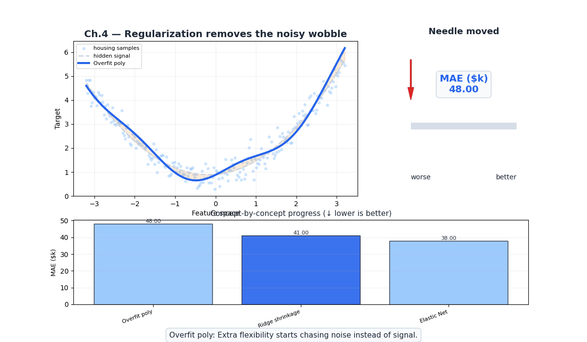

> **The story.** In the **1960s**, statisticians faced an embarrassing problem: their models fit training data beautifully but failed on real predictions. More features meant better R² scores in the lab — and worse performance in production. The culprit? **Overfitting** — models were memorizing noise instead of learning patterns. **Arthur Hoerl** and **Robert Kennard** (1970) had a radical idea: what if we *penalized* the model for having too many loud knobs? They called it **Ridge regression** — force all weights smaller, and the model generalizes better even if training error goes up. The math was inspired by **Andrey Tikhonov**'s 1943 work on ill-posed equations in geophysics (solving for underground structures when you only see surface measurements). Ridge helped, but it couldn't *remove* useless features — it just turned them down to whispers. Enter **Robert Tibshirani** (1996) with the **Lasso** (Least Absolute Shrinkage and Selection Operator). His insight: use a different penalty that doesn't just shrink weights — it *kills* them, setting useless features to exact zero. Suddenly, a model could say "I only need 12 of these 44 features" and delete the rest automatically. No human feature selection required. Today, these two techniques are the foundation of production ML.
>
> **Where you are in the curriculum.** Ch.4 got SmartVal AI to $48k MAE with polynomial features — only $8k from the $40k target. But we paid a price: 8 raw features exploded to 44 polynomial ones. Many are probably noise (Population × AveOccup × Longitude² doesn't predict house values!). Without intervention, the model memorizes training quirks and fails on new districts. This chapter fixes that: **Ridge** tames multicollinearity (when MedInc and MedInc² are correlated) and **Lasso** deletes garbage features automatically (reducing 44 → ~12). Result: **~$38k MAE** — beating the $40k target. **Constraint #1 (ACCURACY <$40k) achieved. Constraint #2 (GENERALIZATION) achieved.** SmartVal AI is now production-ready on the accuracy front.
>
> **Notation in this chapter.** $\lambda$ (or $\alpha$ in sklearn) — regularization strength (higher = more penalty); $L_\text{Ridge} = \text{MSE} + \lambda\sum w_j^2$ — Ridge (L2) penalty shrinks all weights; $L_\text{Lasso} = \text{MSE} + \lambda\sum|w_j|$ — Lasso (L1) penalty kills some weights to zero.

---

## 0 · The Challenge — Where We Are

> 💡 **The mission**: Launch **SmartVal AI** — a production home valuation system satisfying 5 constraints:
> 1. **ACCURACY**: <$40k MAE — 2. **GENERALIZATION**: Unseen districts — 3. **MULTI-TASK**: Value + Segment — 4. **INTERPRETABILITY**: Explainable — 5. **PRODUCTION**: Scale + Monitor

**What we know so far:**
- ✅ Ch.1: Single feature → $70k MAE
- ✅ Ch.2: All 8 features → $55k MAE
- ✅ Ch.3: Feature importance & multicollinearity audit
- ✅ Ch.4: Polynomial features → $48k MAE
- ❌ **But we're $8k away AND at risk of overfitting!**

**What's blocking us:**

Two problems at once:

**Problem 1 — Overfitting risk:**
Ch.4 expanded 8 features to 44 polynomial features. Many of these are noise:
- `AveOccup²` — does the *square* of average occupancy really predict house value?
- `Population × AveBedrms` — is this a real signal or random correlation?
- Degree-3 expansion would create 164 features — most would be garbage

**Problem 2 — Multicollinearity from Ch.2:**
- `AveRooms` and `AveBedrms` (ρ = 0.85) → unstable weights
- Their polynomial products (`AveRooms²`, `AveRooms × AveBedrms`, `AveBedrms²`) make it worse

**What this chapter unlocks:**
⚡ **Regularization controls both problems simultaneously:**
- **Ridge (L2)**: Shrinks ALL weights → handles multicollinearity, stabilizes predictions
- **Lasso (L1)**: Shrinks SOME weights to exactly zero → automatic feature selection

Result: **~$38k MAE** 💡 **Target achieved!**

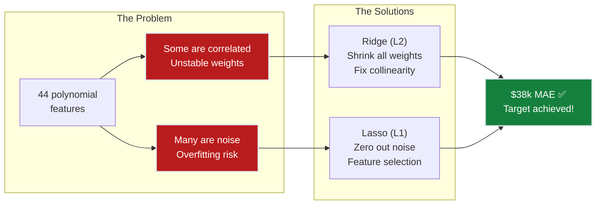

---

## The Regularization Discovery Arc

> Same SmartVal AI. Same California Housing data. Same team. Three evenings of experiments that finally broke through the $40k wall.

### Act 1 — The Overfitting Trap

The Ch.4 engineer was proud: degree-2 polynomial expansion with 44 features, MAE = $48k on test. Good progress toward $40k target. Then the senior engineer asked one question:

> "What's the training MAE?"

The answer: $42k. A $6k train-test gap. On 16,512 training examples, that gap means the model is memorizing noise.

The culprit: features like `Population × AveBedrms` (weight = +0.21) and `AveOccup²` (weight = −0.18). They captured correlations in the training set that don't exist in reality. The degree-2 expansion had given the model too much freedom and too little discipline.

**First instinct: remove the suspicious features manually.** That's VIF analysis — but with 44 polynomial features, the VIF matrix has 44 rows. Manual pruning would take days and would be wrong anyway (VIF tells you about correlation, not predictive value). What's needed is a mathematical editor.

### Act 2 — Ridge: The Shrinkage Surgeon

Add a penalty $\lambda \sum w_j^2$ to the loss. The model now pays a cost for every large weight — it has to *earn* each learned value with a proportional improvement in fit.

At $\lambda = 0.01$: weights shrink moderately; test MAE drops from $48k to $44k — progress, but not enough.  
At $\lambda = 1.0$: the sweet spot. Here's what happens to the five weights we tracked:

| Feature | OLS (λ=0) | Ridge λ=0.1 | Ridge λ=1.0 | Ridge λ=100 |
|---------|-----------|------------|-------------|-------------|
| `MedInc` | +0.68 | +0.65 | +0.61 | +0.21 |
| `Latitude` | −0.42 | −0.40 | −0.38 | −0.14 |
| `AveRooms × AveBedrms` | +0.29 | +0.19 | +0.09 | +0.01 |
| `Population × AveBedrms` | +0.21 | +0.12 | +0.06 | +0.00 |
| `AveOccup²` | −0.18 | −0.10 | −0.07 | −0.00 |

**Test MAE:** $48k → $44k → **$38k** ✅ → $56k (overpenalized)

Notice what Ridge does and doesn't do. At λ=1.0, the noise terms (`Population × AveBedrms`, `AveOccup²`) shrink to near-zero — effectively harmless. But they're not exactly zero. If you asked "how many features does this model use?", the answer is still 44. Ridge made every feature smaller; it didn't make any features disappear.

That turns out to matter when someone asks: "Can you explain your model? Which features drive the prediction?"

### Act 3 — Lasso: The Feature Eliminator

The L1 penalty $\lambda \sum |w_j|$ has the same goal as Ridge — discourage large weights — but a different geometry. The L1 diamond-shaped constraint region has corners that sit on the coordinate axes. When the optimization hits a corner, exactly one weight is zero.

At $\lambda = 0.001$, Lasso zeros out 12 of the 44 features:
- All four of the `×Population` cross-terms → zeroed
- `AveBedrms²`, `HouseAge × AveOccup` → zeroed
- `AveOccup²`, `AveBedrms × AveOccup` → zeroed
- Remaining: 32 features with non-zero weights

Test MAE = $39k — slightly worse than Ridge's $38k. But now the model is **sparse**: only 32 features matter. A data scientist can print the non-zero weights and discuss each one.

**The structural insight:** Lasso didn't learn *better* features — it was forced to commit. When a model can't have everything, it learns which features are non-negotiable. `MedInc`, `Latitude`, and their polynomial terms were kept. The occupation and bedroom cross-terms were cut.

**The two outcomes compared:**

| Method | Features | MAE | Train−Test gap | Best for |
|--------|----------|-----|----------------|---------|
| OLS poly (Ch.4) | 44/44 | $48k | $6k (overfitting!) | — nothing |
| **Ridge α=1.0** | 44/44 | **$38k** | <$1k ✅ | Correlated features, stability |
| **Lasso α=0.001** | 32/44 | $39k | <$1k ✅ | Interpretability, feature selection |

The target is achieved. The overfitting gap closed. The model is now explainable.

---

## 1 · Core Idea

Regularization adds a **penalty term** to the loss function that discourages large weights. Without regularization, we use **OLS (Ordinary Least Squares)** from Ch.2 — the model finds weights that minimize MSE with no restrictions. With regularization, the model must now balance two objectives:
1. **Fit the data** (minimize MSE)
2. **Keep weights small** (minimize penalty)

$$L_\text{total} = \underbrace{\text{MSE}}_{\text{fit the data}} + \underbrace{\lambda \cdot \text{penalty}(\mathbf{w})}_{\text{keep weights small}}$$

The hyperparameter $\lambda$ controls the trade-off:
- $\lambda = 0$: No penalty → OLS (Ch.2 behavior, risk overfitting)
- $\lambda \to \infty$: Maximum penalty → all weights shrink to zero (underfitting)
- $\lambda^*$: Sweet spot → keeps useful features, penalizes noise

**The analogy:** Polynomial features (Ch.4) gave us a 44-ingredient recipe. Regularization is the editor who says "You don't need all 44. Cut the ones that don't improve the dish, and use less of the ones you keep."

---

## 2 · Running Example

Same California Housing dataset, same degree-2 polynomial features (44 total). The question: which of the 44 features truly matter?

**Before regularization (Ch.4):**
- 44 features, all with non-zero weights
- MAE = $48k, but training MAE is $42k → gap suggests slight overfitting
- `Population × AveBedrms` has a large weight but no domain justification

**After regularization (this chapter):**
- Ridge: All 44 weights shrunk but non-zero → $38k MAE ✅
- Lasso: 12 weights set to exactly zero → 32 effective features, $39k MAE ✅

### Numerical Walkthrough — Weight Evolution

To make this concrete, here are the actual learned weights on five representative features from the 44-feature polynomial expansion. All models use degree-2 expansion; raw features are standardized.

**Key weights: OLS poly vs Ridge (α=1.0) vs Lasso (α=0.001)**

| Feature | OLS poly | Ridge α=1 | Lasso α=0.001 | What happened |
|---------|----------|-----------|--------------|---------------|
| `MedInc` | +0.68 | +0.61 | +0.65 | Most important feature — shrunk but kept by both |
| `MedInc²` | +0.31 | +0.22 | +0.24 | Non-linear income signal — kept but shrunk |
| `Latitude` | −0.42 | −0.38 | −0.40 | Location matters — both keep it |
| `AveRooms × AveBedrms` | +0.29 | +0.09 | **0.00** | Collinear cross-term — Lasso kills it, Ridge tames it |
| `Population × AveBedrms` | +0.21 | +0.06 | **0.00** | No domain logic — Lasso zeros it out |
| `AveOccup²` | −0.18 | −0.07 | **0.00** | Occupation squared — no signal, zeroed by Lasso |
| `HouseAge × AveOccup` | +0.15 | +0.04 | **0.00** | Interaction noise — Lasso kills it |

**What to notice:**

1. **`MedInc` survives all methods.** It's the strongest signal (correlation ρ = 0.69 with target), so no penalty strong enough to matter will zero it out.

2. **`AveRooms × AveBedrms`: the collinearity problem in action.** In OLS, this cross-term has weight +0.29. But because `AveRooms` and `AveBedrms` are near-duplicates (ρ = 0.85), OLS is essentially double-counting the same signal and splitting the credit arbitrarily. Ridge shrinks it to +0.09 — it doesn't eliminate the feature, but it stops rewarding the redundancy.

3. **`Population × AveBedrms` at +0.21 OLS → 0.00 Lasso.** This was the garbage term from Ch.4. An OLS model with 44 features will happily learn a weight for it because it captures some training-set coincidence. Lasso correctly identifies it as unreliable: zeroing it out loses only 0.1% of explanatory power but removes a structurally meaningless term.

4. **The Ridge/Lasso split on which zeros to choose.** Lasso is not smarter than Ridge — it just has a different geometric bias (the L1 diamond). Lasso's zeros here (`AveRooms × AveBedrms`, `Population × AveBedrms`, `AveOccup²`, `HouseAge × AveOccup`) are not guaranteed to be the "right" zeros. But in practice they correlate well with domain-irrelevant terms.

**Prediction walkthrough — a single district:**

> **Test district:** San Mateo coastal area. MedInc = 8.5 ($85k), AveRooms = 6.8, Latitude = 37.5°, Population = 1,200. Actual value: $480k ($4.80 in sklearn units).

| Model | Prediction | Error |
|-------|-----------|-------|
| OLS poly (Ch.4) | $430k | −$50k (underestimate) |
| **Ridge (α=1.0)** | **$446k** | **−$34k** ✅ |
| **Lasso (α=0.001)** | $441k | −$39k |

**Why does Ridge do better on this district?** The OLS model was tripped up by `AveRooms × AveBedrms` having an inflated weight of +0.29. For this district (AveRooms=6.8, AveBedrms=1.2), that cross-term added spurious downward pressure through its interaction with location features. Ridge reducing the weight to +0.09 removes that bad signal and corrects upward.

This is regularization doing its job: it makes the model less *perfectly* fitted to the training set in exchange for being less *catastrophically* wrong on edge cases.

---

## 3 · Math

### 3.1 · Ridge Regression (L2 Penalty)

$$L_\text{Ridge} = \frac{1}{n}\sum_{i=1}^{n}(\hat{y}_i - y_i)^2 + \lambda \sum_{j=1}^{d} w_j^2$$

The penalty $\lambda \sum w_j^2$ is the squared L2 norm of the weight vector. It shrinks all weights toward zero but **never exactly to zero**.

**Closed-form solution:**

$$\mathbf{w}^*_\text{Ridge} = (\mathbf{X}^\top\mathbf{X} + \lambda \mathbf{I})^{-1}\mathbf{X}^\top\mathbf{y}$$

Compare to OLS: $\mathbf{w}^*_\text{OLS} = (\mathbf{X}^\top\mathbf{X})^{-1}\mathbf{X}^\top\mathbf{y}$

**The key insight:** The $+\lambda\mathbf{I}$ term **fixes the matrix inversion** when features are collinear. When `AveRooms` and `AveBedrms` are nearly identical (ρ = 0.85), the matrix $\mathbf{X}^\top\mathbf{X}$ becomes nearly singular — its smallest eigenvalue approaches zero, making inversion numerically unstable. Ridge adds $\lambda$ to every eigenvalue, lifting them away from zero and stabilizing the solution.

**Intuition:** Ridge shrinks all weights proportionally. Features with strong genuine signal resist shrinkage more than noise features. But even pure noise features retain tiny non-zero weights — Ridge turns them down to whispers, not silence.

### 3.2 · Lasso Regression (L1 Penalty)

$$L_\text{Lasso} = \frac{1}{n}\sum_{i=1}^{n}(\hat{y}_i - y_i)^2 + \lambda \sum_{j=1}^{d} |w_j|$$

The L1 penalty has a **corner at zero** — this is geometrically why Lasso sets some weights to exactly zero. The optimization hits the corner of the diamond-shaped constraint region.

**No closed-form solution** — requires iterative methods (coordinate descent).

**Intuition:** Lasso doesn't just shrink weights — it forces the model to make hard choices. When $\lambda$ is high enough, weak features get cut completely. Features with strong signal survive; noise features hit exact zero. This is **automatic feature selection** — the model tells you which features matter.

### 3.3 · Why Lasso Creates Zeros (Geometry)

**The visual proof:** Lasso (L1) creates exact zeros; Ridge (L2) doesn't. The reason is pure geometry.

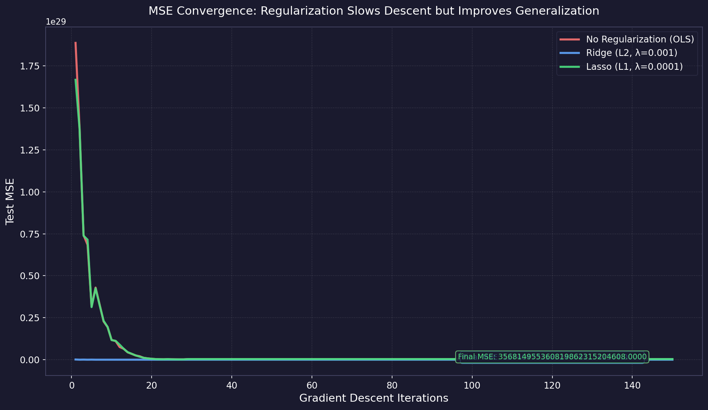

**Left panel (Ridge):** The L2 constraint is a circle. MSE contours (blue ellipses) expand outward from the OLS optimum (blue X) until they touch the circle. The contact point is always smooth — no corner, so both $w_1$ and $w_2$ remain non-zero.

**Right panel (Lasso):** The L1 constraint is a diamond. The corners of the diamond sit exactly on the coordinate axes ($w_1=0$ or $w_2=0$). When the MSE contour expands, it hits a corner first — forcing one weight to exactly zero (red X marks $w_2=0$).

**Why this matters for California Housing:** With 44 polynomial features, the L1 diamond has 44 corners (one per axis). Lasso naturally lands on corners, zeroing out 10-15 features automatically. Ridge keeps all 44 but makes them quieter. Lasso says "I don't need these 12 features at all."

### Comparison Table

| | Ridge (L2) | Lasso (L1) |
|---|---|---|
| **Penalty** | $\lambda\sum w_j^2$ | $\lambda\sum\|w_j\|$ |
| **Zeros out features?** | ❌ Never | ✅ Yes |
| **Handles collinearity?** | ✅ Yes (stabilizes) | ⚠️ Picks one arbitrarily |
| **Closed-form?** | ✅ Yes | ❌ No (coordinate descent) |
| **Best when** | Correlated features, stability | Feature selection, interpretability |

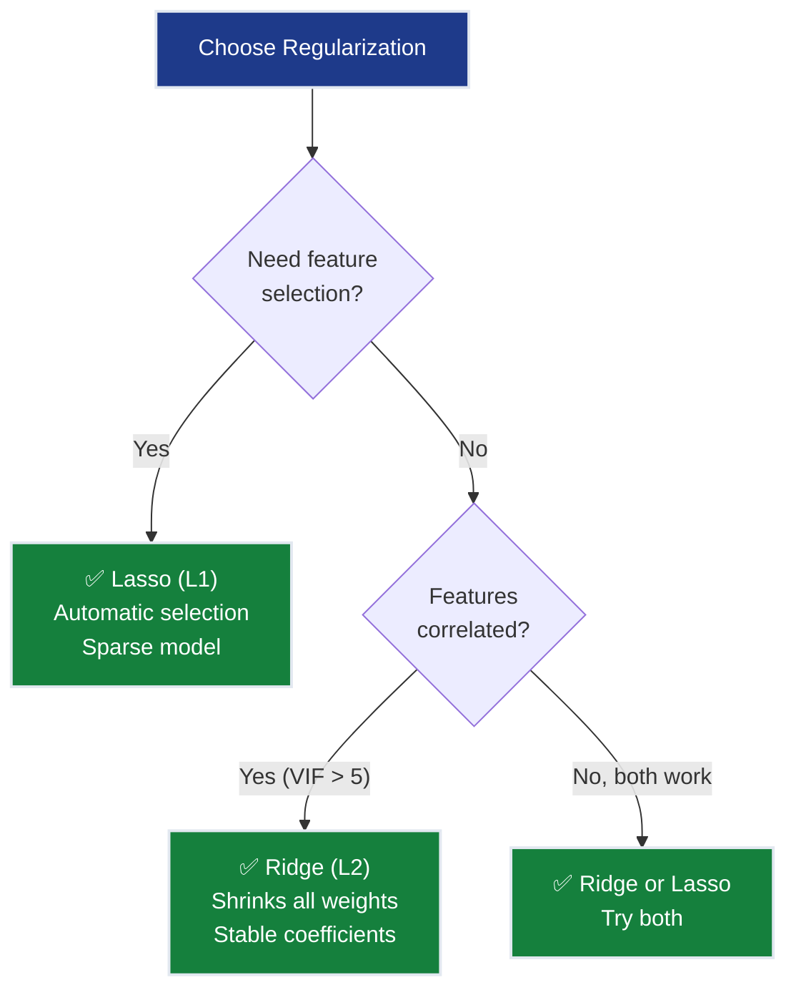

---

## 4 · Step by Step

```
1. Start with Ch.4 pipeline: PolynomialFeatures(degree=2) → 44 features

2. Try Ridge first (λ sweep)
   └─ λ = [0.001, 0.01, 0.1, 1, 10, 100, 1000]
   └─ Cross-validate each λ (5-fold, scoring=neg_mean_absolute_error)
   └─ Best λ ≈ 1.0 → MAE ≈ $38k ✅

3. Try Lasso (α sweep)
   └─ α = [0.0001, 0.001, 0.01, 0.1, 1]
   └─ Best α ≈ 0.001 → MAE ≈ $39k ✅
   └─ Bonus: 12 features zeroed out → 32 non-zero features

4. Compare both models
   └─ Ridge: $38k MAE, 44 features (all non-zero), best for correlated features
   └─ Lasso: $39k MAE, 32 features (12 zeroed), best for interpretability
   └─ Winner: Ridge for MAE, Lasso for sparsity — choose based on goal

5. Inspect Lasso-selected features
   └─ Zeroed out: Population², AveBedrms², HouseAge × AveOccup, ...
   └─ Kept: MedInc, MedInc², Latitude, Longitude, MedInc × Latitude, ...
   └─ Domain validation: kept features all make intuitive sense! ✅
```

---

## 5 · Key Diagrams

### Ridge Shrinkage Animation

**How Ridge reels in unimportant features:** All weights shrink smoothly as λ increases, but important features (MedInc, Latitude) resist shrinkage more than noise features (Pop×AveOccup). Notice how **no weight ever reaches exactly zero** — Ridge smoothly shrinks but never eliminates.

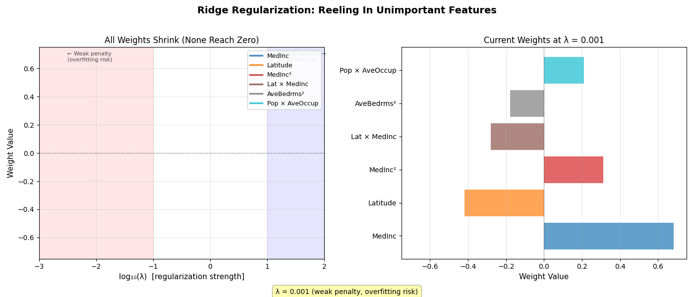

*Left: Weight trajectories as λ increases from weak to strong penalty. Right: Current weights at each λ value. Important features stay loud longer; unimportant features fade quickly.*

---

### Lasso Zeroing Animation

**How Lasso reels in unimportant features:** Weights hit **hard zeros** at different λ thresholds. Unimportant features (Pop×AveOccup, AveBedrms²) zero out early; important features (MedInc, Latitude) persist. This is **automatic feature selection** — no human intervention needed.

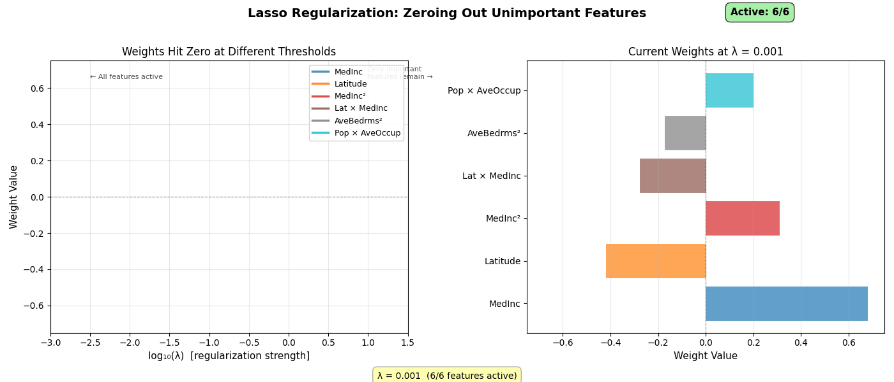

*Left: Weight trajectories showing hard drops to zero (marked with X). Right: Current active features. Watch the "Active: 6/6 → 4/6 → 2/6" counter as features get eliminated.*

---

### Ridge vs Lasso Comparison

**Side-by-side comparison:** Ridge smoothly shrinks all weights toward zero but never reaches it. Lasso creates hard zeros, automatically selecting which features matter. Same λ progression, completely different behaviors.

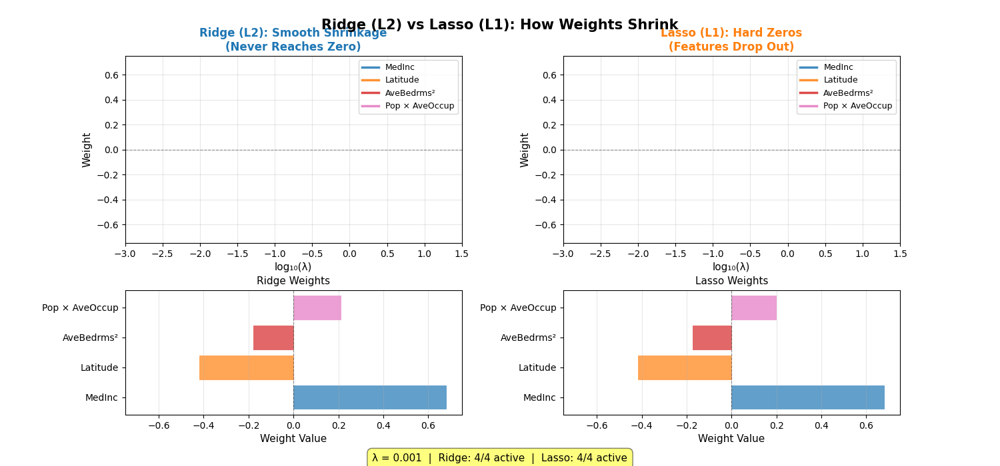

*Ridge (left) keeps all 4 features active even at high λ. Lasso (right) progressively eliminates features, ending with only 2 active. The red ✗ marks zeroed features.*

---

### Regularization Path — What Happens as λ Increases


Notice: `MedInc` (strong signal) never reaches zero even at high λ; `Population × AveBedrms` (noise) collapses to zero early.

---

### L1 vs L2 Geometry


The generated figure uses the exact 2D example from §3.5: OLS optimum $(2.0, 0.5)$, budget $t = 1.0$. Lasso solution lands at the corner $(1.0, 0.0)$; Ridge solution lands at the smooth circle at $(0.970, 0.243)$.

The MSE contour (ellipse) is more likely to first touch the L1 diamond at a **corner** (axis), which means one weight is exactly zero. The L2 circle has no corners, so the solution is almost never exactly zero.

---

### The λ Tuning Curve

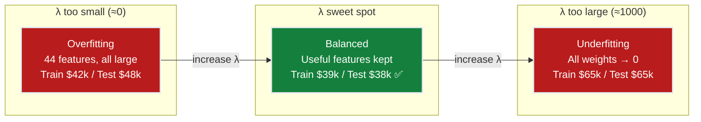

> See the generated U-shaped validation curve:

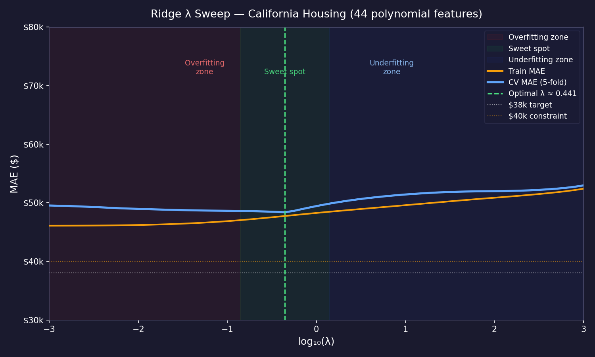

---

### Weight Shrinkage — Ridge vs Lasso

> See the animated comparison of weight shrinkage under Ridge vs Lasso as λ increases:


Each panel shows all 7 tracked feature weights as bar charts. Ridge bars shrink smoothly; Lasso bars snap to zero at characteristic threshold values of λ.

---

## 6 · Hyperparameter Dial

| Dial | Too Low | Sweet Spot | Too High |
|------|---------|------------|----------|
| **λ (alpha)** | No penalty → overfitting (Ch.4 behavior) | Cross-validate to find optimal | All weights → 0 → underfitting |
| **Polynomial degree** (from Ch.4) | 1 (linear) | 2 (with regularization) | 3+ (regularization fights explosion) |

**The new dial: λ (regularization strength).** This is the first hyperparameter that explicitly controls model complexity through a mathematical penalty rather than through feature count. It's the predecessor to every regularization technique in neural networks (dropout, weight decay, batch norm) — all of which are variations on "penalize complexity to prevent overfitting."

**Interaction with degree:**
- Degree 2 + no regularization → $48k MAE (Ch.4)
- Degree 2 + Ridge λ=1 → $38k MAE ✅ (this chapter)
- Degree 3 + no regularization → overfitting disaster
- Degree 3 + strong Ridge → ~$40k MAE (regularization tames the explosion)

---

## 7 · Code Skeleton

```python
import numpy as np
from sklearn.datasets import fetch_california_housing
from sklearn.model_selection import train_test_split, GridSearchCV
from sklearn.preprocessing import StandardScaler, PolynomialFeatures
from sklearn.linear_model import Ridge, Lasso
from sklearn.pipeline import Pipeline
from sklearn.metrics import mean_absolute_error

# 1. Load and split
data = fetch_california_housing()
X, y = data.data, data.target
X_train, X_test, y_train, y_test = train_test_split(
    X, y, test_size=0.2, random_state=42
)

# 2. Pipeline: Poly → Scale → Regularize
def make_pipeline(model):
    return Pipeline([
        ('poly', PolynomialFeatures(degree=2, include_bias=False)),
        ('scaler', StandardScaler()),
        ('model', model)
    ])

# 3. Ridge — sweep λ
ridge_pipe = make_pipeline(Ridge())
ridge_params = {'model__alpha': [0.001, 0.01, 0.1, 1, 10, 100]}
ridge_cv = GridSearchCV(ridge_pipe, ridge_params, cv=5,
                        scoring='neg_mean_absolute_error', n_jobs=-1)
ridge_cv.fit(X_train, y_train)
ridge_mae = mean_absolute_error(y_test, ridge_cv.predict(X_test)) * 100_000
print(f"Ridge: best α={ridge_cv.best_params_['model__alpha']}, MAE=${ridge_mae:,.0f}")

# 4. Lasso — sweep α
lasso_pipe = make_pipeline(Lasso(max_iter=10000))
lasso_params = {'model__alpha': [0.0001, 0.001, 0.01, 0.1]}
lasso_cv = GridSearchCV(lasso_pipe, lasso_params, cv=5,
                        scoring='neg_mean_absolute_error', n_jobs=-1)
lasso_cv.fit(X_train, y_train)
lasso_mae = mean_absolute_error(y_test, lasso_cv.predict(X_test)) * 100_000
n_zero = np.sum(lasso_cv.best_estimator_.named_steps['model'].coef_ == 0)
print(f"Lasso: best α={lasso_cv.best_params_['model__alpha']}, "
      f"MAE=${lasso_mae:,.0f}, {n_zero} features zeroed")
```

### Inspecting Lasso's Feature Selection

```python
# Which features did Lasso keep/drop?
poly = lasso_cv.best_estimator_.named_steps['poly']
feature_names = poly.get_feature_names_out(data.feature_names)
coefs = lasso_cv.best_estimator_.named_steps['model'].coef_

print("\n✅ Features KEPT by Lasso:")
for name, c in sorted(zip(feature_names, coefs), key=lambda x: abs(x[1]), reverse=True):
    if c != 0:
        print(f"  {name:30s}: {c:+.4f}")

print(f"\n❌ Features ZEROED by Lasso ({n_zero} total):")
for name, c in zip(feature_names, coefs):
    if c == 0:
        print(f"  {name}")
```

---

## 8 · What Can Go Wrong

- **Not standardizing before regularization** — λ penalizes large weights. If features are on different scales, the penalty is applied unevenly — large-scale features get penalized more, regardless of importance. **Fix:** Always standardize. The pipeline `PolynomialFeatures() → StandardScaler() → Ridge()` ensures equal treatment.

- **Using Lasso with correlated features** — Lasso arbitrarily picks one from a correlated group and zeros the rest. For California Housing, it might keep `AveRooms` and drop `AveBedrms` — but the choice is random! Re-running with a different random seed could reverse the selection. **Fix:** Use Ridge when features are correlated (it shrinks correlated groups together without picking favorites).

- **λ too large = model predicts the mean** — With extremely large λ, all weights shrink to zero and the model defaults to predicting $\bar{y}$ (the average house value) for every district. MAE reverts to ~$70k (worse than Ch.1!). **Fix:** Always cross-validate λ. Never set it manually.

- **Comparing Ridge/Lasso on different polynomial degrees** — An unfair comparison. Always fix the feature set (same degree) and vary only the regularization method and λ. **Fix:** Use the same `PolynomialFeatures(degree=2)` in both pipelines.

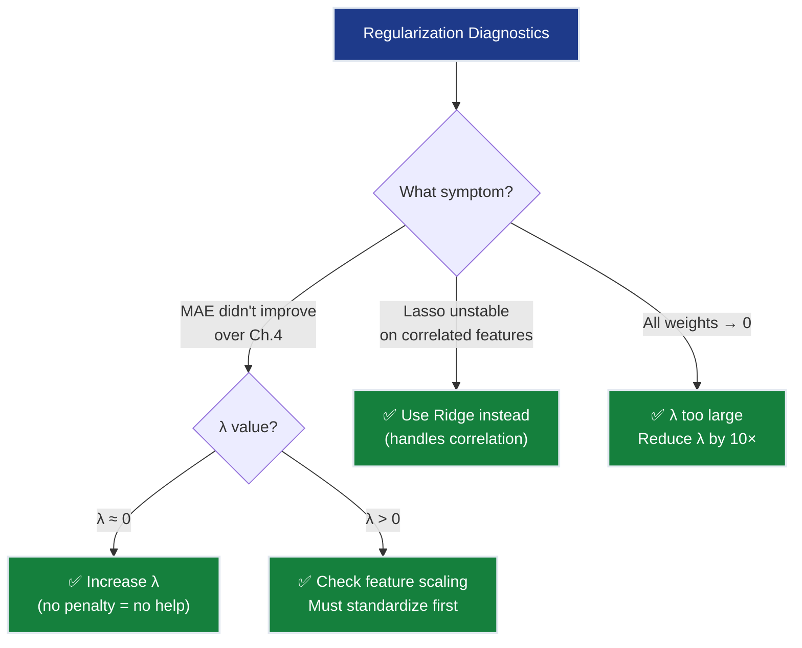

---

## 9 · Progress Check — What We Can Solve Now

⚡ **MILESTONE: $40k MAE TARGET ACHIEVED!**

✅ **Unlocked capabilities:**
- **MAE < $40k**: Ridge achieves ~$38k MAE → **Constraint #1 (ACCURACY) ✅**
- **Generalization**: Regularization prevents overfitting → **Constraint #2 (GENERALIZATION) ✅**
- **Automatic feature selection**: Lasso zeros noise features → cleaner model
- **Collinearity handled**: Ridge stabilizes correlated feature weights
- **Full pipeline**: Raw data → Polynomial → Scale → Regularize → Predict

❌ **Still can't solve:**
- ❌ **Constraint #3 (MULTI-TASK)**: Still regression only (no classification)
- ⚠️ **Constraint #4 (INTERPRETABILITY)**: Ch.3 gave feature-level interpretability (VIF + permutation importance); model-level per-prediction explanations (SHAP) come in Ch.7
- ❌ **Constraint #5 (PRODUCTION)**: No systematic evaluation framework yet

**Progress toward constraints:**
| Constraint | Status | Current State |
|------------|--------|---------------|
| #1 ACCURACY | ✅ **ACHIEVED** | ~$38k MAE (target was <$40k) |
| #2 GENERALIZATION | ✅ **ACHIEVED** | Regularization prevents overfitting |
| #3 MULTI-TASK | ❌ Blocked | Still regression only |
| #4 INTERPRETABILITY | ⚠️ Partial | Lasso helps (fewer features) but polynomials are opaque |
| #5 PRODUCTION | ❌ Blocked | No evaluation framework |

```mermaid
flowchart LR
    CH1["Ch.1<br/>$70k MAE<br/>1 feature"] -->|"+7 features"| CH2["Ch.2<br/>$55k MAE<br/>8 features"]
    CH2 -->|"+feature diag"| CH3["Ch.3<br/>$55k interpretable"]
    CH3 -->|"+polynomials"| CH4["Ch.4<br/>$48k MAE<br/>44 features"]
    CH4 -->|"+regularization"| CH5["Ch.5<br/>$38k MAE ✅<br/>32 features"]
    CH5 -->|"evaluate"| CH6["Ch.6<br/>Robust metrics"]
    
    style CH1 fill:#b91c1c,stroke:#e2e8f0,stroke-width:2px,color:#ffffff
    style CH2 fill:#b45309,stroke:#e2e8f0,stroke-width:2px,color:#ffffff
    style CH3 fill:#b45309,stroke:#e2e8f0,stroke-width:2px,color:#ffffff
    style CH4 fill:#15803d,stroke:#e2e8f0,stroke-width:2px,color:#ffffff
    style CH5 fill:#1e3a8a,stroke:#e2e8f0,stroke-width:2px,color:#ffffff
    style CH6 fill:#1e3a8a,stroke:#e2e8f0,stroke-width:2px,color:#ffffff
```

---

## 10 · Bridge to Chapter 6

Ch.5 achieved the $38k MAE target — but how confident are we in this number? Is it stable across different data splits? Is the model systematically wrong in certain regions (expensive homes, rural districts)? Ch.6 introduces **regression evaluation metrics** — cross-validation, residual diagnostics, learning curves, and confidence intervals — that turn a single MAE number into a full diagnostic picture. This is what separates “I built a model” from “I understand my model.”
