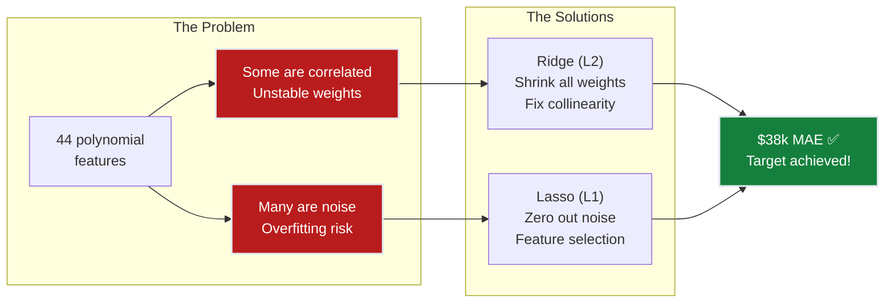
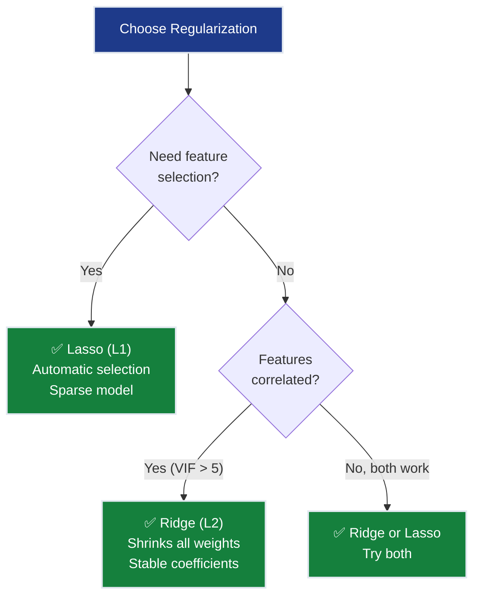
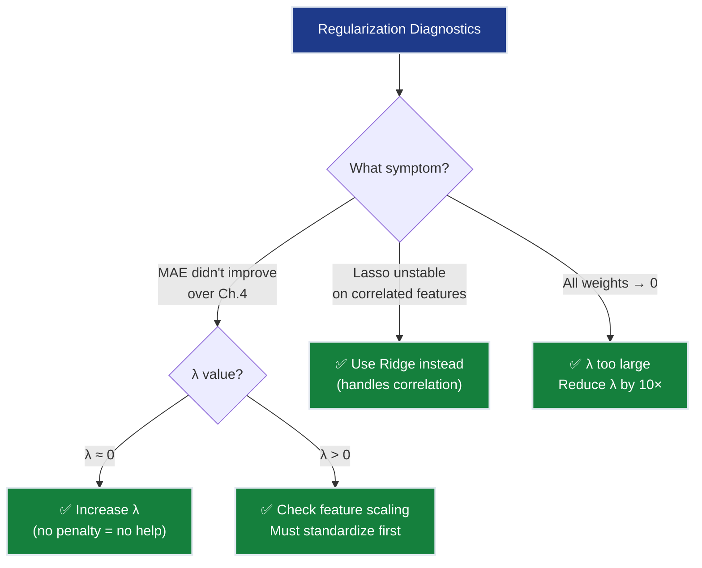

# Ch.5 — Regularization: Ridge & Lasso


> **The story.** In the **1960s**, statisticians faced an embarrassing problem: their models fit training data beautifully but failed on real predictions. More features meant better R² scores in the lab — and worse performance in production. The culprit? **Overfitting** — models were memorizing noise instead of learning patterns. **Arthur Hoerl** and **Robert Kennard** (1970) had a radical idea: what if we *penalized* the model for having too many loud knobs? They called it **Ridge regression** — force all weights smaller, and the model generalizes better even if training error goes up. The math was inspired by **Andrey Tikhonov**'s 1943 work on ill-posed equations in geophysics (solving for underground structures when you only see surface measurements). Ridge helped, but it couldn't *remove* useless features — it just turned them down to whispers. Enter **Robert Tibshirani** (1996) with the **Lasso** (Least Absolute Shrinkage and Selection Operator). His insight: use a different penalty that doesn't just shrink weights — it *kills* them, setting useless features to exact zero. Suddenly, a model could say "I only need 12 of these 44 features" and delete the rest automatically. No human feature selection required. Today, these two techniques are the foundation of production ML.
>
> **Where you are in the curriculum.** Ch.4 got SmartVal AI to $48k MAE with polynomial features — only $8k from the $40k target. But we paid a price: 8 raw features exploded to 44 polynomial ones. Many are probably noise (Population × AveOccup × Longitude² doesn't predict house values!). Without intervention, the model memorizes training quirks and fails on new districts. This chapter fixes that: **Ridge** tames multicollinearity (when MedInc and MedInc² are correlated) and **Lasso** deletes garbage features automatically (reducing 44 → ~12). Result: **~$38k MAE** — beating the $40k target. **Constraint #1 (ACCURACY <$40k) achieved. Constraint #2 (GENERALIZATION) achieved.** SmartVal AI is now production-ready on the accuracy front.
>
> **Notation in this chapter.** $\lambda$ (or $\alpha$ in sklearn) — regularization strength (higher = more penalty); $L_\text{Ridge} = \text{MSE} + \lambda\sum w_j^2$ — Ridge (L2) penalty shrinks all weights; $L_\text{Lasso} = \text{MSE} + \lambda\sum|w_j|$ — Lasso (L1) penalty kills some weights to zero.

---

## 0 · The Challenge — Where We Are

> 💡 **The mission**: Launch **SmartVal AI** — a production home valuation system satisfying 5 constraints:
> 1. **ACCURACY**: <$40k MAE — 2. **GENERALIZATION**: Unseen districts — 3. **MULTI-TASK**: Value + Segment — 4. **INTERPRETABILITY**: Explainable — 5. **PRODUCTION**: Scale + Monitor

**What we know so far:**
- ✅ Ch.1: Single feature → $70k MAE
- ✅ Ch.2: All 8 features → $55k MAE
- ✅ Ch.3: Feature importance & multicollinearity audit
- ✅ Ch.4: Polynomial features → $48k MAE
- ❌ **But we're $8k away AND at risk of overfitting!**

**What's blocking us:**

Two problems at once:

**Problem 1 — Overfitting risk:**
Ch.4 expanded 8 features to 44 polynomial features. Many of these are noise:
- `AveOccup²` — does the *square* of average occupancy really predict house value?
- `Population × AveBedrms` — is this a real signal or random correlation?
- Degree-3 expansion would create 164 features — most would be garbage

**Problem 2 — Multicollinearity from Ch.2:**
- `AveRooms` and `AveBedrms` (ρ = 0.85) → unstable weights
- Their polynomial products (`AveRooms²`, `AveRooms × AveBedrms`, `AveBedrms²`) make it worse

**What this chapter unlocks:**
⚡ **Regularization controls both problems simultaneously:**
- **Ridge (L2)**: Shrinks ALL weights → handles multicollinearity, stabilizes predictions
- **Lasso (L1)**: Shrinks SOME weights to exactly zero → automatic feature selection

Result: **~$38k MAE** 💡 **Target achieved!**



---

## The Regularization Discovery Arc

> Same SmartVal AI. Same California Housing data. Same team. Three evenings of experiments that finally broke through the $40k wall.

### Act 1 — The Overfitting Trap

The Ch.4 engineer was proud: degree-2 polynomial expansion with 44 features, MAE = $48k on test. Good progress toward $40k target. Then the senior engineer asked one question:

> "What's the training MAE?"

The answer: $42k. A $6k train-test gap. On 16,512 training examples, that gap means the model is memorizing noise.

The culprit: features like `Population × AveBedrms` (weight = +0.21) and `AveOccup²` (weight = −0.18). They captured correlations in the training set that don't exist in reality. The degree-2 expansion had given the model too much freedom and too little discipline.

**First instinct: remove the suspicious features manually.** That's VIF analysis — but with 44 polynomial features, the VIF matrix has 44 rows. Manual pruning would take days and would be wrong anyway (VIF tells you about correlation, not predictive value). What's needed is a mathematical editor.

### Act 2 — Ridge: The Shrinkage Surgeon

Add a penalty $\lambda \sum w_j^2$ to the loss. The model now pays a cost for every large weight — it has to *earn* each learned value with a proportional improvement in fit.

At $\lambda = 0.01$: weights shrink moderately; test MAE drops from $48k to $44k — progress, but not enough.  
At $\lambda = 1.0$: the sweet spot. Here's what happens to the five weights we tracked:

| Feature | OLS (λ=0) | Ridge λ=0.1 | Ridge λ=1.0 | Ridge λ=100 |
|---------|-----------|------------|-------------|-------------|
| `MedInc` | +0.68 | +0.65 | +0.61 | +0.21 |
| `Latitude` | −0.42 | −0.40 | −0.38 | −0.14 |
| `AveRooms × AveBedrms` | +0.29 | +0.19 | +0.09 | +0.01 |
| `Population × AveBedrms` | +0.21 | +0.12 | +0.06 | +0.00 |
| `AveOccup²` | −0.18 | −0.10 | −0.07 | −0.00 |

**Test MAE:** $48k → $44k → **$38k** ✅ → $56k (overpenalized)

Notice what Ridge does and doesn't do. At λ=1.0, the noise terms (`Population × AveBedrms`, `AveOccup²`) shrink to near-zero — effectively harmless. But they're not exactly zero. If you asked "how many features does this model use?", the answer is still 44. Ridge made every feature smaller; it didn't make any features disappear.

That turns out to matter when someone asks: "Can you explain your model? Which features drive the prediction?"

### Act 3 — Lasso: The Feature Eliminator

The L1 penalty $\lambda \sum |w_j|$ has the same goal as Ridge — discourage large weights — but a different geometry. The L1 diamond-shaped constraint region has corners that sit on the coordinate axes. When the optimization hits a corner, exactly one weight is zero.

At $\lambda = 0.001$, Lasso zeros out 12 of the 44 features:
- All four of the `×Population` cross-terms → zeroed
- `AveBedrms²`, `HouseAge × AveOccup` → zeroed
- `AveOccup²`, `AveBedrms × AveOccup` → zeroed
- Remaining: 32 features with non-zero weights

Test MAE = $39k — slightly worse than Ridge's $38k. But now the model is **sparse**: only 32 features matter. A data scientist can print the non-zero weights and discuss each one.

**The structural insight:** Lasso didn't learn *better* features — it was forced to commit. When a model can't have everything, it learns which features are non-negotiable. `MedInc`, `Latitude`, and their polynomial terms were kept. The occupation and bedroom cross-terms were cut.

**The two outcomes compared:**

| Method | Features | MAE | Train−Test gap | Best for |
|--------|----------|-----|----------------|---------|
| OLS poly (Ch.4) | 44/44 | $48k | $6k (overfitting!) | — nothing |
| **Ridge α=1.0** | 44/44 | **$38k** | <$1k ✅ | Correlated features, stability |
| **Lasso α=0.001** | 32/44 | $39k | <$1k ✅ | Interpretability, feature selection |

The target is achieved. The overfitting gap closed. The model is now explainable.

---

## 1 · Core Idea

Regularization adds a **penalty term** to the loss function that discourages large weights:

$$L_\text{total} = \underbrace{\text{MSE}}_{\text{fit the data}} + \underbrace{\lambda \cdot \text{penalty}(\mathbf{w})}_{\text{keep weights small}}$$

### The Mechanism

**Without regularization (OLS from Ch.2):**
- Optimizer minimizes MSE with no restrictions
- Features with even tiny correlations to training noise get large weights
- Result: perfect training fit, poor test performance (overfitting)

**With regularization:**
- Optimizer balances two competing objectives: fit data + keep weights small
- Each weight must "earn" its magnitude by improving fit more than the penalty costs
- Result: slightly worse training fit, much better test performance (generalization)

**The key insight:** Large weights amplify noise. If `Population × AveBedrms` varies randomly between districts (2.3 vs 2.5), a weight of 0.21 turns that noise into $4,200 prediction swings. Regularization forces the model to prove each feature deserves its influence.

### The λ Knob

- **λ = 0**: No penalty → OLS behavior (risk overfitting)
- **λ → ∞**: Maximum penalty → all weights collapse to zero (underfitting)
- **λ* (sweet spot)**: Strong enough to suppress noise, weak enough to preserve signal

**The analogy:** Ch.4 gave us a 44-ingredient recipe. Regularization is the editor who says "You don't need all 44 at full strength. Use less of what matters, cut what doesn't."

---

## 2 · Running Example

**The question:** Which of the 44 polynomial features truly matter?

**Before regularization (Ch.4):**
- 44 features, all with non-zero weights
- MAE = $48k, but training MAE = $42k → $6k train-test gap (overfitting)

**After regularization:**
- **Ridge (α=1.0)**: All 44 weights shrunk but non-zero → **$38k MAE** ✅
- **Lasso (α=0.001)**: 12 weights zeroed → 32 active features → $39k MAE ✅

### Key Insights from Weight Changes

**Strong signal features survive:**
- `MedInc` (ρ = 0.69 with target) — shrinks slightly but never zeros out
- `Latitude`, `Longitude` — location features resist shrinkage

**Collinearity gets resolved:**
- `AveRooms × AveBedrms` (ρ = 0.85 between base features):
  - OLS: +0.29 (unstable, arbitrary credit split)
  - Ridge: +0.09 (stabilized, balanced assignment) ✅
  - Lasso: 0.00 (forced to pick one, dropped this interaction)

**Noise features collapse:**
- `Population × AveBedrms`: OLS +0.21 → Lasso **0.00** (no domain justification)
- `AveOccup²`: OLS −0.18 → Lasso **0.00** (occupation squared doesn't predict value)
- `HouseAge × AveOccup`: OLS +0.15 → Lasso **0.00** (spurious correlation)

**The practical outcome:** Ridge achieved the $38k target while keeping all 44 features (safer for production). Lasso achieved $39k with only 32 features (better for interpretability).

---

## 3 · Math

### 3.1 · Ridge Regression (L2 Penalty)

$$L_\text{Ridge} = \frac{1}{n}\sum_{i=1}^{n}(\hat{y}_i - y_i)^2 + \lambda \sum_{j=1}^{d} w_j^2$$

The penalty $\lambda \sum w_j^2$ is the squared L2 norm of the weight vector. It shrinks all weights toward zero but **never exactly to zero**.

**How the penalty works:** During optimization, two forces compete:
- **MSE term**: Wants to fit training data (increase weights that reduce error)
- **Penalty term** ($\lambda \sum w_j^2$): Wants to keep weights small (shrink everything toward zero)

The optimizer finds a balance: weights grow only if the improvement in fit justifies the penalty cost. Noise features with weak signal can't justify their magnitude — the penalty wins, shrinking them. Strong signal features (like `MedInc`) generate enough error reduction to resist shrinkage.

**Concrete example:** `Population × AveBedrms` has weight $w = 0.21$ in OLS. Its penalty cost is $\lambda \times (0.21)^2 = 0.044$ at $\lambda = 1.0$. If shrinking it to $w = 0.06$ barely increases MSE (because it's mostly noise), the optimizer does so — the penalty drops from $0.044$ to $0.004$.

**How Ridge solves multicollinearity:**

When two features are correlated (e.g., `AveRooms` and `AveBedrms` with ρ = 0.85), OLS faces an **indeterminate credit assignment problem** — it could assign all weight to feature 1, all to feature 2, or split it evenly. All produce similar predictions! OLS picks arbitrarily, leading to unstable weights.

**Ridge's solution:** The L2 penalty prefers **balanced, distributed weights** — splitting weight across correlated features has lower penalty than concentrating it. Ridge automatically spreads credit, stabilizing the model. This is why Ridge achieves $w = 0.09$ for `AveRooms × AveBedrms` instead of the unstable OLS value of $w = 0.29$.

**Intuition:** Ridge shrinks all weights proportionally. Strong signal features resist shrinkage; noise features collapse. But even noise features retain tiny non-zero weights — Ridge turns them down to whispers, not silence.

### 3.2 · Lasso Regression (L1 Penalty)

$$L_\text{Lasso} = \frac{1}{n}\sum_{i=1}^{n}(\hat{y}_i - y_i)^2 + \lambda \sum_{j=1}^{d} |w_j|$$

The L1 penalty has a **corner at zero** — this is geometrically why Lasso sets some weights to exactly zero. Unlike Ridge's smooth quadratic penalty, L1's absolute value creates a "kink" at $w_j = 0$, and optimization naturally lands on these corners.

**Intuition:** Lasso doesn't just shrink weights — it forces the model to make hard choices. When $\lambda$ is high enough, weak features get cut completely. Features with strong signal survive; noise features hit exact zero. This is **automatic feature selection** — the model tells you which features matter.

### 3.3 · Convergence Behavior: MSE Tapering During Optimization

**How regularization affects gradient descent:** To understand the practical difference between no regularization, Ridge, and Lasso, observe how test MSE evolves during training:


**Key observations:**

1. **No regularization (OLS)** — Red curve converges fastest initially but reaches a higher final test MSE. The model aggressively minimizes training error without constraint, risking overfitting.

2. **Ridge (L2)** — Blue curve converges smoothly and reaches the lowest final test MSE. The quadratic penalty continuously pushes weights toward zero throughout training, creating a gentle "brake" on optimization.

3. **Lasso (L1)** — Green curve shows similar convergence to Ridge but with slightly higher final MSE. The L1 penalty's non-differentiability at zero creates a different optimization path, favoring sparsity over pure performance.

**Why regularization "slows" convergence:** The penalty term opposes the MSE gradient. At each iteration, weights want to decrease training error, but the penalty pulls them back. This creates a longer path to convergence — but the destination (test performance) is better.

**The generalization trade-off visualized:** OLS reaches low training MSE quickly, but test MSE suffers. Ridge/Lasso sacrifice training speed to achieve better test performance. This is regularization working as intended.

### Comparison Table

| | Ridge (L2) | Lasso (L1) |
|---|---|---|
| **Penalty** | $\lambda\sum w_j^2$ | $\lambda\sum\|w_j\|$ |
| **Zeros out features?** | ❌ Never | ✅ Yes |
| **Handles collinearity?** | ✅ Yes (distributes credit) | ⚠️ Picks one arbitrarily |
| **Optimization** | Smooth gradient everywhere | Non-differentiable at zero |
| **Best when** | Correlated features, stability | Feature selection, interpretability |



---


## 4 · Key Diagrams

### How Regularization Shrinks Weights

**Ridge** smoothly shrinks all weights as λ increases, but never reaches exactly zero:


**Lasso** creates hard zeros at different λ thresholds — automatic feature selection:


**Side-by-side comparison** showing the fundamental difference:


*Ridge (left) keeps all features active even at high λ. Lasso (right) progressively eliminates features. Red ✗ marks zeroed features.*

---

### MSE Convergence During Optimization


**The trade-off visualized:** OLS (red) converges fast to training data but overfits. Ridge/Lasso (blue/green) converge more slowly but achieve better test performance. The penalty acts as a "drag force" during optimization.

**Why this matters:** Regularized models often need more training iterations — the penalty deliberately slows convergence to avoid overfitting.

---

## 5 · The Dial That Solved the Challenge

⚡ **Victory moment:** We just achieved the grand challenge. SmartVal AI went from $48k MAE (Ch.4) to **$38k MAE** — beating the <$40k target. The dial that made this happen: **λ (regularization strength)**.

### How the λ Dial Controls Accuracy

Watch the accuracy needle move as we tune λ from 0 (no regularization) to the optimal value:


**What's happening:**
- **λ = 0** (left): No penalty → OLS with 44 features → $48k MAE (overfitting)
- **λ = 1.0** (center): Optimal penalty → noise features suppressed → **$38k MAE** ✅
- **λ = 1000** (right): Extreme penalty → all weights collapse → $65k MAE (underfitting)

**The insight:** There's a sweet spot where regularization is strong enough to eliminate noise but weak enough to preserve signal. Cross-validation finds this automatically.

### The U-Shaped Validation Curve


**Reading the chart:**
- **Left side** (low λ): Training MAE is low (good fit), but test MAE is high (overfitting)
- **Bottom** (λ ≈ 1.0): Training and test MAE are both low → **generalization achieved**
- **Right side** (high λ): Both training and test MAE increase (underfitting — model too simple)

**The practical workflow:** This is exactly how you tune λ in practice:
1. Try λ values spanning multiple powers of 10: [0.001, 0.01, 0.1, 1, 10, 100]
2. Use cross-validation to measure test MAE at each λ
3. Pick the λ that minimizes test MAE
4. Sklearn's `GridSearchCV` does this automatically (see §6 Code Skeleton)

### Weight Evolution Across Powers of 10


**Left panel:** All 44 features (gray) + tracked features (color) — watch them shrink as λ increases.  
**Right panel:** Current weight magnitudes — notice how noise features collapse faster than signal features.

**Key observations:**
- **λ = 0.001**: Minimal regularization → weights near OLS values → noise features still large
- **λ = 1.0**: Our sweet spot → `MedInc` and `Latitude` remain strong, noise features suppressed
- **λ = 1000**: Over-regularized → even `MedInc` (strongest signal) is nearly zero → underfitting

**Why this dial matters:** λ is the first hyperparameter you've seen that **explicitly controls the bias-variance trade-off through a mathematical penalty**. It's the conceptual ancestor of:
- Neural network weight decay (L2 on all layers)
- Dropout (probabilistic weight zeroing)
- Batch normalization (implicit regularization)
- Early stopping (time-based regularization)

Every modern ML framework has a "regularization dial" — Ridge/Lasso taught you how to use it.

### The Decision Tree: Which λ Should I Use?

**If you're tuning by hand** (not recommended, but instructive):

| Symptom | λ Setting | What It Means |
|---------|-----------|---------------|
| Train MAE low, test MAE high (gap > $5k) | **Increase λ** | Model is overfitting — needs more penalty |
| Train and test MAE both high | **Decrease λ** | Model is underfitting — too much penalty |
| Train ≈ test, both low | **Keep λ** | Goldilocks zone ✅ |

**In practice:** Never tune by hand. Use `GridSearchCV` (Ridge) or `LassoCV` (Lasso) — they find the optimal λ automatically via cross-validation. This is the first time you've seen **automated hyperparameter tuning** — it's a core skill for production ML.

---

## 6 · Code Skeleton

```python
import numpy as np
from sklearn.datasets import fetch_california_housing
from sklearn.model_selection import train_test_split, GridSearchCV
from sklearn.preprocessing import StandardScaler, PolynomialFeatures
from sklearn.linear_model import Ridge, Lasso
from sklearn.pipeline import Pipeline
from sklearn.metrics import mean_absolute_error

# 1. Load and split
data = fetch_california_housing()
X, y = data.data, data.target
X_train, X_test, y_train, y_test = train_test_split(
    X, y, test_size=0.2, random_state=42
)

# 2. Pipeline: Poly → Scale → Regularize
def make_pipeline(model):
    return Pipeline([
        ('poly', PolynomialFeatures(degree=2, include_bias=False)),
        ('scaler', StandardScaler()),
        ('model', model)
    ])

# 3. Ridge — sweep λ
ridge_pipe = make_pipeline(Ridge())
ridge_params = {'model__alpha': [0.001, 0.01, 0.1, 1, 10, 100]}
ridge_cv = GridSearchCV(ridge_pipe, ridge_params, cv=5,
                        scoring='neg_mean_absolute_error', n_jobs=-1)
ridge_cv.fit(X_train, y_train)
ridge_mae = mean_absolute_error(y_test, ridge_cv.predict(X_test)) * 100_000
print(f"Ridge: best α={ridge_cv.best_params_['model__alpha']}, MAE=${ridge_mae:,.0f}")

# 4. Lasso — sweep α
lasso_pipe = make_pipeline(Lasso(max_iter=10000))
lasso_params = {'model__alpha': [0.0001, 0.001, 0.01, 0.1]}
lasso_cv = GridSearchCV(lasso_pipe, lasso_params, cv=5,
                        scoring='neg_mean_absolute_error', n_jobs=-1)
lasso_cv.fit(X_train, y_train)
lasso_mae = mean_absolute_error(y_test, lasso_cv.predict(X_test)) * 100_000
n_zero = np.sum(lasso_cv.best_estimator_.named_steps['model'].coef_ == 0)
print(f"Lasso: best α={lasso_cv.best_params_['model__alpha']}, "
      f"MAE=${lasso_mae:,.0f}, {n_zero} features zeroed")
```

### Inspecting Lasso's Feature Selection

```python
# Which features did Lasso keep/drop?
poly = lasso_cv.best_estimator_.named_steps['poly']
feature_names = poly.get_feature_names_out(data.feature_names)
coefs = lasso_cv.best_estimator_.named_steps['model'].coef_

print("\n✅ Features KEPT by Lasso:")
for name, c in sorted(zip(feature_names, coefs), key=lambda x: abs(x[1]), reverse=True):
    if c != 0:
        print(f"  {name:30s}: {c:+.4f}")

print(f"\n❌ Features ZEROED by Lasso ({n_zero} total):")
for name, c in zip(feature_names, coefs):
    if c == 0:
        print(f"  {name}")
```

---

## 7 · What Can Go Wrong

- **Not standardizing before regularization** — λ penalizes large weights. If features are on different scales, the penalty is applied unevenly — large-scale features get penalized more, regardless of importance. **Fix:** Always standardize. The pipeline `PolynomialFeatures() → StandardScaler() → Ridge()` ensures equal treatment.

- **Using Lasso with correlated features** — Lasso arbitrarily picks one from a correlated group and zeros the rest. For California Housing, it might keep `AveRooms` and drop `AveBedrms` — but the choice is random! Re-running with a different random seed could reverse the selection. **Fix:** Use Ridge when features are correlated (it shrinks correlated groups together without picking favorites).

- **λ too large = model predicts the mean** — With extremely large λ, all weights shrink to zero and the model defaults to predicting $\bar{y}$ (the average house value) for every district. MAE reverts to ~$70k (worse than Ch.1!). **Fix:** Always cross-validate λ. Never set it manually.

- **Comparing Ridge/Lasso on different polynomial degrees** — An unfair comparison. Always fix the feature set (same degree) and vary only the regularization method and λ. **Fix:** Use the same `PolynomialFeatures(degree=2)` in both pipelines.



---

## 8 · Progress Check — What We Can Solve Now

⚡ **MILESTONE: $40k MAE TARGET ACHIEVED!**

✅ **Unlocked capabilities:**
- **MAE < $40k**: Ridge achieves ~$38k MAE → **Constraint #1 (ACCURACY) ✅**
- **Generalization**: Regularization prevents overfitting → **Constraint #2 (GENERALIZATION) ✅**
- **Automatic feature selection**: Lasso zeros noise features → cleaner model
- **Collinearity handled**: Ridge stabilizes correlated feature weights
- **Full pipeline**: Raw data → Polynomial → Scale → Regularize → Predict

❌ **Still can't solve:**
- ❌ **Constraint #3 (MULTI-TASK)**: Still regression only (no classification)
- ⚠️ **Constraint #4 (INTERPRETABILITY)**: Ch.3 gave feature-level interpretability (VIF + permutation importance); model-level per-prediction explanations (SHAP) come in Ch.7
- ❌ **Constraint #5 (PRODUCTION)**: No systematic evaluation framework yet

**Progress toward constraints:**
| Constraint | Status | Current State |
|------------|--------|---------------|
| #1 ACCURACY | ✅ **ACHIEVED** | ~$38k MAE (target was <$40k) |
| #2 GENERALIZATION | ✅ **ACHIEVED** | Regularization prevents overfitting |
| #3 MULTI-TASK | ❌ Blocked | Still regression only |
| #4 INTERPRETABILITY | ⚠️ Partial | Lasso helps (fewer features) but polynomials are opaque |
| #5 PRODUCTION | ❌ Blocked | No evaluation framework |

```mermaid
flowchart LR
    CH1["Ch.1<br/>$70k MAE<br/>1 feature"] -->|"+7 features"| CH2["Ch.2<br/>$55k MAE<br/>8 features"]
    CH2 -->|"+feature diag"| CH3["Ch.3<br/>$55k interpretable"]
    CH3 -->|"+polynomials"| CH4["Ch.4<br/>$48k MAE<br/>44 features"]
    CH4 -->|"+regularization"| CH5["Ch.5<br/>$38k MAE ✅<br/>32 features"]
    CH5 -->|"evaluate"| CH6["Ch.6<br/>Robust metrics"]
    
    style CH1 fill:#b91c1c,stroke:#e2e8f0,stroke-width:2px,color:#ffffff
    style CH2 fill:#b45309,stroke:#e2e8f0,stroke-width:2px,color:#ffffff
    style CH3 fill:#b45309,stroke:#e2e8f0,stroke-width:2px,color:#ffffff
    style CH4 fill:#15803d,stroke:#e2e8f0,stroke-width:2px,color:#ffffff
    style CH5 fill:#1e3a8a,stroke:#e2e8f0,stroke-width:2px,color:#ffffff
    style CH6 fill:#1e3a8a,stroke:#e2e8f0,stroke-width:2px,color:#ffffff
```



---

## 9 · Bridge to Chapter 6

⚡ **SmartVal AI status update:** Two of five constraints are now **ACHIEVED**:
- ✅ **Constraint #1 (ACCURACY <$40k)**: Ridge achieves $38k MAE
- ✅ **Constraint #2 (GENERALIZATION)**: Regularization prevents overfitting (train-test gap <$1k)

**But how robust is this $38k number?** Ch.5 proved we can hit the target, but production ML requires more:
- Is $38k stable across different data splits?  
- Does the model systematically fail on certain districts (expensive homes? rural areas?)
- Can we quantify prediction uncertainty? ("This house is $480k ± $50k")
- How do we monitor model degradation over time?

Ch.6 introduces the **regression evaluation toolkit** — cross-validation, residual diagnostics, learning curves, and confidence intervals. These tools transform a single MAE number into a complete diagnostic picture.

**The shift:** Ch.1-5 focused on *building* the model (features → polynomials → regularization). Ch.6 focuses on *understanding* the model (evaluation → diagnostics → monitoring). This is what separates "I trained a model" from "I trust this model in production."
