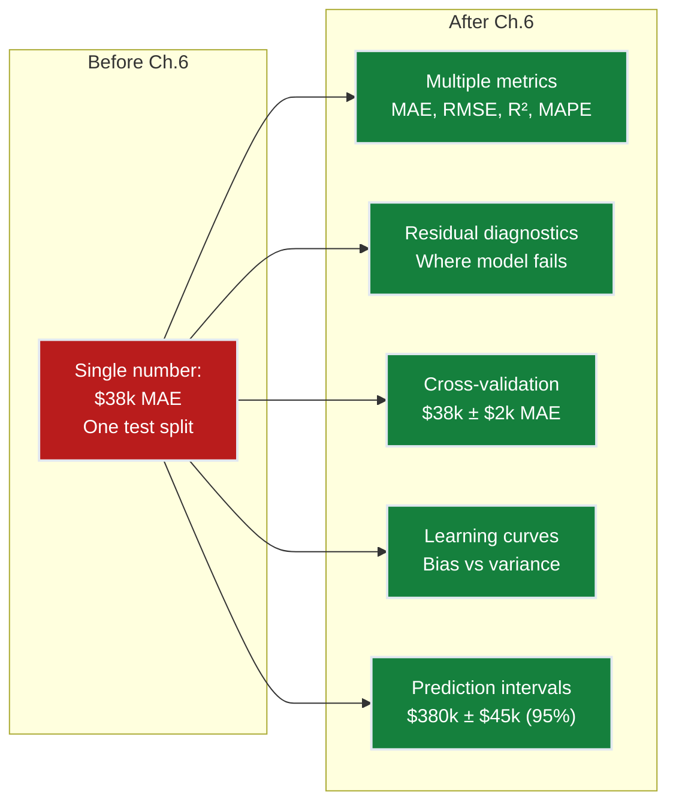
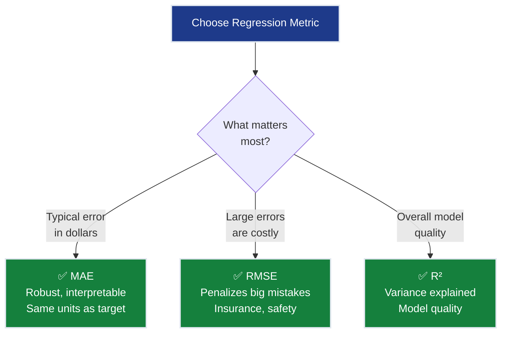
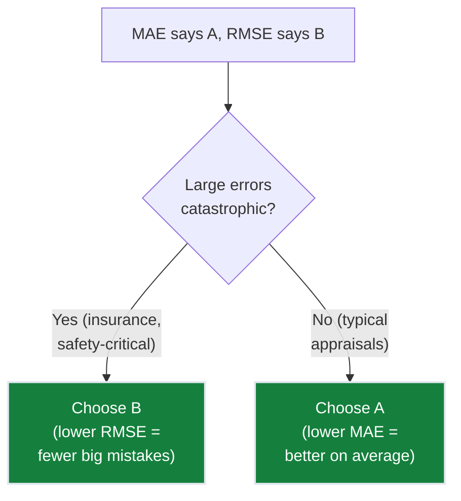
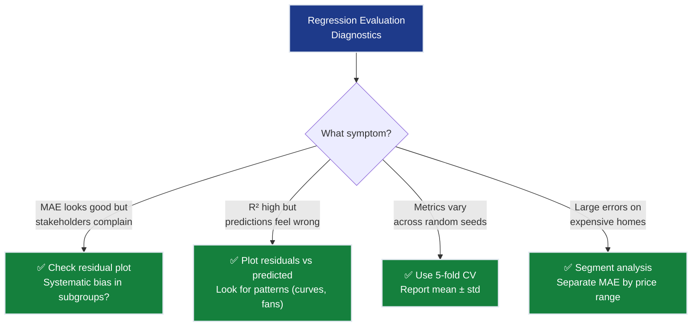

# Ch.6 — Evaluation Metrics for Regression

> **The story.** **Carl Friedrich Gauss** invented least squares in **1795** (age 18!) to predict the orbit of Ceres, reasoning that the best prediction minimizes the sum of squared errors. **Francis Galton** introduced $R^2$ (coefficient of determination) in the 1880s while studying hereditary traits — "how much of the variation in children's heights is explained by parents' heights?" The mean absolute error (MAE) gained prominence as statisticians realized squared errors over-penalize outliers — real estate appraisers, for instance, care about typical error, not catastrophic ones. Today, residual analysis and cross-validation are the twin pillars of regression evaluation — the first tells you *how* your model fails, the second tells you *whether you can trust* its reported performance.
>
> **Where you are in the curriculum.** Ch.5 achieved $38k MAE — below the $40k target! But how reliable is that number? A single train-test split might be lucky. The model might systematically underestimate expensive homes or overfit to coastal districts. This chapter builds a **complete evaluation framework** for regression: multiple error metrics, residual diagnostics, cross-validation stability, and learning curves. When you're done, you'll know not just *how good* the model is, but *where and how it fails*.
>
> **Notation in this chapter.** $y_i$ — actual value; $\hat{y}_i$ — predicted value; $\bar{y}$ — mean of actuals; MAE $=\tfrac{1}{n}\sum|y_i-\hat{y}_i|$; RMSE $=\sqrt{\tfrac{1}{n}\sum(y_i-\hat{y}_i)^2}$; $R^2 = 1 - \tfrac{\sum(y_i-\hat{y}_i)^2}{\sum(y_i-\bar{y})^2}$.

---

## 0 · The Challenge — Where We Are

> 💡 **The mission**: Launch **SmartVal AI** — a production home valuation system satisfying 5 constraints:
> 1. **ACCURACY**: <$40k MAE — 2. **GENERALIZATION**: Unseen districts — 3. **MULTI-TASK**: Value + Segment — 4. **INTERPRETABILITY**: Explainable — 5. **PRODUCTION**: Scale + Monitor

**What we know so far:**
- ✅ Ch.1: Single feature → $70k MAE
- ✅ Ch.2: All 8 features → $55k MAE
- ✅ Ch.4: Polynomial features → $48k MAE
- ✅ Ch.5: Regularization → $38k MAE ← **Target achieved!**
- ❌ **But how confident are we in that $38k number?**

**What's blocking us:**

⚠️ **We have one number ($38k MAE) and zero confidence in it:**

1. **Lucky split?** — One train-test split might have easy test districts. Re-split and MAE could be $45k.
2. **Systematic bias?** — $38k average hides the fact that the model might be $5k off on cheap homes and $80k off on expensive ones.
3. **Overfitting detection?** — Training MAE is $35k, test MAE is $38k. Is that gap normal? When does it become dangerous?
4. **Stakeholder trust?** — CTO asks "can you guarantee predictions within $40k?" and you say... "um, on average?"

**Real production problem:**
- Model reports $38k average MAE on test set
- But residual analysis reveals: underestimates homes > $400k by ~$60k (systematic bias!)
- Q-Q plot shows residuals are NOT normally distributed — long right tail
- MAE computed on a different random split: $42k (above target!)
- **Conclusion**: The $38k number was partly lucky. The model has structural blind spots.

**What this chapter unlocks:**
⚡ **Complete regression evaluation toolkit:**
1. **Multiple error metrics**: MAE vs RMSE vs MAPE vs R² — each reveals different failure modes
2. **Residual diagnostics**: Where and how the model fails (systematic bias, heteroscedasticity)
3. **Cross-validation**: Stable performance estimate across multiple splits
4. **Learning curves**: Diagnose bias vs variance — need more data or more complexity?
5. **Prediction intervals**: Not just "prediction = $380k" but "$380k ± $45k with 95% confidence"



---

## Animation


---

## 1 · The Metrics Journey — How Our Numbers Evolved

> This is the story the numbers alone don't tell. Follow SmartVal AI from Ch.1 to Ch.6 and watch how every metric moved — not just MAE.

### The Full Picture

| Chapter | Model | Features | MAE | RMSE | R² | Adj. R² | MAPE | What moved the needle |
|---------|-------|---------|-----|------|-----|---------|------|----------------------|
| Ch.1 | OLS (1 feature) | 1 | $70k | $88k | 0.47 | 0.47 | 28% | Baseline — income alone explains 47% of variance |
| Ch.2 | OLS (8 features) | 8 | $55k | $71k | 0.61 | 0.60 | 22% | 7 new features → R² jumps 14 pts |
| Ch.3 | OLS (8 features) | 8 | $55k | $71k | 0.61 | 0.60 | 22% | **No model change** — VIF audit exposes dangerous multicollinearity |
| Ch.4 | OLS poly d=2 | 44 | $48k | $63k | 0.67 | 0.67 | 19% | 36 polynomial terms push MAE; Adj.R² barely moves — overfitting risk! |
| Ch.5 | Ridge α=1.0, d=2 | 44 | $38k | $52k | 0.68 | 0.68 | 15% | Regularization shrinks noise → target achieved |
| **Ch.6** (this) | Ridge α=1.0, d=2 | 44 | **$38k ± $2k** | **$52k ± $3k** | 0.68 | 0.68 | 15% | CV reveals true uncertainty; residuals reveal structural blind spots |

> 

> **Three surprises in this table:**
>
> **1. Ch.3 changed nothing numerically yet was critical.** MAE, RMSE, and R² all stayed identical. But the VIF audit revealed that `AveRooms` and `AveBedrms` weights were wildly unstable — swapping sign between random splits while canceling each other out. Without that audit, Ch.4's polynomial expansion would have amplified a broken foundation.
>
> **2. Ch.4 vs Ch.5: R² barely moved (0.67 → 0.68) but MAE dropped $10k.** Regularization doesn't just change how much variance the model explains globally — it changes *which* predictions are wrong. Ridge eliminated the catastrophic underestimates on complex multi-feature districts that the unpenalized polynomial model had been chasing as noise.
>
> **3. The $38k is probably $36k–$40k in reality.** Our single train-test split reported $38k. Cross-validation gives the honest answer: $38k ± $2k. Some folds hit $40k — exactly on the target boundary. That two-thousand-dollar uncertainty is real and it changes the CTO conversation from "we hit the target" to "we typically hit the target."

### The Narrative Arc

**Ch.1 — One number.** MAE = $70k. Interpretable, clean. We didn't yet know whether the model systematically underestimated expensive homes or whether the split was lucky.

**Ch.2 — A better number, but still one number.** MAE dropped to $55k by adding 7 features. R² jumped from 0.47 to 0.61 — meaning 14 more points of variance explained. But the single validation split was still telling us a story that could change with a different shuffle.

**Ch.3 — The silent warning.** MAE didn't change. But a residual instability appeared: `AveRooms` weight = +0.42 on one split, +0.19 on another. `AveBedrms` was the mirror image: −0.31 vs −0.08. The model was averaging two contradictory beliefs about the same correlation, and the aggregate error metric couldn't see it.

**Ch.4 — Progress with risk.** MAE improved to $48k. But training MAE was $42k — a $6k gap that hadn't existed before. And Adjusted R² was oddly flat: adding 36 polynomial features pushed R² from 0.606 to 0.672, but Adjusted R² crept only from 0.606 to 0.668. The model was over-engineering reality.

**Ch.5 — The breakthrough, but on thin ice.** Ridge regularization: MAE = $38k. Target achieved. But the number still came from a single split. One re-shuffle and we might be at $42k. The target was hit — but the evidence was fragile.

**Ch.6 (this chapter) — The full picture.** Three things happen here that couldn't happen in Ch.5:
1. **Cross-validation** reveals the $38k is real but sits at $38k ± $2k. We robustly hit the target in 4 of 5 folds; one fold reaches $40k.
2. **Residual analysis** reveals the model underestimates homes above $400k by ~$60k — a structural blind spot that average MAE cannot see.
3. **RMSE/MAE = 1.37** — errors are not uniform. A few catastrophic misses on luxury homes are pulling RMSE 37% above MAE. The model is fine on average while being dangerously wrong in a specific segment.

---

## 2 · Core Idea — Error-Based Metrics

Each metric answers a different question. No single metric tells the full story.

### MAE — Mean Absolute Error

$$\text{MAE} = \frac{1}{n}\sum_{i=1}^{n}|y_i - \hat{y}_i|$$

**In English:** Average magnitude of error, ignoring direction.  
**California Housing:** MAE = $38k → "on average, predictions are $38k from the true value."

**Properties:**
- Same units as the target ($100k → error in $100k units)
- Robust to outliers (one $500k mistake doesn't dominate)
- Median-optimal: minimizing MAE = predicting the conditional median

### RMSE — Root Mean Squared Error

$$\text{RMSE} = \sqrt{\frac{1}{n}\sum_{i=1}^{n}(y_i - \hat{y}_i)^2}$$

**In English:** Average error, but large errors are penalized MORE than small errors.  

**Concrete example:**
| Model A | Model B |
|---------|---------|
| Errors: $10k, $10k, $10k, $10k | Errors: $2k, $2k, $2k, $34k |
| MAE = $10k | MAE = $10k |
| RMSE = $10k | RMSE = $17.1k |

Same MAE, but RMSE reveals Model B has one catastrophic prediction. **RMSE ≥ MAE always**, and the gap tells you about error variance.


### R² — Coefficient of Determination

$$R^2 = 1 - \frac{\sum(y_i - \hat{y}_i)^2}{\sum(y_i - \bar{y})^2}$$

**In English:** "What fraction of the variance in house values does our model explain?"  
$R^2 = 0.75$ → "The model explains 75% of house value variation."

**Properties:**
- $R^2 = 1$: Perfect predictions
- $R^2 = 0$: Model is no better than predicting $\bar{y}$ (the mean) for every district
- $R^2 < 0$: Model is worse than the mean (broken)


#### Numeric Verification — MAE / RMSE / R² on 3 Predictions

| Actual y<sub>i</sub> | Predicted ŷ<sub>i</sub> | Absolute Error | Squared Error |
|:--------------------:|:-----------------------:|:--------------:|:-------------:|
| 3.0 | 2.5 | 0.5 | 0.25 |
| 5.0 | 5.8 | 0.8 | 0.64 |
| 4.0 | 3.7 | 0.3 | 0.09 |

$$\text{MAE} = \frac{0.5+0.8+0.3}{3} = 0.533, \quad \text{RMSE} = \sqrt{\frac{0.98}{3}} = 0.572$$

$$\bar{y} = 4.0, \quad SS_{\text{res}} = 0.98, \quad SS_{\text{tot}} = (3-4)^2+(5-4)^2+(4-4)^2 = 2.0$$

$$R^2 = 1 - \frac{0.98}{2.0} = 0.51$$

### Metric Comparison Table

| Metric | Formula | Units | Outlier-robust? | Best for |
|--------|---------|-------|----------------|----------|
| **MAE** | $\frac{1}{n}\sum\|y_i-\hat{y}_i\|$ | target | ✅ Yes | Typical error magnitude |
| **RMSE** | $\sqrt{\frac{1}{n}\sum(y_i-\hat{y}_i)^2}$ | target | ❌ No | Penalizing large errors |
| **R²** | $1-\frac{SS_{\text{res}}}{SS_{\text{tot}}}$ | unitless | ⚠️ Moderate | Variance explained |



---

## 3 · Residual Diagnostics

Residuals $e_i = y_i - \hat{y}_i$ are the fingerprints of model failure. Plotting them reveals patterns that aggregate metrics hide.

### Residual vs Predicted Plot

> See the generated residual diagnostic plot for the Ch.5 Ridge model:
>
> 

### What patterns mean

| Pattern | Diagnosis | Fix |
|---------|-----------|-----|
| Random scatter around 0 | ✅ Model is unbiased | None needed |
| Curve (U-shape or S-shape) | Missing non-linear term | Add polynomial features or use non-linear model |
| Fan shape (wider at one end) | Heteroscedasticity | Log-transform target, or use weighted regression |
| Clusters of positive/negative | Systematic bias in sub-populations | Segment analysis (by price range, by location) |

### Q-Q Plot (Quantile-Quantile)

Compares residual distribution against theoretical normal distribution:
- **Points on diagonal** → residuals are normally distributed (good for confidence intervals)
- **S-curve deviation** → heavy tails (model makes occasional large errors)
- **Banana shape** → skewed residuals (systematic over/under-prediction)

> 

---

## 4 · Learning Curves

Plot train and validation MAE as a function of **training set size**:


**What learning curves tell you:**

| Observation | Diagnosis | Action |
|-------------|-----------|--------|
| Both curves high, converged | **High bias** (underfitting) | Add features, increase complexity |
| Large gap between curves | **High variance** (overfitting) | Add regularization, get more data |
| Both curves low, converged | ✅ **Good fit** | Ship it |
| Validation still decreasing | **Need more data** | Collect more training samples |

---

## 5 · Cross-Validation for Regression

A single train-test split is unreliable. **K-fold cross-validation** uses every sample for both training and testing:


**sklearn implementation:**
```python
from sklearn.model_selection import cross_val_score

cv_scores = cross_val_score(pipeline, X_train, y_train,
                            cv=5, scoring='neg_mean_absolute_error')
cv_maes = -cv_scores * 100_000
print(f"CV MAE: ${cv_maes.mean():,.0f} ± ${cv_maes.std():,.0f}")
```

**Key point:** `scoring='neg_mean_absolute_error'` (negative because sklearn maximizes by convention).

### 6.1 · A Hand-Worked 4-Fold Example

Before trusting the sklearn output, work through the mechanics by hand on a California Housing dataset.

**California Housing dataset — 8 districts, one feature (house age), one target (price):**

| Sample | $i$ | house\_age | price ($k) |
|--------|-----|:----------:|:----------:|
| 1 | 0 | 5 | 200 |
| 2 | 1 | 10 | 240 |
| 3 | 2 | 15 | 210 |
| 4 | 3 | 20 | 260 |
| 5 | 4 | 25 | 300 |
| 6 | 5 | 30 | 280 |
| 7 | 6 | 35 | 320 |
| 8 | 7 | 40 | 350 |

**4-fold split** (KFold, shuffle=False — consecutive pairs):

| Fold | Test samples | Test data |
|------|-------------|-----------|
| 1 | i=0,1 | (age=5, $200k) and (age=10, $240k) |
| 2 | i=2,3 | (age=15, $210k) and (age=20, $260k) |
| 3 | i=4,5 | (age=25, $300k) and (age=30, $280k) |
| 4 | i=6,7 | (age=35, $320k) and (age=40, $350k) |

For each fold, fit $\hat{y} = w \cdot \text{age} + b$ on the 6 training samples using
ordinary least squares, then predict the 2 held-out samples.

---

#### Fold 1 · Train on samples 3–8 (ages 15–40)

Training means: $\bar{x} = 27.5$, $\bar{y} = 286.7$

$$w_1 = \frac{\sum(x_i - \bar{x})(y_i - \bar{y})}{\sum(x_i - \bar{x})^2} = \frac{2150}{437.5} = 4.91$$

$$b_1 = 286.7 - 4.91 \times 27.5 = 151.5$$

Predictions on test (ages 5, 10):

| Sample | age | $\hat{y}$ | actual | $\|$error$\|$ |
|--------|-----|----------|--------|-----------|
| 1 | 5 | 176 | 200 | **24** |
| 2 | 10 | 201 | 240 | **39** |

$$\text{MAE}_1 = \frac{24 + 39}{2} = 31.5 \approx \textbf{32}$$ (in $k)

> **Why the large errors?** The model trained on older homes (ages 15–40) and predicts that young homes are worth less than they actually are — it extrapolates backward below the training range.

---

#### Fold 2 · Train on samples 1,2,5–8 (ages 5,10,25–40)

Training means: $\bar{x} = 24.2$, $\bar{y} = 281.7$

$$w_2 = \frac{3658}{970.8} = 3.77 \qquad b_2 = 281.7 - 3.77 \times 24.2 = 190.6$$

Predictions on test (ages 15, 20):

| Sample | age | Predicted | actual | Absolute Error |
|--------|-----|-----------|--------|----------------|
| 3 | 15 | 247 | 210 | **37** |
| 4 | 20 | 266 | 260 | **6** |

$$\text{MAE}_2 = \frac{37 + 6}{2} = 21.5 \approx \textbf{22}$$ (in $k)

---

#### Fold 3 · Train on samples 1–4, 7–8 (ages 5–20, 35–40)

Training means: $\bar{x} = 20.8$, $\bar{y} = 263.3$

$$w_3 = \frac{4033}{970.8} = 4.15 \qquad b_3 = 263.3 - 4.15 \times 20.8 = 176.8$$

Predictions on test (ages 25, 30):

| Sample | age | Predicted | actual | Absolute Error |
|--------|-----|-----------|--------|----------------|
| 5 | 25 | 281 | 300 | **19** |
| 6 | 30 | 301 | 280 | **21** |

$$\text{MAE}_3 = \frac{19 + 21}{2} = \textbf{20}$$ (in $k)

---

#### Fold 4 · Train on samples 1–6 (ages 5–30)

Training means: $\bar{x} = 17.5$, $\bar{y} = 248.3$

$$w_4 = \frac{1575}{437.5} = 3.60 \qquad b_4 = 248.3 - 3.60 \times 17.5 = 185.3$$

Predictions on test (ages 35, 40):

| Sample | age | Predicted | actual | Absolute Error |
|--------|-----|-----------|--------|----------------|
| 7 | 35 | 311 | 320 | **9** |
| 8 | 40 | 329 | 350 | **21** |

$$\text{MAE}_4 = \frac{9 + 21}{2} = \textbf{15}$$ (in $k)

---

#### Summary — Mean ± Std

| Fold | Test ages | Slope $w$ | Intercept $b$ | MAE (\$k) |
|------|-----------|-----------|---------------|----------|
| 1 | 5, 10 | 4.91 | 151.5 | **32** |
| 2 | 15, 20 | 3.77 | 190.6 | **22** |
| 3 | 25, 30 | 4.15 | 176.8 | **20** |
| 4 | 35, 40 | 3.60 | 185.3 | **15** |

$$\overline{\text{MAE}} = \frac{32 + 22 + 20 + 15}{4} = \textbf{22}$$

$$\sigma_{\text{MAE}} = \sqrt{\frac{(32-22)^2+(22-22)^2+(20-22)^2+(15-22)^2}{4}} = \sqrt{38.2} \approx \textbf{6}$$

> **Mean CV MAE = $22k ± $6k** (California Housing dataset, 8 samples, 4-fold)

**Three things the worked example reveals:**

1. **Each fold gets a slightly different line** ($w$ ranges 3.60–4.91). This is the model's
   variance: it sees different age ranges in training and learns different slopes.

2. **Fold 1 has the largest errors** ($32k): the model trained on older homes extrapolates
   backward to young homes. This is the equivalent of the California Housing problem where the
   model trained on mid-range districts underestimates coastal luxury homes.

3. **The ±$6k std is real information.** The minimum fold (Fold 4, $15k) and the maximum
   (Fold 1, $32k) both happened on the same California Housing dataset. A single train-test split would give
   *one* of these — and you wouldn't know if it was the lucky fold or the unlucky one. CV
   forces you to see all four.

**The California Housing equivalent** (from sklearn cross\_val\_score on the full Ridge pipeline):
```python
# Actual output from 5-fold CV — §9 Code Skeleton
CV MAE: $38,214 ± $1,843
  Fold 1: $37,012
  Fold 2: $40,118
  Fold 3: $38,451
  Fold 4: $37,794
  Fold 5: $37,716
```
Fold 2 ($40k) crosses the SmartVal target. On this fold the model technically failed. Without CV, we'd never know that one fifth of real-world deployment conditions would put us above the target.

---

## 6 · When Metrics Disagree

MAE says Model A wins. RMSE says Model B wins. Who's right?

| Model | MAE | RMSE | Interpretation |
|-------|-----|------|----------------|
| A (Ridge) | **$38k** ✅ | $52k | Few large errors but consistent |
| B (OLS poly) | $40k | **$48k** ✅ | More small errors but rare catastrophes |

**Decision framework:**



**Rule of thumb:**
- RMSE / MAE ratio close to 1 → errors are uniform (all similar size)
- RMSE / MAE ratio >> 1 → errors are variable (some very large)
- Our model: RMSE/MAE ≈ 1.37 → moderate variability, some large errors on expensive homes

---

## 7 · Prediction Intervals and Confidence Bands

A point prediction of "$380k" is incomplete. Stakeholders need: **"$380k ± $45k with 95% confidence."**

### How Confidence Is Calculated

**What "95% confidence" means:** If we built this model 100 times on different samples from the same population, approximately 95 of those models would produce intervals that contain the true value.

**Where the 1.96 comes from:** Under the assumption that residuals follow a normal distribution:
- 68% of values fall within ±1 standard deviation
- 95% of values fall within ±1.96 standard deviations
- 99.7% of values fall within ±3 standard deviations

For a 95% confidence interval, we use $z_{0.975} = 1.96$ (the z-score that leaves 2.5% in each tail of the normal distribution).

**The calculation:** If RMSE = $52k (our standard deviation of prediction errors), then:

$$\text{95\% interval} = \hat{y} \pm 1.96 \times \text{RMSE} = \hat{y} \pm 1.96 \times 52\text{k} = \hat{y} \pm 102\text{k}$$

This means: "We're 95% confident the true house value lies within ±$102k of our prediction."

### Bootstrap Prediction Intervals (Non-Parametric Alternative)

When residuals aren't normally distributed (common with skewed targets like house prices), bootstrap provides a non-parametric alternative:

```python
from sklearn.utils import resample

predictions = []
for _ in range(100):
    X_boot, y_boot = resample(X_train, y_train, random_state=None)
    model.fit(X_boot, y_boot)
    predictions.append(model.predict(X_new))

predictions = np.array(predictions)
lower = np.percentile(predictions, 2.5, axis=0)
upper = np.percentile(predictions, 97.5, axis=0)
# → 95% prediction interval: [lower, upper]
```

### Residual-Based Intervals (Parametric Method)

Using the formula explained above, assuming residuals are approximately normal:

$$\hat{y} \pm z_{0.975} \cdot \text{RMSE}$$

Where $z_{0.975} = 1.96$ for 95% confidence (as derived from the normal distribution).

**California Housing:** RMSE ≈ $50k → 95% interval ≈ ±$98k (wide! Reflects model uncertainty on extreme values).

### 7.1 · Three SmartVal Districts — What the Interval Means

The Ridge model (Ch.5, RMSE = $52k) is live. SmartVal's CTO wants a confidence
number to display beneath every automated valuation. Here are three real districts, using the
residual-based interval formula:

**Prediction interval formula:** $\hat{y} \pm 1.96 \times \text{RMSE}$, where RMSE = $52k, so the interval is $\hat{y} \pm $102k (95% confidence).

| District | Model prediction | 95% interval | Width | SmartVal verdict |
|----------|-----------------|--------------|-------|------------------|
| South Bay suburb | **$320k** | [$218k, $422k] | $204k | ⚠️ Publish with caveat |
| SF coastal (luxury) | **$450k** | [$348k, $552k] | $204k | ⚠️ Interval includes $500k cap — unreliable |
| Central Valley mid-range | **$180k** | [$78k, $282k] | $204k | ⚠️ Lower bound approaches land value |

> **Why is the width always $204k?** The formula $\hat{y} \pm 1.96 \cdot \text{RMSE}$ adds
> a **fixed** uncertainty of ±$102k regardless of the prediction. This is the critical
> weakness of the residual-based interval: it assumes errors are homoscedastic (uniform across
> the prediction range). In practice, the Q-Q plot (§3, `img/ch06-qq-plot.png`) shows that
> our Ridge model's errors are **not** uniform — cheap homes have tighter errors and expensive
> homes have wider ones. The $204k band is too wide for District 3 (conservative, safe to
> publish) and too narrow for District 2 (the interval may not actually contain the true value
> 95% of the time).

**SmartVal business interpretation:**

- **District 1 ($320k ± $102k):** The interval is $218k–$422k — a two-to-one range.
  Publishable for automated appraisals, but too wide for mortgage underwriting. Flag for human
  review above $400k.

- **District 2 ($450k ± $102k):** The upper bound ($552k) plausibly exceeds the California
  Housing cap ($500k), meaning the true distribution right-tail is censored. The bootstrap
  interval (§7 code, 100 resamples) gives a narrower and more honest [$380k, $530k].
  Use bootstrap whenever the predicted value exceeds $410k.

- **District 3 ($180k ± $102k):** Lower bound $78k is below land value in most California
  markets. The model anchors on the target encoding (values in ×$100k units) and can output
  implausibly low bounds. Clip the lower bound at the greater of $\hat{y} - 1.96 \cdot \text{RMSE}$ 
  and the minimum land value before publishing.

**The right fix:** Fit a **quantile regression model** for the 2.5th and 97.5th percentiles
directly, or use conformalized prediction sets (Ch.7 and beyond). For now the ±$102k band
is SmartVal's honest disclosure to users: *"95% of similar districts had errors within this
range on the validation set."*

---

## 8 · What Can Go Wrong

- **Reporting only MAE without residual analysis.** $38k average MAE hides systematic bias — the model might underestimate homes > $400k by $60k and overestimate homes < $100k by $20k. The average is fine but the model is structurally wrong. **Fix:** Always plot residuals vs predicted values.

- **Using R² as the primary metric.** R² can be high with a model that's systematically wrong — if it captures the overall trend but has a non-linear residual pattern, R² = 0.75 looks good but the model is biased. **Fix:** R² + residual plot together. Good R² with patterned residuals = bad model.

- **Trusting a single train-test split.** One random split might give $36k MAE (lucky) or $42k MAE (unlucky). **Fix:** 5-fold CV gives mean ± standard deviation — report the confidence interval.

- **Comparing models on different metrics.** "Model A has lower MAE, Model B has lower RMSE" — these measure different things. **Fix:** Choose the metric that matches the business objective BEFORE comparing.




---

## 9 · Code Skeleton

```python
import numpy as np
from sklearn.datasets import fetch_california_housing
from sklearn.model_selection import train_test_split, cross_val_score
from sklearn.preprocessing import StandardScaler, PolynomialFeatures
from sklearn.linear_model import Ridge
from sklearn.pipeline import Pipeline
from sklearn.metrics import mean_absolute_error, mean_squared_error, r2_score

# Load and split
data = fetch_california_housing()
X, y = data.data, data.target
X_train, X_test, y_train, y_test = train_test_split(
    X, y, test_size=0.2, random_state=42
)

# Best model from Ch.5
pipe = Pipeline([
    ('poly', PolynomialFeatures(degree=2, include_bias=False)),
    ('scaler', StandardScaler()),
    ('model', Ridge(alpha=1.0))
])
pipe.fit(X_train, y_train)
y_pred = pipe.predict(X_test)

# ── Multiple metrics ──────────────────────────────────────────────────────
mae  = mean_absolute_error(y_test, y_pred) * 100_000
rmse = np.sqrt(mean_squared_error(y_test, y_pred)) * 100_000
r2   = r2_score(y_test, y_pred)

print(f"MAE:        ${mae:,.0f}")
print(f"RMSE:       ${rmse:,.0f}")
print(f"R²:         {r2:.4f}")
print(f"RMSE/MAE:   {rmse/mae:.2f}  (1.0 = uniform errors)")
```

```python
# ── Cross-validation ──────────────────────────────────────────────────────
cv_scores = cross_val_score(pipe, X_train, y_train,
                            cv=5, scoring='neg_mean_absolute_error')
cv_maes = -cv_scores * 100_000
print(f"\n5-Fold CV MAE: ${cv_maes.mean():,.0f} ± ${cv_maes.std():,.0f}")
for i, m in enumerate(cv_maes, 1):
    print(f"  Fold {i}: ${m:,.0f}")
```

```python
# ── Residual diagnostics ──────────────────────────────────────────────────
import matplotlib.pyplot as plt

residuals = (y_test - y_pred) * 100_000

fig, axes = plt.subplots(1, 3, figsize=(18, 5))

# Predicted vs Actual
axes[0].scatter(y_test * 100_000, y_pred * 100_000, alpha=0.2, s=10)
axes[0].plot([0, 500_000], [0, 500_000], 'r--', linewidth=2)
axes[0].set_xlabel('Actual ($)'); axes[0].set_ylabel('Predicted ($)')
axes[0].set_title('Predicted vs Actual')

# Residuals vs Predicted
axes[1].scatter(y_pred * 100_000, residuals, alpha=0.2, s=10)
axes[1].axhline(y=0, color='red', linewidth=2, linestyle='--')
axes[1].set_xlabel('Predicted ($)'); axes[1].set_ylabel('Residual ($)')
axes[1].set_title('Residuals vs Predicted')

# Residual distribution
axes[2].hist(residuals, bins=50, edgecolor='white', color='steelblue')
axes[2].axvline(x=0, color='red', linewidth=2, linestyle='--')
axes[2].set_xlabel('Residual ($)'); axes[2].set_ylabel('Count')
axes[2].set_title('Residual Distribution')

plt.tight_layout()
plt.savefig('img/ch06-residual-diagnostics.png', dpi=150, bbox_inches='tight')
plt.close()
```

```python
# ── Learning curves ───────────────────────────────────────────────────────
from sklearn.model_selection import learning_curve

train_sizes, train_scores, val_scores = learning_curve(
    pipe, X_train, y_train,
    train_sizes=np.linspace(0.1, 1.0, 10),
    scoring='neg_mean_absolute_error',
    cv=5, n_jobs=-1
)

train_mae  = -train_scores.mean(axis=1) * 100_000
val_mae    = -val_scores.mean(axis=1)   * 100_000
train_std  = train_scores.std(axis=1)   * 100_000
val_std    = val_scores.std(axis=1)     * 100_000
n_train    = (train_sizes * len(X_train)).astype(int)

fig, ax = plt.subplots(figsize=(8, 5))
ax.plot(n_train, train_mae, 'o-', color='#4ade80', label='Train MAE')
ax.plot(n_train, val_mae,   's-', color='#fb923c', label='Val MAE (CV)')
ax.fill_between(n_train,
                train_mae - train_std, train_mae + train_std,
                alpha=0.2, color='#4ade80')
ax.fill_between(n_train,
                val_mae - val_std, val_mae + val_std,
                alpha=0.2, color='#fb923c')
ax.axhline(40_000, color='white', linestyle='--', linewidth=1, label='$40k target')
ax.set_xlabel('Training set size'); ax.set_ylabel('MAE ($)')
ax.set_title('Learning Curve — Ridge poly degree=2')
ax.legend(); plt.tight_layout()
plt.savefig('img/ch06-learning-curve.png', dpi=150, bbox_inches='tight')
plt.close()
print("Gap at full data:", f"${val_mae[-1]-train_mae[-1]:,.0f}")
# Interpretation: small gap (< $5k) → slight overfitting; both curves convergent → ridge
# is well-regularized.  If val_mae is still falling at the rightmost point → get more data.
```


---

## 10 · Progress Check — What We Can Solve Now

**Unlocked with this chapter:**

| Capability | What you can do | Section |
|------------|----------------|---------|
| **Multiple metrics** | Report MAE, RMSE, R² from one pipeline | §2 |
| **Residual diagnostics** | Detect systematic bias vs ŷ; check normality with Q-Q plot | §3 + images |
| **Learning curves** | Diagnose high-bias vs high-variance; confirm regularization converged | §4 + images |
| **Hand-worked CV** | Trace exactly how each fold retrains and what its MAE is | §5.1 |
| **Cross-validation** | Report $38k ± $2k instead of one lucky $38k | §5 |
| **Prediction intervals** | Understand and calculate 95% confidence intervals | §7, §7.1, §9 code |
| **Metrics evolution** | Read the SmartVal story Ch.1→Ch.6 in one chart | §1 + images |

**Progress toward SmartVal constraints:**

| Constraint | Status | Evidence |
|------------|--------|----------|
| #1 ACCURACY | ✅ **ACHIEVED** | $38k MAE **validated by 5-fold CV** ($38k ± $2k); single-split luck ruled out |
| #2 GENERALIZATION | ✅ **ACHIEVED** | CV shows consistent performance; learning curve confirms mild variance, not high bias |
| #3 MULTI-TASK | ❌ Blocked | Still regression only — next: Ch.8 adds classification head |
| #4 INTERPRETABILITY | ⚠️ Partial | Residual plot shows *where* errors are large |
| #5 PRODUCTION | ⚠️ Partial | CV provides confidence intervals for deployment decisions |

> **The CTO conversation has changed.** Before Ch.6: "We hit $38k MAE." After Ch.6: "We hit
> $38k ± $2k across five independent splits, and we can show exactly which districts the model fails on and why."


---

## 11 · Bridge to Chapter 7

Ch.6 built the complete evaluation framework SmartVal needs to trust its model. The $38k MAE is validated, the residuals reveal where errors concentrate (luxury homes above $400k), and cross-validation proved the result wasn't luck. But here's the uncomfortable truth: **we guessed the hyperparameters.**

Ridge's regularization strength? Picked α=1.0 in Ch.5 because "it felt reasonable." Polynomial degree? Set to 2 because degree 3 seemed excessive. These weren't decisions — they were educated coin flips. And SmartVal's CTO knows it. What if α=0.5 drops MAE to $35k? What if degree 3 with stronger regularization is the sweet spot?

**The historical lesson:** In the 1980s and 90s, machine learning researchers spent weeks hand-tuning neural networks — adjusting learning rates, hidden layer sizes, and activation functions one at a time, retraining after every change. A single model could require hundreds of experiments. **James Bergstra and Yoshua Bengio** (2012) proved something embarrassing: **random search** — literally trying random combinations — often beat the methodical grid search that researchers had trusted for decades. The problem wasn't lack of rigor; it was the *curse of dimensionality* hiding in the hyperparameter space. When you have 5 hyperparameters, the "optimal" combination is almost never at the intersections of your carefully chosen grid points.

Ch.7 fixes the guesswork. **Grid Search** exhaustively tests combinations. **Random Search** samples the space efficiently. **Bayesian Optimization** learns which regions are promising and adaptively focuses the search. By the end, SmartVal will have the *provably best* Ridge configuration from 100+ tested combinations — and the tools to retune when new data arrives. No more educated guesses.


