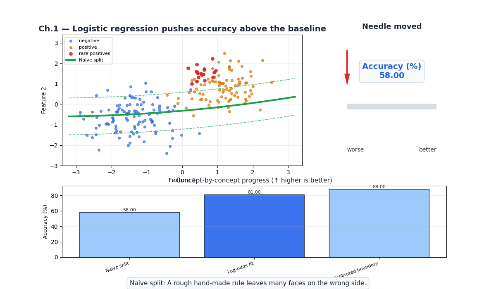
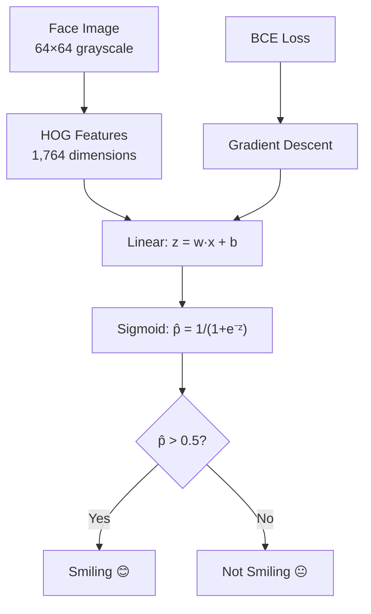
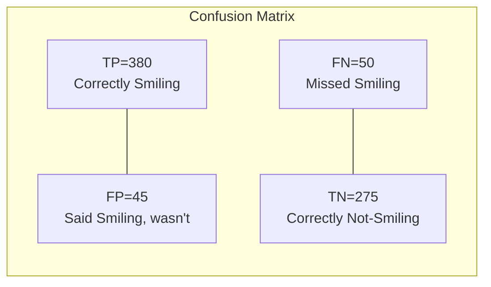
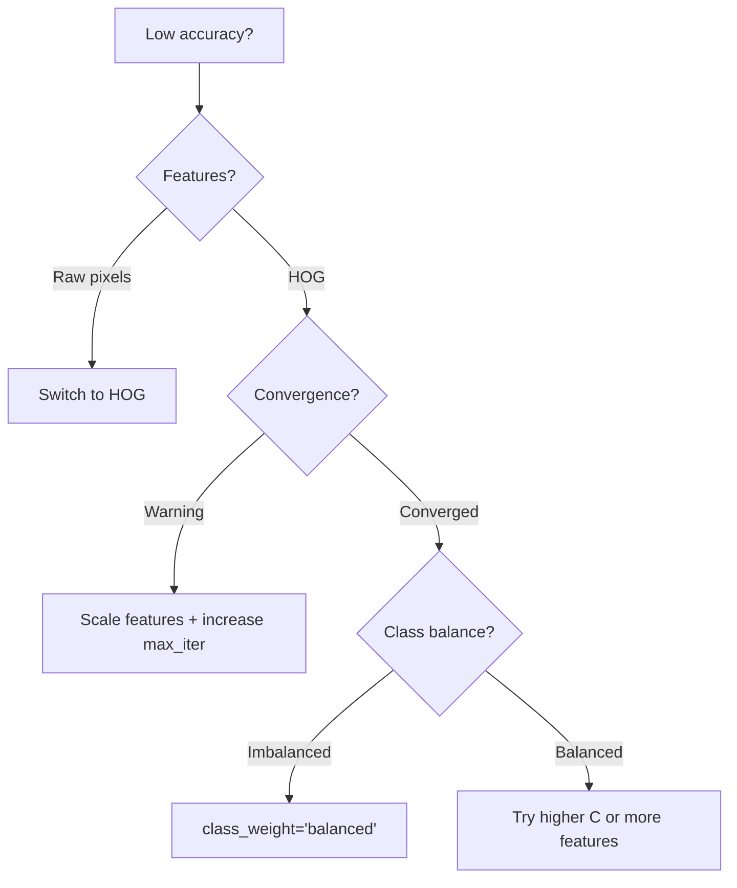

# Ch.1 — Logistic Regression

> **The story.** The **logistic function** $1/(1+e^{-x})$ was named in 1844 by the Belgian mathematician **Pierre-François Verhulst**, who used it to model population growth that saturates against a carrying capacity. A century later, in 1944, the biostatistician **Joseph Berkson** coined the word **logit** — "log of the odds" — giving us the model we still use for binary classification. **David Cox** generalised it in 1958, and by the 1970s logistic regression was the backbone of medicine, credit scoring, and epidemiology. The reason it feels almost identical to linear regression is because it *is* — you've just changed the output transformation from identity to sigmoid and swapped MSE for cross-entropy.
>
> **Where you are in the curriculum.** Topic 01 (Regression) taught you to predict continuous values. Now the FaceAI product team needs a binary signal: is a person **Smiling** or not? This chapter introduces the sigmoid activation, binary cross-entropy loss, and the confusion matrix — the evaluation framework that the rest of this track builds on.
>
> **Notation.** $\mathbf{x}\in\mathbb{R}^d$ — input feature vector (pixel intensities or HOG); $y\in\{0,1\}$ — true label (1 = Smiling); $z=\mathbf{w}\cdot\mathbf{x}+b$ — the **logit**; $\sigma(z)=1/(1+e^{-z})$ — **sigmoid**; $\hat{p}=\sigma(z)$ — predicted probability; $L=-\frac{1}{N}\sum_i[y_i\log\hat{p}_i+(1-y_i)\log(1-\hat{p}_i)]$ — **binary cross-entropy**; $TP,FP,TN,FN$ — confusion-matrix counts.

---

## §0 · The Challenge — Where We Are

> 🎯 **Grand Challenge**: Launch **FaceAI** — classify 40 facial attributes with >90% average accuracy
>
> | # | Constraint | Target | Status |
> |---|-----------|--------|--------|
> | 1 | ACCURACY | >90% avg across 40 attributes | ❌ Starting |
> | 2 | GENERALIZATION | Unseen celebrity faces | ❌ |
> | 3 | MULTI-LABEL | 40 simultaneous attributes | ❌ |
> | 4 | INTERPRETABILITY | Which features matter | ❌ |
> | 5 | PRODUCTION | <200ms inference | ❌ |

**What we know so far:**
- ✅ Topic 01: Linear regression for continuous targets
- ✅ Understand MSE loss, gradient descent, feature engineering
- ❌ **But we can only predict continuous values, not categories!**

**What's blocking us:**
The FaceAI app needs binary labels: is the person Smiling or not? Linear regression outputs unbounded values ($-\infty$ to $+\infty$), not probabilities.

**What this chapter unlocks:**
- **Sigmoid activation**: Squash $z \in (-\infty, \infty)$ → $\hat{p} \in (0, 1)$
- **Binary cross-entropy loss**: Optimize probability predictions
- **Evaluation**: Confusion matrix, precision, recall, F1
- ✅ **Constraint #1 PARTIAL** — ~88% accuracy on Smiling attribute


---

## Animation



## §1 · Core Idea

Logistic regression takes a linear combination of features ($z = \mathbf{w} \cdot \mathbf{x} + b$) and squashes it through the **sigmoid function** $\sigma(z) = 1/(1+e^{-z})$, producing a probability between 0 and 1. Train by minimising binary cross-entropy (not MSE), and threshold the output at 0.5 to classify. The math is linear regression with two changes: (1) sigmoid output, (2) cross-entropy loss.

---

## §2 · Running Example

**FaceAI's first task**: Detect whether a celebrity is **Smiling** (48% positive rate — nearly balanced).

**Dataset**: CelebA subset — 5,000 face images resized to 64×64 grayscale.
- **Features**: HOG descriptors (Histogram of Oriented Gradients) — captures edge patterns in faces, producing ~1,764 features per image.
- **Target**: `Smiling` attribute (binary: 1 = smiling, 0 = not smiling)
- **Split**: 3,500 train / 750 validation / 750 test

Why HOG? Raw pixels (4,096 features) contain too much noise for linear models. HOG captures the gradient structure (edges around mouth, eyes) that actually indicates smiling.

---

## §3 · Math

**Sigmoid activation:**

$$\hat{p} = \sigma(z) = \frac{1}{1 + e^{-z}}, \quad z = \mathbf{w} \cdot \mathbf{x} + b$$

**Properties:** $\sigma(0) = 0.5$, $\sigma(+\infty) = 1$, $\sigma(-\infty) = 0$, $\sigma'(z) = \sigma(z)(1 - \sigma(z))$.

**Binary cross-entropy loss:**

$$L = -\frac{1}{N}\sum_{i=1}^{N}\big[y_i \log(\hat{p}_i) + (1-y_i)\log(1-\hat{p}_i)\big]$$

**Numeric example** — one face image with HOG feature vector $\mathbf{x}$:
- Model outputs logit $z = 2.1$
- $\hat{p} = \sigma(2.1) = 1/(1+e^{-2.1}) = 0.891$
- True label: $y = 1$ (Smiling)
- Loss: $-[1 \cdot \log(0.891) + 0 \cdot \log(0.109)] = -\log(0.891) = 0.115$
- If we'd predicted $\hat{p} = 0.5$: loss $= -\log(0.5) = 0.693$ (much worse!)

**Gradient for weight update:**

$$\frac{\partial L}{\partial w_j} = \frac{1}{N}\sum_{i=1}^{N}(\hat{p}_i - y_i) \cdot x_{ij}$$

Same form as linear regression — the sigmoid and cross-entropy cancel to give this clean gradient.

---

## §4 · Step by Step

```
ALGORITHM: Logistic Regression for Smiling Detection
─────────────────────────────────────────────────────
Input:  X_train (3500 × 1764 HOG features), y_train (Smiling labels)
Output: Trained weights w, bias b

1. Extract HOG features from 64×64 face images
2. Initialize w = zeros(1764), b = 0
3. For epoch = 1 to 100:
   a. z = X_train @ w + b                    # logits
   b. p_hat = sigmoid(z)                      # probabilities
   c. loss = -mean(y*log(p_hat) + (1-y)*log(1-p_hat))  # BCE
   d. grad_w = (1/N) * X_train.T @ (p_hat - y)         # gradient
   e. grad_b = mean(p_hat - y)
   f. w -= lr * grad_w                        # update
   g. b -= lr * grad_b
4. Predict: y_hat = 1 if sigmoid(X_test @ w + b) > 0.5 else 0
5. Evaluate: confusion matrix, accuracy, precision, recall
```

---

## §5 · Key Diagrams





---

## §6 · Hyperparameter Dial

| Parameter | Too Low | Sweet Spot | Too High |
|-----------|---------|------------|----------|
| **C** (inverse regularization) | Heavy regularization, underfits (accuracy ~80%) | C ∈ [0.1, 10] — ~88% accuracy | No regularization, overfits to training noise |
| **Learning rate** | Slow convergence (needs 1000+ epochs) | 0.01–0.1 with sklearn default solver | Divergence, loss oscillates |
| **Threshold** | Many false positives (calls everyone Smiling) | 0.5 for balanced classes | Many false negatives (misses real smiles) |
| **max_iter** | Convergence warning, suboptimal weights | 100–500 iterations | Wasted compute, no accuracy gain |

---

## §7 · Code Skeleton

```python
import numpy as np
from sklearn.linear_model import LogisticRegression
from sklearn.metrics import classification_report, confusion_matrix
from skimage.feature import hog

# ── Data Prep ──────────────────────────────────────────
# Load CelebA subset, resize to 64×64 grayscale
# Extract HOG features
X_hog = np.array([hog(img, pixels_per_cell=(8,8), cells_per_block=(2,2)) for img in images])
y = labels['Smiling'].values  # binary: 0 or 1

# ── Train ──────────────────────────────────────────────
model = LogisticRegression(C=1.0, max_iter=500, solver='lbfgs')
model.fit(X_train, y_train)

# ── Evaluate ───────────────────────────────────────────
y_pred = model.predict(X_test)
y_prob = model.predict_proba(X_test)[:, 1]
print(classification_report(y_test, y_pred))
print(confusion_matrix(y_test, y_pred))
# Expected: ~88% accuracy on Smiling
```

---

## §8 · What Can Go Wrong

| Mistake | Symptom | Fix |
|---------|---------|-----|
| Using raw pixels instead of HOG | ~75% accuracy, model learns noise | Extract HOG features — captures edge gradients |
| Forgetting to scale features | Convergence warning, solver doesn't converge | `StandardScaler` before LogisticRegression |
| Using MSE loss for binary targets | Gradient vanishes near 0 and 1 | Cross-entropy is the correct loss (sklearn default) |
| Ignoring class imbalance | 96% accuracy on Bald by always predicting 0 | Use `class_weight='balanced'` — tuned systematically in Ch.5; see Ch.3 for the metrics that expose the problem |
| Not checking calibration | "80% confident" doesn't mean 80% correct | Use `sklearn.calibration.CalibrationDisplay` to verify probability reliability |



---

## §9 · Where This Reappears

| Concept | Reappears in | How |
|---------|-------------|-----|
| **Sigmoid + binary cross-entropy** | [Topic 03 — Neural Networks](../../03-NeuralNetworks/README.md) | The output layer of a binary classification neural network is logistic regression with a learned representation |
| **Threshold tuning** | [Ch.5 — Hyperparameter Tuning](../ch05-hyperparameter-tuning/) | Per-attribute threshold optimisation is the final lever that pushes FaceAI past 90% |
| **`class_weight='balanced'`** | [Ch.5 — Hyperparameter Tuning](../ch05-hyperparameter-tuning/), [Topic 05 — Anomaly Detection](../../05-AnomalyDetection/README.md) | Imbalance handling is critical when fraud is 0.17% of transactions |
| **Logistic regression as meta-learner** | [Topic 08 — Ensemble Methods](../../08-EnsembleMethods/README.md) | Stacking ensembles use logistic regression to combine base model predictions |

---

## §10 · Progress Check

| # | Constraint | Target | Status | Evidence |
|---|-----------|--------|--------|----------|
| 1 | ACCURACY | >90% avg | 🟡 88% on Smiling | Single attribute, single model |
| 2 | GENERALIZATION | Unseen faces | 🟡 | Train/test split, no cross-val yet |
| 3 | MULTI-LABEL | 40 attributes | ❌ | Binary only so far |
| 4 | INTERPRETABILITY | Feature importance | ❌ | Weights exist but not analyzed |
| 5 | PRODUCTION | <200ms | ✅ | LogReg inference is <1ms |


---

## §11 · Bridge to Next Chapter

We have a working binary classifier for Smiling (~88%). But logistic regression is a **linear** model — it draws a straight line (hyperplane) through HOG feature space. What if the decision boundary is curved? What if we want **interpretable rules** ("if cheeks raised AND mouth open → Smiling")?

**Ch.2** introduces **classical classifiers** — decision trees (interpretable splits), KNN (local similarity), and Naive Bayes (probabilistic). These offer different trade-offs: trees give rules, KNN captures local structure, NB handles high-dimensional sparse data. We'll see which works best for face attributes.

---

## Appendix A · Real CelebA Data Pipeline (No Proxy Data)

The examples in this chapter are intended to run on real CelebA attributes. Use this setup to avoid synthetic placeholders.

### Data Access Options

1. Kaggle mirror: `jessicali9530/celeba-dataset`.
2. Official CelebA source: download aligned images + `list_attr_celeba.txt`.

### Minimal Setup Steps

1. Create folders:
   - `data/celeba/img_align_celeba/`
   - `data/celeba/metadata/`
2. Place attribute file at:
   - `data/celeba/metadata/list_attr_celeba.txt`
3. Keep image filenames unchanged (`000001.jpg`, ...).
4. Start with a 20k-50k image subset for local runs.

### Loader Contract

- Input image size: 64x64 (or 128x128 for stronger baselines).
- Labels: map CelebA values from `{-1, +1}` to `{0, 1}`.
- Split: use official train/val/test partitions to avoid leakage.
- Reproducibility: set random seed and persist sampled subset IDs.

### Practical Notes

- Multi-label tasks should keep one binary head per attribute.
- For rare attributes (Bald, Mustache, Wearing_Hat), prefer macro-F1 and per-label PR-AUC.
- Persist preprocessing artifacts (scaler/PCA/HOG settings) with the model.

### Quick Loader Snippet

```python
from pathlib import Path
import pandas as pd

attr_path = Path('data/celeba/metadata/list_attr_celeba.txt')
attr = pd.read_csv(attr_path, delim_whitespace=True, skiprows=1)
attr = (attr + 1) // 2   # {-1,+1} -> {0,1}

# Example target
y_smiling = attr['Smiling'].astype(int)
```


