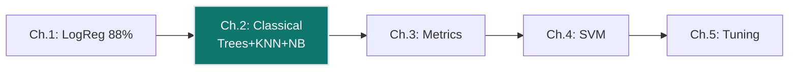
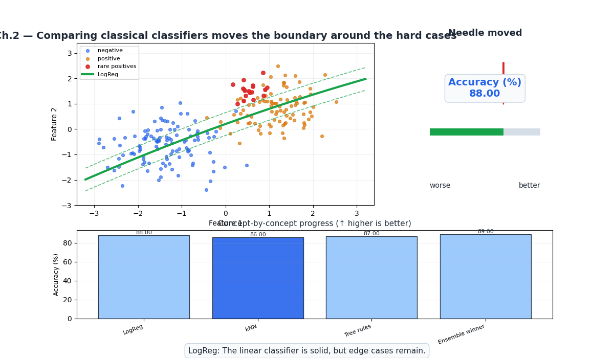
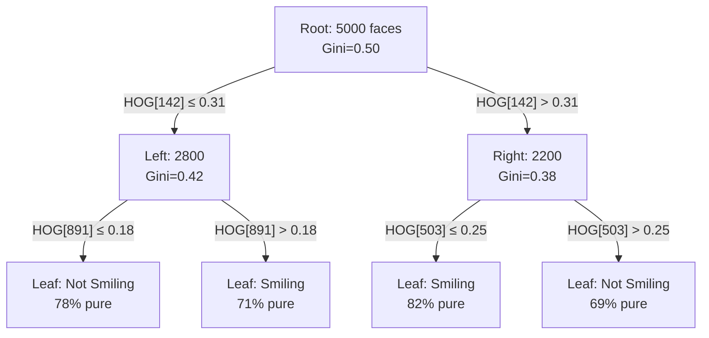
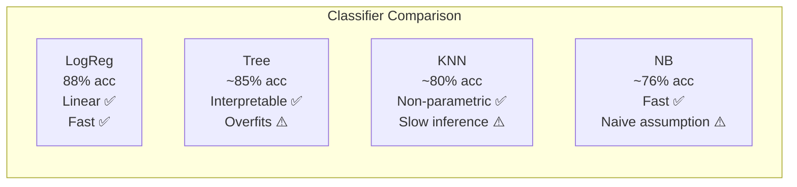
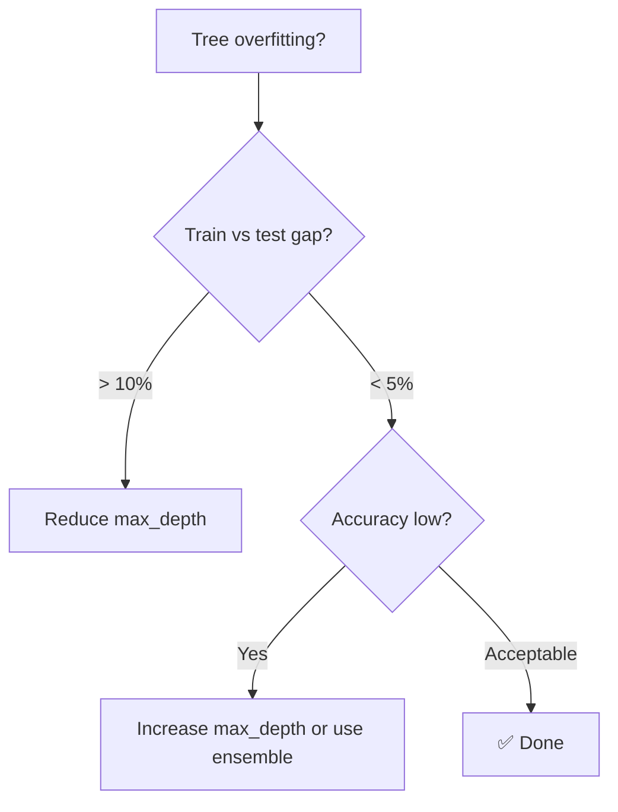
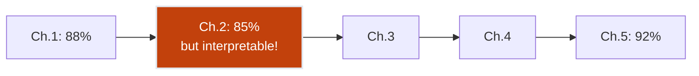

# Ch.2 — Classical Classifiers

> **The story.** **Decision trees** trace back to **Morgan & Sonquist (1963)** who developed AID (Automatic Interaction Detection) for survey analysis, but the modern CART algorithm came from **Leo Breiman** in 1984. **K-Nearest Neighbours** is even older — **Evelyn Fix and Joseph Hodges** proposed it in 1951 as a non-parametric density estimation method. **Naive Bayes** dates to the 1950s but gained fame when **Sahami et al. (1998)** showed it could compete with sophisticated models for text classification, despite its "naive" independence assumption. These three families — tree-based, instance-based, and probabilistic — remain the classical workhorses of ML classification.
>
> **Where you are.** Ch.1 gave FaceAI a linear baseline (logistic regression, ~88% on Smiling). But linearity is a strong assumption — can non-linear classifiers do better? More importantly, can they give **interpretable rules** that explain *why* a face is classified as Smiling? Decision trees answer "yes" by learning explicit if-then rules on features.
>
> **Notation.** $G(t)$ — Gini impurity at node $t$; $p_k$ — proportion of class $k$ at a node; $d(\mathbf{x}, \mathbf{x}')$ — distance between feature vectors; $P(C|\mathbf{x})$ — posterior probability of class $C$; $k$ — number of neighbours in KNN.

---

## 0 · The Challenge — Where We Are

> 💡 **FaceAI Mission**: >90% accuracy across 40 facial attributes
>
> | # | Constraint | Ch.1 Status | This Chapter |
> |---|-----------|-------------|-------------|
> | 1 | ACCURACY | 88% (Smiling) | Can trees/KNN beat 88%? |
> | 2 | GENERALIZATION | Train/test split | Same |
> | 3 | MULTI-LABEL | Binary only | Still binary |
> | 4 | INTERPRETABILITY | ❌ | ✅ Tree rules! |
> | 5 | PRODUCTION | ✅ <1ms | Varies by model |

**What's blocking us:**
Logistic regression is linear — it can't capture curved decision boundaries. And its weights aren't human-readable ("weight 0.034 on HOG feature #847" means nothing to a product manager).

**What this chapter unlocks:**
- **Decision Trees**: Interpretable rules ("if HOG gradient at mouth > 0.3 → Smiling")
- **KNN**: Non-parametric, captures local structure in feature space
- **Naive Bayes**: Fast probabilistic baseline, handles high-dimensional data
- ✅ **Constraint #4 PARTIAL** — Tree rules provide interpretability



---

## Animation



## 1 · Core Idea

Three classical approaches, three different assumptions:
- **Decision Tree**: Recursively split feature space with axis-aligned cuts. Each leaf = a class. Interpretable but prone to overfitting.
- **KNN**: No training — classify by majority vote of $k$ nearest neighbours in feature space. Non-parametric but slow at inference.
- **Naive Bayes**: Apply Bayes' theorem assuming features are independent given the class. Fast and surprisingly effective despite the naive assumption.

---

## 2 · Running Example

Same FaceAI setup as Ch.1: 5,000 CelebA images, 64×64 grayscale, HOG features (1,764 dims), predicting **Smiling**.

We'll train all three classifiers and compare accuracy, interpretability, and inference speed. Decision trees will give us the first "explainable" FaceAI model.

---

## 3 · Math

### Decision Tree — Gini Impurity

$$G(t) = 1 - \sum_{k=1}^{K} p_k^2$$

For binary Smiling: if a node has 60% Smiling, 40% Not-Smiling:

$$G = 1 - (0.6^2 + 0.4^2) = 1 - (0.36 + 0.16) = 0.48$$

Pure node (100% one class): $G = 0$. Maximum impurity (50/50): $G = 0.5$.

**Split criterion**: Choose the feature and threshold that maximise the weighted Gini reduction:

$$\Delta G = G(\text{parent}) - \frac{N_L}{N}G(\text{left}) - \frac{N_R}{N}G(\text{right})$$

**Numeric example — splitting 10 faces on HOG feature threshold:**

- **Parent** (10 faces: 5 Smiling, 5 Not): $G = 1-(0.5^2+0.5^2) = 0.50$
- After split:
  - **Left child** (6 faces: 6 Smiling, 0 Not): $G_L = 1-(1^2+0^2) = 0.00$ (pure!)
  - **Right child** (4 faces: 0 Smiling, 4 Not): $G_R = 1-(0^2+1^2) = 0.00$ (pure!)

$$\Delta G = 0.50 - \frac{6}{10}(0.00) - \frac{4}{10}(0.00) = 0.50$$

A split that perfectly separates classes yields $\Delta G = 0.50$ (maximum gain). In practice splits are imperfect — the tree greedily picks the feature/threshold with the largest $\Delta G$ at each node.

### KNN — Distance and Vote

$$\hat{y} = \text{mode}\big\{y_j : j \in \text{k-nearest}(\mathbf{x})\big\}, \quad d(\mathbf{x}, \mathbf{x}') = \sqrt{\sum_i (x_i - x'_i)^2}$$

With $k=5$ and a test face: if 3 nearest neighbours are Smiling, 2 are Not → predict Smiling.

### Naive Bayes — Posterior

$$P(C|\mathbf{x}) = \frac{P(\mathbf{x}|C) \cdot P(C)}{P(\mathbf{x})} \propto P(C) \prod_{j=1}^{d} P(x_j|C)$$

The "naive" independence assumption: $P(x_1, x_2, ..., x_d | C) = \prod_j P(x_j|C)$. For images this is clearly wrong (adjacent pixels are correlated), but the model still works reasonably.

---

## 4 · Step by Step

```
ALGORITHM: Decision Tree for Smiling Detection
───────────────────────────────────────────────
Input:  X_train (HOG features), y_train (Smiling)

1. Start with all training data in root node
2. For each node:
   a. If pure (all same class) → make leaf
   b. For each feature j and threshold t:
      - Split data: left = {x: x_j ≤ t}, right = {x: x_j > t}
      - Compute ΔG (Gini reduction)
   c. Pick (j*, t*) with maximum ΔG
   d. Create left/right children, recurse
3. Stop when max_depth reached or min_samples_leaf
4. Predict: traverse tree, return leaf class
```

---

## 5 · Key Diagrams





---

## 6 · Hyperparameter Dial

| Parameter | Too Low | Sweet Spot | Too High |
|-----------|---------|------------|----------|
| **max_depth** (Tree) | Underfits (depth 2: ~72%) | 5–15 (accuracy ~82%) | Overfits (depth 50: memorises faces) |
| **min_samples_leaf** (Tree) | 1 = overfits to individual faces | 5–20 | 100+ = underfits |
| **k** (KNN) | k=1: noisy, overfits | k=5–15: smooth boundary | k=500: everything is majority class |
| **var_smoothing** (NB) | Zero probabilities crash | 1e-9 (default) | Over-smooths distinctions |

---

## 7 · Code Skeleton

```python
from sklearn.tree import DecisionTreeClassifier, export_text
from sklearn.neighbors import KNeighborsClassifier
from sklearn.naive_bayes import GaussianNB
from sklearn.metrics import classification_report

# ── Decision Tree ──────────────────────────────────────
tree = DecisionTreeClassifier(max_depth=10, min_samples_leaf=10, random_state=42)
tree.fit(X_train, y_train)
print(export_text(tree, max_depth=3))  # readable rules!
print(f"Tree accuracy: {tree.score(X_test, y_test):.3f}")

# ── KNN ────────────────────────────────────────────────
knn = KNeighborsClassifier(n_neighbors=7)
knn.fit(X_train, y_train)
print(f"KNN accuracy: {knn.score(X_test, y_test):.3f}")

# ── Naive Bayes ────────────────────────────────────────
nb = GaussianNB()
nb.fit(X_train, y_train)
print(f"NB accuracy: {nb.score(X_test, y_test):.3f}")

# ── Compare All ───────────────────────────────────────
for name, model in [("Tree", tree), ("KNN", knn), ("NB", nb)]:
    print(f"\n{name}:")
    print(classification_report(y_test, model.predict(X_test)))
```

---

## 8 · What Can Go Wrong

| Mistake | Symptom | Fix |
|---------|---------|-----|
| Unlimited tree depth | 100% train accuracy, ~75% test (overfit) | Set `max_depth=10`, `min_samples_leaf=10` |
| KNN without scaling | Distance dominated by high-magnitude features | `StandardScaler` before KNN |
| KNN with high-dim data | "Curse of dimensionality" — all distances similar | PCA to 50–100 dims before KNN |
| NB on correlated pixels | Independence assumption badly violated | Use on HOG features (less correlated) or try tree/logistic |
| Comparing accuracy only | Tree wins on train but loses on test | Always evaluate on held-out test set |
| Trusting accuracy on imbalanced attributes | 97.5% on Bald by predicting "Not Bald" always — looks fine, is useless | ⚠️ Revisited in Ch.3 — use F1 and PR-AUC for rare attributes like Bald and Mustache |



---

## 9 · Where This Reappears

| Concept | Reappears in | How |
|---------|-------------|-----|
| **Decision trees (CART)** | [Topic 08 — Ensemble Methods](../../08-EnsembleMethods/README.md) | Random Forest and XGBoost both build ensembles of CART decision trees |
| **KNN** | [Topic 04 — Recommender Systems](../../04-RecommenderSystems/README.md) | User-based collaborative filtering is conceptually KNN in user-preference space |
| **Gini impurity** | [Topic 08 — Ensemble Methods](../../08-EnsembleMethods/README.md) | Every split in a Random Forest or Gradient Boosted tree uses Gini or entropy |
| **Naive Bayes as baseline** | [Topic 05 — Anomaly Detection](../../05-AnomalyDetection/README.md) | Fast probabilistic baselines are used to benchmark novelty detectors |

---

## 10 · Progress Check

| # | Constraint | Target | Status | Evidence |
|---|-----------|--------|--------|----------|
| 1 | ACCURACY | >90% | 🟡 ~85% (best tree) | Best tree ~85% (default depth=10: ~82%), KNN ~80%, NB ~76%, LogReg still best at 88% |
| 2 | GENERALIZATION | Unseen faces | 🟡 | Train/test split, overfit risk with trees |
| 3 | MULTI-LABEL | 40 attributes | ❌ | Binary only |
| 4 | INTERPRETABILITY | Feature importance | 🟢 | Tree rules are human-readable! |
| 5 | PRODUCTION | <200ms | 🟡 | Tree <1ms, KNN slow (~50ms for 5k training points) |



---

## 11 · Bridge to Next Chapter

Classical classifiers gave us interpretable rules but didn't beat logistic regression on accuracy. More importantly, we've been evaluating with **accuracy** alone — and that's dangerous. If we try to classify **Bald** (only 2.5% positive), a model predicting "Not Bald" for everyone gets 97.5% accuracy!

**Ch.3** tackles **evaluation metrics** properly: precision, recall, F1, ROC-AUC, and multi-label metrics. We'll discover that our 88% "Smiling accuracy" hides important trade-offs in precision vs recall.

---

## Appendix A · Real CelebA Data Pipeline (No Proxy Data)

The examples in this chapter are intended to run on real CelebA attributes. Use this setup to avoid synthetic placeholders.

### Data Access Options

1. Kaggle mirror: `jessicali9530/celeba-dataset`.
2. Official CelebA source: download aligned images + `list_attr_celeba.txt`.

### Minimal Setup Steps

1. Create folders:
   - `data/celeba/img_align_celeba/`
   - `data/celeba/metadata/`
2. Place attribute file at:
   - `data/celeba/metadata/list_attr_celeba.txt`
3. Keep image filenames unchanged (`000001.jpg`, ...).
4. Start with a 20k-50k image subset for local runs.

### Loader Contract

- Input image size: 64x64 (or 128x128 for stronger baselines).
- Labels: map CelebA values from `{-1, +1}` to `{0, 1}`.
- Split: use official train/val/test partitions to avoid leakage.
- Reproducibility: set random seed and persist sampled subset IDs.

### Practical Notes

- Multi-label tasks should keep one binary head per attribute.
- For rare attributes (Bald, Mustache, Wearing_Hat), prefer macro-F1 and per-label PR-AUC.
- Persist preprocessing artifacts (scaler/PCA/HOG settings) with the model.

### Quick Loader Snippet

```python
from pathlib import Path
import pandas as pd

attr_path = Path('data/celeba/metadata/list_attr_celeba.txt')
attr = pd.read_csv(attr_path, delim_whitespace=True, skiprows=1)
attr = (attr + 1) // 2   # {-1,+1} -> {0,1}

# Example target
y_smiling = attr['Smiling'].astype(int)
```


